.. _API:

##################
eXo Platform APIs
##################

    This chapter includes introduction to eXo Platform APIs overall, and
    tutorials that help you get familiar with some APIs in particular.

    -  :ref:`Definitions of API Levels <PLFDevGuide.eXoPlatformAPIs.DefinitionsOfAPILevels>`
       Information on APIs' level.

    -  :ref:`Platform API <PLFDevGuide.eXoPlatformAPIs.PlatformAPIs>`
       A list of APIs at Platform level:

       -  :ref:`Java API <PLFDevGuide.eXoPlatformAPIs.PlatformAPIs.JavaAPIs>`

       -  :ref:`REST API <PLFDevGuide.eXoPlatformAPIs.PlatformAPIs.RESTAPIs>`

       -  :ref:`JavaScript API <PLFDevGuide.eXoPlatformAPIs.PlatformAPIs.JavaScriptAPIs>`

       -  :ref:`Web Services <PLFDevGuide.eXoPlatformAPIs.PlatformAPIs.WebServices>`

    -  :ref:`Provisional API <PLFDevGuide.eXoPlatformAPIs.ProvisionalAPIs>`
       A list of API at Provisional level.

    -  :ref:`Working with eXo REST APIs <PLFDevGuide.eXoPlatformAPIs.RestAPIs>`
       Tutorials that help you develop your eXo REST client in
       Java/JavaScript.

    -  :ref:`Portal API <PLFDevGuide.eXoPlatformAPIs.PortalApi>`
       Tutorials helping you to retrieving, creating and deleting Portal
       Sites and Portal Pages.
       
.. _PLFDevGuide.eXoPlatformAPIs.DefinitionsOfAPILevels:

=========================
Definitions of API Levels
=========================

APIs vary according to the maturity level. It is important to understand
the eXo Platform's general approach to the API change management. The
different levels of API are described in the following table:

+------------------------+--------------+-------------+-----------------+---------------+--------------------------+------------------------+
| API Level              | Test Suite   | Clients     | Documentation   | Support       | Compatibility X.Y.Z(1)   | Compatibility X.Y(1)   |
+========================+==============+=============+=================+===============+==========================+========================+
| **Platform API**       | |image22|    | |image23|   | |image24|       | |image25|     | |image26|                | |image27|              |
+------------------------+--------------+-------------+-----------------+---------------+--------------------------+------------------------+
| **Provisional API**    | |image28|    | |image29|   | |image30|       | |image31|     | |image32|                | |image33|              |
+------------------------+--------------+-------------+-----------------+---------------+--------------------------+------------------------+
| **Experimental API**   | |image34|    | |image35|   | |image36|       | Best effort   | Best effort              | |image37|              |
+------------------------+--------------+-------------+-----------------+---------------+--------------------------+------------------------+
| **Unsupported API**    | |image38|    | |image39|   | |image40|       | |image41|     | |image42|                | |image43|              |
+------------------------+--------------+-------------+-----------------+---------------+--------------------------+------------------------+

**Test Suite**: A suite of tests that can be run against the API to
detect changes.

**Clients**: The API has been used successfully by at least 2 different
teams, using the API Documentation only.

**Documentation**: The API has a clean JavaDoc and reference
documentation.

**Support**: The eXo Support team provides help on the code that uses
this API, and fixes any reported bugs.

**Compatibility X.Y.Z(1)**: The compatibility between maintenance
versions (X.Y.Z and X.Y.Z1) is guaranteed. If there is any change
between X.Y and X.Y1, the eXo Support team will help by upgrading the
code.

**Compatibility X.Y(1)**: The compatibility between minor versions (X.Y
and X.Y1) is guaranteed. If there is any change between X and X1, the
eXo Support team will help by upgrading the code.

**Best Effort**: You will receive assistance, but eXo Platform cannot
guarantee any specific result.

**Use Provisional or Experimental API**

These APIs are provided to give an "early look" at which will be
available in upcoming versions of eXo Platform. These APIs are not final, but
they can be used to start developing your application.

**Provisional API** are APIs close to being frozen, but that need a last
look from users. They can be used by third-party developers for their
own apps, with the knowledge that only a limited compatibility guarantee
is offered.

**Experimental API** are APIs that are likely to change. They are
published to get feedback from the community. These API have been tested
successfully, but have not yet had enough feedback from developers.       

.. _PLFDevGuide.eXoPlatformAPIs.PlatformAPIs:

============
Platform API
============

This section summarizes a list of eXo Platform API which can be 
categorized into:

**Java API**

A Java API documentation is now available in a Javadoc format and
regularly updated to provide developers with in-depth information about
new features in eXo Platform.

See `Java API Documentation 5.1 <https://docs.exoplatform.org/PLF50/java-api/>`__ 
for more details.

**REST API**

eXo Platform provides REST APIs and resources to developers who want to
integrate eXo services into their applications.

See `REST API Documentation 5.0 <../../../PLF50/rest-api>`__ for more
details.

**JavaScript API**

-  **`OpenSocial 2.5.1 Gadget
   Specification: <http://opensocial.github.io/spec/2.5.1/Social-Gadget.xml>`__**
   A standard that defines how to write gadgets and provide APIs.
   Gadgets are particularly useful for integrating external applications
   into eXo Platform.

**Web Services**

-  **`CMIS: <#eXoAddonsGuide.CMIS>`__** A standard API that gives access
   to the content repository via REST and SOAP Web services.

-  **`FTP: <../../../reference/html/JCR.FTP.html>`__** A standard
   protocol for exchanging documents.

-  **`OpenSocial 2.5.1 REST
   Protocol: <http://opensocial.github.io/spec/2.5.1/Social-API-Server.xml>`__**
   A standard API for accessing the social graph and activity streams.

-  **`WebDAV: <../../../reference/html/JCR.WebDAV.html>`__** A standard
   protocol for exchanging document over HTTP.

.. _PLFDevGuide.eXoPlatformAPIs.ProvisionalAPIs:

===============
Provisional API
===============

**Java API**

-  :ref:`UI Extensions: <#PLFRefGuide.PLFDevelopment.Extensions.UIExtensions>` An API to plug new UI component to eXo applications.

-  :ref:`UI Extension in Social <PLFDevGuide.DevelopingApplications.ExtendingeXoApplications.ApplicationPlugins.ActivityType>`

-  :ref:`UI Extension in Content <PLFDevGuide.DevelopingApplications.ExtendingeXoApplications.ApplicationPlugins.ContentUIExtension>`

-  :ref:`UI Extension in Wiki <PLFDevGuide.DevelopingApplications.ExtendingeXoApplications.ApplicationPlugins.WikiAction>`

.. _PLFDevGuide.eXoPlatformAPIs.RestAPIs:

==========================
Working with eXo REST APIs
==========================

**New REST APIs introduced in Platform 4.x**

This part of the Developer guide introduced two REST APIs. These "v1"
APIs are at Experimental level.

-  ``/v1/calendar`` allows developers to work with eXo Calendar, is
   available as of 4.2.

-  ``/v1/social`` allows developers to work with eXo Social, in other
   words, with user profile, connection, activity and space objects. It
   is new in 4.4.

**Base URL and Rest context**

Here is an example of the full URL:
*http://localhost:8080/rest/private/v1/social/users*.

-  You should use the URL ``/rest/private`` to access the APIs.

While you can also use ``/portal/rest``, notice the ``/rest`` context is
designed for secure accesses to the Rest services, so it is recommended.
You can omit ``/private`` for an anonymous access, however almost all
methods of the two APIs require authentication.

    **Note**

    The paths are case-sensitive. For example, use
    ``/v1/social/usersRelationships``, don't use
    ``/v1/social/usersrelationships``.

**Useful resources and tools**

If you want to start from learning concepts of REST framework, you
should read the Java (Oracle) documentation:

-  https://docs.oracle.com/javaee/7/tutorial/jaxrs.htm#GIEPU

If you want to test the two APIs simply, a good way is using a web
browser with plugins for Rest and JSON. For example with Chrome, you can
install *Advanced Rest Client* and *JSON Formatter* extensions.

The following tutorials help you develop your eXo REST client in Java
and JavaScript. The sample projects can be found at
`GitHub <https://github.com/exo-samples/docs-samples/tree/4.3.x/rest-api>`__.

-  :ref:`Authentication <PLFDevGuide.eXoPlatformAPIs.RestAPIs.Authentication>`

-  :ref:`Calendar REST API <PLFDevGuide.eXoPlatformAPIs.RestAPIs.Calendar>`

-  :ref:`Social REST API <PLFDevGuide.eXoPlatformAPIs.RestAPIs.Social>`

.. _PLFDevGuide.eXoPlatformAPIs.RestAPIs.Authentication:

Authentication
~~~~~~~~~~~~~~~

Almost all the Rest operations (methods) require authentication. An
authenticated user is used to check the access permission to the
requested resource, but not only for that. For example, a POST to
*/rest/private/v1/social/spaces* will create a space and *set the
authenticated user as the space manager*.

At server side, within the method's code, the authenticated user Id is
typically got via ``ConversationState``:

.. code:: java

    String currentUserId = ConversationState.getCurrent().getIdentity().getUserId();

From the client, you can use Basic Authentication to have a user
authenticated.

If the user is requesting a resource via your gadget, or just by hitting
the URL in a browser, using ``/rest/private`` is the way to make sure
he/she gets prompted to enter username and password, rather than getting
an Unauthorized error.

Via a tool like curl, you can use -u option:
``curl -X GET -uroot:gtn http://localhost:8080/rest/private/v1/calendar``.

If you are developing a Java application using URLConnection, basically
you have to add "Authorization" header to every request:

.. code:: java

    URL url = new URL("http://localhost:8080/rest/private/v1/calendar/calendars");
    String auth = new sun.misc.BASE64Encoder().encode("root:gtn".getBytes());
    HttpURLConnection connection = (HttpURLConnection) url.openConnection();
    connection.setRequestMethod("GET");
    connection.setRequestProperty("Authorization", "Basic " + auth);
    connection.connect();

In the Java examples of these tutorials, the application is a standalone
that serves a single user at once. In this case, the procedure above can
be automatically done by setting a default Authenticator:

.. code:: java

    import java.net.Authenticator;
    import java.net.PasswordAuthentication;
    //...
    @SuppressWarnings("restriction")
      public static void login(String username, String password) {
        final String username_ = username;
        final String password_ = password;
        Authenticator.setDefault(new Authenticator() {
          @Override
          public PasswordAuthentication getPasswordAuthentication() {
            return new PasswordAuthentication(username_, password_.toCharArray());
          }
        });
      }

Notice with this method, the first signed username is cached (during the
live time of the JVM) and will not be unset by calling login() with
another user. So if you want to switch to another user, you need to
clear the ``AuthCache`` first:

.. code:: java

    sun.net.www.protocol.http.AuthCacheValue.setAuthCache(new sun.net.www.protocol.http.AuthCacheImpl());

.. _PLFDevGuide.eXoPlatformAPIs.RestAPIs.Calendar:

Calendar Rest API
~~~~~~~~~~~~~~~~~

.. note:: The /v1/calendar Rest API, available as of Platform 4.2, is considered Experimental. It is the new substitute of the deprecated /cs/calendar Rest API.

The Calendar Rest API meets the common requirements of new eXo Platform
Rest services. Here are some tips that help you quickly get familiar
with the service:

-  **CRUD operations**: There are four *verbs* used for CRUD operations:
   GET for Read, POST for Create, PUT for Update, and DELETE.

   All methods consistently use JSON to transfer data in
   requests/reponses.

-  **Query limit**: A GET method can query a single item or a
   collection. In case of collection, there is a query limit on the
   server side that limits the number of items returned. This is
   :ref:`configurable <PLFDevGuide.eXoPlatformAPIs.RestAPIs.Calendar.Configuration>`
   for effective performance.

   To get the entire collection or implement some kinds of paging in
   your client, you rely on the three parameters: ``returnSize``,
   ``limit`` and ``offset``.

-  Queries for Events, Tasks and Occurrences always have finite time
   parameters. By default the time range is one week from the current
   server time.

In the next tutorials, you will learn the access permission and
Java/JavaScript code samples to use the API:

-  :ref:`Authorization <PLFDevGuide.eXoPlatformAPIs.RestAPIs.Calendar.Authorization>`

-  :ref:`Java client samples <PLFDevGuide.eXoPlatformAPIs.RestAPIs.Calendar.Java>`

-  :ref:`JavaScript client samples <PLFDevGuide.eXoPlatformAPIs.RestAPIs.Calendar.JavaScript>`

-  :ref:`Service configuration <PLFDevGuide.eXoPlatformAPIs.RestAPIs.Calendar.Configuration>`

.. _PLFDevGuide.eXoPlatformAPIs.RestAPIs.Calendar.Authorization:

Authorization
--------------

All the methods of the API require an authenticated user, and will
access the resources on behalf of that user.

While a permission can be the ownership or read or write, generally a
user can have permissions to the following resources:

-  *Calendars*: His personal calendars, calendars of the groups that he
   belongs (for example, space calendar), and calendars that are shared
   to him and his groups.

-  *Events/Tasks*: When the user has access to a calendar, he has access
   to its events and tasks. He also has access to an event or task if he
   is a participant or delegatee.

-  *Occurrences*: When the user has access to a (recurring) event, he
   can read its occurrences. The API does not support the way to edit
   individual occurrences.

-  *Invitations*: When the user has access to an event, he has access to
   its invitations.

-  *Attachments*: When the user has access to an event or task, he has
   access to its attachments.

-  *Categories*: Any user has write access to his personal categories
   and read access to common categories.

-  *Feeds*: Feeds are always personal, so any user has access only to
   the feeds created by him.

.. _PLFDevGuide.eXoPlatformAPIs.RestAPIs.Calendar.Java:

Java client samples
---------------------

The source of this sample can be found at `eXo Docs-samples
Repository <https://github.com/exo-samples/docs-samples/tree/4.3.x/rest-calendar-java-client>`__.

The project implements an eXo Calendar Rest Connector that supports some
main CRUD operations for demo, that you can read over the
``ExoCalendarConnectorInterface.java``:

.. code:: java

    public interface ExoCalendarConnectorInterface {
      
      // Calendar : GET, GET, POST, PUT, DELETE.
      public ExoCalendarCollection getCalendars() throws Exception;  
      public ExoCalendar getCalendarById(String calendar_id) throws Exception;  
      public String createCalendar(ExoCalendar calendar) throws Exception;  
      public int updateCalendar(ExoCalendar calendar, String calendar_id) throws Exception;  
      public int deleteCalendar(String calendar_id) throws Exception;  
      
      // Event : GET, GET, POST, PUT, DELETE.
      public ExoEventCollection getEventsByCalendarId(String calendar_id) throws Exception;  
      public ExoEvent getEventById(String event_id) throws Exception;  
      public String createEvent(ExoEvent event, String calendar_id) throws Exception;  
      public int updateEvent(ExoEvent event, String event_id) throws Exception;
      public int deleteEvent(String event_id) throws Exception;
      
      // Task : GET, GET, POST, PUT, DELETE.
      public ExoTaskCollection getTasksByCalendarId(String calendar_id) throws Exception;
      public ExoTask getTaskById(String task_id) throws Exception;
      public String createTask(ExoTask task, String calendar_id) throws Exception;
      public int updateTask(ExoTask task, String task_id) throws Exception;
      public int deleteTask(String task_id) throws Exception;
      
      // Attachment (of event) : GET, GET, POST, DELETE.
      public AttachmentCollection getAttachmentsByEventId(String event_id) throws Exception;
      public Attachment getAttachmentById(String attachment_id) throws Exception;
      public String createAttachment(List<Path> paths, String event_id) throws Exception;
      public int deleteAttachment(String event_id) throws Exception;
      
      // Invitation : GET, GET, POST, PUT, DELETE.
      public InvitationCollection getInvitationsByEventId(String event_id) throws Exception;
      public Invitation getInvitationById(String invitation_id) throws Exception;
      public String createInvitation(Invitation invitation, String event_id) throws Exception;
      public int updateInvitation(Invitation invitation, String invitation_id) throws Exception;
      public int deleteInvitation(String invitation_id) throws Exception;
    }

The overview of the project:

-  ``ExoCalendarConnector.java`` (the Connector) implements the above
   functions. It also provides a static Gson object.

-  ``org.exoplatform.calendar.client.model.*`` provides POJO classes
   that represent JSON request/response data. The models will be used by
   Gson that helps you parse JSON data effectively.

-  ``org.exoplatform.calendar.client.rest.connector.HttpUtils`` provides
   Http Verbs, so the Connector does not need to care about setting up a
   Http client and sending requests.

**JSON Parsing**

You can use
`Gson <https://sites.google.com/site/gson/gson-user-guide>`__,
`Jackson <http://wiki.fasterxml.com/JacksonDocumentation>`__ or
alternate libraries to parse JSON to Java object and vice versa.

Gson is used in this sample. Its dependency is:

.. code:: xml

    <dependency>
        <groupId>com.google.code.gson</groupId>
        <artifactId>gson</artifactId>
        <version>2.3.1</version>
    </dependency>

You should write POJO classes for every object you want to work with.
See the classes in ``org.exoplatform.calendar.client.model`` package.
The following is the ExoCalendar POJO:

.. code:: java

    package org.exoplatform.calendar.client.model;
    public class ExoCalendar {
      
      String editPermission;
      String viewPermission;
      String privateURL;
      String publicURL;
      String icsURL;
      String color;
      String name;
      String type;
      String owner;
      String timeZone;
      String description;
      String[] groups;
      String href;
      String id;
        
        // Getters and setters.
        // ...
    }

To serialize the object to a JSON string, or deserialize:

.. code:: java

    Gson gson = new Gson();
    // serialize object to JSON
    String json = gson.toJson(calendar_object);
    // parse JSON to an object
    ExoCalendar new_calendar_object = gson.fromJson(json, ExoCalendar.class);

The JSON string that is returned from a single calendar query:

::

    {
    "editPermission": "",
    "viewPermission": "",
    "privateURL": null,
    "publicURL": null,
    "icsURL": "http://localhost:8080/rest/private/v1/calendar/calendars/john-defaultCalendarId/ics",
    "description": null,
    "color": "asparagus",
    "timeZone": "Europe/Brussels",
    "groups": null,
    "name": "John Smith",
    "type": "0",
    "owner": "john",
    "href": "http://localhost:8080/rest/private/v1/calendar/calendars/john-defaultCalendarId",
    "id": "john-defaultCalendarId"
    }

A collection query JSON always looks like this:

::

    {
    "limit": 10,
    "data": [
        {calendar1},
        {calendar2}
    ],
    "size": -1,
    "offset": 0
    }

The POJO for collection:

.. code:: java

    public class ExoCalendarCollection {
      
      int limit;
      int size;
      int offset;
      ExoCalendar[] data;
        
        // Getters and setters.
        // ...
    }

**ISO8601 DateTime format**

Some key fields require a correct DateFormat to parse/format:

-  To query events/tasks of a certain time, you need to send a couple of
   start and end time strings in ISO8601 format.

-  The fields "from" and "to" in Event/Task JSON are ISO8601 too.

In Java 7, you can use ``SimpleDateFormat`` with the following pattern
to parse/format those fields:

.. code:: java

    DateFormat df = new SimpleDateFormat("yyyy-MM-dd'T'HH:mm:ss.SSSXXX");
    Date date1 = new Date();
    //format
    String s = df.format(date1);
    //parse
    Date date2 = df.parse(s);

However, the pattern may not work in other Platforms. Another approach
is to re-use eXo's ISO8601 class. It is potentially helpful when you
need to parse 'Z' timezone.

The source is
`here <https://github.com/exoplatform/kernel/blob/master/exo.kernel.commons/src/main/java/org/exoplatform/commons/utils/ISO8601.java>`__.
You can use the following Maven dependency:

.. code:: xml

    <dependency>
        <groupId>org.exoplatform.kernel</groupId>
        <artifactId>exo.kernel.commons</artifactId>
    </dependency>

The code sample of using this util:

.. code:: java

    import org.exoplatform.commons.utils.ISO8601;
    //
    String s1 = "2015-01-15T05:00:000Z";
    Calendar cal = ISO8601.parse(s1);
    System.out.println(cal.getTime());

    String s2 = ISO8601.format(cal);
    System.out.println(s2);

**Using HttpURLConnection for CRUD requests**

You need a Http Client to send requests to the Rest service. In the
sample, ``java.net.HttpURLConnection`` is used.

Here is the code for sending a GET. The result string then can be
converted to a Calendar or Event or some object accordingly.

.. code:: java

    import java.net.HttpURLConnection;
    import java.net.URL;
    import java.io.BufferedReader;
    import java.io.InputStream;
    import java.io.InputStreamReader;
      // GET
      public static String get(String url) throws Exception {
        HttpURLConnection connection = (HttpURLConnection) (new URL(url)).openConnection();
        connection.setRequestMethod("GET");
        connection.connect();
        
        int code = connection.getResponseCode();
        if (code > 300) {
          connection.disconnect();
          return null;
        }
        InputStream in = connection.getInputStream();
        BufferedReader reader = new BufferedReader(new InputStreamReader(in));
        String line = null;
        StringBuilder builder = new StringBuilder();
        while ((line = reader.readLine()) != null) {
          builder.append(line).append("\n");
        }
        in.close();
        reader.close();
        connection.disconnect();
        return builder.toString();
      }

For a POST request, pay attention to set the request method and the
content-type:

.. code:: java

    import java.io.DataOutputStream;

      // POST
      public static String post(String json, String url) throws Exception {
        HttpURLConnection connection = (HttpURLConnection) (new URL(url)).openConnection();
        connection.setRequestMethod("POST");
        connection.setDoOutput(true);
        connection.setUseCaches(false);
        connection.setRequestProperty("Content-Type", "application/JSON");
        
        // Write to the connection output stream.
        DataOutputStream out = new DataOutputStream(connection.getOutputStream());
        out.writeBytes(json);
        
        int code = connection.getResponseCode();
        if (code > 300) {
          out.flush();
          out.close();
          connection.disconnect();
          return null;
        }
        String href = connection.getHeaderField("Location");
        out.flush();
        out.close();
        connection.disconnect();
        return href;
      }

Here you see value of the (response) header "Location" is returned. All
the Create operations should return this on success. For example when
you create an Event, the event's href (a URL to continue to get the
created event) is returned.

See PUT and DELETE code in ``HttpUtils.java``.

**CRUD Examples**

With the POJO models, CRUD operations are very similar between kinds of
objects. Hereunder is a code sample to do a chain of tasks:

::

    - create a calendar
    - create an event
    - update the event
    - delete the event
    - delete the calendar

.. code:: java

     ExoCalendarConnector connector = new ExoCalendarConnector("http://localhost:8080");

    String created = Long.toString(System.currentTimeMillis());

    // Create calendar.
    ExoCalendar calendar = new ExoCalendar();
    calendar.setType("0");
    calendar.setName(created);
    connector.createCalendar(calendar);

    // Get the list of calendars and search for one.
    String calendar_id = null;
    ExoCalendar[] calendars = connector.getCalendars().getData();
    int len = calendars.length;
    for (int i = 0; i < len; i++) {
        if (calendars[i].getName().equals(created)) {
            calendar_id = calendars[i].getId();
        }
    }

    // Create event.
    ExoEvent event = new ExoEvent();
    event.setSubject(created);
    Date from = new Date((new Date()).getTime() + TimeUnit.DAYS.toMillis(1)); //from = tomorrow
    Date to = new Date(from.getTime() + TimeUnit.HOURS.toMillis(4)); //to = from + 4 hours
    event.setFrom((new SimpleDateFormat("yyyy-MM-dd'T'HH:mm:ss.SSSZ")).format(from));
    event.setTo((new SimpleDateFormat("yyyy-MM-dd'T'HH:mm:ss.SSSZ")).format(to));
    String href = connector.createEvent(event, calendar_id);
    System.out.println("Event created, href : " + href);

    // Get the list of events then get an event specified by id.
    ExoEvent[] events = connector.getEventsByCalendarId(calendar_id).getData();
    len = 0; len = events.length; String event_id = null;
    for (int i = 0; i < len; i++) {
        if (events[i].getSubject().equals(created)) {
            event_id = events[i].getId();
        }
    }
    ExoEvent new_event = connector.getEventById(event_id);
    System.out.println("Event found, its from is : " + new_event.getFrom());

    // Update the event.
    new_event.setDescription(created);
    System.out.println("Update event, response code : " + connector.updateEvent(new_event, event_id));

    // Delete the event.
    System.out.println("Delete event, response code : " + connector.deleteEvent(event_id));

    // Delete the calendar.
    System.out.println("Delete calendar, response code : " + connector.deleteCalendar(calendar_id));

**Uploading attachment files**

eXo Rest framework uses Apache upload service, then you need to send
files in multipart/form-data in order to create attachments. The
following code shows how to send a POST with multipart content. The
method accepts a list of java.nio.file.Path, for each Path the file data
is written to a content part with boundary.

.. code:: java

    import java.nio.file.Files;
    import java.nio.file.Path;
    import java.nio.file.Paths;
    import java.util.List;

    import java.io.DataOutputStream;
    import java.net.HttpURLConnection;
    import java.net.URL;

      // UPLOAD
      public static String upload(List<Path> paths, String url) throws Exception {
        // form-data stuffs
        String crlf = "\r\n";
        String twoHyphens = "--";
        String boundary = "*****";
        String attachmentName;
        String attachmentFileName;
        byte[] data;
        
        // set up the connection
        HttpURLConnection connection = (HttpURLConnection) (new URL(url).openConnection());
        connection.setRequestMethod("POST");
        connection.setDoOutput(true);
        connection.setUseCaches(false);
        connection.setRequestProperty("Cache-Control", "nocache");
        connection.setRequestProperty("Connection", "Keep-Alive");
        connection.setRequestProperty("Content-Type", "multipart/form-data; boundary=" + boundary);
        
        // write to connection output stream
        DataOutputStream out = new DataOutputStream(connection.getOutputStream());
        int len = paths.size();
        for (int i = 0; i < len; i++) {
          attachmentFileName = paths.get(i).getFileName().toString();
          attachmentName = attachmentFileName;
          data = Files.readAllBytes(paths.get(i));
          out.writeBytes(twoHyphens + boundary + crlf);
          out.writeBytes("Content-Disposition: form-data;"
                         + "name=\"" + attachmentName + "\";"
                         + "filename=\"" + attachmentFileName + "\"" + crlf);
          out.writeBytes(crlf);
          out.write(data);
          out.writeBytes(crlf);
        }
        out.writeBytes(twoHyphens + boundary + twoHyphens + crlf);
        
        int code = connection.getResponseCode();
        if (code > 300) {
          out.flush();
          out.close();
          connection.disconnect();
          return null;
        }
        String href = connection.getHeaderField("Location");
        out.flush();
        out.close();
        connection.disconnect();
        return href;
      }

.. _PLFDevGuide.eXoPlatformAPIs.RestAPIs.Calendar.JavaScript:      
      
JavaScript client samples
--------------------------

eXo Platform provides a great advance of using REST APIs so that you can use
any web development language to access them. In this section, standard
Ajax GET, PUT, DELETE and POST methods are used. This part instructs you
how to leverage these APIs to work with Calendar objects, including:

-  :ref:`Calendars <PLFDevGuide.eXoPlatformAPIs.RestAPIs.Calendar.JavaScript.Calendar>`

-  :ref:`Events <PLFDevGuide.eXoPlatformAPIs.RestAPIs.Calendar.JavaScript.Event>`

-  :ref:`Tasks <PLFDevGuide.eXoPlatformAPIs.RestAPIs.Calendar.JavaScript.Task>`

-  `Others (attachments, occurrences, invitations, categories and feeds) <PLFDevGuide.eXoPlatformAPIs.RestAPIs.Calendar.JavaScript.Others>`

See `here <../../../PLF50/rest-api/calendar/>`__ for more details of
which Calendar APIs are provided. Note that you can download all the
source code used in this section
`here <https://github.com/exo-samples/docs-samples/tree/master/rest-api/calendar/rest-calendar-javascript-client>`__.

Refer to :ref:`thisguide <PLFDevGuide.DevelopingApplications.DevelopingGadget.CreatingGadget>`
to create a gadget with the following structure:

|image0|

Follow instructions there to set suitable configurations, except the
main body (``CalendarHTTPRequestGadget.xml``) of the gadget which will
be replaced in each part below.

.. _PLFDevGuide.eXoPlatformAPIs.RestAPIs.Calendar.JavaScript.Calendar:

Calendars
``````````

eXo Platform provides APIs to
`create <https://docs.exoplatform.org/PLF50/rest-api/calendar/CalendarRestApi.createCalendar.html>`__,
`update <https://docs.exoplatform.org/PLF50/rest-api/calendar/CalendarRestApi.updateCalendarById.html>`__,
`delete <https://docs.exoplatform.org/PLF50/rest-api/calendar/CalendarRestApi.deleteCalendarById.html>`__
and `get
information <https://docs.exoplatform.org/PLF50/rest-api/calendar/CalendarRestApi.getCalendarById.html>`__
of a calendar.

**Getting information of a calendar**

1. Replace content of the ``CalendarHTTPRequestGadget.xml`` file with 
   this script:

	.. code:: xml

		<?xml version="1.0" encoding="UTF-8" ?>
		<Module>
			<ModulePrefs title="Calendar HTTP Request Gadget">
				<Require feature="opensocial-0.8" />
			</ModulePrefs>
			<Content type="html">
				<![CDATA[
					<!--Including platform css-->
					<link href="/eXoSkin/skin/css/Core.css" rel="stylesheet"></link>
					<link href="/eXoSkin/skin/css/sub-core.css" rel="stylesheet"></link>
					<!--Including JQuery library-->
					<script src="jquery-3.2.1.js"></script>
					<!--Gadget's main body which will be added by HTML DOM Object later-->
					<div id="calendar-show" style="max-width: 800px" class="uiComposer uiGrayLightBox">
							<div class="input-append" style="margin: 20px 30px 20px 30px">
								//control button for getting default calendar of the current logged-in user
								<button id="get_default_cal_btn" onclick="getDefaultCalendar()" class="btn btn-primary" >Get default calendar</button>
								//control button for getting a calendar by id
								<button id="get_calid_btn" onclick="getCalendarById()" class="btn btn-primary">Get calendar by id</button><input type="text" id="calid_txt" placeholder="Enter calendar id...">
							</div>
					</div>
					<!--Start calling js function-->
					<script type="text/javascript">
						//get the current logged-in user via OpenSocial
						var current_user;
						loadViewer();
						function loadViewer() {
						  var req = opensocial.newDataRequest();
						  req.add(req.newFetchPersonRequest(opensocial.IdSpec.PersonId.VIEWER), 'viewer');
						  req.send(onLoadViewer);
						}
						function onLoadViewer(data) {
						  var viewer = data.get('viewer').getData();
						  //get current user
						  current_user = viewer.getId();
						}]]>
			</Content>
		</Module>

2. Deploy this gadget. You will see what is going next.

	|image1|

	This UI offers 2 functions which are: getting the default calendar or
	retrieving other calendars by entering a specified Id.

3. Implement the ``getDefaultCalendar()`` function by adding the 
   following source code to the Javascript paragraph of the gadget:

	.. code:: javascript

		function getDefaultCalendar(){
							//get default calendar of the current logged-in user
							//This function uses AJAX to send GET request to 
							//Calendar REST API GET /rest/private/v1/calendar/calendars/
							$.ajax({
								 type: "GET",
								 url: "/rest/private/v1/calendar/calendars/"+current_user+"-defaultCalendarId",
								 success: function (data, status, jqXHR) {
									  processGetCalendar(data);
								 },
								 error: function (jqXHR, status) {
									 alert("Cannot retrieve data!");
								 }
							});
						}

	
	The above function uses an Ajax GET request. It calls the REST API
	*/rest/private/v1/calendar/calendars/* and passes *\*-defaultCalendarId*
	which is the default calendar's Id of the current logged-in user. If
	successful, the result will then be passed through the
	``processGetCalendar()`` function. This function will be implemented
	later.

4. Consider how to get and pass the entered calendar Id to this REST API
   instead of hard-coding it by adding the source code:

	.. code:: javascript

		function getCalendarById(){
							//get the entered calendar id
							var cal_id=$('#calid_txt').val();
							//This function uses AJAX to send GET request to 
							//Calendar REST API GET /rest/private/v1/calendar/calendars/
							$.ajax({
								 type: "GET",
								 url: "/rest/private/v1/calendar/calendars/"+cal_id,
								 success: function (data, status, jqXHR) {
									//print the result
									  processGetCalendar(data);
								 },
								 error: function (jqXHR, status) {
									 alert("Cannot retrieve data!");
								 }
							});
						}

	This function uses JQuery to get value of the text box for entering
	calendar Id and pass it to ``url`` parameter of this call. Now, it's
	time to process returned results!

	The data returned from a Calendar GET request is under a JSON object.
	Therefore, you could implement the ``processGetCalendar()`` as below:

	.. code:: javascript

		function processGetCalendar(results){
							//clean the old screen
							$("#calendar-result").remove();
							//add calendar object's information
							var obj_content="<div id=\"calendar-result\"><table class=\"uiGrid table table-hover table-striped\"><thead><tr><th>Properties</th><th>Value</th></tr></thead><tbody>";
								//loop through the calendar object's properties
								$.each(results, function(key, value) {
									obj_content+="<tr><td>"+key+"</td><td>"+value+"</td></tr>";
								});
							//add closing tag
							obj_content+="<tr><td><b>Execute functions</b></td><td><button id=\"submit_cal_btn\" onclick=\"updateCalendar()\">Update</button>&nbsp;&nbsp;&nbsp;&nbsp;<button id=\"delete_cal_btn\" onclick=\"deleteCalendar()\">Delete</button></td></tr></tbody></table></div>";
							//print to screen
							$('#calendar-show').append(obj_content);
						}

5. Deploy and test the gadget to see what has been done by clicking Get
   default calendar. You will see the default calendar's information
   displayed:

   |image2|

	To test the Get calendar by id function, move to the next part of
	:ref:`creating a new calendar <PLFDevGuide.eXoPlatformAPIs.RestAPIs.Calendar.JavaScript.CreateCalendar>`.

**Creating a new calendar**

1. Add a control button in front of others like this:

	.. code:: javascript

		...
			//control button for creating a new calendar
			<button id="create_cal_btn" onclick="createCalendar()" class="btn btn-primary">Create a new calendar</button>
			//control button for getting default calendar of the current logged-in user
			<button id="get_default_cal_btn" onclick="getDefaultCalendar()" class="btn btn-primary" >Get default calendar</button>
			//control button for getting a calendar by id
			<button id="get_calid_btn" onclick="getCalendarById()" class="btn btn-primary">Get calendar by id</button><input type="text" id="calid_txt" placeholder="Enter calendar id...">
			...

2. Implement the ``createCalendar()`` function as below:

	.. code:: javascript

		function createCalendar(){
						//clean the old screen
						$("#calendar-result").remove();
						//add a simple calendar input form
						$('#calendar-show').append("<div id=\"calendar-result\"><table class=\"uiGrid table table-hover table-striped\">"+
							"<thead><tr><th>Properties</th><th>Value</th></tr></thead><tbody>"+
							"<tr><td>Name</td><td><input type=\"text\" id=\"cal-name\"></td></tr>"
							+"<tr><td>Type</td><td><select id=\"cal-type\"><option value=\"0\">Personal calendar</option></select></td></tr>"
							+"<tr><td>Description</td><td><textarea id=\"cal-description\"  rows=\"4\" cols=\"50\"></textarea></td></tr>"
							+"<tr><td>Color</td><td><select id=\"cal-color\"><option value=\"red\">Red</option><option value=\"yellow\">Yellow</option></select></td></tr>"
							+"<tr><td><b>Execute functions</b></td><td><button id=\"create_cal_btn\" onclick=\"submitCalendar()\">Submit</button></td></tr>"
							+"</tbody></table></div>");
					}

	This UI allows to create a simple calendar with properties, such as
	name, type, description and color.

3. Create an Ajax POST request to call `this API <https://docs.exoplatform.org/PLF50/rest-api/calendar/>`__
   by implementing the ``submitCalendar()`` as follows:

	.. code:: javascript

		function submitCalendar(){
							//get entered cal_json_obj
							var cal_json_obj={
								"name":$("#cal-name").val(),
								"owner": current_user,
								"type":$("#cal-type").val(),
								"description":$("#cal-description").val(),
								"color":$("#cal-color").val()
								};
							$.ajax({
								url: "/rest/private/v1/calendar/calendars",
								contentType: "application/json",
								data: JSON.stringify(cal_json_obj),
								method: "POST"
								}).done(function (data, status, xhr) {
								   //clean the old screen
								   $("#calendar-result").remove();
								   //get the newly created calendar id
								   var locat=xhr.getResponseHeader('Location');
								   var new_cal = locat.split("calendar/calendars/");
								   $('#calendar-show').append("<div id=\"calendar-result\"><i>Created successfully! Calendar id: "+new_cal[1]+"</i></div>");
								}).fail(function (jqxhr, textStatus, error) {
									alert("fail");
							});
						}

	This script passes the user input as a JSON object to the POST request.
	If successful, the returned result will be the newly created calendar
	Id.

4. Deploy this gadget to see the input form for creating a new calendar,
   and fill in this form like:

   |image3|

5. Click Submit button to execute this function and see the message
   informing that you have successfully created a new calendar. For
   example: "*Created successfully! Calendar id:
   calendard94b0488c0a8043a7f3b0da4a6318abf*\ ".

	To check the new calendar, copy the attached Id in this message and
	paste it to the input text of the Get calendar by id function. You will
	see its information displayed.

	|image4|

**Updating a calendar**

It is assumed that you need to update properties of a calendar, for
instance its name and description. To avoid passing local variables too
many times, you will use a global one called "*current\_cal\_obj*\ "
that points to the processing calendar object.

1. Add a declaration of this variable to the Javascript paragraph of the
   gadget:

	.. code:: javascript

		var current_cal_obj;

	Now, each time you query a calendar, this variable should be updated by
	adding the script:

	.. code:: javascript

		current_cal_obj=results;

	to the *processGetCalendar()* function in :ref:`getting information of a calendar <PLFDevGuide.eXoPlatformAPIs.RestAPIs.Calendar.JavaScript.Calendar.GetCalendar>`.

2. Implement the ``updateCalendar()`` function as follows:

	.. code:: javascript

		function updateCalendar(){
							//clean the old result
							$("#calendar-result").remove();
							//add new calendar object's information
							var obj_content="<div id=\"calendar-result\"><table class=\"uiGrid table table-hover table-striped\"><thead><tr><th>Properties</th><th>Value</th></tr></thead><tbody>";
								//loop through the new calendar object's properties
								$.each(current_cal_obj, function(key, value) {
									if((key=="name")||(key=="description")){
										obj_content+="<tr><td>"+key+"</td><td><textarea id=\"cal-"+key+"\">"+value+"</textarea></td></tr>";
									}
									else {
										obj_content+="<tr><td>"+key+"</td><td>"+value+"</td></tr>";
									}
								});
							//add closing tag
							obj_content+="<tr><td><b>Execute functions</b></td><td><button id=\"submit_cal_btn\" onclick=\"submitFullCalendar()\">Submit</button>&nbsp;&nbsp;&nbsp;&nbsp;<button id=\"delete_cal_btn\" onclick=\"deleteCalendar()\">Delete</button></td></tr></tbody></table></div>";
							//add to screen
							$('#calendar-show').append(obj_content);
						}

	As seen above, you can easily manage the information of the processing
	calendar object through the global variable.

3. Deploy the gadget and select a specific calendar, for instance the
   default one. Then, click the Update button, you will see the *name* 
   and *description* fields enabled for editing mode:

	|image5|

If you click the Submit button, nothing happens since you have not
implemented the *submitFullCalendar()* function. To make an update
query, you need to send an Ajax PUT request as follows:

.. code:: javascript

    function submitFullCalendar(){
                        //get changed properties
                        current_cal_obj.name=$("#cal-name").val();
                        current_cal_obj.description=$("#cal-description").val();
                        $.ajax({
                            url: "/rest/private/v1/calendar/calendars/"+current_cal_obj.id,
                            contentType: "application/json",
                            data: JSON.stringify(current_cal_obj),
                            method: "PUT"
                            }).done(function (data, status, xhr) {
                               $("#calendar-result").remove();
                               $('#calendar-show').append("<div id=\"calendar-result\"><i>Updated successfully!</i></div>");
                            }).fail(function (jqxhr, textStatus, error) {
                                alert("fail");
                        });
                    }

4. Add this function to the Javascript paragraph of the gadget and 
   redeploy it. Now, test your update function and see how it works!

**Deleting a calendar**

To delete a calendar, you need to make an Ajax DELETE request by
implementing the *deleteCalendar()* function as follows:

.. code:: javascript

    function deleteCalendar(){
                        $.ajax({
                            url: "/rest/private/v1/calendar/calendars/"+current_cal_obj.id,
                            method: "DELETE"
                            }).done(function () {
                               $("#calendar-result").remove();
                               $('#calendar-show').append("<div id=\"calendar-result\"><i>Deleted successfully!</i></div>");
                            }).fail(function (jqxhr, textStatus, error) {
                                alert("fail");
                        });
                    }

This function gets the processing calendar Id from the global variable
"*current\_cal\_obj*\ " for passing to the *url* parameter. And now,
deploy this gadget to test this function.

.. _PLFDevGuide.eXoPlatformAPIs.RestAPIs.Calendar.JavaScript.Event:

Events
```````

eXo Platform provides APIs to
`create <../../../PLF44/rest-api/calendar/CalendarRestApi.createEventForCalendar>`__,
`update <../../../PLF44/rest-api/calendar/CalendarRestApi.updateEventById>`__,
`delete <../../../PLF44/rest-api/calendar/CalendarRestApi.deleteEventById>`__
and `get
information <../../../PLF44/rest-api/calendar/CalendarRestApi.getEventById.html>`__
of an event. An event is represented as a JSON object as follows:

.. code:: javascript

    {
        //Where the event is organized
        "location": "",
        //Priority of the event
        "priority": "",
        //Detailed description of the event
        "description": "",
        //Title of the event
        "subject": "",
        //Which calendar the event belongs to
        "calendar": "",
        //Status of the event, for example "busy"
        "availability": "",
        //All attachments of the event
        "attachments": [ ],
        //Recurrence id of the event
        "recurrenceId": "",
        //Id of the category which the event belongs to
        "categoryId": "",
        //Repetition information of the event
        "repeat": {},
        //Settings for reminding the event
        "reminder": [],
        //Privacy of the event
        "privacy": "",
        //Starting time of the event
        "from": "",
        //Link to the category the event belongs to
        "categories": [],
        //Ending time of the event
        "to": "",
        //Original event if any
        "originalEvent": "",
        //All participants of the event
        "participants": [],
        //Id of the event
        id": "",
        //Link to the event
        "href": ""
        }

**Getting information of an event**

To retrieve information of an event, you need to send an Ajax GET
request to */rest/private/v1/calendar/events/* by the following script:

.. code:: javascript

    function getEventById(){
                        $.ajax({
                             type: "GET",
                             url: "/rest/private/v1/calendar/events/"+event_id,
                             success: function (data, status, jqXHR) {
                                //process the returned data here
                             },
                             error: function (jqXHR, status) {
                                 alert("Cannot retrieve data!");
                             }
                        });
                    }

In which, *event\_id* is Id of the event that you want to retrieve
information. This request returns the information under a JSON object as
indicated above.

**Creating a new event**

Declare a simple event object such as:

.. code:: javascript

    var new_event={
        "description": "Welcoming new comers in February",
        "subject": "Welcome event",
        "categoryId": "defaultEventCategoryIdMeeting",
        "privacy": "private",
        "from": "2015-07-30T04:30:00.000Z",
        "to": "2015-07-30T05:30:00.000Z"
        }

Use an Ajax POST request to send this object to
*/rest/private/v1/calendar/calendars/{calendarId}/events* as the
following script:

.. code:: javascript

    function createNewEvent(){
                        $.ajax({
                            url: "/rest/private/v1/calendar/calendars/"+current_user+"-defaultCalendarId"+"/events",
                            contentType: "application/json",
                            data: JSON.stringify(new_event),
                            method: "POST"
                            }).done(function (data, status, xhr) {
                               //process the returned data here
                            }).fail(function (jqxhr, textStatus, error) {
                                alert("failed");
                        });
                    }

In which, the new event will be added to the default calendar of the
current logged-in user.

**Updating an event**

To update an event, you need to use this PUT request:

.. code:: javascript

    function updateEvent(){
                        $.ajax({
                            url: "/rest/private/v1/calendar/events/"+event_id,
                            contentType: "application/json",
                            data: JSON.stringify(new_content),
                            method: "PUT"
                            }).done(function (data, status, xhr) {
                               //process the returned data here
                            }).fail(function (jqxhr, textStatus, error) {
                                alert("failed");
                        });
                    }

In which, *event\_id* is Id of the event that you want to update, and
*new\_content* is a JSON object containing new content of the event, for
example:

.. code:: javascript

    var new_content={
                        "description": "Welcoming new comers in March",
                        "subject": "Monthly welcome event",
                        "categoryId": "defaultEventCategoryIdMeeting",
                        "privacy": "public",
                        "from": "2015-07-30T04:30:00.000Z",
                        "to": "2015-07-30T05:30:00.000Z"
                    }

**Deleting an event**

To delete an event, use the following DELETE request:

.. code:: javascript

    function deleteEvent(){
                        $.ajax({
                            url: "/rest/private/v1/calendar/events/"+event_id,
                            method: "DELETE"
                            }).done(function (data, status, xhr) {
                               //process the returned data here
                            }).fail(function (jqxhr, textStatus, error) {
                                alert("fail");
                        });
                    }

In which, *event\_id* is Id of the event that you want to delete.

.. _PLFDevGuide.eXoPlatformAPIs.RestAPIs.Calendar.JavaScript.Task:

Tasks
``````

eXo Platform provides APIs to
`create <../../../PLF44/rest-api/calendar/CalendarRestApi.createTaskForCalendar>`__,
`update <../../../PLF44/rest-api/calendar/CalendarRestApi.updateTaskById>`__,
`delete <../../../PLF44/rest-api/calendar/CalendarRestApi.deleteTaskById>`__
and `get
information <../../../PLF44/rest-api/calendar/CalendarRestApi.getTaskById.html>`__
of a task. A task is represented as a JSON object as follows:

.. code:: javascript

    {
        //Name of the task
        "name": "",
        //Priority of the task
        "priority": "",
        //Status of the task
        "status": "",
        //Which calendar the task belongs to
        "calendar": "",
        //Detailed note of the task
        "note": "",
        //Settings for reminding the task
        "reminder": [],
        //Which users are assgined
        "delegation": [],
        //Starting time
        "from": "",
        //Id of the category which the task belongs to
        "categoryId": "",
        //Ending time
        "to": "",
        //All attachments of the task
        "attachments": [ ],
        //Link to the category which the task belongs to
        "categories": [],
        //Id of the task
        "id": "",
        //Link to the task
        "href": ""
    }

**Getting information of a task**

To retrieve information of a task, you can use a GET request as below:

.. code:: javascript

    function getTaskById(){
                        $.ajax({
                             type: "GET",
                             url: "/rest/private/v1/calendar/tasks/"+task_id,
                             success: function (data, status, jqXHR) {
                                //process the returned data here
                             },
                             error: function (jqXHR, status) {
                                 alert("Cannot retrieve data!");
                             }
                        });
                    }

In which *task\_id* is Id of the task that you want to get information.
This request returns the result under a JSON object as indicated above.

**Creating a new task**

Declare a simple task object such as:

.. code:: javascript

    var new_task={
                            "name": "Documentation blog",
                            "note": "Writing a documentation blog for the next deployment",
                            "from": "2015-07-30T04:30:00.000Z",
                            "to": "2015-07-30T05:30:00.000Z",
                            "delegation": [current_user, "john"]
                        }

where this task will be assigned to *current\_user* and *john*. Use an
Ajax POST request to send this object to
*/rest/private/v1/calendar/calendars/{calendarId}/tasks* as the
following script:

.. code:: javascript

    function createNewEvent(){
                        $.ajax({
                            url: "/rest/private/v1/calendar/calendars/"+current_user+"-defaultCalendarId"+"/events",
                            contentType: "application/json",
                            data: JSON.stringify(new_event),
                            method: "POST"
                            }).done(function (data, status, xhr) {
                               //process the returned data here
                            }).fail(function (jqxhr, textStatus, error) {
                                alert("failed");
                        });
                    }

In which, the new task will be added to the default calendar of the
current logged-in user.

**Updating a task**

To update a task, you need to use this PUT request:

.. code:: javascript

    function updateTask(){
                        $.ajax({
                            url: "/rest/private/v1/calendar/tasks/"+task_id,
                            contentType: "application/json",
                            data: JSON.stringify(new_content),
                            method: "PUT"
                            }).done(function (data, status, xhr) {
                               //process the returned data here
                            }).fail(function (jqxhr, textStatus, error) {
                                alert("fail");
                        });
                    }

In which, *task\_id* is Id of the task that you want to update and
*new\_content* is a JSON object containing new content of the task, for
example:

.. code:: javascript

    var new_content={
                            "name": "Writing documentation blog",
                            "note": "Writing a documentation blog for the next deployment in June",
                            "from": "2015-05-30T04:30:00.000Z",
                            "to": "2015-05-30T05:30:00.000Z",
                            "delegation": ["john"]
                        }

**Deleting a task**

To delete a task, use the following DELETE request:

.. code:: javascript

    function deleteTask(){
                        $.ajax({
                            url: "/rest/private/v1/calendar/tasks/"+task_id,
                            method: "DELETE"
                            }).done(function (data, status, xhr) {
                               //process the returned data here
                            }).fail(function (jqxhr, textStatus, error) {
                                alert("fail");
                        });
                    }

In which, *task\_id* is Id of the task that you want to delete.

.. _PLFDevGuide.eXoPlatformAPIs.RestAPIs.Calendar.JavaScript.Others:

Others
```````

To deal with the other objects of Calendar (attachments, occurrences,
invitations, categories and feeds), eXo Platform provides full APIs for GET,
POST, PUT and DELETE requests:

-  *GET /v1/calendar/events/{id}/attachments*: gets all attachments of
   an event with a specified Id.

-  *GET /v1/calendar/attachments/{id}*: gets an attachment with a
   specified Id.

-  *POST /v1/calendar/events/{id}/attachments*: creates an attachment
   for an event with a specified Id.

-  *DELETE /v1/calendar/attachments/{id}*: deletes an attachment with a
   specified Id.

-  *GET /v1/calendar/events/{id}/occurrences*: gets all occurrences of a
   recurring event with a specified Id.

-  *GET /v1/calendar/categories*: gets all categories of the current
   logged-in user.

-  *GET /v1/calendar/categories/{id}*: gets a category with a specified
   Id.

-  *GET /v1/calendar/feeds/{id}*: gets a feed with a specified Id.

-  *PUT /v1/calendar/feeds/{id}*: updates a feed with a specified Id.

-  *DELETE /v1/calendar/feeds/{id}*: deletes a feed with a specified Id.

-  *GET /v1/calendar/feeds/{id}/rss*: gets RSS stream of a feed with a
   specified Id.

-  *GET /v1/calendar/invitations/{id}*: gets an invitation with a
   specified Id.

-  *PUT /v1/calendar/invitations/{id}*: updates an invitation with a
   specified Id.

-  *DELETE /v1/calendar/invitations/{id}*: deletes an invitation with a
   specified Id.

-  *GET /v1/calendar/invitations/{id}*: gets all invitations of an event
   with a specified Id.

-  *POST /v1/calendar/events/{id}/invitations/*: creates an invitation
   for an event with a specified Id.

To call these APIs, simply follow the examples of
`event <#PLFDevGuide.eXoPlatformAPIs.RestAPIs.Calendar.JavaScript.Event>`__,
`task <#PLFDevGuide.eXoPlatformAPIs.RestAPIs.Calendar.JavaScript.Task>`__
and
`calendar <#PLFDevGuide.eXoPlatformAPIs.RestAPIs.Calendar.JavaScript.Calendar>`__
objects. In this section, you will know how to work with sending
multipart/form-data via the *POST /v1/calendar/events/{id}/attachments*
API.

1. Replace content of the ``CalendarHTTPRequestGadget.xml`` file with 
   this script:

	.. code:: xml

		<?xml version="1.0" encoding="UTF-8" ?>
		<Module>
			<ModulePrefs title="Calendar HTTP Request Gadget">
				<Require feature="opensocial-0.8" />
			</ModulePrefs>
			<Content type="html">
				<![CDATA[
					<!--Including platform css-->
					<link href="/eXoSkin/skin/css/Core.css" rel="stylesheet"></link>
					<link href="/eXoSkin/skin/css/sub-core.css" rel="stylesheet"></link>
					<!--Including JQuery library-->
					<script src="jquery-3.2.1.js"></script>
					<!--Gadget's main body which will be added by HTML DOM Object later-->
					<div id="calendar-show" style="max-width: 800px" class="uiComposer uiGrayLightBox">
						<div class="input-append" style="margin: 20px 30px 20px 30px">
							<form id="your_form_id" class="form-horizontal">
								<fieldset>
								  <!-- Form name -->
								  <legend>Add attachment</legend>
								  <!-- Text input-->
								  <label>Event: &nbsp;</label><input type="text" id="eventid_txt" placeholder="Enter event id..."><br/><br/>
								  <!-- File button -->
								  <label>Attachment: &nbsp;</label><input id="file_attachment" name="pdf" class="input-file" type="file"><br/><br/>
								  <!-- Submit button -->
								  <button id="submit" name="submit" class="btn btn-primary" align="center">Submit</button>
								</fieldset>
							</form>
						</div>
					</div>
					<!--Start calling js function-->
					<script type="text/javascript">
						$(document).ready(function() {
						  $('#your_form_id').submit(function(e) {
							e.preventDefault();
							var form_data = new FormData($(this)[0]);                   
							$.ajax({
							  url : '/rest/private/v1/calendar/events/'+$('#eventid_txt').val()+'/attachments',
							  type : 'POST',
							  contentType : false,
							  data : form_data,
							  processData : false,
							  success : function(data) {
								// Handle the response on success
							  }
							});
						  });
						});
					</script>
				]]>
			</Content>
		</Module>


	This script creates a form which allows you to input 2 data fields. The
	first one is Id of the event that you want to add an attachment, while
	the second one is the attachment of this event.

2. Deploy this gadget, you will see the following UI:

   |image6|

	In the POST request, the input event Id is passed to the *url* 
	parameter while the attached file is put into a *FormData* object.

3. Enter an available event Id and browse to any local file that you 
   want to attach, for example a ``.doc`` file.

4. Click Submit, then check attachments of the event. You will see the
   ``.doc`` file is created.      

.. _PLFDevGuide.eXoPlatformAPIs.RestAPIs.Calendar.Configuration:

Service configuration
----------------------

Hereunder is the default configuration of the Calendar Rest service:

.. code:: xml

    <component>
        <type>org.exoplatform.calendar.ws.CalendarRestApi</type>
        <init-params>
            <value-param>
                <name>query_limit</name>
                <value>10</value>
            </value-param>
        </init-params>
    </component>

The parameter ``query_limit`` is used to limit the number of items
returned by a query. This applies on the methods that have query param
``limit``. If *limit* is absent or it exceeds *query\_limit*, then
*query\_limit* will be the maximum number of items a query can return.

For example, this query ``GET /v1/calendar/calendars?limit=20`` sends an
exceeding limit, so only 10 or fewer items will be returned.

You can use a :ref:`portal extension <PLFDevGuide.eXoAdd-ons.PortalExtension>` 
to override the service configuration. In your ``custom-extension.war!/WEB-INF/conf/configuration.xml`` 
write this configuration:

.. code:: xml

    <?xml version="1.0" encoding="ISO-8859-1"?>
    <configuration
      xmlns:xsi="http://www.w3.org/2001/XMLSchema-instance"
      xsi:schemaLocation="http://www.exoplatform.org/xml/ns/kernel_1_2.xsd http://www.exoplatform.org/xml/ns/kernel_1_2.xsd"
      xmlns="http://www.exoplatform.org/xml/ns/kernel_1_2.xsd">
        <component>
            <type>org.exoplatform.calendar.ws.CalendarRestApi</type>
            <init-params>
                <value-param>
                    <name>query_limit</name>
                    <value>${exo.calendar.rest.query_limit:100}</value>
                </value-param>
            </init-params>
        </component>
    </configuration>

This changes query\_limit to 100, or to the value of
*exo.calendar.rest.query\_limit* property if that property is set in
:ref:`exo.properties <Configuration.ConfigurationOverview>` file.

.. _PLFDevGuide.eXoPlatformAPIs.RestAPIs.Social:

Social Rest API
~~~~~~~~~~~~~~~

.. note:: The /v1/social Rest API, available as of Platform 4.3, is considered Experimental.

The API aims at giving the ability to work with Social data models via
CRUD operations.

Here are some examples of what your client can feature using the API:

-  Create a user, change his/her password, update their profile and
   commit a logical deletion.

-  Send, cancel or accept a connection (also called relationship)
   request, remove a connection.

-  Get content of an activity stream, comment or like/unlike an
   activity.

-  Create a space, update some fields, delete the space.

-  Join an open space, leave the space or set a member as the space
   manager.

To understand how such tasks can be done by CRUD operations, the next
tutorial will discuss the data models (as JSON entities). By that, you
will get your hand in the abilities and the current limitation of the
API.

Before starting the next tutorials, take a loot at some general
characteristics. In a similar manner as Calendar Rest API, the Social
API:

-  Uses four Http verbs: GET for Read, POST for Create, PUT for Update,
   and DELETE.

-  Uses JSON data format.

-  Uses the three parameters *returnSize*, *limit* and *offset* for
   paging.

When working with DateTime parameters, Calendar API uses ISO8601 format.
With Social API you should always adjust the local DateTime values into
UTC.

In the next tutorials, you will learn the data models, the access
permission and Java/JavaScript code samples to use the API:

-  :ref:`Social data models as JSON entities <PLFDevGuide.eXoPlatformAPIs.RestAPIs.Social.DataModels>`

-  :ref:`Authorization <PLFDevGuide.eXoPlatformAPIs.RestAPIs.Social.Authorization>`

-  :ref:`Java client samples <PLFDevGuide.eXoPlatformAPIs.RestAPIs.Social.Java>`

-  :ref:`JavaScript client samples <PLFDevGuide.eXoPlatformAPIs.RestAPIs.Social.JavaScript>`


.. _PLFDevGuide.eXoPlatformAPIs.RestAPIs.Social.DataModels:

Social data models as JSON entities
-------------------------------------

You might not have been well acknowledged of Social data models, but it
should not block you from writing apps with proper business logics.

As it is a CRUD API, knowing that a method basically targets only one
single entity, you will get into thinking how CRUD functions can be
used. For example, how to "request" to connect with someone and "accept"
a connection request? Here are three questions:

-  which data entity you work on?

-  which verb will be used to perform "request" and "accept"?

-  which fields you want to change if it is an update?

This section is a guideline for these questions. It shows you the
abilities and also the (current) limitation of the API.

.. note:: You can go to `eXo Samples Repository <https://github.com/exo-samples/docs-samples/tree/4.3.x/rest-api/social/json-samples>`__
		  to view JSON samples of these tutorials.

User, username and identity Id
```````````````````````````````

Here is a version of User as JSON entity that is returned by
``GET /v1/social/users/{username}``:

::

    {
      "id": "13979fcc7f0001016236f7a4a2b1e043",
      "href": "http://localhost:8080/rest/v1/social/users/mary",
      "identity": "http://localhost:8080/rest/v1/social/identities/13979f2b7f0001012c0a9eab6606475f",
      "username": "mary",
      "firstname": "Mary",
      "lastname": "Williams",
      "fullname": "Mary Williams",
      "gender": "female",
      "position": "developer",
      "email": "mary@ex.com",
      "avatar": "/rest/private/jcr/repository/social/production/soc%3Aproviders/soc%3Aorganization/soc%3Amary/soc%3Aprofile/soc%3Aavatar/?upd=1443512489914",
      "phones": [
        {
          "phoneType": "work",
          "phoneNumber": "+849877777777"
        }
      ],
      "experiences": [
        {
          "company": "eXo cooking zone",
          "description": "Write menu \r\nBuy foods\r\nCook",
          "position": "Talent novice",
          "skills": "Holly dagger",
          "isCurrent": false,
          "startDate": "09/07/2015",
          "endDate": "09/16/2015"
        }
      ],
      "ims": [
        {
          "imType": "gtalk",
          "imId": "marylovescandies"
        }
      ],
      "urls": [
        {
          "url": "http://marylovescandies.com"
        },
        {
          "url": "http://maryhatescandies.com"
        }
      ],
      "deleted": false
    }

On Create and Update, only some of those fields are handled. So an
effective version should be:

::

    {
      "username": "mary",
      "firstname": "Mary",
      "lastname": "Williams",
      "fullname": "Mary Williams",
      "email": "mary@ex.com"
    }

You cannot update other fields currently. However, ``password`` can be
set in Create. It can be updated also:

::

    PUT /v1/social/users/mary
    {"password":"new_password"}

On Create and Update, there are some noticeable rules:

-  *username* and *email* must be unique.

-  *username*, *email*, *firstName* and *lastName* are mandatory.

.. note:: If you omit *password* field in Create method, the default password ``exo`` is used.

You can delete a user logically. A deleted user will be no longer
returned by ``GET /v1/social/users`` but still can be queried by
``GET /v1/social/users/{username}``.

**Username and Identity Id**

From a returned User JSON, you can get username and also extract an
Identity Id from the "identity" field. Both have their usage in
particular.

Connection
```````````

A connection or a relationship between two users is established first
when one of them sends a request, that actually is a connection with the
status ``pending``. When the receiver accepts the request, its status
changes to ``confirmed``.

This is the full version of a Connection JSON entity:

::

    {
      "id": "1d8661627f0001013e43838b8622206e",
      "href": "http://localhost:8080/rest/v1/social/usersRelationships/1d8661627f0001013e43838b8622206e",
      "sender": "http://localhost:8080/rest/v1/social/users/root",
      "receiver": "http://localhost:8080/rest/v1/social/users/john",
      "status": "CONFIRMED"
    }

There are two services that work on this entity. Their functionalities
are basically identical.

-  /v1/social/relationships

-  /v1/social/usersRelationships

In Create and Update, you can use the exact JSON like above, or a
simpler version. Pay attention to fields "sender" and "receiver" in the
following examples:

-  Send a request. "john" is the authenticated user and is the sender.

   ::

       POST /v1/social/usersRelationships
       {
           "sender":"john",
           "receiver":"user1",
           "status":"pending"
       }

   ::

       POST /v1/social/relationships
       {
           "sender":"john",
           "receiver":"user1",
           "status":"pending"
       }

-  Get "pending" requests (you need to handle the paging that is not
   described here).

   ::

       GET /v1/social/usersRelationships?returnSize=true&offset=0&status=pending

   ::

       GET /v1/social/relationships?returnSize=true&offset=0&status=pending

-  Accept a pending request by its Id.

   ::

       PUT /v1/social/usersRelationships/5a1b9e8b7f0001012bb08188031afa28
       {
           "status":"confirmed"
       }

   ::

       PUT /v1/social/relationships/5a1b9e8b7f0001012bb08188031afa28
       {
           "status":"confirmed"
       }

-  Cancel/Remove a connection.

   ::

       DELETE /v1/social/usersRelationships/5a1b9e8b7f0001012bb08188031afa28

   ::

       DELETE /v1/social/relationships/5a1b9e8b7f0001012bb08188031afa28

Activity, like and comment
````````````````````````````

Here is the full version of Activity JSON returned by
``GET /v1/social/activities`` or
``GET /v1/social/activities/{activity_id}``:

::

    {
      "id": "213a1e3f7f0001014783354eccc0f0c9",
      "title": "123 jump <a href=\"http://localhost:8080/portal/intranet/profile/root\">Root Root</a>",
      "body": null,
      "link": null,
      "type": "DEFAULT_ACTIVITY",
      "href": "http://localhost:8080/rest/v1/social/activities/213a1e3f7f0001014783354eccc0f0c9",
      "identity": "http://localhost:8080/rest/v1/social/identities/13aeecb67f00010129539a6cc03b84fe",
      "owner": {
        "id": "13aeecb67f00010129539a6cc03b84fe",
        "href": "http://localhost:8080/rest/v1/social/users/john"
      },
      "mentions": [
        {
          "id": "041e08bb7f000101003098264987225d",
          "href": "http://localhost:8080/rest/v1/social/users/root"
        }
      ],
      "attachments": [],
      "comments": "http://localhost:8080/rest/v1/social/activities/213a1e3f7f0001014783354eccc0f0c9/comments",
      "likes": "http://localhost:8080//v1/social/activities/213a1e3f7f0001014783354eccc0f0c9/likers",
      "createDate": "2015-10-01T09:27:48.413+07:00",
      "updateDate": "2015-10-01T09:27:48.413+07:00",
      "activityStream": {
        "type": "user",
        "id": "john"
      }
    }

The ``/activities`` endpoint allows getting activities,
reading/updating/deleting an activity. For Create, you need to use
either ``/users/{user_id}/activities`` or
``/spaces/{space_id}/activities``.

Social allows many types of activities, but via the Rest API it makes
sense to post a simple message. So an effective JSON should contain only
one field "title". See the following examples:

-  Create an activity in authenticated user's activity stream (though it
   has username as a path param, it is not allowed to post to another
   user's stream).

   ::

       POST /v1/social/users/john/activities
       {
           "title":"hey hallo"
       }

-  Create an activity in a space activity stream by the space Id.

   ::

       POST /v1/social/spaces/3cb997397f0001012108b43dfecbcf85/activities
       {
           "title":"hey hallo"
       }

-  Edit an activity by its Id:

   ::

       PUT /v1/social/activities/5f08dee67f00010122e15db3c2d75a31
       {
           "title":"hey hallo"
       }

-  Delete an activity by its Id:

   ::

       DELETE /v1/social/activities/5f08dee67f00010122e15db3c2d75a31

To like or comment on an activity, use the following endpoints:

-  ``/v1/social/activities/{activity_id}/likes``

-  ``/v1/social/activities/{activity_id}/comments``

**Like**

Likes of an activity are indeed a list of users. See the JSON returned
by ``GET /v1/social/activities/{activity_id}/likes``:

::

    {
      "likes": [
        {
          "id": "13aeed257f0001010aaff03a9f71d0a4",
          "href": "http://localhost:8080/rest/v1/social/users/john",
          "identity": "http://localhost:8080/rest/v1/social/identities/13aeecb67f00010129539a6cc03b84fe",
          "username": "john",
          "firstname": "John",
          "lastname": "Smith",
          "fullname": "John Smith",
          "gender": null,
          "position": null,
          "email": "john@gatein.com",
          "avatar": null,
          "phones": [],
          "experiences": [],
          "ims": [],
          "urls": [],
          "deleted": false
        },
        {...}
      ],
      "offset": 0,
      "limit": 20
    }

Therefore, in Create and Delete (Unlike) you do not need to send a JSON,
a username is used instead. There is no Update method for a like.

-  To like an activity (as the authenticated user):

   ::

       POST /v1/social/activities/{activity_id}/likes

-  To unlike an activity (An administrator can delete any like. For the
   normal user, to delete their like, you need to set the username
   parameter to the authenticated user.):

   ::

       DELETE /v1/social/activities/{activity_id}/likes/{username}

**Comment**

The Comment(s) JSON is returned by
``GET /v1/social/activities/{activity_id}/comments`` or
``GET /v1/social/comments/{comment_id}``.

::

    {
      "comments": [
        {
          "id": "3cb99a787f0001014ea5ca7b1e5aa3a2",
          "href": "http://localhost:8080/rest/v1/social/activities/3cb99a787f0001014ea5ca7b1e5aa3a2",
          "identity": "http://localhost:8080/rest/v1/social/identities/041e08bb7f000101003098264987225d",
          "poster": "root",
          "body": "Has joined the space.",
          "mentions": [],
          "createDate": "2015-10-06T17:36:48.120+07:00",
          "updateDate": "2015-10-06T17:36:48.120+07:00"
        },
        {
          "id": "3cd134557f0001012d08eabf33a0cb12",
          "href": "http://localhost:8080/rest/v1/social/activities/3cd134557f0001012d08eabf33a0cb12",
          "identity": "http://localhost:8080/rest/v1/social/identities/13979f2b7f0001012c0a9eab6606475f",
          "poster": "mary",
          "body": "Has joined the space.",
          "mentions": [],
          "createDate": "2015-10-06T18:02:34.834+07:00",
          "updateDate": "2015-10-06T18:02:34.834+07:00"
        },
        {
          "id": "3cf2aefd7f00010109e1ded62fe5102f",
          "href": "http://localhost:8080/rest/v1/social/activities/3cf2aefd7f00010109e1ded62fe5102f",
          "identity": "http://localhost:8080/rest/v1/social/identities/13aeecb67f00010129539a6cc03b84fe",
          "poster": "john",
          "body": "Has joined the space.",
          "mentions": [],
          "createDate": "2015-10-06T18:39:08.922+07:00",
          "updateDate": "2015-10-06T18:39:08.922+07:00"
        }
      ],
      "offset": 0,
      "limit": 20
    }

In Create and Update you can use an effective version that contains only
"body" field. See the following examples:

-  Create a comment by the activity Id:

   ::

       POST /v1/social/activities/{activity_id}/comments
       {
           "body":"this is a comment"
       }

-  Edit a comment by the comment Id:

   ::

       PUT /v1/social/comments/{comment_id}
       {
           "body":"this is a comment"
       }

-  Delete a comment by the comment Id:

   ::

       DELETE /v1/social/comments/{comment_id}

Space and space membership
```````````````````````````

Here is a Space JSON returned by ``GET /v1/social/spaces/{space_id}``:

::

    {
      "id": "1d911fee7f00010116754edd66d77e6c",
      "href": "http://localhost:8080/rest/v1/social/spaces/1d911fee7f00010116754edd66d77e6c",
      "identity": "http://localhost:8080/rest/v1/social/identities/1d9120607f00010103ee7cad5d1ce1ce",
      "groupId": "/spaces/documentation",
      "applications": [
        {
          "id": "ForumPortlet",
          "displayName": "Forums"
        },
        {
          "id": "WikiPortlet",
          "displayName": "wiki"
        },
        {
          "id": "FileExplorerPortlet",
          "displayName": "Documents"
        },
        {
          "id": "CalendarPortlet",
          "displayName": "Agenda"
        },
        {
          "id": "SpaceSettingPortlet",
          "displayName": "Space Settings"
        },
        {
          "id": "MembersPortlet",
          "displayName": "Members"
        }
      ],
      "managers": "http://localhost:8080/rest/v1/social/spaces/1d911fee7f00010116754edd66d77e6c/users?role=manager",
      "members": "http://localhost:8080/rest/v1/social/spaces/1d911fee7f00010116754edd66d77e6c/users",
      "displayName": "development",
      "description": "abc",
      "url": null,
      "avatarUrl": "/rest/jcr/repository/social/production/soc%3Aproviders/soc%3Aspace/soc%3Adocumentation/soc%3Aprofile/soc%3Aavatar/?upd=1443606140698",
      "visibility": "private",
      "subscription": "open"
    }

In Create and Update, you can use an effective version that contains
several fields. See the following examples.

-  Create a space:

   ::

       POST /v1/social/spaces
       {
           "displayName":"tomato",
           "description":"vegetable",
           "visibility":"private",
           "subscription":"open"
       }

-  Update a space by its Id:

   ::

       PUT /v1/social/spaces/{space_id}
       {
           "displayName":"tomato",
           "description":"vegetable",
           "visibility":"hidden",
           "subscription":"validation"
       }

-  Delete a space by its Id:

   ::

       DELETE /v1/social/spaces/{space_id}

Visibility can be ``private`` or ``hidden``. Subscription can be
``open``, ``validation`` or ``close``.

To get users of a space:

::

    GET /v1/social/spaces/{space_id}/users

To get only the manager, append a query param ``role=manager``:

::

    GET /v1/social/spaces/{space_id}/users?role=manager

**Space Membership**

A membership can be a "member" or a "manager" role (A manager has both
memberships).

::

    {
      "id": "documentation:john:member",
      "href": "http://localhost:8080/rest/v1/social/spacesMemberships/documentation:john:member",
      "user": "http://localhost:8080/rest/v1/social/users/john",
      "space": "http://localhost:8080/rest/v1/social/spaces/1d911fee7f00010116754edd66d77e6c",
      "role": "member",
      "status": "approved"
    }

The endpoint to work with space membership is
``/v1/social/spacesMemberships``. The following examples show the
abilities of this service:

-  Get memberships of a space, using query param
   ``space={space_display_name}``:

   ::

       GET /v1/social/spacesMemberships?space=documentation

-  Get memberships of a user, using query param ``user={username}``:

   ::

       GET /v1/social/spacesMemberships?user=john

-  Get memberships filtered by status (*all/pending/approved*), using
   query param ``status={status}``:

   ::

       GET /v1/social/spacesMemberships?space=documentation&status=pending

-  Delete a membership by its Id. The membership Id is formed by space
   display name and username and role.

   ::

       DELETE /v1/social/spacesMemberships/space1:user1:member

In Create, an effective version of the JSON entity can be used. Notice
username and space display name are used.

-  Create membership:

   ::

       POST /v1/social/spacesMemberships
       {
           "user":"user1",
           "space":"space1"
       }

The use is limited to two cases: a space manager adds a user to the
space, or a user joins an open space. In the second one, the space
(subscription) must be "open" and the "user" (JSON) field must be set to
the authenticated user. In the both cases, the status of created
membership is always "approved".

For the same logic, it does not make sense to update a space membership
though Update method is available.

.. _PLFDevGuide.eXoPlatformAPIs.RestAPIs.Social.Authorization:

Authorization
--------------

The API applies an access policy that is common and easy to understand,
so you do not need to learn a complex ACL to handle permissions properly
in your Rest client.

There is just a simple thing to learn: All authenticated users are
regular users, administrators and space managers have some privileges.

**Space manager**

When a user creates a space, he is the space manager by default. The
space manager has some privileges:

-  Add users to the space.

-  Remove users from the space.

-  Read all memberships of the space.

Regular users can leave spaces and can join open spaces.

You can check who is the manager of a specified space:

::

    GET /v1/social/spaces/{space_id}/users?role=manager

**Platform Administrators**

Members of ``/platform/administrators`` have some privileges:

-  Create and (logically) delete users.

-  CRUD any relationship (regular users can only do with their own
   relationships).

-  Read activities of any user.

-  Update any space.

-  CRUD any space membership.

Currently there is no Rest API to directly check if the authenticated
user is an administrator.

.. _PLFDevGuide.eXoPlatformAPIs.RestAPIs.Social.Java:

Java client samples
--------------------

The source code of this tutorial can be found at `eXo Samples
Repository <https://github.com/exo-samples/docs-samples/tree/4.3.x/rest-api/social/rest-social-java-client>`__.

The project is a data injector that runs as a Java standalone
application and does the followings:

::

    - create 5 users
    - connect everyone together
    - create 2 spaces and add everyone
    - login as user0 and post a message
    - everyone else likes and comments

The project consists of the following components:

-  A Java "main" class in which the injecting scenario is written.

-  A connector that basically takes care of all the work with the API.
   It provides basic CRUD functions and some other methods that fit the
   requirement in particular.

-  Some classes that assist the connector: ``ServiceInfo`` provides the
   URIs of the API, ``HttpUtils`` provides Http GET/POST/PUT/DELETE
   methods.

   HttpUtils uses ``HttpURLConnection`` that is not described in this
   tutorial. Read :ref:`Calendar Rest API tutorial <PLFDevGuide.eXoPlatformAPIs.RestAPIs.Calendar.Java>`
   if necessary.

-  The data models that are POJO classes for utilizing Gson.

**Login/Logout**

See the login() method in the main class:

.. code:: java

    public static void login(String username, String password) {
        final String username_ = username;
        final String password_ = password;
        // logout first
        sun.net.www.protocol.http.AuthCacheValue.setAuthCache(new sun.net.www.protocol.http.AuthCacheImpl());
        Authenticator.setDefault(new Authenticator() {
            @Override
            public PasswordAuthentication getPasswordAuthentication() {
                return new PasswordAuthentication(username_, password_.toCharArray());
            }
        });
    }

The code is explained in
`Authentication <#PLFDevGuide.eXoPlatformAPIs.RestAPIs.Authentication>`__
section.

**Effective JSON**

Read `Calendar Rest API
tutorial <#PLFDevGuide.eXoPlatformAPIs.RestAPIs.Calendar.Java>`__ for
utilizing Gson. However, unlike Calendar API, with current Social API
you generally could not re-use a JSON object between methods. For
Create/Update, you need to create "effective" JSON objects that are
described in `Social data models as JSON
entities <#PLFDevGuide.eXoPlatformAPIs.RestAPIs.Social.DataModels>`__.

In Java, you should always create a new object, set the values for only
"effective" fields before serializing and sending it. Here is an example
of updating User - do not use the current user object, neither blind
copy all its JSON fields:

.. code:: java

    User current_user;
    current_user = connector.getUser(username);
    User to_be_updated_user = new User();
    to_be_updated_user.setFullname("A new name");
    // format new object to JSON and PUT
    String json = (new Gson()).toJson(to_be_updated_user);
    connector.updateUser(username, json);

**DateTime format**

When using parameters ``after`` and ``before`` of
``GET /v1/social/users/{username}/activities``, you should adjust the
local DateTime to UTC and format it to ``yyyy-MM-dd HH:mm:ss``.

Here is the code sample to request activities of the local "today":

.. code:: java

    Calendar cal = Calendar.getInstance();
    cal.set(Calendar.HOUR_OF_DAY, 0);
    cal.clear(Calendar.MINUTE);
    cal.clear(Calendar.SECOND);
    cal.clear(Calendar.MILLISECOND);
    Date start_of_day = cal.getTime();
    Date end_of_day = new Date(cal.getTimeInMillis() + 1000*60*60*24 -1);

    // format dates in "yyyy-MM-dd HH:mm:ss" in UTC timezone
    DateFormat df = new SimpleDateFormat("yyyy-MM-dd HH:mm:ss");
    df.setTimeZone(TimeZone.getTimeZone("UTC"));
    String after = df.format(start_of_day);
    String before = df.format(end_of_day);

These query params contain white spaces, so they need to be URL-encoded:

.. code:: java

    String url = BASE_URL + "/v1/social/users/" + username + "?returnSize=true&offset=" + offset
            + "&after=" + URLEncoder.encode(after, "UTF-8") + "&before=" + URLEncoder.encode(before, "UTF-8");

.. _PLFDevGuide.eXoPlatformAPIs.RestAPIs.Social.JavaScript:

JavaScript client samples
---------------------------

This part instructs you how to leverage these APIs to work with Social
objects, including:

-  :ref:`User <PLFDevGuide.eXoPlatformAPIs.RestAPIs.Social.JavaScript.User>`

-  :ref:`User relationship <PLFDevGuide.eXoPlatformAPIs.RestAPIs.Social.JavaScript.UserRelationship>`

-  :ref:`Activity and Comment <PLFDevGuide.eXoPlatformAPIs.RestAPIs.Social.JavaScript.ActivityComment>`

-  :ref:`Space and Space membership <PLFDevGuide.eXoPlatformAPIs.RestAPIs.Social.JavaScript.Space>`

-  :ref:`Identity <PLFDevGuide.eXoPlatformAPIs.RestAPIs.Social.JavaScript.Identity>`

Refer to :ref:`this guide <PLFDevGuide.DevelopingApplications.DevelopingGadget.CreatingGadget>`
to create a gadget with the following structure:

|image7|

Follow instructions there to set suitable configurations, except the
file ``Social-*-APIs.xml`` which will be created in each part below.

.. _PLFDevGuide.eXoPlatformAPIs.RestAPIs.Social.JavaScript.User:

User
`````

The source code used in this section is available
`here <https://github.com/exo-samples/docs-samples/tree/4.3.x/rest-api/social/rest-social-javascript-client/social-user-api>`__
for downloading.

**Searching for user**

1. Create a file named ``SocialUserAPIs.xml`` under the
   ``/gadgets/SocialAPIsGadgets/`` folder, then add the following script to
   this file:

	.. code:: xml

		<?xml version="1.0" encoding="UTF-8" ?>
		<Module>
			<ModulePrefs title="Social User Gadget">
			</ModulePrefs>
			<Content type="html">
				<![CDATA[
					<!--Including platform css-->
					<link href="/eXoSkin/skin/css/Core.css" rel="stylesheet"></link>
					<link href="/eXoSkin/skin/css/sub-core.css" rel="stylesheet"></link>
					<!--Including JQuery library-->
					<script src="jquery-3.2.1.js"></script>
					
					<!--Gadget's main body which will be added by HTML DOM Object later-->
					<div id="main-body" style="max-width: 850px" class="uiComposer uiGrayLightBox">
							<div class="input-append" style="margin: 20px 30px 20px 30px">
								//control button for searching users
								<button id="get_users_btn" onclick="getUsers()" class="btn btn-primary">Search for user</button>
								<input type="text" id="user_info_txt" placeholder="Enter user information...">
							</div>
					</div>
					<!--js functions-->
					<script type="text/javascript">
						function getUsers(){
							//Search for user
						}
					</script>]]>
			</Content>
		</Module>

2. Deploy this gadget. You will see a toolbar that allows to search for
   user by an input string. To make it work, implement the ``getUsers()``
   function as follows:

	.. code:: javascript

		function getUsers(){
			$.ajax({
				 type: "GET",
				 url: "/rest/v1/social/users?q="+$("#user_info_txt").val(),
				 success: function (data, status, jqXHR) {
					//print the result
					  printUsersList(data.users);
				 },
				 error: function (jqXHR, status) {
					 alert("Cannot retrieve data!");
				 }
			});
		}

	
	This function sends a GET request which calls the Social REST API
	*/rest/v1/social/users* and passes the input string via the ``q``
	parameter. It will return a JSON object containing an array of users
	that match the input string.

3. Add the following ``printUsersList()`` function to print out the
   returned result.

	.. code:: javascript

		function printUsersList(users){
			//print a list of users in a table
			//clean screen
			$('#main-content').remove();
			$('#sub-content').remove();
			//initialize html content to print out the result
			var obj_content="<div id=\"main-content\"><table class=\"uiGrid table table-hover table-striped\"><thead><tr><th>&nbsp;</th><th>User name</th><th>First name</th><th>Last name</th><th>Email</th></tr></thead><tbody>";
				//loop through the list of users
				$.each(users, function(key, value) {
					obj_content+="<tr><td>"+key+"</td><td>"+value.username+"</td><td>"+value.firstname+"</td><td>"+value.lastname+"</td><td>"+value.email+"</td></tr>";
				});
			//add closing tag
			obj_content+="</tbody></table></div>";
			//add to screen
			$('#main-body').append(obj_content);
		}

4. Deploy this gadget and create some users to test. For example, search
   for "*john*\ ":

|image8|

	Besides, leaving the input string blank will return all users of the
	platform.

**Adding a new user**

In addition to adding a new user via AdministrationCommunityAdd Users,
you can use the Social API */rest/v1/social/users* for doing this.

1. Add a JavaScript function with the following content:

	.. code:: javascript

		function addNewUserBtn(){
			var obj_content="<button id=\"add_new_user_btn\" onclick=\"addNewUser()\" class=\"btn btn-primary\" style=\"margin: 20px 30px 20px 30px\">Add new user</button>";
			//add to screen
			$('#main-content').append(obj_content);
		}

	
	This function is to add the Add new user button after printing the
	search result.

2. Make a call to this function from the ``getUsers()`` function:

	.. code:: javascript

		...
		printUsersList(data.users);
		addNewUserBtn();
		...

3. Implement the ``addNewUser()`` function as follows:

	.. code:: javascript

		function addNewUser(){
			//clean screen
			$('#sub-content').remove();
			//initialize html content
			var obj_content="<div id=\"sub-content\"><table class=\"uiGrid table table-hover table-striped\"><tr><td>User name: </td><td><input type=\"text\" id=\"username\"></td></tr><tr><td>First name: </td><td><input type=\"text\" id=\"firstname\"></td></tr><tr><td>Last name: </td><td><input type=\"text\" id=\"lastname\"></td></tr><tr><td>Password: </td><td><input type=\"password\"  id=\"password\"></td></tr><tr><td>Email: </td><td><input type=\"text\" id=\"email\"></td></tr><tr><td></td><td><button id=\"add_new_user_proc_btn\" onclick=\"addNewUserProcess()\">Submit</button></td></tr></table></div>";
			//add to screen
			$('#main-body').append(obj_content);
		}

	This function generates a form to enter data when the Add new user
	button is clicked.

4. Deploy this gadget. You will see this form when clicking the Add new
   user button.

|image9|

5. Call the Social API */rest/v1/social/users* and pass the user
   information as a JSON object to add a new user. Implement the
   ``addNewUserProcess()`` as below:

	.. code:: javascript

		function addNewUserProcess(){
			//check entered data
			if(($("#username").val().trim()=="")||($("#firstname").val().trim()=="")||($("#lastname").val().trim()=="")||($("#password").val().trim()=="")||($("#email").val().trim()=="")) {
				alert("Missing information");
				return;
			}
			//initialize user information as a json object
			var user_json_obj={
				"username":$("#username").val(),
				"email":$("#email").val(),
				"firstname":$("#firstname").val(),
				"lastname":$("#lastname").val(),
				"password":$("#password").val()
				};
			//send http request
			$.ajax({
				url: "/rest/v1/social/users",
				contentType: "application/json",
				data: JSON.stringify(user_json_obj),
				method: "POST"
				}).done(function (data, status, xhr) {
				   //reload users list
				   getUsers();
				}).fail(function (jqxhr, textStatus, error) {
					alert("fail");
			});
		}

6. Deploy this gadget and test the new function.

**Getting a user by remote Id**

eXo Platform provides the */rest/v1/social/users/{id}* API to retrieve
information of a specified user. Note that the remote Id here is the
user identity which in term of portal is the username.

1. Add a control button and a text input next to the Search for user
   button.

	.. code:: javascript

		...
		<button id="get_users_btn" onclick="getUsers()" class="btn btn-primary">Search for user</button>
		<input type="text" id="user_info_txt" placeholder="Enter user information...">
		//control button for getting a specified user
		<button id="get_user_by_id_btn" onclick="getUserById()" class="btn btn-primary">Get user by remote id</button>
		<input type="text" id="get_user_by_id_txt" placeholder="Enter remote id...">
		...

2. Implement the ``getUserById()`` function as follows:

	.. code:: javascript

		function getUserById(){
				//check user id
				if($("#get_user_by_id_txt").val().trim()==""){
					alert("invalid id!");
				}
				//send http request
				$.ajax({
					 type: "GET",
					 url: "/rest/v1/social/users/"+$("#get_user_by_id_txt").val().trim(),
					 success: function (data, status, jqXHR) {
						//print the result
						var array=new Array(data);
						printUsersList(array);
					 },
					 error: function (jqXHR, status) {
						 alert("Cannot retrieve data!");
					 }
				});
		}

3. Deploy this gadget, then copy any username in the **Username** column
   of the users table (after searching for user) to test this function.

**Deleting a user by remote Id**

To delete a specified user, send a DELETE request to call the
*/rest/v1/social/users/{id}* API.

1. Declare a global JavaScript variable named ``current_user``, then add
   the following command to the ``getUserById()`` function to update 
   this variable whenever a query on a specified user is executed:

	.. code:: javascript

		...
		//update current user to process
		current_user=data;
		//print the result
		var array=new Array(data);
		printUsersList(array);
		addUpdateUserBtn();
		...

2. Add a control button by implementing the ``addUpdateUserBtn()`` 
   function as below:

	.. code:: javascript

		function addUpdateUserBtn(){
			var obj_content="<button id=\"delete_user_btn\" onclick=\"deleteUser()\" class=\"btn btn-primary\" style=\"margin: 20px 30px 20px 30px\">Delete this user</button>
			//add to screen
			$('#main-content').append(obj_content);
		}

3. Implement the ``deleteUser()`` function by this script:

	.. code:: javascript

		function deleteUser(){
			//send http request
			$.ajax({
				url: "/rest/v1/social/users/"+current_user.username,
				method: "DELETE"
				}).done(function () {
				//reload users list
				   getUsers();
				}).fail(function (jqxhr, textStatus, error) {
					alert("fail");
			});
		}

	In which, the user selected by the Get user by remote id button will 
	be deleted.

4. Deploy this gadget to test the new function.

**Updating user information**

This section shows you how to update email of a specified user by using
the */rest/v1/social/users/{id}* API.

1. Add a control button next to the Delete this user button by modifying
   the ``addUpdateUserBtn()`` function as follows:

	.. code:: javascript

		function addUpdateUserBtn(){
			var obj_content="<button id=\"delete_user_btn\" onclick=\"deleteUser()\" class=\"btn btn-primary\" style=\"margin: 20px 30px 20px 30px\">Delete this user</button><button id=\"update_user_btn\" onclick=\"updateUser()\" class=\"btn btn-primary\" style=\"margin: 20px 30px 20px 30px\">Update your email</button><input type=\"text\" id=\"update_user_txt\" placeholder=\"Enter your new email...\">";
			//add to screen
			$('#main-content').append(obj_content);
		}

	
	This function generates a form to enter a new email for the selected
	user.

2. Implement the ``updateUser()`` function as below:

	.. code:: javascript

		function updateUser(){
			//update email of the current user
			current_user.email=$("#update_user_txt").val();
			//send http request
			$.ajax({
				url: "/rest/v1/social/users/"+current_user.username,
				contentType: "application/json",
				data: JSON.stringify(current_user),
				method: "PUT"
				}).done(function (data, status, xhr) {
					getUserById();
				}).fail(function (jqxhr, textStatus, error) {
					alert("Failed!");
			});
		}

.. note:: Only the currently logged-in user can change their email information.

3. Deploy this gadget, then try to change the email of the currently
   logged-in user.

|image10|

.. _PLFDevGuide.eXoPlatformAPIs.RestAPIs.Social.JavaScript.UserRelationship:

User relationship
``````````````````

You can download all source code used in this section
`here <https://github.com/exo-samples/docs-samples/tree/4.3.x/rest-api/social/rest-social-javascript-client/social-user-relationship-api>`__.

**Getting relationships of a user**

To get all relationships of a specified user, use the
*/rest/v1/social/usersRelationships* API.

1. Create a file named ``SocialUserRelationshipAPIs.xml`` under the
   ``/gadgets/SocialAPIsGadgets/`` folder, then add the following script 
   to this file:

	.. code:: xml

		<?xml version="1.0" encoding="UTF-8" ?>
		<Module>
			<ModulePrefs title="Social Relationship Gadget">
			</ModulePrefs>
			<Content type="html">
				<![CDATA[
					<!--Including platform css-->
					<link href="/eXoSkin/skin/css/Core.css" rel="stylesheet"></link>
					<link href="/eXoSkin/skin/css/sub-core.css" rel="stylesheet"></link>
					<!--Including JQuery library-->
					<script src="jquery-3.2.1.js"></script>
					
					<!--Gadget's main body which will be added by HTML DOM Object later-->
					<div id="main-body" style="max-width: 800px" class="uiComposer uiGrayLightBox">
							<div class="input-append" style="margin: 20px 30px 20px 30px">
								//control button for getting a specified user
								<button id="get_user_by_id_btn" onclick="getUserById()" class="btn btn-primary">Get user by remote id</button>
								<input type="text" id="get_user_by_id_txt" placeholder="Enter remote id...">
							</div>
							
					</div>
					<!--Start calling js function-->
					<script type="text/javascript">
						//current user to process
						var current_user;
						function getUserById(){
							//check user id
							if($("#get_user_by_id_txt").val().trim()==""){
								alert("invalid id!");
							}
							//send http request
							$.ajax({
								 type: "GET",
								 url: "/rest/v1/social/users/"+$("#get_user_by_id_txt").val().trim(),
								 success: function (data, status, jqXHR) {
									//update current user to process
									current_user=data;
									//print the result
									var array=new Array(data);
									printUsersList(array);
									viewRelationshipsBtn();
								 },
								 error: function (jqXHR, status) {
									 alert("Cannot retrieve data!");
								 }
							});
						}
						function viewRelationshipsBtn(){
							var obj_content="<button id=\"view_relationship_btn\" onclick=\"viewRelationships()\" class=\"btn btn-primary\" style=\"margin: 20px 30px 20px 30px\">View relationships of this user</button>";
							//add to screen
							$('#main-content').append(obj_content);
						}
						function viewRelationships(){
							//get all relationships
							//send http request
							$.ajax({
								 type: "GET",
								 url: "/rest/v1/social/usersRelationships?status=all&user="+current_user.username,
								 success: function (data, status, jqXHR) {
									//print the result
									  printRelationshipsList(data.usersRelationships);
								 },
								 error: function (jqXHR, status) {
									 alert("Cannot retrieve data!");
								 }
							});
						}
						function printUsersList(users){
							//print a list of users in a table
							//clean screen
							$('#main-content').remove();
							//initialize html content
							var obj_content="<div id=\"main-content\"><table class=\"uiGrid table table-hover table-striped\"><thead><tr><th>&nbsp;</th><th>User name</th><th>First name</th><th>Last name</th><th>Email</th></tr></thead><tbody>";
								//loop through the list
								$.each(users, function(key, value) {
									obj_content+="<tr><td>"+key+"</td><td>"+value.username+"</td><td>"+value.firstname+"</td><td>"+value.lastname+"</td><td>"+value.email+"</td></tr>";
								});
							//add closing tag
							obj_content+="</tbody></table></div>";
							//add to screen
							$('#main-body').append(obj_content);
						}
					</script>]]>
			</Content>
		</Module>

In which, the ``viewRelationships()`` function sends a GET request to
call the */rest/v1/social/usersRelationships* API that takes two input
parameters including ``status`` and ``user``. The ``status`` parameter
can have one of 3 values: *pending, confirmed* and *all* which are
corresponding to real status of a relationship.

2. Implement the ``printRelationshipsList()`` to print out the returned
   result as follows:

	.. code:: javascript

		function printRelationshipsList(relationships){
			//print a list of relationships in a table
			//clean screen
			$('#main-content').remove();
			//initialize html content
			var obj_content="<div id=\"main-content\"><table class=\"uiGrid table table-hover table-striped\"><thead><tr><th>&nbsp;</th><th>User name</th><th>Status</th><th>Id</th></tr></thead><tbody>";
				//loop through the list
				$.each(relationships, function(key, value) {
					obj_content+="<tr><td>"+key+"</td><td>"+value.receiver.split("social/users/")[1]+"</td><td>"+value.status+"</td><td>"+value.id+"</td></tr>";
				});
			//add closing tag
			obj_content+="</tbody></table></div>";
			//add to screen
			$('#main-body').append(obj_content);
		}

3. Deploy this gadget and test this function. You will see all
   relationships of the selected user are listed.

   |image11|

**Getting a relationship by Id**

1. Add two JavaScript functions as below:

	.. code:: javascript

		function selectARelationshipBtn(){
			var obj_content="<button id=\"select_relationship_btn\" onclick=\"selectARelationship()\" class=\"btn btn-primary\" style=\"margin: 20px 30px 20px 30px\">Select a relationship by id</button><input type=\"text\" id=\"select_relationship_txt\" placeholder=\"Enter relationship id...\">";
			//add to screen
			$('#main-content').append(obj_content);
		}
		function selectARelationship(){
			//send http request
			$.ajax({
				 type: "GET",
				 url: "/rest/v1/social/usersRelationships/"+$("#select_relationship_txt").val(),
				 success: function (data, status, jqXHR) {
					//print the result
					var array=new Array(data);
					printRelationshipsList(array);
				 },
				 error: function (jqXHR, status) {
					 alert("Cannot retrieve data!");
				 }
			});
		}

The ``selectARelationship()`` function sends a GET request to the
*/rest/v1/social/usersRelationships/{id}* API to retrieve a relationship
with a specified Id.

2. Make a call to the ``selectARelationshipBtn()`` function from the
   ``viewRelationships()`` function.

	.. code:: javascript

		...
		printRelationshipsList(data.usersRelationships);
		selectARelationshipBtn();
		...

3. Deploy this gadget, then copy any Id in the **Id** column of the
   relationships table (after getting all relationships of the selected
   user) to test this function.

**Updating a relationship**

After selecting a specific relationship, you can change its status by
using the */rest/v1/social/usersRelationships/{id}* API.

1. Declare a global JavaScript variable named ``current_relationship`` 
   to store the currently selected relationship.

	.. code:: javascript

		var current_relationship;

2. Add the following command to the ``selectARelationship()`` function 
   to update the currently selected relationship.

	.. code:: javascript

		... 
		success: function (data, status, jqXHR) {
			//update current relationship to process
			current_relationship=data;
		...

3. Add two JavaScript functions as follows:

	.. code:: javascript

		function updateRelationshipBtn(){
			var obj_content="<button id=\"update_relationship_btn\" onclick=\"updateRelationship()\" class=\"btn btn-primary\" style=\"margin: 20px 30px 20px 30px\">Update relationship status</button><select id=\"selected_status\"><option value=\"PENDING\">PENDING</option><option value=\"CONFIRMED\">CONFIRMED</option></select>";
			//add to screen
			$('#main-content').append(obj_content);
		}
		function updateRelationship(){
			//update position of the current user
			current_relationship.status=$("#selected_status").val();
			//send http request
			$.ajax({
				url: "/rest/v1/social/usersRelationships/"+current_relationship.id,
				contentType: "application/json",
				data: JSON.stringify(current_relationship),
				method: "PUT"
				}).done(function (data, status, xhr) {
					//print the result
					var array=new Array(current_relationship);
					printRelationshipsList(array);
				}).fail(function (jqxhr, textStatus, error) {
					alert("Fail!");
			});
		}

The ``updateRelationship()`` function sends a PUT request to the
*/rest/v1/social/usersRelationships/{id}* API and passes the new
relationship information as a JSON object.

4. Deploy this function and test updating any relationship status.

   |image12|

**Deleting a relationship**

To delete a relationship, send a DELETE request to the
*/rest/v1/social/usersRelationships/{id}* API.

1. Add the following functions to the JavaScript part:

	.. code:: javascript

		function deleteRelationshipBtn(){
			var obj_content="<button id=\"delete_relationship_btn\" onclick=\"deleteRelationship()\" class=\"btn btn-primary\" style=\"margin: 20px 30px 20px 30px\">Delete this relationship</button>";
			//add to screen
			$('#main-content').append(obj_content);
		}
		function deleteRelationship(){
			//send http request
			$.ajax({
				url: "/rest/v1/social/usersRelationships/"+current_relationship.id,
				method: "DELETE"
				}).done(function () {
				//reload users list
				   viewRelationships();
				}).fail(function (jqxhr, textStatus, error) {
					alert("fail");
			});
		}

This will delete the selected relationship.

2. Make a call to the ``deleteRelationshipBtn()`` function by modifying 
   the ``selectARelationship()`` function.

	.. code:: javascript

		...
		printRelationshipsList(array);
		deleteRelationshipBtn();
		updateRelationshipBtn();
		...

3. Deploy this gadget to test the new function.

**Creating a relationship**

1. Add the following functions to the JavaScript part of the gadget:

	.. code:: javascript

		function createRelationshipBtn(){
			var obj_content="<div><button id=\"create_relationship_btn\" onclick=\"createRelationship()\" class=\"btn btn-primary\" style=\"margin: 20px 30px 20px 30px\">Create a relationship with</button><input type=\"text\" id=\"selected_user_txt\" placeholder=\"Enter user name...\"><select id=\"selected_status\"><option value=\"PENDING\">PENDING</option><option value=\"CONFIRMED\">CONFIRMED</option></select></div>";
			//add to screen
			$('#main-content').append(obj_content);
		}
		function createRelationship(){
			//check entered data
			if($("#selected_user_txt").val().trim()=="") {
				alert("Missing information");
				return;
			}
			//initialize user information as a json object
			var relationship_json_obj={
				"sender":current_user.username,
				"receiver":$("#selected_user_txt").val(),
				"status":$("#selected_status").val()
				};
			//send http request
			$.ajax({
				url: "/rest/v1/social/usersRelationships/",
				contentType: "application/json",
				data: JSON.stringify(relationship_json_obj),
				method: "POST"
				}).done(function (data, status, xhr) {
				   //reload relationships list
				   viewRelationships();
				}).fail(function (jqxhr, textStatus, error) {
					alert("fail");
			});
		}

The ``createRelationship()`` function sends a POST request to the
*/rest/v1/social/usersRelationships* API, in which the information of
the new relationship is passed as a JSON object.

2. Deploy this gadget. You will see a form like this:

|image13|

This form allows to create a relationship between the currently
logged-in user with another user that is not existed in the
relationships list.

.. _PLFDevGuide.eXoPlatformAPIs.RestAPIs.Social.JavaScript.ActivityComment:

Activity and Comment
````````````````````

The source code used in this section is available
`here <https://github.com/exo-samples/docs-samples/tree/4.3.x/rest-api/social/rest-social-javascript-client/social-activity-api>`__
for downloading.

**Getting activities**

In this section, you are going to use two REST APIs, including:

-  */rest/v1/social/activities*: for getting all activities of a user.

-  */rest/v1/social/activities/{id}*: for getting a specified activity
   by the user Id.

1. Create a file named ``SocialActivityAPIs.xml`` under the
   ``/gadgets/SocialAPIsGadgets/`` folder, then add the following script 
   to this file:

	.. code:: xml

		<?xml version="1.0" encoding="UTF-8" ?>
		<Module>
			<ModulePrefs title="Social Activity Gadget">
			</ModulePrefs>
			<Content type="html">
				<![CDATA[
					<!--Including platform css-->
					<link href="/eXoSkin/skin/css/Core.css" rel="stylesheet"></link>
					<link href="/eXoSkin/skin/css/sub-core.css" rel="stylesheet"></link>
					<!--Including JQuery library-->
					<script src="jquery-3.2.1.js"></script>
					
					<!--Gadget's main body which will be added by HTML DOM Object later-->
					<div id="main-body" style="max-width: 800px" class="uiComposer uiGrayLightBox">
							<div class="input-append" style="margin: 20px 30px 20px 30px">
								//control button for getting all your activities
								<button id="get_all_activities_btn" onclick="getAllActivities()" class="btn btn-primary">Get all your activities</button>
								<button id="get_activity_by_id_btn" onclick="getActivityById()" class="btn btn-primary">Get an activity by id</button>
								<input type="text" id="activity_id_txt" placeholder="Enter activity id...">
							</div>
					</div>
					<!--Start calling js function-->
					<script type="text/javascript">
						var current_activity;
						function getActivityById(){
							//send http request
							$.ajax({
								 type: "GET",
								 url: "/rest/v1/social/activities/"+$("#activity_id_txt").val(),
								 success: function (data, status, jqXHR) {
									//update current activity to be processed
									current_activity=data;
									//print the result
									var array=new Array(data);
									printActivitiesList(array);
								 },
								 error: function (jqXHR, status) {
									 alert("Cannot retrieve data!");
								 }
							});
						}
						function getAllActivities(){
							//send http request
							$.ajax({
								 type: "GET",
								 url: "/rest/v1/social/activities/",
								 success: function (data, status, jqXHR) {
									//print the result
									printActivitiesList(data.activities);
								 },
								 error: function (jqXHR, status) {
									 alert("Cannot retrieve data!");
								 }
							});
						}
						function printActivitiesList(activities){
							//print a list of activities in a table
							//clean screen
							$('#main-content').remove();
							//initialize html content
							var obj_content="<div id=\"main-content\"><table class=\"uiGrid table table-hover table-striped\"><thead><tr><th>&nbsp;</th><th>Type</th><th>Title</th><th>Id</th></tr></thead><tbody>";
								//loop through the list
								$.each(activities, function(key, value) {
									obj_content+="<tr><td>"+key+"</td><td>"+value.type+"</td><td>"+value.title+"</td><td>"+value.id+"</td></tr>";
								});
							//add closing tag
							obj_content+="</tbody></table></div>";
							//add to screen
							$('#main-body').append(obj_content);
						}
					</script>]]>
			</Content>
		</Module>

	
	
	-  The ``getAllActivities()`` function sends a GET request to the
	   */rest/v1/social/activities* API. It will return a JSON object
	   containing an array of activities which will be printed out in the
	   ``printActivitiesList()`` function.

	-  The ``getActivityById()`` function sends a GET request to the
	   */rest/v1/social/activities/{id}* API. If the query is successful,
	   only one activity that matches the input id is returned.

2. Deploy this gadget and test the Get all activities function. You will
   see that all activities of the currently logged-in user are listed.

   |image14|

3. Select any activity Id in the **Id** column of the activities table 
   to test the Get an activity by Id function.

**Getting likes and comments of an activity**

1. Add the following functions to the JavaScript part of the gadget:

	.. code:: javascript

		function getNumOfLikes(activity_id){
			//send http request
			$.ajax({
				 type: "GET",
				 url: "/rest/v1/social/activities/"+activity_id+"/likes",
				 success: function (data, status, jqXHR) {
					$('#main-content').append("<i class=\"uiIconThumbUp uiIconLightGray\"></i> &nbsp;"+data.likes.length+"&nbsp;&nbsp;");
				 },
				 error: function (jqXHR, status) {
					 alert("Cannot retrieve data!");
				 }
			});
		}
		function getNumOfComments(activity_id){
			//send http request
			$.ajax({
				 type: "GET",
				 url: "/rest/v1/social/activities/"+activity_id+"/comments",
				 success: function (data, status, jqXHR) {
					$('#main-content').append("<i class=\"uiIconComment uiIconLightGray\"></i> &nbsp;"+data.comments.length+"&nbsp;&nbsp;");
				 },
				 error: function (jqXHR, status) {
					 alert("Cannot retrieve data!");
				 }
			});
		}

The ``getNumOfLikes()`` and ``getNumOfComments()`` functions send a GET
request to call the */rest/v1/social/activities/{id}/likes* and
*/rest/v1/social/activities/{id}/comments* APIs. They return the number
of likes and comments of the selected activity.

2. Add calls to these functions in the ``getActivityById()`` function 
   like this:

	.. code:: javascript

		success: function (data, status, jqXHR) {
			...
			printActivitiesList(array);
			getNumOfLikes($("#activity_id_txt").val());
			getNumOfComments($("#activity_id_txt").val());
			...

3. Deploy this gadget to check these new functions.

**Liking and commenting on an activity**

In this section, you are going to use the following REST APIs:

-  */rest/v1/social/activities/{id}/likes*: for liking an activity.

-  */rest/v1/social/activities/{id}/comments*: for commenting on an
   activity.

1. Add these below functions to the JavaScript part of the gadget:

	.. code:: javascript

		function commentBtn(){
			var obj_content="<button id=\"comment_activity_btn\" onclick=\"commentActivity()\" class=\"btn btn-primary\" style=\"margin: 20px 30px 20px 30px\">Comment on this activity</button><input type=\"text\" id=\"comment_txt\" placeholder=\"Enter comment...\">";
			//add to screen
			$('#main-content').append(obj_content);
		}
		function commentActivity(){
			var comment_json_obj={
				"title":$("#comment_txt").val()
				};
			//send http request
			$.ajax({
				url: "/rest/v1/social/activities/"+current_activity.id+"/comments",
				contentType: "application/json",
				data: JSON.stringify(comment_json_obj),
				method: "POST"
				}).done(function (data, status, xhr) {
				   //reload this activity
				   getActivityById();
				}).fail(function (jqxhr, textStatus, error) {
					alert("fail");
			});
		}
		function likeBtn(){
			var obj_content="<button id=\"like_activity_btn\" onclick=\"likeActivity()\" class=\"btn btn-primary\" style=\"margin: 20px 0px 20px 30px\">Like this activity</button>";
			//add to screen
			$('#main-content').append(obj_content);
		}
		function likeActivity(){
			//send http request
			$.ajax({
				url: "/rest/v1/social/activities/"+current_activity.id+"/likes",
				contentType: "application/json",
				method: "POST"
				}).done(function (data, status, xhr) {
				   //reload this activity
				   getActivityById();
				}).fail(function (jqxhr, textStatus, error) {
					alert("fail");
			});
		}

2. Deploy this gadget. You will see that the new functions are included.

|image15|

3. Test these functions by:

	-  Clicking the Like this activity button. The number of likes will
	   increase if you have not liked it before.

	-  Entering a comment in the comment box and using the Comment on this
	   activity button. You will see that the number of comments increases.

**Deleting and editing a comment**

1. Add a control button to expand all comments of the selected activity 
   by adding this function:

	.. code:: javascript

		function expandCommentsBtn(){
			var obj_content="<button id=\"expand_comments_btn\" onclick=\"expandComments()\" class=\"btn btn-primary\" style=\"margin: 20px 30px 20px 30px\">Expand all comments of this activity</button>";
			//add to screen
			$('#main-content').append(obj_content);
		}

2. Implement the ``expandComments()`` and ``printCommentsList()`` 
   functions as below:

	.. code:: javascript

		function expandComments(){
			//send http request
			$.ajax({
				 type: "GET",
				 url: "/rest/v1/social/activities/"+current_activity.id+"/comments",
				 success: function (data, status, jqXHR) {
					//print the comment list
					printCommentsList(data.comments);
				 },
				 error: function (jqXHR, status) {
					 alert("Cannot retrieve data!");
				 }
			});
		}
		function printCommentsList(comments){
			//print a list of comments in a table
			//clean screen
			$('#sub-content').remove();
			//initialize html content
			var obj_content="<div id=\"sub-content\"><table class=\"uiGrid table table-hover table-striped\"><thead><tr><th>&nbsp;</th><th>Body</th><th>Id</th><th>Edit</th><th>Delete</th></tr></thead><tbody>";
				//loop through the list
				$.each(comments, function(key, value) {
					obj_content+="<tr><td>"+key+"</td><td>"+value.body+"</td><td>"+value.id+"</td><td><a class=\"actionHover\" href=\"#\"><i class=\"uiIconEditMini uiIconLightGray\" onclick=\"editComment('"+value.id+"')\"> </i></a></td><td><a class=\"actionHover\" href=\"#\"><i class=\"uiIconTrashMini uiIconLightGray\" onclick=\"deleteComment('"+value.id+"')\"></i></a></td></tr>";
				});
			//add closing tag
			obj_content+="</tbody></table></div>";
			//add to screen
			$('#main-body').append(obj_content);
		}

3. Deploy this gadget and test the new function by clicking the Expand 
   all comments of this activity button. You will see that all comments 
   are listed in a table.

   |image16|

4. Implement the ``editComment()`` and ``deleteComment()`` functions as
   follows:

	.. code:: javascript

		function editComment(comment_id) {
			var content = prompt("Please enter your comment", "Hello");
			
			if (content != null) {
				//update content of comment
				var comment_json_obj={
					"title":content
				}
				//send http request
				$.ajax({
					url: "/rest/v1/social/comments/"+comment_id,
					contentType: "application/json",
					data: JSON.stringify(comment_json_obj),
					method: "PUT"
					}).done(function (data, status, xhr) {
						//print the result
						var array=new Array(current_relationship);
						expandComments();
					}).fail(function (jqxhr, textStatus, error) {
						alert("Fail!");
				});
			}
		}
		function deleteComment(comment_id){
			//send http request
			$.ajax({
				url: "/rest/v1/social/comments/"+comment_id,
				method: "DELETE"
				}).done(function () {
				//reload comments list
				   expandComments();
				}).fail(function (jqxhr, textStatus, error) {
					alert("fail");
			});
		}

	These functions send PUT and DELETE requests to the
	*/rest/v1/social/comments/{id}* API.

5. Deploy this gadget and test these functions by:

	-  Clicking the delete icon to delete the corresponding comment.

	-  Clicking the edit icon and entering the new content. The
	   corresponding comment will be updated.

.. _PLFDevGuide.eXoPlatformAPIs.RestAPIs.Social.JavaScript.Space:

Space and Space membership
```````````````````````````

You can download all source code used in this section
`here <https://github.com/exo-samples/docs-samples/tree/4.3.x/rest-api/social/rest-social-javascript-client/social-space-api>`__.

**Searching for space**

To search for spaces that match an input string, use a GET request to
call the */rest/v1/social/spaces* API and pass this string to the call
via a ``q`` parameter.

1. Create a file named ``SocialSpaceAPIs.xml`` under the
   ``/gadgets/SocialAPIsGadgets/`` folder, then add the following script
   to this file:

	.. code:: xml

		<?xml version="1.0" encoding="UTF-8" ?>
		<Module>
			<ModulePrefs title="Social Space Gadget">
			</ModulePrefs>
			<Content type="html">
				<![CDATA[
					<!--Including platform css-->
					<link href="/eXoSkin/skin/css/Core.css" rel="stylesheet"></link>
					<link href="/eXoSkin/skin/css/sub-core.css" rel="stylesheet"></link>
					<!--Including JQuery library-->
					<script src="jquery-3.2.1.js"></script>
					
					<!--Gadget's main body which will be added by HTML DOM Object later-->
					<div id="main-body" style="max-width: 850px" class="uiComposer uiGrayLightBox">
							<div class="input-append" style="margin: 20px 30px 20px 30px">
								//control button for searching for spaces
								<button id="search_space_btn" onclick="searchSpace()" class="btn btn-primary">Search for space</button>
								<input type="text" id="search_space_txt" placeholder="Enter space information...">
							</div>
					</div>
					<!--Start calling js function-->
					<script type="text/javascript">
						function searchSpace(){
							//send http request
							$.ajax({
								 type: "GET",
								 url: "/rest/v1/social/spaces?q="+$("#search_space_txt").val(),
								 success: function (data, status, jqXHR) {
									//print the result
									printSpacesList(data.spaces);
									addSpaceBtn();
								 },
								 error: function (jqXHR, status) {
									 alert("Cannot retrieve data!");
								 }
							});
						}
						function printSpacesList(spaces){
							//clear screen
							$('#main-content').remove();
							$('#sub-content').remove();
							if(spaces.length==0){
								$('#main-body').append("<div id=\"main-content\">No space was found!</div>");
							}
							else {
								//print a list of spaces in a table
								//initialize html content
								var obj_content="<div id=\"main-content\"><table class=\"uiGrid table table-hover table-striped\"><thead><tr><th>&nbsp;</th><th>Name</th><th>Description</th><th>Id</th><th>Edit</th><th>Delete</th></tr></thead><tbody>";
									//loop through the list
									$.each(spaces, function(key, value) {
										obj_content+="<tr><td>"+key+"</td><td>"+value.displayName+"</td><td>"+value.description+"</td><td>"+value.id+"</td><td><a class=\"actionHover\" href=\"#\"><i class=\"uiIconEditMini uiIconLightGray\" onclick=\"editSpace('"+value.id+"')\"> </i></a></td><td><a class=\"actionHover\" href=\"#\"><i class=\"uiIconTrashMini uiIconLightGray\" onclick=\"deleteSpace('"+value.id+"')\"></i></a></td></tr>";
									});
								//add closing tag
								obj_content+="</tbody></table></div>";
								//add to screen
								$('#main-body').append(obj_content);
							}
						}
					</script>]]>
			</Content>
		</Module>

The ``searchSpace()`` function returns a JSON object containing an array
of spaces that match the input string. The object will then be printed
out in the ``printSpacesList()`` function.

2. Deploy this gadget and create some spaces to check this function. For
   example, search for "*documentation*\ ".

   |image17|

**Editing a space**

To edit a space, we use the */rest/v1/social/spaces/{id}* API. In this
section, you are going to modify the space description information.

1. Implement the ``editSpace()`` function as below:

	.. code:: javascript

		function editSpace(space_id){
			var content = prompt("Please enter your space description", "Space description");
			
			if (content != null) {
				//update content of comment
				var space_json_obj={
					"description":content
				}
				//send http request
				$.ajax({
					url: "/rest/v1/social/spaces/"+space_id,
					contentType: "application/json",
					data: JSON.stringify(space_json_obj),
					method: "PUT"
					}).done(function (data, status, xhr) {
						alert("Updated successfully!");
						searchSpace();
					}).fail(function (jqxhr, textStatus, error) {
						alert("Fail!");
				});
			}
		}

This function generates a form to enter the space description
information, then packages this content in a JSON object. This object
will be passed to a PUT request to call the
*/rest/v1/social/spaces/{id}* API.

2. Deploy this gadget, then click the edit icon and try changing some 
   space descriptions.

	|image18|

**Deleting a space**

To delete a space, use the */rest/v1/social/spaces/{id}* API with a
DELETE request.

1. Implement the ``deleteSpace()`` function as below:

	.. code:: javascript

		function deleteSpace(space_id){
			//send http request
			$.ajax({
				url: "/rest/v1/social/spaces/"+space_id,
				method: "DELETE"
				}).done(function () {
					alert("Deleted successfully!");
				//reload space list
				   searchSpace();
				}).fail(function (jqxhr, textStatus, error) {
					alert("fail");
			});
		}

2. Deploy this gadget, then click the delete icon. The corresponding 
   space will be deleted.

|image19|

**Creating a space**

In this section, you are going to create a new space using the
*/rest/v1/social/spaces* API.

1. Add the following functions to the JavaScript part of the gadget:

	.. code:: javascript

		function addSpaceBtn(){
			var obj_content="<button id=\"add_space_btn\" onclick=\"addNewSpace()\" class=\"btn btn-primary\" style=\"margin: 20px 30px 20px 30px\">Add a new space</button>";
			//add to screen
			$('#main-content').append(obj_content);
		}
		function addNewSpace(){
			//clean screen
			$('#sub-content').remove();
			//initialize html content
			var obj_content="<div id=\"sub-content\"><table class=\"uiGrid table table-hover table-striped\"><tr><td>Space name: </td><td><input type=\"text\" id=\"spacename\"></td></tr><tr><td>Description: </td><td><input type=\"text\" id=\"space_description\"></td></tr><tr><td></td><td><button id=\"add_new_space_proc_btn\" onclick=\"addNewSpaceProc()\">Submit</button></td></tr></table></div>";
			//add to screen
			$('#main-body').append(obj_content);
		}
		function addNewSpaceProc(){
			//check entered data
			if($("#spacename").val().trim()=="") {
				alert("Missing information");
				return;
			}
			//initialize space information as a json object
			var space_json_obj={
				"displayName":$("#spacename").val(),
				"description":$("#space_description").val()
				};
			//send http request
			$.ajax({
				url: "/rest/v1/social/spaces",
				contentType: "application/json",
				data: JSON.stringify(space_json_obj),
				method: "POST"
				}).done(function (data, status, xhr) {
				   //clean screen
				   $('#sub-content').remove();
				   //print the newly created space id
				   $('#main-content').append("Created successfully! Space id: "+data.id);
				}).fail(function (jqxhr, textStatus, error) {
					alert("fail");
			});
		}

The ``Add a new space`` function generates a form to enter the space
information. The content will then be packaged in a JSON object and
passed to a POST request to call the */rest/v1/social/spaces* API.

2. Deploy this gadget and test the Add a new space function.

	|image20|

**Getting a space by Id**

eXo Platform provides the */rest/v1/social/spaces/{id}* API to retrieve
information of a specified space.

1. Add a control button and a text box next to the ``Search for space``
   button by this script:

	.. code:: javascript

		//control button for getting a space by id
		<button id="get_space_by_id_btn" onclick="getSpaceById()" class="btn btn-primary">Get a space by id</button>
		<input type="text" id="space_id_txt" placeholder="Enter space id...">

2. Declare a global variable named ``current_space`` and implement the
   ``getSpaceById()`` function as follows:

	.. code:: javascript

		function getSpaceById(){
			//send http request
			$.ajax({
				 type: "GET",
				 url: "/rest/v1/social/spaces/"+$("#space_id_txt").val(),
				 success: function (data, status, jqXHR) {
					//update current space
					current_space=data;
					//print the result
					var array=new Array(data);
					printSpacesList(array);
					getUsersList($("#space_id_txt").val());
				 },
				 error: function (jqXHR, status) {
					 alert("Cannot retrieve data!");
				 }
			});
		}

The ``getUsersList()`` function will be implemented in the next section.

3. Deploy this gadget, then copy any space Id in the **Id** column of 
   the spaces table (after searching for space) to test this function.

**Getting users and user membership roles of a space**

In this section, you are going to deal with two APIs, including:

-  */rest/v1/social/spaces/{id}/users*: for getting all users of a
   space.

-  */rest/v1/social/spacesMemberships*: for getting memberships of a
   user in a space.

1. Declare a global array variable named ``roles`` to store the 
   membership roles of all users in a space.

2. Add the following functions to the JavaScript part of the gadget:

	.. code:: javascript

		function getUsersList(space_id){
			//send http request
			$.ajax({
				 type: "GET",
				 url: "/rest/v1/social/spaces/"+space_id+"/users",
				 success: function (data, status, jqXHR) {
					//print the result
					getMembershipRole(data.users);
					setTimeout(function(){
						printUsersList(data.users);
					}, 2000);
				 },
				 error: function(jqXHR, status) {
					 alert("Cannot retrieve data!");
				 }
			});
		}
		function printUsersList(users){
			//print a list of users in a table
			//initialize html content
			var obj_content="<div id=\"sub-content\"><h4>Users list</h4><table class=\"uiGrid table table-hover table-striped\"><thead><tr><th>&nbsp;</th><th>User name</th><th>First name</th><th>Last name</th><th>Email</th><th>Edit</th><th>Delete</th></tr></thead><tbody>";
				//loop through the list
				$.each(users, function(key, value) {
					obj_content+="<tr><td>"+key+"</td><td>"+value.username+"</td><td>"+value.firstname+"</td><td>"+value.lastname+"</td><td>"+value.email+"</td><td><a class=\"actionHover\" href=\"#\"><i class=\"uiIconEditMini uiIconLightGray\" onclick=\"editMembership('"+value.username+"','"+roles[key]+"' )\"> </i></a></td><td><a class=\"actionHover\" href=\"#\"><i class=\"uiIconTrashMini uiIconLightGray\" onclick=\"deleteMembership('"+value.username+"','"+roles[key]+"')\"></i></a></td></tr>";
				});
			//add closing tag
			obj_content+="</tbody></table></div>";
			//add to screen
			$('#main-content').append(obj_content);
		}
		function getMembershipRole(users_data){
			$.each(users_data, function(key, value) {
					$.ajax({
						 type: "GET",
						 url: "/rest/v1/social/spacesMemberships?space="+current_space.displayName+"&user="+value.username,
						 success: function(data, status, jqXHR){
									 if(data.spacesMemberships.length<=1)
										roles[key]=data.spacesMemberships[0].role;
									 else
										roles[key]=data.spacesMemberships[1].role;
								 },
						 error: function (jqXHR, status) {
							 alert("Cannot retrieve data!");
						 }
					});
				});
		}

The */rest/v1/social/spacesMemberships* API requires two input
parameters which are ``space`` - the display name of space and ``user``
- the username. It returns the membership roles of the user in the
space.

3. Deploy this gadget and add some users to a space to test. You will 
   see the list of users and their memberships as below:

	|image21|

**Editing a user membership in a space**

To edit a user membership, send a PUT request to call the
*/rest/v1/social/spacesMemberships/{id}* API.

1. Implement the ``editMembership()`` function as follows:

	.. code:: javascript

		function editMembership(user_name, role){
			var content = prompt("Please enter a membership", "manager");
			
			if (content != null) {
				//generate membership id
				var membership_id=getSpaceName(current_space.groupId)+":"+user_name+":"+role;
				var new_role_json_obj={
					"role": content
				};
				//send http request
				$.ajax({
					url: "/rest/v1/social/spacesMemberships/"+membership_id,
					contentType: "application/json",
					data: JSON.stringify(new_role_json_obj),
					method: "PUT"
					}).done(function (data, status, xhr) {
						alert("Updated successfully!");
					}).fail(function (jqxhr, textStatus, error) {
						alert("Fail!");
				});
			}
		}

This function requires the membership Id in format
*spaceName:userName:type*, so you need a ``getSpaceName()`` function to
get the space name from the ``current_space`` variable.

2. Implement the ``getSpaceName()`` function as below:

	.. code:: javascript

		function getSpaceName(original_name, new_name){
			//get space name, because the displayName was run through standardizing to generate the spaceName
			var space_name_temp=original_name.split("/");
			return space_name_temp[space_name_temp.length-1];
		}

3. Deploy this gadget and test the function by clicking the edit icon, 
   then change the current membership of any user.

	|image44|

**Deleting a user membership in a space**

To delete a user membership in a space, send a DELETE request to call
the */rest/v1/social/spacesMemberships/{id}* API.

1. Implement the ``deleteMembership()`` function as follows:

	.. code:: javascript

		function deleteMembership(user_name, role){
			//generate membership id
			var membership_id=getSpaceName(current_space.groupId)+":"+user_name+":"+role;
			//send http request
			$.ajax({
				url: "/rest/v1/social/spacesMemberships/"+membership_id,
				contentType: "application/json",
				method: "DELETE"
				}).done(function (data, status, xhr) {
					alert("Deleted successfully!");
				}).fail(function (jqxhr, textStatus, error) {
					alert("Fail!");
			});
		}

2. Deploy this gadget and test the function by clicking the delete icon.  
   The corresponding membership will be deleted.

	|image45|

.. note:: To remove users who are managers from a space, you need to delete both their *member* and *manager* memberships.

.. _PLFDevGuide.eXoPlatformAPIs.RestAPIs.Social.JavaScript.Identity:

Identity and Identity relationships
````````````````````````````````````

eXo Platform uses 2 built-in types of identities, including user identities
and space identities. An identity is specified by its providerId and
remoteId. For user identities, the providerId is "*organization*\ ",
while "*space*\ " is for space identities.

You can obviously manage the Social objects via their identities. The
source code used in this section is available
`here <https://github.com/exo-samples/docs-samples/tree/4.3.x/rest-api/social/rest-social-javascript-client/social-identity-api>`__
for downloading.

**Getting users and spaces by identity**

To retrieve all users and spaces, use the */rest/v1/social/identities*
API with a parameter named ``type`` that represents the providerId of
the identity.

1. Create a file named ``SocialIdentityAPIs.xml`` under the
   ``/gadgets/SocialAPIsGadgets/`` folder, then add the following script 
   to this file:

	.. code:: xml

		<?xml version="1.0" encoding="UTF-8" ?>
		<Module>
			<ModulePrefs title="Social Identity Gadget">
			</ModulePrefs>
			<Content type="html">
				<![CDATA[
					<!--Including platform css-->
					<link href="/eXoSkin/skin/css/Core.css" rel="stylesheet"></link>
					<link href="/eXoSkin/skin/css/sub-core.css" rel="stylesheet"></link>
					<!--Including JQuery library-->
					<script src="jquery-3.2.1.js"></script>
					
					<!--Gadget's main body which will be added by HTML DOM Object later-->
					<div id="main-body" style="max-width: 850px" class="uiComposer uiGrayLightBox">
							<div class="input-append" style="margin: 20px 30px 20px 30px">
								//control button for choosing identity type
								<button id="choose_identity_type_btn" onclick="viewIdentities()" class="btn btn-primary">View identities</button>
								<select id="identity_type">
									<option value="organization">organization</option>
									<option value="space">space</option>
								</select>
							</div>
					</div>
					<!--Start calling js function-->
					<script type="text/javascript">
						function viewIdentities(){
							//send http request
							$.ajax({
								 type: "GET",
								 url: "/rest/v1/social/identities?type="+$("#identity_type").val(),
								 success: function (data, status, jqXHR) {
									//print the result
									if($("#identity_type").val()=="organization"){
										printUsersList(data.identities);
									}
									else {
										printSpacesList(data.identities);
									}
								 },
								 error: function(jqXHR, status) {
									 alert("Cannot retrieve data!");
								 }
							});
						}
						function printUsersList(users){
							//print a list of users in a table
							//clean screen
							$('#main-content').remove();
							//initialize html content
							var obj_content="<div id=\"main-content\"><table class=\"uiGrid table table-hover table-striped\"><thead><tr><th>&nbsp;</th><th>Identity</th><th>User name</th><th>First name</th><th>Last name</th><th>Email</th></tr></thead><tbody>";
								//loop through the list
								$.each(users, function(key, value) {
									obj_content+="<tr><td>"+key+"</td><td>"+value.id+"</td><td>"+value.profile.username+"</td><td>"+value.profile.firstname+"</td><td>"+value.profile.lastname+"</td><td>"+value.profile.email+"</td></tr>";
								});
							//add closing tag
							obj_content+="</tbody></table></div>";
							//add to screen
							$('#main-body').append(obj_content);
						}
						function printSpacesList(spaces){
							//clear screen
							$('#main-content').remove();
							if(spaces.length==0){
								$('#main-body').append("<div id=\"main-content\">No space was found!</div>");
							}
							else {
								//print a list of spaces in a table
								//initialize html content
								var obj_content="<div id=\"main-content\"><table class=\"uiGrid table table-hover table-striped\"><thead><tr><th>&nbsp;</th><th>Name</th><th>Identity</th></tr></thead><tbody>";
									//loop through the list
									$.each(spaces, function(key, value) {
										obj_content+="<tr><td>"+key+"</td><td>"+value.globalId.localId+"</td><td>"+value.id+"</td></tr>";
									});
								//add closing tag
								obj_content+="</tbody></table></div>";
								//add to screen
								$('#main-body').append(obj_content);
							}
						}
					</script>]]>
			</Content>
		</Module>

	-  If the selected ``type`` (providerId) is "*organization*\ ", the
	   ``printUsersList()`` function prints out user profiles.

	-  If the selected ``type`` (providerId) is "*space*\ ", the
	   ``printSpacesList()`` function prints out basic information of
	   spaces.

2. Deploy this gadget and test this function:

	-  Select the type "*organization*\ ".

	   |image46|

	-  Select the type "*space*\ ".

	   |image47|

**Getting a specified object by identity**

To retrieve an object by its identity, use the
*/rest/v1/social/identities/{id}* API where *id* is the identity of the
object. Implement a ``getIdentityById()`` function like this:

.. code:: javascript

    function getIdentityById(){
        //send http request
        $.ajax({
             type: "GET",
             url: "/rest/v1/social/identities/"+input_identity,
             success: function (data, status, jqXHR) {
                //print the result
                if(data.providerId=="organization"){
                    printUsersList(data);
                }
                else {
                    printSpacesList(data);
                }
             },
             error: function(jqXHR, status) {
                 alert("Cannot retrieve data!");
             }
        });
    }

**Getting relationships of an identity**

You can use the */rest/v1/social/relationships* API to retrieve all
relationships of an identity. For example, passing a user identity and a
parameter ``status=pending`` to the API call results in connections of
this user who are in the "pending" status.

Implement a function like this:

.. code:: javascript

    function getIdentityRelationships(){
        //send http request
        $.ajax({
             type: "GET",
             url: "/rest/v1/social/identities?identityId="+input_identity+"&status=pending",
             success: function (data, status, jqXHR) {
                //print the result data.relationships
             },
             error: function(jqXHR, status) {
                 alert("Cannot retrieve data!");
             }
        });
    }

**Other APIs**

The remaining APIs allow to deal with Social objects (Space or User) as
in the sections of
`User <#PLFDevGuide.eXoPlatformAPIs.RestAPIs.Social.JavaScript.User>`__
and
`Space <#PLFDevGuide.eXoPlatformAPIs.RestAPIs.Social.JavaScript.Space>`__
APIs.

-  *POST /v1/social/identities*: creates an identity.

-  *DELETE /v1/social/identities/{id}*: deletes an identity.

-  *PUT /v1/social/identities/{id}*: updates an identity.

-  *GET /v1/social/identities/{id}/relationships*: gets the relationship
   between two identities.

-  *POST /v1/social/relationships*: creates a relationship between two
   identities.

-  *DELETE /v1/social/relationships/{id}*: deletes a relationship by Id.

-  *PUT /v1/social/relationships/{id}*: updates a relationship by Id.

-  *GET /v1/social/relationships/{id}*: gets a relationship by Id.

.. _PLFDevGuide.eXoPlatformAPIs.PortalApi:

==========
Portal API
==========

The Portal API provides access to retrieving, creating and deleting
Portal Sites and Portal Pages. It also provides full support for the
navigation and nodes associated with a site, which can be very useful
for example creating custom navigation portlets. This section only gives
some basic examples of the API usage. For full documentation of all
features available, please refer to the
`Javadoc <http://gatein.github.io/gatein-api-java/>`__.

**PortalRequest and Portal**

The PortalRequest is the entry point to the API. It provides access to
the Portal, and it also provides access to information associated with
the current request (such as the logged in user and the page being
requested).

The example below shows how to use the PortalRequest to obtain an
instance of the Portal:

.. code:: java

    Portal portal = PortalRequest.getInstance().getPortal();

This sections contains these parts:

-  :ref:`Site <PLFDevGuide.eXoPlatformAPIs.PortalApi.Site>`

-  :ref:`Navigation <PLFDevGuide.eXoPlatformAPIs.PortalApi.Navigation>`

-  :ref:`Page <PLFDevGuide.eXoPlatformAPIs.PortalApi.Page>`

-  :ref:`OAuth Provider API <PLFDevGuide.eXoPlatformAPIs.PortalApi.OAuthProviderAPI>`


.. _PLFDevGuide.eXoPlatformAPIs.PortalApi.Site:

Site
~~~~~

A Site is comprised of a set of pages, navigation definitions, and can
be assigned a unique skin. There are three different types of sites:
standard sites, group spaces and user dashboards.

**Retrieving Sites**

A specific site can be retrieved by its ``SiteId``. The ``SiteId`` is
constructed by passing either the name for a standard site, the group
for a group space or the user for a user dashboard. Alternatively it can
be constructed by passing the SiteType and name.

Example of Retrieving Sites is Shown below:

.. code:: java

    Site standardSite = portal.getSite(new SiteId("classic"));
    Site groupSpace = portal.getSite(new SiteId(new Group("platform", "administrators")));
    Site userDashboard = portal.getSite(new SiteId(new User("john"))); 

It is also possible to query for sites using the SiteQuery. The
SiteQuery supports filtering, sorting and pagination when querying for
sites.

The example below finds standard sites that a user has access
permissions to, limited to the 10 first results:

.. code:: java

    SiteQuery.Builder qb = new SiteQuery.Builder();
     
    qb.withSiteTypes(SiteType.SITE).withPagination(0, 10).withFilter(new Filter<Site>() {
        public boolean accept(Site site) {
            return portal.hasPermission(user, site.getAccessPermission());
        }
    });
     
    List<Site> sites = portal.findSites(qb.build());

.. note:: The default number of results to return is 15. Which means that if
		  no pagination is set while building the query, the maximum number of
		  results will be 15. So be sure to set the correct pagination while
		  querying.

**Creating a Site**

To create a site, first create a new site through the Portal, then set
the configuration for the site (such as localized display names and
skin), and finally save it using the Portal.

The example below creates a new standard site with the name mysite and a
non-localized display name:

.. code:: java

    Site site = portal.createSite(new SiteId("foo"));
    site.setDisplayName("My Site");
    portal.saveSite(site);

.. note:: The site is not visible (or persisted) until saveSitesaveSite is invoked.

**Setting Attributes for a Site**

It is possible to change attributes for the site, supported attributes
are:

-  sessionAlive : sets if a session is kept alive or not. Valid values
   are "onDemand", "always", and "never" with the default being
   "onDemand".

-  showPortletInfo : sets if the info bar is shown by default when
   adding applications to pages, the default is 'false'.

The attributes are set by using the associated Key, the example below
changes the sessionAlive attribute:

.. code:: java

    site.getAttributes().put(Site.AttributeKeys.SESSION_BEHAVIOR, "always");

**Setting Permission for a Site**

Associated with a site is an access permission and an edit permission,
which controls what users and groups are allowed to access and edit the
site respectively.

The example below makes a site accessible by everyone, but only editable
by users in the /platform/administrators group:

.. code:: java

    site.setAccessPermission(Permission.everyone());
    site.setEditPermission(Permission.any("platform", "administrators"));
     
    portal.saveSite(site);

.. note:: The changed permissions do not take affect until saveSite is invoked.

**Deleting a site**

A site is deleted by invoking removeSite on the Portal.

.. _PLFDevGuide.eXoPlatformAPIs.PortalApi.Navigation:

Navigation
~~~~~~~~~~~

A Navigation for a site is retrieved from the Portal and allows
accessing the node tree that represents the navigation entries for the
site. There is a special root node which is not directly part of the
navigation, but it's the parent of the first level of navigation
entries. As the root node is not meant to be displayed it doesn't have a
display name.

The example below retrieves the Navigation for the classic site:

.. code:: java

    Navigation navigation = portal.getNavigation(new SiteId("classic"));

**Retrieving Navigation Nodes**

When retrieving navigation nodes, it is possible to either retrieve the
root node, or a specific node in the hierarchy. It is also possible to
control which if any of the children are loaded.

This example below shows a very simple navigation portlet that displays
the top level of entries in the navigation menu:

.. code:: java

    public void doView(RenderRequest request, RenderResponse response) throws IOException {
        PrintWriter pw = response.getWriter();
        Navigation navigation = PortalRequest.getInstance().getNavigation();
     
        pw.print("<ul>");
        for (Node n : navigation.getRootNode(Nodes.visitChildren())) {
            pw.printf("<li><a href='%s'>%s</a></li>", n.getURI(), n.getDisplayName());
        }
        pw.print("</ul>");
    }

To retrieve a specific node in the tree it's retrieved by specifying the
NodePath to the node:

.. code:: java

    Node node = navigation.getNode(NodePath.path("home"));

.. note:: It is important to note that when you retrieve a node, it actually
		  represents a tree of nodes and all operations (i.e. save, refresh)
		  act on that entire tree. So if you retrieve the root node and it's
		  children and make modifications to two children but only perform a
		  save on one child, the other child will be saved since the save
		  operation acts on the entire node tree.

**Node Visitor**

When retrieving navigation nodes, especially if there is a large number
of nodes it is important to limit how many levels of nodes are
retrieved. This is controlled by using either one of the built in
NodeVisitor from the Nodes class, or by implementing your own
NodeVisitor. The Nodes class contains the following visitors:

-  visitAll : loads all nodes.

-  visitChildren : loads the immediate children.

-  visitNone : loads only the node.

-  visitNodes(int) : loads a specified depth of descendants.

The example below retrieves the root node and 2 levels of nodes:

.. code:: java

    Node rootNode = navigation.getRootNode(Nodes.visitNodes(2));

To find out if the children for a node is loaded use the
isChildrenLoaded method. For example

.. code:: java

    navigation.getRootNode(Nodes.visitChildren()).isChildrenLoaded() 

returns true while

.. code:: java

    navigation.getRootNode(Nodes.visitNone()).isChildrenLoaded() 

returns false.

**Filtering Navigation Nodes**

Nodes support a filtering mechanism which makes it simple to display
only nodes that have certain properties. For example when creating a
navigation portlet it is common to only want to display visible nodes
where the user has access to view the page:

.. code:: java

    Node filtered = node.filter().showDefault();

There is a number of methods available to control what nodes are
displayed, and they all start with show. showDefault is a short-cut for

.. code:: java

    showVisible().showHasAccess(PortalRequest.getInstance().getUser()).

It is also possible to add a custom filter. The example below displays
uses a custom filter to only nodes with a display name that starts with
"A":

.. code:: java

    Node filtered = root.filter().show(new Filter<Node>() {
        public boolean accept(Node node) {
            return node.getDisplayName().startsWith("A");
        }
    });

**Creating a Navigation Node**

To create a node, first retrieve the parent node you want to add it to,
and invoke the addChild method on the parent node. Then set the
configuration for the node (such as the display name and the page it
should link to) and finally save it using saveNode on Navigation.

The example below creates a node as a child of the home node:

.. code:: java

    Node home = navigation.getNode(NodePath.path("home"));
    Node child = home.addChild("mynode");
    child.setDisplayName("My Node");
    child.setPageId(new PageId("classic", "mypage"));
    navigation.saveNode(home);


.. note:: The node is not visible (or persisted) until saveNode is invoked.

**Navigation Node Visibility**

Nodes can be visible, hidden or only visible at a specified publication
date. *By default a new node is visible*.

A node can be hidden with node.setVisibility(false), or only shown until
a specific date with node.setVisibility(PublicationDate.endingOn(date)).
It is also possible to set a starting date, or both. The changes to the
node visiblity is not shown until saveNode is invoked on the Portal.

**Localization**

The display name for a node supports localization. The example below
sets the display name for a node in English and French:

.. code:: java

    LocalizedString localizedString = node.getDisplayNames();
    localizedString.setLocalizedValue(Locale.ENGLISH, "My node");
    localizedString.setLocalizedValue(Locale.FRENCH, "Mon noeud");
    node.setDisplayNames(localizedString);
     
    navigation.saveNode(node);

**Deleting a Navigation Node**

A node is deleted by removing it from the parent node. The example below
removes the child with the name *mynode*:

.. code:: java

    node.removeChild("mynode");
    navigation.saveNode(node);

.. note:: The node is not removed until saveNode is invoked.

**Moving a Navigation Node**

A node can be moved to a different parent, or it can be moved to a
different index in the same parent. When moving to a different parent
the new parent is required to be in the same tree.

The example belows moves a node from one parent to another:

.. code:: java

    root.getNode("parent1", "child").moveTo(root.getNode("parent2"));
    navigation.saveNode(root);

Or to move a node to a different index in the same parent:

.. code:: java

    root.getNode("parent", "child").moveTo(0);
    navigation.saveNode(root);

A more convinient way to sort children for a parent is to use the sort
method on the parent, for example to sort the children of the root node
by their display names:

.. code:: java

    root.sort(new Comparator<Node>() {
        public int compare(Node o1, Node o2) {
            return o1.getDisplayName().compareTo(o2.getDisplayName());
        }
    });
    navigation.saveNode(root);

.. note:: As with creating a node, the changes are not visible (or persisted) until saveNode is invoked.

.. _PLFDevGuide.eXoPlatformAPIs.PortalApi.Page:

Page
~~~~~

Portal Page aggregates content from one or more Portlets.

**Retrieving Pages**

A specific page can be retrieved by its PageId. The PageId is
constructed by passing either the name for a standard site, the group
for a group space or the user for a user dashboard, and the name of the
page. Alternatively it can be constructed by passing the SiteId and name
of the page.

Example of retrieving specific pages is shown below:

.. code:: java

    Page standardSitePage = portal.getPage("classic", "home");
    Page groupSpacePage = portal.getSite(new Group("platform", "administrators"), "grouppage");
    Page userDashboardPage = portal.getSite(new User("john", "johnspage"));

It is also possible to query for pages using the PageQuery. The
PageQuery supports filtering, sorting and pagination when querying for
pages.

The example below finds pages with a display name that starts with "A":

.. code:: java

    PageQuery.Builder qb = new PageQuery.Builder();
     
    qb.withSiteType(SiteType.SITE).withFilter(new Filter<Page>() {
        public boolean accept(Page page) {
            return page.getDisplayName().startsWith("A");
        }
    });
     
    List<Page> pages = portal.findPages(qb.build());

**Creating a Page**

To create a page, first create a new page through the Portal, then set
the configuration for the page (such as localized display names), and
finally saved it using the Portal.

The example below creates a new page in the classic site with the name
mypage and a non-localized display name:

.. code:: java

    Page page = portal.createPage(new PageId("classic", "mypage"));
    page.setDisplayName("My Page");
    portal.savePage(page);

.. note:: The changed permissions do not take affect until savePage is invoked.

**Setting Permissions for a Page**

Associated with a page is an access permission and an edit permission,
which controls what users and groups are allowed to access and edit the
page respectively.

The example below makes a page accessible to everyone, but only editable
by users in the /platform/administrators group:

.. code:: java

    page.setAccessPermission(Permission.everyone());
    page.setEditPermission(Permission.any("platform", "administrators"));
     
    portal.savePage(page);

.. note:: The changed permissions do not take affect until savePage is invoked.

**Deleting a Page**

A page is deleted by invoking removePage on the Portal.

.. _PLFDevGuide.eXoPlatformAPIs.PortalApi.OAuthProviderAPI:

OAuth Provider API
~~~~~~~~~~~~~~~~~~~

The interface OAuthProvider is a part of our public API. It is the entry
point to perform operations on OAuth providers (social networks).

Please refer to :ref:`OAuth section <#OAuthIntegration>` for details 
about the configuration of eXo Platform which is necessary to use OAuth 
providers (Facebook, Google, Twitter) for authentication of users.
Once a user is logged in (or his account is linked with OAuth provider),
his access token is saved in eXo Platform IDM database as a part of his User
Profile. Then it is possible to retrieve his OAuth access token via
OAuthProvider interface and run its operations. It is also possible to
revoke or validate existing access tokens or send request to obtain new
access tokens with more scopes (privileges).

.. tip:: Except for the next two sections, where we present some basic use of the the OAuthProvider API, there is also a standalone code example called Social Portlets.

**Retrieve an Instance of OAuthProvider**

First, you need to retrieve the appropriate instance of OAuthProvider
from Portal:

.. code:: java

    Portal portal = PortalRequest.getInstance().getPortal();
    OAuthProvider facebookProvider = portal.getOAuthProvider(OAuthProvider.FACEBOOK)

Currently eXo Platform supports three OAuth providers:

-  OAuthProvider.FACEBOOK for Facebook.

-  OAuthProvider.GOOGLE for Google+.

-  OAuthProvider.TWITTER for Twitter.

**OAuthProvider Operations**

The following snippet shows some basic use of OAuthProvider API:

.. code:: java

    // Retrieve instance of Google OAuth provider
    OAuthProvider googleProvider = PortalRequest.getInstance().getPortal().getOAuthProvider(OAuthProvider.GOOGLE);
     
    // Check if Google was enabled in configuration.properties
    if (googleProvider == null) {
        renderResp.getWriter().println("Authentication with Google not available. See OAuth section in Reference Guide for how to enable it");
        return;
    }
     
    // Retrieve the key and display name of the social network
    String key = googleProvider.getKey();
    String friendlyName = googleProvider.getFriendlyName();
    renderResp.getWriter().println(friendlyName + " is enabled");
     
    // Retrieve access token of the current user
    AccessToken accessToken = googleProvider.loadAccessToken(renderReq.getRemoteUser());
     
    // Check if access token is available. It's the case when this user was registered/authenticated into portal
    // through Google+ or if he linked his account with Google+
    if (accessToken == null) {
        renderResp.getWriter().println("Your account is not linked with Google+. You can link it in 'Social network' tab of " +
            "user settings or you can authenticate through Google into portal");
        return;
    }
     
    // Check if access token is valid and refresh it if necessary
    try {
        accessToken = googleProvider.validateTokenAndUpdateScopes(accessToken);
    } catch (OAuthApiException oauthException) {
        if (oauthException.getExceptionCode().equals(OAuthApiExceptionCode.ACCESS_TOKEN_ERROR)) {
            renderResp.getWriter().println("Your access token is invalid or has been revoked");
        } else if (oauthException.getExceptionCode().equals(OAuthApiExceptionCode.IO_ERROR)) {
            renderResp.getWriter().println("Network error during the communication with Google");
        }
    }
     
    // Check all available scopes
    String availableScopes = accessToken.getAvailableScopes();
     
    // Check if we have scope to call Google+ operations
    if (!availableScopes.contains("https://www.googleapis.com/auth/plus.login")) {
        // Redirect to Google+ and ask for plus.login scope
        googleProvider.startOAuthWorkflow("https://www.googleapis.com/auth/plus.login");
        return;
    }
     
    // Obtain Google API object to call Google plus API operations
    Plus service = googleProvider.getAuthorizedSocialApiObject(accessToken, Plus.class);
     
    // Retrieve activities from Google+ wall of user
    ActivityFeed activityFeed = service.activities().list("me", "public").execute();
    for (Activity activity : activityFeed.getItems()) {
        renderResp.getWriter().println(activity.getTitle());
    }
     
    // Revoke the access token. It won't be possible to run any operations with it anymore.
    // And your application will be cleared from Google applications of current user on page https://plus.google.com/apps
    googleProvider.revokeToken(accessToken);
     
    // Remove the token from the UserProfile of the current user
    googleProvider.removeAccessToken(request.getRemoteUser());

**Access to Provider-Specific Operations**

Method

.. code:: java

    oauthProvider.getAuthorizedSocialApiObject()

is useful for obtaining access to provider-specific operations. This
method usually returns objects from a 3rd party library. Those objects
are always initialized with access token of the current user and can be
used to retrieve data from the related social network.

-  **Google**: There are two supported types usable as arguments of this
   method:

   -  com.google.api.services.plus.Plus : Google Plus API class, which
      can be used to call operations on Google Plus. See
      `GoogleActivitiesPortlet <https://github.com/exo-samples/docs-samples/blob/master/gatein-portal-quickstart/social-portlets/src/main/java/org/jboss/quickstarts/portal/social/oauth/google/GoogleActivitiesPortlet.java>`__
      and
      `GoogleFriendsPortlet <https://github.com/exo-samples/docs-samples/blob/master/gatein-portal-quickstart/social-portlets/src/main/java/org/jboss/quickstarts/portal/social/oauth/google/GoogleFriendsPortlet.java>`__
      in `Social
      Portlets <https://github.com/exo-samples/docs-samples/tree/master/gatein-portal-quickstart/social-portlets>`__
      example.

   -  com.google.api.services.oauth2.Oauth2: Oauth2 class, which
      provides operations related to user, such as obtaining his Google
      user profile details or obtaining information about his access
      token. See
      `GoogleUserInfoPortlet <https://github.com/exo-samples/docs-samples/blob/master/gatein-portal-quickstart/social-portlets/src/main/java/org/jboss/quickstarts/portal/social/oauth/google/GoogleUserInfoPortlet.java>`__
      in `Social
      Portlets <https://github.com/exo-samples/docs-samples/tree/master/gatein-portal-quickstart/social-portlets>`__
      example.

-  **Twitter**: There is only one supported type for Twitter:
   twitter4j.Twitter. An instance of this class can be used e.g. to
   retrieve user details, number of his tweets, number of his friends,
   his last tweets, etc. See
   `TwitterPortlet <https://github.com/exo-samples/docs-samples/blob/master/gatein-portal-quickstart/social-portlets/src/main/java/org/jboss/quickstarts/portal/social/oauth/twitter/TwitterPortlet.java>`__
   in `Social
   Portlets <https://github.com/exo-samples/docs-samples/tree/master/gatein-portal-quickstart/social-portlets>`__
   example.

-  **Facebook**: There is no supported type for Facebook. In `Social
   Portlets <https://github.com/exo-samples/docs-samples/tree/master/gatein-portal-quickstart/social-portlets>`__
   example, we are using the 3rd party library
   `RestFB <http://restfb.com/RestFB>`__ directly to perform operations
   against Facebook.


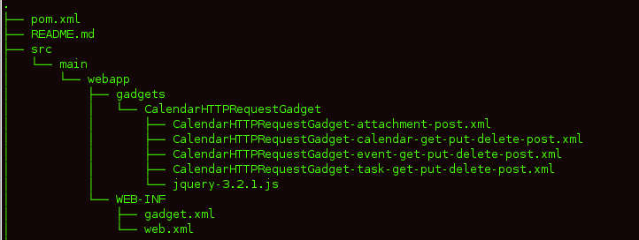
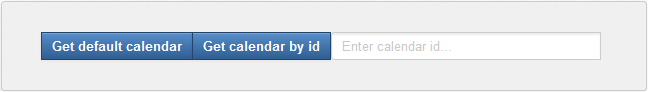
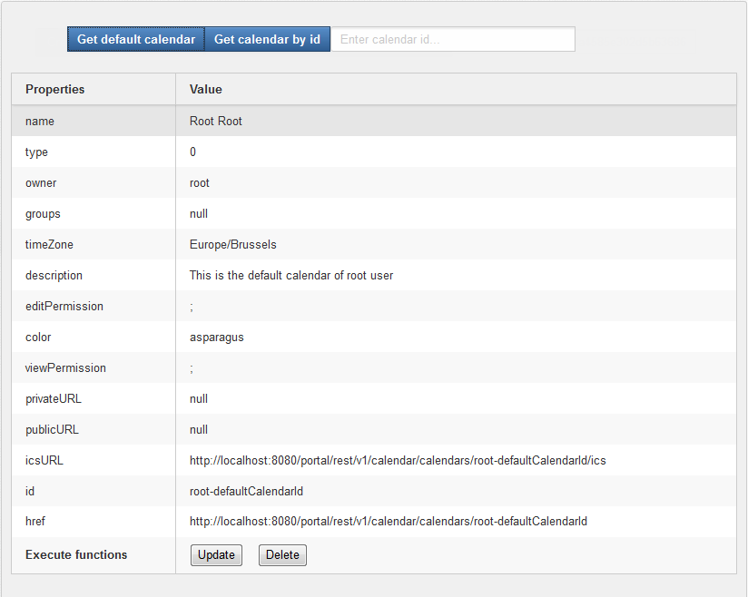
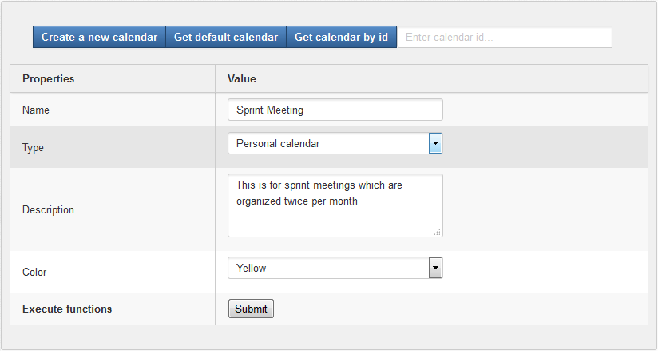
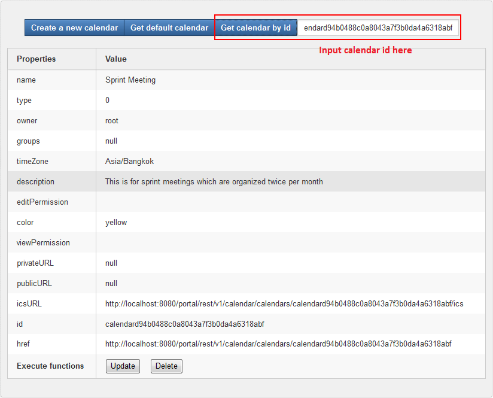
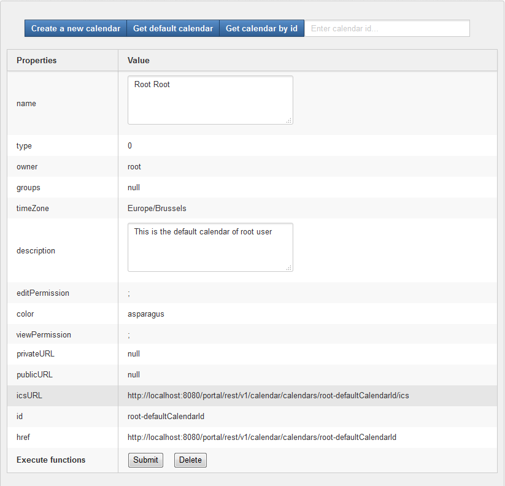
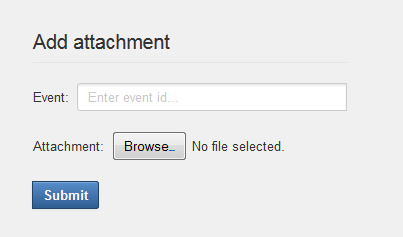
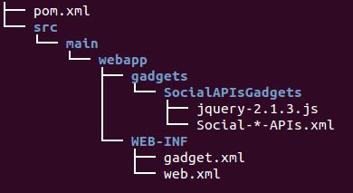
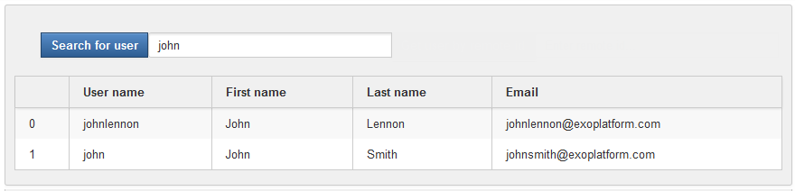
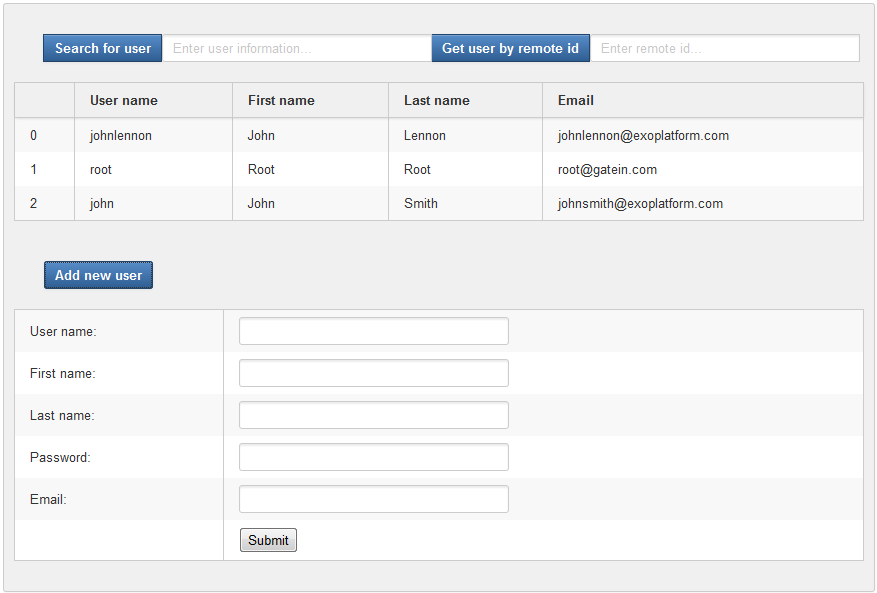
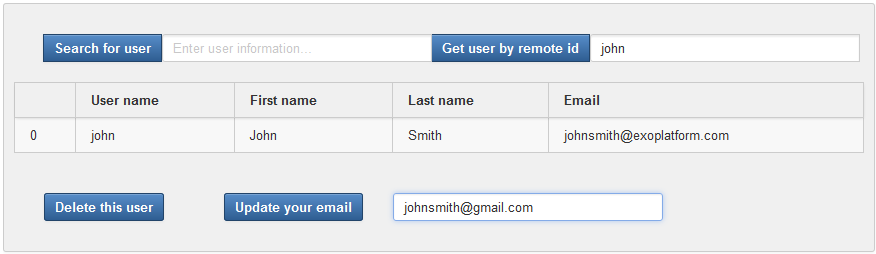
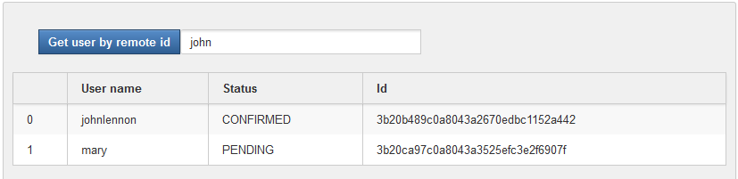
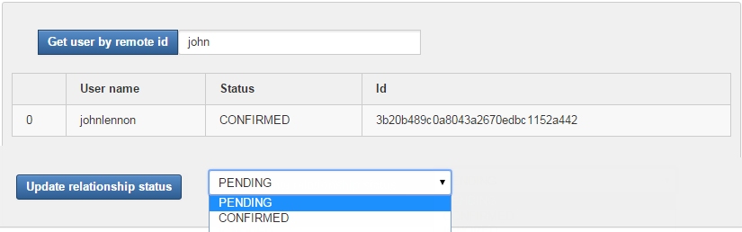
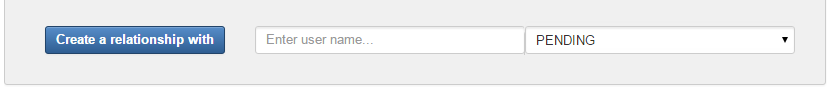
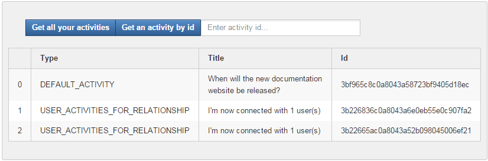
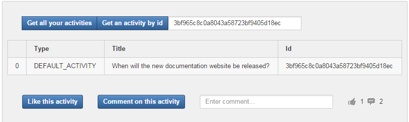
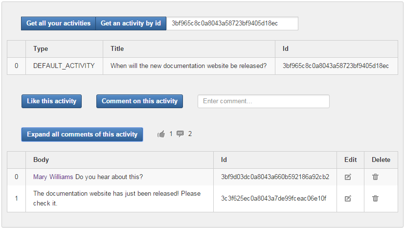
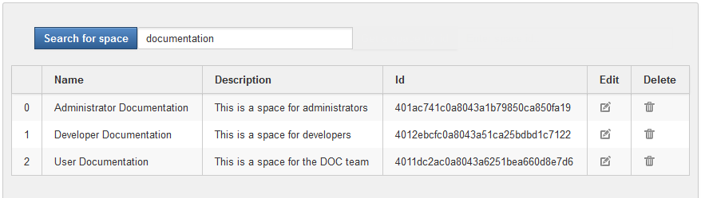

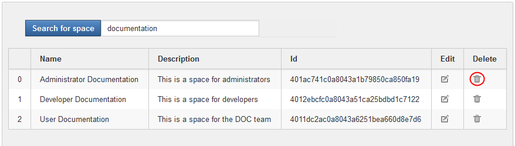
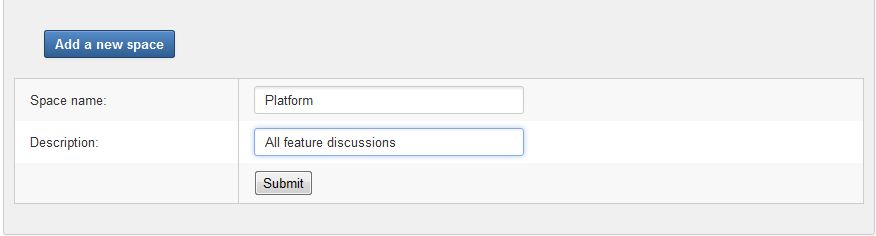
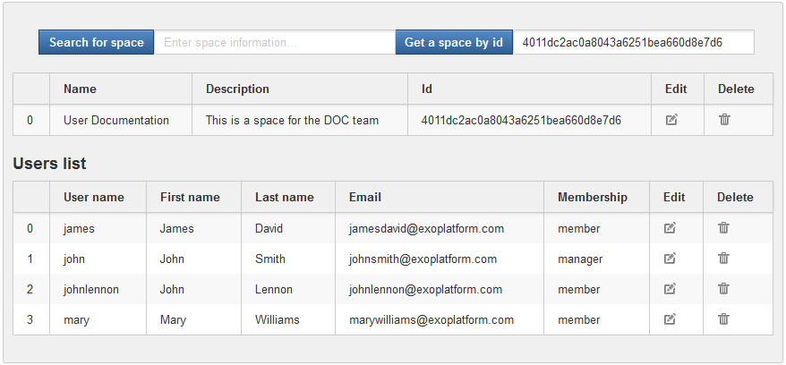
.. |image22| image:: images/yes.gif
.. |image23| image:: images/yes.gif
.. |image24| image:: images/yes.gif
.. |image25| image:: images/yes.gif
.. |image26| image:: images/yes.gif
.. |image27| image:: images/yes.gif
.. |image28| image:: images/yes.gif
.. |image29| image:: images/yes.gif
.. |image30| image:: images/yes.gif
.. |image31| image:: images/yes.gif
.. |image32| image:: images/yes.gif
.. |image33| image:: images/no.gif
.. |image34| image:: images/yes.gif
.. |image35| image:: images/no.gif
.. |image36| image:: images/yes.gif
.. |image37| image:: images/no.gif
.. |image38| image:: images/no.gif
.. |image39| image:: images/no.gif
.. |image40| image:: images/no.gif
.. |image41| image:: images/no.gif
.. |image42| image:: images/no.gif
.. |image43| image:: images/no.gif
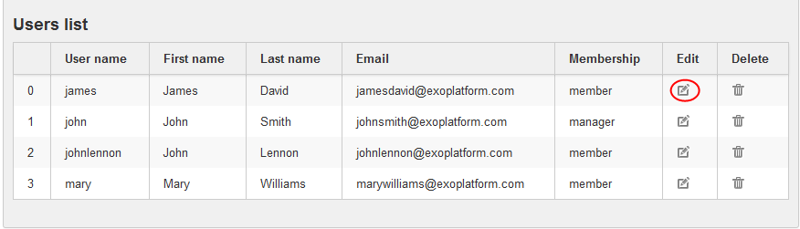
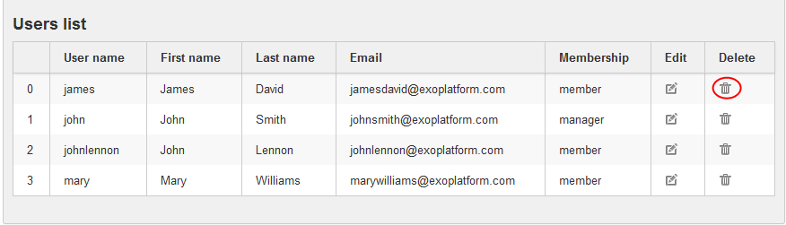
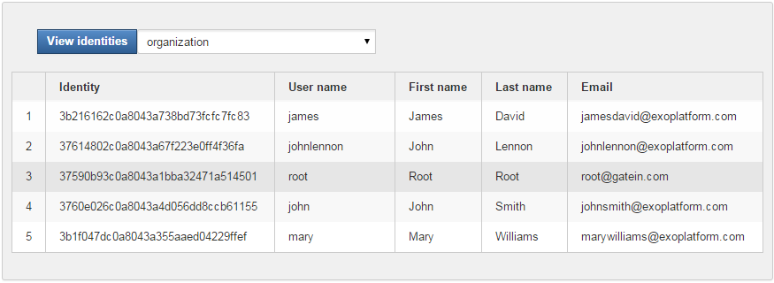
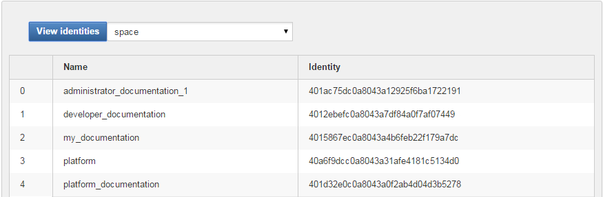
