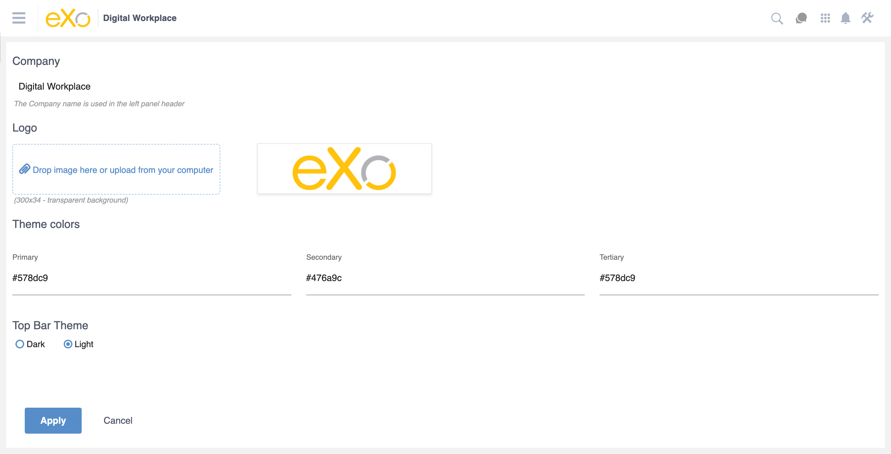
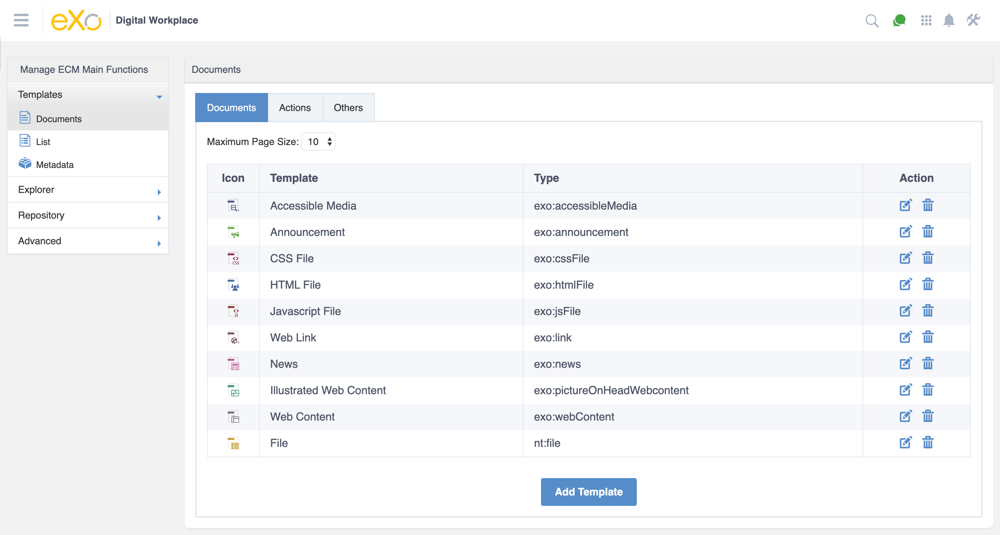
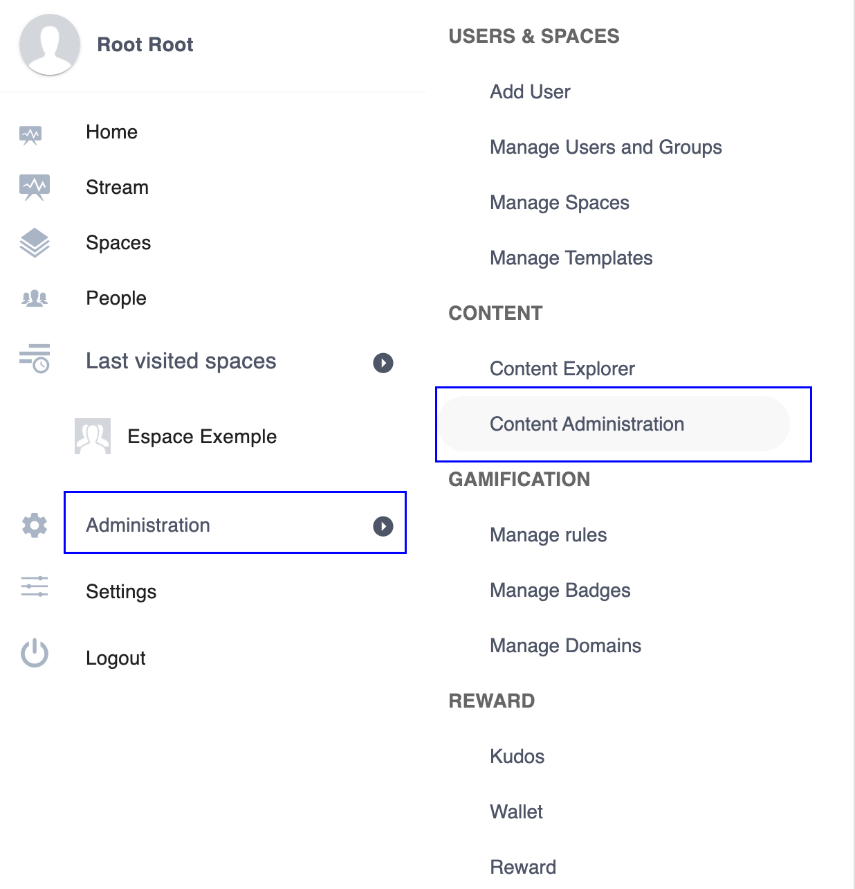
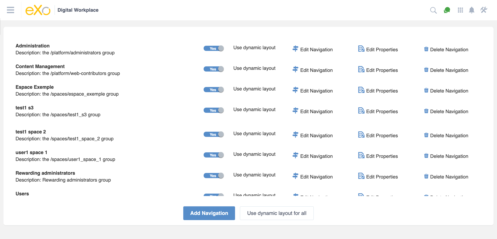

.. _Administration:


############################
Administering eXo Platform
############################

    This chapter is for administrators only who have the highest right
    to administer eXo Platform via the following topics:

    -  :ref:`Branding eXo Platform <BrandingeXoPlatform>`
       Instructions on how to change your company logo and the color of
       the top navigation bar in the portal.

    -  :ref:`Notification administration <NotificationAdministration>`
       Instructions on how to enable/disable notification plugins.

    -  :ref:`Customizing the look and feel of eXo Platform <CustomizingLookAndFeel>`
       Instructions on how to create and apply a global stylesheet into
       a site.

    -  :ref:`Editing eXo Platform <EditingeXoPlatform>`
       Instructions on how to edit certain aspects of eXo Platform, including
       website content, pages and sites.

    -  :ref:`Content Administration <ContentAdministration>`
       The way to access the Content Administration page where you can
       manage workspaces, drives, node types, metadata, templates, and
       queries.

    -  :ref:`WebDAV <WebDAV>`
       Definition of WebDAV and its advantages, how to access a
       workspace using various WebDAV clients (on a web browser or in an
       OS window), and WebDAV restrictions.

    -  :ref:`Managing your organization <ManagingYourOrganization>`
       Instructions on how to manage users, groups and memberships in
       eXo Platform.

    -  :ref:`Managing sites <ManagingSites>`
       In-depth instructions on how to create, edit and delete sites.

    -  :ref:`Managing pages <ManagingPages>`
       Steps to add/delete a new page, and edit its properties and
       layout.

    -  :ref:`Managing permissions <ManagingPermissions>`
       Introduction to permission levels in eXo Platform, and how to set
       permissions at various levels.

    -  :ref:`Managing navigations <ManagingNavigations>`
       Introduction to navigation levels eXo Platform, and in-depth
       instructions on how to perform various actions on navigation
       nodes.

    -  :ref:`Managing applications <ManagingApplications>`
       How to manage categories, portlets and gadgets, and introduction
       to management and monitoring gadgets in eXo Platform.

    -  :ref:`Building an online community <BuildingOnlineCommunity>`
       How to enable users to register themselves, publish some
       resources for anonymous access

.. _BrandingeXoPlatform:

======================
Branding eXo Platform
======================

eXo Platform allows you to easily brand eXo Platform by changing your company logo
and the color of the top navigation bar in the portal.

1. Click |image0| --> Portal --> Branding on the top navigation bar.

The Branding page will be displayed:

|image1|

**Details**:

-  The Select Logo pane: Uploads your company logo that must be in the
   ``.png`` format.

-  The Select Navigation Bar Style pane: Selects the navigation bar
   style suitable to your logo. There are two styles available on the
   portal, consisting of Dark which is default, and Light.

-  The Preview pane: Displays the preview of the top navigation bar with
   the currently defined logo and navigation bar style.

2. Click Upload to browse and upload the logo from your local device;

Or, drag the logo from your local device and drag it into the current
logo preview in the Select Logo pane. This way is just done if your
browser supports the HTML 5 and the Drag and Drop function.

|image2|

3. Click the box in the Select Navigation Bar Style pane and select one
   style from the drop-down.

Your style selection will also make the color of fonts on the top
navigation bar change.

.. tip:: If your logo is light and colorful, you should select the Dark style. If it is darker, you should select the Light style.

4. Click Save to accept your changes.

.. _NotificationAdministration:

===========================
Notification administration
===========================

eXo Platform allows administrators to enable/disable notification 
plugins in the administrative interface.

To do so, simply select |image3| --> Portal --> Notifications on the top
administration bar.

The Activity Notification Administration page will be displayed as
below:

|image4|

-  **Notification types**: Enables or disables notification types 
   globally.

   -  Notification: Name and categories of the notifications.

   -  Title: Title of the notification that will be shown in the email.

   -  Enable: Enables or disables sending notifications types for
      each corresponding notification type. Checking the option enables 
      the notofications channels, unchecking it disables it:
      
      - *Email Notifications*: For sending emails notifications.
      
      - *Mobile Push notifications*: For pushing pop up notifications in
        mobile devices.
        
      - *On-Site Notifications*: For sending On-site notifications.  

-  **Name**: Defines the display name of the email sender in the 
   *From* field.

-  **Address**: Defines the email address of the sender in the *From*
   field. It must be in the correct form, such as username@abc.com.

.. note::	 -  Once a notification type is disabled, it will disappear from the Notification Settings page of all users, and no new notification of this type is sent anymore.
			 -  The **My Tasks** settings are available only if the :ref:`Task Management <ManageTasks>` add-on is  installed.

.. _CustomizingLookAndFeel:

==============================================
Customizing the look and feel of eXo Platform
==============================================

As a web-contributor or an administrator, you can easily customize the
look and feel of eXo Platform by editing the existing
``Globalstylesheet.css`` file or creating a new global stylesheet and
applying it into the portal.

Global stylesheet is a shared one which is applied into your entire
site. Global stylesheets of eXo Platform are put into the css folder to
manage the stylesheet of your desired site. This section aims at showing
you how to create and apply your own global stylesheet through **Sites
Explorer**.

This section covers the following topics:

-  :ref:`Creating a global stylesheet <CreatingGlobalStylesheet>`
   Detailed instructions on how to create, edit and rename a global
   stylesheet.

-  :ref:`Checking the display <CheckingDisplayOfGlobalStylesheet>`
   Steps to activate a global stylesheet and check its display.

.. _CreatingGlobalStylesheet:

Creating a global stylesheet
~~~~~~~~~~~~~~~~~~~~~~~~~~~~~

1. Click |image5| Content Sites Explorer on the top navigation bar.

2. Select the Sites Management drive in the drives list.

3. Select a site in the Sites Management panel, for example, ``agital``, 
   then select the css folder.

4. Click |image6| to open the CSS File form which allows creating a new
   global stylesheet.

|image7|

5. Enter the name of global stylesheet into the Name field, for example,
   ``GlobalStylesheet\_Orange``.

6. Set the value as "True" in the Active field to activate your global
   stylesheet for your site. "True" is set by default when a new global
   stylesheet is created. If you select "False", your newly created 
   global style will be disabled.

7. Input one positive integer into the Priority field, for example "10".

8. Define your styles in the ``CSS Data`` field. Here, you can directly
   enter your CSS rules, or copy and paste them from your favorite text
   editor.

   For example, you can define your styles with the following 
   information:

|image8|

Click Save or Save & Close to save your newly created global stylesheet.
You will see your global stylesheet in the Sites Management panel.

|image9|

.. note:: -  The values in both of the Active and Priority fields decide if your newly created global stylesheet is applied into your site successfully or not. 
			 If the Active field is set to "True" in many global stylesheets, the system will automatically merge all the global stylesheets into the ``${site-name}/Default/Stylesheet-min-lt.css`` file of the css folder in the ascending order and get the stylesheet with the highest priority. 
			 Thus, after selecting "True", to make sure that your stylesheet is applied, you need to pay attention to the priority level so that the selected priority of your stylesheet is higher than those of other global stylesheets in the css folder.

		  -  The default global stylesheet will be automatically created in the css folder when you create a new site. 
		     However, this global stylesheet can be overwritten by either setting "False" for its Active field or setting the higher priority for other global stylesheet than that of the default global stylesheet.

		  -  When you want to create a common stylesheet to share for all sites in the portal, you should create one in the 
		     Sites Management/shared/css folder. This stylesheet will be rendered and applied into your desired site when you switch to it.

.. _EditGlobalStylesheet:

Editing a global stylesheet
----------------------------

Simply select your desired global stylesheet and click Edit on the
action bar, or right-click the file and select Edit from the drop-down
menu to open the CSS File form.

.. _RenameGlobalStylesheet:

Renaming a global stylesheet
-------------------------------

Simply right-click your desired global stylesheet in the Sites
Management panel, then select Rename.

.. _CheckingDisplayOfGlobalStylesheet:

Checking the display
~~~~~~~~~~~~~~~~~~~~~

You can have several global stylesheets in one site. To see differences
when applying various global stylesheets, for example,
``GlobalStylesheet_Blue`` and ``GlobalStylesheet_Orange``, do as
follows:

1. Activate the ``GlobalStylesheet_Blue`` and ``GlobalStylesheet_Orange``
   files by turns.

2. Open your desired site by entering its URL in the address bar, for
   example, opening the intranet site: ``http://{domain-name}/portal/intranet``.

.. note:: The two GlobalStylesheet\_Blue and GlobalStylesheet\_Orange should been added to ``/intranet/css`` folder.


-  If you activate ``GlobalStylesheet_Blue``, your site is as below:

   |image10|

-  If you activate ``GlobalStylesheet_Orange``, your site is as below:

   |image11|

.. _EditingeXoPlatform:

=====================
Editing eXo Platform
=====================

If you belong to members of editor or administrator groups, you will see
|image12| on the top navigation bar. By clicking this button, you will
see a drop-down menu that allows you to edit content, pages and site
quickly.

|image13|

.. _EditWebsiteContent:

Editing a website's content
~~~~~~~~~~~~~~~~~~~~~~~~~~~~

.. note:: You can do this function only when the ACME add-on is already installed by your administrator. See :ref:`here <#PLFAdminGuide.AddonsManagement.Installing>` for how-to.

Simply click Content from the drop-down menu. The Edit mode will be
turned on. For more details, see :ref:`Edit mode <EditMode>`.

.. _EditingPage:

Editing a page
~~~~~~~~~~~~~~~

Hover your cursor over Page, then click:

-  Edit Layout if you want to edit the page's layout as stated in
   :ref:`Arranging the page layout <RearrangingPageLayout>`.

-  SEO if you want to manage SEO. See :ref:`Managing SEO <ManagingSEO>`
   for details.

-  Add Page if you want to add a new page. See :ref:`Using Page Creation Wizard <PageCreationWizard>`
   for details.

.. _EditingSite:

Editing a site
~~~~~~~~~~~~~~

Hover your cursor over Site, then click:

-  Layout to edit the site's layout. See :ref:`Editing layout <EditingLayout>`
   for details.

-  Click Navigation to manage navigation. See :ref:`Managing navigations <ManagingNavigations>`
   for details.

-  Click Add Site to add a new site. See :ref:`Creating a new site <CreatingNewSite>`
   for details.

.. _ContentAdministration:

======================
Content Administration
======================

This section covers the following topics:

-  :ref:`Working with Templates <WorkingWithTemplates>`
   Instructions on how to view, edit and delete the predefined templates
   or add a new template.

-  :ref:`Working with Explorer <WorkingWithExplorer>`
   Instructions on how to manage drives, views, and tags.

-  :ref:`Working with Repository <WorkingWithRepository>`
   Instructions on how to manage namespaces, node types and locks.

-  :ref:`Working with Advanced configuration <WorkingWithAdvancedConfiguration>`
   Instructions on how to manage with categories, queries, scripts, and
   actions.

Only administrators and web contributors can access the Content
Administration page to manage all workspaces, drives, node types,
metadata, templates, queries, and more.

To access the **Content Administration** page, click |image14| on the 
top navigation bar, then select ContentContent Administration from the
drop-down menu.

The Content Administration page will appear.

|image15|

From this page, you can access:

-  **Templates** |image16|: Manage templates of documents, CLV and
   metadata.

-  **Explorer** |image17|: Manage views, drives and tags.

-  **Repository** |image18|: Manage namespaces, node types and locks.

-  **Advanced** |image19|: Manage categories, queries, scripts and
   actions.

.. _WorkingWithTemplates:

Working with Templates
~~~~~~~~~~~~~~~~~~~~~~~

When creating content in eXo Platform, you must set its properties. 
Thus, each content needs to have a form to enter data for its properties
(called the **Dialog** template), and display the existing values
(called the **View** template). In the templates management, you are
able to view, edit and delete the predefined templates or to add a new
template.

From the Manage ECM Main Functions panel, select Templates.

|image20|

eXo Platform provides 3 available template types, including:

- :ref:`Documents <WorkingWithTemplates.DocumentTemplates>`: Manages 
  view, dialog and CSS templates of document types.

- :ref:`List <WorkingWithTemplates.ListTemplates>`: Manages Content List
   Viewer templates.

- :ref:`Metadata <WorkingWithTemplates.MetadataTemplates>`: Manages view
   and dialog templates of metadata node types.

.. _WorkingWithTemplates.DocumentTemplates:

Document templates
-------------------

In Templates, select Documents to open the Documents panel.

|image21|

The Documents templates are categorized into 3 sub-tabs that makes ease
for management. You can use default templates provided by PRODUCT in
each sub-type or define a new template.

-  The Documents tab includes **Contact Us**, **Product**, **Accessible
   Media**, **Announcement**, **CSS File**, **HTML File**, **Javascript
   File**, **Web Link**, **Illustrated Web Content**, **Web Content**,
   **File**, **Accessible Breadcrumb**, **Accessible Navigation**, and
   **Accessible Site Search Box**.

-  The Actions tab includes **Add Metadata Action**, **Automatic
   Versioning**, **Enable Versioning**, **Populate to Menu**, and **Add
   Category Action**.

-  The Others tab includes **Comments**, **Votes**, and **File
   Content**.

.. note:: -  **Contact Us** and **Product** are for the ACME site, so these templates only appear when the ACME site is enabled.
		  -  **Accessible Breadcrumb**, **Accessible Navigation** and  **Accessible Site Search Box** are for the WAI site, so these templates only appear when the WAI site is enabled.
		  -  **Populate to Menu** only appears in the list of Action templates when the ACME site is enabled.

Editing/Deleting a Document template
``````````````````````````````````````

**Editing a Document template**

1. Select the template type tab (Documents, Actions or Others).

2. Click |image22| corresponding to your desired template in the Action
   column.

The View & Edit Template form appears.

|image23|

3. Make changes on the values of each tab, including:

-  In the Template tab, you can edit the label of the template. The is
   Document Template checkbox is selected by default when you select the
   Documents tab. However, this checkbox is disabled by default when you
   select the Actions or Others tab.

-  In the Dialog tab, you can add a dialog, edit or delete an existing
   dialog. Besides, you can set permission to use the dialog form for a
   specific group and membership. Setting the \* membership will allow
   all users of the group to have this permission. For more details, see
   `Dialogs <../../../reference/html/PLFRefGuide.PLFDevelopment.TemplateConfiguration.Content.ContentTypes.Dialogs.html>`__.

-  In the View tab, you can add a view, edit or delete an existing view.
   Besides, you can set permission to view the template for a specific
   group and membership. Setting the \* membership will allow all users
   of the group to have this permission. For more details, see
   `Views <../../../reference/html/PLFRefGuide.PLFDevelopment.TemplateConfiguration.Content.ContentTypes.View.html>`__.

-  In the CSS tab, you can add a new stylesheet, edit or delete an
   existing stylesheet.

.. note:: -  You cannot delete the default dialog/view.
		  -  You cannot change the dialog/view/CSS name.
		  -  If you click Enable Versioning or Versioning activated checkbox, the edited dialog/view/CSS automatically increments one version after you have clicked **Save**. It is displayed at the Version column.
		  -  After the dialog/view/CSS has been enabled versioning, you will see the Versions field and the Restore button at the bottom of the form. You can use Restore to roll back to a selected version.

**Deleting a Document template**

Simply click |image24| corresponding to the template you want to remove,
then select **OK** in the confirmation message.

Adding a new document template
```````````````````````````````

1. Select the template type tab (Documents, Actions or Others).

2. Click Add Template at the bottom to open the Template Form window.

|image25|

.. note:: The is Document Template checkbox is selected by default when you select the Documents tab. However, this checkbox is disabled by default when you select the Actions or Others tab.

3. Select the template type from the Name drop-down menu.

4. Specify a name for the template in the Label field.

5. Click |image26| next to the Permission field to open the Select
   Permission dialog.

6. Optionally, select the Dialog tab, View, and/or CSS and enter the 
   value in the input-text box.

7. Click Save to create the template.

.. _WorkingWithTemplates.ListTemplates:

List templates
---------------

In Templates, select List to open the List panel. There are 3 types of
List (also called CLV) templates: Content, Navigation and Paginator.

|image27|

Editing/Deleting a List template
`````````````````````````````````

**Editing a List template**

1. Click |image28| corresponding to your desired template in the Action
   column.

The Edit List Template form appears.

|image29|

2. Make any changes on fields: Content, Name, or change the template 
   type from the Template Type drop-down menu.

.. note:: You cannot change the Template Name field.

**Deleting a List template**

Simply click |image30| corresponding to the template you want to remove,
then select **OK** in the confirmation message.

Adding a new List template
```````````````````````````

1. Click Add Template at the bottom to open the Add List Template window.

|image31|

2. Add values to the Content, Name, Template Name fields and select the
   template type from the Template Type drop-down menu.

.. note:: After creating your new List template, you cannot edit the Template Name field.

3. Click Save to finish adding your new list template, or Reset to clear
   your entered values.

.. _WorkingWithTemplates.MetadataTemplates:

Metadata templates
-------------------

Metadata are information which describes, or supplements the central
data. When data are provided to end-users, the metadata allow users to
understand about information in details.

In Templates, select Metadata to open the Metadata panel.

|image32|

**Viewing a Metadata template**

Simply click |image33| corresponding to the metadata you want to view.

The Metadata Information form will open.

|image34|

**Editing a Metadata template**

1. Click |image35| corresponding to your desired template in the Action
   column.

The Edit Metadata's Template form appears.

|image36|

2. Change the required properties of the metadata.

.. note:: You cannot edit the metadata name.

3. Click Apply to save all metadata changes.

**Deleting a Metadata template**

Simply click |image37| corresponding to the template you want to remove,
then select **OK** in the confirmation message.
   
   
.. _WorkingWithExplorer:

Working with Explorer
~~~~~~~~~~~~~~~~~~~~~~

From the Manage ECM Main Functions panel, select Explorer.

|image38|

Here you can manage:

- :ref:`Views <WorkingWithExplorer.Views>`

- :ref:`Drives <WorkingWithExplorer.Drives>`

- :ref:`Tags <WorkingWithExplorer.Tags>`


.. _WorkingWithExplorer.Views:

Views
------

eXo Platform provides various drives for you to store and manage your content
efficiently. Each drive has some views that enable you to view data in
the drive in a particular way. Each view has some action tabs and each
action tab contains some functions.

eXo Platform supports you some ways to view nodes in a specific folder and
show actions of corresponding tab on the Action bar.

The number of view types depends on which drive you are browsing. In
Explorer, select Views to open the Views panel.

|image54|

.. _ViewsIneXo:

Views in eXo Platform
``````````````````````

All eXo Platform views are in the Views tab. Here, you can view, edit,
delete, and add new views.

**Admin**

|image55|

**Icons**

|image56|

**List**

|image57|

**Categories**

|image58|

**Web**

|image59|

To learn about differences between these views, see the following table:

+------------+--------------------------------+------------+----------------------+
| View names | Default actions                | Default    | Default permissions  |
|            |                                | templates  |                      |
+============+================================+============+======================+
| **Admin**  | Add Folder, Edit Document,     | List       | ``*:/platform/admini |
|            | View Permissions, Manage       |            | strators``           |
|            | Actions, Manage Auditing,      |            |                      |
|            | Manage Relations, Show JCR     |            |                      |
|            | Structure, Upload, View        |            |                      |
|            | Metadata, View Properties      |            |                      |
+------------+--------------------------------+------------+----------------------+
| **Icons**  | Add Folder, Edit Document,     | Thumbnails | ``*:/platform/users` |
|            | Manage Versions, Tag Document, |            | `                    |
|            | Upload, View Metadata, View    |            |                      |
|            | Permissions, Vote, Comment,    |            |                      |
|            | Watch Document, Overload       |            |                      |
|            | Thumbnail                      |            |                      |
+------------+--------------------------------+------------+----------------------+
| **List**   | Add Folder, Edit Document,     | List       | ``*:/platform/users` |
|            | Manage Versions, View          |            | `                    |
|            | Permissions, Tag Document,     |            |                      |
|            | Upload, View Metadata, Vote,   |            |                      |
|            | Comment, Watch Document        |            |                      |
+------------+--------------------------------+------------+----------------------+
| **Categori | Add Category, Add Document,    | Content    | ``*:/platform/web-co |
| es**       | Edit Document, View            |            | ntributors``         |
|            | Permissions, Manage            |            |                      |
|            | Categories, Manage             |            |                      |
|            | Publication, Approve Content,  |            |                      |
|            | Publish, Request Approval,     |            |                      |
|            | Upload, Tag Document, Vote,    |            |                      |
|            | Comment, Watch Document        |            |                      |
+------------+--------------------------------+------------+----------------------+
| **Web**    | Add Category, Add Document,    | Content    | ``*:/platform/web-co |
|            | Add Folder, Edit Document,     |            | ntributors``         |
|            | Manage Categories, Manage      |            |                      |
|            | Publication, Approve Content,  |            |                      |
|            | Publish, Request Approval,     |            |                      |
|            | Upload, View Permissions Tag   |            |                      |
|            | Document, Vote, Comment, Watch |            |                      |
|            | Document, Add Translation      |            |                      |
+------------+--------------------------------+------------+----------------------+

Viewing/Editing/Deleting a view
````````````````````````````````

**Viewing**

Simply click |image60| corresponding to your desired view in the Action
column.

The View form will open.

|image61|

.. _ViewsIneXoPlatform.AddingView:

**Editing a view**

1. Click |image62| in the Action column.

The Edit View form appears.

|image63|

2. Edit the view properties.

-  You cannot change the view name.

-  If you select the Enable Version checkbox, this view automatically
   increases to one version after you have clicked Save. It is displayed
   at the Base Version column in the Views tab. Moreover, the View tab
   in the Edit View form will have the Restore Version field which
   allows rolling back a given version.

   |image64|

.. _HidingExplorerPanelInSidebar:

-  By default, the Hide explorer panel in side bar checkbox is only
   selected for the **Admin** and **List** views. This means you can use
   the Explorer tree to browse content from the side bar in the
   **Icons**, **Categories**, and **Web** views by default. However, in
   the **Admin** and **List** views, you need to deselect these
   checkboxes first.

3. Optionally, select the Action tab to do the following actions on the
   tab.

-  i. Click |image65| to edit one existing tab. You can add or remove
   functions on the selected tab by selecting/deselecting the
   corresponding checkboxes. Note that you cannot change the tab name.

-  ii. Click |image66| to delete an existing tab.

-  iii. Click Add to add a new tab to the view.

4. Optionally, select the Permission tab to delete the existing 
   permissions or to add new permissions.

.. note:: Setting the \* membership for a group will allow all users of the group to use this view when :ref:`exploring documents <DocumentsInterface>`.

5. Click Save to apply all changes in the View tab.

**Adding/deleting an action in a view**

In the previous part :ref:`Views in eXo Platform <ViewsIneXo>`, we 
described different views in eXo Platform with their defaut actions.

It is possible to edit the action bar of a view by following these
steps:

1. Log in to eXo Platform as an administrator.

2. Go to Administration Content Content Administration.

|image67|

3. In **Manage ECM Main Functions** panel click on **Explorer** tab and 
   then click on Views item.

|image68|

4. In the right panel, click on edit button |image69| of the view you 
   want to change, List view for example.

5. In the **Edit form**, select **Action** tab then click on |image70|.

|image71|

6. A new popup appears, you can check to add or uncheck to delete 
   actions on the view.

|image72|

7. Click Save to apply actions check/uncheck then save in the 
   **Edit View** form.

**Deleting a view**

Click |image73| corresponding to the view you want to delete, then click
**OK** in the confirmation message.

.. note:: You cannot delete a view which is in use.

Adding a view
```````````````

1. Click Add View located at the bottom to open the Add View form.

|image74|

2. Specify the view name in the Name field that must be unique, and only
   contains standard alphanumeric characters. This field is required.

3. Select one template from the Template drop-down menu.

.. note:: Tick the Enable Version checkbox if you want to activate versioning for your view.

4. Select the Action tab, then click Add to create a functional tab on 
   this view. This step is required.

The Add/Edit Tab form appears.

|image75|

-  **i.** Enter the name for the tab in the Tab Name field.

-  **ii.** Tick checkboxes corresponding to the actions you want to add
   to the tab.

-  **iii.** Click Save to finish creating a tab.

   The newly created tab is displayed in the Tab column.

   |image76|

5. Select the Permission tab, then click Add to add permissions for the
   view. It is required.

6. Click Save to finish adding your view.

Explorer templates in eXo Platform
````````````````````````````````````

In the Views form, click the Explorer Templates tab to see a list of
Explorer templates. Currently, there are 3 Explorer templates which can
be used for views in eXo Platform, including: Content, List and 
Thumbnails.

|image77|

Here, you can edit information, delete or add a new Explorer template.

Editing/Deleting an Explorer template
```````````````````````````````````````

**Editing an Explorer template**

1. Click |image78| next to the template you want to edit.

2. Change the current template's properties.

.. note:: -  You cannot edit the template name.
		  -  If you tick the Enabled Version checkbox, this template will automatically increase to one version after you have clicked Save. Then, the Edit Explorer Template form has more the Select Version field.
		  -  If the template has at least two versions, the Edit Explorer Template form displays Restore at the form bottom that allows restoring to a selected version.

3. Click Save to accept all changes.

**Deleting an Explorer template**

Click |image79| corresponding to the template you want to delete, then
select **OK** in the confirmation message.

Adding an Explorer template
```````````````````````````````

1. Click Add to open the Add Explorer Template form.

|image80|

2. Input content of the template in the Content field.

3. Input a name for the template in the Name field.

4. Select a type for the template in the Template Type field.

5. Click Save to accept adding this new template.


.. _WorkingWithExplorer.Drives:

Drives
-------

Drive is a shortcut to a specific location in the content repository
that enables administrators to limit visibility of each workspace for
groups of users. It is also a simple way to hide the complexity of the
content storage by showing only the structure that is helpful for
business users.

Currently, eXo Platform presets 6 drive types. However, the number of drives
you can access depend on your user role. Also, these drives use the
various views. See the following table to make distinction between
drives:

+------------------+--------------+---------------------------+------------------+
| Drives           | Workspace    | Permissions               | Views            |
+==================+==============+===========================+==================+
| **Personal       | collaboratio | ``*:/platform/users``     | List, Icons,     |
| Documents**      | n            |                           | Admin            |
+------------------+--------------+---------------------------+------------------+
| **Collaboration* | collaboratio | ``*:/platform/administrat | Wed, Admin       |
| *                | n            | ors, *:/platform/web-cont |                  |
|                  |              | ributors``                |                  |
+------------------+--------------+---------------------------+------------------+
| **Groups**       | collaboratio | ``*:${groupId}``          | List, Icons      |
|                  | n            |                           |                  |
+------------------+--------------+---------------------------+------------------+
| **Managed        | collaboratio | ``*:/platform/administrat | Web              |
| Sites**          | n            | ors, *:/platform/web-cont |                  |
|                  |              | ributors``                |                  |
+------------------+--------------+---------------------------+------------------+
| **Powers**       | collaboratio | ``* :/platform/web-contri | Categories       |
|                  | n            | butors``                  |                  |
+------------------+--------------+---------------------------+------------------+
| **Trash**        | collaboratio | ``*:/platform/administrat | Admin            |
|                  | n            | ors``                     |                  |
+------------------+--------------+---------------------------+------------------+

In Explorer, select Drives.

|image39|

Here, you can do certain actions on the drives as follows:

- :ref:`Editing a drive <Drives.EditingDrive>`
   |image40|

- :ref:`Deleting a drive <Drives.DeletingDrive>`
   |image41|

- :ref:`Adding a new drive <Drives.AddingNewDrive>`
   |image42|

.. _Drives.EditingDrive:

Editing a drive
``````````````````


1. Click |image43| corresponding to your desired drive in the Action column.

The Edit Drive form appears.

|image44|

2. Edit the properties as required.

3. Click Save to commit your changes.


.. note:: The drive name cannot be edited in this form.

.. _Drives.DeletingDrive:

Deleting a drive
`````````````````

Simply click |image45| that corresponds to the drive you want to delete,
then select **OK** in the confirmation message.

.. _Drives.AddingNewDrive:

Adding a new drive
```````````````````

1. Click Add Drive at the bottom to open the Add Drive form.

|image46|

2. Input a name for the new drive in the Name field that is required.

3. Select a workspace for the drive from the drop-down menu by clicking 
   the Workspace entry.

|image47|

4. Select the home path for the drive by clicking |image48|.

5. Browse an icon for the workspace by clicking |image49|.

6. Select permissions for groups that have access rights to this drive 
   by clicking |image50|.

.. note:: Setting the \* membership for a group will allow all users of the group to access this drive (via DocumentsShow Drives), regardless of their membership role.

7. Select or deselect the various checkboxes to hide or show the drive
   elements respectively.

|image51|

8. Select the document type that will be created in this drive.

9. Limit the node types shown in the left tree by clicking |image52| 
   next to the Allowance nodetype on left tree field.

-  If you do not select the value for this field, this means all node
   types are shown in the left tree. The "empty" value is converted into
   **\*** once you have clicked Save.

-  If you define specific node types in this field, only these node
   types are shown in the left tree.

10. Select the Apply Views tab and select the view types you want to be
    available in the drive.

|image53|

11. Click Save to complete creating the new drive, or Refresh to clear 
    the form.
    

.. _WorkingWithExplorer.Tags:    
    
Tags
-----

The **Tagging** function enables you to manage tag styles.

In Explorer, select Tags to open the Tags panel:

|image81|

The style of tag which is applied depends on the number of documents
using the tag. For example, if one tag is used twice, its style will be
``font-size: 12px; font-weight: bold; color: #6b6b6b; font-family: verdana; text-decoration:none;``.

Editing/Deleting a tag style
`````````````````````````````

**Editing a tag**

The Tag Manager tab enables you to edit the existing tags.

1. Click |image82| corresponding to the tag name which you want to edit 
   in the Action column to edit the tag style configuration. The Edit 
   Tag Style Configuration form appears which is similar to that of 
   adding a tag style.

2. Change values in the fields, including Number of Occurrences and HTML
   Style, except Style Name.

3. Click Update to save new changes.

**Deleting a tag**

To delete one tag style, simply click |image83| in the Action column,
then select **OK** in the confirmation message.

Adding a tag style
````````````````````

1. Click Add Style at the bottom to open the Edit Tag Style 
   Configuration form.

|image84|

**In which:**

+--------------------+--------------------------------------------------------+
| Field              | Description                                            |
+====================+========================================================+
| **Style Name**     | The tag name which cannot be edited after you have     |
|                    | added.                                                 |
+--------------------+--------------------------------------------------------+
| **Number of        | The number of documents assigned to a tag.             |
| Occurrences**      |                                                        |
+--------------------+--------------------------------------------------------+
| **HTML Style**     | Includes font-size, font-weight, color, font-family,   |
|                    | and text-decoration.                                   |
+--------------------+--------------------------------------------------------+
| **Asterisk (\*)**  | Indicates the fields are mandatory.                    |
+--------------------+--------------------------------------------------------+

2. Input values in the fields: Style Name, Number of Occurrences, and 
   HTML Style.

3. Click Update to accept adding a new tag style.

.. note:: The format of valid range must be: a..b where 'a', 'b' are positive integers. You can use \* instead of 'b' to indicate it is unlimited. For example, 0..2 (means 0-2 documents assigned to a tag), 10..\* (means at least 10 documents assigned to a tag).
		  The HTML Style textbox cannot be empty. You can change values of font size, font weight, color, font family, and text decoration later.

.. _SettingPermissionsOnPublicTags:

Setting permissions on public tags
````````````````````````````````````

The Tag Permission Manager tab helps you set permissions regarding to
editing and deleting public tags.

|image85|

**Setting permission to tag management**

Here, you can click |image86| or |image87| or |image88| to add 
permissions to the users, memberships or anyone respectively. Then, 
click Add to add your selected permissions to the User or Group table.

.. note:: -  If you set the \* membership for a group, all users of the group will be able to manage tags, regardless of their membership role.

**Deleting a permission**

In the User or Group table, simply click |image89|, then select **OK** in
the confirmation message.


.. _WorkingWithRepository:

Working with Repository
~~~~~~~~~~~~~~~~~~~~~~~~~~

From the Manage ECM Main Functions panel, select Repository.

|image90|

Here you can manage:

-  :ref:`Namespaces <WorkingWithRepository.Namespaces>`

-  :ref:`Node types <WorkingWithRepository.NodeTypes>`

-  :ref:`Locks <WorkingWithRepository.Locks>`

.. _WorkingWithRepository.Namespaces:

Namespaces
------------

The namespace is a prefix in the node type name. It enables you to
create node types without fearing any conflict with existing node types.

In Repository, select Namespaces to open the Namespaces panel.

|image91|

**Registering a namespace**

1. Click Register at the bottom of the Namespaces form open the Register
   New Namespace form.

|image92|

2. Enter the value for the Namespace Prefix field that is required.

3. Enter the value for the URI field which must be unique and required.

.. note:: The namespace must not contain special characters, such as ``!,#,$,&,\*,(,)``.

.. _WorkingWithRepository.NodeTypes:

Node types
-----------

This function is used to control all node types in eXo Platform.

In Repository, select Node Types to open the Node Types panel.

|image93|

**Viewing node types**

1. Click |image94| corresponding to the node you want to view. The View 
   Node Type Information form will appear.

|image95|

2. Click Close at the bottom of the form to exit.

**Adding a node type**

1. Click Add at the bottom of the **Node Types** page to open the 
   Add/Edit Node Type Definitions form.

|image96|

2. Select a namespace for the node.

3. Enter a name in the Node Type Name field. This field is mandatory and
   its value must be unique.

.. note:: The name must not contain special characters, such as ``!,#,$,&,\*,(,)``.

4. Select a value for the Is Mixin Type field.

-  True: This node is Mixin type.

-  False: This node is not Mixin type.

5. Select a value for the Orderable Child Nodes field.

-  True: Child nodes are ordered.

-  False: Child nodes are not ordered.

6. Enter a value for the Primary Item Name field.

7. Enter a value for the Super Types field. Clicking |image97| will 
   direct you to the Super Types tab for you to search for available 
   super types.

   -  Property Definitions: Lists all definition names of the Property 
      tab.

   -  Child Node Definitions: Lists all definition names of the Child Node
      tab.

8. Click Save to accept adding a new node type, or Save as Draft to save
   this node type as draft.

**Importing node types**

1. Click Import at the bottom of the **Node Types** page to open the 
   Import Node Type From XML File form.

|image98|

2. Click Select File to upload a file.

.. note:: You must upload an XML or ZIP file. This file is in the node type's format.

3. Click the Upload button.

.. note:: If you want to upload another file, click |image99| to delete the file which has just been uploaded, then upload other files.

4. Tick the checkboxes corresponding to the nodes that you want to 
   import.

5. Click Import to complete importing a node type.

**Exporting node types**

1. Click Export at the bottom of the **Node Types** page to open the 
   Export Node Types form.

|image100|

2. Click Uncheck all if you do not want to export all node types. After
   clicking Uncheck all, this button becomes the Check all button.

3. Select nodes that you want to export by ticking the corresponding
   checkboxes.

4. Click Export in this form.

5. Select the location in your device to save the exported node.

.. note:: You must select at least 1 node type to be exported. If you do not want to export the node, click Cancel to quit this pop-up.


.. _WorkingWithRepository.Locks:

Locks
------

In Repository, select Locks to open the Locks panel. The locked nodes
will be listed in the right panel.

|image101|

**Unlocking a node**

Simply click |image102| corresponding to nodes which need to be unlocked
in the Locked Node tab. The unlocked nodes will disappear from the
locked nodes list.

**Managing locks**

Administrators can manage and add the unlock permission for another
group and users in the Manage Lock tab.

Select the group on the Select Group panel and the corresponding
membership on the Select Membership panel. The selected group will be
listed in the Groups Or Users column.

-  Click |image103| corresponding to the group which you want to remove
   from the "Unlock" permission list, except the
   ``*:/platform/administrator`` group.

.. note:: If you set the \* membership for a group, all users of the group will be able to manage locks, regardless of their membership role.


.. _WorkingWithAdvancedConfiguration:

Working with Advanced configuration
~~~~~~~~~~~~~~~~~~~~~~~~~~~~~~~~~~~~

From the Manage ECM Main Functions panel, select Advanced.

|image104|

Here you can manage:

-  :ref:`Categories <WorkingWithAdvancedConfiguration.Categories>`

-  :ref:`Queries <WorkingWithAdvancedConfiguration.Queries>`

-  :ref:`Scripts <WorkingWithAdvancedConfiguration.Scripts>`

-  :ref:`Actions <WorkingWithAdvancedConfiguration.Actions>`


.. _WorkingWithAdvancedConfiguration.Categories:

Categories
-----------

A category can be understood as a classification practice and science.
It is used to sort documents, aiming at facilitating searches. The
category management includes adding, editing and deleting a category
tree.

In Advanced, select Categories. You will be directed to the
**Categories** panel as below:

|image105|

Here, you can do the following actions:

-  :ref:`Editing a category tree <Categories.EditingCategoryTree>`
   |image106|

-  :ref:`Deleting a category tree <Categories.DeletingCategoryTree>`
   |image107|

-  :ref:`Adding a category tree <Categories.AddingCategoryTree>`
   |image108|
   
.. _Categories.EditingCategoryTree:   

Editing/Deleting a category tree
`````````````````````````````````

**Editing a category tree**

1. Click |image109| in the Action column to open the Edit Category Tree 
   form.

|image110|

2. Click |image111| in the Add column to add more category trees. The 
   mini Edit Category Tree form will appear.

|image112|

3. Enter a category name in the Category Name field which is required.

.. note:: The category name must not contain more than 150 characters.

4. Click Save to save the category name.

5. Click Previous to return to the previous steps.

6. Click Save to save all changes, or Previous or Next if you want to 
   edit more.

.. _Categories.DeletingCategoryTree:

**Deleting a category tree**

Simply click |image113| in the Action column, then select **OK** in the
confirmation message.

.. _Categories.AddingCategoryTree:

Adding a category tree
````````````````````````

1. Click Add Category Tree to open the Add Category Tree form.

|image114|

2. Enter the category tree name in the Name field which is required.

3. Select the workspace you want to work with.

4. Select the home path by clicking |image115|. The Select Home Path 
   form will appear.

|image116|

-  Click |image117| next to Root Path if you want to select the root path
   or;

-  Click the arrow icon to go to the up level path and click the plus
   sign to expand the folder in the left pane.

   Click |image118| corresponding to the path that you want to select as
   a home path.

5. Click Next to select permissions for the category tree.

|image119|

-  **i.** Click |image120| or |image121| or |image122| to set 
   permissions for user, membership or everyone respectively. Your 
   selected user or membership will be displayed in the User or Group 
   column.

.. note:: When ticking any permissions above (Read, Add Node or Remove), if you set the \* membership for a group, this permission will be granted to all users of the group, regardless of their membership role.

-  **ii.** Check the right options for the selected user to membership:

.. note:: Ticking only Add Node Right or Remove Right means that Read Right is selected automatically.

6. Click Save to save all values, or Reset to change values that have 
   just been set. After clicking Save, click Next to go to the next step.

|image123|

7. Enter the name for an action of the category tree in the Name field
   which is required.

8. Select values for Lifecycle, Node Types, Target Workspace, Target Path,
   Affected Node Types which are required.

9. Click Save to commit all values.

.. note:: -  Do not input some special characters into the Name field, such as: ``!,#,$,&,\*,(,)``.

		  -  Do not add a category which has the same name and level with existing taxonomies in a node.


.. _WorkingWithAdvancedConfiguration.Queries:

Queries
---------

In Advanced, select Queries. You will be directed to the **Queries**
panel as below:

|image124|

Here, you can do certain actions on the queries as follows:

-  :ref:`Editing a query <Queries.EditingQuery>` |image125|

-  :ref:`Deleting a query <Queries.DeletingQuery>` |image126|

-  :ref:`Adding a new query <Queries.AddingNewQuery>` |image127|

.. _Queries.EditingQuery:

Editing a query
`````````````````

1. Click |image128| in the Action column to open the Edit Query form.

|image129|

2. Edit the properties of the selected query.

.. note:: In the *Permissions* field, if you set the \* membership for a group, all users of the group will be able to access this saved query, regardless of their membership role.

3 .Click Save to accept all changes.

.. _Queries.DeletingQuery:

Deleting a query
``````````````````

Simply click |image130| in the Action column, then select **OK** in the
confirmation message.

Adding a new query
`````````````````````

1. Click Add Query to open the Add Query form.

|image131|

2. Enter a query name into the Query Name field that is required.

3. Select the query type from the Query Type drop-down menu.

-  xPath (XML Path Language) is a language for selecting nodes. For
   example, ``/jcr:root/Documents/Live``.

-  SQL (Structured Query Language) is a database computer language.

4. Enter the statement for the query that must be unique.

5. Check or uncheck the Enable Cache Results option. If you tick this
   checkbox, for the first time you use this query to search, the result
   will be cached. For the second time you search using this query, it 
   will show the cached results. After 10 minutes, the cache will be 
   removed.

   For example, you have the **Test** query with the **//element (\*,
   nt:file)**. In Sites Explorer, you have a ``nt:file`` document named
   ``File1``. When you execute the query ``Test``, only the ``File1``
   document is shown. After that, create a ``nt:file`` document named
   ``File2`` and execute the query ``Test``, only the ``File1`` document 
   is listed. After 45 minutes, the cache will be removed. When you 
   execute the query ``Test``, ``File1`` and ``File2`` will be listed.

6. Select permissions for a group that can use this query by clicking
   |image132|.

.. note:: In the *Permissions* field, if you set the \* membership for a group, all users of the group will be able to access this saved query, regardless of their membership role.

7. Click Save to finish adding a new query.


.. _WorkingWithAdvancedConfiguration.Scripts:

Scripts
--------

In Advanced, select Scripts. You will be directed to the **Scripts**
panel as below:

|image133|

The Scripts panel has 3 tabs:

-  Actions which is for action scripts.

-  Interceptors which is for dialog interceptors.

-  Widgets which is for widget scripts.

Here, you can do certain actions on the scripts as follows:

-  :ref:`Editing a script <Scripts.EditingScript>` |image134|

-  :ref:`Deleting a script <Scripts.DeletingScript>` |image135|

-  :ref:`Adding a new script <Scripts.AddingNewScript>` |image136|

.. _Scripts.EditingScript:

Editing a script
`````````````````

**Editing a script**

1. Click |image137| in the Action column to open the Add/Edit Script 
   form.

|image138|

2. Edit the properties in this form.

3. Click Save to save all changes.

.. _Scripts.DeletingScript:

Deleting a script
``````````````````

Simply click |image139| in the Action column, then click **OK** in the
confirmation message.

.. _Scripts.AddingNewScript:

Adding a new script
````````````````````

1. Click Add Script to open the Add/Edit Script form.

2. Enter values for the Content, Name and Script fields.

.. note:: The value for the Script field must be unique and not contain special characters, such as ``!,#,$,&,\*,(,)``.

3. Click Save to accept adding your new script.

.. _WorkingWithAdvancedConfiguration.Actions:

Actions
--------

This function allows you to manage all action nodes in eXo Platform. In
Advanced, select Actions to open the **Actions** panel.

|image140|

Here, you can do certain actions as follows:

-  :ref:Editing an action <Actions.EditingAction>` |image141|

-  :ref:Deleting an action <Actions.DeletingAction>` |image142|

-  :ref:Adding an action type <Actions.AddingActionType>` |image143|

Editing an action
```````````````````

1. Click |image144| in the Action column to open the Add Action Type 
   form.

2. Edit the properties in this form.

3. Click Save to save all changes.

Deleting an action
```````````````````

Simply click |image145| in the Action column, then select **OK** in the
confirmation message.

Adding an action type
``````````````````````

1. Click Add Action Type to open the Add Action Type form.

|image146|

2. Input a name for the action.

3. Select the script type.

4. Enter the value for the Variables field.

-  Click |image147| to add more values for the action.

-  Click |image148| to delete one value.

5. Click Save to accept adding a new action type.

.. _WebDAV:

======
WebDAV
======

WebDAV enables you to use the third party tools to communicate with
hierarchical content servers via HTTP. It is possible to add and remove
documents or a set of documents from a path on the server.

.. note:: If you add some documents (by uploading) via WebDAV, you should check carefully its version history. See :ref:`Document Versioning <via-webdav>` for more details.

**What is WebDAV?**

**WebDAV** is an abbreviation of **Web-based Distributed Authoring** and
**Versioning**. It is used to publish and manage files and directories
on a remote server. It also enables users to perform these functions on
a website.

WebDAV provides the following features:

*Locking*
    This feature prevents two or more collaborators from overwriting
    shared content.

*Site Manipulation*
    WebDAV supports the "copy" and "move" actions and the creation of
    *collections* (file system directories).

*Name Space Management*
    This function enables copying and moving webpages within a server's
    namespace.

**Why uses WebDAV?**

With WebDAV, you can manage content efficiently with the following
actions:

-  Copying/pasting content on your device and have those changes
   reflected in a host-based site.

-  Manipulating actions on a content easily, quickly and flexibly
   without accessing it directly via web browsers. Content can be
   accessed from anywhere and is stored in local directories.

-  Easily and quickly uploading content to eXo Platform simply by copying it
   into the appropriate directory.
   
.. _ConnectToWebDav:   

Connecting to WebDAV
~~~~~~~~~~~~~~~~~~~~~~

In eXo Platform, there are 2 modes of WebDAV:

-  **Public**: Login is not required, and users can view all the public
   items. The URL to access will be:
   `http://mycompany.com:port/rest/jcr/{RepositoryName}/{WorkspaceName}/{Path} <http://mycompany.com:port/rest/jcr/{RepositoryName}/{WorkspaceName}/{Path}>`__
   or
   `dav://mycompany.com:port/rest/jcr/{RepositoryName}/{WorkspaceName}/{Path} <dav://mycompany.com:port/rest/jcr/{RepositoryName}/{WorkspaceName}/{Path}>`__.

-  **Private**: Login is required, and users can view all the items
   which they had access right. The URL to access will be:
   `http://mycompany.com:port/rest/private/jcr/{RepositoryName}/{WorkspaceName}/{Path} <http://mycompany.com:port/rest/private/jcr/{RepositoryName}/{WorkspaceName}/{Path}>`__
   or
   `dav://mycompany.com:port/rest/private/jcr/{RepositoryName}/{WorkspaceName}/{Path} <dav://mycompany.com:port/rest/private/jcr/{RepositoryName}/{WorkspaceName}/{Path}>`__.

In which:

-  **mycompany.com:port**: The URL of your site.

-  **RepositoryName**: The repository name.

-  **WorkspaceName**: The workspace name.

-  **path**: The path of the content.

The access to your workspace via various WebDAV clients is not the same.
This part will give instructions about using WebDAV over a web browser
and common WebDAV clients. It is assumed that you want to access the
Wiki Home of the "Support Team" space, do as follows:

**Over a web browser:**

Simply enter
`http://mycompany.com:port/rest/private/jcr/repository/collaboration/Groups/spaces/support\_team/ApplicationData/eXoWiki/WikiHome <http://mycompany.com:port/rest/private/jcr/repository/collaboration/Groups/spaces/support_team/ApplicationData/eXoWiki/WikiHome>`__
into the address bar of your browser. The selected content will be shown
in WebDAV as below:

|image149|

**Nautilus (Linux):**

1. Open Nautilus - the file manager (GNOME Files), then open the address
   bar (by using the hot key: Ctrl + L).

2. Enter
   ``dav://mycompany.com:8080/rest/private/jcr/repository/collaboration/Groups/spaces/support_team/ApplicationData/eXoWiki/WikiHome``
   into the address bar.

3. Enter your username and password in the login form.

|image150|

4. Click **Connect**. You will be redirected to the Wiki Home window as
   below:

|image151|

**Windows Explorer (Windows 7):**

1. Open the Computer window, then click **Map network drive**.

|image152|

2. Select any available letter for the drive in the Drive list.

3. Enter
   ``http://mycompany.com:8080/rest/private/jcr/repository/collaboration/Groups/spaces/support_team/ApplicationData/eXoWiki/WikiHome``
   into the **Folder** field.

|image153|

Select the Reconnect at logon checkbox to connect every time you log
onto your computer.

4. Click **Finish**, then enter your username and password into the
   **Windows Security** pop-up, and click **OK** to connect. You will be
   redirected to the Wiki Home window.

.. note:: If you still do not connect successfully, check if you have followed instructions in :ref:`WebDAV restrictions <WebDAV.Restrictions>`.

**Windows Explorer (Windows 8):**

The procedure to set up a web folder by "mapping a network drive"
through My Computer in Windows 8 is quite similar to that in Windows 7.
Note that you need to point to the down pointer at the upper-right
corner of the Computer windows to show **Map network drive**.

.. note:: If you still do not connect successfully, check if you have followed instructions in :ref:`WebDAV restrictions <WebDAV.Restrictions>`.

**Windows Explorer (Windows XP):**

1. Navigate to the **My Network Places**.

2. Click the Add a network place link on the left to open the 
   **Add Network Place Wizard**.

|image154|

3. Click **Next** to select a network location.

4. Select Choose another network location to create a shortcut, then 
   click **Next**.

|image155|

5. Enter `http://mycompany.com:8080/rest/private/jcr/repository/collaboration/Groups/spaces/support_team/ApplicationData/eXoWiki/WikiHome <http://mycompany.com:8080/rest/private/jcr/repository/collaboration/Groups/spaces/support_team/ApplicationData/eXoWiki/WikiHome>`__
   into the Internet or network address field, then click **Next**.

6. Enter your usename and password into the login form.

7. Type name for your network place, then click Next.

8. Select the Open this network place when I click Finish option, then
   click Finish.

9. Enter your usename and password again to access your selected folder.
   You will be redirected to the selected folder as below:

|image156|

**"net use" command**

In addition, for Windows, you can use the "net use" command to connect a
drive in your computer with the shared resource of eXo Platform. The command
format will be:
``net use X: http://mycompany.com:port/rest/private/jcr/{RepositoryName}/{WorkspaceName}/{Path}``
where X: is the drive letter you want to assign to the shared resource.

1. Open the cmd screen.

2. Type the "net use" command, for example:

``net use E: http://mycompany.com:port/rest/private/jcr/repository/collaboration/Groups/spaces/support_team/ApplicationData/eXoWiki/WikiHome``,
   
   then hit Enter.

3. Enter username and password as requested in the screen. If your
connection is successful, you will get a message like: "The command
completed successfully". If not successful, check if you have followed
steps in :ref:`WebDAV Restrictions <WebDAV.Restrictions>`.

4. Open the Computer window, then select the **E:** drive. Here you will
   see the Wiki content of the Support Team space.

.. note:: If you still do not connect successfully, check if you have followed instructions in :ref:`WebDAV restrictions <WebDAV.Restrictions>`.

.. _WebDAV.Restrictions:

WebDAV restrictions
~~~~~~~~~~~~~~~~~~~~~

There are some restrictions for WebDAV in different OSs.

**Windows 7/Windows 8**

When you try to set up a web folder by "adding a network location" or
"mapping a network drive" through My Computer, you can get an error
message saying that either "The folder you entered does not appear to be
valid. Please choose another" or "Windows cannot access... Check the
spelling of the name. Otherwise, there might be ...". These errors may
appear when you are using SSL or non-SSL. To fix this problem, do as
follows:

**Windows 7**

1. Click Start, type **regedit** in the Start Search box, then hit Enter 
   to open the Windows Registry Editor.

2. Find the key:
``HKEY_LOCAL_MACHINE\SYSTEM\CurrentControlset\services\WebClient\Parameters``.

3. Select ``BasicAuthLevel`` and change its value to 2. If this does not
   exist, create it as a ``REG_DWORD`` key.

4. Reboot your OS.

**Windows 8**

1. Go to Windows Registry Editor, then find the key:
``HKEY_LOCAL_MACHINE\SYSTEM\CurrentControlset\services\WebClient\Parameters``.

2. Select ``UseBasicAuth`` and change its value to 1. If this does not
   exist, create it as a ``REG_DWORD`` key.

3. Select ``BasicAuthLevel`` and change its value to 2. If this does not
   exist, create it as a ``REG_DWORD`` key.

4. Reboot your OS.

**Microsoft Office 2010**

If you have Microsoft Office 2010 or Microsoft Office 2007 applications
installed on a client computer, try to access an Office file that is
stored on a web server that is configured for Basic authentication from
the client computer. The connection between your computer and the web
server does not use Secure Sockets Layer (SSL). When you try to open or
to download the file, you may see the following problems:

-  The Office file is not opened or downloaded.

-  You do not receive a Basic authentication password prompt when you
   try to open or to download the file.

-  You do not receive an error message when you try to open the file.
   The Office application will start, but the selected file is not
   opened.

To fix these errors, enable the Basic authentication on the client
computer as follows:

1. Click Start, type **regedit** in the Start Search box, then hit Enter.

2. Locate and then click the following registry subkey:
``HKEY_CURRENT_USER\Software\Microsoft\Office\14.0\Common\Internet``.

3. On the Edit menu, point to **New**, then click **DWORD Value**.

4. Type ``BasicAuthLevel``, then hit Enter.

5. Right-click ``BasicAuthLevel``, then click **Modify**.

6. In the Value data box, type **2**, then click **OK**.

7. Reboot your OS.

.. _ManagingYourOrganization:

===========================
Managing your organization
===========================

This section covers the following topics:

-  :ref:`Adding a user <ManagingYourOrganization.AddingUser>`
   How to add a new user to your organization.

-  :ref:`Managing users <ManagingYourOrganization.ManagingUsers>`
   Actions related to managing users in your organization, including
   searching for users, editing information of users, or deleting users.

-  :ref:`Managing groups <ManagingYourOrganization.ManagingGroups>`
   How to add, edit, delete groups and members in groups.

-  :ref:`Managing memberships <ManagingYourOrganization.ManagingMemberships>`
   How to add, edit and delete membership types.

-  :ref:`Sending mail about users registration <ManagingYourOrganization.SendingMailUserCreation>`
   How to configure the platform to send emails to the administrator
   about new users registration.


.. _ManagingYourOrganization.AddingUser:

Adding a user
~~~~~~~~~~~~~~

1. Click |image157| on the top navigation bar, then select Community Add
   Users from the drop-down menu.

A window with the Account Setting and User Profile tabs will open.

|image158|

.. _CreateNewAccountFormDetails:

**Details:**

+-----------------------+----------------------------------------------------+
| Field                 | Description                                        |
+=======================+====================================================+
| Asterisk (\*)         | This mark indicates that the field is mandatory.   |
+-----------------------+----------------------------------------------------+
| User Name             | The name used to log in. The username must be:     |
|                       |                                                    |
|                       | -  Lowercase (a - z), digit (0 - 9), underscore    |
|                       |    (\_), and dot (.) characters, but dash (-) are  |
|                       |    not allowed.                                    |
|                       |                                                    |
|                       | -  From 3 to 30 characters in length.              |
|                       |                                                    |
|                       | -  Lowercase for its first character.              |
|                       |                                                    |
|                       | -  Lowercase or digit for its last character.      |
|                       |                                                    |                                                                          
+-----------------------+----------------------------------------------------+
| Password              | The authentication string which must be between 6  |
|                       | and 30 characters, including spaces.               |
+-----------------------+----------------------------------------------------+
| Confirm Password      | Retypes the password above. The values in both     |
|                       | Password and Confirm Password fields must be the   |
|                       | same.                                              |
+-----------------------+----------------------------------------------------+
| First Name            | The user's first name which must start with a      |
|                       | character. Its length must be between 1 and 45     |
|                       | characters.                                        |
+-----------------------+----------------------------------------------------+
| Last Name             | The user's last name which must start with a       |
|                       | character. Its length must be between 1 and 45     |
|                       | characters.                                        |
+-----------------------+----------------------------------------------------+
| Display Name          | This field is not required. Its length must be     |
|                       | between 0 and 90 characters.                       |
+-----------------------+----------------------------------------------------+
| Email Address         | The user's email address that must be in the       |
|                       | correct form, such as username@abc.com.            |
|                       |                                                    |
|                       | There are 2 parts in the email address, called     |
|                       | local part and domain (for example,                |
|                       | local\_part@domain):                               |
|                       |                                                    |
|                       | -  Local part: Only lowercase (a - z), digit (0 -  |
|                       |    9), underscore (\_), dash (-) and dot (.)       |
|                       |    characters are allowed, and the first and last  |
|                       |    characters of this part must be lowercase or    |
|                       |    digit ones.                                     |
|                       |                                                    |
|                       | -  Domain: Only lowercase (a - z), digit (0 - 9),  |
|                       |    dash (-) and dot (.) characters are allowed,    |
|                       |    and the first and last characters of this part  |
|                       |    must be lowercase or digit ones. Note that the  |
|                       |    dot (.) character is required.                  |
|                       |                                                    |                                                                          
+-----------------------+----------------------------------------------------+

2. Fill all fields in the Account Setting tab which must be completed.

   Further information about the user, such as nickname, or birthday, 
   can be added in the User Profile tab that is not required.

3. Click Save to accept your new account. If you want to refresh the 
   input information, simply click Reset.


.. _ManagingYourOrganization.ManagingUsers:

Managing users
~~~~~~~~~~~~~~~


Click |image159| on the top navigation bar, then select Community --> 
Manage Community from the drop-down menu.

You will be redirected to the Users tab. By default, all active users
will be shown in this tab.

|image160|

Editing user information
--------------------------

1. Locate the user you want to edit his information.

2. Click |image161| corresponding to the user with the information you 
   wantto edit.

3. Select the Account Info tab to edit main information of the user,
   including First Name, Last Name, Display Name, or Email Address.

|image162|

*User Name*
    The User Name cannot be changed.

*Change Password*
    The Change Password option allows an administrator to set a new
    password for the selected user. When the Change Password option is
    unchecked, New Password and Confirm Password are hidden. Passwords
    must contain at least 6 characters, including letters, numbers and
    punctuation marks.

For more details on these fields, see :ref:`here <CreateNewAccountFormDetails>`.

4. Select the User Profile tab to edit personal information of the 
   selected user, including Profile, Home Info, Business Info, and 
   Social Networks Info (if :ref:`OAuth authentication <#PLFAdminGuide.OAuthAuthentication>`
   is configured by your administrator).

   -  In Social Networks Info, when clicking the Save button:

      -  If the field of social network username was cleared, the current
      eXo account is unlinked to the new social network username.

      -  If the field of social network username was changed, it should be
      unlinked to the previous social network username and linked to the
      a new (changed) social network username. If the field was left
      blank, it should only be unlinked.

   -  You may also switch the default display language for that user by
   selecting another language from the Language field.

5. Select the User Membership tab to see the group membership 
   information of the user.

The User Membership tab displays which groups the selected user belongs
to.

To remove a membership type of the use, simply click |image163|.

6. Click Save to accept your changes.

Removing a user
----------------

In the Users tab, simply click |image164| in the Action column, then 
click **OK** in the confirmation message.

.. _ManagingUsers.DisablingUser:

Activating/Suspending a user
----------------------------

As of eXo Platform 4.3, the administrator is provided with a new feature 
for activating or suspending a user.

1. To see all suspended users, select All or Suspended from the Status
   drop-down menu and click on Search button:

|image165|

For users after being suspended, here are changes on their account that
should be noticed:

**Activity Stream**

-  Their activity stream will not receive any new activity until their
   account is re-activated.

-  The suspended users obviously will not be able to post, so people in
   their Connections list will no longer receive activities from these
   users in their :ref:`All Activities <Managing-Activities>` or
   :ref:`Connections <ConnectionsFilter>` streams.

-  Their past activities, comments and likes will be remained.

-  Their account will not be listed in the suggestions list when someone
   :ref:`mentions <Mentioning-People>`.

**People**

-  Their account will be neither listed nor searchable in applications,
   including :ref:`My Connections, Everyone <MyConnectionPage.Tabs>`,
   :ref:`Suggestions <SuggestionsApp>` and :ref:`Invitations <InvitationsApp>`
   applications as usual.

-  They cannot log in, but their profile is still accessible to others,
   so it is possible to :ref:`connect <Send-Connection-Request>`,
   :ref:`disconnect <Disconnect-Contact>` or
   :ref:`revoke <Revoke-Connection-Request>` an invitation.

**Wiki**

-  Their account will not be listed in the :ref:`Wiki permissions <AddingWikiPermissions>`
   or :ref:`Page permissions <PagePermissions>`.

-  They will not receive emails from the :ref:`Watching a page <WatchingPage>`
   feature in Wiki application.

**Calendar**

-  Their account will not be listed when someone :ref:`shares their personal calendars <SharePersonalCalendar>`
   or :ref:`grants group calendar permissions <GroupCalendar>`.

-  Their account will not be listed when someone :ref:`adds participants in an event <AddingParticipantsToEvent>`
   , or :ref:`views the availability time of participants in an event <ViewingTimeAvailability>`, 
   or :ref:`sends a reminder email for an event/task <CreatingEventReminder>`.

-  In case they have been involved in tasks/events, once being
   suspended, they will not receive:

   -  Invitation emails from Calendar (after someone modified an event
      where the suspended user was participant already).

   -  Event/Task reminder emails from the Calendar application.

-  Calendars shared by suspended users remain to be available to the
   shared people.

**Documents**

-  Their account will not be listed when someone :ref:`adds permissions on content <ManagingPermissions>`,
   sets permissions on :ref:`public tags <SettingPermissionsOnPublicTags>`
   or :ref:`category trees <Categories.AddingCategoryTree>`,
   or :ref:`adds or edits <ViewsIneXoPlatform.AddingView>` a view <ViewsIneXo>`.

-  They will no longer receive any email from the :ref:`Document Watch feature <WatchingUnwatchingDocument>`.

-  Their documents in the :ref:`Personal Document drive <WorkingWithExplorer.Drives>`
   will be remained.

**Forum**

-  Their account will not be listed when someone sets :ref:`topic permissions <CreatingTopics.SettingTopicPermissions>`/
   `forum permissions <SettingForumPermissions>`, :ref:`adds restricted audience <AddingRestrictedCategories>`
   or :ref:`grants permissions <SettingCategoryPermission>` in forum 
   categories.

-  They will not receive any email from the :ref:`Watching
   feature <Regularusers-Watching>`, :ref:`private message <Regularusers-PrivateMessages>`
   or :ref:`my subscriptions <Edit-subscription>`.

**Spaces**

-  Their account will not be listed when someone :ref:`invites members <InvitingMembers>`
   to join a space.

-  Their account is still available in Space SettingsMembers, but
   impossible to be :ref:`promoted/demoted <PromotingDemotingMember>`
   or :ref:`removed <RemovingMember>`.

-  Their account will not be listed or searchable in SpaceMembers.

**Notifications**

-  The suspended users will no longer receive any email or on-site
   notifications.

**Answers**

.. note:: Answers is provided as an add-on, so you need to install it first. See :ref:`here <#eXoAddonsGuide.Answers>` for details.

-  Their account will not be listed when someone sets the :ref:`category permissions <#eXoAddonsGuide.Answers.Moderator.ManagingCategories.AddingCategory>`.

-  They will no longer receive emails from the :ref:`Watching feature <#eXoAddonsGuide.Answers.RegularUser.WatchingCategory>` 
   of Answers.

2. To suspend a user, switch **Active ?** button corresponding to this 
   user to Yes.

.. note:: -  Users/groups permitted to access this application can suspend users. By default, this permission is granted to the *platform/administrator* group.

		  -  A user cannot suspend himself, one warning appears if he attempts to do this.

		  -  The superuser *root* cannot be suspended.

3. To re-activate a user, simply switch Active ? button corresponding to
   this user to No.


.. _ManagingYourOrganization.ManagingGroups:

Managing groups
~~~~~~~~~~~~~~~~

Select the Groups tab which is used to add, edit or delete a group. You
can also add or delete a user to/from a group and edit the user
membership in the group.

|image166|

By default, all existing groups will be displayed on the left panel. The
right panel shows information of the selected group and of its members
with the Add Member form.

.. _AddNewGroup:

Adding a new group
------------------

1. Select the path to create a new group by clicking the group from the
   left panel or by clicking |image167| if you want to create a group at a
   higher level. The selected path is displayed in the breadcrumb bar.

2. Click |image168| in the left panel.


The Add New Group form will be displayed in the right panel.

|image169|

**Details:**

+--------------------+--------------------------------------------------------+
| Field              | Description                                            |
+====================+========================================================+
| Group Name         | Name of the group that is required and unique within   |
|                    | the portal with its length from 3 to 30 characters.    |
|                    | Only letters, numbers, dash and underscore characters  |
|                    | are allowed for the Group Name field.                  |
+--------------------+--------------------------------------------------------+
| Label              | The display name of the group with any length from 3   |
|                    | to 50 characters.                                      |
+--------------------+--------------------------------------------------------+
| Description        | Description of the group with any length from 0 to 255 |
|                    | characters.                                            |
+--------------------+--------------------------------------------------------+

3. Fill in the required fields. Once being saved, the Group Name cannot 
   be edited.

4. Click Save to accept creating the new group.

.. note:: The creator will automatically become the manager of that group. The creator's username will be added to the created group with the "manager" membership.

.. _EditDeleteGroup:

Editing/Deleting a group
------------------------

Editing a group
````````````````

1. Select the group you want to edit in the left panel.

2. Click |image170| in the left panel to show the Edit Current Group 
   form of the selected group.

|image171|

3. Make changes on the fields, except Group Name.

4. Click Save to commit your changes.

Deleting a group
`````````````````

Simply select the group you want to delete in the left panel. Next,
click |image172| and select **OK** in the confirmation message.

.. note:: After being deleted, all information related to that group, such as users and navigation, is also deleted. You cannot delete the mandatory groups, including *Platform, Platform/Administration, Platform/Guests, Platform/Users.*

.. _AddingUserToGroup:

Adding a user to a group
------------------------

1. Select the group to which you want to add a new user in the left 
   panel. The Group Info panel with the Add member form will be opened.

|image173|

2. Enter the exact Username of the user that you want to add to the
   selected group (you can add many usernames separated by commas); or
   click |image174| to select your desired users from the Select User 
   form.

3. Select the membership for the users from the Membership drop-down 
   menu. You can click |image175| to update the memberships list in case 
   of any changes. See more information of membership types :ref:`here <ManagingYourOrganization.ManagingMemberships>`.

.. note:: -  Under the Spaces group, if you select the \* membership for a user in any space group, the user will have the right to access the corresponding :ref:`Space Settings <Manage-Space-Settings>`.
		     Besides, this user will be listed as a manager in the :ref:`Members <ManagingMembers>` tab as well as an administrator in the :ref:`member list <MembersListOfSpace>` of the space.

4. Click Save to accept adding the selected users to the specific group
   with the specified membership type.

.. note:: By default, the "manager" membership has the highest right in a group. A user can have several membership types in a group. 
          To do that, you have to use the Add Member form for each membership type. The user's membership information is hereafter updated. 
          You can check it by opening the Users form and editing the user you just added.

.. _EditUserMembershipInGroup:

Editing a user membership in a group
------------------------------------

1. Click |image176| in the Action column in the Group Info form. 
   The Edit Membership form will open.

   |image177|

2. Change the membership of the selected user by selecting another value
   from the Membership drop-down menu.

3. Click Save to complete your changes.

.. _ManagingYourOrganization.ManagingMemberships:

Managing memberships
~~~~~~~~~~~~~~~~~~~~~

Select the Memberships tab. Here, you can manage user roles in a
specific group.

By default, 9 membership types are available in PRODUCT including
Member, Author, Editor, Manager, Redactor, Validator, Webdesigner,
Publisher and \*.

|image178|

.. note:: The \* membership is identical to any other type, so choosing this type means adding all available membership types.

.. _AddNewMembership:

Adding a new membership type
-----------------------------

1. Enter values into the fields of the Add/Edit Membership form. The
   Membership name field is required, and only letters, digits, dots,
   dashes and underscores are allowed without ANY SPACES.

2. Click Save to accept adding a new membership, or Reset to clear 
   entered values.

.. _EditMembership:

Editing a membership type
--------------------------

1. Click |image179| corresponding to the membership type you want to 
   edit in the Action column.

2. Make your desired changes on the Description field. You cannot change
   the Membership name.

3. Click Save to accept your changes.

.. _DeleteMembership:

Deleting a membership type
---------------------------

Simply click |image180| in the Action column, then click **OK** in the
confirmation message.

.. note:: The \* membership type is not allowed to be deleted or edited.

.. _ManagingYourOrganization.SendingMailUserCreation:

Sending mail about users registration
~~~~~~~~~~~~~~~~~~~~~~~~~~~~~~~~~~~~~~

In eXo Platform registration page is by default disabled. An 
administrator can enable it by following this `guide <ManagingPermissions>` 
to make it accessible to guests so they can register to eXo Platform by
themselves.

To be notified about new users registration, an administrator can
configure eXo Platform to send him emails by following these steps:

1. Configure your SMTP server by following the :ref:`Outgoing mail service <#PLFAdminGuide.Configuration.OutgoingMailService>` guide.

2. Configure the service used for sending emails in ``portal.war/WEB-INF/conf/admin/admin-configuration.xml``. 
   This file contains descriptions for each available parameter, 
   including:

   -  Two mandatory parameters:

      -  ``sendMailAfterRegistration``: Set this parameter to "true" to
      enable email sending after a user registration.

      -  ``mailTo``: Add your email address in which you wish to receive
      notifications about new registrations.

   -  Optional configurations of mail content:

      -  ``mailFrom``: This will be used as from header in the mail.

      -  ``mailSubject``: The Subject of the mail.

      -  ``mailMessage``: The content of the mail.

.. tip:: Use the **${user.userName}** token for **mailSubject** and**mailMessage** to be then replaced by the real username that have been registred.

To check if your configuration takes effect, restart the server and
register a new user. An email that notifies of newly registered user
should be sent to you.

.. _ManagingSites:

==============
Managing sites
==============

Managing sites include the following actions:

-  :ref:`Creating a new site <CreatingNewSite>`

-  :ref:`Editing asite <ManagingSites.EditingSite>`

-  :ref:`Selecting the site's skin <ManagingSites.SelectSkin>`

-  :ref:`Deleting a site <ManagingSites.DeletingSite>`

.. _CreatingNewSite:

Creating a new site
~~~~~~~~~~~~~~~~~~~~

.. note:: You can perform this action only when you are a member of the ``/platform/administrators`` group.

1. Click |image181| Portal Sites on the top navigation bar, then click 
   Add New Site in the Manage Sites page;

   Or, click EditSiteAdd Site.

By default, the window to create a new site, which contains the Portal
Settings tab, will open.

|image182|

2. Fill in the Portal Name field. The field is required, unique and must
   start with a letter. Only alphabetical, numerical, dash and 
   underscore characters are allowed for this field with the length from
   3 to 30 characters.

3. Select the default display language for the site from the Locale 
   field.

4. Click the Properties tab to set the properties of a site.

|image183|

**Details:**

+--------------------+--------------------------------------------------------+
| Field              | Description                                            |
+====================+========================================================+
| Keep session alive | Keeps the working session for a long time to avoid the |
|                    | time-out. There are 3 options:                         |
|                    | Never: The session will time out if the logged-in user |
|                    | does not do any action after a given period. In this   |
|                    | case, there will be a message which asks the user to   |
|                    | log in again.                                          |
|                    |                                                        |
|                    | On Demand: The session will time out to the            |
|                    | application's requirement. If there is no request from |
|                    | the application, the session will time out after the   |
|                    | given period that is similar to that of **Never.**     |
|                    |                                                        |
|                    | Always: The session will never time out even if the    |
|                    | logged-in user does not do any action after a long     |
|                    | time.                                                  |
+--------------------+--------------------------------------------------------+
| Show info bar by   | Ticks the checkbox to show the info bar of the portlet |
| default            | by default when the portlet is used in a page of the   |
|                    | site.                                                  |
|                    | The "Show info bar by default" option only takes       |
|                    | effect on new portlets as from the time you select the |
|                    | checkbox rather than all portlets of the site. In      |
|                    | particular, after creating your new site with the      |
|                    | "Show info bar by default" option checked, newly       |
|                    | created portlets of the site will be displayed with    |
|                    | the info bar by default. However, if you deselect this |
|                    | option when editing the site's configuration, the      |
|                    | former portlets with the shown info bar are remained;  |
|                    | meanwhile new portlets, which are created after this   |
|                    | option is deselected, will be shown without the info   |
|                    | bar.                                                   |
+--------------------+--------------------------------------------------------+

5. Click the Permissions tab to set permissions on the site.

The list of *Access* permissions for the portal is empty by default. You
have to select at least one or tick the Everyone checkbox to assign the
*Access* permission to everyone.

.. note:: For more details on how to grant permissions on the site, see :ref:`Setting permissions on a site <ManagingPermissions.SettingPortalPermissions>`.

6. Click the Portal Templates tab to select the template for your site.

7. Click Save to accept creating your new site.

.. note:: After creating a new site, you can access it via the URL format: ``http://{domain-name}/portal/[name-site]``. For example, accessing the Agital site: ``http://mycompany.com:8080/portal/Agital``.

.. _ManagingSites.EditingSite:

Editing a site
~~~~~~~~~~~~~~~~

.. note:: The function allows you to edit layouts, navigations and properties of a site. To do this, you must have the *Edit* permission on sites by contacting your administrator.

**When you have the *Edit* permission, access the relevant form that
allows you to do actions related to editing a portal.**

1. :ref:`Access the Manage Sites panel <CreatingNewSite>`.

2. Specify your desired site, and do the following actions:

-  :ref:`Editing the site's layout <EditingLayout>` by clicking Edit 
    Layout.

-  :ref:`Changing the site's navigation <EditingNavigation>` by clicking
    Edit Navigation.

-  :ref:`Editing the site's configurations <EditingConfigurations>` by 
   clicking Edit Site Configuration.

.. _EditingLayout:

Editing layout
--------------

1. Click Edit Layout corresponding to your desired site on the Manage 
   Sites panel;

   Or, click EditSiteLayout on the top navigation bar.

   The Edit Layout form will display.

|image184|

2. To add a new application/container to the site, drag and drop it from
   the Edit Inline Composer window to the main site body.

   To rearrange elements in the site body, drag and drop them into your
   desired positions.

   To edit or remove any element, hover your cursor over it, then select
   |image185| or |image186| respectively.

.. note:: For more details on how to edit elements, see the :ref:`Editing a specific portlet <EditingSpecificPortlet>` section.

.. _EditingNavigation:

Editing navigation
-------------------

Click Edit Navigation corresponding to your desired site on Manage Sites
form;

Or, click EditSiteNavigation on the top navigation bar.

The Navigation Management form appears.

|image187|

.. note:: For more information about actions, which can be done in the Navigation Management form, see the `Managing navigations <ManagingNavigations>` section.

.. _EditingConfigurations:

Editing configurations
------------------------

The configurations of a site include settings, properties and
permissions that can be set by clicking Edit Site Configuration in the
Manage Sites panel.

The Edit window with the **Portal Settings** tab appears.

|image188|

In this window, you can make changes on fields in the various tabs,
except the Portal Name field in the Portal Settings tab.

.. note:: For more details on these fields, refer to the `Creating a new site <CreatingNewSite>` section.

.. _ManagingSites.SelectSkin:

Selecting the site's skin
~~~~~~~~~~~~~~~~~~~~~~~~~~~


With eXo Platform 5.0 a new ready skin is available as an add-on for
enterprise packages.

You can install it by using this command in a 5.0 eXo Platform
package versions: ::

    addon install exo-enterprise-skin

Having the add-on installed in your package and being an administrator,
you can apply it easily by following these steps:

1. Click |image189| Portal Sites on the top navigation bar.

2. Click on the button Edit Site Configuration, a pop up appears to
   configure the site.

3. Select the skin: either the default one or the Enterprise one

|image190|

and then click on save button.

Going back to the site's homepage, the selected skin is applied:

|image191|

.. _ManagingSites.DeletingSite:

Deleting a site
~~~~~~~~~~~~~~~~

.. note:: To delete a site, you must be in the group that has the **Edit Permission** on that portal.

1. `Access the Manage Sites panel <CreatingNewSite>`.

2. Click |image192| corresponding to the site you want to delete.

3. Click **OK** in the confirmation message.

.. note:: You cannot delete the Intranet site.


.. _ManagingPages:

==============
Managing pages
==============

Managing pages includes the following actions:

-  :ref:`Adding a new page. <ManagingPages.AddingNewPage>`

-  :ref:`Editing the page properties and layout. <ManagingPages.EditingPage>`

-  :ref:`Deleting a page <ManagingPages.DeletingPage>`

.. _ManagingPages.AddingNewPage:

Adding a new page
~~~~~~~~~~~~~~~~~~~

Before diving into how to add a new page, you need to clarify the
relationship between navigation node and page. Node and page are two
entities that are totally different and a node can be referenced to a
page. A page can only be accessed by users via a node.

.. _PageCreationWizard:

Using Page Creation Wizard
----------------------------

The **Page Creation Wizard** is available to the portal's administrators
and facilitates them to create and publish portal pages quickly and
easily. In this way, you are creating a navigation node and its page
together.

The whole process to create a new page can be divided into **3**
specific steps:

**Step 1: Selecting a navigation node and creating the page**

In the first step, you have to set Node Name and Display Name of your
page. You are also able to decide the pages visibility and the
publication period of the page.

1. Open the site to which you want to add a new page. You will be 
   switched to your selected site only after a few seconds.

2. Click |image193| on the top navigation bar, then select Page Add Page 
   from the drop-down menu to open the Page Creation Wizard form.
   
   |image194|

The wizard is divided into two sections.

-  The left panel contains existing pages/nodes displayed in the tree
   hierarchy. Here, you can navigate up and down the node/page
   structure.

-  The right panel displays Page Editor where you can make changes on
   the selected navigation node. You can input parameters for your new
   page in this panel.

**In which:**

+--------------------------+--------------------------------------------------+
| Field                    | Description                                      |
+==========================+==================================================+
| Selected Page Node       | The path of the selected node to add a new       |
|                          | sub-page.                                        |
+--------------------------+--------------------------------------------------+
| Node Name                | The node name of the added page. This field is   |
|                          | required, unique and must start with a letter.   |
|                          | Only alphabetical, numerical, dash and           |
|                          | underscore characters are allowed for this field |
|                          | with the length between 3 and 30 characters.     |
+--------------------------+--------------------------------------------------+
| Extended label mode      | Ticks the checkbox to show the Language field    |
|                          | for you to select another language for your      |
|                          | created node's display name. It means that if    |
|                          | this checkbox is deselected, the Language field  |
|                          | will be deactivated.                             |
+--------------------------+--------------------------------------------------+
| Language                 | Selects your desired language for the node's     |
|                          | display name from the drop-down menu.            |
+--------------------------+--------------------------------------------------+
| Display Name             | The display name of the node which contains the  |
|                          | added page and its length must be between 3 and  |
|                          | 120 characters.                                  |
+--------------------------+--------------------------------------------------+
| Visible                  | Toggles the global visibility of this page.      |
|                          |                                                  |
|                          | If this option is checked, the page or the page  |
|                          | node appears on the navigation bar, the page     |
|                          | navigation and the sitemap. If "Visible" is      |
|                          | checked, the visibility also depends on the      |
|                          | Publication Date & Time option.                  |
|                          |                                                  |
|                          | If not being unchecked, the page is hidden under |
|                          | any circumstances, even if the publication       |
|                          | period is valid.                                 |
+--------------------------+--------------------------------------------------+
| Publication date & time  | Allows the page to be published for a given      |
|                          | period. If this option is checked, Start         |
|                          | Publication Date and End Publication Date will   |
|                          | be shown.                                        |
+--------------------------+--------------------------------------------------+
| Start Publication Date   | The start date and time to publish the page.     |
+--------------------------+--------------------------------------------------+
| End Publication Date     | The end date and time to publish the page.       |
+--------------------------+--------------------------------------------------+

.. note:: If a node is not visible (the "Visible" option is unchecked or the current time is not within publication period), it does not appear in any navigation or site map, but is still accessible via its URL.

3. Click Next or number '2' of the wizard steps to go to :ref:`Step 2. <SelectingPageLayoutTemplate>`

.. _SelectingPageLayoutTemplate:

**Step 2: Selecting a page layout template**

|image195|

1. Select Empty Layout or click the down-arrow icon in the left panel to
   see more templates and select one.

2. Click Next or number '3' of the wizard steps to go to the :ref:`last step. <RearrangingPageLayout>`

.. _RearrangingPageLayout:

**Step 3: Arranging the page layout**

In this step, you can arrange the page's layout by:

-  Adding your desired applications, containers or gadgets by dragging
   and dropping them from Page Editor to the main page body.

   |image196|

   **In which:**

   +----------------------+-----------------------------------------------------+
   | Tab                  | Description                                         |
   +======================+=====================================================+
   | Applications         | This tab lists all existing categories and their    |
   |                      | portlets that you easily can drag and drop into the |
   |                      | container.                                          |
   +----------------------+-----------------------------------------------------+
   | Containers           | This tab contains all existing containers to build  |
   |                      | your page layout. You can add a container to your   |
   |                      | page area by dragging and dropping available        |
   |                      | containers from Page Editor to the main page body.  |
   |                      |                                                     |
   |                      | -  There are various layouts available, including   |
   |                      |    Rows Layout, Columns Layout, Autofit Columns     |
   |                      |    Layout, Tabs Layout and Mixed Layout.            |
   |                      |                                                     |
   |                      |    For Tabs Layout, you can add more tabs to the    |
   |                      |    layout, and reorder the position of the tabs.    |
   |                      |                                                     |
   |                      | -  For each layout, you can edit different layers,  |
   |                      |    from the parent container to its child           |
   |                      |    containers. The parent container holds its child |
   |                      |    containers and the child containers can hold     |
   |                      |    applications. You can also drag a container to   |
   |                      |    another one that helps you create various        |
   |                      |    layouts to your desires.                         |
   |                      |                                                     |
   |                      | -  Remember that you can also drag and drop the     |
   |                      |    container to another one that helps you create   |
   |                      |    your own various layouts to your desires.        |
   |                      |                                                     |
   |                      | -  For any container layout, you can edit the       |
   |                      |    parent container or its child containers         |
   |                      |    separately. Deleting the parent container means  |
   |                      |    that its child containers are removed as well.   |
   |                      |                                                     |
   |                      | -  You cannot drag and drop a child container to    |
   |                      |    change its location, but can drag it outside its |
   |                      |    parent container.                                |
   |                      |                                                     |                                                                             
   +----------------------+-----------------------------------------------------+

-  Rearranging elements in the page body by dragging and dropping them
   into your desired positions. Also, you can edit or remove any element
   by hovering your cursor over it and selecting |image197| , or 
   |image198| respectively.

-  Viewing page properties by clicking View Page Properties at the
   bottom of the Page Editor window.

-  Previewing your changes by clicking Switch View Mode.

.. note:: Click |image199| in the Page Editor window to save all changes, or |image200| to close without saving your changes.

.. _PagesManagement:

Using Pages Management
-----------------------

In this way, the page only will be created. Thus, to make this page
accessible, you need to create a node that links to this page (in the
Page Selector tab). See :ref:`Adding a new node <ManagingNavigations.AddingNewNode>`
for more details.

1. :ref:`Access the Pages Management page <AccessingPagesManagementPage>`.

2. Select Add New Page at the bottom. The form with the Page Settings 
   tab opened will display as below.

|image201|

**In which:**

+------------------------+---------------------------------------------------+
| Field                  | Description                                       |
+========================+===================================================+
| Page Id                | The page's identification string which will be    |
|                        | automatically generated when the page is created. |
+------------------------+---------------------------------------------------+
| Owner Type             | -  If Owner Type is "*portal*\ ", the page is     |
|                        |    created for a portal. Therefore, only users    |
|                        |    who have the *Edit* permission on the portal   |
|                        |    can create this page type.                     |
|                        |                                                   |
|                        | -  If Owner Type is "*group*\ ", the page is      |
|                        |    created for a group. Therefore, only users who |
|                        |    are the *manager* of that group can create     |
|                        |    this page type.                                |
|                        |                                                   |                                                                           
+------------------------+---------------------------------------------------+
| Owner Id               | The identification name of the page's owner which |
|                        | will be automatically created after you have      |
|                        | selected Owner Type.                              |
|                        |                                                   |
|                        | -  When the owner type is set to "group", a list  |
|                        |    of groups will allow you to select one user as |
|                        |    the 'owner'.                                   |
|                        |                                                   |
|                        | -  The name of the current portal is              |
|                        |    automatically selected for Owner Id, ensuring  |
|                        |    the *Edit* permission is assigned to users who |
|                        |    can edit the current portal.                   |
|                        |                                                   |                                                                          
+------------------------+---------------------------------------------------+
| Page Name              | The page name which is required, unique and       |
|                        | starts with a letter. Only alphabetical,          |
|                        | numerical, dash and underscore characters are     |
|                        | allowed with its length from 3 to 30 characters.  |
+------------------------+---------------------------------------------------+
| Page Title             | The page title which is optional with its length  |
|                        | from 3 to 30 characters.                          |
+------------------------+---------------------------------------------------+
| Show Max Window        | The option enables the page to be shown at the    |
|                        | maximum size or not.                              |
+------------------------+---------------------------------------------------+

3. Define the page layout in the Page Layout tab.

4. Define permissions in the Permissions tab. This tab consists of four
   sub-tabs named Access, Edit, Move Apps and Move Containers.

   -  The Access tab shows all users who can access the page:

      -  If the value of the Owner Type field is "*Portal*\ ", the name of
         the current portal is automatically selected for the Owner Id
         field, so that the *Access* permission is assigned to all users
         who can access the current portal.

      -  If the value of the Owner Type field is "*Group*\ ", the *Access*
         permission is assigned to all users who are the members of the
         group that is selected in the Owner Id field of the Page Settings
         tab.

   To reassign the *Access* permission for the page, see details in the
   :ref:`Access permission <SettingPortalPermissions.AccessPermission>`
   section.

   -  The Edit shows all users who have the *Edit* permission on the page.

      -  If the value of the Owner Type field is "*Portal*\ ", the *Edit*
         permission is assigned to users who can edit the current portal.

      -  If the value of the Owner Type field is "*Group*\ ", the *Edit*
         permission is assigned to all users who are the members of the
         group that is selected in the Owner Id field of the Page Settings
         tab.

   To reassign the *Edit* permission for the page, see details in the
   :ref:`Edit Permission <SettingPortalPermissions.EditPermission>`
   section.

5. Click Save to accept creating a new page.

.. _ManagingPages.EditingPage:

Editing a page
~~~~~~~~~~~~~~~

1. Open the **Page Properties** page by following one of the two ways:

**The first way**

**i.** Open the Navigation Management form by doing the steps in the
:ref:`Editing navigation <EditingNavigation>` section.

**ii.** Right-click your desired node and select Edit Node's Page from
the drop-down menu.

**The second way**

**i.** :ref:`Access the Pages Management page <AccessingPagesManagementPage>`.

**ii.** Click |image202| corresponding to the page you want to edit.

The Edit Page form will be displayed in the Page Properties window.

|image203|

2. Click View Page Properties in the Page Editor window to edit the page
   properties.

|image204|

**i.** In the Page Settings tab, you cannot change values in Page Id,
Owner Type, Owner Id and Page Name.

**ii.** In the Permissions tab, you can change or add more *Access*,
*Edit*, *Move Apps* and *Move Containers* permissions. This form is only
supported for pages of a *group* or a *portal.* Because the user's page
is private, no one can access or edit it, except the creator.

.. note:: For more details on how to assign permissions on a page, refer to the :ref:`Setting permissions on a page <ManagingPermissions.SettingPagePermissions>` section.

3. Click Save, then select |image205| in Page Editor for all changes to 
   take effect, or |image206| to abort.

.. _ManagingPages.DeletingPage:

Deleting a page
~~~~~~~~~~~~~~~~

1. :ref:`Access the Pages Management page <AccessingPagesManagementPage>`.

You will see a list of all existing pages.

2. Click |image207| in the row of the page you want to delete.

3. Click **OK** in the confirmation message.

.. _Administration.ManagingPermissions:

====================
Managing permissions
====================

Permissions play an important role in accessing and performing actions
in eXo Platform. Depending on the permissions assigned by administrators,
users can gain the Access and/or Edit permissions to sites, pages and
various components of the sites.

In eXo Platform, **permission types** define what a user can do within a
site, including:

-  **Access permission** enables users to access sites, pages or
   applications and content in the site pages. This permission can be
   set for multiple member groups.

-  **Edit permission** enables users to make changes on sites, pages or
   applications and content in the site pages. This permission is set
   for only one group at one time.

-  **Move Apps permission** enables users to add, delete or move
   applications on sites and pages via drag and drop. This permission
   can be set for multiple member groups.

-  **Move Containers permission** enables users to add, delete or move
   containers on sites and pages via drag and drop. This permission can
   be set for multiple member groups.

And, **permission levels** specify where the users' permission types can
be applied in the site.

-  **Site**: The permission at the site level defines actions permitted
   on the site. Users with the access permission can view (but not edit)
   the site. Meanwhile, users with the edit permission at the site level
   can modify the site.

-  **Page**: The permission at the page level restricts users to several
   particular pages. Users are only able to see and/or edit pages they
   have been granted, depending on the permission type assigned to them.

-  **Application**: The permission at the application level defines who
   can access the application.

-  **Container**: An application, page, or site may be put into one or
   more containers. The permission at the container level restricts the
   Access permission to content inside it.

With these permission types and levels, administrators can effectively
control who can access and which actions users can perform within the
site. For this reason, you, as an administrator, need to clarify the
layered architecture of a site to grant appropriate permissions to
groups. The simplest way to understand is that:

-  A site consists of one or more pages. These pages may be put into one
   or more containers.

-  Each page normally contains content and/or application(s). These
   content and applications may be put into one or more containers.

If you want members under a group (**platform/guests**, for example) to
be accessible to one application on a site page, grant the Access
permission to that group at the following layers:

-  The application and its containers

-  The page and its container where the application is stored.

-  The page site and its containers.

In the case you only grant the Access permission to the
**platform/guests** group at the site and page layers, this group will
see the page, but not see the applications and content restricted in
that page. To be clearer, see the below example.

**Making guests accessible to the Register form of Intranet**


.. tip:: To make handy for checking permissions at all levels, it is recommended you use the root account to have the highest rights.

For the Intranet site, the Register form is already featured by the
Register application and put into the Register page (node) (by selecting
|image208| --> Portal --> Sites Edit Navigation next to **intranet**).

|image209|

By default, the Register node is already linked to the Register page and
this page already contains the Register application.

You can use the URL format to access pages existing on a site:
`http://mycompany.com:port/portal/{site\_name}/{node\_name} <http://mycompany.com:port/portal/{site_name}/{node_name}>`__.
Remember that {site\_name} and {node\_name} are **case-sensitive**.

In this scenario, log out and use the URL:
`http://mycompany.com:port/portal/intranet/Register <http://mycompany.com:port/portal/intranet/Register>`__.
Now, as a guest, you will be redirected to the Login form, not Register
form. This may be because the Access permission is not granted to the
**platform/guests** group (or is not made public) at the Register
application itself or its outer layers. To make it accessible to the
**platform/guests** group, do as follows:

1. Log in as root, then use
   `http://mycompany.com:port/portal/intranet/Register <http://mycompany.com:port/portal/intranet/Register>`__
   to go to the Register page.

2. Check the Access permission at the Register page level by clicking
   |image210| --> Page --> Edit Layout.

|image211|

-  i. At the application, the Access permission is already granted to
   the **/platform/guests** group by default.

-  ii. At the container (by selecting Containers tab in **Page
   Editor**), the Access permission is already granted to the
   **platform/guests** group. Repeat this step for each container.

 .. note:: Setting the \* membership for a group means that all its users are granted permissions to view the container block, regardless of their membership role.

-  iii. At the page (by selecting View Page properties at the **Page
   Editor** bottom), the Access permission is already granted to the
   **platform/guests** group.

.. note:: Remember to click |image212| to make your changes affect, if any.

3. Go to
   `http://mycompany.com:port/portal/intranet <http://mycompany.com:port/portal/intranet>`__
    to be at the site level, then select |image213| --> Site --> Layout.
    
    |image214|

-  i. At the site container(s) containing the Register page, the Access
   permission is made public by default, meaning that all (including
   guests) can access at the site container.

-  ii. At the outermost layer of the Intranet site (by clicking Site's
   Config at the bottom of **Edit Inline Composer**), the Access
   permission is already assigned to the **platform/users** group only.
   This is the reason why guests cannot access the Register form. So, in
   the **Access tab**, you need to select Add PermissionPlatformGuests
   in the group pane, and **\*** in the membership pane. Alternatively,
   tick the Everyone checkbox.

.. note:: Remember to click |image214| to make your changes affect, if any.

4. Log out, then try using the
   `http://mycompany.com:port/portal/intranet/Register <http://mycompany.com:port/portal/intranet/Register>`__
   link. Now, as a guest, you still can view the Register form, not the
   Login form.

5. Optionally, if you want guests to be redirected to the Register form
   when they only enter
   `http://mycompany.com:port/portal/intranet <http://mycompany.com:port/portal/intranet>`__,
   simply move gradually the Register node to the top in the Navigation
   Management (by right-clicking **Register** and selecting Move Up - 
   you need to repeat this step until the Register node is at the top).

|image215|

Log out, then use the link:
`http://mycompany.com:port/portal/intranet <http://mycompany.com:port/portal/intranet>`__.
Now, you will be redirected to the Register form without entering the
exact URL of the Register page.

|image216|

.. note:: -  In this section, some examples and screenshots use :ref:`default groups and memberships <#PLFAdminGuide.Configuration.PredefinedUserGroupMembership>`
             that are ready-made by configuration. To create groups and memberships as you want, see :ref:`Managing your organization <ManagingYourOrganization>`.

		  -  Do not misunderstand that labels of predefined membership types, such as "manager" or "publisher", represent their permissions.
             This means, those labels do not define any permissions. If you create a page, you are the person who decides if a "manager" has access to your page or not.

Permissions in this section are divided into:

-  :ref:`Setting permissions on a site <ManagingPermissions.SettingPortalPermissions>`

-  `Setting permissions on a page <ManagingPermissions.SettingPagePermissions>`

-  `Setting permissions on a container <ManagingPermissions.SettingContainerPermissions>`

-  `Access permission on a category <ManagingPermissions.SettingAccessPermissionOnCategory>`

-  `Access permission on a portlet <ManagingPermissions.SettingAccessPermissionOnPortlet>`


.. _ManagingPermissions.SettingPortalPermissions:

Setting permissions on a site
~~~~~~~~~~~~~~~~~~~~~~~~~~~~~~~

You can set the site permissions (**Access, Edit, Move Apps** and **Move
Containers**) for a specific group via the Permissions tab if your user
account belongs to the */platform/administrators* group.

The Permissions tab can be opened in some various ways, depending on the
following approaches.

1. Click |image217| Portal Sites on the top navigation bar.

The **Manage Sites** page appears.

|image218|

2. **For new sites:**

   -  Select Add New Site to open the Create New Portal form.

   -  Click the Permissions tab.

   **For existing portals:**

   -  Select Edit Site Configuration Permissions tab:

   |image219|

.. _SettingPortalPermissions.AccessPermission:

Access permission
------------------

.. note:: To access a site, you must belong to one of the groups that have the *Access* permission to that site.

Select the Access sub-tab to set the Access permission on the site.

|image220|

-  If you want to assign the *Access* permission to users in the public
   mode (without signing in), simply select the Everyone checkbox.

-  If you do not want everyone to access the portal, first deselect the
   Everyone checkbox, and do the followings: 
   
   1. Click |image221| to open the Select Permission form. 
   
   |image222|
   
   2. Select one group in the left panel, and one membership type in the 
      right panel. 
   
   
 .. note:: In the list of membership types, if you select the asterisk (\*), all users of the selected group will have the right to access this site, regardless of their membership role. 
   
   3. Click Save to finish your settings.

-  After you have selected a membership type, the selected permission is
   displayed in the *Access* permission list.

-  You can only select one group with one membership type at each time.
   If you want to add more, click |image223| and select again.

.. _SettingPortalPermissions.EditPermission:

Edit permission
----------------

1. Select the Edit sub-tab of the Permissions tab to set the Edit
   permission on a site and do the followings:

|image224|

2. Click Select Permission to open the Permission Selector form.

|image225|

3. Select one group in the left pane and one membership type in the right
   pane.

.. note:: In the list of membership types, if you select the asterisk (\*), all users of the selected group will have the right to edit this site, regardless of their membership role.

4. Click Save to finish your settings.

.. _SettingPortalPermissions.MoveAppsPermission:

Move Apps permission
----------------------

1. Select the Move Apps sub-tab of the Permissions tab to set the **Move
   Apps permission** on a site and do the followings:

|image226|

2. Click on Add Permission to select groups and add their membership 
   types.
   You can add several memberships to a group as in :ref:`adding Access permission <SettingPortalPermissions.AccessPermission>`.

.. note:: Unless a more restrictive permission is defined for a container (See :ref:`Setting Permissions on a Container <ManagingPermissions.SettingContainerPermissions>`), users who are granted the **Move Apps** permission on a site are able to do the followings when 
          :ref:`editing the site layout <EditingLayout>`:

			-  Add new applications from the **Edit Inline Composer** to the site layout via drag and drop.

			-  Move applications contained in the site layout via drag and drop.

		  Users who are not granted the **Move Apps** permission on a site are unable to see the *Remove Portlet* icon on applications as well as drag or drop these applications on the site layout.

.. _SettingPortalPermissions.MoveContainersPermission:

Move Containers permission
----------------------------

1. Select the Move Containers sub-tab of the Permissions tab to set the
   **Move Containers permission** on a site and do the followings:

|image227|

2. Click on Add Permission to select groups and add their membership 
   types.
   You can add several memberships to a group as in :ref:`adding Access permission <SettingPortalPermissions.AccessPermission>`.

.. note:: Unless a more restrictive permission is defined for a container (See :ref:`Setting Permissions on a Container <ManagingPermissions.SettingContainerPermissions>`),
		  users who are granted the **Move Containers** permission on a site are able to do the followings when :ref:`editing the site layout <EditingLayout>`:

			-  Add new containers from the **Edit Inline Composer** to the site layout via drag and drop.

			-  Move containers contained in the site layout via drag and drop.

		  Users who are not granted the **Move Containers** permission on a site are unable to see the *Delete Container* icon on containers as well as drag or drop these containers on the site layout.

.. note:: If you do not specify which groups or users for the **Move Containers** or **Move Apps** permissions, those who are granted the :ref:`Edit permission <SettingPortalPermissions.EditPermission>` will have these permissions.

.. _ManagingPermissions.SettingPagePermissions:

Setting permissions on a page
~~~~~~~~~~~~~~~~~~~~~~~~~~~~~~~

If your user account belongs to the */platform/administrators* group,
you are able to set permissions on a page. You first need to go to the
Permissions tab via one of two following ways:

.. _ViaEditPage:

Via Edit Page:
---------------

1. Open the page which you want to set permissions.

2. Click Edit --> Page --> Edit Layout.

|image228|

You will be directed to the Page Editor window.

3. Click View Page Properties in the Page Editor window.

4. Select the Permissions tab.

.. _AccessingPagesManagementPage:

Via Pages Management:
----------------------

1. Select |image229| --> Portal --> Pages on the top navigation bar to 
   open the Pages Management page.

2. Locate the page you want to edit using the Page Id column, then click
  |image230| corresponding to the page in the Action column. You will be
   directed to the Page Editor window.

3. Click View Page Properties in the Page Editor window.

4. Select the Permissions tab.

|image231|

.. _SettingPagePermissions.AccessPermission

Access permission
------------------

.. note:: To be able to access a page, you have to be in one of the groups that have the *Access* permission to that page.

To assign the *Access* permission on a page, simply follow steps as
stated in the :ref:`Access permission <SettingPortalPermissions.AccessPermission>`
section.

.. _SettingPagePermissions.EditPermission:

Edit permission
----------------

.. note:: Only users under the page's editors group can edit it. The Access permission can be set for several groups but the *Edit* permission only can be set for one group.

To give users the *Edit* permission, you must add them to the editors
group of that page via **Permission Setting** and follow steps as stated
in the :ref:`Edit
permission <SettingPortalPermissions.EditPermission>` section.

.. _SettingPagePermissions.MoveAppsPermission:

Move Apps permission
---------------------

To assign the *Move Apps* permission on a page, simply follow steps as
stated in :ref:`this section <SettingPortalPermissions.MoveAppsPermission>`.

.. note:: Unless a more restrictive permission is defined for a container (see :ref:`Setting Permissions on a Container <ManagingPermissions.SettingContainerPermissions>`),
          users who are granted the **Move Apps** permission on a page are able to do the followings via Edit Page Edit Layout:

			-  Add new applications from the **Page Editor** to the page layoutvia drag and drop.

			-  Move applications contained in the page layout via drag and drop.

		  Users who are not granted the **Move Apps** permission on a page are unable to see the *Delete Portlet* icon on applications as well as drop these applications on the page layout.

.. _.. _SettingPagePermissions.MoveContainersPermission:

Move Containers permission
---------------------------

To assign the *Move Containers* permission on a page, simply follow
steps as stated in :ref:`this section <SettingPortalPermissions.MoveContainersPermission>`.

.. note:: Unless a more restrictive permission is defined for a container (see :ref:`Setting Permissions on a Container <ManagingPermissions.SettingContainerPermissions>`),
		  users who are granted the **Move Containers** permission on a page are able to do the followings via Edit Page Edit Layout:

			-  Add new containers from the **Page Editor** to the page layout via drag and drop.

			-  Move containers contained in the page layout via drag and drop.

		  Users who are not granted the **Move Containers** permission on a page are unable to see the *Delete Container* icon on containers laid directly on the page layout.


.. note:: If you choose the \* membership for the selected group when setting Access, Edit, Move Apps and Move Containers permissions, all users of the group regardless of their membership role will be granted the *Access, Edit, Move Apps* and *Move Containers* permissions respectively.

.. _ManagingPermissions.SettingContainerPermissions:

Setting permissions on a container
~~~~~~~~~~~~~~~~~~~~~~~~~~~~~~~~~~~

If your user account belongs to the */platform/administrators* group,
you can set the *Access, Move Apps* and *Move Containers* permissions on
a specific container of a page (via Edit --> Page --> Edit Layout --> 
Page Editor) or a site (via Edit --> Site --> Layout --> Edit Inline 
Composer).

1. Select the **Containers** tab, then hover your cursor over the 
   container that you want to edit and click on |image232|.

2. Select the **Permissions** tab.

|image233|

3. Click on the Add Permission button in the *Access, Move Apps* and 
   *Move Containers* tabs to add the corresponding permissions to 
   specific groups.

.. note:: 	-  Users who are not granted the *Move Apps* permission on a container do not see the *Delete Portlet* icon laid directly on applications contained in the container in edit mode.

			-  Users who are not granted the *Move Containers* permission on a container do not see the *Delete Container* icon in edit mode.

			-  Users who are granted the *Move Apps* or *Move Containers* permissions on a container can add new applications or containers from the composer to this container via drag and drop. Besides, they can move the applications or containers contained in this container via drag and drop.

.. _ManagingPermissions.SettingAccessPermissionOnCategory:

Setting Access permission on a category
~~~~~~~~~~~~~~~~~~~~~~~~~~~~~~~~~~~~~~~~

.. _AccessingManageApplicationsPage:

Setting the *Access* permission on categories allows these categories to
be listed when a page is edited to add portlets or widgets.

1. Click |image234| Applications on the top navigation bar to open the
   **Manage Applications** page.

|image235|

2. Select one category from the list of available categories in the left
   panel, then click |image236|.

3. Select the Permission Setting tab.

4. Set the *Access* permission on a category that is similar to the 
   :ref:`Access permission <SettingPortalPermissions.AccessPermission>`
   section.


.. note:: If you set the \* membership for a group, all users of the group will have the right to view this category when :ref:`editing layout <EditingLayout>`.

.. _ManagingPermissions.SettingAccessPermissionOnPortlet:

Setting Access permission on a portlet
~~~~~~~~~~~~~~~~~~~~~~~~~~~~~~~~~~~~~~~~~

1. :ref:`Go to the Manage Applications page <AccessingManageApplicationsPage>`.

2. Select the category containing the portlet you want to set the 
   *Access* permission, then click the relevant portlet under your 
   selected category.

   The selected portlet will be highlighted in grey in the left panel 
   with its detailed information in the right pane.

3. Follow steps stated in the :ref:`Access permission <SettingPortalPermissions.AccessPermission>`
   section to assign the Access permission on your selected portlet in 
   the Default Permission Settings form.

.. note:: If you set the \* membership for a group, all users of the group will have the right to view this application when :ref:`editing layout <EditingLayout>`.

.. _ManagingNavigations:

====================
Managing navigations
====================

Managing navigations is composed of various actions, such as copying,
editing, cutting, cloning, deleting, and adding existing nodes. There
are three navigation types available to PRODUCT users:

-  :ref:`Site navigation <ManagingNavigations.SiteNavigation>`

-  :ref:`Group navigation <ManagingNavigations.GroupNavigation>`

-  :ref`User navigation <ManagingNavigations.UserPageNavigation>`

**Site navigation**

If you are the site administrator or granted the appropriate privileges
by the site administrator, you can execute some special actions related
to site nodes.

To open the navigation form of a site, you first need to select
Edit --> Site --> Navigation from the top navigation bar, then 
right-click your desired node to open the drop-down menu.

|image237|

.. note::	 -  The users under the */platform/administrators* group can do actions related to the site navigation.

			-  The navigation of a site is created automatically when a site is created.

			-  The navigation will be deleted automatically after its site has been deleted.

**Group navigation**

Each group has only one page navigation. Only managers or users with the
\* membership role of the navigation group and users of the
administrators group can add/list/edit/delete the navigation or edit
properties.

To manage the group's page navigation, click |image238| --> Portal -->
Group Sites on the top navigation bar.

The **Group Navigation Management** page will appear.

|image239|

**User navigation**

Actions related to the page navigation of users include adding a new
page, editing a page/page layout. These actions are based on Permission
Setting set to a page.

.. note:: The page navigation of a user will be created automatically when the user is created (registered).
          Only the user who is the owner of the user page navigation can edit it.

		  No one can create a user page navigation so that no one can delete it. The navigation will be deleted automatically when its user is deleted.

.. _ManagingNavigations.AddingNewNode:

Adding a new node
~~~~~~~~~~~~~~~~~~

1. Select Add New Node to create a node as a sub-node of the selected 
   node.

   -  If you want to create a new node at the root level of the portal,
      click |image240|, then right-click the empty space and select Add 
      New Node;

   -  Or, simply click Add Node.

The Add/Edit Page Node form appears.

2. Enter values in the Page Node Setting tab.

|image241|

**In which:**

+--------------------------+--------------------------------------------------+
| Field                    | Description                                      |
+==========================+==================================================+
| Asterisk (\*)            | This mark next to each field means that it is    |
|                          | required to enter values in the field.           |
+--------------------------+--------------------------------------------------+
| Uri                      | An identification of the node that is            |
|                          | auto-created after the new node has been         |
|                          | created.                                         |
+--------------------------+--------------------------------------------------+
| Node Name                | The node name which must be unique. Only         |
|                          | alphabetic, numeric and underscore characters    |
|                          | are allowed with its length from 3 to 30         |
|                          | characters and without ANY SPACES.               |
+--------------------------+--------------------------------------------------+
| Extended label mode      | Ticks this checkbox to activate the extended     |
|                          | label mode for your page node's label. If this   |
|                          | checkbox is deselected, the Language field will  |
|                          | disappear.                                       |
+--------------------------+--------------------------------------------------+
| Language                 | Selects your desired language for the node label |
|                          | from the drop-down menu.                         |
+--------------------------+--------------------------------------------------+
| Label                    | The display name of the node on the screen in    |
|                          | the selected language. This field is not         |
|                          | required and may be changed. Its length must be  |
|                          | between 3 and 120 characters, including SPACES.  |
|                          | For example, if you want to create a French      |
|                          | label for your node, first select the Extended   |
|                          | Label Mode checkbox. Next, from the Language     |
|                          | drop-down list, select your desired language and |
|                          | enter your French label into the Label field.    |
+--------------------------+--------------------------------------------------+
| Visible                  | Enables the page and its node to be shown or     |
|                          | hidden at the navigation bar and sitemap.        |
+--------------------------+--------------------------------------------------+
| Show Publication Date    | Enables this node to be published for a given    |
|                          | period. Two fields, including Start Publication  |
|                          | Date and End Publication Date only display when  |
|                          | this option is checked.                          |
+--------------------------+--------------------------------------------------+
| Start Publication Date   | The start date and time to publish the node.     |
+--------------------------+--------------------------------------------------+
| End Publication Date     | The end date and time to publish the node.       |
+--------------------------+--------------------------------------------------+

.. note:: You can set date and time by clicking Start Publication Date and End Publication Date and selecting a date from the calendar pop-up.

.. note:: If a node is not visible (the "Visible" option is unchecked or the current time is not within publication period), it does not appear in any navigation or site map, but is still accessible via its URL.

3. Select a page for this node in the Page Selector tab if you want.

|image242|

**In which:**

+--------------------------+--------------------------------------------------+
| Field                    | Description                                      |
+==========================+==================================================+
| Page Id                  | The identification string of the page which is   |
|                          | created automatically.                           |
+--------------------------+--------------------------------------------------+
| Name                     | The selected page's name.                        |
+--------------------------+--------------------------------------------------+
| Title                    | The selected page's title.                       |
+--------------------------+--------------------------------------------------+
| Create Page              | Creates a new page with the inputted name and    |
|                          | the title.                                       |
+--------------------------+--------------------------------------------------+
| Search and Select Page   | Searches and selects an existing page.           |
+--------------------------+--------------------------------------------------+
| Clear Page               | Removes the inputted page information in the     |
|                          | fields.                                          |
+--------------------------+--------------------------------------------------+

-  If you select Create Page, input the name and title for the page.

-  If you select Search and Select Page, you do not need to enter values
   in these fields. They are automatically recorded after you have
   selected an existing page from the Select Page form.

   |image243|

   This window lists all existing pages of **Portal** or **Group** with
   basic information for each page.

   You can select a page for creating a node by simply clicking
   |image244|, or search for a specific page as follows:

   **i.** Enter your page title into the Title field to search by title;

   Or, enter the site name into the Site Name field to search by the
   page's site name;

   Or, enter values into both fields to further limit your search
   results by both Title and Site Name.

   **ii.** Select the area in which you want to search into the Type
   field.

   **iii.** Click |image245| to perform your search. All pages matching
   your search criteria will be listed.

   **iv.** Click |image246| on the row of the page to select.

   After selecting a page, you will see the page details in the Page
   Selector form.

4. Select one icon in the Icon tab if you want.

5. Click Save to accept the new node page, or X to close the form.

.. note:: To select a page, you must be a member in the **Access Permission** or **Edit Permission** list of the selected pages. When the page type is 'User', you cannot select a page of other users.

		  If you do not have the *Access* permission for any page in the list, please contact your administrator to get appropriate permissions.

.. _ManagingNavigations.EditingNewNode:

Editing a node
~~~~~~~~~~~~~~~~

1. Select Edit this Node from the drop-down menu to open the form with 
   all similar fields when you :ref:`add a new node. <ManagingNavigations.AddingNewNode>`

2. Change values in the fields of the current node, except the Node Name.

3. Click Save to complete your changes.

.. _ManagingNavigations.CopyPasteNode:

Copying/Pasting a node
~~~~~~~~~~~~~~~~~~~~~~~

These functions are used to reproduce a node in another place.

1. Select Copy Node from the drop-down menu.

2. Right-click the position you want to paste this node and select Paste
   Node.

3. Click Save to accept your changes.

.. note:: Two same node names in the same place are NOT allowed.

.. _ManagingNavigations.CloneNode:

Cloning a node
~~~~~~~~~~~~~~~

The **Clone Node** function allows you to copy a node. The difference
between **cloning** and **copying** a node is that the cloned node has
its own page with the same content as the selected node. Therefore,
there will be a new page that has the same name as the cloned node's
page shown in the pages list when you access the **Pages Management**
page.

1. Select Clone Node from the drop-down menu.

2. Right-click the position that you want to paste this node and select
   Paste Node.

   The cloned node will be reproduced in a new place.

3. Click Save to accept your changes.

.. _ManagingNavigations.CutNode:

Cutting a node
~~~~~~~~~~~~~~~

This function enables you to change the position of a specific node,
such as changing the page path.

1. Select Cut Node from the drop-down menu.

2. Select the position that you want to paste this node, then click 
   Paste Node.

3. Click Save to accept your change.

The cut node will be moved to your newly selected place.

.. note:: Two same node names in the same place are not allowed.

.. _ManagingNavigations.DeleteNode:

Deleting a node
~~~~~~~~~~~~~~~~

This function is used to remove a node linking to a page. After the node
has been removed, the page has been still existing.

1. Select Delete Node from the drop-down menu.

2. Click **OK** in the confirmation message.

3. Click Save to accept your change.

.. _ManagingNavigations.ChaneNodeOrder:

Changing nodes order
~~~~~~~~~~~~~~~~~~~~

You can easily move the position of nodes up or down in the navigation
bar following these steps:

1. Select Move Up or Move Down from the drop-down menu.

2. Click Save to accept your changes.


.. _ManagingApplications:

=====================
Managing applications
=====================


To manage categories, portlets and gadgets in a portal, you first need
to go to the **Manage Applications** page by clicking |image247| on the
top navigation bar, and select Applications. The **Manage Applications**
page will appear.

|image248|

**In which:**

-  |image249| **Tab bar** consists of two items, including Portlet and
   Gadget.

-  |image250| **Action bar** consists of actions related to adding a
   category and importing applications.

-  |image251| **Left pane** lists all categories and portlets/gadgets of
   each category.

-  |image252| **Breadcrumb bar** is the path from a specific category to a
   specific portlet/gadget in that category.

-  |image253| **Right pane** provides the detailed information of a
   specific portlet/gadget.

Portlets and gadgets are organized into different categories. Each
category contains one or several portlets or gadgets. You can also mix
portlets and gadgets into one category. By default, all gadgets are
placed in the Gadgets category.


.. _ManagingApplications.ManageCategory:

Managing categories
~~~~~~~~~~~~~~~~~~~~

Managing categories includes the following actions:

-  :ref:`Adding a new category <ManagingCategories.AddingNewCategory>`

-  :ref:`Editing/Deleting a category <ManagingCategories.EditingDeletingCategory>`

-  :ref:`Adding Portlets/Gadgets to a category <ManagingCategories.AddingPorletGadgets>`

.. _ManagingCategories.AddingNewCategory:

Adding a new category
---------------------

1. Click |image254| on the Action bar to open the form below.

|image255|

**In which:**

In the Category Setting tab:

Category name
    The field is required, unique and must start with a letter. Only
    alphabetical, numerical, dash and underscore characters are allowed
    for this field with the length between 3 and 30 characters.

Display name
    The display name of the category and its length must be between 3
    and 30 characters.

Description
    A brief description of the category. Any length from 0 to 255
    characters is allowed.

2. Enter values in the Category Setting tab.

3. Select the Permission Setting tab to set the *Access* permission for
   your category. It is required. Accordingly, other users can only view
   and use portlets in your category to which they have access.

For example, set the *Access* permission for all the members of the
/platform/web-contributors group:

|image256|

For more details about how to set the *Access* permission, refer to
:ref:`Access Permission <SettingPortalPermissions.AccessPermission>`.

4. Click Save to accept adding a new category to the categories list in 
   the left pane.

.. _ManagingCategories.EditingDeletingCategory:

Editing/Deleting a category
---------------------------

**Editing a category**

1. Click your desired category, then click |image257| on the title bar.

2. Update the category information.

2. Click Save to apply changes.

.. note:: You cannot change the category name.

**Deleting a category**

1. Select your desired category and click |image258| on the title bar.

2. Click **OK** in the confirmation message.

.. _ManagingCategories.AddingPorletGadgets:

Adding a portlet/gadget to a category
-------------------------------------

This function helps you add a portlet/gadget to a specific category
easily as follows:

1. Click |image259| located on the title bar of the category to which 
   you want to add portlets/gadgets.

  |image260|

Display name
    The display name of a portlet/gadget.

Application Type
    Either Portlet or Gadget.

2. Enter the display name and select an application type.

3. Select a portlet/gadget by checking the radio button.

4. Click Add to accept adding the selected portlet/gadget to the 
   category.

.. _ManagingApplications.ManagingPortletsAndGadgets:

Managing portlets and gadgets
~~~~~~~~~~~~~~~~~~~~~~~~~~~~~~~

Managing portlets and gadgets includes the following actions:

-  :ref:`Adding a portlet/gadget to the Application list <ManagingPortletsAndGadgets.AddingPortletGadgetToApplicationList>`

-  :ref:`Activating the Import Applications function <ManagingPortletsAndGadgets.ActivatingImportApplicationsFunction>`

-  :ref:`Viewing/Editing detailed information of a portlet/gadget <ManagingPortletsAndGadgets.ViewingEditingDetailedInformation>`

-  :ref:`Editing a specific portlet <EditingSpecificPortlet>`

-  :ref:`Adding a gadget <ManagingPortletsAndGadgets.AddingGadget>`

-  :ref:`Editing a gadget <ManagingPortletsAndGadgets.EditingGadget>`


.. _ManagingPortletsAndGadgets.AddingPortletGadgetToApplicationList:

Adding a portlet/gadget to the Applications list
------------------------------------------------

This section shows you how to add a portlet/gadget to the Applications
list on the left panel of the Manage Applications page.

1. Click Portlet/Gadget on the Tab bar to open a list of portlets/gadgets  
   respectively.

|image261|

**Details**:

-  Left panel |image262|: The list of portlets/gadget.

-  Right panel |image263|: The information of the portlet/gadget.

-  Breadcrumb bar |image264|: The path of the portlet/gadget.

2. Click the portlet/gadget which you want to add to the Applications 
   list.

The information of the portlet/gadget is displayed.

3. Click the Click here to add into categories link to open a form which
   allows you to select categories for the portlet.

|image265|

4. Select your desired categories and click Save to accept adding the
   portlet/gadget to the Applications list.

Then, you will see the list of categories to which the portlet/gadget is
added.

|image266|

.. note:: In case the portlet/gadget was already added to the Applications list, there is no the Click here to add into categories link.

.. _ManagingPortletsAndGadgets.ActivatingImportApplicationsFunction:

Activating the Import Applications function
-------------------------------------------

The Import Applications function allows you to import all applications
available in the system to the categories on the left panel. However, to
avoid importing unnecessary applications, this function is hidden on the
action bar by default. To show it on the action bar, do as follows:

1. Go to the :ref:`Manage Applications page <GoToManageApplicationsPage>`
--> Edit --> Page --> Edit Layout on the Administration bar.

2. Hover your cursor over the Application Registry portlet, then click
   |image267| at the upper left corner of that portlet.

The Edit Mode will be displayed.

|image268|

3. Tick the Show "Import Applications" button checkbox, then click Save 
   to accept the changes.

4. Click Close to close the Edit Mode form, then click |image269| to quit 
   the Page Editor page.

The Import Applications button is now shown on the Manage Applications
page.

.. _ImportingPortletGadgets:

**Importing portlets and gadgets**

Now you can import default portlets and gadgets into different
categories as follows:

1. Click |image270| at the right corner on the Action bar.

2. Click **OK** in the confirmation message to accept importing portlets
   and gadgets automatically.

All portlets and gadgets of all categories will be imported and listed
on the left panel.

.. _ManagingPortletsAndGadgets.ViewingEditingDetailedInformation:

Viewing/Editing detailed information of a portlet/gadget
--------------------------------------------------------

**Viewing a portlet**

To view details of a portlet/gadget, simply select one portlet/gadget in
the left panel. The details of that portlet/gadget will be shown on the
right panel.

|image271|

**Left panel** |image272|
    All portlets and gadgets grouped by categories.

**Breadcrumb bar** |image273|
    The path of the portlet/gadget.

**Right panel** |image274|
    Details of the portlet: Name, Display Name, Description, and
    information on the Access permission.

Editing a portlet
``````````````````

1. Click |image275| on the top corner of the right panel.

The Edit Application Information form will appear.

|image276|

2. Make changes on the fields in the form, except Application Name.

3. Click Save to commit your changes.

.. _EditingSpecificPortlet:

Editing a specific portlet
--------------------------

This section tells you how to access the Edit mode of a portlet and edit
it.

1. Define your desired portlet to check if this portlet has been existing
   in the portal or page. If not, drag and drop it from **Edit Inline
   Composer** to the main portal body while :ref:`editing the portal's layout <EditingLayout>`
   or :ref:`editing a page. <ManagingPages.EditingPage>`

2. Hover your cursor over your desired portlet, then click |image277| 
   at the upper left corner of that portlet.

   The Edit form will be displayed.
   
   |image278|

Normally, a portlet has four tabs: Portlet Setting, Select Icon,
Decoration Themes and Access Permission. However, some portlets may also
have Edit Mode and Preferences tabs. For example, IFrame and Dashboard
portlets have the Edit Mode tab where administrators can define the
interface details.

4. Make changes on fields in the various tabs.

-  The Portlet Setting tab allows you to change values related to
   settings of your selected portlet.

   **In which:**

   +-----------------------+----------------------------------------------------+
   | Field                 | Description                                        |
   +=======================+====================================================+
   | Display Name          | The display name of portlet which cannot be        |
   |                       | changed.                                           |
   +-----------------------+----------------------------------------------------+
   | Portlet Title         | The portlet title with the length between 3 and 60 |
   |                       | characters.                                        |
   +-----------------------+----------------------------------------------------+
   | Width                 | The portlet's vertical size. The value of this     |
   |                       | field must be in numeric format.                   |
   +-----------------------+----------------------------------------------------+
   | Height                | The portlet's horizontal size. The value of this   |
   |                       | field must be in numeric format.                   |
   +-----------------------+----------------------------------------------------+
   | Show Info Bar         | The option enables the information bar to be shown |
   |                       | or hidden. If the Show Info Bar checkbox is not    |
   |                       | selected, Portlet Mode and Window State will not   |
   |                       | be displayed in that portlet.                      |
   +-----------------------+----------------------------------------------------+
   | Show Portlet Mode     | The option enables the portlet mode to be shown or |
   |                       | hidden.                                            |
   +-----------------------+----------------------------------------------------+
   | Show Window State     | The option enables the portlet's window state to   |
   |                       | be shown or not.                                   |
   +-----------------------+----------------------------------------------------+
   | Description           | The brief information of the portlet. The length   |
   |                       | must be between 0 and 255 characters.              |
   +-----------------------+----------------------------------------------------+

-  The Select Icon tab allows you to select an icon for the portlet. By
   clicking Get Default, you do not have to select any icon from the
   list, the suitable icon will be got automatically.

-  The Decoration Themes tab allows you to select a theme for the
   portlet from the themes list. By clicking Get Default, you do not
   have to choose any theme, it will be automatically set.

-  The Access Permission tab allows you to set the access permission on
   the portlet. The portlet can be made public to everyone or restricted
   to specific groups.

.. note:: If you set the \* permission to a group, all users of that group will have the right to view this portlet, regardless of their membership role. 
	      See the :REF:`Setting Access permission on a portlet <ManagingPermissions.SettingAccessPermissionOnPortlet>` section for details on how to assign the access permission on a portlet.

4. Click Save And Close to accept your changes, then click |image279| to
   quit the Edit Inline Composer/ Page Editor page.

.. _ManagingPortletsAndGadgets.AddingGadget:

Adding a gadget
---------------

To add a gadget, you first need to access the **Gadget** page by
selecting Gadget on the **Tab** bar of the **Manage Applications** page.

|image280|

You can add a remote gadget using its URL or create a new gadget into
the list.

Adding a remote gadget
```````````````````````

1. Click the Add a remote gadget link.

2. Enter the link of your desired gadget which is in the *.xml* format 
   in the URL field.

|image281|

3. Click Add to accept your inputted URL.

The selected gadget will be added to the gadgets list in the left panel
with its details in the right panel.

Creating a new gadget
``````````````````````

1. Click the Create a new gadget link.

2. Enter values in the form.

For example:

|image282|

3. Click Save to accept creating your new gadget.

.. note:: To add the newly added remote gadget to a specific category, simply click the "Click here to add into categories" link at the bottom of the right panel. The table listing all categories will appear and allow you to select your desired category.

		  To update information of the added gadget, simply click |image283| to refresh information.

-  You can delete a local gadget using |image284| corresponding to each
   gadget in the left gadgets list.

Adding a new gadget from Dashboard
``````````````````````````````````

See the :ref:`Adding more external gadgets from Dashboard <add-more-external-gadgets>`
section for instructions on how to add new gadgets from the dashboard.

.. _ManagingPortletsAndGadgets.EditingGadget:

Editing a gadget
----------------

1. Select your desired gadget in the left panel, for example Group
   Navigations, then click |image285| located at the header of the 
   **Gadget Details** page to display the following window.

|image286|

2. Makes changes in the XML Source Code.

3. Click Save to commit your changes.

.. note:: You cannot change the Name field.


.. _ManagingApplications.ManagemenentAndMonitoringGadgets:

Management and Monitoring Gadgets
~~~~~~~~~~~~~~~~~~~~~~~~~~~~~~~~~~~

The **Management** and **Monitoring** gadgets include gadgets designed
for providing the overall vision of the system. These gadgets monitor
the system and provide the current system performance statistics which
are especially useful for the system administrators and developers.

.. _MonitoringGadgets:

Monitoring gadgets
-------------------

eXo Platform provides 3 types of the Monitoring gadget:

-  Memory

-  Caches level

-  Application Statistics

You can use these gadgets from the Dashboard Workspace. However, you can
quickly use them via the Monitoring page by clicking Administration -->
Administration --> Monitoring on the top navigation bar.

|image287|

Memory
```````

The Memory gadget provides the statistics of heap and non-heap memory
via charts which show the part of used memory and remaining memory
during runtime.

|image288|

In the table next to the chart, you can see:

-  Used: The total used memory.

-  Free: The total free memory.

-  Total: The total memory.

.. _MonitoringGadget.CacheLevels:

Caches level
`````````````

The Caches level gadget displays the eXo cache levels and settings.
Based on these statistics, the administrators can configure the cache
settings properly to get better performance:

-  If the cache is full but the hit ratio is low (or missed ratio is
   high), it means the cache is full of unnecessary data. It should be
   cleared and/or its size is increased, or its lifetime is decreased.

-  If the cache is full and the hit ratio is high, this is good. It
   means most of data are retrieved from the cache, but not from the
   database, so the system gets better performances.

-  If the cache is empty, it should be configured differently, for
   example, increasing its lifetime.
   
   |image289|

-  The Consumption tab shows the overall cache consumption in the
   system.

-  The Hit ratio tab shows the ratio between requested data fetched from
   cache and data fetched from database.
   
   |image290|

The Details tab shows the cache level and the current cache settings.

|image291|

In which:

-  Max size: The maximum size of the cache.

-  Time to live: The lifetime (in seconds) of cache entries before being
   cleared.

-  Hit/Missed: The percentage of data fetched from cache versus the
   percentage of data fetched from database.

Application Statistics
```````````````````````

The Application Statistics gadget lists all information related to the
execution time of all applications in the portal, therefore
administrators and developers will know how fast applications are and
which ones should be optimized.

|image292|

The gadget consists of two tabs:

-  10 Slowest: Lists 10 slowest applications in the portal.

-  All: Shows the total number of applications and a list of the
   applications in the portal.

Each application provides you with the following information:

-  The execution phase next to the application name (if any). For
   example: AllSpacesPortlet/ACTION\_PHASE

-  The full path of the application when you hover your cursor over its
   name.

-  The average execution time (in ms) highlighted next to the
   application name.

   -  The time will be highlighted with the yellow color if it is more
      than 1000 ms and less than 5000 ms.

   -  The time will be highlighted with the red color if it is more than
      5000 ms.

-  exec: The number of executions of the application.

-  min: The minimum execution time of the application.

-  max: The maximum execution time of the application.


.. _ServiceManagement:

Service Management
-------------------

The Service Management gadget provides an interface to interact with
manageable services via REST management API.

You can use these gadgets from the Dashboard Workspace. However, you can
quickly use them via the Service Management page by clicking
Administration --> Administration --> Management on the top navigation 
bar.

The Service Management page is displayed.

|image293|

-  Select the service from the **Services** drop-down list. For each
   selected service, its respective methods and properties are shown.

   To invoke a method of the selected service, click Run corresponding
   to it. After invoking it successfully, you will see the result
   returned if any.


.. _BuildingOnlineCommunity:

============================
Building an online community
============================

Many users ask for building a Community site like
http://community.exoplatform.com. In this site, they want to allow their
users to register by themselves, or publish some pages, such as Forum.
This tutorial will guide you how to do these tasks via UI.

.. note:: This tutorial has some limitations due to using UI only. For example, you can allow users to access the Register page, but when a user finishes his registration, he is not automatically redirectedto Home page. 
          To go further, you need to do some development tasks. And if you meet any troubles, go to `eXo Forum <http://community.exoplatform.com/portal/intranet/forum>`__ to get some help.

Before you follow the step-by-step instruction to allow Guest access,
let's learn the "portal manner" of access control:

.. _PublishSiteAndPages:

Publishing sites and pages
~~~~~~~~~~~~~~~~~~~~~~~~~~~~

When you access *intranet* site, you are asked to log in, because the
access permission of the site is *\*:/platform/users* by default. So, to
publish any resource under the "intranet" site, you need to make the
site public first. And what happens then?

When the site is public, but all the pages are private, then you are
still seeing a login form. If there is one public page, the portal will
redirect you there without login. If there are several public pages, the
topmost one in the site navigation will be the default redirection.

Knowing this, you can allow anonymous users to access some public pages.
In the example, you will publish Wiki and Forum, and put a new page
called "Welcome" as the default page for anonymous access.

.. _EnableUsersRegister:

How to enable users to register themselves
~~~~~~~~~~~~~~~~~~~~~~~~~~~~~~~~~~~~~~~~~~~~

eXo Platform provides a built-in *Register* page already. See the
screenshot below:

|image294|

The page is not a public one, but the membership *\*:/platform/guests*
has access permission, so if the site is public, anonymous users can
type the URL */portal/intranet/Register* to access this page. You can
put a link in the *Welcome* page so that the user does not have to type
the URL.

The Welcome page should also give a *Login* link. Hereunder is the web
content (simplified) you should add to Welcome page:

.. code:: html

    <a href="/portal/login">Sign in</a>
    <a href="/portal/intranet/Register">Register</a>

.. _SiteNavigation:

Site Navigation
~~~~~~~~~~~~~~~~

You have read that the topmost page in Site Navigation will be picked up
for redirection, when users access */portal/intranet*. The Site
Navigation can be edited by clicking Edit --> Site --> Navigation from 
the top navigation bar.

See the screenshot. You can right-click on a page (actually a "node")
and choose Move Up (several times) to change the order of the pages.

|image295|

In the example, you publish Welcome, Wiki and Forum pages so you should
"Move Up" the Welcome page to the top, but below the *Home* page. This
makes Welcome the default page for anonymous while keeping *Home* the
default page for logged users.

You want the Welcome page to offer anonymous users the "Login/Register"
links, but logged-in users should not see it. Though they always can
access by typing page URL, it is nice to hide Welcome page from the Left
Navigator.

To do that, right-click again and choose "Edit this Node", then uncheck
the *Visible* box in the form:

|image296|

.. _BuildingOnlineCommunity.LeftNavigator:

Left Navigator
~~~~~~~~~~~~~~~

You can publish the Left Navigator for anonymous access. It is a smart
navigator that shows users a page link if and only when the user has
access permission to the page, so anonymous only see public pages.

The Left Navigator is in fact "some containers and portlets" included in
the Site Layout, so you can edit it by clicking Edit --> Site --> 
Layout.

Exactly, you need to publish the portlet **UICompanyNavigationPortlet**
and publish its containers as well. See the illustration. There are
three (nested) containers, the outermost one is public by default.

|image297|

Publishing a content
~~~~~~~~~~~~~~~~~~~~~~

Almost every page is a portal page which consists of containers and
portlets. It is the portlet that brings content to you. In order to
allow anonymous users to view a content, you need to publish: the
portlet that presents the content, the containers of the portlet, the
page and the site. See the following illustration, note that containers
can be nested:

|image298|

The content access also is managed by the relevant application. Wiki
application allows you to set permission for any individual page. In
Forum, the permissions can be set for topic, forum and category. In case
of Content, each content has its publication lifecycle.

Make it public
~~~~~~~~~~~~~~~

To publish the **intranet** site, go to either of its page, like Home
page, and click Edit --> Site --> Layout from the top navigation bar, 
then select Site's Config from the Edit Inline Composer window. In the
Permissions --> Access, tick the *Everyone* checkbox.

|image299|

The *Everyone* checkbox is also available when you edit a page and its
portlets and containers.

When you are on the page you want to edit, click Edit --> Page -->Layout 
from the top navigation bar. This will open a layout of the portlets and 
the containers, and a **Page Editor** floating box.

-  To edit the page access permission: click View Page properties.

-  To edit a portlet's access permission: hover your cursor over the
   portlet area to see a toolbar.

-  To edit a container's access permission: similar as the portlets, but
   you need to click the **Containers** tab in the Page Editor window.

Building an online community by example
~~~~~~~~~~~~~~~~~~~~~~~~~~~~~~~~~~~~~~~~

In this example, you build a "Welcome" page and make it the default page
for anonymous users and give them links to login or register. You also
publish the Forum and Wiki page to allow anonymous users to view.

You should have administrator privileges. Remember to Save your
modification at every step.

1. Publish the intranet site.

2. Publish the left navigator, or more exactly the portlet
**UICompanyNavigationPortlet** and its containers.

See the above :ref:`Left
Navigator <BuildingOnlineCommunity.LeftNavigator>` for details.

3. Create a web content that gives the links to login and register, as
   follows:

Click Administration --> Content --> Sites Explorer. You can create the 
content somewhere in a general drive, for example
``Sites Management:/intranet``.

Choose the template *Web Content*:

|image300|

Input title as "welcome" for example. Click **Source** (see the
screenshot) then put the following code to its content:

.. code:: html

    <table style="width: 100%">
        <tbody>
            <tr>
                <td style="width: 1px; white-space: nowrap">Please login if you have an account already:</td>
                <td><a class="btn btn-primary" href="/portal/login">Sign in</a></td>
            </tr>
            <tr>
                <td style="width: 1px; white-space: nowrap">Or register a new one:</td>
                <td><a class="btn btn-primary" href="/portal/intranet/Register">Register</a></td>
            </tr>
        </tbody>
    </table>

|image301|

Save and publish the content.

|image302|

4. Create a *Welcome* page. Take care to create the page in the same 
   level with the Home page.

Add the **Content Detail** portlet to the page. Edit the portlet to
select the content you created.

|image303|

Publish the portlet and the page.

5. Move up the *Welcome* page as described in :ref:`Site Navigation <SiteNavigation>`.
Also, make the page **invisible**.

6. Publish *Forum* page.

7. Publish *Wiki* page. As the Wiki Home is restricted by default, 
   publish it as well.

The following image shows the screen when an anonymous user accesses
*/portal*.

|image304|


.. |image0| image:: images/common/administration_navigation.png

.. |image2| image:: images/platform/current_logo_preview.png
.. |image3| image:: images/common/administration_navigation.png

.. |image5| image:: images/common/administration_navigation.png
.. |image6| image:: images/ecms/new_content_button.png
.. |image7| image:: images/ecms/css_file_form.png
.. |image8| image:: images/ecms/globalstylesheet_orange_css.png
.. |image9| image:: images/ecms/new_css_file.png
.. |image10| image:: images/ecms/globalstylesheet_blue.png
.. |image11| image:: images/ecms/globalstylesheet_orange.png
.. |image12| image:: images/common/edit_navigation.png

.. |image14| image:: images/common/administration_navigation.png

.. |image16| image:: images/common/1.png
.. |image17| image:: images/common/2.png
.. |image18| image:: images/common/3.png
.. |image19| image:: images/common/4.png
.. |image20| image:: images/ecms/template_types.png
.. |image21| image:: images/ecms/documents_template_panel.png
.. |image22| image:: images/common/edit_icon.png
.. |image23| image:: images/ecms/view_edit_template_form.png
.. |image24| image:: images/common/delete_icon.png
.. |image25| image:: images/ecms/add_new_template.png
.. |image26| image:: images/common/plus_icon.png
.. |image27| image:: images/ecms/list_templates_panel.png
.. |image28| image:: images/common/edit_icon.png
.. |image29| image:: images/ecms/edit_list_template.png
.. |image30| image:: images/common/delete_icon.png
.. |image31| image:: images/ecms/add_list_template.png
.. |image32| image:: images/ecms/metadata_panel.png
.. |image33| image:: images/common/view_icon.png
.. |image34| image:: images/ecms/metadata_information_form.png
.. |image35| image:: images/common/edit_icon.png
.. |image36| image:: images/ecms/edit_metadata_template.png
.. |image37| image:: images/common/delete_icon.png
.. |image38| image:: images/ecms/explorer_types.png
.. |image39| image:: images/ecms/drives_management.png
.. |image40| image:: images/common/1.png
.. |image41| image:: images/common/2.png
.. |image42| image:: images/common/3.png
.. |image43| image:: images/common/edit_icon.png
.. |image44| image:: images/ecms/edit_drive_form.png
.. |image45| image:: images/common/delete_icon.png
.. |image46| image:: images/ecms/add_drive_form.png
.. |image47| image:: images/ecms/workspaces.png
.. |image48| image:: images/common/plus_icon.png
.. |image49| image:: images/common/plus_icon.png
.. |image50| image:: images/common/plus_icon.png
.. |image51| image:: images/common/show_elements.png
.. |image52| image:: images/common/plus_icon.png
.. |image53| image:: images/ecms/apply_views_tab.png
.. |image54| image:: images/ecms/views_form.png
.. |image55| image:: images/ecms/admin_view.png
.. |image56| image:: images/ecms/icons_view.png
.. |image57| image:: images/ecms/list_view.png
.. |image58| image:: images/ecms/categories_view.png
.. |image59| image:: images/ecms/web_view.png
.. |image60| image:: images/common/view_icon.png
.. |image61| image:: images/ecms/preview_view_form.png
.. |image62| image:: images/common/edit_icon.png
.. |image63| image:: images/ecms/edit_view_form.png
.. |image64| image:: images/ecms/edit_view_restore_field.png
.. |image65| image:: images/common/edit_icon.png
.. |image66| image:: images/common/delete_icon.png

.. |image68| image:: images/ecms/Manage_ECM_functions.png
.. |image69| image:: images/common/edit_portlet_icon.png
.. |image70| image:: images/common/edit_portlet_icon.png
.. |image71| image:: images/ecms/action_tab.png
.. |image72| image:: images/ecms/check_uncheck_actions_view.png
.. |image73| image:: images/common/delete_icon.png
.. |image74| image:: images/ecms/add_view_form.png
.. |image75| image:: images/ecms/add_edit_tab_form.png
.. |image76| image:: images/ecms/tab_added_form.png
.. |image77| image:: images/ecms/explorer_templates.png
.. |image78| image:: images/common/edit_icon.png
.. |image79| image:: images/common/delete_icon.png
.. |image80| image:: images/ecms/add_explorer_template_form.png
.. |image81| image:: images/ecms/tags_view.png
.. |image82| image:: images/common/edit_icon.png
.. |image83| image:: images/common/delete_icon.png
.. |image84| image:: images/ecms/edit_style.png
.. |image85| image:: images/ecms/tag_permission_manager.png
.. |image86| image:: images/common/select_user_icon.png
.. |image87| image:: images/common/select_membership_icon.png
.. |image88| image:: images/common/select_everyone_icon.png
.. |image89| image:: images/common/delete_icon.png
.. |image90| image:: images/ecms/repository_types.png
.. |image91| image:: images/ecms/namespaces_panel.png
.. |image92| image:: images/ecms/register_namespace_form.png
.. |image93| image:: images/ecms/node_types_panel.png
.. |image94| image:: images/common/view_icon.png
.. |image95| image:: images/ecms/view_node_type_information_form.png
.. |image96| image:: images/ecms/add_edit_node_type_definitions.png
.. |image97| image:: images/common/search_icon.png
.. |image98| image:: images/ecms/import_nodetype.png
.. |image99| image:: images/common/delete_icon.png
.. |image100| image:: images/ecms/export_node_types.png
.. |image101| image:: images/ecms/locks_panel.png
.. |image102| image:: images/common/lock_icon.png
.. |image103| image:: images/common/delete_icon.png
.. |image104| image:: images/ecms/advanced_types.png
.. |image105| image:: images/ecms/categories_panel.png
.. |image106| image:: images/common/1.png
.. |image107| image:: images/common/2.png
.. |image108| image:: images/common/3.png
.. |image109| image:: images/common/edit_icon.png
.. |image110| image:: images/ecms/edit_category_tree_form.png
.. |image111| image:: images/common/plus_icon.png
.. |image112| image:: images/ecms/mini_edit_category_tree_form.png
.. |image113| image:: images/common/delete_icon.png
.. |image114| image:: images/ecms/add_category_tree.png
.. |image115| image:: images/common/plus_icon.png
.. |image116| image:: images/ecms/select_homepage_form.png
.. |image117| image:: images/common/select_icon.png
.. |image118| image:: images/common/select_icon.png
.. |image119| image:: images/ecms/set_permissions_category_tree.png
.. |image120| image:: images/common/select_user_icon.png
.. |image121| image:: images/common/select_membership_icon.png
.. |image122| image:: images/common/select_everyone_icon.png
.. |image123| image:: images/ecms/add_category_tree_fullform.png
.. |image124| image:: images/ecms/queries_panel.png
.. |image125| image:: images/common/1.png
.. |image126| image:: images/common/2.png
.. |image127| image:: images/common/3.png
.. |image128| image:: images/common/edit_icon.png
.. |image129| image:: images/ecms/edit_query_form.png
.. |image130| image:: images/common/delete_icon.png
.. |image131| image:: images/ecms/add_query_form.png
.. |image132| image:: images/common/plus_icon.png
.. |image133| image:: images/ecms/scripts_panel.png
.. |image134| image:: images/common/1.png
.. |image135| image:: images/common/2.png
.. |image136| image:: images/common/3.png
.. |image137| image:: images/common/edit_icon.png
.. |image138| image:: images/ecms/add_edit_script_form.png
.. |image139| image:: images/common/delete_icon.png
.. |image140| image:: images/ecms/actions_panel.png
.. |image141| image:: images/common/1.png
.. |image142| image:: images/common/2.png
.. |image143| image:: images/common/3.png
.. |image144| image:: images/common/edit_icon.png
.. |image145| image:: images/common/delete_icon.png
.. |image146| image:: images/ecms/add_action_type.png
.. |image147| image:: images/common/plus_icon.png
.. |image148| image:: images/common/delete_icon.png
.. |image149| image:: images/webdav/webdav_browser_view.png
.. |image150| image:: images/webdav/webdav_login.png
.. |image151| image:: images/webdav/webdav_window_linux.png
.. |image152| image:: images/webdav/computer_window.png
.. |image153| image:: images/webdav/map_network_drive.png
.. |image154| image:: images/webdav/network_place_wizard.png
.. |image155| image:: images/webdav/network_place_location.png
.. |image156| image:: images/webdav/webdav_window_xp.png
.. |image157| image:: images/common/administration_navigation.png
.. |image158| image:: images/gatein/add_new_user_form.png
.. |image159| image:: images/common/administration_navigation.png
.. |image160| image:: images/gatein/user_management_form.png
.. |image161| image:: images/common/edit_icon.png
.. |image162| image:: images/gatein/edit_account_info_tab.png
.. |image163| image:: images/common/delete_icon.png
.. |image164| image:: images/common/delete_icon.png
.. |image165| image:: images/gatein/disabled_user_list.png
.. |image166| image:: images/gatein/group_management_tab.png
.. |image167| image:: images/common/up_arrow_icon.png
.. |image168| image:: images/common/plus_icon.png
.. |image169| image:: images/gatein/add_new_group_form.png
.. |image170| image:: images/common/edit_icon.png
.. |image171| image:: images/gatein/edit_current_group_form.png
.. |image172| image:: images/common/delete_icon.png
.. |image173| image:: images/gatein/add_member_form.png
.. |image174| image:: images/common/select_users_icon.png
.. |image175| image:: images/common/refresh_icon.png
.. |image176| image:: images/common/edit_icon.png
.. |image177| image:: images/gatein/edit_membership_form.png
.. |image178| image:: images/gatein/membership_management_tab.png
.. |image179| image:: images/common/edit_icon.png
.. |image180| image:: images/common/delete_icon.png
.. |image181| image:: images/common/administration_navigation.png
.. |image182| image:: images/gatein/portal_settings_tab.png
.. |image183| image:: images/gatein/properties_tab.png
.. |image184| image:: images/gatein/edit_layout_form.png
.. |image185| image:: images/common/edit_portlet_icon.png
.. |image186| image:: images/common/delete_icon.png
.. |image187| image:: images/gatein/navigation_management_form.png
.. |image188| image:: images/gatein/portal_settings_tab.png
.. |image189| image:: images/common/administration_navigation.png
.. |image190| image:: images/platform/select-skin.png
.. |image191| image:: images/platform/skin-enterprise.png
.. |image192| image:: images/common/delete_icon.png
.. |image193| image:: images/common/edit_navigation.png
.. |image194| image:: images/gatein/page_creation_wizard.png
.. |image195| image:: images/gatein/wizard_page_layout.png
.. |image196| image:: images/gatein/wizard_arrange_page.png
.. |image197| image:: images/common/edit_portlet_icon.png
.. |image198| image:: images/common/delete_portlet_icon.png
.. |image199| image:: images/common/save_icon.png
.. |image200| image:: images/common/discharge_icon.png

.. |image202| image:: images/common/edit_icon.png 
.. |image203| image:: images/gatein/view_page_properties.png
.. |image204| image:: images/gatein/page_settings_tab_edit_page_form.png
.. |image205| image:: images/common/save_icon.png
.. |image206| image:: images/common/remove_icon.png
.. |image207| image:: images/common/delete_icon.png
.. |image208| image:: images/common/administration_navigation.png
.. |image209| image:: images/platform/register_node.png
.. |image210| image:: images/common/edit_navigation.png
.. |image211| image:: images/platform/register_page_layout.png
.. |image212| image:: images/common/save_icon.png
.. |image213| image:: images/common/edit_navigation.png
.. |image214| image:: images/platform/intranet_layout.png
.. |image215| image:: images/common/save_icon.png
.. |image216| image:: images/platform/register_form_public.png
.. |image217| image:: images/common/administration_navigation.png
.. |image218| image:: images/gatein/manage_sites.png
.. |image219| image:: images/gatein/select_edit_portal_config.png
.. |image220| image:: images/gatein/access_permission_settings_subtab.png
.. |image221| image:: images/gatein/add_permission_button.png
.. |image222| image:: images/gatein/permission_selector_form.png
.. |image223| image:: images/gatein/add_permission_button.png
.. |image224| image:: images/gatein/edit_permission_settings_subtab.png
.. |image225| image:: images/gatein/permission_selector_form_edit.png
.. |image226| image:: images/gatein/moveapps_permission_settings_subtab.png
.. |image227| image:: images/gatein/movecontainers_permission_settings_subtab.png
.. |image228| image:: images/gatein/access_edit_page_layout.png
.. |image229| image:: images/common/administration_navigation.png
.. |image230| image:: images/common/edit_icon.png
.. |image231| image:: images/gatein/permission_settings_tab_of_page.png
.. |image232| image:: images/common/edit_icon.png
.. |image233| image:: images/gatein/setting_container_permission.png
.. |image234| image:: images/common/administration_navigation.png
.. |image235| image:: images/gatein/access_applications_page.png
.. |image236| image:: images/common/edit_icon.png
.. |image237| image:: images/gatein/right_click_menu_navigation_management.png
.. |image238| image:: images/common/administration_navigation.png

.. |image240| image:: images/gatein/add_edit_page_node.png
.. |image241| image:: images/gatein/page_selector_tab.png
.. |image242| image:: images/common/up_arrow_icon.png
.. |image243| image:: images/gatein/select_page_form.png
.. |image244| image:: images/common/select_icon.png
.. |image245| image:: images/common/search_icon.png
.. |image246| image:: images/common/select_icon.png
.. |image247| image:: images/common/administration_navigation.png
.. |image248| image:: images/gatein/manage_application_page.png
.. |image249| image:: images/common/1.png
.. |image250| image:: images/common/2.png
.. |image251| image:: images/common/3.png
.. |image252| image:: images/common/4.png
.. |image253| image:: images/common/5.png
.. |image254| image:: images/gatein/add_category_button.png
.. |image255| image:: images/gatein/add_category_form.png
.. |image256| image:: images/gatein/permission_setting_tab.png
.. |image257| image:: images/common/edit_icon.png
.. |image258| image:: images/common/delete_icon.png
.. |image259| image:: images/common/plus_icon.png
.. |image260| image:: images/gatein/add_portlet_form.png
.. |image261| image:: images/gatein/portlet_list.png
.. |image262| image:: images/common/1.png
.. |image263| image:: images/common/2.png
.. |image264| image:: images/common/3.png
.. |image265| image:: images/gatein/add_portlet_to_categories.png
.. |image266| image:: images/gatein/categories_of_portlet.png
.. |image267| image:: images/common/edit_portlet_icon.png
.. |image268| image:: images/gatein/edit_mode_application_registry.png
.. |image269| image:: images/common/save_icon.png
.. |image270| image:: images/gatein/import_applications_button.png
.. |image271| image:: images/gatein/application_details.png
.. |image272| image:: images/common/1.png
.. |image273| image:: images/common/2.png
.. |image274| image:: images/common/3.png
.. |image275| image:: images/common/edit_icon.png
.. |image276| image:: images/gatein/edit_application_information.png
.. |image277| image:: images/common/edit_portlet_icon.png
.. |image278| image:: images/gatein/edit_portlet_form.png
.. |image279| image:: images/Finish_icon.png
.. |image280| image:: images/gatein/gadget_page.png
.. |image281| image:: images/gatein/add_remote_gadget.png
.. |image282| image:: images/gatein/create_new_gadget.png
.. |image283| image:: images/gatein/refresh_icon.png
.. |image284| image:: images/common/delete_icon.png
.. |image285| image:: images/common/edit_icon.png
.. |image286| image:: images/gatein/edit_gadget.png
.. |image287| image:: images/gatein/go_to_monitoring_gadget.png
.. |image288| image:: images/gatein/memory_gadget.png
.. |image289| image:: images/gatein/caches_gadget.png
.. |image290| image:: images/gatein/hit_ratio_tab.png
.. |image291| image:: images/gatein/caches_level_details.png
.. |image292| image:: images/gatein/application_statistics_gadget.png
.. |image293| image:: images/gatein/services_management_gadget.png
.. |image294| image:: images/community/register_page.png
.. |image295| image:: images/community/site_navigation.png
.. |image296| image:: images/community/edit_node.png
.. |image297| image:: images/community/left_navigator.png
.. |image298| image:: images/community/publish_content.png
.. |image299| image:: images/community/publish_site.png
.. |image300| image:: images/community/select_template.png
.. |image301| image:: images/community/content.png
.. |image302| image:: images/community/ecms_publish.png
.. |image303| image:: images/community/select_content.png
.. |image304| image:: images/community/anonymous.png
