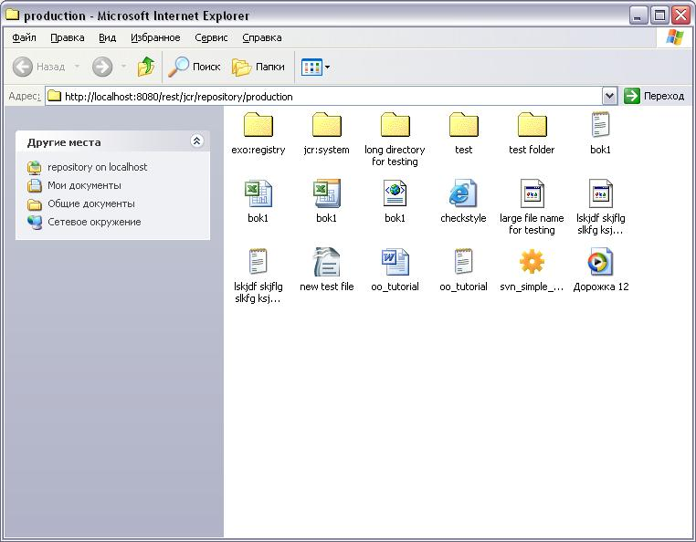
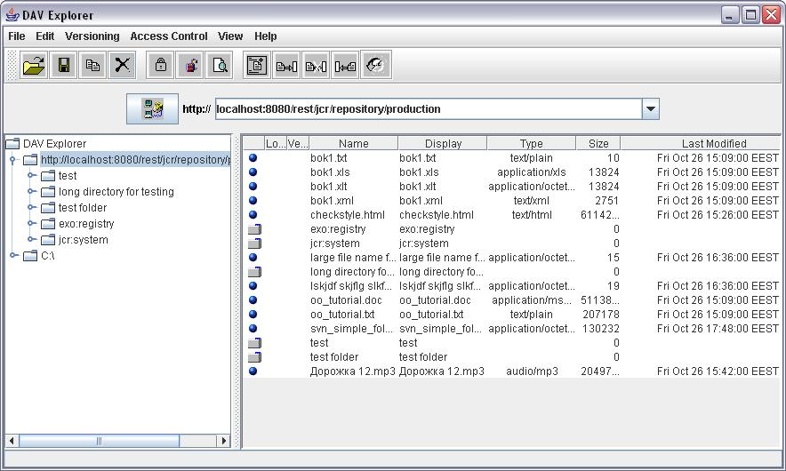
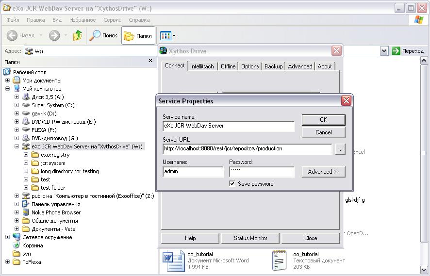
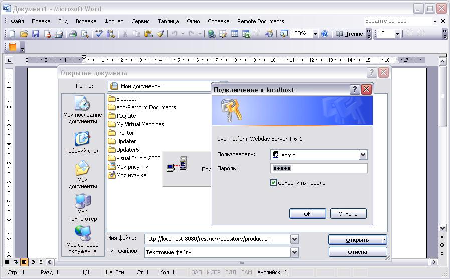
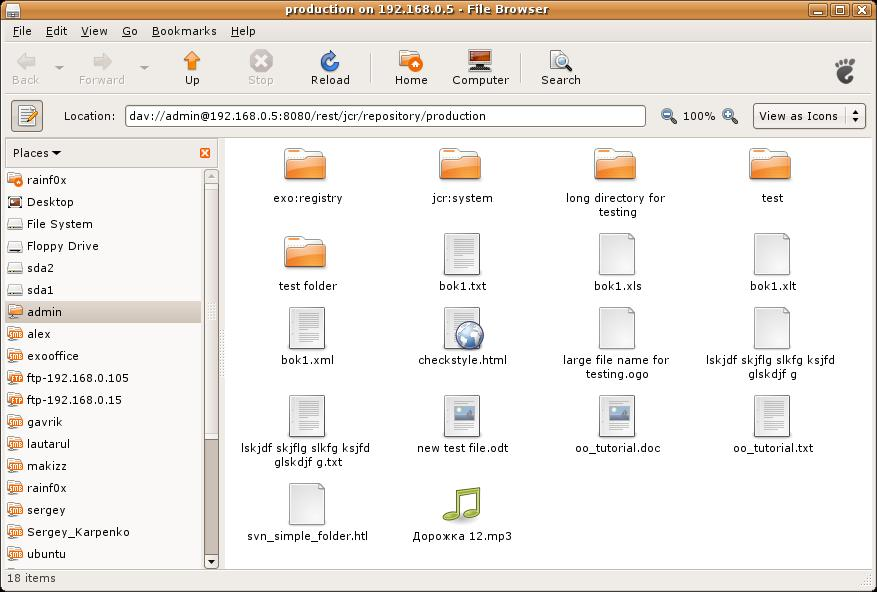
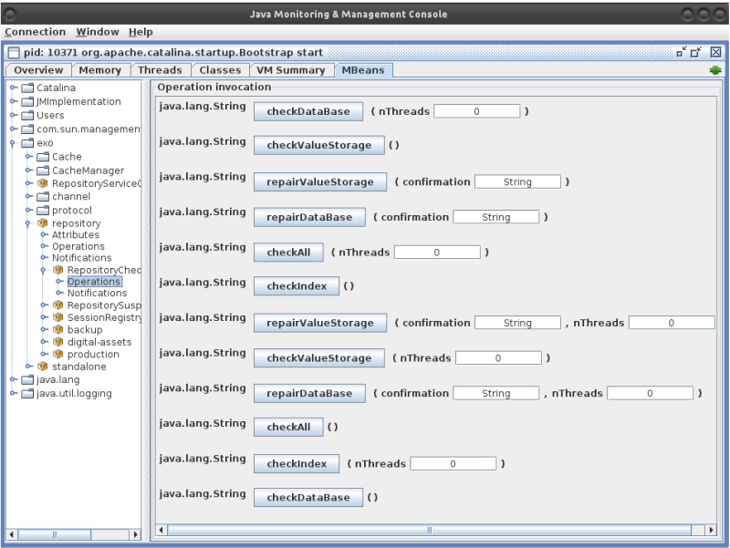

.. _Administration_eXo_JCR:

###############
Administration
###############

    This chapter is divided into 4 administration groups, including:

    -  :ref:`Connectors <chapter-Administration-Connectors>`

       Details of WebDAV, FTP and JCA resource adapter, including
       configuration, parameters and examples.

    -  :ref:`Database <chapter-Administration-Database>`

       Issues related to the database administration, including
       multi-language support and DBCleanService; and instructions on
       how to host several JCR instances on the same database instance.

    -  :ref:`Tools <chapter-Administration-Tools>`

       Necessary information about Session leak detector, Consistency
       checker, and Statistics.

    -  :ref:`Performance tuning <chapter-Administration-PerformanceTuning>`

       Instructions on JBoss AS tuning, JCR cache tuning, Clustering,
       JVM parameters, and Force query hints.

.. _chapter-Administration-Connectors:

==========
Connectors
==========

-  :ref:`WebDAV <JCR.WebDAV>`

   All necessary information about WebDAV, including configuration,
   examples, commands, and restrictions. Also, this part also provides a
   set of frequently asked questions.

-  :ref:`FTP <JCR.FTP>`

   Details of configuration parameters of FTP, such as command-port,
   data-min-port and data-max-port, system, and client-side-encoding.

-  :ref:`JCA resource adapter <JCR.JCA>`

   Details of SessionFactory, configuration, and deployment.

.. _JCR.WebDAV:

WebDAV
~~~~~~~

The WebDAV protocol enables you to use third party tools to communicate
with hierarchical content servers via HTTP. It is possible to add and
remove documents or a set of documents from a path on the server. DeltaV
is an extension of the WebDav protocol that allows managing document
versioning. Locking guarantees protection against multiple access when
writing resources. The ordering support allows changing the position of
the resource in the list and sorts the directory to make the directory
tree viewed conveniently. The fulltext search makes it easy to find the
necessary documents. You can search by using two languages: SQL and
XPATH.

In JCR, you plug in the WebDAV layer on the top of your JCR
implementation, based on the code taken from the extension modules of
the reference implementation, so it is possible to browse a workspace
using third party tools (it can be Windows folders or Mac ones as well
as a Java WebDAV client, such as DAVExplorer or IE using File > Open as
a Web Folder).

Now WebDAV is an extension of the REST service. To get the WebDAV server
ready, you must deploy the REST application. Then, you can access any
workspaces of your repository by using the following URL:

-  `http://host:port/rest/private/jcr/{RepositoryName}/{WorkspaceName}/{Path} <http://host:port/rest/private/jcr/{RepositoryName}/{WorkspaceName}/{Path}>`__

For example, when accessing the WebDAV server with the URL
http://localhost:8080/rest/private/jcr/repository/collaboration, you will
be asked to enter your login and password. Those will then be checked by
using the organization service that can be implemented thanks to an
InMemory (dummy) module or a DB module or an LDAP one and the JCR user
session will be created with the correct JCR Credentials.

.. note:: If you try the "in ECM" option, add "@ecm" to the user's password.
          Alternatively, you may modify jaas.conf by adding the **domain=ecm**
          option as follows:

			::

				exo-domain {
				org.exoplatform.services.security.jaas.BasicLoginModule required domain=ecm;
				};

**Related documents**

-  :ref:`Link Producer <JCR.LinkProducerService>`

.. _JCR.WebDAV.Configuration:

Configuration
-------------

The WebDAV configuration is located at
``platform-extension/WEB-INF/conf/platform/dms/dms-configuration.xml``.

.. code:: xml

    <component>
        <key>org.exoplatform.services.jcr.webdav.WebDavServiceImpl</key>
        <type>org.exoplatform.services.cms.webdav.WebDavServiceImpl</type>
        <init-params>

            <!-- default node type which is used for the creation of collections -->
            <value-param>
                <name>def-folder-node-type</name>
                <value>${webdav.def-folder-node-type:nt:folder}</value>
            </value-param>

            <!-- default node type which is used for the creation of files -->
            <value-param>
                <name>def-file-node-type</name>
                <value>${webdav.def-file-node-type:nt:file}</value>
            </value-param>

            <!-- if MimeTypeResolver can't find the required mime type,
            which conforms with the file extension, and the mimeType header is absent
            in the HTTP request header, this parameter is used as the default mime type-->

            <value-param>
                <name>def-file-mimetype</name>
                <value>${webdav.def-file-mimetype:application/octet-stream}</value>
            </value-param>

            <!-- This parameter indicates one of the three cases when you update the content of the resource by PUT command.
            In case of "create-version", PUT command creates the new version of the resource if this resource exists.
            In case of "replace" - if the resource exists, PUT command updates the content of the resource and its last modification date.
            In case of "add", the PUT command tries to create the new resource with the same name (if the parent node allows same-name siblings).
            In case of "update", if the resource exists, PUT command updates the content of the resource and its last modification date.
            -->

            <value-param>
                <name>update-policy</name>
                <value>${webdav.update-policy:update}</value>
                <!--value>create-version</value-->
                <!--value>replace</value -->
                <!-- value>add</value -->
            </value-param>

            <!--
            This parameter determines how service responds to a method that attempts to modify file content.
            In case of "checkout-checkin" value, when a modification request is applied to a checked-in version-controlled resource, the request is automatically preceded by a checkout and followed by a checkin operation.
            In case of "checkout" value, when a modification request is applied to a checked-in version-controlled resource, the request is automatically preceded by a checkout operation.
            -->
            <value-param>
                <name>auto-version</name>
                <!--value>checkout-checkin</value-->
                <value>${webdav.auto-version:checkin-checkout}</value>
            </value-param>

            <!--
            This parameter will define the path to the folder nodes icon.
            -->
            <value-param>
                <name>folder-icon-path</name>
                <value>${webdav.folder-icon-path:/eXoWCMResources/skin/images/file/nt-folder.png}</value>
            </value-param>

            <!--
            This parameter is responsible for managing Cache-Control header value which will be returned to the client.
            You can use patterns like "text/*", "image/*" or wildcard to define the type of content.
            -->
            <value-param>
                <name>cache-control</name>
                <value>${webdav.cache-control:text/*:max-age=3600;image/*:max-age=1800;*/*:no-cache}</value>
            </value-param>

            <values-param>
                <name>untrusted-user-agents</name>
                <value>Microsoft Office Core Storage Infrastructure/1.0</value>
            </values-param>

        </init-params>
      </component>

.. note:: If the ``MimeTypeResolver`` throws exceptions of type
		  "eu.medsea.mimeutil.detector.InvalidMagicMimeEntryException: Invalid
		  Magic Mime Entry" on RHEL or CentOS, you should use the MIME cache
		  file instead of the magic MIME file. To provide the full path to the
		  MIME cache file, you will need to use the ``exo.mime.cache`` system
		  property.

.. _JCR.WebDAV.Examples:

Examples
--------

At present, the JCR WebDAV server is tested by using MS Internet
Explorer, `Dav Explorer <http://www.ics.uci.edu/~webdav>`__, `Xythos
Drive <http://www.blackboard.com/Platforms/Learn/Products/Blackboard-Learn/Blackboard-Xythos/Xythos-Drive.aspx>`__,
Microsoft Office 2003 (as client), and Ubuntu Linux.

-  **MS Internet Explorer**: Click File > eXo JCR WebDav.

   |image0|

-  **DAV Explorer**

   |image1|

-  **Xythos Drive**

   |image2|

-  **Microsoft Office 2003** (as client): Select File > Open with typing
   http://... href in the file name box.

   |image3|

-  **Ubuntu Linux**

   |image4|

.. _JCR.WebDAV.ComparisonTableOfWebDavAndJCRCommands:

WebDAV and JCR commands
-----------------------

+-------------------+-------------------------------------------------------------------------------------+
| WebDAV            | JCR                                                                                 |
+===================+=====================================================================================+
| COPY              | Workspace.copy(...)                                                                 |
+-------------------+-------------------------------------------------------------------------------------+
| DELETE            | Node.remove()                                                                       |
+-------------------+-------------------------------------------------------------------------------------+
| GET               | Node.getProperty(...); Property.getValue()                                          |
+-------------------+-------------------------------------------------------------------------------------+
| HEAD              | Node.getProperty(...); Property.getLength()                                         |
+-------------------+-------------------------------------------------------------------------------------+
| MKCOL             | Node.addNode(...)                                                                   |
+-------------------+-------------------------------------------------------------------------------------+
| MOVE              | Session.move(...) or Workspace.move(...)                                            |
+-------------------+-------------------------------------------------------------------------------------+
| PROPFIND          | Session.getNode(...); Node.getNode(...);Node.getNodes(...); Node.getProperties()    |
+-------------------+-------------------------------------------------------------------------------------+
| PROPPATCH         | Node.setProperty(...);Node.getProperty(...).remove()                                |
+-------------------+-------------------------------------------------------------------------------------+
| PUT               | Node.addNode("node","nt:file");Node.setProperty("jcr:data", "data")                 |
+-------------------+-------------------------------------------------------------------------------------+
| CHECKIN           | Node.checkin()                                                                      |
+-------------------+-------------------------------------------------------------------------------------+
| CHECKOUT          | Node.checkout()                                                                     |
+-------------------+-------------------------------------------------------------------------------------+
| REPORT            | Node.getVersionHistory(); VersionHistory.getAllVersions();Version.getProperties()   |
+-------------------+-------------------------------------------------------------------------------------+
| UNCHECKOUT        | Node.restore(...)                                                                   |
+-------------------+-------------------------------------------------------------------------------------+
| VERSION-CONTROL   | Node.addMixin("mix:versionable")                                                    |
+-------------------+-------------------------------------------------------------------------------------+
| LOCK              | Node.lock(...)                                                                      |
+-------------------+-------------------------------------------------------------------------------------+
| UNLOCK            | Node.unlock()                                                                       |
+-------------------+-------------------------------------------------------------------------------------+
| ORDERPATCH        | Node.orderBefore(...)                                                               |
+-------------------+-------------------------------------------------------------------------------------+
| SEARCH            | Workspace.getQueryManager(); QueryManager.createQuery();Query.execute()             |
+-------------------+-------------------------------------------------------------------------------------+
| ACL               | Node.setPermission(...)                                                             |
+-------------------+-------------------------------------------------------------------------------------+

.. _JCR.WebDAV.Restrictions:

Restrictions
------------

There are some restrictions for WebDAV in different Operating systems.

**Windows 7/Windows 8**

When you try to set up a web folder by "adding a network location" or
"mapping a network drive" through My Computer, you can get an error
message saying that either "*The folder you entered does not appear to
be valid. Please choose another*" or "*Windows cannot access… Check the
spelling of the name. Otherwise, there might be…*". These errors may
appear when you are using SSL or non-SSL.

To fix this problem, do as follows:

**Windows 7**

Go to **Windows Registry Editor**.

Find a key:
**HKEY\_LOCAL\_MACHINE\\SYSTEM\\CurrentControlset\\services\\WebClient\\Parameters**.

Select BasicAuthLevel (you might create it as **REG\_DWORD** key if it
does not exist) and change its value to 2.

Reboot.

**Windows 8**

Go to **Windows Registry Editor**.

Find a key:
**HKEY\_LOCAL\_MACHINE\\SYSTEM\\CurrentControlset\\services\\WebClient\\Parameters**.

Select UseBasicAuth (you might create it as **REG\_DWORD** key if it
does not exist) and change its value to 1.

Select BasicAuthLevel (you might create it as **REG\_DWORD** key if it
does not exist) and change its value to 2.

Reboot.

**Microsoft Office 2010**

If you have Microsoft Office 2010 or Microsoft Office 2007 applications
installed on a client computer, try to access an Office file that is
stored on a web server that is configured for Basic authentication from
the client computer. The connection between your computer and the web
server does not use Secure Sockets Layer (SSL). When you try to open or
to download the file, you experience the following symptoms:

-  The Office file does not open or download.

-  You do not receive a Basic authentication password prompt when you
   try to open or to download the file.

-  You do not receive an error message when you try to open the file.
   The associated Office application starts. However, the selected file
   does not open.

To enable the Basic authentication on the client computer, do as
follows:

Click **Start**, type **regedit** in the **Start Search** box, and then
press **Enter**.

Locate and then click the following registry subkey:

**HKEY\_CURRENT\_USER\\Software\\Microsoft\\Office\\14.0\\Common\\Internet**

On the **Edit** menu, point to **New**, and then click **DWORD Value**.

Type **BasicAuthLevel**, and then press **Enter**.

Right-click **BasicAuthLevel**, and then click **Modify**.

In the **Value** data box, type 2, and then click **OK**.

.. _JCR.FAQ.WebDAV:

Frequently asked questions
---------------------------

**Q:** **Can I manage the '``cache-control``' value for different
media-types from server configuration?**

**A:** Use the "``cache-control``" configuration parameter.

The value of this parameter must contain colon-separated pairs of the
"``MediaType:cache-control``" value.

For example, if you need to cache all text/xml and text/plain files for
5 minutes (300 sec.) and other text/\\\* files for 10 minutes (600
sec.), use the next configuration:

.. code:: xml

    <component>
        <type>org.exoplatform.services.jcr.webdav.WebDavServiceImpl</type>
        <init-params>
            <value-param>
                <name>cache-control</name>
                <value>text/xml,text/plain:max-age=300;text/*:max-age=600;</value>
            </value-param>
        <init-params>
    <component>

**Q:** **How to perform WebDAV requests using curl?**

**A:** **Simple Requests**:

For simple requests, such as GET, HEAD, MKCOL, COPY, MOVE, DELETE,
CHECKIN, CHECKOUT, UNCHECKOUT, LOCK, UNLOCK, VERSIONCONTROL, and
OPTIONS, perform:

::

    curl -i -u 'user:pass' -X 'METHOD_NAME' 'resource_url'

For example, to create a folder named "*test*", perform as follows:

::

    curl -i -u 'root:exo' -X MKCOL 'http://localhost:8080/rest/private/jcr/repository/production/test
          

To PUT the ``test.txt`` file from your current folder to the "*test*"
folder on the server, perform as follows:

::

    curl -i -u 'root:exo' -X PUT 'http://localhost:8080/rest/private/jcr/repository/production/test/test.txt'
            -d
            @test.txt
          

**Requests with XML body**:

For requests which contain the XML body, such as ORDER, PROPFIND,
PROPPATCH, REPORT, and SEARCH, add **-d 'xml\_body text'** or **-d
@body.xml** to your curl-command:

::

    curl -i -u 'user:pass' -X 'METHOD_NAME' -H 'Headers' 'resource_url' -d 'xml_body text'
          

    **Note**

    ``body.xml`` must contain a valid xml request body.

For example, to find all files containing "test", perform as follows:

::

    curl -i -u "root:exo" -X "SEARCH" "http://192.168.0.7:8080/rest/jcr/repository/production/" -d
            "<?xml version='1.0' encoding='UTF-8' ?>
            <D:searchrequest xmlns:D='DAV:'>
            <D:sql>SELECT * FROM nt:base WHERE contains(*, 'text')</D:sql>
            </D:searchrequest>"
          

If you need to add some headers to your request, use **\\-H** key.

To have more information about methods parameters, you can find in 
`HTTP Extensions for Distributed Authoring <http://www.ietf.org/rfc/rfc2518.txt>`__ 
specification.

**Q:** **How does eXo JCR WebDAV server treat content encoding?**

**A:** OS client (Windows, Linux, and more) does not set an encoding in
a request, but the JCR WebDAV server looks for an encoding in a
*Content-Type* header and set it to *jcr:encoding*. See
http://www.w3.org/Protocols/rfc2616/rfc2616-sec14.html 14.17
Content-Type (e.g. Content-Type: text/html; charset=ISO-8859-4). So, if
a client sets the *Content-Type* header, for example, *JS code* from a
page, it will work for a text file as expected.

If WebDAV request does not contain a content encoding, it is possible to
write a dedicated action in a customer application. The action will set
*jcr:encoding* using its own logic, for example, based on IP or user
preferences.

.. _JCR.FTP:

FTP
~~~~

The JCR-FTP Server represents the standard eXo service, operates as an
FTP server with an access to a content stored in JCR repositories in the
form of **nt:file/nt:folder** nodes or their successors. The client of
an executed Server can be any FTP client. The FTP server is supported by
a standard configuration which can be changed as required.

FTP includes the following configuration parameters:

-  ``command-port``

   .. code:: xml

       <value-param>
          <name>command-port</name>
          <value>21</value>
       </value-param>

   The value of the command channel port. The value '21' is set by
   default.

   When you have already some FTP servers installed in your system, this
   parameter needs to be changed (for example, 2121) to avoid conflicts
   or if the port is protected.

-  ``data-min-port & data-max-port``

   .. code:: xml

       <value-param>
          <name>data-min-port</name>
          <value>52000</value>
       </value-param>

   .. code:: xml

       <value-param>
          <name>data-max-port</name>
          <value>53000</value>
       </value-param>

   These two parameters indicate the minimal and maximal values of the
   range of ports respectively, used by the server. The usage of the
   additional data channel is required by the FTP - protocol, which is
   used to transfer the file content and the categories list. This range
   of ports should be free from listening by other server-programs.

-  ``system``

   .. code:: xml

       <value-param>
          <name>system</name>

          <value>Windows_NT</value>
            or
          <value>UNIX Type: L8</value>
       </value-param>

   Types of formats of listing of catalogues which are supported.

-  ``client-side-encoding``

   .. code:: xml

       <value-param>
          <name>client-side-encoding</name>
             
          <value>windows-1251</value>
            or
          <value>KOI8-R</value>
            
       </value-param>

   This parameter specifies the coding which is used for dialogue with
   the client.

-  ``def-folder-node-type``

   .. code:: xml

       <value-param>
          <name>def-folder-node-type</name>
          <value>nt:folder</value>
       </value-param>

   This parameter specifies the type of a node, when an FTP-folder is
   created.

-  ``def-file-node-type``

   .. code:: xml

       <value-param>
          <name>def-file-node-type</name>
          <value>nt:file</value>
       </value-param>

   This parameter specifies the type of a node, when an FTP file is
   created.

-  ``def-file-mime-type``

   .. code:: xml

       <value-param>
          <name>def-file-mime-type</name>                 
          <value>application/zip</value>
       </value-param>

   The MIME type of a created file is chosen by using its file
   extention. In case a server cannot find the corresponding mime type,
   this value is used.

-  ``cache-folder-name``

   .. code:: xml

       <value-param>
          <name>cache-folder-name</name>
          <value>../temp/ftp_cache</value>
       </value-param>

   The Path of the cache folder.

-  ``upload-speed-limit``

   .. code:: xml

       <value-param>
          <name>upload-speed-limit</name>           
          <value>20480</value>
       </value-param>

   Restriction of the upload speed. It is measured in bytes.

-  ``download-speed-limit``

   .. code:: xml

       <value-param>
          <name>download-speed-limit</name>
          <value>20480</value>          
       </value-param>

   Restriction of the download speed. It is measured in bytes.

-  ``timeout``

   .. code:: xml

       <value-param>
          <name>timeout</name>
          <value>60</value>
       </value-param>

   Define the value of a timeout.

-  ``replace-forbidden-chars``

   .. code:: xml

       <value-param>
          <name>replace-forbidden-chars</name>
          <value>true</value>
       </value-param>

   Indicate whether or not the forbidden characters must be replaced.

-  ``forbidden-chars``

   .. code:: xml

       <value-param>
          <name>forbidden-chars</name>
          <value>:[]*'"|</value>
       </value-param>

   Define the list of forbidden characters.

-  ``replace-char``

   .. code:: xml

       <value-param>
               <name>replace-char</name>
               <value>_</value>
               </value-param>

   Define the character that will be used to replace the forbidden
   characters.

.. _JCR.JCA:

JCA resource adapter
~~~~~~~~~~~~~~~~~~~~~

.. note:: JCA is currently supported in eXo Platform JBoss bundle.

JCR supports *J2EE Connector Architecture* 1.5, thus if you want to
delegate the JCR Session lifecycle to your application server, you can
use the JCA resource adapter for eXo JCR. This adapter only supports XA
Transaction, in other words you cannot use it for local transactions.
Since the JCR Sessions have not been designed to be shareable, the
session pooling is simply not covered by the adapter.

**SessionFactory**

The equivalent of the ``javax.resource.cci.ConnectionFactory`` in JCA
terminology is ``org.exoplatform.connectors.jcr.adapter.SessionFactory``
in the context of eXo JCR. The resource that you will get thanks to a
JNDI lookup is of the ``SessionFactory`` type and provides the following
methods:

.. code:: java

       /**
        * Get a JCR session corresponding to the repository
        * defined in the configuration and the default workspace.
        * @return a JCR session corresponding to the criteria
        * @throws RepositoryException if the session could not be created
        */
       Session getSession() throws RepositoryException;

       /**
        * Get a JCR session corresponding to the repository
        * defined in the configuration and the default workspace, using
        * the given user name and password.
        * @param userName the user name to use for the authentication
        * @param password the password to use for the authentication
        * @return a JCR session corresponding to the criteria
        * @throws RepositoryException if the session could not be created
        */
       Session getSession(String userName, String password) throws RepositoryException;

       /**
        * Get a JCR session corresponding to the repository
        * defined in the configuration and the given workspace.
        * @param workspace the name of the expected workspace
        * @return a JCR session corresponding to the criteria
        * @throws RepositoryException if the session could not be created
        */
       Session getSession(String workspace) throws RepositoryException;

       /**
        * Get a JCR session corresponding to the repository
        * defined in the configuration and the given workspace, using
        * the given user name and password.
        * @param workspace the name of the expected workspace
        * @param userName the user name to use for the authentication
        * @param password the password to use for the authentication
        * @return a JCR session corresponding to the criteria
        * @throws RepositoryException if the session could not be created
        */
       Session getSession(String workspace, String userName, String password) throws RepositoryException;

**Configuration**

+---------------------+---------------------------------------------------------------------------------------------------------------------------------------------------------------------------------------------------------------------------------------------------------------------------------------+
| *PortalContainer*   | If no portal container can be found in the context of the request, the adapter will use the value of this parameter to get the name of the expected portal container to create the JCR sessions. This parameter is optional. By default, the default portal container will be used.   |
+---------------------+---------------------------------------------------------------------------------------------------------------------------------------------------------------------------------------------------------------------------------------------------------------------------------------+
| *Repository*        | The repository name used to create JCR sessions. This parameter is optional. By default, the current repository will be used.                                                                                                                                                         |
+---------------------+---------------------------------------------------------------------------------------------------------------------------------------------------------------------------------------------------------------------------------------------------------------------------------------+

**Deployment**

Get/Download the JBoss bundle of eXo Platform 4 or higher.

Go to the ``exo.jcr.connectors.jca`` folder, then run the
``mvn clean install -Pplatform`` command.

Deploy
``exo.jcr.connectors.jca/target/exo.jcr.connectors.jca-1.15.x-GA.rar``
in ``PLATFORM_JBOSS_HOME/standalone/deployments/``, then rename it to
``exo-jcr.rar``.

Configure the resource adapter in
``PLATFORM_JBOSS_HOME/standalone/configuration/standalone-exo.xml`` by
replacing:

::

    <subsystem xmlns="urn:jboss:domain:resource-adapters:1.1"/>

with

::

    <subsystem xmlns="urn:jboss:domain:resource-adapters:1.1">
        <resource-adapters>
            <resource-adapter>
                <archive>exo-jcr.rar</archive>
                <transaction-support>XATransaction</transaction-support>
                <connection-definitions>
                    <connection-definition class-name="org.exoplatform.connectors.jcr.impl.adapter.ManagedSessionFactory"
                    jndi-name="java:/jcr/Repository">
                        <config-property name="PortalContainer">portal</config-property>
                        <config-property name="Repository">repository</config-property>
                    </connection-definition>
                </connection-definitions>
            </resource-adapter>
        </resource-adapters>
    </subsystem>

.. _chapter-Administration-Database:

========
Database
========

-  :ref:`Multi-language support in eXo JCR RDB backend <JCR.MultilanguageSupport>`

   Details of multi-language JCR on Oracle, DB2, MySQL and PostgreSQL.

-  :ref:`DB Clean Service <JCR.DBCleanService>`

   Methods of DBCleanService, and instructions on how to clean only
   single workspace and the whole repository.

-  :ref:`How to host several JCR instances on the same database instance? <JCR.MultiDBSchemaSupport>`

   How to apply configuration changes on LockManager and
   HibernateService.

-  :ref:`Frequently asked questions <JCR.FAQ.Database>`

   Many useful questions and their answers which are common in Database.

.. _chapter-Administration-Database.GeneralSettings:

General settings
~~~~~~~~~~~~~~~~~

.. note:: Note that JCR requires at least READ\_COMMITED isolation level and
          other RDBMS configurations can cause some side-effects and issues.
          So, make sure proper isolation level is configured on database
          server side.

**DB2 configuration**

-  Statistics is collected
   `automatically <http://publib.boulder.ibm.com/infocenter/db2luw/v9/index.jsp?topic=/com.ibm.db2.udb.admin.doc/doc/c0011762.htm>`__
   starting from DB2 Version 9, however it is needed to launch
   statistics collection manually during the very first start, otherwise
   it could be very long. You need to run the following
   '`RUNSTATS <http://publib.boulder.ibm.com/infocenter/db2luw/v9/index.jsp?topic=/com.ibm.db2.udb.admin.doc/doc/r0001980.htm>`__'
   command for JCR\_SITEM (or JCR\_MITEM) and JCR\_SVALUE (or
   JCR\_MVALUE) tables.

   ::

       RUNSTATS ON TABLE <scheme>.<table> WITH DISTRIBUTION AND INDEXES ALL

**MySQL configuration**

-  To prevent any consistency issues, ensure that InnoDB is configured
   as the default MySQL engine (instead of MyISAM by default) before
   launching your application for the very first time. Otherwise, when
   the application creates the tables, MyISAM will be used as the MySQL
   engine which is not transactional and does not support integrity
   constraints. Even if later you switch to InnoDB using an alter table,
   all the integrity constraints would be missing as they would have
   been removed tables at the time of the table creation.

-  MyISAM is not supported due to its lack of transaction support and
   integrity check. Use it only if you do not expect any support and if
   performances in read accesses are more important than the consistency
   in your usecase. Therefore, the *mysql-myisam* and
   *mysql-myisam-utf8* dialects are only dedicated to the community.

-  MySQL relies on collected statistics for keeping track of data
   distribution in tables and for optimizing join statements, but you
   can manually call
   '`ANALYZE <http://dev.mysql.com/doc/refman/5.0/en/analyze-table.html>`__'
   to update statistics if needed.

   For example:

   ::

       ANALYZE TABLE JCR_SITEM, JCR_SVALUE

**PostgreSQL/PostgrePlus configuration**

-  When using the RDBMS re-indexing, you need to set
   "``enable_seqscan``" to "``off``" or "``default_statistics_target``"
   to at least "50".

-  Though the PostgreSQL/PostgrePlus server performs query optimization
   automatically, you can manually call the
   '`ANALYZE <http://www.postgresql.org/docs/8.1/static/sql-analyze.html>`__'
   command to collect statistics which can affect the performance.

   For example:

   ::

       ANALYZE JCR_SITEM
       ANALYZE JCR_SVALUE

-  For a version prior to 9.1, the ``standard_conforming_strings``
   parameter is enabled, you need to use "``pgsql-scs``" as dialect.

**MS SQL configuration**

-  One more mandatory JCR requirement for underlying databases is a case
   sensitive collation. Microsoft SQL Server both 2005 and 2008
   customers must configure their server with collation corresponding to
   personal needs and requirements, but obligatorily case sensitive.
   Refer
   `here <http://msdn.microsoft.com/en-us/library/ms144250.aspx>`__ for
   more information on selecting SQL Server Collation.

-  MS SQL DB server's optimizer automatically processes queries to
   increase performance. Optimization is based on statistical data which
   is collected automatically, but you can manually call
   `Transact-SQL <http://en.wikipedia.org/wiki/Transact-SQL>`__ by the
   '`UPDATE
   STATISTICS <http://msdn.microsoft.com/en-us/library/ms187348.aspx>`__'
   command which in very few situations may increase performance.

   For example:

   ::

       UPDATE STATISTICS JCR_SITEM
       UPDATE STATISTICS JCR_SVALUE

**Sybase configuration**

-  Sybase DB Server optimizer automatically processes queries to
   increase performance. Optimization is based on statistical data which
   is collected automatically, but you can manually call
   `Transact-SQL <http://en.wikipedia.org/wiki/Transact-SQL>`__ by the
   '`update
   statistics <http://manuals.sybase.com/onlinebooks/group-as/asg1250e/sqlug/@Generic__BookTextView/37166;pt=37125>`__'
   command which may increase performance in very few situations.

   For example:

   ::

       update statistics JCR_SITEM
       update statistics JCR_SVALUE

**Oracle configuration**

-  Oracle DB automatically collects statistics to optimize performance
   of queries, but you can manually call the
   '`ANALYZE <http://docs.oracle.com/cd/B13789_01/server.101/b10759/statements_4005.htm>`__'
   command to start collecting statistics immediately which may improve
   performance.

   For example:

   ::

       ANALYZE INDEX JCR_PK_SITEM COMPUTE STATISTICS
       ANALYZE INDEX JCR_IDX_SITEM_PARENT_FK COMPUTE STATISTICS
       ANALYZE INDEX JCR_IDX_SITEM_PARENT COMPUTE STATISTICS
       ANALYZE INDEX JCR_IDX_SITEM_PARENT_NAME COMPUTE STATISTICS
       ANALYZE INDEX JCR_IDX_SITEM_PARENT_ID COMPUTE STATISTICS
       ANALYZE INDEX JCR_PK_SVALUE COMPUTE STATISTICS
       ANALYZE INDEX JCR_IDX_SVALUE_PROPERTY COMPUTE STATISTICS
       ANALYZE INDEX JCR_PK_SREF COMPUTE STATISTICS
       ANALYZE INDEX JCR_IDX_SREF_PROPERTY COMPUTE STATISTICS
       ANALYZE INDEX JCR_PK_SCONTAINER COMPUTE STATISTICS

.. _JCR.MultilanguageSupport:

Multi-language support in eXo JCR RDB backend
~~~~~~~~~~~~~~~~~~~~~~~~~~~~~~~~~~~~~~~~~~~~~~

Whenever relational database is used to store multilingual text data of
eXo Java Content Repository, it is necessary to adapt configuration in
order to support UTF-8 encoding. Here is a short instruction for several
supported RDBMS with examples.

Modify the ``repository-configuration.xml`` file which can be found in
:ref:`various locations <repository-configuration-file-locations>`.

.. note:: The ``jdbcjcr`` datasource used in examples can be configured via
          the ``InitialContextInitializer`` component.

-  **Oracle**

   In order to run multilanguage JCR on an Oracle backend Unicode
   encoding for characters set should be applied to the database. Other
   Oracle globalization parameters do not make any impact. The only
   property to modify is ``NLS_CHARACTERSET``.

   We have tested ``NLS_CHARACTERSET`` = ``AL32UTF8`` and it works well
   for many European and Asian languages.

   Example of the database configuration:

   ::

       NLS_LANGUAGE             AMERICAN
       NLS_TERRITORY            AMERICA
       NLS_CURRENCY             $
       NLS_ISO_CURRENCY         AMERICA
       NLS_NUMERIC_CHARACTERS   .,
       NLS_CHARACTERSET         AL32UTF8
       NLS_CALENDAR             GREGORIAN
       NLS_DATE_FORMAT          DD-MON-RR
       NLS_DATE_LANGUAGE        AMERICAN
       NLS_SORT                 BINARY
       NLS_TIME_FORMAT          HH.MI.SSXFF AM
       NLS_TIMESTAMP_FORMAT     DD-MON-RR HH.MI.SSXFF AM
       NLS_TIME_TZ_FORMAT       HH.MI.SSXFF AM TZR
       NLS_TIMESTAMP_TZ_FORMAT  DD-MON-RR HH.MI.SSXFF AM TZR
       NLS_DUAL_CURRENCY        $
       NLS_COMP                 BINARY
       NLS_LENGTH_SEMANTICS     BYTE
       NLS_NCHAR_CONV_EXCP      FALSE
       NLS_NCHAR_CHARACTERSET   AL16UTF16

       **Warning**

       JCR does not use the NVARCHAR columns so that the value of the
       ``NLS_NCHAR_CHARACTERSET`` parameter does not matter for JCR.

   Create database with Unicode encoding and use Oracle dialect for the
   Workspace Container:

   .. code:: xml

       <workspace name="collaboration">
                 <container class="org.exoplatform.services.jcr.impl.storage.jdbc.optimisation.CQJDBCWorkspaceDataContainer">
                   <properties>
                     <property name="source-name" value="jdbcjcr" />
                     <property name="dialect" value="oracle" />
                     <property name="multi-db" value="false" />
                     <property name="max-buffer-size" value="200k" />
                     <property name="swap-directory" value="target/temp/swap/ws" />
                   </properties>
                 .....

-  **DB2**

   DB2 Universal Database (DB2 UDB) supports `UTF-8 and
   UTF-16/UCS-2 <http://publib.boulder.ibm.com/infocenter/db2luw/v9/index.jsp?topic=/com.ibm.db2.udb.admin.doc/doc/c0004821.htm>`__.
   When a Unicode database is created, CHAR, VARCHAR, LONG VARCHAR data
   are stored in UTF-8 form. It is enough for JCR multi-lingual support.

   Example of UTF-8 database creation:

   ::

       DB2 CREATE DATABASE dbname USING CODESET UTF-8 TERRITORY US

   Create database with UTF-8 encoding and use db2 dialect for Workspace
   Container on DB2 v.9 and higher:

   .. code:: xml

       <workspace name="collaboration">
                 <container class="org.exoplatform.services.jcr.impl.storage.jdbc.optimisation.CQJDBCWorkspaceDataContainer">
                   <properties>
                     <property name="source-name" value="jdbcjcr" />
                     <property name="dialect" value="db2" />
                     <property name="multi-db" value="false" />
                     <property name="max-buffer-size" value="200k" />
                     <property name="swap-directory" value="target/temp/swap/ws" />
                   </properties>
                 .....

.. note:: For DB2 v.8.x support change the property "dialect" to db2v8.

-  **MySQL**

   JCR MySQL-backend requires special dialect
   `MySQL-UTF8 <http://dev.mysql.com/doc/refman/5.0/en/charset-unicode-utf8.html>`__
   to be used for internationalization support. But the database default
   charset should be latin1 to use limited index space effectively (1000
   bytes for MyISAM engine, 767 for InnoDB). If database default charset
   is multibyte, a JCR database initialization error is thrown
   concerning index creation failure. In other words, JCR can work on
   any singlebyte default charset of database, with UTF8 supported by
   MySQL server. But we have tested it only on latin1 database default
   charset.

   Repository configuration, workspace container entry example:

   .. code:: xml

       <workspace name="collaboration">
                 <container class="org.exoplatform.services.jcr.impl.storage.jdbc.optimisation.CQJDBCWorkspaceDataContainer">
                   <properties>
                     <property name="source-name" value="jdbcjcr" />
                     <property name="dialect" value="mysql-utf8" />
                     <property name="multi-db" value="false" />
                     <property name="max-buffer-size" value="200k" />
                     <property name="swap-directory" value="target/temp/swap/ws" />
                   </properties>
                 .....

   You will also need to indicate the charset name either at the server
   level using the ``--character-set-server`` server parameter (See more
   details
   `here <http://dev.mysql.com/doc/refman/5.0/en/server-options.html#option_mysqld_character-set-server>`__)
   or at the datasource configuration level by adding a new property as
   below:

   .. code:: xml

       <property name="connectionProperties" value="useUnicode=yes;characterEncoding=utf8;characterSetResults=UTF-8;" />

-  **PostgreSQL/PostgrePlus**

   On PostgreSQL/PostgrePlus-backend, multilingual support can be
   enabled in `different
   ways <http://www.postgresql.org/docs/8.3/interactive/charset.html>`__:

   -  Using the locale features of the operating system to provide
      locale-specific collation order, number formatting, translated
      messages, and other aspects. UTF-8 is widely used on Linux
      distributions by default, so it can be useful in such case.

   -  Providing a number of different character sets defined in the
      PostgreSQL/PostgrePlus server, including multiple-byte character
      sets, to support storing text of any languages, and providing
      character set translation between client and server. It is
      recommended that you use the UTF-8 database charset, it will allow
      any-to-any conversations and make this issue transparent for the
      JCR.

   Create database with UTF-8 encoding and use a PgSQL dialect for
   Workspace Container:

   .. code:: java

       <workspace name="collaboration">
                 <container class="org.exoplatform.services.jcr.impl.storage.jdbc.optimisation.CQJDBCWorkspaceDataContainer">
                   <properties>
                     <property name="source-name" valBut some of our customersue="jdbcjcr" />
                     <property name="dialect" value="pgsql" />
                     <property name="multi-db" value="false" />
                     <property name="max-buffer-size" value="200k" />
                     <property name="swap-directory" value="target/temp/swap/ws" />
                   </properties>
                 ....:.

.. _JCR.DBCleanService:

DB Clean Service
~~~~~~~~~~~~~~~~~

It is a special service for data removal from database. The section
shortly describes the working principles of *DBCleanerTool* under all
databases.

-  **Methods of DBCleanService**

.. note:: Code that invokes the methods of DBCleanService must have the
          *JCRRuntimePermissions.MANAGE\_REPOSITORY\_PERMISSION*
          permission.

   There are several methods of *DBCleanService*:

   +------------------------------------------------------------------------------------------------------------------------------+---------------------------------------------------------------------------------------------------------------+
   | ``public static void cleanWorkspaceData(WorkspaceEntry wsEntry) throws DBCleanException``                                    | Cleans up workspace data from database.                                                                       |
   +------------------------------------------------------------------------------------------------------------------------------+---------------------------------------------------------------------------------------------------------------+
   | ``public static void cleanRepositoryData(RepositoryEntry rEntry) throws DBCleanException``                                   | Cleans up repository data from database.                                                                      |
   +------------------------------------------------------------------------------------------------------------------------------+---------------------------------------------------------------------------------------------------------------+
   | ``public static DBCleanerTool getWorkspaceDBCleaner(Connection jdbcConn, WorkspaceEntry wsEntry) throws DBCleanException``   | Returns database cleaner of workspace.                                                                        |
   +------------------------------------------------------------------------------------------------------------------------------+---------------------------------------------------------------------------------------------------------------+
   | ``public static DBCleanerTool getRepositoryDBCleaner(Connection jdbcConn, RepositoryEntry rEntry)``                          | Returns database cleaner of repository. The "null" value is returned in case of the multi-db configuration.   |
   +------------------------------------------------------------------------------------------------------------------------------+---------------------------------------------------------------------------------------------------------------+

   The cleaning is a part of restoring from backup and it is used in the
   following restore phases:

   +----------------+------------------------------------+
   | ``clean``      | .. code:: java                     |
   |                |                                    |
   |                |     DBCleanerTool.clean();         |
   +----------------+------------------------------------+
   | ``restore``    | Does nothing with DBCleanerTool.   |
   +----------------+------------------------------------+
   | ``commit``     | .. code:: java                     |
   |                |                                    |
   |                |     DBCleanerTool.commit();        |
   +----------------+------------------------------------+
   | ``rollback``   | .. code:: java                     |
   |                |                                    |
   |                |     DBCleanerTool.rollback();      |
   +----------------+------------------------------------+

   Different approaches are used for database cleaning depending on
   database and JCR configuration.

-  **Need to clean only single workspace**

   Simple cleaning records from JCR table is used in case of single-db
   configuration.

   **PostgreSQL/PostgrePlus, DB2 and MSSQL**

   +------------------+-------------------------------------------------------------------------------------------+
   | ``clean()``      | Removes all records from the database. Foreign key of JCR\_SITEM table is also removed.   |
   +------------------+-------------------------------------------------------------------------------------------+
   | ``commit()``     | Adds the foreign key.                                                                     |
   +------------------+-------------------------------------------------------------------------------------------+
   | ``rollback()``   |                                                                                           |
   +------------------+-------------------------------------------------------------------------------------------+

   **Oracle, Sybase, HSQLDB, MySQL**

   +------------------+-----------------------------------------------------------------------------------------------+
   | ``clean()``      | Removes all records from the database. The foreign key of JCR\_SITEM table is also removed.   |
   +------------------+-----------------------------------------------------------------------------------------------+
   | ``commit()``     | Adds the foreign key.                                                                         |
   +------------------+-----------------------------------------------------------------------------------------------+
   | ``rollback()``   | Adds the foreign key.                                                                         |
   +------------------+-----------------------------------------------------------------------------------------------+

   Either removing or renaming JCR tables are used in case of the
   mult-db configuration.

   **PostgreSQL/PostgrePlus, DB2 and MSSQL**

   +------------------+-----------------------------------------------------------------------------------------------------------------------------------------+
   | ``clean()``      | Removes tables JCR\_MVALUE, JCR\_MREF, JCR\_MITEM, initializes new tables without the foreign key of the JCR\_MITEM table, adds root.   |
   +------------------+-----------------------------------------------------------------------------------------------------------------------------------------+
   | ``commit()``     | Adds the foreign key.                                                                                                                   |
   +------------------+-----------------------------------------------------------------------------------------------------------------------------------------+
   | ``rollback()``   |                                                                                                                                         |
   +------------------+-----------------------------------------------------------------------------------------------------------------------------------------+

   **Oracle, Sybase, HSQLDB, MySQL**

   +------------------+---------------------------------------------------------------------------------------------------------------------------------------------------------------+
   | ``clean()``      | Renames the current tables, initializes new tables without the foreign key of the JCR\_MITEM table, adds root node, and removes indexes for some databases.   |
   +------------------+---------------------------------------------------------------------------------------------------------------------------------------------------------------+
   | ``commit()``     | Renames tables, and adds indexes.                                                                                                                             |
   +------------------+---------------------------------------------------------------------------------------------------------------------------------------------------------------+
   | ``rollback()``   | Removes the previously renamed tables, adds indexes, and adds the foreign key.                                                                                |
   +------------------+---------------------------------------------------------------------------------------------------------------------------------------------------------------+

-  **Need to clean the whole repository**

   In case of single-db, all workspaces will be processed simultaneously
   as in case of single workspace multi-db configuration. For multi-db,
   every workspace will be processed separately as in case of single
   workspace multi-db configuration.

.. _JCR.MultiDBSchemaSupport:

How to host several JCR instances on the same database instance?
~~~~~~~~~~~~~~~~~~~~~~~~~~~~~~~~~~~~~~~~~~~~~~~~~~~~~~~~~~~~~~~~~

Frequently, a single database instance must be shared by several other
applications, but you can host several JCR instances in the same
database instance. To fulfill this need, you have to review your queries
and scope them to the current schema; it is now possible to have one JCR
instance per DB schema instead of per DB instance. Also, you will need
to apply the configuration changes described below.

-  **Lock Manager configuration**

   To enable this feature, you need to replace
   ``org.jboss.cache.loader.JDBCCacheLoader`` with
   ``org.exoplatform.services.jcr.impl.core.lock.jbosscache.JDBCCacheLoader``
   in the JBossCache configuration file.

   Here is an example of this very part of the configuration:

   .. code:: xml

       <jbosscache xmlns:xsi="http://www.w3.org/2001/XMLSchema-instance" xmlns="urn:jboss:jbosscache-core:config:3.1">

          <locking useLockStriping="false" concurrencyLevel="500" lockParentForChildInsertRemove="false"
             lockAcquisitionTimeout="20000" />

          <clustering mode="replication" clusterName="${jbosscache-cluster-name}">
             <stateRetrieval timeout="20000" fetchInMemoryState="false" />
             <sync />
          </clustering>

          <loaders passivation="false" shared="true">
             <!-- All the data of the JCR locks needs to be loaded at startup -->
             <preload>
                <node fqn="/" />
             </preload>  
             <!--
             For another cache-loader class you should use another template with
             cache-loader specific parameters
             -->
             <loader class="org.exoplatform.services.jcr.impl.core.lock.jbosscache.JDBCCacheLoader" async="false" fetchPersistentState="false"
                ignoreModifications="false" purgeOnStartup="false">
                <properties>
                   cache.jdbc.table.name=${jbosscache-cl-cache.jdbc.table.name}
                   cache.jdbc.table.create=${jbosscache-cl-cache.jdbc.table.create}
                   cache.jdbc.table.drop=${jbosscache-cl-cache.jdbc.table.drop}
                   cache.jdbc.table.primarykey=${jbosscache-cl-cache.jdbc.table.primarykey}
                   cache.jdbc.fqn.column=${jbosscache-cl-cache.jdbc.fqn.column}
                   cache.jdbc.fqn.type=${jbosscache-cl-cache.jdbc.fqn.type}
                   cache.jdbc.node.column=${jbosscache-cl-cache.jdbc.node.column}
                   cache.jdbc.node.type=${jbosscache-cl-cache.jdbc.node.type}
                   cache.jdbc.parent.column=${jbosscache-cl-cache.jdbc.parent.column}
                   cache.jdbc.datasource=${jbosscache-cl-cache.jdbc.datasource}
                </properties>
             </loader>
          </loaders>
       </jbosscache>

   You can also obtain a file example from
   `GitHub <https://github.com/exoplatform/jcr/tree/stable/2.5.x/exo.jcr.component.core/src/test/resources/conf/standalone/cluster/test-jbosscache-lock.xml>`__.

-  **HibernateService configuration**

   If you use ``HibernateService`` for JDBC connections management, you
   will need to specify explicitly the default schema by setting the
   "``hibernate.default_schema``" property in the configuration of
   ``HibernateService``.

   Here is an example:

   .. code:: xml

       <component>
           <key>org.exoplatform.services.database.HibernateService</key>
           <jmx-name>database:type=HibernateService</jmx-name>
           <type>org.exoplatform.services.database.impl.HibernateServiceImpl</type>
           <init-params>
             <properties-param>
               <name>hibernate.properties</name>
               <description>Default Hibernate Service</description>
               ...........
               <property name="hibernate.default_schema" value="${gatein.idm.datasource.schema:}"/>
             </properties-param>
           </init-params>
       </component>

.. _JCR.FAQ.Database:

Frequently asked questions
~~~~~~~~~~~~~~~~~~~~~~~~~~~

**Q:** **Which database server is better for eXo JCR?**

**A:** If the question is about the performance, it is difficult to
answer, because each database can be configured to have better
performance in a special case. According to the results of our internal
tests, the best choice is **Oracle 11G R2** even when you store the
binary data in the database. For other databases, it is recommended to
store the binary data in the file system unless you have only small file
content to store. MySQL and PostgreSQL are also demonstrated in our
benchmark results that they could provide good performance. DB2 and
MSSQL are slower in default configurations. The default configuration of
Sybase is the slowest, but in this question, take the database server
maintenance into account. The installation of MySQL and PostgreSQL is
simple and they can work even on any limited hardware. The same actual
for maintenance during the work. Note for Sybase:
"check-sns-new-connection" data container configuration parameter should
be set to "true". For testing purpose, embedded database such as HSQLDB
is the best choice. Apache Derby and H2 are also supported. But, H2
surprisingly needs "beta" feature enabled - MVCC=TRUE in JDBC URL.

**Q:** **How to setup eXo JCR for multilingual content on MySQL?**

**A:** MySQL database should be created in utf8 encoding with collation
utf8\_bin, since eXo JCR is case-sensitive:

::

    CREATE DATABASE db1 CHARACTER SET utf8 COLLATE utf8_bin;

The eXo JCR application (for example, GateIn) should use JCR dialect
"MySQL-UTF8".

    **Note**

    The "MySQL-UTF8" dialect cannot be auto-detected, it should be set
    explicitly in the configuration.

**Q:** **Does MySQL have limitation affecting on eXo JCR features?**

**A:** Index's key length of JCR\_SITEM (JCR\_MITEM) table for
mysql-utf8 dialect is reduced to 765 bytes (or 255 chars).

**Q:** **Does use of Sybase database need special options in eXo JCR
configuration?**

**A:** To enable JCR to work properly with Sybase, a
``check-sns-new-connection`` property with the '``false``' value is
required for each workspace data container:

.. code:: xml

    <container class="org.exoplatform.services.jcr.impl.storage.jdbc.optimisation.CQJDBCWorkspaceDataContainer">
        <properties>
            <property name="source-name" value="jdbcjcr" />
            <property name="dialect" value="auto" />
            <property name="multi-db" value="true" />
            <property name="update-storage" value="false" />
            <property name="max-buffer-size" value="200k" />
            <property name="swap-directory" value="target/temp/swap/ws" />
            <property name="swap-directory" value="target/temp/swap/ws" />
            <property name="check-sns-new-connection" value="false" />
        </properties>

**Q:** **It is better to use queries which access data by the JCR API?**

**A:** No, direct access to items via JCR API is more efficient. Search
will consume additional resources for index querying and only then
return the items.

**Q:** **Is ordering by jcr:path or Item name supported?**

**A:** No, it is not supported. There are two ways to order results,
when the path may be used as criteria:

-  Order by property with the NAME or PATH value type (JCR supports it).

-  Order by ``jcr:path`` - sort by the exact path of node (JCR does not
   support it).

Order by ``jcr:path``

If no order specification is supplied in the query statement,
implementations may support document order on the result nodes (see
6.6.4.2 Document Order of
`JSR-170 <http://jcp.org/en/jsr/detail?id=170>`__), and it is sorted by
order number.

By default, (if query does not contain any ordering statements) result
nodes are sorted by the document order.

::

    SELECT * FROM nt:unstructured WHERE jcr:path LIKE 'testRoot/%'

For specified jcr:path ordering, there is different proceeding in XPath
and SQL:

-  SQL no matter ascending or descending - query returns result nodes in
   random order:

   ::

       SELECT * FROM nt:unstructured WHERE
                     jcr:path LIKE 'testRoot/%' ORDER BY jcr:path

-  XPath - jcr:path order construction is ignored (so result is not
   sorted according to the path):

   ::

       /testRoot/*
                     @jcr:primaryType='nt:unstructured'
                     order by jcr:path

.. _chapter-Administration-Tools:

=====
Tools
=====

-  :ref:`Session leak detector <JCR.SessionLeakDetected>`

   All necessary information about this tool, including activation and
   report.

-  :ref:`Consistency checker <JCR.RepositoryCheckController>`

   Details of consistency checker, and Recommendations on how to fix
   corrupted JCR.

-  :ref:`JCR statistics <JCR.Statistics>`

   Instructions on how to get and manage statistics on database access
   layer and on JCR API accesses, and statistics manager.

.. _JCR.SessionLeakDetected:

Session leak detector
~~~~~~~~~~~~~~~~~~~~~

The session leak detector is able to help you debug your application
based on JCR when you suspect that you have a bug related to a wrong
usage of JCR sessions. It works by creating a queue of weak references
to JCR sessions and the queue is periodically cleaned. When a session
reference is dequeued and is not cleared it is considered as a leaked
session. Obviously what matters here is the time by which a session is
stale known as max age. If the max age is too short, it will suspect
that many sessions are leaked although they are not. The default max age
value is configured at 2 minutes.

-  **Activation**

   Setting the ``exo.jcr.session.tracking.active`` virtual machine
   system property to "true" activates the session detector with a
   default time period of 2 minutes.

   You can set the max age with the virtual machine system property
   ``exo.jcr.session.tracking.maxage`` in seconds. The default value is
   120 (2 minutes) if you do not override.

   For example, you can do this easily in ``start_eXo.sh``.

   -  On Linux/Macs:

      ::

          JCR_SESSION_TRACK="-Dexo.jcr.session.tracking.active=true -Dexo.jcr.session.tracking.maxage=60"
          JAVA_OPTS="$JCR_SESSION_TRACK $JAVA_OPTS $LOG_OPTS $SECURITY_OPTS $EXO_OPTS $EXO_CONFIG_OPTS $REMOTE_DEBUG"
                        

   -  On Windows:

      ::

          set JCR_SESSION_TRACK=-Dexo.jcr.session.tracking.active=true -Dexo.jcr.session.tracking.maxage=60
          set JAVA_OPTS="%JCR_SESSION_TRACK% %JAVA_OPTS% %LOG_OPTS% %SECURITY_OPTS% %EXO_OPTS% %EXO_CONFIG_OPTS% %REMOTE_DEBUG%"

   Activate the session tracking and configure a maxage of 1 minute. Any
   JCR session older than 1 minute will cause an alert.

-  **Report**

   Each detector execution starts with

   ::

       Starting detector task

   and ends with

   ::

       Finished detector task

   When a session is considered as leaked, debug information is printed
   on the console with a stack trace of the code that created the
   session in order to help you find out where the leaked session was
   created at runtime.

   For example:

   .. code:: java

       java.lang.Exception
                 at org.exoplatform.services.jcr.impl.core.SessionReference.<init>(SessionReference.java:113)
                 at org.exoplatform.services.jcr.impl.core.TrackedXASession.<init>(TrackedXASession.java:32)
                 at org.exoplatform.services.jcr.impl.core.SessionFactory.createSession(SessionFactory.java:128)
                 at org.exoplatform.services.jcr.impl.core.RepositoryImpl.getSystemSession(RepositoryImpl.java:314)
                 at org.exoplatform.services.jcr.impl.core.RepositoryImpl.getSystemSession(RepositoryImpl.java:71)
                 at org.exoplatform.services.jcr.ext.common.SessionProvider.getSession(SessionProvider.java:157)
                 at org.exoplatform.faq.service.impl.JCRDataStorage.getFAQServiceHome(JCRDataStorage.java:323)
                 ...
           

   In this Stacktrace, you learn that the
   ``org.exoplatform.faq.service.impl.JCRDataStorage.getFAQServiceHome``
   method has opened a session that seems to be leaked. You need to
   verif:y in the code if ``Session.logout()`` is properly called in all
   cases (calling it in finally clause usually resolves the issue).

.. _JCR.RepositoryCheckController:

Consistency checker
~~~~~~~~~~~~~~~~~~~~

.. warning:: It is highly recommended to back up your data before repairing
			 inconsistencies (either automatically or manually). It is also
			 recommended to store the results of queries that check the data
			 consistency. This may be useful for the support team in case of
			 deeper restoration process.

Production and any systems may have faults in some days. They may be
caused by hardware and/or software problems, human faults during updates
and in many other circumstances. It is important to check integrity and
consistency of the system if it is not backed up or stale, or it takes
the recovery process much time. The eXo JCR implementation offers an
innovative JMX-based complex checking tool. Running inspection, this
tool checks every major JCR component, such as persistent data layer and
index. The persistent layer includes JDBC Data Container and Value
Storage if they are configured. The database is verified using the set
of complex specialized domain-specific queries. The Value Storage tool
checks the existence and access to each file. Index verification
contains two-way pass cycle, existence of each node in the index checks
on persistent layer along with opposite direction, when each node from
Data Container is validated in the index. Access to the checking tool is
exposed via the JMX interface (``RepositoryCheckController`` MBean) with
the following operations available:

|image5|

+---------------------------+-----------------------------------------------------------------------------------+
| Operation                 | Description                                                                       |
+===========================+===================================================================================+
| ``checkAll()``            | Inspects the full repository data (database, value storage and search indexes).   |
+---------------------------+-----------------------------------------------------------------------------------+
| ``checkDataBase()``       | Inspects only the DB.                                                             |
+---------------------------+-----------------------------------------------------------------------------------+
| ``checkValueStorage()``   | Inspects only the value storage.                                                  |
+---------------------------+-----------------------------------------------------------------------------------+
| ``checkIndex()``          | Inspects only the search indexes.                                                 |
+---------------------------+-----------------------------------------------------------------------------------+

Among the list of known inconsistencies described in the next section,
see below what can be checked and repaired automatically:

-  An item has no parent node: Properties will be removed and the root
   UUID will be assigned in case of nodes.

-  A node has a single valued property with nothing declared in the
   VALUE table: This property will be removed if it is not required by
   primary type of its node.

-  A node has no primary type property: This node and the whole subtree
   will be removed if it is not required by primary type of its parent.

-  Value record has no related property record: Value record will be
   removed from database.

-  An item is its own parent: Properties will be removed and root UUID
   will be assigned in case of nodes.

-  Several versions of same item: All earlier records with earlier
   versions will be removed from ITEM table.

-  Reference properties without reference records: The property will be
   removed if it is not required by the primary type of its node.

-  A node is marked as locked in the lockmanager's table but not in ITEM
   table or the opposite: All lock inconsistencies will be removed from
   both tables.

.. note:: The only inconsistency that cannot be fixed automatically is
		  **Corrupted VALUE records. Both *STORAGE\_DESC* and *DATA* fields
		  contain not null value.** Since there is no way to determinate which
		  value is valid: either on the file system or in the database.

The list of ValueStorage inconsistencies which can be checked and
repaired automatically:

-  Property's value is stored in the File System but the content is
   missing: A new empty file corresponding to this value will be
   created.

The following is the list of SearchIndex inconsistencies which can be
checked. To repair them, you need to reindex the content completely,
what also can be done using JMX:

-  **Not indexed document**

-  **Document indexed more than one time**

-  **Document corresponding to removed node**

+----------------------------+---------------------------------------------------------+
| Operation                  | Description                                             |
+============================+=========================================================+
| ``repairDataBase()``       | Repairs DB inconsistencies declared above.              |
+----------------------------+---------------------------------------------------------+
| ``repairValueStorage()``   | Repairs value storage inconsistencies declared above.   |
+----------------------------+---------------------------------------------------------+

All tool activities are stored into a file, which can be found in the
app directory. The syntax of the file name is
``report-<repository name>-dd-MMM-yy-HH-mm.txt``.

.. note:: You can use the **nThreads** JMX parameter to set the number of
		  threads used for checking and repairing repository (the
		  RepositoryCheckController uses a single thread by default).

.. warning:: When the multi-threaded mode is used, the
			 **RepositoryCheckController** uses more memories. So, it is
			 recommended to avoid setting a large number of threads.

+-----------------------------------+------------------------------------------------------------------------------+
| Operation                         | Description                                                                  |
+===================================+==============================================================================+
| ``getCheckingThreadPoolSize()``   | Gets the number of threads used for checking and repairing the repository.   |
+-----------------------------------+------------------------------------------------------------------------------+
| ``setCheckingThreadPoolSize()``   | Sets the number of threads used for checking and repairing the repository.   |
+-----------------------------------+------------------------------------------------------------------------------+

.. note:: By default, the **RepositoryCheckController** uses only one thread
		  to check and repair your repository.

**Recommendations on how to fix corrupted JCR**

Here are examples of corrupted JCR and ways to eliminate them:

.. note:: -  It is assumed that queries for single and multiple database
		     configurations differ only by the JCR\_xITEM table name,
		     otherwise queries will be explicitly introduced.

		  -  In some examples, you will be asked to replace some
		     identificators with their corresponding values. This basically
		     means that you need to insert values, from each row result of
		     query executed during the issue detection stage, to the
		     corresponding place. Explicit explanation of what to do will be
		     introduced in case replacing is needed to be fulfilled in other
		     way.

1.  **Items have no parent**

    -  To detect this issue, you need to execute the following query:

       .. code:: sql

           select * from JCR_SITEM I where NOT EXISTS(select * from JCR_SITEM P where P.ID = I.PARENT_ID)

    -  Fix description: Assign root as parent node to be able to delete
       this node later if the node is not needed anymore.

    -  To fix this problem, do the following:

       -  For all query results rows containing items belonging to
          ``I_CLASS = 1`` (nodes):

          Execute the next query by replacing ``${ID}`` and
          ``${CONTAINER_NAME}`` with corresponding values:

          -  Single DB

             ::

                 update JCR_SITEM set PARENT_ID='${CONTAINER_NAME}00exo0jcr0root0uuid0000000000000' where ID = '${ID}'

          -  Multiple DB

             ::

                 update JCR_MITEM set PARENT_ID='00exo0jcr0root0uuid0000000000000' where ID = '${ID}'

       -  For all query results rows containing items belonging to the
          ``I_CLASS = 2`` (property):

          ::

              delete from JCR_SREF where PROPERTY_ID = '${ID}'
              delete from JCR_SVALUE where PROPERTY_ID = '${ID}'
              delete from JCR_SITEM where PARENT_ID = '${ID}' or ID='${ID}' 

2.  **A node has a single valued property with no declaration in the
    VALUE table.**

    -  To detect this issue, you need to execute the following query:

       ::

           select * from JCR_SITEM P where P.I_CLASS=2 and P.P_MULTIVALUED=0 and NOT EXISTS (select * from JCR_SVALUE V where V.PROPERTY_ID=P.ID)

.. note:: ``P_MULTIVALUED=0`` should be replaced by
          ``P_MULTIVALUED='f'`` for PostgreSQL.

    -  Fix description: Simply remove corrupted properties.

    -  To fix every row, execute next queries by replacing ``${ID}``
       with a corresponding value:

       ::

           delete from JCR_SREF where PROPERTY_ID = '${ID}'
           delete from JCR_SITEM where ID = '${ID}'

3.  **Nodes have no primary type property.**

    -  To detect this issue, you need to execute the following query:

       ::

           select * from JCR_SITEM N where N.I_CLASS=1 and NOT EXISTS (select * from JCR_SITEM P where P.I_CLASS=2 and P.PARENT_ID=N.ID and P.NAME='[http://www.jcp.org/jcr/1.0]primaryType')

    -  Fix description: Remove node, all its children, properties,
       values and reference records.

    -  To fix this problem, do the following:

       -  Recursively traver to the bottom of the tree until query
          results are in empty value:

          ::

              select * from JCR_SITEM where PARENT_ID='${ID}' and I_CLASS=1

          You will receive a tree structure containing a node, its
          children and properties.

       -  Execute the following steps with tree structure elements in
          reverse order (from leaves to head).

          Execute a query for tree element's ${ID}.

          ::

              select * from JCR_SITEM where PARENT_ID='${ID}'

          Execute queries for each ``${ID}`` received during the query
          execution mentioned above.

          ::

              delete from JCR_SREF where PROPERTY_ID = '${ID}'
              delete from JCR_SVALUE where PROPERTY_ID = '${ID}'
              delete from JCR_SITEM where PARENT_ID = '${ID}' or ID='${ID}' 

4.  **All value records have no related property record.**

    -  To detect this issue, you need to execute the following query:

       ::

           select * from JCR_SVALUE V where NOT EXISTS(select * from JCR_SITEM P where V.PROPERTY_ID = P.ID and P.I_CLASS=2)

    -  Fix description: Remove these unnecessary records from the
       ``JCR_SVALUE`` table.

    -  To fix this problem, execute next queries by replacing ``${ID}``
       with a corresponding value as below for every row.

       ::

           delete from JCR_SVALUE where ID = '${ID}'

5.  **Corrupted VALUE records. Both STORAGE\_DESC and STORAGE\_DESC
    fields contain non-null value.**

    -  To detect this issue, you need to execute the following query:

       ::

           select * from JCR_SVALUE where (STORAGE_DESC is not null and DATA is not null)

    -  Fix description: Set null for the STORAGE\_DESC field by assuming
       that the value stored in database is valid.

    -  To fix this problem, execute next queries by replacing ``${ID}``
       with the corresponding value as below for every row.

       ::

           update JCR_SVALUE set STORAGE_DESC = null where ID = '${ID}'

.. note:: For Sybase DB, "DATA is not null" must be replaced with "not DATA like null".

6.  **Item is its own parent.**

    -  To detect this issue, you need to execute the following query:

       ::

           select * from JCR_SITEM I where I.ID = I.PARENT_ID and I.NAME <> '__root_parent'

    -  Fix description: Assign root as parent node to be able to delete
       later if node is not needed to use anymore.

    -  To fix this problem, do the following:

       -  For all query results rows containing items belonging to
          ``I_CLASS = 1`` (nodes):

          Execute the next query by replacing ``${ID}`` and
          ``${CONTAINER_NAME}`` with corresponding values:

          -  Single DB

             ::

                 update JCR_SITEM set PARENT_ID='${CONTAINER_NAME}00exo0jcr0root0uuid0000000000000' where ID = '${ID}'

          -  Multiple DB

             ::

                 update JCR_MITEM set PARENT_ID='00exo0jcr0root0uuid0000000000000' where ID = '${ID}'

       -  For all query results rows containing items belonging to
          ``I_CLASS = 2`` (property):

          ::

              delete from JCR_SREF where PROPERTY_ID = '${ID}'
              delete from JCR_SVALUE where PROPERTY_ID = '${ID}'
              delete from JCR_SITEM where PARENT_ID = '${ID}' or ID='${ID}' 

7.  **Several versions of the same item.**

    -  To detect this issue, you need to execute the following query:

       ::

           select * from JCR_SITEM I where EXISTS (select * from JCR_SITEM J WHERE I.CONTAINER_NAME = J.CONTAINER_NAME and I.PARENT_ID = J.PARENT_ID AND I.NAME = J.NAME and I.I_INDEX = J.I_INDEX and I.I_CLASS = J.I_CLASS and I.VERSION != J.VERSION)

    -  Fix description: Keep the newest version and remove the others.

    -  To fix this problem, do the following:

       -  Grouping

          ::

              select max(VERSION) as MAX_VERSION, PARENT_ID, NAME, CONTAINER_NAME, I_CLASS, I_INDEX  from JCR_SITEM WHERE I_CLASS=2 GROUP BY PARENT_ID, CONTAINER_NAME, NAME, I_CLASS, I_INDEX HAVING count(VERSION) > 1

       -  Execute the following query by replacing ``${PARENT_ID}`` and
          ``${CONTAINER_NAME}, ${NAME}, ${I_CLASS}, ${I_INDEX},
                            ${MAX_VERSION}`` with corresponding values
          contained in results of the query mentioned above:

          -  Single DB:

             ::

                 select * from JCR_SITEM where I.CONTAINER_NAME='${CONTAINER_NAME}' and PARENT_ID='${PARENT_ID}' and NAME='${NAME}' and I_CLASS='${I_CLASS}' and I_INDEX='${I_INDEX}' and VERSION < ${MAX_VERSION}

          -  Multiple DB:

             ::

                 select * from JCR_SITEM where PARENT_ID='${PARENT_ID}' and NAME='${NAME}' and I_CLASS='${I_CLASS}' and I_INDEX='${I_INDEX}' and VERSION < ${MAX_VERSION}

          Execute the following queries by replacing ``${ID}`` with
          corresponding values of newly obtained results.

          ::

              delete from JCR_SREF where PROPERTY_ID = '${ID}'
              delete from JCR_SVALUE where PROPERTY_ID = '${ID}'
              delete from JCR_SITEM where ID='${ID}'

8.  **Reference properties without reference records.**

    -  To detect this issue, you need to execute the following query:

       ::

           select * from JCR_SITEM P, JCR_SVALUE V where P.ID = V.PROPERTY_ID and P.P_TYPE=9 and NOT EXISTS (select * from JCR_SREF R where P.ID=R.PROPERTY_ID)

    -  Fix description: Remove broken reference properties.

    -  To fix this problem, do the following:

       Execute the query replacing ``${ID}`` with a corresponding value.

       ::

           delete from JCR_SVALUE where PROPERTY_ID = '${ID}'
           delete from JCR_SITEM where ID = '${ID}'

9.  **A node which is considered to be locked in the lockmanager data is
    not locked according to the JCR data or the opposite situation.**

    -  To detect this issue, you need:

       First, get all locked nodes IDs in repository, mentioned in the
       ``JCR_xITEM`` table, by executing a query:

       ::

           select distinct PARENT_ID from JCR_SITEM where I_CLASS=2 and
                           (NAME='[http://www.jcp.org/jcr/1.0]lockOwner' or NAME='[http://www.jcp.org/jcr/1.0]lockIsDeep')
                         

       Then, compare it to nodes IDs from LockManager's table:

       -  JBC

.. note:: -  During comparing results, be aware that for single DB
             configurations, you need to cut off the ID prefix
             representing the workspace name for results obtained
             from the ``JCR_xITEM`` table.

          -  Though a single lock table is usually used for the
             whole repository, it is possible to configure separate
             db lock tables for each workspace. In this case, to
             obtain information over the repository, you need to
             execute queries for each table.

          -  Non shareable

             ::

                 select fqn from ${LOCK_TABLE} where parent='/$LOCKS'

          -  Shareable

             Replace ``${REPOSITORY_NAME}`` with its corresponding
             value.

             ::

                 select fqn from ${LOCK_TABLE} where parent like '/${REPOSITORY_NAME}%/$LOCKS/' 

       -  ISPN

.. note:: For ISPN lock tables which are defined for each workspace
          separately, you must execute queries for all lock tables
          to obtain information over repository.

          To get all set of locked node IDs in the repository, you must
          execute the following query for each workspace.

          ::

              select id from ${LOCK_TABLE}

    -  Fix description: Remove inconsistent lock entries and properties.
       Remove entries in ``LOCK_TABLE`` that have no corresponding
       properties in the ``JCR_xITEM`` table and remove the
       ``JCR_xITEM`` properties that have no corresponding entries in
       the ``LOCK_TABLE`` table.

    -  To fix this problem, do the following:

       First, remove property values, replace ``${ID} `` with a
       corresponding node ID:

       ::

           delete from JCR_SVALUE where PROPERTY_ID in (select ID from JCR_SITEM where PARENT_ID='${ID}' and (NAME = '[http://www.jcp.org/jcr/1.0]lockIsDeep' or NAME = '[http://www.jcp.org/jcr/1.0]lockOwner'))

       Then, remove property items themselves, replace ``${ID}`` with a
       corresponding node ID:

       ::

           delete from JCR_SITEM where PARENT_ID='${ID}' and (NAME = '[http://www.jcp.org/jcr/1.0]lockIsDeep' or NAME = '[http://www.jcp.org/jcr/1.0]lockOwner')

       Replace ``${ID}`` and ``${FQN}`` with the corresponding node ID
       and FQN.

       -  JBC

          ::

              delete from ${LOCK_TABLE} where fqn = '${FQN}'

       -  ISPN

          Execute the following query for each workspace:

          ::

              delete from ${LOCK_TABLE} where id = '${ID}'

10. **A property's value is stored in the file system, but its content
    is missing.**

    This cannot be checked via simple SQL queries.

.. _JCR.Statistics:

JCR statistics
~~~~~~~~~~~~~~~

This section will show you how to get and manage all statistics provided
by eXo JCR. All the statistics are controlled by the statistics manager
which is reponsible for printing data into the CSV files and exposing
the statistics through JMX and/or Rest.

**Statistics Manager**

The statistics manager will create all the CSV files for each category
of statistics under its management. These files are in the format of
``Statistics${category-name}-${creation-timestamp}.csv``. Those files
will be created into the user directory if it is possible otherwise it
will create them into the temporary directory. The ``.csv`` files (for
example, Comma-Separated Values) includes: one new line which is added
regularly (every 5 seconds by default) and one last line which will be
added at JVM exit. Each line has 5 figures described below for each
method and globally for all methods.

+-------------+-----------------------------------------------------------------------------+
| ``Min``     | The minimum time spent into the method expressed in milliseconds.           |
+-------------+-----------------------------------------------------------------------------+
| ``Max``     | The maximum time spent into the method expressed in milliseconds.           |
+-------------+-----------------------------------------------------------------------------+
| ``Total``   | The total amount of time spent into the method expressed in milliseconds.   |
+-------------+-----------------------------------------------------------------------------+
| ``Avg``     | The average time spent into the method expressed in milliseconds.           |
+-------------+-----------------------------------------------------------------------------+
| ``Times``   | The total amount of times the method has been called.                       |
+-------------+-----------------------------------------------------------------------------+

By default, the JVM parameter called
``JCRStatisticsManager.persistence.enabled`` is set to "true". Also, the
``JCRStatisticsManager.persistence.timeout`` JVM parameter that shows
period between each record (for example, line of data into the file) is
set to 5000. You can define another periods by setting its value to your
desired one in milliseconds.

You can also access the statistics thanks to JMX, the available methods
are the following:

+----------------+----------------------------------------------------------------------------------------------------------------------------------------------------------------------------------------------------------------------------------------------------------------------------------------------------------+
| ``getMin``     | Give the minimum time spent into the method corresponding to the given category name and statistics name. The expected arguments are the name of the category of statistics (for example, ``JDBCStorageConnection``) and the name of the expected method or global for the global value.                 |
+----------------+----------------------------------------------------------------------------------------------------------------------------------------------------------------------------------------------------------------------------------------------------------------------------------------------------------+
| ``getMax``     | Give the maximum time spent into the method corresponding to the given category name and statistics name. The expected arguments are the name of the category of statistics (for example, ``JDBCStorageConnection``) and the name of the expected method or global for the global value.                 |
+----------------+----------------------------------------------------------------------------------------------------------------------------------------------------------------------------------------------------------------------------------------------------------------------------------------------------------+
| ``getTotal``   | Give the total amount of time spent into the method corresponding to the given category name and statistics name. The expected arguments are the name of the category of statistics (for example, ``JDBCStorageConnection``) and the name of the expected method or global for the global value.         |
+----------------+----------------------------------------------------------------------------------------------------------------------------------------------------------------------------------------------------------------------------------------------------------------------------------------------------------+
| ``getAvg``     | Give the average time spent into the method corresponding to the given category name and statistics name. The expected arguments are the name of the category of statistics (for example, ``JDBCStorageConnection``) and the name of the expected method or global for the global value.                 |
+----------------+----------------------------------------------------------------------------------------------------------------------------------------------------------------------------------------------------------------------------------------------------------------------------------------------------------+
| ``getTimes``   | Give the total amount of times the method has been called corresponding to the given category name and statistics name. The expected arguments are the name of the category of statistics (for example, ``JDBCStorageConnection``) and the name of the expected method or global for the global value.   |
+----------------+----------------------------------------------------------------------------------------------------------------------------------------------------------------------------------------------------------------------------------------------------------------------------------------------------------+
| ``reset``      | Reset the statistics for the given category name and statistics name. The expected arguments are the name of the category of statistics (for example, ``JDBCStorageConnection``) and the name of the expected method or global for the global value.                                                     |
+----------------+----------------------------------------------------------------------------------------------------------------------------------------------------------------------------------------------------------------------------------------------------------------------------------------------------------+
| ``resetAll``   | Reset all the statistics for the given category name. The expected argument is the name of the category of statistics (for example, ``JDBCStorageConnection``).                                                                                                                                          |
+----------------+----------------------------------------------------------------------------------------------------------------------------------------------------------------------------------------------------------------------------------------------------------------------------------------------------------+

The full name of the related MBean is
``exo:service=statistic, view=jcr``.

.. _.. _JCR.Statistics.Database_access_layer:

Statistics on database access layer
-----------------------------------

In order to have a better idea of the time spent into the database
access layer, it can be interesting to get some statistics on that part
of the code, knowing that most of the time spent into eXo JCR is mainly
the database access. This statistics will then allow you to identify
without using any profiler what is normally slow in this layer, which
could help to fix the problem quickly.

In case you use
``org.exoplatform.services.jcr.impl.storage.jdbc.optimisation.CQJDBCWorkspaceDataContainer``
or
``org.exoplatform.services.jcr.impl.storage.jdbc.JDBCWorkspaceDataContainer``
as ``WorkspaceDataContainer``, you can get statistics on the time spent
on the database access layer. The database access layer (in eXo JCR) is
represented by the methods of the
``org.exoplatform.services.jcr.storage.WorkspaceStorageConnection``
interface, so for all the methods defined in this interface, you can
have the following figures:

-  The minimum time spent into the method.

-  The maximum time spent into the method.

-  The average time spent into the method.

-  The total amount of time spent into the method.

-  The total amount of time the method has been called.

Those figures are also available globally for all the methods which
gives us the global behavior of this layer.

If you want to enable the statistics, you just need to set the JVM
parameter called ``JDBCWorkspaceDataContainer.statistics.enabled`` to
*true*. The corresponding CSV file is
``StatisticsJDBCStorageConnection-${creation-timestamp}.csv`` for more
details about how the csv files are managed. See `Statistics
manager <#JCR.Statistics.Statistics_Manager>`__ for more details.

The format of each column header is ``${method-alias}-${metric-alias}``.
The metric alias are described in the statistics manager section.

The name of the category of statistics corresponding to these statistics
is ``JDBCStorageConnection``, this name is mostly needed to access to
the statistics through JMX.

+----------------------------------------+----------------------------------------------------------------------------------+
| ``global``                             | This is the alias for all the methods.                                           |
+----------------------------------------+----------------------------------------------------------------------------------+
| ``getItemDataById``                    | This is the alias for the ``getItemData(String identifier)`` method.             |
+----------------------------------------+----------------------------------------------------------------------------------+
| ``getItemDataByNodeDataNQPathEntry``   | This is the alias for the ``getItemData(NodeData parentData, QPathEntry          |
|                                        |             name)`` method.                                                      |
+----------------------------------------+----------------------------------------------------------------------------------+
| ``getChildNodesData``                  | This is the alias for the ``getChildNodesData(NodeData parent)`` method.         |
+----------------------------------------+----------------------------------------------------------------------------------+
| ``getChildNodesCount``                 | This is the alias for the `` getChildNodesCount(NodeData parent)`` method.       |
+----------------------------------------+----------------------------------------------------------------------------------+
| ``getChildPropertiesData``             | This is the alias for the ``getChildPropertiesData(NodeData parent)`` method.    |
+----------------------------------------+----------------------------------------------------------------------------------+
| ``listChildPropertiesData``            | This is the alias for the ``listChildPropertiesData(NodeData parent)`` method.   |
+----------------------------------------+----------------------------------------------------------------------------------+
| ``getReferencesData``                  | This is the alias for the ``getReferencesData(String nodeIdentifier)`` method.   |
+----------------------------------------+----------------------------------------------------------------------------------+
| ``commit``                             | This is the alias for the ``commit()`` method.                                   |
+----------------------------------------+----------------------------------------------------------------------------------+
| ``addNodeData``                        | This is the alias for the ``add(NodeData data)`` method.                         |
+----------------------------------------+----------------------------------------------------------------------------------+
| ``addPropertyData``                    | This is the alias for the ``add(PropertyData data)`` mehod.                      |
+----------------------------------------+----------------------------------------------------------------------------------+
| ``updateNodeData``                     | This is the alias for the ``update(NodeData data)`` method.                      |
+----------------------------------------+----------------------------------------------------------------------------------+
| ``updatePropertyData``                 | This is the alias for the ``update(PropertyData data)`` method.                  |
+----------------------------------------+----------------------------------------------------------------------------------+
| ``deleteNodeData``                     | This is the alias for the ``delete(NodeData data)`` method.                      |
+----------------------------------------+----------------------------------------------------------------------------------+
| ``deletePropertyData``                 | This is the alias for the ``delete(PropertyData data)`` method.                  |
+----------------------------------------+----------------------------------------------------------------------------------+
| ``renameNodeData``                     | This is the alias for the ``rename(NodeData data)`` method.                      |
+----------------------------------------+----------------------------------------------------------------------------------+
| ``rollback``                           | This is the alias for the ``rollback()`` method.                                 |
+----------------------------------------+----------------------------------------------------------------------------------+
| ``isOpened``                           | This is the alias for the ``isOpened()`` method.                                 |
+----------------------------------------+----------------------------------------------------------------------------------+
| ``close``                              | This is the alias for the ``close()`` method.                                    |
+----------------------------------------+----------------------------------------------------------------------------------+

.. _JCR.Statistics.Statistics_On_JCR_API_Accesses:

Statistics on JCR API accesses
------------------------------

In order to know exactly how your application uses JCR, it can be
interesting to register all the JCR API accesses in order to easily
create real life test scenario based on pure JCR calls and also to tune
your JCR to better fit your requirements.

In order to allow you to specify the configuration which part of JCR
needs to be monitored without applying any changes in your code and/or
building anything, choose to rely on the Load-time Weaving proposed by
AspectJ.

To enable this feature, you will have to add the following jar files to
your classpath:

-  ``exo.jcr.component.statistics-X.Y.Z.jar`` corresponding to your eXo
   JCR version that you can get from the jboss maven repository
   https://repository.jboss.org/nexus/content/groups/public/org/exoplatform/jcr/exo.jcr.component.statistics.

-  ``aspectjrt-1.6.8.jar`` that you can get from the main maven
   repository
   `http://repo2.maven.org/maven2/org/aspectj/aspectjrt <http://repo2.maven.org/maven2/org/aspectj/aspectjrt>`__.

You will also need to get ``aspectjweaver-1.6.8.jar `` from the main
maven repository
http://repo2.maven.org/maven2/org/aspectj/aspectjweaver. At this stage,
to enable the statistics on the JCR API accesses, you will need to add
the JVM parameter *-javaagent:${pathto}/aspectjweaver-1.6.8.jar* to your
command line. For more details, refer to
http://www.eclipse.org/aspectj/doc/released/devguide/ltw-configuration.html.

By default, the configuration will collect statistics on all the methods
of the internal interfaces
``org.exoplatform.services.jcr.core.ExtendedSession`` and
``org.exoplatform.services.jcr.core.ExtendedNode``, and the JCR API
interface ``javax.jcr.Property``. To add and/or remove some interfaces
to/from monitor, you have two configuration files changed that are
bundled into the ``exo.jcr.component.statistics-X.Y.Z.jar`` which
includes ``conf/configuration.xml`` and ``META-INF/aop.xml``.

The file content below is the content of ``conf/configuration.xml`` that
you will need to modify to add and/or remove the full qualified name of
the interfaces to monitor, into the list of parameter values of the init
param called ``targetInterfaces``.

.. code:: xml

    <configuration xmlns:xsi="http://www.w3.org/2001/XMLSchema-instance" xsi:schemaLocation="http://www.exoplatform.org/xml/ns/kernel_1_2.xsd http://www.exoplatform.org/xml/ns/kernel_1_2.xsd"
     xmlns="http://www.exoplatform.org/xml/ns/kernel_1_2.xsd">

     <component>
       <type>org.exoplatform.services.jcr.statistics.JCRAPIAspectConfig</type>
       <init-params>
         <values-param>
           <name>targetInterfaces</name>
           <value>org.exoplatform.services.jcr.core.ExtendedSession</value>
           <value>org.exoplatform.services.jcr.core.ExtendedNode</value>
           <value>javax.jcr.Property</value>
         </values-param>
       </init-params>
      </component>
    </configuration>

The file content below is the content of ``META-INF/aop.xml`` that you
will need to modify to add and/or remove the full qualified name of the
interfaces to monitor, into the expression filter of the pointcut called
``JCRAPIPointcut``. As you can see below, by default only JCR API calls
from the exoplatform packages are taken into account, do not hesitate to
modify this filter to add your own package names.

.. code:: xml

    <aspectj>
      <aspects>
        <concrete-aspect name="org.exoplatform.services.jcr.statistics.JCRAPIAspectImpl" extends="org.exoplatform.services.jcr.statistics.JCRAPIAspect">
          <pointcut name="JCRAPIPointcut"
            expression="(target(org.exoplatform.services.jcr.core.ExtendedSession) || target(org.exoplatform.services.jcr.core.ExtendedNode) || target(javax.jcr.Property)) &amp;&amp; call(public * *(..))" />
        </concrete-aspect>
      </aspects>
      <weaver options="-XnoInline">
        <include within="org.exoplatform..*" />
      </weaver>
    </aspectj>

The corresponding CSV files are of the
``Statistics${interface-name}-${creation-timestamp}.csv`` type. See
`Statistics manager <#JCR.Statistics.Statistics_Manager>`__ for more
details about how the csv files are managed.

The format of each column header is ``${method-alias}-${metric-alias}``.
The method alias will be of the ``${method-name}`` type (a list of
parameter types separated by semicolon (;) to be compatible with the CSV
format).

The name of the category of statistics corresponding to these statistics
is the simple name of the monitored interface (for example,
``ExtendedSession`` for
``org.exoplatform.services.jcr.core.ExtendedSession``), this name is
mostly needed to access the statistics through JMX.

.. note:: This feature will affect the eXo JCR performance, so it is recommended you use this feature carefully.

.. _chapter-Administration-PerformanceTuning:

====================
Performance tuning
====================

This section will show you possible ways of improving JCR.

It is intended for eXo Platform administrators and those who want to use
JCR features.

**JBoss AS tuning**

You can use ``maxThreads`` parameter to increase maximum amount of
threads that can be launched in AS instance. This can improve
performance if you need a high level of concurrency. Also, you can use
the ``-XX:+UseParallelGC`` java directory to use parallel garbage
collector.

.. tip:: Beware of setting ``maxThreads`` too big, this can cause
         OutOfMemoryError. There is ``maxThreads=1250`` on the machine:

			-  7.5 GB memory

			-  4 EC2 Compute Units (2 virtual cores with 2 EC2 Compute Units
			   each)

			-  850 GB instance storage (2×420 GB plus 10 GB root partition)

			-  64-bit platform

			-  I/O Performance: High

			-  API name: m1.large

			-  java -Xmx 4g

**JCR cache tuning**

-  **Cache size**: The JCR-cluster implementation is built using JBoss
   Cache as distributed, replicated cache. But there is one
   particularity related to remove action in it. Speed of this operation
   depends on the actual size of cache. Because there are currently many
   nodes in cache, it will take you much time to remove any specific
   node (subtree) from the cache.

-  **Eviction**: Manipulations with eviction ``wakeUpInterval`` value
   does not affect performance. Performance results with values from 500
   up to 3000 are approximately equal.

-  **Transaction Timeout**: Using short timeout for long transactions,
   such as Export/Import, removing huge subtree defined timeout, may
   cause TransactionTimeoutException.

**Clustering**

For performance, it is better to have ``loadbalancer``, the database
server, and shared NFS on different computers. If one node gets more
load than others, you can decrease this load by using the load value in
the load balancer.

-  **JGroups configuration**: It is recommended that you use the
   "multiplexer stack" feature available in JGroups. This feature is set
   by default in eXo JCR that offers higher performance in cluster and
   reduces the network connections. If there are two or more clusters in
   your network, check that they use different ports and different
   cluster names.

   Also, the thread pool configurations can be tuned to prevent
   ReplicationTimeoutException, like below:

   ::

       thread_pool.min_threads="10"
       thread_pool.max_threads="1000"
       thread_pool.queue_max_size="1000"
       oob_thread_pool.min_threads="5"
       oob_thread_pool.max_threads="1000"
       oob_thread_pool.queue_max_size="1000"

-  **Write performance in cluster**: The eXo JCR implementation uses
   Lucene indexing engine to provide search capabilities. However,
   Lucene causes some limitations for write opertation, for example, it
   can perform indexing only in one thread. That is why the write
   performance in cluster is not higher than that in a singleton
   environment. Data is indexed on coordinator node, so increasing
   write-load on cluster may lead to ReplicationTimeout exception. It
   occurs because writing threads queue in the indexer and under high
   load timeout for replication to coordinator will be exceeded.

.. note:: It is recommended to exceed the ``replTimeout`` value in cache
          configurations in case of high write-load.

-  **Replication timeout**: Some operations may take too much time. So
   if you get ReplicationTimeoutException, try increasing the
   replication timeout:

   .. code:: xml

          <clustering mode="replication" clusterName="${jbosscache-cluster-name}">
             ...
             <sync replTimeout="60000" />
          </clustering>
          

   The value is set in miliseconds.

**JVM parameters**

-  **PermGen space size**: If you intend to use Infinispan, you will
   have to increase the PermGen size to at least 256 Mo due to the
   latest versions of JGroups that are needed by Infinispan (please note
   that Infinspan is only dedicated to the community for now, no support
   will be provided). In case you intend to use JBoss Cache, you can
   keep using JGroups 2.6.13.GA which means that you do not need to
   increase the PermGen size.

**Forse Query Hints**

Some databases support hints to increase query performance (like Oracle,
MySQL, and more). eXo JCR have separate Complex Query implementation for
Orcale dialect, that uses query hints to increase performance for few
important queries.

-  To enable this option, put next configuration property:

   .. code:: xml

       <workspace name="ws" auto-init-root-nodetype="nt:unstructured">
         <container class="org.exoplatform.services.jcr.impl.storage.jdbc.optimisation.CQJDBCWorkspaceDataContainer">
           <properties>
             <property name="dialect" value="oracle"/>
             <property name="force.query.hints" value="true" />
             ......

-  The Query hints are enabled by default.

-  eXo JCR uses query hints only for Complex Query Oracle dialect. For
   all other dialects, this parameter is ignored.

