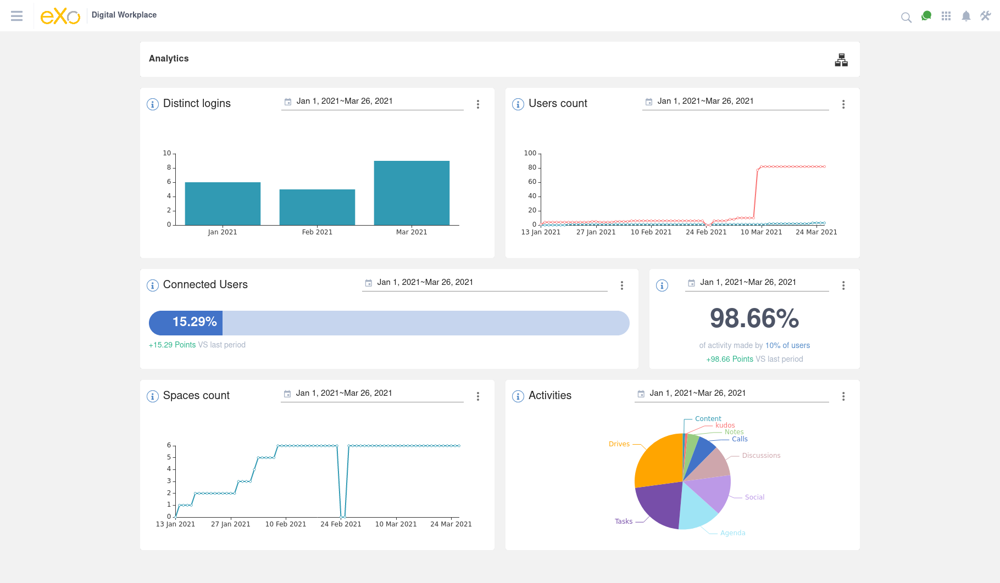
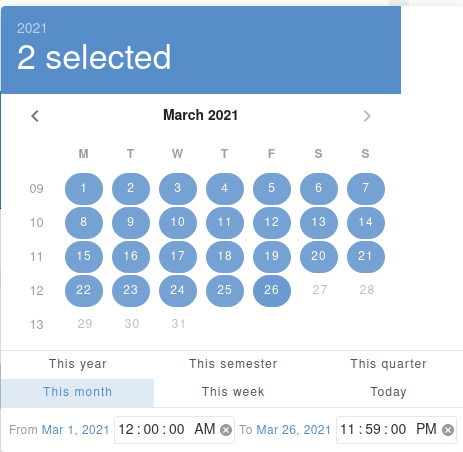
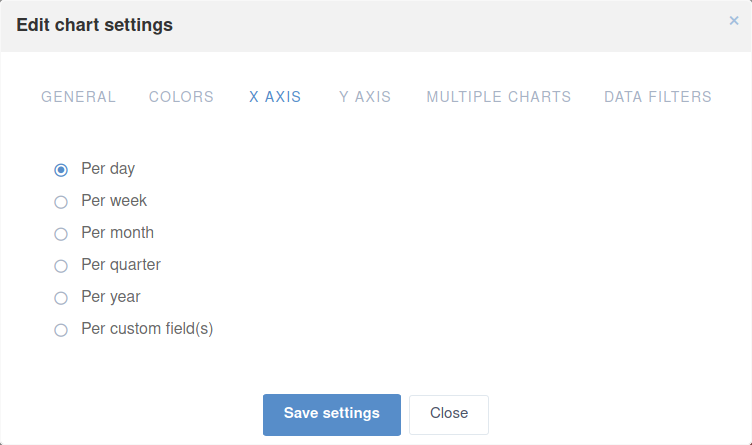
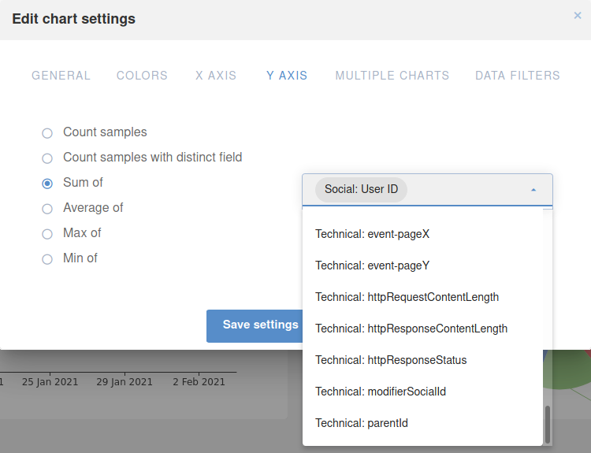
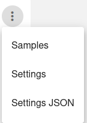

.. _Analytics:

############################
Working with Analytics
############################

In this chapter, we will introduce the eXo Analytics application which lets you to get data insights  about the usage of your digital workplace.

.. note:: Access to Analytics pages, requires membership in the group /platform/analytics

The chapter will present these themes:

-  :ref:`Main Analytics Dashboard <defaultPage>`  

.. _defaultPage:

========================
Main Analytics Dashboard
========================

Click Analytics from the Application Center, to access the main analytics  dashboard. It contains four charts:

-  **Distinct logins**: represents the count of users who logged in the platform per day
-  **Users count**: shows the users number (external and internal) in the platform per day
-  Spaces count: shows the number of spaces in the platform per day
-  Activities: represents a pie chart of the activities made on the platform by module

|image0|

.. note:: It is possible to change the analysis period by selecting one of the predefined periods (Last year, Last month...) 
          
          |image1|
          
.. _settings:

Chart Settings
~~~~~~~~~~~~~~~~

All the above cited charts could be reconfigured through the settings icon |image4|
You can change the collect points periodicity by editing the value in the X axis.

|image2|

You can also change the count type and the property to focus on through the Y axis.

|image3|

