.. _Analytics:

############################
Working with Analytics
############################

In this chapter, we will introduce the eXo Analytics application which lets you to get data insights  about the usage of your digital workplace.

.. note:: Access to Analytics pages, requires membership in the group /platform/analytics

The chapter will present these themes:

-  :ref:`Main Analytics Dashboard <defaultPage>`
-  :ref:`Create new analytics page <NewPage>`    
-  :ref:`Custom period selector <PeriodSelector>`    
-  :ref:`Users analytics table <UsersAnalytics>`    

.. _defaultPage:

=========================
Main Analytics Dashboard
=========================

Click Analytics from the Application Center, to access the main analytics  dashboard. It contains six charts:

|image0|

-  **Distinct logins**: represents the count of users who logged in the platform
   N.B: The cound is based on daily basis i.e. if a user logins/logouts more than once a day, it is count only one login.
   
   |image5|

-  **Users count**: shows the number of enabled users (external and internal) in the platform

   |image6|

-  **Spaces count**: shows the number of spaces in the platform
  
   |image7|

-  **Activities**: represents a pie chart of the activities made on the platform by module
  
   |image8|
   
-  **Connected users**: A percentage chart showing the percentage of connected users, among the enabled users, during the selected period   

   |image9|
   
-  **Analysis chart**: A percentage chart also showing the percentage of activities made by the most active 10% of users, among total activities, during the selected period   

   |image10|   

          
.. _settings:

Chart Settings
~~~~~~~~~~~~~~~~

All the above cited charts could be reconfigured through the settings icon |image4|
You can change the collect points periodicity by editing the value in the X axis.

|image2|

You can also change the count type and the property to focus on through the Y axis.

|image3|

.. _UsersAnalytics:

=========================
Users analytics table
=========================

.. _NewPage:

==========================
Create new analytics page
==========================

.. note:: To create a new analytics page, you should belong to both groups /platform/administrators and /platform/analytics

Having satisfied the above condition, you can create new analytics page from template following these steps:

- Click on the settings icon |image11| on the top navigation bar, then on "Add page" choice ==> You'll be redirected to the add page form and by default the page 
  is positioned under "Analytics" page
   
   |image12|
   
-  Fill in the needed fields (Node name, Display name...) and then move to the second step
-  Click on the dropdown list and select the choice "Analytics"

   |image13|
   
-  Move to the next step and validate the page creation by clicking on save icon   

   |image14|
   
==> You will be redirected to an analytics page with four empty charts which you can configure following the data you need to collect

|image15|

.. _menu:

Analytics pages tree
~~~~~~~~~~~~~~~~~~~~~~
   
You can navigate your analytics pages through the menu drawer which opens when you click on the "Menu" icon |image17|

|image16|

You can also use the page's breadcrumb to back to previous parent page 

|image18|

.. _PeriodSelector:

=========================
Custom period selector
=========================

For more flexibility and precision, a custom period selector is available for each chart allowing you to select start and end dates of the period you wish to analyze.

|image1|

.. note:: By default, the start analysis time is set to 12:00:00 A.M of the start date and the end analysis time is set to 11:59:00 PM of the end date (i.e. by default, 
          the whole day is seleted).
          
          You can change the time by clicking on the time picker.
          
          |image19|
          
Predefined periods exists under the calendar picker: This year, This semester, This quarter, This month, This week and Today. 

Example:

- This year: means the current year and not Today - 356 days
- This semester means this current semecter i.e. if we are on March month of the year 2021, it means the first semester of the year 2021 which has not yet been completed 
- Today means the current day starting 12:00:00 A.M

.. tip:: When you select a predefined period, a corresponding start and end dates are selected in the calendar

|image20|
      
   
   
      
.. |image0| image:: images/Analytics/defaultPage.png
.. |image1| image:: images/Analytics/periodSelector.png
.. |image2| image:: images/Analytics/XAxix.png
.. |image3| image:: images/Analytics/YAxix.png
.. |image4| image:: images/Analytics/SettingsButton.png
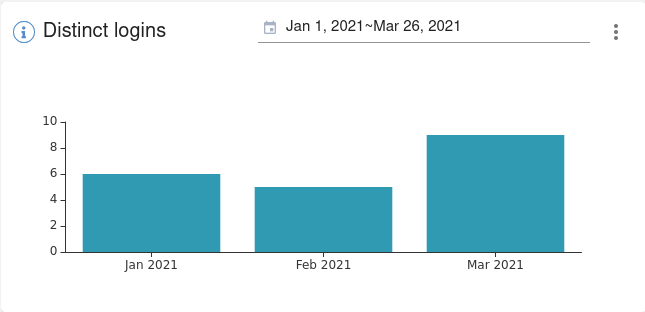
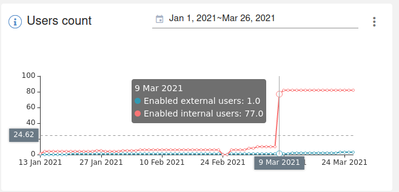
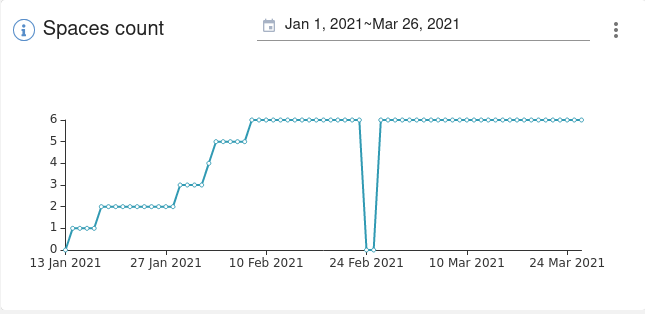
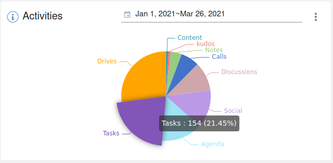
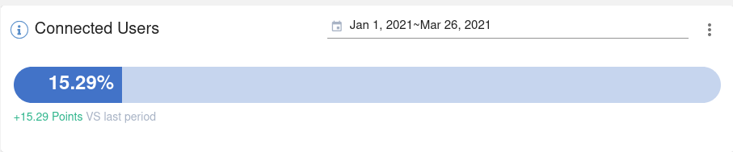
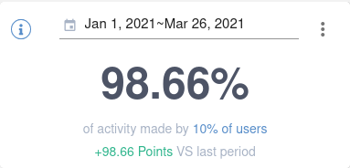

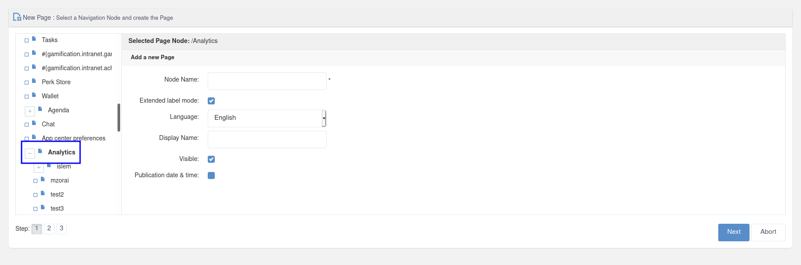
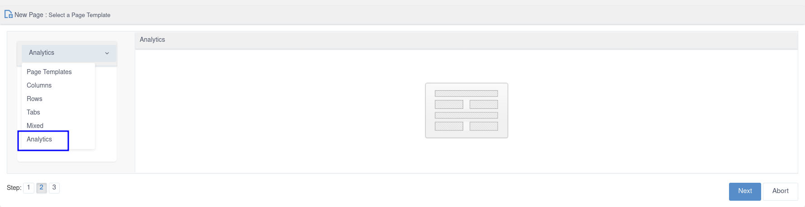
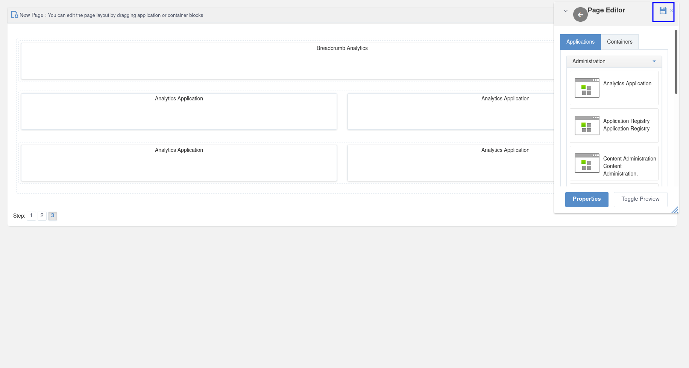
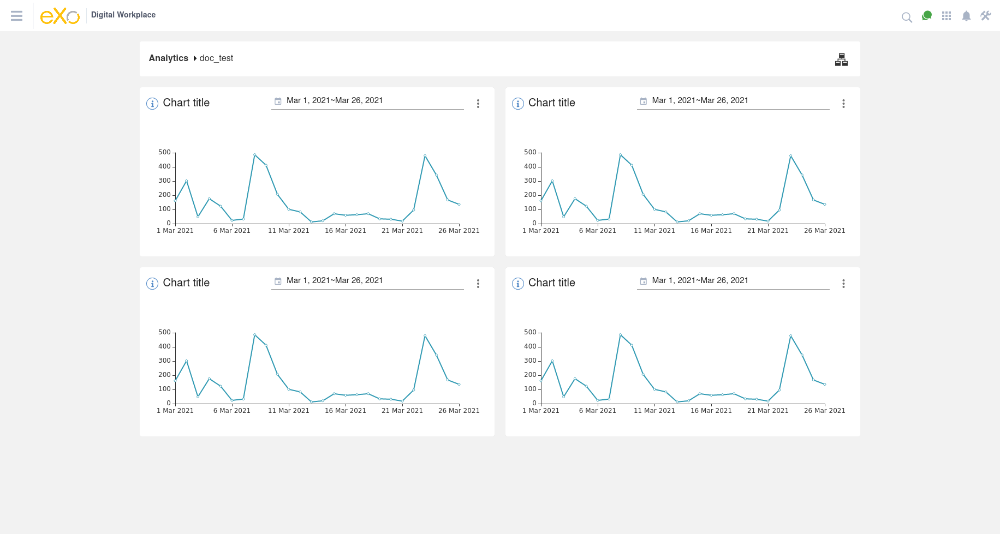
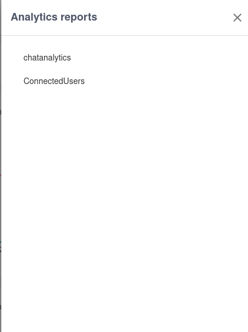

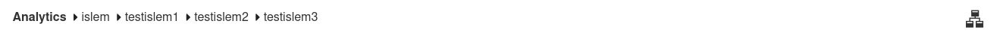
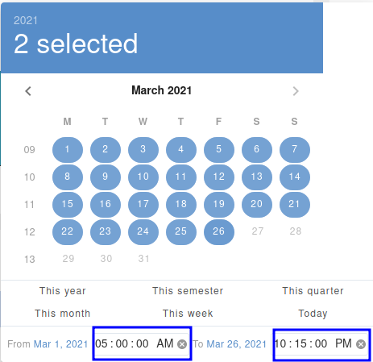
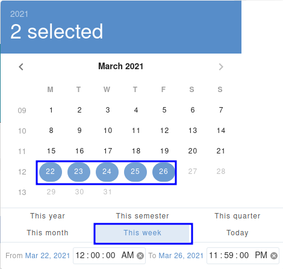
