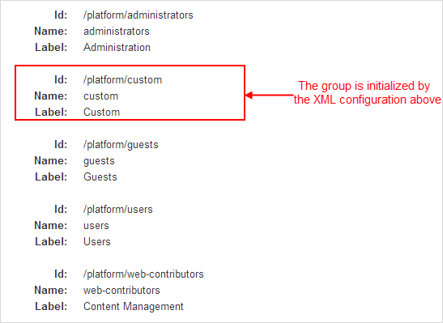
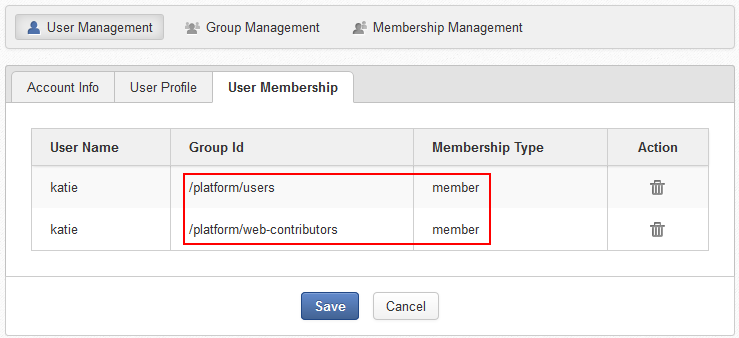
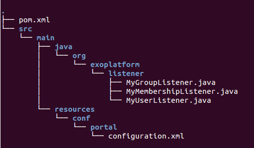

.. _Authentication_And_Identity:

#####################################
Managing Authentication and Identity
#####################################

    In this chapter:

    -  :ref:`Initializing organization by XML configuration <PLFDevGuide.AuthenticationAndIdentity.InitializingByConfiguration>`
       Introduction to the OrganizationService component, PicketLink,
       LDAP and instructions on how to initialize entities via XML
       configuration.

    -  :ref:`Working with organization API <PLFDevGuide.AuthenticationAndIdentity.WorkingWithOrganizationAPI>`
       Instructions on how to work with organization API to implement
       some works related to entities, including Managing users,
       Managing groups, Assigning users to a group, and Setting
       auto-membership for users.

    -  :ref:`Organization listeners <PLFDevGuide.AuthenticationAndIdentity.OrganizationListeners>`
       General knowledge of Organization Service, and step-by-step
       instructions on how to write Organization listeners, pack them
       into a .jar, and deploy them into eXo Platform.

    -  :ref:`OAuth providers integration <PLFDevGuide.AuthenticationAndIdentity.OAuthIntegration>`
       A tutorial to integrate with external OAuth providers like
       GitHub.

    -  :ref:`Developing your own validator <PLFDevGuide.AuthenticationAndIdentity.DevelopingValidators>`
       A tutorial about how to customize a data validator.

.. _PLFDevGuide.AuthenticationAndIdentity.InitializingByConfiguration:

==============================================
Initializing organization by XML configuration
==============================================

The ``OrganizationService`` component is used to manage entities in
eXo Platform. It is responsible for creating/retrieving/updating/deleting
them.

**PicketLink**

The default implementation of the ``OrganizationService`` component is
the PicketLink. This implementation uses the `PicketLink OpenSource
project <http://www.jboss.org/picketlink>`__. PicketLink allows
aggregating entities from multiple repositories (LDAPs, databases) by
configuration. For example, it supports the following topologies:

-  Users, groups and roles in a database.

-  Users, groups and roles in a LDAP directory.

-  Users in a LDAP directory, groups and roles in a database.

-  Users in multiple LDAPS, groups and roles in a database.

**LDAP**

The default configuration of PicketLink in eXo Platform manages everything in
a database. eXo Platform comes with some examples to manage the Organization
entities in a LDAP. You can find these examples in
``portal.war/WEB-INF/conf/organization/picketlink-idm/examples``. Refer
to :ref:`LDAP integration using PicketLink <LDAP.PicketLink>` for more 
details about LDAP.

**Initializing entities for Organization Service via the XML
configuration**

To specify the initial Organization configuration, you first need to
declare the
``org.exoplatform.services.organization.OrganizationDatabaseInitializer``
plugin in the configuration of your ``custom-extension.war``. This
plugin is used to specify a list of membership types, groups and users
to be created.

The following snippet allows creating a membership, a group and a user
via the
``org.exoplatform.services.organization.OrganizationDatabaseInitializer``
plugin.

.. code:: xml

    <external-component-plugins>
        <target-component>org.exoplatform.services.organization.OrganizationService</target-component>
        <component-plugin>
            <name>init.service.listener</name>
            <set-method>addListenerPlugin</set-method>
            <type>org.exoplatform.services.organization.OrganizationDatabaseInitializer</type>
            <description>this listener populate organization data for the first launch</description>
            <init-params>
                <value-param>
                    <name>checkDatabaseAlgorithm</name>
                    <description>check database</description>
                    <value>entry</value>
                </value-param>
                <value-param>
                    <name>printInformation</name>
                    <description>Print information init database</description>
                    <value>false</value>
                </value-param>
                <object-param>
                    <name>configuration</name>
                    <description>description</description>
                    <object
                            type="org.exoplatform.services.organization.OrganizationConfig">
                        <field name="membershipType">
                            <collection type="java.util.ArrayList">
                                ...
                                <!-- Custom membership -->
                                <value>
                                    <object
                                            type="org.exoplatform.services.organization.OrganizationConfig$MembershipType">
                                        <field name="type">
                                            <string>custom-membership</string>
                                        </field>
                                        <field name="description">
                                            <string>the custom membership type</string>
                                        </field>
                                    </object>
                                </value>
                                ...
                            </collection>
                        </field>
                        <field name="group">
                            <collection type="java.util.ArrayList">
                                ...
                                <!-- Custom group -->
                                <value>
                                    <object
                                            type="org.exoplatform.services.organization.OrganizationConfig$Group">
                                        <field name="name">
                                            <string>custom</string>
                                        </field>
                                        <field name="parentId">
                                            <string>/platform</string>
                                        </field>
                                        <field name="description">
                                            <string>the /platform/custom group</string>
                                        </field>
                                        <field name="label">
                                            <string>Custom</string>
                                        </field>
                                    </object>
                                </value>
                                ...

                            </collection>
                        </field>
                        <field name="user">
                            <collection type="java.util.ArrayList">
                                ...
                                <value>
                                    <object
                                            type="org.exoplatform.services.organization.OrganizationConfig$User">
                                        <field name="userName">
                                            <string>custom</string>
                                        </field>
                                        <field name="password">
                                            <string>gtn</string>
                                        </field>
                                        <field name="firstName">
                                            <string>Custom-firstName</string>
                                        </field>
                                        <field name="lastName">
                                            <string>Custom-lastName</string>
                                        </field>
                                        <field name="email">
                                            <string>custom@localhost.com</string>
                                        </field>
                                        <field name="groups">
                                            <string>
                                                custom-membership:/organization/custom,
                                                member:/platform/users
                                            </string>
                                        </field>
                                    </object>
                                </value>
                                ...
                            </collection>
                        </field>
                    </object>
                </object-param>
            </init-params>
        </component-plugin>
    </external-component-plugins>

.. note:: -  eXo Platform must predefine memberships, groups and a super user to make it work properly. You can find them in
             ``platform-extension.war!/WEB-INF/conf/organization/organization-configuration.xml``.

		  -  You need to pay attention to the ``object type`` to know which attributes can be declared in the ``field`` tags.

.. _PLFDevGuide.AuthenticationAndIdentity.WorkingWithOrganizationAPI:

=============================
Working with organization API
=============================

-  :ref:`Managing users <PLFDevGuide.AuthenticationAndIdentity.WorkingWithOrganizationAPI.ManagingUsers>`
   How to create/remove a user and remove membership of a user.

-  :ref:`Managing groups <PLFDevGuide.AuthenticationAndIdentity.WorkingWithOrganizationAPI.ManagingGroups>`
   How to create/update/remove a group.

-  :ref:`Assigning users to a group <PLFDevGuide.AuthenticationAndIdentity.WorkingWithOrganizationAPI.AssigningUsersToGroup>`
   How to assign a user to an existing group.

-  :ref:`Setting auto-membership for users <PLFDevGuide.AuthenticationAndIdentity.WorkingWithOrganizationAPI.SettingAutomembershipForUser>`
   How to set a membership for a newly created user.

**Prerequisites**

To use the OrganizationService API, you need to:

-  Create a Maven portlet project to follow the snippets in the next
   sub-sections.

-  Use two dependencies below:

   .. code:: xml

       <dependency>
           <groupId>org.exoplatform.kernel</groupId>
           <artifactId>exo.kernel.container</artifactId>
           <scope>provided</scope>
       </dependency>
       <dependency>
           <groupId>org.gatein.portal</groupId>
           <artifactId>exo.portal.component.application-registry</artifactId>
           <scope>provided</scope>
       </dependency>

PRODUCT manages identification and authorization with the entities
packaged in **org.exoplatform.services.organization**, including
**user**, **user profile**, **group**, **membership type** (also known
as "role"), and **membership**. See more about these entities in the
`Organization
API <../../../reference/html/sect-Reference_Guide-APIs-Organization_API.html>`__.

You can take handlers corresponding to the entities by using
``OrganizationService`` as follows:

.. code:: java

    /** .*/
      private UserHandler userHandler;

      /** .*/
      private UserProfileHandler profileHandler;

      /** .*/
      private GroupHandler groupHandler;

      /** .*/
      private MembershipHandler membershipHandler;

      /** .*/
      private MembershipTypeHandler membershipTypeHandler;

      @Override
      public void init(PortletConfig config) throws PortletException{
        super.init(config);

        PortalContainer container = PortalContainer.getInstance();
        OrganizationService orgService = (OrganizationService)container.getComponentInstanceOfType(OrganizationService.class);
        userHandler = orgService.getUserHandler();
        profileHandler = orgService.getUserProfileHandler();
        groupHandler = orgService.getGroupHandler();
        membershipHandler = orgService.getMembershipHandler();
        membershipTypeHandler = orgService.getMembershipTypeHandler();
      }
      
.. _PLFDevGuide.AuthenticationAndIdentity.WorkingWithOrganizationAPI.ManagingUsers:      

Managing users
~~~~~~~~~~~~~~~

This section shows you how to create, update, and remove users from the
portal via two ways:

-  Directly inline, via the UI of eXo Platform.

   -  To create a user, see the :ref:`Adding a user <ManagingYourOrganization.AddingUser>`
      section for more details.

   -  To update and remove a user from the portal, see the :ref:`Managing users <ManagingYourOrganization.ManagingUsers>`
      section for more details.

-  In :ref:`your extension <PLFDevGuide.eXoAdd-ons.PortalExtension>`, 
   via the configuration file as below:

You can follow the snippet below to list users and some information of
the users:

.. code:: java

     try {
          ListAccess<User> users = userHandler.findAllUsers();

          for (User user : users.load(0, users.getSize())) {
            writer.append("<dl class='dl-horizontal'>");

            //Print username and email
            writer.append("<dt>Username:</dt>");
            writer.append("<dd>" + user.getUserName() + "</dd>");
            writer.append("<dt>Email:</dt>");
            writer.append("<dd>" + user.getEmail() + "</dd>");

            //Print user profile
            UserProfile profile = profileHandler.findUserProfileByName(user.getUserName());

            for (Iterator<Map.Entry<String, String>> i =profile.getUserInfoMap().entrySet().iterator(); i.hasNext(); ) {
              Map.Entry<String, String> entry = i.next();
              writer.append("<dt>" + entry.getKey() + "</dt>");
              writer.append("<dd>" + entry.getValue() + "</dd>");
            }

            //Print group and membership of user
            Collection<Group> groups = groupHandler.findGroupsOfUser(user.getUserName());
            writer.append("<dt>Roles:</dt>");
            for (Group group : groups) {
              Collection<Membership> memberships =  membershipHandler.findMembershipsByUserAndGroup(user.getUserName(), group.getId());
              StringBuilder sb = new StringBuilder();
              for (Iterator<Membership> i = memberships.iterator(); i.hasNext(); ) {
                sb.append(i.next().getMembershipType());
                if (i.hasNext()) sb.append(',');
              }
              writer.append("<dd>" + sb.toString() + " in group <i>" + group.getId() + "</i></dd>");
            }
            writer.append("</dl>");
          }

        } catch (Exception e) {
          e.printStackTrace();
        }

The users list is displayed like this in your product:

|image0|

**Creating a user**

Create a portlet action, then add the snippet below to it.

.. code:: java

    User newUser = userHandler.createUserInstance("newuser");
    newUser.setPassword("exo");
    newUser.setOrganizationId("/platform/users");
    newUser.setDisplayName("New User");
    newUser.setEmail("user@exoplatform.com");
    userHandler.createUser(newUser, false);

    Group group = groupHandler.findGroupById("/platform/users");
    membershipHandler.linkMembership(newUser, group, membershipTypeHandler.findMembershipType("member"), false);
            

Executing the portlet action allows creating a user called **newuser**
whose role is **member:/platform/users**.

**Removing a user**

Create a portlet action which executes the snippet below to remove an
initialized user, for example, **newuser**.

.. code:: java

    userHandler.removeUser("newuser", false);

**Removing a membership**

Create a portlet action which executes the snippet below to remove a
membership of the **custom** user:

.. code:: java

    Membership membership = membershipHandler.findMembershipByUserGroupAndType("custom", "/organization/custom", "custom-membership");
        membershipHandler.removeMembership(membership.getId(), false);
        
.. _PLFDevGuide.AuthenticationAndIdentity.WorkingWithOrganizationAPI.ManagingGroups:

Managing groups
~~~~~~~~~~~~~~~~

This section shows you how to create, update, and remove groups from the
portal via two ways:

-  Directly inline, via the UI of eXo Platform. See the :ref:`Managing groups <ManagingYourOrganization.ManagingGroups>`
   section for more details.

-  In :ref:`your extension <PLFDevGuide.eXoAdd-ons.PortalExtension>`, 
   via the configuration file as below:

You can follow the snippet below to list groups which are children of
the **platform** group:

.. code:: java

    try {
          Group platformGroup = groupHandler.findGroupById("/platform");
          Collection<Group> groups = groupHandler.findGroups(platformGroup);
          for (Group group : groups) {
            writer.append("<dl class='dl-horizontal'>");
            writer.append("<dt>Id:</dt>");
            writer.append("<dd>" + group.getId() + "</dd>");
            writer.append("<dt>Name:</dt>");
            writer.append("<dd>" + group.getGroupName() + "</dd>");
            writer.append("<dt>Label:</dt>");
            writer.append("<dd>" + group.getLabel() + "</dd>");
            writer.append("</dl>");
          }

The groups list is displayed like this in your product:

|image1|

**Creating a group**

Create a portlet action, then add the snippet below to it.

.. code:: java

        Group group = groupHandler.createGroupInstance();
        group.setGroupName("newgroup");
        group.setLabel("New Group");
        Group platformGroup = groupHandler.findGroupById("/platform");
        groupHandler.addChild(platformGroup, group, false);
            

Executing the portlet action allows creating a group called **newgroup**
which is the child of the **platform** group.

**Updating a group**

After creating a group, you should update a label for it as its display
name.

.. code:: java

        Group newGroup = groupHandler.findGroupById("/platform/newgroup");
        newGroup.setLabel("New Group Updated");
        groupHandler.saveGroup(newGroup, false);

The snippet above allows setting the **New Group Updated** label for the
**newgroup** group.

**Removing a group**

Create a portlet action which executes the snippet below to remove a
group, for example **newgroup**:

.. code:: java

    Group newGroup = groupHandler.findGroupById("/platform/newgroup");
        groupHandler.removeGroup(newGroup, false);

.. _PLFDevGuide.AuthenticationAndIdentity.WorkingWithOrganizationAPI.AssigningUsersToGroup:

Assigning users to a group
~~~~~~~~~~~~~~~~~~~~~~~~~~~

This section shows you how to assign users to existing groups available
in the portal via two ways:

-  Directly inline, via the UI of eXo Platform. See the :ref:`Adding a user to a group <AddingUserToGroup>`
   section for more details.

-  In :ref:`your extension <PLFDevGuide.eXoAdd-ons.PortalExtension>`, 
   via the configuration. In :ref:`Creating a user <PLFDevGuide.AuthenticationAndIdentity.WorkingWithOrganizationAPI.ManagingUsers.CreatingUsers>`,
   you can see that while creating the **newuser** user, the user is
   assigned to the **/platform/users** group and the **member**
   membership.

   .. code:: java

       Group group = groupHandler.findGroupById("/platform/users");
       membershipHandler.linkMembership(newUser, group, membershipTypeHandler.findMembershipType("member"), false);

.. _PLFDevGuide.AuthenticationAndIdentity.WorkingWithOrganizationAPI.SettingAutomembershipForUser:

Setting auto-membership for users
~~~~~~~~~~~~~~~~~~~~~~~~~~~~~~~~~~

In eXo Platform, when a new user is registered, the membership:
*member:/platform/users* will be automatically granted to him/her. See
:ref:`Predefined users, groups and memberships <PredefinedUserGroupMembership>`
to futher understand the *membership* concept.

With the :ref:`extension mechanism <PLFDevGuide.eXoAdd-ons.PortalExtension>` 
provided by eXo Platform, you can set another auto-membership for users.

It is assumed that you want to auto-assign 2 memberships:
*member:/platform/users* and *member:platform/web-contributors* to any
registered user, do as follows:

1 Create a file named ``organization-configuration.xml`` under
  ``custom-extension.war!/WEB-INF/conf/organization``. See the sample
  content of complete configuration in the
  ``platform-extension.war!/WEB-INF/conf/organization/organization-configuration.xml``
  file.

2. Add the following plugin for the new user event listener in
   ``custom-extension.war!/WEB-INF/conf/organization/organization-configuration.xml``:

	.. code:: xml

		<component-plugin>
			<name>new.user.event.listener</name>
			<set-method>addListenerPlugin</set-method>
			<type>org.exoplatform.services.organization.impl.NewUserEventListener</type>
			<description>this listener assign group and membership to a new created user</description>
			<init-params>
				...
			</init-params>
		</component-plugin>

3. Add the ``NewUserConfig`` object, which holds the value of group and
   membership, in ``custom-extension.war!/WEB-INF/conf/organization/organization-configuration.xml``:

	.. code:: xml

		<object type="org.exoplatform.services.organization.impl.NewUserConfig">
			<field name="group">
				<collection type="java.util.ArrayList">
					<value>
						<object type="org.exoplatform.services.organization.impl.NewUserConfig$JoinGroup">
							<field name="groupId"><string>/platform/users</string></field>
							<field name="membership"><string>member</string></field>
						</object>
					</value>
					<value>
						<object type="org.exoplatform.services.organization.impl.NewUserConfig$JoinGroup">
							<field name="groupId"><string>/platform/web-contributors</string></field>
							<field name="membership"><string>member</string></field>
						</object>
					</value>
				</collection>
			</field>
		</object>

4. Restart the server.

5. :ref:`Create a new user <PLFDevGuide.AuthenticationAndIdentity.WorkingWithOrganizationAPI.ManagingUsers.CreatingUsers>`,
   for example "katie", without assigning her to any group.

	-  When invoking the ``createUser`` method, you must set the
	   ``broadcast`` parameter to ``true``:

	   .. code:: java

		   userHandler.createUser(newUser, true);

	-  Then, ``userHandler`` will broadcast an event to
	   ``org.exoplatform.services.organization.impl.NewUserEventListener``
	   which will assign the created user to the **/platform/users** and
	   **/platform/web-contributors** groups with the **member** membership
	   type.

6. Check the membership for the newly created user by selecting |image2|
   --> Users --> Community --> User Management. Next, click |image3| 
   corresponding to your newly created user (for example, "katie"), then 
   select User Membership. You will see that 2 memberships are 
   auto-assigned to "katie".

|image4|

You can modify the attributes and add the name of a special user that
does not use the default membership. Here is an example of this specific
case:

.. code:: xml

    <field name="ignoredUser">
        <collection type="java.util.HashSet">
            <value>
                <string>newuser</string>
            </value>
        </collection>
    </field>

.. _PLFDevGuide.AuthenticationAndIdentity.OrganizationListeners:

======================
Organization listeners
======================

In eXo Platform, whenever an action occurs (for example, login/logout,
content creation/modification), a corresponding event is sent to
Listener Service that dispatches the notification to its listeners.
Listeners then can perform whatever action they want when receiving an
event. See `Listener Service
events <#PLFRefGuide.PLFDevelopment.ListenerServiceEvents>`__ for more
details.

In this section, you will have opportunity to learn about Organization
listeners, how to write and pack them in a ``.jar`` file, then deploy
them into eXo Platform based on the :ref:`extension mechanism <PLFDevGuide.eXoAdd-ons.PortalExtension>` 
of eXo Platform.

To write a new organization listener, you first need to know about
`Organization Service <#Core.OrganizationService>`__ that provides a
mechanism to receive notifications when:

-  A user is created, deleted, modified, enabled or disabled.

-  A group is created, deleted or modified.

-  A membership is created or removed.

This mechanism is very useful to cascade some actions when the
organization model is modified. For example, it is currently used to
initialize the personal portal pages or to create drives and personal
areas.

In term of working mechanism of Organization listeners, it is quite
similar to that of Listener Service. See `Understanding the Listener
Service <#Kernel.UnderstandingtheListenerService>`__ for how it works
and how to configure a listener in general.

**Writing Organization listeners**

1. Create a JAR project, named **my-event-listeners** for example, with 
   the following structure:

|image5|

2. Declare the dependencies needed for your own listeners in the
   ``pom.xml`` file (you can go to `eXo Platform repository <http://repository.exoplatform.org/index.html>`__ 
   to check the artifact versions). The ``pom.xml`` file now looks like:

	.. code:: xml

		<project xmlns="http://maven.apache.org/POM/4.0.0" xmlns:xsi="http://www.w3.org/2001/XMLSchema-instance"
		  xsi:schemaLocation="http://maven.apache.org/POM/4.0.0 http://maven.apache.org/maven-v4_0_0.xsd">
		  <modelVersion>4.0.0</modelVersion>
		  <groupId>exo.userevent.listener</groupId>
		  <artifactId>my-event-listeners</artifactId>
		  <packaging>jar</packaging>
		  <version>1.0-SNAPSHOT</version>
		  <name>maven</name>
		  <url>http://maven.apache.org</url>
		  <dependencies>
			<dependency>
			  <groupId>org.exoplatform.core</groupId>
			  <artifactId>exo.core.component.organization.api</artifactId>
			  <version>2.6.0-GA</version>
			</dependency>
			<dependency>
			  <groupId>javax.jcr</groupId>
			  <artifactId>jcr</artifactId>
			  <version>2.0</version>
			</dependency>
			<dependency>
				<groupId>javax.annotation</groupId>
				<artifactId>jsr250-api</artifactId>
				<version>1.0</version>
			</dependency>
		  </dependencies>
		</project>

3. Implement your own listeners by extending some existing listener 
   classes in ``src/main/java/org/exoplatform/listener``. These classes 
   define hooks that are invoked before or after operations are 
   performed on the organization model.

	-  **UserEventListener**:

	   To listen to user changes, you need to extend
	   ``org.exoplatform.services.organization.UserEventListener`` in
	   ``MyUserListener.java``.

	   .. code:: java

		   package org.exoplatform.listener;

			   import javax.jcr.Node;
			   import javax.jcr.Session;
			   import org.exoplatform.services.organization.User;
			   import org.exoplatform.services.organization.UserEventListener;
			   
			   public class MyUserListener extends UserEventListener {
				   public void preSave(User user, boolean isNew) throws Exception {
					   //do something - customer code is here
					   System.out.println("Before user is added into database");
				   }
				   public void preDelete(User user) throws Exception {
					   //do something - customer code is here
					   System.out.println("Before user is deleted from database");
				   }
				   public void postSave(User user, boolean isNew) throws Exception {
					   //do something - customer code is here      
					   System.out.println("After user is added into database");
				   }
				   public void postDelete(User user) throws Exception {
					   //do something - customer code is here
					   System.out.println("After user is deleted from database");
				   }
			   }

	   See sample
	   `here <https://github.com/exoplatform/ecms/blob/develop/core/services/src/main/java/org/exoplatform/services/cms/drives/impl/NewUserListener.java>`__.

	-  **GroupEventListener**:

	   To listen to group changes, you need to extend
	   ``org.exoplatform.services.organization.GroupEventListener`` in
	   ``MyGroupListener.java``.

	   .. code:: java

		   package org.exoplatform.listener;

			   import javax.jcr.Session;
			   import org.exoplatform.services.organization.Group;
			   import org.exoplatform.services.organization.GroupEventListener;
			   
			   public class MyGroupListener extends GroupEventListener {
				   public void preSave(Group group, boolean isNew) throws Exception {
					   //do something - customer code is here
					   System.out.println("Before group is added into database");
				   }
				   public void preDelete(Group group) throws Exception {
					   //do something - customer code is here
					   System.out.println("Before group is removed from database");
				   }
				   public void postSave(Group group, boolean isNew) throws Exception {
					   //do something - customer code is here
					   System.out.println("After group is added into database");
				   }
				   public void postDelete(Group group) throws Exception {
					   //do something - customer code is here
					   System.out.println("After group is removed from database");         
				   }
			   }

	   See sample
	   `here <https://github.com/exoplatform/ecms/blob/develop/core/services/src/main/java/org/exoplatform/services/cms/drives/impl/NewGroupEventListener.java>`__.

	-  **MembershipEventListener**:

	   To listen to membership changes, you need to extend
	   ``org.exoplatform.services.organization.MembershipEventListener`` in
	   ``MyMembershipListener.java``.

	   .. code:: java

		   package org.exoplatform.listener;

			   import javax.jcr.Session;
			   import org.exoplatform.services.organization.Membership;
			   import org.exoplatform.services.organization.MembershipEventListener;
			   
			   public class MyMembershipListener extends MembershipEventListener {
				   public void preSave(Membership m, boolean isNew) throws Exception{
					   //do something - customer code is here
					   System.out.println("Before membership is added into database");
				   }

				   public void postSave(Membership m, boolean isNew) throws Exception{
					   //do something - customer code is here
					   System.out.println("After membership is added into database");
				   }

				   public void preDelete(Membership m) throws Exception{
					   //do something - customer code is here
					   System.out.println("Before membership is removed from database");
				   }

				   public void postDelete(Membership m) throws Exception{
					   //do something - customer code is here
					   System.out.println("After membership is removed from database");
				   }
			   }

	   See sample
	   `here <https://github.com/exoplatform/ecms/blob/develop/core/services/src/main/java/org/exoplatform/services/cms/drives/impl/WCMMembershipUpdateListener.java>`__.

4. Register your own listeners in ``configuration.xml``. Registering the
   listeners is then achieved by using the ExoContainer plugin mechanism.
   See `Service configuration for beginners <#Kernel.ServiceConfigurationforBeginners>`__ 
   for more information.

	To effectively register Organization listeners, you simply need to use
	the **addListenerPlugin** set-method.

	.. code:: xml

		<?xml version="1.0" encoding="ISO-8859-1"?>
		<configuration
		   xmlns:xsi="http://www.w3.org/2001/XMLSchema-instance"
		   xsi:schemaLocation="http://www.exoplatform.org/xml/ns/kernel_1_2.xsd http://www.exoplatform.org/xml/ns/kernel_1_2.xsd"
		   xmlns="http://www.exoplatform.org/xml/ns/kernel_1_2.xsd">
			<external-component-plugins>
			 <target-component>org.exoplatform.services.organization.OrganizationService</target-component>
			  <component-plugin>
				<name>my.new.user.event.listener</name>
				<set-method>addListenerPlugin</set-method>
				<type>org.exoplatform.listener.MyUserListener</type>
				<description>description</description>
			  </component-plugin>
			  <component-plugin>
				<name>my.new.group.event.listener</name>
				<set-method>addListenerPlugin</set-method>
				<type>org.exoplatform.listener.MyGroupListener</type>
				<description>description</description>
			  </component-plugin>
			  <component-plugin>
				<name>my.membership.group.event.listener</name>
				<set-method>addListenerPlugin</set-method>
				<type>org.exoplatform.listener.MyMembershipListener</type>
				<description>description</description>
			  </component-plugin>
			</external-component-plugins>
		</configuration>

	See sample
	`here <https://github.com/exoplatform/ecms/blob/develop/packaging/wcm/webapp/src/main/webapp/WEB-INF/conf/dms-extension/dms/organization-component-plugins-configuration.xml>`__.

5. Build your JAR project, then deploy the ``.jar`` file (in ``target/``)
   under eXo Platform.

   -  ``$PLATFORM_TOMCAT_HOME/lib`` (in Tomcat).

   -  ``$PLATFORM_JBOSS_HOME/standalone/deployments/platform.ear!/lib`` (in
      JBoss).

6. Start eXo Platform. Your own listeners are now ready for testing.

To check if either of your own listeners takes effect, try the case when
creating a new account by selecting |image6| --> Users --> Add Users. 
Once you have clicked Save, two strings will be printed to the console: 
"Before user is added into database" and "After user is added into database", 
as defined in ``MyUserListener.java``.

.. _PLFDevGuide.AuthenticationAndIdentity.OAuthIntegration:

===========================
OAuth providers integration
===========================

**About OAuth and OAuth providers**

The OAuth 2.0 specification, `RFC-6749 by
IETF <https://tools.ietf.org/html/rfc6749>`__, is an open standard for
authorization. It allows resource owners to authorize third-party access
to their server resources without sharing their credentials.

To explain this definition, let's say a GitHub user wants to allow a
third-party application to access their GitHub data like the profile and
repositories. In a traditional way, the user will give the application
his username/password. This approach has some defects. For instance,
there is no way to identify the application, thus impossible to limit
the access. If the user wants to stop using an application, he must
change the password, so other applications will be disallowed as well.

In OAuth approach, the third-party application must be registered to (so
identified by) GitHub. When the app requests the resources for the first
time, GitHub prompts the user so he can allow or refuse the access. On
the allowance, the app receives an access token - not the user
credentials, and uses it to proceed to access the resource.

By this way, the user can revoke the access anytime. Depending on the
OAuth implementation, it can give a policy based on that the user can
choose which resources are accessible.

.. note:: This example just explains OAuth quickly. Please read RFC-6749 to understand the roles and the flow before you continue.

You can find a list of OAuth providers in http://oauth.net/2/

**OAuth integration with eXo**

The term "OAuth integration" suggests that you can write applications
that run at eXo, and access resources from another resource server by
getting authorized by an OAuth provider. To avoid a wide topic of data
propagation that it may imply, this tutorial only focuses on how to
allow users to sign up/log into eXo using other Social network accounts.

As of 4.3, eXo supports login by Facebook, Google+, LinkedIn and
Twitter. These four networks are built-in supported.

Behind the scene, there is a framework that resolves the following
challenges:

-  The integration can be turned on/off by configuration.

-  The login page must adapt to a turned-on provider, for example CSS
   and JavaScript are generated automatically.

-  When a user logs in using a Social network account, his profile data
   is propagated into eXo.

-  Access token persists for re-using. Revocation and expiration are
   handled.

The great point is, the framework allows extending the provider list. In
this tutorial you write an addon that allows GitHub users to sign in.

**GitHub as an OAuth provider**

The GitHub OAuth flow and other information you need can be found at
https://developer.github.com/v3/oauth/. You should read it before you
continue.

At the moment, it is not clear which scopes are supported. However, the
addon will need only the (default) ``user`` scope, so it does not
matter.

.. tip:: It is good to know that you can test the flow completely before writing any code. The tip is to use a browser plugin, such as Chrome Advanced Rest client.

		 For that test, when registering your app, you should set the callback URL to your *localhost*. You can change it anytime later.
		 In order to see all things work perfectly, you can set up an Apache/Nginx server to return a default page at port 80.

When you start coding, this tutorial requires you to run an eXo instance
at *localhost:8080* for simplification. So at that time, change the
callback URL to this address.

**Writing an GitHub addon**

So now you have a GitHub application and you tested the flow. From the
test you learned the following aspects that will be variables in your
code:

+--------------------------+--------------------------------------------------+
| Variable                 | Description                                      |
+==========================+==================================================+
| authentication endpoint  | ``https://github.com/login/oauth/authorize``     |
+--------------------------+--------------------------------------------------+
| access token endpoint    | ``https://github.com/login/oauth/access_token``  |
+--------------------------+--------------------------------------------------+
| profile endpoint         | ``https://api.github.com/user``                  |
+--------------------------+--------------------------------------------------+
| redirect URL (or         | In your test the actual value should be          |
| callback URL)            | http://localhost:8080/portal/githubAuth.         |
|                          |                                                  |
|                          | In production it depends on the eXo base URL, so |
|                          | it should be a configuration.                    |
+--------------------------+--------------------------------------------------+
| client\_id               | Should be configurable.                          |
+--------------------------+--------------------------------------------------+
| client\_secret           | Should be configurable.                          |
+--------------------------+--------------------------------------------------+

To be packaged as an eXo Addon, the project should have three modules:

-  *service* contains Java classes, service configuration and
   translation resources. This module is packaged in jar.

-  *extension* is a webapp (war) containing stylesheet configuration and
   resources.

-  *packaging* module that packages the jar and the war in a zip to
   satisfy the Addon packaging requirement.

For Java code, the framework requires you to write:

-  An access token wrapper.

-  A *processor* that handles the interaction with GitHub.

-  A servlet filter.

Let's start your coding.

1. Write a class called ``GithubAccessTokenContext`` that wraps the 
   access token in a *context*. The idea is to provide a 
   ``getAccessToken()`` method, but it might also be able to handle the 
   custom scopes in the future, so you should extend the abstract class
   *org.gatein.security.oauth.spi.AccessTokenContext*:

	.. code:: java

		public class GithubAccessTokenContext extends AccessTokenContext implements Serializable {
		  
		  private static final long serialVersionUID = 42L;
		  
		  private final String accessToken;
		  
		  public GithubAccessTokenContext(String accessToken) {
			if (accessToken == null) {
			  throw new IllegalArgumentException("accessToken must not be null!");
			}
			this.accessToken = accessToken;
		  }
		  
		  @Override
		  public String getAccessToken() {
			return accessToken;
		  }
		  
		  @Override
		  public boolean equals(Object that) {
			if (!(super.equals(that))) {
			  return false;
			}
			GithubAccessTokenContext that_ = (GithubAccessTokenContext)that;
			return this.accessToken.equals(that_.getAccessToken()) ;
		  }
		  
		  public int hashCode() {
			return super.hashCode() * 13 + accessToken.hashCode() * 11;
		  }

		}

2. Write an interface, called ``GithubProcessor`` for the major service -
   that should indeed implements the general
   *org.gatein.security.oauth.spi.OAuthProviderProcessor* interface. You
   need this extended interface for two reasons: 1. to satisfy the 
   key-type pattern of eXo services, and 2. to add any methods you want 
   for GitHub in particular.

	Now there are no extended methods, so it is simple:

	.. code:: java

		public interface GithubProcessor extends OAuthProviderProcessor<GithubAccessTokenContext> {

		}

3. Write the implementation ``GithubProcessorImpl``.

	.. code:: java

		public class GithubProcessorImpl implements GithubProcessor {

		}

	It keeps all the information about the provider and the app:

	.. code:: java

		  public static final String AUTHENTICATION_ENDPOINT_URL = "https://github.com/login/oauth/authorize";
		  public static final String ACCESS_TOKEN_ENDPOINT_URL = "https://github.com/login/oauth/access_token";
		  public static final String PROFILE_ENDPOINT_URL = "https://api.github.com/user";

		  private final String     redirectURL;
		  private final String     clientID;
		  private final String     clientSecret;
		  private final int        chunkLength;
		  private final SecureRandomService secureRandomService;

		  public GithubProcessorImpl(ExoContainerContext context, InitParams params, SecureRandomService secureRandomService) {
			String redirectURL_ = params.getValueParam("redirectURL").getValue();
			redirectURL_ = redirectURL_.replaceAll("@@portal.container.name@@", context.getName());
			
			String clientID_ = params.getValueParam("clientId").getValue();
			String clientSecret_ = params.getValueParam("clientSecret").getValue();
			if (redirectURL_ == null || redirectURL_.length() == 0 || clientID_ == null
				|| clientID_.length() == 0 || clientSecret_ == null || clientSecret_.length() == 0) {
			  throw new IllegalArgumentException("redirectURL, clientId and clientSecret must not be empty!");
			}
			this.redirectURL = redirectURL_;
			this.clientID = clientID_;
			this.clientSecret = clientSecret_;
			this.chunkLength = OAuthPersistenceUtils.getChunkLength(params);
			this.secureRandomService = secureRandomService;
		  }

	The framework that manages the interaction with the GitHub servers will
	call the following method of the processor through the flow, passing it
	the request and response of each phase, and expecting an
	``InteractionState`` in return.

	.. code:: java

		  @Override
		  public InteractionState<GithubAccessTokenContext> processOAuthInteraction(HttpServletRequest request, 
																					HttpServletResponse response) throws IOException, OAuthException {
			HttpSession session = request.getSession();
			String state = (String) session.getAttribute(OAuthConstants.ATTRIBUTE_AUTH_STATE);
			
			// start the flow
			if (state == null || state.isEmpty()) {
			  String verificationState = String.valueOf(secureRandomService.getSecureRandom().nextLong());
			  initialInteraction(request, response, verificationState);
			  state = InteractionState.State.AUTH.name();
			  session.setAttribute(OAuthConstants.ATTRIBUTE_AUTH_STATE, state);
			  session.setAttribute(OAuthConstants.ATTRIBUTE_VERIFICATION_STATE, verificationState);
			  return new InteractionState<GithubAccessTokenContext>(InteractionState.State.valueOf(state), null);
			}
			
			// get access token
			if (state.equals(InteractionState.State.AUTH.name())) {
			  //
			  String accessToken = getAccessToken(request, response);
			  GithubAccessTokenContext tokenContext = new GithubAccessTokenContext(accessToken);
			  return new InteractionState<GithubAccessTokenContext>(InteractionState.State.FINISH, tokenContext);
			}
			return new InteractionState<GithubAccessTokenContext>(InteractionState.State.valueOf(state), null);
		  }

	The access token persits in the (eXo) user profile. The following
	methods are called to save, get and remove an access token:

	.. code:: java

		  @Override
		  public void saveAccessTokenAttributesToUserProfile(UserProfile userProfile, OAuthCodec codec, GithubAccessTokenContext accessToken) {
			String encodedAccessToken = codec.encodeString(accessToken.getAccessToken());
			OAuthPersistenceUtils.saveLongAttribute(encodedAccessToken, userProfile, PROFILE_GITHUB_ACCESS_TOKEN, false, chunkLength);
		  }
		  
		  @Override
		  public GithubAccessTokenContext getAccessTokenFromUserProfile(UserProfile userProfile, OAuthCodec codec) {
			String encodedAccessToken = OAuthPersistenceUtils.getLongAttribute(userProfile, PROFILE_GITHUB_ACCESS_TOKEN, false);
			if (encodedAccessToken == null) {
			  return null;
			}
			String accessToken = codec.decodeString(encodedAccessToken);
			return new GithubAccessTokenContext(accessToken);
		  }
		  
		  @Override
		  public void removeAccessTokenFromUserProfile(UserProfile userProfile) {
			OAuthPersistenceUtils.removeLongAttribute(userProfile, PROFILE_GITHUB_ACCESS_TOKEN, true);
		  }

4. Write a Filter, called ``GithubFilter``, that extends the abstract
   filter *org.gatein.security.oauth.web.OAuthProviderFilter*.

	.. code:: java

		public class GithubFilter extends OAuthProviderFilter<GithubAccessTokenContext> {

		}

	This must implement the following three methods, in which the last one
	is called when the authorization is finished. You obtained an access
	token to get the GitHub user profile and return the user attributes
	wrapped into an ``OAuthPrincipal`` object. You can use any preferred
	libraries here to get the profile resouces. This tutorial simply uses
	*java.net.HttpURLConnection* and *org.json.JSONObject*.

	.. code:: java

		  @Override
		  protected OAuthProviderType<GithubAccessTokenContext> getOAuthProvider() {
			return this.getOauthProvider("GITHUB", GithubAccessTokenContext.class);
		  }

		  @Override
		  protected void initInteraction(HttpServletRequest request, HttpServletResponse response) {
			HttpSession session = request.getSession();
			session.removeAttribute(OAuthConstants.ATTRIBUTE_AUTH_STATE);
			session.removeAttribute(OAuthConstants.ATTRIBUTE_VERIFICATION_STATE);
		  }

		  @Override
		  protected OAuthPrincipal<GithubAccessTokenContext> getOAuthPrincipal(HttpServletRequest request, HttpServletResponse response, InteractionState<GithubAccessTokenContext> interactionState) {
			GithubAccessTokenContext accessTokenContext = interactionState.getAccessTokenContext();
			String accessToken = accessTokenContext.getAccessToken();
			Map<String, String> params = new HashMap<String, String>();
			params.put(OAuthConstants.ACCESS_TOKEN_PARAMETER, accessToken);
			String location = new StringBuilder(GithubProcessorImpl.PROFILE_ENDPOINT_URL).append("?").append(OAuthUtils.createQueryString(params)).toString();
			try {
			  URL url = new URL(location);
			  HttpURLConnection connection = (HttpURLConnection)url.openConnection();
			  HttpResponseContext responseContext = OAuthUtils.readUrlContent(connection);
			  if (responseContext.getResponseCode() == 200) {
				return parsePrincipal(responseContext.getResponse(), accessTokenContext, this.getOAuthProvider());
			  } else {
				String errorMessage = "Unspecified IO error. Http response code: " + responseContext.getResponseCode() + ", details: " + responseContext.getResponse();
				throw new OAuthException(OAuthExceptionCode.IO_ERROR, errorMessage);
			  }
			} catch (JSONException e) {
			  throw new OAuthException(OAuthExceptionCode.IO_ERROR, e);
			} catch (IOException e) {
			  throw new OAuthException(OAuthExceptionCode.IO_ERROR, e);
			}
		  }

5. Configure the service and filter to be loaded by the portal container,
   and register new provider as a plugin to the framework. While 
   typically such configuration is placed in an extension, in this case 
   it must be configured in a jar to be loaded before ``portal.war``.

	.. code:: xml

		<configuration xmlns:xsi="http://www.w3.org/2001/XMLSchema-instance"
			xsi:schemaLocation="http://www.exoplatform.org/xml/ns/kernel_1_2.xsd http://www.exoplatform.org/xml/ns/kernel_1_2.xsd"
			xmlns="http://www.exoplatform.org/xml/ns/kernel_1_2.xsd">
			<component>
				<key>org.exoplatform.extension.oauth.github.GithubProcessor</key>
				<type>org.exoplatform.extension.oauth.github.GithubProcessorImpl</type>
				<init-params>
					<value-param>
						<name>clientId</name>
						<value>${exo.oauth.github.clientId}</value>
					</value-param>
					<value-param>
						<name>clientSecret</name>
						<value>${exo.oauth.github.clientSecret}</value>
					</value-param>
					<value-param>
						<name>redirectURL</name>
				<!--
				TODO: Should not expose property for this value.
				user will have hard configure with this value: 
				-->
						<value>${exo.base.url:http://localhost:8080}/@@portal.container.name@@/githubAuth</value>
					</value-param>
					<!-- The custom scope is not supported so far, so don't edit the below -->
					<value-param>
						<name>scope</name>
						<value>${exo.oauth.github.scope:user}</value>
					</value-param>
				</init-params>
			</component>
		  <component>
			<type>org.exoplatform.extension.oauth.github.GithubFilter</type>
			<init-params>
			  <value-param>
				<!-- Value of this key must the same with value of key when configure OauthProviderTypeRegistryPlugin (line 79) -->
				<name>providerKey</name>
				<value>GITHUB</value>
			  </value-param>
			</init-params>
		  </component>

			<external-component-plugins>
				<target-component>org.gatein.security.oauth.webapi.OAuthFilterIntegrator</target-component>
				<component-plugin>
					<name>GithubFilter</name>
					<set-method>addPlugin</set-method>
					<type>org.gatein.security.oauth.webapi.OAuthFilterIntegratorPlugin</type>
					<init-params>
						<value-param>
				  <!-- Value of this key must the same with value of key when configure OauthProviderTypeRegistryPlugin (line 79) -->
							<name>providerKey</name>
							<value>GITHUB</value>
						</value-param>
						<value-param>
							<name>filterClass</name>
							<value>org.exoplatform.extension.oauth.github.GithubFilter</value>
						</value-param>
						<value-param>
							<name>enabled</name>
							<value>${exo.oauth.github.enabled:false}</value>
						</value-param>
						<value-param>
							<name>filterMapping</name>
							<value>/githubAuth</value>
						</value-param>
					</init-params>
				</component-plugin>
			</external-component-plugins>

			<external-component-plugins>
				<target-component>org.gatein.security.oauth.spi.OAuthProviderTypeRegistry</target-component>
				<component-plugin>
					<name>GithubOauthProvider</name>
					<set-method>addPlugin</set-method>
					<type>org.gatein.security.oauth.registry.OauthProviderTypeRegistryPlugin</type>
					<init-params>
						<value-param>
							<name>key</name>
							<value>GITHUB</value>
						</value-param>
						<value-param>
							<name>enabled</name>
							<value>${exo.oauth.github.enabled:false}</value>
						</value-param>
						<value-param>
							<name>userNameAttributeName</name>
							<value>user.social-info.github.userName</value>
						</value-param>
						<value-param>
							<name>oauthProviderProcessorClass</name>
							<value>org.exoplatform.extension.oauth.github.GithubProcessor</value>
						</value-param>
						<value-param>
							<name>initOAuthURL</name>
							<value>/githubAuth</value>
						</value-param>
						<value-param>
							<name>friendlyName</name>
							<value>GitHub</value>
						</value-param>
					</init-params>
				</component-plugin>
			</external-component-plugins>
		</configuration>

6. Finish the service module by adding the language resource in
   ``locale/portal/webui_en.properties``:

	::

		word.githubUsername=GitHub User Name
		# Used in AccountPortlet (when registering new user).
		UIAccountForm.label.user.social-info.github.userName=#{word.githubUsername}:

		# Used in OrganizationPortlet (when editting a profile from the Administration menu).
		UIUserInfo.label.user.social-info.github.userName=#{word.githubUsername}:

		# Used when a user edits his profile from Settings menu.
		UIAccountSocial.label.user.social-info.github.userName=#{word.githubUsername}:

	In UI when viewing a user profile, these keys are used to label the
	GitHub account fields. See the inline comment.

7. Add the stylesheet in the file ``login.css`` under extension module:

   ::

		.uiLogin .loginContent #social-pane #social-login a .github {
			background-image: url("/github-oauth-extension/skin/githubIcon.png");
			width: 37px;
			height: 35px;
			display: block;
			background-repeat: no-repeat;
		}
			.uiLogin .loginContainer .loginContent #social-pane #social-login a .github {
				background-image: url("/github-oauth-extension/skin/githubIcon.png");
				width: 37px;
				height: 35px;
				display: block;
				background-repeat: no-repeat;
			}

   This CSS is applied to the login page. The framework automatically 
   adds elements with class "github" (lowercase) to the page, so the CSS
   selectors are fixed.

8. Register the stylesheet resource in ``gatein-resources.xml``:

	.. code:: xml

		<gatein-resources xmlns:xsi="http://www.w3.org/2001/XMLSchema-instance"
			xsi:schemaLocation="http://www.gatein.org/xml/ns/gatein_resources_1_3 http://www.gatein.org/xml/ns/gatein_resources_1_3"
			xmlns="http://www.gatein.org/xml/ns/gatein_resources_1_3">
			<portlet-skin>
				<application-name>portal</application-name>
				<portlet-name>login</portlet-name>
				<skin-name>Default</skin-name>
				<css-path>/skin/login.css</css-path>
			</portlet-skin>
		</gatein-resources>

For the extension configuration and the packaging, refer to :ref:`eXo Add-ons <PLFDevGuide.eXoAdd-ons>` 
chapter.

**Testing**

Looking at your XML configuration in service module, the processor
initialization requires the clientId and clientSecret. To test your
addon, configure the file ``exo.properties`` (see :ref:`Configuration overview <PLFAdminGuide.Configuration.ConfigurationOverview>`
for this file) like this:

::

    exo.oauth.github.enabled=true
    exo.oauth.github.clientId=3c7ca5b983626278703c
    exo.oauth.github.clientSecret=6fa09a1e8d662914f80ec1a8389ae054065ceb40

The ``redirectURL`` parameter is generated based on
:ref:`exo.base.url <Configuration.ServerBaseURL>` property.
You do not need to configure it while testing *localhost:8080*.

.. _PLFDevGuide.AuthenticationAndIdentity.DevelopingValidators:

=============================
Developing your own validator
=============================

The **user-configurable** validator is implemented by the
``org.exoplatform.webui.form.validator.UserConfigurableValidator``
class.

To validate a field using a user-configurable validator, add the
validator to the field like the example below:

::

    addValidator(UserConfigurableValidator.class, validatorName);

where *validatorName* is a String that **must** match a validator name
configured in
:ref:`exo.properties <Configuration.ConfigurationOverview>` file.

You can see more codes of adding a validator to a field via
`UIAccountProfiles.java <https://github.com/gatein/gatein-portal/blob/3.6.x/webui/portal/src/main/java/org/exoplatform/portal/account/UIAccountProfiles.java>`__.

The validator instance can then be configured by adding the relevant
information in
:ref:`exo.properties <Configuration.ConfigurationOverview>` file, for 
example:

::

    # validators
    gatein.validators.{validatorName}.length.min=5
    gatein.validators.{validatorName}.length.max=10
    gatein.validators.{validatorName}.regexp=^u\\d{4,9}$
    gatein.validators.{validatorName}.format.message=This value must start with ''u'' and be followed by 4 to 9 digits

    **Note**

    The regular expressions used for validation are `Java Regular
    Expressions <http://docs.oracle.com/javase/tutorial/essential/regex/index.html>`__.

Alternatively, a resource key can also be passed to the addValidator
method to specify which localized message should be used in case a
validation fails, for example:

::

    addValidator(UserConfigurableValidator.class, validatorName, localizationKey);

In which, ``localizationKey`` is defined in a resource bundle.

       
.. |image0| image:: images/users_list.png

.. |image2| image:: images/top_navigation_bar_icon.png

.. |image6| image:: images/top_navigation_bar_icon.png
