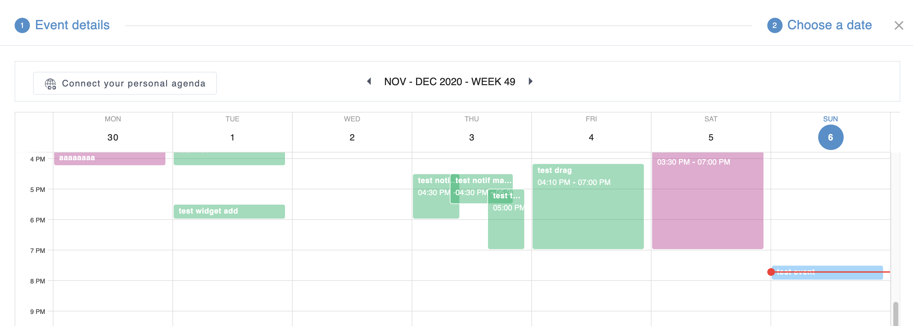
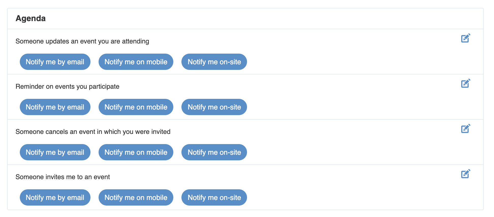

.. _Calendar:

########################
Managing Your Agendas
########################

    This chapter introduces you to the **Agenda** application and its
    actions that allow you to schedule appointments and meetings in your spaces,
    establish recurring activities, set your remote Agenda and receive notifications for coming events. 
    With **Agenda**, it is easy to keep track of all important events and collaborate with other 
    people, all in one place. This chapter is divided into the following topics:

    - :ref:`Agenda interface <Interface>`

       Introduction to the Agenda interface and its main components.

    - :ref:`Global and Spaces Agenda <Agendaapp>`

       Where i can find Agenda application.

    - :ref:`Scheduling an event <SchedulingEvent>`

       How to to perform common actions with events in Agenda:
       creating, editing, deleting, importing and exporting events.

    - :ref:`View event details <ViewEvent>`

       Steps to view event details.

    - :ref:`Respond to event invitation <EventInvitation>`

       How to respond to event invitation.

    - :ref:`Filter events and Agendas <FitlerEventAgendas>`

       Steps to filter Events and Agendas.

    - :ref:`Editing Agenda Preferences <EditingAgendaPreferences>`

       Steps to change the Agenda preferences.

    - :ref:`Connect Personal Calendar <ConnectPersonalCalendar>`

       Steps to connect your personal calendar and its display in the Agenda application.

    - :ref:`Managing Agenda Notifications <ManagingNotifications>`

       Steps to manage Agenda application notifications.

    - :ref:`Agenda in Mobile <AgendaMobile>`

       How Agenda application is used in Mobile.

.. _Interface:

==================
Agenda interface
==================

The Agenda interface has 2 basic sections.

The first section is the **Toolbar** that contains most of actions in Agenda:

-  Scheduling an event

-  Switching between view modes Day, Week and Month

-  Filter events (My events and All events)

-  Agendas' Filter and Settings 

-  Agenda Preferences

The second section presents events based on the selected view mode mentioned above.

|AGENDA1|

.. _Agendaapp:

==========================
Global and Spaces Agenda
==========================

each space has its own dedicated Agenda by default, and there is no longer a personal Agenda.
All the Agendas of the spaces of which you are a member are displayed in the global Agenda
application in the Digital Workplace.

To access the global Agenda application, simply open the Applications Center and click on Agenda.

|AGENDA2|

.. note:: If you can't find the Agenda application, please add it to your Applications drawer, more details can be found 
:ref:`here <AdminAppCenter>`.

You can also open the Agenda of the space you are a member of just by clicking on Agenda application from the space toolbar applications.

|AGENDA3|

.. note:: If you can't find the Agenda application, please add it, if you are a space manager, from Settings, or you can ask the Space Manager.

The Agenda application contain : 

- Agenda View 

- Events display in the agenda 

- 3 different views: Day, Week and Month 

- Schedule Event button 

- Event filter pulldown (My Events, Declined Events and All events)

- Agenda' Filters

- Agenda Preferences

.. _SchedulingEvent:

=====================
Scheduling an event
=====================

This section consists of the following topics:

- :ref:`Scheduling a new event <CreatingNewEvent>`

   Ways to create new events, including **Quick adding an event** and
   **Adding a detailed event**.

- :ref:`Editing an event <EditingEvent>`

   Instructions on how to edit an event.

- :ref:`Dragging and dropping an event <DraggingDroppingEvent>`

   Steps to change the start date and time of an event conveniently via
   the Drag and Drop feature.

- :ref:`Cancel an event <DeletingEvent>`

   Instructions on how to cancel an event from a Agenda.

.. _CreatingNewEvent:

Scheduling a new event
~~~~~~~~~~~~~~~~~~~~~~~~

1. Open the **Add Event** form via either of these 4 ways:

**The first way**

Click |AGENDA4| on the toolbar to open the :ref:`Create Event Stepper <create_event_stepper>`.

|AGENDA5|

**The second way**

Click on a timeslot in the Agenda view to open the  :ref:`Quick Schedule Event drawer <create_event_drawer`.

The quick add event drawer is opened with the selected timeslot in the Agenda view displayed in background.

|AGENDA6|

**The third way**

Click on Add event button in the Agenda widget in the Snapshot page to open the quick schedule event drawer.

|AGENDA7|

**The fourth way**

Click on Add event button in the Agenda widget in the Digital workplace or Space Stream page to open the quick schedule event drawer.

|AGENDA8|

**Details:**

+-----------------------+----------------------------------------------------+
| Field                 | Description                                        |
+=======================+====================================================+
| Title                 | The event title which is required.                 |
+-----------------------+----------------------------------------------------+
| Space Agenda          | The space agenda which contains the event          | 
|                       | (Required).                                        |
+-----------------------+----------------------------------------------------+
| From                  | The start date and time of the event.              |
+-----------------------+----------------------------------------------------+
| To                    | The end date and time of the event.                |
+-----------------------+----------------------------------------------------+
| All Day               | If the event does not have a specific time, select |
|                       | the All Day option. This option allows setting the |
|                       | event duration to be all day or not. If you do not |
|                       | check this option, you have to define the start    |
|                       | date/time and end date/time. By default, the start |
|                       | date and end date is the current date.             |
+-----------------------+----------------------------------------------------+
| Location              | The Place where the event will occur.              |
+-----------------------+----------------------------------------------------+
| Participants          | Persons to be invited to the event.                |
+-----------------------+----------------------------------------------------+
| Agenda                | The Space' Agenda which contains the event.        |
+-----------------------+----------------------------------------------------+
| Description           | The detailed description of the event.             |
+-----------------------+----------------------------------------------------+
| Occurence             | An event can repeat on certain days.               |
+-----------------------+----------------------------------------------------+
| Conference            | A conference link for the event.                   |
+-----------------------+----------------------------------------------------+
| Modify Event          | An event can be modified by its participants.      |
+-----------------------+----------------------------------------------------+

.. tip:: To create an event, you don't have to fill all the fields cited above. You can just fill 
         :ref:`mandatory fields <required_fields>` to add an event in **Space Agenda**. 

.. _required_fields:

2. Give necessary information for your event: Title and Space Agenda.

.. note:: -  Event start date and time are the current one with default
             duration of 30 minutes.

          -  When you select a start date/time, an end date/time will be
             suggested. You can select another values to your desires.

3. You can click "Save" to finish creating your new event in your **Space 
   Agenda** or you can fill in :ref:`more fields <detailed_event>` for 
   a detailed event.

.. _detailed_event:

To create a detailed event you can, in addition to :ref:`required fields <required_fields>`,
fill in these fields:
   
-  Add the event's location.

-  :ref:`Add participants to the event <AddingParticipantsToEvent>`.

-  :ref:`Update predefined reminders for upcoming events <CreatingEventReminder>`
   with your own notification settings.

-  Save time by :ref:`creating a recurring event <CreatingRecurringEvent>`
   rather than entering each instance separately.
   
-  Add description of the event.   

-  :ref:`Create Event conference link <attachement_event>`

.. _create_event_stepper:

Create event with stepper
---------------------------

The create event stepper contain 2 steps to create a new event: 

1. Event details:

+-----------------------+----------------------------------------------------+
| Field                 | Description                                        |
+=======================+====================================================+
| Title                 | The event title which is required.                 |
+-----------------------+----------------------------------------------------+
| Space Agenda          | The space agenda which contains the event          | 
|                       | (Required).                                        |
+-----------------------+----------------------------------------------------+
| Location              | The Place where the event will occur.              |
+-----------------------+----------------------------------------------------+
| Participants          | Persons to be invited to the event.                |
+-----------------------+----------------------------------------------------+
| Agenda                | The Space' Agenda which contains the event.        |
+-----------------------+----------------------------------------------------+
| Description           | The detailed description of the event.             |
+-----------------------+----------------------------------------------------+
| Occurence             | An event can repeat on certain days.               |
+-----------------------+----------------------------------------------------+
| Conference            | A conference link for the event.                   |
+-----------------------+----------------------------------------------------+
| Modify Event          | Grant the edit event permission to participants.   |
+-----------------------+----------------------------------------------------+

- Choose a date:

+-----------------------+----------------------------------------------------+
| Field                 | Description                                        |
+=======================+====================================================+
| Event display         | Event to create display in the Agenda Week view.   |
+-----------------------+----------------------------------------------------+
| Event popover         | The start and end date and time of the event.      |
|                       | If the event does not have a specific time, select |
|                       | the All Day option in the event popover .          |
|                       | This option allows setting the event duration      |
|                       | to be all day or not. If you do not check this     |
|                       | option, you have to define the start date/time and |
|                       | end date/time. By default, the start date and end  |
|                       | date is the current date.                          |
+-----------------------+----------------------------------------------------+
| Connect to personal   | Possibility to connect to your personal calendar.  |
| Calendar              |                                                    |
+-----------------------+----------------------------------------------------+
| Event Timezone        | Possibility to fix the Event Timezone.             |
+-----------------------+----------------------------------------------------+
| Now Time Line         | A now Time line displaying the current time        |
+-----------------------+----------------------------------------------------+

.. _create_event_drawer:

Create event with drawer
---------------------------

Quick schedule event drawer is displayed when you click on the Add event in: 

- Snapshot page 

- Global Stream Page Event widget 

- Space Stream Page Event widget 

Schedule event drawer contains: 

+-----------------------+----------------------------------------------------+
| Field                 | Description                                        |
+=======================+====================================================+
| Title                 | The event title which is required.                 |
+-----------------------+----------------------------------------------------+
| Space Agenda          | The space agenda which contains the event          | 
|                       | (Required).                                        |
+-----------------------+----------------------------------------------------+
| Start and End date    | The start and end date and time of the event.      |
| and time              |                                                    |
+-----------------------+----------------------------------------------------+
| All Day               | If the event does not have a specific time, select |
|                       | the All Day option in the event popover .          |
|                       | This option allows setting the event duration      |
|                       | to be all day or not. If you do not check this     |
|                       | option, you have to define the start date/time and |
|                       | end date/time. By default, the start date and end  |
|                       | date is the current date.                          |
+-----------------------+----------------------------------------------------+
| Event Timezone        | Possibility to fix the Event Timezone.             |
+-----------------------+----------------------------------------------------+
| Location              | The Place where the event will occur.              |
+-----------------------+----------------------------------------------------+
| Participants          | Persons to be invited to the event.                |
+-----------------------+----------------------------------------------------+
| Description           | The detailed description of the event.             |
+-----------------------+----------------------------------------------------+

.. note:: - You can click on **More details** to open the event on creation in the Event stepper with already filled information.
 - The **More details** button is not displayed in the Create event drawer from Space stream page.
 - A limitation for the Description field is fixed to 1300 characters to avoid large descriptions for events.
 - If you exceeds this limitation, a message Only 1300 characters allowed is displayed just below the Description field that will be underlined in Red and the Continue button will be disabled.

.. _CreatingRecurringEvent:

Creating a recurring event
---------------------------

An occurrence pulldown displays different propositions: 

|AGENDA9|

Here, you can define the repeating time for your event as follows:

   -  Do not repeat: No occurrence planified (Default value)

   -  Daily: The event will be repeated every day.

   -  Working Week Days: The event will be repeated only on Working week days.

   -  Weekly on X (Current Day): The event will be repeated every week on the current day (for example Weekly on Wednesday).

   -  Monthly on X (Day number): The event will be repeated every month on the current day number (for example Monthly on 23) .

   -  Yearly on XY (X = Month and Y= Date number) : The event will be repeated every year on the current month and day (for example Yearly on December 23).

   - Custom: You will be able to configure your own occurrence using a **Custom Occurrence** drawer.

By clicking on Custom, a drawer is opened so that you can configure your occurrence frequency and date for repeating your event

Available fields are: 
   
1. Repeat every specific period. For example, if you set Weekly and 2 just after  
     ``Repeat every``, the event will be repeated every 2 weeks on Wednesdays.

2. Repeat on: you can select days you want that the event repeats in. 
      By default all days are selected, you can simply click on a day to remove it. 

3. Select the option for ending your repeating event by ticking the
   relevant checkbox.

   -  Never: Your repeating event will never end.

   -  After [X] occurrences: Your repeating event will end after a defined
      number of occurrences.

   -  By this date: Your repeating event will end before your specified
      date. Point your cursor over the textbox and select the date from the
      drop-down Agenda.

The recurring event will be shown as below:

|AGENDA10|

.. note:: You can edit the custom event occurrence by clicking on Edit button and the Custom
      Occurrence drawer is opened with pre-filled values. 

.. _CreatingEventReminder:

Configure a reminder for upcoming events
------------------------------------------

The **Agenda** application provides 2 options for reminding users who
will take part in events. A reminder includes the summary information of
the event, such as title, space agenda and time. To use this feature, just 
configure the ``Reminder`` option in Agenda Prenferences or Global Settings.

|AGENDA11|

**Details:**

- You can add to 5 reminders at maximum.

- Configured reminders are displayed in the event view. 

- The interval time that the reminder will be repeated before an event starts is fixed by 2 values : Time number and duration (Minutes, Hours, Days).

-  Reminders will be received by configured channels on Settings.

- by default, you have 2 reminders: 10 mn before the event starts, and when the event starts (value is 0 minutes)

.. _AddingParticipantsToEvent:

Adding participants to an event
---------------------------------

If you want to invite people to attend at an event, fill in the
``Participants`` field. When typing in the field, type-ahead suggestions 
will appear below for easier selection of users.

   .. note:: Only space' participants are displayed in the suggester. 

|AGENDA42|

Participants status label are displayed when you mouse hover status icons. 

If the participants have not answered to the event invitation yet, no status is displayed for them.  

Participants are displayed by their avatars and Full names. 

By a mouse hove on the participant avatar or full name, the participant popover is displayed.

|AGENDA12|

.. _EditingEvent:

Editing an event
~~~~~~~~~~~~~~~~~

Open the 3 dots button in the event view to **Edit an Event**

|AGENDA13|

The **Edit Event** stepper is displayed with information already filled 
when adding your event.

2. Edit information of your event, then click ``Save`` to complete.

-   When you are editing the start time, the end time will remain the 
    same as previously selected.

-  If you make changes on a recurring event, the Edit recurring event pop-up will be displayed:

|AGENDA43|

   -  *Save event*: The changes will be applied into the
      selected event only. This event will be marked with the text:
      "Edited Recurring event".

   -  *All events*: The changes will be applied into all events of
      the series.

.. note:: - You can only edit their events if you have the edit permission.
      -  When editing an event, you can add/remove the attachment files or download them by directly clicking 
         their titles.
      -  If you only want to change the start date and time of the event, you can also use the drag-and-drop 
         feature to edit the time for the event directly on the **Agenda View**.
      -  When you edit an event, or an event that you particpate is edited, all participants receives a notification. 

.. _DraggingDroppingEvent:

Dragging and dropping an event
~~~~~~~~~~~~~~~~~~~~~~~~~~~~~~~

The drag-and-drop feature helps you change the start date and time of an
event more conveniently. You only need to click the event, drag and drop
it into another date or new time area in the **Agenda View pane**.

According to the features of the Agenda view, the drag-and-drop
feature can be applied to the date and time differently.

-  In the Day view, all events are shown in a day, so you can change the
   time of the event in one day only.

-  In the Week and Work Week views, all events are shown in a week, so
   you can change both the event time and the event date.

-  In the Month view, all events are shown in a month, so you can change
   the event date only. You can also change more events at the same time
   by ticking their checkboxes and using the drag-and-drop feature.

.. note:: You can only drag and drop their events if you have the **Edit** permission on these Agendas. You are not able to drag and drop an event of one Agenda on which you do not have the edit permission, the action is not authorised.

.. _DeletingEvent:

Cancel an event
~~~~~~~~~~~~~~~~~~

This function allows you to cancel (remove) events from a Agenda. To do this,
simply open the event you want to delete, then select Delete from
the drop-down menu.

.. _DeletRecurrentEvent:

Cancel a recurring event
-----------------------------

If you cancel a recurring event, the cancel Recurring Event popup will
be displayed:

|AGENDA14|

-  Select Save event to delete the selected event only.

-  Select All events to delete all events of the series.

When you cancel an edited recurring event in a space Agenda, you will receive a notification.

.. _ViewEvent:

====================
View Event details
====================

You have all your specified details of the event, with an indication of the answer of all participants in the new Event view. 

.. note:: Only filled informations are displayed in the event view. 

|AGENDA15|

**Details:**

+-----------------------+----------------------------------------------------+
| Information           | Description                                        |
+=======================+====================================================+
| Title                 | The event title.                                   |
+-----------------------+----------------------------------------------------+
| Space Agenda          | The space agenda which contains the event          | 
+-----------------------+----------------------------------------------------+
| Event Date            | The date of the event.                             |
+-----------------------+----------------------------------------------------+
| To                    | The end date and time of the event.                |
+-----------------------+----------------------------------------------------+
| Location              | The Place where the event will occur.              |
+-----------------------+----------------------------------------------------+
| Participants          | Persons invited to the event with their response.  |
+-----------------------+----------------------------------------------------+
| Description           | The detailed description of the event.             |
+-----------------------+----------------------------------------------------+
| Occurence             | Event occurrence.                                  |
+-----------------------+----------------------------------------------------+
| Conference            | A conference link for the event.                   |
+-----------------------+----------------------------------------------------+
| Reminder Notification | Pre-configured Reminders.                          |
+-----------------------+----------------------------------------------------+
| Personal Calendar     | Personal Calendar section.                         |
+-----------------------+----------------------------------------------------+

.. note:: - In the participants section, the event creator is displayed with a crown icon next to his Full Name. 
   - you can close it by clicking on the ESC button from your keyboard in Desktop devices. 

Edit Specific Event Reminders 
~~~~~~~~~~~~~~~~~~~~~~~~~~~~~~~

If you already configured your reminders, yo can find them in the event view and you can edit them only for this event.

A click on the Edit icon next to the first reminder opens the Event reminders drawer, in which you can edit your personal reminders for this event.

.. note:: Changes done for the event reminder are applied only for this event and you conserve your pre-configured reminders. 

|AGENDA16|

Event in Agenda view 
~~~~~~~~~~~~~~~~~~~~~~

Event are displayed in the Agenda view with different views: 

- Full colour card : If you are a participant in the event (responded by **Yes** or **May Be**).

|AGENDA21|

- Colored border card : If you are not a participant or invitated and waiting for your response.

|AGENDA22|

- Crossed labels card : If you responded by **No**.

|AGENDA23|

- Faded colour card : If you have any passed event of the 3 mentioned cards.

|AGENDA24|

.. note:: All day display event is displayed just below the Date and above the hours lines. 

|AGENDA40|

.. _EventInvitation:

==============================
Respond to event invitation 
==============================

Participants will receive invitations instaltly when you confirm their invitations. 

Their statuses will be in front of their Full Name after they have answered the invitations via the event view.

You can respond to the event invitation from the event view topbar or via received invitation emails.

|AGENDA17|

-  If the participants agree to participate (by clicking **Yes**), their statuses will be yes.

-  If the participants do not agree to participate (by clicking **No**),
   their statuses will be no.

-  If the participants have not decided to take part in the event (by
   clicking **May Be**), their statuses will be pending.
 
**i.** You can change your response just by clicking on a new response, and your response status will be updated instantly.

.. note:: Only not yet responded participants does not have a status icon. 

.. _FitlerEventAgendas:

===========================
Filter Event and Agendas 
===========================

Agendas Filter 
~~~~~~~~~~~~~~~~~

Agenda Filter is used to choose what spaces' agenda to display in the Agenda application. 

A list of all your spaces agenda is displayed with the possibility to filter on them by text.

Only checked spaces agenda are displayed in the Agenda application. 

|AGENDA18|

.. note:: - Only spaces managers can edit the space agenda color from the Agendas Filter using a color picker. 
 - Number of selected filters for Filter Agendas is displayed so that you have the information of how much spaces agenda are displayed.
 - If you select all Agendas to be displayed, no number is displayed and you have only the Filters icon.

|AGENDA19|

Events Filter 
~~~~~~~~~~~~~~~

Events Filter is used to choose what type of event to display in the Agenda view: 

- My Events: Event that you are a participant in (responded by **Yes** or **Maybe**).

- Declined Events: Event that you responded by **No**. 

- All Events: All events are displayed via this fitler, in which you are participant, or not even invited. 

|AGENDA20|

.. _EditingAgendaSettings:

==========================
Editing Agenda settings
==========================

You can change the Agenda preferences as follows:

1. Open the Agenda Settings form via either of the following ways:

   -  **The first way**: Click |AGENDA15| on the Agenda toolbar.

   -  **The second way**: Click |AGENDA16|, then select edit Agenda Settings button.

In this new setting, you are able to edit your Agenda preferences by configuring: 

  - Agenda default view 

  - Week Starting day 

  - Working time 

  - Default Reminders

By clicking on the edit button, a drawer is opened to edit these preferences. 

The Agenda Settings form appears:

|AGENDA25|

2. Change your desired preferences.

**i.** In the Settings tab, you can change the Agenda general
       settings:

.. _ConnectPersonalCalendar:

==========================
Connect Personal Calendar
==========================

You are now able to connect your personal calendar and display your personal events in your **Schedule meeting** view to help you scheduling your meeting or event.

Where Can I Connect to my Personal Calendar ? 
~~~~~~~~~~~~~~~~~~~~~~~~~~~~~~~~~~~~~~~~~~~~~~~~

You can Connect to your personal Calendar via either of these 3 ways:

**The first way**

You are invited to open your Settings page and just below the Agenda section, you  find a new section Connect your personal Calendar.

|AGENDA26|

By default, you do not have a connected personal calendar, so a message is displayed : *You are invited to connect to your personal calendar.*

**The second way**

A new section is added to the Choose a date stepper in which you find if you are connected to your Google personal Calendar or not.

You need to click on the *Connect your personal calendar* button to choose it.

|AGENDA27|

**The third way**

A new section is added to any event view you are invited to participate to in which you find if you are connected to your Google personal Calendar or not.

You need to click on the *Connect your personal calendar* button to choose it.

|AGENDA28|

.. note:: If no personal calendar connector is displayed in the Personal Calendar drawer, an information message is displayed. 
   |AGENDA29|.
   you can take a look on :ref:`Manage Personal Calendar <UserGuide.AdministratingAgenda>` for 
   more detail about enabling and displaying Personal Calendars.
  

How can I connect my personal calendar ?
~~~~~~~~~~~~~~~~~~~~~~~~~~~~~~~~~~~~~~~~~~~

You can simply click on the *edit icon* in the Settings page, or Connect to my personal Calendar in the *Choose a date* stepper or *Event view*.

A drawer that contains the Calendars connectors is displayed.

You have 2 choices: Google Calendar and Microsoft Outlook. 

|AGENDA30|

You are invited to click on connect in front of one of these choices. 

If you are not connected to your personal calendar, you can click on You are invited to connect to your personal Calendar and the Connect to personal calendar drawer is opened so that you can connect to it.

When you click on connect, a popup of your connected email in the browser is displayed, or you can connect to another email.

|AGENDA31|

.. note:: You are allowed to connect to only one personal calendar. 

Once connected, you will have your personal connected Google email and Google avatar for Google account, and same for Outlook account.

|AGENDA32|

How can I view my personal events ?
~~~~~~~~~~~~~~~~~~~~~~~~~~~~~~~~~~~~~~

You can view your personal events via either of these 2 views:

**Choose a date stepper**:

As long as your personal calendar is connected to the digital workplace, you are able to view your personal events in the Choose a date step when you create a new event so that you are aware about your events in the chosen space to create the event into and your Google personal events.

Personal events are presented with a different display of the Agenda application events with blue border and text blue coloured and the display of Google avatar.

|AGENDA41|

**Event View**:

Same Personal events cards are displayed in the Event view, when you are connected to your personal calendar, just below the Participants list.

You are able to view the disposition of the event to participate in chronological order with the personal events. 

|AGENDA33|

.. _ManagingNotifications:

================================
Managing Agenda Notifications
================================

You can edit your default notifications for both regular events and all-day events. 

You can also choose to be notified with on-site, Email and Mobile push notifications.

By clicking on Settings -> Manage Notification, you find a specific section for all Events Notification, named **Agenda**.

In this section, you are able to configure notifications when : 

 - Someone invites you to an event 

 - Someone updates an event you are attending 

 - Someone cancels an event in which you were invited

 - Reminders on events you participate 

|AGENDA34|

You can enable or disable all Agenda notifications type, and they will display once you apply your choices from the Notification drawer.

|AGENDA35|

.. _AgendaMobile:

===================
Agenda in Mobile 
===================

Mobile version for the Agenda application is much more smooth and simple use. 

In Agenda app Mobile version, you are able to : 

 - View events Timeline 

 |AGENDA36|

 - View events view

 |AGENDA37|

 - Schedule a new Event 

 |AGENDA38|

 - Edit your events

 - View and Edit your Agenda Filters

 |AGENDA39|

The default view displays the Day view as a Timeline in which you will have your next 10 events on your agenda application starting from the current day (or a date you selects from the Date picker just above).

.. |image0| image:: images/common/1.png
.. |image1| image:: images/common/2.png
.. |image2| image:: images/common/3.png
.. |image3| image:: images/Agenda/left_arrow_icon.png
.. |image4| image:: images/Agenda/right_arrow_icon.png
.. |image5| image:: images/common/4.png
.. |image6| image:: images/common/5.png
.. |image7| image:: images/Agenda/add_icon_Agenda.png
.. |image8| image:: images/Agenda/Agenda_form.png
.. |image9| image:: images/common/select_everyone_icon.png
.. |image10| image:: images/Agenda/add_button.png
.. |image11| image:: images/Agenda/show_in_groups_tab.png
.. |image12| image:: images/common/select_group_icon.png
.. |image13| image:: images/Agenda/group_selector.png
.. |image14| image:: images/Agenda/add_button.png
.. |image15| image:: images/common/select_user_icon.png
.. |image16| image:: images/common/select_role_icon.png
.. |image17| image:: images/common/delete_icon.png
.. |image18| image:: images/Agenda/add_icon_Agenda.png
.. |image19| image:: images/Agenda/subscribe_Agenda.png
.. |image20| image:: images/Agenda/remote_Agenda_form.png
.. |image21| image:: images/Agenda/Agenda_setting_icon.png
.. |image22| image:: images/Agenda/options_button.png
.. |image23| image:: images/Agenda/settings_sharing_option.png
.. |image24| image:: images/Agenda/public_address_ical.png
.. |image25| image:: images/Agenda/add_icon_Agenda.png
.. |image26| image:: images/Agenda/Agenda_setting_icon.png
.. |image27| image:: images/Agenda/Agenda_setting_icon.png
.. |image28| image:: images/Agenda/Agenda-color.png
.. |image29| image:: images/Agenda/Agenda_setting_icon.png
.. |image30| image:: images/Agenda/Agenda_setting_icon.png
.. |image31| image:: images/Agenda/export_Agenda_form.png
.. |image32| image:: images/Agenda/Agenda_setting_icon.png
.. |image33| image:: images/Agenda/import_Agenda_form.png
.. |image34| image:: images/common/delete_icon.png
.. |image35| image:: images/common/plus_icon.png
.. |image36| image:: images/Agenda/Agenda_setting_icon.png
.. |image37| image:: images/Agenda/share_Agenda.png

.. |image39| image:: images/Agenda/add_button.png
.. |image40| image:: images/Agenda/Agenda_setting_icon.png
.. |image41| image:: images/Agenda/Agenda_detail.png
.. |image42| image:: images/Agenda/ical_icon.png
.. |image43| image:: images/Agenda/view_detailed_event.png
.. |image44| image:: images/Agenda/view_detailed_event2.png
.. |image45| image:: images/Agenda/event_button.png
.. |image46| image:: images/Agenda/add_new_event.png
.. |image47| image:: images/Agenda/Agenda_setting_icon.png
.. |image48| image:: images/Agenda/Add_event_drawer.png
.. |image49| image:: images/Agenda/Agenda_setting_icon.png
.. |image50| image:: images/Agenda/more_details_button.png
.. |image51| image:: images/Agenda/more_details_button.png
.. |image52| image:: images/Agenda/add_event_detailed_tab.png
.. |image53| image:: images/common/add_attachment_button.png
.. |image54| image:: images/Agenda/Agenda_activity_stream_update.png
.. |image55| image:: images/Agenda/repeat_event_form.png
.. |image56| image:: images/Agenda/recurring_event_display.png
.. |image57| image:: images/Agenda/reminder_event.png
.. |image58| image:: images/common/delete_icon.png
.. |image59| image:: images/common/plus_icon.png
.. |image60| image:: images/common/delete_icon.png
.. |image61| image:: images/common/yes.png
.. |image62| image:: images/common/plus_icon.png
.. |image63| image:: images/common/select_user_icon.png
.. |image64| image:: images/common/delete_icon.png
.. |image65| image:: images/Agenda/confirmation_sending_participants.png
.. |image66| image:: images/Agenda/availability.png
.. |image67| image:: images/Agenda/add_selector_icon.png
.. |image68| image:: images/Agenda/delete_selector_icon.png
.. |image69| image:: images/Agenda/left_arrow_icon.png
.. |image70| image:: images/Agenda/right_arrow_icon.png
.. |image71| image:: images/Agenda/edit_event_menu.png
.. |image72| image:: images/Agenda/edit_recurring_event_form.png
.. |image73| image:: images/Agenda/edited_recurring_event.png
.. |image74| image:: images/Agenda/set_repeat_event.png
.. |image75| image:: images/Agenda/edit_following_events.png
.. |image76| image:: images/Agenda/drag_mouse.png
.. |image77| image:: images/Agenda/export.png
.. |image78| image:: images/Agenda/export_Agenda_form.png
.. |image79| image:: images/Agenda/delete_recurring_event_form.png
.. |image80| image:: images/Agenda/delete_only_this_event.png
.. |image81| image:: images/Agenda/delete_following_events.png
.. |image82| image:: images/common/delete_icon.png
.. |image83| image:: images/Agenda/month_view_Agenda_panel.png 
.. |OK1| image:: images/common/yes.png
.. |OK2| image:: images/common/yes.png
.. |OK3| image:: images/common/yes.png
.. |OK4| image:: images/common/yes.png
.. |OK5| image:: images/common/yes.png
.. |OK6| image:: images/common/yes.png
.. |image84| image:: images/Agenda/setting_icon.png
.. |image85| image:: images/Agenda/add_icon_Agenda.png
.. |image86| image:: images/Agenda/Agenda_setting_form.png
.. |image87| image:: images/Agenda/Agenda_setting_feed.png
.. |image88| image:: images/Agenda/Agenda_setting_feed_edit.png
.. |image89| image:: images/common/settings_icon.png
.. |image90| image:: images/common/refresh_icon.png
.. |image91| image:: images/common/plus_icon.png
.. |image92| image:: images/common/delete_icon.png
.. |image93| image:: images/Agenda/created_Agenda_feed.png
.. |image94| image:: images/Agenda/get_url_icon.png
.. |image95| image:: images/Agenda/add_icon_Agenda.png
.. |image96| image:: images/Agenda/event_category_form.png

.. |image98| image:: images/common/delete_icon.png
.. |image99| image:: images/Agenda/topbar_Agenda.png
.. |image100| image:: images/Agenda/Add_event_settings_Agenda.png
.. |image101| image:: images/Agenda/detailed_event.png
.. |image111| image:: images/Agenda/type-ahead-suggestions-participants.png
.. |image102| image:: images/1.png
.. |image103| image:: images/3.png
.. |image104| image:: images/4.png
.. |image105| image:: images/2.png
.. |image106| image:: images/5.png
.. |image107| image:: images/6.png
.. |image108| image:: images/7.png
.. |image109| image:: images/8.png
.. |image110| image:: images/9.png
