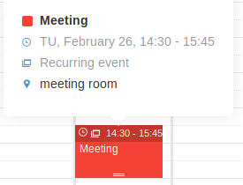
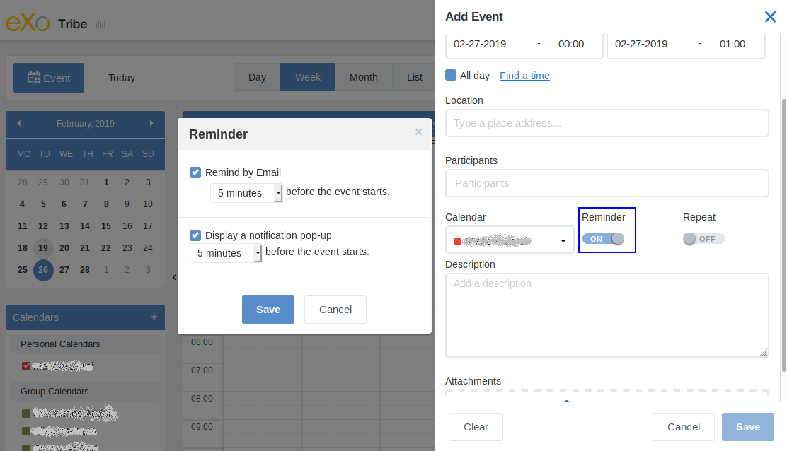
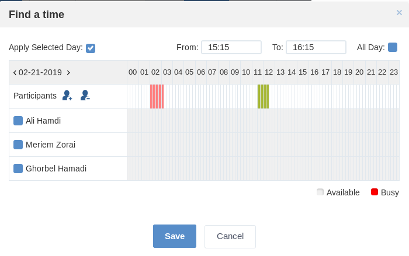
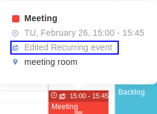
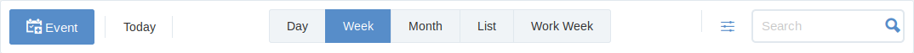
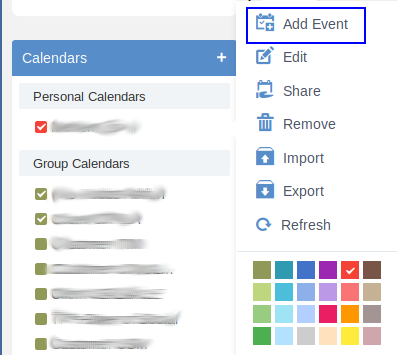
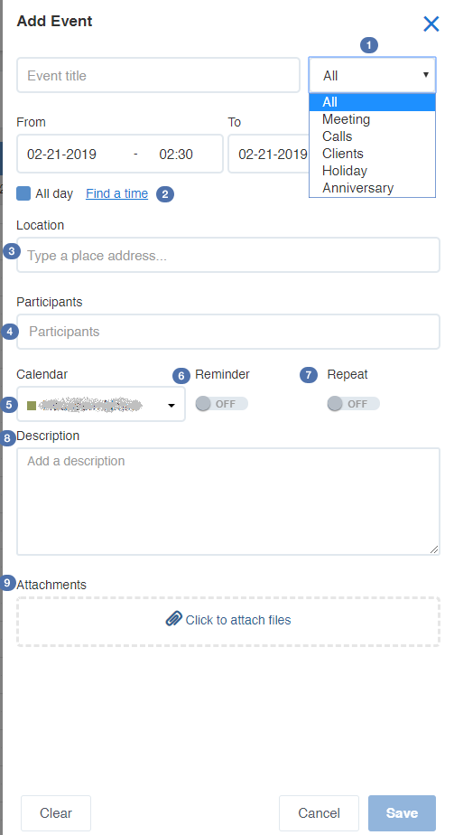
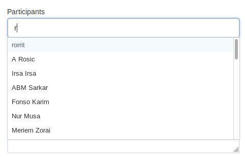

.. _Calendar:

########################
Managing Your Calendars
########################

    This chapter introduces you to the **Calendar** application and its
    actions that allow you to schedule appointments and meetings,
    establish recurring activities, create multiple calendars and share
    calendars with others. With **Calendar**, it is easy to keep track
    of all important events/tasks and collaborate with other people, all
    in one place. This chapter is divided into the following topics:

    - :ref:`Calendar interface <Interface>`

       Introduction to the Calendar interface and its main components.

    - :ref:`Creating a calendar <CreatingCalendar>`

       How to create a personal calendar, group calendar or remote
       calendars.

    - :ref:`Editing a calendar <EditingCalendar>`

       Steps to edit details and properties of a calendar, to set the
       calendar color, and to delete a calendar.

    - :ref:`Exporting/Importing a calendar <ExportingImportingCalendar>`

       How to import calendars or export calendars to a calendar
       application that supports the iCalendar format.

    - :ref:`Sharing a personal calendar <SharingPersonalCalendar>`

       Information about setting permissions on your shared calendar and
       how to share your personal calendar with other users so that they
       can participate in all activities of the calendar.

    - :ref:`Scheduling an event <SchedulingEvent>`

       How to to perform common actions with events in Calendar:
       creating, editing, deleting, importing and exporting events.

    - :ref:`Editing Calendar settings <EditingCalendarSettings>`

       Steps to change the Calendar preferences.

    - :ref:`Generating RSS <GeneratingRSS>`

       Steps to publish your calendar as an RSS feed.

    - :ref:`Managing categories <ManagingCategories>`

       Steps to add, edit and delete categories which are used to
       classify events and tasks.

.. _Interface:

==================
Calendar interface
==================

The Calendar interface has 5 basic components.

In which:

-  |image0|: The **Toolbar** contains most of actions in Calendar, such
   as adding an event, switching between view modes and more.

-  |image1|: The **Search Pane** where you can perform quick and
   advanced searches.

-  |image2|: The **Mini calendar** where you can go backward/forward
   months by clicking |image3|/ |image4|. Also, you can jump to your
   desired date by directly clicking that date.

-  |image5|: The **Calendar View pane** where you can create events
   quickly and view your own events.

-  |image6|: The **Calendars pane** which includes 3 groups:

   -  Personal Calendars: Your private calendars.

   -  Group Calendars: Calendars of groups in which you are a member.

   -  Shared Calendars: Calendars which others share with you.

.. note:: If the :ref:`Task Management application <Manage-Task>` is installed by your administrator, you will see another Calendar group named "*Task Calendars*\ " below your *Group Calendars*. Each project from this application will have an individual calendar here but for view purpose only. Under the group, there will be also a *Tasks* calendar that displays all tasks assigned to you.

.. _CreatingCalendar:

===================
Creating a calendar
===================

You may create a :ref:`personal calendar <PersonalCalendar>`
or :ref:`group calendar <GroupCalendar>`
that can be shared with specific users or groups to your desires. You
can also create a calendar which is synchronized with a 
:ref:`remote calendar <RemoteCalendar>`.

.. _PersonalCalendar:

Creating a personal calendar
~~~~~~~~~~~~~~~~~~~~~~~~~~~~~

.. note:: All personal calendars will be put in the **Personal Calendars** pane.

1. Click |image7|, then select Add Calendar from the drop-down menu.

2. Fill in fields of the Details tab.

|image8|

*Details:*

+-----------------------+----------------------------------------------------+
| Field                 | Description                                        |
+=======================+====================================================+
| Display Name          | The calendar name which is displayed.              |
+-----------------------+----------------------------------------------------+
| Description           | The brief description of the calendar.             |
+-----------------------+----------------------------------------------------+
| Time Zone             | The display time zone for the calendar activities  |
|                       | which cannot be edited. However, you can change    |
|                       | the time zone in your :ref:`calendar               |
|                       | settings <TimeZone>`.                              |
+-----------------------+----------------------------------------------------+
| Color                 | The display color of the calendar activities that  |
|                       | can be personalized.                               |
+-----------------------+----------------------------------------------------+

.. note:: If you select the :ref:`Show in Groups <ShowInGroupsForm>` tab, then click |image9| to define specific groups and click |image10|, the calendar will be put in the **Group Calendars** category, not in the **Personal Calendars** category.

3. Click Save to finish your creation.

.. _GroupCalendar:

Creating a group calendar
~~~~~~~~~~~~~~~~~~~~~~~~~~~

.. note:: All group calendars will be put in the **Group Calendars** pane.

1. Follow steps as stated in :ref:`Creating a personal calendar <PersonalCalendar>`
   to give details for your new calendar.

.. _ShowInGroupsForm:

2. Select the Show in Groups tab.

|image11|

3. Select groups that contain your created calendar. The users of the
   selected groups can only view this calendar.

**i.** Click |image12| to open the Group Selector form. This form will
       help you select a group that you want to share.

|image13|

**ii.** Click your desired group, then select |image14| to add the
        defined group.

**iii.** Click |image15| or |image16| to grant permissions to specific
users or memberships respectively from the selected group.

.. note:: - If you set the \* membership in the User able to edit calendar column, all users of the selected group will be able to edit this calendar, regardless of their membership role.

		  -  You can select more users/memberships by repeating the above steps. The selected users/memberships will be updated in corresponding textboxes.

		  -  You can delete your selected users/memberships manually in the textboxes or click |image17| to remove the permissions.

4. Click Save to finish creating your new group calendar.

.. _RemoteCalendar:

Creating a remote calendar
~~~~~~~~~~~~~~~~~~~~~~~~~~~

.. note:: To create a remote calendar in the **Calendar** application successfully, you need to learn about the calendar settings of the relevant provider. For more information about types of remote calendars, see :ref:`here <MoreAboutiCalCalDAV>`.

1. Click |image18|, then select Remote Calendar from the drop-down menu. 
   The Subscribe Calendar form appears.

|image19|

2. Select the type of the remote calendar: iCalendar or CalDAV.

3. Enter the URL linking to your calendar server in the URL field.

4. Click Next to go to the Remote Calendar form.

|image20|

5. Fill in the fields. The asterisk (\*) indicates the field is mandatory.

6. Tick the Use Authentication checkbox, then enter the username and
   password of your remote calendar server if the remote server requires
   verification.

7. Click Save to accept your creation.

.. note:: After creating a remote calendar, you can ONLY VIEW all events and tasks which are created in the remote calendar server right in the **Calendar** application by clicking it. To get the updates, hover your cursor over the remote calendar, then click |image21| to select Refresh from the drop-down menu.

.. _MoreAboutiCalCalDAV:

More information about types of remote calendars
--------------------------------------------------

-  **iCalendar**:

iCalendar provides a link to an online .ics file from another calendar
servers, such as Google Calendar, Yahoo Calendar, or eXo Calendar
(including public URL or private URL).

An example of a Google Calendar URL (in iCal format):

`https://calendar.google.com/calendar/ical/en.tn%23holiday%40group.v.calendar.google.com/public/basic.ics <http://calendar.google.com/calendar/ical/en.tn%23holiday%40group.v.calendar.google.com/public/basic.ics>`__

-  **CalDAV**:

CalDAV is an open protocol that allows you to access calendars via
WebDAV. With CalDAV, you can publish and subscribe to calendars, share
them collaboratively, synchronize among multiple users or devices.

**Google**: https://apidata.googleusercontent.com/caldav/v2/calid/events
where ``calid`` is the calendar id to be accessed.

**Yahoo**:
https://caldav.calendar.yahoo.com/dav/your_yahoo_account@yahoo.com/Calendar/calendar_name/

.. _ImportGoogleCalendar:

How to import a Google calendar?
----------------------------------

Below an example of how to import a Google calendar to eXo Platform:

1. Go to your Google calender interface and select the calendar you 
   wish to import to eXo Platform.

2. Click on options button |image22| of the chosen calendar and then 
select *Settings and sharing*.

|image23|

3. An interface Settings appears, scroll down to the section Integrate
   calendar and copy your calendar's public link in iCal format.

|image24|

4. Go to the calendar interface in eXo Platform and click on the 
   |image25| then on Remote calendar.

5. Paste the iCal link to the field URL.

6. Click on Next to move to the form in calendar settings. Fill in the
   needed fields.

.. note:: If the imported remote calendar is not public, you should input your google account credentials in the "Authentication" section to enable the import procedure.

.. _EditingCalendar:

==================
Editing a calendar
==================

.. note:: -  You can ONLY edit personal calendars and group calendars that you created.

		  -  For group calendars which are created by another users, you can ONLY edit them if you are granted the **Edit** permission. Meanwhile, for shared calendars, you cannot edit them. If you are granted the **Edit** permission on them by the calendar creators, you can ONLY have the right on their tasks or events (for example, adding/modifying/deleting, exporting/importing).

1. Hover your cursor over the calendar which you want to edit, then 
click |image26| that appears.

2. Click Edit from the drop-down menu. The form to edit the calendar 
   will be different, depending on your selected calendar type. 
   For example, if you select a personal calendar, the form only 
   contains the Details tab.

3. Make changes on the calendar, then click Save to accept your changes.

.. _CalendarColor:

Setting the calendar color
---------------------------

The **Calendar** application allows you to select different colors for
all types of calendars to recognize them easily.

1. Hover your cursor over the calendar which you want to set the color,
then click |image27| that appears.

2. Select one color from the available 24-color palette.

|image28|

.. _DeleteCalendar:

Deleting a calendar
----------------------

This function allows you to remove any calendars and all their events.

.. note:: You cannot delete group calendars created by another users if you are not granted the **Edit** permission.

1. Hover your cursor over the calendar which you want to delete, then 
   click |image29| that appears.

2. Select Remove from the drop-down menu.

3. Click Yes in the confirmation message.


.. _ExportingImportingCalendar:

==============================
Exporting/Importing a calendar
==============================

.. note:: You can only export the calendar which contains at least one event. Besides, for shared and group calendars, you can only export/import them if you have the **Edit** permission.

.. _ExportCalendar:

Exporting a calendar
~~~~~~~~~~~~~~~~~~~~~

This function allows you to export a calendar and its events into a
separate file on your device.

1. Hover your cursor over the calendar which you want to export, then click
   |image30| that appears.

2. Click Export from the drop-down menu to open the Export Calendar form.

|image31|

3. Enter the exported file name in the File Name field. The export format
   is iCalendar by default.

4. Click Save to finish your export.

.. note:: You can only open the exported file if you have an application installed on your device that supports its format.

.. _ImportCalendar:

Importing a calendar
~~~~~~~~~~~~~~~~~~~~~

This function allows you to import one calendar from your device to a
selected calendar in **Calendar**.

1. Hover your cursor over the calendar which you want to import, then 
   click |image32| that appears.

2. Click Import from the drop-down menu to open the Calendar form.

|image33|

3. Select a format type from the Format drop-down menu. At present, only
   the .ics and .csv formats are supported.

4. Click Select File to open a window that allows you to browse your
   selected file.

5. Select your desired file from your local device, then click Open to
   upload it.

-  Click |image34| next to the name of your uploaded file if you want to
   remove it and upload again.

6. Click the Import in field to select the calendar in which you want to
   import your uploaded file;

Or, create a new calendar where your uploaded file is imported by
clicking |image35| next to the Import in field.

7. Click Save to finish your import.

.. _SharingPersonalCalendar:

===========================
Sharing a personal calendar
===========================

This function allows you to share your personal calendar with other
users, so that they can participate in all activities of this calendar.

You can set permissions on your shared calendar based on 2 levels:

-  **View permission** allows shared users to view the shared calendar
   and its events/tasks, but cannot change any information. It means
   that the shared users cannot add/edit/delete events or tasks, or
   edit, import and export the shared calendar.

-  **Edit permission** allows shared users to view, import and export
   the shared calendar or add, edit, delete events/tasks inside the
   shared calendar. However, you cannot edit detailed information of a
   shared calendar, such as its display name.

.. note:: If other users share their calendars with you, you will see them in the **Shared Calendars** category even after the users :ref:`are suspended <ManagingUsers.DisablingUser>`.

.. _SharePersonalCalendar:

Sharing a personal calendar
~~~~~~~~~~~~~~~~~~~~~~~~~~~

1. Hover your cursor over the calendar which you want to share, then 
   click |image36| that appears.

2. Click Share from the drop-down menu to open the Share Calendar form:

|image37|

3. Select users, memberships or users that you want to share by clicking
   |image38| respectively,

Or enter name of users, memberships or users into the text-box manually,
separated by commas.

.. note:: If you set the \* membership for a group, all users of the group will be able to access this calendar, regardless of their membership role.

4. Click |image39| to add your selected ones.

5. Check the Edit Permission checkbox if you want to grant the Edit
   permission to the corresponding users/memberships/groups.

6. Click Save to accept sharing your personal calendar.

-  If you select to share with any group, you will see a popup showing
   the sharing process:

-  You cannot abort your sharing till the process is finished.

-  The shared user/group can perform the following actions on the shared
   calendar:

   -  Remove and Refresh, if the Read permission only is granted.

   -  Add Event, Add Task, Remove, Import, Export and Refresh, if the
      Edit permission is granted.

.. _ShareUsingiCal:

Sharing a calendar using iCal
~~~~~~~~~~~~~~~~~~~~~~~~~~~~~~

iCal provides a link that allows users to download a *\*.ics* file which
contains all events and tasks of a calendar. iCal is supported by many
popular products, such as Microsoft Outlook, Google Calendar, Apple
iCal.

-  **Public URL**: The Public URL link allows you to share your calendar
   with other users. They do not need to have Calendar accounts to
   download the file, but they must use a calendar application which
   supports the .ics to open and view it. By default, Public URL is
   empty and it is only accessible when public access is explicitly
   enabled.

-  **Private URL**: iCal is used for personal use. It means that as the
   creator of the calendar, you can download it to your computer and use
   any calendar applications which support the .ics format to open it.
   You can also import it into another calendar.

.. _DownloadiCal:

Getting the link to download iCal
~~~~~~~~~~~~~~~~~~~~~~~~~~~~~~~~~~~

1. Hover your cursor over the calendar which you want to get iCal, then
   click |image40| that appears.

2. Click Edit from the drop-down menu to open the Calendar form.

|image41|

3. Get a Public URL or Private URL by clicking |image41|. 
   For Public URL, you must assure that the iCal is public. If it is not
   public, simply click the "Disable Public Access" link.

One Calendar Feed form will pop up.

4. Copy the link in the Calendar Feed form, then send it to another 
   users.
   The shared users can use this link to download the *.ics* file which 
   can be opened in popular calendar applications, such as Microsoft 
   Outlook, Google Calendar, Apple iCal.


.. _SchedulingEvent:

===================
Scheduling an event
===================

This section consists of the following topics:

- :ref:`Creating a new event <CreatingNewEvent>`

   Ways to create new events, including **Quick adding an event** and
   **Adding a detailed event**.

- :ref:`Editing an event <EditingEvent>`

   Instructions on how to edit an event.

- :ref:`Dragging and dropping an event <DraggingDroppingEvent>`

   Steps to change the start date and time of an event conveniently via
   the Drag and Drop feature.

- :ref:`Exporting/Importing an event <ExportingImportingEvent>`

   Instructions on how to export and import an event.

- :ref:`Deleting an event <DeletingEvent>`

   Instructions on how to remove an event from a calendar.

Before learning to schedule an event, you should know how to view an
event of a specific calendar with its details:

**The first way**

Hover your cursor over the event to see its detailed view.

|image43|

**The second way**

Right-click the event in the Calendar View pane, then select View from
the drop-down menu.

The **Preview** form will appear.

|image44|

At the Preview form, if the event includes attachments, you can download
them by directly clicking its title. If the attachment is an image, you
can also click View to preview it.

.. _CreatingNewEvent:

Creating a new event
~~~~~~~~~~~~~~~~~~~~~

1. Open the **Add Event** form via either of these 4 ways:

**The first way**

Click |image45| on the toolbar.

|image99|

**The second way**

Right-click the **Calendar View pane**, then select Add New Event from
the drop-down menu.

|image46|

**The third way**


i.  Hover your cursor over the calendar which you want to add new events, then click |image47| that appears.

ii.  Click **Add Event** from the drop-down menu.

|image100|

**The forth way**

Click the appropriate time slot in the calendar view pane. Drag your
cursor to alter the length of the event. For more details, see
:ref:`here <DraggingDroppingEvent>`.

==> The **Add Event** form appears in the right of the screen.

|image48|

**Details:**

+-----------------------+----------------------------------------------------+
| Field                 | Description                                        |
+=======================+====================================================+
| Title                 | The event title which is required.                 |
+-----------------------+----------------------------------------------------+
| Event Category        | The category which contains the event.             |
+-----------------------+----------------------------------------------------+
| From                  | The start date and time of the event.              |
+-----------------------+----------------------------------------------------+
| To                    | The end date and time of the event.                |
+-----------------------+----------------------------------------------------+
| All Day               | If the event does not have a specific time, select |
|                       | the All Day option. This option allows setting the |
|                       | event duration to be all day or not. If you do not |
|                       | check this option, you have to define the start    |
|                       | date/time and end date/time. By default, the start |
|                       | date and end date is the current date.             |
+-----------------------+----------------------------------------------------+
| Location              | The Place where the event will occur.              |
+-----------------------+----------------------------------------------------+
| Participants          | Persons to be invited to the event.                |
+-----------------------+----------------------------------------------------+
| Calendar              | The calendar which contains the event.             |
+-----------------------+----------------------------------------------------+
| Description           | The detailed description of the event.             |
+-----------------------+----------------------------------------------------+
| Attachments           | Files to attach to the event.                      |
+-----------------------+----------------------------------------------------+

.. tip:: To create an event, you don't have to fill all the fields cited above. You can just fill 
         :ref:`mandatory fields <required_fields>` to add an event in your **personal calendar**. 

.. _required_fields:

2. Give necessary information for your event: title, time slot i.e. *from*
   and *to* fields

.. note:: -  When you right-click to add an event, the start date and time are
             where the click occurs and the default duration is one hour. When you 
             click Event on the top left corner of Calendar or Add Event
             by selecting |image49|, the start date is the current one with
             duration of 1 hour.

          -  When you select a start date/time, an end date/time will be
             suggested. You can select another values to your desires.

3. You can click "Save" to finish creating your new event in your **persanal 
   calendar** or you can fill in :ref:`more fields <detailed_event>` for 
   a detailed event.

.. _detailed_event:

|image101|

To create a detailed event you can, in addition to :ref:`required fields <required_fields>`,
fill in these fields:

-  |image102| Select the event's category.
   
-  |image103| Add the event's location.

-  |image104| :ref:`Add participants to the event <AddingParticipantsToEvent>` 
   and |image105| check their :ref:`availability <ViewingTimeAvailability>`.

-  |image106| Select the calendar where you wish to add your event.

-  |image107| :ref:`Create a reminder for upcoming events <CreatingEventReminder>`
   with your own notification settings.

-  |image108| Save time by :ref:`creating a recurring event <CreatingRecurringEvent>`
   rather than entering each instance separately.
   
-  |image109| Add description of the event.   

-  |image110| :ref:`Add attachments to the event <attachement_event>`

.. note:: You can attach a maximum of 10 files to an event. Also, the size of each file must be less than 10 MB.


.. _CreatingRecurringEvent:

Creating a recurring event
---------------------------

Tick the Repeat checkbox to open the Recurring Event form.

|image55|

Here, you can define the repeating time for your event as follows:

1. Select the type of your repeating event from the ``Repeat`` option.

   -  Daily: The event will be repeated every day.

   -  Weekly: The event will be repeated every week that is set by default.

   -  Monthly: The event will be repeated every month.

   -  Yearly: The event will be repeated every year.

2. Select the frequency and date for repeating your event in the ``Repeat every``
   and ``Repeat on`` fields respectively. The selected frequency will 
   work on the Repeat value. For example, if you set Weekly in ``Repeat``, 
   **5** in ``Repeat every`` and **WE** in ``Repeat on``, the event will be 
   repeated every 5 weeks on Wednesdays.

3. Select the option for ending your repeating event by ticking the
   relevant checkbox.

   -  Never: Your repeating event will never end.

   -  After [X] occurrences: Your repeating event will end after a defined
      number of occurrences.

   -  By this date: Your repeating event will end before your specified
      date. Point your cursor over the textbox and select the date from the
      drop-down calendar.

The recurring event will be shown as below:

|image56|

.. _CreatingEventReminder:

Creating a reminder for upcoming events
------------------------------------------

The **Calendar** application provides 2 options for reminding users who
will take part in events. A reminder includes the summary information of
the event, such as title, time and location. To use this feature, juts 
activate the ``Reminder`` option.

|image57|

**Details:**

-  Remind by Email: This option is to remind users of upcoming events
   via emails. This option is set default. If you do not use this
   option, simply untick the checkbox.

+------------------------+---------------------------------------------------+
| Field                  | Description                                       |
+========================+===================================================+
| Remind by Email before | The interval time that the reminder will be       |
| the event starts       | repeated before an event starts.                  |
+------------------------+---------------------------------------------------+
| **Display a            | Remind users of upcoming events via pop-up        |
| notification pop-up**  | messages.                                         |
+------------------------+---------------------------------------------------+


.. _AddingParticipantsToEvent:

Adding participants to an event
---------------------------------

If you want to invite people to attend at an event, fill in the
``Participants`` field. When typing in the field, type-ahead suggestions 
will appear below for easier selection of users.

|image111|

Participants will receive invitations via emails. Their statuses will be
updated in the Status column after they have answered the invitations
via emails.

-  If the participants agree to participate (by clicking **Yes** in
   their received invitation emails), their statuses will be yes.

-  If the participants do not agree to participate (by clicking **No**),
   their statuses will be no.

-  If the participants have not decided to take part in the event (by
   clicking Not sure), their statuses will be pending.

Also, participants can import the event directly into their calendars or
jump to the calendar by clicking the relevant links in the invitation
emails.

.. _ViewingTimeAvailability:

Viewing the availability time of participants
----------------------------------------------

|image66|

Click on ``Find a time`` link on **Add event** form to select the 
correct event's start and end time, depending on participants' availabilities.
By default, it is the start and end time of the event which you defined in 
the **Add event** form.

Busy periods are displayed in red so you can easily detect the schedule
conflicts to manage the alternate meeting time that works best for all
participants.

You can schedule the event (its start/end time) by dragging and
dropping. The selected period is displayed in green.

Adding participants
````````````````````

Click |image67| in the left pane to select users from the Select Users
form.

Deleting participants
```````````````````````

Tick the checkboxes corresponding to users in the **Participants** list,
then click |image68|. The deleted users will be removed from the
participants list.

Applying selected day
```````````````````````

.. note:: It is required to have at least 1 user in the **Participants** list.

1. Enter the time manually into the From and To fields;

   Or, tick the All Day checkbox if your event will be hold for all day;

   Or, hover your cursor over the time pane to visually select the
   available time of users. The selected period will become green and 
   the corresponding time will be automatically updated into the *From* 
   and *To* fields.

.. note:: If you do not see any available time for your selected date in 
          the time pane, you can switch to another dates by clicking 
          |image69|/|image70| to check another time availability of users.

2. Click the Apply Selected Day checkbox to accept applying your 
   selected date and time into the Details tab.

.. _EditingEvent:

Editing an event
~~~~~~~~~~~~~~~~~

1. Open the **Edit Event** form by doing one of two following ways:

**The first way**

Double-click the event you want to edit.

**The second way**

Right-click the event that you want to edit and select Edit from the
drop-down menu.

|image71|

The **Edit Event** form is displayed with information already filled 
when adding your event.

2. Edit information of your event, then click ``Save`` to complete.

-   When you are editing the start time, the end time will remain the 
    same as previously selected.

-  If you make changes on a recurring event, the Edit recurring event pop-up will be displayed:

      |image72|

   -  *Only this event*: The changes will be applied into the
      selected event only. This event will be marked with the text:
      "Edited Recurring event".

      |image73|

   -  *Following events*: The changes will be applied into the
      selected event and the following events of the series.

   -  *All events*: The changes will be applied into all events of
      the series.

.. note:: -  For shared and group calendars, you can only edit their events if you have the edit permission.
		  -  When editing an event, you can add/remove the attachment files or download them by directly clicking 
		     their titles.
		  -  If you only want to change the start date and time of the event, you can also use the drag-and-drop 
		     feature to edit the time for the event directly on the **Calendar View pane**.


.. _DraggingDroppingEvent:

Dragging and dropping an event
~~~~~~~~~~~~~~~~~~~~~~~~~~~~~~~

The drag-and-drop feature helps you change the start date and time of an
event more conveniently. You only need to click the event, drag and drop
it into another date or new time area in the **Calendar View pane**.

You also can hover your cursor over the **Scroll** button to alter the
event period.

|image76|

According to the features of the Calendar pane view, the drag-and-drop
feature can be applied to the date and time differently.

-  In the Day view, all events are shown in a day, so you can change the
   time of the event in one day only.

-  In the Week and Work Week views, all events are shown in a week, so
   you can change both the event time and the event date.

-  In the Month view, all events are shown in a month, so you can change
   the event date only. You can also change more events at the same time
   by ticking their checkboxes and using the drag-and-drop feature.

.. note:: For shared and group calendars, you can only drag and drop their events if you have the **Edit** permission on these calendars. If you drag and drop an event of one calendar on which you do not have the edit permission, you will get a warning message.

.. _ExportingImportingEvent:

Exporting/Importing an event
~~~~~~~~~~~~~~~~~~~~~~~~~~~~~

.. _ExportEvent:

Exporting an event
-------------------

This function allows you to export one event into a file on your device.
This file can be imported to use in another **Calendar** application.

1. Right-click the event that you want to export, then select Export 
   from the drop-down menu.
   
|image77|

The Export Calendar form will appear.

|image78|

2. Enter a file name, the export format is iCalendar by default.

3. Click Save to accept exporting the event.

4. Click **OK** in the confirmation message to save the exported file 
   into your device.

.. note:: In fact, exporting an event means exporting a calendar with one event only. Therefore, the exported file format and the way to export an event is similar to the way to export a calendar with multiple events.

.. _ImportEvent:

Importing an event
--------------------

You can import an event into a specific calendar. The process to import
an event is similar to importing a calendar. For more details, see
:ref:`Importing a calendar <ImportCalendar>`.

.. _DeletingEvent:

Deleting an event
~~~~~~~~~~~~~~~~~~

This function allows you to remove events from a calendar. To do this,
simply right-click the event you want to delete, then select Delete from
the drop-down menu.

.. _DeletRecurrentEvent:

Deleting a recurring event
-----------------------------

If you delete a recurring event, the Delete Recurring Event popup will
be displayed:

|image79|

-  Select Only this event to delete the selected event only.

-  Select Following events to delete the selected event and following
   events of the series.

-  Select All events to delete all events of the series.

When you delete an edited recurring event in a space calendar, its
activity on the activity stream is also deleted and a comment informing
the date of the event cancelled is added to the main activity of the
series.

-  If you select Only this event, a comment informing the date of the
   event cancelled is added to the main activity of the series.

   |image80|

-  If you select Following events, and in case there are activities for
   some future edited recurring events of the series, they are deleted
   and a comment informing the date of repetition stop is added to the
   main activity of the series.

   |image81|

-  If you select All events, the main activity of the series is deleted.

.. _DeleteEventMonthView:

Deleting an event in the Month view
--------------------------------------

In the Month view, you can delete one or multiple events at the same
time.

1. Tick the checkboxes corresponding to the events you want to delete.

2. Click |image82| on the **Month** information bar.

   |image83|

3. Click Delete in the confirmation message.

.. note:: For shared and group calendars, you can only delete their events if you have the **Edit** permission on these calendars.


.. _EditingCalendarSettings:

==========================
Editing Calendar settings
==========================

You can change the Calendar preferences as follows:

1. Open the Calendar Settings form via either of the following ways:

   -  **The first way**: Click |image84| on the Calendar toolbar.

   -  **The second way**: Click |image85|, then select Calendar Settings
      from the drop-down menu.

The Calendar Settings form appears:

|image86|

2. Change your desired preferences.

**i.** In the Settings tab, you can change the Calendar general
       settings:

.. _TimeZone:

+------------------------+---------------------------------------------------+
| Field                  | Description                                       |
+========================+===================================================+
| Default View           | The view type of Calendar View pane. You can      |
|                        | define the default view type when you start       |
|                        | **Calendar** (Day, Week, Month, List, Work Week). |
+------------------------+---------------------------------------------------+
| Date Format            | The date format which is displayed in             |
|                        | **Calendar**, such as Starting date, Ending date  |
|                        | in events/tasks.                                  |
+------------------------+---------------------------------------------------+
| Time Format            | The time format which is displayed in             |
|                        | **Calendar**, such as time of Starting date, or   |
|                        | Ending Date and time displayed in the Calendar    |
|                        | View pane.                                        |
+------------------------+---------------------------------------------------+
| Time Zone              | The default time zone displayed in Calendar.      |
+------------------------+---------------------------------------------------+
| Week Start on          | The first day of the week displayed in the        |
|                        | **Week** and **Work Week** views.                 |
+------------------------+---------------------------------------------------+
| Show Working Times     | Clicks the checkbox to display the working times  |
|                        | when viewing the calendar. The working time can   |
|                        | be defined by selecting Starting and Ending time. |
+------------------------+---------------------------------------------------+
| Send Event Invitations | Ticks one checkbox to set the default action that |
|                        | you want **Calendar** to perform once events have |
|                        | been created. There are 3 options:                |
|                        |                                                   |
|                        | -  Never: **Calendar** will not send invitations. |
|                        |                                                   |
|                        | -  Always: **Calendar** will send invitations     |
|                        |    automatically to the participants.             |
|                        |                                                   |
|                        | -  Asked: **Calendar** will ask you whether to    |
|                        |    send invitations or not.                       |
|                        |                                                   |                                                                          
+------------------------+---------------------------------------------------+

**ii.** In the Displayed Calendars tab, you can define which calendars
to be displayed in the **Calendar** application by simply ticking
checkboxes.

**iii.** In the Feeds tab, you can generate an RSS feed as stated in
:ref:`Generating RSS <GeneratingRSS>`.

.. _GeneratingRSS:

==============
Generating RSS
==============

This function allows you to publish your calendar as an RSS feed. It
will build a URL that helps you keep track of all events via the RSS
reader.

1. Follow `Step 1 <EditingCalendarSettings>` to open the Calendar
   Settings form, then select the Feeds tab.
   
   |image87|

2. Click Add to open the Edit Feed form.

   |image88|

**Details:**

+---------------------+------------------------------------------------------+
| Field               | Description                                          |
+=====================+======================================================+
| Name                | The name of the feed (required).                     |
+---------------------+------------------------------------------------------+
| URL                 | The link of the feed (required).                     |
+---------------------+------------------------------------------------------+
| Calendar(s)         | The calendar(s) which you will get feeds.            |
+---------------------+------------------------------------------------------+
| Add More            | Adds the calendar that you want to get RSS feed.     |
+---------------------+------------------------------------------------------+

3. Input the name of RSS in the Name field.

   Click |image89| to generate the RSS link. The URL will be 
   automatically generated into the URL field. Click |image90| to reset 
   the RSS link.

4. Select the calendar name that you want to get the RSS feed in the Add
   More field, then click |image91| to add your selected calendar.

   Click |image92| corresponding to the calendar name to delete your 
   added calendar.

5. Click Save to accept generating the feed, then click **OK** in the
   notification message.

The created feed will be shown as below.

|image93|

-  Click |image94| to get the RSS feed link which can be used in an RSS
   reader application to directly view your calendar events and tasks.


.. _ManagingCategories:

====================
Managing categories
====================

Categories are used to classify events and tasks. For example, you could
use a 'Meeting' category for all meetings with your colleagues or
customers in your company. By default, PRODUCT provides 6 available
categories in Calendar: All, Calls, Meeting, Holiday, Clients,
Anniversary. You can add and view events/tasks in default categories. In
addition, you also can edit, delete default categories or create new
categories by yourself.

To manage categories, click |image95|, then select Add Event Category
from the drop-down menu.

The Event Categories form will appear.

|image96|

.. _AddNewCategory:

Adding a new category
~~~~~~~~~~~~~~~~~~~~~~

Simply enter the category name (that does not contain special
characters, for example #,$) in the Event Category field, then click Add
to add this category.

.. _EditDeleteCategory:

Editing/Deleting a category
~~~~~~~~~~~~~~~~~~~~~~~~~~~~~

-  **Edit a category** by clicking |image97|. Next, enter a new name in
   the Event Category field, then click Update to apply your changes.

-  **Delete a category** by clicking |image98|. Next, click Yes in the
   confirmation message.

.. note:: The events/tasks under the deleted categories are still kept. These events will then be auto-assigned to the default **All** category.


.. |image0| image:: images/common/1.png
.. |image1| image:: images/common/2.png
.. |image2| image:: images/common/3.png
.. |image3| image:: images/calendar/left_arrow_icon.png
.. |image4| image:: images/calendar/right_arrow_icon.png
.. |image5| image:: images/common/4.png
.. |image6| image:: images/common/5.png
.. |image7| image:: images/calendar/add_icon_calendar.png
.. |image8| image:: images/calendar/calendar_form.png
.. |image9| image:: images/common/select_everyone_icon.png
.. |image10| image:: images/calendar/add_button.png
.. |image11| image:: images/calendar/show_in_groups_tab.png
.. |image12| image:: images/common/select_group_icon.png
.. |image13| image:: images/calendar/group_selector.png
.. |image14| image:: images/calendar/add_button.png
.. |image15| image:: images/common/select_user_icon.png
.. |image16| image:: images/common/select_role_icon.png
.. |image17| image:: images/common/delete_icon.png
.. |image18| image:: images/calendar/add_icon_calendar.png
.. |image19| image:: images/calendar/subscribe_calendar.png
.. |image20| image:: images/calendar/remote_calendar_form.png
.. |image21| image:: images/calendar/calendar_setting_icon.png
.. |image22| image:: images/calendar/options_button.png
.. |image23| image:: images/calendar/settings_sharing_option.png
.. |image24| image:: images/calendar/public_address_ical.png
.. |image25| image:: images/calendar/add_icon_calendar.png
.. |image26| image:: images/calendar/calendar_setting_icon.png
.. |image27| image:: images/calendar/calendar_setting_icon.png
.. |image28| image:: images/calendar/calendar-color.png
.. |image29| image:: images/calendar/calendar_setting_icon.png
.. |image30| image:: images/calendar/calendar_setting_icon.png
.. |image31| image:: images/calendar/export_calendar_form.png
.. |image32| image:: images/calendar/calendar_setting_icon.png
.. |image33| image:: images/calendar/import_calendar_form.png
.. |image34| image:: images/common/delete_icon.png
.. |image35| image:: images/common/plus_icon.png
.. |image36| image:: images/calendar/calendar_setting_icon.png
.. |image37| image:: images/calendar/share_calendar.png
.. |image38| image:: images/common/select_permission_icon.png
.. |image39| image:: images/calendar/add_button.png
.. |image40| image:: images/calendar/calendar_setting_icon.png
.. |image41| image:: images/calendar/calendar_detail.png
.. |image42| image:: images/calendar/ical_icon.png
.. |image43| image:: images/calendar/view_detailed_event.png
.. |image44| image:: images/calendar/view_detailed_event2.png
.. |image45| image:: images/calendar/event_button.png
.. |image46| image:: images/calendar/add_new_event.png
.. |image47| image:: images/calendar/calendar_setting_icon.png
.. |image48| image:: images/calendar/Add_event_drawer.png
.. |image49| image:: images/calendar/calendar_setting_icon.png
.. |image50| image:: images/calendar/more_details_button.png
.. |image51| image:: images/calendar/more_details_button.png
.. |image52| image:: images/calendar/add_event_detailed_tab.png
.. |image53| image:: images/common/add_attachment_button.png
.. |image54| image:: images/calendar/calendar_activity_stream_update.png



.. |image58| image:: images/common/delete_icon.png
.. |image59| image:: images/common/plus_icon.png
.. |image60| image:: images/common/delete_icon.png
.. |image61| image:: images/common/yes.png
.. |image62| image:: images/common/plus_icon.png
.. |image63| image:: images/common/select_user_icon.png
.. |image64| image:: images/common/delete_icon.png
.. |image65| image:: images/calendar/confirmation_sending_participants.png


.. |image68| image:: images/calendar/delete_selector_icon.png
.. |image69| image:: images/calendar/left_arrow_icon.png
.. |image70| image:: images/calendar/right_arrow_icon.png
.. |image71| image:: images/calendar/edit_event_menu.png


.. |image74| image:: images/calendar/set_repeat_event.png
.. |image75| image:: images/calendar/edit_following_events.png
.. |image76| image:: images/calendar/drag_mouse.png
.. |image77| image:: images/calendar/export.png
.. |image78| image:: images/calendar/export_calendar_form.png
.. |image79| image:: images/calendar/delete_recurring_event_form.png
.. |image80| image:: images/calendar/delete_only_this_event.png
.. |image81| image:: images/calendar/delete_following_events.png
.. |image82| image:: images/common/delete_icon.png
.. |image83| image:: images/calendar/month_view_calendar_panel.png 
.. |OK1| image:: images/common/yes.png
.. |OK2| image:: images/common/yes.png
.. |OK3| image:: images/common/yes.png
.. |OK4| image:: images/common/yes.png
.. |OK5| image:: images/common/yes.png
.. |OK6| image:: images/common/yes.png
.. |image84| image:: images/calendar/setting_icon.png
.. |image85| image:: images/calendar/add_icon_calendar.png
.. |image86| image:: images/calendar/calendar_setting_form.png
.. |image87| image:: images/calendar/calendar_setting_feed.png
.. |image88| image:: images/calendar/calendar_setting_feed_edit.png
.. |image89| image:: images/common/settings_icon.png
.. |image90| image:: images/common/refresh_icon.png
.. |image91| image:: images/common/plus_icon.png
.. |image92| image:: images/common/delete_icon.png
.. |image93| image:: images/calendar/created_calendar_feed.png
.. |image94| image:: images/calendar/get_url_icon.png
.. |image95| image:: images/calendar/add_icon_calendar.png
.. |image96| image:: images/calendar/event_category_form.png
.. |image97| image:: images/common/edit_icon.png
.. |image98| image:: images/common/delete_icon.png




.. |image102| image:: images/1.png
.. |image103| image:: images/3.png
.. |image104| image:: images/4.png
.. |image105| image:: images/2.png
.. |image106| image:: images/5.png
.. |image107| image:: images/6.png
.. |image108| image:: images/7.png
.. |image109| image:: images/8.png
.. |image110| image:: images/9.png
