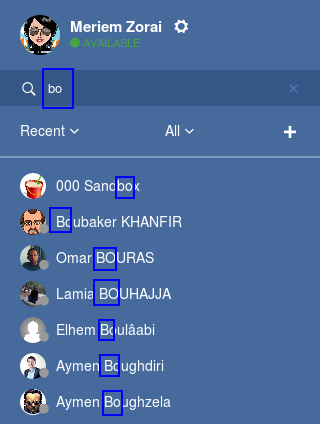
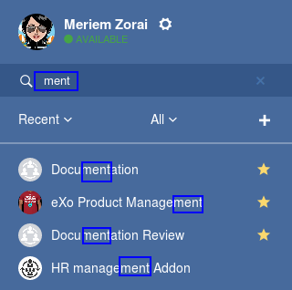

.. _Chat:

#########################
Discussing in Chat
#########################

    eXo Chat is an instant messaging application that allows users to
    sync up and take action quickly. Tightly integrated since eXo Platform 4,
    eXo Chat empowers the real-time collaboration among teams and
    individuals.

    Here is summary of what BRAND\_CHAT brings:

    -  **Discussions**: Create quick conversation with your contacts,
       from group to specific person.

    -  **Status**: Don't want to be interrupted, or not in the mood for
       a chat? Simply change your status from the Chat menu or directly
       in the chat window.

    -  **Favorites**: Add or remove your contacts to/from the favorites
       list with one click.

    -  **Collaboration**: Leverage collaboration with a set of actions
       (creating an event/task, sharing a link/file, asking a question
       or raising your hand), directly within BRAND\_CHAT.

    -  **Notifications**: Follow notifications sent to you in real time,
       read and answer messages immediately or later when you are free.

    -  **Recording**: Save your discussions from the beginning to the
       end that can be exported to a wiki page or sent to emails.

    In this chapter:

:ref:`Setting your status <SettingStatus>`

:ref:`Mini chat window <miniChat>`

:ref:`Creating/Editing a group chat <CreatingEditingGroupChat>`

:ref:`Sending an instant message <SendingIM>`

:ref:`Receiving an instant message <ReceivingIM>`

:ref:`Actions on a sent message <ActionsOnSentMessage>`

:ref:`Recording a discussion <Recording>`

:ref:`Collabrative actions <CollaborativeActions>`

:ref:`Desktop notifications <desktopNotifications>`

:ref:`Organizing your Contacts <OrganizingContacts>`

:ref:`Chat messages history <chatHistory>`

:ref:`Using eXo Chat on Mobile <ResponsiveDesign>`

.. _SettingStatus:

===================
Setting your status
===================

By setting your status, you will let your contacts know if you are
available to chat or not. Your selected status is shown next to your
name.

-  From the top navigation bar, click |image0| to open the Chat menu,
   then select one status.

   |image1|

-  If you are in the Chat window, click your current status icon, and
   select one from the drop-down menu.

   |image2|

+----------------+-----------------------------------------------------------+
| Status         | Description                                               |
+================+===========================================================+
| |image7|       | You are online and available to talk or get instant       |
| **Available**  | messages from another. When you use BRAND\_CHAT for the   |
|                | first time, your status is available by default.          |
+----------------+-----------------------------------------------------------+
| |image8| **Do  | You are online but don't want to be disturbed. Another    |
| not disturb**  | can still send instant messages and call you.             |
+----------------+-----------------------------------------------------------+
| |image9|       | You are online, and another can talk to you, but you will |
| **Away**       | not reply for now.                                        |
+----------------+-----------------------------------------------------------+
| |image10|      | You appear to be offline, but another can send messages   |
| **Invisible**  | to you.                                                   |
+----------------+-----------------------------------------------------------+

.. _miniChat:

================
Mini chat window
================

When you receive an instant message in eXo Chat, an icon showing the
number of messages received appears next to the chat icon |image11|.
Clicking on that icon opens the chat list menu in which the received
message appears:

|image12|

When you click on the message, the mini chat window appears:

|image13|

-  |image14| To minimize the mini chat window.

-  |image15| To open the chat in another tab i.e it does the same as
   clicking on the button Open Chat.

-  |image16| To close the mini chat window.

-  |image17| Where the message is composed. Clicking Enter on the
   keyboard sends the message.

-  |image18| The display name of the user who sent the message.

-  |image19| The message content.

 .. note:: * The mini chat window could also be opened by:
				- Clicking on chat button |image20| on the user profile.
				- Clicking on chat button on user and spaces popovers:
				
				|image21|
              
		   * The mini chat window behaves on mobile devices the same as
		     for web:
		     
				|image22|
			
		   * When your mini chat window is collapsed and you receive an 
		     instant message, the number of unread messages appears in 
		     both the chat icon and the mini chat window:
			
			|image23|

.. _CreatingEditingGroupChat:

=============================
Creating/Editing a group chat
=============================

By creating a group chat, you can share work, knowledge and plans with
your colleagues more efficiently. In eXo Chat, the "group chat"
denotes discussion among space/team members. Your spaces (that you are
owner or member) are auto-listed into the Spaces pane.

|image24|

.. _Create-new-chat-room:

Creating a new chat room
~~~~~~~~~~~~~~~~~~~~~~~~~~~~

1. From the top navigation bar, click |image25| --> Open Chat to open the chat
window.

2. In the left pane, select Rooms tab and then select |image26| to create a
new chat room.

|image27|

3. Enter the first letters from usernames you want to invite to the room. A
suggestion list appears to facilitate the selection.

	This suggestion list proposes your connections at first level followed by other usernames sorted in alphabetical order.

	You can also remove a chosen username by clicking on |image28|.

4. Click Save to finish.

5. The room is created and a message is displayed indicating the members added.

.. _Edit-chat-room:

Editing a chat room
~~~~~~~~~~~~~~~~~~~~~

For the chat room that you have created in the **Rooms** pane, you have
right to change its name and add/remove members as follows:

|image29|

-  |image30| Select one chat room among those you created in the left
   pane.

-  |image31| Select |image32| in the top right corner to open the scroll
   list of choices.

-  |image33| Select |image34| from the list of choices.

An edit chat room form appears in which you can make these actions:

-  Rrename the chat room.

-  Add more members (Same way as on :ref: `creating a new chat room <Create-new-chat-room>`).

-  Remove members by clicking the corresponding |image35|.

 .. note:: The list that appears after clicking on |image36| contains 
			the list of actions that you can make on the chat room. 
			
			Only the chat room creator is able to edit the room.
			
.. _Chat-room-user-list:			

Chat room user list
~~~~~~~~~~~~~~~~~~~~

For chat rooms, a collapsible panel contains the list of the chat room
members.

|image37|

-  The side panel indicates the total number of members of the room, it
   displays a number next to People.

-  In the side panel, people avatars are displayed combined with their
   presence badge.

-  People avatars are sorted by presence, then alphabetic order. The
   order used for presence is : Available, Away, Do not disturb, Offline

-  Offline users are not displayed by default. To display them, you need
   to click on |image38|.

.. _SendingIM:

==========================
Sending an instant message
==========================

1. Find the contact you want to send message from your lists. The chat
conversation is opened in the right pane.

|image39|

2. Type your message into the input box, then hit the **Enter** key.

Also, you can make your messages more lively by:

Adding emotions
~~~~~~~~~~~~~~~~

|image40|

The selected emotions will be displayed as animated ones on the chat
zone.

Using beautifiers
~~~~~~~~~~~~~~~~~~~~

eXo Chat currently supports the following beautifiers:

-  google:[WORD] - shows a link to Google directly.

   |image41|

-  wolfram:[WORD] - shows a link to find your answer on Wolfram Alpha.

   |image42|

-  java:[CODE], html:[CODE], js:[CODE] or css:[CODE] - shows your code
   with great syntax coloring.

   |image43|

.. _ReceivingIM:

============================
Receiving an instant message
============================

If someone sends messages to you, you will see the number of newly
received ones on the Chat menu:

|image44|

or, next to the contacts in the left lists:

|image45|

To check them, simply hover cursor over the Chat icon.

|image46|

Click one message to see the full content in the mini chat.
Alternatively, if you are in the chat window, click the contact that you
see the icon of unread messages.

.. _ActionsOnSentMessage:

=========================
Actions on a sent message
=========================

Hover cursor over one chat text to show actions you can perform.

|image47|

Note that **Edit** and **Delete** actions are only shown for your own
chat texts. For ones of another, you only can Save notes and Quote.

.. _Save-notes:

Saving notes
~~~~~~~~~~~~~

Click **Save notes** to save your discussion as a note. There are 2
options: **Send meeting notes** and **Save as wiki** that is similar to :ref:`Recording <Recording>`.

.. _Editing:

Editing
~~~~~~~~

Click **Edit** and make changes in the **Edit** form.

|image48|

After clicking Save, your new content will be updated on the chat zone
with a pen icon (|image49|) on the right.

.. _Deleting:

Deleting
~~~~~~~~~

Click **Delete** to remove your sent message from the thread. An
information message is displayed in place of the deleted message with a
pen icon on the right.

|image50|

.. _Quoting:

Quoting
~~~~~~~~

Click **Quote** to append one message in the input box.

|image51|

On the chat zone, the quoted message will look like below.

|image52|

.. _Recording:

======================
Recording a discussion
======================

1. Click |image53| on the top header of the chat window to start recording.

|image54|

The |image55| is now changed into |image56|, and the record starts. The
information message will be shown on the chat zone.

|image57|

2. Click |image58| to stop the meeting and save notes at any time with 2
options:

|image59|

-  If you select **Sending meeting notes**, the notes will be sent to
   your email. One information message is shown on the chat zone.

   |image60|

-  If you select **Save as wiki**, one wiki page link is displayed.

   |image61|

   By clicking the wiki page link, you will be redirected to Wiki Home
   where the wiki page containing the notes is displayed as a child
   page.
   
.. _Leave-chat-room:

================
Leave Chat room 
================

When you are no more interested in a chat room discussion where you were
invited by the room creator, you can leave this room by following these
simple steps:

1. Open the chat room you want to leave.

2. Click on the dropdown button |image113| to display the list of choices.

3. Click on Leave room button |image114|, a popup is displayed:

|image115|

4. Confirm the chat room leave by clicking on **Yes** button.

If you click on **No** button, nothing happens and you still being a 
member in the chat room.

.. note:: * The room creator does not have the Leave room button to prevent having orphan rooms.
			
		  * The Leave room button is not available on spaces chat rooms. To leave a space's chat room, you should leave the space itself.
		    

* Leaving a chat room deletes it from your chat rooms list and you will 
  no longer have access to the discussion.

* When you leave a chat room, a message "$First Last Name left the room"
  will appear to all the chat room members:

|image116|

* If the chat room creator send you again an invitation to join the 
  room, you will be able again to see old discussions.
 

.. _CollaborativeActions:

=====================
Collaborative actions
=====================

During a conversation, some collaborative actions are available on
|image62| icon next to the message input box.

|image63|

.. _Add-event-chat:

Adding an event
~~~~~~~~~~~~~~~~

1. Select Add Event from the list of collaborative actions.

|image64|

2. Fill in the form fields, including the event title, dates and time,
location.

3. If you choose wrong dates, for example, when the end date To precedes
the start date From, an error message is displayed indicating that the
dates are erroneous.

If you do not fill in all the needed fields, an error message appears
indicating to fill in the whole form.

4. Click Post button. The newly created event will be displayed on the discussion area.

|image65|

.. note::The event will be created in the personal calendar of every member of the room.

.. _Assign-task-chat:

Assigning a task
~~~~~~~~~~~~~~~~~~~

.. note:: This action is available only when the Tasks add-on is available.

1. Select Assign Task from the list of collaborative actions.

|image66|

2. Fill in the form fields including the task title, assignee, and due
date.

3. Click Post button. The newly created task will be displayed in the discussion area

|image67|

.. _Share-link-chat:

Sharing a link
~~~~~~~~~~~~~~

1. Select Share Link from the list of collaborative actions.

|image68|

2. Enter a valid URL, then click Share. The shared link is displayed in
discussion area with prefixed\ |image69| icon.

|image70|

.. _Upload-file-chat:

Uploading a file
~~~~~~~~~~~~~~~~~~~~~

1. Select Upload File from the list of collaborative actions.

|image71|

2. Drag and drop the file into the **DROP YOUR FILE HERE** area, or click
Select Manually to select a file from your computer.

3. The uploaded file is displayed on the discussion area prefixed with
|image72| icon.

|image73|

.. _Ask-question-chat:

Asking a question
~~~~~~~~~~~~~~~~~~~~~~

1. Select Ask a Question from the list of collaborative actions.

|image74|

2. Enter your question into the field, then click Ask to submit your
question. The question is displayed on the discussion area with |image75|.

|image76|

.. _Raise-hand-chat:

Raising hand
~~~~~~~~~~~~~~

1. Select Raise Hand from the list of collaborative actions.

|image77|

2. Enter your idea in the text field, then click Raise your hand. Your idea
is displayed on the discussion area prefixed with |image78| icon.

|image79|

.. _desktopNotifications:

=====================
Desktop notifications
=====================

Users don't stay all the time on the chat page, that's why eXo Platform has
added desktop notifications to alert users on a new message received in
the chat, even when the browser window is minimized or hidden by another
one.

A desktop notification is a small popup displayed to the user to alert
him on a new message received in the chat.

Desktop notifications are sent only if you gave the permission to
recieve notifications through the web browser. You are requested to give
your permission the first time you access to chat application.

In case of a one to one chat room, the desktop notification contains:

-  the avatar of the user who sent the chat message,

-  the display name of the user who sent the chat message,

-  the beginning of the message,

-  a link at the bottom indicating the website from where the
   notification is coming from.

|image80|

In case of a group chat (room or space), the desktop notification
contains:

-  the avatar of the group in which the chat message was sent,

-  the name of the chat group,

-  the name of the user who sent the message followed by the beginning
   of the message,

-  a link at the bottom indicating the website from where the
   notification is coming from.

|image81|

When you receive the notification, clicking on it redirects you to the
corresponding conversation in the Chat application.

.. _Global-notification-settings:

Global Notification Settings
~~~~~~~~~~~~~~~~~~~~~~~~~~~~~~~~~~~

Desktop notifications complement other ways to draw your attention to
new messages like the on-site counter and the bips. You can enable or
disable these channels through the Preferences screen.

|image82|

-  You can enable/disable a notification channel by changing the
   position of the toggle on/off. By default, all the notification
   channels are enabled.

-  A Close button allows to dismiss the Preferences screen. The chat
   application displays the previously displayed room's conversation.

-  It is also possible to enable or disable notifications for *Do Not
   Disturb* chat status in the Preferences screen. By default, it is set
   to off.

-  If you enable notifications for *Do Not Disturb* status, this means
   that whatever your chat status is, you will receive notifications.

    .. tip:: You don't need to save the settings, they are immediately saved and applied.

In addition to the preferences that could be set for global chat
notifications, it is also possible to parameter notifications for each
room. For that purpose, follow these steps:

|image83|

-  |image84| Select the room that you want to parameter it's
   notifications. You can select either one to one chat room or a group
   chat room.

-  |image85| Click on |image86| to display actions that you can do on that
   room.

-  |image87| Select Notifications from the list.

A screen appears enabling you to set the chat room notifications
settings:

-  **Normal**: When you want to receive notifications for the chat room.

-  **Silence**: When you don't want to receive notifications for the
   chat room.

-  **Alert on**: When you want to receive notifications for the chat
   room if an another user send a message containing a keyword.

.. _OrganizingContacts:

========================
Organizing your contacts
========================

When your contacts list becomes so long, it will be difficult to control
all. Here are some tips commonly used to keep your contacts list
well-organized and easy to find.

.. _Hide-show-chat-contacts:

Hiding/Showing contacts list
~~~~~~~~~~~~~~~~~~~~~~~~~~~~~~~~~~~~~

Currently, your discussions can be arranged into 4 categories in the
left pane: Favorites, People, Teams and Spaces. To find what you want
quickly, you should show lists one by one by clicking |image88| and hide
unnecessary lists by clicking |image89|.

|image90|

Also, in **People** pane, you can click |image91| to show/hide offline
users.

.. _Add-toFavorites:

Adding to favorites
~~~~~~~~~~~~~~~~~~~~~~

To find quickly a contact you often chat with, hover over one and click
|image92| to save as a favorite. The contact will be moved to the
**Favorites** pane, at the top of your chat lists.

To remove one contact from your favorites, hover over the contact in the
**Favorites** list and select |image93|.

.. _Use-search-bar:

Using search bar
~~~~~~~~~~~~~~~~

-  If you want to find one contact, type some letters following @ in the
   search bar. The contacts will be filtered accordingly.

   |image94|

-  Enter the beginning of multiple words following @, and the predictive
   search will find the best match.

   |image95|

-  No matter whether you remember the beginning of a group name, the
   first name or the last name of someone, the search will always return
   the best match.

   |image96|

.. _chatHistory:

=====================
Chat messages history
=====================

Discussing in eXo Chat by :ref:`Sending <SendingIM>` and :ref:`recieving <ReceivingIM>` instant messages
induces to register the chat messages history which could be easily accessible later through the chat room.

To visualize old chat messages, all you need to do is to scroll up the
chat window, a loading icon |image0| appears the time to load up to 200
old message. When the loading icon |image1| disapears this means that
the 200 messages was loaded and you can read them.

   .. note:: The number of loaded chat messages is set by default to 200, it could be configurable in :ref:`exo.properties <#PLFAdminGuide.Configuration.ConfigurationOverview>`.

.. _ResponsiveDesign:

========================
Using eXo Chat on Mobile
========================

eXo Chat is now available for all mobile applications and is responsive for smartphones. Here are some screen shots of different eXo Chat screens.

To open eXo Chat in a mobile device, you just need to click on the chat icon in the top navigation of eXo Platform:

|image99|

It is also possible to add a chat room via a mobile device, simply click
on the |image100| icon to get the room creation form:

|image101|

To manage a created room or to make an action on a room in which you are
a member, you need to click on the |image102| button to get the list of
the feasible actions on that chat room:

|image103|

.. note:: A back button |image104| allows you to return to the list of chat rooms from a one to one or group chat room.

To view the list of participants in a defined chat room, after making
the last action, select Show participants:

|image105|

Clicking on |image106| opens a screen:

|image107|

which allows you either to change eXo Chat notification settings by
clicking on |image108| or back to intranet homepage by clicking on:
|image109|

Clicking on |image110| allows you to choose the notification channel for
a defined chat room (either one to one chat room or group chat room).
More details in :ref:`Chat notifications section <desktopNotifications>`.

|image111|

You can also update your status via the eXo Chat mobile application,
you just need to click on the current status and the list of statuses
appears, select the desired status and the it is updated.

|image112|

.. |image0| image:: images/chat/chat_icon.png
.. |image1| image:: images/chat/chat_menu.png
.. |image2| image:: images/chat/status_menu.png
.. |image3| image:: images/chat/available_icon.png
.. |image4| image:: images/chat/not_disturb_icon.png
.. |image5| image:: images/chat/away_icon.png
.. |image6| image:: images/chat/invisible_icon.png
.. |image7| image:: images/chat/available_icon.png
.. |image8| image:: images/chat/not_disturb_icon.png
.. |image9| image:: images/chat/away_icon.png
.. |image10| image:: images/chat/invisible_icon.png

.. |image12| image:: images/chat/message.png
.. |image13| image:: images/chat/mini_chat_window.png
.. |image14| image:: images/1.png
.. |image15| image:: images/2.png
.. |image16| image:: images/3.png
.. |image17| image:: images/common/4.png
.. |image18| image:: images/common/5.png
.. |image19| image:: images/common/6.png
.. |image20| image:: images/chat/chat-icon-user-profile.png
.. |image21| image:: images/chat/chat-button_popover.png
.. |image22| image:: images/chat/mini_chat_mobile.png
.. |image23| image:: images/chat/mini_chat_closed.png
.. |image24| image:: images/chat/space_chat.png
.. |image25| image:: images/chat/chat_icon.png
.. |image26| image:: images/chat/create_new_team_icon.png
.. |image27| image:: images/chat/create_chat_room_form.png
.. |image28| image:: images/chat/deselect_member_icon.png
.. |image29| image:: images/chat/edit_room.png
.. |image30| image:: images/1.png
.. |image31| image:: images/2.png
.. |image32| image:: images/chat/select_icon.png
.. |image33| image:: images/3.png
.. |image34| image:: images/chat/edit_team_icon.png
.. |image35| image:: images/chat/deselect_member_icon.png
.. |image36| image:: images/chat/select_icon.png
.. |image37| image:: images/chat/people_panel.png
.. |image38| image:: images/chat/show_offline_users.png
.. |image39| image:: images/chat/chat_conversation_window.png
.. |image40| image:: images/chat/emotions_chat.png
.. |image41| image:: images/chat/google_link.png
.. |image42| image:: images/chat/wolfram_link.png
.. |image43| image:: images/chat/code_syntax_highlight.png
.. |image44| image:: images/chat/notification_icon_chatmenu.png
.. |image45| image:: images/chat/notification_icon_chatwindow.png
.. |image46| image:: images/chat/newly_received_messages_chatmenu.png
.. |image47| image:: images/chat/more_actions_chat_text.png
.. |image48| image:: images/chat/edit_message_form.png
.. |image49| image:: images/chat/edit_icon.png
.. |image50| image:: images/chat/delete_message.png
.. |image51| image:: images/chat/quote_message.png
.. |image52| image:: images/chat/display_quoted_message.png
.. |image53| image:: images/chat/start_meeting_icon.png
.. |image54| image:: images/chat/meeting_recorder.png
.. |image55| image:: images/chat/start_meeting_icon.png
.. |image56| image:: images/chat/stop_meeting_icon.png
.. |image57| image:: images/chat/starting_meeting_message.png
.. |image58| image:: images/chat/stop_meeting_icon.png
.. |image59| image:: images/chat/meeting_notes.png
.. |image60| image:: images/chat/send_meeting_notes.png
.. |image61| image:: images/chat/save_note_wiki.png
.. |image62| image:: images/chat/collaborative_actions_icon.png
.. |image63| image:: images/chat/collaborative_actions.png
.. |image64| image:: images/chat/add_event.png
.. |image65| image:: images/chat/display_added_event.png
.. |image66| image:: images/chat/assign_task.png
.. |image67| image:: images/chat/display_assigned_task.png
.. |image68| image:: images/chat/share_link.png
.. |image69| image:: images/chat/share_icon.png
.. |image70| image:: images/chat/display_shared_link.png
.. |image71| image:: images/chat/upload_file.png
.. |image72| image:: images/chat/upload_share_icon.png
.. |image73| image:: images/chat/display_uploaded_file.png
.. |image74| image:: images/chat/ask_question.png
.. |image75| image:: images/chat/ask_question_icon.png
.. |image76| image:: images/chat/display_asked_question.png
.. |image77| image:: images/chat/raise_hand.png
.. |image78| image:: images/chat/raise_hand_icon.png
.. |image79| image:: images/chat/display_raised_hand.png
.. |image80| image:: images/chat/desktop_notification1.png
.. |image81| image:: images/chat/desktop_notification2.png
.. |image82| image:: images/chat/Notification_settings.png
.. |image83| image:: images/chat/room_notifications.png
.. |image84| image:: images/1.png
.. |image85| image:: images/2.png
.. |image86| image:: images/chat/select_icon.png
.. |image87| image:: images/3.png
.. |image88| image:: images/chat/show_chat_icon.png
.. |image89| image:: images/chat/hide_chat_icon.png
.. |image90| image:: images/chat/chat_lists.png
.. |image91| image:: images/chat/show_hide_offline_icon.png
.. |image92| image:: images/chat/favorite_icon.png
.. |image93| image:: images/chat/remove_favorite_icon.png

.. |image95| image:: images/chat/filter_2.png

.. |image97| image:: images/chat/loading_icon.png
.. |image98| image:: images/chat/loading_icon.png
.. |image99| image:: images/chat/chat_responsive_mobile.png
.. |image100| image:: images/chat/create_new_team_icon.png
.. |image101| image:: images/chat/add_room_responsive_mobile.png
.. |image102| image:: images/chat/select_icon.png
.. |image103| image:: images/chat/menu_chat_responsive_mobile.png
.. |image104| image:: images/chat/back_button.png
.. |image105| image:: images/chat/participants_responsive_mobile.png
.. |image106| image:: images/chat/hamburger_menu_icon.png
.. |image107| image:: images/chat/hamburger_menu.png
.. |image108| image:: images/chat/preferences_chat_mobile.png
.. |image109| image:: images/chat/back_intranet_from_chat.png
.. |image110| image:: images/chat/preferences_chat_mobile.png
.. |image111| image:: images/chat/preferences_chat_responsive.png
.. |image112| image:: images/chat/status_change_mobile.png
.. |image113| image:: images/chat/scroll-list-chat.png
.. |image114| image:: images/chat/Leave-room-button.png
.. |image115| image:: images/chat/Leave-room-popup.png
.. |image116| image:: images/chat/user-left-room.png

