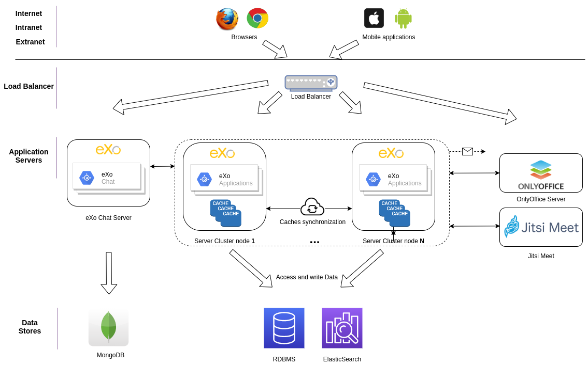

.. _Clustering:

###########
Clustering
###########

    Cluster mode is the solution for high performance system. It offers
    Load Balancing and High Availability features.

    A Platform cluster is a set of nodes that communicate via JGroups -
    UDP or TCP - in the back-end, and a front-end Load Balancer like
    Apache that distributes HTTP requests to the nodes. The High
    Availability is achieved in the data layer natively by the RDBMS or
    Shared File Systems, such as SAN and NAS.

    The following diagram illustrates a cluster field with two nodes
    (each node uses its local JCR index storage, but you can enable
    shared JCR indexing, as described in the chapter).

    |image0|

    In this chapter:

    -  :ref:`Setting up eXo Platform cluster <Clustering.SettingUpCluster>`
       How to set up eXo Platform cluster.

    -  :ref:`JCR index in cluster mode <Clustering.JCRIndexing>`
       Configuration and explanation of JCR index strategies (local and
       shared).

    -  :ref:`Activating TCP default configuration files <Clustering.ActivatingTCP>`
       How to use TCP default configuration files.

    -  :ref:`Configuring JGroups via exo.properties <Clustering.JGroups>`
       A list of default values and variable names that you can
       configure via ``exo.properties``.

    -  :ref:`Using customized JGroups xml files <Clustering.JGroupsXml>`
       In case you have a configuration that is not externalized, or you
       want to migrate your JGroups xml files from previous versions,
       read this section to activate your xml files.

    -  :ref:`Setting up a HTTP proxy <Clustering.LoadBalancing>`
       How to set up load balancing using a HTTP proxy

    -  :ref:`FAQs of clustering <Clustering.ClusteringFAQ>`
       Common questions and answers that are useful for administrators
       when doing a clustering on eXo Platform.
       
.. _Clustering.SettingUpCluster:

================================
Setting up eXo Platform cluster
================================

1. Install eXo Platform package by following :ref:`Installation and Startup <Installation>`.

   If you are using eXo Chat addon, you should :ref:`install <ChatInstallation>`
   it in all the cluster nodes.

2. Create a copy of the package for each cluster node. Assume that you 
   have two nodes: **node1.your-domain.com** and **node2.your-domain.com**.

.. note:: For testing or troubleshooting context, in case you are using 
          Tomcat as application server and if you will run the cluster 
          nodes in the same environment (same Operating System), you 
          should configure **different Tomcat ports**.

3. Configure the RDBMS datasources in each cluster node (follow this
   :ref:`documentation <Database.ConfiguringPLF>`) to use one of the 
   supported database systems: Postgres, MySQL, MSSQL, Oracle, MariaDB.

.. note:: -  It is not possible to use the default configured hsql embedded database as noted in :ref:`Configuring eXo Platform with database <Database.ConfiguringPLF>`.

		  -  The different cluster nodes **must use the same RDBMS datasources**.

4. eXo Platform comes with Elasticsearch :ref:`embedded <#PLFAdminGuide.Elasticsearch.ES_Embedded>`. 
   For clustering, you MUST use a seperate Elasticsearch process. Please 
   follow the steps described :ref:`here <#PLFAdminGuide.Elasticsearch.ES_External>`.

3. eXo Platform uses databases and a disk folders to store its data:

   -  *Datasources*:

      -  **IDM**: datasource to store user/group/membership entities.

      -  **JCR**: datasource to store JCR Data.

      -  **JPA**: datasource to store entities mapped by Hibernate. Quartz
         tables are stored in this datasource by default.

   -  *Disk*:

      -  **File storage data**: Stored by default under a file system
         folder and could be configured to store files in JPA datasource
         instead. More details :ref:`here <Database.FileStorage>`.

         If the file system storage implementation is configured, the
         folder **must be shared between all cluster nodes**.

         The folder location can be configured by using this property
         ``exo.files.storage.dir=/exo-shared-folder-example/files/``. 
         It is possible to modify it through
         :ref:`exo.properties <Configuration.ConfigurationOverview>` file.

      -  **JCR Binary Value Storage**: Stored by default under a file
         system folder and could be configured to store files in JCR
         datasource instead. More details :ref:`here <Configuration.JCR>`.

         If the file system storage implementation is configured, **the
         folder must be shared between all cluster nodes**.

         The folder location can be configured by using this property
         ``exo.jcr.storage.data.dir=/exo-shared-folder-example/jcrvalues/``.
         It is possible to modify it through
         :ref:`exo.properties <Configuration.ConfigurationOverview>` file.

	.. tip:: Choosing file system or RDBMS storage depens on your needs and your system environment.(See more details in :ref:`Comparing file system and RDBMS storage <Database.FileStorage>`.

      -  **JCR indexes**: Stored under *a local file system folder in each
         cluster node*. More details :ref:`here <Clustering.JCRIndexing>`.

         eXo Platform uses by default local JCR indexes and this is the
         recommended mode for clustering. In fact read and write operations
         take less time in local mode than in shared mode.

   -  *Other systems*: Such as MongoDB if :ref:`eXo Chat addon <ChatInstallation>`
      is installed.
 
6. Configure ``exo.cluster.node.name`` property. Use a different name 
   for each node:

   -  In JBoss, edit this property in the ``standalone-exo-cluster.xml``
      file:

      .. code:: xml

            <system-properties>
                <property name="exo.cluster.node.name" value="node1"/>
            </system-properties>
                           

   -  In Tomcat, add the property in ``setenv-customize.sh`` (.bat for
      windows environments):

      -  For windows:

         ::

             SET "CATALINA_OPTS=%CATALINA_OPTS% -Dexo.cluster.node.name=node1"

      -  For Linux:

         ::

             CATALINA_OPTS="${CATALINA_OPTS} -Dexo.cluster.node.name=node1"

7. eXo Platform uses UDP protocol by default for JGroups. This protocol 
   is **not recommended for production environements**, you need to 
   configure TCP as transport protocol instead. For that purpose, please 
   follow :ref:`this documentation <.Clustering.ActivatingTCP>`.

8. Configure CometD Oort URL. Replace *localhost* in the following 
   examples with the IP or host name of the node.

   -  In JBoss, edit ``standalone-exo-cluster.xml``:

      .. code:: xml

          <property name="exo.cometd.oort.url" value="http://localhost:8080/cometd/cometd"/>

   -  In Tomcat, edit ``exo.properties``:

      ::

          exo.cometd.oort.url=http://localhost:8080/cometd/cometd

   CometD is used to perform messaging over the web, and Oort is a CometD
   extension that supports clustering. The configuration is necessary to
   make the :ref:`On-site Notification <On-site>` work properly.

9. Configure CometD group port. This step is optional.

   CometD Oort nodes will automatically join others in the same network 
   and the same group, so to prevent stranger nodes from joining your 
   group, you might specify your group with a port that is different 
   from the default port (``5577``). The situation is likely to happen 
   in a testing environment.

   -  In JBoss, edit ``standalone-exo-cluster.xml`` file:

      .. code:: xml

          <!-- Configure the same port for all nodes in your cluster -->
          <property name="exo.cometd.oort.multicast.groupPort" value="5579"/>

   -  In Tomcat, edit ``exo.properties`` file:

      ::

          # Configure the same port for all nodes in your cluster
          exo.cometd.oort.multicast.groupPort=5579

10. The above last step is applicable when multicast is available on the
    system where CometD is deployed. Otherwise, the static `discovery mechanism <https://docs.cometd.org/current/reference/#_static_discovery_configuration>`__
    should be used by adding the following properties in :ref:`exo.properties <Configuration.ConfigurationOverview>`
    file:

    .. code:: xml

        exo.cometd.oort.configType=static
        exo.cometd.oort.cloud=http://host2:port2/cometd/cometd,http://host3:port3/cometd/cometd

    -  The default value for ``exo.cometd.oort.configType`` is 
       "multicast", and only the two values "multicast" and "static" are 
       available.

    -  The parameter ``exo.cometd.oort.cloud`` must contain a
       comma-separated list of the Cometd endpoint of all the other 
       nodes of the cluster. So in the example above, we assume that the 
       node of this ``exo.properties`` is host1:port1, and that the 
       cluster is composed of three nodes : host1, host2 and host3.

11. Only in Tomcat, configure the following:

    -  In ``setenv-customize.sh (.bat for Windows)``:

       ::

           EXO_PROFILES="all,cluster"

    -  In ``exo.properties``:

       ::

           gatein.jcr.config.type=cluster
           gatein.jcr.index.changefilterclass=org.exoplatform.services.jcr.impl.core.query.ispn.LocalIndexChangesFilter
           # Default JCR indexing is local so you need to use a different folder for each node.
           # With the value below, you do not have to create the folder.
           exo.jcr.index.data.dir=gatein/data/jcr/index

12. Start the servers. **You must wait until node1 is fully started, 
    then start node2.**

    In JBoss, you need to indicate the configuration file with -c option:
    ``./bin/standalone.sh -b 0.0.0.0 -c standalone-exo-cluster.xml`` 
    (.bat for Windows).

    Only in JBoss, some other options that you can use in the start command:

    -  **-Dexo.cluster.node.name=a-node-name** overrides the node name 
       in the configuration file.

    -  **-Djboss.socket.binding.port-offset=101**

       This is useful in case you set up nodes in the same machine for
       testing. You will not need to configure the port for every node. 
       Just use a different port-offset in each start command.

.. note:: If you run two nodes in the same machine for testing, change the default ports of node2 to avoid port conflict.

		  In Tomcat, ports are configured in ``conf/server.xml``.

		  In JBoss, use ``-Djboss.socket.binding.port-offset`` option mentioned above.

To configure a front-end for your nodes, follow :ref:`Setting up Apache front-end <SetUpHttpFrontend.SetupApacheFrontend>`.

To configure load balancing, follow :ref:`Setting up a load balancer <Clustering.LoadBalancing>`.

.. note:: eXo Platform only supports sticky session mode for clustering (no session replication). This must be configured in the load balancer configuration.
       

.. _Clustering.JCRIndexing:

=========================
JCR index in cluster mode
=========================

.. note:: eXo Platform uses local JCR index by default. You can switch between local index and shared index by configuration.

The local indexing is defaulted for simplifying configuration. Each
strategy has its pros and cons. Here is brief of their characteristics,
but it is strongly recommended you read the given links for better
understanding:

-  **Local indexing**: Each node manages its own local index storage.
   The "documents" (to be indexed) are replicated within nodes.

   "Documents" are Lucene term that means a block of data ready for
   indexing. The same "documents" are replicated between nodes and each
   node locally indexes it, so the local indexes are updated for the
   running nodes.

   There are additional mechanisms for a new node that starts for the
   first time to initiate its local index, and for a node joining the
   cluster after downtime to update its local index.

   Read :ref:`this link <#JCR.QueryHandlerConfiguration.Configuration.Cluster-readyIndexingStrategies.LocalIndex>`
   for details.

-  **Shared indexing**: Every node has read access to a shared index and
   has its own in-memory index. A single "coordinator" node is
   responsible for pulling in-memory indexes and updating the shared
   index.

   It allows searching for newly added content immediately. However,
   there are rare cases that search result is different between nodes
   for a while.

   Read :ref:`this link <#JCR.QueryHandlerConfiguration.Configuration.Cluster-readyIndexingStrategies.SharedIndex>`
   for details.

For LOCAL INDEXING, the index directory should be a local path for each
node. In JBoss it is set already by default:

.. code:: xml

    <property name="exo.jcr.index.data.dir" value="${exo.jcr.data.dir}/index"/>

But for Tomcat, you need to set it yourself, in ``exo.properties`` file:

::

    exo.jcr.index.data.dir=gatein/data/jcr/index

If you want to use a SHARED INDEX for every node:

Enable the profile *cluster-index-shared*.

-  In JBoss, edit
   ``$PLATFORM_JBOSS_HOME/standalone/configuration/standalone-exo-cluster.xml``:

   .. code:: xml

       <property name="exo.profiles" value="all,cluster,cluster-index-shared"/>

-  In Tomcat, edit ``setenv-customize.sh`` (.bat for Windows, see
   :ref:`Customizing environment variables <CustomizingEnvironmentVariables>`):

   ::

       EXO_PROFILES="all,cluster,cluster-index-shared"

Set the index directory (``exo.jcr.index.data.dir``) to a network
sharing path.

-  In JBoss, edit
   ``$PLATFORM_JBOSS_HOME/standalone/configuration/standalone-exo-cluster.xml``:

   .. code:: xml

       <property name="exo.jcr.index.data.dir" value="${exo.shared.dir}/jcr/index"/>

-  In Tomcat, if you do not configure it, ``exo.jcr.index.data.dir`` is
   already set to a sub-folder of the shared directory ``EXO_DATA_DIR``.
   It is done in ``setenv.*``:

   ::

       CATALINA_OPTS="$CATALINA_OPTS -Dexo.jcr.index.data.dir=\"${EXO_DATA_DIR}/jcr/index\""

   You can override it in ``exo.properties``:

   ::

       exo.jcr.index.data.dir=/path/of/a/shared/folder/for/all/nodes

.. _Clustering.ActivatingTCP:

==========================================
Activating TCP default configuration files
==========================================

The default protocol for JGroups is UDP. However, TCP is still
pre-configured in
``platform-extension-config.jar!/conf/platform/jgroups`` and you can
simply activate it.

The files contain externalized variable names and default values for
TCP. In case you want to use TCP instead of UDP, it is recommended that
you activate those files and, if you need to, change the default
settings via ``exo.properties``. See :ref:`Configuration overview <Configuration.ConfigurationOverview>` 
for the ``exo.properties`` file.

To activate TCP default configuration files, enable the profile
``cluster-jgroups-tcp``:

-  In JBoss, edit ``standalone-exo-cluster.xml``:

   .. code:: xml

       <system-properties>
           ...
           <property name="exo.profiles" value="all,cluster,cluster-jgroups-tcp"/>
           ...
       </system-properties>

-  In Tomcat, edit ``setenv-customize.sh`` (.bat for Windows, see :ref:`Customizing environment variables <CustomizingEnvironmentVariables>`):

   ::

       EXO_PROFILES="all,cluster,cluster-jgroups-tcp"

When switching to use TCP instead of UDP, you need to add some
properties in ``exo.properties``:

::

    # Assume node1 is 192.168.1.100 and node2 is 192.168.1.101. Here is configuration for node1:

    exo.jcr.cluster.jgroups.tcp.bind_addr=192.168.1.100
    exo.jcr.cluster.jgroups.tcpping.initial_hosts=192.168.1.100[7800],192.168.1.101[7800]

    exo.idm.cluster.jgroups.tcp.bind_addr=192.168.1.100
    exo.idm.cluster.jgroups.tcpping.initial_hosts=192.168.1.100[7900],192.168.1.101[7900]

.. _Clustering.JGroups:

======================================
Configuring JGroups via exo.properties
======================================

JGroups configuration is externalized for both JCR and IDM. In this
section you find a list of default values and externalized variables
that you can configure via ``exo.properties``. See :ref:`Configuration overview <Configuration.ConfigurationOverview>`
for the ``exo.properties`` file.

It is recommended you configure JGroups via ``exo.properties``. Only
when the variables are not enough, or when migrating from previous
versions you want to re-use your JGroups xml files, you will customize
JGroups xml files as described in :ref:`next section <Clustering.JGroupsXml>`.

.. _Clustering.JGroups.JCR.UDP:

UDP configuration for JCR
~~~~~~~~~~~~~~~~~~~~~~~~~~~

+-----------------------+--------------+---------------------------------------+
| JGroups name          | Default      | eXo variable                          |
|                       | value        |                                       |
+=======================+==============+=======================================+
| **UDP**               |              |                                       |
+-----------------------+--------------+---------------------------------------+
| singleton\_name       | exo-transpor | exo.jcr.cluster.jgroups.udp.singleton |
|                       | t-udp        | \_name                                |
+-----------------------+--------------+---------------------------------------+
| bind\_addr            | 127.0.0.1    | exo.jcr.cluster.jgroups.udp.bind\_add |
|                       |              | r                                     |
+-----------------------+--------------+---------------------------------------+
| bind\_port            | 16600        | exo.jcr.cluster.jgroups.udp.bind\_por |
|                       |              | t                                     |
+-----------------------+--------------+---------------------------------------+
| mcast\_addr           | 228.10.10.10 | exo.jcr.cluster.jgroups.udp.mcast\_ad |
|                       |              | dr                                    |
+-----------------------+--------------+---------------------------------------+
| mcast\_port           | 17600        | exo.jcr.cluster.jgroups.udp.mcast\_po |
|                       |              | rt                                    |
+-----------------------+--------------+---------------------------------------+
| tos                   | 8            | exo.jcr.cluster.jgroups.udp.tos       |
+-----------------------+--------------+---------------------------------------+
| ucast\_recv\_buf\_siz | 20000000     | exo.jcr.cluster.jgroups.udp.ucast\_re |
| e                     |              | cv\_buf\_size                         |
+-----------------------+--------------+---------------------------------------+
| ucast\_send\_buf\_siz | 640000       | exo.jcr.cluster.jgroups.udp.ucast\_se |
| e                     |              | nd\_buf\_size                         |
+-----------------------+--------------+---------------------------------------+
| mcast\_recv\_buf\_siz | 25000000     | exo.jcr.cluster.jgroups.udp.mcast\_re |
| e                     |              | cv\_buf\_size                         |
+-----------------------+--------------+---------------------------------------+
| mcast\_send\_buf\_siz | 640000       | exo.jcr.cluster.jgroups.udp.mcast\_se |
| e                     |              | nd\_buf\_size                         |
+-----------------------+--------------+---------------------------------------+
| loopback              | false        | exo.jcr.cluster.jgroups.udp.loopback  |
+-----------------------+--------------+---------------------------------------+
| discard\_incompatible | true         | exo.jcr.cluster.jgroups.udp.discard\_ |
| \_packets             |              | incompatible\_packets                 |
+-----------------------+--------------+---------------------------------------+
| max\_bundle\_size     | 64000        | exo.jcr.cluster.jgroups.udp.max\_bund |
|                       |              | le\_size                              |
+-----------------------+--------------+---------------------------------------+
| max\_bundle\_timeout  | 30           | exo.jcr.cluster.jgroups.udp.max\_bund |
|                       |              | le\_timeout                           |
+-----------------------+--------------+---------------------------------------+
| use\_incoming\_packet | true         | exo.jcr.cluster.jgroups.udp.use\_inco |
| \_handler             |              | ming\_packet\_handler                 |
+-----------------------+--------------+---------------------------------------+
| ip\_ttl               | 2            | exo.jcr.cluster.jgroups.udp.ip\_ttl   |
+-----------------------+--------------+---------------------------------------+
| enable\_bundling      | false        | exo.jcr.cluster.jgroups.udp.enable\_b |
|                       |              | undling                               |
+-----------------------+--------------+---------------------------------------+
| enable\_diagnostics   | true         | exo.jcr.cluster.jgroups.udp.enable\_d |
|                       |              | iagnostics                            |
+-----------------------+--------------+---------------------------------------+
| diagnostics\_addr     | 224.0.75.75  | exo.jcr.cluster.jgroups.udp.diagnosti |
|                       |              | cs\_addr                              |
+-----------------------+--------------+---------------------------------------+
| diagnostics\_port     | 7500         | exo.jcr.cluster.jgroups.udp.diagnosti |
|                       |              | cs\_port                              |
+-----------------------+--------------+---------------------------------------+
| thread\_naming\_patte | cl           | exo.jcr.cluster.jgroups.udp.thread\_n |
| rn                    |              | aming\_pattern                        |
+-----------------------+--------------+---------------------------------------+
| use\_concurrent\_stac | true         | exo.jcr.cluster.jgroups.udp.use\_conc |
| k                     |              | urrent\_stack                         |
+-----------------------+--------------+---------------------------------------+
| thread\_pool.enabled  | true         | exo.jcr.cluster.jgroups.udp.thread\_p |
|                       |              | ool.enabled                           |
+-----------------------+--------------+---------------------------------------+
| thread\_pool.min\_thr | 10           | exo.jcr.cluster.jgroups.udp.thread\_p |
| eads                  |              | ool.min\_threads                      |
+-----------------------+--------------+---------------------------------------+
| thread\_pool.max\_thr | 1000         | exo.jcr.cluster.jgroups.udp.thread\_p |
| eads                  |              | ool.max\_threads                      |
+-----------------------+--------------+---------------------------------------+
| thread\_pool.keep\_al | 5000         | exo.jcr.cluster.jgroups.udp.thread\_p |
| ive\_time             |              | ool.keep\_alive\_time                 |
+-----------------------+--------------+---------------------------------------+
| thread\_pool.queue\_e | true         | exo.jcr.cluster.jgroups.udp.thread\_p |
| nabled                |              | ool.queue\_enabled                    |
+-----------------------+--------------+---------------------------------------+
| thread\_pool.queue\_m | 1000         | exo.jcr.cluster.jgroups.udp.thread\_p |
| ax\_size              |              | ool.queue\_max\_size                  |
+-----------------------+--------------+---------------------------------------+
| thread\_pool.rejectio | discard      | exo.jcr.cluster.jgroups.udp.thread\_p |
| n\_policy             |              | ool.rejection\_policy                 |
+-----------------------+--------------+---------------------------------------+
| oob\_thread\_pool.ena | true         | exo.jcr.cluster.jgroups.udp.oob\_thre |
| bled                  |              | ad\_pool.enabled                      |
+-----------------------+--------------+---------------------------------------+
| oob\_thread\_pool.min | 5            | exo.jcr.cluster.jgroups.udp.oob\_thre |
| \_threads             |              | ad\_pool.min\_threads                 |
+-----------------------+--------------+---------------------------------------+
| oob\_thread\_pool.max | 1000         | exo.jcr.cluster.jgroups.udp.oob\_thre |
| \_threads             |              | ad\_pool.max\_threads                 |
+-----------------------+--------------+---------------------------------------+
| oob\_thread\_pool.kee | 5000         | exo.jcr.cluster.jgroups.udp.oob\_thre |
| p\_alive\_time        |              | ad\_pool.keep\_alive\_time            |
+-----------------------+--------------+---------------------------------------+
| oob\_thread\_pool.que | false        | exo.jcr.cluster.jgroups.udp.oob\_thre |
| ue\_enabled           |              | ad\_pool.queue\_enabled               |
+-----------------------+--------------+---------------------------------------+
| oob\_thread\_pool.que | 1000         | exo.jcr.cluster.jgroups.udp.oob\_thre |
| ue\_max\_size         |              | ad\_pool.queue\_max\_size             |
+-----------------------+--------------+---------------------------------------+
| oob\_thread\_pool.rej | Run          | exo.jcr.cluster.jgroups.udp.oob\_thre |
| ection\_policy        |              | ad\_pool.rejection\_policy            |
+-----------------------+--------------+---------------------------------------+
| **PING**              |              |                                       |
+-----------------------+--------------+---------------------------------------+
| timeout               | 2000         | exo.jcr.cluster.jgroups.ping.timeout  |
+-----------------------+--------------+---------------------------------------+
| num\_initial\_members | 1            | exo.jcr.cluster.jgroups.ping.num\_ini |
|                       |              | tial\_members                         |
+-----------------------+--------------+---------------------------------------+
| **MERGE2**            |              |                                       |
+-----------------------+--------------+---------------------------------------+
| max\_interval         | 30000        | exo.jcr.cluster.jgroups.merge2.max\_i |
|                       |              | nterval                               |
+-----------------------+--------------+---------------------------------------+
| min\_interval         | 10000        | exo.jcr.cluster.jgroups.merge2.min\_i |
|                       |              | nterval                               |
+-----------------------+--------------+---------------------------------------+
| **FD**                |              |                                       |
+-----------------------+--------------+---------------------------------------+
| timeout               | 10000        | exo.jcr.cluster.jgroups.fd.timeout    |
+-----------------------+--------------+---------------------------------------+
| max\_tries            | 5            | exo.jcr.cluster.jgroups.fd.max\_tries |
+-----------------------+--------------+---------------------------------------+
| shun                  | true         | exo.jcr.cluster.jgroups.fd.shun       |
+-----------------------+--------------+---------------------------------------+
| **VERIFY\_SUSPECT**   |              |                                       |
+-----------------------+--------------+---------------------------------------+
| timeout               | 1500         | exo.jcr.cluster.jgroups.verify\_suspe |
|                       |              | ct.timeout                            |
+-----------------------+--------------+---------------------------------------+
| **pbcast.NAKACK**     |              |                                       |
+-----------------------+--------------+---------------------------------------+
| use\_stats\_for\_retr | false        | exo.jcr.cluster.jgroups.pbcast.nakack |
| ansmission            |              | .use\_stats\_for\_retransmission      |
+-----------------------+--------------+---------------------------------------+
| exponential\_backoff  | 150          | exo.jcr.cluster.jgroups.pbcast.nakack |
|                       |              | .exponential\_backoff                 |
+-----------------------+--------------+---------------------------------------+
| use\_mcast\_xmit      | true         | exo.jcr.cluster.jgroups.pbcast.nakack |
|                       |              | .use\_mcast\_xmit                     |
+-----------------------+--------------+---------------------------------------+
| gc\_lag               | 0            | exo.jcr.cluster.jgroups.pbcast.nakack |
|                       |              | .gc\_lag                              |
+-----------------------+--------------+---------------------------------------+
| retransmit\_timeout   | 50,300,600,1 | exo.jcr.cluster.jgroups.pbcast.nakack |
|                       | 200          | .retransmit\_timeout                  |
+-----------------------+--------------+---------------------------------------+
| discard\_delivered\_m | true         | exo.jcr.cluster.jgroups.pbcast.nakack |
| sgs                   |              | .discard\_delivered\_msgs             |
+-----------------------+--------------+---------------------------------------+
| **UNICAST**           |              |                                       |
+-----------------------+--------------+---------------------------------------+
| timeout               | 300,600,1200 | exo.jcr.cluster.jgroups.unicast.timeo |
|                       |              | ut                                    |
+-----------------------+--------------+---------------------------------------+
| **pbcast.STABLE**     |              |                                       |
+-----------------------+--------------+---------------------------------------+
| stability\_delay      | 1000         | exo.jcr.cluster.jgroups.pbcast.stable |
|                       |              | .stability\_delay                     |
+-----------------------+--------------+---------------------------------------+
| desired\_avg\_gossip  | 50000        | exo.jcr.cluster.jgroups.pbcast.stable |
|                       |              | .desired\_avg\_gossip                 |
+-----------------------+--------------+---------------------------------------+
| max\_bytes            | 1000000      | exo.jcr.cluster.jgroups.pbcast.stable |
|                       |              | .max\_bytes                           |
+-----------------------+--------------+---------------------------------------+
| **VIEW\_SYNC**        |              |                                       |
+-----------------------+--------------+---------------------------------------+
| avg\_send\_interval   | 60000        | exo.jcr.cluster.jgroups.view\_sync.av |
|                       |              | g\_send\_interval                     |
+-----------------------+--------------+---------------------------------------+
| **pbcast.GMS**        |              |                                       |
+-----------------------+--------------+---------------------------------------+
| print\_local\_addr    | true         | exo.jcr.cluster.jgroups.pbcast.gms.pr |
|                       |              | int\_local\_addr                      |
+-----------------------+--------------+---------------------------------------+
| join\_timeout         | 3000         | exo.jcr.cluster.jgroups.pbcast.gms.jo |
|                       |              | in\_timeout                           |
+-----------------------+--------------+---------------------------------------+
| shun                  | false        | exo.jcr.cluster.jgroups.pbcast.gms.sh |
|                       |              | un                                    |
+-----------------------+--------------+---------------------------------------+
| view\_bundling        | true         | exo.jcr.cluster.jgroups.pbcast.gms.vi |
|                       |              | ew\_bundling                          |
+-----------------------+--------------+---------------------------------------+
| **FC**                |              |                                       |
+-----------------------+--------------+---------------------------------------+
| max\_credits          | 500000       | exo.jcr.cluster.jgroups.fc.max\_credi |
|                       |              | ts                                    |
+-----------------------+--------------+---------------------------------------+
| min\_threshold        | 0.20         | exo.jcr.cluster.jgroups.fc.min\_thres |
|                       |              | hold                                  |
+-----------------------+--------------+---------------------------------------+
| **FRAG2**             |              |                                       |
+-----------------------+--------------+---------------------------------------+
| frag\_size            | 60000        | exo.jcr.cluster.jgroups.frag2.frag\_s |
|                       |              | ize                                   |
+-----------------------+--------------+---------------------------------------+

.. _Clustering.JGroups.JCR.TCP:

TCP configuration for JCR
~~~~~~~~~~~~~~~~~~~~~~~~~~~

See how to activate TCP default configuration in :ref:`Activating TCP default configuration files <Clustering.ActivatingTCP>`.

+-----------------------+--------------+---------------------------------------+
| JGroups name          | Default      | eXo variable                          |
|                       | value        |                                       |
+=======================+==============+=======================================+
| **TCP**               |              |                                       |
+-----------------------+--------------+---------------------------------------+
| singleton\_name       | exo-transpor | exo.jcr.cluster.jgroups.tcp.singleton |
|                       | t-tcp        | \_name                                |
+-----------------------+--------------+---------------------------------------+
| bind\_addr            | 127.0.0.1    | exo.jcr.cluster.jgroups.tcp.bind\_add |
|                       |              | r                                     |
+-----------------------+--------------+---------------------------------------+
| start\_port           | 7800         | exo.jcr.cluster.jgroups.tcp.start\_po |
|                       |              | rt                                    |
+-----------------------+--------------+---------------------------------------+
| loopback              | true         | exo.jcr.cluster.jgroups.tcp.loopback  |
+-----------------------+--------------+---------------------------------------+
| recv\_buf\_size       | 20000000     | exo.jcr.cluster.jgroups.tcp.recv\_buf |
|                       |              | \_size                                |
+-----------------------+--------------+---------------------------------------+
| send\_buf\_size       | 640000       | exo.jcr.cluster.jgroups.tcp.send\_buf |
|                       |              | \_size                                |
+-----------------------+--------------+---------------------------------------+
| discard\_incompatible | true         | exo.jcr.cluster.jgroups.tcp.discard\_ |
| \_packets             |              | incompatible\_packets                 |
+-----------------------+--------------+---------------------------------------+
| max\_bundle\_size     | 64000        | exo.jcr.cluster.jgroups.tcp.max\_bund |
|                       |              | le\_size                              |
+-----------------------+--------------+---------------------------------------+
| max\_bundle\_timeout  | 30           | exo.jcr.cluster.jgroups.tcp.max\_bund |
|                       |              | le\_timeout                           |
+-----------------------+--------------+---------------------------------------+
| use\_incoming\_packet | true         | exo.jcr.cluster.jgroups.tcp.use\_inco |
| \_handler             |              | ming\_packet\_handler                 |
+-----------------------+--------------+---------------------------------------+
| enable\_bundling      | true         | exo.jcr.cluster.jgroups.tcp.enable\_b |
|                       |              | undling                               |
+-----------------------+--------------+---------------------------------------+
| use\_send\_queues     | true         | exo.jcr.cluster.jgroups.tcp.use\_send |
|                       |              | \_queues                              |
+-----------------------+--------------+---------------------------------------+
| sock\_conn\_timeout   | 300          | exo.jcr.cluster.jgroups.tcp.sock\_con |
|                       |              | n\_timeout                            |
+-----------------------+--------------+---------------------------------------+
| skip\_suspected\_memb | true         | exo.jcr.cluster.jgroups.tcp.skip\_sus |
| ers                   |              | pected\_members                       |
+-----------------------+--------------+---------------------------------------+
| use\_concurrent\_stac | true         | exo.jcr.cluster.jgroups.tcp.use\_conc |
| k                     |              | urrent\_stack                         |
+-----------------------+--------------+---------------------------------------+
| thread\_pool.enabled  | true         | exo.jcr.cluster.jgroups.tcp.thread\_p |
|                       |              | ool.enabled                           |
+-----------------------+--------------+---------------------------------------+
| thread\_pool.min\_thr | 10           | exo.jcr.cluster.jgroups.tcp.thread\_p |
| eads                  |              | ool.min\_threads                      |
+-----------------------+--------------+---------------------------------------+
| thread\_pool.max\_thr | 100          | exo.jcr.cluster.jgroups.tcp.thread\_p |
| eads                  |              | ool.max\_threads                      |
+-----------------------+--------------+---------------------------------------+
| thread\_pool.keep\_al | 60000        | exo.jcr.cluster.jgroups.tcp.thread\_p |
| ive\_time             |              | ool.keep\_alive\_time                 |
+-----------------------+--------------+---------------------------------------+
| thread\_pool.queue\_e | true         | exo.jcr.cluster.jgroups.tcp.thread\_p |
| nabled                |              | ool.queue\_enabled                    |
+-----------------------+--------------+---------------------------------------+
| thread\_pool.queue\_m | 1000         | exo.jcr.cluster.jgroups.tcp.thread\_p |
| ax\_size              |              | ool.queue\_max\_size                  |
+-----------------------+--------------+---------------------------------------+
| thread\_pool.rejectio | Discard      | exo.jcr.cluster.jgroups.tcp.thread\_p |
| n\_policy             |              | ool.rejection\_policy                 |
+-----------------------+--------------+---------------------------------------+
| oob\_thread\_pool.ena | true         | exo.jcr.cluster.jgroups.tcp.oob\_thre |
| bled                  |              | ad\_pool.enabled                      |
+-----------------------+--------------+---------------------------------------+
| oob\_thread\_pool.min | 10           | exo.jcr.cluster.jgroups.tcp.oob\_thre |
| \_threads             |              | ad\_pool.min\_threads                 |
+-----------------------+--------------+---------------------------------------+
| oob\_thread\_pool.max | 100          | exo.jcr.cluster.jgroups.tcp.oob\_thre |
| \_threads             |              | ad\_pool.max\_threads                 |
+-----------------------+--------------+---------------------------------------+
| oob\_thread\_pool.kee | 60000        | exo.jcr.cluster.jgroups.tcp.oob\_thre |
| p\_alive\_time        |              | ad\_pool.keep\_alive\_time            |
+-----------------------+--------------+---------------------------------------+
| oob\_thread\_pool.que | false        | exo.jcr.cluster.jgroups.tcp.oob\_thre |
| ue\_enabled           |              | ad\_pool.queue\_enabled               |
+-----------------------+--------------+---------------------------------------+
| oob\_thread\_pool.que | 1000         | exo.jcr.cluster.jgroups.tcp.oob\_thre |
| ue\_max\_size         |              | ad\_pool.queue\_max\_size             |
+-----------------------+--------------+---------------------------------------+
| oob\_thread\_pool.rej | Discard      | exo.jcr.cluster.jgroups.tcp.oob\_thre |
| ection\_policy        |              | ad\_pool.rejection\_policy            |
+-----------------------+--------------+---------------------------------------+
| **TCPPING**           |              |                                       |
+-----------------------+--------------+---------------------------------------+
| timeout               | 3000         | exo.jcr.cluster.jgroups.tcpping.timeo |
|                       |              | ut                                    |
+-----------------------+--------------+---------------------------------------+
| initial\_hosts        | localhost[78 | exo.jcr.cluster.jgroups.tcpping.initi |
|                       | 00]          | al\_hosts                             |
+-----------------------+--------------+---------------------------------------+
| port\_range           | 0            | exo.jcr.cluster.jgroups.tcpping.port\ |
|                       |              | _range                                |
+-----------------------+--------------+---------------------------------------+
| num\_initial\_members | 1            | exo.jcr.cluster.jgroups.tcpping.num\_ |
|                       |              | initial\_members                      |
+-----------------------+--------------+---------------------------------------+
| **MERGE2**            |              |                                       |
+-----------------------+--------------+---------------------------------------+
| max\_interval         | 100000       | exo.jcr.cluster.jgroups.merge2.max\_i |
|                       |              | nterval                               |
+-----------------------+--------------+---------------------------------------+
| min\_interval         | 20000        | exo.jcr.cluster.jgroups.merge2.min\_i |
|                       |              | nterval                               |
+-----------------------+--------------+---------------------------------------+
| **FD**                |              |                                       |
+-----------------------+--------------+---------------------------------------+
| timeout               | 10000        | exo.jcr.cluster.jgroups.fd.timeout    |
+-----------------------+--------------+---------------------------------------+
| max\_tries            | 5            | exo.jcr.cluster.jgroups.fd.max\_tries |
+-----------------------+--------------+---------------------------------------+
| shun                  | true         | exo.jcr.cluster.jgroups.fd.shun       |
+-----------------------+--------------+---------------------------------------+
| **VERIFY\_SUSPECT**   |              |                                       |
+-----------------------+--------------+---------------------------------------+
| timeout               | 1500         | exo.jcr.cluster.jgroups.verify\_suspe |
|                       |              | ct.timeout                            |
+-----------------------+--------------+---------------------------------------+
| **pbcast.NAKACK**     |              |                                       |
+-----------------------+--------------+---------------------------------------+
| use\_mcast\_xmit      | false        | exo.jcr.cluster.jgroups.pbcast.nakack |
|                       |              | .use\_mcast\_xmit                     |
+-----------------------+--------------+---------------------------------------+
| gc\_lag               | 0            | exo.jcr.cluster.jgroups.pbcast.nakack |
|                       |              | .gc\_lag                              |
+-----------------------+--------------+---------------------------------------+
| retransmit\_timeout   | 300,600,1200 | exo.jcr.cluster.jgroups.pbcast.nakack |
|                       | ,2400,4800   | .retransmit\_timeout                  |
+-----------------------+--------------+---------------------------------------+
| discard\_delivered\_m | true         | exo.jcr.cluster.jgroups.pbcast.nakack |
| sgs                   |              | .discard\_delivered\_msgs             |
+-----------------------+--------------+---------------------------------------+
| **UNICAST**           |              |                                       |
+-----------------------+--------------+---------------------------------------+
| timeout               | 300,600,1200 | exo.jcr.cluster.jgroups.unicast.timeo |
|                       |              | ut                                    |
+-----------------------+--------------+---------------------------------------+
| **pbcast.STABLE**     |              |                                       |
+-----------------------+--------------+---------------------------------------+
| stability\_delay      | 1000         | exo.jcr.cluster.jgroups.pbcast.stable |
|                       |              | .stability\_delay                     |
+-----------------------+--------------+---------------------------------------+
| desired\_avg\_gossip  | 50000        | exo.jcr.cluster.jgroups.pbcast.stable |
|                       |              | .desired\_avg\_gossip                 |
+-----------------------+--------------+---------------------------------------+
| max\_bytes            | 1m           | exo.jcr.cluster.jgroups.pbcast.stable |
|                       |              | .max\_bytes                           |
+-----------------------+--------------+---------------------------------------+
| **VIEW\_SYNC**        |              |                                       |
+-----------------------+--------------+---------------------------------------+
| avg\_send\_interval   | 60000        | exo.jcr.cluster.jgroups.view\_sync.av |
|                       |              | g\_send\_interval                     |
+-----------------------+--------------+---------------------------------------+
| **pbcast.GMS**        |              |                                       |
+-----------------------+--------------+---------------------------------------+
| print\_local\_addr    | true         | exo.jcr.cluster.jgroups.pbcast.gms.pr |
|                       |              | int\_local\_addr                      |
+-----------------------+--------------+---------------------------------------+
| join\_timeout         | 3000         | exo.jcr.cluster.jgroups.pbcast.gms.jo |
|                       |              | in\_timeout                           |
+-----------------------+--------------+---------------------------------------+
| shun                  | true         | exo.jcr.cluster.jgroups.pbcast.gms.sh |
|                       |              | un                                    |
+-----------------------+--------------+---------------------------------------+
| view\_bundling        | true         | exo.jcr.cluster.jgroups.pbcast.gms.vi |
|                       |              | ew\_bundling                          |
+-----------------------+--------------+---------------------------------------+
| **FC**                |              |                                       |
+-----------------------+--------------+---------------------------------------+
| max\_credits          | 2000000      | exo.jcr.cluster.jgroups.fc.max\_credi |
|                       |              | ts                                    |
+-----------------------+--------------+---------------------------------------+
| min\_threshold        | 0.10         | exo.jcr.cluster.jgroups.fc.min\_thres |
|                       |              | hold                                  |
+-----------------------+--------------+---------------------------------------+
| **FRAG2**             |              |                                       |
+-----------------------+--------------+---------------------------------------+
| frag\_size            | 60000        | exo.jcr.cluster.jgroups.frag2.frag\_s |
|                       |              | ize                                   |
+-----------------------+--------------+---------------------------------------+

.. _Clustering.JGroups.IDM.UDP:

UDP configuration for IDM
~~~~~~~~~~~~~~~~~~~~~~~~~~~

+-----------------------+--------------+---------------------------------------+
| JGroups name          | Default      | eXo variable                          |
|                       | value        |                                       |
+=======================+==============+=======================================+
| **UDP**               |              |                                       |
+-----------------------+--------------+---------------------------------------+
| singleton\_name       | idm-transpor | exo.idm.cluster.jgroups.udp.singleton |
|                       | t-udp        | \_name                                |
+-----------------------+--------------+---------------------------------------+
| bind\_addr            | 127.0.0.1    | exo.idm.cluster.jgroups.udp.bind\_add |
|                       |              | r                                     |
+-----------------------+--------------+---------------------------------------+
| bind\_port            | 26600        | exo.idm.cluster.jgroups.udp.bind\_por |
|                       |              | t                                     |
+-----------------------+--------------+---------------------------------------+
| mcast\_addr           | 228.10.10.10 | exo.idm.cluster.jgroups.udp.mcast\_ad |
|                       |              | dr                                    |
+-----------------------+--------------+---------------------------------------+
| mcast\_port           | 27600        | exo.idm.cluster.jgroups.udp.mcast\_po |
|                       |              | rt                                    |
+-----------------------+--------------+---------------------------------------+
| tos                   | 8            | exo.idm.cluster.jgroups.udp.tos       |
+-----------------------+--------------+---------------------------------------+
| ucast\_recv\_buf\_siz | 20m          | exo.idm.cluster.jgroups.udp.ucast\_re |
| e                     |              | cv\_buf\_size                         |
+-----------------------+--------------+---------------------------------------+
| ucast\_send\_buf\_siz | 640k         | exo.idm.cluster.jgroups.udp.ucast\_se |
| e                     |              | nd\_buf\_size                         |
+-----------------------+--------------+---------------------------------------+
| mcast\_recv\_buf\_siz | 25m          | exo.idm.cluster.jgroups.udp.mcast\_re |
| e                     |              | cv\_buf\_size                         |
+-----------------------+--------------+---------------------------------------+
| mcast\_send\_buf\_siz | 640k         | exo.idm.cluster.jgroups.udp.mcast\_se |
| e                     |              | nd\_buf\_size                         |
+-----------------------+--------------+---------------------------------------+
| loopback              | true         | exo.idm.cluster.jgroups.udp.loopback  |
+-----------------------+--------------+---------------------------------------+
| discard\_incompatible | true         | exo.idm.cluster.jgroups.udp.discard\_ |
| \_packets             |              | incompatible\_packets                 |
+-----------------------+--------------+---------------------------------------+
| max\_bundle\_size     | 64000        | exo.idm.cluster.jgroups.udp.max\_bund |
|                       |              | le\_size                              |
+-----------------------+--------------+---------------------------------------+
| max\_bundle\_timeout  | 30           | exo.idm.cluster.jgroups.udp.max\_bund |
|                       |              | le\_timeout                           |
+-----------------------+--------------+---------------------------------------+
| ip\_ttl               | 2            | exo.idm.cluster.jgroups.udp.ip\_ttl   |
+-----------------------+--------------+---------------------------------------+
| enable\_bundling      | true         | exo.idm.cluster.jgroups.udp.enable\_b |
|                       |              | undling                               |
+-----------------------+--------------+---------------------------------------+
| enable\_diagnostics   | true         | exo.idm.cluster.jgroups.udp.enable\_d |
|                       |              | iagnostics                            |
+-----------------------+--------------+---------------------------------------+
| diagnostics\_addr     | 224.0.75.75  | exo.idm.cluster.jgroups.udp.diagnosti |
|                       |              | cs\_addr                              |
+-----------------------+--------------+---------------------------------------+
| diagnostics\_port     | 7500         | exo.idm.cluster.jgroups.udp.diagnosti |
|                       |              | cs\_port                              |
+-----------------------+--------------+---------------------------------------+
| thread\_naming\_patte | pl           | exo.idm.cluster.jgroups.udp.thread\_n |
| rn                    |              | aming\_pattern                        |
+-----------------------+--------------+---------------------------------------+
| thread\_pool.enabled  | true         | exo.idm.cluster.jgroups.udp.thread\_p |
|                       |              | ool.enabled                           |
+-----------------------+--------------+---------------------------------------+
| thread\_pool.min\_thr | 20           | exo.idm.cluster.jgroups.udp.thread\_p |
| eads                  |              | ool.min\_threads                      |
+-----------------------+--------------+---------------------------------------+
| thread\_pool.max\_thr | 300          | exo.idm.cluster.jgroups.udp.thread\_p |
| eads                  |              | ool.max\_threads                      |
+-----------------------+--------------+---------------------------------------+
| thread\_pool.keep\_al | 5000         | exo.idm.cluster.jgroups.udp.thread\_p |
| ive\_time             |              | ool.keep\_alive\_time                 |
+-----------------------+--------------+---------------------------------------+
| thread\_pool.queue\_e | true         | exo.idm.cluster.jgroups.udp.thread\_p |
| nabled                |              | ool.queue\_enabled                    |
+-----------------------+--------------+---------------------------------------+
| thread\_pool.queue\_m | 1000         | exo.idm.cluster.jgroups.udp.thread\_p |
| ax\_size              |              | ool.queue\_max\_size                  |
+-----------------------+--------------+---------------------------------------+
| thread\_pool.rejectio | Discard      | exo.idm.cluster.jgroups.udp.thread\_p |
| n\_policy             |              | ool.rejection\_policy                 |
+-----------------------+--------------+---------------------------------------+
| oob\_thread\_pool.ena | true         | exo.idm.cluster.jgroups.udp.oob\_thre |
| bled                  |              | ad\_pool.enabled                      |
+-----------------------+--------------+---------------------------------------+
| oob\_thread\_pool.min | 20           | exo.idm.cluster.jgroups.udp.oob\_thre |
| \_threads             |              | ad\_pool.min\_threads                 |
+-----------------------+--------------+---------------------------------------+
| oob\_thread\_pool.max | 300          | exo.idm.cluster.jgroups.udp.oob\_thre |
| \_threads             |              | ad\_pool.max\_threads                 |
+-----------------------+--------------+---------------------------------------+
| oob\_thread\_pool.kee | 1000         | exo.idm.cluster.jgroups.udp.oob\_thre |
| p\_alive\_time        |              | ad\_pool.keep\_alive\_time            |
+-----------------------+--------------+---------------------------------------+
| oob\_thread\_pool.que | false        | exo.idm.cluster.jgroups.udp.oob\_thre |
| ue\_enabled           |              | ad\_pool.queue\_enabled               |
+-----------------------+--------------+---------------------------------------+
| oob\_thread\_pool.que | 100          | exo.idm.cluster.jgroups.udp.oob\_thre |
| ue\_max\_size         |              | ad\_pool.queue\_max\_size             |
+-----------------------+--------------+---------------------------------------+
| oob\_thread\_pool.rej | Discard      | exo.idm.cluster.jgroups.udp.oob\_thre |
| ection\_policy        |              | ad\_pool.rejection\_policy            |
+-----------------------+--------------+---------------------------------------+
| **PING**              |              |                                       |
+-----------------------+--------------+---------------------------------------+
| timeout               | 2000         | exo.idm.cluster.jgroups.ping.timeout  |
+-----------------------+--------------+---------------------------------------+
| num\_initial\_members | 1            | exo.idm.cluster.jgroups.ping.num\_ini |
|                       |              | tial\_members                         |
+-----------------------+--------------+---------------------------------------+
| **MERGE2**            |              |                                       |
+-----------------------+--------------+---------------------------------------+
| max\_interval         | 100000       | exo.idm.cluster.jgroups.merge2.max\_i |
|                       |              | nterval                               |
+-----------------------+--------------+---------------------------------------+
| min\_interval         | 20000        | exo.idm.cluster.jgroups.merge2.min\_i |
|                       |              | nterval                               |
+-----------------------+--------------+---------------------------------------+
| **FD**                |              |                                       |
+-----------------------+--------------+---------------------------------------+
| timeout               | 6000         | exo.idm.cluster.jgroups.fd.timeout    |
+-----------------------+--------------+---------------------------------------+
| max\_tries            | 5            | exo.idm.cluster.jgroups.fd.max\_tries |
+-----------------------+--------------+---------------------------------------+
| **VERIFY\_SUSPECT**   |              |                                       |
+-----------------------+--------------+---------------------------------------+
| timeout               | 1500         | exo.idm.cluster.jgroups.verify\_suspe |
|                       |              | ct.timeout                            |
+-----------------------+--------------+---------------------------------------+
| **pbcast.NAKACK**     |              |                                       |
+-----------------------+--------------+---------------------------------------+
| use\_mcast\_xmit      | true         | exo.idm.cluster.jgroups.pbcast.nakack |
|                       |              | .use\_mcast\_xmit                     |
+-----------------------+--------------+---------------------------------------+
| retransmit\_timeout   | 300,600,1200 | exo.idm.cluster.jgroups.pbcast.nakack |
|                       | ,2400,4800   | .retransmit\_timeout                  |
+-----------------------+--------------+---------------------------------------+
| discard\_delivered\_m | true         | exo.idm.cluster.jgroups.pbcast.nakack |
| sgs                   |              | .discard\_delivered\_msgs             |
+-----------------------+--------------+---------------------------------------+
| **UNICAST2**          |              |                                       |
+-----------------------+--------------+---------------------------------------+
| timeout               | 300,600,1200 | exo.idm.cluster.jgroups.unicast2.time |
|                       | ,2400,3600   | out                                   |
+-----------------------+--------------+---------------------------------------+
| stable\_interval      | 5000         | exo.idm.cluster.jgroups.unicast2.stab |
|                       |              | le\_interval                          |
+-----------------------+--------------+---------------------------------------+
| max\_bytes            | 1m           | exo.idm.cluster.jgroups.unicast2.max\ |
|                       |              | _bytes                                |
+-----------------------+--------------+---------------------------------------+
| **pbcast.STABLE**     |              |                                       |
+-----------------------+--------------+---------------------------------------+
| stability\_delay      | 1000         | exo.idm.cluster.jgroups.pbcast.stable |
|                       |              | .stability\_delay                     |
+-----------------------+--------------+---------------------------------------+
| desired\_avg\_gossip  | 50000        | exo.idm.cluster.jgroups.pbcast.stable |
|                       |              | .desired\_avg\_gossip                 |
+-----------------------+--------------+---------------------------------------+
| max\_bytes            | 400000       | exo.idm.cluster.jgroups.pbcast.stable |
|                       |              | .max\_bytes                           |
+-----------------------+--------------+---------------------------------------+
| **pbcast.GMS**        |              |                                       |
+-----------------------+--------------+---------------------------------------+
| print\_local\_addr    | true         | exo.idm.cluster.jgroups.pbcast.gms.pr |
|                       |              | int\_local\_addr                      |
+-----------------------+--------------+---------------------------------------+
| join\_timeout         | 3000         | exo.idm.cluster.jgroups.pbcast.gms.jo |
|                       |              | in\_timeout                           |
+-----------------------+--------------+---------------------------------------+
| view\_bundling        | true         | exo.idm.cluster.jgroups.pbcast.gms.vi |
|                       |              | ew\_bundling                          |
+-----------------------+--------------+---------------------------------------+
| view\_ack\_collection | 5000         | exo.idm.cluster.jgroups.pbcast.gms.vi |
| \_timeout             |              | ew\_ack\_collection\_timeout          |
+-----------------------+--------------+---------------------------------------+
| resume\_task\_timeout | 7500         | exo.idm.cluster.jgroups.pbcast.gms.re |
|                       |              | sume\_task\_timeout                   |
+-----------------------+--------------+---------------------------------------+
| **UFC**               |              |                                       |
+-----------------------+--------------+---------------------------------------+
| max\_credits          | 2000000      | exo.idm.cluster.jgroups.ufc.max\_cred |
|                       |              | its                                   |
+-----------------------+--------------+---------------------------------------+
| ignore\_synchronous\_ | true         | exo.idm.cluster.jgroups.ufc.ignore\_s |
| response              |              | ynchronous\_response                  |
+-----------------------+--------------+---------------------------------------+
| **MFC**               |              |                                       |
+-----------------------+--------------+---------------------------------------+
| max\_credits          | 2000000      | exo.idm.cluster.jgroups.mfc.max\_cred |
|                       |              | its                                   |
+-----------------------+--------------+---------------------------------------+
| ignore\_synchronous\_ | true         | exo.idm.cluster.jgroups.mfc.ignore\_s |
| response              |              | ynchronous\_response                  |
+-----------------------+--------------+---------------------------------------+
| **FRAG2**             |              |                                       |
+-----------------------+--------------+---------------------------------------+
| frag\_size            | 60000        | exo.idm.cluster.jgroups.frag2.frag\_s |
|                       |              | ize                                   |
+-----------------------+--------------+---------------------------------------+
| **RSVP**              |              |                                       |
+-----------------------+--------------+---------------------------------------+
| timeout               | 60000        | exo.idm.cluster.jgroups.rsvp.timeout  |
+-----------------------+--------------+---------------------------------------+
| resend\_interval      | 500          | exo.idm.cluster.jgroups.rsvp.resend\_ |
|                       |              | interval                              |
+-----------------------+--------------+---------------------------------------+
| ack\_on\_delivery     | false        | exo.idm.cluster.jgroups.rsvp.ack\_on\ |
|                       |              | _delivery                             |
+-----------------------+--------------+---------------------------------------+
| timeout               | 60000        | exo.jcr.cluster.jgroups.rsvp.timeout  |
+-----------------------+--------------+---------------------------------------+
| resend\_interval      | 500          | exo.jcr.cluster.jgroups.rsvp.resend\_ |
|                       |              | interval                              |
+-----------------------+--------------+---------------------------------------+
| ack\_on\_delivery     | false        | exo.jcr.cluster.jgroups.rsvp.ack\_on\ |
|                       |              | _delivery                             |
+-----------------------+--------------+---------------------------------------+

.. _Clustering.JGroups.IDM.TCP:

TCP configuration for IDM
~~~~~~~~~~~~~~~~~~~~~~~~~~~~

See how to activate TCP default configuration in :ref:`Activating TCP default configuration files <Clustering.ActivatingTCP>`.

+-----------------------+--------------+---------------------------------------+
| JGroups name          | Default      | eXo variable                          |
|                       | value        |                                       |
+=======================+==============+=======================================+
| **TCP**               |              |                                       |
+-----------------------+--------------+---------------------------------------+
| singleton\_name       | idm-transpor | exo.idm.cluster.jgroups.tcp.singleton |
|                       | t-tcp        | \_name                                |
+-----------------------+--------------+---------------------------------------+
| bind\_addr            | 127.0.0.1    | exo.idm.cluster.jgroups.tcp.bind\_add |
|                       |              | r                                     |
+-----------------------+--------------+---------------------------------------+
| bind\_port            | 7900         | exo.idm.cluster.jgroups.tcp.bind\_por |
|                       |              | t                                     |
+-----------------------+--------------+---------------------------------------+
| port\_range           | 30           | exo.idm.cluster.jgroups.tcp.port\_ran |
|                       |              | ge                                    |
+-----------------------+--------------+---------------------------------------+
| loopback              | true         | exo.idm.cluster.jgroups.tcp.loopback  |
+-----------------------+--------------+---------------------------------------+
| recv\_buf\_size       | 20m          | exo.idm.cluster.jgroups.tcp.recv\_buf |
|                       |              | \_size                                |
+-----------------------+--------------+---------------------------------------+
| send\_buf\_size       | 640k         | exo.idm.cluster.jgroups.tcp.send\_buf |
|                       |              | \_size                                |
+-----------------------+--------------+---------------------------------------+
| discard\_incompatible | true         | exo.idm.cluster.jgroups.tcp.discard\_ |
| \_packets             |              | incompatible\_packets                 |
+-----------------------+--------------+---------------------------------------+
| max\_bundle\_size     | 64000        | exo.idm.cluster.jgroups.tcp.max\_bund |
|                       |              | le\_size                              |
+-----------------------+--------------+---------------------------------------+
| max\_bundle\_timeout  | 30           | exo.idm.cluster.jgroups.tcp.max\_bund |
|                       |              | le\_timeout                           |
+-----------------------+--------------+---------------------------------------+
| enable\_bundling      | true         | exo.idm.cluster.jgroups.tcp.enable\_b |
|                       |              | undling                               |
+-----------------------+--------------+---------------------------------------+
| use\_send\_queues     | true         | exo.idm.cluster.jgroups.tcp.use\_send |
|                       |              | \_queues                              |
+-----------------------+--------------+---------------------------------------+
| enable\_diagnostics   | false        | exo.idm.cluster.jgroups.tcp.enable\_d |
|                       |              | iagnostics                            |
+-----------------------+--------------+---------------------------------------+
| bundler\_type         | old          | exo.idm.cluster.jgroups.tcp.bundler\_ |
|                       |              | type                                  |
+-----------------------+--------------+---------------------------------------+
| thread\_naming\_patte | pl           | exo.idm.cluster.jgroups.tcp.thread\_n |
| rn                    |              | aming\_pattern                        |
+-----------------------+--------------+---------------------------------------+
| thread\_pool.enabled  | true         | exo.idm.cluster.jgroups.tcp.thread\_p |
|                       |              | ool.enabled                           |
+-----------------------+--------------+---------------------------------------+
| thread\_pool.min\_thr | 5            | exo.idm.cluster.jgroups.tcp.thread\_p |
| eads                  |              | ool.min\_threads                      |
+-----------------------+--------------+---------------------------------------+
| thread\_pool.max\_thr | 100          | exo.idm.cluster.jgroups.tcp.thread\_p |
| eads                  |              | ool.max\_threads                      |
+-----------------------+--------------+---------------------------------------+
| thread\_pool.keep\_al | 60000        | exo.idm.cluster.jgroups.tcp.thread\_p |
| ive\_time             |              | ool.keep\_alive\_time                 |
+-----------------------+--------------+---------------------------------------+
| thread\_pool.queue\_e | true         | exo.idm.cluster.jgroups.tcp.thread\_p |
| nabled                |              | ool.queue\_enabled                    |
+-----------------------+--------------+---------------------------------------+
| thread\_pool.queue\_m | 100          | exo.idm.cluster.jgroups.tcp.thread\_p |
| ax\_size              |              | ool.queue\_max\_size                  |
+-----------------------+--------------+---------------------------------------+
| thread\_pool.rejectio | Discard      | exo.idm.cluster.jgroups.tcp.thread\_p |
| n\_policy             |              | ool.rejection\_policy                 |
+-----------------------+--------------+---------------------------------------+
| oob\_thread\_pool.ena | true         | exo.idm.cluster.jgroups.tcp.oob\_thre |
| bled                  |              | ad\_pool.enabled                      |
+-----------------------+--------------+---------------------------------------+
| oob\_thread\_pool.min | 5            | exo.idm.cluster.jgroups.tcp.oob\_thre |
| \_threads             |              | ad\_pool.min\_threads                 |
+-----------------------+--------------+---------------------------------------+
| oob\_thread\_pool.max | 100          | exo.idm.cluster.jgroups.tcp.oob\_thre |
| \_threads             |              | ad\_pool.max\_threads                 |
+-----------------------+--------------+---------------------------------------+
| oob\_thread\_pool.kee | 60000        | exo.idm.cluster.jgroups.tcp.oob\_thre |
| p\_alive\_time        |              | ad\_pool.keep\_alive\_time            |
+-----------------------+--------------+---------------------------------------+
| oob\_thread\_pool.que | false        | exo.idm.cluster.jgroups.tcp.oob\_thre |
| ue\_enabled           |              | ad\_pool.queue\_enabled               |
+-----------------------+--------------+---------------------------------------+
| oob\_thread\_pool.que | 100          | exo.idm.cluster.jgroups.tcp.oob\_thre |
| ue\_max\_size         |              | ad\_pool.queue\_max\_size             |
+-----------------------+--------------+---------------------------------------+
| oob\_thread\_pool.rej | Discard      | exo.idm.cluster.jgroups.tcp.oob\_thre |
| ection\_policy        |              | ad\_pool.rejection\_policy            |
+-----------------------+--------------+---------------------------------------+
| **TCPPING**           |              |                                       |
+-----------------------+--------------+---------------------------------------+
| timeout               | 3000         | exo.idm.cluster.jgroups.tcpping.timeo |
|                       |              | ut                                    |
+-----------------------+--------------+---------------------------------------+
| initial\_hosts        | localhost[79 | exo.idm.cluster.jgroups.tcpping.initi |
|                       | 00]          | al\_hosts                             |
+-----------------------+--------------+---------------------------------------+
| port\_range           | 0            | exo.idm.cluster.jgroups.tcpping.port\ |
|                       |              | _range                                |
+-----------------------+--------------+---------------------------------------+
| num\_initial\_members | 1            | exo.idm.cluster.jgroups.tcpping.num\_ |
|                       |              | initial\_members                      |
+-----------------------+--------------+---------------------------------------+
| ergonomics            | false        | exo.idm.cluster.jgroups.tcpping.ergon |
|                       |              | omics                                 |
+-----------------------+--------------+---------------------------------------+
| **MERGE2**            |              |                                       |
+-----------------------+--------------+---------------------------------------+
| max\_interval         | 30000        | exo.idm.cluster.jgroups.merge2.max\_i |
|                       |              | nterval                               |
+-----------------------+--------------+---------------------------------------+
| min\_interval         | 10000        | exo.idm.cluster.jgroups.merge2.min\_i |
|                       |              | nterval                               |
+-----------------------+--------------+---------------------------------------+
| **FD**                |              |                                       |
+-----------------------+--------------+---------------------------------------+
| timeout               | 3000         | exo.idm.cluster.jgroups.fd.timeout    |
+-----------------------+--------------+---------------------------------------+
| max\_tries            | 3            | exo.idm.cluster.jgroups.fd.max\_tries |
+-----------------------+--------------+---------------------------------------+
| **VERIFY\_SUSPECT**   |              |                                       |
+-----------------------+--------------+---------------------------------------+
| timeout               | 1500         | exo.idm.cluster.jgroups.verify\_suspe |
|                       |              | ct.timeout                            |
+-----------------------+--------------+---------------------------------------+
| **pbcast.NAKACK**     |              |                                       |
+-----------------------+--------------+---------------------------------------+
| use\_mcast\_xmit      | false        | exo.idm.cluster.jgroups.pbcast.nakack |
|                       |              | .use\_mcast\_xmit                     |
+-----------------------+--------------+---------------------------------------+
| retransmit\_timeout   | 300,600,1200 | exo.idm.cluster.jgroups.pbcast.nakack |
|                       | ,2400,4800   | .retransmit\_timeout                  |
+-----------------------+--------------+---------------------------------------+
| discard\_delivered\_m | false        | exo.idm.cluster.jgroups.pbcast.nakack |
| sgs                   |              | .discard\_delivered\_msgs             |
+-----------------------+--------------+---------------------------------------+
| **UNICAST2**          |              |                                       |
+-----------------------+--------------+---------------------------------------+
| timeout               | 300,600,1200 | exo.idm.cluster.jgroups.unicast2.time |
|                       |              | out                                   |
+-----------------------+--------------+---------------------------------------+
| stable\_interval      | 5000         | exo.idm.cluster.jgroups.unicast2.stab |
|                       |              | le\_interval                          |
+-----------------------+--------------+---------------------------------------+
| max\_bytes            | 1m           | exo.idm.cluster.jgroups.unicast2.max\ |
|                       |              | _bytes                                |
+-----------------------+--------------+---------------------------------------+
| **pbcast.STABLE**     |              |                                       |
+-----------------------+--------------+---------------------------------------+
| stability\_delay      | 500          | exo.idm.cluster.jgroups.pbcast.stable |
|                       |              | .stability\_delay                     |
+-----------------------+--------------+---------------------------------------+
| desired\_avg\_gossip  | 5000         | exo.idm.cluster.jgroups.pbcast.stable |
|                       |              | .desired\_avg\_gossip                 |
+-----------------------+--------------+---------------------------------------+
| max\_bytes            | 1m           | exo.idm.cluster.jgroups.pbcast.stable |
|                       |              | .max\_bytes                           |
+-----------------------+--------------+---------------------------------------+
| **pbcast.GMS**        |              |                                       |
+-----------------------+--------------+---------------------------------------+
| print\_local\_addr    | true         | exo.idm.cluster.jgroups.pbcast.gms.pr |
|                       |              | int\_local\_addr                      |
+-----------------------+--------------+---------------------------------------+
| join\_timeout         | 3000         | exo.idm.cluster.jgroups.pbcast.gms.jo |
|                       |              | in\_timeout                           |
+-----------------------+--------------+---------------------------------------+
| view\_bundling        | true         | exo.idm.cluster.jgroups.pbcast.gms.vi |
|                       |              | ew\_bundling                          |
+-----------------------+--------------+---------------------------------------+
| **UFC**               |              |                                       |
+-----------------------+--------------+---------------------------------------+
| max\_credits          | 200k         | exo.idm.cluster.jgroups.ufc.max\_cred |
|                       |              | its                                   |
+-----------------------+--------------+---------------------------------------+
| min\_threshold        | 0.20         | exo.idm.cluster.jgroups.ufc.min\_thre |
|                       |              | shold                                 |
+-----------------------+--------------+---------------------------------------+
| **MFC**               |              |                                       |
+-----------------------+--------------+---------------------------------------+
| max\_credits          | 200k         | exo.idm.cluster.jgroups.mfc.max\_cred |
|                       |              | its                                   |
+-----------------------+--------------+---------------------------------------+
| min\_threshold        | 0.20         | exo.idm.cluster.jgroups.mfc.min\_thre |
|                       |              | shold                                 |
+-----------------------+--------------+---------------------------------------+
| **FRAG2**             |              |                                       |
+-----------------------+--------------+---------------------------------------+
| frag\_size            | 60000        | exo.idm.cluster.jgroups.frag2.frag\_s |
|                       |              | ize                                   |
+-----------------------+--------------+---------------------------------------+
| **RSVP**              |              |                                       |
+-----------------------+--------------+---------------------------------------+
| timeout               | 60000        | exo.idm.cluster.jgroups.rsvp.timeout  |
+-----------------------+--------------+---------------------------------------+
| resend\_interval      | 500          | exo.idm.cluster.jgroups.rsvp.resend\_ |
|                       |              | interval                              |
+-----------------------+--------------+---------------------------------------+
| ack\_on\_delivery     | false        | exo.idm.cluster.jgroups.rsvp.ack\_on\ |
|                       |              | _delivery                             |
+-----------------------+--------------+---------------------------------------+

.. _Clustering.JGroupsXml:

==================================
Using customized JGroups xml files
==================================

JGroups configuration, for both JCR and IDM, is externalized via
``exo.properties`` (see :ref:`Configuration overview <Configuration.ConfigurationOverview>` for
this file). It is recommended you use this file. See :ref:`previous section <Clustering.JGroups>`
for list of default values and externalized variables.

Only when the variables are not enough, or when migrating from previous
version you want to re-use your JGroups configuration files, you will
follow this section to activate your xml files.

1. Put your xml file somewhere, typically
   ``standalone/configuration/gatein/jgroups/`` in JBoss and
   ``gatein/conf/jgroups/`` in Tomcat.

2. Edit the following properties in ``exo.properties``:

   ::

       exo.jcr.cluster.jgroups.config=${exo.conf.dir}/jgroups/jgroups-jcr.xml
       exo.jcr.cluster.jgroups.config-url=file:${exo.jcr.cluster.jgroups.config}
       exo.idm.cluster.jgroups.config=${exo.conf.dir}/jgroups/jgroups-idm.xml

In which ``exo.conf.dir`` is ``standalone/configuration/gatein`` in
JBoss and ``gatein/conf`` in Tomcat by default.

If you put your files somewhere else, pay attention that you must use an
absolute path after "file:".

::

    exo.jcr.cluster.jgroups.config=/path/to/your/jgroups-jcr-file
    exo.jcr.cluster.jgroups.config-url=file:/path/to/your/jgroups-jcr-file
    exo.idm.cluster.jgroups.config=/path/to/your/jgroups-idm-file

.. _Clustering.LoadBalancing:

==========================
Setting up a load balancer
==========================

.. _Clustering.LoadBalancing.Apache:

Setting up a basic load balancing with Apache
~~~~~~~~~~~~~~~~~~~~~~~~~~~~~~~~~~~~~~~~~~~~~~~

The following modules need to be activated in order to do load balancing
on several cluster nodes :

-  mod\_proxy\_balancer

-  mod\_slotmem\_shm (mandatory for mod\_proxy\_balancer)

-  mod\_lbmethod\_byrequests if you choose the by request balancing
   algorithm (can be also mod\_lbmethod\_bytraffic or
   mod\_lbmethod\_bybusyness)

Part of an apache configuration to enabled load balancing :

::

        # Add a http header to explicitly identify the node and be sticky
        Header add Set-Cookie "ROUTEID=.%{BALANCER_WORKER_ROUTE}e; path=/" env=BALANCER_ROUTE_CHANGED

        # Declare the http server pool
        <Proxy "balancer://plf">
          BalancerMember "http://node1:8080" route=node1 acquire=2000 retry=5 keepalive=on ping=30 connectiontimeout=2
          BalancerMember "http://node2:8080" route=node2 acquire=2000 retry=5 keepalive=on ping=30 connectiontimeout=2
          ProxySet stickysession=ROUTEID
        </Proxy>

        # Declare the pool dedicated to the websocket tunnels
        <Proxy "balancer://plf_ws">
          BalancerMember "ws://node1:8080" route=node1 acquire=2000 retry=0 keepalive=on ping=30 connectiontimeout=2 disablereuse=on flushpackets=on
          BalancerMember "ws://node2:8080" route=node2 acquire=2000 retry=0 keepalive=on ping=30 connectiontimeout=2 disablereuse=on flushpackets=on
          ProxySet stickysession=ROUTEID
        </Proxy>

        # Common options
        ProxyRequests           Off
        ProxyPreserveHost       On

        # Declare the redirection for websocket urls, must be declared before the general ProxyPass definition
        ProxyPass /cometd "balancer://plf_ws/cometd"

        # Declare the redirection for the http requests
        ProxyPass               /       "balancer://plf/"
        ProxyPassReverse        /       "balancer://plf/"

            

.. note:: This configuration must be adapted to you specific needs before you go to production.

		  All the configuration detail can be found on the `Apache configuration page <https://httpd.apache.org/docs/current/mod/mod_proxy_balancer.html>`__

.. _Clustering.LoadBalancing.ImproveLogs:

Improving the logs
~~~~~~~~~~~~~~~~~~~

Diagnose a cluster problem can be difficult. The Apache logs can be
customized to help you to follow the load balancing behavior.

The ``BALANCER_WORKER_ROUTE`` will add in your logs the name of the node
that received the requests.

The ``BALANCER_ROUTE_CHANGED`` will set the field to ``1`` if the user
was redirected to different node compared his previous request. This
indicate the node was removed from the cluster pool or was not able to
received more requests. During normal processing, this flag should
always have the value ``-``.

Example of log format with cluster diagnosis enabled :

::

    LogFormat "%h %l %u %t \"%r\" %>s %b %{BALANCER_WORKER_ROUTE}e %{BALANCER_ROUTE_CHANGED}e" common_cluster

.. note:: More log options are detailed in the `Apache documentation <https://httpd.apache.org/docs/current/mod/mod_proxy_balancer.html>`__

.. _Clustering.LoadBalancing.Nginx:

Setting up basic load balancing with NGINX
~~~~~~~~~~~~~~~~~~~~~~~~~~~~~~~~~~~~~~~~~~~

.. note:: The load balancing support on the free version of NGINX is limited.
          The sticky algorithm is limited to ip hash and the nodes configuration can't be precisly tuned.

           If you have a NGINX plus license, the full load balancing  documentation can be found `here <https://www.nginx.com/resources/admin-guide/load-balancer/>`__

Basic NGINX load balancing configuration :

::

      upstream plf {
        ip_hash;
        server node1:8080;
        server node2:8080;
      }
    server {

      listen 80;
        location / {
          proxy_pass http://plf;
          proxy_set_header X-Real-IP $remote_addr;
          proxy_set_header Host $host;
          proxy_set_header X-Forwarded-For $proxy_add_x_forwarded_for;    }
        # Websocket for Cometd
        location /cometd/cometd {
          proxy_pass http://plf;
          proxy_http_version 1.1;
          proxy_set_header Upgrade $http_upgrade;
          proxy_set_header Connection "upgrade";
          proxy_set_header X-Real-IP $remote_addr;
          proxy_set_header Host $host;
          proxy_set_header X-Forwarded-For $proxy_add_x_forwarded_for;
        }
    }      
            
.. _Clustering.ClusteringFAQ:

==================
FAQs of clustering
==================

**Q:** **How to migrate from local to the cluster mode?**

**A:** If you intend to migrate your production system from the local
(non-cluster) to the cluster mode, follow these steps:

Update the configuration to the cluster mode as explained above on your
main server.

Use the same configuration on other cluster nodes.

Move the index and value storage to the shared file system.

Start the cluster.

**Q:** **Why is startup failed with the "Port value out of range"
error?**

**A:** On Linux, your startup is failed if you encounter the following
error:

::

    [INFO] Caused by: java.lang.IllegalArgumentException: Port value out of range: 65536

This problem happens under specific circumstances when the JGroups
networking library behind the clustering attempts to detect the IP to
communicate with other nodes.

You need to verify:

-  The host name is a valid IP address, served by one of the network
   devices, such as **eth0**, and **eth1**.

-  The host name is NOT defined as **localhost** or 127.0.0.1.

**Q:** **How to solve the "failed sending message to null" error?**

**A:** If you encounter the following error when starting up in the
cluster mode on Linux:

::

    Dec 15, 2010 6:11:31 PM org.jgroups.protocols.TP down
            SEVERE: failed sending message to null (44 bytes)
            java.lang.Exception: dest=/228.10.10.10:45588 (47 bytes)

Be aware that clustering on Linux only works with IPv4. Therefore, when
using a cluster under Linux, add the following property to the JVM
parameters:

::

     -Djava.net.preferIPv4Stack=true 

