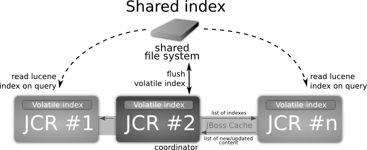
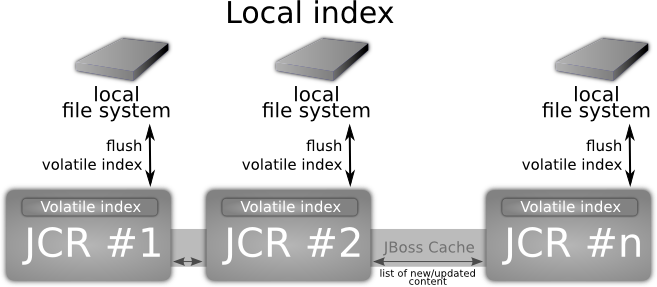
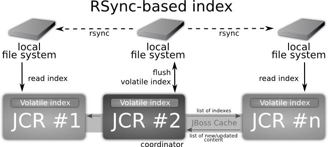
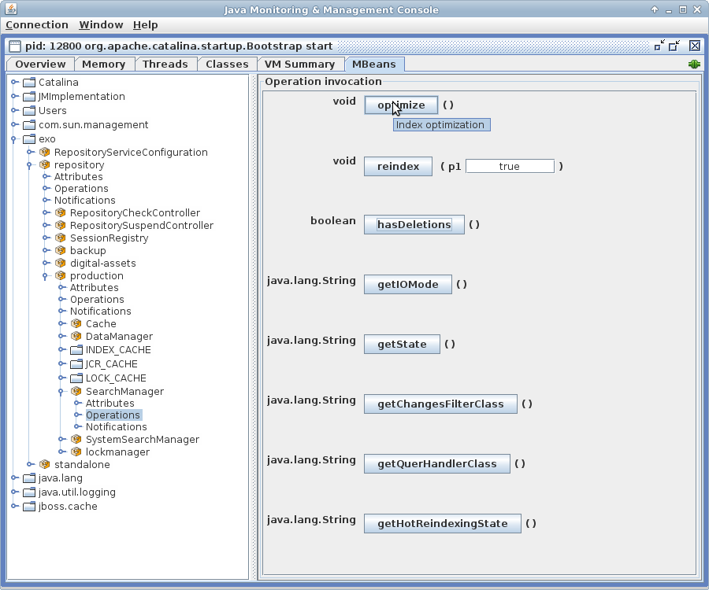

.. _Configuration_eXo_JCR:

###############
Configuration
###############

    This chapter is divided into 2 main topics that allow you to follow
    easily:

    -  :ref:`Basic configuration <JCRref.Configuration.BasicConfiguration>`
       Instructions on basic configurations related to JCR, persister
       and JDBC Data Container.

    -  :ref:`Advanced configuration <JCRref.Configuration.AdvancedConfiguration>`
       Instructions on advanced configurations regarding to Search,
       LockManager, QueryHandler, Cluster, RepositoryCreationService,
       TransactionService and External Value Storages.

.. _JCRref.Configuration.BasicConfiguration:

===================
Basic configuration
===================

-  :ref:`JCR configuration <JCR.eXoJCRconfiguration.JCRConfiguration>`

   Details of the JCR configuration, including Repository, Workspace,
   Value storage plugin, Initializer, Cache, Query Handler and Lock
   Manager.

-  :ref:`JCR configuration persister <JCR.ConfigurationPersister>`

   Instructions on how to configure and customize the JCR persister.

-  :ref:`JDBC data container configuration <JCR.JDBCDataContainerConfig>`

   Information about configuration of JDBC data container.

-  :ref:`Frequently asked questions <JCR.ConfigurationFAQs>`

   Questions and their answers related to commonly basic configurations,
   such as Lucene spellchecker, spellchecker results, Help application,
   and more.

The JCR service configuration (for example, Repository service) that can
be found in ``jcr-configuration.xml`` looks like the following:

.. code:: xml

    <component>
      <key>org.exoplatform.services.jcr.RepositoryService</key>
      <type>org.exoplatform.services.jcr.impl.RepositoryServiceImpl</type>
    </component>
    <component>
      <key>org.exoplatform.services.jcr.config.RepositoryServiceConfiguration</key>
      <type>org.exoplatform.services.jcr.impl.config.RepositoryServiceConfigurationImpl</type>
      <init-params>
        <value-param>
          <name>conf-path</name>
          <description>JCR repositories configuration file</description>
          <value>war:/conf/jcr/repository-configuration.xml</value>
        </value-param>
        <value-param>
          <name>max-backup-files</name>
          <value>5</value>
        </value-param>
        <properties-param>
          <name>working-conf</name>
          <description>working-conf</description>
          <property name="persister-class-name" value="org.exoplatform.services.jcr.impl.config.JDBCConfigurationPersister" />
          <property name="source-name" value="${gatein.jcr.datasource.name}${container.name.suffix}"/>
          <property name="dialect" value="${gatein.jcr.datasource.dialect}"/>
        </properties-param>
      </init-params>
    </component>

-  ``conf-path``: A path to a RepositoryService JCR Configuration.

-  ``max-backup-files``: The maximum number of backup files. This option
   lets you specify the number of stored backups. Number of backups can
   not exceed this value. File which will exceed the limit will replace
   the oldest file.

-  ``working-conf``: This is optional. See :ref:`JCR configuration persister <JCR.ConfigurationPersister>` 
   for more details. If there is not a ``working-conf``, the persister 
   will be disabled.

The JCR Core implementation contains a persister which stores the
repository configuration in the related database using JDBC calls -
``org.exoplatform.services.jcr.impl.config.JDBCConfigurationPersister``.
The implementation will create and use table JCR\_CONFIG in the provided
database. But the developer can implement his own persister for his
particular usecase.

.. _JCR.eXoJCRconfiguration.JCRConfiguration:

JCR configuration
~~~~~~~~~~~~~~~~~~

The ``repository-configuration.xml`` file is declared in
``jcr-configuration.xml``.

.. code:: xml

    <external-component-plugins>
        <target-component>org.exoplatform.services.jcr.config.RepositoryServiceConfiguration</target-component>
        <component-plugin>
            <name>Sample RepositoryServiceConfiguration Plugin</name>
            <set-method>addConfig</set-method>
            <type>org.exoplatform.services.jcr.impl.config.RepositoryServiceConfigurationPlugin</type>
            <init-params>
                <value-param>
                    <name>conf-path</name>
                    <description>JCR configuration file</description>
                    <value>war:/conf/platform/repository-configuration.xml</value>
                </value-param>
            </init-params>
        </component-plugin>
    </external-component-plugins>

.. _repository-configuration-file-locations:

Each ``repository-configuration.xml`` file contains configurations of
one repository, workspaces of the repository and configurations of
workspaces. This file can be found in various locations:

-  ``platform-extension/WEB-INF/conf/platform``

-  ``wiki-extension/WEB-INF/wiki-extension/jcr``

-  ``portal/WEB-INF/conf/jcr``

-  ``social-extension/WEB-INF/conf/social-extension/jcr``

-  ``forum-extension/WEB-INF/ks-extension/jcr``

-  ``ecm-wcm-extension/WEB-INF/conf/dms-extension/jcr``

-  ``calendar-extension/WEB-INF/cs-extension/jcr``

See the following DTD file to understand the expected format of the JCR
configuration.

.. code:: xml

    <!ELEMENT repository-service (repositories)>
    <!ATTLIST repository-service default-repository NMTOKEN #REQUIRED>
    <!ELEMENT repositories (repository)>
    <!ELEMENT repository (security-domain,access-control,session-max-age,authentication-policy,workspaces)>
    <!ATTLIST repository
      default-workspace NMTOKEN #REQUIRED
      name NMTOKEN #REQUIRED
      system-workspace NMTOKEN #REQUIRED
    >
    <!ELEMENT security-domain (#PCDATA)>
    <!ELEMENT access-control (#PCDATA)>
    <!ELEMENT session-max-age (#PCDATA)>
    <!ELEMENT authentication-policy (#PCDATA)>
    <!ELEMENT workspaces (workspace+)>
    <!ELEMENT workspace (container,initializer,cache,query-handler)>
    <!ATTLIST workspace name NMTOKEN #REQUIRED>
    <!ELEMENT container (properties,value-storages)>
    <!ATTLIST container class NMTOKEN #REQUIRED>
    <!ELEMENT value-storages (value-storage+)>
    <!ELEMENT value-storage (properties,filters)>
    <!ATTLIST value-storage class NMTOKEN #REQUIRED>
    <!ELEMENT filters (filter+)>
    <!ELEMENT filter EMPTY>
    <!ATTLIST filter property-type NMTOKEN #REQUIRED>
    <!ELEMENT initializer (properties)>
    <!ATTLIST initializer class NMTOKEN #REQUIRED>
    <!ELEMENT cache (properties)>
    <!ATTLIST cache 
      enabled NMTOKEN #REQUIRED
      class NMTOKEN #REQUIRED
    >
    <!ELEMENT query-handler (properties)>
    <!ATTLIST query-handler class NMTOKEN #REQUIRED>
    <!ELEMENT access-manager (properties)>
    <!ATTLIST access-manager class NMTOKEN #REQUIRED>
    <!ELEMENT lock-manager (time-out,persister)>
    <!ELEMENT time-out (#PCDATA)>
    <!ELEMENT persister (properties)>
    <!ELEMENT properties (property+)>
    <!ELEMENT property EMPTY>

JCR Service can use multiple **Repositories** and each repository can
have multiple **Workspaces**. Each workspace contains its
configurations, including:

-  :ref:`Value Storage plugin for data container <JCR.ConfigurationPersister.ValueStoragePlugin>`

-  :ref:`Initializer <JCR.eXoJCRconfiguration.InitializerConfiguration>`

-  :ref:`Cache <JCR.eXoJCRconfiguration.CacheConfiguration>`

-  :ref:`Query Handler <JCR.eXoJCRconfiguration.QueryHandlerConfiguration>`

-  :ref:`Lock Manager <JCR.eXoJCRconfiguration.LockManagerConfiguration>`

Repositories configuration parameters support human-readable formats of
values. They are all case-insensitive:

-  Number formats: K, KB - kilobytes; M, MB - megabytes; G, GB -
   gigabytes; T,TB - terabytes. For example: 100.5 - digit 100.5; 200k -
   200.

-  Time format ending: ms - milliseconds; m - minutes; h - hours; d -
   days; w - weeks. For example: 500ms - 500 milliseconds; 20 - 20
   seconds; 30m - 30 minutes; 12h - 12 hours; 5d - 5 days; 4w - 4 weeks.

.. _JCR.eXoJCRconfiguration.RepositoryServiceConfiguration:

Repository service configuration
----------------------------------

In eXo Platform, **RepositoryService** is used to build repositories
storing the whole system data. Because the repository configuration is
quite complex, **RepositoryService** does not keep that configuration in
itself but delegates to **RepositoryServiceConfiguration** for storage
and then retrieves that configuration from
**RepositoryServiceConfiguraion**. Also, additional repository
configuration can be added using
**RepositoryServiceConfigurationPlugin** which in turn will be added in
to **RepositoryServiceConfiguration**.

-  ``default-repository``: The name of a default repository (one
   returned by ``RepositoryService.getRepository()``).

-  ``repositories``: The list of repositories.

.. _JCR.eXoJCRconfiguration.RepositoryConfiguration:

Repository configuration
--------------------------

-  ``name``: The name of a repository.

-  ``default-workspace``: The name of a workspace obtained using
   ``Session's login()`` or ``login(Credentials)`` methods (ones without
   an explicit workspace name).

-  ``system-workspace``: The name of workspace where ``/jcr:system``
   node is placed.

-  ``security-domain``: The name of a security domain for JAAS
   authentication.

-  ``access-control``: The name of an access control policy. There may
   be 3 types:

   -  optional - ACL is created on demand (default).

   -  disable - No access control.

   -  mandatory - An ACL is created for each added node (not supported
      yet).

-  ``authentication-policy``: The name of an authentication policy
   class.

-  ``workspaces``: The list of workspaces.

-  ``session-max-age``: The time after which an idle session will be
   removed (called logout). If session-max-age is not set up, idle
   session will never be removed.

-  ``lock-remover-max-threads``: Number of threads that can serve
   LockRemover tasks. The default value is "1". A repository may have
   many workspaces, each workspace have own LockManager. JCR supports
   Locks with defined lifetime and these locks removed as it becomes
   expired by LockRemovers. However, ``LockRemovers`` is not an
   independent timer-thread, it is a task that executes each 30 seconds.
   Such a task is served by ``ThreadPoolExecutor`` which may use various
   threads.

eXo Platform comes with a pre-configured PortalContainer named "portal".
The default Portal Container is started from ``portal.war`` which
consists of ``jcr-configuration.xml`` and
``reposistory-configuration.xml``. These configurations can be overriden
by those in the last extension loaded.

.. note:: See :ref:`RepositoryCreationService <JCR.RepositoryCreationService>`
          if you want to learn how to create repositories in runtime.

.. _JCR.eXoJCRconfiguration.workspace:

Workspace
----------

**Workspace configuration**

-  ``name``: The name of a workspace.

-  ``auto-init-root-nodetype``: DEPRECATED. The node type for root node
   initialization.

-  ``container``: Workspace data container (physical storage)
   configuration.

-  ``initializer``: Workspace initializer configuration.

-  ``cache``: Workspace storage cache configuration.

-  ``query-handler``: Query handler configuration.

-  ``auto-init-permissions``: DEPRECATED .Default permissions of the
   root node. It is defined as a set of semicolon-delimited permissions
   containing a group of space-delimited identities (user, group, etc,
   see Organization service documentation for details) and the type of
   permission. For example, any read; **:/admin read;**:/admin
   add\_node; **:/admin set\_property;**:/admin remove means that users
   from group **admin** have all permissions and other users have only a
   'read' permission.

**Workspace data container configuration**

-  ``class``: A workspace data container class name.

-  ``value-storages``: The list of value storage plugins.

-  ``properties``: The list of properties (name-value pairs) for the
   concrete Workspace data container.

   +--------------------------------------------------+-------------------------------------------------------------------------------------------------------------------------------------------------------------------------------------------------------------------------+
   | ``trigger-events-for-descendants-on-rename``     | Indicate if it is needed to trigger events for descendants on rename or not. This increases the performance of the "rename" operation. However, Observation will not be notified to have the default value as "true".   |
   +--------------------------------------------------+-------------------------------------------------------------------------------------------------------------------------------------------------------------------------------------------------------------------------+
   | ``lazy-node-iterator-page-size``                 | Indicate the page size for lazy iterator. Particularly, this property defines the number of nodes which can be retrieved from storage per request. The default value is "100".                                          |
   +--------------------------------------------------+-------------------------------------------------------------------------------------------------------------------------------------------------------------------------------------------------------------------------+
   | ``acl-bloomfilter-false-positive-probability``   | ACL Bloom filters desired false positive probability. Range is between [0..1] and the default value is "0.1d".                                                                                                          |
   +--------------------------------------------------+-------------------------------------------------------------------------------------------------------------------------------------------------------------------------------------------------------------------------+
   | ``acl-bloomfilter-elements-number``              | Define the expected number of ACL-elements in the Bloom-filter. Its default value is 1000000.                                                                                                                           |
   +--------------------------------------------------+-------------------------------------------------------------------------------------------------------------------------------------------------------------------------------------------------------------------------+

.. note:: Bloom filters are not supported by all the cache implementations so far, only the implementation for infinispan supports it.

**Workspaces configuration with system properties**

You can configure values of properties defined in the
``repository-configuration.xml`` file using System Properties. This is
quite helpful especially when you want to change the default
configuration of all the workspaces. For example, if you want to disable
the ``rdms`` indexing for all the workspace without this kind of
improvement, it is very error prone. For all components that can be
configured thanks to properties such as
``container, value-storage, workspace-initializer, cache, query-handler,
      lock-manager, access-manager`` and ``persister``; the logic, for
example, for the '``container``' component and the '``foo``' property
will be the following:

1. If you have a system property called
   ``exo.jcr.config.force.workspace.repository_collaboration.container.foo``
   that has been defined, its value will be used for the configuration
   of the '``repository``' repository and the '``collaboration``'
   workspace.

2. If you have a system property called
   ``exo.jcr.config.force.repository.repository.container.foo`` that has
   been defined, its value will be used for the configuration of all the
   workspaces of the '``repository``' repository except the workspaces
   for which you configured the same property using system properties
   defined in #1.

3. If you have a system property called
   ``exo.jcr.config.force.all.container.foo`` that has been defined, its
   value will be used for the configuration of all the workspaces except
   the workspaces for which you configured the same property using
   system properties defined in #1 or #2.

4. If you have a '``foo``' property configured for the '``repository``'
   repository and the '``collaboration``' workspace and you have no
   system properties corresponding to rule #1, #2 and #3, use this value
   (current behavior).

5. If the previous rules do not allow giving a value to the '``foo``'
   property, you will then check the default value in the following
   order:
   ``exo.jcr.config.default.workspace.repository_collaboration.container.foo``,
   ``exo.jcr.config.default.repository.repository.container.foo``,
   ``exo.jcr.config.default.all.container.foo.``

To turn on this feature, you need to define a component called
``SystemParametersPersistenceConfigurator``. A simple example:

.. code:: xml

      <component>
          <key>org.exoplatform.services.jcr.config.SystemParametersPersistenceConfigurator</key>
          <type>org.exoplatform.services.jcr.config.SystemParametersPersistenceConfigurator</type>
          <init-params>
          <value-param>
          <name>file-path</name>
          <value>target/temp</value>
          </value-param>
          <values-param>
          <name>unmodifiable</name>
          <value>cache.test-parameter-I</value>
          </values-param>
          <values-param>
          <name>before-initialize</name>
          <value>value-storage.enabled</value>
          </values-param>
          </init-params>
          </component>

To make the configuration process easier, here you can define thee
parameters.

1. ``file-path``: this is a mandatory parameter which defines the
   location of the file where all parameters configured on the previous
   launch of AS are stored.

2. ``unmodifiable``: this defines the list of parameters which cannot be
   modified using system properties.

3. ``before-initialize``: this defines the list of parameters which can
   be set only for not initialized workspaces (for example, during the
   first start of the AS).

The parameter in the list have the following format: ``
      {component-name}.{parameter-name}``. This takes affect for every
workspace component called ``{component-name}``.

Take into account that if this component is not defined in the
configuration, the workspace configuration overriding using system
properties mechanism will be disabled. In other words, if you do not
configure ``SystemParametersPersistenceConfigurator``, the system
properties are ignored.

.. _JCR.eXoJCRconfiguration.WorkspacePersistenceStorage:

Workspace Data Container
--------------------------

Each Workspace of JCR has its own persistent storage to hold workspace's
items data. eXo Content Repository can be configured so that it can use
one or more workspaces that are logical units of the repository content.
Physical data storage mechanism is configured using the ``container``
mandatory element. The type of container is described in the ``class``
attribute = the fully qualified name of the
``org.exoplatform.services.jcr.storage.WorkspaceDataContainer`` subclass
like:

.. code:: xml

    <container class="org.exoplatform.services.jcr.impl.storage.jdbc.optimisation.CQJDBCWorkspaceDataContainer">
      <properties>
        <property name="source-name" value="jdbcjcr1"/>
        <property name="dialect" value="hsqldb"/>
        <property name="multi-db" value="true"/>
        <property name="max-buffer-size" value="200K"/>
        <property name="swap-directory" value="target/temp/swap/ws"/>
        <property name="lazy-node-iterator-page-size" value="50"/>
        <property name="acl-bloomfilter-false-positive-probability" value="0.1d"/>
        <property name="acl-bloomfilter-elements-number" value="1000000"/>
        <property name="check-sns-new-connection" value="false"/>
        <property name="batch-size" value="1000"/>
      </properties>

**Specific parameters of Workspace Data Container**

-  ``max-buffer-size``: A threshold in bytes, if a value size is
   greater, then it will be spooled to a temporary file. The default
   value is 200k.

-  ``swap-directory``: A location where the value will be spooled if no
   value storage is configured but a ``max-buffer-size`` is exceeded.
   The default value is the value of the "``java.io.tmpdir``" system
   property.

-  ``lazy-node-iterator-page-size``: "Lazy" child nodes iterator
   settings. Defines the size of page, the number of nodes that are
   retrieved from persistent storage at once. The default value is 100.

-  ``acl-bloomfilter-false-positive-probability``: ACL Bloom-filter
   settings. ACL Bloom-filter desired false positive probability. Range
   [0..1]. The default value is 0.1d.

-  ``acl-bloomfilter-elements-number``: ACL Bloom-filter settings.
   Expected number of ACL-elements in the Bloom-filter. The default
   value is 1000000.

-  ``check-sns-new-connection``: Defines if you need to create new
   connection for checking if an older same-name sibling exists. The
   default value is "false".

-  ``trigger-events-for-descendants-on-rename``: Indicates if each
   descendant item must be included into the changes log in case of
   renaming or not.

   -  If its value is set to "**false**", the performance on the rename
      operations will be increased in case of a big amount of nodes
      under the source parent node. However, the performance will be
      decreased in case of a small amount of sub-nodes.

   -  If its value is set to "**true**", the performance will be better
      in case of a small amount of sub-nodes and worse in case of a big
      amount of sub-nodes.

   -  If this parameter is not set, the application will rely on the
      *max-descendant-nodes-allowed-on-move* parameter to add the
      descendant items to the changes log or not. If this parameter is
      not set but the *trigger-events-for-descendants-on-move* parameter
      is set, it will have the same value.

-  **trigger-events-for-descendants-on-move**: Indicates if each
   descendant item must be included into the changes log in case of
   moving or not.

   -  If its value is set to "false", the performance of moving
      operations will be increased in case of a big amount of nodes
      under the source parent node. However, the performance will be
      decreased in case of a small amount of sub-nodes.

   -  If its value is set to "true", the performance will be better in
      case of a small amount of sub-nodes and worse in case of a big
      amount of sub-nodes.

   -  If this parameter is not set, the application will rely on the
      *max-descendant-nodes-allowed-on-move* parameter to add or not the
      descendant items to the changes log.

-  **max-descendant-nodes-allowed-on-move**: The maximum number of
   descendant nodes is allowed to be included into the change log. Its
   value will be then automatically disabled. This allows the best
   performance regardless of the total amount of sub-nodes. The default
   value is set to "100". This parameter is used only if
   *trigger-events-for-descendants-on-move* and
   *trigger-events-for-descendants-on-rename* are not set.

.. note:: Bloom filters are not supported by all the cache implementations so
          far only the implementation for infinispan supports it. They are
          used to avoid read nodes that definitely do not have ACL.
          ``acl-bloomfilter-false-positive-probability`` and
          ``acl-bloomfilter-elements-number`` are used to configure such
          filters. You can read
          `here <http://en.wikipedia.org/wiki/Bloom_filter" >http://en.wikipedia.org/wiki/Bloom_filter>`__
          for more information about Bloom filters.

**Specific parameters of JDBC Workspace Data Container**

eXo JCR has an RDB (JDBC) based production ready **Workspace Data
Container** which has the following specific parameters:

-  ``source-name``: JDBC data source name, registered in JDNI by
   InitialContextInitializer. (``sourceName`` prior v.1.9). This
   property is **mandatory**.

-  ``dialect``: Database dialect, one of ""hsqldb", "h2", "mysql",
   "mysql-myisam", "mysql-utf8", "mysql-myisam-utf8", "pgsql",
   "pgsql-scs", "oracle", "oracle-oci", "mssql", "sybase", "derby",
   "db2", "db2v8". The default value is "auto".

-  ``multi-db``: Enables multi-database containers if the value of this
   parameter is "true". Otherwise, it is configured for single-database
   containers.

.. note:: This property is currently **deprecated**. It is advised to use ``db-structure-type`` instead.

-  ``db-structure-type``: Can be set to *isolated, multi, single* to set
   corresponding configuration for data container. This property is
   **mandatory.**

-  ``db-tablename-suffix``: If ``db-structure-type `` is set to
   *isolated*, tables used by repository service have the following
   format:

   -  ``JCR_I${db-tablename-suffix}`` for items.

   -  ``JCR_V${db-tablename-suffix}`` for values.

   -  ``JCR_R${db-tablename-suffix}`` for references.

      ``db-tablename-suffix`` by default equals to the workspace name,
      but can be set via configuration to any suitable.

-  ``batch-size``: The batch size. The default value is -1 (disabled).

-  ``use-sequence-for-order-number``: Indicates whether or not a
   sequence must be used to manage the order number. The expected value
   for this parameter is a boolean or "auto". By default, it is set to
   "auto" where the value of use-sequence will be set automatically
   according to your database type.

   -  It is enabled in case of H2, HSQLDB, PGSQL and ORACLE.

   -  It is disabled in case of MSSQL, MYSQL and SYBASE.

Workspace Data Container may support external storages for
``javax.jcr.Value`` (which can be the case for BLOB values for example)
using the ``value-storages`` optional element. Data Container will try
to read or write values using underlying value storage plugin if the
filter criteria (see below) match the current property.

.. code:: xml

    <value-storages>
      <value-storage id="Storage #1" class="org.exoplatform.services.jcr.impl.storage.value.fs.TreeFileValueStorage">
        <properties>
          <property name="path" value="data/values"/>
        </properties>
        <filters>
         <filter property-type="Binary" min-value-size="1M"/><!-- Values large of 1Mbyte -->
        </filters>
    .........
    </value-storages>

Where:

-  ``value-storage`` is the subclass of
   ``org.exoplatform.services.jcr.storage.value.ValueStoragePlugin`` and
   **properties** are optional plugin specific parameters.

-  ``filters``: Each file value storage can have the filter(s) for
   incoming values. If there are several filter criteria, they all have
   to match (AND-Condition).

   A filter can match values by the property type (``property-type``),
   property name (``property-name``), ancestor path (``ancestor-path``)
   and/or the size of values stored (min-value-size, e.g. 1M, 4.2G, 100
   (bytes)).

   This code sample uses a filter with ``property-type`` and
   ``min-value-size`` only. That means that the storage is only for
   binary values whose size is greater than 1Mbyte.

It is recommended to store properties with large values in a file value
storage only.

**Database's dialects**

**PostgreSQL/PostgrePlus database**

PostgreSQL/PostgrePlus's dialect is set automatically. The dialect
depends on the version of database. If you change default value of
``standard_conforming_strings`` parameter, you must configure one of the
following dialects manually:

-  ``PgSQL ``: This dialect is used if ``standard_conforming_strings``
   is set to 'off' which is the default value for version before 9.1.

-  ``PgSQL-SCS``: This dialect is used if
   ``standard_conforming_strings`` is set to 'on' which is the default
   value for version after 9.1.

**MySQL database**

-  ``mysql``: This dialect is used if JCR tables with InnoDB engine (by
   default) need to be created.

-  ``mysql-utf8``: This dialect is used if JCR tables with InnoDB engine
   with UTF-8 encoding support need to be created.

-  ``mysql-myisam``: This dialect is used if JCR tables with MyISAM
   engine need to be created.

-  ``mysql-myisam-utf8``: This dialect is used if JCR tables with MyISAM
   engine with UTF-8 encoding support need to be created.

-  ``mysql-ndb``: This dialect is used if JCR tables with NDB engine
   (mysql cluster) need to be created.

-  ``mysql-ndb-utf8``: This dialect is used if JCR tables with NDB
   engine (mysql cluster) with UTF-8 encoding support need to be
   created.

.. note:: Since MySQL NDB engine does not support foreign keys, which may lead
          to improper item removal and as consequence to
          ``InvalidItemStateException``. In this case, you will need to use
          consistency checker tool.

.. _JCR.ConfigurationPersister.ValueStoragePlugin:

Value Storage plugin for data container
----------------------------------------

.. note:: The value-storage element is optional. If you do not include it, the
          values will be stored as BLOBs inside the database.

    See :ref:`External Value Storages <JCR.ExternalValueStorages>` for
    advanced configuration of the Value Storage plugin.

-  ``value-storage``: Optional Value Storage plugin definition.

.. _JCR.eXoJCRconfiguration.InitializerConfiguration:

Initializer
------------

.. note:: This configuration is optional.

-  ``class``: Initializer implementation class.

-  ``properties``: The list of properties (name-value pairs) which are
   supported.

-  ``root-nodetype``: The node type for root node initialization.

-  ``root-permissions``: Default permissions of the root node. It is
   defined as a set of semicolon-delimited permissions containing a
   group of space-delimited identities (for example, user and group. See
   :ref:`Organization Service Initializer <Core.OrganizationServiceInitializer>` for more
   details), and the type of permission. For example any
   read;\ **:/admin read;**:/admin add\_node;\ **:/admin
   set\_property;**:/admin remove means that users from group **admin**
   have all permissions and other users have only a 'read' permission.

-  Configurable initializer adds a capability to override workspace
   initial startup procedure (used for Clustering).It also replaces
   workspace element parameters, including ``auto-init-root-nodetype``
   and\ ``auto-init-permissions``, with ``root-nodetype`` and
   ``root-permissions`` respectively.

.. _JCR.eXoJCRconfiguration.CacheConfiguration:

Cache
-------

-  ``enabled``: Define if workspace cache is enabled or not.

-  ``class``: Cache implementation class. The default value is
   ``org.exoplatform.services.jcr.impl.dataflow.persistent.LinkedWorkspaceStorageCacheImpl``.

-  ``properties``: The list of properties (name-value pairs) for
   Workspace cache.

-  ``max-size``: Cache maximum size.

-  ``live-time``: Cached item live time.

.. _JCR.eXoJCRconfiguration.QueryHandlerConfiguration:

Query Handler
--------------

The service configuration is located at ``repository-configuration.xml``
in the web application. This file can be found in :ref:`various locations <repository-configuration-file-locations>`.

For example:

.. code:: xml

    <query-handler class="org.exoplatform.services.jcr.impl.core.query.lucene.SearchIndex">
        <properties>
            <property name="index-dir" value="target/temp/index/repository/lab" />
            <property name="support-highlighting" value="true" />
            <property name="excerptprovider-class" value="org.exoplatform.services.jcr.impl.core.query.lucene.DefaultHTMLExcerpt" />                           
        </properties>
    </query-handler>

-  ``class``: A Query Handler class name.

-  ``properties``: The list of properties (name-value pairs) for a Query
   Handler (indexDir).

.. note:: See :ref:`Query Handler configuration <JCR.QueryHandlerConfiguration>` for advanced configuration of QueryHandler.

.. _JCR.eXoJCRconfiguration.LockManagerConfiguration:

Lock Manager
-------------

The service configuration is located at ``repository-configuration.xml``
in the web application. The file can be found in :ref:`various locations <repository-configuration-file-locations>`.

For example:

.. code:: xml

    <lock-manager>
        <time-out>15m</time-out><!-- 15min -->
        <persister class="org.exoplatform.services.jcr.impl.core.lock.FileSystemLockPersister">
            <properties>
                <property name="path" value="../temp/lock/gadgets" />
            </properties>
        </persister>
    </lock-manager>

-  ``time-out``: Time after which the unused global lock will be
   removed.

-  ``persister``: A class for storing lock information for future use.
   For example, remove lock after jcr restart.

-  ``path``: A lock folder. Each workspace has its own one.

.. note:: -  See :ref:`Lock Manager configuration <JCR.LockManagerConfiguration>` for advanced configuration of LockManager.

          -  Also see :ref:`lock-remover-max-threads <JCR.eXoJCRconfiguration.LockRemoverMaxThreads>`.

.. _JCR.ConfigurationPersister:

JCR configuration persister
~~~~~~~~~~~~~~~~~~~~~~~~~~~~~

JCR allows using *persister* to store configuration. In this section,
you will understand how to use and configure JCR persister.

On startup ``RepositoryServiceConfiguration`` component checks if a
configuration persister was configured. In that case, it uses the
provided ``ConfigurationPersister`` implementation class to instantiate
the persister object.

The configuration file is located in
``portal/WEB-INF/conf/jcr/jcr-configuration.xml`` in the portal web
application.

Configuration with persister:

.. code:: xml

    <component>
    <key>org.exoplatform.services.jcr.config.RepositoryServiceConfiguration</key>
    <type>org.exoplatform.services.jcr.impl.config.RepositoryServiceConfigurationImpl</type>
    <init-params>
      <value-param>
        <name>conf-path</name>
        <description>JCR configuration file</description>
        <value>war:/conf/jcr/repository-configuration.xml</value>
      </value-param>
      <properties-param>
          <name>working-conf</name>
        <description>working-conf</description>
        <property name="persister-class-name" value="org.exoplatform.services.jcr.impl.config.JDBCConfigurationPersister" />
        <property name="source-name" value="${gatein.jcr.datasource.name}${container.name.suffix}"/>
        <property name="dialect" value="${gatein.jcr.datasource.dialect}"/>
      </properties-param>
    </init-params>
    </component>

-  ``persister-class-name`` - Class name of ``ConfigurationPersister``
   interface implementation.

-  ``source-name``: JNDI source name configured in
   ``InitialContextInitializer`` component. Find more in 
   :ref:`database configuration <JCR.JDBCDataContainerConfig>`.

-  ``dialect``: SQL dialect which will be used with database
   from\ ``source-name``. Find more in 
   :ref:`database configuration <JCR.JDBCDataContainerConfig>`.

If you want to customize, you can implement ``ConfigurationPersister``
interface as follows:

.. code:: java

    /**
       * Init persister.
       * Used by RepositoryServiceConfiguration on init. 
       * @return - config data stream
       */
      void init(PropertiesParam params) throws RepositoryConfigurationException;
      
      /**
       * Read config data.
       * @return - config data stream
       */
      InputStream read() throws RepositoryConfigurationException;
      
      /**
       * Create table, write data.
       * @param confData - config data stream
       */
      void write(InputStream confData) throws RepositoryConfigurationException;
      
      /**
       * Tell if the config exists.
       * @return - flag
       */
      boolean hasConfig() throws RepositoryConfigurationException;

.. _JCR.JDBCDataContainerConfig:

JDBC data container configuration
~~~~~~~~~~~~~~~~~~~~~~~~~~~~~~~~~~

The current configuration of JCR uses `Apache DBCP <http://commons.apache.org/dbcp/>`__ connection pool.
(``org.apache.commons.dbcp.BasicDataSourceFactory``). It is possible to
set a big value for maxActive parameter in ``configuration.xml``. That
means lots of TCP/IP ports from a client machine inside the pool are
used, such as JDBC driver. As the result, the data container can throw
exceptions like "Address already in use". To solve this problem, you
have to configure the client's machine networking software for using
shorter timeouts for opened TCP/IP ports.

Microsoft Windows has ``MaxUserPort``, ``TcpTimedWaitDelay`` registry
keys in the node
``HKEY_LOCAL_MACHINESYSTEMCurrentControlSetServicesTcpipParameters``, by
default these keys are unset. Set each one with values as follows:

-  "TcpTimedWaitDelay"=dword:0000001e, sets TIME\_WAIT parameter to 30
   seconds (default value is "240").

-  "MaxUserPort"=dword:00001b58, sets the maximum of open ports to 7000
   or higher (default value is "5000").

A sample registry file is below:

::

    Windows Registry Editor Version 5.00

    [HKEY_LOCAL_MACHINE\SYSTEM\CurrentControlSet\Services\Tcpip\Parameters]
    "MaxUserPort"=dword:00001b58
    "TcpTimedWaitDelay"=dword:0000001e

Isolated-database configuration
-------------------------------

Isolated-database configuration allows configuring single database for
repository but separate database tables for each workspace.

1. Configure the data container in the
   ``org.exoplatform.services.naming.InitialContextInitializer`` service.
   It is the JNDI context initializer, which registers (binds) naming
   resources (DataSources) for data containers.

   For example:

	.. code:: xml

		   <external-component-plugins>
			<target-component>org.exoplatform.services.naming.InitialContextInitializer</target-component>
			<component-plugin>
			  <name>bind.datasource</name>
			  <set-method>addPlugin</set-method>
			  <type>org.exoplatform.services.naming.BindReferencePlugin</type>
			  <init-params>
				<value-param>
				  <name>bind-name</name>
				  <value>jdbcjcr</value>
				</value-param>
				<value-param>
				  <name>class-name</name>
				  <value>javax.sql.DataSource</value>
				</value-param>
				<value-param>
				  <name>factory</name>
				  <value>org.apache.commons.dbcp.BasicDataSourceFactory</value>
				</value-param>
				  <properties-param>
					<name>ref-addresses</name>
					<description>ref-addresses</description>
					<property name="driverClassName" value="org.postgresql.Driver"/>
					<property name="url" value="jdbc:postgresql://exoua.dnsalias.net/portal"/>
					<property name="username" value="exoadmin"/>
					<property name="password" value="exo12321"/>
				  </properties-param>
			  </init-params>
			</component-plugin>
		  </external-component-plugins>

The database connection parameters are configured:

-  ``driverClassName``. For example: "org.hsqldb.jdbcDriver",
   "com.mysql.jdbc.Driver", "org.postgresql.Driver"

-  ``url``. For example: "jdbc:hsqldb:file:target/temp/data/portal",
   "jdbc:mysql://exoua.dnsalias.net/jcr"

-  ``username``. For example: "sa", "exoadmin"

-  ``password``. For example: "exo12321"

2. Configure the repository service. Each workspace will be configured for
   the same data container.

   For example:

	.. code:: xml

		<workspaces>
		   <workspace name="ws">
			  <!-- for system storage -->
			  <container class="org.exoplatform.services.jcr.impl.storage.jdbc.optimisation.CQJDBCWorkspaceDataContainer">
				 <properties>
					<property name="source-name" value="jdbcjcr" />
					<property name="db-structure-type" value="isolated" />
					...
				 </properties>
				 ...
			  </container>
			  ...
		   </workspace>

		   <workspace name="ws1">
			  <container class="org.exoplatform.services.jcr.impl.storage.jdbc.optimisation.CQJDBCWorkspaceDataContainer">
				 <properties>
					<property name="source-name" value="jdbcjcr" />
					<property name="db-structure-type" value="isolated" />
					...
				 </properties>
				 ...
			  </container>
			  ...
		   </workspace>
		</workspaces>

In this step, you have configured two workspaces which will be persisted
in different database tables.

.. note:: The :ref:`repository configuration <JCR.eXoJCRconfiguration.RepositoryConfiguration>`
          parameters support human-readable formats of values. For example:
          200K - 200 Kbytes, 30m - 30 minutes, and more.

Single-database configuration
-----------------------------

It is simpler to configure a single-database data container. You have to
configure one naming resource.

For example (embedded mode for ``jdbcjcr`` data container):

.. code:: xml

    <external-component-plugins>
    <target-component>org.exoplatform.services.naming.InitialContextInitializer</target-component>
    <component-plugin>
        <name>bind.datasource</name>
        <set-method>addPlugin</set-method>
        <type>org.exoplatform.services.naming.BindReferencePlugin</type>
        <init-params>
          <value-param>
            <name>bind-name</name>
            <value>jdbcjcr</value>
          </value-param>
          <value-param>
            <name>class-name</name>
            <value>javax.sql.DataSource</value>
          </value-param>
          <value-param>
            <name>factory</name>
            <value>org.apache.commons.dbcp.BasicDataSourceFactory</value>
          </value-param>
          <properties-param>
            <name>ref-addresses</name>
            <description>ref-addresses</description>
            <property name="driverClassName" value="org.postgresql.Driver"/>
            <property name="url" value="jdbc:postgresql://exoua.dnsalias.net/portal"/>
            <property name="username" value="exoadmin"/>
            <property name="password" value="exo12321"/>
            <property name="maxActive" value="50"/>
            <property name="maxIdle" value="5"/>
            <property name="initialSize" value="5"/>
          </properties-param>
        </init-params>
    </component-plugin>
    </external-component-plugins>

And configure repository workspaces in repositories configuration with
this one database. Parameter "multi-db" must be switched off (set value
"false").

For example: two workspaces ``ws`` - jdbcjcr, and ``ws1`` - jdbcjcr:

.. code:: xml

    <workspaces>
      <workspace name="ws" auto-init-root-nodetype="nt:unstructured">
        <container class="org.exoplatform.services.jcr.impl.storage.jdbc.optimisation.CQJDBCWorkspaceDataContainer">
        <properties>
          <property name="source-name" value="jdbcjcr"/>
          <property name="dialect" value="pgsql"/>
          <property name="multi-db" value="false"/>
          <property name="max-buffer-size" value="200K"/>
          <property name="swap-directory" value="target/temp/swap/ws"/>
        </properties>
        </container>
        <cache enabled="true">
        <properties>
          <property name="max-size" value="10K"/>
          <property name="live-time" value="30m"/>
        </properties>
        </cache>
        <query-handler class="org.exoplatform.services.jcr.impl.core.query.lucene.SearchIndex">
        <properties>
          <property name="index-dir" value="../temp/index"/>
        </properties>
        </query-handler>
        <lock-manager>
        <time-out>15m</time-out>
        <persister class="org.exoplatform.services.jcr.impl.core.lock.FileSystemLockPersister">
          <properties>
          <property name="path" value="target/temp/lock/ws"/>
          </properties>
        </persister>
        </lock-manager>
      </workspace>
      <workspace name="ws1" auto-init-root-nodetype="nt:unstructured">
        <container class="org.exoplatform.services.jcr.impl.storage.jdbc.optimisation.CQJDBCWorkspaceDataContainer">
        <properties>
          <property name="source-name" value="jdbcjcr"/>
          <property name="dialect" value="pgsql"/>
          <property name="multi-db" value="false"/>
          <property name="max-buffer-size" value="200K"/>
          <property name="swap-directory" value="target/temp/swap/ws1"/>
        </properties>
        </container>
        <cache enabled="true">
        <properties>
          <property name="max-size" value="10K"/>
          <property name="live-time" value="5m"/>
        </properties>
        </cache>
        <lock-manager>
        <time-out>15m</time-out>
        <persister class="org.exoplatform.services.jcr.impl.core.lock.FileSystemLockPersister">
          <properties>
          <property name="path" value="target/temp/lock/ws1"/>
          </properties>
        </persister>
        </lock-manager>
      </workspace>
    </workspaces>

In this way, you have configured two workspaces which will be persisted
in one database (PostgreSQL).

**Configuration without DataSource**

Repository configuration without using the ``javax.sql.DataSource``
bounded in JNDI.

This case may be usable if you have a dedicated JDBC driver
implementation with special features like XA transactions,
statements/connections pooling and so on:

-  Remove the configuration in ``InitialContextInitializer`` for your
   database and configure a new one directly in the workspace container.

-  Remove parameter "source-name" and add next lines instead. Describe
   your values for a JDBC driver, database URL and username.

.. note:: Be careful in the case JDBC driver should be implemented and provide
          connection pooling. Connection pooling is very recommended for using
          with JCR to prevent a database overload.

.. code:: xml

    <workspace name="ws" auto-init-root-nodetype="nt:unstructured">
    <container class="org.exoplatform.services.jcr.impl.storage.jdbc.optimisation.CQJDBCWorkspaceDataContainer">
    <properties>
      <property name="dialect" value="hsqldb"/>
      <property name="driverClassName" value="org.hsqldb.jdbcDriver"/>
      <property name="url" value="jdbc:hsqldb:file:target/temp/data/portal"/>
      <property name="username" value="su"/>
      <property name="password" value=""/> 
    ......

Multi-database configuration
----------------------------

You need to configure each workspace in a repository. You may have each
one on different remote servers as far as you need.

First of all, configure the data containers in the
``org.exoplatform.services.naming.InitialContextInitializer`` service.
It is the JNDI context initializer which registers (binds) naming
resources (DataSources) for data containers.

For example, the configuration for two data containers (``jdbcjcr`` -
local HSQLDB, ``jdbcjcr1`` - remote MySQL) is as follows :

.. code:: xml

    <component>
        <key>org.exoplatform.services.naming.InitialContextInitializer</key>
        <type>org.exoplatform.services.naming.InitialContextInitializer</type>
        <component-plugins>
          <component-plugin>
            <name>bind.datasource</name>
            <set-method>addPlugin</set-method>
            <type>org.exoplatform.services.naming.BindReferencePlugin</type>
            <init-params>
              <value-param>
                <name>bind-name</name>
                <value>jdbcjcr</value>
              </value-param>
              <value-param>
                <name>class-name</name>
                <value>javax.sql.DataSource</value>
              </value-param>
              <value-param>
                <name>factory</name>
                <value>org.apache.commons.dbcp.BasicDataSourceFactory</value>
              </value-param>
              <properties-param>
                <name>ref-addresses</name>
                <description>ref-addresses</description>
                <property name="driverClassName" value="org.hsqldb.jdbcDriver"/>
                <property name="url" value="jdbc:hsqldb:file:target/temp/data/portal"/>
                <property name="username" value="sa"/>
                <property name="password" value=""/>
              </properties-param>
            </init-params>
          </component-plugin>
          <component-plugin>
            <name>bind.datasource</name>
            <set-method>addPlugin</set-method>
            <type>org.exoplatform.services.naming.BindReferencePlugin</type>
            <init-params>
              <value-param>
                <name>bind-name</name>
                <value>jdbcjcr1</value>
              </value-param>
              <value-param>
                <name>class-name</name>
                <value>javax.sql.DataSource</value>
              </value-param>
              <value-param>
                <name>factory</name>
                <value>org.apache.commons.dbcp.BasicDataSourceFactory</value>
              </value-param>
              <properties-param>
                <name>ref-addresses</name>
                <description>ref-addresses</description>
                <property name="driverClassName" value="com.mysql.jdbc.Driver"/>
                <property name="url" value="jdbc:mysql://exoua.dnsalias.net/jcr"/>
                <property name="username" value="exoadmin"/>
                <property name="password" value="exo12321"/>
                <property name="maxActive" value="50"/>
                <property name="maxIdle" value="5"/>
                <property name="initialSize" value="5"/>
              </properties-param>
            </init-params>
          </component-plugin>
        <component-plugins>
        <init-params>
          <value-param>
            <name>default-context-factory</name>
            <value>org.exoplatform.services.naming.SimpleContextFactory</value>
          </value-param>
        </init-params>
    </component>

-  ``driverClassName``, for example. "org.hsqldb.jdbcDriver",
   "com.mysql.jdbc.Driver", "org.postgresql.Driver"

-  ``url``, for example, "jdbc:hsqldb:file:target/temp/data/portal",
   "jdbc:mysql://exoua.dnsalias.net/jcr"

-  ``username``, for example, "sa", "exoadmin"

-  ``password``, for example, "", "exo12321"

-  ``maxActive``, for example, 50

-  ``maxIdle``, for example, 5

-  ``initialSize``, for example, 5

   There are also some other connection pool configuration parameters
   (org.apache.commons.dbcp.BasicDataSourceFactory) according to 
   `Apache DBCP configuration. <http://jakarta.apache.org/commons/dbcp/configuration.html>`__

When the data container configuration is done, you can configure the
repository service. Each workspace will be configured for its own data
container.

For example (two workspaces ``ws`` and ``ws1``:

.. code:: xml

    <workspaces>
      <workspace name="ws" auto-init-root-nodetype="nt:unstructured">
        <container class="org.exoplatform.services.jcr.impl.storage.jdbc.optimisation.CQJDBCWorkspaceDataContainer">
        <properties>
          <property name="source-name" value="jdbcjcr"/>
          <property name="dialect" value="hsqldb"/>
          <property name="multi-db" value="true"/>
          <property name="max-buffer-size" value="200K"/>
          <property name="swap-directory" value="target/temp/swap/ws"/>   
        </properties>
        </container>
        <cache enabled="true">
          <properties>
            <property name="max-size" value="10K"/><!-- 10Kbytes -->
            <property name="live-time" value="30m"/><!-- 30 min -->
          </properties>
        </cache>
        <query-handler class="org.exoplatform.services.jcr.impl.core.query.lucene.SearchIndex">
        <properties>
          <property name="index-dir" value="target/temp/index"/>
        </properties>
        </query-handler>
        <lock-manager>
        <time-out>15m</time-out><!-- 15 min -->
        <persister class="org.exoplatform.services.jcr.impl.core.lock.FileSystemLockPersister">
          <properties>
          <property name="path" value="target/temp/lock/ws"/>
          </properties>
        </persister>
        </lock-manager>
      </workspace>
      <workspace name="ws1" auto-init-root-nodetype="nt:unstructured">
        <container class="org.exoplatform.services.jcr.impl.storage.jdbc.optimisation.CQJDBCWorkspaceDataContainer">
        <properties>
          <property name="source-name" value="jdbcjcr1"/>
          <property name="dialect" value="mysql"/>
          <property name="multi-db" value="true"/>
          <property name="max-buffer-size" value="200K"/>
          <property name="swap-directory" value="target/temp/swap/ws1"/>   
        </properties>
        </container>
        <cache enabled="true">
          <properties>
            <property name="max-size" value="10K"/>
            <property name="live-time" value="5m"/>
          </properties>
        </cache>
        <query-handler class="org.exoplatform.services.jcr.impl.core.query.lucene.SearchIndex">
        <properties>
          <property name="index-dir" value="target/temp/index"/>
        </properties>
        </query-handler>
        <lock-manager>
        <time-out>15m</time-out><!-- 15 min -->
        <persister class="org.exoplatform.services.jcr.impl.core.lock.FileSystemLockPersister">
          <properties>
          <property name="path" value="target/temp/lock/ws1"/>
          </properties>
        </persister>
        </lock-manager>
      </workspace>
    </workspaces>
        

-  ``source-name``: A javax.sql.DataSource name configured in
   InitialContextInitializer component.

-  ``dialect``: A database dialect, one of "hsqldb", "mysql",
   "mysql-utf8", "pgsql", "pgsql-scs", "oracle", "oracle-oci", "mssql",
   "sybase", "derby", "db2", "db2v8" or "auto" for dialect
   autodetection;

-  ``multi-db``: Enable multi-database container with this parameter
   (set value "true");

-  ``max-buffer-size: A`` threshold (in bytes) after which a javax.jcr.
   Value content will be swapped to a file in a temporary storage. For
   example: swap for pending changes.

-  ``swap-directory``: A path in the file system used to swap the
   pending changes.

In this way, you have configured two workspaces which will be persisted
in two different database (ws in HSQLDB, ws1 in MySQL).

.. note:: The :ref:`repository configuration <JCR.eXoJCRconfiguration.RepositoryConfiguration>`
          parameters supports human-readable formats of values (for example:
          200K - 200 Kbytes, 30m - 30 minutes, etc)

 _JCR.ConfigurationFAQs:
 
Frequently asked questions
~~~~~~~~~~~~~~~~~~~~~~~~~~~

**Q1:** **How to use Lucene spellchecker?**

**A:** You simply do the following steps:

-  Enable the Lucene spellchecker in the JCR QueryHandler configuration:

   .. code:: xml

       <query-handler class="org.exoplatform.services.jcr.impl.core.query.lucene.SearchIndex">
           <properties>
               ...
               <property name="spellchecker-class" value="org.exoplatform.services.jcr.impl.core.query.lucene.spell.LuceneSpellChecker$FiveSecondsRefreshInterval"/>
               ...
           </properties>
       </query-handler>

-  Execute query with rep:spellcheck function and word that is checked:

   .. code:: java

       Query query = qm.createQuery("select rep:spellcheck() from nt:base where " +
         "jcr:path = '/' and spellcheck('word that is checked')", Query.SQL);
         RowIterator rows = query.execute().getRows();

-  Fetch a result:

   .. code:: java

       Row r = rows.nextRow();
         Value v = r.getValue("rep:spellcheck()");

If there is no any result, this means there is no suggestion, so word is
correct or spellcheckers dictionary does not contain any words like the
checked word.

**Q2:** **How can I affect spellchecker results?**

**A:** There are two parameters in the JCR QueryHandler configuration:

-  Minimal distance between checked word and proposed suggestion:

-  Search for more popular suggestions:

   .. code:: xml

       <query-handler class="org.exoplatform.services.jcr.impl.core.query.lucene.SearchIndex">
           <properties>
               ...
               <property name="spellchecker-class" value="org.exoplatform.services.jcr.impl.core.query.lucene.spell.LuceneSpellChecker$FiveSecondsRefreshInterval" />
               <property name="spellchecker-more-popular" value="false" />
               <property name="spellchecker-min-distance" value="0.55" />
               ...
           </properties>
       </query-handler>

Minimal distance is counted as Levenshtein distance between checked word
and spellchecker suggestion.

The MorePopular parameter affects in the following way:

If "morePopular" is disabled:

-  If the proposed word exists in the directory: no suggestion given.

-  If the proposed word does not exist in the directory: propose the
   closed word.

If "morePopular" is enabled:

-  No matter word exists or not, checker will propose the closed word
   that is more popular than the checked word.

**Q3:** **Does Help application prohibit the use of closed sessions?**

**A:** Products that use JCR, sometimes missuse it since they continue
to use a session that has been closed through a method call on a node, a
property or even the session itself. To prevent bad practices, we
propose three following modes:

-  If the system property *exo.jcr.prohibit.closed.session.usage* has
   been set to "true", then a RepositoryException will be thrown any
   time an application is trying to access to a closed session. In the
   stack trace, you will be able to know the call stack that closes the
   session.

-  If the system property *exo.jcr.prohibit.closed.session.usage* has
   not been set and the system property *exo.product.developing* has
   been set to *true*, then a warning will be logged in the log file
   with the full stack trace in order to help identifying the root cause
   of the issue. In the stack trace, you will be able to know the call
   stack that closes the session.

-  If none of the previous system properties have been set, then we will
   ignore that issue and let the application use the closed session as
   before without doing anything to allow applications to migrate step
   by step.

**Q4:** **Does Help application allow the use of closed datasources?**

**A:** Since the usage of closed session affects usage of closed
datasource, we propose three ways to resolve such kind of issues:

-  If the system property *exo.jcr.prohibit.closed.datasource.usage* is
   set to *true* (default value) then a SQLException will be thrown any
   time an application will try to access to a closed datasource. In the
   stack trace, you will be able to know the call stack that closes the
   datasource.

-  If the system property *exo.jcr.prohibit.closed.datasource.usage* is
   set to "false" and the system property *exo.product.developing* is
   set to "true", then a warning will be logged in the log file with the
   full stack trace in order to help identifying the root cause of the
   issue. In the stack trace, you will be able to know the call stack
   that closes the datasource.

-  If the system property *exo.jcr.prohibit.closed.datasource.usage* is
   set to "false" and the system property *exo.product.developing* is
   set to "false" usage of closed datasource will be allowed and nothing
   will be logged or thrown.

**Q5:** **How to get the effective configuration at Runtime of all the
repositories?**

**A:** The effective configuration of all the repositories and their
workspaces can be known thanks to the method *getConfigurationXML*\ ().
This method is exposed through JMX at the
*RepositoryServiceConfiguration* level. In case of a *PortalContainer*,
the name of the related MBean will be of type
*exo:portal=${portal-container-name},service=RepositoryServiceConfiguration*.
This method will give you the effective configuration in XML format that
has been really interpreted by the JCR core. This could be helpful to
understand how your repositories/workspaces are configured especially if
you would like to overwrite the configuration for some reasons.

.. _JCRref.Configuration.AdvancedConfiguration:

======================
Advanced configuration
======================

-  :ref:`Search configuration <JCR.SearchConfiguration>`

   Details of Search configuration, including XML parameters, global
   search index and indexing tuning.

-  :ref:`Lock Manager configuration <JCR.LockManagerConfiguration>`

   Instructions on how to configure LockManager which is used to store
   Lock objects.

-  :ref:`Query Handler configuration <JCR.QueryHandlerConfiguration>`

   Details of Indexing in clustered environment, query-handler
   parameters, cluster-ready indexing strategies, Asynchronous
   reindexing and Lucene tuning.

-  :ref:`Configuring JCR in cluster <JCR.ConfiguringJCRInCluster>`

   Requirements related to environment and configuration, instructions
   on how to configure Infinispan and stop a node properly in the
   cluster environment.

-  :ref:`Repository Creation Service <JCR.RepositoryCreationService>`

   Overview of dependencies and how RepositoryCreationService works,
   details of its configuration and interface.

-  :ref:`Transaction Service <Kernel.TransactionService>`

   Details of existing TransactionService implementations and JBoss
   TransactionService.

-  :ref:`External Value Storages <JCR.ExternalValueStorages>`

   Details of Tree File Value Storage, Simple File Value Storage and
   Content Addressable Value Storage support.

.. _JCR.SearchConfiguration:

Search configuration
~~~~~~~~~~~~~~~~~~~~~~

Search is an important function in JCR, so it is quite necessary for you
to know how to configure the JCR Search tool. Before going deeper into
the JCR Search tool, you need to learn about the ``.xml`` configuration
file and its parameters as follows.

**XML Configuration**

This is the JCR index configuration under the
``repository-configuration.xml`` file which can be found in 
:ref:`various locations <repository-configuration-file-locations>`.

.. code:: xml

    <repository-service default-repository="db1">
      <repositories>
        <repository name="db1" system-workspace="ws" default-workspace="ws">
           ....
          <workspaces>
            <workspace name="ws">
           ....
              <query-handler class="org.exoplatform.services.jcr.impl.core.query.lucene.SearchIndex">
                <properties>
                  <property name="index-dir" value="${java.io.tmpdir}/temp/index/db1/ws" />
                  <property name="synonymprovider-class" value="org.exoplatform.services.jcr.impl.core.query.lucene.PropertiesSynonymProvider" />
                  <property name="synonymprovider-config-path" value="/synonyms.properties" />
                  <property name="indexing-configuration-path" value="/indexing-configuration.xml" />
                  <property name="query-class" value="org.exoplatform.services.jcr.impl.core.query.QueryImpl" />
                </properties>
              </query-handler>
            ... 
            </workspace>
         </workspaces>
        </repository>        
      </repositories>
    </repository-service>

**Configuration parameters**

Followings are parameters of JCR index configuration:

+====================================+========================================================+========================================================================================================================================================================================================================================================================================================================================================================================================================================+=========+
| Parameter                          | Default                                                | Description                                                                                                                                                                                                                                                                                                                                                                                                                            | Since   |
+====================================+========================================================+========================================================================================================================================================================================================================================================================================================================================================================================================================================+=========+
| ``index-dir``                      | none                                                   | The location of the index directory. This parameter is mandatory.                                                                                                                                                                                                                                                                                                                                                                      | 1.0     |
+------------------------------------+--------------------------------------------------------+----------------------------------------------------------------------------------------------------------------------------------------------------------------------------------------------------------------------------------------------------------------------------------------------------------------------------------------------------------------------------------------------------------------------------------------+---------+
| ``use-compoundfile``               | true                                                   | Advise Lucene to use compound files for the index files.                                                                                                                                                                                                                                                                                                                                                                               | 1.9     |
+------------------------------------+--------------------------------------------------------+----------------------------------------------------------------------------------------------------------------------------------------------------------------------------------------------------------------------------------------------------------------------------------------------------------------------------------------------------------------------------------------------------------------------------------------+---------+
| ``min-merge-docs``                 | 100                                                    | Minimum number of nodes in an index until segments are merged.                                                                                                                                                                                                                                                                                                                                                                         | 1.9     |
+------------------------------------+--------------------------------------------------------+----------------------------------------------------------------------------------------------------------------------------------------------------------------------------------------------------------------------------------------------------------------------------------------------------------------------------------------------------------------------------------------------------------------------------------------+---------+
| ``volatile-idle-time``             | 3                                                      | Idle time in seconds until the volatile index part is moved to a persistent index even though minMergeDocs is not reached.                                                                                                                                                                                                                                                                                                             | 1.9     |
+------------------------------------+--------------------------------------------------------+----------------------------------------------------------------------------------------------------------------------------------------------------------------------------------------------------------------------------------------------------------------------------------------------------------------------------------------------------------------------------------------------------------------------------------------+---------+
| ``max-merge-docs``                 | Integer.MAX\_VALUE                                     | Maximum number of nodes in segments that will be merged.                                                                                                                                                                                                                                                                                                                                                                               | 1.9     |
+------------------------------------+--------------------------------------------------------+----------------------------------------------------------------------------------------------------------------------------------------------------------------------------------------------------------------------------------------------------------------------------------------------------------------------------------------------------------------------------------------------------------------------------------------+---------+
| ``merge-factor``                   | 10                                                     | Determine how often segment indices are merged.                                                                                                                                                                                                                                                                                                                                                                                        | 1.9     |
+------------------------------------+--------------------------------------------------------+----------------------------------------------------------------------------------------------------------------------------------------------------------------------------------------------------------------------------------------------------------------------------------------------------------------------------------------------------------------------------------------------------------------------------------------+---------+
| ``max-field-length``               | 10000                                                  | The number of words that are fulltext indexed at most per property.                                                                                                                                                                                                                                                                                                                                                                    | 1.9     |
+------------------------------------+--------------------------------------------------------+----------------------------------------------------------------------------------------------------------------------------------------------------------------------------------------------------------------------------------------------------------------------------------------------------------------------------------------------------------------------------------------------------------------------------------------+---------+
| ``cache-size``                     | 1000                                                   | Size of the document number cache. This cache maps uuids to Lucene document numbers.                                                                                                                                                                                                                                                                                                                                                   | 1.9     |
+------------------------------------+--------------------------------------------------------+----------------------------------------------------------------------------------------------------------------------------------------------------------------------------------------------------------------------------------------------------------------------------------------------------------------------------------------------------------------------------------------------------------------------------------------+---------+
| ``force-consistencycheck``         | false                                                  | Run a consistency check on every startup. If false, a consistency check is only performed when the search index detects a prior forced shutdown.                                                                                                                                                                                                                                                                                       | 1.9     |
+------------------------------------+--------------------------------------------------------+----------------------------------------------------------------------------------------------------------------------------------------------------------------------------------------------------------------------------------------------------------------------------------------------------------------------------------------------------------------------------------------------------------------------------------------+---------+
| ``auto-repair``                    | true                                                   | Errors detected by a consistency check are automatically repaired. If false, errors are only written to the log.                                                                                                                                                                                                                                                                                                                       | 1.9     |
+------------------------------------+--------------------------------------------------------+----------------------------------------------------------------------------------------------------------------------------------------------------------------------------------------------------------------------------------------------------------------------------------------------------------------------------------------------------------------------------------------------------------------------------------------+---------+
| ``query-class``                    | QueryImpl                                              | Class name that implements the ``javax.jcr.query.Query`` interface. This class must also extend from the ``org.exoplatform.services.jcr.impl.core.query.AbstractQueryImpl`` class.                                                                                                                                                                                                                                                     | 1.9     |
+------------------------------------+--------------------------------------------------------+----------------------------------------------------------------------------------------------------------------------------------------------------------------------------------------------------------------------------------------------------------------------------------------------------------------------------------------------------------------------------------------------------------------------------------------+---------+
| ``document-order``                 | true                                                   | If 'true' is set and the query does not contain an 'order by' clause, result nodes will be in 'document order'. For better performance when queries return a lot of nodes, set this parameter to 'false'.                                                                                                                                                                                                                              | 1.9     |
+------------------------------------+--------------------------------------------------------+----------------------------------------------------------------------------------------------------------------------------------------------------------------------------------------------------------------------------------------------------------------------------------------------------------------------------------------------------------------------------------------------------------------------------------------+---------+
| ``result-fetch-size``              | Integer.MAX\_VALUE                                     | The number of results when a query is executed. The default value is ``Integer.MAX_VALUE``.                                                                                                                                                                                                                                                                                                                                            | 1.9     |
+------------------------------------+--------------------------------------------------------+----------------------------------------------------------------------------------------------------------------------------------------------------------------------------------------------------------------------------------------------------------------------------------------------------------------------------------------------------------------------------------------------------------------------------------------+---------+
| ``excerptprovider-class``          | DefaultXMLExcerpt                                      | The name of the class that implements ``org.exoplatform.services.jcr.impl.core.query.lucene.ExcerptProvider`` and should be used for the ``rep:excerpt()`` function in a query.                                                                                                                                                                                                                                                        | 1.9     |
+------------------------------------+--------------------------------------------------------+----------------------------------------------------------------------------------------------------------------------------------------------------------------------------------------------------------------------------------------------------------------------------------------------------------------------------------------------------------------------------------------------------------------------------------------+---------+
| ``support-highlighting``           | false                                                  | If set to true additional information is stored in the index to support highlighting using the ``rep:excerpt()`` function.                                                                                                                                                                                                                                                                                                             | 1.9     |
+------------------------------------+--------------------------------------------------------+----------------------------------------------------------------------------------------------------------------------------------------------------------------------------------------------------------------------------------------------------------------------------------------------------------------------------------------------------------------------------------------------------------------------------------------+---------+
| ``synonymprovider-class``          | none                                                   | The name of a class that implements ``org.exoplatform.services.jcr.impl.core.query.lucene.SynonymProvider``. The default value is null (not set).                                                                                                                                                                                                                                                                                      | 1.9     |
+------------------------------------+--------------------------------------------------------+----------------------------------------------------------------------------------------------------------------------------------------------------------------------------------------------------------------------------------------------------------------------------------------------------------------------------------------------------------------------------------------------------------------------------------------+---------+
| ``synonymprovider-config-path``    | none                                                   | The path to the synonym provider configuration file. This path is interpreted relatively to the path parameter. If there is a path element inside the ``SearchIndex`` element, then this path is interpreted and relative to the root path of the path. Whether this parameter is mandatory or not, it depends on the synonym provider implementation. The default value is null.                                                      |
+------------------------------------+--------------------------------------------------------+----------------------------------------------------------------------------------------------------------------------------------------------------------------------------------------------------------------------------------------------------------------------------------------------------------------------------------------------------------------------------------------------------------------------------------------+---------+
| ``indexing-configuration-path``    | none                                                   | The path to the indexing configuration file.                                                                                                                                                                                                                                                                                                                                                                                           | 1.9     |
+------------------------------------+--------------------------------------------------------+----------------------------------------------------------------------------------------------------------------------------------------------------------------------------------------------------------------------------------------------------------------------------------------------------------------------------------------------------------------------------------------------------------------------------------------+---------+
| ``indexing-configuration-class``   | IndexingConfigurationImpl                              | The name of the class that implements ``org.exoplatform.services.jcr.impl.core.query.lucene.IndexingConfiguration``.                                                                                                                                                                                                                                                                                                                   | 1.9     |
+------------------------------------+--------------------------------------------------------+----------------------------------------------------------------------------------------------------------------------------------------------------------------------------------------------------------------------------------------------------------------------------------------------------------------------------------------------------------------------------------------------------------------------------------------+---------+
| ``force-consistencycheck``         | false                                                  | If "true" is set, a consistency check is performed, depending on the ``forceConsistencyCheck`` parameter. If setting to false, no consistency check is performed on startup, even if a redo log had been applied.                                                                                                                                                                                                                      | 1.9     |
+------------------------------------+--------------------------------------------------------+----------------------------------------------------------------------------------------------------------------------------------------------------------------------------------------------------------------------------------------------------------------------------------------------------------------------------------------------------------------------------------------------------------------------------------------+---------+
| ``spellchecker-class``             | none                                                   | The name of a class that implements ``org.exoplatform.services.jcr.impl.core.query.lucene.SpellChecker``.                                                                                                                                                                                                                                                                                                                              | 1.9     |
+------------------------------------+--------------------------------------------------------+----------------------------------------------------------------------------------------------------------------------------------------------------------------------------------------------------------------------------------------------------------------------------------------------------------------------------------------------------------------------------------------------------------------------------------------+---------+
| ``spellchecker-more-popular``      | true                                                   | If "true" is set, spellchecker returns only the suggest words that are as frequent or more frequent than the checked word. If "false" set, spellchecker returns null (if checked word exit in dictionary), or spellchecker will return the most close suggested word.                                                                                                                                                                  | 1.10    |
+------------------------------------+--------------------------------------------------------+----------------------------------------------------------------------------------------------------------------------------------------------------------------------------------------------------------------------------------------------------------------------------------------------------------------------------------------------------------------------------------------------------------------------------------------+---------+
| ``spellchecker-min-distance``      | 0.55f                                                  | Minimal distance between checked word and the proposed suggested word.                                                                                                                                                                                                                                                                                                                                                                 | 1.10    |
+------------------------------------+--------------------------------------------------------+----------------------------------------------------------------------------------------------------------------------------------------------------------------------------------------------------------------------------------------------------------------------------------------------------------------------------------------------------------------------------------------------------------------------------------------+---------+
| ``errorlog-size``                  | 50(Kb)                                                 | The default size of error log file in Kb.                                                                                                                                                                                                                                                                                                                                                                                              | 1.9     |
+------------------------------------+--------------------------------------------------------+----------------------------------------------------------------------------------------------------------------------------------------------------------------------------------------------------------------------------------------------------------------------------------------------------------------------------------------------------------------------------------------------------------------------------------------+---------+
| ``upgrade-index``                  | false                                                  | Allow JCR to convert an existing index into the new format. You have to run an automatic migration: Start JCR with ``-Dupgrade-index=true``. The old index format is then converted in the new index format. After the conversion, the new format is used. On the next start, you do not need this option anymore. As the old index is replaced and a back conversion is not possible, you should take a backup of the index before.   | 1.12    |
+------------------------------------+--------------------------------------------------------+----------------------------------------------------------------------------------------------------------------------------------------------------------------------------------------------------------------------------------------------------------------------------------------------------------------------------------------------------------------------------------------------------------------------------------------+---------+
| ``analyzer``                       | org.apache.lucene.analysis.standard.StandardAnalyzer   | Class name of a lucene analyzer to use for fulltext indexing of text.                                                                                                                                                                                                                                                                                                                                                                  | 1.12    |
+------------------------------------+--------------------------------------------------------+----------------------------------------------------------------------------------------------------------------------------------------------------------------------------------------------------------------------------------------------------------------------------------------------------------------------------------------------------------------------------------------------------------------------------------------+---------+

.. note:: The maximum number of clauses permitted per ``BooleanQuery`` can be
          changed via the ``org.apache.lucene.maxClauseCount`` System
          property. The default value of this parameter is
          ``Integer.MAX_VALUE``.

.. _JCR.SearchConfiguration.Global_Search_Index:

Global search index
--------------------

The global search index is configured in the above-mentioned
configuration file (``repository-configuration.xml`` which can be found
in :ref:`various locations <repository-configuration-file-locations>`) in
the ``query-handler`` tag.

.. code:: xml

    <query-handler class="org.exoplatform.services.jcr.impl.core.query.lucene.SearchIndex">

In fact, when using Lucene, you should always use the same analyzer for
indexing and for querying, otherwise the results are unpredictable. You
do not have to worry about this, JCR does this for you automatically. If
you do not like the ``StandardAnalyzer`` to be configured by default,
just replace it with your own.

If you do not have a handy QueryHandler, you can learn about how to
create a customized QueryHandler in the 
:ref:`Query Handler configuration <JCR.QueryHandlerConfiguration>` section.

.. _JCR.SearchConfiguration.Global_Search_Index.Customized_Search_Indexes_Analyzers:

Customized search indexes and analyzers
^^^^^^^^^^^^^^^^^^^^^^^^^^^^^^^^^^^^^^^^

By default JCR uses the Lucene standard Analyzer to index contents. This
analyzer uses some standard filters in the method that analyzes the
content:

.. code:: java

    public TokenStream tokenStream(String fieldName, Reader reader) {
        StandardTokenizer tokenStream = new StandardTokenizer(reader, replaceInvalidAcronym);
        tokenStream.setMaxTokenLength(maxTokenLength);
        TokenStream result = new StandardFilter(tokenStream);
        result = new LowerCaseFilter(result);
        result = new StopFilter(result, stopSet);
        return result;
      }

-  The first one (StandardFilter) removes 's (as 's in "Peter's") from
   the end of words and removes dots from acronyms.

-  The second one (LowerCaseFilter) normalizes token text to lower case.

-  The last one (StopFilter) removes stop words from a token stream. The
   stop set is defined in the analyzer.

For specific cases, you may wish to use additional filters like
ISOLatin1AccentFilter, which replaces accented characters in the ISO
Latin 1 character set (ISO-8859-1) by their unaccented equivalents.

In order to use a different filter, you have to create a new analyzer,
and a new search index to use the analyzer. You put it in a jar, which
is deployed with your application.

**Creating a filter**

The ``ISOLatin1AccentFilter`` is not present in the current Lucene
version used by eXo. You can use the attached file. You can also create
your own filter with the relevant method as follows:

.. code:: java

    public final Token next(final Token reusableToken) throws java.io.IOException

This method defines how chars are read and used by the filter.

**Creating an analyzer**

The analyzer has to extend
``org.apache.lucene.analysis.standard.StandardAnalyzer``, and overload
the following method to put your own filters.

.. code:: java

    public TokenStream tokenStream(String fieldName, Reader reader)

You can have a glance at the example analyzer attached to this article.

**Configuring Platform to use your analyzer**

In ``repository-configuration.xml`` which can be found in
:ref:`various locations <repository-configuration-file-locations>`, you have to add
the ``analyzer`` parameter to each query-handler config:

.. code:: xml

    <query-handler class="org.exoplatform.services.jcr.impl.core.query.lucene.SearchIndex">
        <properties>
          ...
          <property name="analyzer" value="org.exoplatform.services.jcr.impl.core.MyAnalyzer"/>
          ...
        </properties>
    </query-handler>

When you start eXo, your SearchIndex will start to index content with
the specified filters.

**Creating a search index**

You have had the analyzer, so you now need to write the SearchIndex,
which will use the analyzer. You have to extend
``org.exoplatform.services.jcr.impl.core.query.lucene.SearchIndex``. You
have to write the constructor to set the right analyzer and the
following method to return your analyzer.

.. code:: java

    public Analyzer getAnalyzer() {
        return MyAnalyzer;
    }

You can see the attached SearchIndex.

.. note:: You can set Analyzer directly in your configuration. So, creating a
          new SearchIndex only for new Analyzer is redundant.

**Configuring Platform to use your SearchIndex**

In ``repository-configuration.xml`` which can be found in 
:ref:`various locations <repository-configuration-file-locations>, you have to
replace each:

.. code:: xml

    <query-handler class="org.exoplatform.services.jcr.impl.core.query.lucene.SearchIndex">

with your own class

.. code:: xml

    <query-handler class="mypackage.indexation.MySearchIndex">

.. _JCR.FulltextSearchAndSettings:

Fulltext search
^^^^^^^^^^^^^^^^

**Property content indexing**

Each property of a node (if it is indexable) is processed with Lucene
analyzer and stored in Lucene index. That is called indexing of a
property. After that, you can perform a fulltext search among these
indexed properties.

**Lucene analyzers**

The sense of analyzers is to transform all strings stored in the index
in a well-defined condition. The same analyzer(s) is/are used when
searching in order to adapt the query string to the index reality.

Therefore, performing the same query using different analyzers can
return different results.

Now, let's see how the same string is transformed by different
analyzers.

+--------------------------------------------------------------------------------------------------------------+-------------------------------------------------------------------+
| Analyzer                                                                                                     | Parsed                                                            |
+==============================================================================================================+===================================================================+
| org.apache.lucene.analysis.WhitespaceAnalyzer                                                                | [The] [quick] [brown] [fox] [jumped] [over] [the] [lazy] [dogs]   |
+--------------------------------------------------------------------------------------------------------------+-------------------------------------------------------------------+
| org.apache.lucene.analysis.SimpleAnalyzer                                                                    | [the] [quick] [brown] [fox] [jumped] [over] [the] [lazy] [dogs]   |
+--------------------------------------------------------------------------------------------------------------+-------------------------------------------------------------------+
| org.apache.lucene.analysis.StopAnalyzer                                                                      | [quick] [brown] [fox] [jumped] [over] [lazy] [dogs]               |
+--------------------------------------------------------------------------------------------------------------+-------------------------------------------------------------------+
| org.apache.lucene.analysis.standard.StandardAnalyzer                                                         | [quick] [brown] [fox] [jumped] [over] [lazy] [dogs]               |
+--------------------------------------------------------------------------------------------------------------+-------------------------------------------------------------------+
| org.apache.lucene.analysis.snowball.SnowballAnalyzer                                                         | [quick] [brown] [fox] [jump] [over] [lazi] [dog]                  |
+--------------------------------------------------------------------------------------------------------------+-------------------------------------------------------------------+
| org.apache.lucene.analysis.standard.StandardAnalyzer (configured without stop word - JCR default analyzer)   | [the] [quick] [brown] [fox] [jumped] [over] [the] [lazy] [dogs]   |
+--------------------------------------------------------------------------------------------------------------+-------------------------------------------------------------------+

Table: "The quick brown fox jumped over the lazy dogs"

+--------------------------------------------------------------------------------------------------------------+------------------------------------------------+
| Analyzer                                                                                                     | Parsed                                         |
+==============================================================================================================+================================================+
| org.apache.lucene.analysis.WhitespaceAnalyzer                                                                | [XY&Z] [Corporation] [-] [xyz@example.com]     |
+--------------------------------------------------------------------------------------------------------------+------------------------------------------------+
| org.apache.lucene.analysis.SimpleAnalyzer                                                                    | [xy] [z] [corporation] [xyz] [example] [com]   |
+--------------------------------------------------------------------------------------------------------------+------------------------------------------------+
| org.apache.lucene.analysis.StopAnalyzer                                                                      | [xy] [z] [corporation] [xyz] [example] [com]   |
+--------------------------------------------------------------------------------------------------------------+------------------------------------------------+
| org.apache.lucene.analysis.standard.StandardAnalyzer                                                         | [xy&z] [corporation] [xyz@example] [com]       |
+--------------------------------------------------------------------------------------------------------------+------------------------------------------------+
| org.apache.lucene.analysis.snowball.SnowballAnalyzer                                                         | [xy&z] [corpor] [xyz@exampl] [com]             |
+--------------------------------------------------------------------------------------------------------------+------------------------------------------------+
| org.apache.lucene.analysis.standard.StandardAnalyzer (configured without stop word - jcr default analyzer)   | [xy&z] [corporation] [xyz@example] [com]       |
+--------------------------------------------------------------------------------------------------------------+------------------------------------------------+

Table: "XY&Z Corporation - xyz@example.com"

.. note:: StandardAnalyzer is the default analyzer in JCR search engine but it does not use stop words.

You can assign your analyzer as described in :ref:`Search Configuration <JCR.SearchConfiguration>`.

**How are different properties indexed?**

Different properties are indexed in different ways that defines if it
can be searched like fulltext by property or not.

Only two property types are indexed as fulltext searcheable: STRING and
BINARY.

+-----------------+-------------------------------------+-------------------------------------+
| Property Type   | Fulltext search by all properties   | Fulltext search by exact property   |
+=================+=====================================+=====================================+
| STRING          | YES                                 | YES                                 |
+-----------------+-------------------------------------+-------------------------------------+
| BINARY          | YES                                 | NO                                  |
+-----------------+-------------------------------------+-------------------------------------+

Table: Fulltext search by different properties

For example, you have the ``jcr:data`` property (it is BINARY). It is
stored well, but you will never find any string with query like:

::

    SELECT * FROM nt:resource WHERE CONTAINS(jcr:data, 'some string')

BINARY is not searchable by fulltext search on the exact property, but
the next query will return result if the node has searched data.

::

    SELECT * FROM nt:resource WHERE CONTAINS( * , 'some string')

**Fulltext search query examples**

-  :ref:`Fulltext Search by Property <JCR.FulltextSearchByProperty>`

-  :ref:`Fulltext Search by All Properties. <JCR.FulltextSearchByAllProperties>`

-  :ref:`Find nt:file document by content of its child jcr:content node. <JCR.FingingntfileDocumentByContentOfChildjcrcontentNode>`

-  :ref:`Setting new analyzer and ignoring accent symbols. <JCR.SettingNewAnalyzerAndIgnoringAccentSymbols>`

**Different analyzers in action**

First of all, fill repository by nodes with mixin type 'mix:title' and
different values of ``jcr:description`` property.

-  root

   -  document1 (mix:title) jcr:description = "The quick brown fox
      jumped over the lazy dogs."

   -  document2 (mix:title) jcr:description = "Brown fox live in
      forest."

   -  document3 (mix:title) jcr:description = "Fox is a nice animal."

Let's see analyzers effect closer. In the first case, the base JCR
settings is used, so as mentioned above, the string "The quick brown fox
jumped over the lazy dogs" will be transformed to set {[the] [quick]
[brown] [fox] [jumped] [over] [the] [lazy] [dogs] }

.. code:: java

    // make SQL query
    QueryManager queryManager = workspace.getQueryManager();
    String sqlStatement = "SELECT * FROM mix:title WHERE CONTAINS(jcr:description, 'the')";
    // create query
    Query query = queryManager.createQuery(sqlStatement, Query.SQL);
    // execute query and fetch result
    QueryResult result = query.execute();

NodeIterator will return "document1".

Now change the default analyzer to
``org.apache.lucene.analysis.StopAnalyzer``. Fill the repository (new
Analyzer must process nodes properties) and run the same query again. It
will return nothing, because stop words like "the" will be excluded from
parsed string set.

.. _JCR.SearchConfiguration.Indexing_Adjustments:

Indexing tuning
----------------

The default search index implementation in JCR allows you to control
which properties of a node are indexed. You also can define different
analyzers for different nodes.

The configuration parameter is called indexingConfiguration and its
default value is not set. This means all properties of a node are
indexed.

If you wish to configure the indexing behavior, you need to add a
parameter to the query-handler element in your configuration file.

.. code:: xml

    <property name="indexing-configuration-path" value="/indexing_configuration.xml"/>

Index configuration path can indicate any file located on the file
system, in the jar or war files.

.. note:: You have to declare the ``namespace prefixes`` in the configuration
          element that you are using throughout the ``.xml`` file.

.. _JCR.SearchConfiguration.Indexing_Adjustments.Indexing_Rules:

Indexing rules
^^^^^^^^^^^^^^^

**Node scope limit**

To optimize the index size, you can limit the node scope so that only
certain properties of a node type are indexed.

With the below configuration, only properties named Text are indexed for
nodes of type nt:unstructured. This configuration also applies to all
nodes whose type extends from nt:unstructured.

.. code:: xml

    <?xml version="1.0"?> <!DOCTYPE configuration SYSTEM "http://www.exoplatform.org/dtd/indexing-configuration-1.0.dtd">
    <configuration xmlns:nt="http://www.jcp.org/jcr/nt/1.0">
      <index-rule nodeType="nt:unstructured">
        <property>Text</property>
      </index-rule>
    </configuration>

**Indexing boost value**

It is also possible to configure a boost value for the nodes that match
the index rule. The default boost value is 1.0. Higher boost values (a
reasonable range is 1.0 - 5.0) will yield a higher score value and
appear as more relevant.

.. code:: xml

    <?xml version="1.0"?> <!DOCTYPE configuration SYSTEM "http://www.exoplatform.org/dtd/indexing-configuration-1.0.dtd">
    <configuration xmlns:nt="http://www.jcp.org/jcr/nt/1.0">
      <index-rule nodeType="nt:unstructured" boost="2.0">
        <property>Text</property>
      </index-rule>
    </configuration>

If you do not wish to boost the complete node but only certain
properties, you can also provide a boost value for the listed
properties:

.. code:: xml

    <?xml version="1.0"?> <!DOCTYPE configuration SYSTEM "http://www.exoplatform.org/dtd/indexing-configuration-1.0.dtd">
    <configuration xmlns:nt="http://www.jcp.org/jcr/nt/1.0">
      <index-rule nodeType="nt:unstructured">
        <property boost="3.0">Title</property>
        <property boost="1.5">Text</property>
      </index-rule>
    </configuration>

**Conditional index rules**

You may also add a condition to the index rule and have multiple rules
with the same nodeType. The first index rule that matches will apply and
all remain ones are ignored:

.. code:: xml

    <?xml version="1.0"?> <!DOCTYPE configuration SYSTEM "http://www.exoplatform.org/dtd/indexing-configuration-1.0.dtd">
    <configuration xmlns:nt="http://www.jcp.org/jcr/nt/1.0">
      <index-rule nodeType="nt:unstructured"
                  boost="2.0"
                  condition="@priority = 'high'">
        <property>Text</property>
      </index-rule>
      <index-rule nodeType="nt:unstructured">
        <property>Text</property>
      </index-rule>
    </configuration>

In the above example, the first rule only applies if the nt:unstructured
node has a priority property with a value 'high'. The condition syntax
supports only the equals operator and a string literal.

You may also refer properties in the condition that are not on the
current node:

.. code:: xml

    <?xml version="1.0"?> <!DOCTYPE configuration SYSTEM "http://www.exoplatform.org/dtd/indexing-configuration-1.0.dtd">
    <configuration xmlns:nt="http://www.jcp.org/jcr/nt/1.0">
      <index-rule nodeType="nt:unstructured"
                  boost="2.0"
                  condition="ancestor::*/@priority = 'high'">
        <property>Text</property>
      </index-rule>
      <index-rule nodeType="nt:unstructured"
                  boost="0.5"
                  condition="parent::foo/@priority = 'low'">
        <property>Text</property>
      </index-rule>
      <index-rule nodeType="nt:unstructured"
                  boost="1.5"
                  condition="bar/@priority = 'medium'">
        <property>Text</property>
      </index-rule>
      <index-rule nodeType="nt:unstructured">
        <property>Text</property>
      </index-rule>
    </configuration>

The indexing configuration also allows you to specify the type of a node
in the condition. However, please note that the type match must be
exact. It does not consider sub-types of the specified node type.

.. code:: xml

    <?xml version="1.0"?>
    <!DOCTYPE configuration SYSTEM "http://www.exoplatform.org/dtd/indexing-configuration-1.0.dtd">
    <configuration xmlns:nt="http://www.jcp.org/jcr/nt/1.0">
      <index-rule nodeType="nt:unstructured"
                  boost="2.0"
                  condition="element(*, nt:unstructured)/@priority = 'high'">
        <property>Text</property>
      </index-rule>
    </configuration>

**Exclusion from the node scope index**

All configured properties of each default value are fulltext indexed if
they are of type STRING and included in the node scope index. A node
scope search finds normally all nodes of an index. That is, the select
jcr:contains(., 'foo') returns all nodes that have a string property
containing the word 'foo'. You can exclude explicitly a property from
the node scope index:

.. code:: xml

    <?xml version="1.0"?>
    <!DOCTYPE configuration SYSTEM "http://www.exoplatform.org/dtd/indexing-configuration-1.0.dtd">
    <configuration xmlns:nt="http://www.jcp.org/jcr/nt/1.0">
      <index-rule nodeType="nt:unstructured">
        <property nodeScopeIndex="false">Text</property>
      </index-rule>
    </configuration>

**Nodes exclusion From Query Results**

You have an ability to disable the indexing on nodes that are sub nodes
of excluded paths and/or that are of a given type. To get this, you
simply need to add some lines to the configuration file:

.. code:: xml

    <?xml version="1.0"?>
    <!DOCTYPE configuration SYSTEM "http://www.exoplatform.org/dtd/indexing-configuration-1.3.dtd">
    <configuration xmlns:exo="http://www.exoplatform.com/jcr/exo/1.0">
      <exclude nodeType="exo:hiddenable"/>
      <exclude path="/my[2]/path"/>
      <exclude nodeType="exo:foo" path="/my/other[2]/path"/>
    </configuration>

This will exclude nodes of the "``exo:hiddenable``" type and nodes with
the "``/my[2]/path``" path from the results. As you see, you can also
combine exclusions.

.. _JCR.SearchConfiguration.Indexing_Adjustments.IndexingAggregates:

Indexing aggregates
^^^^^^^^^^^^^^^^^^^^^^

Sometimes it is useful to include the contents of descendant nodes into
a single node to easier search on content that is scattered across
multiple nodes.

JCR allows you to define indexed aggregates, basing on relative path
patterns and primary node types.

The following example creates an indexed aggregate on nt:file that
includes the content of the jcr:content node:

.. code:: xml

    <?xml version="1.0"?> <!DOCTYPE configuration SYSTEM "http://www.exoplatform.org/dtd/indexing-configuration-1.0.dtd">
    <configuration xmlns:jcr="http://www.jcp.org/jcr/1.0"
                   xmlns:nt="http://www.jcp.org/jcr/nt/1.0">
      <aggregate primaryType="nt:file">
        <include>jcr:content</include>
      </aggregate>
    </configuration>

You can also restrict the included nodes to a certain type:

.. code:: xml

    <?xml version="1.0"?> <!DOCTYPE configuration SYSTEM "http://www.exoplatform.org/dtd/indexing-configuration-1.0.dtd">
    <configuration xmlns:jcr="http://www.jcp.org/jcr/1.0" xmlns:nt="http://www.jcp.org/jcr/nt/1.0">
      <aggregate primaryType="nt:file">
        <include primaryType="nt:resource">jcr:content</include>
      </aggregate>
    </configuration>

You may also use the asterisk (\*) to match all child nodes:

.. code:: xml

    <?xml version="1.0"?> <!DOCTYPE configuration SYSTEM "http://www.exoplatform.org/dtd/indexing-configuration-1.0.dtd">
    <configuration xmlns:jcr="http://www.jcp.org/jcr/1.0" xmlns:nt="http://www.jcp.org/jcr/nt/1.0">
      <aggregate primaryType="nt:file">
        <include primaryType="nt:resource">*</include>
      </aggregate>
    </configuration>

If you wish to include nodes up to a certain depth below the current
node, you can add multiple include elements. For example, the nt:file
node may contain a complete XML document under jcr:content:

.. code:: xml

    <?xml version="1.0"?> <!DOCTYPE configuration SYSTEM "http://www.exoplatform.org/dtd/indexing-configuration-1.0.dtd">
    <configuration xmlns:jcr="http://www.jcp.org/jcr/1.0" xmlns:nt="http://www.jcp.org/jcr/nt/1.0">
      <aggregate primaryType="nt:file">
        <include>*</include>
        <include>*/*</include>
        <include>*/*/*</include>
      </aggregate>
    </configuration>

.. _JCR.SearchConfiguration.Indexing_Adjustments.Property_Level_Analyzers:

Property-level analyzers
^^^^^^^^^^^^^^^^^^^^^^^^^

**Example**

In this configuration section, you will define how a property has to be
analyzed. If there is an analyzer configuration for a property, this
analyzer is used for indexing and searching of this property. For
example:

.. code:: xml

    <?xml version="1.0"?> <!DOCTYPE configuration SYSTEM "http://www.exoplatform.org/dtd/indexing-configuration-1.0.dtd">
    <configuration xmlns:nt="http://www.jcp.org/jcr/nt/1.0">
      <analyzers> 
            <analyzer class="org.apache.lucene.analysis.KeywordAnalyzer">
                <property>mytext</property>
            </analyzer>
            <analyzer class="org.apache.lucene.analysis.WhitespaceAnalyzer">
                <property>mytext2</property>
            </analyzer>
      </analyzers> 
    </configuration>

The configuration above means that the property "mytext" for the entire
workspace is indexed (and searched) with the Lucene KeywordAnalyzer, and
property "mytext2" with the WhitespaceAnalyzer. Using different
analyzers for different languages is particularly useful.

The WhitespaceAnalyzer tokenizes a property, the KeywordAnalyzer takes
the property as a whole.

**Characteristics of node scope searches**

When using analyzers, you may encounter an unexpected behavior when
searching within a property compared to searching within a node scope.
The reason is that the node scope always uses the global analyzer.

Let's suppose that the "mytext" property contains the "testing my
analyzers" text and that you have not configured any analyzers for the
"mytext" property (and not changed the default analyzer in SearchIndex).

For example, if your query is as follows:

::

    xpath = "//*[jcr:contains(mytext,'analyzer')]"

This xpath does not return a hit in the node with the property above and
default analyzers.

Also a search on the node scope

::

    xpath = "//*[jcr:contains(.,'analyzer')]"

will not give a hit. Realize that you can only set specific analyzers on
a node property, and that the node scope indexing/analyzing is always
done with the globally defined analyzer in the SearchIndex element.

Now, if you change the analyzer used to index the "mytext" property
above to

.. code:: xml

    <analyzer class="org.apache.lucene.analysis.Analyzer.GermanAnalyzer">
        <property>mytext</property>
    </analyzer>

and you do the same search again, then for

::

    xpath = "//*[jcr:contains(mytext,'analyzer')]"

you would get a hit because of the word stemming (analyzers - analyzer).

The other search,

::

    xpath = "//*[jcr:contains(.,'analyzer')]"

still would not give a result, since the node scope is indexed with the
global analyzer, which in this case does not take into account any word
stemming.

In conclusion, be aware that when using analyzers for specific
properties, you might find a hit in a property for some search text, and
you do not find a hit with the same search text in the node scope of the
property.

.. note:: Both index rules and index aggregates influence how content is
          indexed in JCR. If you change the configuration, the existing
          content is not automatically re-indexed according to the new rules.
          You, therefore, have to manually re-index the content when you
          change the configuration.

.. _JCR.SearchConfiguration.Indexing_Adjustments.Advanced_Features:

Advanced features
^^^^^^^^^^^^^^^^^^

JCR supports some advanced features, which are not specified in
`JSR-170 <http://www.jcp.org/en/jsr/detail?id=170>`__:

-  Get a text excerpt with **highlighted words** that matches the query:
   :ref:`ExcerptProvider <JCR.UsingFulltextSearch.Highlighting>`.

-  Search a term and its **synonyms**:
   :ref:`SynonymSearch <JCR.UsingFulltextSearch.SynonymProvider>`.

-  Search **similar** nodes:
   :ref:`SimilaritySearch <JCR.UsingFulltextSearch.Similarity>`.

-  Check **spelling** of a full text query statement:
   :ref:`SpellChecker <JCR.UsingFulltextSearch.SpellChecker>`.

-  Define index **aggregates and rules**: IndexingConfiguration.

.. _JCR.LockManagerConfiguration:

Lock Manager configuration
~~~~~~~~~~~~~~~~~~~~~~~~~~~

What LockManager does?

In general, LockManager stores Lock objects, so it can give a Lock
object or can release it. Also, LockManager is responsible for removing
Locks that live too long. This parameter may be configured with
"time-out" property.

JCR provides one basic implementations of LockManager:

.. code:: xml

    org.exoplatform.services.jcr.impl.core.lock.infinispan.ISPNCacheableLockManagerImpl 

**CacheableLockManagerImpl**

ISPNCacheableLockManagerImpl stores Lock objects in Infinispan, so Locks
are replicable and affect on cluster, not only a single node. Also,
Infinispan has a JdbcStringBasedStore, so Locks will be stored to the
database.

You can enable LockManager by adding lock-manager-configuration to
workspace-configuration.

For example:

.. code:: xml

    <workspace name="ws">
       ...
       <lock-manager class="org.exoplatform.services.jcr.impl.core.lock.infinispan.ISPNCacheableLockManagerImpl">
          <properties>
             <property name="time-out" value="15m" />
             ...
          </properties>
       </lock-manager>               
       ...
    </workspace> 

Where ``time-out`` parameter represents interval to remove Expired
Locks. LockRemover separates threads, that periodically ask LockManager
to remove Locks that live so long.

-  **Configuration:**

   The configuration uses the template Infinispan configuration for all
   LockManagers.

   The lock template configuration:

   -  ``test-infinispan-lock.xml``:

      .. code:: xml

          <infinispan xmlns:xsi="http://www.w3.org/2001/XMLSchema-instance"
                      xmlns="urn:infinispan:config:8.2"
                      xsi:schemaLocation="urn:infinispan:config:8.2 http://www.infinispan.org/schemas/infinispan-config-8.2.xsd">
            <threads>
              <thread-factory name="infinispan-factory" group-name="infinispan" thread-name-pattern="%G %i" priority="5"/>

              <!-- listener-executor -->
              <blocking-bounded-queue-thread-pool name="infinispan-listener" thread-factory="infinispan-factory" core-threads="1" 
                                                  max-threads="5" queue-length="0" keepalive-time="0"/>
            </threads>

            <jgroups transport="org.infinispan.remoting.transport.jgroups.JGroupsTransport">
              <stack-file name="stack" path="${exo.jcr.cluster.jgroups.config}"/>
            </jgroups>

            <cache-container name="lock-manager"  default-cache="default"  listener-executor="infinispan-listener"
                             statistics="true">
              <jmx duplicate-domains="true" domain="jcr.ispn.cache" mbean-server-lookup="org.infinispan.jmx.PlatformMBeanServerLookup"/>
              <transport cluster="${exo.cluster.partition.name}-jcr-lock" stack="stack" lock-timeout="240000"/>
              <replicated-cache-configuration mode="SYNC" name="default" statistics="true" remote-timeout="${exo.jcr.cluster.lock.sync.repltimeout:240000}">
                <locking isolation="READ_COMMITTED" concurrency-level="500" striping="false" write-skew="false" 
                          acquire-timeout="${exo.jcr.lock.lockacquisitiontimeout:180000}"/>
                <transaction transaction-manager-lookup="org.exoplatform.services.transaction.infinispan.JBossStandaloneJTAManagerLookup" mode="NON_XA"/>
                <state-transfer enabled="${exo.jcr.cluster.lock.statetransfer.fetchinmemorystate:false}" 
                                  timeout="${exo.jcr.cluster.lock.statetransfer.timeout:240000}"/>
                <eviction strategy="NONE" />
                <expiration lifespan="-1" />
                <persistence passivation="false">
                  <string-keyed-jdbc-store xmlns="urn:infinispan:config:store:jdbc:8.0" shared="true" fetch-state="true" 
                                          read-only="false" purge="false" preload="true">
                    <string-keyed-table drop-on-exit="${infinispan-cl-cache.jdbc.table.drop}" create-on-start="${infinispan-cl-cache.jdbc.table.create}"
                                        prefix="${infinispan-cl-cache.jdbc.table.name}">
                      <id-column name="${infinispan-cl-cache.jdbc.id.column}" type="${infinispan-cl-cache.jdbc.id.type}" />
                      <data-column name="${infinispan-cl-cache.jdbc.data.column}" type="${infinispan-cl-cache.jdbc.data.type}" />
                      <timestamp-column name="${infinispan-cl-cache.jdbc.timestamp.column}" type="${infinispan-cl-cache.jdbc.timestamp.type}" />
                    </string-keyed-table>
                  </string-keyed-jdbc-store>
                </persistence>
              </replicated-cache-configuration>
            </cache-container>
          </infinispan> 

.. note:: To prevent any consistency issue regarding the lock data,
          please ensure that your cache loader is
          ``org.infinispan.persistence.jdbc.stringbased.JdbcStringBasedStore``
          and that your database engine is transactional.

          For more information about JdbcStringBasedStore, refer to this
          `link <https://docs.jboss.org/infinispan/8.2/apidocs/org/infinispan/persistence/jdbc/stringbased/JdbcStringBasedStore.html>`__.

As you see, all configurable parameters are filled by templates and will 
be replaced by LockManagers configuration parameters:

      .. code:: xml

          <lock-manager class="org.exoplatform.services.jcr.impl.core.lock.infinispan.ISPNCacheableLockManagerImpl">
             <properties>
                <property name="time-out" value="15m" />
                <property name="infinispan-configuration" value="conf/standalone/cluster/test-infinispan-lock.xml" />
                <property name="jgroups-configuration" value="udp-mux.xml" />
                <property name="infinispan-cluster-name" value="JCR-cluster" />
                <property name="infinispan-cl-cache.jdbc.table.name" value="lk" />
                <property name="infinispan-cl-cache.jdbc.table.create" value="true" />
                <property name="infinispan-cl-cache.jdbc.table.drop" value="false" />
                <property name="infinispan-cl-cache.jdbc.id.column" value="id" />
                <property name="infinispan-cl-cache.jdbc.data.column" value="data" />
                <property name="infinispan-cl-cache.jdbc.timestamp.column" value="timestamp" />
                <property name="infinispan-cl-cache.jdbc.datasource" value="jdbcjcr" />
                <property name="infinispan-cl-cache.jdbc.dialect" value="${dialect}" />
                <property name="infinispan-cl-cache.jdbc.connectionFactory" value="org.exoplatform.services.jcr.infinispan.ManagedConnectionFactory" />
             </properties>
          </lock-manager>

      Configuration requirements:

      -  ``infinispan-cl-cache.jdbc.id.type``,
         ``infinispan-cl-cache.jdbc.data.type``\ and
         ``infinispan-cl-cache.jdbc.timestamp.type`` are injected in the
         Infinispan configuration into the property respectively
         idColumnType, dataColumnType and timestampColumnType. You can
         set those data types according to your database type or set it
         as AUTO (or do not set at all) and data type will be detected
         automatically.

      -  jgroups-configuration is moved to separate the configuration
         file ``udp-mux.xml``. In this case, the ``udp-mux.xml`` file is
         a common JGroup configuration for all components (QueryHandler,
         Cache, LockManager), but we can still create our own
         configuration.

   -  ``our udp-mux.xml``:

      .. code:: xml

          <config>
              <UDP
                   singleton_name="JCR-cluster" 
                   mcast_addr="${jgroups.udp.mcast_addr:228.10.10.10}"
                   mcast_port="${jgroups.udp.mcast_port:45588}"
                   tos="8" 
                   ucast_recv_buf_size="20000000"
                   ucast_send_buf_size="640000" 
                   mcast_recv_buf_size="25000000" 
                   mcast_send_buf_size="640000" 
                   loopback="false"
                   discard_incompatible_packets="true" 
                   max_bundle_size="64000" 
                   max_bundle_timeout="30"
                   use_incoming_packet_handler="true" 
                   ip_ttl="${jgroups.udp.ip_ttl:2}"
                   enable_bundling="false" 
                   enable_diagnostics="true"
                   thread_naming_pattern="cl" 

                   use_concurrent_stack="true" 

                   thread_pool.enabled="true" 
                   thread_pool.min_threads="2"
                   thread_pool.max_threads="8" 
                   thread_pool.keep_alive_time="5000" 
                   thread_pool.queue_enabled="true"
                   thread_pool.queue_max_size="1000"
                   thread_pool.rejection_policy="discard"

                   oob_thread_pool.enabled="true"
                   oob_thread_pool.min_threads="1"
                   oob_thread_pool.max_threads="8"
                   oob_thread_pool.keep_alive_time="5000"
                   oob_thread_pool.queue_enabled="false" 
                   oob_thread_pool.queue_max_size="100" 
                   oob_thread_pool.rejection_policy="Run" />

              <PING timeout="2000"<config xmlns="urn:org:jgroups"
                  xmlns:xsi="http://www.w3.org/2001/XMLSchema-instance"
                  xsi:schemaLocation="urn:org:jgroups http://www.jgroups.org/schema/JGroups-3.2.xsd">
              <UDP
                   singleton_name="JCR-cluster" 
                   mcast_port="${jgroups.udp.mcast_port:45588}"
                   tos="8"
                   ucast_recv_buf_size="20M"
                   ucast_send_buf_size="640K"
                   mcast_recv_buf_size="25M"
                   mcast_send_buf_size="640K"
                   loopback="true"
                   max_bundle_size="64K"
                   max_bundle_timeout="30"
                   ip_ttl="${jgroups.udp.ip_ttl:8}"
                   enable_bundling="true"
                   enable_diagnostics="true"
                   thread_naming_pattern="cl"

                   timer_type="old"
                   timer.min_threads="4"
                   timer.max_threads="10"
                   timer.keep_alive_time="3000"
                   timer.queue_max_size="500"

                   thread_pool.enabled="true"
                   thread_pool.min_threads="2"
                   thread_pool.max_threads="8"
                   thread_pool.keep_alive_time="5000"
                   thread_pool.queue_enabled="true"
                   thread_pool.queue_max_size="10000"
                   thread_pool.rejection_policy="discard"

                   oob_thread_pool.enabled="true"
                   oob_thread_pool.min_threads="1"
                   oob_thread_pool.max_threads="8"
                   oob_thread_pool.keep_alive_time="5000"
                   oob_thread_pool.queue_enabled="false"
                   oob_thread_pool.queue_max_size="100"
                   oob_thread_pool.rejection_policy="Run"/>

              <PING timeout="2000"
                      num_initial_members="20"/>
              <MERGE2 max_interval="30000"
                      min_interval="10000"/>
              <FD_SOCK/>
              <FD_ALL/>
              <VERIFY_SUSPECT timeout="1500"  />
              <BARRIER />
              <pbcast.NAKACK2 xmit_interval="1000"
                              xmit_table_num_rows="100"
                              xmit_table_msgs_per_row="2000"
                              xmit_table_max_compaction_time="30000"
                              max_msg_batch_size="500"
                              use_mcast_xmit="false"
                              discard_delivered_msgs="true"/>
              <UNICAST  xmit_interval="2000"
                        xmit_table_num_rows="100"
                        xmit_table_msgs_per_row="2000"
                        xmit_table_max_compaction_time="60000"
                        conn_expiry_timeout="60000"
                        max_msg_batch_size="500"/>
              <pbcast.STABLE stability_delay="1000" desired_avg_gossip="50000"
                             max_bytes="4M"/>
              <pbcast.GMS print_local_addr="true" join_timeout="3000"
                          view_bundling="true"/>
              <UFC max_credits="2M"
                   min_threshold="0.4"/>
              <MFC max_credits="2M"
                   min_threshold="0.4"/>
              <FRAG2 frag_size="60K"  />
              <RSVP resend_interval="2000" timeout="10000"/>
              <pbcast.STATE_TRANSFER />
              <!-- pbcast.FLUSH  /-->
          </config>

-  **Data, id and timestamp type in different databases:**

   +--------------------+--------------------+--------------------+--------------------+
   | DataBase name      | Data type          | Id type            | Timestamp type     |
   +====================+====================+====================+====================+
   | HSQL               | VARBINARY(65535)   | VARCHAR(512)       | BIGINT             |
   +--------------------+--------------------+--------------------+--------------------+
   | MySQL              | LONGBLOB           | VARCHAR(512)       | BIGINT             |
   +--------------------+--------------------+--------------------+--------------------+
   | ORACLE             | BLOB               | VARCHAR2(512)      | NUMBER(19, 0)      |
   +--------------------+--------------------+--------------------+--------------------+
   | PostgreSQL/Postgre | bytea              | VARCHAR(512)       | BIGINT             |
   | Plus               |                    |                    |                    |
   +--------------------+--------------------+--------------------+--------------------+
   | MSSQL              | VARBINARY(MAX)     | VARCHAR(512)       | BIGINT             |
   +--------------------+--------------------+--------------------+--------------------+

.. _JCR.QueryHandlerConfiguration:

Query Handler configuration
~~~~~~~~~~~~~~~~~~~~~~~~~~~~

Before going deeper into the\ *QueryHandler* configuration, you might
learn about the query-handler parameters in the following sample
configuration:

.. code:: xml

    <workspace name="ws">
       <query-handler class="org.exoplatform.services.jcr.impl.core.query.lucene.SearchIndex">
          <properties>
             <property name="index-dir" value="shareddir/index/db1/ws" />
             <property name="changesfilter-class" value="org.exoplatform.services.jcr.impl.core.query.ispn.ISPNIndexChangesFilter" />
             <property name="infinispan-configuration" value="infinispan-indexer.xml" />
             <property name="jgroups-configuration" value="udp-mux.xml" />
             <property name="infinispan-cluster-name" value="JCR-cluster" />
             <property name="max-volatile-time" value="60" />
             <property name="rdbms-reindexing" value="true" />
             <property name="reindexing-page-size" value="1000" />
             <property name="index-recovery-mode" value="from-coordinator" />
             <property name="index-recovery-filter" value="org.exoplatform.services.jcr.impl.core.query.lucene.DocNumberRecoveryFilter" />
             <property name="indexing-thread-pool-size" value="16" />
          </properties>
       </query-handler>
    </workspace>
        

+-----------------+----------------------------------------------------------+
| Variable        | Description                                              |
+=================+==========================================================+
| ``index-dir``   | Path to index.                                           |
+-----------------+----------------------------------------------------------+
| ``changesfilter | The FQN of the class to use to indicate the policy to    |
| -class``        | use to manage the lucene indexes changes. This class     |
|                 | must extend                                              |
|                 | org.exoplatform.services.jcr.impl.core.query.IndexerChan |
|                 | gesFilter.                                               |
|                 | This must be set in cluster environment to define the    |
|                 | clustering strategy to adopt. To use the Shared Indexes  |
|                 | Strategy, you can set it to                              |
|                 | org.exoplatform.services.jcr.impl.core.query.ispn.ISPNIn |
|                 | dexChangesFilter.                                        |
|                 | If you prefer the Local Indexes Strategy, you can set it |
|                 | to                                                       |
|                 | org.exoplatform.services.jcr.impl.core.query.ispn.LocalI |
|                 | ndexChangesFilter.                                       |
+-----------------+----------------------------------------------------------+
| ``infinispan-co | The template of Infinispan configuration for all         |
| nfiguration``   | query-handlers in repository (search, cache, locks).     |
+-----------------+----------------------------------------------------------+
| ``jgroups-confi | This is the path to JGroups configuration that should    |
| guration``      | not be anymore jgroups' stack definitions but a normal   |
|                 | jgroups configuration format with the shared transport   |
|                 | configured by simply setting the jgroups property        |
|                 | singleton\_name to a unique name (it must remain unique  |
|                 | from one portal container to another). This file is also |
|                 | pre-bundled with templates and is recommended for use..  |
+-----------------+----------------------------------------------------------+
| ``infinispan-cl | The cluster name (must be unique).                       |
| uster-name``    |                                                          |
+-----------------+----------------------------------------------------------+
| ``max-volatile- | The maximum time to live for Volatile Index.             |
| time``          |                                                          |
+-----------------+----------------------------------------------------------+
| ``rdbms-reindex | Indicates whether the rdbms re-indexing mechanism must   |
| ing``           | be used, the default value is true.                      |
+-----------------+----------------------------------------------------------+
| ``reindexing-pa | The maximum amount of nodes which can be retrieved from  |
| ge-size``       | storage for re-indexing purpose, the default value is    |
|                 | 100.                                                     |
+-----------------+----------------------------------------------------------+
| ``index-recover | If the parameter has been set to from-indexing, so a     |
| y-mode``        | full indexing will be automatically launched, if the     |
|                 | parameter has been set to from-coordinator (default      |
|                 | behavior), the index will be retrieved from coordinator. |
+-----------------+----------------------------------------------------------+
| ``index-recover | Defines implementation class or classes of               |
| y-filter``      | RecoveryFilters, the mechanism of index synchronization  |
|                 | for Local Index strategy.                                |
+-----------------+----------------------------------------------------------+
| ``indexing-thre | Defines the total amount of indexing threads.            |
| ad-pool-size``  |                                                          |
+-----------------+----------------------------------------------------------+
| ``async-reindex | Controls the process of re-indexing on JCR's startup. If |
| ing``           | flag set, indexing will be launched asynchronously,      |
|                 | without blocking the JCR. Default is "false".            |
+-----------------+----------------------------------------------------------+
| ``max-volatile- | The maximum volatile index size in bytes until it is     |
| size``          | written to disk. The default value is 1048576 (1MB).     |
+-----------------+----------------------------------------------------------+
| ``indexing-load | The total amount of properties from which the            |
| -batching-thres | application will decide to get by name all the           |
| hold-property`` | properties of a node to be indexed using one single      |
|                 | query instead of one query per property. The query used  |
|                 | is the equivalent of getProperties(String namePattern).  |
|                 | The default value is -1 which actually disables this     |
|                 | feature. The expected value is an integer.               |
+-----------------+----------------------------------------------------------+
| ``indexing-load | The total amount of nodes to index within the same       |
| -batching-thres | transaction from which the application will decide to    |
| hold-node``     | get all the properties of the remaining nodes to be      |
|                 | indexed using one single query instead of one query per  |
|                 | property and a query that will get the list of           |
|                 | properties. The query used is the equivalent of          |
|                 | getProperties(). The default value is -1 which actually  |
|                 | disables this feature. The expected value is an integer. |
+-----------------+----------------------------------------------------------+
| ``indexing-load | In case ``indexing-load-batching-threshold-property``    |
| -batching-thres | and/or ``indexing-load-batching-threshold-node`` have    |
| hold-dynamic``  | been enabled, you could expect to see the thresholds to  |
|                 | be updated automatically in order to better match with   |
|                 | the current performances of the database used. This is   |
|                 | possible if you set this parameter to true knowing that  |
|                 | the default value is false and if you enable the JCR     |
|                 | statistics. Based on the JCR statistics, the application |
|                 | will be able to set the best possible values for your    |
|                 | thresholds to get the best possible performances.        |
+-----------------+----------------------------------------------------------+
| ``indexing-load | In case ``indexing-load-batching-threshold-property``    |
| -batching-thres | and/or ``indexing-load-batching-threshold-node``,        |
| hold-ttl``      | ``indexing-load-batching-threshold-dynamic`` and the JCR |
|                 | statistics have been enabled, the application will       |
|                 | regularily update if needed the thresholds. This         |
|                 | parameter defines the periodicity of the task that will  |
|                 | update the thresholds. The default value is 5 minutes.   |
|                 | The expected value is a time expressed in milliseconds.  |
+-----------------+----------------------------------------------------------+

.. note:: -  If you use postgreSQL and the parameter ``rdbms-reindexing`` is
             set to true, the performances of the queries used while indexing
             can be improved by setting the parameter ``enable_seqscan`` to
             "off" or ``default_statistics_target`` to at least "50" in the
             configuration of your database. Then you need to restart DB
             server and make analyze of the JCR\_SVALUE (or JCR\_MVALUE)
             table.

.. _JCR.QueryHandlerConfiguration.Indexing_in_clustered_environment:

Indexing in clustered environment
---------------------------------

JCR offers multiple indexing strategies for both standalone and
clustered environments using the advantages of running in a single JVM
or doing the best to use all resources available in cluster. JCR uses
Lucene library as underlying search and indexing engine, but it has
several limitations that greatly reduce possibilities and limits the
usage of cluster advantages. That is why JCR offers three strategies
that are suitable for its own usecases. They are standalone, clustered
with shared index, clustered with local indexes, and RSync-based. Each
strategy has its pros and cons.

.. _JCR.QueryHandlerConfiguration.Configuration.Cluster-readyIndexingStrategies.StandaloneIndex:

Standalone index
^^^^^^^^^^^^^^^^^

Standalone strategy provides a stack of indexes to achieve greater
performance within single JVM.

|image0|

It combines in-memory buffer index directory with delayed file-system
flushing. This index is called "Volatile" and it is invoked in searches
also. Within some conditions volatile index is flushed to the persistent
storage (file system) as new index directory. This allows to achieve
great results for write operations.

.. _JCR.QueryHandlerConfiguration.Configuration.Cluster-readyIndexingStrategies.SharedIndex:

Shared index
^^^^^^^^^^^^^

For some reasons having a multiple index copies on each instance can be
costly, the shared index can be used.

|image1|

This indexing strategy combines advantages of in-memory index along with
shared persistent index offering "near" real time search capabilities.
This means that newly added content is accessible via search
immediately. This strategy allows nodes to index data in their own
volatile (in-memory) indexes, but persistent indexes are managed by
single "coordinator" node only. Each cluster instance has a read access
for shared index to perform queries combining search results found in
own in-memory index also. Take into account that shared folder must be
configured in your system environment (for example: mounted NFS folder).
However, this strategy in some extremely rare cases may have a bit
different volatile indexes within cluster instances for a while. In a
few seconds they will be updated.

.. code:: xml

    <query-handler class="org.exoplatform.services.jcr.impl.core.query.lucene.SearchIndex">
       <properties>
          <property name="index-dir" value="/mnt/nfs_drive/index/db1/ws" />
          <property name="changesfilter-class"
             value="org.exoplatform.services.jcr.impl.core.query.ispn.ISPNIndexChangesFilter" />
          <property name="infinispan-configuration" value="infinispan-indexer.xml" />
          <property name="jgroups-configuration" value="udp-mux.xml" />
          <property name="infinispan-cluster-name" value="JCR-cluster" />
          <property name="max-volatile-time" value="60" />
          <property name="rdbms-reindexing" value="true" />
          <property name="reindexing-page-size" value="1000" />
          <property name="index-recovery-mode" value="from-coordinator" />
       </properties>
    </query-handler>
        
.. _JCR.QueryHandlerConfiguration.Configuration.Cluster-readyIndexingStrategies.LocalIndex:

Local index
^^^^^^^^^^^^

Clustered implementation with local indexes is built upon same strategy
with volatile in-memory index buffer along with delayed flushing on
persistent storage.

|image2|

As this implementation designed for clustered environment, it has
additional mechanisms for data delivery within cluster. Actual text
extraction jobs are done on the same node that does content operations
(for example: write operation). Prepared "documents" (Lucene term that
means block of data ready for indexing) are replicated within cluster
nodes and processed by local indexes. So each cluster instance has the
same index content. When new node joins the cluster, it has no initial
index, so it must be created. There are some supported ways of doing
this operation. The simplest is to simply copy the index manually but
this is not intended for use. If no initial index is found, JCR will use
the automated scenarios. They are controlled via configuration (see the
`index-recovery-mode
parameter <#JCR.QueryHandlerConfiguration.Configuration.Query-handlerConfigurationOverview>`__)
offering full re-indexing from database or copying from another cluster
node.

To use cluster-ready strategy based on local indexes, the following
configuration must be applied when each node has its own copy of index
on local file system. Indexing directory must point to any folder on
local file system and "``changesfilter-class``" must be set to
"``org.exoplatform.services.jcr.impl.core.query.ispn.LocalIndexChangesFilter``".

.. code:: xml

    <query-handler class="org.exoplatform.services.jcr.impl.core.query.lucene.SearchIndex">
       <properties>
          <property name="index-dir" value="/mnt/nfs_drive/index/db1/ws" />
          <property name="changesfilter-class"
             value="org.exoplatform.services.jcr.impl.core.query.ispn.LocalIndexChangesFilter" />
          <property name="infinispan-configuration" value="infinispan-indexer.xml" />
          <property name="jgroups-configuration" value="udp-mux.xml" />
          <property name="infinispan-cluster-name" value="JCR-cluster" />
          <property name="max-volatile-time" value="60" />
          <property name="rdbms-reindexing" value="true" />
          <property name="reindexing-page-size" value="1000" />
          <property name="index-recovery-mode" value="from-coordinator" />
       </properties>
    </query-handler>
        

**Local index recovery filters**

Common usecase for all cluster-ready applications is a hot joining and
leaving of processing units. All nodes that are joining cluster for the
first time or after some downtime must be in a synchronized state.

When having a deal with shared value storages, databases and indexes,
cluster nodes are synchronized anytime. However it is an issue when
local index strategy is used. If the new node joins cluster having no
index, it will be retrieved or recreated. Node can be restarted also and
thus index is not empty. Usually existing index is thought to be actual,
but can be outdated.

JCR offers a mechanism called RecoveryFilters that will automatically
retrieve index for the joining node on startup. This feature is a set of
filters that can be defined via QueryHandler configuration:

.. code:: xml

    <property name="index-recovery-filter" value="org.exoplatform.services.jcr.impl.core.query.lucene.DocNumberRecoveryFilter"  />

Filter number is not limited so they can be combined:

.. code:: xml

    <property name="index-recovery-filter" value="org.exoplatform.services.jcr.impl.core.query.lucene.DocNumberRecoveryFilter" />
          <property name="index-recovery-filter" value="org.exoplatform.services.jcr.impl.core.query.lucene.SystemPropertyRecoveryFilter" />
        

If any one fires, the index is re-synchronized. Please take in account
that DocNumberRecoveryFilter is used in cases no filter is configured.
So, if resynchronization should be blocked or strictly required on
start, then ConfigurationPropertyRecoveryFilter can be used.

This feature uses the standard index recovery mode defined by previously
described parameter (can be "from-indexing" or "from-coordinator"
(default value)).

.. code:: xml

    <property name="index-recovery-mode" value="from-coordinator"
          />

There are couple implementations of filters:

-  ``org.exoplatform.services.jcr.impl.core.query.lucene.DummyRecoveryFilter``:
   Always return true, for cases when index must be force resynchronized
   (recovered) each time;

-  ``org.exoplatform.services.jcr.impl.core.query.lucene.SystemPropertyRecoveryFilter``:
   Return value of system property
   "org.exoplatform.jcr.recoveryfilter.forcereindexing". So index
   recovery can be controlled from the top without changing
   documentation using system properties;

-  ``
             org.exoplatform.services.jcr.impl.core.query.lucene.ConfigurationPropertyRecoveryFilter``:
   Return value of QueryHandler configuration property
   "index-recovery-filter-forcereindexing" so the index recovery can be
   controlled from configuration separately for each workspace. For
   example:

   .. code:: xml

       <property name="index-recovery-filter"
                 value="org.exoplatform.services.jcr.impl.core.query.lucene.ConfigurationPropertyRecoveryFilter" />
                 <property name="index-recovery-filter-forcereindexing" value="true" />

-  ``org.exoplatform.services.jcr.impl.core.query.lucene.DocNumberRecoveryFilter``:
   Check number of documents in index on coordinator side and self-side
   and return true if differs. Advantage of this filter comparing to
   other is it will skip reindexing for workspaces where index was not
   modified. For example, there are 10 repositories with 3 workspaces in
   each one. Only one is really heavily used in cluster:
   frontend/production. So using this filter will only re-index those
   workspaces that are really changed without affecting other indexes
   thus greatly reduce the startup time.

**Local index recovery strategy**

Recovery local index with copy from coodinator strategy requires much
time for re-synchronization index on startup of a new cluster node.
RSync copy strategy solves this problem along with local file system
advantages in term of speed.

.. note:: This strategy is used only for linux based Operating Systems.

By default, index recovery from coordinator uses "copy" strategy, a new
strategy to recover index as added using RSync copy strategy.

*System requirement*

Mandatory requirement for RSync copy strategy is an installed and
properly configured RSync utility. It must be accessible by calling
"rsync" without defining its full path.

In addition, each cluster node should have a running RSync Server
supporting the "``rsync://``" protocol. For more details, refer to the
used RSync Server documentations. RSync-Server configuration example
will be shown below.

There are also some additional limitations such as:

-  Parent index folder for each workspace must be the same across the
   cluster, for example,
   "``/var/data/index/<repository-name>/<workspace-name>``".

-  RSync Server configuration.

-  It must share some of index's parent folders. For example,
   "``/var/data/index``". In other words, index is stored inside of
   RSync Server shared folder. Configuration details are given below.

*Configuration*

Configure JCR-Index to use "``rsync``" strategy requires some additional
parameters comparing to RSync options.

Enable recovery index profile by adding
``recovery-index-rsync``\ recovery-index-rsync to ``EXO_PROFILES``:

::

                        EXO_PROFILES="${EXO_PROFILES},recovery-index-rsync"
                    

Configure RSync server parameters on exo.properties:

::

    # The folder name to replicate using RSync (value must be the same for all cluster nodes)
    exo.jcr.index.rsync-entry-name=index
    # Value must equals to index folder absolute path that is configured in RSync-Server configuration (Path can be different for each cluster node)
    exo.jcr.index.rsync-entry-path=/var/data/index
    # Rsync-Server port (port must be the same for all cluster nodes)
    exo.jcr.index.rsync-port=8085
    # rsync-user and rsync-password They are optional and can be skipped
    # if RSync Server configured to accept anonymous identity.
    # exo.jcr.index.rsync-user=
    # exo.jcr.index.rsync-password=
                

The RSync-Server (rsyncd) can be configured like the following example:

::

                uid = nobody
          gid = nobody
          use chroot = no
          port = 8085
          log file = rsyncd.log
          pid file = rsyncd.pid
          [index]
          path = /var/data/index
          comment = indexes
          read only = true
          auth users = rsyncexo
          secrets file= rsyncd.secrets
                

Configure rsync synchronized mode via the system property
``exo.jcr.index.rsync-strategy``:

-  rsync-with-delete : force delete slave index folder at each startup
   before retrieving indexes from coordinator (the master). It is the
   default value.

-  rsync : synchronize index data from coordinator without removing old
   index.

::

                # Optional setting. Default value set to "rsync-with-delete". If you won't delete index folder at each slave startup, switch this to "rsync" value.
    exo.jcr.index.rsync-strategy=rsync
                

Configure in the coordinator (the master) the index online/offline mode
during slave startup. This could be done via system property
``exo.jcr.index.rsync-offline``.Default value is set to true (i.e it
sets to offline the index of coordinator node).

::

                    exo.jcr.index.rsync-offline=true
                
.. _JCR.QueryHandlerConfiguration.Configuration.Cluster-readyIndexingStrategies.RSyncIndex:

RSync index
^^^^^^^^^^^^

.. note:: This guide and the configuration below are documented as an
          experimental example. It could not be ready used for production
          environments.

Shared index is consistent and stable enough but slow, while local index
is fast but requires much time for re-synchronization when cluster node
is leaving a cluster for a small period of time. RSync-based index
solves this problem along with local file system advantages in term of
speed.

|image3|

This strategy is the same as shared index, but stores actual data on
local file system, instead of shared. Eventually triggering a
synchronization job, that works on the level of file blocks,
synchronizing only modified data. Diagram shows it in action. Only
single node in the cluster is responsible for modifying index files,
this is the Coordinator node. When data persisted, corresponding command
fired, starting synchronization jobs all over the cluster.

**System requirements**

Mandatory requirement for Rsync-based indexing strategy is an installed
and properly configured RSync utility. It must be accessible by calling
"``rsync``" without defining its full path. In addition, each cluster
node should have a running RSync Server supporting the "``rsync://``"
protocol. For more details, refer to RSync and operation system
documentations. Sample RSync Server configuration will be shown below.
There are some additional limitations also. Path for index for each
workspace must be the same across the cluster, for example,
"``/var/data/index/<repository-name>/<workspace-name>``". Next
limitation is RSync Server configuration. It must share some of index's
parent folders. For example, "``/var/data/index``". In other words,
index is stored inside of RSync Server shared folder. Configuration
details are given below.

**Configuration**

Configuration has much in common with shared index, it just requires
some additional parameters for RSync options. If they are present, JCR
switches from shared to RSync-based index. Here is an example
configuration:

.. code:: xml

    <query-handler class="org.exoplatform.services.jcr.impl.core.query.lucene.SearchIndex">
       <properties>
          <property name="index-dir" value="/var/data/index/repository1/production" />
          <property name="changesfilter-class"
             value="org.exoplatform.services.jcr.impl.core.query.ispn.ISPNIndexChangesFilter" />
          <property name="infinispan-configuration" value="jar:/conf/portal/cluster/infinispan-indexer.xml" />
          <property name="jgroups-configuration" value="jar:/conf/portal/cluster/udp-mux.xml" />
          <property name="infinispan-cluster-name" value="JCR-cluster" />
          <property name="max-volatile-time" value="60" /> 
          <property name="rsync-entry-name" value="index" />
          <property name="rsync-entry-path" value="/var/data/index" />
          <property name="rsync-port" value="8085" />
          <property name="rsync-user" value="rsyncexo" />
          <property name="rsync-password" value="exo" />
       </properties>
    </query-handler>
        

Let's start with authentication: "``rsync-user``" and
"``rsync-password``". They are optional and can be skipped if RSync
Server is configured to accept anonymous identity. Before reviewing
other RSync index, options need to have a look at RSync Server
configuration. Sample RSync Server (rsyncd) Configuration is as follows:

::

    uid = nobody
          gid = nobody
          use chroot = no
          port = 8085
          log file = rsyncd.log
          pid file = rsyncd.pid
          [index]
          path = /var/data/index
          comment = indexes
          read only = true
          auth users = rsyncexo
          secrets file= rsyncd.secrets
        

This sample configuration shares the "``/var/data/index``" folder as an
"``index``" entry. Those parameters should match corresponding
"``rsync-entry-name``", "``rsync-entry-path``", "``rsync-port``"
properties in JCR configuration.

.. note:: Make sure "``index-dir``" is a descendant folder of RSync shared
          folder and those paths are the same on each cluster node.

.. _JCR.QueryHandlerConfiguration.Asynchronous_reindexing:

Asynchronous re-indexing
------------------------

Managing a big set of data using JCR in production environment sometimes
requires special operations with Indexes stored on File System. One of
those maintenance operations is a recreation of it or "re-indexing".
There are various usecases when re-indexing is important to do. They
include hardware faults, hard restarts, data-corruption, migrations and
JCR updates that brings new features related to index. Usually, index
re-creation requested on server's startup or in runtime.

.. note:: First of all, you can not launch Hot re-indexing via JMX if index is
          already in offline mode. It means that index is currently invoked in
          some operations, like re-indexing at startup, copying in cluster to
          another node or whatever. Another important notice is Hot
          Asynchronous Reindexing via JMX and "on startup" re-indexing are
          completely different features. So you can not get the state of
          startup re-indexing using the ``getHotReindexingState`` command in
          JMX interface, but there are some common JMX operations:

	 	  -  getIOMode: return the current index IO mode (READ\_ONLY /
		     READ\_WRITE), belongs to clustered configuration states.

		  -  getState: return the current state (ONLINE / OFFLINE).

**On startup indexing**

Common usecase for updating and re-creating the index is to stop the
server and manually remove indexes for workspaces requiring it. When the
server is started, missing indexes are automatically recovered by
re-indexing.

JCR Supports direct RDBMS re-indexing, that is usually faster than
ordinary and can be configured via the ``rdbms-reindexing`` QueryHandler
parameter set to "true" (Refer to the `Query-handler configuration
overview <#JCR.QueryHandlerConfiguration>`__ for more information).

Another new feature is the asynchronous indexing on startup. Usually the
startup is blocked until the process is finished. Block can take any
period of time, depending on amount of data persisted in repositories.
However, this can be resolved by using an asynchronous approach of
startup indexation. In brief, it performs all operations with index in
background, without blocking the repository. This is controlled by the
value of "async-reindexing" parameter in QueryHandler configuration.
With asynchronous indexation active, JCR starts with no active indexes
present. Queries on JCR still can be executed without exceptions but no
results will be returned until the index creation has been completed.
Checking index state is possible via ``QueryManagerImpl``:

::

    boolean online =
          ((QueryManagerImpl)Workspace.getQueryManager()).getQueryHandeler().isOnline();
        

"OFFLINE" state means that index is currently re-creating. When the
state has been changed, the corresponding log event is printed. From the
start of background task, index is switched to "OFFLINE" with the
following log event:

::

    [INFO] Setting index OFFLINE (repository/production[system]).

When the process has been finished, two events are logged:

::

    [INFO] Created initial index for 143018 nodes (repository/production[system]).
          [INFO] Setting index ONLINE (repository/production[system]).
        

Those two log lines indicate the end of process for workspace given in
brackets. Calling ``isOnline()`` as mentioned above will also return
true.

**Hot asynchronous workspace reindexing via JMX**

Some hard system faults, error during upgrades, migration issues and
some other factors may corrupt the index. Most likely end customers
would like the production systems to fix index issues in run-time
without delays and restarts. The current version of JCR supports "Hot
Asynchronous Workspace Reindexing" feature. It allows end-user (Service
Administrator) to launch the process in background without stopping or
blocking the whole application by using any JMX-compatible console (see
the "JConsole in action" screenshot below).

|image4|

The server can continue working as expected while index is re-created.
This depends on the flag "allow queries", passed via JMX interface to
re-index operation invocation. If the flag is set, the application
continues working. However, there is one critical limitation that the
end-users must be aware. If the index is frozen while background task is
running, it means queries are performed on index present on the moment
of task startup and data written into repository after startup will not
be available through the search until the process finished. Data added
during re-indexation is also indexed, but will be available only when
task is done. Briefly, JCR makes the snapshot of indexes on asynch task
startup and uses it for searches. When the operation is finished, the
stale indexes are replaced with the new creation, including newly added
data. If the "``allow
        queries``" flag is set to "false", all queries will throw an
exception while the task is running. The current state can be acquired
using the following JMX operation:

-  getHotReindexingState(): return information about latest invocation:
   start time, if in progress or finish time if done.

.. _JCR.QueryHandlerConfiguration.Advanced_tuning.LuceneTuning:

Lucene tuning
-------------

As mentioned above, JCR Indexing is based on the Lucene indexing library
as underlying search engine. It uses Directories to store index and
manages access to index by Lock Factories.

By default, JCR implementation uses optimal combination of Directory
implementation and Lock Factory implementation. When running on OS
different from Windows, NIOFSDirectory implementation is used and
SimpleFSDirectory is used for Windows stations.

NativeFSLockFactory is an optimal solution for wide variety of cases
including clustered environment with NFS shared resources. However,
those defaults can be overridden with the help of system properties.
There are two properties that are responsible for changing default
behavior:

-  "org.exoplatform.jcr.lucene.store.FSDirectoryLockFactoryClass":
   define implementation of abstract Lucene LockFactory class.
-  "org.exoplatform.jcr.lucene.FSDirectory.class": set implementation
   class for FSDirectory instances.

.. note:: Refer to Lucene documentation for more information, but\ **make sure
          that you know what you are changing**. JCR allows end users to
          change implementation classes of Lucene internals, but does not
          guarantee its stability and functionality.

**Index optimization**

From time to time, the Lucene index needs to be optimized. The process
is essentially a defragmentation. Until an optimization is triggered,
Lucene only marks deleted documents, no physical deletions are applied.
During the optimization process, the deletions will be applied.
Optimizing the Lucene index speeds up searches but has no effect on the
indexation (update) performance. First of all, ensure that repository is
suspended to avoid any possible inconsistency. It is recommended to
schedule optimization. Also, checking for pending deletions is
supported. If it is so, it is a first signal to index optimization. All
operation are available via JMX:

|image5|

.. _JCR.ConfiguringJCRInCluster:

Configuring JCR in cluster
~~~~~~~~~~~~~~~~~~~~~~~~~~~

**Environment requirements**

-  Any RDBMS which supports cluster environment like MySQL, PostgreSQL,
   MS SQL or Oracle. It is necessary to notice that HSQLDB is not in
   this list.
-  Shared storage. The simplest thing is to use shared FS like NFS or
   SMB mounted in operation system, but they are rather slow. The best
   thing is to use SAN (Storage Area Network).
-  Fast network between JCR nodes.
-  Every node of cluster MUST have the same mounted Network File System
   with the read and write permissions on it.

   "/mnt/tornado" - path to the mounted Network File System (all cluster
   nodes must use the same NFS).

-  Every node of cluster MUST use the same database.

-  The same clusters on different nodes MUST have the same names (for
   example, if Indexer cluster in workspace production on the first node
   has the name "production\_indexer\_cluster", then indexer clusters in
   workspace production on all other nodes MUST have the same name
   "production\_indexer\_cluster" ).

-  JBossTS Transaction Service and Infinispan Transaction Manager are
   used. This can be checked via ``exo-configuration.xml`` as bellow:

   .. code:: xml

       <component>
       <key>org.infinispan.transaction.lookup.TransactionManagerLookup</key>
       <type>org.exoplatform.services.transaction.infinispan.JBossStandaloneJTAManagerLookup</type>
       </component>

       <component>
           <key>org.exoplatform.services.transaction.TransactionService</key>
           <type>org.exoplatform.services.transaction.infinispan.JBossTransactionsService</type>
           <init-params>
           <value-param>
           <name>timeout</name>
           <value>3000</value>
           </value-param>
           </init-params>
       </component>
                   

**Configuration requirements**

Configuration of every workspace in repository must contain the
following parts:

-  **Value Storage configuration:**

   .. code:: xml

       <value-storages>
          <value-storage id="system" class="org.exoplatform.services.jcr.impl.storage.value.fs.TreeFileValueStorage">
             <properties>
                <property name="path" value="/mnt/tornado/temp/values/production" />    
             </properties>
             <filters>
                <filter property-type="Binary" />
             </filters>
          </value-storage>
       </value-storages>

   -  ``Path:`` Path within NFS where ValueStorage will hold its data.

-  **Cache configuration:**

   .. code:: xml

       <cache enabled="true" class="org.exoplatform.services.jcr.impl.dataflow.persistent.infinispan.ISPNCacheWorkspaceStorageCache">
          <properties>
             <property name="infinispan-configuration" value="conf/standalone/cluster/test-infinispan-config.xml" />     
             <property name="jgroups-configuration" value="jar:/conf/portal/udp-mux.xml" />                     
             <property name="infinispan-cluster-name" value="JCR_Cluster_cache" />                              
          </properties>
       </cache>

   -  ``infinispan-configuration``: Path to Infinispan configuration for
      data storage.

   -  ``jgroups-configuration``: Path to JGroups configuration that
      should not be anymore jgroups' stack definitions but a normal
      jgroups configuration format with the shared transport configured
      by simply setting the ``singleton_name`` jgroups property to a
      unique name (it must remain unique from one portal container to
      another). This file is also pre-bundled with templates and is
      recommended for use.

   -  ``infinispan-cluster-name``: Infinispan data storage cluster name.
      It should be different for each workspace and each workspace
      component. For example:
      `` <repository_name>-<ws_name>-<component(cache\|lock\|index)>``.

-  **Indexer configuration:**

   You must replace or add to the ``<query-handler>`` block, the
   ``changesfilter-class`` parameter equals with:

   .. code:: xml

       <property name="changesfilter-class" value="org.exoplatform.services.jcr.impl.core.query.ispn.ISPNIndexChangesFilter" />

   Then, add the Infinispan Cache-oriented configuration. The
   configuration should look like:

   .. code:: xml

       <query-handler class="org.exoplatform.services.jcr.impl.core.query.lucene.SearchIndex">
          <properties>
             <property name="changesfilter-class" value="org.exoplatform.services.jcr.impl.core.query.ispn.ISPNIndexChangesFilter" />
             <property name="index-dir" value="/mnt/tornado/temp/jcrlucenedb/production"  />                       
             <property name="infinispan-configuration" value="conf/standalone/cluster/test-infinispan-indexer.xml" />    
             <property name="jgroups-configuration" value="jar:/conf/portal/udp-mux.xml" />                       
             <property name="infinispan-cluster-name" value="JCR_Cluster_indexer" />                              
          </properties>
       </query-handler> 

   -  ``index-dir``: Path within NFS where ValueStorage will store its
      data.

   -  ``infinispan-configuration``: Path to Infinispan configuration for
      indexer.

   -  ``jgroups-configuration``: Path to the JGroups configuration.

   -  ``infinispan-cluster-name``: Infinispan indexer cluster name.

   These properties have the same meaning and restrictions as in the
   previous code block.

-  **Lock Manager configuration:**

   This may be the hardest element to configure, because you have to
   define access to the database where locks will be stored. Replace the
   existing lock-manager with configuration shown below:

   .. code:: xml

       <lock-manager class="org.exoplatform.services.jcr.impl.core.lock.infinispan.ISPNCacheableLockManagerImpl">
          <properties>
             <property name="time-out" value="15m" />
             <property name="infinispan-configuration" value="conf/standalone/cluster/test-infinispan-lock.xml" />       
             <property name="jgroups-configuration" value="jar:/conf/portal/udp-mux.xml" />                       
             <property name="infinispan-cluster-name" value="JCR_Cluster_locks" />                                
             <property name="infinispan-cl-cache.jdbc.table.name" value="lk"/>                              
             <property name="infinispan-cl-cache.jdbc.table.create" value="true"/>
             <property name="infinispan-cl-cache.jdbc.table.drop" value="false"/>
             <property name="infinispan-cl-cache.jdbc.id.column" value="id"/>
             <property name="infinispan-cl-cache.jdbc.data.column" value="data"/>
             <property name="infinispan-cl-cache.jdbc.timestamp.column" value="timestamp"/>
             <property name="infinispan-cl-cache.jdbc.datasource" value="jdbcjcr"/>
             <property name="infinispan-cl-cache.jdbc.dialect" value="${dialect}"/>
             <property name="infinispan-cl-cache.jdbc.connectionFactory" value="org.exoplatform.services.jcr.infinispan.ManagedConnectionFactory"/>
          </properties>
       </lock-manager>

   -  ``infinispan-configuration``: Path to Infinispan configuration for
      lock manager.

   -  ``jgroups-configuration``: Path to the JGroups configuration.

   -  ``infinispan-cluster-name``: Infinispan locks cluster name.

   -  ``infinispan-cl-cache.jdbc.table.name``: Name of the Database
      table where lock's data will be stored.

   -  ``infinispan-cl-cache.jdbc.table.create``: Whether to create it or
      not (the previous defined database). Usually set to "true".

   -  ``infinispan-cl-cache.jdbc.table.drop``: Whether to drop on a
      start or not. Usually set to"false".

   -  ``infinispan-cl-cache.jdbc.id.column``: Name of one more column.
      If you are not sure how to use, follow the example above (if much
      interested, please refer to `exojcr
      documentation <http://docs.jboss.org/exojcr/1.16.4-GA/developer/en-US/html/>`__).

   -  ``infinispan-cl-cache.jdbc.data.column``: Name of one more column.
      If you are not sure how to use, follow the example above (if much
      interested, please refer to `exojcr
      documentation <http://docs.jboss.org/exojcr/1.16.4-GA/developer/en-US/html/>`__).

   -  ``infinispan-cl-cache.jdbc.timestamp.column``: Name of one more
      column. If you are not sure how to use, follow the example above
      if you are not sure (if much interested, please refer to `exojcr
      documentation <http://docs.jboss.org/exojcr/1.16.4-GA/developer/en-US/html/>`__).

   -  ``infinispan-cl-cache.jdbc.datasource``: Name of the datasource
      configured in Container datasource, where you want to store locks.
      The best idea is to use the same as for workspace.

   Few properties are the same as in the previous components, but here
   you can see some strange ``infinispan-cl-cache.jdbc.*`` properties.
   They define access parameters for the database where the lock is
   persisted.

.. _JCR.ISPNConfiguration:

Infinispan configuration
-------------------------

This section will show you how to use and configure Infinispan in the
clustered environment. Also, you will know how to use a template-based
configuration offered by eXo JCR for Infinispan instances.

**For indexer, lock manager and data container**

Each mentioned components uses instances of Infinispan product for
caching in clustered environment. So every element has its own transport
and has to be configured in a proper way.

eXo JCR offers a template-based configuration for Infinispan instances.
You can have one template for Lock Manager, one for Indexer and one for
data container and use them in all the workspaces, defining the map of
substitution parameters in a main configuration file. Just simply define
${infinispan-<parameter name>} inside xml-template and list correct
value in JCR configuration file just below "infinispan-configuration",
as shown:

.. code:: xml

                <jgroups transport="org.infinispan.remoting.transport.jgroups.JGroupsTransport">
        <stack-file name="stack" path="${jgroups-configuration}"/>
      </jgroups>
            

and JCR configuration file:

.. code:: xml

    ...
    <property name="infinispan-configuration" value="conf/standalone/cluster/test-infinispan-lock.xml" />
    <property name="jgroups-configuration" value="udp-mux.xml" />
    ...
            

**JGroups configuration**

JGroups is used by Infinispan for network communications and transport
in a clustered environment. If the property ``jgroups-configuration`` is
defined in component configuration, it will be injected into the
configuration of the Infinispan instance on startup.

.. code:: xml

    <property name="jgroups-configuration" value="your/path/to/modified-udp.xml" />

To prevent having to deal with several different cluster name and to
reduce the network overheads, it is now highly recommended to use the
JGroups shared transport, to do so simply set the property
``singleton_name`` of your JGroups configuration to a unique name as
below:

.. code:: xml

    <config xmlns="urn:org:jgroups"
            xmlns:xsi="http://www.w3.org/2001/XMLSchema-instance"
            xsi:schemaLocation="urn:org:jgroups http://www.jgroups.org/schema/JGroups-3.2.xsd">
        <UDP
             singleton_name="JCR-cluster"
    ...
            

**Shipped Infinispan configuration templates**

eXo JCR implementation is shipped with ready-to-use Infinispan
configuration templates for JCR's components. They are located in the
application package inside the folder ``/conf/portal/cluster``.

**Data container template**

Data container template is ``cache-config.xml``:

.. code:: xml

    <infinispan xmlns:xsi="http://www.w3.org/2001/XMLSchema-instance"
                xmlns="urn:infinispan:config:8.2"
                xsi:schemaLocation="urn:infinispan:config:8.2 http://www.infinispan.org/schemas/infinispan-config-8.2.xsd">
      <threads>
        <thread-factory name="infinispan-factory" group-name="infinispan" thread-name-pattern="%G %i" priority="5"/>

        <!-- listener-executor -->
        <blocking-bounded-queue-thread-pool name="infinispan-listener" thread-factory="infinispan-factory"
                                            core-threads="1" max-threads="5" queue-length="0" keepalive-time="0"/>
        <!-- expiration-executor -->
        <scheduled-thread-pool name="infinispan-expiration" thread-factory="infinispan-factory" />
      </threads>

      <jgroups transport="org.infinispan.remoting.transport.jgroups.JGroupsTransport">
        <stack-file name="stack" path="${exo.jcr.cluster.jgroups.config}"/>
      </jgroups>

      <cache-container name="jcr" default-cache="default" expiration-executor="infinispan-expiration"  listener-executor="infinispan-listener"
                       statistics="true">
        <jmx duplicate-domains="true" domain="jcr.ispn.cache" mbean-server-lookup="org.infinispan.jmx.PlatformMBeanServerLookup"/>
        <transport cluster="${exo.cluster.partition.name}-jcr" stack="stack" lock-timeout="240000"/>
        <replicated-cache-configuration mode="SYNC" name="default" statistics="true" remote-timeout="${exo.jcr.cluster.workspace.sync.repltimeout:240000}">
          <locking  isolation="READ_COMMITTED" concurrency-level="500" striping="false" write-skew="false" 
                    acquire-timeout="${exo.jcr.workspace.lockacquisitiontimeout:180000}"/>
          <transaction locking="PESSIMISTIC"  mode="NON_XA" 
                        transaction-manager-lookup="org.exoplatform.services.transaction.infinispan.JBossStandaloneJTAManagerLookup" />
          <eviction size="${exo.jcr.workspace.eviction.maxEntries:1000000}" strategy="LIRS" thread-policy="DEFAULT"/>
          <state-transfer enabled="${exo.jcr.cluster.workspace.statetransfer.fetchinmemorystate:false}" 
                            timeout="${exo.jcr.cluster.workspace.statetransfer.timeout:240000}" />
          <expiration interval="${exo.jcr.workspace.expiration.wakeupinterval:60000}"/>
        </replicated-cache-configuration>
      </cache-container>
    </infinispan>

+-----------------------------+-----------------------------------------------+
| Variable                    | Description                                   |
+=============================+===============================================+
| ``exo.jcr.cluster.jgroups.c | This is the path to JGroups configuration     |
| onfig``                     | that should not be anymore jgroups' stack     |
|                             | definitions but a normal jgroups              |
|                             | configuration format with the shared          |
|                             | transport configured by simply setting the    |
|                             | jgroups property singleton\_name to a unique  |
|                             | name (it must remain unique from one portal   |
|                             | container to another). This file is also      |
|                             | pre-bundled with templates and is recommended |
|                             | for use.                                      |
+-----------------------------+-----------------------------------------------+
| ``{exo.cluster.partition.na | This defines the name of the cluster. Needs   |
| me}-jcr``                   | to be the same for all nodes in a cluster in  |
|                             | order to find each other.                     |
+-----------------------------+-----------------------------------------------+

**Lock manager template**

It's template name is ``lock-config.xml``:

.. code:: xml

    <infinispan xmlns:xsi="http://www.w3.org/2001/XMLSchema-instance"
                xmlns="urn:infinispan:config:8.2"
                xsi:schemaLocation="urn:infinispan:config:8.2 http://www.infinispan.org/schemas/infinispan-config-8.2.xsd">
      <threads>
        <thread-factory name="infinispan-factory" group-name="infinispan" thread-name-pattern="%G %i" priority="5"/>

        <!-- listener-executor -->
        <blocking-bounded-queue-thread-pool name="infinispan-listener" thread-factory="infinispan-factory" core-threads="1" 
                                            max-threads="5" queue-length="0" keepalive-time="0"/>
      </threads>

      <jgroups transport="org.infinispan.remoting.transport.jgroups.JGroupsTransport">
        <stack-file name="stack" path="${exo.jcr.cluster.jgroups.config}"/>
      </jgroups>

      <cache-container name="lock-manager"  default-cache="default"  listener-executor="infinispan-listener"
                       statistics="true">
        <jmx duplicate-domains="true" domain="jcr.ispn.cache" mbean-server-lookup="org.infinispan.jmx.PlatformMBeanServerLookup"/>
        <transport cluster="${exo.cluster.partition.name}-jcr-lock" stack="stack" lock-timeout="240000"/>
        <replicated-cache-configuration mode="SYNC" name="default" statistics="true" remote-timeout="${exo.jcr.cluster.lock.sync.repltimeout:240000}">
          <locking isolation="READ_COMMITTED" concurrency-level="500" striping="false" write-skew="false" 
                    acquire-timeout="${exo.jcr.lock.lockacquisitiontimeout:180000}"/>
          <transaction transaction-manager-lookup="org.exoplatform.services.transaction.infinispan.JBossStandaloneJTAManagerLookup" mode="NON_XA"/>
          <state-transfer enabled="${exo.jcr.cluster.lock.statetransfer.fetchinmemorystate:false}" 
                            timeout="${exo.jcr.cluster.lock.statetransfer.timeout:240000}"/>
          <eviction strategy="NONE" />
          <expiration lifespan="-1" />
          <persistence passivation="false">
            <string-keyed-jdbc-store xmlns="urn:infinispan:config:store:jdbc:8.0" shared="true" fetch-state="true" 
                                    read-only="false" purge="false" preload="true">
              <string-keyed-table drop-on-exit="${infinispan-cl-cache.jdbc.table.drop}" create-on-start="${infinispan-cl-cache.jdbc.table.create}"
                                  prefix="${infinispan-cl-cache.jdbc.table.name}">
                <id-column name="${infinispan-cl-cache.jdbc.id.column}" type="${infinispan-cl-cache.jdbc.id.type}" />
                <data-column name="${infinispan-cl-cache.jdbc.data.column}" type="${infinispan-cl-cache.jdbc.data.type}" />
                <timestamp-column name="${infinispan-cl-cache.jdbc.timestamp.column}" type="${infinispan-cl-cache.jdbc.timestamp.type}" />
              </string-keyed-table>
            </string-keyed-jdbc-store>
          </persistence>
        </replicated-cache-configuration>
      </cache-container>
    </infinispan>
        

.. note:: To prevent any consistency issue regarding the lock data please
          ensure that your cache store is
          *org.exoplatform.services.jcr.infinispan.JdbcStringBasedCacheStore*
          and that your database engine is transactional.

+-----------------------------+-----------------------------------------------+
| Variable                    | Description                                   |
+=============================+===============================================+
| ``exo.jcr.cluster.jgroups.c | This is the path to JGroups configuration     |
| onfig``                     | that should not be anymore jgroups' stack     |
|                             | definitions but a normal jgroups              |
|                             | configuration format with the shared          |
|                             | transport configured by simply setting the    |
|                             | jgroups property singleton\_name to a unique  |
|                             | name (it must remain unique from one portal   |
|                             | container to another). This file is also      |
|                             | pre-bundled with templates and is recommended |
|                             | for use.                                      |
+-----------------------------+-----------------------------------------------+
| ``{exo.cluster.partition.na | This defines the name of the cluster. Needs   |
| me}-jcr-lock``              | to be the same for all nodes in a cluster in  |
|                             | order to find each other.                     |
+-----------------------------+-----------------------------------------------+
| ``infinispan-cl-cache.jdbc. | The table name.                               |
| table.name``                |                                               |
+-----------------------------+-----------------------------------------------+
| ``infinispan-cl-cache.jdbc. | The name of the column id.                    |
| id.column``                 |                                               |
+-----------------------------+-----------------------------------------------+
| ``infinispan-cl-cache.jdbc. | The name of the column data.                  |
| data.column``               |                                               |
+-----------------------------+-----------------------------------------------+
| ``infinispan-cl-cache.jdbc. | The name of the column timestamp.             |
| timestamp.column``          |                                               |
+-----------------------------+-----------------------------------------------+
| ``infinispan-cl-cache.jdbc. | The type of the column id.                    |
| id.type``                   |                                               |
+-----------------------------+-----------------------------------------------+
| ``infinispan-cl-cache.jdbc. | The type of the column data.                  |
| data.type``                 |                                               |
+-----------------------------+-----------------------------------------------+
| ``infinispan-cl-cache.jdbc. | The type of the column timestamp.             |
| timestamp.type``            |                                               |
+-----------------------------+-----------------------------------------------+
| ``infinispan-cl-cache.jdbc. | Can be set to true or false. Indicates        |
| table.drop``                | whether to drop the table at stop phase.      |
+-----------------------------+-----------------------------------------------+
| ``infinispan-cl-cache.jdbc. | Can be set to true or false. Indicates        |
| table.create``              | whether to create table at start phase. If    |
|                             | true, the table is created if it does not     |
|                             | already exist.                                |
+-----------------------------+-----------------------------------------------+

**Query handler (indexer) template**

Have a look at ``indexer-config.xml``:

.. code:: xml

    <infinispan xmlns:xsi="http://www.w3.org/2001/XMLSchema-instance"
                xmlns="urn:infinispan:config:8.2"
                xsi:schemaLocation="urn:infinispan:config:8.2 http://www.infinispan.org/schemas/infinispan-config-8.2.xsd">
      <threads>
        <thread-factory name="infinispan-factory" group-name="infinispan" thread-name-pattern="%G %i" priority="5"/>

        <!-- listener-executor -->
        <blocking-bounded-queue-thread-pool name="infinispan-listener" thread-factory="infinispan-factory"
                                            core-threads="1" max-threads="5" queue-length="0" keepalive-time="0"/>

        <!-- expiration-executor -->
        <scheduled-thread-pool name="infinispan-expiration" thread-factory="infinispan-factory" />
      </threads>

      <jgroups transport="org.infinispan.remoting.transport.jgroups.JGroupsTransport">
        <stack-file name="stack" path="${exo.jcr.cluster.jgroups.config}"/>
      </jgroups>

      <cache-container name="indexer"  default-cache="default" expiration-executor="infinispan-expiration"  listener-executor="infinispan-listener"
                       statistics="true">
        <jmx duplicate-domains="true" domain="jcr.ispn.cache" mbean-server-lookup="org.infinispan.jmx.PlatformMBeanServerLookup"/>
        <transport cluster="${exo.cluster.partition.name}-jcr-indexer" stack="stack" lock-timeout="240000"/>
        <replicated-cache-configuration mode="SYNC" name="default" statistics="true" >
          <eviction strategy="NONE"/>
          <transaction mode="NON_XA" transaction-manager-lookup="org.exoplatform.services.transaction.infinispan.JBossStandaloneJTAManagerLookup"/>
          <locking isolation="READ_COMMITTED" concurrency-level="500" striping="false" write-skew="false" 
                    acquire-timeout="${exo.jcr.cluster.indexer.sync.repltimeout:180000}"/>
          <state-transfer enabled="${exo.jcr.cluster.indexer.statetransfer.fetchinmemorystate:false}" 
                            timeout="${exo.jcr.cluster.indexer.statetransfer.timeout:240000}" />
          <persistence passivation="false">
            <store class="${infinispan-cachestore-classname}" shared="false"  fetch-state="true" read-only="false" purge="false" preload="false"></store>
          </persistence>
        </replicated-cache-configuration>
      </cache-container>
    </infinispan>
        

+-----------------------------+-----------------------------------------------+
| Variable                    | Description                                   |
+=============================+===============================================+
| ``exo.jcr.cluster.jgroups.c | This is the path to JGroups configuration     |
| onfig``                     | that should not be anymore jgroups' stack     |
|                             | definitions but a normal jgroups              |
|                             | configuration format with the shared          |
|                             | transport configured by simply setting the    |
|                             | jgroups property singleton\_name to a unique  |
|                             | name (it must remain unique from one portal   |
|                             | container to another). This file is also      |
|                             | pre-bundled with templates and is recommended |
|                             | for use.                                      |
+-----------------------------+-----------------------------------------------+
| ``{exo.cluster.partition.na | This defines the name of the cluster. Needs   |
| me}-jcr-indexer``           | to be the same for all nodes in a cluster in  |
|                             | order to find each other.                     |
+-----------------------------+-----------------------------------------------+

.. _JCR.RepositoryCreationService:

Repository Creation Service
~~~~~~~~~~~~~~~~~~~~~~~~~~~~

*RepositoryCreationService* is the service which is used to create
repositories in runtime. The service can be used in a standalone or
cluster environment.

**Dependencies**

``RepositoryConfigurationService`` depends on the next components:

-  :ref:`DBCreator <Core.DBCreatorService>` which is used to create new
   database for each unbinded datasource.

-  BackupManager which is used to create repository from backup.

-  :ref:`RPCService <Kernel.RPCService>` which is used for communicating
   between cluster-nodes.

.. note:: RPCService may not be configured. In this case, RepositoryService
          will work as a standalone service.

**How it works**

-  The user executes ``reserveRepositoryName(String repositoryName)`` -
   client-node calls coordinator-node to reserve ``repositoryName``. If
   this name is already reserved or repository with this name exists,
   client-node will fetch ``RepositoryCreationException``. If not,
   Client will get token string.

-  Instead of executing ``createRepository(String backupId,
           RepositoryEntry rEntry, String token)``, Coordinator-node
   checks the token, and creates Repository.

-  When the repository has been created, the user-node broadcasts a
   message to all ``clusterNodes`` with ``RepositoryEntry``, so each
   cluster node starts new Repository.

There are two ways to create a repository: make it in single step - just
call ``createRepository(String backupId, RepositoryEntry)``; or reserve
`` repositoryName`` at first
(``reserveRepositoryName(String repositoryName)``, then create the
reserved repository ``(createRepository(String backupId,
    RepositoryEntry rEntry, String token)``.

.. note:: -  Each datasource in ``RepositoryEntry`` of a new Repository must
             have unbinded datasources. This means such a datasource must not
             have database behind it. This restriction is to avoid corruption
             with existing repositories data.

          -  ``RPCService`` is an optional component, but
             ``RepositoryCreatorService`` cannot communicate with other
             cluster-nodes without it.

.. _JCR.RepositoryCreationService.Configuration:

Configuration
-------------

The RepositoryCreationService configuration is as follows:

.. code:: xml

    <component>
       <key>org.exoplatform.services.jcr.ext.repository.creation.RepositoryCreationService</key>
       <type>
          org.exoplatform.services.jcr.ext.repository.creation.RepositoryCreationServiceImpl
       </type>
         <init-params> 
             <value-param> 
                <name>factory-class-name</name> 
                <value>org.apache.commons.dbcp.BasicDataSourceFactory</value> 
             </value-param> 
          </init-params>
    </component>

-  ``factory-class-name``: Indicate what the factory needs to use for
   creating DataSource objects. This parameter is not mandatory.

.. _JCR.RepositoryCreationService.RepositoryCreationServiceInterface:

Repository Creation Service interface
-------------------------------------

The following code shows all methods proposed by
RepositoryCreationService that is used to create a new repository:

.. code:: java

    public interface RepositoryCreationService
    {
       /**
        * Reserves, validates and creates repository in a simplified form.
        * 
        * @param rEntry - repository Entry - note that datasource must not exist.
        * @param backupId - backup id
        * @param creationProps - storage creation properties 
        * @throws RepositoryConfigurationException
        *          if some exception occurred during repository creation or repository name is absent in reserved list
        * @throws RepositoryCreationServiceException
        *          if some exception occurred during repository creation or repository name is absent in reserved list
        */
       void createRepository(String backupId, RepositoryEntry rEntry, StorageCreationProperties creationProps)
          throws RepositoryConfigurationException, RepositoryCreationException;

       /**
        * Reserves, validates and creates repository in a simplified form. 
        * 
        * @param rEntry - repository Entry - note that datasource must not exist.
        * @param backupId - backup id
        * @throws RepositoryConfigurationException
        *          if some exception occurred during repository creation or repository name is absent in reserved list
        * @throws RepositoryCreationServiceException
        *          if some exception occurred during repository creation or repository name is absent in reserved list
        */
       void createRepository(String backupId, RepositoryEntry rEntry) throws RepositoryConfigurationException,
          RepositoryCreationException;

       /**
        * Reserve repository name to prevent repository creation with same name from other place in same time
        * via this service.
        * 
        * @param repositoryName - repositoryName
        * @return repository token. Anyone obtaining a token can later create a repository of reserved name.
        * @throws RepositoryCreationServiceException if can't reserve name
        */
       String reserveRepositoryName(String repositoryName) throws RepositoryCreationException;

       /**
        * Creates repository, using token of already reserved repository name. 
        * Good for cases, when repository creation should be delayed or made asynchronously in dedicated thread. 
        * 
        * @param rEntry - repository entry - note, that datasource must not exist
        * @param backupId - backup id
        * @param rToken - token
        * @param creationProps - storage creation properties
        * @throws RepositoryConfigurationException
        *          if some exception occurred during repository creation or repository name is absent in reserved list
        * @throws RepositoryCreationServiceException
        *          if some exception occurred during repository creation or repository name is absent in reserved list
        */
       void createRepository(String backupId, RepositoryEntry rEntry, String rToken, StorageCreationProperties creationProps)
          throws RepositoryConfigurationException, RepositoryCreationException;

       /**
        * Creates  repository, using token of already reserved repository name. Good for cases, when repository creation should be delayed or 
        * made asynchronously in dedicated thread. 
        * 
        * @param rEntry - repository entry - note, that datasource must not exist
        * @param backupId - backup id
        * @param rToken - token
        * @throws RepositoryConfigurationException
        *          if some exception occurred during repository creation or repository name is absent in reserved list
        * @throws RepositoryCreationServiceException
        *          if some exception occurred during repository creation or repository name is absent in reserved list
        */
       void createRepository(String backupId, RepositoryEntry rEntry, String rToken)
          throws RepositoryConfigurationException, RepositoryCreationException;

       /**
        * Remove previously created repository. 
        * 
        * @param repositoryName - the repository name to delete
        * @param forceRemove - force close all opened sessions 
        * @throws RepositoryCreationServiceException
        *          if some exception occurred during repository removing occurred
        */
       void removeRepository(String repositoryName, boolean forceRemove) throws RepositoryCreationException;

    }

.. _Kernel.TransactionService:

Transaction Service
~~~~~~~~~~~~~~~~~~~~

TransactionServices provides access to the TransactionManager and the
UserTransaction (See JTA specification for details).

+------------------------------------------+-----------------------------------------------+
| ``getTransactionManager()``              | Get the used TransactionManager.              |
+------------------------------------------+-----------------------------------------------+
| ``getUserTransaction()``                 | Get UserTransaction on TransactionManager.    |
+------------------------------------------+-----------------------------------------------+
| ``getDefaultTimeout()``                  | Return the default TimeOut.                   |
+------------------------------------------+-----------------------------------------------+
| ``setTransactionTimeout(int seconds)``   | Set TimeOut in seconds.                       |
+------------------------------------------+-----------------------------------------------+
| ``enlistResource(XAResource xares)``     | Enlist XA resource in TransactionManager.     |
+------------------------------------------+-----------------------------------------------+
| ``delistResource(XAResource xares)``     | Delist XA resource from TransactionManager.   |
+------------------------------------------+-----------------------------------------------+

Table: List methods

.. _Kernel.TransactionService.ExistingTransactionServiceImplementations:

Existing Transaction Service implementations
--------------------------------------------

JCR proposes out of the box several implementations, they all implement
the abstract class
``org.exoplatform.services.transaction.impl.AbstractTransactionService``.
This main class implement the biggest part of all the methods proposed
by the ``TransactionService``. For each sub-class of
``AbstractTransactionService``, you can set the transaction timeout by
configuration using the value parameter ``timeout`` that is expressed in
seconds.

**Generic TransactionService**

If you intend to use Infinispan, you can use a generic
TransactionService based on its TransactionManagerLookup which is able
to automatically find the TransactionManager of several Application
Servers thanks to a set of JNDI lookups. This generic TransactionService
covers mainly the TransactionManager lookups, the UserTransaction is
actually simply the TransactionManager instance that has been wrapped.
See the configuration example as below:

.. code:: xml

      <!-- Configuration of the TransactionManagerLookup -->
       <component>
          <key>org.infinispan.transaction.lookup.TransactionManagerLookup</key>
          <type>org.infinispan.transaction.lookup.GenericTransactionManagerLookup</type>
       </component>
       <!-- Configuration of the TransactionService -->
       <component>
          <key>org.exoplatform.services.transaction.TransactionService</key>
          <type>org.exoplatform.services.transaction.infinispan.GenericTransactionService</type>
          <!-- Uncomment the lines below if you want to set default transaction timeout that is expressed in seconds -->
          <!--init-params>
             <value-param>
                <name>timeout</name>
                <value>60</value>
             </value-param>
          </init-params-->
       </component> 

**Specific GenericTransactionService for Infinispan and Arjuna**

If you intend to use Infinispan with Arjuna, you can use a more specific
``GenericTransactionService``. It is mostly interesting in case you want
to use the real ``UserTransaction``. See the configuration example as
below:

.. code:: xml

        <!-- Configuration of the TransactionManagerLookup -->
       <component>
          <key>org.infinispan.transaction.lookup.TransactionManagerLookup</key>
          <type>org.exoplatform.services.transaction.infinispan.JBossStandaloneJTAManagerLookup</type>
       </component>
       <!-- Configuration of the TransactionService -->
       <component>
          <key>org.exoplatform.services.transaction.TransactionService</key>
          <type>org.exoplatform.services.transaction.infinispan.JBossTransactionsService</type>
          <!-- Uncomment the lines below if you want to set default transaction timeout that is expressed in seconds -->
          <!--init-params>
             <value-param>
                <name>timeout</name>
                <value>60</value>
             </value-param>
          </init-params-->
       </component>
     

**TransactionsEssentials in standalone mode.**

To use ``TransactionsEssentials``, simply add the following component
configuration:

.. code:: xml

        <component>
          <key>org.exoplatform.services.transaction.TransactionService</key>
          <type>org.exoplatform.services.transaction.impl.atomikos.TransactionsEssentialsTransactionService</type>
          <!-- Uncomment the lines below if you want to set default transaction timeout that is expressed in seconds -->
          <!--init-params>
             <value-param>
                <name>timeout</name>
                <value>60</value>
             </value-param>
          </init-params-->
       </component>

.. _JCR.JBossTransactionsService:

JBoss Transaction Service
---------------------------

JBossTransactionsService implements eXo :ref:`Transaction Service <Kernel.TransactionService>`
and provides access to JBoss Transaction Service (JBossTS) JTA implementation via eXo container
dependency.

TransactionService is used in JCR cache
*org.exoplatform.services.jcr.impl.dataflow.persistent.infinispan.ISPNCacheWorkspaceStorageCache*
implementaion. See :ref:`Cluster configuration <JCR.ConfiguringJCRInCluster>` for example.

**Configuration**

Example configuration:

.. code:: xml

    <component>
        <key>org.exoplatform.services.transaction.TransactionService</key>
        <type>org.exoplatform.services.transaction.infinispan.JBossTransactionsService </type>
        <init-params>
            <value-param>
                <name>timeout</name>
                <value>3000</value>
            </value-param>
        </init-params>   
    </component>

-  ``timeout``: XA transaction timeout in seconds.

.. _JCR.ExternalValueStorages:

External Value Storages
~~~~~~~~~~~~~~~~~~~~~~~~

By default JCR Values are stored in the Workspace Data container along
with the JCR structure (for example: Nodes and Properties). JCR offers
an additional option of storing JCR Values separately from Workspace
Data container, which can be extremely helpful to keep Binary Large
Objects (BLOBs) for instance.

Value storage configuration is a part of Repository configuration. See
more details `here <JCR.ConfigurationPersister.ValueStoragePlugin>`.

Tree-based storage is recommended for most of cases. Simple 'flat'
storage is good in speed of creation/deletion of values, it might be a
compromise for a small storage.

.. note:: JCR allows disabling the value storage by adding the property below
          into the configuration for the internal usage and testing purpose
          only:

			.. code:: xml

				<property name="enabled" value="false"/>

          Be careful, all stored values will be unaccessible.

.. _JCR.ExternalValueStorages.TreeFileValueStorage:        

Tree File Value Storage
-----------------------

Holds Values in tree-like FileSystem files. The path property points to
the root directory to store the files.

This is a recommended type of external storage, it can contain a large
amount of files limited only by disk/volume free space.

A disadvantage is that it is a higher time on Value deletion due to
unused tree-nodes remove.

.. code:: xml

    <value-storage id="Storage #1" class="org.exoplatform.services.jcr.impl.storage.value.fs.TreeFileValueStorage">
        <properties>
            <property name="path" value="data/values"/>
        </properties>
        <filters>
            <filter property-type="Binary" min-value-size="1M"/>
        </filters>

-  ``id``: The value storage is a unique identifier, used for linking
   with properties stored in workspace container.

-  ``path``: A location where value files will be stored.

Each file value storage can have the ``filter(s)`` for incoming values.
A filter can match values by property type (property-type), property
name (property-name), ancestor path (ancestor-path) and/or size of
values stored (min-value-size, in bytes). In code sample, we use a
filter with property-type and min-value-size only. For example, storage
for binary values with size greater of 1MB. It is recommended to store
properties with large values in file value storage only.

Another example shows a value storage with different locations for large
files (min-value-size: a 20Mb-sized filter). A value storage uses ORed
logic in the process of filter selection. That means the first filter in
the list will be asked first and if not matched the next will be called.
Here is a value which matches with the min-value-size 20 MB-sized filter
and will be stored in the "``data/20Mvalues``" path, all others in
"``data/values``".

.. code:: xml

    <value-storages>
        <value-storage id="Storage #1" class="org.exoplatform.services.jcr.impl.storage.value.fs.TreeFileValueStorage">
            <properties>
                <property name="path" value="data/20Mvalues"/>
            </properties>
            <filters>
                <filter property-type="Binary" min-value-size="20M"/>
            </filters>
        <value-storage>
        <value-storage id="Storage #2" class="org.exoplatform.services.jcr.impl.storage.value.fs.TreeFileValueStorage">
            <properties>
                <property name="path" value="data/values"/>
            </properties>
            <filters>
                <filter property-type="Binary" min-value-size="1M"/>
            </filters>
        <value-storage>
    <value-storages>

.. _JCR.ExternalValueStorages.SimpleFileValueStorage:

Simple File Value Storage
-------------------------

.. note:: It is not recommended to use in production due to low capacity
          capabilities on most file systems.

		  However, if you are sure that your file-system or data amount is
		  small, it may be useful for you as it will increase the speed of
		  Value removal.

Hold Values in flat FileSystem files. The path property points to the
root directory to store files.

.. code:: xml

    <value-storage id="Storage #1" class="org.exoplatform.services.jcr.impl.storage.value.fs.SimpleFileValueStorage">
        <properties>
            <property name="path" value="data/values"/>
        </properties>
        <filters>
            <filter property-type="Binary" min-value-size="1M"/>
        </filters>

.. _JCR.ExternalValueStorages.ContentAddressableValueStorageSupport:

Content Addressable Value Storage (CAS) support
-----------------------------------------------

JCR supports Content-addressable storage feature for Values storing.

.. note:: Content-addressable storage, also referred to as associative storage
          and abbreviated CAS, is a mechanism for storing information that can
          be retrieved based on its content, not its storage location. It is
          typically used for high-speed storage and retrieval of fixed
          content, such as documents stored for compliance with government
          regulations.

Content Addressable Value Storage stores unique content once. Different
properties (values) with the same content will be stored as one data
file shared between those values. You can tell the Value content will be
shared across some Values in storage and will be stored on one physical
file.

Storage size will be decreased for application which governs potentially
same data in the content.

.. note:: For example: if you have 100 different properties containing the
          same data (for example: mail attachment), the storage stores only
          one single file. The file will be shared with all referencing
          properties.

If property Value changes, it is stored in an additional file.
Alternatively, the file is shared with other values, pointing to the
same content.

The storage calculates Value content address each time the property is
changed. CAS write operations are much more expensive compared to the
non-CAS storages.

Content address calculation is based on the
``java.security.MessageDigest`` hash computation and tested with the MD5
and SHA1 algorithms.

.. note:: CAS storage works most efficiently on data that does not change
          often. For data that changes frequently, CAS is not as efficient as
          location-based addressing.

CAS support can be enabled for Tree and Simple File Value Storage types.

To enable CAS support, just configure it in JCR Repositories
configuration as you do for other Value Storages.

.. code:: xml

    <workspaces>
        <workspace name="ws">
            <container class="org.exoplatform.services.jcr.impl.storage.jdbc.optimisation.CQJDBCWorkspaceDataContainer">
            <properties>
                <property name="source-name" value="jdbcjcr"/>
                <property name="dialect" value="oracle"/>
                <property name="multi-db" value="false"/>
                <property name="update-storage" value="false"/>
                <property name="max-buffer-size" value="200k"/>
                <property name="swap-directory" value="target/temp/swap/ws"/>
            </properties>
            <value-storages>
    <!------------------- here ----------------------->
            <value-storage id="ws" class="org.exoplatform.services.jcr.impl.storage.value.fs.CASableTreeFileValueStorage">
                <properties>
                    <property name="path" value="target/temp/values/ws"/>
                    <property name="digest-algo" value="MD5"/>
                    <property name="vcas-type" value="org.exoplatform.services.jcr.impl.storage.value.cas.JDBCValueContentAddressStorageImpl"/>
                    <property name="jdbc-source-name" value="jdbcjcr"/>
                    <property name="jdbc-dialect" value="oracle"/>
                </properties>
                <filters>
                    <filter property-type="Binary"/>
                </filters>
            </value-storage>
        </value-storages>

-  ``digest-algo``: Digest hash algorithm (MD5 and SHA1 were tested).

-  ``vcas-type``: Value CAS internal data type, JDBC backed is currently
   implemented
   ``org.exoplatform.services.jcr.impl.storage.value.cas.JDBCValueContentAddressStorageImpl``.

-  ``jdbc-source-name``: the ``JDBCValueContentAddressStorageImpl``
   specific parameter, database will be used to save CAS metadata. It is
   simple to use the same as in workspace container.

-  ``jdbc-dialect``: the ``JDBCValueContentAddressStorageImpl`` specific
   parameter, database dialect. It is simple to use the same as in
   workspace container.

.. |image4| image:: images/jmx-jconsole.png
   :width: 12.00000cm

