.. _Content:

###################
Developing Content
###################

    This chapter provides developers with techniques for developing
    components in Content, usually known as Sites Explorer and Content
    Administration.

    -  :ref:`Content form <PLFDevGuide.DevelopingContent.ContentForm>`
       Shows you how to develop a "content" - from its back-end as a JCR
       node type to the UI.

    -  :ref:`Dialog validator <PLFDevGuide.DevelopingContent.DialogValidator>`
       A validator is a part of a content edit form (called dialog),
       that helps validate user input, and can be re-used by varied
       dialogs.

    -  :ref:`Content List templates <PLFDevGuide.DevelopingContent.ContentListTemplates>`
       While a View is supposed to display a single content, a List
       provides methods to query content - possibly of different types -
       and layouts to display the content.

    -  :ref:`Publication lifecycle <PLFDevGuide.DevelopingContent.PublicationLifecycle>`
       eXo Platform provides a built-in publication lifecycle but you
       can create a new one.

    -  :ref:`CKEditor <PLFDevGuide.DevelopingContent.CKEditor>`
       CKEditor is included in eXo Platform already. This tutorial gives
       a help in customizing or writing new tools with it.

    -  :ref:`Categories <PLFDevGuide.DevelopingContent.Categories>`
       Let's get familiar with the concepts of category and category
       tree in eXo Platform.

    -  :ref:`Script action <PLFDevGuide.DevelopingContent.ScriptAction>`
       Tutorial of writing an ECMS action, a very useful feature for
       developers to make things happen in a Content system.

    -  :ref:`Adding a Contextual Menu Entry <PLFDevGuide.DevelopingContent.rightclickAction>`
       Tutorial of writing a Contextual Menu Entry.

.. _PLFDevGuide.DevelopingContent.ContentForm:

============
Content form
============

eXo Platform comes with a bunch of content forms (Web Content, Illustrated
Web Content, File and more). For some reasons, you may want to create
your own content form. To do that, follow either of the following ways:

-  Directly inline, via the Content Administration interface. See :ref:`Node Types <WorkingWithRepository.NodeTypes>`
   and :ref:`Document templates <WorkingWithTemplates.DocumentTemplates>`
   for more details.

-  In :ref:`your extension <PLFDevGuide.eXoAdd-ons.PortalExtension>`, 
   via XML configuration files as described in this section.

This tutorial instructs you to create your own content form named
"Article" by using a :ref:`custom extension <PLFDevGuide.eXoAdd-ons.PortalExtension>`. 
This custom extension requires a jar and a war, so make sure you are 
aware of creating and deploying these files into eXo Platform.

Below are steps for the war. In this context, the webapp name is
``custom-form`` that needs to be configured properly in the jar.

|image0|

**Step 1. Creating a new content type named "exo:article"**

1. Edit ``custom-form.war!/WEB-INF/conf/mycustom-conf/nodetypes/nodetype-configuration.xml``.
   This file contains the full definition of the content type, for 
   example:

   .. code:: xml

		<nodeTypes xmlns:nt="http://www.jcp.org/jcr/nt/1.0" xmlns:mix="http://www.jcp.org/jcr/mix/1.0"
		  xmlns:jcr="http://www.jcp.org/jcr/1.0">
		  <nodeType name="exo:article" isMixin="false" hasOrderableChildNodes="false" primaryItemName="">
			<supertypes>
				<supertype>nt:base</supertype>
				<supertype>mix:referenceable</supertype>
				<supertype>exo:rss-enable</supertype>
			</supertypes>
			<propertyDefinitions>
				<propertyDefinition name="exo:text" requiredType="String" autoCreated="false" mandatory="false"
									onParentVersion="COPY"
									protected="false" multiple="false">
					<valueConstraints/>
				</propertyDefinition>
			</propertyDefinitions>
			<childNodeDefinitions>
				<childNodeDefinition name="*" defaultPrimaryType="nt:file" autoCreated="false" mandatory="false"
									 onParentVersion="COPY" protected="false" sameNameSiblings="true">
					<requiredPrimaryTypes>
						<requiredPrimaryType>nt:file</requiredPrimaryType>
					</requiredPrimaryTypes>
				</childNodeDefinition>
			</childNodeDefinitions>
		  </nodeType>
		</nodeTypes>

By defining a supertype, you can reuse other content types and extend
them with more properties (just like inheritance in Object Oriented
Programming).

2. Register the content type into
   ``custom-form.war!/WEB-INF/conf/mycustom-conf/jcr/jcr-configuration.xml``.

   .. code:: xml

		<?xml version="1.0" encoding="ISO-8859-1"?>
		<configuration
		   xmlns:xsi="http://www.w3.org/2001/XMLSchema-instance"
		   xsi:schemaLocation="http://www.exoplatform.org/xml/ns/kernel_1_2.xsd http://www.exoplatform.org/xml/ns/kernel_1_2.xsd"
		   xmlns="http://www.exoplatform.org/xml/ns/kernel_1_2.xsd">

		  <external-component-plugins>
			  <target-component>org.exoplatform.services.jcr.RepositoryService</target-component>
			  <component-plugin>
				<name>add.nodeType</name>
				<set-method>addPlugin</set-method>
				<type>org.exoplatform.services.jcr.impl.AddNodeTypePlugin</type>
				<init-params>
				  <values-param>
					<name>autoCreatedInNewRepository</name>
					<description>Node types configuration file</description>
					<value>war:/conf/mycustom-conf/nodetypes/nodetype-configuration.xml</value>
				  </values-param>
				</init-params>
			  </component-plugin>
			</external-component-plugins>
			
		</configuration>

3. Import ``jcr-configuration.xml`` inside
   ``custom-form.war!/WEB-INF/conf/configuration.xml``.

   .. code:: xml

		<?xml version="1.0" encoding="ISO-8859-1"?>
		<configuration
		   xmlns:xsi="http://www.w3.org/2001/XMLSchema-instance"
		   xsi:schemaLocation="http://www.exoplatform.org/xml/ns/kernel_1_2.xsd http://www.exoplatform.org/xml/ns/kernel_1_2.xsd"
		   xmlns="http://www.exoplatform.org/xml/ns/kernel_1_2.xsd">
		   
			<import>war:/conf/mycustom-conf/jcr/jcr-configuration.xml</import>
		</configuration>

To view this content type through UI, you also need to create templates
linked to it, as described in :ref:`Step 2. Creating a content template for the content type <PLFDevGuide.DevelopingContent.ContentForm.ContentTemplate>`.

.. _PLFDevGuide.DevelopingContent.ContentForm.ContentTemplate:

**Step 2. Creating a content template for the content type**

There are three of templates applied to a content type:

-  **Dialog** is in the HTML form that allows creating node instances.

-  **View** is in the HTML fragments which are used to display nodes.

-  **CSS** can be embedded into the Views template to define how to
   display HTML elements.

This tutorial only instructs how to create Dialog and View templates
that are mandatory. If you want to add CSS for your content type, create
``Stylesheet.css`` under
``custom-form.war!/WEB-INF/conf/mycustom-conf/nodetypes/artifacts/article/css``.
You can use CSS templates to embed into the View template. See the
`CSS <../../../reference/html/PLFRefGuide.PLFDevelopment.TemplateConfiguration.Content.ContentTypes.CSS.html>`__
section for how to create a CSS template.

1. Edit the Dialog template for the **exo:article** content type under
   ``custom-form.war!/WEB-INF/conf/mycustom-conf/nodetypes/artifacts/article/dialogs/dialog1.gtmpl``.
   This step is mandatory.

   .. code:: xml

		

		<%
		uiform.begin()
		%>
		<%/* start render action*/%>
		<% if (uiform.isShowActionsOnTop()) {
			uiform.processRenderAction()
		}
		%>
		<%/* end render action*/%>
		

			<table class="UIFormGrid">
				<tr>
					<td class="FieldLabel">
						<label for="title">Title</label>
					</td>
					<td class="FieldComponent">
						<%
						String[] fieldTitle = ["jcrPath=/node/exo:title", "options=noSanitization", "validate=empty"] ;
						uicomponent.addTextField("title", fieldTitle) ;
						%>
					</td>
				</tr>
				<tr>
					<td class="FieldLabel">
						<label for="name">Name</label>
					</td>
					<td class="FieldComponent">
						<%
						String[] fieldName = ["jcrPath=/node", "options=noSanitization",
						"mixintype=mix:votable,mix:commentable,mix:i18n,mix:versionable", "editable=if-null",
						"validate=empty,name"] ;
						uicomponent.addTextField("name", fieldName) ;
						%>
						
					</td>
				</tr>
				<tr>
					<td class="FieldLabel">
						<label for="content-lang">Language</label>
					</td>
					<td class="FieldComponent">
						<%
						String lang = org.exoplatform.portal.webui.util.Util.getPortalRequestContext().getLocale().toString();
						String[] fieldLang = ["jcrPath=/node/exo:language",
						"script=ecm-explorer/widget/FillSelectBoxWithLanguage.groovy", lang] ;
						uicomponent.addSelectBoxField("content-lang", fieldLang) ;
						%>
					</td>
				</tr>
				<tr>
					<td class="FieldLabel">
						<label for="summary">Summary</label>
					</td>
					<td class="FieldComponent">
						

							<%
							String[] fieldSummary = ["jcrPath=/node/exo:summary", "options=Basic", ""] ;
							uicomponent.addRichtextField("summary", fieldSummary) ;
							%>
						

					</td>
				</tr>
				<tr>
					<td class="FieldLabel">
						<label for="content">Content</label>
					</td>
					<td class="FieldComponent">
						

							<%
							String[] fieldContent = ["jcrPath=/node/exo:text",
							"options=toolbar:CompleteWCM,'height:410px',noSanitization", ""] ;
							uicomponent.addRichtextField("content", fieldContent) ;
							%>
						

					</td>
				</tr>
			</table>

		

		<% if (!uiform.isShowActionsOnTop()) {
		uiform.processRenderAction()
		}
		%>
		<%uiform.end()%>
		

To create a Dialog template, you first need to understand the dialog
syntaxes. See
:ref:`here <PLFDevGuide.DevelopingContent.ContentForm.BasicSyntaxesOfDialog>`
for its basic syntaxes.

2. Edit the View template for the **exo:article** content type under
   ``custom-form.war!/WEB-INF/conf/mycustom-conf/nodetypes/artifacts/article/views/view1.gtmpl``.
   This step is mandatory.

   .. code:: xml

		<%
		  import org.exoplatform.ecm.webui.utils.Utils ;
		%>
		
		

			<%
			 def node = uicomponent.getNode() ;     
			 %>
			 
Title: <%=Utils.getTitle(node)%>

			 
Summary: <%=node.getProperty("exo:summary").getString()%>

			 
Content: <%=node.getProperty("exo:text").getString()%>

			<% 
			try{
			   _ctx.include(uicomponent.getViewTemplate("mix:votable", "view1"));
			   }catch (Exception e) {}
			   
			try{ 
			  _ctx.include(uicomponent.getViewTemplate("exo:comments", "view1"));
			} catch (Exception e) {}
			%>
		  
		

See the
`View <../../../reference/html/PLFRefGuide.PLFDevelopment.TemplateConfiguration.Content.ContentTypes.View.html>`__
section for details. Also, you can see the full configuration of the
``view1.gtmpl``
`here <https://github.com/exoplatform/ecms/blob/stable/5.0.x/packaging/wcm/webapp/src/main/webapp/WEB-INF/conf/wcm-artifacts/nodetype-templates/webContent/views/view1.gtmpl>`__.

3. Register the created templates (and CSS if any) with TemplateService
   under
   ``custom-form.war!/WEB-INF/conf/mycustom-conf/nodetypes/nodetype-templates-configuration.xml``,
   then declare template files into the system via the template plugin.

   .. code:: xml

		<?xml version="1.0" encoding="ISO-8859-1"?>

		<configuration
		   xmlns:xsi="http://www.w3.org/2001/XMLSchema-instance"
		   xsi:schemaLocation="http://www.exoplatform.org/xml/ns/kernel_1_2.xsd http://www.exoplatform.org/xml/ns/kernel_1_2.xsd"
		   xmlns="http://www.exoplatform.org/xml/ns/kernel_1_2.xsd">

		  <external-component-plugins>
			<target-component>org.exoplatform.services.cms.templates.TemplateService</target-component>
			<component-plugin>
			  <name>addTemplates</name>
			  <set-method>addTemplates</set-method>
			  <type>org.exoplatform.services.cms.templates.impl.TemplatePlugin</type>
			  <init-params>
				<value-param>
				  <name>autoCreateInNewRepository</name>
				  <value>true</value>
				</value-param>
				<value-param>
				  <name>storedLocation</name>
				  <value>war:/conf/mycustom-conf/nodetypes/artifacts</value>
				</value-param>
				<object-param>
				  <name>template.configuration</name>
				  <description>configuration for the localtion of nodetypes templates to inject in jcr</description>
				  <object type="org.exoplatform.services.cms.templates.impl.TemplateConfig">
					<field name="nodeTypes">
					  <collection type="java.util.ArrayList">
						<value>
						  <object type="org.exoplatform.services.cms.templates.impl.TemplateConfig$NodeType">
							<field name="nodetypeName">
							  <string>exo:article</string>
							</field>
							<field name="documentTemplate">
							  <boolean>true</boolean>
							</field>
							<field name="label">
							  <string>Article</string>
							</field>
							<field name="referencedView">
							  <collection type="java.util.ArrayList">
								<value>
								  <object type="org.exoplatform.services.cms.templates.impl.TemplateConfig$Template">
									<field name="templateFile">
									  <string>/article/views/view1.gtmpl</string>
									</field>
									<field name="roles">
									  <string>*</string>
									</field>
								  </object>
								</value>
							  </collection>
							</field>
							<field name="referencedDialog">
							  <collection type="java.util.ArrayList">
								<value>
								  <object type="org.exoplatform.services.cms.templates.impl.TemplateConfig$Template">
									<field name="templateFile">
									  <string>/article/dialogs/dialog1.gtmpl</string>
									</field>
									<field name="roles">
									  <string>*:/platform/web-contributors</string>
									</field>
								  </object>
								</value>
							  </collection>
							</field>
						  </object>
						</value>
					  </collection>
					</field>
				  </object>
				</object-param>
			  </init-params>
			</component-plugin>
		  </external-component-plugins>

		</configuration>

.. note:: To further understand the template plugin, you can refer to the
          `Template <../../../reference/html/PLFRefGuide.Configurations.ExternalComponentPlugins.Content.TemplatePlugin.html>`__ section.

4. Import ``nodetype-templates-configuration.xml`` inside
   ``custom-extension.war!/WEB-INF/conf/configuration.xml``. This file 
   now looks like:

   .. code:: xml

		<?xml version="1.0" encoding="ISO-8859-1"?>
		<configuration
		   xmlns:xsi="http://www.w3.org/2001/XMLSchema-instance"
		   xsi:schemaLocation="http://www.exoplatform.org/xml/ns/kernel_1_2.xsd http://www.exoplatform.org/xml/ns/kernel_1_2.xsd"
		   xmlns="http://www.exoplatform.org/xml/ns/kernel_1_2.xsd">
		   
			<import>war:/conf/mycustom-conf/jcr/jcr-configuration.xml</import>
			<import>war:/conf/mycustom-conf/nodetypes/nodetype-templates-configuration.xml</import>
		</configuration>

After following the above steps, you also need to edit
``custom-form.war!/WEB-INF/web.xml``.

.. code:: xml

    <?xml version="1.0" encoding="UTF-8"?>

    <web-app version="3.0" metadata-complete="true"
        xmlns="http://java.sun.com/xml/ns/javaee" xmlns:xsi="http://www.w3.org/2001/XMLSchema-instance"
        xsi:schemaLocation="http://java.sun.com/xml/ns/javaee http://java.sun.com/xml/ns/javaee/web-app_3_0.xsd">
      
       <display-name>custom-form</display-name>
       
      <!-- ================================================================== -->
      <!--           LISTENER                                                 -->
      <!-- ================================================================== -->
      <listener>
        <listener-class>org.exoplatform.container.web.PortalContainerConfigOwner</listener-class>
      </listener>

    </web-app>

**Testing the content form "Article"**

Now, deploy your custom extension into eXo Platform by putting
``custom-form.war`` in the webapps folder and ``custom-form-config.jar``
in the lib folder of eXo Platform. See
:ref:`here <PLFDevGuide.eXoAdd-ons.PortalExtension.Howto>` for more
details. Restart the server, and go to Administration Content Sites
Explorer. Here, click **New Content**. You will see your newly content
form "Article" in the list of content forms.

|image1|

**Basic syntaxes of Dialog templates**

See the following basic syntaxes which are often used for creating a
Dialog template.

-  ``uicomponent``: An instance of the current object.

-  ``ctx``: The current context which is used to get the request
   context.

-  ``jcrPath``: The relative path inside the current node. It allows
   binding a field to the node's properties. For example, bind a field
   to the ``exo:text`` property of the ``exo:article`` node.

   ::

       <%
           String[] fieldContent = ["jcrPath=/node/exo:text", "options=toolbar:CompleteWCM,'height:410px',noSanitization", ""] ;
           uicomponent.addRichtextField("content", fieldContent) ;
       %>>

   The configuration above also shows how to add the Content field to
   the Dialog template via the
   ``uicomponent.addRichtextField("content", fieldContent)`` parameter.

-  ``options``: A list of parameters which are input while the content
   templates are initialized.

To further understand how to use the Dialog syntax, see the
`Dialogs <../../../reference/html/PLFRefGuide.PLFDevelopment.TemplateConfiguration.Content.ContentTypes.Dialogs.html>`__
section. Now, you can easily create a Dialog template.

.. note:: By default, JavaScript is disabled for any fields of some content
          templates to prevent the XSS attacks in eXo Platform. You can specify
          whether JavaScript is allowed to run on a field of the content
          template or not by using the "option" parameter as the example
          below:

             ::

					String [] htmlArguments = ["jcrPath = / node / default.html / JCR: content / JCR: data",
									"options = toolbar: CompleteWCM, height: '410px ', noSanitization" htmlContent];
                    

**Interceptors**

By adding interceptors to your template, you will be able to execute a
Groovy script just before or just after saving the node. Pre-save
interceptors are mostly used to validate input values and their overall
meaning while the post-save interceptor can be used to do some
manipulations or references for the newly created node, such as binding
it to a forum discussion or Wiki space.

To add an interceptor, insert the following fragment anywhere in your
template:

.. code:: java

    <% uicomponent.addInterceptor("ecm-explorer/interceptor/PreNodeSaveInterceptor.groovy", "prev");%>

The first argument is the path of the interceptor class that you have
created. All the interceptors are created in
``ecm-explorer/interceptor/``. The second argument can have the ``prev``
value which executes the interceptor before saving the content or the
``post`` value which executes the interceptor after having saved the
content.

There are two ways to declare an interceptor Groovy script:

-  Via the Content Administration portlet. See the
   `Scripts <../../../user-guide/html/PLFUserGuide.AdministeringeXoPlatform.ContentAdministration.WorkingWithAdvancedConfiguration.Scripts.html>`__
   for more details.

-  Via the XML configuration file by using ``ScriptService``. See the
   example below:

   .. code:: xml

       <external-component-plugins>
           <target-component>org.exoplatform.services.cms.scripts.ScriptService</target-component>
           <component-plugin>
               <name>manage.script.plugin</name>
               <set-method>addScriptPlugin</set-method>
               <type>org.exoplatform.services.cms.scripts.impl.ScriptPlugin</type>
               <description>Nothing</description>
               <init-params>
                   <value-param>
                       <name>autoCreateInNewRepository</name>
                       <value>true</value>
                   </value-param>
                   <value-param>
                       <name>predefinedScriptsLocation</name>
                       <value>war:/conf/dms-extension/dms/artifacts</value>
                   </value-param>
                   <object-param>
                       <name>predefined.scripts</name>
                       <description>description</description>
                       <object type="org.exoplatform.services.cms.impl.ResourceConfig">
                           <field name="resources">
                               <collection type="java.util.ArrayList">
                                   <!-- ecm-explorer/interceptor -->
                                   <value>
                                       <object type="org.exoplatform.services.cms.impl.ResourceConfig$Resource">
                                           <field name="description">
                                               <string>Pre Node Save Interceptor</string>
                                           </field>
                                           <field name="name">
                                               <string>ecm-explorer/interceptor/PreNodeSaveInterceptor.groovy</string>
                                           </field>
                                       </object>
                                   </value>
                                   <value>
                                       <object type="org.exoplatform.services.cms.impl.ResourceConfig$Resource">
                                           <field name="description">
                                               <string>Post Node Save Interceptor</string>
                                           </field>
                                           <field name="name">
                                               <string>ecm-explorer/interceptor/PostNodeSaveInterceptor.groovy</string>
                                           </field>
                                       </object>
                                   </value>
                               </collection>
                           </field>
                       </object>
                   </object-param>
               </init-params>
           </component-plugin>
       </external-component-plugins>

The interceptor Groovy scripts must implement the CmsScript interface.
Pre-save interceptors obtain input values within the context:

.. code:: java

    public class PreNodeSaveInterceptor implements CmsScript {

      public PreNodeSaveInterceptor() {
      }

      public void execute(Object context) {
        Map inputValues = (Map) context;
        Set keys = inputValues.keySet();
        for(String key : keys) {
          JcrInputProperty prop = (JcrInputProperty) inputValues.get(key);
          println("   --> "+prop.getJcrPath());
        }
      }

      public void setParams(String[] params) {
      }

    }

Whereas the post-save interceptor is passed the path of the saved node
in the context:

.. code:: java

    <% uicomponent.addInterceptor("ecm-explorer/interceptor/PostNodeSaveInterceptor.groovy", "post");%>

    public class PostNodeSaveInterceptor implements CmsScript {

      public PostNodeSaveInterceptor() {
      }

      public void execute(Object context) {
        String path = (String) context;

        println("Post node save interceptor, created node: "+path);
      }

      public void setParams(String[] params) {
      }
    }

.. _PLFDevGuide.DevelopingContent.DialogValidator:

================
Dialog validator
================

In eXo Platform, you can validate the input element of content template
against the declared validation rules by creating your own validator
into a jar file, then adding it to the dialog fields.

In this tutorial, it is assumed that you need to create a
custom-validator that allows:

-  Limiting length of the dialog fields.

-  Restricting characters entered in the dialog fields.

**Creating a dialog validator**

1. Create a Maven project, for example, named **custom-validator**, with
   the following structure:

   |image2|

2. Edit the
   ``java/org/exoplatform/ecm/webui/form/validator/CustomValidator.java``
   file with the following content (See the sample
   `here <https://github.com/exoplatform/ecms/blob/develop/core/webui/src/main/java/org/exoplatform/ecm/webui/form/validator/ECMNameValidator.java>`__):

.. code:: java

    package org.exoplatform.ecm.webui.form.validator;

    import org.exoplatform.web.application.ApplicationMessage;
    import org.exoplatform.webui.core.UIComponent;
    import org.exoplatform.webui.exception.MessageException;
    import org.exoplatform.webui.form.UIForm;
    import org.exoplatform.webui.form.UIFormInput;
    import org.exoplatform.webui.form.validator.Validator;

    public class CustomValidator implements Validator {

      public void validate(UIFormInput uiInput) throws Exception {
        if (uiInput.getValue()==null || ((String)uiInput.getValue()).trim().length()==0) return;
        UIComponent uiComponent = (UIComponent) uiInput ;
        UIForm uiForm = uiComponent.getAncestorOfType(UIForm.class) ;
        String label;
        try{
          label = uiForm.getLabel(uiInput.getName());
        } catch(Exception e) {
          label = uiInput.getName();
        }
        label = label.trim();
        if(label.charAt(label.length() - 1) == ':') label = label.substring(0, label.length() - 1);
        String s = (String)uiInput.getValue();

        Object[] args = { label };
        if (s.length() > 50) {
          throw new MessageException(new ApplicationMessage("CustomValidator.msg.lengthInCorrect", args, ApplicationMessage.WARNING)) ; 
        }
        for(int i = 0; i < s.length(); i ++){
          char c = s.charAt(i);
          if(Character.isDigit(c) || Character.isLetter(c) || c==' ' || c=='.' || c==',') {
            continue ;
          }
          throw new MessageException(new ApplicationMessage("CustomValidator.msg.Invalid-char", args, ApplicationMessage.WARNING)) ;
        }
      }
    }

In which:

-  The allowed maximum length of the fields that use **CustomValidator**
   is 50 characters.

   .. code:: java

       if (s.length() > 50) {
             throw new MessageException(new ApplicationMessage("CustomValidator.msg.lengthInCorrect", args, ApplicationMessage.WARNING)) ; 
           }

.. _AllowedSpecialCharacters:

-  Only letters, digits, spaces, full stops (.), commas (,) are accepted
   in the fields that use **CustomValidator**.

   .. code:: java

       if(Character.isDigit(c) || Character.isLetter(c) || c==' ' || c=='.' || c==',') {
               continue ;
             }

3. Update the ``pom.xml`` file that declares dependencies of the classes
   imported in the ``CustomValidator.java`` file.

   .. code:: xml

		<project xmlns="http://maven.apache.org/POM/4.0.0" xmlns:xsi="http://www.w3.org/2001/XMLSchema-instance"
		  xsi:schemaLocation="http://maven.apache.org/POM/4.0.0 http://maven.apache.org/maven-v4_0_0.xsd">
		  <modelVersion>4.0.0</modelVersion>
		  <groupId>exo.custom.validator</groupId>
		  <artifactId>custom-validator</artifactId>
		  <packaging>jar</packaging>
		  <version>1.0-SNAPSHOT</version>
		  <name>custom-validator</name>
		  <url>http://maven.apache.org</url>
		  <dependencies>
			<dependency>
			  <groupId>org.gatein.portal</groupId>
			  <artifactId>exo.portal.component.web.controller</artifactId>
			  <version>3.5.9.Final</version>
			  <scope>provided</scope>
			</dependency>
			<dependency>
			  <groupId>org.gatein.portal</groupId>
			  <artifactId>exo.portal.webui.framework</artifactId>
			  <version>3.5.9.Final</version>
			  <scope>provided</scope>
			</dependency>
			<dependency>
			  <groupId>org.exoplatform.platform-ui</groupId>
			  <artifactId>platform-ui-webui-core</artifactId>
			  <version>4.0.5</version>
			  <scope>provided</scope>
			</dependency>
		  </dependencies>
		</project>

4. Create the language resource for your **CustomValidator** in
   ``resources/locale/portal/custom_validator_en.xml``.

   .. code:: xml

		<?xml version="1.0" encoding="UTF-8"?>
		<bundle>
		<!--
		  ###################################################################################
		  # Messages of Custom validator                                                              #
		  ###################################################################################
		  -->
		  <CustomValidator>
			<msg>
				<lengthInCorrect>Your '{0}' length is larger than 50 characters. Please reduce your length.</lengthInCorrect>
				<Invalid-char>The field '{0}' contains some invalid characters. Please enter another value.</Invalid-char>
			</msg>
		  </CustomValidator>
		</bundle>

5. Edit the ``resources/conf/portal/configuration.xml`` file to 
   configure ``ResourceBundleService``.

   .. code:: xml

		<configuration
		   xmlns:xsi="http://www.w3.org/2001/XMLSchema-instance"
		   xsi:schemaLocation="http://www.exoplatform.org/xml/ns/kernel_1_2.xsd http://www.exoplatform.org/xml/ns/kernel_1_2.xsd"
		   xmlns="http://www.exoplatform.org/xml/ns/kernel_1_2.xsd">

			<external-component-plugins>
				<target-component>org.exoplatform.services.resources.ResourceBundleService</target-component>
				<component-plugin>
					<name>ResourceBundle Plugin</name>
					<set-method>addResourceBundle</set-method>
					<type>org.exoplatform.services.resources.impl.BaseResourceBundlePlugin</type>
					<init-params>
						<values-param>
							<name>init.resources</name>
							<value>locale.portal.custom_validator</value>
						</values-param>
						<values-param>
							<name>portal.resource.names</name>
							<value>locale.portal.custom_validator</value>
						</values-param>
					</init-params>
				</component-plugin>
			</external-component-plugins>
		</configuration>

Pay attention to the ``locale.portal.custom_validator`` value. It is the
translation of the path of your resources
(locale/portal/custom\_validator) - with the elimination of language
code and file extension.

6. Build the Maven project using the command: ``mvn clean install``.

7. Put the ``.jar`` file (``target/custom-validator-1.0-SNAPSHOT.jar``)
   into the ``lib`` folder of eXo Platform.

   -  ``$PLATFORM_TOMCAT_HOME/lib`` (in Tomcat).

   -  ``$PLATFORM_JBOSS_HOME/standalone/deployments/platform.ear!/lib`` (in
      JBoss).

8. Start the eXo Platform server.

**Testing**

Now you can use your own **CustomValidator** by adding
**"validate=org.exoplatform.ecm.webui.form.validator.CustomValidator"**
to the field content of the dialog that is currently used by the content
template.

In this procedure, it is assumed that you want to use
**CustomValidator** in the Name field of the **Web Content** template.

1. Go to |image3| --> Content --> Content Administration.

2. In the Templates --> Documents, click |image4| next to the **Web 
   Content** template to open the View & Edit Template form.

3. Select the Dialog tab, then click |image5| corresponding to the 
   dialog that is currently used by the template (for example, 
   **dialog1**).

4. Declare **CustomValidator** for ``webContentFieldName`` in the 
   Content field of the Edit form. For example, replace

   .. code:: java

       String[] webContentFieldName = ["jcrPath=/node", "nodetype=exo:webContent", "mixintype=mix:votable,mix:commentable,mix:i18n", "editable=if-null","validate=name,empty"] ;

   with

   .. code:: java

       String[] webContentFieldName = ["jcrPath=/node", "nodetype=exo:webContent", "mixintype=mix:votable,mix:commentable,mix:i18n", "editable=if-null","validate=org.exoplatform.ecm.webui.form.validator.CustomValidator"] ;

5. Click Save, then go to |image6| --> Content --> Site Explorer to open 
   the Sites Management page.

6. Click New Content, then select the **Web Content** template.

7. Try inputting special characters that are not in the :ref:`list of allowed characters <AllowedSpecialCharacters>`
   or inputting more than 50 characters in the Name field, then click 
   Save.

   You will see the following warnings.

   -  Invalid characters:

      |image7|

   -  Incorrect length:

      |image8|

.. _PLFDevGuide.DevelopingContent.ContentListTemplates:

======================
Content List templates
======================

This section covers the following main topics:

-  :ref:`Creating a new Content List template <PLFDevGuide.DevelopingContent.ContentListTemplates.CreatingContentListTemplate>`
   Ways to create a new Content List template via XML configuration and
   IDE.

-  :ref:`Customizing Content List templates <PLFDevGuide.DevelopingContent.ContentListTemplates.CustomizingContentListTemplates>`
   Instructions on how to customize Content List templates.

eXo Platform provides many powerful features to manipulate and expose any
types of content on a page. This is due to the fact that eXo Platform stores
all the content in its Java Content Repository (JCR) and renders the
content on a page using Groovy Templates.

This section shows you how to create and customize a Content List
template that is used in the Content List portlet. For example, in the
sample ACME site, you can show the content in One-column or Two-column
display just by selecting different templates:

|image9|

.. _PLFDevGuide.DevelopingContent.ContentListTemplates.CreatingContentListTemplate:

Creating a new Content List template
~~~~~~~~~~~~~~~~~~~~~~~~~~~~~~~~~~~~~

Creating a new Content List template could be performed via the
following ways:

-  Directly inline, via the **Content Administration** interface. This
   is the easiest and quickest way to create or edit Content List
   templates. This is really practical to quickly test your
   developments. See the :ref:`List templates <WorkingWithTemplates.ListTemplates.html>`
   section for more details.

-  :ref:`In your extension, via XML configuration files <CreatingContentListTemplate.ViaXMLConfigurationFile>`.
   This way is related to the configuration. You can see a sample of
   ACME site
   `here <https://github.com/exoplatform/ecms/blob/develop/packaging/wcm/webapp/src/main/webapp/WEB-INF/conf/wcm-artifacts/application-templates/content-list-viewer/list/TwoColumns.gtmpl>`__.

.. _CreatingContentListTemplate.ViaXMLConfigurationFile:

**Creating a Content List template via XML configuration files**

Assuming that you want to change the display of one ACME site part from
two-column to three-column, you need to do as follows:

1. Create a CLV template named ``ThreeColumns.gtmpl`` under
   ``custom-extension.war!/WEB-INF/conf/my-artifacts/content-list-viewer/list/``
   with the following content.

   .. code:: java

		<%
				import javax.jcr.Node;
				import org.exoplatform.wcm.webui.paginator.UICustomizeablePaginator;
				import org.exoplatform.wcm.webui.clv.UICLVPortlet;
				import org.exoplatform.wcm.webui.Utils;
				import org.exoplatform.services.wcm.core.NodeLocation;      
		%>

		

			

				<%
					def header = uicomponent.getHeader();
					def rssLink = uicomponent.getRssLink();
					def isShowRssLink = uicomponent.isShowRssLink();
				  def isShowHeader = uicomponent.isShowField(UICLVPortlet.PREFERENCE_SHOW_HEADER) && header != null && header.trim().length() != 0;
					%>
				  

						<%
						if (isShowHeader) {
							%>
								

									

						

						  <%if (isShowRssLink) {
							%><a class="RssIcon" onclick="javascript:window.open('$rssLink');" style="cursor:pointer" rel="tooltip" data-placement="bottom" title="<%= _ctx.appRes("UICLVPresentation.label.rssFeed") %>">&nbsp;</a><%
						  }%>
						  $header                  
						

									

								

							<%
						}
						%>
					
					

					<%
			
					if (uicomponent.getUIPageIterator().getAvailable() == 0) {
						%>
							

								<%= _ctx.appRes(uicomponent.getParent().getMessageKey()) %>
							

						<%
					} else {
					%>
						
          
					<%
					  def currentPageData = uicomponent.getCurrentPageData();
						for (def i = 0; i < currentPageData.size(); i++) {
							def viewNode = currentPageData.get(i);
							if(!Utils.isViewable(viewNode)) continue;                   
							def isShowTitle = uicomponent.isShowField(UICLVPortlet.PREFERENCE_SHOW_TITLE);
							def isShowDate = uicomponent.isShowField(UICLVPortlet.PREFERENCE_SHOW_DATE_CREATED);
							def isShowLink = uicomponent.isShowField(UICLVPortlet.PREFERENCE_SHOW_LINK);
							def isShowReadmore = uicomponent.isShowField(UICLVPortlet.PREFERENCE_SHOW_READMORE);
							
							def itemLink = uicomponent.getURL(viewNode);            
							def itemDateCreated = uicomponent.getCreatedDate(viewNode);
							def itemOwner = uicomponent.getAuthor(viewNode);            
							
							def imgSrc = uicomponent.getIllustrativeImage(viewNode);
							def isShowImage = uicomponent.isShowField(UICLVPortlet.PREFERENCE_SHOW_ILLUSTRATION) && imgSrc != null;

							def itemName = viewNode.getName();
							def itemTitle = uicomponent.getTitle(viewNode);
							if (itemTitle != null && itemTitle.trim().length() != 0)
								itemName = itemTitle;

							def itemSummary = uicomponent.getSummary(viewNode);
							def itemSummaryField = uicomponent.getSummaryField(viewNode);
							def isShowSummary = uicomponent.isShowField(UICLVPortlet.PREFERENCE_SHOW_SUMMARY) && itemSummary != null;
												
							%>

					<%=uicomponent.addQuickEditDiv("Column3", viewNode)%>
									
									<%
									if(isShowImage) {
									  %><%
									}
									%>
									

										<%
											if (isShowTitle) {
												if (isShowLink) {
													%>
<a href="$itemLink" rel="tooltip" data-placement="bottom" title="$itemName">$itemName</a>
<%
												} else {
													%>

													<%
													   print uicomponent.getInlineEditingField(viewNode, "exo:title", itemName, "TEXT", "CLVTitle_"+String.valueOf(i), "GroovyCLVTitle", true, "button_direction=left-to-right");
													%>
													
<%
												}
											}
											
							if (isShowDate) {
							  %>
$itemDateCreated by $itemOwner
<%
							}
											if (isShowSummary) { 
												%>
 <%
												  if (itemSummaryField!=null) {
												  print uicomponent.getInlineEditingField(viewNode, itemSummaryField, itemSummary, "TEXTAREA", "Text_"+String.valueOf(i), "CLV2ColSummary", true, "height=80px");
												}
												%> 
<% 
											}
										%>
									

									<%
										if (isShowReadmore) {
										  %>
<a href="$itemLink" rel="tooltip" data-placement="bottom" title="<%= _ctx.appRes("UICLVPresentation.label.readmore") %>"><%= _ctx.appRes("UICLVPresentation.label.readmore") %></a>
<%
										}
									%>
								

						<% if ((i+1) % 2 == 0) { %> 
						<% } %>
						
				<%
						}
					%>
					

						<% String labelRefreshAction = _ctx.appRes("UICLVPresentation.action.refresh");
						  def isShowRefresh = uicomponent.isShowField(UICLVPortlet.PREFERENCE_SHOW_REFRESH_BUTTON);
							if (isShowRefresh) { 
								String link = uicomponent.event("Refresh");
						%>
									

										<a href="$link" rel="tooltip" data-placement="bottom" title="$labelRefreshAction">$labelRefreshAction</a>
									

						<% 
							}
							if (uicomponent.showPaginator()) { 
								uicomponent.renderChild(UICustomizeablePaginator.class)
							} 
						%>
						
					
              
					
 <%
					}
				%>
			

		

2. Create ``clv-templates-configuration.xml`` under
   ``custom-extension.war!/WEB-INF/conf/myacme-conf/wcm/``, then declare
   ``ThreeColumns.gtmpl`` into ``clv-templates-configuration.xml``.

   .. code:: xml

		<?xml version="1.0" encoding="ISO-8859-1"?>
		<configuration
		   xmlns:xsi="http://www.w3.org/2001/XMLSchema-instance"
		   xsi:schemaLocation="http://www.exoplatform.org/xml/ns/kernel_1_2.xsd http://www.exoplatform.org/xml/ns/kernel_1_2.xsd"
		   xmlns="http://www.exoplatform.org/xml/ns/kernel_1_2.xsd">

		  <!-- Deploy template for Content List Viewer Portlet -->
		  <external-component-plugins>
			<target-component>org.exoplatform.services.cms.views.ApplicationTemplateManagerService</target-component>
			<component-plugin>
			  <name>clv.templates.plugin</name>
			  <set-method>addPlugin</set-method>
			  <type>org.exoplatform.services.cms.views.PortletTemplatePlugin</type>
			  <description>This plugin is used to import views templates for Content List Viewer</description>
			  <init-params>
				<value-param>
				  <name>portletName</name>
				  <value>content-list-viewer</value>
				</value-param>
				<value-param>
				  <name>portlet.template.path</name>
				  <value>war:/conf/my-artifacts/content-list-viewer</value>
				</value-param>
				<object-param>
				  <name>Three columns CLV template</name>
				  <description>Three columns CLV template</description>
				  <object type="org.exoplatform.services.cms.views.PortletTemplatePlugin$PortletTemplateConfig">
					<field name="title">
						 <string>Three Columns</string>
					</field>
					<field name="templateName">
					  <string>ThreeColumns.gtmpl</string>
					</field>
					<field name="category">
					  <string>list</string>
					</field>
				  </object>
				</object-param>
			  </init-params>
			</component-plugin>
		  </external-component-plugins>

		</configuration>

See the explanation about **init-params** in the `Portlet
Template <../../../reference/html/PLFRefGuide.Configurations.ExternalComponentPlugins.Content.PortletTemplatePlugin.html>`__
section.

3. Register ``clv-templates-configuration.xml`` into
   ``custom-extension.war!/WEB-INF/conf/configuration.xml``.

   .. code:: xml

		<import>war:/conf/myacme-conf/wcm/clv-templates-configuration.xml</import>

4. Create ``pages.xml``, which sets `the pre-set
   display <https://github.com/exoplatform/platform/blob/develop/samples/wai-template/src/main/webapp/WEB-INF/conf/sample-portal/waiportal/portal/template/WAIPortal/pages.xml>`__
   of the ACME site, under
   ``custom-extension.war!/WEB-INF/conf/myacme-conf/portal/acme/``. The 
   new ``pages.xml`` overrides configuration of the ACME site.

   Next, change ``TwoColumns.gtmpl`` into ``ThreeColumns.gtmpl``.

   .. code:: xml

		<preference>
			<name>formViewTemplatePath</name>
			<value>/exo:ecm/views/templates/content-list-viewer/list/ThreeColumns.gtmpl</value>
			<read-only>false</read-only>
		</preference>

5. Create ``DefaultStylesheet.css`` under
   ``custom-extension.war!/templates/skin/acme`` with the following
   content:

   .. code:: css

		.ThreeColumnsCLVTemplate .Contents .Column3 {
		float: left;
		width: 31%;
		margin: 0 10px 10px 0;
		padding: 0;
		}

		.ThreeColumnsCLVTemplate .CLV {
		border:1px solid transparent;
		-moz-border-radius-topleft:0px;
		-moz-border-radius-topright:0px;
		}

		.ThreeColumnsCLVTemplate .Contents .Column3 {
		margin-right: 10px;
		padding: 0 0 10px;
		}

		.UITableColumnContainer .UITableColumnContainer .Column3,.UITableColumnContainer  .ThreeColumnsCLVTemplate .CLV  {
		_border:none;
		}

		.ThreeColumnsCLVTemplate .CLV {
		padding: 13px 10px 0;
		-moz-border-radius-topleft: 5px;
		-webkit-border-top-left-radius: 5px;
		-moz-border-radius-topright: 5px;
		-webkit-border-top-right-radius: 5px;
		}

		.ThreeColumnsCLVTemplate .TitleBarM {
		color: #2D4396;
		font-size: 14px;
		font-weight: bold;
		}

		.ThreeColumnsCLVTemplate .Contents {
		padding-top: 10px;
		}

		.ThreeColumnsCLVTemplate .Contents .Column2 {
		float: left;
		width: 48%;
		margin: 0 10px 10px 0;
		padding: 0;
		}

		.ThreeColumnsCLVTemplate .Contents .Image {
		display: block;
		float: left;
		}

		.ThreeColumnsCLVTemplate .Contents .Image img {
		width: 48px;
		}

		.ThreeColumnsCLVTemplate .Contents .Content {
		padding: 0px 0px 0px 60px;
		color: #5a5a5a;
		line-height: 14px;
		}

		.ThreeColumnsCLVTemplate .Contents .Content .Title {
		font-size: 12px;
		font-weight: bold;
		}

		.ThreeColumnsCLVTemplate .Contents .Content .Title a {
		color: #5a5a5a;
		}

		.ThreeColumnsCLVTemplate .Contents .LinkMore {
		text-align: right;
		padding: 5px 5px 0px 0px;
		display: none;
		}

		.ThreeColumnsCLVTemplate .Contents .LinkMore a {
		color: #f58220;
		text-decoration: none;
		}

		.ThreeColumnsCLVTemplate .Contents .LinkMore a:hover {
		text-decoration: underline;
		}

6. Register the newly created CSS in the above step for the Default skin
   which is currently used in the ACME site by adding the following 
   module to ``gatein-resources.xml``.

   .. code:: xml

		<portal-skin>
			<skin-name>Default</skin-name>
			<skin-module>myacme-css</skin-module>
			<css-path>/templates/skin/acme/DefaultStylesheet.css</css-path>
		</portal-skin>

7. Restart the server, then go to the homepage of ACME site and switch 
   to the Edit mode by clicking Edit --> Content on the top navigation 
   bar.

8. Hover your cursor over the top of the list of news and click |image10|,
   then select "ThreeColumns.gtmpl" from the list of templates, then 
   click Save.

The ACME site is now displayed in the three-column template as below.

|image11|

.. _PLFDevGuide.DevelopingContent.ContentListTemplates.CustomizingContentListTemplates:

Customizing Content List templates
~~~~~~~~~~~~~~~~~~~~~~~~~~~~~~~~~~~

You have created your new template, and used it on a page. Now, you
should add more interesting codes to the template to really loop over
the content based on the portlet configuration. But before this, you
need to understand caching and code modification.

**eXo Template and Cache**

To improve performance of a running system, the compiled version of the
template is cached by default. This is the reason why you do not see any
changes when you are modifying a template. There are 2 ways to work
around this:

-  Run eXo Platform in the Dev mode as follows:

   -  Linux and OS X: ``start_eXo.sh --dev``

   -  Windows: ``start_eXo.bat --dev``

   The **--dev** option allows disabling the cache, so nothing is cached
   in this case.

-  If you do not want to disable the cache (for example, to test your
   developments in real conditions), you can use JMX with your favorite
   JMX browser (jconsole, VisualVM, and more) to invalidate the cache
   manually. For example, you can use the MBean for invalidating the
   Template Service cache:
   ``exo:portal=portal,service=cache,name=TemplateService``.

Then, call the ``clearCache`` operation on it.

|image13|

.. note:: Do not forget to call this operation each time you modify your template to ensure that eXo Platform recompiles the template.

**Accessing content in the template**

The template used by the Content List portlet is based on the following
JAVA class: ``org.exoplatform.wcm.webui.clv.UICLVPresentation``. This
class is responsible for setting the complete context that you can use
in the template, such as:

-  The folder or category that contains the content to show. The Folder
   Path field is in the preference screen.

-  The display settings: title, number of documents, elements to show,
   and more.

Here is the code to access these preferences:

.. code:: java

    // import all the classes need in the template
    import javax.jcr.Node;
    import org.exoplatform.wcm.webui.paginator.UICustomizeablePaginator;
    import org.exoplatform.wcm.webui.clv.UICLVPortlet;
    import org.exoplatform.wcm.webui.Utils;
    import org.exoplatform.services.wcm.core.NodeLocation;

    // get the portlet preferences

        def header = uicomponent.getHeader();
        def isShowRssLink = uicomponent.isShowRssLink();
        def isShowHeader = uicomponent.isShowField(UICLVPortlet.PREFERENCE_SHOW_HEADER);
        def isShowRefresh = uicomponent.isShowField(UICLVPortlet.PREFERENCE_SHOW_REFRESH_BUTTON);

        def isShowTitle = uicomponent.isShowField(UICLVPortlet.PREFERENCE_SHOW_TITLE);
        def isShowDate = uicomponent.isShowField(UICLVPortlet.PREFERENCE_SHOW_DATE_CREATED);
        def isShowLink = uicomponent.isShowField(UICLVPortlet.PREFERENCE_SHOW_LINK);
        def isShowReadmore = uicomponent.isShowField(UICLVPortlet.PREFERENCE_SHOW_READMORE);
        def isShowImage = uicomponent.isShowField(UICLVPortlet.PREFERENCE_SHOW_ILLUSTRATION) ;
        def isShowSummary = uicomponent.isShowField(UICLVPortlet.PREFERENCE_SHOW_SUMMARY);

Templates use several available implicit variables, such as:

-  ``uicomponent``: This object holds all the context. It can be used to
   retrieve the portlet preferences, get the information of a showing
   node, and more.

-  ``_ctx``: This object is an instance of ``
                       org.exoplatform.webui.application.WebuiRequestContext``.
   It can be used to get i18N, get an instance of
   ``org.exoplatform.web.application.JavascriptManager``, get session
   Id, and more.

The ``uicomponent`` object is defined by the container class of the
portlet that calls the template. This class contains many utility
methods. The code above retrieves all the preferences of the portlet.
Because the name is self-explanatory, it is not necessary to detail
them, especially when you look at the preferences screen below:

|image12|

Now, the template has all the preferences, it is time to loop on the
content to display the information.

The **Content Service** provides API to manipulate the content,
including pagination of content. The idea behind this is to let the
Content Service manage the JCR query, sorting, caching and paginating
data. So in your template, you will mainly manage 2 classes to loop
through the content to show:

-  ``uicomponent.getUIPageIterator()`` - a paginator object that is
   configured based on the portlet preferences.

-  ``uicomponent.getCurrentPageData()`` - a list of the content (JCR
   Nodes) that should be displayed on the current page.

So, you can display all the content of the page as a simple HTML list:

::

    <ul style="margin: 20px">
     <%
        for (viewNode in uicomponent.getCurrentPageData()) {
        def title = viewNode.getProperty("exo:title").getString()
        print("<li>$title</li>");
        }
     %>
     </ul>

Just copy this code to your template, save it, then refresh the cache
and go to your page. You should see the list of the content in a simple
HTML list.

The ``uicomponent`` object provides a lot of methods to interact with
the content, and use the Content API under the hood. In the following
code, you can see the most important methods accessing the content
properties:

.. code:: java

    def itemName = viewNode.getName();
        def itemLink = uicomponent.getURL(viewNode);
        def webdDavLink = uicomponent.getWebdavURL(viewNode);
        def itemDateCreated = uicomponent.getCreatedDate(viewNode);
        def itemModifiedDate = uicomponent.getModifiedDate(viewNode);
        def itemOwner = uicomponent.getAuthor(viewNode);
        def imgSrc = uicomponent.getIllustrativeImage(viewNode);
        def itemTitle = uicomponent.getTitle(viewNode);
        def itemSummary = uicomponent.getSummary(viewNode);
        

One important point is the fact that these methods are responsible for
many things (for example, formatting dates, returning complete URLs)
that depends on the context of the portlet.

Based on these methods, you can now work on the presentation of the
information on the page. For example, you can click the image and the
title to go in the detailed view of the article. This is done simply by
using the following code:

.. code:: java

    <%
          for (viewNode in uicomponent.getCurrentPageData()) {
            def itemName = viewNode.getName();
            def itemLink = uicomponent.getURL(viewNode);
            def webdDavLink = uicomponent.getWebdavURL(viewNode);
            def itemDateCreated = uicomponent.getCreatedDate(viewNode);
            def itemModifiedDate = uicomponent.getModifiedDate(viewNode);
            def itemOwner = uicomponent.getAuthor(viewNode);
            def imgSrc = uicomponent.getIllustrativeImage(viewNode);
            def itemTitle = uicomponent.getTitle(viewNode);
            def itemSummary = uicomponent.getSummary(viewNode);

            %>
        

          
          <h3><a href="$itemLink">$itemTitle</a></h3>
          $itemSummary
        

        <%
          }
        %>
        

For simplicity reason, this code does not manage any null value.
Also, the template does not deal with the portlet preferences, such as
the "Header", "RSS" links. The website should look like:

|image14|

The last important point is to add the support for the in-context
editing that allows users to edit the content directly from the template
by adding the 15 (``
                <%=uicomponent.addQuickEditDiv("MyTemplateContentEditor", viewNode)%>``)
and 19 (``
``) lines to your template. This is also done with a
method of the ``uicomponent`` object that creates a DIV around the
content:

.. code:: java

    <%
          for (viewNode in uicomponent.getCurrentPageData()) {
            def itemName = viewNode.getName();
            def itemLink = uicomponent.getURL(viewNode);
            def webdDavLink = uicomponent.getWebdavURL(viewNode);
            def itemDateCreated = uicomponent.getCreatedDate(viewNode);
            def itemModifiedDate = uicomponent.getModifiedDate(viewNode);
            def itemOwner = uicomponent.getAuthor(viewNode);
            def imgSrc = uicomponent.getIllustrativeImage(viewNode);
            def itemTitle = uicomponent.getTitle(viewNode);
            def itemSummary = uicomponent.getSummary(viewNode);

            %>
        

          <%=uicomponent.addQuickEditDiv("MyTemplateContentEditor", viewNode)%>
          
          <h3><a href="$itemLink">$itemTitle</a></h3>
          $itemSummary
          < /div>
        

        <%
          }
        %>
        

After creating your own template for **Content Service**, you are free
to use your imagination for adding cool features to your site.      

.. _PLFDevGuide.DevelopingContent.PublicationLifecycle:

=====================
Publication lifecycle
=====================

This section covers the following topics:

-  :ref:`Creating your own publication lifecycle <PLFDevGuide.DevelopingContent.PublicationLifecycle.CreatingPublicationLifecycle>`
   Steps to create your own publication lifecycle.

-  :ref:`Adding an action to publication lifecycle <PLFDevGuide.DevelopingContent.PublicationLifecycle.AddingActionToPublicationLifecycle>`
   Steps to add an action to your own publication lifecycle.

.. _PLFDevGuide.DevelopingContent.PublicationLifecycle.CreatingPublicationLifecycle:

Creating your own publication lifecycle
~~~~~~~~~~~~~~~~~~~~~~~~~~~~~~~~~~~~~~~~

This section shows you how to create a publication lifecycle in an
existing publication plugin, for example, **Authoring publication**
plugin. Each lifecycle is related to a **Publication** plugin.

1. Create ``publication-configuration.xml`` under
   ``custom-extension.war!/WEB-INF/conf/myacme-conf/wcm/``.

2. Define lifecycles by a simple vertical workflow with steps (states) 
   and profiles (membership) as follows.

   .. code:: xml

		<external-component-plugins>
			<target-component>org.exoplatform.services.wcm.extensions.publication.PublicationManager</target-component>
			<component-plugin>
				<name>AddLifecycle</name>
				<set-method>addLifecycle</set-method>
				<type>org.exoplatform.services.wcm.extensions.publication.lifecycle.StatesLifecyclePlugin</type>
				<description>Configures</description>
				<priority>1</priority>
				<init-params>
					<object-param>
						<name>lifecycles</name>
						<object type="org.exoplatform.services.wcm.extensions.publication.lifecycle.impl.LifecyclesConfig">
							<field name="lifecycles">
								<collection type="java.util.ArrayList">
									<value>
										<object type="org.exoplatform.services.wcm.extensions.publication.lifecycle.impl.LifecyclesConfig$Lifecycle">
											<field name="name">
												<string>lifecycle1</string>
											</field>
											<field name="publicationPlugin">
												<string>Authoring publication</string>
											</field>
											<field name="states">
												<collection type="java.util.ArrayList">
													<value>
														<object type="org.exoplatform.services.wcm.extensions.publication.lifecycle.impl.LifecyclesConfig$State">
															<field name="state">
																<string>draft</string>
															</field>
															<field name="membership">
																<string>author:/platform/web-contributors</string>
															</field>
														</object>
													</value>
													<value>
														<object type="org.exoplatform.services.wcm.extensions.publication.lifecycle.impl.LifecyclesConfig$State">
															<field name="state">
																<string>pending</string>
															</field>
															<field name="membership">
																<string>author:/platform/web-contributors</string>
															</field>
														</object>
													</value>
													<value>
														<object type="org.exoplatform.services.wcm.extensions.publication.lifecycle.impl.LifecyclesConfig$State">
															<field name="state">
																<string>approved</string>
															</field>
															<field name="membership">
																<string>manager:/platform/web-contributors</string>
															</field>
														</object>
													</value>
													<value>
														<object type="org.exoplatform.services.wcm.extensions.publication.lifecycle.impl.LifecyclesConfig$State">
															<field name="state">
																<string>staged</string>
															</field>
															<field name="membership">
																<string>publisher:/platform/web-contributors</string>
															</field>
														</object>
													</value>
													<value>
														<object type="org.exoplatform.services.wcm.extensions.publication.lifecycle.impl.LifecyclesConfig$State">
															<field name="state">
																<string>published</string>
															</field>
															<field name="membership">
																<string>publisher:/platform/web-contributors</string>
															</field>
														</object>
													</value>
												</collection>
											</field>
										</object>
									</value>
								</collection>
							</field>
						</object>
					</object-param>
				</init-params>
			</component-plugin>
			<component-plugin>
				<name>AddContext</name>
				<set-method>addContext</set-method>
				<type>org.exoplatform.services.wcm.extensions.publication.context.ContextPlugin</type>
				<init-params>
					<object-param>
						<name>contexts</name>
						<object type="org.exoplatform.services.wcm.extensions.publication.context.impl.ContextConfig">
							<field name="contexts">
								<collection type="java.util.ArrayList">
									<value>
										<object type="org.exoplatform.services.wcm.extensions.publication.context.impl.ContextConfig$Context">
											<field name="name">
												<string>contextdefault</string>
											</field>
											<field name="priority">
												<string>200</string>
											</field>
											<field name="lifecycle">
												<string>lifecycle1</string>
											</field>
										</object>
									</value>
								</collection>
							</field>
						</object>
					</object-param>
				</init-params>
			</component-plugin>
		</external-component-plugins>

-  The configuration above defines a lifecycle called ``lifecycle1``
   with publication states, including ``draft``, ``pending``,
   ``approved``, ``staged``, and ``published``. Each state is set
   permission to a given membership.

-  The lifecycle is defined by the
   ``org.exoplatform.services.wcm.extensions.publication.lifecycle.impl.LifecyclesConfig$Lifecycle``
   object type. So, you can use this object type with the ``field`` tags
   to add more lifecycles to the plugin.

.. note:: The value of the ``publicationPlugin`` field must be the name of the
		  publication plugin, for example, ``Authoring publication``. Refer to the 
		  :ref:`States Lifecycle <#reference/html/PLFRefGuide.Configurations.ExternalComponentPlugins.Content.StatesLifecyclePlugin.html>`
		  and :ref:`Context plugin <#reference/html/PLFRefGuide.Configurations.ExternalComponentPlugins.Content.ContextPlugin.html>`
		  sections for more details about the parameters of the configuration above.

3. Register ``publication-configuration.xml`` into
   ``custom-extension.war!/WEB-INF/conf/configuration.xml``.

   .. code:: xml

       <import>war:/conf/myacme-conf/wcm/publication-configuration.xml</import>

.. _PLFDevGuide.DevelopingContent.PublicationLifecycle.AddingActionToPublicationLifecycle:

Adding an action to publication lifecycle
~~~~~~~~~~~~~~~~~~~~~~~~~~~~~~~~~~~~~~~~~~

After defining the publication lifecycle, you can add an action to it as
follows:

1. Create a listener which handles your desired task, for example,
   ``my.package.MyListener``, which extends ``Listener<CmsService, Node>``.

   .. code:: java

        public class my.package.MyListener extends Listener<CmsService, Node>

   You need to implement the following method in your``my.package.MyListener`` 
   listener.

   .. code:: java

       public void onEvent(Event<CmsService, Node> event) throws Exception

For example, eXo Platform provides the
``org.exoplatform.wcm.authoring.listener.PostUpdateStateEventListener``
listener which automatically sends email notifications about the new
state to all users of defined groups. Refer to
`PostUpdateStateEventListener <https://github.com/exoplatform/ecms/blob/develop/ext/authoring/webui/src/main/java/org/exoplatform/wcm/authoring/listener/PostUpdateStateEventListener.java>`__
for more details about its configuration.

2. Declare your listener into
   ``custom-extension.war!/WEB-INF/conf/myacme-conf/wcm/publication-configuration.xml``.

   .. code:: xml

		<external-component-plugins>
			<target-component>org.exoplatform.services.listener.ListenerService</target-component>
			<component-plugin>
				<name>PublicationService.event.postUpdateState</name>
				<set-method>addListener</set-method>
				<type>my.package.MyListener</type>
				<description>Your listener description</description>
			</component-plugin>
		</external-component-plugins>

In which:

-  ``name:`` This is defined in your own publication plugin.

-  ``type:`` The path to your listener.

With this configuration, your ``my.package.MyListener`` will be executed
each time the content state is changed.

.. _PLFDevGuide.DevelopingContent.CKEditor:

========
CKEditor
========

CKEditor is a WYSIWYG editor (text editor) which allows you to see what
the published results look like while editing your text. It brings to
the common web-editing features found on desktop-editing applications
like Microsoft Word or Open Office. See :ref:`WYSIWYG widget <#PLFRefGuide.PLFDevelopment.TemplateConfiguration.Content.ContentTypes.Dialog.WYSIWYGWidget>`
to have more information. This guide will walk you through the following
topics:

-  :ref:`Configuration in CKEditor <PLFDevGuide.DevelopingContent.CKEditor.ConfigurationInCKEditor>`
   How to set configurations for CKEditor.

-  :ref:`Customizing CKEditor <PLFDevGuide.DevelopingContent.CKEditor.CustomizeCKEditor>`
   How to change the CKEditor skin, to add a new toolbar, and to create
   a basic plugin for CKEditor.

.. _PLFDevGuide.DevelopingContent.CKEditor.ConfigurationInCKEditor:

Configuration in CKEditor
~~~~~~~~~~~~~~~~~~~~~~~~~~

CKEditor comes with a rich set of configuration options that make it
possible to customize its appearance, features, and behavior. The main
configuration file is named ``config.js``. This file can be found in the
root of the CKEditor installation folder
(``webapps/CommonsResources/ckeditor/config.js``). By default, this file
is mostly empty. To change the CKEditor configuration, add the settings
that you want to modify to the ``config.js`` file.

For example:

.. code:: javascript

    CKEDITOR.editorConfig = function( config )
    {
      config.language = 'en';
      config.uiColor = '#AADC6E';
    };

Instead of using the default ``config.js`` file, you can create a copy
of that file anywhere in your website and simply point the editor
instances to load it. For example, in PRODUCT, the configuration file
for CKEditor is placed at ``webapps/CommonsResources/eXoConfig.js``, so
the content of the ``config.js`` file will be:

.. code:: javascript

    CKEDITOR.editorConfig = function( config )
    {
        config.customConfig = "../eXoConfig.js";
    };
    
.. _PLFDevGuide.DevelopingContent.CKEditor.CustomizeCKEditor:

Customizing CKEditor
~~~~~~~~~~~~~~~~~~~~~

Changing the CKEditor skin
---------------------------

You can change the CKEditor skin by adjusting a single configuration
option. In eXo Platform, to change the CKEditor skin, do as follows:

1. Open the ``webapps/CommonsResources/eXoConfig.js`` configuration file 
   of CKEditor.

2. Set up a skin for CKEditor. It may be the name of the skin folder 
   inside the editor installation path, or the name and the path 
   separated by a comma.

   .. code:: javascript

		config.skin = 'kama';
		config.skin = 'myskin,/customstuff/myskin/';

By default, CKEditor has 2 skins for users to select: **kama**, and
**moono**. They are placed in the
``webapps/CommonsResources/ckeditor/skins`` folder.

Adding a new toolbar
---------------------

CKEditor is a full-featured WYSIWYG editor, but not all of its options
are needed in all cases. Therefore, the toolbar customization is one of
the most common and required tasks when dealing with CKEditor.

-  **Toolbar Definition** is a JavaScript array which contains the
   elements to be displayed in all toolbar rows available in the editor.
   In eXo Platform, the toolbar definition is placed in the
   ``webapps/CommonsResources/eXoConfig.js`` file. The following code
   snippet contains the default CKEditor toolbar set in eXo Platform:

.. code:: javascript

    config.toolbar_Default = [
      ['Source','Templates'],
      ['Cut','Copy','Paste','PasteText','PasteFromWord','-','Find','Replace','SelectAll'],
      ['Undo','Redo','-','RemoveFormat'],
      ['Bold','Italic','Underline','Strike'],
      ['NumberedList','BulletedList'],
      ['Link','Unlink','Anchor'],
      ['Image','Flash','Table','SpecialChar'],
      ['TextColor','BGColor'],
      ['Maximize', 'ShowBlocks'],
      ['Style','Format','Font','FontSize']
    ] ;

-  To add a new toolbar in eXo Platform, add the following code to
   ``webapps/CommonsResources/eXoConfig.js``:

.. code:: javascript

    config.toolbar_MyToolbar =
    [
     ['Bold', 'Italic', '-', 'NumberedList', 'BulletedList', '-', 'Link', 'Unlink','-','About']
    ];

-  To show the newly added toolbar, you have to add it to a field of a
   template. For example, to show the new toolbar on the content field
   of HTML file, you need to modify the dialog template of HTML file as
   follows:

.. code:: java

    String[] fieldSummary = ["jcrPath=/node/jcr:content/jcr:data", "", "validate=empty", "options=toolbar:MyToolbar, noSanitization"] ;
    uicomponent.addRichtextField("contentHtml", fieldSummary) ;

By adding a new HTML file, you will see the new toolbar (MyToolbar) on
the content field:

|image15|

Creating a basic plugin for CKEditor
-------------------------------------

It is assumed that you develop a **timestamp** plugin that inserts the
current date and time into the editing area of CKEditor. The
**timestamp** will be added after a user clicks a dedicated toolbar
button. It uses the **insertHtml** function which can be easily adjusted
to insert any other HTML elements into CKEditor.

1. Create a directory named ``timestamp`` in the ``ckeditor/plugins``
   folder.

2. Create a ``plugin.js`` file that contains the plugin logic in
   ``timestamp`` folder. Also, you will create a toolbar icon for the
   plugin by adding an ``images`` folder and subsequently placing the
   ``timestamp.png`` file inside it.

3. Modify the ``plugin.js`` file in which you will write the behavior.

The following is the code used to create a simple plugin named
**timestamp**:

.. code:: javascript

    CKEDITOR.plugins.add( 'timestamp',
    {
     init: function( editor )
     {
      editor.addCommand( 'insertTimestamp',
       {
        exec : function( editor )
        {
         var timestamp = new Date();
         editor.insertHtml( 'The current date and time is: <em>' + timestamp.toString() + '</em>' );
        }
       });
      editor.ui.addButton( 'Timestamp',
      {
       label: 'Insert Timestamp',
       command: 'insertTimestamp',
       icon: this.path + 'images/timestamp.png'
      } );
     }
    } );

To use the created plugin, plug it to CKEditor by adding the following
codes to ``webapps/CommonsResources/eXoConfig.js``:

::

    (function() {CKEDITOR.plugins.addExternal('timestamp',CKEDITOR.eXoPath+'ckeditor/plugins/timestamp/','plugin.js');})();
      ...
      config.extraPlugins = 'content,insertGadget,insertPortalLink,acceptInline,cancelInline,onchange,helpBBCode,syntaxhighlight,timestamp';
      ...
      config.toolbar_MyToolbar = [
        ['Bold', 'Italic', '-', 'NumberedList', 'BulletedList', '-', 'Link', 'Unlink','-','About', 'Timestamp']
      ];

The following is the illustration of the Timestamp plugin added to the
CKEditor:

|image16|

.. _PLFDevGuide.DevelopingContent.Categories:

==========
Categories
==========

Category is a particular classification arranged in a hierarchical
structure and help end-users easily organize their content.

There are 2 ways to create a category tree:

-  Directly inline, via the Content Administration interface. See
   :ref:`here <WorkingWithAdvancedConfiguration.Categories>`
   for more details.

-  In :ref:`your extension <PLFDevGuide.eXoAdd-ons.PortalExtension>`, 
   via XML configuration files.

Configuring a category tree via XML configuration files
~~~~~~~~~~~~~~~~~~~~~~~~~~~~~~~~~~~~~~~~~~~~~~~~~~~~~~~~

1. Create ``categories-configuration.xml`` under
   ``custom-extension.war!/WEB-INF/conf/myacme-conf/wcm/``.

2. Add ``external-component-plugins`` for the category tree to the
   ``custom-extension.war!/WEB-INF/conf/myacme-conf/wcm/categories-configuration.xml``
   as follows:

   .. code:: xml

		<external-component-plugins>
		  <target-component>org.exoplatform.services.cms.taxonomy.TaxonomyService</target-component>
		  <component-plugin>
			<name>TaxonomyPlugin</name>
			<set-method>addTaxonomyPlugin</set-method>
			<type>org.exoplatform.services.cms.taxonomy.impl.TaxonomyPlugin</type>
			<init-params>
			  <value-param>...</value-param>
			  <object-param>...</object-param>
			</init-params>
		  </component-plugin>
		</external-component-plugins> 

You can view the sample
`here <https://github.com/exoplatform/platform/blob/develop/samples/acme-intranet/webapp/src/main/webapp/WEB-INF/conf/office-extension/wcm/taxonomy/intranet-taxonomies-configuration.xml>`__.

3. Define the repository, workspace, name of the tree and its JCR path 
   via ``value-param``.

For example, create a category tree named **powers**:

.. code:: xml

    <value-param>
      <name>autoCreateInNewRepository</name>
      <value>false</value>
    </value-param>
      <value-param>
      <name>workspace</name>
      <value>collaboration</value>
    </value-param>
      <value-param>
      <name>path</name>
      <value>/sites/acme/categories</value>
    </value-param>
      <value-param>
      <name>treeName</name>
      <value>powers</value>
    </value-param>

4. Configure permissions for each group of users in the site, and the
   triggered action when a new document is added to the category tree 
   via ``object-param``.

For example, set permission for the **powers** category tree:

.. code:: xml

    <object-param>
        <name>permission.configuration</name>
        <object type="org.exoplatform.services.cms.taxonomy.impl.TaxonomyConfig">
            <field name="taxonomies">
                <collection type="java.util.ArrayList">
                    <value>
                        <object type="org.exoplatform.services.cms.taxonomy.impl.TaxonomyConfig$Taxonomy">
                            <field name="permissions">
                                <collection type="java.util.ArrayList">
                                    <value>
                                        <object type="org.exoplatform.services.cms.taxonomy.impl.TaxonomyConfig$Permission">
                                            <field name="identity">
                                                <string>any</string>
                                            </field>
                                            <field name="read">
                                                <string>true</string>
                                            </field>
                                            <field name="addNode">
                                                <string>false</string>
                                            </field>
                                            <field name="setProperty">
                                                <string>false</string>
                                            </field>
                                            <field name="remove">
                                                <string>false</string>
                                            </field>
                                        </object>
                                    </value>
                                    <value>
                                        <object type="org.exoplatform.services.cms.taxonomy.impl.TaxonomyConfig$Permission">
                                            <field name="identity">
                                                <string>*:/platform/administrators</string>
                                            </field>
                                            <field name="read">
                                                <string>true</string>
                                            </field>
                                            <field name="addNode">
                                                <string>true</string>
                                            </field>
                                            <field name="setProperty">
                                                <string>true</string>
                                            </field>
                                            <field name="remove">
                                                <string>true</string>
                                            </field>
                                        </object>
                                    </value>
                                    <value>
                                        <object type="org.exoplatform.services.cms.taxonomy.impl.TaxonomyConfig$Permission">
                                            <field name="identity">
                                                <string>*:/platform/web-contributors</string>
                                            </field>
                                            <field name="read">
                                                <string>true</string>
                                            </field>
                                            <field name="addNode">
                                                <string>true</string>
                                            </field>
                                            <field name="setProperty">
                                                <string>true</string>
                                            </field>
                                            <field name="remove">
                                                <string>true</string>
                                            </field>
                                        </object>
                                    </value>
                                </collection>
                            </field>
                        </object>
                    </value>
                </collection>
            </field>
        </object>
    </object-param>

When you create a new category, you will add a pre-configured
``exo:taxonomyAction`` to the root node of the category tree. This
action is triggered when a new document is added to anywhere in the
category tree. The default action moves the document to the physical
storage location and replaces the document in the category tree with a
symlink of the ``exo:taxonomyLink`` type pointing to it. The physical
storage location is defined by a workspace name, a path and the current
date and time.

For example, configure actions for a document added to the **powers**
category tree:

.. code:: xml

    <object-param>
        <name>predefined.actions</name>
        <description>description</description>
        <object type="org.exoplatform.services.cms.actions.impl.ActionConfig">
            <field name="actions">
                <collection type="java.util.ArrayList">
                    <value>
                        <object type="org.exoplatform.services.cms.actions.impl.ActionConfig$TaxonomyAction">
                            <field name="type">
                                <string>exo:taxonomyAction</string>
                            </field>
                            <field name="name">
                                <string>taxonomyAction</string>
                            </field>
                            <field name="description">
                                <string></string>
                            </field>
                            <field name="homePath">
                                <string>collaboration:/sites/acme/categories/powers</string>
                            </field>
                            <field name="targetWspace">
                                <string>collaboration</string>
                            </field>
                            <field name="targetPath">
                                <string>/sites/acme/web contents</string>
                            </field>
                            <field name="lifecyclePhase">
                                <collection type="java.util.ArrayList">
                                    <value>
                                        <string>node_added</string>
                                    </value>
                                </collection>
                            </field>
                            <field name="roles">
                                <string>*:/platform/users</string>
                            </field>
                            <field name="mixins">
                                <collection type="java.util.ArrayList">
                                    <value>
                                        <object type="org.exoplatform.services.cms.actions.impl.ActionConfig$Mixin">
                                            <field name="name">
                                                <string>mix:affectedNodeTypes</string>
                                            </field>
                                            <field name="properties">
                                                <string>
                                                    exo:affectedNodeTypeNames=nt:file,acme:contact_us,exo:cssFile,exo:htmlFile,exo:jsFile,exo:webContent,exo:pictureOnHeadWebcontent,acme:product,exo:link
                                                </string>
                                            </field>
                                        </object>
                                    </value>
                                </collection>
                            </field>
                        </object>
                    </value>
                </collection>
            </field>
        </object>
    </object-param>

5. Describe the structure and names of the categories and configure their
   permissions inside your category tree.

.. code:: xml

    <object-param>
        <name>taxonomy.configuration</name>
        <description>configuration predefined taxonomies to inject in jcr</description>
        <object type="org.exoplatform.services.cms.taxonomy.impl.TaxonomyConfig">
            <field name="taxonomies">
                <collection type="java.util.ArrayList">
                    <!-- Defense taxonomy -->
                    <value>
                        <object type="org.exoplatform.services.cms.taxonomy.impl.TaxonomyConfig$category">
                            <field name="name">
                                <string>DefenseTaxonomy</string>
                            </field>
                            <field name="path">
                                <string>/Defense</string>
                            </field>
                            <field name="permissions">
                                <collection type="java.util.ArrayList">
                                    <value>
                                        <object type="org.exoplatform.services.cms.taxonomy.impl.TaxonomyConfig$Permission">
                                            <field name="identity">
                                                <string>any</string>
                                            </field>
                                            <field name="read">
                                                <string>true</string>
                                            </field>
                                            <field name="addNode">
                                                <string>false</string>
                                            </field>
                                            <field name="setProperty">
                                                <string>false</string>
                                            </field>
                                            <field name="remove">
                                                <string>false</string>
                                            </field>
                                        </object>
                                    </value>
                                    <value>
                                        <object type="org.exoplatform.services.cms.taxonomy.impl.TaxonomyConfig$Permission">
                                            <field name="identity">
                                                <string>*:/platform/administrators</string>
                                            </field>
                                            <field name="read">
                                                <string>true</string>
                                            </field>
                                            <field name="addNode">
                                                <string>true</string>
                                            </field>
                                            <field name="setProperty">
                                                <string>true</string>
                                            </field>
                                            <field name="remove">
                                                <string>true</string>
                                            </field>
                                        </object>
                                    </value>
                                    <value>
                                        <object type="org.exoplatform.services.cms.taxonomy.impl.TaxonomyConfig$Permission">
                                            <field name="identity">
                                                <string>*:/platform/web-contributors</string>
                                            </field>
                                            <field name="read">
                                                <string>true</string>
                                            </field>
                                            <field name="addNode">
                                                <string>true</string>
                                            </field>
                                            <field name="setProperty">
                                                <string>true</string>
                                            </field>
                                            <field name="remove">
                                                <string>true</string>
                                            </field>
                                        </object>
                                    </value>
                                </collection>
                            </field>
                        </object>
                    </value>
                    <!-- Defense/Vision taxonomy -->
                    <value>
                        <object type="org.exoplatform.services.cms.taxonomy.impl.TaxonomyConfig$Taxonomy">
                            <field name="name">
                                <string>VisionTaxonomy</string>
                            </field>
                            <field name="path">
                                <string>/Defense/Vision</string>
                            </field>
                            <field name="permissions">
                                <collection type="java.util.ArrayList">
                                    <value>
                                        <object type="org.exoplatform.services.cms.taxonomy.impl.TaxonomyConfig$Permission">
                                            <field name="identity">
                                                <string>any</string>
                                            </field>
                                            <field name="read">
                                                <string>true</string>
                                            </field>
                                            <field name="addNode">
                                                <string>false</string>
                                            </field>
                                            <field name="setProperty">
                                                <string>false</string>
                                            </field>
                                            <field name="remove">
                                                <string>false</string>
                                            </field>
                                        </object>
                                    </value>
                                    <value>
                                        <object type="org.exoplatform.services.cms.taxonomy.impl.TaxonomyConfig$Permission">
                                            <field name="identity">
                                                <string>*:/platform/administrators</string>
                                            </field>
                                            <field name="read">
                                                <string>true</string>
                                            </field>
                                            <field name="addNode">
                                                <string>true</string>
                                            </field>
                                            <field name="setProperty">
                                                <string>true</string>
                                            </field>
                                            <field name="remove">
                                                <string>true</string>
                                            </field>
                                        </object>
                                    </value>
                                </collection>
                            </field>
                        </object>
                    </value>
                </collection>
            </field>
        </object>
    </object-param>

This configuration shows you how to add the **Defense** category and its
**Vision** sub-category to the **power** category tree and how to set
the permission for these categories.

6. Register ``categories-configuration.xml`` into ``custom-extension.war!/WEB-INF/conf/configuration.xml``.

   .. code:: xml

       <import>war:/conf/myacme-conf/wcm/categories-configuration.xml</import>

.. _PLFDevGuide.DevelopingContent.ScriptAction:

=============
Script action
=============

A script action, also known as ECMS action, is basically a Groovy script
that can be triggered by user click or events like content addition.

The action can do lots of things like sending an email or notification,
transforming a document into PDF, watermarking an image. It is the way
to perform some tasks in Content like restoring a node from Trash. You
can find such built-in scripts
`here <https://github.com/exoplatform/ecms/tree/develop/packaging/wcm/webapp/src/main/webapp/WEB-INF/conf/dms-extension/dms/artifacts/scripts/ecm-explorer/action>`__.

In this introductory example, you write a script that sends emails
telling a user about content update in a specific folder.

Overview
~~~~~~~~~

An action involves:

-  A Groovy script that implements ``CmsScript`` and runs your business
   logic.

-  A node type definition, that is the data model for action. The word
   "action" might be used for both meanings, but strictly speaking, an
   "action" is a node type, and an "action instance" is a node of that
   type.

-  Templates (view and dialog) that are used when users add/edit/view an
   action instance via UI.

.. tip:: All the stuffs can be done via UI or by an extension. This tutorial
		 covers both but is more focused in an extension. Source code can be
		 found `here <https://github.com/exo-samples/docs-samples/tree/master/ecms-action>`__.

The extension
~~~~~~~~~~~~~~

You need to create a portal extension by following :ref:`portal extension tutorial <PLFDevGuide.eXoAdd-ons.PortalExtension>`. 
Here is its structure:

|image17|

The file names are self explanatory. You can change the structure except
that ``scripts/ecm-explorer/action`` path is not variable.

The Groovy script
~~~~~~~~~~~~~~~~~~

First, the script must implement ``CmsScript``, and two methods:

.. code:: java

    import org.exoplatform.services.cms.scripts.CmsScript;
    public class SampleScript implements CmsScript {
        public void execute(Object context) throws Exception {
            ...
        }
        public void setParams(String[] arg0) {} //in this example, this method does nothing.
    }

Constructor
~~~~~~~~~~~~

This does not need a constructor, however if you need some services from
the portal container, you should let the CmsScript framework pass them
to your script on its creation:

.. code:: java

    import org.exoplatform.services.jcr.RepositoryService;
    import org.exoplatform.services.jcr.ext.app.SessionProviderService;
    ...
    private RepositoryService repositoryService_ ;
    private SessionProviderService seProviderService_;
    //Constructor
    public SendMailAction(RepositoryService repositoryService, SessionProviderService sessionProviderService) {
        repositoryService_ = repositoryService ;
        seProviderService_ = sessionProviderService;
    }

By this way, the framework is responsible for assuring the services are
available before you get them, and you do not need to worry about some
circumstances - like the script is triggered during the startup when a
service is not created yet.

Object context
~~~~~~~~~~~~~~~

The object ``context`` provides you all the information of the action
launching, in summary:

-  The source, typically a folder where the action instance is created.

-  The node, on which the event happens. In this example, it is a node
   created/removed under the source.

-  The event type, or the lifecycle phase, so you know what happened.

-  Other variables. For example, you need a "To" address to send mails
   to, so you let the users input it when they create an action
   instance.

Complete the ``execute(Object context)`` method, by extracting
information you need and sending a message:

.. code:: java

      public void execute(Object context) throws Exception {
        Map values = (Map) context;
        String to = (String) values.get("exo:to");
        String subject = (String) values.get("exo:subject");
        String srcWorkspace = (String) values.get("srcWorkspace");
        String srcPath = (String) values.get("srcPath");
        
        if (to == null) {
          LOG.warn("A SendMailAction at " + srcWorkspace + ":" + srcPath + " is canceled because the TO address is not determined");
          return;
        }
        
        Message message = new Message();
        message.setTo(to);
        message.setSubject(subject);
        message.setBody("There is content update in " + srcWorkspace + ":" + srcPath);
        
        try {
          ((MailService) CommonsUtils.getService(MailService.class)).sendMessage(message);
        } catch (Exception e) {
          e.printStackTrace();
        }
      }

To quickly explore which keys the ``context`` has, you can cast it to a
String and print it out.

Script registration
~~~~~~~~~~~~~~~~~~~~

In ``configuration.xml`` file, register your script, with attention to
the two path parameters.

.. code:: xml

    <external-component-plugins>
        <target-component>org.exoplatform.services.cms.scripts.ScriptService</target-component>
        <component-plugin>
            <name>manage.script.plugin</name>
            <set-method>addScriptPlugin</set-method>
            <type>org.exoplatform.services.cms.scripts.impl.ScriptPlugin</type>
            <description></description>
            <init-params>
                <value-param>
                    <name>autoCreateInNewRepository</name>
                    <value>true</value>
                </value-param>
                <value-param>
                    <name>predefinedScriptsLocation</name>
                    <value>war:/conf/ecms-action</value>
                </value-param>
                <object-param>
                    <name>predefined.scripts</name>
                    <description></description>
                    <object type="org.exoplatform.services.cms.impl.ResourceConfig">
                        <field name="resources">
                            <collection type="java.util.ArrayList">
                                <value>
                                    <object type="org.exoplatform.services.cms.impl.ResourceConfig$Resource">
                                        <field name="description"><string>Send Mail Script</string></field>
                                        <field name="name"><string>ecm-explorer/action/SendMailScript.groovy</string></field>
                                    </object>
                                </value>
                            </collection>
                        </field>
                    </object>
                </object-param>
            </init-params>
        </component-plugin>
    </external-component-plugins>

To create a script in UI (Content Administration), go to
AdvancedScripts.

The action node type
~~~~~~~~~~~~~~~~~~~~~

Define your action node type ``exo:sendMailAction`` in
``nodetypes-configuration.xml`` file.

Basically it extends the built-in type ``exo:scriptAction``, and adds
some other properties. The two first properties are the script's path
and label.

.. code:: xml

    <nodeTypes xmlns:nt="http://www.jcp.org/jcr/nt/1.0" xmlns:mix="http://www.jcp.org/jcr/mix/1.0"
      xmlns:jcr="http://www.jcp.org/jcr/1.0">
        <nodeType name="exo:sendMailAction" isMixin="false" hasOrderableChildNodes="false" primaryItemName="">
            <supertypes>
                <supertype>exo:scriptAction</supertype>
            </supertypes>
            <propertyDefinitions>
                <propertyDefinition name="exo:script" 
                    requiredType="String" autoCreated="true" mandatory="true" onParentVersion="COPY" protected="false" multiple="false">
                    <valueConstraints />
                    <defaultValues>
                        <defaultValue>ecm-explorer/action/SendMailScript.groovy</defaultValue>
                    </defaultValues>
                </propertyDefinition>
                <propertyDefinition name="exo:scriptLabel"
                    requiredType="String" autoCreated="true" mandatory="true" onParentVersion="COPY" protected="false" multiple="false">
                    <valueConstraints />
                    <defaultValues>
                        <defaultValue>Send Mail Action</defaultValue>
                    </defaultValues>
                </propertyDefinition>
                ...
            </propertyDefinitions>
        </nodeType>
    </nodeTypes>

You want "To" address and the mail subject passed to your script in
``context`` parameter, so here you define them as action properties:

.. code:: xml

    <propertyDefinition name="exo:to" 
            requiredType="String" autoCreated="false" mandatory="true" onParentVersion="COPY" protected="false" multiple="false">
        <valueConstraints />
    </propertyDefinition>
    <propertyDefinition name="exo:subject"
        requiredType="String" autoCreated="true" mandatory="true"
        onParentVersion="COPY" protected="false" multiple="false">
        <valueConstraints />
        <defaultValues>
            <defaultValue>Content update</defaultValue>
        </defaultValues>
    </propertyDefinition>

Then register the node type in ``configuration.xml`` file:

.. code:: xml

    <external-component-plugins>
        <target-component>org.exoplatform.services.jcr.RepositoryService</target-component>
        <component-plugin>
            <name>add.nodeType</name>
            <set-method>addPlugin</set-method>
            <type>org.exoplatform.services.jcr.impl.AddNodeTypePlugin</type>
            <init-params>
                <values-param>
                    <name>autoCreatedInNewRepository</name>
                    <description>Node types configuration file</description>
                    <value>war:/conf/nodetypes-configuration.xml</value>
                </values-param>
            </init-params>
        </component-plugin>
    </external-component-plugins>

In UI (Content Administration), to create an action node type, go to
RepositoryNode Types. The UI will give you all the choices as equivalent
as an xml definition does. Alternatively, if you want a simple type that
extends *exo:scriptAction* with some string variables, go to
AdvancedActions.

The templates
~~~~~~~~~~~~~~

There are properties that you fix the values in the node type
definition, and there are properties that you let the users input when
they create an action instance. In this example, you let the users
choose lifecycle phases (events to trigger the action), "To" and
"Subject".

For that purpose, you write two Groovy templates: a dialog to edit the
action, and a view to display it.

**The dialog, lifecyle selectbox, isDeep checkbox and text fields**

See the full code of the dialog ``SendMailActionDialog.gtmpl`` in the
project source. In almost cases, the dialog allows users to input an
action name, so let's start with this structure:

::

    

      <h6 class="titleBar"><%=_ctx.appRes(uicomponent.getId() + ".title")%></h6>
      <% uiform.begin() %>  
      

        

          <label class="control-label" for="id"><%=_ctx.appRes("ScriptAction.dialog.label.id")%>:</label>
          

            <%
              String[] fieldId = ["jcrPath=/node", "mixintype=mix:affectedNodeTypes", "editable=false", "visible=if-not-null"];
              uicomponent.addMixinField("id", fieldId) ;  
            %>
          

        

        

          <label class="control-label" for="actionName"><%=_ctx.appRes("ScriptAction.dialog.label.name")%>:</label>
          

            <% 
              String[] fieldName = ["jcrPath=/node/exo:name", "validate=empty,XSSValidator"];
              uicomponent.addTextField("actionName", _ctx.appRes("ScriptAction.dialog.label.name"), fieldName);
            %>
          

        

      

      <%uiform.end()%>
    

      
    <%/* start render action*/%>
      <%uiform.processRenderAction()%>
    <%/* end render action*/%>

Then for each variable you add a *control-group* that consists of a
label and an input. The input can vary in many kinds. Though it might
not always be the right logic to let users input these fields in this
action, the project aims at showing some typical controls, then you see
in the code: lifecycle phase selectbox, "isDeep" selectbox, "To" and
"Subject" text.

Here is the snippet of lifecycle selectbox:

::

        

          <label class="control-label" for="lifecycle"><%=_ctx.appRes("ScriptAction.dialog.label.lifecycle")%>:</label>
          

          <% 
            String[] fieldLifecycle = ["jcrPath=/node/exo:lifecyclePhase", 
                                       "options=read,node_added,node_removed,property_added,property_removed,property_changed",
                                       "multiValues=true", "onchange=true","size=5","validate=empty"] ;
            uicomponent.addSelectBoxField("lifecycle", fieldLifecycle) ;
          %>  
          

        

.. tip:: Add *read* if you want the ability to run the action from the context menu.

The "isDeep" option, if *true*, sets the listeners on all over the
subtree, so events that happen in child nodes trigger the action.

The view
~~~~~~~~~

Much more simpler than the dialog, in a view you just need to get the
properties, convert to string if necessary and display them in a table.

::

    <%
      def node = uicomponent.getNode();
      StringBuilder builder;
    %>
    <table class="uiGrid table table-hover table-striped">            
      <tr>
        <td>Action Name</td>
        <td>
          <%if(node.hasProperty("exo:name")) {%>
            <%=node.getProperty("exo:name").getString()%>
          <%}%>
        </td>
      </tr>
      <tr>
        <td>Lifecycle Phases</td>
        <td>
          <% 
            if (node.hasProperty("exo:lifecyclePhase")) {
              builder = new StringBuilder();
              def values = node.getProperty("exo:lifecyclePhase").getValues();
              for (value in values) {
                builder.append(value.getString()).append(",");
              }
              if (builder.length() > 0) {%><%= builder.deleteCharAt(builder.length() -1) %><%}
            }
          %>
        </td>
      </tr>
      <tr>
        <td>Is Deep?</td>
        <td>
        <%if(node.hasProperty("exo:isDeep")){%>
          <%=node.getProperty("exo:isDeep").getString()%>
        <%}%> 
        </td>
      </tr>
      <tr>
        <td>To Address</td>
        <td>
        <%if(node.hasProperty("exo:to")){%>
          <%=node.getProperty("exo:to").getString()%>
        <%}%> 
        </td>
      </tr>
      <tr>
        <td>Signature</td>
        <td>
        <%if(node.hasProperty("exo:subject")){%>
          <%=node.getProperty("exo:subject").getString()%>
        <%}%> 
        </td>
      </tr>
    </table>

Templates registration
~~~~~~~~~~~~~~~~~~~~~~~

To register the view and dialog, add the following to
``configuration.xml`` file:

.. code:: xml

    <external-component-plugins>
        <target-component>org.exoplatform.services.cms.templates.TemplateService</target-component>
        <component-plugin>
            <name>addTemplates</name>
            <set-method>addTemplates</set-method>
            <type>org.exoplatform.services.cms.templates.impl.TemplatePlugin</type>
            <init-params>
                <value-param>
                    <name>autoCreateInNewRepository</name>
                    <value>true</value>
                </value-param>
                <value-param>
                    <name>storedLocation</name>
                    <value>war:/conf/ecms-action/templates</value>
                </value-param>
                <object-param>
                    <name>template.configuration</name>
                    <object type="org.exoplatform.services.cms.templates.impl.TemplateConfig">
                        <field name="nodeTypes">
                            <collection type="java.util.ArrayList">
                                <value>
                                    <object type="org.exoplatform.services.cms.templates.impl.TemplateConfig$NodeType">
                                        <field name="nodetypeName"><string>exo:sendMailAction</string></field>
                                        <field name="documentTemplate"><boolean>false</boolean></field>
                                        <field name="label"><string>Send Mail Action</string></field>
                                        <field name="referencedView">
                                            <collection type="java.util.ArrayList">
                                                <value>
                                                    <object type="org.exoplatform.services.cms.templates.impl.TemplateConfig$Template">
                                                        <field name="templateFile"><string>/views/SendMailActionView.gtmpl</string></field>
                                                        <field name="roles"><string>*</string></field>
                                                    </object>
                                                </value>
                                            </collection>
                                        </field>
                                        <field name="referencedDialog">
                                            <collection type="java.util.ArrayList">
                                                <value>
                                                    <object type="org.exoplatform.services.cms.templates.impl.TemplateConfig$Template">
                                                        <field name="templateFile"><string>/dialogs/SendMailActionDialog.gtmpl</string></field>
                                                        <field name="roles"><string>*</string></field>
                                                    </object>
                                                </value>
                                            </collection>
                                        </field>
                                    </object>
                                </value>
                            </collection>
                        </field>
                    </object>
                </object-param>
            </init-params>
        </component-plugin>
    </external-component-plugins>

Notice the parameter ``documentTemplate`` is set to *false* to mark this
as action template.

In UI (Content Administration), to create action templates, go to
TemplatesDocuments and select the Actions tab.

Action creation
~~~~~~~~~~~~~~~~

In UI, to create an action instance for a folder, the user will choose
the folder, then select Actions from the Actions bar. Select
*exo:sendMailAction*, then complete the dialog.

|image18|

If you know a certain location where an instance should be created, you
can do it by the extension. Add the following to ``configuration.xml``:

.. code:: xml

    <external-component-plugins>
        <target-component>org.exoplatform.services.cms.actions.ActionServiceContainer</target-component>
        <component-plugin>
            <name>exo:scriptAction</name>
            <set-method>addPlugin</set-method>
            <type>org.exoplatform.services.cms.actions.impl.ScriptActionPlugin</type>
            <init-params>
                <object-param>
                    <name>predefined.actions</name>
                    <description></description>
                    <object type="org.exoplatform.services.cms.actions.impl.ActionConfig">
                        <field name="workspace"><string>collaboration</string></field>
                        <field name="actions">
                            <collection type="java.util.ArrayList">
                                <value>
                                    <object type="org.exoplatform.services.cms.actions.impl.ActionConfig$Action">
                                        <field name="type"><string>exo:sendMailAction</string></field>
                                        <field name="name"><string>sendMailAction</string></field>
                                        <field name="description"><string>A sample ECMS action</string></field>
                                        <field name="srcWorkspace"><string>collaboration</string></field>
                                        <field name="srcPath"><string>/sites/shared</string></field>
                                        <field name="isDeep"><boolean>true</boolean></field>
                                        <field name="lifecyclePhase">
                                            <collection type="java.util.ArrayList">
                                                <value><string>node_added</string></value>
                                                <value><string>node_removed</string></value>
                                            </collection>
                                        </field>
                                        <field name="variables">
                                            <string>exo:subject=Content update;exo:to=test@example.com</string>
                                        </field>
                                    </object>
                                </value>
                            </collection>
                        </field>
                    </object>
                </object-param>
            </init-params>
        </component-plugin>
    </external-component-plugins>

Note that:

-  The source location (where to add the action instance) is determined
   by its workspace and its path.

-  The variables ("To" and "Subject") are separated by comma.

Some tips for debugging
~~~~~~~~~~~~~~~~~~~~~~~~~

Sites Explorer or Crash addon sets your sight inside JCR repository. If
you are using Sites Explorer, you should change the preferences to
enable DMS structure and show hidden nodes. To use Crash, follow :ref:`Crash addon guide <eXoAddonsGuide.Crash>`.

Scripts and templates are stored in ``dms-system`` workspace, at the
paths:

-  ``/exo:ecm/scripts/ecm-explorer/action/SendMailScript.groovy``

-  ``/exo:ecm/templates/exo:sendMailAction/dialogs``

-  ``/exo:ecm/templates/exo:sendMailAction/views``

Action instances are stored under the source node. For example, if you
have created an action in
``collaboration:/sites/test-send-mail-action``, and name it *mailMe*,
then check the path:

-  ``/sites/test-send-mail-action/exo:actions/mailMe``

::

    /sites/test-send-mail-action/exo:actions/mailMe                                                                        
    +-properties                                                                                                           
    | +-jcr:primaryType: exo:sendMailAction                                                                                
    | +-jcr:mixinTypes: [exo:sortable,exo:modify,exo:datetime,exo:owneable,mix:affectedNodeTypes,mix:referenceable,exo:rss-
    | | enable,mix:lockable]                                                                                               
    | +-jcr:uuid: 'fd0a7e497f00010114a120a432b05e7d'                                                                       
    | +-exo:dateCreated: 2015-08-05T15:46:40.202+07:00                                                                     
    | +-exo:dateModified: 2015-08-05T15:46:40.202+07:00                                                                    
    | +-exo:index: 1000                                                                                                    
    | +-exo:isDeep: true                                                                                                   
    | +-exo:lastModifiedDate: 2015-08-05T15:46:40.204+07:00                                                                
    | +-exo:lastModifier: 'root'                                                                                           
    | +-exo:lifecyclePhase: ['node_added','node_removed','read']                                                           
    | +-exo:name: 'mailMe'                                                                                                 
    | +-exo:owner: 'root'                                                                                                  
    | +-exo:roles: ['*:/platform/users']                                                                                   
    | +-exo:script: 'ecm-explorer/action/SendMailScript.groovy'                                                            
    | +-exo:scriptLabel: 'Send Mail Action'                                                                                
    | +-exo:subject: 'ContEnt updAte'                                                                                      
    | +-exo:title: 'mailMe'                                                                                                
    | +-exo:to: 'chautn@exoplatform.com'                                                                                   
    +-children

.. _PLFDevGuide.DevelopingContent.rightclickAction:

=============================
Adding a Contextual menu enty
=============================

This section details how to add a **Contextual menu enty** which is an
action that could be accessed via a right click.

For example, a TestButton button will be displayed in Sites Explorer
when right click on a content. Clicking on this button TestButton will
display a message in the log.

To add that button, please follow these steps:

1. Create a Maven project having the following `directory
   structure <https://github.com/exo-samples/docs-samples/tree/master/create-action-menu-extension>`__:

   |image19|

Where:

-  `pom.xml <https://github.com/exo-samples/docs-samples/blob/master/create-action-menu-extension/pom.xml>`__:
   The project's POM file.

-  `TestButtonActionComponent.java <https://github.com/exo-samples/docs-samples/blob/master/create-action-menu-extension/src/main/java/com/acme/TestButtonActionComponent.java>`__:
   The simple action to show the log message.

-  `configuration.xml <https://github.com/exo-samples/docs-samples/blob/master/create-action-menu-extension/src/main/resources/conf/portal/configuration.xml>`__:
   The configuration file in which you should register your action with
   **org.exoplatform.webui.ext.UIExtensionManager** service.

2. Create a new action class **TestButtonActionComponent** which should
   extend from **UIAbstractManagerComponent**. You should also create 
   its corresponding listener **TestButtonActionListener** which extends 
   from **UIActionBarActionListener**.

You can view the complete class
`here <https://github.com/exo-samples/docs-samples/blob/master/create-action-menu-extension/src/main/java/com/acme/TestButtonActionComponent.java>`__.

3. In the ``configuration.xml`` file, register the new action under
   **UIExtensionManager** target-component as a component-plugin `as
   follows <https://github.com/exo-samples/docs-samples/blob/master/create-action-menu-extension/src/main/resources/conf/portal/configuration.xml#L10-L32>`__.

.. note:: Some notes should be respected for the java class **TestButtonActionComponent**:

		  -  TestButton will be used to label the action.

		  -  **TestButtonActionComponent** is the class name of your action.

		  -  There is a matching rule between the action name (TestButton) and
		     the listener class name (TestButtonActionListener): The listener
		     class name = the action name + ActionListener.

4. Build your project using this command: ``mvn clean install``

5. Copy the .jar file (target/action-example-1.0.jar) to the lib folder 
   of eXo Platform.

6. Restart the server.

**Testing the added Rightclick action**

1. Log in to the platform and go to Sites Explorer.

2. Upload a document.

3. Right click on this document, the TestButton is added to the action 
   list and the message log is displayed after clicking on it.

|image20|

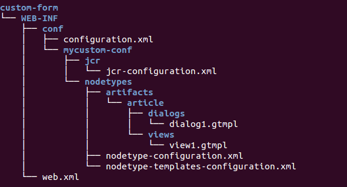
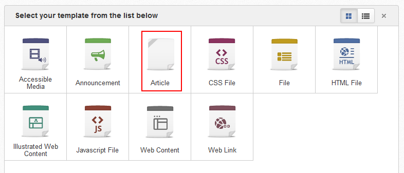
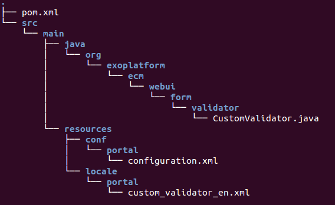
.. |image3| image:: images/top_navigation_bar_icon.png
.. |image4| image:: images/edit_user_icon.png
.. |image5| image:: images/edit_user_icon.png
.. |image6| image:: images/top_navigation_bar_icon.png
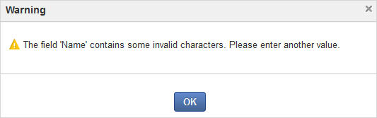
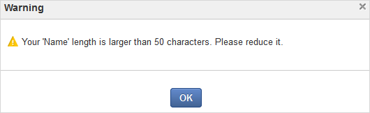
.. |image9| image:: images/ExampleTypesOfColumns.png

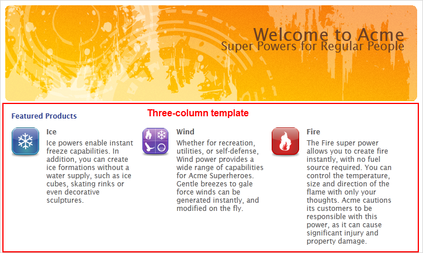
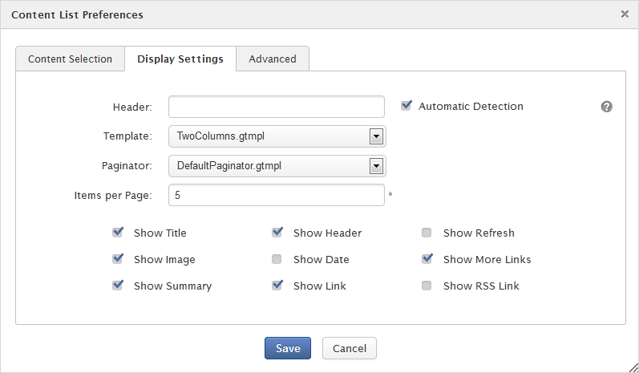
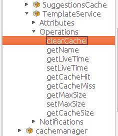
.. |image14| image:: images/NewSite.png
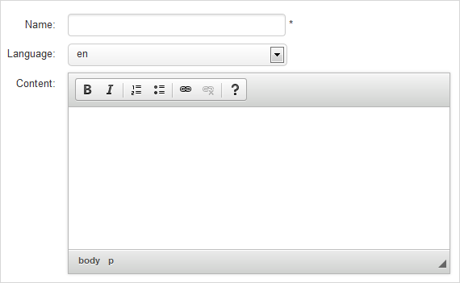
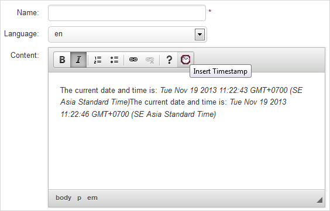
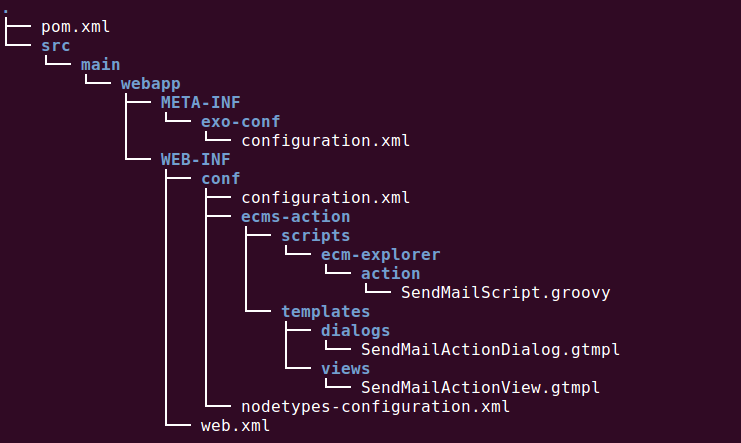
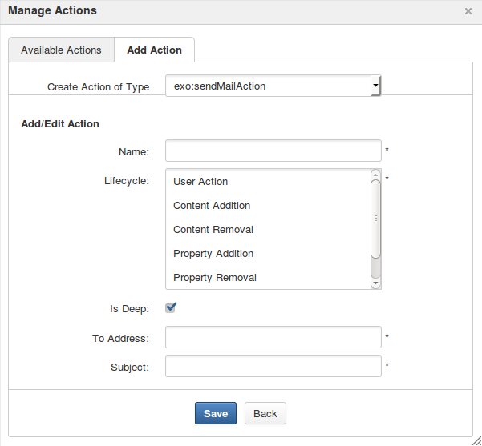
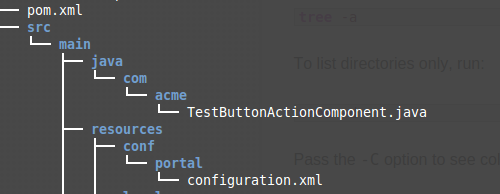
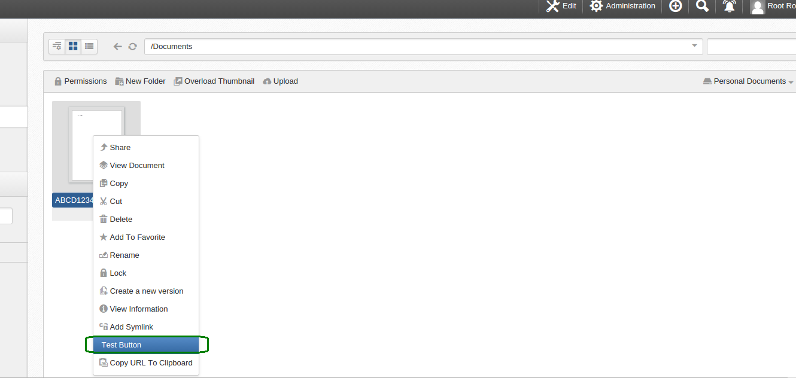
