.. _Customizing_site:

######################
Customizing Your Site
######################

    When working with eXo Platform, it is important not to modify the source
    code. This will ensure compatibility with future upgrades, and
    support will be simplified. To customize your site, you need to
    create an extension project by providing your own artifacts as a set
    of wars/jars/ears.

    This chapter will show you how to customize your site using the
    :ref:`extension mechanism <PLFDevGuide.eXoAdd-ons.PortalExtension>`
    provided by eXo Platform.

    -  :ref:`Defining structure of a site <PLFDevGuide.Site.Structure>`
       Required knowledge of a site's structure, including
       ``portal.xml``, ``pages.xml`` and ``navigation.xml``.

    -  :ref:`Creating a new site <PLFDevGuide.Site.CreateNew>`
       Steps to create a new site, how to define a site as default and
       to create custom templates for it.
       
    -  :ref:`Managing features of a new site <PLFDevGuide.Site.Features>`
       How to manage various features of a new site, including
       enabling/disabling the drive creation, adding JavaScript,
       localizing with resources, adding/removing a language, declaring
       a servlet/filter, and creating a custom look and feel. All these
       features are managed through your extension project.

    -  :ref:`Managing eXo Platform look and feel <PLFDevGuide.Site.LookAndFeel>`
       All aspects and detailed steps to create a custom look and feel
       for a site.

    -  :ref:`Upload Component <PLFDevGuide.Site.UploadComponent>`
       How to confugure the upload service.


.. _PLFDevGuide.Site.Structure:

============================
Defining structure of a site
============================

The structure of a site is mainly defined into 3 files: ``portal.xml``,
``pages.xml`` and ``navigation.xml``. You can create multiple pages
within a single site.

Understanding the "Intranet" site of eXo Platform is a good approach to the
site structure. The configuration of the "Intranet" site can be found in
the ``$PLATFORM_TOMCAT_HOME/webapps/acme-intranet.war`` directory.

**portal.xml**

The ``portal.xml`` file describes the layout and portlets that will be
shown on all pages:

-  Properties which define site name, default locale, access and edit
   permissions, and some basic configurations (session alive, show
   portlet information) of the "Intranet" site.

   .. code:: xml

       <portal-name>intranet</portal-name>
       <locale>en</locale>
       <access-permissions>*:/platform/users</access-permissions>
       <edit-permission>*:/platform/administrators</edit-permission>
       <properties>
       <entry key="sessionAlive">onDemand</entry>
       <entry key="showPortletInfo">0</entry>
       </properties>

-  Layout which defines layout container, banner, footer, menu and
   breadcrumbs portlets displayed in all pages. Also, ``<page-body>`` is
   a flag which specifies the position of pages' portlets.

   .. code:: xml

       <portal-layout>
           <move-apps-permissions>*:/platform/administrators</move-apps-permissions>
           <move-containers-permissions>*:/platform/administrators</move-containers-permissions>
           <container id="NavigationBody" template="system:/groovy/portal/webui/container/UITableColumnContainer.gtmpl">
               <access-permissions>Everyone</access-permissions>
               <container id="LeftNavigation" template="system:/groovy/portal/webui/container/UIContainer.gtmpl">
                   <access-permissions>*:/platform/users</access-permissions>
                   <container id="LeftBreadCrumbNavigationPortlet" template="system:/groovy/portal/webui/container/UIContainer.gtmpl">
                       <access-permissions>*:/platform/users</access-permissions>
                       <portlet-application>
                           <portlet>
                               <application-ref>platformNavigation</application-ref>
                               <portlet-ref>UIBreadCrumbsNavigationPortlet</portlet-ref>
                           </portlet>
                           <access-permissions>*:/platform/users</access-permissions>
                           <show-info-bar>false</show-info-bar>
                       </portlet-application>
                   </container>
                   <container id="LeftNavigationPortlet" template="system:/groovy/portal/webui/container/UIContainer.gtmpl">
                       <access-permissions>*:/platform/users</access-permissions>
                       <portlet-application>
                           <portlet>
                               <application-ref>platformNavigation</application-ref>
                               <portlet-ref>UICompanyNavigationPortlet</portlet-ref>
                           </portlet>
                           <access-permissions>*:/platform/users</access-permissions>
                           <show-info-bar>false</show-info-bar>
                       </portlet-application>
                   </container>
                   <container id="GroupsNavigationPortlet" template="system:/groovy/portal/webui/container/UIContainer.gtmpl">
                       <access-permissions>*:/platform/users</access-permissions>
                       <portlet-application>
                           <portlet>
                               <application-ref>platformNavigation</application-ref>
                               <portlet-ref>UIGroupsNavigationPortlet</portlet-ref>
                           </portlet>
                           <access-permissions>*:/platform/users</access-permissions>
                           <show-info-bar>false</show-info-bar>
                       </portlet-application>
                   </container>
                   <container id="SpaceNavigationPortlet" template="system:/groovy/portal/webui/container/UIContainer.gtmpl">
                       <access-permissions>*:/platform/users</access-permissions>
                       <portlet-application>
                           <portlet>
                               <application-ref>platformNavigation</application-ref>
                               <portlet-ref>UISpaceNavigationPortlet</portlet-ref>
                           </portlet>
                           <access-permissions>*:/platform/users</access-permissions>
                           <show-info-bar>false</show-info-bar>
                       </portlet-application>
                   </container>
               </container>
               <container id="RightBody" template="system:/groovy/portal/webui/container/UIContainer.gtmpl">
                   <access-permissions>Everyone</access-permissions>
                   <page-body> </page-body>
               </container>
           </container>
       </portal-layout>

.. note:: The ``move-apps-permissions`` and ``move-containers-permissions``
          tags define which users have permissions to move applications and
          containers on this layout. If these permissions are not set
          explicitly, they would default to *Everyone*.

**navigation.xml**

The ``navigation.xml`` file defines all navigation nodes of a site. The
syntax is simply using the nested node tags. Each node refers to a page
defined in the ``pages.xml`` file that will be explained later.

-  Node that defines URI, name, label and page reference of the
   "Intranet" homepage.

   .. code:: xml

       <node>
           <uri>home</uri>
           <name>home</name>
           <label>#{portal.intranet.home}</label>
           <page-reference>portal::intranet::homepage</page-reference>
       </node>

-  A node navigation might contain sub-nodes.

   .. code:: xml

       <node>
           <uri>connections</uri>
           <name>connections</name>
           <label>#{portal.intranet.connections}</label>
           <visibility>SYSTEM</visibility>
           <node>
               <uri>connections/all-people</uri>
               <name>all-people</name>
               <label>#{portal.intranet.yours}</label>
               <page-reference>portal::intranet::all-people</page-reference>
           </node>
           <node>
               <uri>connections/network</uri>
               <name>network</name>
               <label>#{portal.intranet.yours}</label>
               <page-reference>portal::intranet::network</page-reference>
           </node>
           ...
       </node>

.. note:: -  For the top nodes, the URI and the navigation node name must have the same value.

          -  For sub-nodes, the URI is composed like **<uri>connexions/all-people</uri>** where 'connections' is the name of the parent node, and 'all-people' is the name of node (**<name>all-people</name>**).

-  When you configure the ``navigation.xml`` file, sometimes you need to
   set the node visibility. To configure the node visibility, simply put
   **<visibility>type\_of\_visibility</visibility>** as a child of the
   **<node>** tag.

   eXo Platform supports 4 types of node visibility, including:

   -  **DISPLAYED**: The node will be displayed.

   -  **HIDDEN**: The node is not visible in the navigation but can be
      accessed directly with its URL.

   -  **SYSTEM**: It is a system node which is visible to superusers. In
      particular, only superusers can change or delete this system node.

   -  **TEMPORAL**: The node is displayed in related time range. When
      the visibility of TEMPORAL node is configured, the start and end
      dates can be specified by using **<startpublicationdate>** and
      **<endpublicationdate>**.

**pages.xml**

The ``pages.xml`` defines the layout and portlets of specific pages. A
page defined in ``pages.xml`` will declare name, title, access and edit
permissions, move applications and containers (optional). Also, the
``<portlet-application>`` is used to declare portlets in a page.

.. code:: xml

    <page>
        <name>activities</name>
        <title>Activities</title>
        <access-permissions>*:/platform/users</access-permissions>
        <edit-permission>manager:/platform/administrators</edit-permission>
        <move-apps-permissions>manager:/platform/administrators</move-apps-permissions>
        <move-containers-permissions>manager:/platform/administrators</move-containers-permissions>
        <container id="UIUserNavigationPortlet" template="system:/groovy/portal/webui/container/UIContainer.gtmpl">
            <access-permissions>*:/platform/users</access-permissions>
            <move-apps-permissions>manager:/platform/administrators</move-apps-permissions>
            <move-containers-permissions>manager:/platform/administrators</move-containers-permissions>
            <portlet-application>
                <portlet>
                    <application-ref>platformNavigation</application-ref>
                    <portlet-ref>UIUserNavigationPortlet</portlet-ref>
                </portlet>
                <title>User Navigation Portlet</title>
                <access-permissions>*:/platform/users</access-permissions>
                <show-info-bar>false</show-info-bar>
                <show-application-state>true</show-application-state>
            </portlet-application>
        </container>
        <container id="ProfileActivity" template="system:/groovy/portal/webui/container/UIContainer.gtmpl">
            <access-permissions>*:/platform/users</access-permissions>
            <move-apps-permissions>manager:/platform/administrators</move-apps-permissions>
            <move-containers-permissions>manager:/platform/administrators</move-containers-permissions>
            <portlet-application>
                <portlet>
                    <application-ref>social-portlet</application-ref>
                    <portlet-ref>UserActivityStreamPortlet</portlet-ref>
                </portlet>
                <title>User Activity Stream</title>
                <access-permissions>*:/platform/users</access-permissions>
                <show-info-bar>false</show-info-bar>
                <show-application-state>true</show-application-state>
            </portlet-application>
        </container>
    </page>


.. _PLFDevGuide.Site.CreateNew:

===================
Creating a new site
===================

In this tutorial you create your own site using a
:ref:`custom-extension <PLFDevGuide.eXoAdd-ons.PortalExtension>`.

The custom extension requires a *jar* and a *war*, so make sure you
follow the link above to create and deploy the *jar*. Below are steps to
create the *war*. Notice the webapp name is *site-extension* to
configure it properly in the *jar*.

1. Create the webapp ``site-extension.war``:

   |image0|

   -  The ``portal`` folder name indicates that the site is of *portal*
      type.

   -  The ``site1`` folder name will attend in the URL of the created 
      site. If you change it here, you need to change it everywhere in 
      the later configuration.

2. Edit ``web.xml``:

   .. code:: xml

		<?xml version="1.0" encoding="UTF-8"?>
		<web-app version="3.0" metadata-complete="true"
		  xmlns="http://java.sun.com/xml/ns/javaee" xmlns:xsi="http://www.w3.org/2001/XMLSchema-instance"
		  xsi:schemaLocation="http://java.sun.com/xml/ns/javaee http://java.sun.com/xml/ns/javaee/web-app_3_0.xsd">
		  <display-name>site-extension</display-name>
		  <listener>
			<listener-class>org.exoplatform.container.web.PortalContainerConfigOwner</listener-class>
		  </listener>
		</web-app>

3. Edit ``configuration.xml`` to import site definition configuration:

   .. code:: xml

		<?xml version="1.0" encoding="ISO-8859-1"?>
		<configuration
		   xmlns:xsi="http://www.w3.org/2001/XMLSchema-instance"
		   xsi:schemaLocation="http://www.exoplatform.org/xml/ns/kernel_1_2.xsd http://www.exoplatform.org/xml/ns/kernel_1_2.xsd"
		   xmlns="http://www.exoplatform.org/xml/ns/kernel_1_2.xsd">
		  <import>war:/conf/sites-definition.xml</import>
		</configuration>

4. Edit ``sites-definition.xml`` to declare your site(s) to the portal:

   .. code:: xml

		<?xml version="1.0" encoding="ISO-8859-1"?>
		<configuration
		   xmlns:xsi="http://www.w3.org/2001/XMLSchema-instance"
		   xsi:schemaLocation="http://www.exoplatform.org/xml/ns/kernel_1_2.xsd http://www.exoplatform.org/xml/ns/kernel_1_2.xsd"
		   xmlns="http://www.exoplatform.org/xml/ns/kernel_1_2.xsd">
		  <external-component-plugins>
			<target-component>org.exoplatform.portal.config.UserPortalConfigService</target-component>
			<component-plugin>
			  <name>new.portal.config.user.listener</name>
			  <set-method>initListener</set-method>
			  <type>org.exoplatform.portal.config.NewPortalConfigListener</type>
			  <description></description>
			  <init-params>
				<value-param>
				  <name>override</name>
				  <description></description>
				  <value>true</value>
				</value-param>
				<object-param>
				  <name>portal.configuration</name>
				  <description></description>
				  <object type="org.exoplatform.portal.config.NewPortalConfig">
					<field name="predefinedOwner">
					  <collection type="java.util.HashSet">
					  <!-- You can declare many sites here -->
					  <value><string>site1</string></value>
					  <!--<value><string>site2</string></value>-->
					  </collection>
					</field>
					<field name="ownerType">
					  <string>portal</string>
					</field>
					<field name="templateLocation">
					  <string>war:/conf/sites</string>
					</field>
					<field name="importMode">
					  <string>merge</string>
					</field>
				  </object>
				</object-param>
			  </init-params>
			</component-plugin>
		  </external-component-plugins>
		</configuration>

5. Edit ``site1/portal.xml``:

   .. code:: xml

		<portal-config>
		  <portal-name>site1</portal-name>
		  <locale>en</locale>
		  <access-permissions>*:/platform/users</access-permissions>
		  <edit-permission>*:/platform/administrators</edit-permission>
		  <properties>
			<entry key="sessionAlive">never</entry>
			<entry key="showPortletInfo">1</entry>
		  </properties>
		  <portal-layout>
			<move-apps-permissions>manager:/platform/administrators</move-apps-permissions>
			<move-containers-permissions>manager:/platform/administrators</move-containers-permissions>
			<page-body> </page-body>
		  </portal-layout>
		</portal-config>
		
	

	-  ``<locale>``: Defines the default language of your site.

	-  ``<access-permissions>``: Specifies which membership(s) can access
	   your site. Use comma to separate values.

	-  ``<edit-permission>``: Specifies which membership can edit your site.
	   Single value only.

	-  ``<move-apps-permissions>``: Specifies which membership(s) can move
	   applications on your site. Use comma to separate values.

	-  ``<move-containers-permissions>``: Specifies which membership(s) can
	   move containers on your site. Use comma to separate values.

	-  ``<properties>``: See `Keep session alive <#KeepSessionAlive>`__ and
	   `Show info bar by default <#ShowInfoBarByDefault>`__ for details.

	-  ``<portal-layout>``: This is the simplest layout that contains only
	   the <page-body>. You will write more complete layout later.

6. Edit ``site1/navigation.xml``. In this example, only the homepage is
   defined:

   .. code:: xml

		<node-navigation xmlns:xsi="http://www.w3.org/2001/XMLSchema-instance"
		  xsi:schemaLocation="http://www.gatein.org/xml/ns/gatein_objects_1_2 http://www.gatein.org/xml/ns/gatein_objects_1_2"
		  xmlns="http://www.gatein.org/xml/ns/gatein_objects_1_2">
		  <priority>1</priority>
		  <page-nodes>
			<node>
			  <uri>home</uri>
			  <name>home</name>
			  <label>Home Page</label>
			  <page-reference>portal::site1::homepage</page-reference>
			</node>
		  </page-nodes>
		</node-navigation>


	-  ``<page-reference>``: Assigns the node to a page. The format is
		*{site-type}::{site-name}::{page-name}*.

7. Edit ``site1/pages.xml``. In this example, only one page (*homepage*) 
   is created. The page contains GettingStartedPortlet that is a 
   built-in portlet.

   .. code:: xml

		<page-set xmlns:xsi="http://www.w3.org/2001/XMLSchema-instance"
		xsi:schemaLocation="http://www.gatein.org/xml/ns/gatein_objects_1_2 http://www.gatein.org/xml/ns/gatein_objects_1_2"
		  xmlns="http://www.gatein.org/xml/ns/gatein_objects_1_2">
		  <page>
			<name>homepage</name>
			<title>Home Page</title>
			<access-permissions>*:/platform/users</access-permissions>
			<edit-permission>*:/platform/administrators</edit-permission>
			<move-apps-permissions>manager:/platform/administrators</move-apps-permissions>
			<move-containers-permissions>manager:/platform/administrators</move-containers-permissions>
			<portlet-application>
			  <portlet>
				<application-ref>homepage-portlets</application-ref>
				<portlet-ref>GettingStartedPortlet</portlet-ref>
			  </portlet>
			  <title>Getting Started</title>
			  <access-permissions>*:/platform/users</access-permissions>
			  <show-info-bar>false</show-info-bar>
			  <show-application-state>false</show-application-state>
			  <show-application-mode>false</show-application-mode>
			</portlet-application>
		  </page>
		</page-set>

8. Deploy your extension, then test your site at `http://mycompany.com:8080/portal/site1/ <http://mycompany.com:8080/portal/mysite/>`__.

.. note:: Note that the ``override`` value-param should be set to *true*. This
          will be explained in the :ref:`next section <PLFDevGuide.Site.CreateNew.RedeploySiteExtension>`.
          
          
.. _PLFDevGuide.Site.CreateNew.RedeploySiteExtension:          
          
Redeploying your site extension
~~~~~~~~~~~~~~~~~~~~~~~~~~~~~~~~

The sites are created during portal initialization, that is, when the
server starts for the first time. So if you deploy your extension after
that, your extension should trigger a re-initialization process, by
setting the ``override`` value-param to *true* as said before:

.. code:: xml

    <value-param>
        <name>override</name>
        <description></description>
        <value>true</value>
    </value-param>

If this parameter is omitted, it is defaulted to *false*.

After your site is created, its preferences persists in database. When
you modify your extension and redeploy it, you need to set
``importMode`` to either *merge* or *overwrite* to make your extension
update/override the persistent data; otherwise, the modification will
not take effect.

The `valid
options <https://github.com/exoplatform/gatein-portal/blob/stable/5.0.x/component/portal/src/main/java/org/exoplatform/portal/mop/importer/ImportMode.java>`__
of ``importMode``:

+-------------------+--------------------------------------------------------+
| importMode        | Description                                            |
+===================+========================================================+
| conserve          | Imports data when it does not exist, otherwise do      |
|                   | nothing.                                               |
+-------------------+--------------------------------------------------------+
| insert            | Imports data when it does not exist, otherwise         |
|                   | performs a strategy that adds new data only.           |
+-------------------+--------------------------------------------------------+
| merge             | Imports data when it does not exist, and updates data  |
|                   | when it exists.                                        |
+-------------------+--------------------------------------------------------+
| overwrite         | Overwrites whatever data.                              |
+-------------------+--------------------------------------------------------+


.. _PLFDevGuide.Site.CreateNew.SettingDefaultSite:

Setting your site as default site
~~~~~~~~~~~~~~~~~~~~~~~~~~~~~~~~~~

When entering this URL in your browser:
http://mycompany.com:8080/portal, you will be directed to a default
site.

To configure your site as default, add the following content to
``sites-definition.xml``, inside **<init-params>**:

.. code:: xml

    <value-param>
        <name>default.portal</name>
        <description></description>
        <value>mysite</value>
    </value-param>

.. note:: Note that the **<value-param>** tags should be added right after the **<init-params>** opening tag.


.. _PLFDevGuide.Site.CreateNew.DriveAutoCreation:

Enabling/Disabling a drive creation
~~~~~~~~~~~~~~~~~~~~~~~~~~~~~~~~~~~~

During the site creation, a drive with the same name as the site is also
automatically created. However, you can decide if such a drive is
automatically created or not by using two parameters named
**autoCreatedDrive**, and **targetDrives** in the external component
plugin named **CreateLivePortalEventListener**.

.. code:: xml

    <external-component-plugins>
        <target-component>org.exoplatform.services.listener.ListenerService</target-component>
        <component-plugin>
            <name>org.exoplatform.portal.config.DataStorage.portalConfigCreated</name>
            <set-method>addListener</set-method>
            <type>org.exoplatform.services.wcm.portal.listener.CreateLivePortalEventListener</type>
            <description>this listener creates a new live portal content storage.</description>
            <init-params>
                <value-param>
                    <name>autoCreatedDrive</name>
                    <description>A drive will be automatically created during the portal creation.</description>
                    <value>false</value>
                </value-param>
                <values-param>
                    <name>targetDrives</name>
                    <description>The list of drives which are automatically created during the portal creation with
                        "autoCreatedDrive=false".
                    </description>
                    <value>acme</value>
                </values-param>
            </init-params>
        </component-plugin>
    </external-component-plugins>

-  If **autoCreatedDrive=true**, a drive will be automatically created
   during the portal creation regardless of **targetDrives**. In case
   **autoCreatedDrive** is not specified, then its default value is
   **true**.

-  If **autoCreatedDrive=false**, only drives listed in **targetDrives**
   are created. In case **targetDrives** is not specified, no drives are
   created.

.. _PLFDevGuide.Site.CreateNew.PageContainerTemplate:

Creating page container template
~~~~~~~~~~~~~~~~~~~~~~~~~~~~~~~~~

Page container templates are Groovy ones that are used for (but not
limited to) page decoration. You can re-use the built-in templates or
write your own templates and package them in the site-extension.

By declaring a template in *pages.xml*, you decorate the individual
pages. By declaring a template in *portal.xml*, you make the site layout
that impacts all the pages of the site.

You can learn some templates in
``portal.war!/groovy/portal/webui/container/``. In this tutorial the
templates are not much more than this code:

::

    <%uicomponent.renderChildren();%>

1. Add the templates to your site extension so that it contains:

   |image1|

2. Edit ``portal.xml`` to make the site layout:

   .. code:: xml

		<portal-layout>
			<container id="MySiteLayoutContainer" template="war:/groovy/container/MySiteLayoutContainer.gtmpl">
				<page-body> </page-body>
			</container>
		</portal-layout>

3. Edit ``pages.xml`` to place the Getting Started portlet into a
   container:

   .. code:: xml

		<page>
			...
			<container id="MyPageContainer" template="war:/groovy/container/MyPageContainer.gtmpl">
				<move-apps-permissions>*:/platform/administrators</move-apps-permissions>
				<move-containers-permissions>*:/platform/administrators</move-containers-permissions>
				<portlet-application>
					<portlet>
						<application-ref>homepage-portlets</application-ref>
						<portlet-ref>GettingStartedPortlet</portlet-ref>
					</portlet>
					<title>Getting Started</title>
					<access-permissions>*:/platform/users</access-permissions>
					<show-info-bar>false</show-info-bar>
					<show-application-state>false</show-application-state>
					<show-application-mode>false</show-application-mode>
				</portlet-application>
			</container>
			...
		</page>

4. Edit ``MySiteLayoutContainer.gtmpl``:

   ::

		<div style="background-color: navy; font-size: 18px; padding: 15px; color: white">
		  <span>ACME Intranet</span>
		</div>
		<div>
		  <%uicomponent.renderChildren();%>
		</div>
		<div style="text-align: center; background-color: wheat; border-bottom-left-radius: 7px; border-bottom-right-radius: 7px">
		  <span style="font-style: italic">Powered by eXo Platform</span>
		</div>

5. Edit ``MyPageContainer.gtmpl``:

   ::

		<div style="border: 3px solid deepskyblue">
		  <%uicomponent.renderChildren();%>
		</div>

After redeploying the site extension, test the decoration of the page
(navy and wheat blocks for site layout, and the blue border for the page
container):

|image2|

.. _PLFDevGuide.Site.Features:

===============================
Managing features of a new site
===============================

After creating a new site, you need to manage some common features,
including:

-  :ref:`Adding JavaScript to your site <PLFDevGuide.Site.Features.JavaScript>`
   How to add JavaScript to your site, details about JavaScript modules
   and specific usecases.

-  :ref:`Localizing with resources <PLFDevGuide.Site.Features.Localization>`
   How to localize with resources in your custom extension.

-  :ref:`Adding/Removing a language <PLFDevGuide.Site.Features.Languages>`
   How to add or remove a language through the locale configuration
   file.

-  :ref:`Declaring servlet/filter <PLFDevGuide.Site.Features.ServletFilter>`
   How to declare the servlet/filter extension to get the current
   portal.

-  :ref:`Creating a custom search connector <PLFDevGuide.Site.Features.SearchConnector>`
   How to create a custom search connector to get data from an external
   resource, for example Wikipedia.

-  :ref:`Creating a page layout template <PLFDevGuide.Site.Features.PageLayoutTemplate>`
   How to create a page layout template that is used in Page Creation
   Wizard.


.. _PLFDevGuide.Site.Features.JavaScript:

Adding JavaScript to your site
~~~~~~~~~~~~~~~~~~~~~~~~~~~~~~~

eXo Platform comes with some very powerful JavaScript management
capabilities. You can easily control how your own JavaScript files are
included in your site's pages and manage their dependencies.

Most of these capabilities can be done with some declarations in the
``gatein-resources.xml`` file of your extension.

**Adding JavaScript to all pages of a site**

This usecase is used when you want to add JavaScript to all pages of a
site named "my-site":

.. code:: xml

    <portal>
        <name>my-site</name>
        <module>
            <script>
                <path>/bar.js</path>
            </script>
        </module>
    </portal>

**Adding JavaScript to a page when its portlet is displayed**

This usecase is used when you want to add JavaScript to a portlet named
"my-portlet".

.. code:: xml

    <portlet>
        <name>my-portlet</name>
        <module>
            <script>
                <path>/bar.js</path>
            </script>
        </module>
    </portlet>

**JavaScript modules**

The eXo Platform JavaScript improvements are built on top of the notion of
JavaScript module. JavaScript does not provide a natural way for
namespacing and the notion of module was designed to solve this problem.
Namespacing can be perceived as a natural lack, however this lack should
be seen as an advantage as modules provide more and more namespacing.
Indeed, the module pattern allows creating and resolving dependencies
between modules at runtime on demand and loading JavaScript resources in
parallel.

The notion of module can be viewed as:

-  An identifier or name.

-  A list of dependencies on the modules required to work properly.

-  The code packaged is usually expressed as a self-executing function.
   The product, which is an object produced by the module, is usually
   consumed by other modules.

At runtime, the dependency system defines a graph of function to execute
that makes the product of each module be injected in the other modules.
It can be seen as a simple dependency injection system which can load
modules in an asynchronous and parallel fashion providing parallel
loading, namespacing and dependency management.

.. note:: See :ref:`JavaScript Development <#sect-Reference_Guide-Javascript_Development>` for further information about JavaScript.

When adding JavaScript to your site, you need to consider the following
specific usecases:

-  :ref:`Declaring an eXo Platform module <PLFDevGuide.Site.Features.JavaScript.DeclaringeXoPlatformModule>`

-  :ref:`Declaring an AMD module <PLFDevGuide.Site.Features.JavaScript.DeclaringAMDModule>`

-  :ref:`Using eXo Platform jQuery module <PLFDevGuide.Site.Features.JavaScript.UsingeXoPlatformjQueryModule>`

-  :ref:`Using a custom jQuery version <PLFDevGuide.Site.Features.JavaScript.UsingCustomjQueryVersion>`

-  :ref:`Configuring jQuery plugins <PLFDevGuide.Site.Features.JavaScript.ConfiguringjQueryPlugins>`

-  :ref:`Exposing version of jQuery globally <PLFDevGuide.Site.Features.JavaScript.ExposingjQueryVersionGlobally>`

-  :ref:`Implementing a global jQuery plugin <PLFDevGuide.Site.Features.JavaScript.ImplementingGlobaljQueryPlugin>`

-  :ref:`Using CommonJS modules <PLFDevGuide.Site.Features.JavaScript.UsingCommonJSModules>`

-  :ref:`Using Mustache.js module <PLFDevGuide.Site.Features.JavaScript.UsingMustacheJSModule>`

-  :ref:`Using Text.js module <PLFDevGuide.Site.Features.JavaScript.UsingTestJSModule>`

-  :ref:`Overriding the dependency of a native AMD module <PLFDevGuide.Site.Features.JavaScript.OverridingDependencyNativeAMDModule>`

-  :ref:`Accessing a module from a script <PLFDevGuide.Site.Features.JavaScript.AccessingModuleFromScript>`

-  :ref:`Disabling minification <PLFDevGuide.Site.Features.JavaScript.MinifyOption>`

Declaring an eXo Platform module
---------------------------------

This part takes the
`Highlight.js <http://softwaremaniacs.org/soft/highlight/en/>`__ library
as an example to show you how to declare an eXo Platform module. This library
is actually a ``jQuery`` plugin which follows the self-invoking pattern
that consumes the ``jquery`` dependency as $. Here is an overview of the
``Highlight.js`` source:

.. code:: JavaScript

    (function($) {
              ...
    }(jQuery)

Assume that you have added it to the ``javascript`` folder in your
extension, and now declare this module using the XML declaration in
``/WEB-INF/gatein-resources.xml`` as follows:

.. code:: xml

    <module>
      <name>highlight</name>
      <script>
        <path>/javascript/highlight/highlight.js</path>
      </script>
      <depends>
        <module>jquery</module>
        <as>jQuery</as>
      </depends>
    </module>

The module is named ``highlight`` and uses the
``/javascript/highlight/highlight.js`` source code bundled in the
``war`` file.

The ``depends`` tag creates a dependency on the ``jquery`` module. The
dependency is aliased as jQuery using the ``as`` tag to match the $
argument of the ``Highlight.js`` self-executing function. Refer
`here <#PLFDevGuide.Site.Features.JavaScript.UsingeXoPlatformjQueryModule>`__
to check which jQuery versions are provided in eXo Platform.

Declaring an AMD module
-----------------------

eXo Platform is capable of integrating native AMD (Asynchronous Module
Definition) modules, and eXo Platform modules are currently translated into
AMD modules. To further understand the AMD declaration, see the
`RequireJS <http://requirejs.org/docs/api.html#define>`__ documentation.

AMD modules follow the pattern as below:

.. code:: JavaScript

    define("module", ["dependency1",...,"dependencyN"],
     function(dep1,...,depN) {
    });

eXo Platform can use such a module out of the box, however some parts will be
overridden by the declaration in ``gatein-resources.xml``:

-  The "``module``\ " name will be ignored and replaced with the
   declared module name.

   The module dependencies from "``dependency1``\ " to
   "``dependencyN``\ " have to be declared with the same name in
   ``gatein-resources.xml``.

-  Assuming that the dependencies from ``dependency1`` to
   ``dependencyN`` have been declared in XML, such module definition can
   be declared with the following XML:

   .. code:: xml

       <module>
         <name>MyModule</name>
         ...
         <depends>
           <module>dependency1</module>
         </depends>
         ...
         <depends>
           <module>dependencyN</module>
         </depends>
       </module>

Using eXo Platform jQuery module
---------------------------------

eXo Platform provides the jQuery library 3.2.1 as a jquery module, the
configuration of this module can be found in the ``eXoResources.war``
file. To reuse this jQuery version, just declare a dependency over it:

.. code:: xml

    <portlet>
      <name>RequireJSPortlet</name>
      <module>
        <depends>
          <module>jquery</module>
        </depends>
    </portlet>

The default ``jquery`` module alias is $, so if you are using it, it
should be named $ in the self-executing function:

If your library uses a different name, such as jQuery, the XML ``as``
tag should be used:

.. code:: xml

    <portlet>
      <name>RequireJSPortlet</name>
      <module>
        <depends>
          <module>jquery</module>
          <as>jQuery</as>
        </depends>
    </portlet>

With the following self-executing function:

.. code:: JavaScript

    (function($) {
        ...
    }(jQuery)

Using a custom jQuery version
-----------------------------

If you are not satisfied with the jQuery version provided by eXo Platform,
you can integrate your desired version. It is common that products built
over eXo Platform depend on the third party JavaScript frameworks depending
on other versions of jQuery libraries, so deploying other jQuery
libraries is unavoidable at some points. Multiple jQuery instances
within a web page conflict with global variables, however the module
system allows you to use such a library with no hassles.

The following example is about a jQueryPortlet using jQuery version
1.6.4, which is configured properly:

.. code:: xml

    <module>
      <name>jquery-1.6.4</name>
      <script>
        <adapter>
    (function() {
      <include>/javascript/jquery-1.6.4.js</include>
      return jQuery.noConflict(true);
    })();
        </adapter>
      </script>
    </module>
    <portlet>
        <name>jQueryPortlet</name>
            <module>
                <script>
                    <path>/javascript/MyJSFile.js</path>
                    ...
                </script>
                <depends>
                    <module>jquery-1.6.4</module>
                    <as>$</as>
                </depends>
            </module>
    </portlet>

.. note:: Return to the beginning part of the :ref:`Adding JavaScript to your site <PLFDevGuide.Site.Features.JavaScript>` section to learn about use of JavaScript in eXo Platform.

Configuring jQuery plugins
--------------------------

This section shows you how to configure a jQuery plugin and how to use
it in the ``jQueryPluginPortlet`` portlet.

1. Use the jQuery plugin as a minimal one:

   .. code:: javascript

		(function($) {
		 $.fn.doesPluginWork = function() {
			alert('YES, it works!');
		 };
		})(jQuery);

2. Declare it as a module:

   .. code:: xml

		<module>
		  <name>jquery-plugin</name>
		  <as>jqPlugin</as>
		  <script>
			<path>/jqueryPlugin/jquery-plugin.js</path>
		  </script>
		  <depends>
			<module>jquery</module>
			<as>jQuery</as>
		  </depends>
		</module>

3. Use this plugin in your portlet:

   .. code:: xml

		<portlet>
		  <name>jQueryPluginPortlet</name>
		  <module>
			<script>
			  <path>/jqueryPlugin/jqueryPluginPortlet.js</path>
			</script>
			<depends>
			  <module>jquery</module>
			  <as>$</as>
			</depends>
			<depends>
			  <module>jquery-plugin</module>
			</depends>
		  </module>
		</portlet>

.. note:: Your portlet module should depend on the jquery and you need to declare:

		  -  The dependency on ``jquery`` that allows using the jQuery object.

		  -  The dependency on ``jquery-plugin`` that ensures the plugin to be loaded in the ``jquery`` dependency before it is injected in the portlet module.

Exposing version of jQuery globally
-----------------------------------

The built-in jQuery is currently declared as an AMD module. By default,
jQuery will not be available in the window object of the browser. This
section shows how to make jQuery available so you can write a code like
in a plain script.

The following script will make jQuery available by mounting the jQuery
object in the window object:

::

    require( ["SHARED/jquery"], function($) {
      // the '$' in window.$ is alias, you can make the other for yourself.
      window.$ = $;
    });

This script must be integrated as a shared script:

.. code:: xml

    <scripts>
      <name>imediatejs</name>
      <script>
        <path>/myfolder/imediateJScript.js</path>
      </script>
    </scripts>

A portlet can then provide its own script on which it depends:

.. code:: xml

    <portlet>
      <name>foo</name>
      <script>
        <name>portletjs</name>
        <path>/myfolder/portlet.js</path>
      </script>
      <depends>
        <scripts>imediatejs</scripts>
      </depends>
    </scripts>

With the following JavaScript:

::

    $("#foo").html("<h1>hello global jQuery</h1>");

Implementing a global jQuery plugin
-----------------------------------

There are a few ways to implement the usage of a global jQuery plugin.
However, make sure that the global jQuery is available before the global
jQuery plugin is loaded.

As you have seen before how you can scope a module to a portlet, the
module will be loaded when the portlet is on a page using the
``PORTLET`` scope. Accordingly, use the ``PORTAL`` scrope instead of
``PORTLET``. The main difference is that the loading of your plugin will
be triggered on a specific site instead of a specific portlet.

1. Create the ``jQuery`` plugin as a script named ``myPlugin.js`` and
   integrate it to your plugin:

   ::

		require(["SHARED/jquery"], function($) {
		  $.fn.myPluginFunction = function() {
			// Your work here;
		  };
		});

2. Bind the script in the site and reuse the ``immediatejs`` script seen
   before:

   .. code:: xml

		<portal>
		  <name>classic</name>
		  <scripts>
			<script>
			  <name>myPlugin</name>
			  <path>/myfolder/myPlugin.js</path>
			</script>
			<script>
			  <name>imediatejs</name>
			  <path>/myfolder/imediateJScript.js</path>
			</script>
		  </scripts>
		</portal>

Now, your plugin is globally available and you can use it:

::

    <script type="text/javascript">
    $('#foo').myPluginFunction();
    </script>

Using CommonJS modules
----------------------

CommonJS defines its `own module
format <http://wiki.commonjs.org/wiki/Modules/1.1>`__, although it is
not supported by eXo Platform. The adapter format can be used to adapt
CommonJS modules to work well in eXo Platform.

Here are two simple CommonJS modules:

-  ``math.js``

   .. code:: javascript

       exports.add = function() {
         var sum = 0, i = 0, args = arguments, l = args.length;
         while (i < l) {
           sum += args[i++];
         }
         return sum;
       };

-  ``increment.js``

   .. code:: javascript

       var add = require('math').add;
       exports.inc = function(val) {
         return add(val, 1);
       };

CommonJS modules use their required function which conflicts with the
RequireJS same function. So, to make it work in the AMD enabled
environment, these modules need to be wrapped and injected predefined
modules: ``require``, ``exports`` and ``module`` provided by Requirejs
(See the details `here <http://requirejs.org/docs/commonjs.html>`__).
eXo Platform will wrap the code basing on the configuration using the adapter
format:

.. code:: xml

    <module>
      <name>math</name>
      <script>
        <adapter>
          define(["require", "exports"], function(require, exports) {
          <include>/commonjs/math.js</include>
          });
        </adapter>
      </script>
      <depends>
        <module>require</module>
      </depends>
      <depends>
        <module>exports</module>
      </depends>
    </module>
    <module>
      <name>increment</name>
      <script>
        <adapter>
          define(["require", "exports", "math"], function(require, exports) {
          <include>/commonjs/increment.js</include>
          });
        </adapter>
      </script>
      <depends>
        <module>require</module>
      </depends>
      <depends>
        <module>exports</module>
      </depends>
      <depends>
        <module>math</module>
      </depends>
    </module>

Using Mustache.js module
------------------------

`Mustache.js <https://github.com/janl/mustache.js>`__ is a popular
JavaScript template engine. Mustache is written to be executed in
several kinds of environment as a global object, a CommonJS module, or
as a native AMD module. If the "``module``\ ", "``exports``\ "
dependencies are available, Mustache will register it as a CommonJS
module. It can be adapted to eXo Platform thanks to the adapter format:

.. code:: xml

    <module>
      <name>mustache</name>
      <script>
        <adapter>
    define(["require", "exports", "module"], function(require, exports, module) {
      <include>/requirejs/js/plugins/mustache.js</include>
    });
        </adapter>
      </script>
      <depends>
        <module>require</module>
      </depends>
      <depends>
        <module>exports</module>
      </depends>
      <depends>
        <module>module</module>
      </depends>
    </module>

Use the ``adapter`` tag here and declare the ``require``, ``exports``
and ``module`` dependencies of the ``CommonJS`` module. Now any module
can have Mustache instance injected just by declaring it in its
dependencies list:

.. code:: xml

    <module>
      <name>foo</name>
      ...
      <depends>
        <module>mustache</module>
      </depends>
    </module>

.. code:: javascript

    (function(mustache){
    //code that use Mustache
    mustache.render(template);
    })(mustache);

Using Text.js module
--------------------

``RequireJS`` supports the loader plugin which enables a module to be a
plugin and uses the AMD system to load web resources in an efficient
manner.

When there are many templates or the template has a large size,
embedding template in the page is not a good choice for front-end
performance reason. It would be better to use ``Text.js`` to load the
separate template files and inject them as dependencies.

``Text.js`` which is a native AMD module also depends on the module
dependency predefined by the AMD loader. Thanks to the native AMD
support of eXo Platform, it is straightforward to declare and use ``Text.js``
in eXo Platform:

.. code:: xml

    <module>
      <name>text</name>
      <script>
        <path>/requirejs/js/plugins/text.js</path>
      </script>
      <depends>
        <module>module</module>
      </depends>
    </module>

Now you can use the mustache and text modules to load templates and
render them in your own module:

.. code:: xml

    <portlet>
      <name>foo</name>
      <module>
        ...
        <depends>
          <module>mustache</module>
        </depends>
        <depends>
          <module>text</module>
          <as>tmpl</as>
          <resource>/path/to/template.html</resource>
        </depends>
      </module>
    </portlet>

You have the text module in the dependency list with a ``<resource>``
tag, ``Text.js`` will load that resource template and inject it with the
``tmpl`` name. Here is the JavaScript of the portlet:

::

    function(mustache, tmpl) {
      var html = mustache.render(tmpl);
      //append rendered html to DOM
    })(mustache, tmpl);

Overriding the dependency of a native AMD module
------------------------------------------------

While declaring a native AMD module, the module dependency names must
match with the AMD dependencies declared in the ``define`` function
arguments. When there is a mismatch between a module declared in the
native module and the module system of eXo Platform, the ``as`` tag can be
used to rename the dependencies.

There is a ``foo.js`` file defining an AMD module named ``foo`` with two
dependencies ``["dep1", "dep2"]`` as follows:

::

    define("foo", ["dep1", "dep2"], function(a1, a2) {
    // The module
    });

Supposing that the dependencies are declared as ``module1`` and
``module2`` in eXo Platform and the names do not match. To override them, use
the ``as`` tag to rename the dependencies:

.. code:: xml

    <module>
      <name>foo</name>
      <script>
        <path>/path/to/foo.js</path>
      </script>
      <depends>
        <module>module1</module>
        <as>dep1</as>
      </depends>
     <depends>
       <module>module2</module>
       <as>dep2</as>
     </depends>
    </module>

Accessing a module from a script
--------------------------------

Sometimes it is required to access a module from a script, RequireJS
provides such capability by using the ``require`` function to execute a
function in the managed context:

::

    require(["SHARED/ModuleA"], function(a) {
      // Codes of interacting with module A
      a.doSomething();
    });

In such a situation, you need to use the AMD module name of the module
on which you need to depend, this case uses ``PORTLET/ModuleA``. The
prefix in uppercase is the module scope among ``SHARED``, ``PORTLET``
and ``PORTAL``.

Disabling minification
----------------------

In eXo Platform, Javascript scripts declared as modules are minified by
default in order to reduce their size and therefore the data volume when
downloaded in web page.

This minification may lead to conflicts and errors when the script is
incompatible with eXo Platform minifier (Google Closure Compiler).

Starting from eXo Platform 5.0, this minification can be disabled with the
new module attribute 'minify' :

::

    <minify>false</minify>

This option could be set in ``gatein-resources.xml`` in script tag:

::

    <module>
        <name>myModule</name>
         <script>
         <path>/javascript/myScript.js</path>
         <minify>false</minify>
         </script>
    </module>
                

.. note:: We highly recommend to always enable scripts minification. If you
		  have conflicts, take care to not deactivate minification in the
		  whole platform.

To use this new option, the new `XSD 1.4 <www.exoplatform.org/xml/ns/gatein_resources_1_4>`__ 
should be used.

.. _PLFDevGuide.Site.Features.Localization:

Localizing with resources
~~~~~~~~~~~~~~~~~~~~~~~~~~

In your ``custom-extension.war``, if you want to add your own resource
files to support localization, you can do as follows:

1. Add some folders and files to your :ref:`custom extension <PLFDevGuide.eXoAdd-ons.PortalExtension.Howto>` 
   to have:

   ::

		WEB-INF
		|__ classes
		|   |__ locale
		|       |__ portal
		|           |__ sample_en.properties
		|           |__ sample_fr.properties
		|__ conf
		|   |__ configuration.xml
		|   |__ locale-configuration.xml
		|__ web.xml

In this example there are 2 resources for English (*\_en*) and French
(*\_fr*). The resource files can be *.properties* or *.xml*.

It is necessary that the resources are located in ``WEB-INF/classes``.

2. Edit ``locale-configuration.xml`` to configure ResourceBundleService:

   .. code:: xml

		<configuration
		   xmlns:xsi="http://www.w3.org/2001/XMLSchema-instance"
		   xsi:schemaLocation="http://www.exoplatform.org/xml/ns/kernel_1_2.xsd http://www.exoplatform.org/xml/ns/kernel_1_2.xsd"
		   xmlns="http://www.exoplatform.org/xml/ns/kernel_1_2.xsd">
			<external-component-plugins>
				<target-component>org.exoplatform.services.resources.ResourceBundleService</target-component>
				<component-plugin>
					<name>Sample ResourceBundle Plugin</name>
					<set-method>addResourceBundle</set-method>
					<type>org.exoplatform.services.resources.impl.BaseResourceBundlePlugin</type>
					<init-params>
						<values-param>
							<name>init.resources</name>
							<value>locale.portal.sample</value>
						</values-param>
						<values-param>
							<name>portal.resource.names</name>
							<value>locale.portal.sample</value>
						</values-param>
					</init-params>
				</component-plugin>
			</external-component-plugins>
		</configuration>

Pay attention to the value ``locale.portal.sample``. It is like a
translation of the path of your resources (``locale/portal/sample`` -
with the language code and file extension name is eliminated).

3. Edit ``configuration.xml`` to import the ``locale-configuration.xml``:

   .. code:: xml

		<configuration
		   xmlns:xsi="http://www.w3.org/2001/XMLSchema-instance"
		   xsi:schemaLocation="http://www.exoplatform.org/xml/ns/kernel_1_2.xsd http://www.exoplatform.org/xml/ns/kernel_1_2.xsd"
		   xmlns="http://www.exoplatform.org/xml/ns/kernel_1_2.xsd">
		   
			<import>war:/conf/locale-configuration.xml</import>
			
		</configuration>

.. _PLFDevGuide.Site.Features.Languages:

Adding/Removing a language
~~~~~~~~~~~~~~~~~~~~~~~~~~~

Developers can define new or remove a defined language through the
locale configuration file. The resource is managed by
**org.exoplatform.services.resources.LocaleConfigService** as follows:

.. code:: xml

    <component>
        <key>org.exoplatform.services.resources.LocaleConfigService</key>
        <type>org.exoplatform.services.resources.impl.LocaleConfigServiceImpl</type>
          <init-params>
            <value-param>
              <name>locale.config.file</name>
              <value>war:/conf/common/locales-config.xml</value>
            </value-param>
          </init-params>
      </component>

All languages defined in the ``locale-config.xml`` file are listed in
the :ref:`Interface Language Settings <#PLFDevGuide.Site.Features.Languages.AddingNewLanguages.InterfaceLanguageSettingWindow>`
window. The resource bundle is managed by
``org.exoplatform.services.resources.ResourceBundleService`` as follows:

.. code:: xml

    <external-component-plugins>
      <!-- The full qualified name of the ResourceBundleService -->
      <target-component>org.exoplatform.services.resources.ResourceBundleService</target-component>
      <component-plugin>
        <!-- The name of the plugin -->
        <name>Sample ResourceBundle Plugin</name>
        <!-- The name of the method to call on the ResourceBundleService in order to register the ResourceBundles -->
        <set-method>addResourceBundle</set-method>
        <!-- The full qualified name of the BaseResourceBundlePlugin -->
        <type>org.exoplatform.services.resources.impl.BaseResourceBundlePlugin</type>
        <init-params>
          <!--values-param>
            <name>classpath.resources</name>
            <description>The resources that start with the following package name should be load from file system</description>
            <value>locale.portlet</value>
          </values-param-->
          <values-param>
            <name>init.resources</name>
            <description>Store the following resources into the db for the first launch</description>
            <value>locale.portal.sample</value>
          </values-param>
          <values-param>
            <name>portal.resource.names</name>
            <description>The properties files of the portal , those files will be merged
              into one ResourceBundle properties
            </description>
            <value>locale.portal.sample</value>
          </values-param>
        </init-params>
      </component-plugin>
    </external-component-plugins>

**Adding a new language**

To add a new language, you need to copy the default
``locale-config.xml`` file from
``platform-extension/WEB-INF/conf/common/locales-config.xml`` to your
``custom-extension.war`` (with the same path) and add the corresponding
language entry.

For example, to add Italian, do as follows:

1. Add the following code to the ``locale-config.xml`` file under your
   extension project.

   .. code:: xml

		<locale-config>
		  <locale>it</locale>
		  <output-encoding>UTF-8</output-encoding>
		  <input-encoding>UTF-8</input-encoding>
		  <description>Default configuration for Italian locale</description>
		</locale-config>

2. Create a new **resource bundle** as ``sample_it.properties`` in the
   ``custom-extension.war!/WEB-INF/classes/locale/portal`` folder or in 
   the ``src/main/resources/locale/portal`` folder of the source code if 
   you are using Maven.

.. note:: This step is necessary because the Resource Bundle Service of the portal will find keys and values in the **resource bundle** of each corresponding language.

3. Restart the server.

To check if the added language takes effect, click your username on the
**top navigation** bar and click Change Language. In the Interface
Language Settings window that appears, you will see the Italian is
listed as below:

|image9|

**Removing a language**

To remove an existing language, you need to delete the relevant language
code in the ``locale-config.xml`` file and all files containing the
suffix name as the key of language.

For example, to remove French, do as follows:

1. Find and remove the following code from the ``locale-config.xml`` 
   file under your extension project.

   .. code:: xml

		<locale-config>
		  <locale>fr</locale>
		  <output-encoding>UTF-8</output-encoding>
		  <input-encoding>UTF-8</input-encoding>
		  <description>Default configuration for france locale</description>
		</locale-config>

2. Continue removing all **resource bundle** files containing the suffix
   name as **fr** in all folders.

.. note:: It is recommended this step be done to delete unnecessary data in the application.

3. Restart the server.

To check if French is removed, hover your cursor over your username on
the top navigation bar, then click Change Language.

In the Interface Language Settings window that appears, French is no
longer listed.

|image10|		
		


.. _PLFDevGuide.Site.Features.ServletFilter:

Declaring servlet/filter
~~~~~~~~~~~~~~~~~~~~~~~~~

If you ship servlets or filters as part of your portal extension, and
these servlets/filters need to access specific resources of a portal
during the process of the servlets or filters request, make sure that
these servlets/filters are associated with the current portal container.
The proper way to do that is making your servlet or filter extend the
**org.exoplatform.container.web.AbstractHttpServlet** or
**org.exoplatform.container.web.AbstractFilter** class respectively.
Both **AbstractHttpServlet** and **AbstractFilter** have the method
named **getContainer()**, which returns the current PortalContainer.

**Declaring servlet/filter extension to get the current portal**

1. Add the dependency to ``pom.xml`` of your extension project.

   .. code:: xml

		<dependency>
			<groupId>org.exoplatform.kernel</groupId>
			<artifactId>exo.kernel.container</artifactId>
			<scope>provided</scope>
		</dependency>

2. Implement the servlet/filter.

   -  **Servlet**

      .. code:: java

		   package org.sample.servlet;
		   ...
		   public class SampleServlet extends AbstractHttpServlet {

			   @Override
			   protected void doGet(HttpServletRequest req, HttpServletResponse resp) throws ServletException, IOException {
				   System.out.println("[SampleServlet]: Current portal " + getContainer());
			   }

			   @Override
			   protected void doPost(HttpServletRequest req, HttpServletResponse resp) throws ServletException, IOException {
				   doGet(req, resp);
			   }
		   }

   -  **Filter**

      .. code:: java

		   package org.sample.filter;
		   ...
		   public class SampleFilter extends AbstractFilter {

			   @Override
			   public void doFilter(ServletRequest request, ServletResponse response, FilterChain chain) throws IOException,
					   ServletException {
				   System.out.println("[SampleFilter]: Current portal " + getContainer());
				   chain.doFilter(request, response);
			   }

			   @Override
			   public void destroy() {
			   }
		   }

3. Register the servlet/filter to ``web.xml`` of your extension.

   -  **Servlet**

      .. code:: xml

		   <servlet>
			   <servlet-name>SampleServlet</servlet-name>
			   <servlet-class>org.sample.servlet.SampleServlet</servlet-class>
		   </servlet>

		   <servlet-mapping>
			   <servlet-name>SampleServlet</servlet-name>
			   <url-pattern>/</url-pattern>
		   </servlet-mapping>

.. note:: The servlet will not only properly initialize the current
          PortalContainer, but also set the current thread's context
          **ClassLoader** to servlets or filters. The **ClassLoader** looks
          for resources in associated web applications in the order
          specified by the dependencies configuration.
          

   -  **Filter**

      .. code:: xml

		   <filter>
			   <filter-name>SampleFilter</filter-name>
			   <filter-class>org.sample.filter.SampleFilter</filter-class>
		   </filter>

		   <filter-mapping>
			   <filter-name>SampleFilter</filter-name>
			   <url-pattern>/*</url-pattern>
		   </filter-mapping>

.. _PLFDevGuide.Site.Features.SearchConnector:

Creating a custom search connector
~~~~~~~~~~~~~~~~~~~~~~~~~~~~~~~~~~~

:ref:`Unified Search <Search-Social-Intranet>` has been introduced in 
eXo Platform 4 that greatly improves search capabilities. All resources 
of the whole site (content, files, wiki pages, and more) can now be 
easily found from a single and centralized location. Besides these 
out-of-the-box capabilities, a new API allows creating custom search 
connectors to extend the search scope and enrich results.

This section explains how to implement and configure the search
connector to fetch data from an external resource, for example
Wikipedia. This search connector will retrieve data indexed by
ElasticSearch - highly powerful and easy to use the search engine. You
can decide what your search connector returns (data indexed by another
search engine, data from a database and other custom data stored in eXo,
and more).

1. Download `ElasticSearch <http://www.elasticsearch.org/download/>`__,
   then extract and start ElasticSearch with the command below:

   -  Linux: ``bin/elasticsearch -f``

   -  Windows: ``bin/elasticsearch`` or ``bin/elasticsearch.bat``

2. Index data in ElasticSearch.

   ElasticSearch has no indexed data, so you need to feed it. For this
   purpose, you will use the `Wikipedia River plugin <https://github.com/elasticsearch/elasticsearch-river-wikipedia>`__.
   (River is an ElasticSearch component which feeds ElasticSearch with 
   data to index). The Wikipedia River plugin simply feeds ElasticSearch 
   with Wikipedia pages.

   -  **i.** Stop the ElasticSearch server, then install the Wikipedia
      River plugin with:

      -  Linux:
         
         ::
         
			``bin/plugin -install elasticsearch/elasticsearch-river-wikipedia/1.3.0``

      -  Windows:
         
         ::
      
		``bin/plugin --install elasticsearch/elasticsearch-river-wikipedia/1.3.0``

   -  **ii.** Restart the ElasticSearch server. You should see logs 
      similar to the following:

      ::

		   [2013-11-27 11:55:48,716][INFO ][node] [It, the Living Colossus] version[0.90.7], pid[14776], build[36897d0/2013-11-13T12:06:54Z]
		   [2013-11-27 11:55:48,716][INFO ][node] [It, the Living Colossus] initializing ...
		   [2013-11-27 11:55:48,725][INFO ][plugins] [It, the Living Colossus] loaded [river-wikipedia], sites []
		   [2013-11-27 11:55:50,632][INFO ][node] [It, the Living Colossus] initialized
		   [2013-11-27 11:55:50,632][INFO ][node] [It, the Living Colossus] starting ...
		   [2013-11-27 11:55:50,718][INFO ][transport] [It, the Living Colossus] bound_address {inet[/0:0:0:0:0:0:0:0:9300]}, publish_address {inet[/192.168.0.5:9300]}

      This ensures that the Wikipedia River plugin is correctly 
      installed: **loaded [river-wikipedia]**.

   -  **iii.** Start indexing Wikipedia pages in ElasticSearch by 
      creating the river with a REST call (**curl** is used here but you 
      are free to select your favorite tool):

      ::

		   curl -XPUT localhost:9200/_river/my_river/_meta -d '
		   {
			 "type" : "wikipedia"
		   }
		'

.. note:: -  Fetching data from Wikipedia takes a while, depending on your connection, so don't be panic.

          -  A lot of data is now being indexed by ElasticSearch. You can check this by executing a search with ``curl -XGET 'http://localhost:9200/_search?q=test'``.

          -  The Wikipedia River will index a lot of data. For testing, you should stop the river after a few minutes to avoid filling your entire disk space. This can be done by deleting the river with ``curl -XDELETE localhost:9200/_river/my_river``.

3. Implement ElasticSearchConnector.

   -  Search connector is a simple class that extends
      ``org.exoplatform.commons.api.search.SearchServiceConnector`` and
      implements the search method:

      .. code:: java

		   package org.exoplatform.search.elasticsearch;
			
		   import ...
			
		   public class ElasticSearchConnector extends SearchServiceConnector {
			
			 public ElasticSearchConnector(InitParams initParams) {
			   super(initParams);
			 }
			
			 @Override
			 public Collection<SearchResult> search(SearchContext context, String query, Collection<String> sites, int offset, int limit, String sort, String order) {
				 // Fetch data
			 }
		   }

   -  It needs to be declared in the eXo configuration, either in your
      :ref:`extension <PLFDevGuide.eXoAdd-ons.PortalExtension.Howto>` or
      directly in the jar which will contain the connector class. Here, 
      the jar method will be used for example:

		-  Add the class in your jar.

		-  Add a file named ``configuration.xml`` to ``conf/portal`` in 
		   your jar with the following content (the "type" tag contains 
		   the FQN of the connector class):

		   .. code:: xml

				  <configuration
					 xmlns:xsi="http://www.w3.org/2001/XMLSchema-instance"
					 xsi:schemaLocation="http://www.exoplatform.org/xml/ns/kernel_1_2.xsd http://www.exoplatform.org/xml/ns/kernel_1_2.xsd"
					 xmlns="http://www.exoplatform.org/xml/ns/kernel_1_2.xsd">
				   
					  <external-component-plugins>
						<target-component>org.exoplatform.commons.api.search.SearchService</target-component>
						<component-plugin>
						  <name>ElasticSearchConnector</name>
						  <set-method>addConnector</set-method>
						  <type>org.exoplatform.search.elasticsearch.ElasticSearchConnector</type>
						  <description>ElasticSearch Connector</description>
						  <init-params>
							<properties-param>
							   <name>constructor.params</name>
							   <property name="enable" value="true"/>
							   <property name="searchType" value="wikipedia"/>
							   <property name="displayName" value="Wikipedia"/>
							</properties-param>
						  </init-params>      
						</component-plugin>
					  </external-component-plugins>
				   
				  </configuration>

   You now have the skeleton of the search connector. In which, the
   properties include:

   -  ``enable``: turns on/off the search connector by default. If it is
      *false*, the Wikipedia contents will be excluded from the search
      scope when
      :ref:`testing <PLFDevGuide.Site.Features.SearchConnector.Test>`. 
      In case the property is not explicitly set, the search connector 
      will be turned on automatically.

   -  ``searchType``: defines a name for categorizing the search
      information.

   -  ``displayName``: defines a name for displaying the search result
      category.

4. Fetch results from ElasticSearch.

   You need to call ElasticSearch to fetch Wikipedia pages based on the
   input parameters of the search (query text, offset, limit, sort field,
   sort order). ElasticSearch provides a Java Client API (TransportClient).
   This depends on the Lucene artifacts. Since eXo Platform already 
   embeds the Lucene artifacts that are not necessary in the same 
   version as the ones needed by ElasticSearch, conflicts may happen. 
   Instead eXo will directly use the REST API:

   .. code:: java

		package org.exoplatform.search.elasticsearch;

		import org.apache.commons.io.IOUtils;
		import org.apache.http.HttpResponse;
		import org.apache.http.client.HttpClient;
		import org.apache.http.client.methods.HttpPost;
		import org.apache.http.entity.StringEntity;
		import org.apache.http.impl.client.DefaultHttpClient;
		import org.exoplatform.commons.api.search.SearchServiceConnector;
		import org.exoplatform.commons.api.search.data.SearchContext;
		import org.exoplatform.commons.api.search.data.SearchResult;
		import org.exoplatform.container.xml.InitParams;
		import org.json.simple.JSONArray;
		import org.json.simple.JSONObject;
		import org.json.simple.parser.JSONParser;

		import java.io.StringWriter;
		import java.util.*;

		public class ElasticSearchConnector extends SearchServiceConnector {

		  private Map<String, String> sortMapping = new HashMap<String, String>();

		  public ElasticSearchConnector(InitParams initParams) {
			super(initParams);

			sortMapping.put("date", "title"); // no date field on wikipedia results
			sortMapping.put("relevancy", "_score");
			sortMapping.put("title", "title");
		  }

		  @Override
		  public Collection<SearchResult> search(SearchContext context, String query, Collection<String> sites, int offset, int limit, String sort, String order) {
			Collection<SearchResult> results = new ArrayList<SearchResult>();

			String esQuery = "{\n" +
					"     \"from\" : " + offset + ", \"size\" : " + limit + ",\n" +
					"     \"sort\" : [\n" +
					"       { \"" + sortMapping.get(sort) + "\" : {\"order\" : \"" + order + "\"}}\n" +
					"     ],\n" +
					"     \"query\": {\n" +
					"        \"filtered\" : {\n" +
					"            \"query\" : {\n" +
					"                \"query_string\" : {\n" +
					"                    \"query\" : \"" + query + "\"\n" +
					"                }\n" +
					"            }\n" +
					"        }\n" +
					"     },\n" +
					"     \"highlight\" : {\n" +
					"       \"fields\" : {\n" +
					"         \"text\" : {\"fragment_size\" : 150, \"number_of_fragments\" : 3}\n" +
					"       }\n" +
					"     }\n" +
					"}";

			try {
			  HttpClient client = new DefaultHttpClient();
			  HttpPost request = new HttpPost("http://localhost:9200/_search");
			  StringEntity input = new StringEntity(esQuery);
			  request.setEntity(input);

			  HttpResponse response = client.execute(request);
			  StringWriter writer = new StringWriter();
			  IOUtils.copy(response.getEntity().getContent(), writer, "UTF-8");
			  String jsonResponse = writer.toString();

			  JSONParser parser = new JSONParser();

			  Map json = (Map)parser.parse(jsonResponse);
			  JSONObject jsonResult = (JSONObject) json.get("hits");
			  JSONArray jsonHits = (JSONArray) jsonResult.get("hits");
			  for(Object jsonHit : jsonHits) {
				JSONObject hitSource = (JSONObject) ((JSONObject) jsonHit).get("_source");
				String title = (String) hitSource.get("title");
				JSONObject hitHighlights = (JSONObject) ((JSONObject) jsonHit).get("highlight");
				JSONArray hitHighlightsTexts = (JSONArray) hitHighlights.get("text");
				String text = "";
				for(Object hitHighlightsText : hitHighlightsTexts) {
				  text += (String) hitHighlightsText + " ... ";
				}

				results.add(new SearchResult(
						"http://wikipedia.org",
						title,
						text,
						"",
						"http://upload.wikimedia.org/wikipedia/commons/thumb/7/77/Wikipedia_svg_logo.svg/45px-Wikipedia_svg_logo.svg.png",
						new Date().getTime(),
						1
				));
			  }

			} catch (Exception e) {
			  e.printStackTrace();
			}

			return results;
		  }
		}

Requests and responses are full JSON. You can find more details about
ElasticSearch query syntax
`here <http://www.elasticsearch.org/guide/en/elasticsearch/reference/current/query-dsl-query-string-query.html>`__.
The important point about the search connector is that each result has
to be a SearchResult object returned in a collection.

5. Deploy your jar (which contains the SearchConnector class and the XML
   configuration file) in the libs of the application server (/lib of
   Tomcat for example), then start eXo Platform.

   -  In the quick search from the Administration bar, the Wikipedia
      content will be retrieved:

      |image3|

   -  In the Search page, the Wikipedia filter will be listed with some
      Wikipedia pages as search results:

      |image4|

   -  If you want to exclude Wikipedia content from the search results,
      simply uncheck the Wikipedia filter:

      |image5|

.. note:: You can see the code sources `here <https://github.com/thomasdelhomenie/exo-elasticsearch-sample-connector>`, as a Maven project.

.. _PLFDevGuide.Site.Features.PageLayoutTemplate:

Creating a page layout template
~~~~~~~~~~~~~~~~~~~~~~~~~~~~~~~~

In eXo Platform, page is a set of portlets and gadgets. The portlets and
gadgets can be arranged in columns, rows and tabs. A page layout
template is a layout sample that is used in :ref:`Page Creation Wizard <ManagingPages.AddingNewPage>`.

In this tutorial, you will:

-  Create your own page layout template.

-  Localize the label with your language resources.

-  Customize the preview icon of your template.

The following picture points out the category, the preview icon and
labels:

|image6|

1. Create your :ref:`custom extension <PLFDevGuide.eXoAdd-ons.PortalExtension.Howto>`
   as follows:
   
   |image7|

2. Edit the page template in ``page.xml``:

   .. code:: xml

		<page xmlns:xsi="http://www.w3.org/2001/XMLSchema-instance" 
		xsi:schemaLocation="http://www.gatein.org/xml/ns/gatein_objects_1_3 http://www.gatein.org/xml/ns/gatein_objects_1_3" 
		xmlns="http://www.gatein.org/xml/ns/gatein_objects_1_3">
			<name></name>
			<container template="system:/groovy/portal/webui/container/UIContainer.gtmpl">
				<access-permissions>Everyone</access-permissions>
			</container>
			<container template="system:/groovy/portal/webui/container/UITableColumnContainer.gtmpl">
				<access-permissions>Everyone</access-permissions>
				<container template="system:/groovy/portal/webui/container/UIContainer.gtmpl">
					<access-permissions>Everyone</access-permissions>
				</container>
				<container template="system:/groovy/portal/webui/container/UIContainer.gtmpl">
					<access-permissions>Everyone</access-permissions>
				</container>
			</container>
			<container template="system:/groovy/portal/webui/container/UIContainer.gtmpl">
				<access-permissions>Everyone</access-permissions>
			</container>
		</page>

In which:

   -  ``UIContainer`` (built-in in ``portal.war``) is the smallest
      container that should not contain other containers. They will be
      aligned in row if you do not put them in any parent container.

   -  To align them in column, put them in a ``UITableColumnContainer``. To
      add a tab to the page, use ``UITabContainer``. See more samples in
      ``portal.war!/WEB-INF/conf/portal/template/pages``.

3. Copy content of the
   ``portal.war!/WEB-INF/conf/uiconf/portal/webui/page/PageConfigOptions.groovy``
   to your ``PageConfigOptions.groovy`` file. Add the following code:

   .. code:: groovy

		SelectItemCategory customPageConfigs = new SelectItemCategory("customPageConfigs") ;
		categories.add(customPageConfigs) ;
		customPageConfigs.addSelectItemOption(new SelectItemOption("customPage.CustomLayout", "custom", "CustomLayout")) ;

This code adds a category named "customPageConfigs" and a template named
"CustomLayout".

4. Localize the labels as follows:

   -  **i.** Edit the ``locale-configuration.xml`` file:

      .. code:: xml

		   <configuration
			  xmlns:xsi="http://www.w3.org/2001/XMLSchema-instance"
			  xsi:schemaLocation="http://www.exoplatform.org/xml/ns/kernel_1_2.xsd http://www.exoplatform.org/xml/ns/kernel_1_2.xsd"
			  xmlns="http://www.exoplatform.org/xml/ns/kernel_1_2.xsd">
			  
			   <external-component-plugins>
				   <target-component>org.exoplatform.services.resources.ResourceBundleService</target-component>
				   <component-plugin>
					   <name>webui resources</name>
					   <set-method>addResourceBundle</set-method>
					   <type>org.exoplatform.services.resources.impl.BaseResourceBundlePlugin</type>
					   <init-params>
						   <values-param>
							   <name>init.resources</name>
							   <value>locale.portal.webui</value>
						   </values-param>
						   <values-param>
							   <name>portal.resource.names</name>
							   <value>locale.portal.webui</value>
						   </values-param>
					   </init-params>
				   </component-plugin>
			   </external-component-plugins>

		   </configuration>

   -  **ii.** Edit the ``configuration.xml`` file to import
      ``locale-configuration.xml``:

      .. code:: xml

		   <configuration
			  xmlns:xsi="http://www.w3.org/2001/XMLSchema-instance"
			  xsi:schemaLocation="http://www.exoplatform.org/xml/ns/kernel_1_2.xsd http://www.exoplatform.org/xml/ns/kernel_1_2.xsd"
			  xmlns="http://www.exoplatform.org/xml/ns/kernel_1_2.xsd">
			  
			   <import>war:/conf/locale-configuration.xml</import>
			   
		   </configuration>

   -  **iii.** Edit the ``webui_en.properties`` file to have:

      ::

		   UIDropDownPageTemp.item.customPageConfigs=Custom Page Configs
		   UIWizardPageSelectLayoutForm.label.customPage.CustomLayout=Custom Layout

.. note:: -  The localization is explained in `Localizing with resources <#PLFDevGuide.Site.Features.Localization>`__.

		  -  The ``locale.portal.webui`` resource name is configured in ``portal.war`` and **you must not change its path**.

Add the preview icon as follows:

-  **i.** Edit your stylesheet in ``myStylesheet.css``:

   .. code:: css

		   .CustomLayout {
			 width: 270px;
			 height: 170px;
			 margin: auto;
			 background: url('images/ItemSelector.gif') no-repeat left -680px;
		   }

-  **ii.** For simplification, you can copy the image named
   ``ItemSelector.gif`` from
   ``eXoResources.war!/skin/DefaultSkin/webui/component/UISelector/UIItemSelector/background``.

-  **iii.** Edit the ``gatein-resources.xml`` file:

   .. code:: xml

       <gatein-resources xmlns:xsi="http://www.w3.org/2001/XMLSchema-instance"
           xsi:schemaLocation="http://www.gatein.org/xml/ns/gatein_resources_1_3 http://www.gatein.org/xml/ns/gatein_resources_1_3"
           xmlns="http://www.gatein.org/xml/ns/gatein_resources_1_3">

           <portal-skin>
               <skin-name>Default</skin-name>
               <skin-module>myStylesheet</skin-module>
               <css-path>/skin/myStylesheet.css</css-path>
           </portal-skin>
         
       </gatein-resources>

.. tip:: Read more about the portal skinning technique in :ref:`GateIn Reference <#sect-Reference_Guide-Skinning_Portal>`.

6. Deploy your custom extension and test:
   
   |image8|

.. _PLFDevGuide.Site.LookAndFeel:

======================
Managing look and feel
======================

This section will help you to learn how to customize the look and feel
of eXo Platform.

A skin is a set of CSS and images files. eXo Platform comes with a 
default skin called **Default**, and another one, more modern, only 
available in the Enterprise Edition, called **Enterprise** skin. If 
these skins do not fit your needs, eXo Platform allows you to create 
your own skin.

You may also want to only make some changes to an existing skin by
adding or overriding style for custom portlets, native portlets, or the
whole portal. This can be done without creating a new skin.

.. tip:: The main difference between creating a new skin and customizing an
         existing one is that when creating a new skin, the Default skin (and
         optionally other skins) is still available and can be used.
         Therefore a site could use the new skin and another site could still
         use the Default skin.
		 So if you need to provide the capability to select multiple skins,
		 go for creating a new skin, otherwise customizing an existing skin
		 should be sufficient.

In this section, we will treat these elements:

-  :ref:`Skin elements <PLFDevGuide.Site.LookAndFeel.SkinElements>`
   Introduction to skin elements and concepts.

-  :ref:`Stylesheets loading priority <PLFDevGuide.Site.LookAndFeel.StylesheetsLoadingPriority>`
   Description of the loading strategy of stylesheets in web pages.

-  :ref:`Customizing existing skins <PLFDevGuide.Site.LookAndFeel.CustomizingSkin>`
   How to customize existing skins.

-  :ref:`Creating a new skin <PLFDevGuide.Site.LookAndFeel.CreatingSkin>`
   How to create a new skin, to select a default skin.

-  :ref:`Skin best practices <PLFDevGuide.Site.LookAndFeel.CustomizingSkin.BestPractices>`
   A list of best practices in skin development.

-  :ref:`Customizing layout <PLFDevGuide.Site.LookAndFeel.CustomizingLayout>`
   All details to customize layout of a site, a page and the shared
   layout.
   

By following this section, you are able to customize the eXo Platform 
look and feel effectively.

.. _PLFDevGuide.Site.LookAndFeel.SkinElements:

Skin elements
~~~~~~~~~~~~~~

eXo Platform provides support for skinning the entire User Interface (UI) of
a site, including your own portlets. Skins are designed to help you pack
and reuse common graphic resources.

The complete skinning of eXo Platform can be decomposed into three main
parts: site skin, portlet windows and portlet skin.

**Portal skin**

The portal skin contains styles for the HTML tags (for example, div, th,
td) and the portal UI (including the toolbar). This should include all
UI components, except for window decorators and portlet specific styles.

**Portlet skin**

The portlet skins affect how portlets are rendered on the page. The
portlet skins can be affected in two main ways described in the
following sections.

**Portlet Specification CSS Classes**: The `portlet
specification <http://jcp.org/en/jsr/detail?id=286>`__ defines a set of
CSS classes that should be available to portlets. eXo Platform provides these
classes as a part of the portal skin. This enables each portal skin to
define its own look and feel for these default values.

eXo Platform provides a means for portlet CSS files to be loaded that is
based on the current portal skin. This enables a portlet to provide
different CSS styles to better match the current site's look and feel.

**Portlet windows**

The CSS styles are associated with the portlet window decorators. The
window decorators contain control buttons and borders surrounding each
portlet. Individual portlets can have their own window decorators
selected, or be rendered without one.

.. note:: The window decorators and the default portlet specification CSS
          classes should be considered as separate types of skinning
		  components, but they need to be included as a part of the overall
		  portal skin. The portal skin must include CSS classes of these
		  components or they will not be displayed correctly. A portlet skin
		  does not need to be included as a part of the portal skin and can be
		  included within the portlets web application. See :ref:`Skins in page
		  markups <#sect-Reference_Guide-Skinning_Portal-Skins_in_Page_Markups>`
		  for more information.


.. _PLFDevGuide.Site.LookAndFeel.StylesheetsLoadingPriority:

Stylesheets loading priority
~~~~~~~~~~~~~~~~~~~~~~~~~~~~~

When a portal page is loaded, the CSS stylesheets are loaded in the
following order:

1. Stylesheets of the Portal skin

2. ECMS site stylesheets (see :ref:`here <CustomizingLookAndFeel>`
   for more details)

3. Stylesheets of the portlets contained in the page

4. Stylesheets of the Portal skin elements with a module name starting 
   with **customModule** (see :ref:`here <PLFDevGuide.Site.LookAndFeel.CustomizingSkin.AddingSkinResources.PortalSkinCustomModule>`
   for more details)


A style of a stylesheet can override the style of all the stylesheets
loaded before. Therefore if a portlet body skin defines the following
CSS class:

::

                my-portlet-style-class {
                    background-color: green;
                }
            

It can be customized by adding the following class in a custom module of
the portal skin:

::

                my-portlet-style-class {
                    background-color: red;
                    font-size: 1.2em;
                }
            

This new style definition changes the background color to **red** and
defines the font size to 1.2em.

.. tip:: Inside each category, stylesheets are loaded following an order
         defined by the attribute **css-priority** for Portal and Portlet
         skin elements and the field **Priority** for ECMS site stylesheets.
         The stylesheets with lower priority value are loaded first.
         
.. _PLFDevGuide.Site.LookAndFeel.CustomizingSkin:

Customizing existing skins
~~~~~~~~~~~~~~~~~~~~~~~~~~~

Existing skins can be customized by :ref:`adding new CSS files <PLFDevGuide.Site.LookAndFeel.CustomizingSkin.AddingSkinResources>`
or by :ref:`changing the favicon <PLFDevGuide.Site.LookAndFeel.CustomizingSkin.OverrideFavicon>`.

.. _PLFDevGuide.Site.LookAndFeel.CustomizingSkin.AddingSkinResources:

Adding custom style
--------------------

eXo Platform allows to inject new CSS files by configuration, by 
declaring them in a file ``WEB-INF/gatein-resources.xml`` in an 
:ref:`extension webapp <PLFDevGuide.eXoAdd-ons.PortalExtension>`.

**Portal skin**

New CSS files can be added to a portal skin, meaning they are loaded in
all the pages of the sites using this skin. For example, in order to add
a new CSS file to override some styles of the Default skin, the
following configuration must be defined in the file
``WEB-INF/gatein-resources.xml``:

.. code:: xml

    <gatein-resources>
        <portal-skin>
            <skin-name>Default</skin-name>
            <css-path>/skin/my-style.css</css-path>
            <skin-module>MyStyle</skin-module>
            <css-priority>0</css-priority>
            <overwrite>false</overwrite>
        </portal-skin>
    </gatein-resources>
          

In which:

-  ``<portal-skin>`` is the root element that declares the portal skin
   element, including:

   -  ``<skin-name>`` is the identifier of the skin.

   -  ``<skin-module>`` is the identifier of the skin element. It must
      be an unique name.

   -  ``<css-path>`` is the path to the CSS file in the webapp which
      defines the style of the site.

   -  ``<css-priority>`` is the loading priority amongst portal
      stylesheets. Lower values are loaded first. This property is
      optional.

   -  ``<overwrite>`` is the property that defines if the portlet skin
      overwrites or not another skin which has the same name, if it
      exists. This property is optional. Defaults to false.

Once deployed, the CSS file ``/skin/my-style.css`` will be loaded in all
the pages of the sites which use the **Default** skin. CSS files will be
loaded as **link** tags in the **head** section of the web page,
following a :ref:`defined Loading strategy <PLFDevGuide.Site.LookAndFeel.StylesheetsLoadingPriority>`,
so before the portlets CSS files.

.. tip:: A sample Maven project is available `here <https://github.com/exo-samples/docs-samples/tree/master/skinning/customizing-skin>`__ as a working example to customize a skin.

**Portal skin - Custom Module**

Since the Portal skin stylesheets are loaded before the Portlets skin
stylesheets, portlets style overrides the portal style. While this is
very useful to control the style of a portlet no matter what the portal
style is, it can be a problem when a portal style must be applied on all
portlets no matter what the portlets style is. eXo Platform provides the
capability to define portal CSS files which can be loaded after portlet
CSS files. They must be declared in the file
``WEB-INF/gatein-resources.xml`` like portal CSS files. The only
difference is that they must have a skin-module tag starting with
**customModule**: 

.. code:: xml

		<gatein-resources> 
			<portal-skin>
				<skin-name>Default</skin-name>
				<css-path>/skin/my-custom-module-style.css</css-path>
				<skin-module>customModuleMyStyle</skin-module>
				<overwrite>false</overwrite> 
			</portal-skin> 
		</gatein-resources>
		

**Portlet skin**

Portlets often require additional styles that may not be defined by the
portal skin. eXo Platform allows to define additional stylesheets for each
portlet and appends the corresponding link tags to the head. Here is an
example that can be added in the file ``WEB-INF/gatein-resources.xml``
to define a new CSS file to be included whenever the portlet
WhoIsOnLinPortlet is available on a portal page:

.. code:: xml

    <gatein-resources>
        <portlet-skin>
            <application-name>homepage-portlets</application-name>
            <portlet-name>WhoIsOnLinPortlet</portlet-name>
            <skin-name>Default</skin-name>
            <css-path>/skin/WhoIsOnLinPortlet/my-portlet-style.css</css-path>
            <css-priority>1</css-priority>
            <overwrite>false</overwrite>
        </portlet-skin>
    </gatein-resources>
            

In which:

-  ``<portlet-skin>`` is the root element that declares the portlet skin
   element, including:

   -  ``<application-name>`` is the context name of web application that
      contains the portlet declared in ``<portlet-name>``.

   -  ``<portlet-name>`` is the identifier of the portlet.

   -  ``<skin-name>`` is the identifier of the skin. The portlet skin
      element is only loaded when the given skin is selected for the
      site.

   -  ``<css-path>`` is the path to the CSS file in the webapp which
      defines the stylesheets of the portlet.

   -  ``<css-priority>`` is loading priority amongst portlets
      stylesheets. Lower values are loaded first. This property is
      optional.

   -  ``<overwrite>`` is the property that defines if the portlet skin
      overwrites or not another skin which has the same name, if it
      exists. This property is optional. Defaults to false.

This example tells eXo Platform to load the CSS file
``/skin/WhoIsOnLinPortlet/my-portlet-style.css`` when the portlet
**WhoIsOnLinPortlet** of the webapp **homepage-portlets** is displayed
on the page. As for sites, CSS files will be loaded as **link** tags in
the **head** section of the web page. The ID attribute of <link> element
uses the pattern ``portletAppName_PortletName``. In the above example,
the ID of the link is "homepage-portlets\_WhoIsOnLinPortlet".

The portlet can be any native eXo Platform portlet or any custom portlet.

.. note:: The full schema for gatein-resources.xml files can be found at https://www.exoplatform.com/xml/ns/gatein_resources_1_4.xsd.

.. _CustomizeEnterpriseSkin:

Customizing the Enterprise Skin
````````````````````````````````

The Enterprise Skin (available only in Enterprise Edition) has been done
:ref:`as a new skin <#PLFDevGuide.Site.LookAndFeel.CustomizingSkin.CreatingNewSkin>`,
using the customStyle.less file. It means that its CSS style is loaded
as a portal skin custom module, so after all the others type of
stylesheets, as described in the :ref:`CSS priority chapter <PLFDevGuide.Site.LookAndFeel.StylesheetsPriority>`.

In order to customizing styles defined in the Enterprise Skin, a portal
skin custom module must be used, with a higher priority.

.. _ChangePortletIcons:

Changing portlet icons
````````````````````````

Each portlet can be represented by a unique icon that you can see in the
portlet registry or page editor. This icon can be changed by adding an
image to the directory of the portlet webapplication:
``skin/DefaultSkin/portletIcons/``.

To use the icon correctly, it must be named after the portlet. For
example, the icon for the Hello portlet named **HelloPortlet** is
located at: ``skin/DefaultSkin/portletIcons/HelloPortlet.png``.

.. note:: You must use ``skin/DefaultSkin/portletIcons/`` for the directory to store the portlet icon regardless of which skin is going to be used.


.. _PLFDevGuide.Site.LookAndFeel.CustomizingSkin.OverrideFavicon:

Changing the favicon
---------------------

The eXo Platform Favicon |image11| is packaged in **platform-extension**
webapp: ``platform-extension.war!/favicon.ico``.

You can override it by packaging it at the root of :ref:`your extension <PLFDevGuide.eXoAdd-ons.PortalExtension>`, 
for example ``custom-extension.war!/favicon.ico``.

.. note:: Note that the icon should be **16x16** pixels to be well displayed.

For a quick test you can download an icon somewhere, like the Google
favicon |image12| available at http://google.co.uk/favicon.ico. Resize it
to 16x16 and pack it in the extension.

After deploying your extension, you should remove images cache in the
browser and refresh eXo Platform page. Here is the illustration with 
Google favicon replacing eXo Platform favicon:

|image13|


.. _PLFDevGuide.Site.LookAndFeel.CreatingSkin:

Creating a new skin
~~~~~~~~~~~~~~~~~~~~

This section covers the following topics:

-  :ref:`Creating a new skin <PLFDevGuide.Site.LookAndFeel.CreatingSkin.CreatingNewSkin>`

-  :ref:`List of available style variables <PLFDevGuide.Site.LookAndFeel.CreatingSkin.StyleVariables>`

-  :ref:`Selecting a default skin <PLFDevGuide.Site.LookAndFeel.CreatingSkin.SelectingDefaultSkin>`


.. _PLFDevGuide.Site.LookAndFeel.CreatingSkin.CreatingNewSkin:

Creating a new skin
--------------------

eXo Platform allows to create new skins. New skins are based on the
**Default** skin. The difference between creating a new skin compared to
customizing an existing skin is that the new skin is available besides
the Default skin, so a site can use the new skin while another site
still use the Default skin.

In order to create a new skin, process as follows:

1. Create a Maven project from the `available sample <https://github.com/exo-samples/docs-samples/tree/master/skinning/creating-new-skin>`__.

   This sample contains a Maven module for the skin extension webapp
   (sample-skin-webapp) and a Maven module for packaging it as an addon
   (packaging). It has the following structure:

   |image14|

   where the important files are:

	-  ``sample-skin-webapp/src/main/webapp/META-INF/exo-conf/configuration.xml``,
	   the extension activation file. The extension name must be adapted.

	-  ``sample-skin-webapp/src/main/webapp/WEB-INF/web.xml``. The extension
	   name (display-name) must be adapted.

	-  ``sample-skin-webapp/src/main/webapp/skin/less/customVariables.less``,
	   the file to override style variables (see below).

	-  ``sample-skin-webapp/src/main/webapp/skin/less/customStyle.less``,
	   the file to define new style (see below).

	-  ``sample-skin-webapp/pom.xml``, the build file. The **groupId**,
	   **artifactId**, **version**, **exo.skin.name** and
	   **exo.skin.display.name** must be adapted.

2. eXo Platform defines a set of style variables which allow to change 
   the default style globally. The complete list is available
   :ref:`here <#PLFDevGuide.Site.LookAndFeel.CreatingSkin.StyleVariables>`. 
   If you want to modify style variables, change the value of any 
   available variable in the file ``src/main/webapp/skin/less/customVariables.less``.
   
   For example:

   ::

		@baseColor: #ffffff; // text color , border color, and other UI elements..
		@baseBackground: #333333; // default background , background for content display....
		@primaryColor: #0ab5f5; // primary button and link color...
		@primaryBackground: #222222; // main background such as header popup background, tab items...
		@colorIconDefault : #fff; // icon color
		@images-path: "/{YOUR-SKIN-ADDON}/skin/images/themes/default";
		@contentBackground: url("@{images-path}/ShareImages/Background/texture-gray.jpg") repeat left top;
            

3. If you want to go further by defining new CSS classes or by 
   overriding default CSS classes, add them in the file
   ``src/main/webapp/skin/less/customStyle.less``. For example:

   ::

		body {
			background-color: green;
		}
            

This is a Less file, so you can use all the power of
`Less <http://lesscss.org/>`__ syntax.

**Testing the new skin**

1. :ref:`Deploy <PLFDevGuide.eXoAdd-ons.Deployment>` the addon locally.

2. Apply the new skin to your site.

	-  i. Start eXo Platform package, and log in with the administrator 
	   account.

	-  ii. Go to Administration Portal Sites, then click Edit Site
	   Configuration next to one site, for example, **Intranet site**.

	-  iii. In the Skin drop-down list, select the new skin and click 
	   Save.

3. Refresh the page and enjoy the new skin.

	-  The current homepage:

	   |image15|

	-  The homepage with your applied skin add-on:

	   |image16|


.. _PLFDevGuide.Site.LookAndFeel.CreatingSkin.StyleVariables:

Style variables and icons/images
---------------------------------

This section describes all the variables that can be changed in
``src/main/webapp/skin/less/customVariables.less`` when creating a new
skin.

**Basic variables**

There are 4 main color variables. These are used to define color for
majority of component.

+--------------------+-----------+-----------------------------------------------+
| Variable           | Value     | Description                                   |
+====================+===========+===============================================+
| @baseColor         | #000000   | Color of text, border, and other UI elements. |
+--------------------+-----------+-----------------------------------------------+
| @baseBackground    | #ffffff   | Color of background displaying content.       |
+--------------------+-----------+-----------------------------------------------+
| @primaryColor      | #2f5e92   | Color of primary buttons and links.           |
+--------------------+-----------+-----------------------------------------------+
| @primaryBackground | #f0f0f0   | Color of main background, for example, of     |
|                    |           | header popup and tab items.                   |
+--------------------+-----------+-----------------------------------------------+

The other colors are dependant on the 4 main colors above and can
automatically adapt to the value of the @baseColor variable (dark or
light). In particular:

+--------------------+--------------------+--------------------+-----------------+
| Variable           | Inheritance/Value  | Inheritance/Value  | Description     |
|                    | if base color      | if base color      |                 |
|                    | (@baseColor) is    | (@baseColor) is    |                 |
|                    | dark               | light              |                 |
|                    | (lightness(@baseCo | (lightness(@baseCo |                 |
|                    | lor)               | lor)               |                 |
|                    | < 50%)             | >= 50%)            |                 |
+====================+====================+====================+=================+
| @baseColorDark     | lighten(@baseColor | lighten(@baseColor | Default color   |
|                    | ,                  | ,                  | of title, text, |
|                    | 20%) (#333333)     | 60%);              | text input, and |
|                    |                    |                    | label.          |
+--------------------+--------------------+--------------------+-----------------+
| @baseColorMedium   | lighten(@baseColor | lighten(@baseColor | Text color of   |
|                    | ,                  | ,                  | navigation      |
|                    | 50%) (#808080)     | 50%)               | links when      |
|                    |                    |                    | being selected. |
+--------------------+--------------------+--------------------+-----------------+
| @baseColorLight    | lighten(@baseColor | darken(@baseColor, | Default color   |
|                    | ,                  | 20%)               | of small text,  |
|                    | 60%) (#999999)     |                    | subtitle, and   |
|                    |                    |                    | text field      |
|                    |                    |                    | explanation.    |
+--------------------+--------------------+--------------------+-----------------+
| @borderColor       | lighten(@baseColor | darken(@baseColor, | Default border  |
|                    | ,                  | 20%)               | color of box,   |
|                    | 80%) (#cccccc)     |                    | container, and  |
|                    |                    |                    | text input.     |
+--------------------+--------------------+--------------------+-----------------+
| @primaryBackground | darken(@primaryBac | darken(@primaryBac | Background      |
| Hover              | kground,           | kground,           | color of table  |
|                    | 4%)                | 3%)                | row, disabled   |
|                    |                    |                    | input field,    |
|                    |                    |                    | ready-only      |
|                    |                    |                    | form, gray tab  |
|                    |                    |                    | in a page when  |
|                    |                    |                    | being hovered.  |
+--------------------+--------------------+--------------------+-----------------+
| @primaryBackground | lighten(@primaryBa | lighten(@primaryBa | Background      |
| Light              | ckground,          | ckground,          | color of        |
|                    | 3%)                | 4%)                | **table         |
|                    |                    |                    | accent**, **hr  |
|                    |                    |                    | line**,         |
|                    |                    |                    | **well**, and   |
|                    |                    |                    | **active        |
|                    |                    |                    | pagination**.   |
+--------------------+--------------------+--------------------+-----------------+
| @revealBackgroundH | lighten(@baseColor | darken(@baseColor, | Background      |
| over               | ,                  | 98%)               | color of reveal |
|                    | 98%)               |                    | component hover |
|                    |                    |                    | status.         |
+--------------------+--------------------+--------------------+-----------------+
| @revealBackgroundS | lighten(spin(@prim | darken(spin(@prima | Background      |
| elected            | aryColor,          | ryColor,           | color of reveal |
|                    | -10%), 52%)        | -10%), 52%)        | component       |
|                    |                    |                    | selected        |
|                    |                    |                    | status.         |
+--------------------+--------------------+--------------------+-----------------+
| @primaryDarkColor  | darken(@primaryCol | darken(@primaryCol | Border color of |
|                    | or,                | or,                | primary button, |
|                    | 10.5%) (#224469)   | 18.5%) (#578dc9)   | and left        |
|                    |                    |                    | navigation.     |
+--------------------+--------------------+--------------------+-----------------+
| @primaryLightColor | lighten(@primaryCo | lighten(@primaryCo | Background      |
|                    | lor,               | lor,               | color of        |
|                    | 18.5%) (#578dc9)   | 10.5%) (#224469)   | primary button, |
|                    |                    |                    | and dropdown    |
|                    |                    |                    | when being      |
|                    |                    |                    | hovered.        |
+--------------------+--------------------+--------------------+-----------------+
| @btnBackground     | @baseBackground    | @primaryBackground | Background      |
|                    |                    |                    | color of        |
|                    |                    |                    | default button. |
+--------------------+--------------------+--------------------+-----------------+
| @btnBackgroundHigh | @primaryBackground | @baseBackground    | Background      |
| light              |                    |                    | color of        |
|                    |                    |                    | highlight       |
|                    |                    |                    | button.         |
+--------------------+--------------------+--------------------+-----------------+
| @dropdownArrowRigh | darken(@baseBackgr | lighten(@baseBackg | Background      |
| t                  | ound,              | round,             | color of arrow  |
|                    | 20%) (#aac5e3)     | 90%)               | on the right of |
|                    |                    |                    | dropdown.       |
+--------------------+--------------------+--------------------+-----------------+
| @quotePrimaryBackg | lighten(@quotePrim | darken(@primaryCol | Background      |
| round              | aryBorder,         | or,                | color of        |
|                    | 18%) (#aac5e3)     | 10%) (#aac5e3)     | primary quote.  |
+--------------------+--------------------+--------------------+-----------------+

**Advanced variables**

For each component, some own variables are defined. They may be new
values, or be inherited from base variables. To modify these components,
change value of these ones, or change the variables inherited (be
careful if it impacts the others).

-  Icon Fonts

   |image17|

   +--------------------------+--------------------------+--------------------------+
   | Variable                 | Inheritance/Value        | Description              |
   +==========================+==========================+==========================+
   | @colorIconDefault        | #999999                  | Default color of action  |
   |                          |                          | icons and action lists   |
   |                          |                          | having dark grey labels. |
   +--------------------------+--------------------------+--------------------------+
   | @colorIconExtra          | #626262                  | Default color of action  |
   |                          |                          | icons having light or    |
   |                          |                          | medium grey labels.      |
   +--------------------------+--------------------------+--------------------------+
   | @colorIconPrimary        | @primaryColor            | Color of icons for       |
   |                          |                          | hovered/pressed/selected |
   |                          |                          | effect on light or dark  |
   |                          |                          | grey icons.              |
   +--------------------------+--------------------------+--------------------------+
   | @colorIconSecondary      | #ffffff                  | Hover icon in dropdown   |
   |                          |                          | menu, icons in primary   |
   |                          |                          | button or black/grey     |
   |                          |                          | bar.                     |
   +--------------------------+--------------------------+--------------------------+
   | @sizeIcon24x24           | 22px                     | Size of medium icons.    |
   +--------------------------+--------------------------+--------------------------+
   | @sizeIcon12x12           | 10px                     | Size of mini icons.      |
   +--------------------------+--------------------------+--------------------------+
   | @sizeIcon64x64           | 60px                     | Size of extra-large      |
   |                          |                          | icons.                   |
   +--------------------------+--------------------------+--------------------------+
   | @sizeIcon32x32           | 30px                     | Size of large icons.     |
   +--------------------------+--------------------------+--------------------------+
   | @sizeIconDefault         | 14px                     | Size of default icons.   |
   +--------------------------+--------------------------+--------------------------+
   | @font-path               | "/eXoSkin/skin/fonts"    | Path to the icon fonts   |
   |                          |                          | folder.                  |
   +--------------------------+--------------------------+--------------------------+

-  Left Navigation

   |image18|

   +--------------------------+--------------------------+--------------------------+
   | Variable                 | Inheritance/Value        | Description              |
   +==========================+==========================+==========================+
   | @plfNavigationTitleColor | @primaryColor            | Color of left            |
   |                          |                          | navigation's heading.    |
   +--------------------------+--------------------------+--------------------------+
   | @plfNavigationBgBorderLe | @primaryLightColor       | Color of left border of  |
   | ft                       |                          | the selected item in the |
   |                          |                          | left navigation.         |
   +--------------------------+--------------------------+--------------------------+
   | @plfNavigationBorderLeft | @primaryDarkColor        | Border color of left     |
   |                          |                          | border of the selected   |
   |                          |                          | item in the left         |
   |                          |                          | navigation.              |
   +--------------------------+--------------------------+--------------------------+
   | @plfNavigationColor      | @baseColorMedium         | Text color of items in   |
   |                          |                          | the left navigation.     |
   +--------------------------+--------------------------+--------------------------+
   | @plfNavigationBgSelected | @baseBackground          | Background color of the  |
   |                          |                          | selected item of the     |
   |                          |                          | left navigation.         |
   +--------------------------+--------------------------+--------------------------+
   | @plfNavigationBorderSele | @borderColor             | Color of top and bottom  |
   | cted                     |                          | borders of the selected  |
   |                          |                          | item in the left         |
   |                          |                          | navigation.              |
   +--------------------------+--------------------------+--------------------------+
   | @plfNavigationColorSelec | @baseColorMedium         | Text color of the        |
   | ted                      |                          | selected item in the     |
   |                          |                          | left navigation.         |
   +--------------------------+--------------------------+--------------------------+
   | @plfNavigationColorHover | @linkColorHover          | Text color of the        |
   |                          |                          | hovered item in the left |
   |                          |                          | navigation.              |
   +--------------------------+--------------------------+--------------------------+

-  Breadcrumb

   |image19|

   +--------------------------+--------------------------+--------------------------+
   | Variable                 | Inheritance              | Description              |
   +==========================+==========================+==========================+
   | @breadcrumbColor         | @baseColorDark           | Color of breadcrumb      |
   |                          |                          | text.                    |
   +--------------------------+--------------------------+--------------------------+
   | @breadcrumbHoverColor    | @primaryColor            | Color of breadcrumb text |
   |                          |                          | when being hovered.      |
   +--------------------------+--------------------------+--------------------------+
   | @breadcrumbActiveColor   | @textLightColor          | Color of breadcrumb text |
   |                          |                          | when being selected.     |
   +--------------------------+--------------------------+--------------------------+

-  Default button |image20|

   +------------------------+-----------------------------+------------------------+
   | Variable               | Inheritance/Value           | Description            |
   +========================+=============================+========================+
   | @btnColor              | @baseColorDark              | Text color of default  |
   |                        |                             | button.                |
   +------------------------+-----------------------------+------------------------+
   | Gradient               | Gradient                    | Background color of    |
   | (@btnBackground,       | (@baseBackground,@primaryBa | default button         |
   | @btnBackgroundHighligh | ckground)                   | (gradient background). |
   | t)                     |                             |                        |
   +------------------------+-----------------------------+------------------------+
   | @btnBorder             | @borderColor                | Border color of        |
   |                        |                             | default button.        |
   +------------------------+-----------------------------+------------------------+

-  Primary button |image21|

   +---------------------------+-------------------------+-------------------------+
   | Variable                  | Inheritance/Value       | Description             |
   +===========================+=========================+=========================+
   | Gradient                  | Gradient                | Background color of     |
   | (@btnPrimaryBackground,   | (@primaryLightColor,    | primary button          |
   | @btnPrimaryBackgroundHigh | @primaryColor)          | (gradient background).  |
   | light)                    |                         |                         |
   +---------------------------+-------------------------+-------------------------+
   | @btnBorder                | @btnPrimaryBorder       | Border color of primary |
   |                           |                         | button.                 |
   +---------------------------+-------------------------+-------------------------+
   | @btnColor                 | @btnPrimaryColor        | Text color of primary   |
   |                           |                         | button.                 |
   +---------------------------+-------------------------+-------------------------+

-  Calendar picker

   |image22|

   +-------------------------------+------------------+----------------------------+
   | Variable                      | Inheritance      | Description                |
   +===============================+==================+============================+
   | @calComponentDayTodayBackgrou | @primaryBackgrou | Background color of today. |
   | nd                            | nd               |                            |
   +-------------------------------+------------------+----------------------------+
   | @calComponentCurrentWeekBorde | @borderColor     | Border color of current    |
   | r                             |                  | week.                      |
   +-------------------------------+------------------+----------------------------+
   | @calComponentDaySelectedColor | @baseBackground  | Text color of selected     |
   |                               |                  | day.                       |
   +-------------------------------+------------------+----------------------------+
   | @calComponentTimeInputBoxBack | @primaryBackgrou | Background color of input  |
   | ground                        | nd               | value.                     |
   +-------------------------------+------------------+----------------------------+
   | @calComponentDaySelectedBackg | @primaryColor    | Background color of        |
   | round                         |                  | selected day.              |
   +-------------------------------+------------------+----------------------------+

-  Dropdown

   |image23|

   +----------------------------+--------------------+----------------------------+
   | Variable                   | Inheritance        | Description                |
   +============================+====================+============================+
   | @dropdownBackground        | @baseBackground    | Background color of        |
   |                            |                    | dropdown.                  |
   +----------------------------+--------------------+----------------------------+
   | @dropdownLinkBackgroundHov | @primaryLightColor | Background color of        |
   | er                         |                    | hovered item.              |
   +----------------------------+--------------------+----------------------------+
   | @dropdownBorder            | @borderColor       | Border color of dropdown.  |
   +----------------------------+--------------------+----------------------------+

-  Form: input field, textarea, select box

   -  Normal state

      |image24|

      +------------------------+------------------------+-----------------------------+
      | Variable               | Inheritance            | Description                 |
      +========================+========================+=============================+
      | @inputBackground       | @baseBackground        | Background color of input   |
      |                        |                        | field, text area and select |
      |                        |                        | box.                        |
      +------------------------+------------------------+-----------------------------+
      | @inputBorder           | @borderColor           | Border color of input       |
      |                        |                        | field, text area and select |
      |                        |                        | box.                        |
      +------------------------+------------------------+-----------------------------+
      | @inputColor            | @baseColorDark         | Text color of input field   |
      |                        |                        | and text area.              |
      +------------------------+------------------------+-----------------------------+

   -  Focus state

      |image25|

      +--------------------+---------------------------+-----------------------------+
      | Variable           | Inheritance/Value         | Description                 |
      +====================+===========================+=============================+
      | @inputFocusBorder  | lighten(@infoColor, 30%)  | Border color of hovered     |
      |                    |                           | item.                       |
      +--------------------+---------------------------+-----------------------------+
      | @inputFocusColor   | @inputColor               | Text color of hovered item. |
      +--------------------+---------------------------+-----------------------------+

   -  Disable state

      |image26|

      +-------------------------+-----------------------+-----------------------------+
      | Variable                | Inheritance           | Description                 |
      +=========================+=======================+=============================+
      | @inputDisabledBackgroun | @primaryBackgroundHov | Background color of         |
      | d                       | er                    | disabled item.              |
      +-------------------------+-----------------------+-----------------------------+
      | @inputDisableColor      | @textLightColor       | Text color of disabled      |
      |                         |                       | item.                       |
      +-------------------------+-----------------------+-----------------------------+

   -  Read-only state

      |image27|

      +-------------------------+-----------------------+-----------------------------+
      | Variable                | Inheritance           | Description                 |
      +=========================+=======================+=============================+
      | @formReadOnyBackground  | @primaryBackgroundHov | Background color of         |
      |                         | er                    | read-only item.             |
      +-------------------------+-----------------------+-----------------------------+
      | @formReadOnyColor       | @baseColorDark        | Text color of read-only     |
      |                         |                       | item.                       |
      +-------------------------+-----------------------+-----------------------------+

-  Notifications

   |image28|

   |image29|

   |image30|

   |image31|

   +------------------------+------------------------+-----------------------------+
   | Variable               | Inheritance            | Description                 |
   +========================+========================+=============================+
   | @warningBackground     | @warningColorLight     | Background color of         |
   |                        |                        | notifications.              |
   | @errorBackground       | @errorColorLight       |                             |
   |                        |                        |                             |
   | @successBackground     | @successColorLight     |                             |
   |                        |                        |                             |
   | @infoBackground        | @infoColorLight        |                             |
   +------------------------+------------------------+-----------------------------+
   | @warningBorder         | @warningColor          | Border color of             |
   |                        |                        | notifications.              |
   | @errorBorder           | @errorColor            |                             |
   |                        |                        |                             |
   | @successBorder         | @successColor          |                             |
   |                        |                        |                             |
   | @infoBorder            | @infoColor             |                             |
   +------------------------+------------------------+-----------------------------+
   | @warningText           | @textColor             | Text color of               |
   |                        |                        | notifications.              |
   | @errorText             | @textColor             |                             |
   |                        |                        |                             |
   | @successText           | @textColor             |                             |
   |                        |                        |                             |
   | @infoText              | @textColor             |                             |
   +------------------------+------------------------+-----------------------------+

-  Pagination

   |image32|

   +-------------------------+---------------------+-------------------------------+
   | Variable                | Inheritance         | Description                   |
   +=========================+=====================+===============================+
   | @paginationBackground   | @baseBackground     | Background color of           |
   |                         |                     | paginator.                    |
   +-------------------------+---------------------+-------------------------------+
   | @paginationBorder       | @borderColor        | Border color of paginator.    |
   +-------------------------+---------------------+-------------------------------+
   | @paginationActiveBackgr | @primaryBackgroundL | Background color of selected  |
   | ound                    | ight                | item in the paginator.        |
   +-------------------------+---------------------+-------------------------------+

-  Popover

   |image33|

   +-------------------------+---------------------+-------------------------------+
   | Variable                | Inheritance         | Description                   |
   +=========================+=====================+===============================+
   | @popoverBackground      | @baseBackground     | Background color of popover.  |
   +-------------------------+---------------------+-------------------------------+
   | @popoverArrowColor      | @popoverBackground  | Background color of popover   |
   |                         |                     | arrow.                        |
   +-------------------------+---------------------+-------------------------------+

-  Popup

   |image34|

   +---------------------------+---------------------+-----------------------------+
   | Variable                  | Inheritance/Value   | Description                 |
   +===========================+=====================+=============================+
   | @uiPopupBackground        | @baseBackground     | Background color of popup.  |
   +---------------------------+---------------------+-----------------------------+
   | @uiPopupBorder            | @borderColor        | Border color of popup.      |
   +---------------------------+---------------------+-----------------------------+
   | @uiPopupHeaderBackground  | @primaryBackground  | Background color of popup   |
   |                           |                     | header.                     |
   +---------------------------+---------------------+-----------------------------+
   | @header-popup-bg          | #484848             | Background header of popup. |
   +---------------------------+---------------------+-----------------------------+
   | @header-popup-title       | #c1c1c1;            | Text color of header popup. |
   +---------------------------+---------------------+-----------------------------+

-  Table

   |image35|

   +------------------------+--------------------------+--------------------------+
   | Variable               | Inheritance/Value        | Description              |
   +========================+==========================+==========================+
   | @tableBackground       | transparent              | Background color of      |
   |                        |                          | table.                   |
   +------------------------+--------------------------+--------------------------+
   | @tableBorder           | @borderColor             | Border color of table.   |
   +------------------------+--------------------------+--------------------------+
   | @tableBackgroundHover  | @primaryBackgroundHover  | Background color of      |
   |                        |                          | hovered row.             |
   +------------------------+--------------------------+--------------------------+
   | @tableBackgroundAccent | @primaryBackgroundLight  | Background of **accent   |
   |                        |                          | table**.                 |
   +------------------------+--------------------------+--------------------------+

-  Tab

   |image36|

   +---------------------------+---------------------+-----------------------------+
   | Variable                  | Inheritance         | Description                 |
   +===========================+=====================+=============================+
   | @tabNormalLinkBackground  | @primaryBackground  | Background color of tab     |
   |                           |                     | item.                       |
   +---------------------------+---------------------+-----------------------------+
   | @tabNormalActiveLinkBackg | @baseBackground     | Background color of         |
   | round                     |                     | selected tab item.          |
   +---------------------------+---------------------+-----------------------------+
   | @tabNormalLinkBorder      | @borderColor        | Border color of tab item.   |
   +---------------------------+---------------------+-----------------------------+
   | @tabNormalLinkColor       | @textColor          | Text color of tab item.     |
   +---------------------------+---------------------+-----------------------------+
   | @tabNormalContentBackgrou | @baseBackground     | Background color of tab     |
   | nd                        |                     | content.                    |
   +---------------------------+---------------------+-----------------------------+

-  Label |image37|

   +-------------------------+-----------------------+----------------------------+
   | Variable                | Inheritance           | Description                |
   +=========================+=======================+============================+
   | @labelBackground        | @baseColorLight       | Background color of label. |
   +-------------------------+-----------------------+----------------------------+
   | @labelHoverBackground   | @primaryLightColor    | Background color of        |
   |                         |                       | selected label.            |
   +-------------------------+-----------------------+----------------------------+
   | @labelColor             | @baseBackground       | Text color of label.       |
   +-------------------------+-----------------------+----------------------------+

-  Badget |image38|

   +----------------------------+-----------------------------------------------+
   | Inheritance                | Description                                   |
   +============================+===============================================+
   | @primaryBackground         | Background color of default badget.           |
   +----------------------------+-----------------------------------------------+
   | @textColor                 | Text color of default badget.                 |
   +----------------------------+-----------------------------------------------+
   | @primaryColor              | Background color of primary badget.           |
   +----------------------------+-----------------------------------------------+
   | @baseBackground            | Text color of primary badget.                 |
   +----------------------------+-----------------------------------------------+
   | @baseBackground            | Background color of white badget.             |
   +----------------------------+-----------------------------------------------+
   | @textColor                 | Text color of white badget.                   |
   +----------------------------+-----------------------------------------------+

-  Tooltip |image39|

   +-----------------------+-------------------------+----------------------------+
   | Variable              | Inheritance/Value       | Description                |
   +=======================+=========================+============================+
   | @tooltipBackground    | lighten(@black, 29%)    | Background color of        |
   |                       |                         | tooltip.                   |
   +-----------------------+-------------------------+----------------------------+
   | @tooltipArrowColor    | @tooltipBackground      | Background color of        |
   |                       |                         | tooltip background.        |
   +-----------------------+-------------------------+----------------------------+

**Icons/images**

|image40|

-  ``PSD`` folder contains all psd files. If user wants to customize
   some icons (for example, color), he/she can change these files.

-  ``system`` folder contains icons, backgrounds, and images that are
   commonly used in all applications.

-  ``themes`` folder contains some themes of PRODUCT. The default theme
   is named "default". The others are themes that you can customize
   basing on the PSDs. You can also build your own theme by changing the
   PSD files.


.. _PLFDevGuide.Site.LookAndFeel.CreatingSkin.SelectingDefaultSkin:

Selecting a default skin
--------------------------

You can select a new default skin for a site via two following ways:

-  Directly inline, via the UI of eXo Platform. See the :ref:`Editing configurations <EditingConfigurations>`
   section for more details.

-  In `your extension <PLFDevGuide.eXoAdd-ons.PortalExtension>`, via
   the XML configuration file as below.

The default skin can be set in the portal configuration files. The skin
configured as default is used by eXo Platform as the administrator
starts/restarts the server.

To change the default skin of a site, for example Intranet, simply add a
skin tag to the
``custom-extension.war!/WEB-INF/myintranet-conf/portal/intranet/portal.xml``
file.

.. code:: xml

    <portal-config>
      <portal-name>intranet</portal-name>
      <locale>en</locale>
      <access-permissions>Everyone</access-permissions>
      <edit-permission>*:/platform/administrators</edit-permission>
      <skin>MySkin</skin>
      ...
    </portal-config>

.. _PLFDevGuide.Site.LookAndFeel.CustomizingSkin.BestPractices:

Best practices
~~~~~~~~~~~~~~~

**How to develop a skin add-on that is compliant with eXo skin?**

When developing a skin add-on, you may use some of your own components.
Using your style is good. However, when you apply the new skin add-on,
its theme would not be compatible with the eXo Platform one that is bad. See
the below example - dark theme of the new skin add-on is already applied
for all, but not applied for the Chat window of eXo Platform.

|image41|

**What is the solution?**

It is simple. Reuse the eXo Platform UX component instead of your own UX
add-on component. As a result, the theme of Chat add-on will be changed
to the new style of your skin add-on.

|image42|

To get the eXo Platform UX component, see
http://exoplatform.github.io/ux-guidelines/Components.html.

**How to develop an add-on compliant with eXo skin (login page for
instance)?**

-  Never use hard-coded CSS link in JSP file. Instead, use SkinService
   to get the CSS:

   .. code:: xml

       //Use SkinService to get the css
         SkinService skinService = (SkinService) PortalContainer.getCurrentInstance(session.getServletContext())
                                 .getComponentInstanceOfType(SkinService.class);
         String loginCssPath = skinService.getSkin("portal/login", "Default").getCSSPath();
       //…
       <link href="<%=loginCssPath%>" rel="stylesheet" type="text/css"/>

-  The ``WEB-INF/gatein-resources.xml`` related:

   .. code:: xml

       <!-- Login Page skins -->
         <portlet-skin>
           <application-name>portal</application-name>
           <portlet-name>login</portlet-name>
           <skin-name>Default</skin-name>
           <css-path>/skin/css/platform/portlets/extensions/login.css</css-path>
         </portlet-skin>

**How to develop a gadget compliant with eXo skin?**

Simply get the parent CSS (CSS load in Portal):

.. code:: xml

    $(document).ready(function(){

      //Check the parent container of the Iframe
      if(window.top && window.top.location.href != document.location.href) {

        // Get all parent's <link>s
        var linkrels = window.top.document.getElementsByTagName('link');
        // Get the Iframe head
        var iframeHead = document.getElementsByTagName('head').item(0);
        // Loop through parent's links
        for (var i = 0, max = linkrels.length; i < max; i++) {
          // Get parent stylesheets
          if (linkrels[i].rel && linkrels[i].rel == 'stylesheet') {
            // Create new link element and copy all attributes
            var thestyle = document.createElement('link');
            var attrib = linkrels[i].attributes;
            for (var j = 0, attribmax = attrib.length; j < attribmax; j++) {
              thestyle.setAttribute(attrib[j].nodeName, attrib[j].value);
            }

             // add the newly created link element to the head
            iframeHead.appendChild(thestyle);

          }
        }
      }
    });

**Which tools are recommended for converting .less to .css files?**

For developers using Windows, WinLess is an ideal tool. This converts
LESS code into static CSS automatically as you save the file and shows
reports if any error in the code. Using WinLess, you do not need to
rebuild the whole Web UI component packages. You just need to choose
output for ``.css`` file one time, then modify the ``.less`` file and
save it. As the result, you will see your changes once refreshing your
browser.

1. Download `WinLess <http://winless.org/>`__ and install it. To be
   compatible with the Less version used in eXo Platform 4.2, the 
   WinLess version should be 1.8.0.

   |image43|

2. Go to File --> Settings, and make sure these options are checked:

   -  Automatically compile files when saved.

   -  Show message on successful compile.

   |image44|

.. note:: Remember to untick the checkbox: Automatically check for less.js updates.

3. Click **Add folder** and locate the directory where you put your
   ``.less`` files. WinLess will scan and find all ``.less`` files and 
   show them on the list.

   |image45|

4. Uncheck all files using the top checkbox.

5. Check the files you modify, or the file importing them. For example, 
   if you want to modify something in ``variables.less`` that is 
   imported in ``Core.less``, you only need to check ``Core.less``.

6. Set the output in case you want to save it elsewhere.

   |image46|

7. Change the output directory. For the ``Core.less`` file, its output
   directory is ``$PLATFORM_TOMCAT_HOME/webapps/eXoSkin/skin/css/core.css``.

   |image47|

8. Open ``variables.less`` and make a few changes, then save it. The
   WinLESS will notify you when the file has been successfully compiled
   into ``.css`` or if any error in the code. By using this way, you can
   check the ``.css`` output directly, without waiting for the code to
   complete its compilation.

   |image48|

9. Refresh the web browsers to see your changes.

.. note:: If you are using MAC or Linux, you can use `Koala <http://koala-app.com/>`__.

**Mapping between .less and .css files**

Here is the list of .less files corresponding to the compiled .css files
in eXo Platform.

+----------------+------------------------------+------------------------------+
| Projects       | Input Path Less              | Output Path Css              |
+================+==============================+==============================+
| Platform UI    | ``platform-ui-skin/src/main/ | ``webapps/eXoSkin/skin/css/C |
|                | webapp/skin/less/Core.less`` | ore.css``                    |
+----------------+------------------------------+------------------------------+
| Calendar       | ``platform-ui-skin/src/main/ | ``webapps/eXoSkin/skin/css/c |
|                | webapp/skin/less/calendar/ca | alendar/calendar.css``       |
|                | lendar.less``                |                              |
+----------------+------------------------------+------------------------------+
| Commons        | ``platform-ui-skin/src/main/ | ``webapps/eXoSkin/skin/css/c |
|                | webapp/skin/less/commons/ski | ommons/skin/commons.css``    |
|                | n/commons.less``             |                              |
+----------------+------------------------------+------------------------------+
| ECMS           | ``platform-ui-skin/src/main/ | ``webapps/eXoSkin/skin/css/e |
|                | webapp/skin/less/ecms/portle | cms/portlets/administration/ |
|                | ts/administration/ecms-admin | ecms-administration.css``    |
|                | istration.less``             |                              |
+----------------+------------------------------+------------------------------+
|                | ``platform-ui-skin/src/main/ | ``webapps/eXoSkin/skin/css/e |
|                | webapp/skin/less/ecms/portle | cms/portlets/explorer/ecms-e |
|                | ts/explorer/ecms-explorer.le | xplorer.css``                |
|                | ss``                         |                              |
+----------------+------------------------------+------------------------------+
|                | ``platform-ui-skin/src/main/ | ``webapps/eXoSkin/skin/css/e |
|                | webapp/skin/less/ecms/portle | cms/portlets/fastcontentcrea |
|                | ts/fastcontentcreator/fast-c | tor/fast-content-creator.css |
|                | ontent-creator.less``        | ``                           |
+----------------+------------------------------+------------------------------+
|                | ``platform-ui-skin/src/main/ | ``webapps/eXoSkin/skin/css/e |
|                | webapp/skin/less/ecms/portle | cms/portlets/presentation/ec |
|                | ts/presentation/ecms-present | ms-presentation-categorynavi |
|                | ation-categorynavigationport | gationportlet.css``          |
|                | let.less``                   |                              |
+----------------+------------------------------+------------------------------+
|                | ``platform-ui-skin/src/main/ | ``webapps/eXoSkin/skin/css/e |
|                | webapp/skin/less/ecms/portle | cms/portlets/presentation/ec |
|                | ts/presentation/ecms-present | ms-presentation-contentlistv |
|                | ation-contentlistviewerportl | iewerportlet.css``           |
|                | et.less``                    |                              |
+----------------+------------------------------+------------------------------+
|                | ``platform-ui-skin/src/main/ | ``webapps/eXoSkin/skin/css/e |
|                | webapp/skin/less/ecms/portle | cms/portlets/presentation/ec |
|                | ts/presentation/ecms-present | ms-presentation-singleconten |
|                | ation-singlecontentviewer.le | tviewer.css``                |
|                | ss``                         |                              |
+----------------+------------------------------+------------------------------+
|                | ``platform-ui-skin/src/main/ | ``webapps/eXoSkin/skin/css/e |
|                | webapp/skin/less/ecms/portle | cms/portlets/search/ecms-sea |
|                | ts/search/ecms-search.less`` | rch.css``                    |
+----------------+------------------------------+------------------------------+
|                | ``platform-ui-skin/src/main/ | ``webapps/eXoSkin/skin/css/e |
|                | webapp/skin/less/ecms/skin/e | cms/skin/ecms-resources-wcms |
|                | cms-resources-wcmskin.less`` | kin.css``                    |
+----------------+------------------------------+------------------------------+
| Forum          | ``platform-ui-skin/src/main/ | ``webapps/eXoSkin/skin/css/f |
|                | webapp/skin/less/forum/portl | orum/portlets/answer/faq.css |
|                | ets/answer/faq.less``        | ``                           |
+----------------+------------------------------+------------------------------+
|                | ``platform-ui-skin/src/main/ | ``webapps/eXoSkin/skin/css/f |
|                | webapp/skin/less/forum/portl | orum/portlets/forum/forum.cs |
|                | ets/forum/forum.less``       | s``                          |
+----------------+------------------------------+------------------------------+
|                | ``platform-ui-skin/src/main/ | ``webapps/eXoSkin/skin/css/f |
|                | webapp/skin/less/forum/portl | orum/portlets/poll/pollPortl |
|                | ets/poll/pollPortlet.less``  | et.css``                     |
+----------------+------------------------------+------------------------------+
|                | ``platform-ui-skin/src/main/ | ``webapps/eXoSkin/skin/css/f |
|                | webapp/skin/less/forum/skin/ | orum/skin/forum-resources.cs |
|                | forum-resources.less``       | s``                          |
+----------------+------------------------------+------------------------------+
| Integration    | ``platform-ui-skin/src/main/ | ``webapps/eXoSkin/skin/css/i |
|                | webapp/skin/less/integration | ntegration/skin/quicksearchp |
|                | /skin/quicksearchpage.less`` | age.css``                    |
+----------------+------------------------------+------------------------------+
|                | ``platform-ui-skin/src/main/ | ``webapps/eXoSkin/skin/css/i |
|                | webapp/skin/less/integration | ntegration/skin/searchAdmin. |
|                | /skin/searchAdmin.less``     | css``                        |
+----------------+------------------------------+------------------------------+
|                | ``platform-ui-skin/src/main/ | ``webapps/eXoSkin/skin/css/i |
|                | webapp/skin/less/integration | ntegration/skin/searchpage.c |
|                | /skin/searchpage.less``      | ss``                         |
+----------------+------------------------------+------------------------------+
| Platform       | ``platform-ui-skin/src/main/ | ``webapps/eXoSkin/skin/css/p |
|                | webapp/skin/less/platform/sk | latform/skin/platform.css``  |
|                | in/platform.less``           |                              |
+----------------+------------------------------+------------------------------+
|                | ``platform-ui-skin/src/main/ | ``webapps/eXoSkin/skin/css/p |
|                | webapp/skin/less/platform/po | latform/portlets/branding/br |
|                | rtlets/branding/branding.les | anding.css``                 |
|                | s``                          |                              |
+----------------+------------------------------+------------------------------+
|                | ``platform-ui-skin/src/main/ | ``webapps/eXoSkin/skin/css/p |
|                | webapp/skin/less/platform/po | latform/portlets/extensions/ |
|                | rtlets/extensions/login.less | login.css``                  |
|                | ``                           |                              |
+----------------+------------------------------+------------------------------+
|                | ``platform-ui-skin/src/main/ | ``webapps/eXoSkin/skin/css/p |
|                | webapp/skin/less/platform/po | latform/portlets/extensions/ |
|                | rtlets/extensions/welcome-sc | welcome-screens.css``        |
|                | reens.less``                 |                              |
+----------------+------------------------------+------------------------------+
|                | ``platform-ui-skin/src/main/ | ``webapps/eXoSkin/skin/css/p |
|                | webapp/skin/less/platform/po | latform/portlets/homepage/ca |
|                | rtlets/homepage/calendar.les | lendar.css``                 |
|                | s``                          |                              |
|                | (Calendar application at the |                              |
|                | right navigation)            |                              |
+----------------+------------------------------+------------------------------+
|                | ``platform-ui-skin/src/main/ | ``webapps/eXoSkin/skin/css/p |
|                | webapp/skin/less/platform/po | latform/portlets/homepage/ge |
|                | rtlets/homepage/gettingstart | ttingstarted.css``           |
|                | ed.less``                    |                              |
|                | (Getting Started application |                              |
|                | at the right navigation)     |                              |
+----------------+------------------------------+------------------------------+
|                | ``platform-ui-skin/src/main/ | ``webapps/eXoSkin/skin/css/p |
|                | webapp/skin/less/platform/po | latform/portlets/homepage/in |
|                | rtlets/homepage/invitations. | vitations.css``              |
|                | less``                       |                              |
|                | (Invitations application at  |                              |
|                | the right navigation)        |                              |
+----------------+------------------------------+------------------------------+
|                | ``platform-ui-skin/src/main/ | ``webapps/eXoSkin/skin/css/p |
|                | webapp/skin/less/platform/po | latform/portlets/homepage/su |
|                | rtlets/homepage/suggestions. | ggestions.css``              |
|                | less``                       |                              |
|                | (Suggestions application at  |                              |
|                | the right navigation)        |                              |
+----------------+------------------------------+------------------------------+
|                | ``platform-ui-skin/src/main/ | ``webapps/eXoSkin/skin/css/p |
|                | webapp/skin/less/platform/po | latform/portlets/homepage/wh |
|                | rtlets/homepage/whoisonline. | oisonline.css``              |
|                | less``                       |                              |
|                | (Who's Online application at |                              |
|                | the right navigation)        |                              |
+----------------+------------------------------+------------------------------+
|                | ``platform-ui-skin/src/main/ | ``webapps/eXoSkin/skin/css/p |
|                | webapp/skin/less/platform/po | latform/portlets/notificatio |
|                | rtlets/notification/notifica | n/notificationsAdmin.css``   |
|                | tionsAdmin.less``            |                              |
+----------------+------------------------------+------------------------------+
|                | ``platform-ui-skin/src/main/ | ``webapps/eXoSkin/skin/css/p |
|                | webapp/skin/less/platform/po | latform/portlets/platformNav |
|                | rtlets/platformNavigation/UI | igation/UIBreadCrumbsNavigat |
|                | BreadCrumbsNavigationPortlet | ionPortlet/Style.css``       |
|                | /Style.less``                |                              |
+----------------+------------------------------+------------------------------+
|                | ``platform-ui-skin/src/main/ | ``webapps/eXoSkin/skin/css/p |
|                | webapp/skin/less/platform/po | latform/portlets/platformNav |
|                | rtlets/platformNavigation/UI | igation/UICompanyNavigationP |
|                | CompanyNavigationPortlet/Sty | ortlet/Style.css``           |
|                | le.less``                    |                              |
+----------------+------------------------------+------------------------------+
|                | ``platform-ui-skin/src/main/ | ``webapps/eXoSkin/skin/css/p |
|                | webapp/skin/less/platform/po | latform/portlets/platformNav |
|                | rtlets/platformNavigation/UI | igation/UIGroupsNavigationPo |
|                | GroupsNavigationPortlet/Styl | rtlet/Style.css``            |
|                | e.less``                     |                              |
+----------------+------------------------------+------------------------------+
|                | ``platform-ui-skin/src/main/ | ``webapps/eXoSkin/skin/css/p |
|                | webapp/skin/less/platform/po | latform/portlets/platformNav |
|                | rtlets/platformNavigation/UI | igation/UIHelpPlatformToolba |
|                | HelpPlatformToolbarPortlet/S | rPortlet/Style.css``         |
|                | tyle.less``                  |                              |
+----------------+------------------------------+------------------------------+
|                | ``platform-ui-skin/src/main/ | ``webapps/eXoSkin/skin/css/p |
|                | webapp/skin/less/platform/po | latform/portlets/platformNav |
|                | rtlets/platformNavigation/UI | igation/UISearchPlatformTool |
|                | SearchPlatformToolbarPortlet | barPortlet/Style.css``       |
|                | /Style.less``                |                              |
+----------------+------------------------------+------------------------------+
|                | ``platform-ui/platform-ui-sk | ``webapps/eXoSkin/skin/css/p |
|                | in/src/main/webapp/skin/less | latform/portlets/platformNav |
|                | /platform/portlets/platformN | igation/UISpaceNavigationPor |
|                | avigation/UISpaceNavigationP | tlet/Style.css``             |
|                | ortlet/Style.less``          |                              |
+----------------+------------------------------+------------------------------+
|                | ``platform-ui-skin/src/main/ | ``webapps/eXoSkin/skin/css/p |
|                | webapp/skin/less/platform/po | latform/portlets/platformNav |
|                | rtlets/platformNavigation/UI | igation/UIUserNavigationPort |
|                | UserNavigationPortlet/Style. | let/Style.css``              |
|                | less``                       |                              |
+----------------+------------------------------+------------------------------+
|                | ``platform-ui-skin/src/main/ | ``webapps/eXoSkin/skin/css/p |
|                | webapp/skin/less/platform/po | latform/portlets/samples/acm |
|                | rtlets/samples/acme-intranet | e-intranet/SpaceSummaryInfoP |
|                | /SpaceSummaryInfoPortlet.les | ortlet.css``                 |
|                | s``                          |                              |
+----------------+------------------------------+------------------------------+
|                | ``platform-ui-skin/src/main/ | ``webapps/eXoSkin/skin/css/p |
|                | webapp/skin/less/platform/po | latform/portlets/samples/acm |
|                | rtlets/samples/acme-website/ | e-website/Style.css``        |
|                | Style.less``                 |                              |
+----------------+------------------------------+------------------------------+
|                | ``platform-ui-skin/src/main/ | ``webapps/eXoSkin/skin/css/p |
|                | webapp/skin/less/platform/po | latform/portlets/welcome-scr |
|                | rtlets/welcome-screens/terms | eens/termsandconditions.css` |
|                | andconditions.less``         | `                            |
+----------------+------------------------------+------------------------------+
|                | ``webapp/skin/less/platform/ | ``webapps/eXoSkin/skin/css/p |
|                | portlets/welcome-screens/unl | latform/portlets/welcome-scr |
|                | ockTrial.less``              | eens/unlockTrial.css``       |
+----------------+------------------------------+------------------------------+
| Portlets       | ``platform-ui-skin/src/main/ | ``webapps/eXoSkin/skin/css/P |
|                | webapp/skin/less/Portlets/Si | ortlets/SiteNavigationPortle |
|                | teNavigationPortlet/Style.le | t/Style.css``                |
|                | ss``                         |                              |
+----------------+------------------------------+------------------------------+
|                | ``platform-ui-skin/src/main/ | ``webapps/eXoSkin/skin/css/P |
|                | webapp/skin/less/Portlets/UI | ortlets/UIAccountPortlet/Sty |
|                | AccountPortlet/Style.less``  | le.css``                     |
|                | (Account portlet)            |                              |
+----------------+------------------------------+------------------------------+
|                | ``platform-ui-skin/src/main/ | ``webapps/eXoSkin/skin/css/P |
|                | webapp/skin/less/Portlets/UI | ortlets/UIApplicationRegistr |
|                | ApplicationRegistryPortlet/S | yPortlet/Style.css``         |
|                | tyle.less``                  |                              |
|                | (Registry portlet)           |                              |
+----------------+------------------------------+------------------------------+
|                | ``platform-ui-skin/src/main/ | ``webapps/eXoSkin/skin/css/P |
|                | webapp/skin/less/Portlets/UI | ortlets/UIOrganizationPortle |
|                | OrganizationPortlet/Style.le | t/Style.css``                |
|                | ss``                         |                              |
|                | (Organization portlet)       |                              |
+----------------+------------------------------+------------------------------+
|                | ``platform-ui-skin/src/main/ | ``webapps/eXoSkin/skin/css/P |
|                | webapp/skin/less/Portlets/UI | ortlets/UITabbedDashboardPor |
|                | TabbedDashboardPortlet/Style | tlet/Style.css``             |
|                | .less``                      |                              |
|                | (Dashboard portlet)          |                              |
+----------------+------------------------------+------------------------------+
| Social         | ``platform-ui-skin/src/main/ | ``webapps/eXoSkin/skin/css/s |
|                | webapp/skin/less/social/juzu | ocial/juzu-portlet/notificat |
|                | -portlet/notification.less`` | ion.css``                    |
+----------------+------------------------------+------------------------------+
|                | ``platform-ui-skin/src/main/ | ``webapps/eXoSkin/skin/css/s |
|                | webapp/skin/less/social/port | ocial/portlets/uiAllPeoplePo |
|                | lets/uiAllPeoplePortlet/Styl | rtlet/Style.css``            |
|                | e.less``                     |                              |
+----------------+------------------------------+------------------------------+
|                | ``platform-ui-skin/src/main/ | ``webapps/eXoSkin/skin/css/s |
|                | webapp/skin/less/social/port | ocial/portlets/uiAllSpacesPo |
|                | lets/uiAllSpacesPortlet/Styl | rtlet/Style.css``            |
|                | e.less``                     |                              |
+----------------+------------------------------+------------------------------+
|                | ``platform-ui-skin/src/main/ | ``webapps/eXoSkin/skin/css/s |
|                | webapp/skin/less/social/port | ocial/portlets/uiBannerPortl |
|                | lets/uiBannerPortlet/Style.l | et/Style.css``               |
|                | ess``                        |                              |
+----------------+------------------------------+------------------------------+
|                | ``platform-ui-skin/src/main/ | ``webapps/eXoSkin/skin/css/s |
|                | webapp/skin/less/social/port | ocial/portlets/uiConnections |
|                | lets/uiConnectionsNavigation | NavigationPortlet/Style.css` |
|                | Portlet/Style.less``         | `                            |
+----------------+------------------------------+------------------------------+
|                | ``platform-ui-skin/src/main/ | ``webapps/eXoSkin/skin/css/s |
|                | webapp/skin/less/social/port | ocial/portlets/uiConnections |
|                | lets/uiConnectionsPortlet/St | Portlet/Style.css``          |
|                | yle.less``                   |                              |
+----------------+------------------------------+------------------------------+
|                | ``platform-ui-skin/src/main/ | ``webapps/eXoSkin/skin/css/s |
|                | webapp/skin/less/social/port | ocial/portlets/uiFooterPortl |
|                | lets/uiFooterPortlet/Style.l | et/Style.css``               |
|                | ess``                        |                              |
+----------------+------------------------------+------------------------------+
|                | ``platform-ui-skin/src/main/ | ``webapps/eXoSkin/skin/css/s |
|                | webapp/skin/less/social/port | ocial/portlets/uiInvitationS |
|                | lets/uiInvitationSpacesPortl | pacesPortlet/Style.css``     |
|                | et/Style.less``              |                              |
+----------------+------------------------------+------------------------------+
|                | ``platform-ui-skin/src/main/ | ``webapps/eXoSkin/skin/css/s |
|                | webapp/skin/less/social/port | ocial/portlets/uiInvitations |
|                | lets/uiInvitationsPortlet/St | Portlet/Style.css``          |
|                | yle.less``                   |                              |
+----------------+------------------------------+------------------------------+
|                | ``platform-ui-skin/src/main/ | ``webapps/eXoSkin/skin/css/s |
|                | webapp/skin/less/social/port | ocial/portlets/uiMembersPort |
|                | lets/uiMembersPortlet/Style. | let/Style.css``              |
|                | less``                       |                              |
+----------------+------------------------------+------------------------------+
|                | ``platform-ui-skin/src/main/ | ``webapps/eXoSkin/skin/css/s |
|                | webapp/skin/less/social/port | ocial/portlets/uiMyConnectio |
|                | lets/uiMyConnectionsNavigati | nsNavigationPortlet/Style.cs |
|                | onPortlet/Style.less``       | s``                          |
+----------------+------------------------------+------------------------------+
|                | ``platform-ui-skin/src/main/ | ``webapps/eXoSkin/skin/css/s |
|                | webapp/skin/less/social/port | ocial/portlets/uiMySpacesPor |
|                | lets/uiMySpacesPortlet/Style | tlet/Style.css``             |
|                | .less``                      |                              |
+----------------+------------------------------+------------------------------+
|                | ``platform-ui-skin/src/main/ | ``webapps/eXoSkin/skin/css/s |
|                | webapp/skin/less/social/port | ocial/portlets/uiPendingSpac |
|                | lets/uiPendingSpacesPortlet/ | esPortlet/Style.css``        |
|                | Style.less``                 |                              |
+----------------+------------------------------+------------------------------+
|                | ``platform-ui-skin/src/main/ | ``webapps/eXoSkin/skin/css/s |
|                | webapp/skin/less/social/port | ocial/portlets/uiPeoplePortl |
|                | lets/uiPeoplePortlet/Style.l | et/Style.css``               |
|                | ess``                        |                              |
+----------------+------------------------------+------------------------------+
|                | ``platform-ui-skin/src/main/ | ``webapps/eXoSkin/skin/css/s |
|                | webapp/skin/less/social/port | ocial/portlets/uiPeopleToolb |
|                | lets/uiPeopleToolbarPortlet/ | arPortlet/Style.css``        |
|                | Style.less``                 |                              |
+----------------+------------------------------+------------------------------+
|                | ``platform-ui-skin/src/main/ | ``webapps/eXoSkin/skin/css/s |
|                | webapp/skin/less/social/port | ocial/portlets/uiProfileNavi |
|                | lets/uiProfileNavigatonPortl | gatonPortlet/Style.css``     |
|                | et/Style.less``              |                              |
+----------------+------------------------------+------------------------------+
|                | ``platform-ui-skin/src/main/ | ``webapps/eXoSkin/skin/css/s |
|                | webapp/skin/less/social/port | ocial/portlets/uiProfilePort |
|                | lets/uiProfilePortlet/Style. | let/Style.css``              |
|                | less``                       |                              |
+----------------+------------------------------+------------------------------+
|                | ``platform-ui-skin/src/main/ | ``webapps/eXoSkin/skin/css/s |
|                | webapp/skin/less/social/port | ocial/portlets/uiPublicSpace |
|                | lets/uiPublicSpacesPortlet/S | sPortlet/Style.css``         |
|                | tyle.less``                  |                              |
+----------------+------------------------------+------------------------------+
|                | ``platform-ui-skin/src/main/ | ``webapps/eXoSkin/skin/css/s |
|                | webapp/skin/less/social/port | ocial/portlets/uiRequestsPor |
|                | lets/uiRequestsPortlet/Style | tlet/Style.css``             |
|                | .less``                      |                              |
+----------------+------------------------------+------------------------------+
|                | ``platform-ui-skin/src/main/ | ``webapps/eXoSkin/skin/css/s |
|                | webapp/skin/less/social/port | ocial/portlets/uiSocialDemoH |
|                | lets/uiSocialDemoHomePagePor | omePagePortlet/Style.css``   |
|                | tlet/Style.less``            |                              |
+----------------+------------------------------+------------------------------+
|                | ``platform-ui-skin/src/main/ | ``webapps/eXoSkin/skin/css/s |
|                | webapp/skin/less/social/port | ocial/portlets/uiSocialDemoN |
|                | lets/uiSocialDemoNavigationP | avigationPortlet/Style.css`` |
|                | ortlet/Style.less``          |                              |
+----------------+------------------------------+------------------------------+
|                | ``platform-ui-skin/src/main/ | ``webapps/eXoSkin/skin/css/s |
|                | webapp/skin/less/social/port | ocial/portlets/uiSocialExten |
|                | lets/uiSocialExtensionHomePa | sionHomePagePortlet/Style.cs |
|                | gePortlet/Style.less``       | s``                          |
+----------------+------------------------------+------------------------------+
|                | ``platform-ui-skin/src/main/ | ``webapps/eXoSkin/skin/css/s |
|                | webapp/skin/less/social/port | ocial/portlets/uiSocialExten |
|                | lets/uiSocialExtensionLogoPo | sionLogoPortlet/Style.css``  |
|                | rtlet/Style.less``           |                              |
+----------------+------------------------------+------------------------------+
|                | ``platform-ui-skin/src/main/ | ``webapps/eXoSkin/skin/css/s |
|                | webapp/skin/less/social/port | ocial/portlets/uiSocialNavig |
|                | lets/uiSocialNavigationPortl | ationPortlet/Style.css``     |
|                | et/Style.less``              |                              |
+----------------+------------------------------+------------------------------+
|                | ``platform-ui-skin/src/main/ | ``webapps/eXoSkin/skin/css/s |
|                | webapp/skin/less/social/port | ocial/portlets/uiSpaceAccess |
|                | lets/uiSpaceAccessPortlet/St | Portlet/Style.css``          |
|                | yle.less``                   |                              |
+----------------+------------------------------+------------------------------+
|                | ``platform-ui-skin/src/main/ | ``webapps/eXoSkin/skin/css/s |
|                | webapp/skin/less/social/port | ocial/portlets/uiSpaceActivi |
|                | lets/uiSpaceActivityStreamPo | tyStreamPortlet/Style.css``  |
|                | rtlet/Style.less``           |                              |
+----------------+------------------------------+------------------------------+
|                | ``platform-ui-skin/src/main/ | ``webapps/eXoSkin/skin/css/s |
|                | webapp/skin/less/social/port | ocial/portlets/uiSpaceMenuPo |
|                | lets/uiSpaceMenuPortlet/Styl | rtlet/Style.css``            |
|                | e.less``                     |                              |
+----------------+------------------------------+------------------------------+
|                | ``platform-ui-skin/src/main/ | ``webapps/eXoSkin/skin/css/s |
|                | webapp/skin/less/social/port | ocial/portlets/uiSpaceNaviga |
|                | lets/uiSpaceNavigationPortle | tionPortlet/Style.css``      |
|                | t/Style.less``               |                              |
+----------------+------------------------------+------------------------------+
|                | ``platform-ui-skin/src/main/ | ``webapps/eXoSkin/skin/css/s |
|                | webapp/skin/less/social/port | ocial/portlets/uiSpaceSettin |
|                | lets/uiSpaceSettingPortlet/S | gPortlet/Style.css``         |
|                | tyle.less``                  |                              |
+----------------+------------------------------+------------------------------+
|                | ``platform-ui-skin/src/main/ | ``webapps/eXoSkin/skin/css/s |
|                | webapp/skin/less/social/port | ocial/portlets/uiSpaceToolba |
|                | lets/uiSpaceToolbarPortlet/S | rPortlet/Style.css``         |
|                | tyle.less``                  |                              |
+----------------+------------------------------+------------------------------+
|                | ``platform-ui-skin/src/main/ | ``webapps/eXoSkin/skin/css/s |
|                | webapp/skin/less/social/port | ocial/portlets/uiUserActivit |
|                | lets/uiUserActivityStreamPor | yStreamPortlet/Style.css``   |
|                | tlet/Style.less``            |                              |
+----------------+------------------------------+------------------------------+
|                | ``platform-ui-skin/src/main/ | ``webapps/eXoSkin/skin/css/s |
|                | webapp/skin/less/social/port | ocial/portlets/uiWarningPort |
|                | lets/uiWarningPortlet/Style. | let/Style.css``              |
|                | less``                       |                              |
+----------------+------------------------------+------------------------------+
|                | ``platform-ui-skin/src/main/ | ``webapps/eXoSkin/skin/css/s |
|                | webapp/skin/less/social/skin | ocial/skin/social.css``      |
|                | /social.less``               |                              |
+----------------+------------------------------+------------------------------+
| Wiki           | ``platform-ui-skin/src/main/ | ``webapps/eXoSkin/skin/css/w |
|                | webapp/skin/less/wiki/wiki.l | iki/wiki.css``               |
|                | ess``                        |                              |
+----------------+------------------------------+------------------------------+

.. _PLFDevGuide.Site.LookAndFeel.CustomizingLayout:

Customizing layout
~~~~~~~~~~~~~~~~~~~

This section covers the following topics:

-  :ref:`Customizing a site layout <PLFDevGuide.Site.LookAndFeel.CustomizingLayout.SiteLayout>`

-  :ref:`Customizing a page layout <PLFDevGuide.Site.LookAndFeel.CustomizingLayout.PageLayout>`

-  :ref:`Customizing a shared layout <PLFDevGuide.Site.LookAndFeel.CustomizingLayout.SharedLayout>`


.. _PLFDevGuide.Site.LookAndFeel.CustomizingLayout.SiteLayout:

Customizing a site layout
--------------------------

Skins define the color scheme and other appearance aspects of the
layout, such as graphics, fonts, or font size. Thus, the way you
customize your site layout will require you to impact your skin's CSS
code.

In this section, instructions are related to the configuration, for
example you can see a sample of Intranet site
`here <https://github.com/exoplatform/platform/blob/master/samples/acme-intranet/webapp/src/main/webapp/WEB-INF/conf/office-extension/portal/portal/intranet/portal.xml>`__.
You can leave all the portlet's preferences as blank, that means the
default value will be taken and you do not need to care about it at this
time.

.. _DefaultLayoutOfIntranetHomepage:

The Intranet site is decorated with the default layout as below:

|image49|

As an example, here are steps to alter the layout of Intranet site by
moving the **MY SPACES** portlet from left to the right corner.

.. _RegisterNewPortalConfigListener:

1. Register a **NewPortalConfigListener** into **UserPortalConfigService**
   under the ``custom-extension.war!/WEB-INF/conf/myintranet-conf/my-portal-configuration.xml``
   file.

   .. code:: xml

		<configuration
		   xmlns:xsi="http://www.w3.org/2001/XMLSchema-instance"
		   xsi:schemaLocation="http://www.exoplatform.org/xml/ns/kernel_1_2.xsd http://www.exoplatform.org/xml/ns/kernel_1_2.xsd"
		   xmlns="http://www.exoplatform.org/xml/ns/kernel_1_2.xsd">
		 
		 <external-component-plugins>
		  <!-- The full qualified name of the UserPortalConfigService -->
		  <target-component>org.exoplatform.portal.config.UserPortalConfigService</target-component>
		  <component-plugin>
		   <!-- The name of the plugin -->
		   <name>new.portal.config.user.listener</name>
		   <!-- The name of the method to call on the UserPortalConfigService in order to register the NewPortalConfigs -->
		   <set-method>initListener</set-method>
		   <!-- The full qualified name of the NewPortalConfigListener -->
		   <type>org.exoplatform.portal.config.NewPortalConfigListener</type>
		   <description>this listener init the portal configuration</description>
		   <init-params>
			<object-param>
			 <name>portal.configuration</name>
			 <description>description</description>
			 <object type="org.exoplatform.portal.config.NewPortalConfig">
			  <field name="predefinedOwner">
			   <collection type="java.util.HashSet">
				<value>
				 <string>intranet</string>
				</value>
			   </collection>
			  </field>
			  <field name="ownerType">
			   <string>portal</string>
			  </field>
			  <field name="templateLocation">
			   <string>war:/conf/myintranet-conf</string>
			  </field>
			  <field name="importMode"><string>merge</string></field>
			 </object>
			</object-param>
		   </init-params>
		  </component-plugin>
		 </external-component-plugins>
		</configuration>
		
.. _ImportMyPortalConfiguration:		

2. Import ``my-portal-configuration.xml`` into
   ``custom-extension.war!/WEB-INF/conf/configuration.xml``.

   .. code:: xml

       <import>war:/conf/mysite-config/my-portal-configuration.xml</import>

3. Create ``portal.xml`` to override configuration of the Intranet site
   under ``custom-extension.war!/WEB-INF/myintranet-conf/portal/intranet``.

   .. code:: xml

		<portal-config>
			<portal-name>intranet</portal-name>
			<locale>en</locale>
			<access-permissions>*:/platform/users</access-permissions>
			<edit-permission>*:/platform/administrators</edit-permission>
			<properties>
				<entry key="sessionAlive">onDemand</entry>
				<entry key="showPortletInfo">0</entry>
			</properties>

			<portal-layout>
				<move-apps-permissions>*:/platform/administrators</move-apps-permissions>
				<move-containers-permissions>*:/platform/administrators</move-containers-permissions>
				<container template="system:/groovy/portal/webui/container/UITableColumnContainer.gtmpl">
				  <access-permissions>Everyone</access-permissions>
				  
				  <container id="Left" template="system:/groovy/portal/webui/container/UIContainer.gtmpl">
					<access-permissions>Everyone</access-permissions>
					<portlet-application>
						<portlet>
							<application-ref>platformNavigation</application-ref>
							<portlet-ref>UICompanyNavigationPortlet</portlet-ref>
						</portlet>
						<access-permissions>*:/platform/users</access-permissions>
						<show-info-bar>false</show-info-bar>
					</portlet-application>
				  </container>
				  
				  <container id="Body" template="system:/groovy/portal/webui/container/UIContainer.gtmpl">
					<access-permissions>Everyone</access-permissions>
					<page-body> </page-body>
				  </container>
				  
				  <container id="Right" template="system:/groovy/portal/webui/container/UIContainer.gtmpl">
					<access-permissions>Everyone</access-permissions>
					<portlet-application>
						<portlet>
							<application-ref>platformNavigation</application-ref>
							<portlet-ref>UISpaceNavigationPortlet</portlet-ref>
						</portlet>
						<access-permissions>*:/platform/users</access-permissions>
						<show-info-bar>false</show-info-bar>
					</portlet-application>
				  </container>      
				</container>
			</portal-layout>
		</portal-config>

As you see in the ``portal.xml`` file above, every ``<container>`` tag
has an **id** attribute, for example "<container id = '**Right**\ '>".
The **UISpaceNavigationPortlet** is registered in this container that
specifies the new position (right) of Space portlet. When you create a
CSS file, the property applied for this container should have the
following name manner:

::

    ${container_id}TDContainer

and the details of this container:

::

    RightTDContainer

The reason is, when you have a look at the file system:
``/groovy/portal/webui/container/UITableColumnContainer.gtmpl`` shown
above, you will see this code fragment:

.. code:: java

    <table class="UITableColumnContainer"
      style="table-layout: fixed; margin: 0px auto;">
      <tr class="TRContainer">
        <% for(uiChild in uicomponent.getChildren()) {%>
        <td class="${uiChild.id}TDContainer TDContainer"><%
          uicomponent.renderUIComponent(uiChild) %></td> <% } %>
      </tr>
    </table>

So, in the **table** element (which represents the outer container),
there are many **td** elements, each of which has the **class**
attribute that equals to the **id** of the corresponding child component
plus the "TDContainer" string literal.

4. Create a ``DefaultStylesheet.css`` file under
   ``custom-extension.war!/templates/skin`` with the following content:

   ::

		.RightTDContainer {
		 width: 200px; 
		}

		.BodyTDContainer {

		}

		.LeftTDContainer {
		 width: 200px;
		}
		
.. _RegisterNewlyCreatedCSS:		

5. Register the newly created CSS in the above step for the Default skin
   which is currently used by the Intranet site under the
   ``gatein-resources.xml``.

   .. code:: xml

		<gatein-resources xmlns:xsi="http://www.w3.org/2001/XMLSchema-instance"
						  xsi:schemaLocation="http://www.gatein.org/xml/ns/gatein_resources_1_3 http://www.gatein.org/xml/ns/gatein_resources_1_3"
						  xmlns="http://www.gatein.org/xml/ns/gatein_resources_1_3">
		  <portal-skin>
			<skin-name>Default</skin-name>
			<skin-module>myintranet-css</skin-module>
			<css-path>/templates/skin/DefaultStylesheet.css</css-path>
		  </portal-skin>
		</gatein-resources>

.. _RestartServerAndSeeLayoutChange:

6. Restart the server. The position of MY SPACE portlet is now 
   rearranged at the top right corner of Intranet site.

|image50|

.. note:: -  For customizing the top navigation bar and branding, see :ref:`Customizing a shared layout <PLFDevGuide.Site.LookAndFeel.CustomizingLayout.SharedLayout>`.

		  -  For customizing the right body of a site, see :ref:`Customizing a page layout <PLFDevGuide.Site.LookAndFeel.CustomizingLayout.PageLayout>`.


.. _PLFDevGuide.Site.LookAndFeel.CustomizingLayout.PageLayout:

Customizing a page layout
--------------------------

This section is related to the configuration. You can see a sample of
Intranet
`here <https://github.com/exoplatform/platform/blob/master/samples/acme-intranet/webapp/src/main/webapp/WEB-INF/conf/office-extension/portal/portal/intranet/pages.xml>`__.
You can leave all the portlet's preferences as blank, this means the
default value will be taken and you do not need to care about it at this
time.

Like the site layout, you can easily define the layout for each page in
a site easily.

As an example, here are steps to alter the homepage layout of Intranet
by moving the **Getting Started** and **Calendar** portlets from right
to the left corner.

1. Follow steps :ref:`1 <RegisterNewPortalConfigListener>` and
   :ref:`2 <ImportMyPortalConfiguration>` which are similar when you 
   change the site layout.

2. Create ``pages.xml`` to override configuration of the Intranet site
   under ``custom-extension.war!/WEB-INF/myintranet-conf/portal/intranet``.

   .. code:: xml

		<page-set xmlns:xsi="http://www.w3.org/2001/XMLSchema-instance"
		  xsi:schemaLocation="http://www.gatein.org/xml/ns/gatein_objects_1_2 http://www.gatein.org/xml/ns/gatein_objects_1_2"
		  xmlns="http://www.gatein.org/xml/ns/gatein_objects_1_2">
		  
		  <page>
			<name>homepage</name>
			<title>Home Page</title>
			<access-permissions>Everyone</access-permissions>
			<move-apps-permissions>*:/platform/administrators</move-apps-permissions>
			<move-containers-permissions>*:/platform/administrators</move-containers-permissions>
			<container template="system:/groovy/portal/webui/container/UITableColumnContainer.gtmpl">
			  <access-permissions>Everyone</access-permissions>
			  <container id="Left" template="system:/groovy/portal/webui/container/UIContainer.gtmpl">
				<access-permissions>Everyone</access-permissions>
				<portlet-application>
				  <portlet>
					<application-ref>homepage-portlets</application-ref>
					<portlet-ref>GettingStartedPortlet</portlet-ref>
				  </portlet>
				  <title>Getting Started</title>
				  <access-permissions>*:/platform/users</access-permissions>
				  <show-info-bar>false</show-info-bar>
				  <show-application-state>false</show-application-state>
				  <show-application-mode>false</show-application-mode>
				</portlet-application>
				
				<portlet-application>
				  <portlet>
					<application-ref>homepage-portlets</application-ref>
					<portlet-ref>HomePageCalendarPortlet</portlet-ref>
				  </portlet>
				  <title>Calendar Portlet</title>
				  <access-permissions>*:/platform/users</access-permissions>
				  <show-info-bar>false</show-info-bar>
				  <show-application-state>false</show-application-state>
				  <show-application-mode>false</show-application-mode>
				</portlet-application>
			  </container>
			  
			  <container template="system:/groovy/portal/webui/container/UIContainer.gtmpl">
				<access-permissions>Everyone</access-permissions>
				<portlet-application>
				  <portlet>
					<application-ref>social-portlet</application-ref>
					<portlet-ref>UserActivityStreamPortlet</portlet-ref>
				  </portlet>
				  <title>User Activity Stream</title>
				  <access-permissions>*:/platform/users</access-permissions>
				  <show-info-bar>false</show-info-bar>
				  <show-application-state>false</show-application-state>
				  <show-application-mode>false</show-application-mode>
				</portlet-application>
			  </container>
			</container>
		  </page>
		</page-set>

   As you see in the ``pages.xml`` file above, the
   **GettingStartedPortlet** and **HomePageCalendarPortlet** are 
   registered in the container with id = "**Left**\ " that specifies the 
   new position (left) of **Getting Started** and **Calendar** portlets.

3. Follow steps :ref:`5 <RegisterNewlyCreatedCSS>` and
   :ref:`6 <RestartServerAndSeeLayoutChange>`. The **Getting Started** 
   and **Calendar** portlets are now in the left that is different from 
   :ref:`its default page layout <DefaultLayoutOfIntranetHomepage>`:

|image51|

.. _PLFDevGuide.Site.LookAndFeel.CustomizingLayout.SharedLayout:

Customizing a shared layout
-----------------------------

In eXo Platform, the top navigation bar is a special container which is
composed of portlets. All sites share the same top navigation bar that
is defined in
``platform-extension.war!/WEB-INF/conf/portal/portal/sharedlayout.xml``.
You can see its content
`here <https://github.com/exoplatform/platform/blob/master/extension/webapp/src/main/webapp/WEB-INF/conf/portal/portal/sharedlayout.xml>`__.
This ``sharedlayout.xml`` file configures portlets which are currently
displayed on the top navigation bar.

|image52|

To override the default shared layout, you first need to copy the
``sharedlayout.xml`` file from
``platform-extension.war!/WEB-INF/conf/portal/portal/`` and paste into
``custom-extension.war!/WEB-INF/conf/portal/portal/`` directory.

Followings are 4 typical examples of the top navigation bar
configuration: removing a portlet, adding a new portlet, changing the
color scheme and modifying the configuration of a portlet.

**Removing a portlet from the top navigation bar**

Assume that you want to remove the **Help** portlet from the top
navigation bar, do as follows:

1. Remove the following block from
   ``custom-extension.war!/WEB-INF/conf/portal/portal/sharedlayout.xml``.

   .. code:: xml

		...
		<container id="UIHelpPlatformToolbarPortlet" template="system:/groovy/portal/webui/container/UIContainer.gtmpl">
			<portlet-application>
				<portlet>
					<application-ref>platformNavigation</application-ref>
					<portlet-ref>UIHelpPlatformToolbarPortlet</portlet-ref>
				</portlet>
				<access-permissions>*:/platform/users</access-permissions>
				<show-info-bar>false</show-info-bar>
			</portlet-application>
		</container>
		...

2. Deploy your extension and restart the server. The **Help** portlet (
   |image53| ) is now removed from the top navigation bar.

   |image54|

**Adding a portlet to the top navigation bar**

Assume that you want to add the **SEO** portlet to the top navigation
bar, do as follows:

1. Add the following block to
   ``custom-extension.war!/WEB-INF/conf/portal/portal/sharedlayout.xml``.

   .. code:: xml

		...
		<container id="SEOToolbarPortlet" template="system:/groovy/portal/webui/container/UIContainer.gtmpl">
			<portlet-application>
				<portlet>
					<application-ref>seo</application-ref>
					<portlet-ref>SEOToolbarPortlet</portlet-ref>
				</portlet>
				<access-permissions>*:/platform/administrators; editor:/platform/web-contributors</access-permissions>
				<show-info-bar>false</show-info-bar>
			</portlet-application>
		</container>
		...

2. Deploy your extension and restart the server. The **SEO** portlet 
   will appear on the top navigation bar.

   |image55|

**Changing the style of top navigation bar**

The default style of the top navigation bar is defined in the
``webapps/eXoPlatformResources.war!/skin/css/platform.css`` file. In
particular:

-  Style of background on the top navigation bar, such as color, image,
   border bottom and height.

   .. code:: css

       .UIToolbarContainerDark .NormalContainerBlock .ToolbarContainer {
           background-color: #535353;
           background-image: linear-gradient(to bottom, #5B5B5B, #474747);
           background-repeat: repeat-x;
           border-bottom: 1px solid #2C3440;
           height: 41px;
       }

-  Color of texts on the top navigation bar.

   .. code:: css

       .UIToolbarContainerDark .uiDropdownWithIcon > a {
           color: #FFFFFF;
       }

-  Style of split lines.

   .. code:: css

       .UIToolbarContainerDark .uiDropdownWithIcon {
           background: url("/eXoPlatformResources/skin/images/ToolbarContainer/line.png") no-repeat scroll left top transparent;
       }

-  Style of icons displayed on the top navigation bar, such as position,
   background image, height, width.

   .. code:: css

       .uiIconPLF24x24Edit {
           background-position: 0 0;
       }
       [class^="uiIconPLF24x24"] {
           background-image: url("/eXoPlatformResources/skin/images/icons/uiIconsPLF24x24White.png");
           background-repeat: no-repeat;
           display: inline-block;
           height: 24px;
           line-height: 24px;
           vertical-align: middle;
           width: 24px;
       }

In eXo Platform, customizing the top navigation bar can be performed in the
``custom-extension.war!/templates/skin/DefaultStylesheet.css`` file. As
an example, here are steps to change the style of the top navigation
bar, including the color of background (from dark to grey), of texts and
icons (from white to dark) and split lines (from dark grey to light
grey).

1. Add the following stylesheets to the
   ``custom-extension.war!/templates/skin/DefaultStylesheet.css`` file.

   .. code:: css

		.UIToolbarContainerDark .uiDropdownWithIcon > a {
			color: #4C4C4C;
		}

		.UIToolbarContainerDark .NormalContainerBlock .ToolbarContainer {
			background-color: #E7E7E7;
			background-image: linear-gradient(to bottom, #F4F4F4, #D4D4D4);
			background-repeat: repeat-x;
			border-bottom: 1px solid #CCCCCC;
		}

		.UIToolbarContainerDark [class^="uiIconPLF24x24"], .UIToolbarContainerDark a:hover [class^="uiIconPLF24x24"], .UIToolbarContainerDark[class^="uiIconPLF24x24"]:hover {
			background-image: url("/eXoPlatformResources/skin/platformSkin/images/icons/uiIconsPLF24x24DarkGray.png");
		}

		.UIToolbarContainerDark .uiDropdownWithIcon > a:hover, .UIToolbarContainerDark .uiDropdownWithIcon .uiDropdownWithIcon.open > a {
			background: none repeat scroll 0 0 rgba(128, 128, 128, 0.3);
			color: #333333;
		}

		.UIToolbarContainerDark .uiDropdownWithIcon {
			background: url("/eXoPlatformResources/skin/platformSkin/images/ToolbarContainer/line.png") no-repeat scroll left bottom transparent;
		}

		.uiIconPLF24x24Edit {
			background-position: 0 0;
		}

2. Register your CSS file to **Default** skin, by adding
   ``custom-extension.war!/WEB-INF/gatein-resources.xml``:

   .. code:: xml

		<gatein-resources xmlns:xsi="http://www.w3.org/2001/XMLSchema-instance"
			xsi:schemaLocation="http://www.gatein.org/xml/ns/gatein_resources_1_3 http://www.gatein.org/xml/ns/gatein_resources_1_3"
			xmlns="http://www.gatein.org/xml/ns/gatein_resources_1_3">
			<portal-skin>
				<skin-name>Default</skin-name>
				<skin-module>myintranet-css</skin-module>
				<css-path>/templates/skin/DefaultStylesheet.css</css-path>
			</portal-skin>
		</gatein-resources>

3. Deploy your extension and restart the server. The new style of the top
   navigation bar is displayed below that is different from its `default
   style <#default_navigation_bar>`__.

|image56|

.. note:: You can also:

			-  Use the :ref:`Branding portlet <BrandingeXoPlatform>`to change the logo and color of the top navigation bar.

			-  Create a new CSS file in Sites Explorer by menu |image57| Content Sites Explorer Sites Management "shared" drive "css" folder. See
               :ref:`Creating a global stylesheet <CreatingGlobalStylesheet>` for details.

**Changing configuration of the top navigation bar**

Assume that you want to change the navigation link of the **Help**
portlet, you need to override this portlet's configuration under
``platform-component-uxpnavigation-*.jar!/conf/portal/configuration.xml``
by your own extension. Below are steps to do this:

1. Copy the ``configuration.xml`` file from
   ``platform-component-uxpnavigation-*.jar!/conf/portal/`` and paste 
   into ``custom-extension.war!/WEB-INF/classes/conf/portal/``.

2. Modify pairs of ``name`` and ``value`` attribute as your desire. 
   These pairs define which navigation link is corresponding to which 
   platform context. For example, ``name="Company Context Home"`` and
   ``value="http://www.exoplatform.com/company/en/company/about-us"`` 
   mean that if users are staying at platform homepage, then clicking on 
   the Help link will redirect them to the address indicated by the 
   ``value`` attribute.

   .. code:: xml

		<?xml version="1.0" encoding="ISO-8859-1"?>
		<configuration
				xmlns:xsi="http://www.w3.org/2001/XMLSchema-instance"
				xsi:schemaLocation="http://www.exoplatform.org/xml/ns/kernel_1_2.xsd http://www.exoplatform.org/xml/ns/kernel_1_2.xsd"
				xmlns="http://www.exoplatform.org/xml/ns/kernel_1_2.xsd">
			<component>
				<key>org.exoplatform.platform.navigation.component.help.HelpService</key>
				<type>org.exoplatform.platform.navigation.component.help.impl.HelpServiceImpl</type>

				<init-params>
					<properties-param>
						<name>help.pages</name>
						<description>Help Pages match definition</description>
					   <property name="Company Context Home"
								 value="http://www.exoplatform.com/company/en/company/about-us"/>
					   <property name="Company Context Calendar"
								 value="https://docs.exoplatform.org/PLF44/PLFUG/CALENDAR.html"/>
					   <property name="Company Context Wiki" value="https://docs.exoplatform.org/PLF42/PLFUG/WIKI.html"/>
					   <property name="Company Context Forum"
								 value="https://docs.exoplatform.org/PLF44/PLFUG/FORUM.html"/>
					   <property name="Company Context FAQ:Answers"
								 value="https://docs.exoplatform.org/PLF44/PLFUG/ANSWERS.html"/>
					   <property name="Company Context Documents"
								 value="https://docs.exoplatform.org/PLF44/PLFUG/DOCUMENTS.html"/>
					   <property name="Company Context Connections"
								 value="https://docs.exoplatform.org/PLF44/PLFUG/APPS/CONNECTIONS.html"/>
					   <property name="personnal:all-spaces"
								 value="https://docs.exoplatform.org/PLF44/PLFUG/SPACE.html"/>
					   <property name="personnal:connections"
								 value="https://docs.exoplatform.org/PLF44/PLFUG/APPS/CONNECTIONS.html"/>
					   <property name="personnal:activities"
								 value="https://docs.exoplatform.org/PLF44/PLFUG/APPS/ACTIVITY.html"/>
					   <property name="personnal:notifications"
								 value="https://docs.exoplatform.org/PLF44/PLFUG/APPS/NOTIFICATIONS.html"/>
					   <property name="personnal:profile"
								 value="https://docs.exoplatform.org/PLF44/PLFUG/APPS/PROFILE.html"/>
					   <property name="personnal:wiki"
								 value="https://docs.exoplatform.org/PLF44/PLFUG/APPS/WIKI.html"/>
					   <property name="dashboard"
								 value="https://docs.exoplatform.org/PLF44/PLFUG/APPS/DASHBOARD.html"/>
					   <property name="space:activity_stream"
								 value="https://docs.exoplatform.org/PLF44/PLFUG/SPACE.html"/>
					   <property name="space:manager"
								 value="https://docs.exoplatform.org/PLF44/PLFUG/SPACE.html"/>
					   <property name="space:wiki"
								 value="https://docs.exoplatform.org/PLF44/PLFUG/WIKI.html"/>
					   <property name="space:forum"
								 value="https://docs.exoplatform.org/PLF44/PLFUG/FORUM.html"/>
					   <property name="space:calendar"
								 value="https://docs.exoplatform.org/PLF44/PLFUG/CALENDAR.html"/>
					   <property name="space:faq_annswer"
								 value="https://docs.exoplatform.org/PLF44/PLFUG/ANSWERS.html"/>
					   <property name="space:document"
								 value="https://docs.exoplatform.org/PLF44/PLFUG/DOCUMENTS.html"/>
					   <property name="default"
								 value="https://docs.exoplatform.org/PLF44/PLFUG.html"/>
					</properties-param>
				</init-params>
			</component>
			<component>
				<key>org.exoplatform.platform.navigation.component.breadcrumb.UserNavigationHandlerService</key>
				<type>org.exoplatform.platform.navigation.component.breadcrumb.impl.UserNavigationHandlerServiceImpl</type>
				<init-params>
					<values-param>
						<name>user.navigation.uri</name>
						<value>profile</value>
						<value>edit-profile</value>
						<value>connections</value>
						<value>activities</value>
						<value>connections/all-people</value>
						<value>connections/network</value>
						<value>connections/receivedInvitations</value>
						<value>connections/pendingRequests</value>
						<value>connections/yours</value>
						<value>connections/invitations</value>
						<value>connections/requests</value>
					</values-param>
				</init-params>
			</component>
		</configuration>

3. Deploy your extension and restart the server. Now, when you click on 
   the Help icon, you will be redirected to the corresponding address as 
   shown above.

.. _PLFDevGuide.Site.UploadComponent:
 
================ 
Upload component
================

In this section, you will learn how to configure the **Upload service**
that is defined by the *org.exoplatform.upload.UploadService* class.

This can be configured with the following XML code:

.. code:: xml

    <component>
       <type>org.exoplatform.upload.UploadService</type>
         <init-params>
           <value-param>
            <name>upload.limit.size</name>
            <description>Maximum size of the file to upload in MB</description>
            <value>10</value>
          </value-param>
        </init-params>  
      </component>

This code allows uploading files with the default size limit (10MB). The
default value unit is in Megabytes.

This limitation will be used by default by all applications if no
application-specific limit is set.

If the value is set to ``0``, the upload size is unlimited.

**Using the Upload component**

1. Create an *org.exoplatform.webui.form.input.UIUploadInput* object 
   type by using one of three following constructors:

	-  The default constructor that allows uploading the file with the size
	   of 10 MB.

	   .. code:: java

		   public UIUploadInput(String name, String bindingExpression, int limitFile)

	-  This constructor allows you to customize the size limit of uploaded
	   files by using the *limitSize* parameter. The default value unit is
	   Megabytes.

	   .. code:: java

		   public UIUploadInput(String name, String bindingExpression,int limitFile, int limitSize)

	-  This constructor allows you to customize the size limit and the value
	   unit by using the *limitSize* and *unit* parameters respectively.

   In eXo Platform, you can set the value unit to Megabytes (MB), 
   Kilobytes (KB) or Gigabytes (GB).

	   .. code:: java

		   public UIUploadInput(String name, String bindingExpression, int limitFile, int limitSize, UploadUnit unit)

	The following is an example using the third form:

	.. code:: java

		PortletRequestContext pcontext = (PortletRequestContext)WebuiRequestContext.getCurrentInstance();
			  PortletPreferences portletPref = pcontext.getRequest().getPreferences();
			  int limitFile = Integer.parseInt(portletPref.getValue("uploadFileLimit", "1").trim());
			  int limitSize = Integer.parseInt(portletPref.getValue("uploadFileSizeLimit", "").trim());
			  UploadUnit limitUnit = UploadUnit.valueOf(portletPref.getValue("uploadFileLimitUnit", "MB").trim());
		UIUploadInput uiInput = new UIUploadInput("upload", "upload", limitFile, limitSize, limitUnit);

2. Obtain the limitation from the XML configuration by adding the 
   following code to either ``portlet.xml`` or ``portlet-preferences.xml``:

   .. code:: xml

		<! The number of files are uploaded -->
		<preference>
		  <name>uploadFileLimit</name>
		  <value>3</value>
		  <read-only>false</read-only>
		</preference>
		<! The size limit -->
		<preference>
		  <name>uploadFileSizeLimit</name>
		  <value>300</value>
		  <read-only>false</read-only>
		</preference>
		<! The unit limit -->
		<preference>
		  <name>uploadFileLimitUnit</name>
		  <value>KB</value>
		  <read-only>false</read-only>
		</preference> 

.. note:: The ``0`` value means the upload size is unlimited, and the value unit is set to MegaBytes.

3. Use the *getUploadDataAsStream()* method to get the uploaded data:

   .. code:: java

		UIUploadInput input = (UIUploadInput)uiForm.getUIInput("upload");
		InputStream[] inputStreams = input.getUploadDataAsStreams();
		...

The upload service stores a temporary file on the file system during the
upload process. When the upload is finished, the service must be cleaned
to:

-  Delete the temporary file.

-  Delete the classes used for the upload.

4. Use the ``removeUploadResource(String uploadId)`` method defined in 
   the upload service to purge the file:

   .. code:: java

		UploadService uploadService = uiForm.getApplicationComponent(UploadService.class) ;
		UIUploadInput uiChild = uiForm.getChild(UIFormUploadInput.class) ;
		for(String uploadId : uiChild.getUploadIds()) {
			uploadService.removeUpload(uploadId) ;
		}

.. note:: Ensure the file is saved **before** the service is cleaned.


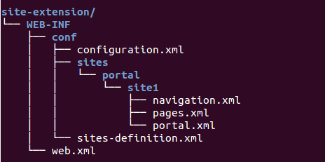
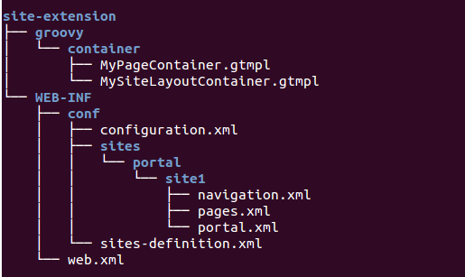
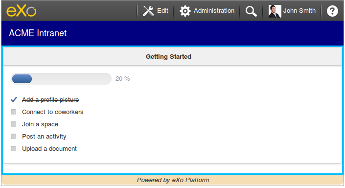
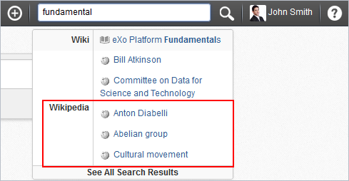
.. |image4| image:: images/results_unifiedsearch_wikipedia.png
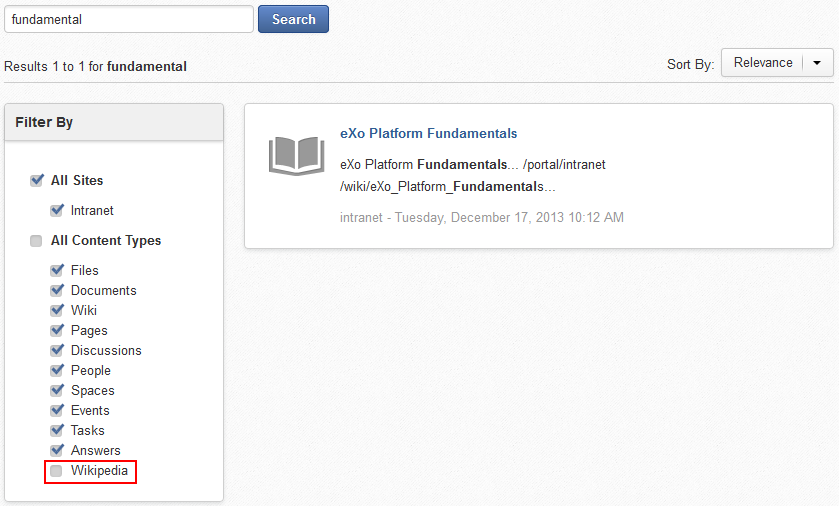
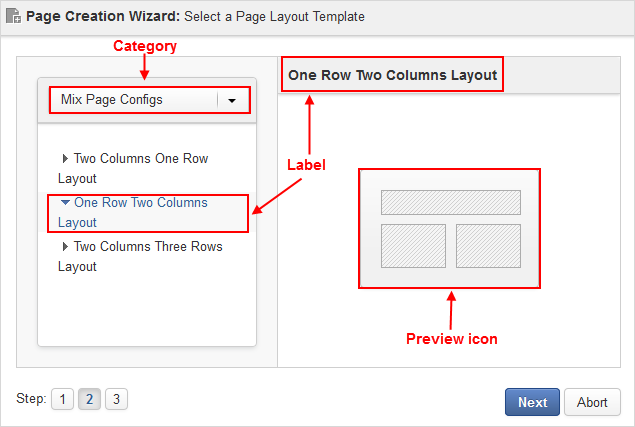

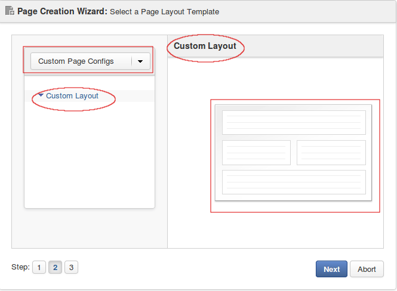
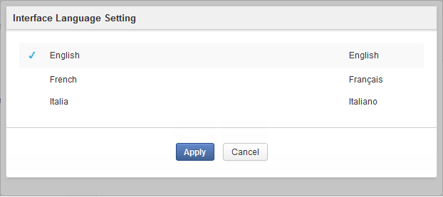
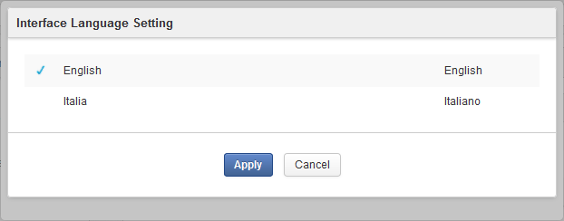


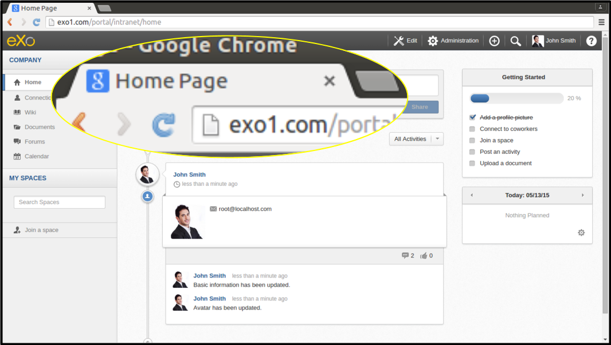
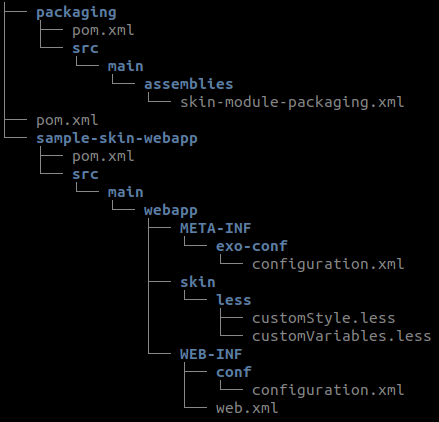
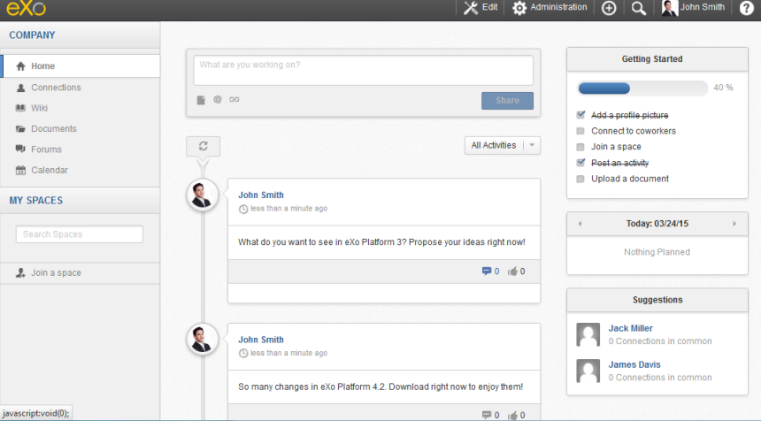
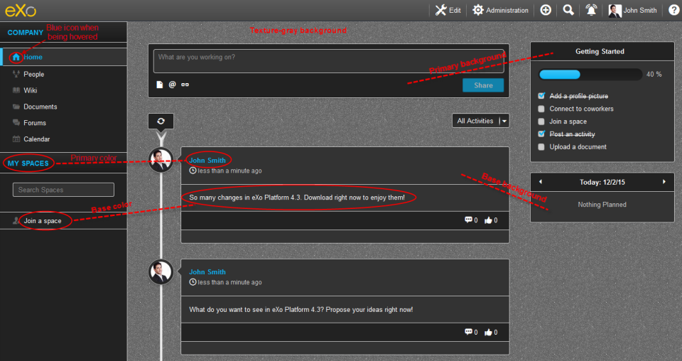
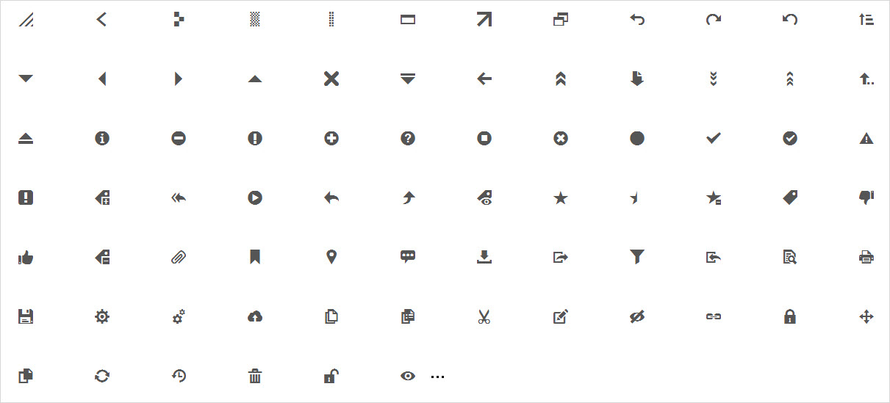
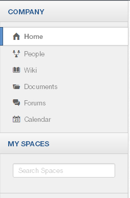
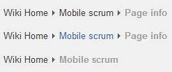
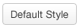

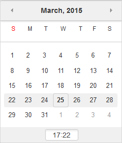
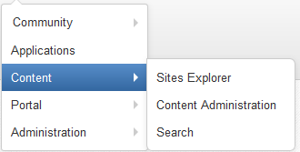
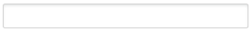
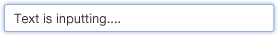
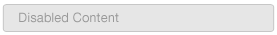
.. |image27| image:: images/SkinModule/readonly_state_example.png
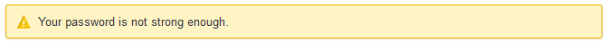
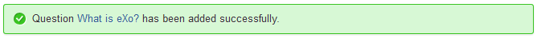
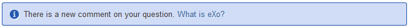
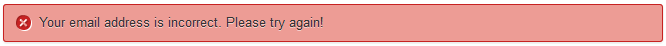
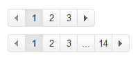
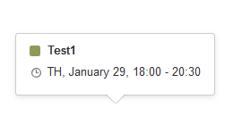
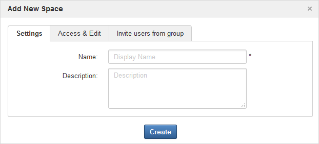
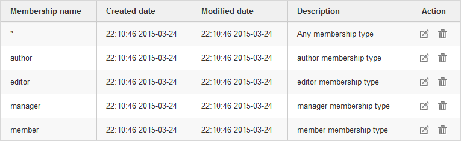
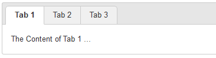

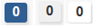
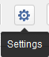
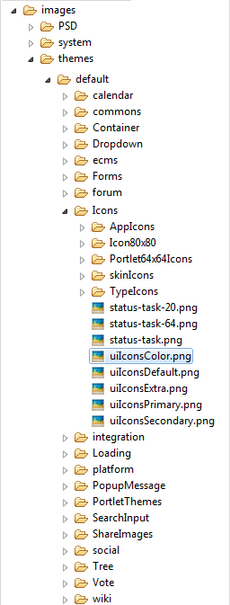
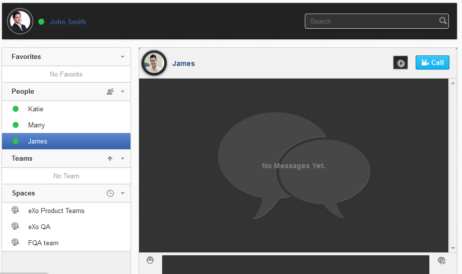
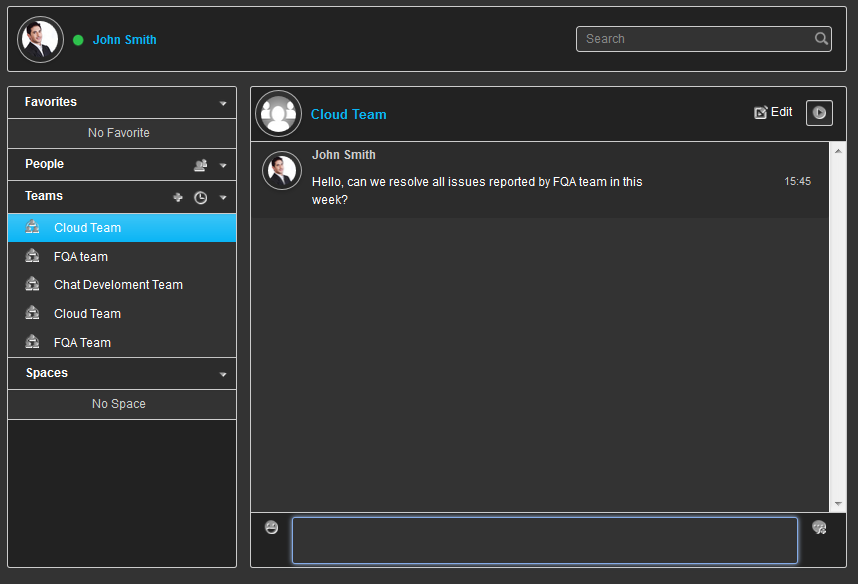
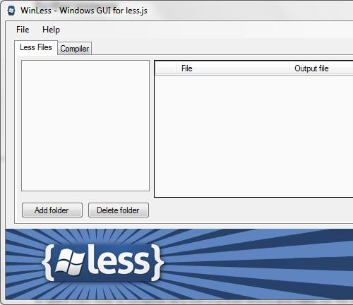
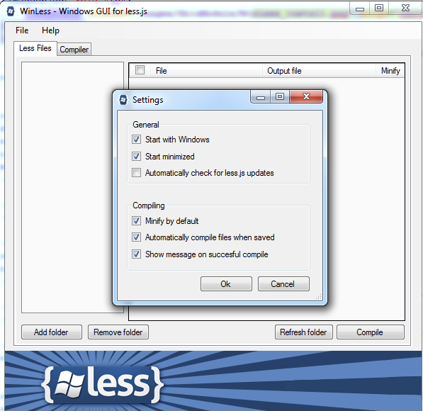
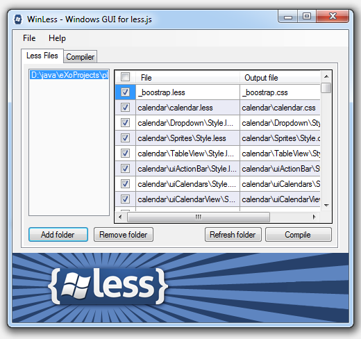
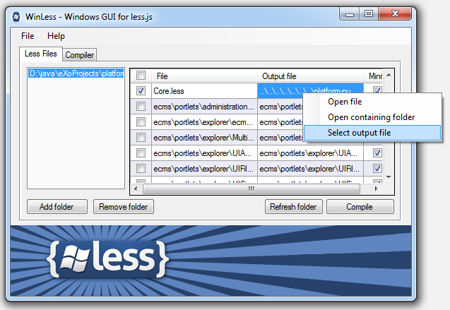
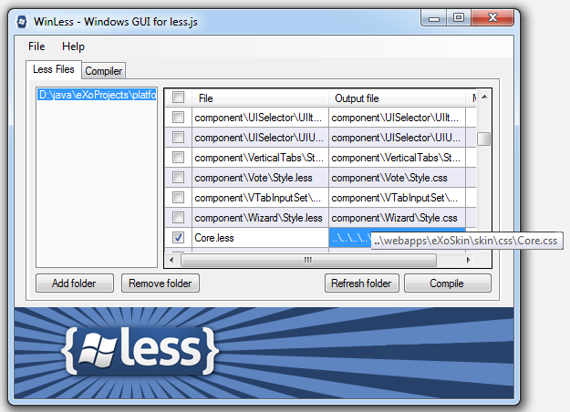
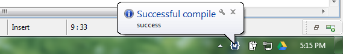
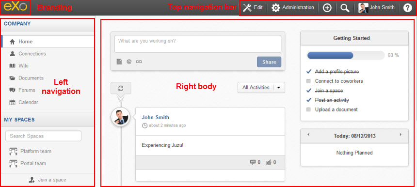
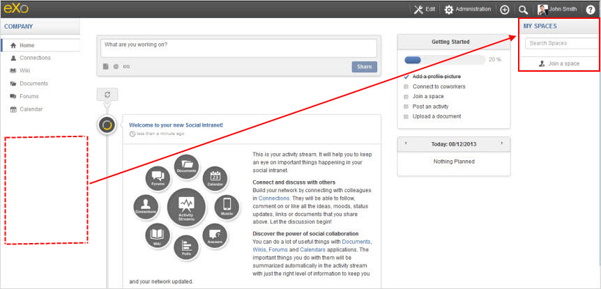
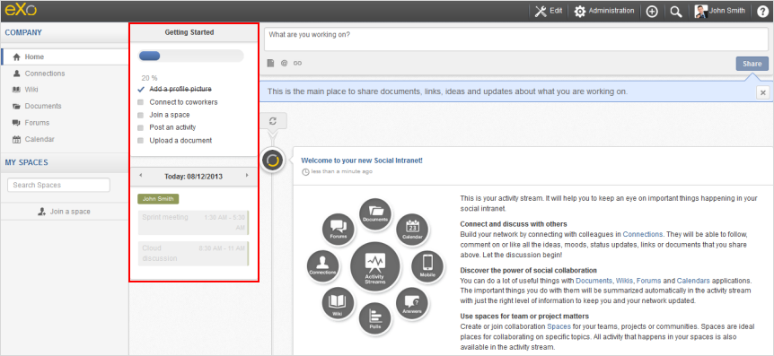


