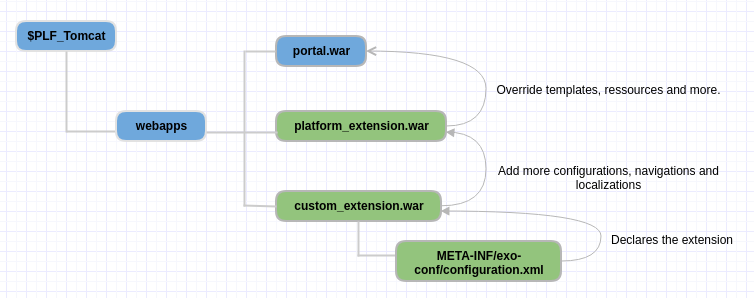
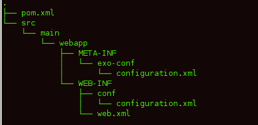
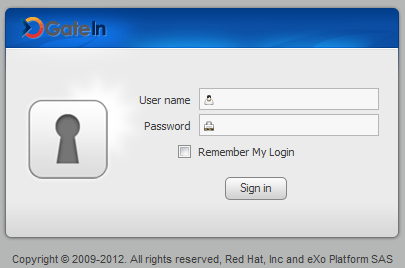
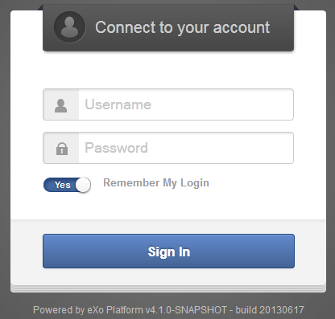
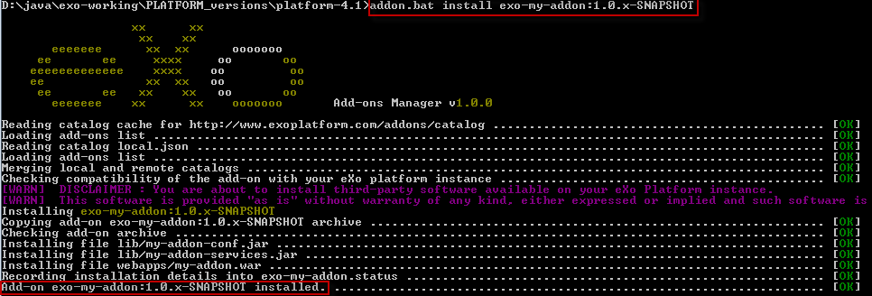
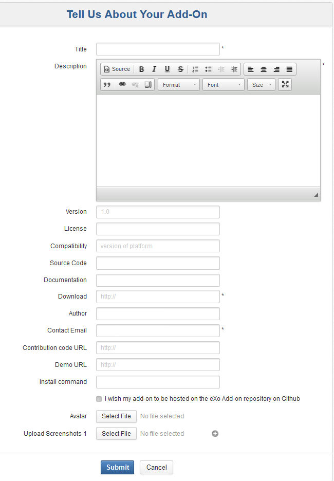
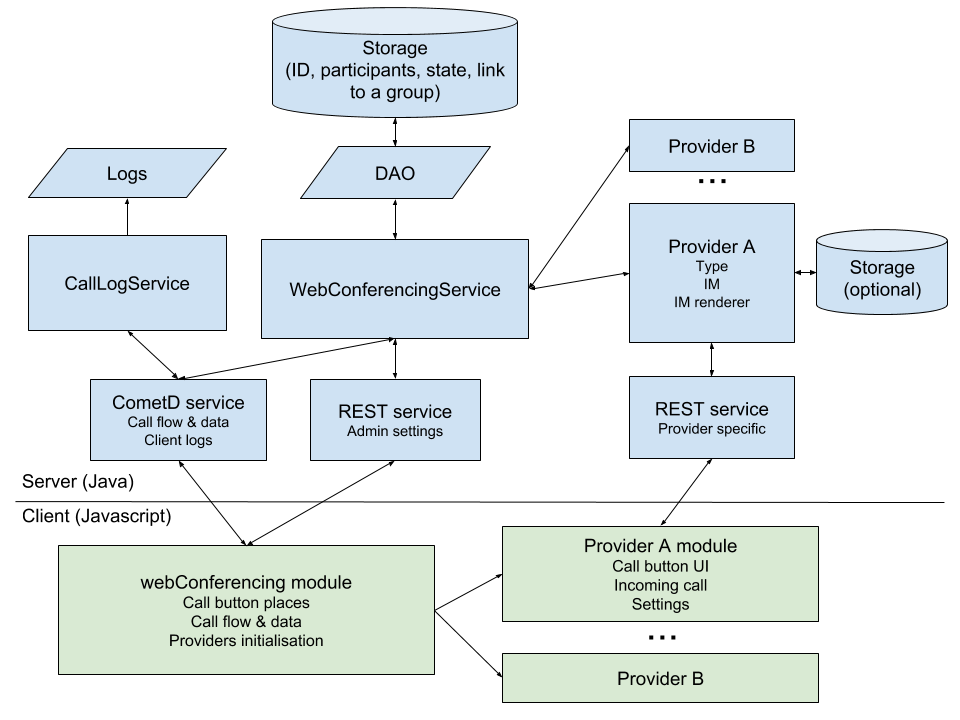

.. _Dev_eXo_Addons:

############
eXo Add-ons
############

    In this guide, the term "eXo add-on" denotes anything that enhances
    the eXo extensibility - is developed and distributed by eXo or any
    third-parties or any individual developers. An add-on may comprise a
    set of extensions, customizations, xml configurations, applications,
    templates or any new services.

    In eXo Platform, you can perform various extensibilities, for example,
    portal extension to extend portal, UIComponent plugin to add another
    UI component (Wiki actions, Activity types), or search connector.
    In-depth tutorials for those extensions come in the later chapters
    and sections. This chapter only focuses on the basic techniques of
    developing an add-on, including:

    -  :ref:`Portal extension <PLFDevGuide.eXoAdd-ons.PortalExtension>`
       Introduction to the portal extension mechanism and details to
       create a portal extension - the most commonly used technique that
       allows extending the portal container configuration.

    -  :ref:`Packaging <PLFDevGuide.eXoAdd-ons.Packaging>`
       How an add-on should be archived so that you can use the Add-ons
       Manager to install or uninstall it.

    -  :ref:`Deployment <PLFDevGuide.eXoAdd-ons.Deployment>`
       Ways to deploy an add-on into the eXo Platform server and detailed
       steps to perform a local deployment with the Add-ons Manager.

    -  :ref:`Publishing <PLFDevGuide.eXoAdd-ons.Publishing>`
       How to register an add-on in the catalog and information declared
       for one catalog entry.

    -  :ref:`JavaScript Safety <PLFDevGuide.eXoAdd-ons.JavaScriptSafety>`
       It is very important that your application's JavaScript is safe
       from other applications' code and does not pollute global
       variables.
       
    -  :ref:`eXo Web Conferencing connector <PLFDevGuide.eXoAdd-ons.WebconferencingConnector>`
       a How-to develop your own Web Conferencing connector.

.. _PLFDevGuide.eXoAdd-ons.PortalExtension:

================
Portal extension
================

A portal extension is a webapp that basically registers service
configuration and resources to the portal container to add new
services/resources or overrides existing ones.

When you develop an add-on, you usually call services via the portal
container. Your code will not take care of the creation of service
instances because the portal container does it.

The services are configurable and plugable. The portal container allows
you to register which services loaded and which parameter values used
during a service initialization. This is done by portal extension.

Also the portal extension is used to include resources to portal. Portal
unifies the resources in a way that allows the extensions to override
built-in resources.

The portal extension will be used very often in later chapters so this
section is a reference to:

-  :ref:`Portal extension mechanism <PLFDevGuide.eXoAdd-ons.PortalExtension.Mechanism>`

-  :ref:`Creating a portal extension <PLFDevGuide.eXoAdd-ons.PortalExtension.Howto>`

.. _PLFDevGuide.eXoAdd-ons.PortalExtension.Mechanism:

Portal extension mechanism
~~~~~~~~~~~~~~~~~~~~~~~~~~~~

Technically, the eXo Kernel provides an extensibility mechanism that
extends the portal container configurations. This extensibility
mechanism allows more services and resources to be loaded at start-up.
In other words, thanks to the extensibility mechanism, you can extend
the portal resources in an almost plug-and-play fashion - simply by
dropping in a ``.war`` archive with the resources, and configuring its
position on the portal's classpath.

.. note:: -  With this way, customization of the portal does not involve unpacking and repacking the original portal's ``.war`` archives.
             Instead, you can override a portal resource by including it in your extension in the same path as that of ``portal.war``.

		  -  In case many extensions include a same resource, they override each other too. So, take care that only the last loaded one will take effect.

See the following diagram for how the portal extensions work:

|image0|

.. tip:: In many add-ons, the configuration file ``configuration.xml`` is packaged in a jar archive, because the jar often contains service
		 classes and other resources. You can totally remove the jar file if it is supposed to contain only the ``configuration.xml`` file and
         include it in the war instead to make the package simpler, as in the diagram above. See details :ref:`below <PLFDevGuide.eXoAdd-ons.PortalExtension.Mechanism.NewAsOf43>`.

eXo Platform comes with a pre-configured PortalContainer named "portal". The
configuration of this portal container ties the core and the extended
services stack. The default portal container is started from
``portal.war`` and naturally maps to the **/portal** URL.

The webapp ``portal.war`` is the base that can be overridden by other
extensions.

The extensibility is achieved via 2 advanced features of the
**PortalContainer**:

-  A unified ClassLoader: Any classpath resource, such as property
   files, will be accessible as if it was inside ``portal.war``.

.. note:: This is valid only for resources but not for Java classes.

-  A unified ServletContext: Any web resources contained in your
   ``custom-extension.war`` will be accessible from /portal/ uri.

When you are extending an existing portal container, the name of the
portal in the extension's configuration should be the same as that of
the existing portal container. By using this approach, the configuration
(and many other aspects) of an existing portal container can be
customized, for example, Groovy templates of portlets, porlet skins, CSS
and Images, navigations and pages or localizations.

**Servlets and Servlet Filters in a portal extension**

If you ship servlets or servlet filters as part of your portal
extension, and these servlets/filters need to access specific resources
of a portal during the process of the servlets or filters request, make
sure that these servlets/filters are associated with the current portal
container.

The proper way to do that is making your servlet extend the
org.exoplatform.container.web.AbstractHttpServlet class.

This will not only properly initialize the current *PortalContainer* for
you, but also set the current thread's context ClassLoader to servlets
or servlet filters which look for resources in associated web
applications in the order specified by dependencies configuration.

Similarly, make sure that your filter class extends
org.exoplatform.container.web.AbstractFilter.

Both AbstractHttpServlet and AbstractFilter have the method named
*getContainer()*, which returns the current *PortalContainer*.

.. _PLFDevGuide.eXoAdd-ons.PortalExtension.Mechanism.NewAsOf43:

**New extension mechanism as of Platform 4.3**

Before Platform 4.3, you have to place ``configuration.xml`` (that
declares your extension) in a jar archive, at:

-  ``your.jar!/conf/configuration.xml``

As of Platform 4.3 (eXo Kernel 2.5), you have one more option to place
that file in the .war itself, at:

-  ``your.war!/META-INF/exo-conf/configuration.xml``

The benefit is you can remove the jar if it does only one thing: to
configure the extension.

**References**

To deeply understand the extension mechanism, you should read the Kernel
reference about services, containers and configuration:

-  :ref:`Service configuration for beginners <#Kernel.ServiceConfigurationforBeginners>`

-  :ref:`Configuration retrieval <#Kernel.ServiceConfigurationforBeginners.ConfigurationRetrieval>`

-  :ref:`Service configuration in detail <#Kernel.ServiceConfigurationinDetail>`

-  :ref:`Container configuration <#Kernel.ContainerConfiguration>`

.. _PLFDevGuide.eXoAdd-ons.PortalExtension.Howto:

Creating a portal extension
~~~~~~~~~~~~~~~~~~~~~~~~~~~~

In this tutorial, you will learn how to create a portal extension. The
project consists of a webapp (war) module. The sample code can be found
at `eXo Samples repository <https://github.com/exo-samples/docs-samples/tree/master/custom-extension>`__.

1. Create a Maven project custom-extension having the structure as below:

   |image1|

2. Edit ``pom.xml``:

   .. code:: xml

		<?xml version="1.0" encoding="UTF-8"?>
		<project xmlns="http://maven.apache.org/POM/4.0.0" xmlns:xsi="http://www.w3.org/2001/XMLSchema-instance"
			xsi:schemaLocation="http://maven.apache.org/POM/4.0.0 http://maven.apache.org/maven-v4_0_0.xsd">
			<modelVersion>4.0.0</modelVersion>
			<groupId>org.exoplatform.samples</groupId>
			<artifactId>custom-extension</artifactId>
			<version>5.0.x</version>
			<packaging>war</packaging>
			<name>custom-extension-pom</name>
			<description>The sample extension</description>

			<properties>
				<project.version>5.0.x</project.version>
				<exoplatform.version>5.0.0</exoplatform.version>
			</properties>

			<dependencyManagement>
				<dependencies>
					<dependency>
						<groupId>org.exoplatform.platform</groupId>
						<artifactId>platform</artifactId>
						<version>${exoplatform.version}</version>
						<type>pom</type>
						<scope>import</scope>
					</dependency>
				</dependencies>
			</dependencyManagement>
		</project>
		

   Note that in this file you define the file name of the webapp. It 
   will be ``custom-extension.war``. You can change it here but you will 
   have to change other configuration accordingly.

3. Edit ``WEB-INF/web.xml``:

   .. code:: xml

		<?xml version="1.0" encoding="UTF-8"?>
		<web-app>
			<display-name>custom-extension</display-name>
			<listener>
				<listener-class>org.exoplatform.container.web.PortalContainerConfigOwner</listener-class>
			</listener>
		</web-app>

4. Edit ``WEB-INF/conf/configuration.xml``:

   .. code:: xml

		<?xml version="1.0" encoding="UTF-8"?>
		<configuration xmlns:xsi="http://www.w3.org/2001/XMLSchema-instance" 
			xsi:schemaLocation="http://www.exoplatform.org/xml/ns/kernel_1_2.xsd http://www.exoplatform.org/xml/ns/kernel_1_2.xsd"
			xmlns="http://www.exoplatform.org/xml/ns/kernel_1_2.xsd">
		</configuration>

This file is supposed to be a service configuration file, but you do not
configure anything so far. In the :ref:`examples <PLFDevGuide.eXoAdd-ons.PortalExtension.Examples>` 
that follow and in some later tutorials of the Developer guide, you will
write more configuration when necessary.

5. Edit ``META-INF/exo-conf/configuration.xml``:

   .. code:: xml

		<?xml version="1.0" encoding="UTF-8"?>
		<configuration xmlns:xsi="http://www.w3.org/2001/XMLSchema-instance" xsi:schemaLocation="http://www.exoplatform.org/xml/ns/kernel_1_2.xsd http://www.exoplatform.org/xml/ns/kernel_1_2.xsd"
		  xmlns="http://www.exoplatform.org/xml/ns/kernel_1_2.xsd">

		  <external-component-plugins>
			<target-component>org.exoplatform.container.definition.PortalContainerConfig</target-component>
			<component-plugin>
			  <name>Change PortalContainer Definitions</name>
			  <set-method>registerChangePlugin</set-method>
			  <type>org.exoplatform.container.definition.PortalContainerDefinitionChangePlugin</type>
			  <priority>101</priority>
			  <init-params>
				<value-param>
				  <name>apply.default</name>
				  <value>true</value>
				</value-param>
				<object-param>
				  <name>change</name>
				  <object type="org.exoplatform.container.definition.PortalContainerDefinitionChange$AddDependencies">
					<field name="dependencies">
					  <collection type="java.util.ArrayList">
						<value>
						  <string>custom-extension</string>
						</value>
					  </collection>
					</field>
				  </object>
				</object-param>     
			  </init-params>
			</component-plugin>
		  </external-component-plugins>

		</configuration>

   -  ``priority``: Should be set to a value upper than 100 to override 
      the extension platform-extension.war.

   -  ``dependencies``: a collection of portal extensions. Here it is 
      only custom-extension.

   -  ``custom-extension``: it is thee file name of the .war and the
      **display-name** you configure in ``web.xml`` should match each
      other.

6. Build the project with ``mvn clean install`` command. You will have a
   war named ``custom-extension.war``\ in */target/* folder.

.. _DeployExtension:

Deployment
-----------

To deploy this simple portal extension in case you do not use Add-ons
Manager:

**For Tomcat:**

1. Copy ``custom-extension.war`` to the ``$PLATFORM_TOMCAT_HOME/webapps/``
   directory.

2. Restart the server.

**For JBoss:**

1. Add new ``WEB-INF/jboss-deployment-structure.xml`` file to 
   ``custom-extension.war`` with the following content:

   .. code:: xml

		<jboss-deployment-structure xmlns="urn:jboss:deployment-structure:1.2">
			<deployment>
				<dependencies>
					<module name="deployment.platform.ear" export="true"/>
				</dependencies>
			</deployment>
		</jboss-deployment-structure>

2. Add ``custom-extension.war`` to
   ``$PLATFORM_JBOSS_HOME/standalone/deployments/`` platform.ear 
   directory.

3. Restart the server.

.. _AddonsManagerCompliance:

Add-ons Manager compliance
---------------------------

In case you want to make your portal extension a standard add-on so that
users can install it using eXo Add-ons Manager, the packaging will be
different. The section :ref:`Packaging <PLFDevGuide.eXoAdd-ons.Packaging>`
shows you how.

The Add-ons Manager deploys the extension in the same way for Tomcat.
For JBoss, it uses another method to deploy the .war. Here are the
details:

-  The file ``jboss-deployment-structure.xml`` is not required.

-  The .war is deployed into
   ``$PLATFORM_JBOSS_HOME/standalone/deployments/platform.ear``.

-  The Add-ons Manager will edit the
   ``$PLATFORM_JBOSS_HOME/standalone/deployments/platform.ear/META-INF/application.xml``
   to add a module as follows:

   .. code:: xml

       <application>
           ...
           <!-- Your custom-extension should be added before starter module. -->
           <module>
               <web>
                   <web-uri>custom-extension.war</web-uri>
                   <context-root>custom-extension</context-root>
               </web>
           </module>
           ...
           <module>
               <web>
                   <web-uri>exo.portal.starter.war.war</web-uri>
                   <context-root>starter</context-root>
               </web>
           </module>
       </application>

.. _PLFDevGuide.eXoAdd-ons.PortalExtension.Examples:

Portal extension by examples
~~~~~~~~~~~~~~~~~~~~~~~~~~~~~~

**Registering your service to portal container**

A service (also called component) can be any Java class. At minimum you
write an empty interface, and an implementation with a constructor.

.. code:: java

    public interface MyService {
      ...
    }

.. code:: java

    public class MyServiceImpl implements MyService {
      ...
      public MyServiceImpl() throws Exception {
        ...
      }
    }

In your ``custom-extension.war!/WEB-INF/conf/portal/configuration.xml``:

.. code:: xml

    <configuration>
        <component>
            <key>acme.com.services.MyService</key>
            <type>acme.com.services.MyServiceImpl</type>
        </component>
    </configuration>

Then to access the service:

.. code:: java

    MyService service = (MyService) PortalContainer.getInstance().getComponentInstanceOfType(MyService.class)

You should learn more about service, initial parameter and plugin and
all about service configuration in :ref:`Service configuration for beginners <#Kernel.ServiceConfigurationforBeginners>` 
and :ref:`Service configuration in details <#Kernel.ServiceConfigurationinDetail>`.

**Adding a supported language**

The service org.exoplatform.services.resources.LocaleConfigService is
responsible for adding supported languages. The service is configured to
read a list of locales from a file:

.. code:: xml

    <component>
        <key>org.exoplatform.services.resources.LocaleConfigService</key>
        <type>org.exoplatform.services.resources.impl.LocaleConfigServiceImpl</type>
        <init-params>
            <value-param>
                <name>locale.config.file</name>
                <value>war:/conf/common/locales-config.xml</value>
            </value-param>
        </init-params>
    </component>

So by default it is ``portal.war!/conf/common/locales-config.xml``.

To add a locale you want, include a modified copy of this file in your
extension: ``custom-extension.war!/conf/common/locales-config.xml``.

Of course the language support involves translating lots of resources.
For now you just add a locale like *ve (for Venda)*, so a user can
choose it in the list of language options, but no resource would be
found for Venda, then the default language will be used.

.. code:: xml

    <locales-config>
        ...
        <locale-config>
            <locale>ve</locale>
            <output-encoding>UTF-8</output-encoding>
            <input-encoding>UTF-8</input-encoding>
            <description>Venda</description>
        </locale-config>
        ...
    </locales-config>

**Overriding the Login page**

The LoginServlet dispatches the login request to ``login.jsp``:

.. code:: java

    getServletContext().getRequestDispatcher("/login/jsp/login.jsp").include(req, resp);

This login page is firstly defined in portal webapp but then is
overridden by platform-extension. In other words, you can find the login
page at:

-  ``portal.war!/login/jsp/login.jsp``

   |image2|

-  ``platform-extension.war!/login/jsp/login.jsp``

   |image3|

You can override it once again in your portal extension, for example
``custom-extension.war!/login/jsp/login.jsp``.

**Overriding shared layout**

The shared layout is applied for all pages of a portal. You can override
this resource by including it in your extension
``custom-extension.war!/WEB-INF/conf/portal/portal/sharedlayout.xml``.

Some of customizations you can do with shared layout:

-  Remove a built-in portlet from the top navigation bar (for example,
   the "Help" link).

-  Adding your portlet here so that all your pages will have that
   portlet.

See :ref:`Customizing a shared layout <#PLFDevGuide.Site.LookAndFeel.CustomizingSiteSkin.Sharedlayout>`
for more instructions.

.. _PLFDevGuide.eXoAdd-ons.Packaging:

=========
Packaging
=========

The Add-ons Manager defines a standard approach of packaging,
installing/uninstalling and updating add-ons. To comply with it, you
need to compress JARs, WARs and other files into a zip archive:

::

    foo-addon-X.Y.Z.zip/
    |__ foo-addon.jar
    |__ somelib.jar
    |__ foo-portlets.war
    |__ foo-extension.war
    |__ foo
        |__ foo.conf
    |__ README

When installing an add-on, the Add-ons Manager copies files from the
add-on archive into PRODUCT, as follows:

-  JARs: ``$PLATFORM_TOMCAT_HOME/lib/`` (Tomcat), or
   ``$PLATFORM_JBOSS_HOME/standalone/deployments/platform.ear/lib/``
   (JBoss).

-  WARs: ``$PLATFORM_TOMCAT_HOME/webapps/`` (Tomcat), or
   ``$PLATFORM_JBOSS/HOME/standalone/deployments/platform.ear/``
   (JBoss).

-  Other files and folders located at the root of the zip archive will
   be copied to the home directory of the PRODUCT server.

-  An ASCII file named ``README`` may be placed at the root of the
   archive. This file is never installed. Instead, it is displayed in
   the console after a successful installation.

**Packaging sample**

You can use `Maven assembly plugin <http://maven.apache.org/plugins/maven-assembly-plugin/>`__
to package your add-on project.

See the sample at `eXo Samples Repository <https://github.com/exo-samples/docs-samples/tree/4.3.x/addon-packaging-template>`__.
Notice two files:

In ``packaging/pom.xml``:

.. code:: xml

    <build>
        <finalName>${project.artifactId}-${project.version}</finalName>
        <plugins>
            <plugin>
                <groupId>org.apache.maven.plugins</groupId>
                <artifactId>maven-assembly-plugin</artifactId>
                <executions>
                    <execution>
                        <id>package-extension</id>
                        <phase>package</phase>
                        <goals>
                            <goal>single</goal>
                        </goals>
                        <configuration>
                            <finalName>${project.artifactId}-${project.version}</finalName>
                            <appendAssemblyId>false</appendAssemblyId>
                            <descriptors>
                                <descriptor>src/main/assemblies/packaging.xml</descriptor>
                            </descriptors>
                        </configuration>
                    </execution>
                </executions>
            </plugin>
        </plugins>
    </build>

In ``packaging/src/main/assemblies/packaging.xml``:

.. code:: xml

    <assembly xmlns="http://maven.apache.org/plugins/maven-assembly-plugin/assembly/1.1.2" 
        xmlns:xsi="http://www.w3.org/2001/XMLSchema-instance"
        xsi:schemaLocation="http://maven.apache.org/plugins/maven-assembly-plugin/assembly/1.1.2 http://maven.apache.org/xsd/assembly-1.1.2.xsd">
        <id>addon-packaging-template</id>
        <formats>
            <format>zip</format>
        </formats>
        <includeBaseDirectory>false</includeBaseDirectory>
        <dependencySets>
            <dependencySet>
                <useProjectArtifact>false</useProjectArtifact>
                <outputDirectory>/</outputDirectory>
                <outputFileNameMapping>${artifact.artifactId}${dashClassifier?}.${artifact.extension}</outputFileNameMapping>
                <includes>
                    <include>org.exoplatform.samples:addon-template-webapp</include>
                    <include>org.exoplatform.samples:addon-template-lib</include>
                </includes>
            </dependencySet>
        </dependencySets>
    </assembly>

.. _PLFDevGuide.eXoAdd-ons.Deployment:

==========
Deployment
==========

There are 2 ways to deploy an add-on:

-  Manually install WARs and JARs and other files into the ``webapps``,
   ``lib`` folders and the corresponding directories of eXo Platform.

-  Use the Add-ons Manager - the standard way to install, uninstall, and
   update add-ons in eXo Platform. In this way, you will avoid the manual
   registration that might cause errors. The Add-on Manager allows you
   to simplify your add-ons management in both Tomcat and JBoss EAP by
   copying all JARs and WARs in one step and uninstalling them without
   searching in the ``lib`` directory (more than 400 jars) and in the
   ``webapps`` directory (more than 50 wars).

When using the Add-ons Manager,you can:

-  Deploy an add-on from the eXo Add-ons repository, as detailed in
   :ref:`Administrator Guide - Installing/Uninstalling add-ons <AddonsManagement.InstallingUninstalling>`.
   However, to follow in this way, the add-on should be first registered
   and validated by eXo administrators.

-  Deploying a local add-on, as below.

**Deploying a local add-on**

Let's say you want to deploy your add-on archived as
**my-addon-1.0.x-SNAPSHOT.zip**, do as follows:

1. Create a local catalog named ``local.json`` under ``$PLATFORM_HOME/addons/`` 
   with the minimal content. This local catalog will be merged with the 
   central one at runtime. 

   .. code:: xml

		[
		 {
		   "id": "exo-my-addon",
		   "version": "1.0.x-SNAPSHOT",
		   "name": "My Add-on",
		   "description": "Example of my add-on",
		   "downloadUrl": "file://D:/java/exo-working/PLATFORM_versions/my-addon-1.0.x-SNAPSHOT.zip",
		   "vendor": "eXo platform",
		   "license": "LGPLv3",
		   "supportedDistributions": ["community","enterprise"],
		   "supportedApplicationServers": ["tomcat","jboss"]
		 }
		]

2. Install your own add-on with the script:

   ::

		addon(.bat) --install exo-my-addon:1.0.x-SNAPSHOT

   |image4|

Now you will see your own add-on zip file in
``$PLATFORM_HOME/addons/archives``.

.. _PLFDevGuide.eXoAdd-ons.Publishing:

==========
Publishing
==========

**Registering an add-on in the centralized catalog**

If you wish to share your add-on publicly, simply click
`here <http://community.exoplatform.com/portal/intranet/create-addon>`__
to tell eXo team about your add-on (you must sign in to access the
page). The team will review it and possibly add it into `our eXo
centralized catalog <http://www.exoplatform.com/addons/catalog>`__, so
that it can be accessed by any eXo instance.

|image5|

**Using your customized catalog**

The Add-ons Manager relies on catalogs containing metadata of the
add-ons. By default, a remote catalog is downloaded from
http://www.exoplatform.com/addons/catalog. You can use your own catalog
by adding the ``--catalog=$URL`` option (where $URL is the alternative
location for the catalog) to the addon commands.

The remote catalog is cached locally and each catalog URL has a separate
cache. When you create a local catalog
(``$PLATFORM_HOME/addons/local.json``) that defines the catalog entries
for your own add-ons, it will be merged with the remote catalog at
runtime. If you add the ``--offline`` option when installing the add-on,
only the local and cached remote catalogs (if any) are used.

.. note:: -  If a version of an add-on is duplicated between the remote and local catalogs, the remote one is used.

		  -  If there are some duplicated versions in the same catalog, the first one is used.

To write your own (local or remote) catalog, you can learn the default
catalog (linked above) that is a
`JSON <http://www.w3schools.com/json/json_syntax.asp>`__ file.

Each catalog entry is a version of an add-on. Here is an entry sample:

.. code:: xml

    {
        "id": "exo-video-calls",
        "version": "1.1.0",
        "unstable": false,
        "name": "eXo Video Calls",
        "description": "Add video call capabilities to your eXo Platform intranet",
        "releaseDate": "2015-05-13T22:00:00.000Z",
        "sourceUrl": "https://github.com/exo-addons/weemo-extension",
        "downloadUrl": "http://storage.exoplatform.org/public/Addons/exo-video-calls/weemo-extension-pkg-1.1.0.zip",
        "vendor": "eXo",
        "license": "LGPLv3",
        "licenseUrl": "https://www.gnu.org/licenses/lgpl-3.0.txt",
        "mustAcceptLicense": false,
        "supportedDistributions": "community,enterprise",
        "supportedApplicationServers": "tomcat,jboss",
        "compatibility": "[4.2.0,)"
    },

The following table explains the json keys (\* means mandatory):

+---------------------------+------------------------------------------------+
| ``id`` (\*)               | Id and version is used to identify an add-on   |
|                           | (use id:version pattern in commands).          |
|                           | Duplicated entries are treated as said above.  |
+---------------------------+------------------------------------------------+
| ``version`` (\*)          | Version string of the add-on.                  |
+---------------------------+------------------------------------------------+
| ``unstable``              | This is "false" by default. Set it to "true"   |
|                           | to warn of an unstable version (unstable       |
|                           | versions are not listed unless ``--unstable``  |
|                           | is used).                                      |
+---------------------------+------------------------------------------------+
| ``name`` (\*)             | The display name of the add-on.                |
+---------------------------+------------------------------------------------+
| ``description``           | The brief description of the add-on.           |
+---------------------------+------------------------------------------------+
| ``releaseDate``           | The release date of the add-on (Date format:   |
|                           | YYYY-MM-DD).                                   |
+---------------------------+------------------------------------------------+
| ``sourceUrl``             | The URL where to find the source of the        |
|                           | add-on.                                        |
+---------------------------+------------------------------------------------+
| ``downloadUrl`` (\*)      | Where to download the package. Use *http://*   |
|                           | for a remote add-on or *file://* for a local   |
|                           | add-on.                                        |
+---------------------------+------------------------------------------------+
| ``vendor`` (\*)           | The vendor name of the add-on (for example,    |
|                           | PRODUCT).                                      |
+---------------------------+------------------------------------------------+
| ``license`` (\*)          | The license of the add-on (for example,        |
|                           | LGPLv3).                                       |
+---------------------------+------------------------------------------------+
| ``licenseUrl``            | The URL containing an ASCII version of the     |
|                           | license to be displayed by the CLI.            |
+---------------------------+------------------------------------------------+
| ``mustAcceptLicense``     | "True" means it requires the user to           |
|                           | explicitly accept the license terms before     |
|                           | installation. This is set to "false" by        |
|                           | default.                                       |
+---------------------------+------------------------------------------------+
| ``supportedDistributions` | The eXo Platform distributions that support    |
| `                         | the add-on (for example, Community, Enterprise |
| (\*)                      | - should be lowercase, comma-separated).       |
+---------------------------+------------------------------------------------+
| ``supportedApplicationSer | The application servers that support the       |
| vers``                    | add-on (for example, Tomcat, JBoss - should be |
| (\*)                      | lowercase, comma-separated).                   |
+---------------------------+------------------------------------------------+
| ``compatibility``         | The version range (in Maven version range      |
|                           | format) that the add-on is compatible. No      |
|                           | compatibility check is performed if this is    |
|                           | absent.                                        |
+---------------------------+------------------------------------------------+
| ``screenshotUrl``         | The HTTP URL pointing to a screenshot of the   |
|                           | add-on.                                        |
+---------------------------+------------------------------------------------+
| ``thumbnailUrl``          | The HTTP URL pointing to a thumbnail of the    |
|                           | add-on.                                        |
+---------------------------+------------------------------------------------+
| ``documentationUrl``      | The HTTP URL pointing to a documentation of    |
|                           | the add-on.                                    |
+---------------------------+------------------------------------------------+
| ``author``                | The author of the add-on.                      |
+---------------------------+------------------------------------------------+
| ``authorEmail``           | The email address of the author.               |
+---------------------------+------------------------------------------------+

.. _PLFDevGuide.eXoAdd-ons.JavaScriptSafety:

=================
JavaScript Safety
=================

As your application - typically a portlet - is deployed in pages that
contain other applications, it is very important that your JavaScript
code is safe from other code, and vice versa, does not harm global
variables.

Here are some tips to write your JavaScript code safely:

-  Follow GMD module patterns as much as possible.

-  Avoid to write inline scripts if possible. Avoid to include libraries
   externally (in script tag) if possible.

-  When using JQuery, use the built-in shared module "jquery" if
   possible. Use GMD adapter configuration if you need other JQuery
   versions and extensions.

It is strongly recommended you follow these tutorials:

-  :ref:`Adding JavaScript to a portlet <#PLFDevGuide.DevelopingApplications.DevelopingPortlet.JavaScript>`
   - a quick tutorial with code sample.

-  :ref:`Developing JavaScript <#PLFDevGuide.JavaScript>` - the complete
   guideline to module pattern and GMD.

.. _PLFDevGuide.eXoAdd-ons.WebconferencingConnector:

==============================
eXo Web Conferencing connector
==============================

eXo Web Conferencing add-on enables you to plug-in and manage any Web
Conferencing solution in eXo Platform. You can use eXo Web Conferencing core
to develop your own connector which will implement the call provider you
need to embed in eXo Platform.

In this section, we will introduce the architecture of eXo Web
Conferencing add-on and how to develop a custom connector allowing you
to embed a call provider in eXo Platform.

.. _WebConfConnectorArchitecture:

Architecture
~~~~~~~~~~~~~

The following diagram shows the different parts involved to perform a
Web Conferencing call.

|image6|

**eXo Web Conferencing core**

The eXo Web Conferencing core component is responsible for:

-  Declaring the provider connector.

-  Adding call buttons in eXo Platform different pages.

-  Exchanging call data and notifying call parties about the status.

-  Saving the call state and linking between group calls.

-  Administrating eXo Web Conferencing: enable/disable a provider,
   managing the settings via the UI.

The provider connector component is responsible for:

-  Building a call button UI.

-  Running a call from the UI interface.

-  Establishing the connection flow in a call and updating the call
   state.

-  Handling incoming calls.

-  Administrating settings via UI.

.. _HowToDevelopConnector:

Develop your own call connector
~~~~~~~~~~~~~~~~~~~~~~~~~~~~~~~~

eXo Web Conferencing add-on is a portal extension installed by default
in eXo Platform. A call connector is also a portal extension which uses
the eXo Web Conferencing core.

The connector should provide an implementation of its call button which
is added by the Web Conferencing core in users profiles, spaces and chat
rooms.

The connector implementation consists of a server code and a client
application with user interface to run calls.

To implement your own connector follow this procedure:

1. **Create the connector project** respecting the developement 
   environment described :ref:`here <PLFDevGuide.GettingStarted.SettingDevelopmentEnvironment>`.

   We recommend you to clone our `template project <https://github.com/exo-addons/web-conferencing/tree/develop/template>`__
   as it contains maven modules with eXo Web Conferencing dependencies 
   and packaging. You should make your customizations on it: rename 
   package, classes and variables and if needed include third-party 
   libraries that your connector may use.

2. **Implement Java Service Provider Interface (SPI)**: It is the java
   class of your call provider which should extend the ``CallProvider``
   class.

   Here is a java code snippet which represents the skeleton of the Java
   SPI class:

   .. code:: java

		 package org.exoplatform.webconferencing.myconnector;

		/**
		 * My Connector provider implementation.
		 */
		public class MyConnectorProvider extends CallProvider {
		  
		  /**
		   * Instantiates a new My Call provider.
		   *
		   * @param params the params (from configuration.xml)
		   * @throws ConfigurationException the configuration exception
		   */
		  public MyConnectorProvider(InitParams params) throws ConfigurationException {
			super(params);
		  }

		  /**
		   * {@inheritDoc}
		   */
		  @Override
		  public String getType() {
			return TYPE;
		  }

		  /**
		   * {@inheritDoc}
		   */
		  @Override
		  public String[] getSupportedTypes() {
			return new String[] { getType() };
		  }

		  /**
		   * {@inheritDoc}
		   */
		  @Override
		  public String getTitle() {
			return TITLE;
		  }
		}  
        

3. :ref:`Create a portlet <#PLFDevGuide.DevelopingApplications.DevelopingPortlet>` 
   which will be responsible of loading and intializing your call 
   provider in the eXo Platform UI.

   .. code:: java

		  public class MyConnectorPortlet extends GenericPortlet {
			/**
			 * {@inheritDoc}
			 */
			@Override
			public void init() throws PortletException {
			  // Get eXo container and Web Conferencing service once per portlet initialization
			  ExoContainer container = ExoContainerContext.getCurrentContainer();
			  this.webConferencing = container.getComponentInstanceOfType(WebConferencingService.class);
			  try {
				this.provider = (MyConnectorProvider) webConferencing.getProvider(MyConnectorProvider.TYPE);
			  } catch (ClassCastException e) {
				LOG.error("Provider " + MyConnectorProvider.TYPE + " isn't an instance of " + MyConnectorProvider.class.getName(), e);
			  }
			}

			/**
			 * {@inheritDoc}
			 */
			@Override
			protected void doView(final RenderRequest request, final RenderResponse response) throws PortletException, IOException {
			  if (this.provider != null) {
				try {
				  JavascriptManager js = ((WebuiRequestContext) WebuiRequestContext.getCurrentInstance()).getJavascriptManager();
				  // first load Web Conferencing itself,
				  js.require("SHARED/webConferencing", "webConferencing")
					// load our connector module to myProvider variable
					.require("SHARED/webConferencing_myconnector", "myProvider")
					// check if the variable contains an object to ensure the provider was loaded successfully
					.addScripts("if (myProvider) { "
						// then add an instance of the provider to the Web Conferencing client
						+ "webConferencing.addProvider(myProvider); "
						// and force Web Conferencing client update (to update call buttons and related stuff)
						+ "webConferencing.update(); " + "}");
				} catch (Exception e) {
				  LOG.error("Error processing My Connector calls portlet for user " + request.getRemoteUser(), e);
				}
			  }
			}
		  }  
        

4. Configure your connector extension, your provider plugin and your
   portlet in ``META-INF/exo-conf/configuration.xml`` file.

**Extension connector configuration:**

.. code:: xml

     <external-component-plugins>
        <target-component>org.exoplatform.container.definition.PortalContainerConfig</target-component>
        <component-plugin>
          <name>Change PortalContainer Definitions</name>
          <set-method>registerChangePlugin</set-method>
          <type>org.exoplatform.container.definition.PortalContainerDefinitionChangePlugin</type>
          <init-params>
            <value-param>
              <name>apply.default</name>
              <value>true</value>
            </value-param>
            <object-param>
              <name>change</name>
              <object type="org.exoplatform.container.definition.PortalContainerDefinitionChange$AddDependenciesAfter">
                <field name="dependencies">
                  <collection type="java.util.ArrayList">
                    <value>
                      <string>myconnector</string>
                    </value>
                  </collection>
                </field>
                <field name="target">
                  <string>webconferencing</string>
                </field>
              </object>
            </object-param>
          </init-params>
        </component-plugin>
      </external-component-plugins>  
        

**Provider configuration:**

.. code:: xml

     <!-- Portal extension configuration for YOUR PROVIDER NAME -->
      <external-component-plugins>
        <target-component>org.exoplatform.webconferencing.WebConferencingService</target-component>
        <component-plugin>
          <name>add.callprovider</name>
          <set-method>addPlugin</set-method>
          <type>org.exoplatform.webconferencing.myconnector.MyConnectorProvider</type>
          <description>Call provider description here.</description>
          <init-params>
            <properties-param>
              <name>provider-configuration</name>
              <property name="my-apiKey" value="${webconferencing.myconnector.apiKey:myApiKey}" />
              <property name="my-clientId" value="${webconferencing.myconnector.clientId:myClientId}" />
              <property name="active" value="${webconferencing.myconnector.active:true}" />
            </properties-param>
          </init-params>
        </component-plugin>
      </external-component-plugins>  
        

The above configuration is also configurable through
:ref:`exo.properties <Configuration.ConfigurationOverview>` file as the 
following:

::

     ######### My Connector ###########
    webconferencing.myconnector.apiKey=myApiKey
    webconferencing.myconnector.clientId=myClientId
    webconferencing.myconnector.serviceUrl=https://mycall.acme.com/myconnector

        

**Provider portlet configuration:**

.. code:: xml

     <!-- Add My Connector portlet to portal pages with a toolbar -->
      <external-component-plugins>
        <target-component>org.exoplatform.commons.addons.AddOnService</target-component>
        <component-plugin>
          <name>addPlugin</name>
          <set-method>addPlugin</set-method>
          <type>org.exoplatform.commons.addons.AddOnPluginImpl</type>
          <description>add application Config</description>
          <init-params>
            <value-param>
              <name>priority</name>
              <value>10</value>
            </value-param>
            <value-param>
              <name>containerName</name>
              <value>middle-topNavigation-container</value>
            </value-param>
            <object-param>
              <name>MyConnectorPortlet</name>
              <description>My Connector portlet</description>
              <object type="org.exoplatform.portal.config.serialize.PortletApplication">
                <field name="state">
                  <object type="org.exoplatform.portal.config.model.TransientApplicationState">
                    <field name="contentId">
                      <string>myconnector/MyConnectorPortlet</string>
                    </field>
                  </object>
                </field>
              </object>
            </object-param>
          </init-params>
        </component-plugin>
      </external-component-plugins>  
      
     

