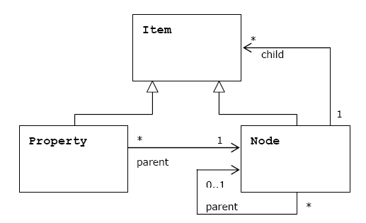
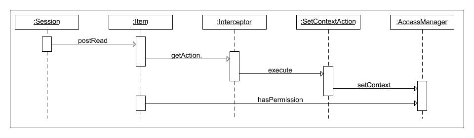
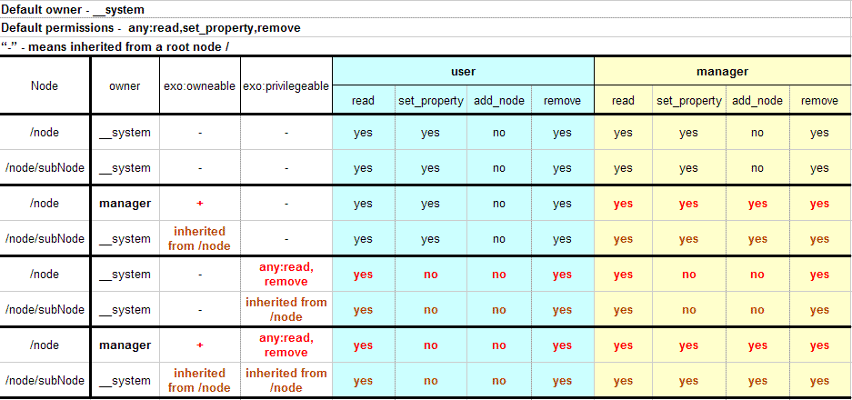
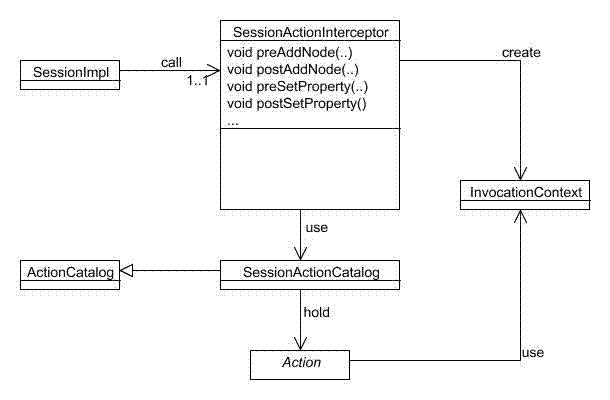

.. _Developer_references_eXo_JCR:

######################
Developer References
######################

    This chapter provides developers with the reference knowledge for
    using and developing JCR via two main topics:

    -  :ref:`Basic usage <JCR.DeveloperReference.Basic>`

       Issues around how to use JCR, NodeType, Namespace, Searching
       repository content, and Fulltext search.

    -  :ref:`Advanced usage <JCR.DeveloperReference.Advanced>`

       Details of advanced usages in JCR, including Extensions,
       Workspace data container, Binary values processing, and Link
       producer service.
       
The main purpose of content repository is to maintain the data. The heart 
of content repository is the data model:

-  The main data storage abstraction of JCR's data model is a workspace.

-  Each repository should have one or more workspaces.

-  The content is stored in a workspace as a hierarchy of items.

-  Each workspace has its own hierarchy of items.


   
   Item hierarchy

Node is intended to support the data hierarchy. It is of type using
namespaced names which allow the content to be structured in accordance
with standardized constraints. A node may be versioned through an
associated version graph (optional).

Property stored data are values of predefined types (String, Binary,
Long, Boolean, Double, Date, Reference, Path).

.. note::  The data model for the interface (repository model) is rarely the
		   same as the data models used by the repository's underlying storage
		   subsystems. The repository knows how to make the client's changes
		   persistent because that is a part of the repository configuration,
		   rather than part of the application programming task.


.. _JCR.DeveloperReference.Basic:

===========
Basic usage
===========

-  :ref:`Using JCR <JCR.UsingJCR>`

   Instructions on how to use JCR, such as how to obtain a Repository
   object, JCR Session common considerations and JCR Application
   practices.

-  :ref:`Node types <JCR.NodeTypes>`

   Instructions on how to define node types in the Repository at the
   start-up time and register the node types.

-  :ref:`Namespaces <JCR.Namespaces>`

   Instructions on how to define and alter namespaces.

-  :ref:`Searching for repository
   content <JCR.SearchingRepositoryContent>`

   Instructions on how to use the searching function for repository
   content by providing with details of query lifecycle, query usecases,
   and XPath queries containing node names starting with a number.

-  :ref:`Using fulltext search <JCR.UsingFulltextSearch>`

   Instructions on how to use fulltext search in JCR.

-  :ref:`Frequently asked questions <JCR.DeveloperReference.Basic.FAQs>`

   A list of FAQs that are very helpful for basic development.
       
.. _JCR.UsingJCR:

Using JCR
~~~~~~~~~~~

.. note:: -  Remember that ``javax.jcr.Session`` is not a thread safe object.
             **Thus, never try to share it between threads**.

		  -  Do not use **System session** from the **user** related code
		     because a system session has **unlimited rights**. Call
		     ``ManageableRepository.getSystemSession()`` from **process**
		     related code only.

		  -  Call ``Session.logout()`` explicitly to **release resources**
		     assigned to the session.

		  -  When designing your application, take care of the Session policy
		     inside your application. Two **strategies** are possible:
		     **Stateless** (Session per business request) and **Stateful**
		     (Session per User) or some mixings.

.. _JCR.UsingJCR.ObtainingRepositoryObject:

Obtaining repository object
---------------------------

A ``javax.jcr.Repository`` object can be obtained by:

-  Using the eXo Container "native" mechanism. All repositories are kept
   with a single ``RepositoryService`` component. So it can be obtained
   from eXo Container as described below:

.. code:: java

    RepositoryService repositoryService = (RepositoryService) container.getComponentInstanceOfType(RepositoryService.class);
      Repository repository = repositoryService.getRepository("repository");

-  Using the eXo Container "native" mechanism with a thread local saved
   "current" repository (especially if you plan to use a single
   repository which covers more than 90% of usecases).

.. code:: java

      // set current repository at initial time
      RepositoryService repositoryService = (RepositoryService) container.getComponentInstanceOfType(RepositoryService.class);
      repositoryService.setCurrentRepositoryName("repository");
      ....
      // retrieve and use this repository
      Repository repository = repositoryService.getCurrentRepository();

-  Using JNDI as specified in
   `JSR-170 <http://jcp.org/en/jsr/detail?id=170>`__. You should use
   this way to configure the reference as follows.(See eXo `JNDI Naming
   configuration <#Kernel.JNDINaming>`__).

.. code:: java

    Context ctx = new InitialContext();
      Repository repository =(Repository) ctx.lookup("repository");

.. _JCR.UsingJCR.JCRApplicationPractices:

JCR application practices
-------------------------

**Simplifying the management of a multi-workspace application**

(one-shot logout for all opened sessions)

Use ``org.exoplatform.services.jcr.ext.common.SessionProvider`` which is
responsible for caching/obtaining your JCR Sessions and closing all
opened sessions at once.

.. code:: java

    public class SessionProvider implements SessionLifecycleListener {

      /**
       * Creates a SessionProvider for a certain identity
       * @param cred
       */
      public SessionProvider(Credentials cred)

      /**
       * Gets the session from internal cache or creates and caches a new one
       */
      public Session getSession(String workspaceName, ManageableRepository repository)
        throws LoginException, NoSuchWorkspaceException, RepositoryException

      /**
       * Calls a logout() method for all cached sessions
       */
      public void close()

      /**
       * a Helper for creating a System session provider
       * @return System session
       */
      public static SessionProvider createSystemProvider()

      /**
       * a Helper for creating an Anonimous session provider
       * @return System session
       */
      public static SessionProvider createAnonimProvider()

        /**
        * Helper for creating  session provider from AccessControlEntry.
        *
        * @return System session
        */
      SessionProvider createProvider(List<AccessControlEntry> accessList)

        /**
        * Remove the session from the cache
        */
      void onCloseSession(ExtendedSession session)

        /**
        * Gets the current repository used
        */
      ManageableRepository getCurrentRepository()

         /**
         * Gets the current workspace used
         */
      String getCurrentWorkspace()

         /**
         * Set the current repository to use
         */
      void setCurrentRepository(ManageableRepository currentRepository)

         /**
         * Set the current workspace to use
         */
      void setCurrentWorkspace(String currentWorkspace)

    }

The SessionProvider is a request or user object, depending on your
policy. Create it with your application before performing JCR
operations, then use it to obtain the Sessions and close at the end of
an application session (request). See the following example:

.. code:: groovy

    // (1) obtain current javax.jcr.Credentials, for example get it from AuthenticationService
    Credentials cred = ....

    // (2) create SessionProvider for current user
    SessionProvider sessionProvider = new SessionProvider(ConversationState.getCurrent());

    // NOTE: for creating an Anonymous or System Session use  the corresponding static SessionProvider.create...() method
    // Get appropriate Repository as described in "Obtaining Repository object" section for example
    ManageableRepository repository = (ManageableRepository) ctx.lookup("repository");

    // get an appropriate workspace's session 
    Session session = sessionProvider.getSession("collaboration", repository);

     .........
    // your JCR code
     .........

     // Close the session provider
     sessionProvider.close(); 

**Reusing SessionProvider**

As shown above, creating the SessionProvider involves multiple steps and
you may not want to repeat them each time you need to get a JCR session.
To avoid the plumbing code, ``SessionProviderService`` is provided that
aims at helping you get a ``SessionProvider`` object.

The ``org.exoplatform.services.jcr.ext.app.SessionProviderService``
interface is defined as follows:

.. code:: java

    public interface SessionProviderService {
      void setSessionProvider(Object key, SessionProvider sessionProvider);
      SessionProvider getSessionProvider(Object key);
      void removeSessionProvider(Object key);
    }

Using this service is pretty straightforward, the main contract of an
implemented component is getting a SessionProvider by key. eXo Platform
provides the following implementation:

+------------------------------------------------------------------------------+----------------------------------------------------------------------------------------------+--------------------------------+
| Implementation                                                               | Description                                                                                  | Typical Use                    |
+==============================================================================+==============================================================================================+================================+
| ``org.exoplatform.services.jcr.ext.app.ThreadLocalSessionProviderService``   | per-request style: Keep a single ``SessionProvider`` in a static ``ThreadLocal`` variable.   | Always use null for the key.   |
+------------------------------------------------------------------------------+----------------------------------------------------------------------------------------------+--------------------------------+

Table: SessionProvider implementations

For the implementation, your code should follow the following sequence:

-  Call
   ``SessionProviderService.setSessionProvider(Object key, SessionProvider sessionProvider)``
   at the beginning of a business request for Stateless application or
   application's session for the Statefull policy.

-  Call ``SessionProviderService.getSessionProvider(Object key)`` for
   obtaining a ``SessionProvider`` object.

-  Call ``SessionProviderService.removeSessionProvider(Object key)`` at
   the end of a business request for Stateless application or
   application's session for the Statefull policy.

.. _JCR.NodeTypes:

Node types
~~~~~~~~~~~

.. note:: Support of node types is required by the
          `JSR-170 <http://www.jcp.org/en/jsr/detail?id=170>` specification.
          Beyond the methods required by the specification, eXo JCR has its
          own API extension for the :ref:`Node type registration <JCR.NodeTypeRegistration>` 
          as well as the ability   to declaratively define node types in the 
          Repository at the start-up time.

Node type registration extension is declared in the
``org.exoplatform.services.jcr.core.nodetype.ExtendedNodeTypeManager``
interface.

Your custom service can register some necessary predefined node types at
the start-up time. The node definition should be placed in a special XML
file (see DTD below) and declared in the service's configuration file
thanks to the eXo component plugin mechanism as described below:

.. code:: xml

    <external-component-plugins>
        <target-component>org.exoplatform.services.jcr.RepositoryService</target-component>
            <component-plugin>
                <name>add.nodeType</name>
                <set-method>addPlugin</set-method>
                <type>org.exoplatform.services.jcr.impl.AddNodeTypePlugin</type>
                <init-params>
                    <values-param>
                        <name>autoCreatedInNewRepository</name>
                        <description>Node types configuration file</description>
                        <value>jar:/conf/test/nodetypes-tck.xml</value>
                        <value>jar:/conf/test/nodetypes-impl.xml</value>
                    </values-param>
                    <values-param>
                        <name>repo1</name>
                        <description>Node types configuration file for repository with name repo1</description>
                        <value>jar:/conf/test/nodetypes-test.xml</value>
                    </values-param>
                    <values-param>
                        <name>repo2</name>
                        <description>Node types configuration file for repository with name repo2</description>
                        <value>jar:/conf/test/nodetypes-test2.xml</value>
                    </values-param>
                </init-params>
            </component-plugin>

There are two registration types. The first type is the registration of
node types in all created repositories, it is configured in values-param
with the name **autoCreatedInNewRepository**. The second type is
registration of node types in specified repository and it is configured
in values-param with the name of repository.

.. _JCR.NodeTypes.NodeTypesDefinition:

Node type definition
---------------------

The Node type definition file is in the following format:

.. code:: xml

      <?xml version="1.0" encoding="UTF-8"?>
      <!DOCTYPE nodeTypes [
       <!ELEMENT nodeTypes (nodeType)*>
          <!ELEMENT nodeType (supertypes?|propertyDefinitions?|childNodeDefinitions?)>

          <!ATTLIST nodeType
             name CDATA #REQUIRED
             isMixin (true|false) #REQUIRED
             hasOrderableChildNodes (true|false)
             primaryItemName CDATA
          >
          <!ELEMENT supertypes (supertype*)>
          <!ELEMENT supertype (CDATA)>

          <!ELEMENT propertyDefinitions (propertyDefinition*)>

          <!ELEMENT propertyDefinition (valueConstraints?|defaultValues?)>
          <!ATTLIST propertyDefinition
             name CDATA #REQUIRED
             requiredType (String|Date|Path|Name|Reference|Binary|Double|Long|Boolean|undefined) #REQUIRED
             autoCreated (true|false) #REQUIRED
             mandatory (true|false) #REQUIRED
             onParentVersion (COPY|VERSION|INITIALIZE|COMPUTE|IGNORE|ABORT) #REQUIRED
             protected (true|false) #REQUIRED
             multiple  (true|false) #REQUIRED
          >
        <!-- For example if you need to set ValueConstraints [],
          you have to add an empty element <valueConstraints/>.
          The same order is for other properties like defaultValues, requiredPrimaryTypes etc.
          -->
          <!ELEMENT valueConstraints (valueConstraint*)>
          <!ELEMENT valueConstraint (CDATA)>
          <!ELEMENT defaultValues (defaultValue*)>
          <!ELEMENT defaultValue (CDATA)>

          <!ELEMENT childNodeDefinitions (childNodeDefinition*)>

          <!ELEMENT childNodeDefinition (requiredPrimaryTypes)>
          <!ATTLIST childNodeDefinition
             name CDATA #REQUIRED
             defaultPrimaryType  CDATA #REQUIRED
             autoCreated (true|false) #REQUIRED
             mandatory (true|false) #REQUIRED
             onParentVersion (COPY|VERSION|INITIALIZE|COMPUTE|IGNORE|ABORT) #REQUIRED
             protected (true|false) #REQUIRED
             sameNameSiblings (true|false) #REQUIRED
          >
          <!ELEMENT requiredPrimaryTypes (requiredPrimaryType+)>
          <!ELEMENT requiredPrimaryType (CDATA)>
    ]>

.. _JCR.NodeTypeRegistration:

Node type registration
-----------------------

The eXo JCR implementation supports two ways of Nodetypes registration:

-  From a NodeTypeValue POJO.

-  From an XML document (stream).

This section shows you how to define and register a node type via
different manners. Also, you will know how to change and remove a node
type and more other instructions.

.. _JCR.NodeTypeRegistration.InterfacesAndMethods:

Interfaces and methods
^^^^^^^^^^^^^^^^^^^^^^^

**ExtendedNodeTypeManager**

The ``ExtendedNodeTypeManager`` interface provides the following methods
related to registering node types:

.. code:: java

    public static final int IGNORE_IF_EXISTS  = 0;

    public static final int FAIL_IF_EXISTS    = 2;

    public static final int REPLACE_IF_EXISTS = 4;

     /**
      * Return NodeType for a given InternalQName.
      *
      * @param qname nodetype name
      * @return NodeType
      * @throws NoSuchNodeTypeException if no nodetype found with the name
      * @throws RepositoryException Repository error
      */
    NodeType findNodeType(InternalQName qname) throws NoSuchNodeTypeException, RepositoryException;

    /**
     * Registers node type using value object.
     *
     * @param nodeTypeValue
     * @param alreadyExistsBehaviour
     * @throws RepositoryException
     */
    NodeType registerNodeType(NodeTypeValue nodeTypeValue, int alreadyExistsBehaviour) throws RepositoryException;

    /**
     * Registers all node types using XML binding value objects from xml stream.
     *
     * @param xml a InputStream
     * @param alreadyExistsBehaviour a int
     * @throws RepositoryException
     */
    NodeTypeIterator registerNodeTypes(InputStream xml, int alreadyExistsBehaviour, String contentType)
       throws RepositoryException;

    /**
     * Gives the {@link NodeTypeManager}
     *
     * @throws RepositoryException if another error occurs.
     */
    NodeTypeDataManager getNodeTypesHolder() throws RepositoryException;

    /**
     * Return <code>NodeTypeValue</code> for a given nodetype name. Used for
     * nodetype update. Value can be edited and registered via
     * <code>registerNodeType(NodeTypeValue nodeTypeValue, int alreadyExistsBehaviour)</code>
     * .
     *
     * @param ntName nodetype name
     * @return NodeTypeValue
     * @throws NoSuchNodeTypeException if no nodetype found with the name
     * @throws RepositoryException Repository error
     */
    NodeTypeValue getNodeTypeValue(String ntName) throws NoSuchNodeTypeException, RepositoryException;

    /**
     * Registers or updates the specified <code>Collection</code> of
     * <code>NodeTypeValue</code> objects. This method is used to register or
     * update a set of node types with mutual dependencies. Returns an iterator
     * over the resulting <code>NodeType</code> objects. <p/> The effect of the
     * method is "all or nothing"; if an error occurs, no node types are
     * registered or updated. <p/> Throws an
     * <code>InvalidNodeTypeDefinitionException</code> if a
     * <code>NodeTypeDefinition</code> within the <code>Collection</code> is
     * invalid or if the <code>Collection</code> contains an object of a type
     * other than <code>NodeTypeDefinition</code> . <p/> Throws a
     * <code>NodeTypeExistsException</code> if <code>allowUpdate</code> is
     * <code>false</code> and a <code>NodeTypeDefinition</code> within the
     * <code>Collection</code> specifies a node type name that is already
     * registered. <p/> Throws an
     * <code>UnsupportedRepositoryOperationException</code> if this implementation
     * does not support node type registration.
     *
     * @param values a collection of <code>NodeTypeValue</code>s
     * @param alreadyExistsBehaviour a int
     * @return the registered node types.
     * @throws InvalidNodeTypeDefinitionException if a
     *           <code>NodeTypeDefinition</code> within the
     *           <code>Collection</code> is invalid or if the
     *           <code>Collection</code> contains an object of a type other than
     *           <code>NodeTypeDefinition</code>.
     * @throws NodeTypeExistsException if <code>allowUpdate</code> is
     *           <code>false</code> and a <code>NodeTypeDefinition</code> within
     *           the <code>Collection</code> specifies a node type name that is
     *           already registered.
     * @throws UnsupportedRepositoryOperationException if this implementation does
     *           not support node type registration.
     * @throws RepositoryException if another error occurs.
     */
    public NodeTypeIterator registerNodeTypes(List<NodeTypeValue> values, int alreadyExistsBehaviour)
       throws UnsupportedRepositoryOperationException, RepositoryException;

    /**
     * Unregisters the specified node type.
     *
     * @param name a <code>String</code>.
     * @throws UnsupportedRepositoryOperationException if this implementation does
     *           not support node type registration.
     * @throws NoSuchNodeTypeException if no registered node type exists with the
     *           specified name.
     * @throws RepositoryException if another error occurs.
     */
    public void unregisterNodeType(String name) throws UnsupportedRepositoryOperationException, NoSuchNodeTypeException,
       RepositoryException;

    /**
     * Unregisters the specified set of node types.<p/> Used to unregister a set
     * of node types with mutual dependencies.
     *
     * @param names a <code>String</code> array
     * @throws UnsupportedRepositoryOperationException if this implementation does
     *           not support node type registration.
     * @throws NoSuchNodeTypeException if one of the names listed is not a
     *           registered node type.
     * @throws RepositoryException if another error occurs.
     */
    public void unregisterNodeTypes(String[] names) throws UnsupportedRepositoryOperationException,
       NoSuchNodeTypeException, RepositoryException;

**NodeTypeValue**

The ``NodeTypeValue`` interface represents a simple container structure
used to define node types which are then registered through the
``ExtendedNodeTypeManager.registerNodeType`` method. The implementation
of this interface does not contain any validation logic.

.. code:: java

    /**
     * @return Returns the declaredSupertypeNames.
     */
    public List<String> getDeclaredSupertypeNames();

    /**
     * @param declaredSupertypeNames
     *The declaredSupertypeNames to set.
     */
    public void setDeclaredSupertypeNames(List<String> declaredSupertypeNames);

    /**
     * @return Returns the mixin.
     */
    public boolean isMixin();

    /**
     * @param mixin
     *The mixin to set.
     */
    public void setMixin(boolean mixin);

    /**
     * @return Returns the name.
     */
    public String getName();

    /**
     * @param name
     *The name to set.
     */
    public void setName(String name);

    /**
     * @return Returns the orderableChild.
     */
    public boolean isOrderableChild();

    /**
     * @param orderableChild
     *The orderableChild to set.
     */
    public void setOrderableChild(boolean orderableChild);

    /**
     * @return Returns the primaryItemName.
     */
    public String getPrimaryItemName();

    /**
     * @param primaryItemName
     *The primaryItemName to set.
     */
    public void setPrimaryItemName(String primaryItemName);

    /**
     * @return Returns the declaredChildNodeDefinitionNames.
     */
    public List<NodeDefinitionValue> getDeclaredChildNodeDefinitionValues();

    /**
     * @param declaredChildNodeDefinitionNames
     *The declaredChildNodeDefinitionNames to set.
     */
    public void setDeclaredChildNodeDefinitionValues(List<NodeDefinitionValue> declaredChildNodeDefinitionValues);

    /**
     * @return Returns the declaredPropertyDefinitionNames.
     */
    public List<PropertyDefinitionValue> getDeclaredPropertyDefinitionValues();

    /**
     * @param declaredPropertyDefinitionNames
     *The declaredPropertyDefinitionNames to set.
     */
    public void setDeclaredPropertyDefinitionValues(List<PropertyDefinitionValue> declaredPropertyDefinitionValues);

**NodeDefinitionValue**

The ``NodeDefinitionValue`` interface extends ``ItemDefinitionValue``
with the addition of writing methods, enabling the characteristics of a
child node definition to be set. After that, the ``NodeDefinitionValue``
is added to a ``NodeTypeValue``.

.. code:: java

    /**
     * @return Returns the defaultNodeTypeName.
     */
    public String getDefaultNodeTypeName()

    /**
     * @param defaultNodeTypeName The defaultNodeTypeName to set.
     */
    public void setDefaultNodeTypeName(String defaultNodeTypeName)

    /**
     * @return Returns the sameNameSiblings.
     */
    public boolean isSameNameSiblings()

    /**
     * @param sameNameSiblings The sameNameSiblings to set.
     */
    public void setSameNameSiblings(boolean multiple)

    /**
     * @return Returns the requiredNodeTypeNames.
     */
    public List<String> getRequiredNodeTypeNames()

    /**
     * @param requiredNodeTypeNames The requiredNodeTypeNames to set.
     */
    public void setRequiredNodeTypeNames(List<String> requiredNodeTypeNames)

**PropertyDefinitionValue**

The ``PropertyDefinitionValue`` interface extends
``ItemDefinitionValue`` with the addition of writing methods, enabling
the characteristics of a child property definition to be set, after
that, the ``PropertyDefinitionValue`` is added to a ``NodeTypeValue``.

.. code:: java

    /**
     * @return Returns the defaultValues.
     */
    public List<String> getDefaultValueStrings();

    /**
     * @param defaultValues The defaultValues to set.
     */
    public void setDefaultValueStrings(List<String> defaultValues);

    /**
     * @return Returns the multiple.
     */
    public boolean isMultiple();

    /**
     * @param multiple The multiple to set.
     */
    public void setMultiple(boolean multiple);

    /**
     * @return Returns the requiredType.
     */
    public int getRequiredType();

    /**
     * @param requiredType The requiredType to set.
     */
    public void setRequiredType(int requiredType);

    /**
     * @return Returns the valueConstraints.
     */
    public List<String> getValueConstraints();

    /**
     * @param valueConstraints The valueConstraints to set.
     */
    public void setValueConstraints(List<String> valueConstraints);

**ItemDefinitionValue**

.. code:: java

     /**
     * @return Returns the autoCreate.
     */
    public boolean isAutoCreate();

    /**
     * @param autoCreate The autoCreate to set.
     */
    public void setAutoCreate(boolean autoCreate);

    /**
     * @return Returns the mandatory.
     */
    public boolean isMandatory();

    /**
     * @param mandatory The mandatory to set.
     */
    public void setMandatory(boolean mandatory);

    /**
     * @return Returns the name.
     */
    public String getName();

    /**
     * @param name The name to set.
     */
    public void setName(String name);

    /**
     * @return Returns the onVersion.
     */
    public int getOnVersion();

    /**
     * @param onVersion The onVersion to set.
     */
    public void setOnVersion(int onVersion);

    /**
     * @return Returns the readOnly.
     */
    public boolean isReadOnly();

    /**
     * @param readOnly The readOnly to set.
     */
    public void setReadOnly(boolean readOnly);

.. _JCR.NodeTypeRegistration.RegistrationMethods:

Registration methods
^^^^^^^^^^^^^^^^^^^^^

The JCR implementation supports various methods of the node type
registration.

**Run time registration from .xml file**

.. code:: java

    ExtendedNodeTypeManager nodeTypeManager = (ExtendedNodeTypeManager) session.getWorkspace()
                                                                 .getNodeTypeManager();
    InputStream is = MyClass.class.getResourceAsStream("mynodetypes.xml");
    nodeTypeManager.registerNodeTypes(is,ExtendedNodeTypeManager.IGNORE_IF_EXISTS );

**Run time registration using NodeTypeValue**

.. code:: java

    ExtendedNodeTypeManager nodeTypeManager = (ExtendedNodeTypeManager) session.getWorkspace()
                                                                 .getNodeTypeManager();
    NodeTypeValue testNValue = new NodeTypeValue();

    List<String> superType = new ArrayList<String>();
    superType.add("nt:base");
    testNValue.setName("exo:myNodeType");
    testNValue.setPrimaryItemName("");
    testNValue.setDeclaredSupertypeNames(superType);
    List<PropertyDefinitionValue> props = new ArrayList<PropertyDefinitionValue>();
    props.add(new PropertyDefinitionValue("*",
                                          false,
                                          false,
                                          1,
                                          false,
                                          new ArrayList<String>(),
                                          false,
                                          0,
                                          new ArrayList<String>()));
    testNValue.setDeclaredPropertyDefinitionValues(props);

    nodeTypeManager.registerNodeType(testNValue, ExtendedNodeTypeManager.FAIL_IF_EXISTS);

.. _JCR.NodeTypeRegistration.ChangingRemovingNodeType:

Changing/Removing a node type
^^^^^^^^^^^^^^^^^^^^^^^^^^^^^^^

**Changing a node type**

If you want to replace the existing node type definition, you should
pass ``ExtendedNodeTypeManager.REPLACE_IF_EXISTS`` as a second parameter
for the ``ExtendedNodeTypeManager.registerNodeType`` method.

.. code:: java

    ExtendedNodeTypeManager nodeTypeManager = (ExtendedNodeTypeManager) session.getWorkspace()
                                                                               .getNodeTypeManager();
    InputStream is = MyClass.class.getResourceAsStream("mynodetypes.xml");
    .....
    nodeTypeManager.registerNodeTypes(is,ExtendedNodeTypeManager.REPLACE_IF_EXISTS );

**Removing a node type**

.. note:: Node type is possible to remove only when the repository does not contain nodes of this type.

.. code:: java

    nodeTypeManager.unregisterNodeType("myNodeType");

.. _JCR.NodeTypeRegistration.PracticalHowto:

More How-tos
^^^^^^^^^^^^^^

**Adding a new PropertyDefinition**

.. code:: java

    NodeTypeValue myNodeTypeValue = nodeTypeManager.getNodeTypeValue(myNodeTypeName);
    List<PropertyDefinitionValue> props = new ArrayList<PropertyDefinitionValue>();
    props.add(new PropertyDefinitionValue("tt",
                                          true,
                                          true,
                                          1,
                                          false,
                                          new ArrayList<String>(),
                                          false,
                                          PropertyType.STRING,
                                          new ArrayList<String>()));
    myNodeTypeValue.setDeclaredPropertyDefinitionValues(props);

    nodeTypeManager.registerNodeType(myNodeTypeValue, ExtendedNodeTypeManager.REPLACE_IF_EXISTS);

**Adding a new child NodeDefinition**

.. code:: java

    NodeTypeValue myNodeTypeValue = nodeTypeManager.getNodeTypeValue(myNodeTypeName);

    List<NodeDefinitionValue> nodes = new ArrayList<NodeDefinitionValue>();
    nodes.add(new NodeDefinitionValue("child",
                                          false,
                                          false,
                                          1,
                                          false,
                                          "nt:base",
                                          new ArrayList<String>(),
                                          false));
    testNValue.setDeclaredChildNodeDefinitionValues(nodes);

    nodeTypeManager.registerNodeType(myNodeTypeValue, ExtendedNodeTypeManager.REPLACE_IF_EXISTS);

**Changing/Removing existing PropertyDefinition or child
NodeDefinition**

.. note:: The existing data must be consistent before you change or remove any
          existing definition. JCR **does not allow** you to change the node
          type in the way in which the existing data would be incompatible
          with a new node type. But if these changes are needed, you can do it
          in several phases, consistently changing the node type and the
          existing data.

There are two limitations that do not allow you to make the task with a
single call of the ``registerNodeType`` method.

-  Existing nodes of the "``myNodeType``" type, which does not contain
   the "``downloadCount``" property that conflicts with your needed node
   type.

-  The "``myNodeType``" registered node type will not allow you to add
   the "``downloadCount``" property because it has no such specific
   properties.

To complete the task, you need to do the following steps:

Change the "``myNodeType``" existing node type by adding the mandatory
"``downloadCount``" property.

Add the "``myNodeType``" node type with the "``downloadCount``" property
to all the existing node types.

Change the definition of the "``downloadCount``" property of the node
type "``myNodeType``" to mandatory.

**Changing the list of super types**

.. code:: java

    NodeTypeValue testNValue = nodeTypeManager.getNodeTypeValue("exo:myNodeType");

    List<String> superType  = testNValue.getDeclaredSupertypeNames();
    superType.add("mix:versionable");
    testNValue.setDeclaredSupertypeNames(superType);

    nodeTypeManager.registerNodeType(testNValue, ExtendedNodeTypeManager.REPLACE_IF_EXISTS);

.. _JCR.Namespaces:

Namespaces
~~~~~~~~~~~

Support of namespaces is required by the
`JSR-170 <http://www.jcp.org/en/jsr/detail?id=170>`__ specification.

**Namespaces definition**

The default namespaces are registered by repository at the start-up
time.

Your custom service can be extended with a set of namespaces with some
specific applications, declaring it in the service's configuration file
thanks to the eXo component plugin mechanism as described below:

.. code:: xml

    <component-plugin>
        <name>add.namespaces</name>
        <set-method>addPlugin</set-method>
        <type>org.exoplatform.services.jcr.impl.AddNamespacesPlugin</type>
        <init-params>
            <properties-param>
                <name>namespaces</name>
                <property name="test" value="http://www.test.org/test"/>
            </properties-param>
        </init-params>
    </component-plugin>

**Namespaces altering**

The JCR implementation supports the namespaces altering.

-  **Adding a new namespace**

   .. code:: java

       ExtendedNamespaceRegistry namespaceRegistry = (ExtendedNamespaceRegistry)
           workspace.getNamespaceRegistry();
           namespaceRegistry.registerNamespace("newMapping", "http://dumb.uri/jcr");

-  **Changing an existing namespace**

   .. code:: java

       ExtendedNamespaceRegistry namespaceRegistry = (ExtendedNamespaceRegistry)
           workspace.getNamespaceRegistry();
           namespaceRegistry.registerNamespace("newMapping", "http://dumb.uri/jcr");
           namespaceRegistry.registerNamespace("newMapping2", "http://dumb.uri/jcr"); 

-  **Removing an existing namespace**

   .. code:: java

       ExtendedNamespaceRegistry namespaceRegistry = (ExtendedNamespaceRegistry)
           workspace.getNamespaceRegistry();
           namespaceRegistry.registerNamespace("newMapping", "http://dumb.uri/jcr");
           namespaceRegistry.unregisterNamespace("newMapping");

.. _JCR.SearchingRepositoryContent:

Searching for repository content
~~~~~~~~~~~~~~~~~~~~~~~~~~~~~~~~~

eXo Platform supports two query languages - SQL and XPath. A query,
whether XPath or SQL, specifies a subset of nodes within a workspace,
called the result set. The result set constitutes all the nodes in the
workspace that meet the constraints stated in the query.

The Query Lifecycle can be illustrated as follows:

**Creating and executing a query**

-  **SQL**

   .. code:: java

       // get QueryManager
       QueryManager queryManager = workspace.getQueryManager();
       // make SQL query
       Query query = queryManager.createQuery("SELECT * FROM nt:base ", Query.SQL);
       // execute query
       QueryResult result = query.execute();

-  **XPath**

   .. code:: java

       // get QueryManager
       QueryManager queryManager = workspace.getQueryManager();
       // make XPath query
       Query query = queryManager.createQuery("//element(*,nt:base)", Query.XPATH);
       // execute query
       QueryResult result = query.execute();

**Query result processing**

.. code:: java

    // fetch query result
        QueryResult result = query.execute();

Now you can get results in an iterator of nodes:

.. code:: java

    NodeIterator it = result.getNodes();

Or, get the result in a table:

.. code:: java

    // get column names
        String[] columnNames = result.getColumnNames();
        // get column rows
        RowIterator rowIterator = result.getRows();
        while(rowIterator.hasNext()){
        // get next row
        Row row = rowIterator.nextRow();
        // get all values of row
        Value[] values = row.getValues();
        }

**Scoring**

The result returns a score for each row in the result set. The score
contains a value that indicates a rating of how well the result node
matches the query. A high value means a better matching than a low
value. This score can be used for ordering the result.

eXo JCR Scoring is a mapping of Lucene scoring. For more in-depth
understanding, see `Lucene
documentation <http://lucene.apache.org/core/old_versioned_docs/versions/3_5_0/scoring.html>`__.

``jcr:score`` is counted in the next way - (lucene score)\*1000f.

Score may be increased for specified nodes, see :ref:`Indexing boost value <JCR.IndexingBoostRule>`.

Also, see an example :ref:`Ordering by score <JCR.OrderingByScore>`.

.. _JCR.SearchingRepositoryContent.QueryUsecases:

Query usecases
---------------

The section shows you the different usecases of query. Through these
usercases, you will know how the repository structure is, and how to
create and execute a query, how to iterate over the result set and
according to the query what kind of results you will get.

.. _JCR.SearchingRepositoryContent.QueryResultSettings:

Query result settings
^^^^^^^^^^^^^^^^^^^^^^^

**SetOffset and SetLimit**

Select all nodes with the '``nt:unstructured``' primary type and returns
only 3 nodes starting with the second node in the list.

-  **Common info**: The ``QueryImpl`` class has two methods: one to
   indicate how many results shall be returned at most, and another to
   fix the starting position.

   -  ``setOffset(long offset)``: Set the start offset of the result
      set.

   -  ``setLimit(long position)``: Set the maximum size of the result
      set.

-  **Repository structure**: Repository contains mix:title nodes where
   ``jcr:title`` has different values.

   -  root

      -  node1 (nt:unstructured)

      -  node2 (nt:unstructured)

      -  node3 (nt:unstructured)

      -  node4 (nt:unstructured)

      -  node5 (nt:unstructured)

      -  node6 (nt:unstructured)

-  **Query execution**

   SQL

   .. code:: java

       // make SQL query
       QueryManager queryManager = workspace.getQueryManager();
       // create query
       String sqlStatement = "SELECT * FROM nt:unstructured";
       QueryImpl query = (QueryImpl)queryManager.createQuery(sqlStatement, Query.SQL);
       //return starting with second result
       query.setOffset(1);
       // return 3 results
       query.setLimit(3);
       // execute query and fetch result
       QueryResult result = query.execute();

-  **Fetching result**

   Let's get nodes:

   .. code:: java

       NodeIterator it = result.getNodes();

       if(it.hasNext())
       {
          Node findedNode = it.nextNode();
       }

   In usual case (without using the ``setOffset`` and ``setLimit``
   methods), Node iterator returns all nodes (node1...node6). But in
   this case, NodeIterator will return "node2","node3" and "node4".

   \\[node1 **node2** **node3** **node4** node5 node6\\]

.. _JCR.SearchingRepositoryContent.TypeConstraints:

Type constraints
^^^^^^^^^^^^^^^^^^

.. _JCR.FindingAllNodes:

**Finding all nodes**
``````````````````````


Only those nodes are found to which the session has READ permission. See
also :ref:`Access Control <JCR.AccessControl>`.

**Repository structure**

Repository contains many different nodes.

-  root

   -  folder1 (nt:folder)

      -  document1 (nt:file)

      -  folder2 (nt:folder)

         -  document2 (nt:unstructured)

         -  document3 (nt:folder)

**Query execution**

-  **SQL**

   .. code:: java

       // make SQL query
               QueryManager queryManager = workspace.getQueryManager();
               // create query
               String sqlStatement = "SELECT * FROM nt:base";
               Query query = queryManager.createQuery(sqlStatement, Query.SQL);
               // execute query and fetch result
               QueryResult result = query.execute();

-  **XPath**

   .. code:: java

       // make XPath query
       QueryManager queryManager = workspace.getQueryManager();
       // create query
       String xpathStatement = "//element(*,nt:base)";
       Query query = queryManager.createQuery(xpathStatement, Query.XPATH);
       // execute query and fetch result
       QueryResult result = query.execute();

**Fetching result**

Let's get nodes:

.. code:: java

    NodeIterator it = result.getNodes();

    if(it.hasNext())
    {
       Node findedNode = it.nextNode();
    }

NodeIterator will return "folder1",
"folder2","document1","document2","document3", and another nodes in
workspace if they are here.

You can also get a table:

.. code:: java

    String[] columnNames = result.getColumnNames();
    RowIterator rit = result.getRows();
    while (rit.hasNext())
    {
       Row row = rit.nextRow();
       // get values of the row
       Value[] values = row.getValues();
    }

Table content is:

+------------------------------+-------------+
| jcr:path                     | jcr:score   |
+==============================+=============+
| /folder1                     | 1000        |
+------------------------------+-------------+
| /folder1/document1           | 1000        |
+------------------------------+-------------+
| /folder1/folder2             | 1000        |
+------------------------------+-------------+
| /folder1/folder2/document2   | 1000        |
+------------------------------+-------------+
| /folder1/folder2/document3   | 1000        |
+------------------------------+-------------+
| ...                          | ...         |
+------------------------------+-------------+

.. _JCR.FindingNodesByPrimaryType:

**Finding all nodes by primary type**
```````````````````````````````````````

Find all nodes whose primary type is "nt:file".

**Repository structure**

The repository contains nodes with different primary types and mixin
types.

-  root

   -  document1 primarytype = "nt:unstructured" mixintype = "mix:title"

   -  document2 primarytype = "nt:file" mixintype = "mix:lockable"

   -  document3 primarytype = "nt:file" mixintype = "mix:title"

**Query execution**

-  **SQL**

   .. code:: java

       // make SQL query
       QueryManager queryManager = workspace.getQueryManager();
       // create query
       String sqlStatement = "SELECT * FROM nt:file";
       Query query = queryManager.createQuery(sqlStatement, Query.SQL);
       // execute query and fetch result
       QueryResult result = query.execute();

-  **XPath**

   .. code:: java

       // make XPath query
       QueryManager queryManager = workspace.getQueryManager();
       // create query
       String xpathStatement = "//element(*,nt:file)";
       Query query = queryManager.createQuery(xpathStatement, Query.XPATH);
       // execute query and fetch result
       QueryResult result = query.execute();

**Fetching result**

Let's get nodes:

.. code:: java

    NodeIterator it = result.getNodes();

    if(it.hasNext())
    {
       Node findedNode = it.nextNode();
    }

NodeIterator will return "document2" and "document3".

You can also get a table:

.. code:: java

    String[] columnNames = result.getColumnNames();
    RowIterator rit = result.getRows();
    while (rit.hasNext())
    {
       Row row = rit.nextRow();
       // get values of the row
       Value[] values = row.getValues();
    }

The table content is:

+--------------+-------------+
| jcr:path     | jcr:score   |
+==============+=============+
| /document2   | 2674        |
+--------------+-------------+
| /document3   | 2674        |
+--------------+-------------+

.. _JCR.FindingNodesByMixinType:

**Finding all nodes by mixin type**
`````````````````````````````````````


Find all nodes in repository that contains a "mix:title" mixin type.

**Repository structure**

The repository contains nodes with different primary types and mixin
types.

-  root

   -  document1 primarytype = "nt:unstructured" mixintype = "mix:title"

   -  document2 primarytype = "nt:file" mixintype = "mix:lockable"

   -  document3 primarytype = "nt:file" mixintype = "mix:title"

**Query execution**

-  **SQL**

   .. code:: java

       // make SQL query
       QueryManager queryManager = workspace.getQueryManager();
       // create query
       String sqlStatement = "SELECT * FROM mix:title";
       Query query = queryManager.createQuery(sqlStatement, Query.SQL);
       // execute query and fetch result
       QueryResult result = query.execute();

-  **XPath**

   .. code:: java

       // make XPath query
       QueryManager queryManager = workspace.getQueryManager();
       // create query
       String xpathStatement = "//element(*,mix:title)";
       Query query = queryManager.createQuery(xpathStatement, Query.XPATH);
       // execute query and fetch result
       QueryResult result = query.execute();

**Fetching result**

Let's get nodes:

.. code:: java

    NodeIterator it = result.getNodes();

    if(it.hasNext())
    {
       Node findedNode = it.nextNode();
    }

The NodeIterator will return "document1" and "document3".

You can also get a table:

.. code:: java

    String[] columnNames = result.getColumnNames();
    RowIterator rit = result.getRows();
    while (rit.hasNext())
    {
       Row row = rit.nextRow();
       // get values of the row
       Value[] values = row.getValues();
    }

Table content is:

+-------------------+-------+--------------+-------------+
| jcr:title         | ...   | jcr:path     | jcr:score   |
+===================+=======+==============+=============+
| First document    | ...   | /document1   | 2674        |
+-------------------+-------+--------------+-------------+
| Second document   | ...   | /document3   | 2674        |
+-------------------+-------+--------------+-------------+

.. _JCR.SearchingRepositoryContent.PropertyConstraints:

Property constraints
^^^^^^^^^^^^^^^^^^^^^

.. _JCR.PropertyComparison:

**Property comparison**
`````````````````````````

Find all nodes with the 'mix:title' mixin type where the
'prop\_pagecount' property contains a value less than 90. Only select
the title of each node.

**Repository structure**

Repository contains several mix:title nodes, where each prop\_pagecount
contains a different value.

-  root

   -  document1 (mix:title) jcr:title="War and peace"
      prop\_pagecount=1000

   -  document2 (mix:title) jcr:title="Cinderella" prop\_pagecount=100

   -  document3 (mix:title) jcr:title="Puss in Boots" prop\_pagecount=60

**Query execution**

-  **SQL**

   .. code:: java

       // make SQL query
       QueryManager queryManager = workspace.getQueryManager();
       // create query
       String sqlStatement = "SELECT jcr:title FROM mix:title WHERE prop_pagecount < 90";
       Query query = queryManager.createQuery(sqlStatement, Query.SQL);
       // execute query and fetch result
       QueryResult result = query.execute();

-  **XPath**

   .. code:: java

       // make XPath query
       QueryManager queryManager = workspace.getQueryManager();
       // create query
       String xpathStatement = "//element(*,mix:title)[@prop_pagecount < 90]/@jcr:title";
       Query query = queryManager.createQuery(xpathStatement, Query.XPATH);
       // execute query and fetch result
       QueryResult result = query.execute();

**Fetching result**

Let's get nodes:

.. code:: java

    NodeIterator it = result.getNodes();

    if(it.hasNext())
    {
       Node findedNode = it.nextNode();
    }

The NodeIterator will return "document3".

You can also get a table:

.. code:: java

    String[] columnNames = result.getColumnNames();
    RowIterator rit = result.getRows();
    while (rit.hasNext())
    {
       Row row = rit.nextRow();
       // get values of the row
       Value[] values = row.getValues();
    }

The table content is:

+-----------------+--------------+-------------+
| jcr:title       | jcr:path     | jcr:score   |
+=================+==============+=============+
| Puss in Boots   | /document3   | 1725        |
+-----------------+--------------+-------------+

.. _JCR.LIKEConstraint:

**LIKE constraint**
````````````````````

Find all nodes with the 'mix:title' mixin type and where the 'jcr:title'
property starts with 'P'.

.. note:: See also the article about :ref:`Find all mix:title nodes where jcr:title does NOT start with 'P' <JCR.NOTConstraint>`.

**Repository structure**

The repository contains 3 mix:title nodes, where each jcr:title has a
different value.

-  root

   -  document1 (mix:title) jcr:title="Star wars" jcr:description="Dart
      rules!!"

   -  document2 (mix:title) jcr:title="Prison break"
      jcr:description="Run, Forest, run ))"

   -  document3 (mix:title) jcr:title="Panopticum" jcr:description="It's
      imagine film"

**Query execution**

-  **SQL**

   .. code:: java

       // make SQL query
       QueryManager queryManager = workspace.getQueryManager();
       // create query
       String sqlStatement = "SELECT * FROM mix:title WHERE jcr:title LIKE 'P%'";
       Query query = queryManager.createQuery(sqlStatement, Query.SQL);
       // execute query and fetch result
       QueryResult result = query.execute();

-  **XPath**

   .. code:: java

       // make XPath query
       QueryManager queryManager = workspace.getQueryManager();
       // create query
       String xpathStatement = "//element(*,mix:title)[jcr:like(@jcr:title, 'P%')]";
       Query query = queryManager.createQuery(xpathStatement, Query.XPATH);
       // execute query and fetch result
       QueryResult result = query.execute();

**Fetching result**

Let's get nodes:

.. code:: java

    NodeIterator it = result.getNodes();

    if(it.hasNext())
    {
       Node findedNode = it.nextNode();
    }

The NodeIterator will return "document2" and "document3".

You can also get a table:

.. code:: java

    String[] columnNames = result.getColumnNames();
    RowIterator rit = result.getRows();
    while (rit.hasNext())
    {
       Row row = rit.nextRow();
       // get values of the row
       Value[] values = row.getValues();
    }

The table content is:

+----------------+-----------------------+--------------+-------------+
| jcr:title      | jcr:description       | jcr:path     | jcr:score   |
+================+=======================+==============+=============+
| Prison break   | Run, Forest, run ))   | /document2   | 4713        |
+----------------+-----------------------+--------------+-------------+
| Panopticum     | It's imagine film     | /document3   | 5150        |
+----------------+-----------------------+--------------+-------------+

.. _JCR.EscapinginLIKEStatements:

**Escaping in LIKE statements**
````````````````````````````````

Find all nodes with the 'mix:title' mixin type and whose 'jcr:title'
property starts with 'P%ri'.

As you see "P%rison break" contains the symbol '%'. This symbol is
reserved for LIKE comparisons.

Within the LIKE pattern, literal instances of percent ("%") or
underscore ("\_") must be escaped. The SQL ESCAPE clause allows the
definition of an arbitrary escape character within the context of a
single LIKE statement. The following example defines the backslash ' \\'
as escape character:

::

    SELECT * FROM mytype WHERE a LIKE 'foo\%' ESCAPE '\'

XPath does not have any specification for defining escape symbols, so
you must use the default escape character (' \\').

**Repository structure**

The repository contains ``mix:title`` nodes, where ``jcr:title`` can
have different values.

-  root

   -  document1 (mix:title) jcr:title="Star wars" jcr:description="Dart
      rules!!"

   -  document2 (mix:title) jcr:title="P%rison break"
      jcr:description="Run, Forest, run ))"

   -  document3 (mix:title) jcr:title="Panopticum" jcr:description="It's
      imagine film"

**Query execution**

-  **SQL**

   .. code:: java

       // make SQL query
       QueryManager queryManager = workspace.getQueryManager();
       // create query
       String sqlStatement = "SELECT * FROM mix:title WHERE jcr:title LIKE 'P#%ri%' ESCAPE '#'";
       Query query = queryManager.createQuery(sqlStatement, Query.SQL);
       // execute query and fetch result
       QueryResult result = query.execute();

-  **XPath**

   .. code:: java

       // make XPath query
       QueryManager queryManager = workspace.getQueryManager();
       // create query
       String xpathStatement = "//element(*,mix:title)[jcr:like(@jcr:title, 'P\\%ri%')]";
       Query query = queryManager.createQuery(xpathStatement, Query.XPATH);
       // execute query and fetch result
       QueryResult result = query.execute();

**Fetching result**

Let's get nodes:

.. code:: java

    NodeIterator it = result.getNodes();

    if(it.hasNext())
    {
       Node findedNode = it.nextNode();
    }

NodeIterator will return "document2".

You can also get a table:

.. code:: java

    String[] columnNames = result.getColumnNames();
    RowIterator rit = result.getRows();
    while (rit.hasNext())
    {
       Row row = rit.nextRow();
       // get values of the row
       Value[] values = row.getValues();
    }

The table content is:

+-----------------+-----------------------+--------------+-------------+
| jcr:title       | jcr:description       | jcr:path     | jcr:score   |
+=================+=======================+==============+=============+
| P%rison break   | Run, Forest, run ))   | /document2   | 7452        |
+-----------------+-----------------------+--------------+-------------+

.. _JCR.NOTConstraint:

**NOT constraint**
```````````````````

Find all nodes with a 'mix:title' mixin type and where the 'jcr:title'
property does NOT start with a 'P' symbol.

**Repository structure**

The repository contains a mix:title node where the jcr:title has
different values.

-  root

   -  document1 (mix:title) jcr:title="Star wars" jcr:description="Dart
      rules!!"

   -  document2 (mix:title) jcr:title="Prison break"
      jcr:description="Run, Forest, run ))"

   -  document3 (mix:title) jcr:title="Panopticum" jcr:description="It's
      imagine film"

**Query execution**

-  **SQL**

   .. code:: java

       // make SQL query
       QueryManager queryManager = workspace.getQueryManager();
       // create query
       String sqlStatement = "SELECT * FROM mix:title WHERE NOT jcr:title LIKE 'P%'";
       Query query = queryManager.createQuery(sqlStatement, Query.SQL);
       // execute query and fetch result
       QueryResult result = query.execute();

-  **XPath**

   .. code:: java

       // make XPath query
       QueryManager queryManager = workspace.getQueryManager();
       // create query
       String xpathStatement = "//element(*,mix:title)[not(jcr:like(@jcr:title, 'P%'))]";
       Query query = queryManager.createQuery(xpathStatement, Query.XPATH);
       // execute query and fetch result
       QueryResult result = query.execute();

**Fetching result**

Let's get the nodes:

.. code:: java

    NodeIterator it = result.getNodes();

    if(it.hasNext())
    {
       Node findedNode = it.nextNode();
    }

NodeIterator will return "document1".

You can also get a table:

.. code:: java

    String[] columnNames = result.getColumnNames();
    RowIterator rit = result.getRows();
    while (rit.hasNext())
    {
       Row row = rit.nextRow();
       // get values of the row
       Value[] values = row.getValues();
    }

Table content is:

+-------------+-------------------+--------------+-------------+
| jcr:title   | jcr:description   | jcr:path     | jcr:score   |
+=============+===================+==============+=============+
| Star wars   | Dart rules!!      | /document1   | 4713        |
+-------------+-------------------+--------------+-------------+

.. _JCR.ANDConstraint:

**AND constraint**
```````````````````

Find all "fairytales" with a page count more than 90 pages.

How does it sound in JCR terms - Find all nodes with the 'mix:title'
mixin type where the 'jcr:description' property equals "fairytale" and
whose "prop\_pagecount" property value is less than 90.

.. note:: See also :ref:`Multivalue property comparison <JCR.MultivaluePropertyComparison>`.

**Repository structure**

The repository contains "mix:title" nodes, where "prop\_pagecount" has
different values.

-  root

   -  document1 (mix:title) jcr:title="War and peace"
      jcr:description="novel" prop\_pagecount=1000

   -  document2 (mix:title) jcr:title="Cinderella"
      jcr:description="fairytale" prop\_pagecount=100

   -  document3 (mix:title) jcr:title="Puss in Boots"
      jcr:description="fairytale" prop\_pagecount=60

**Query execution**

-  **SQL**

   .. code:: java

       // make SQL query
       QueryManager queryManager = workspace.getQueryManager();
       // create query
       String sqlStatement = "SELECT * FROM mix:title WHERE jcr:description = 'fairytale' AND prop_pagecount > 90";
       Query query = queryManager.createQuery(sqlStatement, Query.SQL);
       // execute query and fetch result
       QueryResult result = query.execute();

-  **XPath**

   .. code:: java

       // make XPath query
       QueryManager queryManager = workspace.getQueryManager();
       // create query
       String xpathStatement = "//element(*,mix:title)[@jcr:description='fairytale' and @prop_pagecount > 90]";
       Query query = queryManager.createQuery(xpathStatement, Query.XPATH);
       // execute query and fetch result
       QueryResult result = query.execute();

**Fetching result**

Let's get nodes:

.. code:: java

    NodeIterator it = result.getNodes();

    if(it.hasNext())
    {
       Node findedNode = it.nextNode();
    }

NodeIterator will return "document2".

You can also get a table:

.. code:: java

    String[] columnNames = result.getColumnNames();
    RowIterator rit = result.getRows();
    while (rit.hasNext())
    {
       Row row = rit.nextRow();
       // get values of the row
       Value[] values = row.getValues();
    }

Table content is:

+--------------+-------------------+-------------------+--------------+-------------+
| jcr:title    | jcr:description   | prop\_pagecount   | jcr:path     | jcr:score   |
+==============+===================+===================+==============+=============+
| Cinderella   | fairytale         | 100               | /document2   | 7086        |
+--------------+-------------------+-------------------+--------------+-------------+

.. _JCR.ORConstraint:

**OR constraint**
``````````````````

Find all documents whose title is 'Cinderella' or whose description is
'novel'.

How does it sound in jcr terms? - Find all nodes with the 'mix:title'
mixin type whose 'jcr:title' property equals "Cinderella" or whose
"jcr:description" property value is "novel".

**Repository structure**

The repository contains mix:title nodes, where jcr:title and
jcr:description have different values.

-  root

   -  document1 (mix:title) jcr:title="War and peace"
      jcr:description="novel"

   -  document2 (mix:title) jcr:title="Cinderella"
      jcr:description="fairytale"

   -  document3 (mix:title) jcr:title="Puss in Boots"
      jcr:description="fairytale"

**Query execution**

-  **SQL**

   .. code:: java

       // make SQL query
       QueryManager queryManager = workspace.getQueryManager();
       // create query
       String sqlStatement = "SELECT * FROM mix:title WHERE jcr:title = 'Cinderella' OR jcr:description = 'novel'";
       Query query = queryManager.createQuery(sqlStatement, Query.SQL);
       // execute query and fetch result
       QueryResult result = query.execute();

-  **XPath**

   .. code:: java

       // make XPath query
       QueryManager queryManager = workspace.getQueryManager();
       // create query
       String xpathStatement = "//element(*,mix:title)[@jcr:title='Cinderella' or @jcr:description = 'novel']";
       Query query = queryManager.createQuery(xpathStatement, Query.XPATH);
       // execute query and fetch result
       QueryResult result = query.execute();

**Fetching result**

Let's get nodes:

.. code:: java

    NodeIterator it = result.getNodes();

    if(it.hasNext())
    {
       Node findedNode = it.nextNode();
    }

NodeIterator will return "document1" and "document2".

You can also get a table:

.. code:: java

    String[] columnNames = result.getColumnNames();
    RowIterator rit = result.getRows();
    while (rit.hasNext())
    {
       Row row = rit.nextRow();
       // get values of the row
       Value[] values = row.getValues();
    }

Table content is:

+-----------------+-------------------+--------------+-------------+
| jcr:title       | jcr:description   | jcr:path     | jcr:score   |
+=================+===================+==============+=============+
| War and peace   | novel             | /document1   | 3806        |
+-----------------+-------------------+--------------+-------------+
| Cinderella      | fairytale         | /document2   | 3806        |
+-----------------+-------------------+--------------+-------------+

.. _JCR.PropertyExistenceConstraint:

**Property existence constraint**
``````````````````````````````````

Find all nodes with the 'mix:title' mixin type where the
'jcr:description' property does not exist (is null).

**Repository structure**

The repository contains mix:title nodes, in one of these nodes the
jcr:description property is null.

-  root

   -  document1 (mix:title) jcr:title="Star wars" jcr:description="Dart
      rules!!"

   -  document2 (mix:title) jcr:title="Prison break"
      jcr:description="Run, Forest, run ))"

   -  document3 (mix:title) jcr:title="Titanic" // The description
      property does not exist. This is the node we wish to find.

**Query execution**

-  **SQL**

   .. code:: java

       // make SQL query
       QueryManager queryManager = workspace.getQueryManager();
       // create query
       String sqlStatement = "SELECT * FROM mix:title WHERE jcr:description IS NULL";
       Query query = queryManager.createQuery(sqlStatement, Query.SQL);
       // execute query and fetch result
       QueryResult result = query.execute();

-  **XPath**

   .. code:: java

       // make XPath query
       QueryManager queryManager = workspace.getQueryManager();
       // create query
       String xpathStatement = ""//element(*,mix:title)[not(@jcr:description)]"";
       Query query = queryManager.createQuery(xpathStatement, Query.XPATH);
       // execute query and fetch result
       QueryResult result = query.execute();

**Fetching result**

Let's get nodes:

.. code:: java

    NodeIterator it = result.getNodes();

    if(it.hasNext())
    {
       Node findedNode = it.nextNode();
    }

NodeIterator will return "document3".

You can also get a table:

.. code:: java

    String[] columnNames = result.getColumnNames();
    RowIterator rit = result.getRows();
    while (rit.hasNext())
    {
       Row row = rit.nextRow();
       // get values of the row
       Value[] values = row.getValues();
    }

Table content is:

+-------------+-------------------+--------------+-------------+
| jcr:title   | jcr:description   | jcr:path     | jcr:score   |
+=============+===================+==============+=============+
| Titanic     | null              | /document3   | 1947        |
+-------------+-------------------+--------------+-------------+

.. _JCR.FindingNodesCaseInsensitive:

**Finding nodes in a case-insensitive way**
````````````````````````````````````````````


Find all nodes with the 'mix:title' mixin type and where the 'jcr:title'
property equals 'casesensitive' in lower or upper case.

**Repository structure**

The repository contains mix:title nodes, whose jcr:title properties have
different values.

-  root

   -  document1 (mix:title) jcr:title="CaseSensitive"

   -  document2 (mix:title) jcr:title="casesensitive"

   -  document3 (mix:title) jcr:title="caseSENSITIVE"

**Query execution**

-  UPPER case

   -  **SQL**

      .. code:: java

          // make SQL query
          QueryManager queryManager = workspace.getQueryManager();
          // create query
          String sqlStatement = "SELECT * FROM mix:title WHERE UPPER(jcr:title) = 'CASESENSITIVE'";
          Query query = queryManager.createQuery(sqlStatement, Query.SQL);
          // execute query and fetch result
          QueryResult result = query.execute();

   -  **XPath**

      .. code:: java

          // make XPath query
          QueryManager queryManager = workspace.getQueryManager();
          // create query
          String xpathStatement = "//element(*,mix:title)[fn:upper-case(@jcr:title)='CASESENSITIVE']";
          Query query = queryManager.createQuery(xpathStatement, Query.XPATH);
          // execute query and fetch result
          QueryResult result = query.execute();

-  LOWER case

   -  **SQL**

      .. code:: java

          // make SQL query
                      QueryManager queryManager = workspace.getQueryManager();
                      // create query
                      String sqlStatement = "SELECT * FROM mix:title WHERE LOWER(jcr:title) = 'casesensitive'";
                      Query query = queryManager.createQuery(sqlStatement, Query.SQL);
                      // execute query and fetch result
                      QueryResult result = query.execute(); 

   -  **XPath**

      .. code:: java

          // make XPath query
                      QueryManager queryManager = workspace.getQueryManager();
                      // create query
                      String xpathStatement = "//element(*,mix:title)[fn:lower-case(@jcr:title)='casesensitive']";
                      Query query = queryManager.createQuery(xpathStatement, Query.XPATH);
                      // execute query and fetch result
                      QueryResult result = query.execute(); 

**Fetching result**

Let's get nodes:

.. code:: java

    NodeIterator it = result.getNodes();

    if(it.hasNext())
    {
       Node findedNode = it.nextNode();
    }

NodeIterator will return "document1", "document2" and "document3" (in
all examples).

You can also get a table:

.. code:: java

    String[] columnNames = result.getColumnNames();
    RowIterator rit = result.getRows();
    while (rit.hasNext())
    {
       Row row = rit.nextRow();
       // get values of the row
       Value[] values = row.getValues();
    }

Table content is:

+-----------------+-------+--------------+
| jcr:title       | ...   | jcr:path     |
+=================+=======+==============+
| CaseSensitive   | ...   | /document1   |
+-----------------+-------+--------------+
| casesensitive   | ...   | /document2   |
+-----------------+-------+--------------+
| caseSENSITIVE   | ...   | /document3   |
+-----------------+-------+--------------+

.. _JCR.DatePropertyComparison:

**Date property comparison**
`````````````````````````````

Find all nodes of the "nt:resource" primary type whose
"jcr:lastModified" property value is greater than 2006-06-04 and less
than 2008-06-04.

**Repository structure**

Repository contains "nt:resource" nodes with different values of the
"jcr:lastModified" property

-  root

   -  document1 (nt:file)

      -  jcr:content (nt:resource)
         jcr:lastModified="2006-01-19T15:34:15.917+02:00"

   -  document2 (nt:file)

      -  jcr:content (nt:resource)
         jcr:lastModified="2005-01-19T15:34:15.917+02:00"

   -  document3 (nt:file)

      -  jcr:content (nt:resource)
         jcr:lastModified="2007-01-19T15:34:15.917+02:00"

**Query execution**

-  **SQL**

   In SQL you have to use the keyword **TIMESTAMP** for date
   comparisons. Otherwise, the date would be interpreted as a string.
   The date has to be surrounded by single quotes (TIMESTAMP 'datetime')
   and in the ISO standard format: YYYY-MM-DDThh:mm:ss.sTZD (
   http://en.wikipedia.org/wiki/ISO_8601 and well explained in a W3C
   note http://www.w3.org/TR/NOTE-datetime).

   You will see that it can be a date only (YYYY-MM-DD) but also a
   complete date and time with a timezone designator (TZD).

   .. code:: java

       // make SQL query
       QueryManager queryManager = workspace.getQueryManager();
       // create query
       StringBuffer sb = new StringBuffer();
       sb.append("select * from nt:resource where ");
       sb.append("( jcr:lastModified >= TIMESTAMP '");
       sb.append("2006-06-04T15:34:15.917+02:00");
       sb.append("' )");
       sb.append(" and ");
       sb.append("( jcr:lastModified <= TIMESTAMP '");
       sb.append("2008-06-04T15:34:15.917+02:00");
       sb.append("' )");
       String sqlStatement = sb.toString();
       Query query = queryManager.createQuery(sqlStatement, Query.SQL);
       // execute query and fetch result
       QueryResult result = query.execute();

-  **XPath**

   Compared to the SQL format, you have to use the keyword
   **xs:dateTime** and surround the datetime by extra brackets:
   xs:dateTime('datetime'). The actual format of the datetime also
   conforms with the ISO date standard.

   .. code:: java

       // make XPath query
       QueryManager queryManager = workspace.getQueryManager();
       // create query
       StringBuffer sb = new StringBuffer();
       sb.append("//element(*,nt:resource)");
       sb.append("[");
       sb.append("@jcr:lastModified >= xs:dateTime('2006-08-19T10:11:38.281+02:00')");
       sb.append(" and ");
       sb.append("@jcr:lastModified <= xs:dateTime('2008-06-04T15:34:15.917+02:00')");
       sb.append("]");
       String xpathStatement = sb.toString();
       Query query = queryManager.createQuery(xpathStatement, Query.XPATH);
       // execute query and fetch result
       QueryResult result = query.execute();

**Fetching result**

Let's get nodes:

.. code:: java

    NodeIterator it = result.getNodes();

    if(it.hasNext())
    {
       Node foundNode = it.nextNode();
    }

NodeIterator will return "/document3/jcr:content".

You can also get a table:

.. code:: java

    String[] columnNames = result.getColumnNames();
    RowIterator rit = result.getRows();
    while (rit.hasNext())
    {
       Row row = rit.nextRow();
       // get values of the row
       Value[] values = row.getValues();
    }

The table content is:

+---------------------------------+-------+--------------------------+
| jcr:lastModified                | ...   | jcr:path                 |
+=================================+=======+==========================+
| 2007-01-19T15:34:15.917+02:00   | ...   | /document3/jcr:content   |
+---------------------------------+-------+--------------------------+

.. _JCR.NodeNameConstraint:

**Node name constraint**
`````````````````````````

Find all nodes with the 'nt:file' primary type whose node name is
'document'. The node name is accessible by a function called
"fn:name()".

    **Note**

    "fn:name()" can be used ONLY with an equal('=') comparison.

**Repository structure**

The repository contains nt:file nodes with different names.

-  root

   -  document1 (nt:file)

   -  file (nt:file)

   -  somename (nt:file)

**Query execution**

-  **SQL**

   .. code:: java

       // make SQL query
       QueryManager queryManager = workspace.getQueryManager();
       // create query
       String sqlStatement = "SELECT * FROM nt:file WHERE fn:name() = 'document'";
       Query query = queryManager.createQuery(sqlStatement, Query.SQL);
       // execute query and fetch result
       QueryResult result = query.execute();

-  **XPath**

   .. code:: java

       // make XPath query
       QueryManager queryManager = workspace.getQueryManager();
       // create query
       String xpathStatement = "//element(*,nt:file)[fn:name() = 'document']";
       Query query = queryManager.createQuery(xpathStatement, Query.XPATH);
       // execute query and fetch result
       QueryResult result = query.execute();

**Fetching result**

Let's get nodes:

.. code:: java

    NodeIterator it = result.getNodes();

    if(it.hasNext())
    {
       Node findedNode = it.nextNode();
    }

The NodeIterator will return the node whose fn:name equals "document".

Also, you can get a table:

.. code:: java

    String[] columnNames = result.getColumnNames();
    RowIterator rit = result.getRows();
    while (rit.hasNext())
    {
       Row row = rit.nextRow();
       // get values of the row
       Value[] values = row.getValues();
    }

Table content is:

+--------------+-------------+
| jcr:path     | jcr:score   |
+==============+=============+
| /document1   | 3575        |
+--------------+-------------+

.. _JCR.MultivaluePropertyComparison:

**Multivalue property comparison**
```````````````````````````````````


Find all nodes with the 'nt:unstructured' primary type whose property
'multiprop' contains both values "one" and "two".

**Repository structure**

The repository contains "nt:unstructured" nodes with different
'multiprop' properties.

-  root

   -  node1 (nt:unstructured) multiprop = [ "one","two" ]

   -  node1 (nt:unstructured) multiprop = [ "one","two","three" ]

   -  node1 (nt:unstructured) multiprop = [ "one","five" ]

**Query execution**

-  **SQL**

   .. code:: java

       // make SQL query
       QueryManager queryManager = workspace.getQueryManager();
       // create query
       String sqlStatement = "SELECT * FROM nt:unstructured WHERE multiprop = 'one' AND multiprop = 'two'";
       Query query = queryManager.createQuery(sqlStatement, Query.SQL);
       // execute query and fetch result
       QueryResult result = query.execute();

-  **XPath**

   .. code:: java

       // make XPath query
       QueryManager queryManager = workspace.getQueryManager();
       // create query
       String xpathStatement = "//element(*,nt:unstructured)[@multiprop = 'one' and @multiprop = 'two']";
       Query query = queryManager.createQuery(xpathStatement, Query.XPATH);
       // execute query and fetch result
       QueryResult result = query.execute();

**Fetching result**

Let's get nodes:

.. code:: java

    NodeIterator it = result.getNodes();

    if(it.hasNext())
    {
       Node findedNode = it.nextNode();
    }

The NodeIterator will return "node1" and "node2".

You can also get a table:

.. code:: java

    String[] columnNames = result.getColumnNames();
    RowIterator rit = result.getRows();
    while (rit.hasNext())
    {
       Row row = rit.nextRow();
       // get values of the row
       Value[] values = row.getValues();
    }

Table content is:

+-------------------+------------+-------------+
| jcr:primarytyp    | jcr:path   | jcr:score   |
+===================+============+=============+
| nt:unstructured   | /node1     | 3806        |
+-------------------+------------+-------------+
| nt:unstructured   | /node2     | 3806        |
+-------------------+------------+-------------+

.. _JCR.SearchingRepositoryContent.PathConstraint:

Path constraints
^^^^^^^^^^^^^^^^^
.. _JCR.ExactPathConstraint:

**Exact path constraint**
``````````````````````````

Find a node with the 'nt:file' primary type that is located on the
"/folder1/folder2/document1" exact path.

**Repository structure**

Repository filled by different nodes. There are several folders which
contain other folders and files.

-  root

   -  folder1 (nt:folder)

      -  folder2 (nt:folder)

         -  document1 (nt:file) // This document we want to find

         -  folder3 (nt:folder)

            -  document1 (nt:file)

**Query execution**

-  **SQL**

   .. code:: java

       // make SQL query
       QueryManager queryManager = workspace.getQueryManager();
       // we want find 'document1'
       String sqlStatement = "SELECT * FROM nt:file WHERE jcr:path = '/folder1/folder2/document1'";
       // create query
       Query query = queryManager.createQuery(sqlStatement, Query.SQL);
       // execute query and fetch result
       QueryResult result = query.execute();

-  **XPath**

   .. code:: java

       // make SQL query
       QueryManager queryManager = workspace.getQueryManager();
       // we want to find 'document1'
       String xpathStatement = "/jcr:root/folder1[1]/folder2[1]/element(document1,nt:file)[1]";
       // create query
       Query query = queryManager.createQuery(xpathStatement, Query.XPATH);
       // execute query and fetch result
       QueryResult result = query.execute();

   Remark: The indexes [1] are used in order to get the same result as
   the SQL statement. SQL by default only returns the first node,
   whereas XPath fetches by default all nodes.

**Fetching result**

Let's get nodes:

.. code:: java

    NodeIterator it = result.getNodes();

    if(it.hasNext())
    {
       Node findedNode = it.nextNode();
    }

NodeIterator will return expected "document1".

You can also get a table:

.. code:: java

    String[] columnNames = result.getColumnNames();
    RowIterator rit = result.getRows();
    while (rit.hasNext())
    {
       Row row = rit.nextRow();
       // get values of the row
       Value[] values = row.getValues();
    }

Table content is:

+------------------------------+-------------+
| jcr:path                     | jcr:score   |
+==============================+=============+
| /folder1/folder2/document1   | 1030        |
+------------------------------+-------------+

.. _JCR.ChildNodeConstraint:

**Child node constraint**
``````````````````````````

Find all nodes with the primary type 'nt:folder' that are children of
node by the "/root1/root2" path. Only find children, do not find further
descendants.

**Repository structure**

The repository is filled by "nt:folder" nodes. The nodes are placed in a
multilayer tree.

-  root

   -  folder1 (nt:folder)

      -  folder2 (nt:folder)

         -  folder3 (nt:folder) // This node we want to find

            -  folder4 (nt:folder) // This node is not child but a
               descendant of '/folder1/folder2/'.

         -  folder5 (nt:folder) // This node we want to find

**Query execution**

-  **SQL**

   The use of "%" in the LIKE statement includes any string, therefore
   there is a second LIKE statement that excludes the string which
   contains "/". In this way, child nodes are included but descendant
   nodes are excluded.

   .. code:: java

       // make SQL query
       QueryManager queryManager = workspace.getQueryManager();
       // create query
       String sqlStatement = "SELECT * FROM nt:folder WHERE jcr:path LIKE '/folder1/folder2/%' AND NOT jcr:path LIKE '/folder1/folder2/%/%'";
       Query query = queryManager.createQuery(sqlStatement, Query.SQL);
       // execute query and fetch result
       QueryResult result = query.execute();

-  **XPath**

   .. code:: java

       // make XPath query
       QueryManager queryManager = workspace.getQueryManager();
       // create query
       String xpathStatement = "/jcr:root/folder1[1]/folder2[1]/element(*,nt:folder)";
       Query query = queryManager.createQuery(xpathStatement, Query.XPATH);
       // execute query and fetch result
       QueryResult result = query.execute();

**Fetching result**

Let's get nodes:

.. code:: java

    NodeIterator it = result.getNodes();

    if(it.hasNext())
    {
       Node findedNode = it.nextNode();
    }

The NodeIterator will return "folder3" and "folder5".

You can also get a table:

.. code:: java

    String[] columnNames = result.getColumnNames();
    RowIterator rit = result.getRows();
    while (rit.hasNext())
    {
       Row row = rit.nextRow();
       // get values of the row
       Value[] values = row.getValues();
    }

The table content is:

+----------------------------+-------------+
| jcr:path                   | jcr:score   |
+============================+=============+
| /folder1/folder2/folder3   | 1707        |
+----------------------------+-------------+
| /folder1/folder2/folder5   | 1707        |
+----------------------------+-------------+

.. _JCR.FindingAllDescendantNodes:

**Finding all descendant nodes**
`````````````````````````````````

Find all nodes with the 'nt:folder' primary type that are descendants of
the "/folder1/folder2" node.

**Repository structure**

The repository contains "nt:folder" nodes. The nodes are placed in a
multilayer tree.

-  root

   -  folder1 (nt:folder)

      -  folder2 (nt:folder)

         -  folder3 (nt:folder) // This node we want to find

            -  folder4 (nt:folder) // This node we want to find

         -  folder5 (nt:folder) // This node we want to find

**Query execution**

-  **SQL**

   .. code:: java

       // make SQL query
       QueryManager queryManager = workspace.getQueryManager();
       // create query
       String sqlStatement = "SELECT * FROM nt:folder WHERE jcr:path LIKE '/folder1/folder2/%'";
       Query query = queryManager.createQuery(sqlStatement, Query.SQL);
       // execute query and fetch result
       QueryResult result = query.execute();

-  **XPath**

   .. code:: java

       // make XPath query
       QueryManager queryManager = workspace.getQueryManager();
       // create query
       String xpathStatement = "/jcr:root/folder1[1]/folder2[1]//element(*,nt:folder)";
       Query query = queryManager.createQuery(xpathStatement, Query.XPATH);
       // execute query and fetch result
       QueryResult result = query.execute();

**Fetching result**

Let's get nodes:

.. code:: java

    NodeIterator it = result.getNodes();

    if(it.hasNext())
    {
       Node findedNode = it.nextNode();
    }

The NodeIterator will return "folder3", "folder4" and "folder5" nodes.

You can also get a table:

.. code:: java

    String[] columnNames = result.getColumnNames();
    RowIterator rit = result.getRows();
    while (rit.hasNext())
    {
       Row row = rit.nextRow();
       // get values of the row
       Value[] values = row.getValues();
    }

Table content is:

+------------------------------------+-------------+
| jcr:path                           | jcr:score   |
+====================================+=============+
| /folder1/folder2/folder3           | 1000        |
+------------------------------------+-------------+
| /folder1/folder2/folder3/folder4   | 1000        |
+------------------------------------+-------------+
| /folder1/folder2/folder5           | 1000        |
+------------------------------------+-------------+

.. _JCR.SearchingRepositoryContent.OrderingSpecifying:

Ordering specifying
^^^^^^^^^^^^^^^^^^^^
.. _JCR.OrderingByProperty:

**Ordering by property**
````````````````````````


Select all nodes with the 'mix:title' mixin type and order them by the
'prop\_pagecount' property.

**Repository structure**

The repository contains several mix:title nodes, where 'prop\_pagecount'
has different values.

-  root

   -  document1 (mix:title) jcr:title="War and peace"
      jcr:description="roman" prop\_pagecount=4

   -  document2 (mix:title) jcr:title="Cinderella"
      jcr:description="fairytale" prop\_pagecount=7

   -  document3 (mix:title) jcr:title="Puss in Boots"
      jcr:description="fairytale" prop\_pagecount=1

**Query execution**

-  **SQL**

   .. code:: java

       // make SQL query
       QueryManager queryManager = workspace.getQueryManager();
       // create query
       String sqlStatement = "SELECT * FROM mix:title ORDER BY prop_pagecount ASC";
       Query query = queryManager.createQuery(sqlStatement, Query.SQL);
       // execute query and fetch result
       QueryResult result = query.execute();

-  **XPath**

   .. code:: java

       // make XPath query
       QueryManager queryManager = workspace.getQueryManager();
       // create query
       String xpathStatement = "//element(*,mix:title) order by @prop_pagecount ascending";
       Query query = queryManager.createQuery(xpathStatement, Query.XPATH);
       // execute query and fetch result
       QueryResult result = query.execute();

**Fetching result**

Let's get nodes:

.. code:: java

    NodeIterator it = result.getNodes();

    if(it.hasNext())
    {
       Node findedNode = it.nextNode();
    }

The NodeIterator will return nodes in the following order "document3",
"document1", "document2".

You can also get a table:

.. code:: javaJCR.OrderingByDescendant

    String[] columnNames = result.getColumnNames();
    RowIterator rit = result.getRows();
    while (rit.hasNext())
    {
       Row row = rit.nextRow();
       // get values of the row
       Value[] values = row.getValues();
    }

Table content is:

+-----------------+-------------------+-------------------+--------------+-------------+
| jcr:title       | jcr:description   | prop\_pagecount   | jcr:path     | jcr:score   |
+=================+===================+===================+==============+=============+
| Puss in Boots   | fairytale         | 1                 | /document3   | 1405        |
+-----------------+-------------------+-------------------+--------------+-------------+
| War and peace   | roman             | 4                 | /document1   | 1405        |
+-----------------+-------------------+-------------------+--------------+-------------+
| Cinderella      | fairytale         | 7                 | /document2   | 1405        |
+-----------------+-------------------+-------------------+--------------+-------------+

.. _JCR.OrderingByDescendant:

**Ordering by descendant node property**
`````````````````````````````````````````

Find all nodes with the 'nt:unstructured' primary type and sort them by
the property value of descendant nodes with the relative path '/a/b'.

.. note:: This ORDER BY construction only works in XPath.

**Repository structure**

-  root

   -  node1 (nt:unstructured)

      -  a (nt:unstructured)

         -  b (nt:unstructured)

   -  node2 (nt:unstructured)

      -  a (nt:unstructured)

         -  b (nt:unstructured)

            -  c (nt:unstructured) prop = "a"

   -  node3 (nt:unstructured)

      -  a (nt:unstructured)

         -  b (nt:unstructured)

            -  c (nt:unstructured) prop = "b"

**Query execution**

-  **XPath**

   .. code:: java

       // make XPath query
       QueryManager queryManager = workspace.getQueryManager();
       // create query
       String xpathStatement = "/jcr:root/* order by a/b/c/@prop descending;
       Query query = queryManager.createQuery(xpathStatement, Query.XPATH);
       // execute query and fetch result
       QueryResult result = query.execute();

**Fetching result**

Let's get nodes:

.. code:: java

    NodeIterator it = result.getNodes();

    if(it.hasNext())
    {
       Node findedNode = it.nextNode();
    }

NodeIterator will return nodes in the following order - "node3","node2"
and "node1".

You can also get a table:

.. code:: java

    String[] columnNames = result.getColumnNames();
    RowIterator rit = result.getRows();
    while (rit.hasNext())
    {
       Row row = rit.nextRow();
       // get values of the row
       Value[] values = row.getValues();
    }

Table content is:

+-------------------+-------------------+-------------+
| jcr:primaryType   | jcr:path          | jcr:score   |
+===================+===================+=============+
| nt:unstructured   | /testroot/node3   | 1000        |
+-------------------+-------------------+-------------+
| nt:unstructured   | /testroot/node2   | 1000        |
+-------------------+-------------------+-------------+
| nt:unstructured   | /testroot/node1   | 1000        |
+-------------------+-------------------+-------------+

.. _JCR.OrderingByScore:

**Ordering by score**
`````````````````````

Select all nodes with the mixin type 'mix:title' containing any word
from the set {'brown','fox','jumps'}. Then, sort result by the score in
ascending node. This way nodes that match better the query statement are
ordered at the last positions in the result list.

**Info**

SQL and XPath queries support both score constructions: ``jcr:score``
and ``jcr:score()``.

::

    SELECT * FROM nt:base ORDER BY jcr:score [ASC|DESC]
    SELECT * FROM nt:base ORDER BY jcr:score()[ASC|DESC]

    //element(*,nt:base) order by jcr:score() [descending]
    //element(*,nt:base) order by @jcr:score [descending]

Do not use "ascending" combined with ``jcr:score`` in XPath. The
following XPath statement may throw an exception:

::

    ... order by jcr:score() ascending

Do not set any ordering specifier - ascending is default:

::

    ... order by jcr:score()

**Repository structure**

The repository contains ``mix:title`` nodes, where the
``jcr:description`` has different values.

-  root

   -  document1 (mix:title) jcr:description="The quick brown fox jumps
      over the lazy dog."

   -  document2 (mix:title) jcr:description="The brown fox lives in the
      forest."

   -  document3 (mix:title) jcr:description="The fox is a nice animal."

**Query execution**

-  **SQL**

   .. code:: java

       // make SQL query
       QueryManager queryManager = workspace.getQueryManager();
       // create query
       String sqlStatement = "SELECT * FROM mix:title WHERE CONTAINS(*, 'brown OR fox OR jumps') ORDER BY jcr:score() ASC";
       Query query = queryManager.createQuery(sqlStatement, Query.SQL);
       // execute query and fetch result
             QueryResult result = query.execute(); 

-  **XPath**

   .. code:: java

       // make XPath query
       QueryManager queryManager = workspace.getQueryManager();
       // create query
       String xpathStatement = "//element(*,mix:title)[jcr:contains(., 'brown OR fox OR jumps')] order by jcr:score()";
       Query query = queryManager.createQuery(xpathStatement, Query.XPATH);
       // execute query and fetch result
       QueryResult result = query.execute();

**Fetching result**

Let's get nodes

.. code:: java

    NodeIterator it = result.getNodes();

    if(it.hasNext())
    {
       Node findedNode = it.nextNode();
    }

NodeIterator will return nodes in the following order: "document3",
"document2", "document1".

You can also get a table:

.. code:: java

    String[] columnNames = result.getColumnNames();
    RowIterator rit = result.getRows();
    while (rit.hasNext())
    {
       Row row = rit.nextRow();
       // get values of the row
       Value[] values = row.getValues();
    }

Table content is:

+------------------------------------------------+-------+--------------+-------------+
| jcr:description                                | ...   | jcr:path     | jcr:score   |
+================================================+=======+==============+=============+
| The fox is a nice animal.                      | ...   | /document3   | 2512        |
+------------------------------------------------+-------+--------------+-------------+
| The brown fox lives in the forest.             | ...   | /document2   | 3595        |
+------------------------------------------------+-------+--------------+-------------+
| The quick brown fox jumps over the lazy dog.   | ...   | /document1   | 5017        |
+------------------------------------------------+-------+--------------+-------------+

.. _JCR.OrderingByPathOrName:

**Ordering by path or name**
````````````````````````````````
.. warning:: Ordering by ``jcr:path`` or ``jcr:name`` does not supported.

There are two ways to order results, when path may be used as criteria:

-  Order by property with the NAME or PATH value type (JCR supports it)

-  Order by ``jcr:path `` or ``jcr:name`` - sort by the exact path or
   name of node (JCR does not support it).

If no order specification is supplied in the query statement,
implementations may support document order on the result nodes (see the
6.6.4.2 Document Order section of
`JSR-170 <http://www.jcp.org/en/jsr/detail?id=170>`__), and it is sorted
by order number.

By default, (if query does not contain any ordering statements) result
nodes are sorted by document order.

::

    SELECT * FROM nt:unstructured WHERE jcr:path LIKE 'testRoot/%'

.. _JCR.SearchingRepositoryContent.FulltextSearch:

Fulltext search
^^^^^^^^^^^^^^^^

.. _JCR.FulltextSearchByProperty:

**Fulltext search by property**
````````````````````````````````


Find all nodes containing a 'mix:title' mixin type and whose
'jcr:description' contains "forest" string.

**Repository structure**

The repository is filled with nodes of the 'mix:title' mixin type and
different values of the 'jcr:description' property.

-  root

   -  document1 (mix:title) jcr:description = "The quick brown fox jumps
      over the lazy dog."

   -  document2 (mix:title) jcr:description = "The brown fox lives in a
      *forest*." // This is the node we want to find

   -  document3 (mix:title) jcr:description = "The fox is a nice
      animal."

   -  document4 (nt:unstructured) jcr:description = "There is the word
      forest, too."

**Query execution**

-  **SQL**

   .. code:: java

       // make SQL query
       QueryManager queryManager = workspace.getQueryManager();
       // we want find document which contains "forest" word
       String sqlStatement = "SELECT \* FROM mix:title WHERE CONTAINS(jcr:description, 'forest')";
       // create query
       Query query = queryManager.createQuery(sqlStatement, Query.SQL);
       // execute query and fetch result
       QueryResult result = query.execute();

-  **XPath**

   .. code:: java

       // make SQL query
       QueryManager queryManager = workspace.getQueryManager();
       // we want find document which contains "forest" word
       String xpathStatement = "//element(*,mix:title)[jcr:contains(@jcr:description, 'forest')]";
       // create query
       Query query = queryManager.createQuery(xpathStatement, Query.XPATH);
       // execute query and fetch result
       QueryResult result = query.execute();

**Fetching result**

Let's get nodes:

.. code:: java

    NodeIterator it = result.getNodes();

    if(it.hasNext())
    {
       Node findedNode = it.nextNode();
    }

NodeIterator will return "document2".

You can also get a table:

.. code:: java

    String[] columnNames = result.getColumnNames();
    RowIterator rit = result.getRows();
    while (rit.hasNext())
    {
       Row row = rit.nextRow();
       // get values of the row
       Value[] values = row.getValues();
    }

Table content is:

+----------------------------------+-------+--------------+
| jcr:description                  | ...   | jcr:path     |
+==================================+=======+==============+
| The brown fox lives in forest.   | ...   | /document2   |
+----------------------------------+-------+--------------+

.. _JCR.FulltextSearchByAllProperties:

**Fulltext search by all properties**
``````````````````````````````````````

Find nodes with the 'mix:title' mixin type where any property contains
the 'break' string.

**Repository structure**

Repository filled with different nodes with the 'mix:title' mixin type
and different values of 'jcr:title' and 'jcr:description' properties.

-  root

   -  document1 (mix:title) jcr:title ='Star Wars' jcr:description =
      'Dart rules!!'

   -  document2 (mix:title) jcr:title ='Prison *break*' jcr:description
      = 'Run, Forest, run ))'

   -  document3 (mix:title) jcr:title ='Titanic' jcr:description = 'An
      iceberg *break*\ s a ship.'

**Query execution**

-  **SQL**

   .. code:: java

       // make SQL query
       QueryManager queryManager = workspace.getQueryManager();
       String sqlStatement = "SELECT * FROM mix:title WHERE CONTAINS(*,'break')";
       // create query
       Query query = queryManager.createQuery(sqlStatement, Query.SQL);
       // execute query and fetch result
       QueryResult result = query.execute();

-  **XPath**

   .. code:: java

       // make SQL query
       QueryManager queryManager = workspace.getQueryManager();
       // we want find 'document1'
       String xpathStatement = "//element(*,mix:title)[jcr:contains(.,'break')]";
       // create query
       Query query = queryManager.createQuery(xpathStatement, Query.XPATH);
       // execute query and fetch result
       QueryResult result = query.execute();

**Fetching result**

Let's get nodes:

.. code:: java

    NodeIterator it = result.getNodes();

    while(it.hasNext())
    {
       Node findedNode = it.nextNode();
    }

NodeIterator will return "document1" and "document2".

You can also get a table:

.. code:: java

    String[] columnNames = result.getColumnNames();
    RowIterator rit = result.getRows();
    while (rit.hasNext())
    {
       Row row = rit.nextRow();
       // get values of the row
       Value[] values = row.getValues();
    }

Table content is:

+-----------------+-----------------------------+-------+--------------+
| jcr:title       | jcr:description             | ...   | jcr:path     |
+=================+=============================+=======+==============+
| Prison break.   | Run, Forest, run ))         | ...   | /document2   |
+-----------------+-----------------------------+-------+--------------+
| Titanic         | An iceberg breaks a ship.   | ...   | /document3   |
+-----------------+-----------------------------+-------+--------------+

.. _JCR.FingingntfileDocumentByContentOfChildjcrcontentNode:

**Finding nt:file document by content of child jcr:content node**
````````````````````````````````````````````````````````````````````

The ``nt:file`` node type represents a file. It requires a single child
node called ``jcr:content``. This node type represents images and other
binary content in a JCRWiki entry. The node type of ``jcr:content`` is
``nt:resource`` which represents the actual content of a file.

Find node with the primary type is '``nt:file``' and which whose
'``jcr:content``' child node contains "cats".

Normally, you cannot find nodes (in this case) using just JCR SQL or
XPath queries. But you can configure indexing so that ``nt:file``
aggregates ``jcr:content`` child node.

So, change ``indexing-configuration.xml``:

.. code:: xml

    <?xml version="1.0"?>
    <!DOCTYPE configuration SYSTEM "http://www.exoplatform.org/dtd/indexing-configuration-1.2.dtd">
    <configuration xmlns:jcr="http://www.jcp.org/jcr/1.0"
                   xmlns:nt="http://www.jcp.org/jcr/nt/1.0">
        <aggregate primaryType="nt:file">
            <include>jcr:content</include>
            <include>jcr:content/*</include>
            <include-property>jcr:content/jcr:lastModified</include-property>
        </aggregate>
    </configuration>

Now the content of '``nt:file``' and '``jcr:content``'
('``nt:resource``') nodes are concatenated in a single Lucene document.
Then, you can make a fulltext search query by content of '``nt:file``'.
This search includes the content of '``jcr:content``' child node.

**Repository structure**

Repository contains different ``nt:file`` nodes.

-  root

   -  document1 (nt:file)

      -  jcr:content (nt:resource) jcr:data = "The quick brown fox jumps
         over the lazy dog."

   -  document2 (nt:file)

      -  jcr:content (nt:resource) jcr:data = "Dogs do not like cats."

   -  document3 (nt:file)

      -  jcr:content (nt:resource) jcr:data = "Cats jumping high."

**Query execution**

-  **SQL**

   .. code:: java

       // make SQL query
       QueryManager queryManager = workspace.getQueryManager();
       // create query
       String sqlStatement = "SELECT * FROM nt:file WHERE CONTAINS(*,'cats')";
       Query query = queryManager.createQuery(sqlStatement, Query.SQL);
       // execute query and fetch result
       QueryResult result = query.execute();

-  **XPath**

   .. code:: java

       // make XPath query
       QueryManager queryManager = workspace.getQueryManager();
       // create query
       String xpathStatement = "//element(*,nt:file)[jcr:contains(.,'cats')]";
       Query query = queryManager.createQuery(xpathStatement, Query.XPATH);
       // execute query and fetch result
       QueryResult result = query.execute();

**Fetching result**

Let's get nodes:

.. code:: java

    NodeIterator it = result.getNodes();

    if(it.hasNext())
    {
       Node findedNode = it.nextNode();
    }

NodeIterator will return "document2" and "document3".

You can also get a table:

.. code:: java

    String[] columnNames = result.getColumnNames();
    RowIterator rit = result.getRows();
    while (rit.hasNext())
    {
       Row row = rit.nextRow();
       // get values of the row
       Value[] values = row.getValues();
    }

Table content is:

+--------------+-------------+
| jcr:path     | jcr:score   |
+==============+=============+
| /document2   | 1030        |
+--------------+-------------+
| /document3   | 1030        |
+--------------+-------------+

.. _JCR.SettingNewAnalyzerAndIgnoringAccentSymbols:

**Setting new analyzer and ignoring accent symbols**
`````````````````````````````````````````````````````

In this example, you will create a new Analyzer, set it in the
QueryHandler configuration, and make query to check it.

Standard analyzer does not normalize accents like é,è,à; therefore, a
word like 'tréma' will be stored to index as 'tréma'. In case you want
to normalize such symbols and want to store 'tréma' word as 'trema', you
can do it.

There are two ways of setting up new Analyzer:

-  The first way: Create a descendant class of SearchIndex with a new
   Analyzer (see `Search configuration <#JCR.SearchConfiguration>`__);

There is only one way to create a new Analyzer (if there is no
previously created and accepted for your needs) and set it in Search
index.

-  The second way: Register a new Analyzer in the QueryHandler
   configuration;

You will use the last one:

Create a new MyAnalyzer.

.. code:: java

    public class MyAnalyzer extends Analyzer
    {
       @Override
       public TokenStream tokenStream(String fieldName, Reader reader)
       {
          StandardTokenizer tokenStream = new StandardTokenizer(reader);
          // process all text with standard filter
          // removes 's (as 's in "Peter's") from the end of words and removes dots from acronyms.
          TokenStream result = new StandardFilter(tokenStream);
          // this filter normalizes token text to lower case
          result = new LowerCaseFilter(result);
          // this one replaces accented characters in the ISO Latin 1 character set (ISO-8859-1) by their unaccented equivalents
          result = new ISOLatin1AccentFilter(result);
          // and finally return token stream
          return result;
       }
    }

Register the new MyAnalyzer in the configuration.

.. code:: xml

    <workspace name="ws">
       ...
       <query-handler class="org.exoplatform.services.jcr.impl.core.query.lucene.SearchIndex">
          <properties>
             <property name="analyzer" value="org.exoplatform.services.jcr.impl.core.MyAnalyzer"/>
             ...
          </properties>
       </query-handler>
       ...
    </workspace>

Check it with query:

Find nodes with the 'mix:title' mixin type where 'jcr:title' contains
the "tréma" and "naïve" strings.

**Repository structure**

Repository filled by nodes with the 'mix:title' mixin type and different
values of the 'jcr:title' property.

-  root

   -  node1 (mix:title) jcr:title = "tréma blabla naïve"

   -  node2 (mix:title) jcr:description = "trema come text naive"

**Query execution**

-  **SQL**

   .. code:: java

       // make SQL query
       QueryManager queryManager = workspace.getQueryManager();
       // create query
       String sqlStatement = "SELECT * FROM mix:title WHERE CONTAINS(jcr:title, 'tr\u00E8ma na\u00EFve')";
       Query query = queryManager.createQuery(sqlStatement, Query.SQL);
       // execute query and fetch result
       QueryResult result = query.execute();

-  **XPath**

   .. code:: java

       // make SQL query
       QueryManager queryManager = workspace.getQueryManager();
       // create query
       String xpathStatement = "//element(*,mix:title)[jcr:contains(@jcr:title, 'tr\u00E8ma na\u00EFve')]";
       Query query = queryManager.createQuery(xpathStatement, Query.XPATH);
       // execute query and fetch result
       QueryResult result = query.execute();

**Fetching result**

Let's get nodes:

.. code:: java

    NodeIterator it = result.getNodes();

    if(it.hasNext())
    {
       Node findedNode = it.nextNode();
    }

NodeIterator will return "node1" and "node2". How is it possible?
Remember that the MyAnalyzer transforms 'tréma' word to 'trema', so
node2 accepts the constraints too.

Also, you can get a table:

.. code:: java

    String[] columnNames = result.getColumnNames();
    RowIterator rit = result.getRows();
    while (rit.hasNext())
    {
       Row row = rit.nextRow();
       // get values of the row
       Value[] values = row.getValues();
    }

Table content is:

+-------------------------+-------+-----------+
| cr:title                | ...   | cr:path   |
+=========================+=======+===========+
| trèma blabla naïve      | ...   | /node1    |
+-------------------------+-------+-----------+
| trema come text naive   | ...   | /node2    |
+-------------------------+-------+-----------+

.. _JCR.SearchingRepositoryContent.IndexingRulesAndAdditionalFeatures:

Indexing rules and additional features
^^^^^^^^^^^^^^^^^^^^^^^^^^^^^^^^^^^^^^^

.. _JCR.HighlightingSearchResult:

**Highlighting search result**
```````````````````````````````

It is also called "Excerpt" (see Excerpt configuration in the :ref:`Search Configuration <JCR.SearchConfiguration>`
section and in the :ref:`Searching Repository <JCR.UsingFulltextSearch.Highlighting>`).

The goal of this query is to find words "eXo" and "implementation" with
fulltext search and high-light these words in the result value.

**Basic info**

High-lighting is not the default feature so you must set it in
``jcr-config.xml``, also excerpt provider must be defined:

.. code:: xml

    <query-handler class="org.exoplatform.services.jcr.impl.core.query.lucene.SearchIndex">
       <properties>
          ...
          <property name="support-highlighting" value="true" />
          <property name="excerptprovider-class" value="org.exoplatform.services.jcr.impl.core.query.lucene.WeightedHTMLExcerpt"/>
          ...
       <properties>
    </query-handler>

Also, remember that you can make indexing rules as in the example below:

Write rules for all nodes with the ``'nt:unstructed'`` primary node type
where '``rule``' property equals to the "``excerpt``" string. For those
nodes, you will exclude the "``title``" property from high-lighting and
set the "``text``" property as highlightable.
``Indexing-configuration.xml`` must contain the next rule:

.. code:: xml

    <index-rule nodeType="nt:unstructured" condition="@rule='excerpt'">
       <property useInExcerpt="false">title</property>
       <property>text</property>
    </index-rule>

**Repository structure**

You have a single node with the ``'nt:unstructured'`` primary type.

-  document (nt:unstructured)

   -  rule = "excerpt"

   -  title = "eXoJCR"

   -  text = "eXo is a JCR implementation"

**Query execution**

-  **SQL**

   .. code:: java

       // make SQL query
       QueryManager queryManager = workspace.getQueryManager();
       // create query
       String sqlStatement = "SELECT rep:excerpt() FROM nt:unstructured WHERE CONTAINS(*, 'eXo implementation')";
       Query query = queryManager.createQuery(sqlStatement, Query.SQL);
       // execute query and fetch result
       QueryResult result = query.execute();

-  **XPath**

   .. code:: java

       // make XPath query
       QueryManager queryManager = workspace.getQueryManager();
       // create query
       String xpathStatement = "//element(*,nt:unstructured)[jcr:contains(., 'eXo implementation')]/rep:excerpt(.)";
       Query query = queryManager.createQuery(xpathStatement, Query.XPATH);
       // execute query and fetch result
       QueryResult result = query.execute();

**Fetching result**

Now, see on the result table:

.. code:: java

    String[] columnNames = result.getColumnNames();
    RowIterator rit = result.getRows();
    while (rit.hasNext())
    {
       Row row = rit.nextRow();
       // get values of the row
       Value[] values = row.getValues();
    }

Table content is

+---------------------------------------------------------------------------------+-------------------+-------------+
| rep:excerpt()                                                                   | jcr:path          | jcr:score   |
+=================================================================================+===================+=============+
| <div><span><strong>eXo<strong>is JCR<strong>implementation<strong><span><div>   | /testroot/node1   | 335         |
+---------------------------------------------------------------------------------+-------------------+-------------+

As you see, words "eXo" and "implementation" are highlighted.

Also, you can get exactly the "``rep:excerpt``" value:

.. code:: java

    RowIterator rows = result.getRows();
    Value excerpt = rows.nextRow().getValue("rep:excerpt(.)");
    // excerpt will be equal to "<div><span\><strong>eXo</strong> is a JCR <strong>implementation</strong></span></div>"

.. _JCR.IndexingBoostRule:

**Indexing boost value**
`````````````````````````


In this example, you will set different boost values for predefined
nodes, and check effect by selecting those nodes and order them by
``jcr:score``.

The default boost value is 1.0. Higher boost values (a reasonable range
is 1.0 - 5.0) will yield a higher score value and appear as more
relevant.

.. note:: See :ref:`Search configuration <JCR.SearchConfiguration>`.

**Indexing configuration**

In the ``indexing-config.xml``, set boost values for ``nt:ustructured``
nodes 'text' property.

.. code:: xml

    <!-- 
    This rule actualy do nothing. 'text' property has default boost value.
    -->
    <index-rule nodeType="nt:unstructured" condition="@rule='boost1'">
       <!-- default boost: 1.0 -->
       <property>text</property>
    </index-rule>

    <!-- 
    Set boost value as 2.0 for 'text' property in nt:unstructured nodes where property 'rule' equal to 'boost2'
    -->
    <index-rule nodeType="nt:unstructured" condition="@rule='boost2'">
       <!-- boost: 2.0 -->
       <property boost="2.0">text</property>
    </index-rule>

    <!-- 
    Set boost value as 3.0 for 'text' property in nt:unstructured nodes where property 'rule' equal to 'boost3'
    -->
    <index-rule nodeType="nt:unstructured" condition="@rule='boost3'">
       <!-- boost: 3.0 -->
       <property boost="3.0">text</property>
    </index-rule>

**Repository structure**

Repository contains many nodes with the "``nt:unstructured``" primary
type. Each node contains the '``text``' property and the '``rule``'
property with different values.

-  root

   -  node1(nt:unstructured) rule='boost1' text='The quick brown fox
      jump...'

   -  node2(nt:unstructured) rule='boost2' text='The quick brown fox
      jump...'

   -  node3(nt:unstructured) rule='boost3' text='The quick brown fox
      jump...'

**Query execution**

-  **SQL**

   .. code:: java

       // make SQL query
       QueryManager queryManager = workspace.getQueryManager();
       // create query
       String sqlStatement = "SELECT * FROM nt:unstructured WHERE CONTAINS(text, 'quick') ORDER BY jcr:score() DESC";
       Query query = queryManager.createQuery(sqlStatement, Query.SQL);
       // execute query and fetch result
       QueryResult result = query.execute();

-  **XPath**

   .. code:: java

       // make XPath query
       QueryManager queryManager = workspace.getQueryManager();
       // create query
       String xpathStatement = "//element(*,nt:unstructured)[jcr:contains(@text, 'quick')] order by @jcr:score descending";
       Query query = queryManager.createQuery(xpathStatement, Query.XPATH);
       // execute query and fetch result
       QueryResult result = query.execute();

**Fetching result**

Let's get nodes:

.. code:: java

    NodeIterator it = result.getNodes();

    if(it.hasNext())
    {
       Node findedNode = it.nextNode();
    }

NodeIterator will return nodes in next order "node3", "node2", "node1".

.. _JCR.NodeScopeIndex:

**Exclusion from node scope index**
````````````````````````````````````


This example will exclude some 'text' property of the
``nt:unstructured`` node from indexing. Therefore, node will not be
found by the content of this property, even if it accepts all
constraints.

First of all, add rules to the ``indexing-configuration.xml`` file:

.. code:: xml

    <index-rule nodeType="nt:unstructured" condition="@rule='nsiTrue'">
        <!-- default value for nodeScopeIndex is true -->
        <property>text</property>
    </index-rule>

    <index-rule nodeType="nt:unstructured" condition="@rule='nsiFalse'">
        <!-- do not include text in node scope index -->
        <property nodeScopeIndex="false">text</property>
    </index-rule>

.. note:: See :ref:`Search configuration. <JCR.SearchConfiguration>`

**Repository structure**

Repository contains the "``nt:unstructured``" nodes with the same 'text'
property and different 'rule' properties (even null).

-  root

   -  node1 (nt:unstructured) rule="nsiTrue" text="The quick brown fox
      ..."

   -  node2 (nt:unstructured) rule="nsiFalse" text="The quick brown fox
      ..."

   -  node3 (nt:unstructured) text="The quick brown fox ..." // as you
      see this node not mentioned in indexing-coniguration

**Query execution**

-  **SQL**

   .. code:: java

       // make SQL query
       QueryManager queryManager = workspace.getQueryManager();
       // create query
       String sqlStatement = "SELECT * FROM nt:unstructured WHERE CONTAINS(*,'quick')";
       Query query = queryManager.createQuery(sqlStatement, Query.SQL);
       // execute query and fetch result
       QueryResult result = query.execute();

-  **XPath**

   .. code:: java

       // make XPath query
       QueryManager queryManager = workspace.getQueryManager();
       // create query
       String xpathStatement = "//element(*,nt:unstructured)[jcr:contains(., 'quick')]";
       Query query = queryManager.createQuery(xpathStatement, Query.XPATH);
       // execute query and fetch result
       QueryResult result = query.execute();

**Fetching result**

Get nodes:

.. code:: java

    NodeIterator it = result.getNodes();

    if(it.hasNext())
    {
       Node findedNode = it.nextNode();
    }

NodeIterator will return "node1" and "node3". Node2, as you see, is not
in result set.

Also, you can get a table:

.. code:: java

    String[] columnNames = result.getColumnNames();
    RowIterator rit = result.getRows();
    while (rit.hasNext())
    {
       Row row = rit.nextRow();
       // get values of the row
       Value[] values = row.getValues();
    }

Table content is:

+-------------------+------------+-------------+
| jcr:primarytype   | jcr:path   | jcr:score   |
+===================+============+=============+
| nt:unstructured   | /node1     | 3806        |
+-------------------+------------+-------------+
| nt:unstructured   | /node3     | 3806        |
+-------------------+------------+-------------+

.. _JCR.RegexpIndexingRule:

**Regular expressions as property name in indexing rule**
``````````````````````````````````````````````````````````

As of eXo Platofmr 4.4 version, it is possible to put an index-rule that
allows to search all properties having any namespace (.\*) and/or any
local node type name i.e matching only a node with namespace. To do so,
you need to add this rule:

.. code:: xml

    <index-rule nodeType="nt:unstructured"">
       <property isRegexp="true">.*:.*</property>
    </index-rule>

The following configuration .\* expression matches property names with
or without prefix.

.. code:: xml

    <index-rule nodeType="nt:unstructured"">
       <property isRegexp="true">.*</property>
    </index-rule>

This example explains how to configure indexing in the next way. All
properties of ``nt:unstructured`` nodes must be excluded from search,
except properties whoes names end with the 'Text' string. First of all,
add rules to the ``indexing-configuration.xml`` file:

.. code:: xml

    <index-rule nodeType="nt:unstructured"">
       <property isRegexp="true">.*Text</property>
    </index-rule>

    **Note**

    See `Search Configuration. <#JCR.SearchConfiguration>`__

Now, check this rule with a simple query by selecting all nodes with the
``'nt:unstructured'`` primary type and with the '``quick'`` string
(fulltext search by full node).

**Repository structure**

Repository contains the "``nt:unstructured``" nodes with different
'text'-like named properties.

-  root

   -  node1 (nt:unstructured) Text="The quick brown fox ..."

   -  node2 (nt:unstructured) OtherText="The quick brown fox ..."

   -  node3 (nt:unstructured) Textle="The quick brown fox ..."

**Query execution**

-  **SQL**

   .. code:: java

       // make SQL query
       QueryManager queryManager = workspace.getQueryManager();
       // create query
       String sqlStatement = "SELECT * FROM nt:unstructured WHERE CONTAINS(*,'quick')";
       Query query = queryManager.createQuery(sqlStatement, Query.SQL);
       // execute query and fetch result
       QueryResult result = query.execute();

-  **XPath**

   .. code:: java

       // make XPath query
       QueryManager queryManager = workspace.getQueryManager();
       // create query
       String xpathStatement = "//element(*,nt:unstructured)[jcr:contains(., 'quick')]";
       Query query = queryManager.createQuery(xpathStatement, Query.XPATH);
       // execute query and fetch result
       QueryResult result = query.execute();

**Fetching result**

Get nodes:

.. code:: java

    NodeIterator it = result.getNodes();

    if(it.hasNext())
    {
       Node findedNode = it.nextNode();
    }

NodeIterator will return "node1" and "node2". "node3", as you see, is
not in result set.

Also, you can get a table:

.. code:: java

    String[] columnNames = result.getColumnNames();
    RowIterator rit = result.getRows();
    while (rit.hasNext())
    {
       Row row = rit.nextRow();
       // get values of the row
       Value[] values = row.getValues();
    }

Table content is:

+-------------------+------------+-------------+
| jcr:primarytype   | jcr:path   | jcr:score   |
+===================+============+=============+
| nt:unstructured   | /node1     | 3806        |
+-------------------+------------+-------------+
| nt:unstructured   | /node2     | 3806        |
+-------------------+------------+-------------+

.. _JCR.synonymProvider:

**Synonym provider**
```````````````````````

Find all mix:title nodes where title contains synonyms to 'fast' word.

.. note:: See also about the synonym provider configuration in :ref:`Searching for repository content <JCR.SearchingRepositoryContent>`.

The synonym provider must be configured in the
``indexing-configuration.xml`` file:

.. code:: xml

    <query-handler class="org.exoplatform.services.jcr.impl.core.query.lucene.SearchIndex">
       <properties>
          ...
          <property name="synonymprovider-class" value="org.exoplatform.services.jcr.impl.core.query.lucene.PropertiesSynonymProvider" />
          <property name="synonymprovider-config-path" value="../../synonyms.properties" />
          ...
       </properties>
    </query-handler>

The ``synonym.properties`` file contains the next synonyms list:

::

    ASF=Apache Software Foundation
    quick=fast
    sluggish=lazy

**Repository structure**

Repository contains ``mix:title`` nodes, where ``jcr:title`` has
different values.

-  root

   -  document1 (mix:title) jcr:title="The quick brown fox jumps over
      the lazy dog."

**Query execution**

**SQL**

.. code:: java

    // make SQL query
    QueryManager queryManager = workspace.getQueryManager();
    // create query
    String sqlStatement = "SELECT * FROM mix:title WHERE CONTAINS(jcr:title, '~fast')";
    Query query = queryManager.createQuery(sqlStatement, Query.SQL);
    // execute query and fetch result
    QueryResult result = query.execute();

**XPath**

.. code:: java

    // make XPath query
    QueryManager queryManager = workspace.getQueryManager();
    // create query
    String xpathStatement = "//element(*,mix:title)[jcr:contains(@jcr:title, '~fast')]";
    Query query = queryManager.createQuery(xpathStatement, Query.XPATH);
    // execute query and fetch result
    QueryResult result = query.execute();

**Fetching result**

Get nodes:

.. code:: java

    NodeIterator it = result.getNodes();

    if(it.hasNext())
    {
       Node findedNode = it.nextNode();
    }

NodeIterator will return expected document1. This is a purpose of
synonym providers. Find by a specified word, but return by all synonyms.

.. _JCR.CheckingSpell:

**Checking spell**
```````````````````


Check the correct spelling of phrase 'quik OR (-foo bar)' according to
data already stored in index.

.. note:: See also SpellChecker configuration in :ref:`Searching for repository content <JCR.SearchingRepositoryContent>`.

SpellChecker must be settled in query-handler config.

See the ``test-jcr-config.xml`` file as below:

.. code:: xml

    <query-handler class="org.exoplatform.services.jcr.impl.core.query.lucene.SearchIndex">
       <properties>
          ...
       <property name="spellchecker-class" value="org.exoplatform.services.jcr.impl.core.query.lucene.spell.LuceneSpellChecker$FiveSecondsRefreshInterval" />
          ...
       </properties>
    </query-handler>

**Repository structure**

Repository contains node with the "*The quick brown fox jumps over the
lazy dog*" string property.

-  root

   -  node1 property="The quick brown fox jumps over the lazy dog."

**Query execution**

Query looks for the root node only, because spell checker looks for
suggestions by full index. So complicated query is redundant.

-  **SQL**

   .. code:: java

       // make SQL query
       QueryManager queryManager = workspace.getQueryManager();
       // create query
       String sqlStatement = "SELECT rep:spellcheck() FROM nt:base WHERE jcr:path = '/' AND SPELLCHECK('quik OR (-foo bar)')";
       Query query = queryManager.createQuery(sqlStatement, Query.SQL);
       // execute query and fetch result
       QueryResult result = query.execute();

-  **XPath**

   .. code:: java

       // make XPath query
       QueryManager queryManager = workspace.getQueryManager();
       // create query
       String xpathStatement = "/jcr:root[rep:spellcheck('quik OR (-foo bar)')]/(rep:spellcheck())";
       Query query = queryManager.createQuery(xpathStatement, Query.XPATH);
       // execute query and fetch result
       QueryResult result = query.execute();

**Fetching result**

Get suggestion of the correct spelling as follows:

.. code:: java

    RowIterator it = result.getRows();
    Row r = rows.nextRow();
    Value v = r.getValue("rep:spellcheck()");
    String correctPhrase = v.getString();

So, correct spelling for phrase "quik OR (-foo bar)" is "quick OR (-fox
bar)".

.. _JCR.FindingSimilarNodes:

**Finding similar nodes**
``````````````````````````


Find similar nodes to node by the '``/baseFile/jcr:content'`` path.

In this example, the ``baseFile`` node will contain text where "terms"
word happens many times. That is a reason why the existence of this word
will be used as a criteria of node similarity (for the ``baseFile``
node).

.. note:: See also similarity and configuration in :ref:`Searching for repository content <JCR.SearchingRepositoryContent>`.

Highlighting support must be added to the ``test-jcr-config.xml``
configuration file:

.. code:: java

    <query-handler class="org.exoplatform.services.jcr.impl.core.query.lucene.SearchIndex">
       <properties>
          ...
          <property name="support-highlighting" value="true" />
          ...
       </properties>
    </query-handler>

**Repository structure**

Repository contains many "``nt:file``" nodes:

-  root

   -  baseFile (nt:file)

      -  ``jcr:content`` (``nt:resource``) jcr:data="Similarity" is
         determined by looking up **terms** that are common to nodes.
         There are some conditions that must be met for a **term** to be
         considered. This is required to limit the number possibly
         relevant **terms**.

         -  Only **terms** with at least 4 characters are considered.

         -  Only **terms** that occur at least 2 times in the source
            node are considered.

         -  Only **terms** that occur in at least 5 nodes are
            considered."

   -  target1 (nt:file)

      -  jcr:content (nt:resource) jcr:data="Similarity is determined by
         looking up **terms** that are common to nodes."

   -  target2 (nt:file)

      -  jcr:content (nt:resource) jcr:data="There is no you know what"

   -  target3 (nt:file)

      -  jcr:content (nt:resource) jcr:data=" **Terms** occur here"

**Query execution**

-  **SQL**

   .. code:: java

       // make SQL query
       QueryManager queryManager = workspace.getQueryManager();
       // create query
       String sqlStatement = "SELECT * FROM nt:resource WHERE SIMILAR(.,'/baseFile/jcr:content')";
       Query query = queryManager.createQuery(sqlStatement, Query.SQL);
       // execute query and fetch result
       QueryResult result = query.execute();

-  **XPath**

   .. code:: java

       // make XPath query
       QueryManager queryManager = workspace.getQueryManager();
       // create query
       String xpathStatement = "//element(*, nt:resource)[rep:similar(., '/testroot/baseFile/jcr:content')]";
       Query query = queryManager.createQuery(xpathStatement, Query.XPATH);
       // execute query and fetch result
       QueryResult result = query.execute();

**Fetching result**

Let's get nodes:

.. code:: java

    NodeIterator it = result.getNodes();

    if(it.hasNext())
    {
       Node findedNode = it.nextNode();
    }

NodeIterator will return "/baseFile/jcr:content","/target1/jcr:content"
and "/target3/jcr:content".

As you see the base node is also in the result set.

You can also get a table:

.. code:: java

    String[] columnNames = result.getColumnNames();
    RowIterator rit = result.getRows();
    while (rit.hasNext())
    {
       Row row = rit.nextRow();
       // get values of the row
       Value[] values = row.getValues();
    }

The table content is:

+-------------------------+-------+-------------+
| jcr:path                | ...   | jcr:score   |
+=========================+=======+=============+
| /baseFile/jcr:content   | ...   | 2674        |
+-------------------------+-------+-------------+
| /target1/jcr:content    | ...   | 2674        |
+-------------------------+-------+-------------+
| /target3/jcr:content    | ...   | 2674        |
+-------------------------+-------+-------------+

.. _JCR.TipNodeNameWithNumber:

XPath queries containing node names starting with a number
-----------------------------------------------------------

If you execute an XPath request like this:

-  **XPath**

   .. code:: java

       // get QueryManager
       QueryManager queryManager = workspace.getQueryManager(); 
       // make XPath query
       Query query = queryManager.createQuery("/jcr:root/Documents/Publie/2010//element(*, exo:article)", Query.XPATH);

   You will have an error: "*Invalid request*". This happens because XML
   does not allow names starting with a number - and XPath is part of
   XML: http://www.w3.org/TR/REC-xml/#NT-Name

   Therefore, you cannot do XPath requests using a node name that starts
   with a number.

   Easy workarounds:

   -  Use an SQL request.

   -  Use escaping.

.. _JCR.UsingFulltextSearch:

Using fulltext search
~~~~~~~~~~~~~~~~~~~~~~

In this section, you will discover all features around the **full text
search** provided out of the box into the product.

.. note:: The fulltext search is in the ``repository-configuration.xml`` file
          which can be found in `various
          locations <repository-configuration-file-locations>`__. Read
          `Search Configuration <#JCR.SearchConfiguration>`__ for more
          information about index configuration.

Bi-directional RangeIterator
----------------------------

``QueryResult.getNodes()`` will return bi-directional ``NodeIterator``
implementation.

.. note:: Bi-directional ``NodeIterator`` is **not supported** in two following cases:

    -  SQL query: select \* from nt:base.

    -  XPath query: //\*.

``TwoWayRangeIterator`` interface:

.. code:: java

    /**
     * Skip a number of elements in the iterator.
     * 
     * @param skipNum the non-negative number of elements to skip
     * @throws java.util.NoSuchElementException if skipped past the first element
     *           in the iterator.
     */
    public void skipBack(long skipNum);

Usage:

.. code:: java

    NodeIterator iter = queryResult.getNodes();
    while (iter.hasNext()) {
      if (skipForward) {
        iter.skip(10); // Skip 10 nodes in forward direction
      } else if (skipBack) {
        TwoWayRangeIterator backIter = (TwoWayRangeIterator) iter; 
        backIter.skipBack(10); // Skip 10 nodes back 
      }
      .......
    }

Fuzzy searches
--------------

JCR supports such features as Lucene Fuzzy Searches `Apache Lucene -
Query Parser
Syntax <http://lucene.apache.org/core/old_versioned_docs/versions/3_5_0/queryparsersyntax.html>`__.

To use it, you have to form a query like the one described below:

.. code:: java

    QueryManager qman = session.getWorkspace().getQueryManager();
    Query q = qman.createQuery("select * from nt:base where contains(field, 'ccccc~')", Query.SQL);
    QueryResult res = q.execute();

SynonymSearch
-------------

Searching with synonyms is integrated in the ``jcr:contains()`` function
and uses the same syntax as synonym searches in Google. If a search term
is prefixed by a tilde symbol ( ~ ), synonyms of the search term are
taken into consideration.

For example:

::

    SQL: select * from nt:resource where contains(., '~parameter')

    XPath: //element(*, nt:resource)[jcr:contains(., '~parameter')

This feature is disabled by default and you need to add a configuration
parameter to the ``query-handler`` element in your JCR configuration
file to enable it.

.. code:: xml

    <param  name="synonymprovider-config-path" value="..you path to configuration file....."/>
    <param  name="synonymprovider-class" value="org.exoplatform.services.jcr.impl.core.query.lucene.PropertiesSynonymProvider"/>

.. code:: xml

    /**
     * <code>SynonymProvider</code> defines an interface for a component that
     * returns synonyms for a given term.
     */
    public interface SynonymProvider {

       /**
        * Initializes the synonym provider and passes the file system resource to
        * the synonym provider configuration defined by the configuration value of
        * the <code>synonymProviderConfigPath</code> parameter. The resource may be
        * <code>null</code> if the configuration parameter is not set.
        *
        * @param fsr the file system resource to the synonym provider
        *            configuration.
        * @throws IOException if an error occurs while initializing the synonym
        *                     provider.
        */
       public void initialize(InputStream fsr) throws IOException;

       /**
        * Returns an array of terms that are considered synonyms for the given
        * <code>term</code>.
        *
        * @param term a search term.
        * @return an array of synonyms for the given <code>term</code> or an empty
        *         array if no synonyms are known.
        */
       public String[] getSynonyms(String term);
    }

High-lighting
-------------

An ExcerptProvider retrieves text excerpts for a node in the query
result and marks up the words in the text that match the query terms.

By default, highlighting words matched the query is disabled because
this feature requires that additional information is written to the
search index. To enable this feature, you need to add a configuration
parameter to the ``query-handler`` element in your JCR configuration
file.

.. code:: xml

    <param name="support-highlighting" value="true"/>

Additionally, there is a parameter that controls the format of the
excerpt created. In JCR, the default is set to
``org.exoplatform.services.jcr.impl.core.query.lucene.DefaultHTMLExcerpt``.
The configuration parameter for this setting is:

.. code:: xml

    <param name="excerptprovider-class" value="org.exoplatform.services.jcr.impl.core.query.lucene.DefaultXMLExcerpt"/>

**DefaultXMLExcerpt**

This excerpt provider creates an XML fragment of the following form:

.. code:: xml

    <excerpt>
        <fragment>
            <highlight>exoplatform</highlight> implements both the mandatory
            XPath and optional SQL <highlight>query</highlight> syntax.
        </fragment>
        <fragment>
            Before parsing the XPath <highlight>query</highlight> in
            <highlight>exoplatform</highlight>, the statement is surrounded
        </fragment>
    </excerpt>

**DefaultHTMLExcerpt**

This excerpt provider creates an HTML fragment of the following form:

.. code:: html

    <div>
      <span>
         <strong>exoplatform</strong> implements both the mandatory XPath
         and optional SQL <strong>query</strong> syntax.
      </span>
      <span>
         Before parsing the XPath <strong>query</strong> in
         <strong>exoplatform</strong>, the statement is surrounded
      </span>
    </div>

**How to use**

If you are using XPath, you must use the ``rep:excerpt()`` function in
the last location step:

.. code:: java

    QueryManager qm = session.getWorkspace().getQueryManager();
    Query q = qm.createQuery("//*[jcr:contains(., 'exoplatform')]/(@Title|rep:excerpt(.))", Query.XPATH);
    QueryResult result = q.execute();
    for (RowIterator it = result.getRows(); it.hasNext(); ) {
       Row r = it.nextRow();
       Value title = r.getValue("Title");
       Value excerpt = r.getValue("rep:excerpt(.)");
    }

The above code searches for nodes that contain the **exoplatform** word
and then gets the value of the ``Title`` property and an excerpt for
each result node.

It is also possible to use a relative path in the ``Row.getValue()``
call while the query statement still remains the same. Also, you may use
a relative path to a string property. The returned value will then be an
excerpt based on string value of the property.

Both available excerpt providers will create fragments of about 150
characters and up to 3 fragments.

In SQL, the function is called ``excerpt()`` without the ``rep`` prefix,
but the column in the ``RowIterator`` will nonetheless be labelled
``rep:excerpt(.)``.

.. code:: java

    QueryManager qm = session.getWorkspace().getQueryManager();
    Query q = qm.createQuery("select excerpt(.) from nt:resource where contains(., 'exoplatform')", Query.SQL);
    QueryResult result = q.execute();
    for (RowIterator it = result.getRows(); it.hasNext(); ) {
       Row r = it.nextRow();
       Value excerpt = r.getValue("rep:excerpt(.)");
    }

It is also possible to get an excerpt of all the properties at the same
time. See the example below:

.. code:: java

    QueryManager qm = session.getWorkspace().getQueryManager();
        queryManager.createQuery("select  excerpt(.) from exo:article where contains(exo:title, 'excerpt') or contains(exo:text, 'excerpt') or contains(exo:summary, 'excerpt') ORDER BY exo:title", Query.SQL);
        QueryResult result = q.execute();
        for (RowIterator it = result.getRows(); it.hasNext(); )
        {
          Row r = it.nextRow();
          Value excerpt = r.getValue("rep:excerpt(exo:text|exo:summary|exo:title)");
        }

.. note:: The maximum number of fragments to create can be changed thanks to
          the ``exo.jcr.component.core.AbstractExcerpt.maxFragments`` System
          property. The default value of this parameter is 3.

          The maximum number of characters in a fragment can be changed thanks
          to the ``exo.jcr.component.core.AbstractExcerpt.maxFragmentSize``
          System property. The default value of this parameter is 150
          characters.

Spell checker
-------------

The Lucene-based query handler implementation supports a pluggable
spellchecker mechanism. By default, spell checking is not available and
you have to configure it first. See the ``spellCheckerClass`` parameter
on page `Search Configuration. <#JCR.SearchConfiguration>`__ JCR
currently provides an implementation class which uses the
`lucene-spellchecker <http://wiki.apache.org/jakarta-lucene/SpellChecker>`__
to contribute. The dictionary is derived from the fulltext indexed
content of the workspace and updated periodically. You can configure the
refresh interval by picking one of the available inner classes of
``org.exoplatform.services.jcr.impl.core.query.lucene.spell.LuceneSpellChecker``:

-  OneMinuteRefreshInterval

-  FiveMinutesRefreshInterval

-  ThirtyMinutesRefreshInterval

-  OneHourRefreshInterval

-  SixHoursRefreshInterval

-  TwelveHoursRefreshInterval

-  OneDayRefreshInterval

For example, if you want a refresh interval of six hours, the class name
is
``org.exoplatform.services.jcr.impl.core.query.lucene.spell.LuceneSpellChecker$SixHoursRefreshInterval``.
If you use
``org.exoplatform.services.jcr.impl.core.query.lucene.spell.LuceneSpellChecker``,
the refresh interval will be one hour.

The spell checker dictionary is stored as a lucene index under
**"index-dir"/spellchecker**. If it does not exist, a background thread
will create it on startup. Similarly, the dictionary refresh is also
done in a background thread to not block regular queries.

**How to use**

You can do a spelling check of a fulltext statement either with an XPath
or a SQL query:

.. code:: java

    // rep:spellcheck('explatform') will always evaluate to true
    Query query = qm.createQuery("/jcr:root[rep:spellcheck('explatform')]/(rep:spellcheck())", Query.XPATH);
    RowIterator rows = query.execute().getRows();
    // the above query will always return the root node no matter what string we check
    Row r = rows.nextRow();
    // get the result of the spell checking
    Value v = r.getValue("rep:spellcheck()");
    if (v == null) {
       // no suggestion returned, the spelling is correct or the spell checker
       // does not know how to correct it.
    } else {
       String suggestion = v.getString();
    }

And the same using SQL:

.. code:: java

    // SPELLCHECK('exoplatform') will always evaluate to true
    Query query = qm.createQuery("SELECT rep:spellcheck() FROM nt:base WHERE jcr:path = '/' AND SPELLCHECK('explatform')", Query.SQL);
    RowIterator rows = query.execute().getRows();
    // the above query will always return the root node no matter what string we check
    Row r = rows.nextRow();
    // get the result of the spell checking
    Value v = r.getValue("rep:spellcheck()");
    if (v == null) {
       // no suggestion returned, the spelling is correct or the spell checker
       // does not know how to correct it.
    } else {
       String suggestion = v.getString();
    }

Similarity
----------

JCR allows you to search for nodes that are similar to an existing node.

Similarity is determined by looking up terms that are common to nodes.
There are some conditions that must be met for a term to be considered.
This is required to limit the number possibly relevant terms.

-  Only terms with at least 4 characters are considered.

-  Only terms that occur at least 2 times in the source node are
   considered.

-  Only terms that occur in at least 5 nodes are considered.

.. note:: The similarity functionality requires that the **Highlighting**
          support is enabled. Make sure that you have the following parameter
          set for the query handler in your ``workspace.xml`` file.

.. code:: xml

    <param name="support-highlighting" value="true"/>

The functions are called ``rep:similar()`` (in XPath) and ``similar()``
(in SQL) and have two arguments:

-  ``relativePath``: a relative path for a descendant node or for the
   current node.

-  ``absoluteStringPath``: a string literal that contains the path to
   the node for which to find similar nodes.

.. warning:: Relative path is not supported yet.

Examples:

::

    //element(*, nt:resource)[rep:similar(., '/parentnode/node.txt/jcr:content')]

Finds ``nt:resource`` nodes, which are similar to node by the
``/parentnode/node.txt/jcr:content`` path.

.. _JCR.DeveloperReference.Basic.FAQs:

Frequently asked questions
~~~~~~~~~~~~~~~~~~~~~~~~~~~


**Q:** **How to open and close a session properly to avoid memory
leaks?**

.. code:: java

    Session session = repository.login(credentials);
            try
            {
            // here your code
            }
            finally
            {
            session.logout();
            }
          

**Q:** **What should I use to check if an Item exists before getting the
Value?**

**A:** Use ``Session.itemExists(String absPath)``, ``Node.hasNode(String
          relPath)`` or ``Property.hasProperty(String name)``. It is
also possible to check ``Node.hasNodes()`` and ``Node.hasProprties()``.

**Q:** **Does it make sense to have all the nodes referable to use
``getNodeByUUID`` all the time?**

**A:** Until it is applicable for a business logic, it can be. But take
into account the paths are human readable and let you think in
hierarchy. If it is important, a location based approach is preferable.

**Q:** **Is it better to use ``Session.getNodeByUUID`` or
``Session.getItem``?**

**A:** ``Session.getNodeByUUID()`` about 2.5 times faster of
``Session.getItem(String)`` and only 25% faster of
``Node.getNode(String)``. See the daily test results for such
comparisons in the following link as the following:
http://tests.exoplatform.org/jcr.html

**Q:** **How to use Observation properly?**

**A:** JCR Observation is a way to listen on persistence changes of a
Repository. It provides several options to configure the listener for
interesting changes only. To use properly, it is important to understand
concept of events filtering for a registered EventListener (8.3.3
Observation Manager). An often confusing part, it is the **absPath**, it
is an associated parent of a location you want to observe events on. For
example, it is a parent of child node(s) or this parent property(ies);
if **isDeep** is true, then you will get events of all the subtree of
child nodes also. The same actual for **uuid** and **nodeTypeName**
parameters of the ``ObservationManager.addEventListener()`` method.

**Q:** **What is default query ordering?**

**A:** By default, (if query does not contain any ordering statements)
result nodes are sorted by document order.

**Q:** **How does eXo JCR indexer use content encoding?**

**A:** 1. Indexer uses the ``jcr:encoding`` property of the
``nt:resource`` node (used as the ``jcr:content`` child node of
``nt:file``).

2. If no ``jcr:encoding`` property is set, the Document Service will use
the one configured in the service (defaultEncoding).

3. If nothing is configured a JVM, the default encoding will be used.

**Q:** **Can I use Session after logging out?**

**A:** No. Any instance of Session or Node (acquired through session)
should not be used after logging out anymore. At least, it is highly
recommended not to use.

.. _JCR.DeveloperReference.Advanced:

===============
Advanced usage
===============

-  :ref:`Extensions <JCR.DeveloperReference.Advanced.Extensions>`

   Details on advanced usage of eXo JCR extensions, including JCR
   Service extensions, Access control, JCR API extensions, Registry
   service and Groovy REST services.

-  :ref:`Workspace data container <JCR.DeveloperReference.Advanced.WorkspaceDataContainer>`

   Explanation on the architecture of workspace data container and
   instructions on how to implement workspace data container.

-  :ref:`Binary values processing <JCR.BinaryValuesProcessing>`

   Instructions on how to process binary large objects in eXo JCR.

-  :ref:`Link Producer service <JCR.LinkProducerService>`

   Explanation on what link producer service is and why and how to use
   it.

.. _JCR.DeveloperReference.Advanced.Extensions:

Extensions
-----------

eXo JCR fully covers the `JSR
170 <http://jcp.org/en/jsr/detail?id=170>`__ specification, but also
provides a set of out-of-box extensions. This may be very helpful to
better fulfil with some requirements that cannot be managed by what the
specification itself proposes.

The sub-sections below will show you how to use the extensions,
consisting of JCR service, Access control, JCR API, Registry Service,
and Groovy REST service.

.. _PLF50/JCR.Extensions:

JCR service
^^^^^^^^^^^^

eXo JCR supports **observation**, which enables applications to register
interest in events that describe changes on a workspace, and then
monitor and respond to those events. The standard observation feature
allows dispatching events when **persistent change** on the workspace is
made.

eXo JCR also offers a proprietary **Extension Action** which dispatches
and fires an event upon each **transient session level change**,
performed by a client. In other words, the event is triggered when a
client's program invokes some updating methods in a session or a
workspace, such as\ ``Session.addNode()``,\ ``Session.setProperty()``,
``Workspace.move()`` and more.

By default, when an action fails, the related exception is simply
logged. In case you want to change the default exception handling, you
can implement the ``AdvancedAction`` interface. In case the JCR detects
that your action is of the ``AdvancedAction`` type, it will call the
``onError`` method instead of simply logging it. A default
implementation of the ``onError`` method is available in the
``AbstractAdvancedAction`` abstract class. It reverts all pending
changes of the current JCR session for any kind of event corresponding
to a write operation. Then, in case the provided exception is an
instance of the ``AdvancedActionException`` type, it will throw it;
otherwise it will log simply it. An ``AdvancedActionException`` will be
thrown in case the changes could not be reverted.

.. warning:: The ``AdvancedAction`` interface must be implemented with a lot of caution to avoid being a performance killer.

One important recommendation should be applied for an extension action
implementation. Each action will add its own execution time to standard
JCR methods (``Session.addNode()``, ``Session.setProperty()``,
``Workspace.move()``, and more.) execution time. As a result, you need
to minimize the ``Action.execute(Context)`` body execution time.

To make the rule, you can use the dedicated Thread in the
``Action.execute(Context)`` body for a custom logic. But if your
application logic requires the action to add items to a created/updated
item and you save these changes immediately after the JCR API method
call is returned, the suggestion with Thread is not applicable for you
in this case.

**Implementation**

The JCR Service’s implementation may be illustrated in the following
interceptor framework class diagram.

|image0|

**Configuration**

Add a **SessionActionCatalog** service and an appropriate
**AddActionsPlugin** configuration to your eXo Container configuration.
As usual, the plugin can be configured as in-component-place.

Each Action entry is exposed as
``org.exoplatform.services.jcr.impl.ext.action.ActionConfiguration`` of
the actions collection of
``org.exoplatform.services.jcr.impl.ext.action.AddActionsPlugin$ActionsConfig``.
The mandatory field named **actionClassName** is the fully qualified
name of ``org.exoplatform.services.command.action.Action``
implementation - the command will be launched in case the current event
matches the **criteria**. All other fields are criteria. The criteria
are \*AND\*ed together. In other words, for a particular item to be
listened to, it must meet ALL the criteria:

-  ``workspace``: A comma delimited (ORed) list of workspaces.

-  ``eventTypes``: A comma delimited (ORed) **list of event names** to
   be listened to. This is the only mandatory field, others are optional
   and if they are missing they are interpreted as ANY.

-  ``path``: A comma delimited (ORed) list of **item absolute paths**
   (or within its subtree if **isDeep** is **true**, which is the
   default value).

-  ``nodeTypes``: A comma delimited (ORed) list of the **current
   NodeType**. JCR supports the functionality of ``nodeType`` and
   ``parentNodeType``. This parameter has different semantics, depending
   on the type of the current item and the operation performed.

   -  If the **current item** is a **property**, it means **parent node
      type**.

   -  If the **current item** is a **node,** the semantic depends on the
      event type:

      -  **add node event**: the node type of the newly added node.

      -  **add mixin event**: the newly added mixing node type of the
         current node.

      -  **remove mixin event**: the removed mixin type of the current
         node.

      -  **other events**: the already assigned NodeType(s) of the
         current node (can be both primary and mixin).

.. note:: -  The list of fields can be extended.

          -  No spaces between list elements.

          -  **isDeep=false** means **node, node properties and child nodes**.

The list of supported Event names: **addNode, addProperty,
changeProperty, removeProperty, removeNode, addMixin, removeMixin, lock,
unlock, checkin, checkout, read, moveNode.**.

.. code:: xml

    <component>
       <type>org.exoplatform.services.jcr.impl.ext.action.SessionActionCatalog</type>
       <component-plugins>
          <component-plugin>
             <name>addActions</name>
             <set-method>addPlugin</set-method>
             <type>org.exoplatform.services.jcr.impl.ext.action.AddActionsPlugin</type>
             <description>add actions plugin</description>
             <init-params>
                <object-param>
                   <name>actions</name>
                   <object type="org.exoplatform.services.jcr.impl.ext.action.AddActionsPlugin$ActionsConfig">
                   <field  name="actions">
                      <collection type="java.util.ArrayList">
                         <value>
                            <object type="org.exoplatform.services.jcr.impl.ext.action.ActionConfiguration">
                              <field  name="eventTypes"><string>addNode,removeNode</string></field>
                              <field  name="path"><string>/test,/exo:test</string></field>       
                              <field  name="isDeep"><boolean>true</boolean></field>       
                              <field  name="nodeTypes"><string>nt:file,nt:folder,mix:lockable</string></field>       
                              <!-- field  name="workspace"><string>backup</string></field -->
                              <field  name="actionClassName"><string>org.exoplatform.services.jcr.ext.DummyAction</string></field>       
                            </object>
                         </value>
                      </collection>
                   </field>
                </object>
              </object-param>
            </init-params>
          </component-plugin>
        </component-plugins>
    </component>
    
    .. _PLF50/JCR.AccessControl:

Access control
^^^^^^^^^^^^^^^

eXo JCR is a complete implementation of the standard 
`JSR 170 - ContentRepository for Java TM Technology API <http://jcp.org/en/jsr/detail?id=170>`__, 
including **Level 1, Level 2 and Additional Features** specified in the JCR Specification.

**Standard action permissions**

The JCR specification (`JSR 170 <http://jcp.org/en/jsr/detail?id=170>`__) 
does not have many requirements about Access Control. It only requires the implementation
of the ``Session.checkPermission(String absPath, String actions)``
method. This method checks if a current session has permissions to
perform some actions on absPath:

-  absPath: The string representation of a JCR absolute path.

-  actions: eXo JCR interprets this string as a comma separated the list
   of individual action names, such as 4 types defined in JSR 170:

   -  **add\_node**: Permission to add a node.

   -  **set\_property**: Permission to set a property.

   -  **remove**: Permission to remove an item (node or property).

   -  **read**: Permission to retrieve a node or read a property value.

For example:

-  ``session.checkPermission("/Groups/organization",
           "add_node,set_property")`` will check if the session allows
   adding a child node to "organization" and modifying its properties.
   If one of the two permissions is denied, an ``AccessDeniedException``
   is thrown.

-  ``session.checkPermission("/Groups/organization/exo:name",
           "read,set_property")`` will check if the session allows
   reading and changing the "``exo:name``" property of the
   "``organization``" node.

-  ``session.checkPermission("/Groups/organization/exo:name",
           "remove")`` will check if the session allows removing the
   "``exo:name``" property or node.

.. _JCR.AccessControl.eXoAccessControl:

eXo access control
```````````````````

The `JSR 170 <http://jcp.org/en/jsr/detail?id=170>`__ specification does
not define how permissions are managed or checked. So eXo JCR has
implemented its own proprietary extension to manage and check
permissions on nodes. In essence, this extension uses an `Access Control
List (ACL) <http://en.wikipedia.org/wiki/Access_control_list>`__ policy
model applied to eXo Organization model.

**Principal and Identity**

At the heart of eXo Access Control, is the notion of the **identity**
concept. Access to JCR is made through sessions acquired against a
repository. Sessions can be authenticated through the standard (but
optional) repository login mechanism. Each session is associated with a
**principal**. The principal is an authenticated user or group that may
act on JCR data. The identity is a string identifying this **group or
user**.'

There are 3 reserved identities that have special meanings in eXo JCR:

-  **any**: represent any authenticated session.

-  **anonim**: represent a principal for non-authenticated sessions. (No
   error, it's really "anonim").

-  **system**: represent a principal for system sessions, typically used
   for administrative purposes. System session has full access (all
   permissions) to all nodes; therefore be careful when working with
   system sessions.

.. note:: **Access control nodetypes are not extensible:** The access control
          mechanism works for **exo:owneable** and **exo:privilegeable**
          nodetypes only, not for their subtypes. So, you cannot extend those
          nodetypes.

    **Autocreation:** By default, newly created nodes are neither
    **exo:privilegeable** nor **exo:owneable** but it is possible to
    configure the repository to auto-create **exo:privilegeable** or/and
    **exo:owneable** thanks to eXo's JCR interceptors extension (see :ref:`JCR Extensions <JCR.Extensions>`.

    **OR-based Privilege Inheritance**: Note, that eXo's Access Control
    implementation supports a privilege inheritance that follows a
    strategy of either...or/ and has only an ALLOW privilege mechanism
    (there is no DENY feature). This means that a session is allowed to
    perform some operations on some nodes if its identity has an
    appropriate permission assigned to this node. Only if there is no
    exo:permission property assigned to the node itself, the permissions
    of the node's ancestors are used.

.. _JCR.AccessControl.eXoAccessControl:

***ACL***


An access control list (ACL) is a list of permissions attached to an
object. An ACL specifies which users, groups or system processes are
granted access to JCR nodes, as well as what operations are allowed to
be performed on given objects.

eXo JCR Access Control is based on two facets applied to nodes:

-  **Privilegeable**: Means that the user or group (also called
   principal) needs the appropriate privileges to access this node. The
   privileges are defined as (positive) permissions that are granted to
   users or groups.

-  **Ownable**: The node has an **owner**. The owner has always **full
   access** (all permissions) to the node, independent of the
   privilegeable facet.

**Privilegeable**

A privilegeable node defines the permissions required for actions on
this node. For this purpose, it contains an ACL.

At JCR level, this is implemented by an ``exo:privilegeable`` mixin.

.. code:: xml

    <nodeType name="exo:privilegeable" isMixin="true" hasOrderableChildNodes="false" primaryItemName="">
       <propertyDefinitions>
          <propertyDefinition name="exo:permissions" requiredType="Permission" autoCreated="true" mandatory="true"
                              onParentVersion="COPY" protected="true" multiple="true">
             <valueConstraints/>  
          </propertyDefinition>        
       </propertyDefinitions>  
    </nodeType>

A privilegeable node can have multiple ``exo:permissions`` values. The
type of these values is the eXo JCR specific Permission type. The
Permission type contains a list of ACL.

The possible values are corresponding to JCR standard actions:

-  **read**: The node or its properties can be read.

-  **remove**: The node or its properties can be removed.

-  **add\_node**: Child nodes can be added to this node.

-  **set\_property**: The node's properties can be modified, added or
   removed.

**Ownable**

An ownable node defines an owner identity. The **owner** has always
**full privileges**. These privileges are independent of the permissions
set by exo:permissions. At JCR level, the ownership is implemented by an
``exo:owneable`` mixin. This mixin holds an owner property.

.. code:: xml

    <nodeType name="exo:owneable" isMixin="true" hasOrderableChildNodes="false" primaryItemName="">
       <propertyDefinitions>
          <propertyDefinition name="exo:owner" requiredType="String" autoCreated="true" mandatory="true" onParentVersion="COPY"
                              protected="true" multiple="false">
             <valueConstraints/>
          </propertyDefinition>        
       </propertyDefinitions>
    </nodeType>

The exo:owner property value contains exactly one identity string value.
There might be a long list of different permissions for different
identities (users or groups). All permissions are always positive
permissions; denials are not possible. When checking a permission of an
action, it is therefore perfectly sufficient that the principal of a
session belongs to the groups to which the concerned action is granted.

**ACL inheritance**

To grant or deny access to a node, eXo JCR applies a privilege resolving
logic at node access time.

If a node is **privilegeable**, the node's ACL is used exclusively. If
the ACL does not match the principal's identity, the principal has no
access (except the owner of the node).

Non-privilegeable nodes inherit permissions from their parent node. If
the parent node is not privilegeable either, the resolving logic looks
further up the node hierarchy and stops with the first privilegeable
ancestor of the current node. All nodes potentially inherit from the
**workspace** root node.

The owner of a node is inherited in accordance with the same logic: If
the node has no owner, the owner information of the closest owneable
ancestor is inherited.

This inheritance is implemented by browsing up the node's hierarchy. At
access time, if the node does not have owner or permissions, the system
looks up into the node's ancestor hierarchy for the **first** ACL.

**Default ACL of the root node**

When no matching ACL is found in the ancestor hierarchy, the system may
end up looking at the root node's ACL. As ACL is optional, even for the
root node. If the root node has no ACL, the following rule is ultimately
applied to resolve privileges:

-  **any** identity (any authenticated session) is granted all
   permissions.

.. _JCR.AccessControl.eXoAccessControl:

***Example***


**XML**

In the following example, you see a node named "Politics" which contains
two nodes named "Cats" and "Dogs".

.. note:: These examples are exported from eXo DMS using the \\"document
          view\\" representation of JCR. Each value of a multi-value property
          is separated by a whitespace, each whitespace is escaped by *x0020*.

.. code:: xml

    <Politics  jcr:primaryType="nt:unstructured" jcr:mixinTypes="exo:owneable exo:datetime exo:privilegeable" exo:dateCreated="2009-10-08T18:02:43.687+02:00" 
    exo:dateModified="2009-10-08T18:02:43.703+02:00" 
    exo:owner="root" 
    exo:permissions="any_x0020_read *:/platform/administrators_x0020_read *:/platform/administrators_x0020_add_node *:/platform/administrators_x0020_set_property *:/platform/administrators_x0020_remove">

    <Cats jcr:primaryType="exo:article" 
    jcr:mixinTypes="exo:owneable" 
    exo:owner="marry"  
    exo:summary="The_x0020_secret_x0020_power_x0020_of_x0020_cats_x0020_influences_x0020_the_x0020_leaders_x0020_of_x0020_the_x0020_world." 
    exo:text="" exo:title="Cats_x0020_rule_x0020_the_x0020_world" />

    <Dogs jcr:primaryType="exo:article" 
    jcr:mixinTypes="exo:privilegeable" 
    exo:permissions="manager:/organization_x0020_read manager:/organization_x0020_set_property"
    exo:summary="Dogs" 
    exo:text="" exo:title="Dogs_x0020_are_x0020_friends" />

    </Politics>

The "Politics" node is ``exo:owneable`` and ``exo:privilegeable``. It
has both an ``exo:owner`` property and an ``exo:permissions`` property.
There is an ``exo:owner="root"`` property so that the user root is the
owner. In the exo:permissions value, you can see the ACL that is a list
of access controls. In this example, the group
**\*:/platform/administrators** has all rights on this node (remember
that the "**\***" means any kind of membership). **any** means that any
users also have the read permission.s

As you see in the ``jcr:mixinTypes`` property, the "Cats" node is
``exo:owneable`` and there is an ``exo:owner="marry"`` property so that
the user marry is the owner. The "Cats" node is **not
exo:privilegeable** and has **no exo:permissions**. In this case, you
can see the **inheritance mechanism** here is that the "Cats" node has
the same permissions as "Politics" node.

Finally, the "Dogs" node is also a child node of "Politics". This node
is **not** ``exo:owneable`` and inherits the owner of the "Politics"
node (which is the user root). Otherwise, "Dogs" is
``exo:privilegeable`` and therefore, it has its own ``exo:permissions``.
That means only the users having a "manager" role in the group
"/organization" and the user "root" have the rights to access this node.

**Inheritance**

Here is an example showing the accessibility of two nodes (to show
inheritance) for two sample users named **manager** and **user**:

The "+" symbol means that there is a child node "exo:owneable".

|image1|

**Permission validation**

This session describes how permission is validated for different JCR
actions.

-  **read node**: Check the read permission on a target node.

   For example: Read /node1/**subnode** node, JCR will check the "read"
   permission exactly on "subnode".

-  **read property**: Check the read permission on a parent node.

   For example: Read /**node1**/myprop - JCR will check the "read"
   permission on "node1".

-  **add node**: Check add\_node on a parent node.

   For example: Add /**node1**/subnode node, JCR will check the
   "add\_node" permission on "node1".

-  **set property**: set\_property on a parent node.

   For example: Try to set /**node1**/myprop property, JCR will check
   the "set\_property" permission on "node1".

-  **remove node**: Check the remove permission on a target node.

   For example: Try to remove /node1/**subnode** node, JCR will check
   the "remove" permission on "subnode".

-  **remove property**: Check the remove permission on a parent node.

   For example: Try to remove /**node1**/myprop property, JCR will check
   the "remove" permission on "node1".

-  **add mixin**: Check the "add\_node" and "set\_property" permission
   on a target node.

   For example: Try to add mixin to /node1/**subnode** node, JCR will
   check the "add\_node" and "set\_property" permission on "subnode".

**Java API**

eXo JCR's ``ExtendedNode`` interface which extends ``javax.jcr.Node``
interface provides additional methods for Access Control management.

+-----------------------------------------------------------------+--------------------------------------------------------------------------------+
| Method signature                                                | Description                                                                    |
+=================================================================+================================================================================+
| ``void setPermissions(Map<String, String[]> permissions``       | Assign a set of Permissions to a node.                                         |
+-----------------------------------------------------------------+--------------------------------------------------------------------------------+
| ``void setPermission(String identity, String[] permission)``    | Assign some Identities' Permission to a node.                                  |
+-----------------------------------------------------------------+--------------------------------------------------------------------------------+
| ``void removePermission(String identity)``                      | Remove an Identity's Permission.                                               |
+-----------------------------------------------------------------+--------------------------------------------------------------------------------+
| ``void removePermission(String identity, String permission)``   | Remove the specified permission for a particular identity.                     |
+-----------------------------------------------------------------+--------------------------------------------------------------------------------+
| ``void clearACL()``                                             | Clear the current ACL so it becomes default.                                   |
+-----------------------------------------------------------------+--------------------------------------------------------------------------------+
| ``AccessControlList getACL()``                                  | Return the current ACL.                                                        |
+-----------------------------------------------------------------+--------------------------------------------------------------------------------+
| ``void checkPermission(String actions)``                        | Check Permission (``AccessDeniedException`` will be thrown if being denied).   |
+-----------------------------------------------------------------+--------------------------------------------------------------------------------+

Table: Additional methods

The "``identity``" parameter is a user or a group name. The permissions
are the literal strings of the standard action permissions (add\_node,
set\_property, remove, and read).

.. _JCR.AccessControlExtension:

Access control system
``````````````````````


An extended Access Control system consists of:

-  Specifically configured custom ``ExtendedAccessManager`` which is
   called by eXo JCR internals to check if user's Session (user) has
   some privileges to perform some operations or not.

-  The **Action** sets a thread local ``InvocationContext`` at runtime,
   the InvocationContext instance is then used by the
   ``ExtendedAccessManager`` in handling permissions of the current
   Session.

-  ``InvocationContext`` is a collection of properties which reflect the
   state of a current Session. At present, it contains: the type of the
   current operation on Session (event), current Item (javax.jcr.Item)
   on which this operation is performed and the current eXo Container.

**Access context action**

``SetAccessControlContextAction`` implements Action and may be called by
``SessionActionInterceptor`` as a reaction of some events - usually
before writing methods and after reading (``getNode(), getProperty()``,
and more). This ``SetAccessControlContextAction`` calls the
``AccessManager.setContext(InvocationContext context)`` method which
sets the ThreadLocal invocation context for the current call.

Action's configuration may look like as the following:

.. code:: xml

    <value>
      <object type="org.exoplatform.services.jcr.impl.ext.action.ActionConfiguration">
        <field  name="eventTypes"><string>addNode,read</string></field>
        <field  name="workspace"><string>production</string></field >
        <field  name="actionClassName"><string>org.exoplatform.services.jcr.ext.access.SetAccessControlContextAction</string></field>       
      </object>
    </value>

**Invocation context**

The **InvocationContext** contains the current Item, the previous Item,
the current ``ExoContainer`` and the current ``EventType`` look like
below:

.. code:: java

    public class InvocationContext extends HashMap implements Context {

        /**
        * @return The related eXo container.
        */
        public final ExoContainer getContainer()

        /**
        * @return The current item.
        */
        public final Item getCurrentItem()

        /**
        * @return The previous item before the change.
        */
        public final Item getPreviousItem()

        /**
        * @return The type of the event.
        */
        public final int getEventType()
        }
      

**Custom extended access manager**

By default, all workspaces share an ``AccessManager`` instance, created
by ``RepositoryService`` at the startup (``DefaultAccessManagerImpl``)
which supports default access control policy as described in the
:ref:`Access Control <JCR.AccessControl>` section. Custom Access
Control policy can be applied to certain Workspace configuring
``access-manager`` element inside ``workspace`` as follows:

.. code:: xml

    <workspace name="ws">        
       ...
       <!-- after query-handler element -->
       <access-manager class="org.exoplatform.services.jcr.CustomAccessManagerImpl">
          <properties>
             <property name="someProperty" value="value"/>
             ...
          </properties>
      </access-manager>
      ...
    </workspace>

When implementing ``AccessManager``, the ``hasPermission()`` method has
to be overridden so it uses the current invocation context at its
discretion. For instance, it may get the current node's metadata and
make a decision if the current User has appropriate permissions. Use
Invocation Context's runtime properties to make a decision about current
Session's privileges.

For example: The following is a simplified Sequence diagram for the
``Session.getNode()`` method:

|image2|

**Example of a custom access manager**

The sample ``CustomAccessManagerImpl`` below extends the default access
manager and uses some ``DecisionMakingService`` in the overloaded
``hasPermission`` method to find out if a current user has permission to
use current **item, event type, user** and some parameters of
``AccessManager``. To make this Access manager work, it is necessary to
configure it in the JCR configuration as mentioned in :ref:`Extended Access Manager <JCR.AccessControlExtension.CustomExtendedAccessManager>`
and ``SetAccessControlContextAction`` should be configured in the way
mentioned in :ref:`Access Context Action <JCR.AccessControlExtension.AccessContextAction>`.

.. code:: java

    public class CustomAccessManagerImpl extends AccessManager {

      private String property;
      private DecisionMakingService theService;

      public CustomAccessManagerImpl (RepositoryEntry config, WorkspaceEntry wsConfig,
          DecisionMakingService someService) throws RepositoryException, RepositoryConfigurationException {
        super(config, wsConfig);
        this.property = wsConfig.getAccessManager().getParameterValue("someParam");
        this.theService = someService;
      }

      @Override
      public boolean hasPermission(AccessControlList acl, String[] permission, Identity user) {
        // call the default permission check
        if (super.hasPermission(acl, permission, user)) {
          
          Item curItem = context().getCurrentItem();
          int eventType = context().getEventType();
          ExoContainer container = context().getContainer();

          // call some service's method
          return theService.makeDecision(curItem, eventType, user, property);
        } else {
          return false;
        }
      }
    }

.. _JCR.APIExtensions:

JCR API
^^^^^^^^


eXo JCR implementation offers a new extended feature beyond the JCR
specification. Sometimes one JCR Node has hundreds or even thousands of
child nodes. This situation is highly not recommended for content
repository data storage, but sometimes it occurs. They can be iterated
in a "lazy" manner by giving improvement in terms of performance and RAM
usage.

.. note:: Current "lazy" child nodes iterator supports caching, when pages are
		  cached atomically in safe and optimized way. Cache is always kept in
		  consistent state using invalidation if child list changed. Take into
		  account the following difference in ``getNodes`` and
		  ``getNodesLazily``. Specification which defines the ``getNode``
		  method reads the whole list of nodes, so child items added after
		  invocation will never be in results. ``GetNodesLazily`` does not
		  acquire full list of nodes, so child items added after iterator
		  creation can be found in result. So ``getNodesLazily`` can represent
		  some types of "real-time" results. But it is highly dependent on
		  numerous conditions and should not be used as a feature, it is more
		  likely an implementation specific issue typical for "lazy-pattern".

.. _JCR.APIExtensions.API_and_Usage:

Usage
``````

Lazy child nodes iteration feature is accessible via the
``org.exoplatform.services.jcr.core.ExtendedNode`` extended interface,
the inheritor of ``javax.jcr.Node``. It provides a new single method
shown below:

.. code:: java

       /**
        * Returns a NodeIterator over all child Nodes of this Node. Does not include properties 
        * of this Node. If this node has no child nodes, then an empty iterator is returned.
        * 
        * @return A NodeIterator over all child Nodes of this <code>Node</code>.
        * @throws RepositoryException If an error occurs.
        */
       public NodeIterator getNodesLazily() throws RepositoryException;

From the view of end-user or client application, ``getNodesLazily()``
works similar to JCR specified ``getNodes()`` returning
``NodeIterator``. "Lazy" iterator supports the same set of features as
an ordinary NodeIterator, including ``skip()`` and excluding
``remove()`` features. "Lazy" implementation performs reading from DB by
pages. Each time when it has no more elements stored in memory, it reads
the next set of items from persistent layer. This set is called "page".
The ``getNodesLazily`` feature fully supports session and transaction
changes log, so it is a functionally-full analogue of specified
``getNodes()`` operation. Therefore, when having a deal with huge list
of child nodes, ``getNodes()`` can be simply and safely substituted with
``getNodesLazily()``.

JCR gives an experimental opportunity to replace all ``getNodes()``
invocations with ``getNodesLazily()`` calls. It handles a boolean system
property named "``org.exoplatform.jcr.forceUserGetNodesLazily``" that
internally replaces one call with another, without any code changes. But
be sure using it only for development purposes. This feature can be used
with the top level products using eXo JCR to perform a quick
compatibility and performance tests without changing any code. This is
not recommended to be used as a production solution.

.. _JCR.APIExtensions.Configuration:

Configuration
``````````````

In order to enable this feature, add the
"``-Dorg.exoplatform.jcr.forceUserGetNodesLazily=true``" to the java
system properties.

The "lazy" iterator reads the child nodes "page" after "page" into the
memory. In this context, a "page" is a set of nodes that is read at
once. The size of the page is by default 100 nodes and can be configured
though workspace container configuration using the
"``lazy-node-iterator-page-size``" parameter. For example:

.. code:: xml

    <container class="org.exoplatform.services.jcr.impl.storage.jdbc.optimisation.CQJDBCWorkspaceDataContainer">
       <properties>
          <property name="source-name" value="jdbcjcr" />
          <property name="multi-db" value="true" />
          <property name="max-buffer-size" value="200k" />
          <property name="swap-directory" value="target/temp/swap/ws" />
          <property name="lazy-node-iterator-page-size" value="50" />
          ...
       </properties>

.. note:: It is not recommended to configure a large number for the page size.





