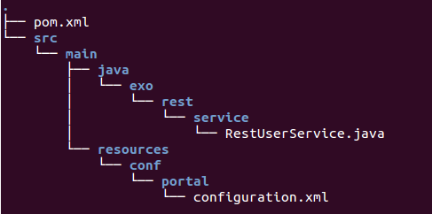
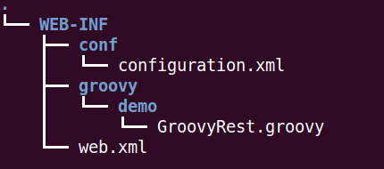

.. _Developing_Rest_Service:

#########################
Developing REST services
#########################

    eXo Platform has a REST API to expose some of data. But you may sometimes
    want to expose data in a different way or even expose data from
    another external system. In this case, eXo lets you create your own
    REST service.

    This chapter will outline the process of developing a REST service,
    deploying it into eXo Platform and testing it, via 3 ways:

    -  :ref:`Using Jax-RS <PLFDevGuide.DevelopingRESTServices.UsingJax-RS>`

    -  :ref:`Using Groovy REST service <PLFDevGuide.DevelopingRESTServices.UsingGroovyRESTService>`

.. note:: See :ref:`Chapter 3. eXo Web Services <#chapter-eXoWS>` for more information about REST and its main benefits.

.. _PLFDevGuide.DevelopingRESTServices.UsingJax-RS:

============
Using Jax-RS
============

Jax-RS (`JSR
311 <https://jcp.org/aboutJava/communityprocess/final/jsr311/index.html>`__)
is a Java API for developing applications using the REST architecture.

Assume that you want to create a demo REST service using Jax-RS that
requires the followings:

-  This REST service shows a list of usernames.

-  To run this REST service, you should belong to a defined group.

-  The list of usernames will be under the JSON responses format.

1. Create a Maven project named **rest** with the following structure:

|image0|

2. Declare the dependencies needed for the demo REST service in the
   ``pom.xml`` of the Java project (you can go to the `eXo Platform repository <http://repository.exoplatform.org/index.html>`__ 
   to check the artifact versions).

	-  **exo.ws.rest.core**: Used for REST service.

	-  **jsr250-api**: Used for annotation.

	-  **json-rpc**: Used for JSON.

	-  **exo.core.component.organization.api**: Used for retrieving data.

The ``pom.xml`` file now looks like:

.. code:: xml

    <project xmlns="http://maven.apache.org/POM/4.0.0" xmlns:xsi="http://www.w3.org/2001/XMLSchema-instance"
      xsi:schemaLocation="http://maven.apache.org/POM/4.0.0 http://maven.apache.org/maven-v4_0_0.xsd">
        <modelVersion>4.0.0</modelVersion>
        <groupId>exo.rest.service</groupId>
        <artifactId>rest</artifactId>
        <packaging>jar</packaging>
        <version>1.0-SNAPSHOT</version>
        <name>maven</name>
        <url>http://maven.apache.org</url>
        <dependencies>
            <dependency>
                <groupId>org.exoplatform.ws</groupId>
                <artifactId>exo.ws.rest.core</artifactId>
                <version>2.3.7-GA</version>
                <scope>provided</scope>
            </dependency>    
            <dependency>
                <groupId>org.exoplatform.core</groupId>
                <artifactId>exo.core.component.organization.api</artifactId>
                <version>2.6.0-GA</version>
                <scope>provided</scope>
            </dependency>
            <dependency>
                <groupId>javax.annotation</groupId>
                <artifactId>jsr250-api</artifactId>
                <version>1.0</version>
                <scope>provided</scope>
            </dependency>
            <dependency>
                <groupId>com.metaparadigm</groupId>
                <artifactId>json-rpc</artifactId>
                <version>1.0</version>
                <scope>provided</scope>
            </dependency>
        </dependencies>
    </project>

3. Edit the ``java/exo/rest/service/RestUserService.java`` file.

   .. code:: java

		package exo.rest.service;

		import javax.ws.rs.GET;
		import javax.ws.rs.Path;
		import javax.ws.rs.PathParam;
		import javax.ws.rs.Produces;
		import javax.ws.rs.core.CacheControl;
		import javax.ws.rs.core.Context;
		import javax.ws.rs.core.MediaType;
		import javax.ws.rs.core.Response;
		import javax.ws.rs.core.SecurityContext;

		import javax.annotation.security.RolesAllowed;

		import org.exoplatform.commons.utils.ListAccess;
		import org.exoplatform.container.ExoContainer;
		import org.exoplatform.container.ExoContainerContext;
		import org.exoplatform.services.organization.OrganizationService;
		import org.exoplatform.services.organization.User;
		import org.exoplatform.services.organization.UserHandler;
		import org.exoplatform.services.rest.resource.ResourceContainer;
		import org.exoplatform.services.security.Identity;
		import org.exoplatform.services.security.IdentityRegistry;
		import org.json.JSONArray;
		import org.json.JSONObject;

		/**
		 * Rest User Service!
		 */
		@Path("/demo")
		@Produces("application/json")
		public class RestUserService implements ResourceContainer {

		  @GET
		  @Path("/hello/{name}")
		  @RolesAllowed({"administrators"}) 
		  public String hello(@PathParam("name")
		  String name) {
			return "Hello " + name;
		  }

		  @GET
		  @Path("/listusers/{offset}")
		  public Response getListUserName(@Context  SecurityContext sc,@PathParam("offset") Integer offset) {
			JSONArray list = new JSONArray();
			JSONObject jsonObject = new JSONObject();
			String groupToCheck = "/platform/administrators";
		CacheControl cacheControl = new CacheControl();       cacheControl.setNoCache(true);
			cacheControl.setNoStore(true);

			if (sc.getUserPrincipal() == null || !this.isMemberOf(sc.getUserPrincipal().getName(), groupToCheck)) {

			  jsonObject.put("rights","NOT-ALLOWED");
			  list.put(jsonObject);

			} else {

			  OrganizationService organizationService = (OrganizationService) ExoContainerContext.getCurrentContainer()
																								 .getComponentInstanceOfType(OrganizationService.class);
			  UserHandler userHandler = organizationService.getUserHandler();
			  try {
				ListAccess<User> allUsers = userHandler.findAllUsers();
				
				if(offset == null || offset < 0)
				  offset = 0;
				int limit = 1000;
				int total = limit + offset;
				int totalUsers = allUsers.getSize();
			  
				if(offset < totalUsers && total > totalUsers){
				  total = totalUsers;
				}
				User[] users = null;

				for (int i = offset; i < total; i++) {
				  users = allUsers.load(i,1);
				  jsonObject = new JSONObject();
				  jsonObject.put("username", users[0].getUserName());
				  list.put(jsonObject);
				}
			  } catch (Exception e) {
				// TODO Auto-generated catch block
				e.printStackTrace();
			  }
			  
			}
			
			return Response.ok(list.toString(), MediaType.APPLICATION_JSON).cacheControl(cacheControl).build();

		  }

		  private boolean isMemberOf(String username, String role) {
			ExoContainer container = ExoContainerContext.getCurrentContainer();
			IdentityRegistry identityRegistry = (IdentityRegistry) container.getComponentInstanceOfType(IdentityRegistry.class);
			Identity identity = identityRegistry.getIdentity(username);
			return identity.isMemberOf(role);
		  }

		}

In the above code, **ResourceContainer** needs to be implemented. This
is used to make eXo services (for example, the components deployed
inside eXo Container) simply and transparently accessible via HTTP in a
RESTful manner. In other words, these services should be viewed as a set
of REST Resources-endpoints of the HTTP request-response chain. Those
services are called ResourceContainers.

-  The ``SecurityContext`` class is used to get the user information via
   the ``UserPrincipal`` method.

-  The following 2 methods are used to check authorization:

   -  The ``isMemberOf(String username, String role)`` function that
      checks if a user belongs to a group (for example,
      **/platform/administrator**). As a result, the user can see the
      list of users via
      http://mycompany.com:8080/portal/rest/demo/listusers/0.

   -  The ``@RolesAllowed({"administrators"})`` annotation that allows
      administrators only to execute
      http://mycompany.com:8080/portal/rest/demo/hello/eXo.

4. Edit the ``resources/conf/portal/configuration.xml`` file that 
   declares the REST service component in the portal container.

	.. code:: xml

		<?xml version="1.0" encoding="ISO-8859-1"?>
		<configuration>
			<component>
				<type>exo.rest.service.RestUserService</type>
			</component>
		</configuration>

5. Build the Maven project using the command: ``mvn clean install``.

6. Put the ``.jar`` file into the eXo Platform package.

	-  ``$PLATFORM_TOMCAT_HOME/lib`` (in Tomcat).

	-  ``$PLATFORM_JBOSS_HOME/standalone/deployments/platform.ear!/lib`` 
	   (in JBoss).

7. Restart the server, then open
   http://mycompany.com:8080/portal/rest/demo/listusers/0 in your browser.

	-  If you are not logged in as an admin yet, the
	   **[{"rights":"NOT-ALLOWED"}]** text will be displayed. This means you
	   do not have right to see the users list.

	-  If you are logged in as an admin, the list of users will be shown,
	   for example:
	   **[{"username":"david"},{"username":"james"},{"username":"john"},{"username":"mary"},{"username":"admin"},{"username":"paris"}]**.
	   
.. _PLFDevGuide.DevelopingRESTServices.UsingGroovyRESTService:

=========================
Using Groovy REST service
=========================

Besides using Jax-RS, you can also develop a REST service as a Groovy
script in your own
:ref:`extension <PLFDevGuide.eXoAdd-ons.PortalExtension>` that will be
loaded at startup by the REST engine.

To do this, you first need to have your own extension project as
described in :ref:`Creating your extension project <PLFDevGuide.eXoAdd-ons.PortalExtension.Howto>`. 
The below process will instruct how to write a simple Groovy REST script 
in your own extension and make it work in eXo Platform.

1. Create a Groovy script named
   ``custom-extension.war!/WEB-INF/groovy/demo/GroovyRest.groovy`` with 
   the simple content:

	.. code:: groovy

		// simple groovy script
		import javax.ws.rs.Path
		import javax.ws.rs.GET
		import javax.ws.rs.PathParam

		@Path("/groovyrest")
		public class GroovyRest {
		  @GET
		  @Path("helloworld/{name}")
		  public String hello(@PathParam("name") String name) {
			return "Hello " + name
		  }
		}

2. Declare the Groovy file in the ``custom-extension.war!/WEB-INF/conf/configuration.xml`` 
   file.

	.. code:: xml

		<?xml version="1.0" encoding="ISO-8859-1"?>
		<configuration>
			<external-component-plugins>
				<target-component>org.exoplatform.platform.gadget.services.GroovyScript2RestLoader.GroovyScript2RestLoaderExt</target-component>
				<component-plugin>
					<name>test</name>
					<set-method>addPlugin</set-method>
					<type>org.exoplatform.services.jcr.ext.script.groovy.GroovyScript2RestLoaderPlugin</type>
					<init-params>
						<value-param>
							<name>workspace</name>
							<value>portal-system</value>
						</value-param>
						<value-param>
							<name>node</name>
							<value>/exo:gadget-groovy</value>
						</value-param>
						<properties-param>
							<name>GroovyRest.groovy</name>
							<property name="autoload" value="true" />
							<property name="path" value="war:/groovy/demo/GroovyRest.groovy" />
						</properties-param>
					</init-params>
				</component-plugin>
			</external-component-plugins>
		</configuration>

The war custom-extension now looks like:

|image1|

3. Deploy your custom-extension into eXo Platform by putting
   ``custom-extension.war`` in the ``webapps`` folder and
   ``custom-extension-config.jar`` in the ``lib`` folder. See :ref:`How to <PLFDevGuide.eXoAdd-ons.PortalExtension.Howto>` 
   for both Tomcat and JBoss.

4. Start eXo Platform, then go to 
   http://mycompany.com:8080/portal/rest/groovyrest/helloworld/eXo. The
   output (Hello eXo) will be shown.

.. tip:: To change your Groovy script, follow a good practice that allows 
         you to update it from a local file onto remote server so that 
         you do not need to redeploy your entire package. First, make 
         your needed changes in the ``GroovyRest.groovy`` file, for 
         example, by putting an additional string as below:

			.. code:: groovy

				// simple groovy script
				import javax.ws.rs.Path
				import javax.ws.rs.GET
				import javax.ws.rs.PathParam

				@Path("/groovyrest")
				public class GroovyRest {
				  @GET
				  @Path("/helloworld/{name}")
				  public String hello(@PathParam("name") String name) {
					return "Hello " + name + ". Nice to meet you!"
				  }
				}

		 Then, use this following curl command to load your script via HTTP requests:

			.. code:: groovy

				$curl -uroot:gtn \
				-X POST \
				-H 'Content-type:script/groovy' \
				--data-binary @GroovyRest.groovy \
				http://mycompany.com:8080/rest/private/script/groovy/update/repository/portal-system/exo:gadget-groovy/GroovyRest.groovy

		 Now you can go to http://mycompany.com:8080/portal/rest/groovyrest/helloworld/eXo. 
		 You will see the message "*Hello eXo. Nice to meet you!*\ " printed out.

		 To read more about curl command, refer `here <http://curl.haxx.se/docs/manpage.html>`__.
	   
	   
	   

