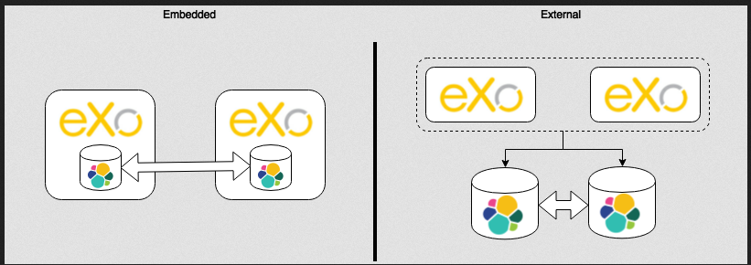

.. _Elasticsearch:

##############
Elasticsearch
##############

    Elasticsearch is a highly scalable open-source full-text search and
    analytics engine. It allows you to store, search, and analyze big
    volumes of data quickly.

    eXo Platform supports two deployment modes of Elastic search:

    -  **Embedded mode**: One node of Elasticsearch embedded in each eXo
       Platform instance.

    -  **External mode**: eXo Platform (deployed in standalone or
       cluster mode) is connected to an external Elasticsearch (deployed
       in standalone or cluster mode).

    |image0|

.. note:: With eXo Platform 4.4, the embedded mode is bundled by default with the platform as an add-on.

This chapter covers the following topics:

    -  :ref:`Elasticsearch configuration for embedded mode <Elasticsearch.ES_Embedded>`
       Configuration for Elasticsearch embedded mode.

    -  :ref:`Elasticsearch Configuration for external mode <Elasticsearch.ES_External>`
       Configuration for Elasticsearch external mode.

    -  :ref:`Elasticsearch Indexing architecture <Elasticsearch.ESIndexArchitecture>`
       Indexing Architecture
       
       
.. _Elasticsearch.ES_Embedded:

===========================
Elasticsearch embedded mode
===========================

An Elasticsearch node is embedded in the eXo Platform server (and is hosted
in the same JVM).

The Elasticsearch node is declared as:

-  Master: To manage the cluster with only one node.

-  Data: To index and store documents.

-  Client: To serve and coordinate requests from the platform.

By default:

-  The parameter ``es.cluster.name`` of the Elasticsearch cluster is
   exoplatform-es.

-  The parameter ``es.network.host`` is set to 127.0.0.1. This prevents
   accesses from IP other than localhost and prevents other nodes to
   join the ES cluster.

-  The parameter `` es.http.port`` is set by default to the port 9200:
   Elasticseach is bound to port 9200 for HTTP connections.

.. note:: Elasticsearch Embedded mode properties are configurable through :ref:`exo.properties <Configuration.ConfigurationOverview>` file. 
		  More details could be found :ref:`here <Configuration.ElasticSearch>`.
		  It is also possible to override Elasticsearch embedded mode configuration by using this property in the server startup:
			
			::
			
				-Dexo.es.embedded.configuration.file=/absolute/path/to/file
				
		  Where ``/absolute/path/to/file`` is the absolute path the the yml configuration file.
       

.. _Elasticsearch.ES_External:

===========================
Elasticsearch external mode
===========================

With the external mode, Elasticsearch nodes are not embedded in eXo 
Platform server, eXo Platform connects to the external Elasticsearch 
node or cluster.

To use the external mode, you need to uninstall the embedded mode using
this command:

::

    ./addon uninstall exo-es-embedded

or simply disable it in :ref:`exo.properties <Configuration.ConfigurationOverview>`
by setting to false the property :ref:`exo.es.embedded.enabled <Configuration.ElasticSearch>`:

::

    exo.es.embedded.enabled=false

The following plugins must be installed on Elasticsearch instance:

-  `Mapper Attachments plugin (5.6) <https://www.elastic.co/guide/en/elasticsearch/plugins/5.6/mapper-attachments.html>`__
-  `Ingest Attachement Processor plugin (5.6) <https://www.elastic.co/guide/en/elasticsearch/plugins/5.6/ingest-attachment.html>`__

.. note:: We highly recommend to use Elasticsearch 5.6 version.

As for embedded mode, some parameters should be configured for the
external mode through
:ref:`exo.properties <Configuration.ConfigurationOverview>` file:

-  ``exo.es.search.server.url``: The URL of the node used for searching.

-  ``exo.es.search.server.username``: The username used for BASIC
   authentication on the Elasticseach node used for searching.

-  ``exo.es.search.server.password``: The password used for BASIC
   authentication on the Elasticseach node used for searching.

-  ``exo.es.index.server.url``: The URL of the node used for indexing.

-  ``exo.es.index.server.username``: The username used for the BASIC
   authentication on the Elasticsearch node used for indexing.

-  ``exo.es.index.server.password``: The password used for the BASIC
   authentication on the Elasticsearch node used for indexing.

You can find more details about the above parameters, default values and
description in :ref:`Properties reference table <Configuration.PropertiesReference>`.

.. _Elasticsearch.ESIndexArchitecture:

===================================
Elasticsearch Indexing architecture
===================================

**Indexes**

An index in Elasticsearch is like a table in a relational database. It
has a mapping which defines the fields in the index, which are grouped
by multiple type. An index is a logical namespace which maps to one or
more primary shards and can have zero or more replica shards.

Learn more about indexing in Elasticsearch
`here <https://www.elastic.co/guide/en/elasticsearch/reference/current/_basic_concepts.html#_index>`__.

With eXo Platform and Elasticsearch, an index is dedicated to each
application (Wiki, Calendar, Documents...). All the application data
(for example wiki application data: wiki, wiki page, wiki attachment)
will be indexed in the same index.

**Sharding**

A shard is a single Lucene instance. It is a low-level worker unit which
is managed automatically by Elasticsearch.

Learn more about Sharding in Elasticsearch
`here <https://www.elastic.co/guide/en/elasticsearch/reference/current/_basic_concepts.html#_shards_amp_replicas>`__.

In eXo Platform with Elasticsearch:

-  Sharding will only be used for horizontal scalability.

-  eXo Platform does not use routing policies to route documents or
   documents type to a specific shard.

-  The default number of shards is 5: the default value of
   Elasticsearch.

-  This value is configurable per index by setting the parameter
   ``shard.number`` in the constructor parameters of the connectors.

**Replicas**

-  Each index can be replicated over the Elasticsearch cluster.

-  The default number of replicas is 1 (the default value of
   Elasticsearch) which means one replica for each primary shard.

-  This value is configurable per index by setting the parameter
   ``replica.number`` in the constructor parameters of the connectors.

