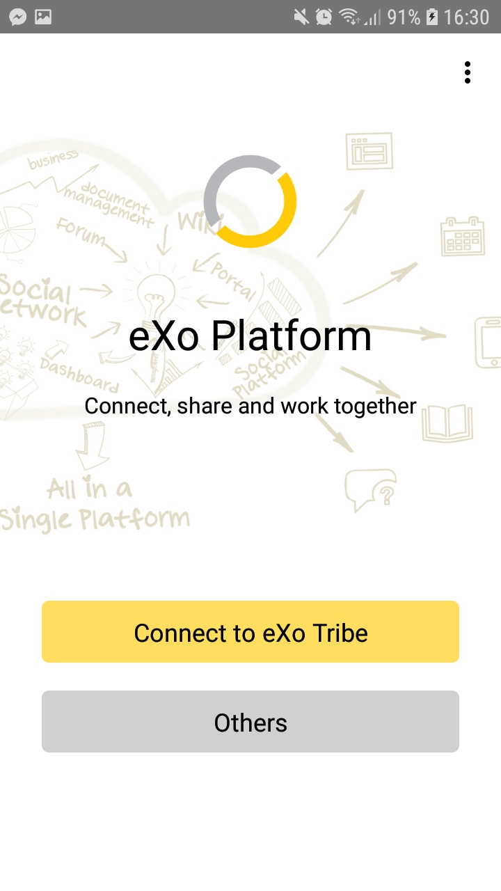

.. _Features:

#########
Features
#########

eXo Mobile enables you to connect and collaborate on the go. Native
iPhone, iPad and Android apps integrate easily and securely with sites
built on eXo Platform. Follow the latest updates from your colleagues
and groups, interact with your personal dashboards, browse and edit your
files, and more, at any time, from anywhere.

.. Features.News_feed:

News Feed
~~~~~~~~~~~

You can receive messages from co-workers, follow your group's latest
activities, and collaborate in real-time. You can also see when changes
are made to the wiki pages, forums, calendars or documents you consider
essential to your work.

|image0|

You can react to posted activities by commenting or liking.

|image6|

Left menu
~~~~~~~~~~

The left menu allowing you :
- to move from one page to another: home page, people, forum, wiki, documents...
- to select a space from MY SPACES list.

|image1|

Documents
~~~~~~~~~~

You can easily access your documents using your mobile device's native
document viewers, for a more user-friendly experience. eXo Platform's
document management capabilities synchronize user permissions across the
social intranet.

|image2|

Multiple accounts
~~~~~~~~~~~~~~~~~~

As of version 2.5, eXo Mobile makes it easy to create, edit and use
multiple accounts in the app.

As before, the accounts are accessible on the initial login screen. One
difference though is that the *Accounts* tab appears only if you have
more than one accounts configured.

|image3|

Uploading files
~~~~~~~~~~~~~~~~~

Share a snapshot of a recent whiteboard session or a new product
prototype with your co-workers. Your images and files could be added to 
your eXo Platform social intranet directly from your mobile device.

|image5|

|image4|

Security
~~~~~~~~~~

By default eXo Mobile does not store your username and password,
ensuring that only you can connect to your account.

Files and cache stored on the device are placed in a private folder
within your app, only accessible to your app's process.

Basic authentication is used so your credentials are not clearly visible
on the network. For improved security, configure HTTPS on your server
and use a https URL.

Familiar User Experience
~~~~~~~~~~~~~~~~~~~~~~~~~~

Designed to leverage the unique features of iPhone, iPad and Android
devices, eXo Platform native mobile apps let you access and interact
with your social intranet in a familiar environment.

