.. _Forum:

#####################
Building Your Forum
#####################


    The **Forums** application is designed for the group discussion and
    user-generated content in which participants with common interests
    can exchange their opinions on a subject.

    The chapter provides you a guide to use all **Forums** features or
    to make **Forums** work in your desired manner.

    -  :ref:`Regular user <Regular-users>`

       Detailed instructions on how to do common actions that are for
       regular users, such as creating topics and posts, subscribing,
       using BBCode, or changing user settings.

    -  :ref:`Moderator <Moderator>`

       Introduction to the Moderation tasks that are for moderators, and
       steps to perform them, including: moderating forums/topics/posts,
       viewing all pending moderation tasks, or banning IPs.

    -  :ref:`Administrator <Administrator>`

       Details about advanced tasks that are for administrators only,
       including setting up the Forum portlet, managing
       categories/forums/users and other administrative tasks.

In **Forums**, the role of each user group is clear and very important.
Each role has a set of tasks that they can execute. Administrators and
moderators are responsible for setting up and maintaining **Forums**.
With the highest rights, the administrators are in charge of the entire
management tasks, including form configurations, users management,
permissions, categories, forums, topics and messages. With sub-sets of
administrative permissions, the moderators will manage the respective
sub-sets of the forum.

The user interface will indicate which features are available to you,
based on your role.

-  As a regular user, you will have the User bar and Action bar with the basic actions.

|image0|

-  As a moderator, you will have the User bar and Action bar with a sub-set of certain capabilities.

|image1|

-  As an administrator, you will have the Administration bar which is
   basically the User bar with more administrative actions. You also see
   the Action bar with the advanced actions on forums and categories.
   Most of management tasks are shown via these bars.
   
|image2|   

To have an overall look of actions which users of each role can do in
the **Forums** application, see the following table:

+----------------------------+-------------------+------------+------------+------------+------------+
| Features                   | Description       | Administra | Moderator  | Regular    | Guest      |
|                            |                   | tor        |            | user       |            |
+============================+===================+============+============+============+============+
|  Subscribing to RSS feeds  | Gets a link to a  |            |            |            |            |
|  			     | forum for easy    |   |OK1|    |  |OK2|     |   |OK3|    |  |OK4|     |
|               	     | sharing.          |            |            |            |            |
+----------------------------+-------------------+------------+------------+------------+------------+
|   Attaching a file         | Uploads an        |            |            |            |            |
|                            | attachment to a   |            |            |            |            |
|                            | topic/post,       |   |OK5|    |  |OK6|     |   |OK7|    |  |OK8|     |
|                            | previews and      |            |            |            |            |
|                            | downloads it.     |            |            |            |            |
+----------------------------+-------------------+------------+------------+------------+------------+
|  Bookmarks    	     | Bookmarks a       |            |            |            |            |
|                            | category, forum,  |   |OK9|    |  |OK10|    |   |OK11|   |  |NOK1|    |
|                            | topic.            |            |            |            |            |
+----------------------------+-------------------+------------+------------+------------+------------+
|  Creating a post           | Posts a reply,    |            |            |            |            |
|  			     | quote, private    |  |OK12|    |  |OK13|    |   |OK14|   |  |NOK2|    |
|                            | post, quick       |            |            |            |            |
|                            | reply.            |            |            |            |            |
+----------------------------+-------------------+------------+------------+------------+------------+
|  Editing your post 	     | Edits a post,     |            |            |            |            |
| 			     | quote and private |  |OK15|    |  |OK16|    |   |OK17|   |  |NOK3|    |
| 			     | post.             |            |            |            |            |
+----------------------------+-------------------+------------+------------+------------+------------+
|  Deleting your post        | Deletes a post    |            |            |            |            |
|			     | inside a specific |  |OK18|    |  |OK19|    |   |OK20|   |  |NOK4|    |
|  			     | topic.            |            |            |            |            |
+----------------------------+-------------------+------------+------------+------------+------------+
|  Creating a topic          | Starts a new      | |OK21|     |  |OK22|    |   |OK23|   |  |NOK5|    |
|			     | topic.            |            |            |            |            |
+----------------------------+-------------------+------------+------------+------------+------------+
|  Editing a topic 	     | Edits a topic in  |  |OK26|    |  |OK25|    |   |OK24|   |  |NOK6|    |
|                            | a specific forum. |            |            |            |            |
+----------------------------+-------------------+------------+------------+------------+------------+
|  Deleting a topic 	     | Deletes a topic   |  |OK27|    |  |OK29|    |   |OK28|   |  |NOK7|    |
| 	   		     | inside a specific |            |            |            |            |
+----------------------------+-------------------+------------+------------+------------+------------+
|  Locking/Unlocking a topic | Locks/Unlocks a   |            |            |            |            |
| 			     | topic inside a    |  |OK30|    |  |OK31|    |   |NOK8|   |  |NOK9|    |
|           		     | specific forum.   |            |            |            |            |
+----------------------------+-------------------+------------+------------+------------+------------+
|  Adding a poll 	     | Adds a poll to a  |  |OK32|    |  |OK33|    |   |OK34|   |  |NOK10|   |
|  			     | topic.            |            |            |            |            |
+----------------------------+-------------------+------------+------------+------------+------------+
|  Rating a topic 	     | Evaluates a topic |  |OK35|    |  |OK36|    |   |OK37|   |  |NOK11|   |
| 			     | by rating stars.  |            |            |            |            |
+----------------------------+-------------------+------------+------------+------------+------------+
|  Adding a tag 	     | Creates a new tag |  |OK38|    |  |OK39|    |   |OK40|   |  |NOK12|   |
| 			     | and tags a topic. |            |            |            |            |
+----------------------------+-------------------+------------+------------+------------+------------+
|  Sending private messages  | Sends or receives |  |OK41|    |  |OK42|    |   |OK43|   |  |NOK13|   |
|  			     | private messages. |            |            |            |            |
+----------------------------+-------------------+------------+------------+------------+------------+
|  Watching 		     | Subscribes to a   |            |            |            |            |
| 			     | category, forum,  |            |            |            |            |
| 			     | topic to receive  |            |            |            |            |
| 			     | email             |  |OK44|    |  |OK45|    |   |OK46|   |  |NOK14|   |
|			     | notifications of  |            |            |            |            |
|    			     | new posts or      |            |            |            |            |
|         		     | topics.           |            |            |            |            |
+----------------------------+-------------------+------------+------------+------------+------------+
|  User settings 	     | Changes profile   |            |            |            |            |
| 			     | settings,         |  |OK49|    |  |OK48|    |   |OK47|   |  |NOK15|   |
|			     | personal forum    |            |            |            |            |
| 		             | settings.         |            |            |            |            |
+----------------------------+-------------------+------------+------------+------------+------------+
| Sticking/Unsticking a topic| Sticks/Unsticks a |            |            |            |            |
|  			     | topic inside a    |  |OK50|    |  |OK51|    |   |OK52|   |  |NOK16|   |
|                            | specific forum.   |            |            |            |            |
+----------------------------+-------------------+------------+------------+------------+------------+
|  Locking/Unlocking a topic | Closes/Opens a    |            |            |            |            |
|  			     | topic inside a    |  |OK53|    |  |OK54|    |   |NOK18|  |  |NOK17|   |
|                            | specific forum.   |            |            |            |            |
+----------------------------+-------------------+------------+------------+------------+------------+
| 	Splitting a topic    | Divides one topic |            |            |            |            |
|                            | into two separate |  |OK56|    |  |OK55|    |   |NOK19|  |  |NOK20|   |
| 			     | topics.           |            |            |            |            |
+----------------------------+-------------------+------------+------------+------------+------------+
|  Merging topics 	     | Combines two or   |            |            |            |            |
|  			     | more topics into  |  |OK57|    |  |OK58|    |   |NOK22|  |  |NOK21|   |
| 			     |  one.             |            |            |            |            |
+----------------------------+-------------------+------------+------------+------------+------------+
| Managing a poll 	     | Creates, edits,   |            |            |            |            |
|  			     | deletes, closes   |  |OK60|    |  |OK59|    |   |NOK23|  |  |NOK24|   |
|  			     | and reopens a     |            |            |            |            |
|  			     | poll.             |            |            |            |            |
+----------------------------+-------------------+------------+------------+------------+------------+
|  Moving a topic 	     | Moves one         |            |            |            |            |
|  			     | topic/post from a |            |            |            |            |
| 			     | forum/topic to    |  |OK61|    |  |OK62|    |   |NOK26|  |  |NOK25|   |
|  			     | the other         |            |            |            |            |
|  			     | forum/topic.      |            |            |            |            |
+----------------------------+-------------------+------------+------------+------------+------------+
|  Approving a topic 	     | Changes a new     |            |            |            |            |
|			     | topic/post from   |            |            |            |            |
| 			     | pending status to |            |            |            |            |
|  			     | normal status so  |  |OK64|    |  |OK63|    |   |NOK27|  |  |NOK28|   |
| 			     | that guests and   |            |            |            |            |
|  			     | normal users can  |            |            |            |            |
| 			     | view.             |            |            |            |            |
+----------------------------+-------------------+------------+------------+------------+------------+
|  Uncensoring a post 	     | Allows a topic    |            |            |            |            |
|                            | which has         |  |OK65|    |  |OK66|    |  |NOK30|   |  |NOK29|   |
|			     | censored content  |            |            |            |            |
|  			     | to be displayed.  |            |            |            |            |
+----------------------------+-------------------+------------+------------+------------+------------+
|  Showing/Hiding a post     | Allows a post to  |  |OK68|    |  |OK67|    |   |NOK31|  |  |NOK32|   |
| 			     | be shown/hidden.  |            |            |            |            |
+----------------------------+-------------------+------------+------------+------------+------------+
| Managing pending tasks     | Manages all       |            |            |            |            |
| 			     | topics/posts      |            |            |            |            |
|  			     | waiting for       |  |OK69|    |  |OK70|    |   |NOK33|  |  |NOK34|   |
|			     | moderation in one |            |            |            |            |
| 			     | place.            |            |            |            |            |
+----------------------------+-------------------+------------+------------+------------+------------+
|  Managing a watch 	     | Manages the       |            |            |            |            |
| 			     | subscription      |            |            |            |            |
| 			     | (watch), edits    |  |OK72|    |  |OK71|    |   |NOK36|  |  |NOK35|   |
| 			     | and deletes a     |            |            |            |            |
| 			     | subscribed email. |            |            |            |            |
+----------------------------+-------------------+------------+------------+------------+------------+
|  Banning users 	     | Bans users from   |            |            |            |            |
|  			     | accessing         |  |OK73|    |  |NOK37|   |   |NOK38|  |  |NOK39|   |
| 			     | specific forums   |            |            |            |            |
| 			     | or categories.    |            |            |            |            |
+----------------------------+-------------------+------------+------------+------------+------------+
|  Adding a forum 	     | Adds a new forum  |            |            |            |            |
|  		             | to a specific     |  |OK74|    |  |NOK40|   |   |NOK41|  |  |NOK42|   |
| 		             | category.         |            |            |            |            |
+----------------------------+-------------------+------------+------------+------------+------------+
|  Editing a forum 	     | Changes the       |            |            |            |            |
|  			     | title,            |            |            |            |            |
| 			     | description,      |            |            |            |            |
| 			     | moderator,        |  |OK75|    |  |OK76|    |   |NOK43|  |  |NOK44|   |
| 			     | permissions of a  |            |            |            |            |
| 			     | forum. However,   |            |            |            |            |
| 			     | moderators cannot |            |            |            |            |
| 			     | set moderators    |            |            |            |            |
|           		     | for a forum.      |            |            |            |            |
+----------------------------+-------------------+------------+------------+------------+------------+
|  Deleting a forum 	     | Deletes a forum   |            |            |            |            |
|  			     | from a specific   |  |OK77|    |  |NOK45|   |   |NOK46|  |  |NOK47|   |
| 			     | category.         |            |            |            |            |
+----------------------------+-------------------+------------+------------+------------+------------+
|  Locking/Unlocking a forum | Locks a forum so  |            |            |            |            |
|  			     | that it can be    |  |OK78|    |  |OK79|    |   |NOK48|  |  |NOK49|   |
| 			     | viewed only.      |            |            |            |            |
+----------------------------+-------------------+------------+------------+------------+------------+
|  Closing/Opening a forum   | Closes/Opens a    |            |            |            |            |
|  			     | forum. The closed |            |            |            |            |
| 			     | forums are still  |  |OK81|    |  |OK80|    |   |NOK51|  |  |NOK50|   |
|			     | manageable by     |            |            |            |            |
| 			     | administrators    |            |            |            |            |
| 			     | and moderators.   |            |            |            |            |
+----------------------------+-------------------+------------+------------+------------+------------+
|  Moving a forum 	     | Moves a forum     |            |            |            |            |
|  			     | from one category |  |OK82|    |  |NOK52|   |   |NOK53|  |  |NOK54|   |
| 			     | to the other.     |            |            |            |            |
+----------------------------+-------------------+------------+------------+------------+------------+
|  Exporting a forum 	     | Exports a forum   |            |            |            |            |
|  			     | in the format of  |  |OK83|    |  |OK84|    |   |NOK56|  |  |NOK57|   |
| 			     | a ``.zip`` or     |            |            |            |            |
| 			     | ``.xml`` file.    |            |            |            |            |
+----------------------------+-------------------+------------+------------+------------+------------+
|  Importing a forum 	     | Imports a forum   |            |            |            |            |
| 			     | from a            |            |            |            |            |
| 			     | ``.zip``/``.xml`` |  |OK85|    |  |NOK58|   |   |NOK59|  |  |NOK60|   |
| 			     | file into the     |            |            |            |            |
| 			     | **Forums**        |            |            |            |            |
| 			     | application.      |            |            |            |            |
+----------------------------+-------------------+------------+------------+------------+------------+
|  Adding a category 	     | Adds a new        |  |OK86|    |  |NOK63|   |   |NOK62|  |  |NOK61|   |
| 			     | category.         |            |            |            |            |
+----------------------------+-------------------+------------+------------+------------+------------+
|  Editing a category 	     | Edits a category  |            |            |            |            |
|  			     | and changes its   |  |OK87|    |  |NOK64|   |   |NOK65|  |  |NOK66|   |
| 			     | properties.       |            |            |            |            |
+----------------------------+-------------------+------------+------------+------------+------------+
|  Exporting a category      | Exports           |            |            |            |            |
| 			     | categories in the |            |            |            |            |
| 			     | format of a       |  |OK88|    |  |NOK69|   |   |NOK68|  |  |NOK67|   |
| 			     | ``.zip`` or       |            |            |            |            |
| 			     | ``.xml`` file.    |            |            |            |            |
+----------------------------+-------------------+------------+------------+------------+------------+
|  Importing a category      | Imports a         |            |            |            |            |
| 			     | category from a   |            |            |            |            |
|			     | ``.zip``/``.xml`` |  |OK89|    |  |NOK70|   |   |NOK71|  |  |NOK72|   |
| 			     | file into the     |            |            |            |            |
| 			     | **Forums**        |            |            |            |            |
| 			     | application.      |            |            |            |            |
+----------------------------+-------------------+------------+------------+------------+------------+
|  Deleting a category 	     | Deletes a         |            |            |            |            |
|  			     | category and all  |  |OK90|    |  |NOK75|   |   |NOK74|  |  |NOK73|   |
| 			     | forums, topics,   |            |            |            |            |
| 			     | posts inside it.  |            |            |            |            |
+----------------------------+-------------------+------------+------------+------------+------------+
|  Administrating Sorting    | Sorts forums,     |            |            |            |            |
| 			     | topics according  |  |OK91|    |  |NOK76|   |   |NOK77|  |  |NOK78|   |
|  			     | to specific       |            |            |            |            |
| 			     | conditions.       |            |            |            |            |
+----------------------------+-------------------+------------+------------+------------+------------+
|  Administrating Censor     | Defines keywords  |            |            |            |            |
| 			     | that will be      |  |OK92|    |  |NOK81|   |   |NOK80|  |  |NOK79|   |
| 			     | censored in a     |            |            |            |            |
| 			     | forum.            |            |            |            |            |
+----------------------------+-------------------+------------+------------+------------+------------+
|  Customizing an email      | Defines content   |  |OK93|    |  |NOK82|   |   |NOK83|  |  |NOK84|   |
|  notification		     | of the email      |            |            |            |            |
| 			     | notifications.    |            |            |            |            |
+----------------------------+-------------------+------------+------------+------------+------------+
|  Customizing BBCodes       | Adds, edits and   |            |            |            |            |
|  			     | deletes the       |            |            |            |            |
| 			     | BBCode tags used  |  |OK94|    |  |NOK87|   |   |NOK86|  |  |NOK85|   |
| 			     | in writing        |            |            |            |            |
| 			     | posts/topics.     |            |            |            |            |
+----------------------------+-------------------+------------+------------+------------+------------+
|  Setting up auto-pruning   | Sets up           |            |            |            |            |
| 			     | auto-pruning to   |            |            |            |            |
|  			     | clean a large     |            |            |            |            |
| 			     | amount of         |  |OK95|    |  |NOK88|   |   |NOK89|  |  |NOK90|   |
| 			     | obsolete and      |            |            |            |            |
| 			     | inactive topics   |            |            |            |            |
| 			     | based on          |            |            |            |            |
| 			     | criteria.         |            |            |            |            |
+----------------------------+-------------------+------------+------------+------------+------------+
|  Banning IPs 		     | Bans IPs in the   |            |            |            |            |
| 			     | whole **Forums**  |            |            |            |            |
| 			     | application (only |            |            |            |            |
| 			     | administrators)   | |OK96|     |  |OK97|    |   |NOK91|  |  |NOK92|   |
| 			     | and in specific   |            |            |            |            |
|			     | forums only       |            |            |            |            |
| 			     | (administrators   |            |            |            |            |
|           		     | and moderators).  |            |            |            |            |
+----------------------------+-------------------+------------+------------+------------+------------+
|  Managing users 	     | Manages user's    |            |            |            |            |
|  			     | profile, promotes |            |            |            |            |
|			     | users, bans       |  |OK98|    |  |NOK95|   |   |NOK94|  |  |NOK93|   |
| 			     | users, views a    |            |            |            |            |
| 			     | topic and post of |            |            |            |            |
| 			     | a specific user.  |            |            |            |            |
+----------------------------+-------------------+------------+------------+------------+------------+

.. note:: **(\*):** Regular users can only edit/delete their own posts/topics.

.. _Regular-users:

============
Regular user
============

This section describes actions that a regular user can perform in the
**Forums** application of eXo Platform, including:

-  :ref:`Topics <Regularusers-Topics>`

   Steps to create, edit, rate and tag/untag a topic, and how to create
   a poll.

-  :ref:`Posts <Regularusers-Posts>`

   Steps to post a quick/advanced/private reply, to reply with a quote,
   to edit/delete a post.

-  :ref:`Using BBCodes <Regularusers-UsingBBCodes>`

   Details about BBCodes and how to use them.

-  :ref:`Private messages <Regularusers-PrivateMessages>`

   Steps to send and receive a private message.

-  :ref:`Bookmarks <Regularusers-Bookmarks>`

   Steps to add/view and delete a bookmark.

-  :ref:`Subscribing to RSS feeds <SubscribingRSSFeeds>`

   The ways to get an RSS feed.

-  :ref:`Watching <Regularusers-Watching>`

   How to watch your desired category/forum or topic.

-  :ref:`Getting
   permalinks <Regularusers-GettingPermanentLinks>`

   Steps to get permalinks of a specific forum/topic/category and share
   it with others

-  :ref:`User settings <Regularusers-UserSettings>`

   Details about editing your profile, changing forum settings and
   editing your subscription.

.. _Regularusers-Topics:

Topics
~~~~~~~

This section represents all actions related to topics that a regular
user can perform, including:

-  :ref:`Creating a topic <Create-topic>`

-  :ref:`Editing a topic <EditingTopic>`

-  :ref:`Creating a poll <Create-poll>`

-  :ref:`Rating a topic <Rate-topics>`

-  :ref:`Tagging a topic <Tagging-topic>`

.. _Create-topic:

Creating a topic
----------------

1. Go into the forum where you want to start a new topic.

2. Click |image3|.

|topic|

3. Enter the topic title and its content. The title must be less than 100
characters (special characters are accepted). You may set :ref:`other
optional properties <TopicProperties>` if you want.

.. _AttachingFiles:

-  Click Attach files to attach files to your message. The Attach File
   form is displayed.

   -  Click Select File to select a file from your local device, then
      click Save to accept attaching your file to the message. The
      maximum size for the attachment is 20Mb.

   -  Click |image4| next to the attachment if you want to remove it.

-  Use :ref:`BBCodes <Regularusers-UsingBBCodes>` to format text, or 
	to insert images, videos and links.

4. Click Preview to see the topic before submitting, or click Submit to
complete your topic.

.. _Share-topic-AS:

Sharing the topic on Activity Stream
`````````````````````````````````````

When a topic is created, an activity containing the topic title and
content, the number of replies, and average rating is also created on
the Activity Stream.

Replies, rating |image5|, information about the added/closed/removed
poll |image6| and information about the edited/locked/unlocked/closed
topic |image7| are added to the activity as comments.

When a comment is added to the activity from the Activity Stream, it
will be updated to the **Forums** application as a reply of the topic.

When the topic title and content is modified, the activity will be
updated and a comment is added to the activity.

|image8|

-  Click the topic title to directly open it in the **Forums**
   application.

-  Click |image9| to jump to the **Forums** application with the New
   Post form opening for you to reply the topic.

-  Click |image10| to jump to the **Forums** application and view the
   latest reply.

.. note:: - In a forum that :ref:`enables moderation <SettingForumPermissions>`, new topics will need reviewing and approving by moderators before being published.

		  - You may not have right to start topics if the administrators/moderators set the Starting topic permission on the :ref:`category <SettingCategoryPermission>` and/or the :ref:`forum <SettingForumPermissions>` for specific users/roles/groups only.

When creating a topic, you can also add extra properties to this topic:

-  :ref:`Setting the topic options <CreatingTopics.SettingTopicOptions>`.

-  :ref:`Controlling who can view or post in your topic by setting topic permissions <CreatingTopics.SettingTopicPermissions>`.

.. _CreatingTopics.SettingTopicOptions:

**Setting the topic options**

Going to the Options tab, you can select status, state, type of the
topic and more.

|image11|

*Details:*

+------------------------+---------------------------------------------------+
| Field                  | Description                                       |
+========================+===================================================+
| Close the topic        | Sets the topic to open or close state.            |
+------------------------+---------------------------------------------------+
| Lock the topic         | Sets the topic to locked or unlocked status.      |
+------------------------+---------------------------------------------------+
| Stick the topic        | Checks this option to stick the topic. A sticky   |
|                        | topic will be located at the top of the topics    |
|                        | list. A sticky topic will not fall down in the    |
|                        | list if any new posts are added.                  |
+------------------------+---------------------------------------------------+
| Moderate the posts     | Checks this option if you want posts to be        |
|                        | moderated before being published.                 |
+------------------------+---------------------------------------------------+
| Notify on post         | Checks this option to enable the notification     |
|                        | email when there are new posts in your topic.     |
+------------------------+---------------------------------------------------+

.. _CreatingTopics.SettingTopicPermissions:

**Setting topic permissions**


You can allow specific users/roles/groups only to view and reply on your
topic by going to the Permissions tab. By default, all users can view
and reply on a topic.

|image12|

To set the permission to certain users, you can enter their usernames
manually;

Or, click

-  |image13| to select users.

-  |image14| to select users defined by specific roles. When ticking
   *Restrict who can view in this topic to* or *Restrict who can post in
   this topic to*, if you set the \* membership for the selected group,
   all users of that group will be restricted to only viewing or posting
   in this topic.

-  |image15| to select groups.

Then, click Add to perform adding the selected ones.

See :ref:`here <SettingCategoryPermission>` for more details.

.. _Editing-topic:

Editing a topic
---------------

Regular users can only edit their own topic.

1. Open your desired topic and click |image16| on the Action bar. For
regular users, this button is only shown when you are the creator.

2. Click Edit from the drop-down menu to open the Edit Topic form.

|image17|

3. Make changes to your desires. Also, leave the reason in the Reason 
field if needed.

4. Click Submit to finish.

.. _Create-poll:

Creating a poll
---------------

Each topic may have a poll question with pre-defined options for users
to select. As a regular user, you can only add a poll question to your
own topic. Meanwhile, administrator and moderator can add the poll to
any topics.

1. Go to the topic you want to add a poll.

2. Click |image18| on the Action bar, then select Add Poll from the
drop-down menu.

3. Enter the poll question and options.

*Details:*

|image19| **Poll Question**: Question raised for polling that is
required and must be less than 100 characters.

|image20| **Poll Options**: Options which allow users to select as their
answers. Click |image21| to remove a poll option. And, click |image22|
to add a poll option.

|image23| **Close Poll**: Period after which the poll is closed.

|image24| **Users may change their votes**: Allows users to change their
votes or not.

|image25| **Allow Multiple Choices**: Allows users to vote for multiple
options or not.

4. Click Submit Poll to complete. The topic that contains the poll is
marked with |image26| in the topics list.

|image27|

To perform further actions on this poll, simply left-click More Actions
on the Poll panel to open the drop-down menu. Here, you can edit,
close/reopen or remove the poll by clicking the relevant button.

|imagem|

.. _Rate-topics:

Rating a topic
--------------

The **Forums** application provides an intuitive rating experience
through a five-star scale. Your choice of five stars means the highest
rating for the topic.

1. Go to the topic you want to vote.

2. Click |image28| on the Action bar.

The Rate This Topic form will appear.

|image29|

3. Rate the topic by clicking the star. The number of selected stars will
be changed from grey into yellow.

4. Click Close to quit the form.


.. note:: Each user can only vote for a topic once. The function is disabled in closed topics and with banned users.

.. _Tagging-topic:

Tagging a topic
---------------

This function is for all logged-in users. Tags are keywords which are
used as labels to describe or categorize the topic content. One topic
may have several tag names. Using tags allows you to categorize topics
based on the actual content. Even, it can be a better way to find a
specific topic than a full-text search.

1. Click |image30| on the Action bar.

An input text box will pop up.

|image31|

2. Enter a tag name or multiple tags separated by a space or select
existing tags in the suggestion list that appears when typing.

3. Press **Enter** or click Add Tag button.

Tags which are assigned to the topic appear as below.

|image32|

.. _Untag-topic:

Untagging a topic
``````````````````

**The first way**

-  Simply click |image33| next to that tag.

**The second way**

This way allows you to untag one or multiple topics.

1. Click a tag name which you want to remove from all tagged topics. You
will be be directed to the tags management page which shows all topics
assigned a same tag.

2. Tick your desired topic checkboxes from the topics list.

3. Click |image34| on the Action bar, then select Untag from the 
drop-down menu.

4. Click **OK** in the confirmation message to remove this tag.

.. _Regularusers-Posts:

Posting a reply
~~~~~~~~~~~~~~~~~~

To post a reply, select the topic you want to reply to. You can reply to
any topic as long as it is not closed and restricted. While you are
viewing the topic, there are many ways to reply:

|image35|

-  |image36| :ref:`Clicking the Post Reply button that is at the top or bottom of the topic <Posts.PostingReplyWithRichTextEditor>`.

-  |image37| :ref:`Typing a message in the Quick Reply box at the bottom of the topic <Posts.PostingQuickReply>`.

-  |image38| :ref:`Replying with a quote <Posts.ReplyingWithQuote>`.

-  |image39| :ref:`Posting a private reply <Posts.PostingPrivateReply>`


.. _Posts.PostingReplyWithRichTextEditor:

Posting a reply with Rich text editor
-------------------------------------

You can post a reply with the Rich text editor as follows:

1. Go to the topic you want to post a reply.

2. Click |image40| on the top or bottom of the topic.

3. Enter your message in the textbox. 
Use:ref:`BBCodes <Regularusers-UsingBBCodes>`to format texts, or insert 
images, videos and links.

|image41|

Optionally, you can attach files to the topic by clicking Attach Files.
The attachment size must be less than 20Mb.

4. Optionally, click Preview to view your reply before submitting it.

5. Click Submit to finish.

.. _Posts.PostingQuickReply:

Posting a quick reply
---------------------

You can post a reply quickly with plain texts without taking into
account its format.

1. Scroll down to the bottom of the topic to see the Quick Reply box.

2. Enter your message. Use :ref:`BBCodes <Regularusers-UsingBBCodes>`
to format text, or insert images, videos and links.

3. Optionally, click Preview to view your reply before submitting it.

4. Click Quick Reply to submit you message.

.. _Posts.ReplyingWithQuote:

Replying with a quote
---------------------

You can include a quote from the previous message in your reply to a
specific post. This may substantially increase the readability of the
discussion topics when it is used correctly.

1. Click |image42| under the post you want to quote.

This will bring up the "Quote" form, with the previous message already
quoted in the textbox.

|image43|

2. Enter your message. Edit the quotation if necessary.

The quoted content is wrapped between BBCodes tags [QUOTE][/QUOTE] which
is automatically generated. Add your message content before or after
this quoted content.

To add a block quotation to your text, simply click |image44| from the
**WYSIWYG** editor toolbar.

|image45|

The block quotation appears on the location of your cursor with the
format as below:

|image46|

3. Click Submit to finish.

.. _Posts.PostingPrivateReply:

Posting a private reply
-----------------------

.. note:: This function is available only if the topic's author :ref:`is not suspended <ManagingUsers.DisablingUser>`.

You can send a private reply in a topic, which only allows the responded
user to view the message content.

1. Go into the topic you want to post the reply.

2. Click |image47| under the post to open the Private Post form.

3. Enter your message and send it as described in the :ref:`Posting a reply
with Rich text editor <Posts.PostingReplyWithRichTextEditor>` section.

.. note:: Private posts will not be checked for approval when they are posted in a topic that has the 'Posts moderation' enabled. Private posts are displayed with the 'Post Private!' label.

.. _Edit-delete-post:

Editing/Deleting your post
--------------------------

.. _Edit-post:

Editing your post
``````````````````

This function is to make changes on the post which has been submitted.

1. Click |image48| under the post you want to edit.

2. Make changes on the post, then click Submit to accept your changes. 
When you edit your post, you also can upload attachments, or delete 
existing ones.

.. _Delete-post:

Deleting your post
```````````````````

Simply click |image49| under your post that you want to delete, then
click **OK** in the confirmation message.

.. _Regularusers-UsingBBCodes:

Using BBCodes
~~~~~~~~~~~~~

BBCodes (Bulletin Board Codes) are special tags in bulletin boards that
help users enrich their posts with formatting and inclusions. They are
useful to provide guarded formatting capabilities to the forum users
without the risk of breaking the HTML markup of the page. BBCode itself
is similar in style to HTML: tags are enclosed in square braces "[" and
"]" rather than "<" and ">" and it offers greater control over what and
how something is displayed.

Depending on the :ref:`BBCode template customized <AdministrativeTasks.CustomizingBBcodes>`
by administrators only, you may find it very easy to add BBCodes to your
posts through a toolbar above the message area on the posting form. You
can either type the BBCode tags manually or use the toolbar in the
posting form. To easily get the BBCode tags without typing them, simply
click the respective icon which is shown on the toolbar above the
message area.

|image50|

Click |image51| on the toolbar to get the full list of built-in BBCode
explanations and examples.

|image52|

.. _Regularusers-PrivateMessages:

Private messages
~~~~~~~~~~~~~~~~~

Private messages will not be moderated and only viewable for recipients.
Only logged-in users can do the following actions on private messages:

.. _Send-Private-message:

Sending a private message
--------------------------

1. Click the username or avatar of the user you want to send
message, then select Send Private Message from the drop-down menu.

|image53|

The Private Messages form will appear.

|image54|

2. Enter the username of the other recipients;

Or, click the icons next to the Send to field to select more others (if
you want to send to many users at the same time). Note that if you
select a group with the \* membership, all users of that group will
receive the message, regardless of their membership role.

3. Type your message title and content.

4. Click Send to send the message.

.. _Receive-private-message:

Receiving a private message
----------------------------

When you have received a private message, there will be a notification
on your **User** bar.

|image55|

Click |image56| to open the Private Messages form.

|image57|

*Details:*

|image58| **Inbox**: Where to view or delete received messages.

-  Click the message title to see its content.

-  Click |image59| to reply the message. You will be redirected to the
   Compose New Message tab.

   |image60|

   Enter the message content into the Message field, then click Send.


.. note:: You can also send your message to other users. See :ref:`here <Send-Private-message>` for more details.

-  Click |image61| to delete the message.

|image62| **Sent Messages**: Where to view or delete your sent messages.

|image63| **Compose New Message**: Where to compose new messages.


.. _Regularusers-Bookmarks:

Bookmarks
~~~~~~~~~~

In the **Forums** application, the **Bookmark** function is to collect
links to a category, forum or topic you have visited, so that you can
return to that category, forum or topic directly. Bookmarks can be
created and managed by yourself through the following actions:

.. _Add-bookmark:

Adding a bookmark
-------------------

This function is for all logged-in users to save links to categories,
forums or topics into the Forum Bookmark.

1. Go into the object (category, forum or topic) you want to bookmark.

2. Click |image64| on the Action bar;

Or, right-click the object title and select Bookmarks from the drop-down
menu. The bookmarked link will be added to your bookmarks list.

.. _View-bookmark:

Viewing a bookmark
-------------------

To view a bookmark, click |image65| on your **User** bar. 
This will bring up the My Bookmarks form, with the list of your 
bookmarked links. 
To view a bookmark, click your desired bookmark title from the list.

|image66|

.. _Delete-bookmark:

Deleting a bookmark
--------------------

Simply click |image67| corresponding to the link that you want to delete.

The selected bookmarks will be removed from the bookmarks list.

.. _SubscribingRSSFeeds:

Subscribing to RSS feeds
~~~~~~~~~~~~~~~~~~~~~~~~~

This function is for all users to subscribe to a specific category,
forum, topic. If there are any changes, the feed of the subscribed
category, forum or topic will be updated. To get the RSS feed, click
|image68| on the Action bar.

Or right-click the item you want to subscribe to and click RSS from the
drop-down menu.

|image69|

Depending on which browser you are using, the next step may be
different. The browser used in this example is Firefox 19, which use the
Firefox Live Bookmark.

|image70|

The RSS feed on Firefox will look like:

|image71|

-  Category feeds contain all posts from all topics in all forums in a
   category. The category feeds shows the title (title of the category),
   description (category description), link (permalink to the category),
   pubdate (creation date of the category).

-  Forum feeds contain all posts in all topics in a forum. The forum
   feeds show title (name of the forum), description (description of the
   forum), link (permalink of the forum), pubdate (creation date of the
   forum).

-  Topic feeds contain all posts in a topic. The topic feeds show title
   (title of the topic), description (the content of the topic's initial
   post), link (permalink to the topic), pubdate (the creation date of
   the topic).

.. _Regularusers-Watching:

Watching
~~~~~~~~~

This function is for all logged-in users to keep track of changes in
categories, forums or topics via email notifications. Whenever there are
new changes, such as new categories, topics, posts created, you will
receive a notification.

.. _Watch-desired:

Watching a desired object
--------------------------

Go into the object (category, forum or topic), then click |image72| on
the Action bar;

Or, right-click the object title and select Watch from the drop-down
menu.

|image73|

The watched objects are also listed in the My Subscriptions tab in the
Settings form. When being unwatched, they will automatically be removed
from this list.

You will receive the notification message of the successful watching.
You will receive the email notifications about new posts/replies of the
forum that you are watching as well. In the email notification, you will
be provided links that help you go directly to the topic or go to reply
to the post. After clicking this link, the new posts in your watched
topic will be highlighted.


.. note:: Once a category/forum or a topic has already been watched, the
			Unwatch option will appear in the right-click menu or on the
			Action bar, so you can unsubscribe from the object.

.. _Regularusers-GettingPermanentLinks:

Getting permalinks
~~~~~~~~~~~~~~~~~~

This function is for all users to view and copy the link of a specific
forum/topic/category and share it with others.

1. Go into a forum/topic/category which you want to get the permalink.

2 Click the |image74| label at the right corner.

|image75|

Your browser will open a new tab with the permalink you want to get on
the address bar. You can copy and share it to others.

.. _Regularusers-UserSettings:

User settings
~~~~~~~~~~~~~

You may configure your preferences in Forums, such as personal profile,
Forums settings and subscriptions.

Click |image76| on the User bar to go to the Settings form. Once you
opened the Settings form, you can control your personal settings,
options and preferences via the following actions:

.. _Edit-profile-forum:

Editing your profile
---------------------

By selecting the Profile tab, you can see your personal information and
other preferences.

|image77|

Here, you can:

-  Edit your screen name and title displayed in forums in the Screen
   Name and User Title fields. The User Title field allows
   Administrators only to edit.

-  Edit your signature which will be displayed at the bottom of your
   post. Enter your signature in the Signature textbox. Tick/Untick the
   Display Signature checkbox to enable/disable your signature.

-  Change your avatar by clicking the Update link. Tick/Untick the
   Display Avatar checkbox to show/hide your avatar.

-  Follow your created topics by selecting the Watch topics I start
   checkbox. You will receive email notifications when there are any new
   posts added to your topics.

-  Follow topics which you have posted by ticking the Watch topics I
   post in checkbox. You will receive email notifications when there are
   any new posts added to the topic.

.. _Change-forum-settings:

Changing forum settings
------------------------

Go to the Forum Settings tab in the Settings form. You can change
preferences, such as time zone, date and time formats, and other display
options.

|image78|

.. _Edit-subscription:

Editing your subscription
--------------------------

Go to the My Subscriptions tab in the Settings form, where you can
update or delete existing subscriptions.

|image79|

-  In |image80| column, you can subscribe or unsubscribe your
   subscriptions by selecting/deselecting the respective checkboxes,
   then click Save. The selected objects (categories, forums, topics)
   will be updated to the Your personal feed URL is field. You can use
   this link to view the content of your subscriptions.

-  In the |image81| column, you can edit your subscription email by
   ticking the checkbox corresponding to it, then enter a new email
   address into the Your watches are sent to field. Click Update to add
   your entered email addresses in the |image82| column.

-  Click |image83| to remove your watched category, topic, post. After
   being removed, you will no longer receive any email notifications of
   the removed object.


.. _Moderator:

==========
Moderator
==========

Moderators of a forum are responsible for managing content of posts and
replies before and after they are posted to the category where they are
assigned as moderators.

As a moderator, you can do the followings:

-  :ref:`Moderating forums <Moderator.ModeratingForums>`

   Details about how to edit, lock/unlock, close/open and move a forum.

-  :ref:`Moderating topics <Moderator.ModeratingTopics>`

   Details about how to approve, edit, close/open, move, delete,
   lock/unlock, stick/unstick, and split a topic, or merge topics.

-  :ref:`Moderating posts <Moderator.ModeratingPosts>`

   Details about how to approve, delete, move, hide, show and uncensor a
   post.

-  :ref:`Viewing all pending moderation tasks <Moderator.ViewPendingTasks>`

   Information about pending moderation tasks, how to approve or delete
   a pending topic/post.

-  :ref:`Banning IPs <Moderator.BanningIPs>`

   Details about how to ban IPs on a specific forum.

.. _Moderate-forums:

Moderating forums
~~~~~~~~~~~~~~~~~~

.. note:: Moderators can manage all the forums inside their assigned categories.

Moderating forums includes the following actions:

-  :ref:`Editing a forum <Edit-forum>`

-  :ref:`Locking/Unlocking a forum <Lock-unlock-forum>`

-  :ref:`Closing/Opening a forum <Close-open-forum>`


.. _Edit-forum:

Editing a forum
---------------

1. Go into the relevant forum.

2. Click |image84| on the Action bar, then click Edit from the drop-down
menu.

3. Edit the forum properties. See :ref:`Managing forums <Administrator.ManagingForums>`
for more details.

|image85|

4. Click Save to save all the changes.

.. _:

Locking/Unlocking a forum
-------------------------

Locking a forum will prevent all members from creating new topics and
posting replies in this forum. All topics in a locked forum will be
locked also, but their content is still viewable. Moderators can only
lock/unlock the forum that they manage.

1. Go into the forum.

2. Click |image86| on the Action bar, then click Lock/Unlock from the
drop-down menu.

.. note:: You can also lock/unlock a forum while :ref:`editing the forum <Edit-forum>` by selecting the Locked/Unlocked status.

.. _Close-open-forum:

Closing/Opening a forum
-----------------------

Closed forums are invisible to regular users. To administrators and
moderators, the content in a closed forum is still viewable, but
creating topics and comments is disabled. Moderators can only close the
forum that they are assigned to manage.

1. Go into the forum you want to close or open.

2. Click |image87| on the Action bar, then select Close or Open from the
drop-down menu.

.. note:: You can also close/open a forum while :ref:`editing the forum <Edit-forum>` by selecting the Closed/Open state.

.. _Moderate-topics:

Moderating topics
~~~~~~~~~~~~~~~~~~

Moderating topics includes the following actions:

- :ref:`Approving a topic <Approve-topic>`

- :ref:`Editing a topic <EditingTopic>`

- :ref:`Closing/Opening a topic <ClosingOpeningTopic>`

- :ref:`Moving a topic <Moving-topic>`

- :ref:`Deleting a topic <Deleting-topic>`

- :ref:`Locking/Unlocking a topic <Lock-unlock-topics>`

- :ref:`Sticking/Unsticking a topic <Stick-unstick>`

- :ref:`Merging topics <Merge-topics>`

- :ref:`Splitting a topic <Split-topic>`

.. _Approve-topic:

Approving a topic
-----------------

Moderators can approve pending topics in forums that enable the
:ref:`Moderate Topic <AdminModerateTopics>` option. All new topics
added to these forums will be pending for approval. It means that nobody
can view these topics except administrators and moderators of the
forums. Pending topics are only viewable for regular users when they are
approved.

The administrator and moderator will know the total number of pending
topics at the right corner of their Forums Administration bar and User
bar.

|image88|

Moderator can view the list of topics to be moderated. 
See :ref:`Viewing all pending moderation tasks <Manage-pending-tasks>`
for more details.

Approving a topic
``````````````````

**The first way**

1. Open the forum you moderate and tick topics with the Pending label, then
click |image89| on the Action bar.

Or, open a Pending topic, then click |image90| on the Action bar.

2. Click Approve from the drop-down menu.

**The second way**

1. Open the forum you moderate.

2. Click |image91| on the Action bar, then click Approve from the drop-down
menu. The Unapproved Topics List form opens.

3. Select checkboxes corresponding to the topics you want to approve. 
You can preview the topic when hovering your cursor over the topic title.

|image92|

4. Click Approve to accept your approval. Approved topics are shown
normally for regular users to view and take some actions.

.. _EditingTopic:

Editing a topic
---------------

**The first way**

1. Select a topic to edit by ticking its respective checkbox.

2. Click |image93| on the Action bar, then click Edit from the drop-down
menu that appears.

|image94|

3. Make changes on the topic. Leave the reason for editing in the Reason
field if needed.

**The second way**

Follow the steps in the :ref:`Editing a topic <Editing-topic>` section 
for regular users.

.. _ClosingOpeningTopic:

Closing/Opening a topic
-----------------------

Only administrators and moderators can perform these actions. Closed
topics will be invisible to regular users. Moderator can only close or
open topics in the category that he manages.

1. Select a topic by ticking its relevant checkbox, then click |image95| on
the Action bar if you are in a topics list;

Or, click |image96| on the Action bar if you are in a topic.

2. Click Close or Open from the drop-down menu.

.. note:: You can also close/open a topic while :ref:`editing the topic <EditingTopic>` by ticking/unticking the Close the topic checkbox in the Options tab.

.. _Moving-topic:

Moving a topic
--------------

Only administrators and moderators can perform this action. This
function is used to move topics from a forum to another one. Moderator
can only move topics between forums that he manages.

1. Select a topic by ticking its relevant checkbox, then click |image97| on
the Action bar if you are in a topics list;

Or, click |image98| on the Action bar if you are in a topic.

2. Click Move from the drop-down menu.

3. Click a destination forum to move.

|image99|


.. note:: The moderator of a forum will be checked for permission. The moderator cannot move topics to:

			-  Closed/locked forums that he does not manage.

			-  Forums to which he does not have the right to add topics.

			-  Forums which are in categories that he is restricted.

			Therefore, only the forums to which the moderator can move topics are shown in the list of destination forums.

.. _Deleting-topic:

Deleting a topic
----------------

1. Select topics by ticking their corresponding checkboxes, then click
|image100| on the Action bar if you are in a topics list;

Or, click |image101| on the Action bar if you are already in a topic.

2. Click Delete from the drop-down menu.

3. Click **OK** in the confirmation message to accept your deletion.

.. _Lock-unlock-topics:

Locking/Unlocking a topic
-------------------------

This function is for administrators and moderators only to lock
inappropriate topics. All posts in a locked topic are still viewable,
but posting replies will be disabled.

1. Select a topic by ticking its corresponding checkbox, then click
|image102| on the Action bar when you are in a topics list;

Or, click |image103| on the Action bar when you are in a topic.

2. Click Lock or Unlock from the drop-down menu.

.. note:: You can also lock/unlock a topic while :ref:`editing the topic <EditingTopic>` by ticking/unticking the Lock the topic checkbox in the Options tab.

.. _Stick-unstick:

Sticking/Unsticking a topic
---------------------------

This function is for administrators and moderators only to stick topics
which will be located at the top of the topics list. The topics will not
fall down the list if any new posts are added.

1. Select a topic by ticking the corresponding checkbox, then click
|image104| on the Action bar when you are in a topics list.

Click |image105| on the Action bar if you are already in a topic which
you want to stick/unstick.

2. Click Stick or Unstick from the drop-down menu that appears.

You can see the sticked topic in the top of the topics list.

|image106|

When creating a new topic, you can also make this topic sticked by
ticking the Sticky checkbox in the :ref:`Options
tab <CreatingTopics.SettingTopicOptions>`.

.. note:: You can also stick/unstick a topic while `editing the topic <EditingTopic>` by ticking/unticking the Stick the topic checkbox in the Options tab.

.. _Merge-topics:

Merging topics
--------------

When there are two or more related topics, you may want to merge these
topics into one.

1. Go to the topics list.

2. Select more than two topics to be merged by ticking their checkboxes.

3. Click |image107| on the Action bar.

4. Click Merge from the drop-down menu that appears. The Merge Topics form
opens.

|image108|

5. Select a destination topic which will be the main entry of the merged
topic from the list of the existing topics.

6. Give one name for the new topic in the New Topic Title field if you
want.

7. Click Save to accept.

After being merged, selected topics will be joined into one topic. All
posts of the other topics are displayed as posts below the main entry.

.. _Split-topic:

Splitting a topic
-----------------

A topic with more than two posts can be split into separate topics.

1. Go into the topic you want to split.

2. Click |image109| on the Action bar, and select Split from the drop-down
menu. The Split Topic form opens.

|image110|

3. Enter the name for the new topic in the New Topic field.

4. Select posts by ticking their respective checkboxes.

5. Click Save to complete.

The new topic will be displayed in the topics list with the new name.
The last selected post will become the main entry of the new topic.

.. _Moderate-posts:

Moderating posts
~~~~~~~~~~~~~~~~~

As a moderator, you have some specific rights on a post. To moderate a
post, you need to select that post first by ticking its relevant
checkbox.

|image111|

Next, click |image112| on the Action bar and select your desired action
from the drop-down menu. All the moderation actions will be reached via
this menu.

|image113|

.. _Approve-post:

Approving a post
----------------

All posts in a topic that requires :ref:`post moderation <CreatingTopics.SettingTopicOptions>` will not be viewable before approval.
This function is to approve posts which have the Pending for Approval!
label beside the topic title.

|image114|

You can select to approve a single post or multiple posts at the same
time. The moderator can view the list of tasks to be moderated. See
:ref:`Viewing all pending moderation tasks <Manage-pending-tasks>` 
for more details.

**The first way**

1. Select the posts to approve.

2. Click |image115| on the Action bar, and select Approve from the drop-down
menu.

**The second way**

1. Click |image116| on the Action bar, and click Approve from the drop-down
menu. The Posts to Approve form opens.

2. Select checkboxes corresponding to the posts you want to approve.

.. note:: You can preview a post before approving by hovering your cursor over the post title or click the post title to open the View Post form, then click Close to quit this form.

3. Click Approve to accept your approval.

Approved posts are shown normally for regular users to view and take
some actions.

.. _Delete-post:

Deleting a post
---------------

**The first way**: Delete one or many posts at the same time.

1. Tick the checkboxes corresponding to the posts you want to delete.

2. Click |image117| on the Action bar, then select Delete from the 
drop-down menu.

3. Click **OK** in the confirmation message to accept your deletion.

**The second way**: Delete one post only.

1. Click |image118| under the post you want to delete.

2. Click **OK** in the confirmation message to accept your deletion.

.. _Move-post:

Moving a post
-------------

You can move posts to a topic of your choice.

1. Select the post that you would like to move.

2. Click |image119| on the Action bar, then select Move from the 
drop-down menu.

3. Select a destination topic in the topics list that appears.

The moderator will be checked for "Move" permission. He can only move
posts inside the forum that he manages. Therefore, at the destination
topics list, only the topics which the Moderator has the "move"
permission, are listed.

.. _Show-hide-post:

Hiding/Showing a post
---------------------

.. _hide-post:

Hiding a post
``````````````

When a post is hidden, only administrators and moderators can view and
manage it.

1. Tick checkboxes corresponding to posts which you want to hide.

|image120|

2. Select |image121| on the Action bar, and click Hide from the drop-down
menu.

After being hidden, the hidden posts are marked with the 'Post Hidden!'
label which cannot be viewed by regular users.

.. _Show-post:

Showing a post
````````````````

You can show a single or multiple hidden posts at the same time:

**The first way**

-  Select hidden posts and click |image122| on the Action bar, 
   then click Show from the drop-down menu.

**The second way**

1. Click |image123| on the Action bar, then select Show from the 
drop-down menu.

2. Select hidden posts by ticking their checkboxes.

3. Click Show.

.. _Uncensor-post:

Uncensoring a post
------------------

The administrators and moderators can uncensor all topics, posts
containing censored keywords. These censored keywords are 
:ref:`specified by Administrator <Administrating-Censor>`.
All topics and posts containing these keywords will be labeled with
Censored and Post Censored! respectively.

**The first way**

-  Follow this method to uncensor a specific post/topic.

1. Select censored posts/topics by ticking their checkboxes.

2. Select |image124| on the Action bar, then click Censor from the drop-down
menu.

**The second way**

-  Follow this method to uncensor posts/topics in the list of existing
   hidden posts/topics.

1. Click Moderation on the Action bar, then select Censor from the
drop-down menu. A list of hidden posts appears.

2. Select hidden posts by ticking their relevant checkboxes.

3. Click Approve.

.. _Manage-pending-tasks:

Viewing all pending moderation tasks
~~~~~~~~~~~~~~~~~~~~~~~~~~~~~~~~~~~~~

Administrators and moderators can manage all pending tasks in **Forums**
easily. The total number of pending topic/posts that need to be
moderated are shown right on the User bar/Forums Administration bar.

|image125|

To open the list of pending tasks, click Pending on the User bar.

The pending topics and posts are shown in the Waiting for Approval form.

|image126|

This form lists all the pending topics, posts and the created dates.
From here, you can approve or delete topics/posts.

.. _Approve-pending-topic-post:

Approving a pending topic/post
-------------------------------

1. Click the topic/post title in the list.

2. Click Approve to accept approving the topic/post.

.. _Delete-pending-topic-post:

**Deleting a pending topic/post**

1. Click the topic/post title in the list.

2. Click the Delete This Topic/Delete This Post button.

The pending topic/post will be removed completely from the pending list
and its forum.

.. _Banning-IPs:

Banning IPs
~~~~~~~~~~~~

This function allows banning IPs that may be used by users who abuse the
forum functions or violate the forum rules and policies.

This function is similar to the :ref:`Banning IPs tool used by
administrators <AdministrativeTasks.BanningIPs>`.
However, the Ban IPs tool used by administrators can ban IP from all
forums, while moderators can only ban IP from forums which he manages.

.. _Ban-IP-specific-forum:

Banning IP on a specific forum
----------------------------------

1. Go to the forum you want to ban IP.

2. Click |image127| on the Action bar, then select Banned IPs from the
drop-down menu. The Banned IPs form opens.

|image128|

Do the :ref:`same actions <AdministrativeTasks.BanningIPs>` as the 
:ref:`Banning IPs <AdministrativeTasks.BanningIPs>` 
section of Administrators.

.. _Administrator:

==============
Administrator
==============

With the highest rights, administrators are in charge of the entire
management tasks. In other words, administrators have the global role of
doing significant jobs, including:

- :ref:`Setting up the Forum portlet <Administrator.SettingUpForumPortlet>`

   Steps to configure the Forum portlet, how to specify the category
   scoping, to enable/disable the Forum components and a bookmarkable
   Forum URL.

- :ref:`Managing categories <Administrator.ManagingCategories>`

   Steps to add, edit and delete a category.

- :ref:`Managing forums <Administrator.ManagingForums>`

   Steps to add a new forum, to configure the moderation settings and to
   delete a forum.

- :ref:`Managing users <Manage-users>`

   Steps to promote a user, to modify the forum settings, and to ban
   users.

- :ref:`Administrative tasks <Administrator.AdministrativeTasks>`

   Details about how to configure Sort settings, to define censored
   keywords, to customize email notifications/BBCodes, to set up
   auto-pruning, to ban IPs, and to back up a category/forum.

.. _Administrator.SettingUpForumPortlet:

Setting up the Forum portlet
~~~~~~~~~~~~~~~~~~~~~~~~~~~~~~

You can set up the Forum portlet to make it work in your desired way.

1. Open the *Page Editor* page by following one of two ways below:

**The first way**:

-  Click |image129| --> Portal --> Pages.

   |image130|

   The **Page Manager** page will be displayed.

   |image131|

-  Click |image132| that corresponds to the **Forum** page in the pages
   list.

**The second way**:

-  Open the **Forums** application, then click |image133| --> Page --> 
	Edit Layout.

The Page Editor page appears:

|image134|

2. Hover your cursor over the **Forum** portlet, then click |image135| 
in the quick toolbar to open the Edit Mode tab.

|image136|

This form allows you to configure the **Forum** portlet in various
aspects via the following actions:

.. _Category-scoping:

Specifying the category scoping
--------------------------------

In the Scoping tab, you can show/hide categories and forums in the
**Forum** portlet by selecting or deselecting their respective
checkboxes.

.. _Enable-disable-forum-components:

Enabling/Disabling Forums components
-------------------------------------

In the Panels tab, you can enable/disable some components in the Forum
portlet by simply selecting/deselecting checkboxes of the components
respectively.

|image137|

The following components can be enabled/disabled:

-  Show :ref:`Poll <Create-poll>`

-  Moderators

-  Show :ref:`Quick Reply <Posts.PostingQuickReply>`

-  Show Icons Legend

-  Show Rules

-  Show Statistics

.. _Enable-disable-bookmarkable-forum:

Enabling/Disabling a bookmarkable Forums URL
----------------------------------------------

Before doing this function, you first need to have knowledge of Ajax.
Ajax (Asynchronous JavaScript and XML) is used in the **Forums**
application, aiming at updating a whole webpage or a part of the
webpage.

|image138|

This feature defines how the links are generated in the **Forum**
portlet. You can select to use Ajax or not.

-  By not using Ajax, **Forums** will generate plain URLs in the links.
   The added benefit will be bookmarkability and better SEO as the links
   will be permalinks.

-  Using Ajax, the links will be Javascript based and generate Ajax
   calls. This makes your browsing faster because the whole page is not
   reloaded.

.. _Administrator.ManagingCategories:

Managing categories
~~~~~~~~~~~~~~~~~~~~

Only administrators can do categories-related management tasks. To
manage forums better, the administrators usually build a good forum
structure using categories. So, a category is a set of forums containing
all discussions about the same subject. See the following diagram to
learn about the typical structure of a forum.

|image139|

.. _Add-category:

Adding a new category
---------------------

Only when you are assigned as an **administrator**, you can do this
function. Normally, one category is created as public and it allows
everyone to access without any restrictions. Meanwhile, one 
:ref:`restricted category <AddingRestrictedCategories>`
only allows specific users/groups/memberships to access. Also, you can
assign moderators to your category and specify a set of permissions for
members in the category.

1. Click |image140| on the Forums Administration bar. 
The Category form will be displayed.

2. Enter the category title into the Title field which is required. Its
length must be between 1 and 100 characters (Special characters and
spaces are accepted).

In the Category tab, optionally you can also:

-  Enter the order of category in the numeric format into the Order
   field.

-  Give a brief description for your category into the Description
   field.
   
.. _AddingRestrictedCategories:

-  Create a category restricted which allows specific users/roles/groups
   only to have access via one of the following ways:

   -  **The first way**

      Enter names of users/groups/memberships into the Restricted
      Audience textbox. The different values are separated by commas.

   -  **The second way**

      Use selectors next to the Restricted Audience textbox.

      **Selecting a specific user**: Click |image141| to open the Select
      User form, then check your desired users and click Add to accept
      your selection.

      **Selecting all users with a specific role in a group**:

      **i.** Click |image142| to open the Select Role form.

      **ii.** Select a group on the left panel and a specific role on
      the right panel.

 ..note:: If you select \* on the right panel, it means that all members of the group are selected.

      **Selecting a group of users**:

      **i.** Click |image143| to open the Select Group form.

      **ii.** Select a group on the left panel and its sub-group on the
      right panel.

      If the group on the left panel does not have any sub-groups and
      you want to select it, click the Select this Group link.

.. note:: The Restricted Audience field is empty, it means any users can access the category.
       
.. _SettingCategoryPermission:       

3. Optionally, set category permissions.

By default, all users have rights to start topics, add and view posts in
forums of a category. However, you can set these permissions and assign
the **moderator** role to specific users/roles/groups.

-  Select the Permissions tab.

   |image144|

-  Do the same as setting the :ref:`Restricted audiences <AddingRestrictedCategories>`
   of a category.

-  Click Add to add selected users/roles/groups to the permissions list.

-  Tick the checkboxes corresponding to the rights you want to grant to
   the users/roles/groups.

To remove permissions of the users/roles/groups from the list, click the
corresponding |image145| icon.

.. note:: - When granting the **moderator** to a specific user/role/group, to allow other users to start topics, add/view posts, you should uncheck these rights of the moderator. The moderator of a category can manage all forums in the category.

          -  When granting any permissions above, if you set the \* membership for the selected group, this permission will be granted to all users of that group, regardless of their membership role.

4. Click Save to finish.

.. note:: In eXo Platform, each space forum belongs to a category named "spaces" and there is only one forum per space. You cannot therefore create new categories within each space forum.

.. _Edit category:

Editing a category
------------------

1. Select a category to edit from the **Forums** homepage, then click
|image146| on the Action bar when you are in the categories list.

2. Click Edit from the drop-down menu.

3. Make changes on the category properties.

4. Click Save to save your changes.

.. _Delete-category:

Deleting a category
-------------------

1. Select a category that you want to delete from the **Forums** 
homepage, then click |image147| on the Action bar.

2. Click Delete from the drop-down menu.

3. Click **OK** in the confirmation message to accept your deletion.

.. note:: When a category is removed, all its forums are also removed.

.. _Administrator.ManagingForums:

Managing forums
~~~~~~~~~~~~~~~~

Forums management can be performed through the following actions:

.. _Adding-forum:

Adding a new forum
---------------------

1. Open the Forum form by following either of two ways below:

**The first way**

-  Click |image148| on the Forums Administration bar.

.. _ManageCategorymenu:

**The second way**

-  Go into the category to which you want to add a new forum.

-  Click |image149| on the Forums Administration bar;

   Or, click |image150| on the Action bar and select Add Forum.

   |image151|

The Forum form will be displayed:

|image152|

2., Enter the forum title which is required. Its length must be less 
than 50 characters, including spaces.

Optionally, you can:

-  Select the category to which you want to add your forum by clicking
   Add Forum to Category and selecting one from the categories list.

.. note:: If you follow :ref:`this way <ManageCategorymenu>`, you cannot change the pre-selected category.

-  Enter the order for your forum that must be in the positive integer
   format.

-  Select the forum state.

-  Select the forum status.

-  Give brief description for your forum.

3. Click Save to finish.

The administrators and moderators of a forum may want to get updated of
what is new in forums under their management. This can be done when
creating a new forum.

.. _Configure-moderation-settings:

Configuring the moderation settings
-------------------------------------

When creating a forum, you can set moderation-related options.

1. Select the Moderation Options tab in the Forum form.

2. Do actions in the relevant fields.

|image153|

**Details:**

.. _AdminModerateTopics:

+-------------------------------------------------------+----------------------------------------------------------------------------------------------------------------------------------------------------------------------------------------------+
| Field                                                 | Description                                                                                                                                                                                  |
+=======================================================+==============================================================================================================================================================================================+
| Auto-fill the moderator's email                       | Checks this option if you want the moderator's email is auto-filled. The email address will be taken from the moderator profile.                                                             |
+-------------------------------------------------------+----------------------------------------------------------------------------------------------------------------------------------------------------------------------------------------------+
| Email addresses to notify when there is a new post    | Enters the list of email addresses which will get the notification if any new post is created. This field will be filled automatically if the Auto-fill the moderator's email is checked.    |
+-------------------------------------------------------+----------------------------------------------------------------------------------------------------------------------------------------------------------------------------------------------+
| Email addresses to notify when there is a new topic   | Enters the list of email addresses which will get the notification if any new topic is created. This field will be filled automatically if the Auto-fill the moderator's email is checked.   |
+-------------------------------------------------------+----------------------------------------------------------------------------------------------------------------------------------------------------------------------------------------------+
| Moderate Topics                                       | By default, new topics must be always approved and visible to everyone. If this option is selected, new topics will be pending for approval before being viewable.                           |
+-------------------------------------------------------+----------------------------------------------------------------------------------------------------------------------------------------------------------------------------------------------+

.. _SettingForumPermissions:

Setting forum permissions
--------------------------

While creating a new forum, you can assign the **moderator** role or
rights to start topics, add and view posts in the forum to specific
users/roles/groups. To do this, select the Permissions tab in the Forum
form and follow :ref:`this step <SettingCategoryPermission>`.

.. note:: -  When granting the "moderator" role to a specific user/role/group, to allow other users to start topics, add/view posts, you should uncheck these rights. The moderator of a forum only has right to manage the forum.

		  -  If you do not set the starting topics, posting, and viewing posts permissions for any users/roles/groups, and the category which includes the forum is not :ref:`set permissions <SettingCategoryPermission>`, it means all users can do these actions.

		  -  When granting any permissions above (moderate, start topics, post or only view posts in a forum), if you set the \* membership for the selected group, this permission will be granted to all users of that group, regardless of their membership role.

.. _Delete-forum:

Deleting a forum
-----------------

Only administrators can perform this action. When a forum is removed,
all of its topics will then be deleted.

1. Go into the forum you want to remove.

2. Click |image154| on the Action bar, then select Delete from the 
drop-down menu.

3. Click **OK** in the confirmation message to accept your deletion.

.. _Move-forum:

Moving a forum
---------------

You can move a forum to another category as follows:

1. Go into the forum you want to move.

2. Click |image155| on the Action bar, then select Move from the 
drop-down menu.

A list of existing categories will appear. Select a destination category
to which your selected forum will be moved.

|image156|

.. _Manage-users:

Managing users
~~~~~~~~~~~~~~~~

To take this action, click |image157| on the Forums Administration bar.
The Manage Community form will be displayed.

|image158|

Here, by clicking |image159|, you can do the following management 
actions:

- :ref:Promoting a user <ManagingUsers.PromotingUser>`

- :ref:Modifying user's forum settings <ManagingUsers.ModifyingUserForumSettings>`

- :ref:Banning users <ManagingUsers.BanningUsers>`

  
.. note:: You can first search for your desired users to do the management actions quickly.

.. _ManagingUsers.PromotingUser:

Promoting a user
----------------

|image160|

In the Profile tab, you can modify the user's profile in the following
fields:

+-----------------------+----------------------------------------------------+
| Field                 | Description                                        |
+=======================+====================================================+
| Screen Name           | The name displayed in **Forums**.                  |
+-----------------------+----------------------------------------------------+
| Title                 | The title representing the role of user, by        |
|                       | default. However, you can enter anything you want. |
+-----------------------+----------------------------------------------------+

Also, you can promote your selected user to an administrator or a
moderator by editing the following fields:

+-----------------------+----------------------------------------------------+
| Field                 | Description                                        |
+=======================+====================================================+
| Forum Administrator   | Grants the Administrator role to a selected user   |
|                       | or not. The Administration role of the default     |
|                       | administrator cannot be edited in the Manage       |
|                       | Community form.                                    |
+-----------------------+----------------------------------------------------+
| Moderator of          | The list of categories moderated by the selected   |
| Categories            | user. Click |image4| to select a category.         |
+-----------------------+----------------------------------------------------+
| Moderator of Forums   | The list of forums moderated by the selected user. |
|                       | Click |image5| to select a forum.                  |
+-----------------------+----------------------------------------------------+

Modifying user's forum settings
-------------------------------

You can modify the forum settings set by your selected user by going to
the Settings tab in the Manage Community form.

|image161|

For the detailed descriptions in the User Settings form, see :ref:`User
settings <Regularusers-UserSettings>`.

.. _Banning-users:

Banning users
-------------

This function is to ban users from the **Forums** application or
specific forums and categories. To do so, go to the Ban User tab and
tick the Banned checkbox |image162|.

|image163|

*Details:*

|image164| **Duration**: The interval during which the user will be
banned. This field is only edited when the 'Banned' field is ticked. In
the ban duration, the banned user only can view forums and topics but
he/she cannot post replies or send messages.

|image165| **Reason**: The reason for banning this user.

|image166| **Ban Count**: The number of times that this user was banned.

|image167| **Ban Log**: Other log information.

|image168| **Ban Date**: The date when the ban takes effect.

.. _Administrator.AdministrativeTasks:

Administrative tasks
~~~~~~~~~~~~~~~~~~~~~

All of administrative tasks can be reached via the menu that appears
after clicking |image169| on the Forums Administration bar. You can select
a desired action from the following drop-down menu.

|image170|

The administrative tasks include the following actions:

- :ref:`Configuring Sort Settings <Sort-settings>`

- :ref:`Defining censored keywords <Administrating-Censor>`

- :ref:`Customizing an email notificationtemplate <Customize-email-notifs>`

- :ref:`Customizing BBCodes <Customize-BBCodes>`

- :ref:`Setting up auto-pruning <auto-pruning>`

- :ref:`Banning IPs <AdministrativeTasks.BanningIPs>`

- :ref:`Backing up a category/forum <BackingupCategoryForum>`

.. _Sort-settings:

Configuring Sort Settings
-------------------------

Click |image171| on the Forums Administration bar, then click Sort
Settings from the drop-down menu. The Sort Settings form opens. Now, you
can set properties for how forums and topics are sorted in **Forums**.

|image172|

-  Sort Forums by: Sort forums by several criteria: name, order, lock
   status, creation date, modification date, topic count and post count.

-  Direction: Sort forums in the Ascending or Descending order.

-  Sort Topics by: Sort topics by name, lock status, creation date,
   modification date, date of last post, post count, view count,
   attachments count.

-  Direction: Sort topics in the Ascending or Descending order.

.. _Administrating-Censor:

Defining censored keywords
--------------------------

Censored keywords are those which are specified as inappropriate in the
**Forums** application. If any topics or posts contain censored
keywords, they will be hidden until being verified by Administrators or
Moderators. The Censor Keyword form will be displayed.

1. Click |image173| on the Forums Administration bar, then click Censor
Keywords from the drop-down menu. The Censor Keyword form appears: 

|image174|

2. Entercensored keywords in the Censored Keywords field. 
The keywords are separated by commas. 

3. Click Save to complete defining the censored keywords.

.. _Customize-email-notifs:

Customizing an email notification template
------------------------------------------

If there are new posts in the category, forum or topic that a user has
watched, the user will receive the email notification like this.

|image175|

This section will describe how to create and edit the email templates
that can be used to send email notifications to users.

Click |image176| on the Forums Administration bar and click Notifications
from the drop-down menu to open the Notifications form.

|image177|

The Notifications form consists of two tabs:

-  New Posts Notification: Customizes the template of the email
   notification when there is a new post/topic in
   categories/forums/topics that users are watching.

-  Moved Notification: Customizes the template of the email notification
   when a category/forum/topic/post which is being watched is moved to
   another location.

**Details:**

-  Subject: The notification subject.

-  Add a prefix to notifications: Ticks the checkbox to add a prefix to
   the email notification.

-  Content Notification: The template content of the email notification
   of new topics/posts that can be modified with the built-in Editor.

The followings are variables which can be used in the template:

**The common variables for both tabs:**

-  VIEWPOST\_LINK: Will be replaced by the public link referring to the
   new topic/post.

-  $VIEWPOST\_PRIVATE\_LINK: Will be replaced by the private link
   referring to the new topic/post.

-  $REPLYPOST\_LINK: Will be replaced by the private link referring to
   the topic and a form to reply will be automatically opened.

**The variables used in the New Post Notification tab:**

-  $OBJECT\_WATCH\_TYPE: Will be replaced by the watched object type
   (category/forum/topic).

-  $OBJECT\_NAME: Will be replaced by the name of the watched object
   (category/forum/topic).

-  $ADD\_TYPE: Will be replaced by the newly added object type
   (topic/post).

-  $ADD\_NAME: Will be replaced by the newly added object name (topic
   name/post name).

-  $POSTER: Will be replaced by the topic/post owner.

-  $POST\_CONTENT: Will be replaced by the topic/post content.

-  $TIME: Will be replaced by the time when the topic/post was added.

-  $DATE: Will be replaced by the date when the topic/post was added.

-  $CATEGORY: Will be replaced by the category name.

-  $FORUM: Will be replaced by the forum name.

-  $TOPIC: Will be replaced by the topic name.

**The variables used in the Moved Notification tab:**

-  $OBJECT\_PARENT\_NAME: Will be replaced by the forum name (if moving
   topics) or the topic name (if moving posts).

-  $OBJECT\_PARENT\_TYPE: Will be replaced by the type of the moved
   parent object, such as forum (if moving topics) or topic (if moving
   posts).

-  $OBJECT\_NAME: Will be replaced by the name of the moved object
   (topic name/post name).

-  $OBJECT\_TYPE: Will be replaced by the type of the moved object
   (topic/post).

These variables are used to load the content dynamically. Thus, you
should not edit them. In case the template is changed unexpectedly, you
can go back to the default template by clicking |image178| . You can use
the text editor to format the template as you wish.

.. _Customize-BBCodes:

Customizing BBCodes
-------------------

By default, there are some default BBCode tags that are initialized via
plugins: "[B]", "[I]", "[U]", "[FONT]", "[HIGHLIGHT]", "[IMG]", "[CSS]",
"[URL]", "[GOTO]", "[QUOTE]", "[LEFT]", "[RIGHT]", "[CENTER]",
"[JUSTIFY]", "[SIZE]", "[COLOR]", "[CSS]", "[EMAIL]", "[CODE]",
"[LIST]", "[WIKI], "[SLIDESHARE]". You can add, edit or delete the
BBCode tags.

Click |image179| on the Forums Administration bar, then select BBCodes
from the drop-down menu to open the BBCode Manager form.

|image180|

Here, you can do the following actions:

-  :ref:`Adding a new BBCode <CustomizingBBcodes.AddingNewBBCode>`

-  :ref:`Editing/Deleting a BBCode <CustomizingBBcodes.EditingDeletingBBCode>`

-  :ref:`Activating/Deactivating a BBCode <CustomizingBBcodes.ActivatingDeactivatingBBCode>`

.. _CustomizingBBcodes.AddingNewBBCode:

Adding a new BBCode
````````````````````

1. Click Add BBCode in the BBCode Manager form to open the Add BBCode form.

2. Input values into the Add BBCode form.

|image181|

**Details:**

|image182| **Tag**: This is the text for BBCode, which goes inside the
square bracket.

|image183| **Replacement**: The HTML codes that replace the user-entered
BBCode.

|image184| **Description**: The brief description about this BBCode tag.

|image185| **Example**: The sample of the BBCode in use.

|image186| **Use {option}**: Allows BBCode tag to have option or not.

|image187|: Clicks this icon to preview your rendered BBCode.

|image188|: Clicks this icon to see descriptions of each field.

3. Click Save to finish or Reset to clear all input fields.

.. _CustomizingBBcodes.EditingDeletingBBCode:

Editing/Deleting a BBCode
``````````````````````````

**Editing a BBCode**

1. Click |image189| corresponding to the relevant BBCode tag in the 
BBCode Manager form.

|image190|

2. Make changes on the BBCode tag.

2. Click Save to finish your changes.

**Deleting a BBCode**

Simply click |image191| corresponding to the BBCode you want to delete in
the BBCode Manager form, then select **OK** in the confirmation message
to accept your deletion.

.. _CustomizingBBcodes.ActivatingDeactivatingBBCode:

Activating/Deactivating a BBCode
`````````````````````````````````

Any BBCode can be activated/deactivated.

|image192|

-  To activate an existing BBCode tag, tick the relevant checkbox.

-  To deactivate an existing BBCode tag, simply deselect the relevant
   checkbox. The entered BBCode will be displayed as the plain text.

.. _auto-pruning:

Setting up auto-pruning
-----------------------

The pruning allows you to clean a large amount of obsolete and inactive
topics based on criteria.

1. Click |image193| on the Forums Administration bar and click Pruning from
the drop-down menu to open the Auto Prune form.

|image194|

2. Click |image195| corresponding to the forum you want to set the prune
settings.

|image196|

3. Specify the criteria.

4. Click |image197| to check how many topics will be pruned.

5. Click Save to accept settings.

After setting the prune successfully, the auto-prune will be run
automatically on the forum that has been set to check for the inactivate
topics.

.. _AdministrativeTasks.BanningIPs:

Banning IPs
-----------

Administrators can ban IP addresses used by users who abuse the forum
functions or violate the forum rules and policies. All banned IPs cannot
be used to add posts to all forums in the **Forums** application. Any
users who use banned IPs to add post, will be recognized as the banned
user. As the result, the banned user can only view in **Forums**.

Click |image198| on the Forums Administration bar, then click Banned IPs
from the drop-down menu. The Banned IPs form appears.

|image199|

-  To ban an IP, simply enter the IP address into the IP textboxes and
   click Add. All banned IPs will be listed in the banned IPs table. You
   can view all posts which are posted from the specific banned IP or
   delete them from the banned IPs list.

-  To view all posts submitted from a specific IP, click |image200| of
   the respective IP. These posts can be viewed and deleted by the
   administrator.

-  To remove banned IPs from the banned IPs list, click |image201| of 
   the respective IP.

Besides, you can also filter the banned IPs if there are so many banned
IPs.

To filter banned IPs, enter a part of the IPs address into filter
textbox, all IPs matching with the filter term will be displayed.

.. _BackingupCategoryForum:

Backing up a category & forum
-----------------------------

The **Export** function is a best way to back up data in the **Forums**
application. This function allows you to export categories and forums in
the **Forums** application into the .zip or .xml file. When a
category/forum is exported, all of its forum, topics, posts and
properties are also exported. This exported file can be used to import
into the **Forums** application.

Backing up a category & forum includes the following actions:

-  :ref:`Exporting a category <Export-category>`

-  :ref:`Exporting a forum <Export-forum>`

-  :ref:`Importing a category <Import-category>`

-  :ref:`Importing a forum <Importing-a-forum>`

.. _Export-category:

Exporting a category
`````````````````````

1. Click |image202| on the Forums Administration bar.

2. Click Export from the drop-down menu to open the Export Categories 
form.

|image203|

*Details:*

+---------------------+------------------------------------------------------+
| Field               | Description                                          |
+=====================+======================================================+
| File Name           | Name of the exported file.                           |
+---------------------+------------------------------------------------------+
| Export All          | Checks this option to export all data in **Forums**, |
|                     | such as all categories, user profiles and forum      |
|                     | statistics.                                          |
+---------------------+------------------------------------------------------+
| Only Categories     | Checks this option to export the selected categories |
|                     | only.                                                |
+---------------------+------------------------------------------------------+

3. Select categories and enter the file name into the File Name field.

4. Click Save.

.. _Export-forum:

Exporting a forum
`````````````````````

This function is used to export forums and all topics inside the
**Forums** application into the .xml or .zip file.

**The first way**

1. Go into a forum you want to export and click |image206| on the Action
bar.

2. Click Export Forum from the drop-down menu to open the Export Forums
form.

|image204|

3. Input the file name.

4. Tick the Compress checkbox to export the file into the .zip file or
leave it blank to export into .xml file.

5. Click Save to get and store the exported file in your local device.

**The second way**

1. Go into a category containing the forum you want to export.

2. Click |image205| on the Action bar, then click Export Forum from the
drop-down menu.

3. Select a forum you want to export by ticking the relevant checkbox. 
The Compress checkbox is checked by default that means the file is 
exported in the .zip format.

4. Click Save to get and store the exported file in your local device.

.. _Import-category:

Importing a category
`````````````````````

1. Click |image207| on the Forums Administration bar, then click Import 
from the drop-down menu to open the Import Category form.

|image208|

2. Click Select File to browse and select the file to import.

3. Click Save.

.. _Importing-a-forum:

Importing a forum
``````````````````

1. Go into one category, then click |image209| on the Action bar.

2. Click Import Forum from the drop-down menu.

3. Browse and upload the selected file in the Import Forum form.

4. Click Save to accept importing.

After being imported successfully, the forum and topic data will be
displayed properly in the **Forums** homepage.

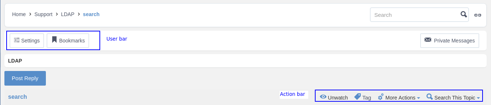
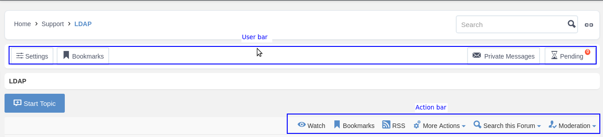
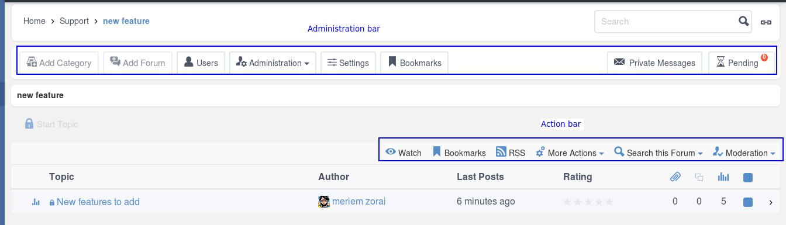

.. |image4| image:: images/common/delete_icon.png
.. |image5| image:: images/common/1.png
.. |image6| image:: images/common/2.png
.. |image7| image:: images/common/3.png
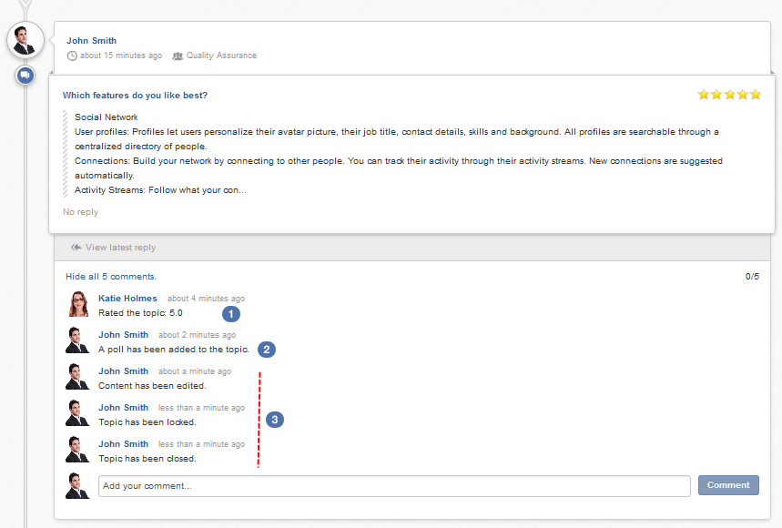

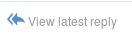
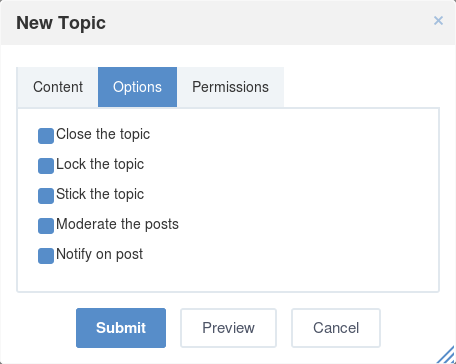
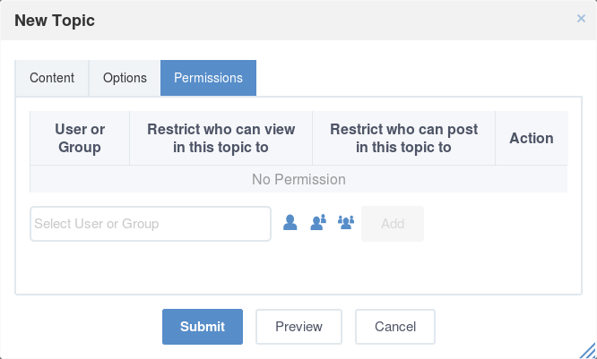
.. |image13| image:: images/common/select_user_icon.png
.. |image14| image:: images/common/select_role_icon.png
.. |image15| image:: images/common/select_group_icon.png
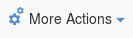
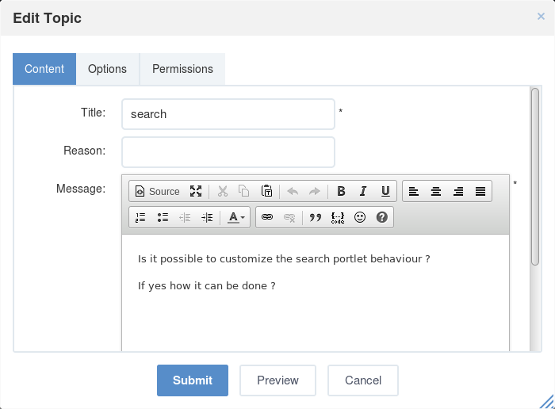

.. |image19| image:: images/common/1.png
.. |image20| image:: images/common/2.png
.. |image21| image:: images/common/delete_icon.png

.. |image23| image:: images/common/3.png
.. |image24| image:: images/common/4.png
.. |image25| image:: images/common/5.png
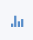
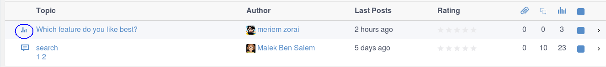

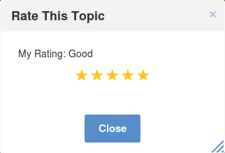
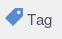
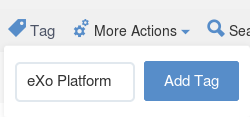
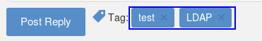

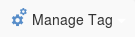
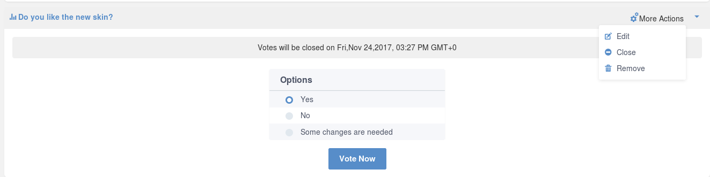
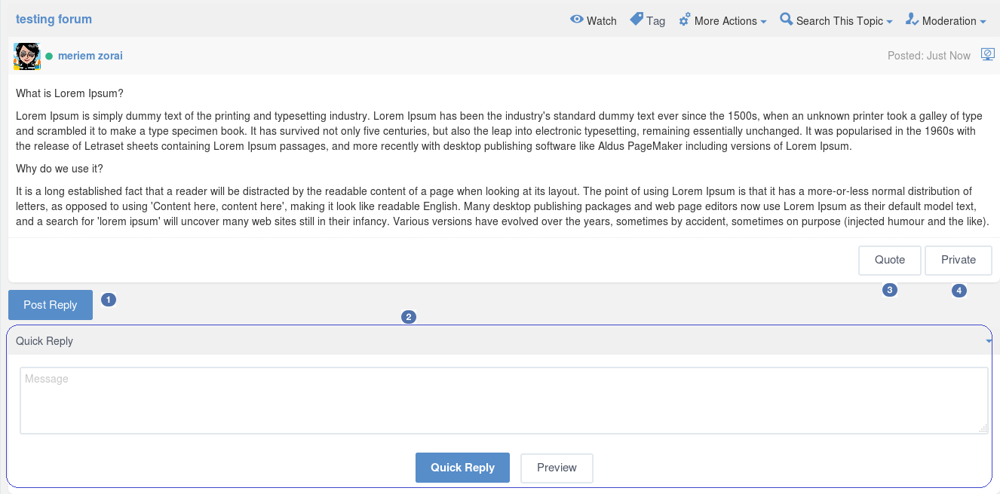
.. |image39| image:: images/common/1.png
.. |image37| image:: images/common/2.png
.. |image38| image:: images/common/3.png
.. |image39| image:: images/common/4.png

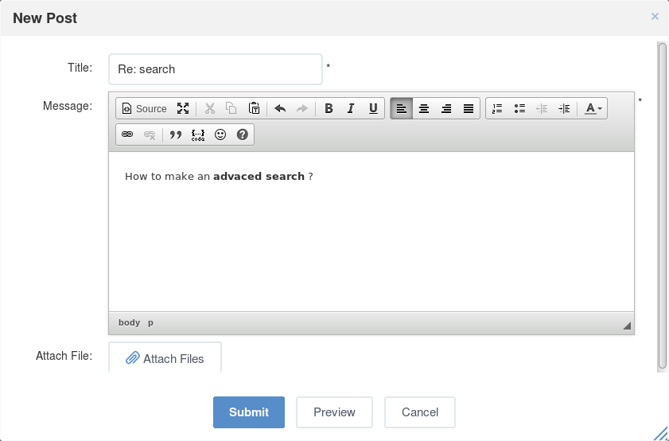
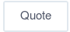
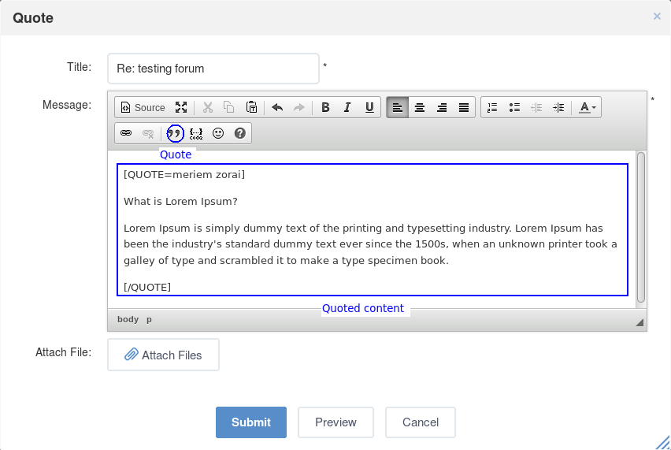

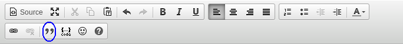
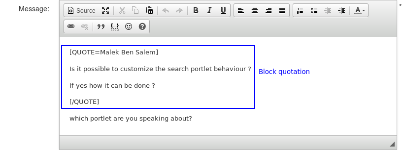
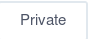

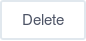
.. |image50| image:: images/forum/bbccode.png

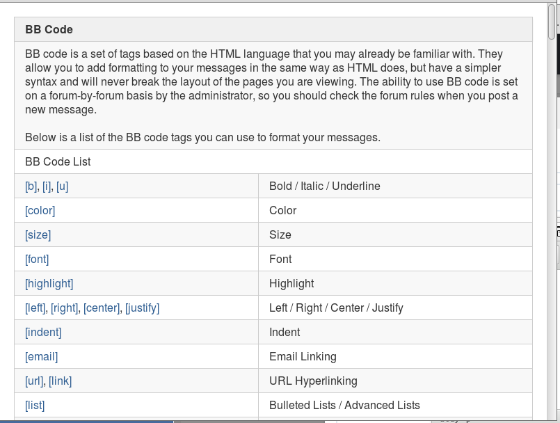
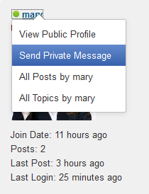
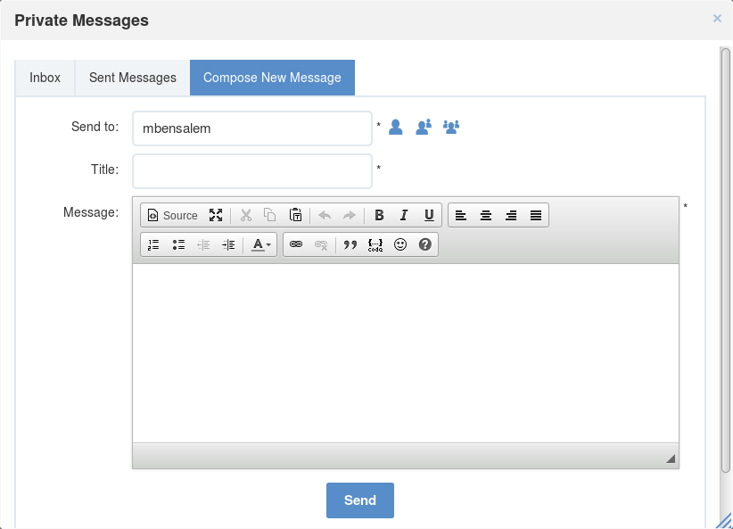
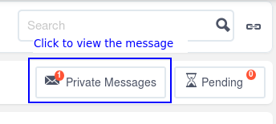

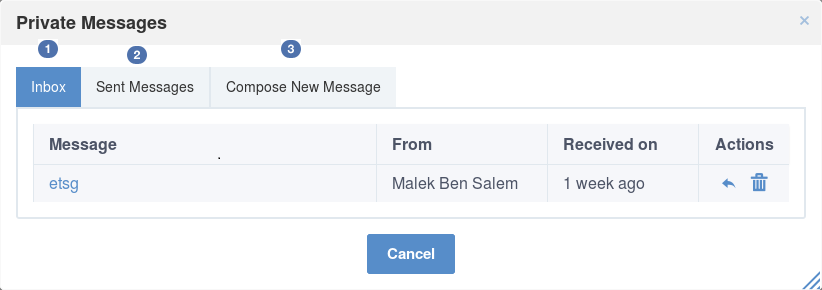
.. |image58| image:: images/common/1.png
.. |image59| image:: images/common/reply_icon.png
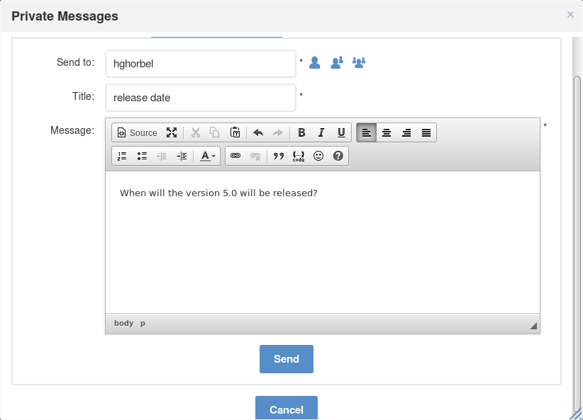
.. |image61| image:: images/common/delete_icon.png
.. |image62| image:: images/common/2.png
.. |image63| image:: images/common/3.png
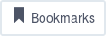

.. |image66| image:: images/forum/my_bookmarks.png
.. |image67| image:: images/common/delete_icon.png
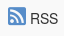
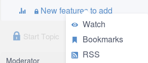
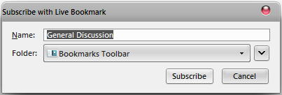
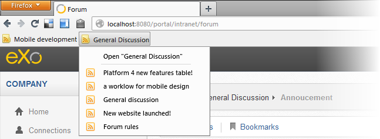

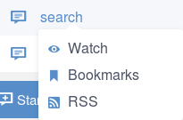

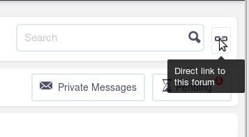
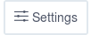
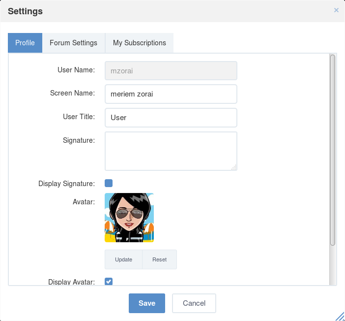
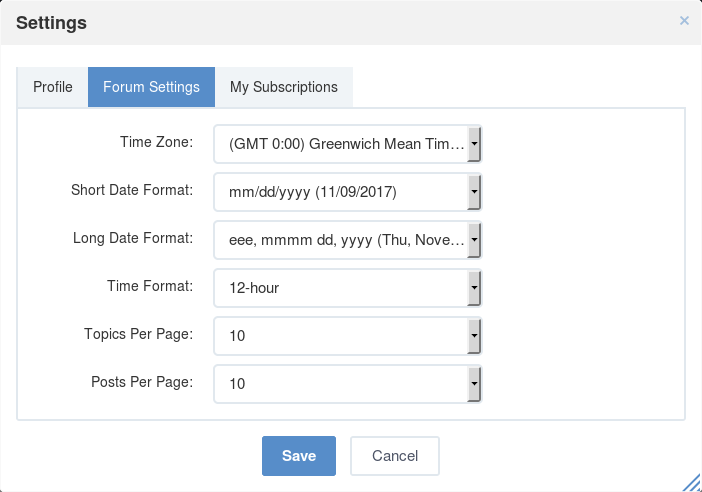
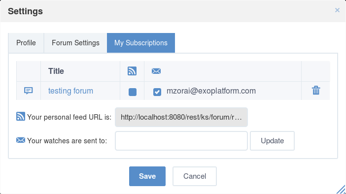


.. |image83| image:: images/common/delete_icon.png

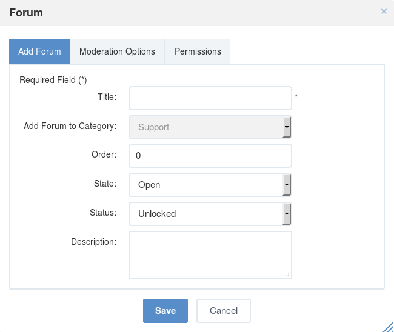


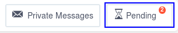
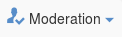


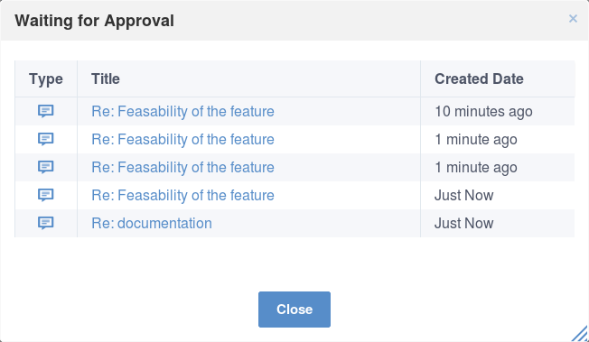

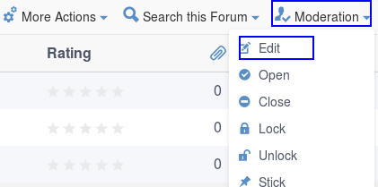


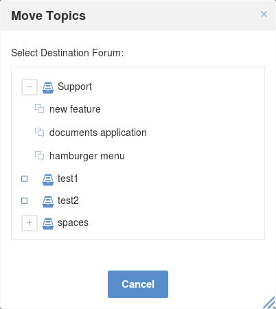


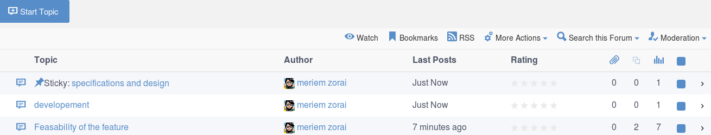

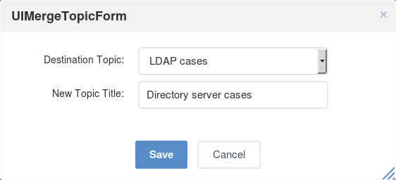

.. |image110| image:: forum/mod_split_topic_form.png


.. |image129| image:: images/common/administration_navigation.png


.. |image132| image:: images/common/edit_icon.png
.. |image133| image:: images/common/edit_navigation.png

.. |image135| image:: images/common/edit_portlet_icon.png

.. |image137| image:: images/forum/admin_forum_panels_tab.png

.. |image139| image:: images/forum/forum_portlet_structure.png

.. |image141| image:: images/common/select_user_icon.png
.. |image142| image:: images/common/select_role_icon.png
.. |image143| image:: images/common/select_group_icon.png

.. |image145| image:: images/common/delete_icon.png


.. |image159| image:: images/common/edit_icon.png

.. |image161| image:: images/forum/admin_forum_user_management_settings_tab.png
.. |image162| image:: images/common/1.png
.. |image163| image:: images/forum/admin_forum_user_management_banuser_tab.png
.. |image164| image:: images/common/2.png
.. |image165| image:: images/common/3.png
.. |image166| image:: images/common/4.png
.. |image167| image:: images/common/5.png
.. |image168| image:: images/common/6.png


.. |image172| image:: images/forum/admin_forum_sort_setting.png


.. |image182| image:: images/common/1.png
.. |image183| image:: images/common/2.png
.. |image184| image:: images/common/3.png
.. |image185| image:: images/common/4.png
.. |image186| image:: images/common/5.png


.. |image189| image:: images/common/edit_icon.png

.. |image191| image:: images/common/delete_icon.png


.. |image201| image:: images/common/delete_icon.png


.. |OK1| image:: images/common/yes.png
.. |OK2| image:: images/common/yes.png
.. |OK3| image:: images/common/yes.png
.. |OK4| image:: images/common/yes.png
.. |OK5| image:: images/common/yes.png
.. |OK6| image:: images/common/yes.png
.. |OK7| image:: images/common/yes.png
.. |OK8| image:: images/common/yes.png
.. |OK9| image:: images/common/yes.png
.. |OK10| image:: images/common/yes.png
.. |OK11| image:: images/common/yes.png
.. |OK12| image:: images/common/yes.png
.. |OK13| image:: images/common/yes.png
.. |OK14| image:: images/common/yes.png
.. |OK15| image:: images/common/yes.png
.. |OK16| image:: images/common/yes.png
.. |OK17| image:: images/common/yes.png
.. |OK18| image:: images/common/yes.png
.. |OK19| image:: images/common/yes.png
.. |OK20| image:: images/common/yes.png
.. |OK21| image:: images/common/yes.png
.. |OK22| image:: images/common/yes.png
.. |OK23| image:: images/common/yes.png
.. |OK24| image:: images/common/yes.png
.. |OK25| image:: images/common/yes.png
.. |OK26| image:: images/common/yes.png
.. |OK27| image:: images/common/yes.png
.. |OK28| image:: images/common/yes.png
.. |OK29| image:: images/common/yes.png
.. |OK30| image:: images/common/yes.png
.. |OK31| image:: images/common/yes.png
.. |OK32| image:: images/common/yes.png
.. |OK33| image:: images/common/yes.png
.. |OK34| image:: images/common/yes.png
.. |OK35| image:: images/common/yes.png
.. |OK36| image:: images/common/yes.png
.. |OK37| image:: images/common/yes.png
.. |OK38| image:: images/common/yes.png
.. |OK39| image:: images/common/yes.png
.. |OK40| image:: images/common/yes.png
.. |OK41| image:: images/common/yes.png
.. |OK42| image:: images/common/yes.png
.. |OK43| image:: images/common/yes.png
.. |OK44| image:: images/common/yes.png
.. |OK45| image:: images/common/yes.png
.. |OK46| image:: images/common/yes.png
.. |OK47| image:: images/common/yes.png
.. |OK48| image:: images/common/yes.png
.. |OK49| image:: images/common/yes.png
.. |OK50| image:: images/common/yes.png
.. |OK51| image:: images/common/yes.png
.. |OK52| image:: images/common/yes.png
.. |OK53| image:: images/common/yes.png
.. |OK54| image:: images/common/yes.png
.. |OK55| image:: images/common/yes.png
.. |OK56| image:: images/common/yes.png
.. |OK57| image:: images/common/yes.png
.. |OK58| image:: images/common/yes.png
.. |OK59| image:: images/common/yes.png
.. |OK60| image:: images/common/yes.png
.. |OK61| image:: images/common/yes.png
.. |OK62| image:: images/common/yes.png
.. |OK63| image:: images/common/yes.png
.. |OK64| image:: images/common/yes.png
.. |OK65| image:: images/common/yes.png
.. |OK66| image:: images/common/yes.png
.. |OK67| image:: images/common/yes.png
.. |OK68| image:: images/common/yes.png
.. |OK69| image:: images/common/yes.png
.. |OK70| image:: images/common/yes.png
.. |OK71| image:: images/common/yes.png
.. |OK72| image:: images/common/yes.png
.. |OK73| image:: images/common/yes.png
.. |OK74| image:: images/common/yes.png
.. |OK75| image:: images/common/yes.png
.. |OK76| image:: images/common/yes.png
.. |OK77| image:: images/common/yes.png
.. |OK78| image:: images/common/yes.png
.. |OK79| image:: images/common/yes.png
.. |OK80| image:: images/common/yes.png
.. |OK81| image:: images/common/yes.png
.. |OK82| image:: images/common/yes.png
.. |OK83| image:: images/common/yes.png
.. |OK84| image:: images/common/yes.png
.. |OK85| image:: images/common/yes.png
.. |OK86| image:: images/common/yes.png
.. |OK87| image:: images/common/yes.png
.. |OK88| image:: images/common/yes.png
.. |OK89| image:: images/common/yes.png
.. |OK90| image:: images/common/yes.png
.. |OK91| image:: images/common/yes.png
.. |OK92| image:: images/common/yes.png
.. |OK93| image:: images/common/yes.png
.. |OK94| image:: images/common/yes.png
.. |OK95| image:: images/common/yes.png
.. |OK96| image:: images/common/yes.png
.. |OK97| image:: images/common/yes.png
.. |OK98| image:: images/common/yes.png
.. |NOK1| image:: images/common/no.png
.. |NOK2| image:: images/common/no.png
.. |NOK3| image:: images/common/no.png
.. |NOK4| image:: images/common/no.png
.. |NOK5| image:: images/common/no.png
.. |NOK6| image:: images/common/no.png
.. |NOK7| image:: images/common/no.png
.. |NOK8| image:: images/common/no.png
.. |NOK9| image:: images/common/no.png
.. |NOK10| image:: images/common/no.png
.. |NOK11| image:: images/common/no.png
.. |NOK12| image:: images/common/no.png
.. |NOK13| image:: images/common/no.png
.. |NOK14| image:: images/common/no.png
.. |NOK15| image:: images/common/no.png
.. |NOK16| image:: images/common/no.png
.. |NOK17| image:: images/common/no.png
.. |NOK18| image:: images/common/no.png
.. |NOK19| image:: images/common/no.png
.. |NOK20| image:: images/common/no.png
.. |NOK21| image:: images/common/no.png
.. |NOK22| image:: images/common/no.png
.. |NOK23| image:: images/common/no.png
.. |NOK24| image:: images/common/no.png
.. |NOK25| image:: images/common/no.png
.. |NOK26| image:: images/common/no.png
.. |NOK27| image:: images/common/no.png
.. |NOK28| image:: images/common/no.png
.. |NOK29| image:: images/common/no.png
.. |NOK30| image:: images/common/no.png
.. |NOK31| image:: images/common/no.png
.. |NOK32| image:: images/common/no.png
.. |NOK33| image:: images/common/no.png
.. |NOK34| image:: images/common/no.png
.. |NOK35| image:: images/common/no.png
.. |NOK36| image:: images/common/no.png
.. |NOK37| image:: images/common/no.png
.. |NOK38| image:: images/common/no.png
.. |NOK39| image:: images/common/no.png
.. |NOK40| image:: images/common/no.png
.. |NOK41| image:: images/common/no.png
.. |NOK42| image:: images/common/no.png
.. |NOK43| image:: images/common/no.png
.. |NOK44| image:: images/common/no.png
.. |NOK45| image:: images/common/no.png
.. |NOK46| image:: images/common/no.png
.. |NOK47| image:: images/common/no.png
.. |NOK48| image:: images/common/no.png
.. |NOK49| image:: images/common/no.png
.. |NOK50| image:: images/common/no.png
.. |NOK51| image:: images/common/no.png
.. |NOK52| image:: images/common/no.png
.. |NOK53| image:: images/common/no.png
.. |NOK54| image:: images/common/no.png
.. |NOK55| image:: images/common/no.png
.. |NOK56| image:: images/common/no.png
.. |NOK57| image:: images/common/no.png
.. |NOK58| image:: images/common/no.png
.. |NOK59| image:: images/common/no.png
.. |NOK60| image:: images/common/no.png
.. |NOK61| image:: images/common/no.png
.. |NOK62| image:: images/common/no.png
.. |NOK63| image:: images/common/no.png
.. |NOK64| image:: images/common/no.png
.. |NOK65| image:: images/common/no.png
.. |NOK66| image:: images/common/no.png
.. |NOK67| image:: images/common/no.png
.. |NOK68| image:: images/common/no.png
.. |NOK69| image:: images/common/no.png
.. |NOK70| image:: images/common/no.png
.. |NOK71| image:: images/common/no.png
.. |NOK72| image:: images/common/no.png
.. |NOK73| image:: images/common/no.png
.. |NOK74| image:: images/common/no.png
.. |NOK75| image:: images/common/no.png
.. |NOK76| image:: images/common/no.png
.. |NOK77| image:: images/common/no.png
.. |NOK78| image:: images/common/no.png
.. |NOK79| image:: images/common/no.png
.. |NOK80| image:: images/common/no.png
.. |NOK81| image:: images/common/no.png
.. |NOK82| image:: images/common/no.png
.. |NOK83| image:: images/common/no.png
.. |NOK84| image:: images/common/no.png
.. |NOK85| image:: images/common/no.png
.. |NOK86| image:: images/common/no.png
.. |NOK87| image:: images/common/no.png
.. |NOK88| image:: images/common/no.png
.. |NOK89| image:: images/common/no.png
.. |NOK90| image:: images/common/no.png
.. |NOK91| image:: images/common/no.png
.. |NOK92| image:: images/common/no.png
.. |NOK93| image:: images/common/no.png
.. |NOK94| image:: images/common/no.png
.. |NOK95| image:: images/common/no.png

