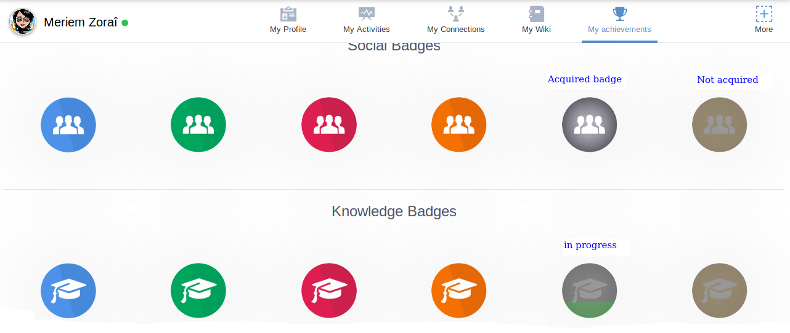
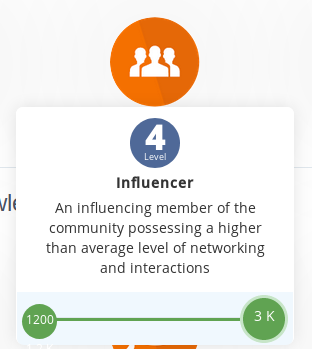

.. _Gamification:

####################
Gamification
####################

Engaging your collaborators is one of the key challenges for organizations nowadays. 

**eXo Gamification** will help your organization to engage your employees.

**eXo Gamification** is layering game-like features upon the use of applications, such as those used within a digital workplace, in order to boost employee engagement and enhance the use of your digital workplace solution by encouraging collaborators to participate.

When employees are engaged, they participate more on your platform by posting, commenting, sharing documents, rating, downloading and much more.  

**eXo Gamification** is organized into “domains” that include a set of "badges" and actions to earn points. 

.. _Domains:

=======================
Domains
=======================

Domains are the categorization of all behaviors of the platform users. 
Each domain represents a different context and specific applications to organize all rules and badges.

The following are the default domains that made sense in the context of the platform environment: 

- Social: living together in organized communities, typically with different opinion shared on activities, by comments, likes; in your profile or created spaces. 

- Team work : The combined action of a group, especially when effective and efficient, and it's ensured using Tasks management.

- Knowledge : Facts, informations, and skills acquired through experiences using Forum, Wiki and Documents applications.

.. note:: You can add, edit or remove domains using :ref: `Manage Domain <Manage Domain>` in Gamification Administration .

.. _MyAchievements:

=================
My achievements
=================

You can follow your earned points and badges through an inteface called "My achievements".
To visit this interface, simply :ref:`access your profile <Access-profile>` and then 
click on *My achievements* application from the applications navigation bar.

|image5|

In this interface, you have two tabs: ``MyPoints`` and ``MyBadges``.

.. _MyPoints:

In this view, you can see these elements:

-  your total points
-  a table listing the events which allowed you to earn points. This table is composed by these fields:

   -  The user involved in the interaction
   -  The event you or another user made and which allowed you to earn points
   -  The date of the event
   -  The amount of points you earned following the previously cited event
   -  The domain of the event

|image6|

.. _MyBadges: 

In the ``MyBadges`` screen, you can see all the badges available in each domain with statuses:

-  *Acquired*: when the badge is fully colorized it means that you already earned this badge
-  *Not acquired*: when the badge is fully greyed, it means that you did not earn the badge yet
-  *in progress*: When the badge is partially colorized it means that you started earning points in the 
   domain of that badge, but you've not yet reached the required threshold. 
   For example, when the required score of a badge is between 500 and 1200 and that your score in the domain is 700.
   
|image7|

When you mouse over a badge, its information appear in a pop up:

-  Level
-  Name
-  Description
-  The badge's domain

|image8|

.. _Leaderboard:

=============
Leaderboard 
=============

Leaderboards will give you a snapshot of your gained points progress, and of other collaborators in your platform to encourage them to gain more points. 

|image9|

The position in the leaderboard is determined by the number of points earned over the period : Week, Month or All times and filtered by selected domain.

In the Leaderboard, the top 10 of users having earned most points, and every user is presented with their full name, profile picture and earned points.

Your rank is displayed just below the top 10, if you are not in it. 

You can also load more 10 employees by clicking on Load more button just below the Leaderboard.

|image10|
When you mouse over an employee in the leaderboard, a detailed pie chart is displayed next to him displaying all pourcentages of gained points based on the domain.

.. _HowCanIEarnPoints:

=======================
How Can I Earn Points?
=======================

To access to *How Can I Earn Points?* page, you can simply click on the information icon in the Leaderboard. 

|image1|

You will find in this view all rules detailed by a description of every rule and gained points.

|image2|

All rules are displayed in specific sections by: 

- *Domains* : You will find all rules for every Domain
- *Activity* : Every Domain does have a specific regrouping of the activity.

|image3|

You can filter rules by clicking on the desired domain to display.

|image4|

.. note:: In the *All Domains* filter view, you can click on the domain name that you want to display or hide

.. |image1| image:: images/gamification/Howcaniearnpointsaccess.png
.. |image2| image:: images/gamification/How can i earn points.png
.. |image3| image:: images/gamification/Grouping-rules.png
.. |image4| image:: images/gamification/Filter-by-domain.png

.. |image6| image:: images/gamification/points.png

.. |image10| image:: images/gamification/Leaderboardpirchart.png
