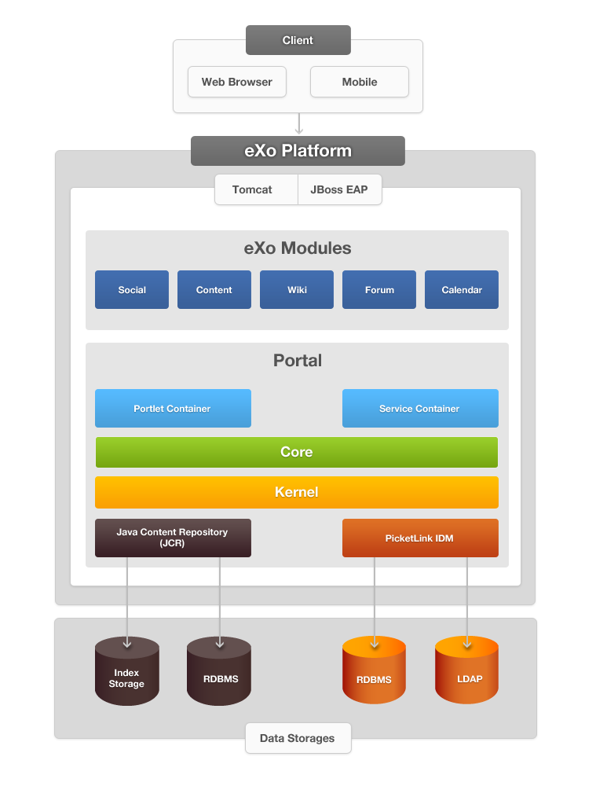
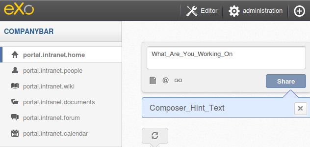
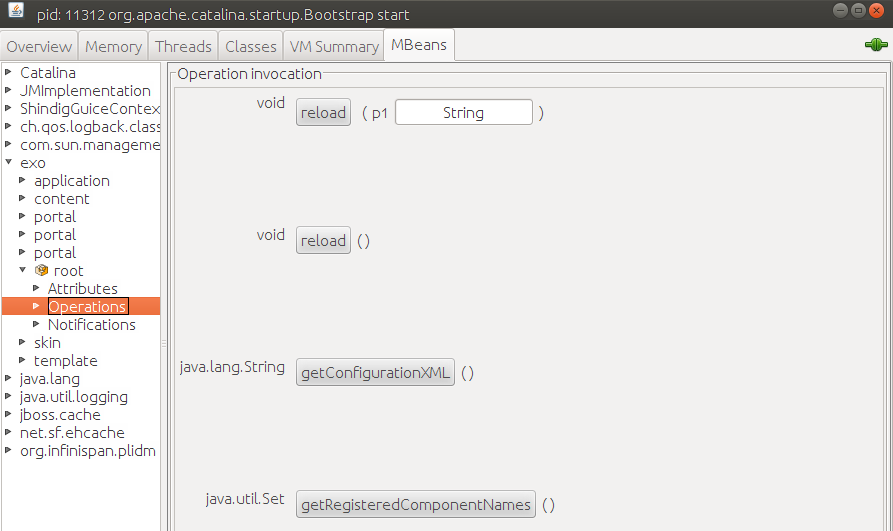

.. _GetStarted:

################
Getting Started
################

    Before jumping directly into the development tasks, you need to
    learn about the basic knowledge via the following sections:

    -  :ref:`Glossary <PLFDevGuide.GettingStarted.Glossary>`
       Technical terms which are used throughout the documentation.

    -  :ref:`Architecture <PLFDevGuide.GettingStarted.Architecture>`
       Introduction to the schema of eXo Platform Architecture and principles
       of container/service.

    -  :ref:`Customization Capabilities with eXo Platform <PLFDevGuide.GettingStarted.CustomizationCapabilities>`
       Introduction to customization capabilities with eXo Platform that 
       can be done by creating extensions or new applications.

    -  :ref:`Setting up development environment <PLFDevGuide.GettingStarted.SettingDevelopmentEnvironment>`
       How to set up your development environment (SCM, IDE and building
       tools).

    -  :ref:`Running eXo Platform in debug and dev modes <PLFDevGuide.GettingStarted.DebugAndDevMode>`
       Useful information for debugging Java, JavaScript, CSS and
       others.

.. _PLFDevGuide.GettingStarted.Glossary:

========
Glossary
========

This section gives you explanations of some technical terms which are
used throughout the documentation.

**Container templates**

Templates which are used to contain the UI components in a specific
layout and display them on the site's page.

**ConversationState**

An object which stores all information about the state of the current
user. This object also stores acquired attributes of an Identity which
is a set of principals to identify a user.

**Data container**

An object which implements the physical data storage. It enables
different types of backend (such as RDB, FS files) to be used as a
storage for the JCR data. With the main Data Container, other storages
for persisted Property Values can be configured and used. The eXo JCR
persistent data container can work in two configuration modes.

-  **Multi-database**: A database for each workspace (used in the
   standalone eXo JCR service mode).

-  **Single-database**: All workspaces persisted in one database (used
   in the embedded eXo JCR service mode; for example in eXo portal). The
   data container uses the JDBC driver to communicate with the actual
   database software. For example, any JDBC-enabled data storage can be
   used with the eXo JCR implementation.

**Database Creator (DBCreator)**

A service that is responsible for executing the DDL (Data Definition
Language) script in runtime. A DDL script may contain templates for
database name, username, and password which will be replaced by real
values at execution time.

**Drives**

Customized workspaces which include:

-  a configured path where the user will start when browsing the drive.

-  a set of views with limitations to available actions, such as editing
   or creating contents while being in the drive.

-  a set of permissions to limit the access (and view) of the drive to a
   restricted number of people.

-  a set of options to describe the behavior of the drive when users
   browse it.

**eXo Cache**

One which all applications on the top of eXo JCR need. This can rely on
an **org.exoplatform.services.cache.ExoCache** instance managed by
**org.exoplatform.services.cache.CacheService**.

**eXoContainer**

An object which behaves like a class loader that is responsible for
loading services/components. The eXoContainer class is inherited by all
the containers, including RootContainer, PortalContainer, and
StandaloneContainer. It itself inherits from a PicoContainer framework
which allows eXo to apply the IoC Inversion of Control principles.

**External Plugin**

One which allows adding configuration for services and components
easily.

**Folksonomy**

A system of classification which is derived from the practice and a
method of collaboratively creating and managing tags to annotate and
categorize content. This practice is also known as collaborative tagging
social classification social indexing and social tagging. See
`Wikipedia <http://en.wikipedia.org>`__ for more details.

**Gadgets**

Web-based software components which are based on HTML, CSS, and
JavaScript. They allow developers to easily write useful web
applications that work anywhere on the web without modification. See
`OpenSocial <http://opensocial.org>`__ for more details.

**Groovy template**

A template which is widely used in eXo UI framework. It leverages the
usage of Groovy language, a scripting language for Java. The template
file consists of HTML code and Groovy code blocks.

**JCR WebDAV**

A service that allows accessing a JCR repository via WebDAV.

**JobSchedulerService**

One which defines a job to execute a given number of times during a
given period. It is a service that is in charge of unattended background
executions commonly known for historical reasons as batch processing.

**JodConverter (Java OpenDocument Converter)**

A tool which converts documents into different office formats and vice
versa.

**JCR Item**

One which may be a node or a property.

**ListenerService**

An event mechanism which allows triggering and listening to events under
specific conditions inside eXo Platform. This mechanism is used in
several places in PRODUCT, such as login/logout time, creating/updating
users and groups.

**LockManager**

One that stores lock objects, so it can give a lock object or can
release it. Also, LockManager is responsible for removing locks that
live too long.

**Namespace**

The name of a node or property which may have a prefix delimited by a
single ':' colon character. This name indicates the namespace of the
item (Source:
`JSR-170 <http://jcp.org/aboutJava/communityprocess/final/jsr170/index.html>`__)
and is used to avoid the naming conflict.

**Navigation node**

A node that looks like a label of the link to page on the Navigation
bar. By clicking a node, the page content is displayed. A node maps a
URI and a site page for the site's navigation system.

**Navigation**

One that looks like a menu which is to help users visualize the site
structure and to provide hyperlinks to other parts on a site. Thus, a
bar which contains navigations is called the Navigation bar.

**Node type**

One which defines child nodes and properties which a node may (or must)
have. Every node type has attributes, such as name, supertypes, mixin
status, orderable child nodes status, property definitions, child node
definitions and primary item name (Source:
`JSR-170 <http://jcp.org/aboutJava/communityprocess/final/jsr170/index.html>`__).

**Node**

An element in the tree structure that makes up a repository. Each node
may have zero or more child nodes and zero or more child properties.
There is a single root node per workspace which has no parent. All other
nodes have only one parent.

**Organization listener**

One that provides a mechanism to receive notifications via an
organization listener, including UserEventListener, GroupEventListener
and MembershipEventListener.

-  UserEventListener is called when a user is created, deleted or
   modified.

-  GroupEventListener is called when a group is created, deleted or
   modified.

-  MembershipEventListener is called when a membership is created or
   removed.

**Organization management**

A portlet that manages users, groups and memberships. This portlet is
often managed by administrators to set up permission for users and
groups.

**OrganizationService**

A service that allows accessing the Organization model. This model is
composed of users, groups, and memberships. It is the basis of eXo's
personalization and authorizations and is used for all over the
platform.

**Path constraint**

One which restricts the result node to a scope specified by a path
expression. The following path constraints must be supported exact child
nodes descendants and descendants or self (Source:
`JSR-170 <http://jcp.org/aboutJava/communityprocess/final/jsr170/index.html>`__).

**Permission**

A control of which actions that users can or cannot perform within the
site and are set by the portal administrators. Permission types specify
what a user can do within the site.

**Site Page**

A page that consists of one or more various portlets. Their layouts are
defined by container templates. To display a site page, this page must
be mapped to a navigation node.

**Portal skins**

Graphic styles that display an attractive user interface. Each skin has
its own characteristics with different backgrounds, icons, color, and
more.

**PortalContainer**

A type of container that is created at the startup of the portal web
application in the init method of the PortalController servlet.

**Portlet**

A web-based application that provides a specific piece of content to be
included as part of a portal page. In other words, portlets are
pluggable user interface components that provide a presentation layer to
information systems. There are two following types of portlet:

-  **Functional Portlets** support all functions within the portal. They
   are integrated into the portal that can be accessed through toolbar
   links.

-  **Interface Portlets** constitute the interface of a portal. eXo
   Portal consists of some Interface Portlets, such as Banner Portlet,
   Footer Portlet, Homepage Portlet, Console Portlet, Breadcrumb Portlet
   and more.

**Property constraint**

One that a query may specify on the result nodes by way of property
constraints (Source:
`JSR-170 <http://jcp.org/aboutJava/communityprocess/final/jsr170/index.html>`__).

**Property**

An element in the tree structure that makes up a repository. Each
property has only one parent node and has no child node.

**Repository**

One that holds references to one or more workspaces.

**eXo REST framework**

One that is used to make eXo services (for example, the components
deployed inside eXo Container) simply and transparently accessible via
HTTP in a RESTful manner. In other words, those services should be
viewed as a set of REST Resources-endpoints of the HTTP request-response
chain. Those services are called\ **ResourceContainers**.

**RootContainer**

A base container which plays an important role during the startup.
However, it is recommended that it should not be used directly.

**RTL Framework (Right To Left Framework)**

A framework which handles the text orientation depending on the current
locale settings. It consists of four components, including Groovy
template, Stylesheet, Images, and Client java.

**StandaloneContainer**

One which is a context independent eXo Container. It is also used for
unit tests.

**Taxonomy**

One which is used to sort documents to ease searches when browsing
documents online.

**Tree structure**

One structure which is defined as a hierarchical structure with a set of
linked nodes and properties.

**Type constraint**

One which specifies the common primary node type of the returned nodes
plus possibly additional mixin types that they also must have. Type
constraints are inheritance-sensitive in which specifying a constraint
of node type x will include all nodes explicitly declared to be type x
and all nodes of subtypes of x (Source:
`JSR-170 <http://jcp.org/aboutJava/communityprocess/final/jsr170/index.html>`__).

**Web Content**

A textual, visual or aural content that is encountered as part of the
user experiences on a website. It may include other things, such as
texts images, sounds, videos, and animations.

**Workspace**

A container of single rooted tree which includes items.

.. _PLFDevGuide.GettingStarted.Architecture:

============
Architecture
============

The architecture of eXo Platform is summarized in the following schema:

|image0|

**Service Container**

A container is always required to access a service, because the eXo
Kernel relies on the dependency injection. This means that the lifecycle
of a service (for example, instantiating, opening and closing streams,
disposing) is handled by a dependency provider, such as the eXo
Container, rather than the consumer. The consumer only needs a reference
to an implementation of the requested service. The implementation is
configured in an ``.xml`` configuration file that comes with every
service.

.. note:: See :ref:`Container, Kernel Reference <#Kernel.ServiceConfigurationforBeginners.Containers>` for details.

**Service**

Containers are used to gain access to services. The followings are
important characteristics of services:

-  The interface and implementation for a service are usually separate
   because of the Dependency Injection concept.

-  Each service has to be implemented as a singleton, which means it is
   created only once per portal container in a single instance.

-  A component equals a service. A service must not be a large
   application. A service can be a little component that reads or
   transforms a document where the term "component" is often used
   instead of service.

.. note:: See service configuration :ref:`for beginners <#Kernel.ServiceConfigurationforBeginners>` and :ref:`in details <#Kernel.ServiceConfigurationinDetail>` for further references.

**Java Content Repository**

All data of eXo Platform are stored in a Java Content Repository (JCR). JCR
is the Java specification
(`JSR-170 <http://jcp.org/aboutJava/communityprocess/final/jsr170/index.html>`__)
for a type of Object Database tailored to the storage, searching, and
retrieval of hierarchical data. It is useful for the content management
systems, which require storage of objects associated with metadata. The
JCR also provides versioning, transactions, observations of changes in
data, and import or export of data in XML. The data in JCR are stored
hierarchically in a tree of nodes with associated properties.

Also, the JCR is primarily used as an internal storage engine.
Accordingly, eXo Platform lets you manipulate JCR data directly in several
places.

In Java Content Repository, there are 2 main parts:

-  **Repositories and workspaces:** A content repository consists of one
   or more workspaces. Each workspace contains a tree of items.

-  **Tree structure - nodes and properties:** Every node can only have
   one primary node type. The primary node type defines names, types and
   other characteristics of the properties, and the number of its
   allowed child nodes. Every node has a special property called
   **jcr:primaryType** that records the name of its primary node type. A
   node may also have one or more mixin types. These are node type
   definitions that can mandate extra characteristics (for example, more
   child nodes, properties and their respective names and types).

   -  Data are stored in properties, which may hold simple values, such
      as numbers, strings or binary data of arbitrary length.

   -  The JCR API provides methods to define node types and node
      properties, create or delete nodes, and add or delete properties
      from an existing node. You can refer to the `6.2.3 Node Read
      Methods <http://www.day.com/specs/jcr/1.0/6.2.3_Node_Read_Methods.html>`__
      in the JCR Specification document.

.. note:: See :ref:`JCR Reference Guide <../../../reference/html/JCRReferenceGuide.html>`__ for the full knowledge of JCR.

.. _PLFDevGuide.GettingStarted.CustomizationCapabilities:

==============================================
Customization Capabilities with eXo Platform
==============================================

eXo Platform can be easily customized and extended by:

-  Creating extensions that allows you to customize all resources of
   eXo Platform, including templates, skin, default configuration, and more.

-  Creating new applications (portlets or gadgets) that you can add to
   your portal's pages.

**Extensions**

Almost everything in eXo Platform can be customized through extensions. The
main concept behind extensions is that resources of your extensions will
override resources of eXo Platform. See :ref:`eXo Platform Extensions <#PLFDevGuide.eXoAdd-ons.PortalExtension>`
for more details.

Here are some examples of what can be done with extensions:

-  Creating a site with some pages and navigations.

-  Customizing internationalized labels.

-  Changing the default connector for users/groups/roles.

-  Creating and customizing a new site. See :ref:`Creating a new site <#PLFDevGuide.Site.CreateNew>` 
   for details.

-  Adding or removing languages. See :ref:`Adding/Removing a language <#PLFDevGuide.Site.Features.Languages>`
   for details.

-  Creating a new skin for :ref:`your site <#PLFDevGuide.Site.LookAndFeel.CreatingNewSiteSkin>`
   and :ref:`portlet <#PLFDevGuide.Site.LookAndFeel.CreatingNewPortletSkin>`.

-  Creating and customizing templates for content. See :ref:`Developing Content <#PLFDevGuide.DevelopingContent>`
   for more details.

-  Creating a Groovy REST script in your extension that will be loaded
   at startup by the REST engine. See :ref:`Using Groovy REST service <#PLFDevGuide.DevelopingRESTServices.UsingGroovyRESTService>`
   for more details.

**Applications**

Applications are blocks that compose a portal page. eXo Platform comes with a
lot of out-of-the-box applications which allow you to display a
navigation menu, display a content or a list of content, manage
bookmarks, display your next calendar events, and more. Also, you can
create your own applications.

From a technical point of view, an application can be either a portlet
or a gadget. Therefore, it is important to understand distinctions
between gadgets and portlets. While portlets are user interface
components that provide fragments of markup code from the server side,
gadgets generate dynamic web content on the client side. With gadgets,
small applications can be built quickly, and mashed up on the client
side using lightweight Web-Oriented Architecture (WOA) technologies,
like REST or RSS.

Developing portlets and gadgets complies with different rules and
components that are detailed in:

-  :ref:`Developing a portlet <PLFDevGuide.DevelopingApplications.DevelopingPortlet>`

-  :ref:`Developing a gadget <PLFDevGuide.DevelopingApplications.DevelopingGadget>`

.. _PLFDevGuide.GettingStarted.SettingDevelopmentEnvironment:

==================================
Setting up development environment
==================================

This guideline helps developers to set up their development environment
(SCM, IDE and building tools).

To set up development environment, see the followings:

-  JDK 8+ is required.

-  :ref:`Maven <PLFDevGuide.GettingStarted.Maven>` (3.0.4 or later) and
   :ref:`GIT <PLFDevGuide.GettingStarted.GIT>` are required to 
   developers who want to contribute to eXo projects (mainly the 
   company’s developers).

-  Any Java IDE tool can be used, such as
   `Eclipse <https://www.eclipse.org>`__,
   `NetBean <https://netbeans.org>`__.

-  Developers who write extensions are free to choose their favorite
   tools. Maven and GIT are recommended to get the best support from eXo
   Company and Community.

.. _PLFDevGuide.GettingStarted.Maven:

Setting eXo Repository in Maven
~~~~~~~~~~~~~~~~~~~~~~~~~~~~~~~~~

To set up Maven, you can follow instructions in `Apache's Maven in 5
minutes <http://maven.apache.org/guides/getting-started/maven-in-five-minutes.html>`__
for quick start or see `The Apache Maven definitive guide by
Sonatype <http://books.sonatype.com/mvnref-book/reference/index.html>`__
for a complete reference. Since eXo Platform 4, no specific Maven settings
are required to build `eXo projects <http://developer.exoplatform.org>`__.

To use eXo APIs in your own projects, you have to add the eXo Platform Maven
repository to your Maven ``settings.xml`` file.

-  Open the ``settings.xml`` file in ``$M2_HOME/conf/`` or
   ``${user.home}/.m2/``, depending on your Maven installation. Refer to
   `Maven settings guideline <http://maven.apache.org/settings.html>`__
   for more details.

-  Add a repository to this file, as stated in `Maven's Guide to using
   Multiple
   Repositories <http://maven.apache.org/guides/mini/guide-multiple-repositories.html>`__.

-  Replace the repository URL in your settings with
   http://repository.exoplatform.org/public.

-  An example of ``settings.xml``:

   .. code:: xml

       <settings>
       ...
       <profiles>
       ...
           <profile>
               <id>myprofile</id>
               <repositories>
                   <repository>
                    <id>eXo-pub-repo</id>
                    <name>eXoPlatform public repo</name>
                    <url>http://repository.exoplatform.org/public</url>
                   </repository>
               </repositories>
           </profile>
       ...
       </profiles>

       <activeProfiles>
           <activeProfile>myprofile</activeProfile>
       </activeProfiles>
       ...
       </settings>

.. _ImportDependencies:

Importing eXo dependencies
~~~~~~~~~~~~~~~~~~~~~~~~~~~

You can, of course, add any eXo artifact as a dependency of your
project. To avoid losing time looking for the good version of the
artifacts you want to add as dependencies, eXo Platform provides an
`import
dependency <https://repository.exoplatform.org/content/groups/public/org/exoplatform/platform/platform/>`__
which defines all of the versions for you. You just need to give the
version of eXo Platform you are using, without concerning about proper
versions of all artifacts. To import the right eXo dependencies, you can
choose between the 2 ways below.

**Inheriting dependency version from eXo Platform**

You can refer to `Dependency Management <http://maven.apache.org/guides/introduction/introduction-to-dependency-mechanism.html#Dependency_Management>`__
for more details.

-  Here is an example of the ``pom.xml`` file using implicit variables
   to indicate the artifact version:

   .. code:: xml

       <?xml version="1.0" encoding="UTF-8"?>
           <project xmlns="http://maven.apache.org/POM/4.0.0" xmlns:xsi="http://www.w3.org/2001/XMLSchema-instance" xsi:schemaLocation="http://maven.apache.org/POM/4.0.0 http://maven.apache.org/xsd/maven-4.0.0.xsd">
               <modelVersion>4.0.0</modelVersion>
               <groupId>com.mycompany</groupId>  
               <artifactId>my-project</artifactId>
               <version>1.0-SNAPSHOT</version>
               <packaging>war</packaging>
               <name>My project</name>
               <properties>
                   <exoplatform.version>4.2.0</exoplatform.version>
               </properties>
               <dependencyManagement>
                   <dependencies>
                   <!-- Import versions from platform project -->
                       <dependency>
                           <groupId>org.exoplatform.platform</groupId>
                           <artifactId>platform</artifactId>
                           <version>${exoplatform.version}</version>
                           <type>pom</type>
                           <scope>import</scope>
                       </dependency>
                   </dependencies>
               </dependencyManagement>
           </project>

   In this file, the property ``exoplatform.version`` was declared under
   ``properties`` tag, indicating a specific platform version used for
   the project. After that, each dependency (under
   ``dependencyManagement`` tag) can reuse this parameter as an implicit
   variable ``${exoplatform.version}`` without specifying its artifact
   version.

**Declaring exact versions**

In case you want to control the versions of artifact, you can add them
manually. For each dependency, do as below:

-  Select the version of eXo Platform you are using at
   `here <https://repository.exoplatform.org/content/groups/public/org/exoplatform/platform/platform/>`__.

-  Select the targeted ``.pom`` file and open it to see its
   configurations.

-  Find the ``artifactId`` you need to include in your project, for
   instance ``platform-ui``. You will see its version which was declared
   in the implicit variable as
   ``${org.exoplatform.platform-ui.version}``.

-  Search for this variable under ``properties`` tag to get the exact
   version of the artifact and include it in your ``pom.xml`` file, for
   example:

   .. code:: xml

       <?xml version="1.0" encoding="UTF-8"?>
           <project xmlns="http://maven.apache.org/POM/4.0.0" xmlns:xsi="http://www.w3.org/2001/XMLSchema-instance" xsi:schemaLocation="http://maven.apache.org/POM/4.0.0 http://maven.apache.org/xsd/maven-4.0.0.xsd">
               <modelVersion>4.0.0</modelVersion>
               <groupId>com.mycompany</groupId>  
               <artifactId>my-project</artifactId>
               <version>1.0-SNAPSHOT</version>
               <packaging>war</packaging>
               <name>My project</name>
               <dependencies>
                   <dependency>
                       <groupId>org.exoplatform.platform-ui</groupId>
                       <artifactId>platform-ui</artifactId>
                       <version>4.2</version>
                       <scope>provided</scope>
                   </dependency>
               </dependencies>
       </project>

.. note:: In the sample projects of this book, notice that you need to check the artifact versions of each dependency (using `this link <https://repository.exoplatform.org/content/groups/public/org/exoplatform/platform/platform/>`__)
          to be sure whether they are suitable with your platform package or not.

.. _PLFDevGuide.GettingStarted.GIT:

GIT and github.com
~~~~~~~~~~~~~~~~~~~

eXo projects use GIT and `github.com <https://github.com>`__ for
managing source code. Thus, to contribute to the projects, you need to
install GIT and register a `github.com <https://github.com>`__ account.
See http://git-scm.com/docs to learn to use GIT.

Many eXo projects are public at the `eXo Platform
repository <https://github.com/exoplatform/>`__, so all GIT users have
the Read access. To contribute to a project, you need to have the Write
access.

For usage example, after installing GIT and Maven, you can build eXo Platform
in some steps:

1. Check out the project:
   ::
   
		git clone git@github.com:exoplatform/platform-public-distributions

2. Go to the *platform-public-distributions* directory and build the
   project: 
   ::
   
		mvn install

You will see the eXo Platform package in the
``plf-community-tomcat-standalone/target/`` folder.

.. note:: To write your own extension, see `this sample project <https://github.com/exo-samples/docs-samples/tree/master/custom-extension>`__.

.. _PLFDevGuide.GettingStarted.DebugAndDevMode:

============================================
Running eXo Platform in Debug and Dev modes
============================================

Dev and Debug modes are turned off by default and are not recommended in
production because of performance impact. They should be turned on only
for debugging in development environment.

If you are debugging against eXo Platform Tomcat, use the following start
command: 

::

	./start_eXo.sh --dev --debug 

This section will introduce more details about :ref:`Debug <PLFDevGuide.GettingStarted.DebugMode>` 
and :ref:`Dev <PLFDevGuide.GettingStarted.DevMode>` modes and their 
effects.

.. _PLFDevGuide.GettingStarted.DebugMode:

Debug mode
~~~~~~~~~~~~

The Debug mode in eXo Platform is generally like other Java applications
using
`JDWP <http://docs.oracle.com/javase/7/docs/technotes/guides/jpda/jdwp-spec.html>`__
that enables debugging by Eclipse.

**In Tomcat**

In eXo Platform Tomcat, the Debug mode is turned on by appending ``--debug``
to the startup command:

::

	./start_eXo.sh --debug

This parameter adds the following JVM option:

::

    -agentlib:jdwp=transport=dt_socket,address=8000,server=y,suspend=n

If you want to change the port (``address=8000``), you have to
:ref:`customize environment variables <CustomizingEnvironmentVariables>`
and edit the following variable: ``EXO_DEBUG_PORT="8000"``.

**In JBoss**

In eXo Platform JBoss, you should provide a port in the startup command:

::

	./bin/standalone.sh --debug 8787

.. _PLFDevGuide.GettingStarted.DevMode:

Dev mode
~~~~~~~~~

The Dev mode is useful for debugging container configuration, CSS and
JavaScript.

**In Tomcat**

In eXo Platform Tomcat, the Dev mode is turned on by appending ``--dev`` 
to the startup command: 

::

	./start_eXo.sh --dev

This parameter will add the following system properties:

-  **-Dorg.exoplatform.container.configuration.debug**

-  **-Dexo.product.developing=true**

**In JBoss**

In eXo Platform JBoss, the ``--dev`` parameter is not supported. You need to
:ref:`customize environment variables <CustomizingEnvironmentVariables>`
to have the following variable: ``EXO_DEV=true``.

**Effects of Dev mode**

Hereafter are effects of the Dev mode:

-  **Magic locale** - A language option called *magic locale* - with the
   code *ma* - is added. It is useful for debugging localization
   resource. In this language, all labels are displayed as the resource
   name instead of the translated values:

   |image1|

-  **JavaScript and CSS debug** - For optimizing performance, eXo Platform
   merges, minifies and compresses all CSS/Stylesheet resources into one
   at the startup. This reduces requests to the server, so performance
   will be improved, but this causes developers to restart the server
   for any CSS resource modification to take effect (similar to
   JavaScript). So in the Dev mode, the feature (JavaScript/CSS
   compressor) will be disabled for easy debugging.

-  **Container configuration debug** - The Dev mode turns on logging
   information of the configuration retrieval process. At the startup,
   you will see logs as below:

   ::

       INFO  | Add configuration jar:file:/D/platform-4.2/lib/exo.kernel.component.common-2.4.8-GA.jar!/conf/portal/generic-configuration.xml [e.k.container.ConfigurationManagerImpl<Catalina-startStop-1>] 
       INFO  | Add configuration jndi:/localhost/portal/WEB-INF/conf/configuration.xml [e.k.container.ConfigurationManagerImpl<Catalina-startStop-1>] 
       INFO  |     import jndi:/localhost/portal/WEB-INF/conf/common/common-configuration.xml [e.k.container.ConfigurationManagerImpl<Catalina-startStop-1>] 
       INFO  |     import jndi:/localhost/portal/WEB-INF/conf/common/resource-compressor-configuration.xml [e.k.container.ConfigurationManagerImpl<Catalina-startStop-1>]

   Moreover, the Dev mode allows the hot re-loading of configuration.
   You can modify container configuration without restarting the server.
   The hot re-loading can be done via JMX clients, such as JConsole, as
   follows:

   1. Connect JConsole to the eXo Platform process.

   2. Find an MBean with object name: ``exo:container=root``.

   3. Run the ``reload()`` operation.

   |image2|

.. tip:: See more details in :ref:`eXo Kernel reference <#Kernel.ContainerConfiguration.eXoContainerHotReloading>`.

-  **Unpacking .war files (Tomcat)** - Particularly to eXo Platform Tomcat in
   the Dev mode, the startup scripts also set
   ``EXO_TOMCAT_UNPACK_WARS=true`` that results in decompressing .war
   archives in webapps folder.

