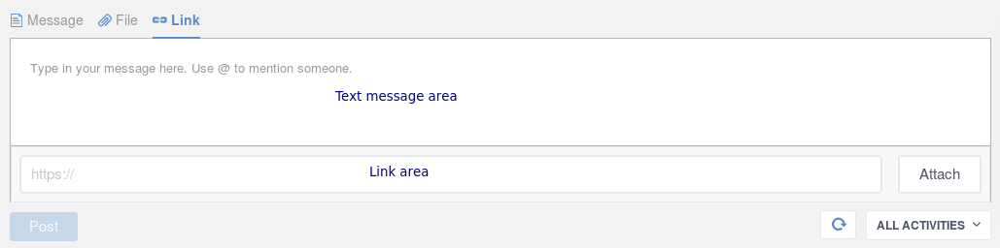
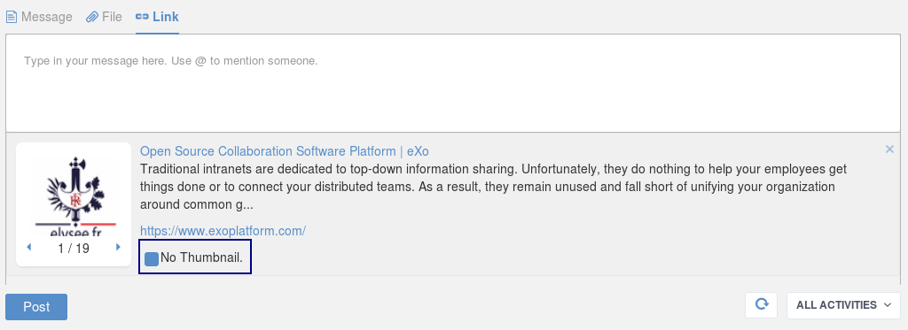
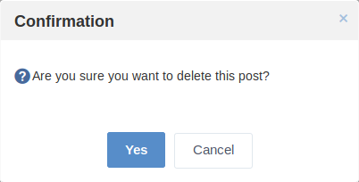
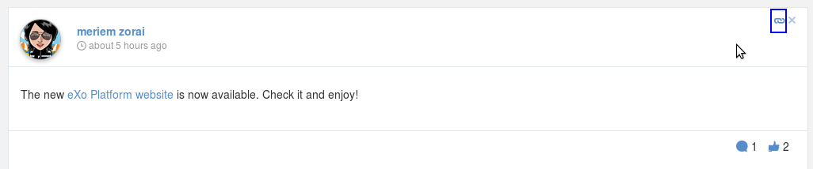
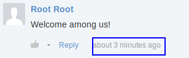
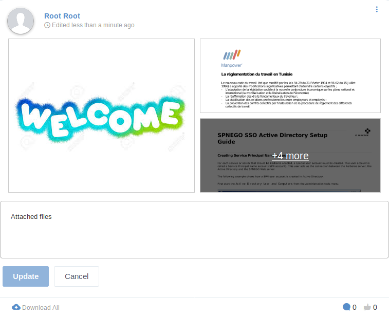
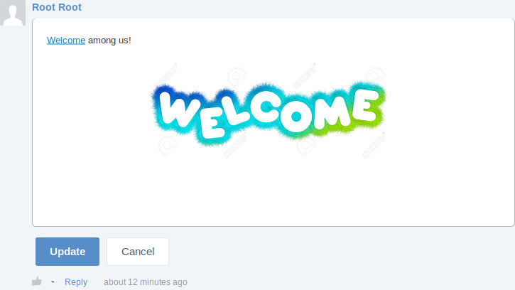
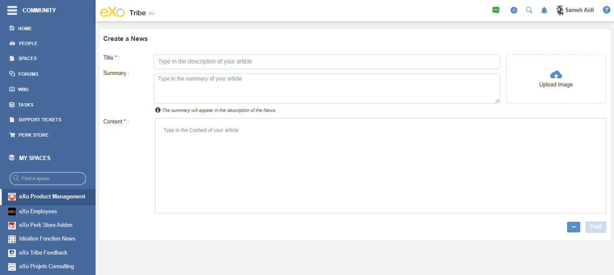

.. _GettingStarted:

################
Getting started
################

This chapter covers the following topics:    

:ref:`Glossary <Glossary>`

       Terms which are commonly used in eXo Platform applications.

:ref:`Welcome to eXo Platform <Welcome-screens>`

       Introduction to what you need to do for the first startup of
       eXo Platform.
       
:ref:`Social Intranet Homepage <PLFHomepage>`

       Introduction to the Social Intranet homepage, the Social Intranet
       applications and how to change your language.
       
:ref:`Signing in/Signing out Social Intranet <Signing-in-and-Signing-out>`      

       How to sign in and sign out Social Intranet.
       
:ref:`Changing your account settings <Managing-Account>`  

       How to change your account profile and password.
       
:ref:`Forgot Password <Forgot-Password>` 

       How to request a link to reset your password.

:ref:`Using the Activity stream <Managing-Activities>`

       How to post status updates, share links and documents, delete
       activities/comments, comment on activities, or like/unlike
       activities.

.. note:: According to your roles, not all features described in this guide
    are available to you. Check with your administrator to assure which
    features are for your account or ask for more appropriate rights.
    
.. _Glossary:

========
Glossary
========

This section provides a number of terms that you will encounter when
implementing eXo Platform.

Site
~~~~

A web-based environment which is used for aggregating and personalizing
information via specific applications with an interactive and consistent
look and feel. Users and administrators are able to integrate
information, people and processes via a web-based user interface.

Portlet
~~~~~~~~~

An applicative component pluggable to a site through which users can
access some specific information, including supports, updates, or
mini-applications. The portlet produces fragments of a markup code that
are aggregated into a page. Typically, a page is displayed as a
non-overlapping portlet windows collection, where each portlet window
displays a portlet. Content generated by a portlet can be customized,
depending on the configuration set by each user. **Portlets** can be
divided into two following types:

-  **Functional portlets** which support all functions of a site. They
   are built into the site and accessed via toolbar links when the
   site-related tasks are performed.

-  **Interface portlets** which constitute the eXo Platform interface as
   front-end components of the site.

Super-user
~~~~~~~~~~~

A super-user is a special user who has full privileges and used for the
administration. In eXo Platform, this account is configured with Root, Root,
root@localhost and its memberships are
member:/organization/management/executive-board,
\*:/platform/administrators, \*:/platform/users,
\*:/platform/web-contributors, \*:/organization/employees. A super-user
has all permissions on all features of eXo Platform.

Navigation
~~~~~~~~~~~

A set of menus (sometimes so-called node tree) that contains hyperlinks
to other parts of a site. The default navigation menus in eXo Platform are
located in the top navigation bar:

|image0|

Space
~~~~~~

A collaboration workspace where you can share documents, tasks, events,
wikis and more. A space can be open or closed, private or public and
space administrators can manage members and applications that are
available.

Connection
~~~~~~~~~~~

A bond among people in a network. By connecting to other people, you
will be able you to track their activities through the activity stream.

Activity
~~~~~~~~

An activity is published on the Activity Stream and allows you to follow
what your connections are sharing, such as links to documents or just
moods. An activity can be made out of different parts:

-  The author

-  The author's avatar

-  The space

-  The type of the activity (for instance Documents, Wiki, Forums,
   Spaces or Connections)

-  The activity message

-  The featured content

-  The action bars including the buttons Comment and Like

-  The like section

-  The comment section

Gadget
~~~~~~~

A mini web application which is run on a platform and can be integrated
and customized in the website. You can add these gadgets to your
dashboards by yourself.

Modes
~~~~~

eXo Platform offers two access modes by default:

-  **Public mode** is for guest users (visitors) who are not registered.
   In this mode, you are not required to sign in, but limited to public
   pages in the site. After being registered successfully, you can use
   the private mode, but must contact the site administrators to get
   more rights or the group manager to become the member and gain the
   access to the group.

-  **Private mode** is for registered users who will apply their
   usernames and passwords to sign in. This mode supports users in
   taking many actions, such as creating private pages, editing or
   deleting them, "borrowing" pages from others by creating hyperlinks,
   changing languages to their individual needs, managing private
   information.

Permission
~~~~~~~~~~~

**Permission** settings control actions of a user within the site and
are set by the administrators. See `Managing
permissions <Administration.ManagingPermissions>`
for more details.

Repository
~~~~~~~~~~~

A locus where content or digital data are maintained. Users can access
without traveling across a network.

Drive
~~~~~~

A shortcut to a specific location in the content repository that enables
administrators to limit visibility of each workspace for groups of
users. It is also a simple way to hide the complexity of the content
storage by showing only the structure that is helpful for business
users.

In details, a drive consists of:

-  A configured path where the user will start when browsing the drive.

-  A set of allowed views that will allow the user to limit the
   available actions, such as editing or creating content while being in
   the drive.

-  A set of permissions which limits the access and view of the drive to
   a specified number of people.

-  A set of options to describe the behavior of the drive when the users
   browse it.

Node
~~~~~~

An abstract unit used to build linked data structures, such as linked
lists and trees, and computer-based representation of graphs. Nodes
contain data and/or links to another nodes. Links between nodes are
often implemented by pointers or references.

Also, a node can be defined as a logical placeholder for data. It is a
memory block which contains some data units, and optionally a reference
to some other data. By linking one node with other interlinked nodes,
very large and complex data structure can be formed.

WebDAV
~~~~~~~~

This term stands for Web-based Distributed Authoring and Versioning. In
eXo Platform, it is used as a mean to access the content repository directly
from the **Sites Explorer**.

Symlink
~~~~~~~~

A special file which contains a reference to a document or a folder. By
using symlinks, you can easily access specific nodes (target) to which
symlinks point. In **Documents**, a symlink has a small chain symbol
next to its icon.   

.. _Welcome-screens:

========================
Welcome to eXo Platform
========================

eXo Platform is a full-featured application for users to have many
experiences in building and deploying transactional websites, authoring
web and social content, creating gadgets and dashboards with reliable
capabilities of collaboration and knowledge. When you initialize eXo Platform
for the first time, the **Terms and Conditions Agreement** screen is
displayed as follows:

|image1|

    .. note:: The **Terms and Conditions Agreement** screen appears in the Commercial editions only. In the Community edition, the Account Setup form appears for the first time.

This agreement contains all terms and conditions that you need to read
carefully before deciding to use eXo Platform. By ticking the checkbox at the
screen bottom, you totally agree with the eXo Platform's terms and
conditions. Next, click Continue to move to the Account Setup form.

|image2|

The Account Setup window consists of 2 sub-forms:

-  Create your account: Create your primary account.

-  Admin Password: Change the default password of the "root" user. You
   can use this account to log in eXo Platform as a *super-user* who has the
   highest rights in the system.

You can select Skip to ignore this step, then sign in as the root user
with the default password (gtn).

Setting up your account
~~~~~~~~~~~~~~~~~~~~~~~~~~

1. Enter your information in fields.

-  It is required to fill all fields, except the Username field of the
   Admin Password form, which is pre-filled with "root" and disabled.
   See :ref:`Adding auser <ManagingYourOrganization.AddingUser>` for 
   more details.

-  Values entered in both Password and Confirm fields must be the same.

-  You can change these entered information after logging in eXo Platform.
   See :ref:`Changing your account settings <Managing-Account>` for more details.

2. Click Submit to finish setting up your account.

Once your account has been created successfully, a Greetings! screen
appears that illustrates how to add more users.

|image3|

3. Click Start to be automatically logged in with your created account and
redirected to the :ref:`Social Intranet homepage <PLFHomepage>`. Now, you can start adding more users to collaborate, creating/joining spaces, or creating/following activities.

    .. note:: * After your accounts have been submitted successfully, the following memberships will be granted to your primary account:
       - \*:/platform/administrators
       - \*:/platform/web-contributors
       - \*:/platform/users
       - \*:/developers

	* If the server stops before your account setup data is submitted, the Account Setup screen will appear at your next startup.
	
.. _PLFHomepage:

==========================
Social Intranet Homepage
==========================

This section introduces you to the Social Intranet homepage. Besides,
you will further learn about the following topics:

 * :ref:`Creating content quickly <Creating-content>`
   How to create your preferred content without navigating to its
   relevant application, including events, tasks, polls, topics and Wiki
   pages.
   
 * :ref:`Social Intranet applications <Intranet-Gadgets>`
   Introduction to applications that come with the Social Intranet
   homepage.
   
 * :ref:`Changing the UI language <Change-Language>`
   Instructions on how to change the UI language of eXo Platform.

After signing in your account successfully, you are redirected to the
**Social Intranet** homepage, the starting point for exploring eXo Platform.
This homepage provides you a perfect overview of all social and
collaboration activities available in eXo Platform.

|image4|

There are 3 main divisions in the **Social Intranet** homepage:

**Navigations**

-  *Top navigation* |image5|: Take common actions via the following
   menus:

   -  **Help**: Access online guides by clicking |image6|. For example,
      if you are in the Wiki application, but still not know how to get
      started with it, simply click |image7|. You will then be
      redirected to the instructions page regarding to Wiki in another
      browser tab.

   -  **User Profile**: Change your profile information, preferences,
      language or quickly navigate to your personal pages by clicking
      your display name, for example: John Smith.

   -  **Notification**: Clicking |image8| will show all on-site
      notifications. See :ref:`Managing your notifications <Managing-Notification>`
      for more details.

   -  **Search**: Search for any types in eXo Platform, such as people,
      spaces, files, events, tasks, activities, by clicking |image9|.
      See :ref:`Searching In eXo Platform <Search>` for more details.

   -  **Create**: Quickly create content (Wiki pages, topics, polls,
      events/tasks, files) from any places by clicking |image10|. See
      `Creating content
      quickly <Creating-content>`__ for more details.

   -  **Administration**: Perform advanced actions, such as managing
      users, content, applications, monitoring your system or organizing
      sites, by clicking |image11|. This menu is only visible to members
      of the web-contributors and administrator group.

   -  **Edit**: Manage certain aspects of eXo Platform, including content,
      pages and sites by clicking |image12|. This menu is only visible to
      members of editor and administrator groups. See :ref:`Customizing eXo Platform <CustomizingLookAndFeel>`
      for details.

       .. note:: The number of menus which are displayed on the top navigation may vary, depending on your role. For example the administration menu appears only for members of the group */platform/administrators*.

-  *Left navigation* |image13|: It is a hamburger menu which allows you
   to quickly jump to :

   -  **Applications**: By default, the following applications are
      available:

      -  Home: To come back to your social intranet homepage from any
         page.
         
.. _People_Directory:          

      -  People: To display the whole list of the platform users. You
         can manage your connections, search for users using different
         filters...

      -  Wiki: To go to your social intranet wiki application which is
         shared between all users.

      -  Documents: To go to documents application where you can manage
         your personal drive and shared files.

      -  Forums: To go to your social intranet forums application where
         you can post and reply to discussions.

      -  Calendar: To go to calendar application and view personal and
         shared calendars.

   -  **Pages** shared by all users in the COMPANY list.

   -  **Spaces** in the "MY SPACES" list. It is also possible to search
      for spaces by clicking on Join a space.

   This hamburger menu is collapsible in order to widen the area for the
   activity stream:

   |image14|

   When connecting to the platform, the menu is by default expansed. To
   collapse or expand it, you should click on the hamburger menu icon
   |image15|.

   When collapsed, the left navigation menu displays only application's
   icons. Mousing over an icon displays a tooltip with the application's
   name. Clicking on an icon redirects you to the concerned application.

       .. note:: - The order of applications and pages in the COMPANY list may change in case some applications are not deployed, or some additional applications/pages are implemented.
				 - The MY SPACES list shows the latest spaces browsed by the user. If there are more than 10 spaces in the list, the Show [X] More Spaces link appears at the list bottom. Click this link to view more spaces.
				 - The Show [X] More Spaces link is not displayed when the left navigation menu is collapsed. It is only available if the menu is expansed.
				 - When the left navigation menu is collapsed, spaces search is not possible as the search field is not available. To search spaces, you should expand the left navigation menu.

**Activity Composer** |image16| **& Activity Stream** |image17|

-  From Activity Composer, you can update your status, upload and share
   your document/link. See `Updating status <Share-AS>`for more details.

-  From Activity Stream, you can follow activities of your colleagues
   and spaces, create your own activities (liking or commenting). See
   `Using the Activity Stream <Share-AS>` for more details.

**Applications** |image18|

Quickly perform key actions through the following applications:

-  *Getting Started*: See a list of suggested actions you can start.
   See :ref:`Getting Started application <Getting Started>` for more details.

-  *Calendar*: Get an overview of calendar events. See :ref:`Calendar application <CalendarApp>` for more details.

-  *Invitation*: See a list of spaces and users who have sent connection requests to you. See :ref:`Invitations application <InvitationsApp>` for more details.

-  *Suggestions*: See who you may want to connect with and spaces which you can ask to join. See :ref:`Suggestions application <SuggestionsApp>` for more details.

-  *Who's Online?*: See who are online or send your connection request to them. See :ref:`Who's Online? application <WhoIsOnlineApp>` for more details.

.. _Creating-content:

Creating content quickly
~~~~~~~~~~~~~~~~~~~~~~~~~~~~

In eXo Platform, you easily create your preferred content without navigating
to its relevant application. Simply click |image33| to open the drop-down
menu.

|image34|

Here, you can do the following actions quickly:

 * :ref:`Creating a task`
 * :ref:`Creating an event`
 * :ref:`Creating a poll`
 * :ref:`Creating a topic` 
 * :ref:`Uploading a document`
 * :ref:`Creating a Wiki`

.. _Creating a task:

Creating a task
---------------

1. Simply select Task from the drop-down menu. The menu will be updated into the Create a new task form.

|image35|

2. Fill in the Title field, and then hit the button Add.

After saving, a pop up link appears |image36| which points to the
created task.

.. _Creating an event:

Creating an event
-------------------

1. Simply select Event from the drop-down menu. The menu will be updated
   into the Add event form.

|image37|

2. Give details for your event, including: Title, From and To dates, time.
   For more details, see :ref:`Creating a new event <CreatingNewEvent>`.

3. Select the calendar where your event will be created from the Select Calendar drop-down menu.

4. Click Save to add your event.

A pop up |image38| appears indicating in which calendar the event was added.

    .. note:: Click Cancel at any time to dismiss the Add event form.
    
.. _Creating a poll:    

Creating a poll
----------------

1. Click Poll from the drop-down menu. This menu will be updated into 
   the form as below:

|image39|

    .. note:: If there is no forum available in Intranet and the user has no space
				forum yet, the following warning is displayed: "Sorry, no forum is
				available yet to create a poll. Start by creating your own space."

2. Select the location where your poll is created from the In Location
   menu. If you have at least one public forum, the "intranet" location 
   is selected by default.

3. Click Next to open the Poll form, or Cancel to dismiss the form.

-  If you select a space forum, you will be redirected to the **Forums**
   application of the selected space after clicking Next.

-  If you select "intranet" which has more than 1 forum and then click
   Next, another new selection menu will be opened. The Next button now
   becomes disabled until you have selected one forum from the And Forum
   menu.

   |image40|

4. Fill in the Poll form. See :ref:`Creating a poll <Create-poll>` for 
   more details.

.. _Creating a topic: 
 
Creating a topic
-----------------

1. Click Topic from the drop-down menu.

    .. note:: If there is no forum available in Intranet and the user has no space forum yet, the following warning is displayed: "Sorry, no forum is available yet to create a topic. Start by creating your own space."

2. Select the location where your topic is created from the In Location
drop-down menu. The "intranet" is selected by default.

3. Click Next to open the New Topic form.

-  If you select a space forum, you will be redirected to the **Forums**
   application of the selected space after clicking Next.

-  After clicking Next, if you select "intranet" which has more than 1
   forum, one new selection will be opened that requires you to select
   your desired forum as below. The Next button becomes disabled until
   you have selected one forum.

   |image41|

4. Fill in the New Topic form. See :ref:`Creating a topic <Create-topic>`
   for more details.

.. _Uploading a document: 

Uploading a file
-----------------

Simply select Upload a File from the drop-down menu. See :ref:`Sharing a File <Sharing-Link-and-File>` for more details.

.. _Creating a Wiki: 

Creating a Wiki page
---------------------

1. Click Wiki Page from the drop-down menu.

|image42|

2. Select the location where your Wiki page is created from the In 
   Location drop-down menu. The "Intranet" space is selected by default.

3. Click Next to be redirected to the Wiki application of your selected
   location. Here, you can :ref:`navigate across spaces <Navigate-across-spaces>`.

4. Enter the content of your Wiki page. See :ref:`Creating a page <Creating-New-Page>`
   for more details.

.. _Intranet-Gadgets:

Social Intranet applications
~~~~~~~~~~~~~~~~~~~~~~~~~~~~~~

Intranet applications are ones which come with the Social Intranet
homepage, including:

 * :ref:`Getting Started`
 * :ref:`CalendarApp`
 * :ref:`InvitationsApp`
 * :ref:`SuggestionsApp`
 * :ref:`WhoIsOnlineApp`

.. _Getting Started:

Getting Started
------------------

The Getting Started application is displayed first in the list of the
Intranet homepage applications on the top right. This application helps
you start exploring the Social Intranet by suggesting you where to go
and what you should do first via the following links:

-  :ref:`Add a profile picture <Change-your-avatar>`

-  :ref:`Connect to coworkers <Send-Connection-Request>`

-  :ref:`Join a space <Join-space>`

-  :ref:`Post an activity <Share-AS>`

-  :ref:`Upload a document <Uploading-files>`

|image43|

Clicking each link will direct you to the related page to do the action.

After each action is performed, it will be remarked as completed with a
strike-through even though it is not performed via this application.
Also, the completion percentage is updated on the percentage bar.

When all the actions are performed, the completion percentage will be
100%. You can remove this application from the homepage by clicking
Close or by hovering your cursor over the application header, and click |image44|.

|image45|

    .. note:: - You cannot get the Getting Started application back when it is removed. 
			  - The "Upload a document" action is considered as completed only when a document has been uploaded in your Personal Documents drive.
    
    
.. _CalendarApp:

Calendar
---------

The Calendar application displays some calendars and all of their events
and tasks scheduled in the Calendar applications of Intranet and spaces.
When going to the homepage, you will see events with their start and end
date and tasks of Today. You can also see the events and tasks of the
previous/next day by clicking the previous/next arrow respectively.

|image46|

-  To view details of an event/task directly in the Calendar
   application, click your desired event/task.

-  To configure and set which calendars to be displayed in the Calendar
   application, hover your cursor over the application, then click
   |image47| at the right bottom of the application.

   -  To remove a calendar from the list of Displayed Calendars, click |image47|.

      This removed calendar will appear in the list of Display
      Additional Calendar.

   -  To add one of removed calendars again to the list of Displayed
      Calendars, simply hover your cursor over the desired calendar,
      then click |image48|. You can use the Search box to filter
      calendars quickly.

   -  Click **OK** to accept your settings.

    .. note:: When a task is completed, it will be remarked with a strike-through.

.. _InvitationsApp:

Invitations
-------------

The Invitations application shows a list of spaces and users who have
sent you connection requests. You can see the number of requests
displayed next to the application name.

|image49|

-  For a user's connection request, you will see his avatar, name and
   title (if defined).

-  For a space's connection request, you will see its avatar, name, the
   number of members and know if it is public or private.

You can accept/refuse an invitation by hovering your cursor over a
user/space's name, then clicking Accept or |image50| respectively.

When the invitation is accepted or refused, it will permanently removed
from the list.

    .. note:: The Invitations application is not displayed when there is no invitation.

.. _SuggestionsApp:

Suggestions
------------

The Suggestions application suggests you to connect with other users or
to join spaces. Usually, it suggests two people having the most common
connections with you, and two spaces having the most members who are
your connections. Otherwise, it will suggest the newest users or the
latest created space in the portal.

|image51|

-  To accept the people/space suggestion, hover your cursor over their
   names and click Connect or Request respectively.

-  To refuse the suggestion, hover your cursor over the people/space
   names and click |image52|.

When the suggestion is accepted or refused, it will permanently removed
from the list.

    .. note:: -  You can click a person's name suggested in the list to see his profile.
			  -  If there is no suggestion, the Suggestions application is not displayed.
       
       
.. _WhoIsOnlineApp:

Who's Online?
--------------

The Who's Online? application shows all users who are already logged in
the portal.

|image53|

Hover your cursor over the avatar of an online user, a pop-up will show
you some information about him, such as name, avatar, current position
(if defined), and the last activity message of status activity, file or
link sharing activity (if any).

You can also see your connection status with an online user via the
corresponding button at the pop-up bottom:

-  If you are not connected with him yet, the Connect button is to send
   connection invitation to him.

-  If you have sent a connection request, the Cancel Request button is
   to revoke your connection request.

-  If you are invited to connect, the Confirm button is to accept his
   connection request.

-  If you are already connected with him, the Remove Connection button
   is to delete connection between you and him.

    .. note:: From the pop-up, you can click his avatar or display name to jump to his activity stream page.

.. _Change-Language:

Changing the UI language
~~~~~~~~~~~~~~~~~~~~~~~~~~~~~~

To change the language of eXo Platform, do as follows:

1. Click your display name on the top navigation bar, then select Change
Language from the drop-down menu.

|image55|

2. In the Interface Language Setting form, you will see 23 languages that
eXo Platform supports. Select your preferred language to display, for
instance *English*:

|image56|

3. Click Apply to commit your changes.

    .. note:: In eXo Platform, the priority order of the display language is as the following:
			  *User's language --> Cookies' language --> Browser's language --> Site's language*
			  It means the language set by the user will be at the highest level, and the site's language at the lowest level.
			  Accordingly, you should pay attention to this order when selecting your preferred display language.

.. _Signing-in-and-Signing-out:

=========================================
Signing in/Signing out Social Intranet
=========================================

.. _sign-in-intranet:

Signing in Social Intranet
~~~~~~~~~~~~~~~~~~~~~~~~~~~

    .. note:: To sign in Social Intranet, you must have an account. Your account is created by the Administrators and you can :ref:`change your profile <Profile-info>` and :ref:`password <Change-password>` later.
				See how to add a new user in the :ref:`Adding a user <ManagingYourOrganization.AddingUser>` section.

You can sign in Social Intranet by doing as follows:
|image19|

1. Input your Username and Password in the Connect to you account form.

Switch *Stay signed in* to Yes if you want to automatically return to this
portal without signing in again. This feature enables you to be
automatically authenticated to avoid doing an explicit authentication
when you access the site.

2. Click *Sign in*. If your account has been suspended, one message says that
"*This user account has been suspended. If you think this is an error,
please contact the administrator.*\ ".

    .. note:: After selecting Stay signed in, if you do not sign out when you leave the portal, you will be automatically authenticated for your next visit.

.. _sign-out-intranet:

Signing out Social Intranet
~~~~~~~~~~~~~~~~~~~~~~~~~~~~~~~

To sign out, simply click your display name on the top navigation bar,
then select Logout from the drop-down menu.

|image20|

.. _Managing-Account:

=================
Managing Account
=================

To change your account information, click your display name on the top navigation bar of the site and click Settings from the drop-down menu. 

|image21|

The account settings appears. 

|image22|

.. _Profile-info:

Changing your profile information
~~~~~~~~~~~~~~~~~~~~~~~~~~~~~~~~~~~

1- Select the **Account Profiles** tab. 

2- Change your **First Name**, **Last Name** and **Email**. Your Username cannot be changed. 

3- Click Save button to submit your changes. 

.. note:: The email address changed must be in the valid format. See details about the Email Address format here.

.. _Change-password:

Changing your password
~~~~~~~~~~~~~~~~~~~~~~~~~~

1- Select the **Change Password** tab. 

|image23|

2- Input your current password to identify that you are the owner of this account.

3- Input your new password which must have at least 6 characters.

4- Re-enter your password in the **Confirm New Password** field. 

5- Click **Save** button to accept your changes. 

.. note:: The users who just did their login via the social networks will not have a password defined. 
			They should be able to reset a password via their Account Settings or via the Forgot Password feature or ask the administrator to set it (in the Manage Community page). 
			Once the password is set, the user can either log in via the login/password or via the social networks.

When the reset password link is clicked:
- An information message is displayed: Reset password guidelines have been sent to you. Please check your mailbox.
- The **Forgot Password** function is executed, and the users receive an email to guide them to change their account password.

.. _Managing-social-networks:

Managing your social networks
~~~~~~~~~~~~~~~~~~~~~~~~~~~~~~~~

If your administrator does not integrate OAuth with eXo Platform, you will see one message "No social network available". 
If any social network is integrated, you will see the following that allows you to link/unlink your account to the social networks.

|image24|

- The text fields are read-only. Each has a value when the eXo account is linked with a social network account; otherwise, it is empty.
- A social network username can only be associated with a single eXo account at one time. 
  Hence, if one attempts to link with a username that is already linked to another account, an error message is displayed: This {$Network} username ({$Username}) is already linked to an eXo username. 
  Please enter another one or ask your administrator to unlink it.
- When you click the Unlink button, the link between the social network and the eXo Platform account is reset to blank. Hence, this username can be used to link another eXo account.

.. _Forgot-Password:

==================
Forgot Password
==================

If you forget your password, you can request the system to send you a
link to reset it. The link will be sent to your email. It helps if you
forget the username also, but it requires an email that is set in your
account properly.

1. In Login screen, click *Can't access your account?* link.

|image24|

2. In next screen, input your username or email, then click Send.

|image25|

3. Check your mailbox. The email looks like this:

|image26|

4. Click the link in the email, then input your new password and click
Save.

|image27|

If the password is saved successfully, a popup will notify you in
seconds, then you are redirected to the Login screen.

In case the link has been expired already, you will see a notification
like this:

|image28|

The link expires as soon as you successfully reset the password, or
after 1 day by default. The system administrators can :ref:`configure the expiration time <#PLFAdminGuide.Configuration.ForgotPassword>`.

.. _Managing-Activities:

============================
Using the Activity Stream
============================

 * :ref:`Sharing in the activity stream <Share-AS>`
   Steps to post status updates through the **Activity Stream**. 

 * :ref:`Sharing a news in the activity stream <Sharing-news>`
   Steps to post a news in the **Activity Stream**.
   
 * :ref:`The formatting toolbar in activity messages and comments <Formatting-toolbar>`
   This sections describes possible actions with the microblog toolbar.     
   
 * :ref:`Mentioning someone <Mentioning-People>`
   Steps to refer to someone in your activity composer or comment box. 
   
 * :ref:`Editing an activity <Editing-Activities>`
   Steps to refer to someone in your activity composer or comment box. 
   
 * :ref:`Liking activities <Liking-Activities>`
   Steps to show your reaction (like/unlike) towards an activity. 
   
 * :ref:`Deleting an activity <Deleting-Activities>`
   Steps to remove activities from the **Activity Stream**.
   
 * :ref:`Getting permalink of an activity <Getting-Permalink-activity>`
   Steps to get permanent link of an activity.     
   
 * :ref:`Commenting on activities <Commenting-Activities>`
   Steps to comment on an activity that allows you to get ideas, answers, and any additional information.   
   
 * :ref:`Editing a comment <Edit_Comment>`
   Steps to edit a comment in the **Activity Stream**.
      
 * :ref:`Liking comments <Liking-comments>`
   Steps to express emotion (like or remove like) on a comment to an activity. 
   
 * :ref:`Replying to comments <Replying-comments>`
   Steps to reply to a comment.    
   
 * :ref:`Deleting a comment <Deleting-Comment>`
   Steps to remove a comment from the **Activity Stream**.
   
 * :ref:`Getting permalink of a comment <Getting-Permalink-comment>`
   Steps to get permanent link of a comment.    
      

After logging in, you will be directed to the Intranet homepage as
below.

|homepage|

You can see activities of other users by clicking their display name to
reach their profile page, then selecting Activity Stream. However, for
people that are not in your connections, you only can view their
activities but cannot **post**, **comment** or **like** on their
activity streams.

The homepage also aggregates activities from spaces, so you can keep
track of their activities without visiting every space. For example,
when there is a new post in a forum of a given space, it is displayed in
**Activity Stream** of the space and of the Social Intranet homepage.

You can filter what you want to see on the homepage:

|filter|

-  |image29| **All Activities**: shows all activities from spaces,
   connections and your activities. This stream is selected by default.

-  |image30| **My Spaces**: only shows activities created in spaces where
   you are member.

.. _ConnectionsFilter:

-  |image31| **Connections**: shows activities created by your
   connections.

-  |image32| **My Activities**: shows your activities (inside and outside a space) and activities where you were :ref:`mentioned <Mentioning-People>` in, that you liked or where you left comments.

To access your **Activity Stream** page, click your display name on the
top navigation bar, then select **My Activities**.

You will be then directed to your **Activity Stream** page.

    .. note:: In **Activity Stream**, the order of activities is based on the last date when you create a publication action, or post a new comment. This means the last publication or comment will be auto-updated and pushed up to the top of the **Activity Stream** so that you will not miss any recent activities.

.. _Share-AS:

Sharing in the activity stream
~~~~~~~~~~~~~~~~~~~~~~~~~~~~~~~~

Using the acivity stream, you are able to share with your connections or
other space members (in the space's activity stream):

-  A text Message to ask for help or to inform something.

-  A link.

-  A single file or many files.

|image57|

.. tip:: When you already started to type a text message, add attachement or link to an activity post 
         and that the page will be refreshed, a confirmation popup appears to warn you about the unsaved changes.
         
         -  In chrome browser: 
         
                |image154|
         
         - In Firefox browser:
         
                |image155|
         

.. _text-message:

Posting a text message in the activity stream
--------------------------------------------------

To share a text message with your connections or to other space's members, follow these steps:

1. Click on *Message* tab form the activity composer, an area for message
composing appears with a formatting toolbar.

|image58|

2. Type your message, you can format it using the buttons of the formatting toolbar:

|image59|

-  |image60|: Selecting a text then clicking on that button makes it in
   bold format.

-  |image61|: Selecting a text then clicking on that button makes it in
   italic format.

-  |image62|: Selecting a formatted text then clicking on that button
   eliminates the formatting on it.

-  |image63|: Allows to add/remove a numbered list.

-  |image64|: Allows to add/remove a bulleted list.

-  |image65|: Allow to quote a text.

-  |image66|: Allows to insert a link in the text message.

-  |image67|: Allows to attach an image to the text message.

Click on |image68| button to share the message in the activity stream.

|image69|

.. note:: **2000** characters are allowed in the message activity post. If you exceed this limit, a warning message 
          appears under the text composer:
          
          |image152|

.. _files-in-AS:

Posting files in the activity stream
--------------------------------------

You can share a file or many files with your connections or in a space's
activity stream by following this procedure:

Click on File tab form the activity composer, an area allowing to upload
file appears:

|image70|

Select the desired file or files. More details in :ref:`Share multiple documents in activity stream <MultiUpload>` 
section.

You can add a text message or not and then click on |image71| button to
share the file(s) in the activity stream.

|image72|

.. _Link-post-in-AS:

Posting link in the activity stream
------------------------------------

In additions to posting messages and files in activity stream, you can
also share link by making these steps:

Click on Link tab form the activity composer, two areas appears:

-  Composer: allowing to add or not a text message with the link.

-  Link area: allowing to attach a link in the activity stream.

|image73|

Add the link in the corresponding area and then click on |image74|.

The link is attached and a thumbnail appears with a brief text from the
corresponding page to the link:

|image75|

You can check No thumbnail to remove the thumbnail display.

Add or not a text message and then click on |image76| button to share
the link.

|image77|

    .. note:: If the activity composer is empty, the |image78| button still grey and unclickable until adding something (a text message, a link or a file) in the activity composer area.

.. _Sharing-news:

	
Sharing a news in the activity stream
~~~~~~~~~~~~~~~~~~~~~~~~~~~~~~~~~~~~~~
	
From a space's acivity stream, you are able to share a news with the space’s members. 
Publishing a news allows you to easily write, broadcast, pin and share communication content.

Sharing a simple news from short form
--------------------------------------

To share an article with other space’s members, click on News tab from the activity composer, the tab contains :

- A **Title** field :  Allows you to enter the news title. The title should not exceed 150 characters: Beyond that limit you will not be allowed to write.

- A **Content** field : Allows you to enter the content of the News. No limitation for the number of characters.

- A **Pin article** Check box.

- A **More icon** with a tooltip “more options”: Permits to open the creation full form.

- A **Post** button : Disabled by default until the two fields “Title” and “Content” are filled.

|image156|

Once all fields are filled, click on the Post button to post the News in the space's activity stream.

The article is shared into the space's activity stream.

|image158|

.. note:: The |image157| button is grey and unclickable until the mandatory fields *title* and *content* are filled. 

         
Sharing a news from complete form
----------------------------------

To share an article from the complete form, you have to display the short form as explained in the previous paragraph and click on "More options" button.

|image159|

The displayed complete form page contains :

- A **Title** field :  Allows you to enter the news title. The title should not exceed 150 characters: Beyond that limit you will not be allowed to write. This field is mandatory.

- A **Summary** field : Allows you to enter the news summary. The summary if inserted will be displayed in the news preview. This field is optional.

- An "Upload image" area: Allows you to upload optionally an image as a illustrative vignette of the article.

- A **Content** field : Allows you to enter the content of the News. No limitation for the number of characters. This field is mandatory.

- A **Pin article** Check box.

- A **Less icon** with a tooltip “return to original post”: Permits to open the creation short form without losing the changes made in the complete form.

- A **Post** button : Disabled by default until the two fields “Title” and “Content” are filled.

|image160|

Once all fields are filled, click on the Post button to post the News in the space's activity stream.

The article is shared into the space's activity stream.

|image161|

		
.. _Formatting-toolbar:

The formatting toolbar in activity messages and comments
~~~~~~~~~~~~~~~~~~~~~~~~~~~~~~~~~~~~~~~~~~~~~~~~~~~~~~~~~

The formatting toolbar (or the microblog component) is present at every
place where you can add text message. It allows you to:

-  format your text: bold, italic, numbered list, bullet list

-  quote a previous message.

-  insert a link in your status message/comment

-  insert an image in your status message/comment.

|toolbar|

Text formatting in the microblog
-----------------------------------

You can format your text to make it richer and more readable by using
different effects.

Select the text you want to format. Then click on one of the buttons
from the formatting toolbar to apply its effect:

-  |image79| The first button formats the text as bold.

-  |image80| The second button formats the text as italic.

-  |image81| The third button clears the existing format.

-  |image82| Writing a text then clicking on the fourth button adds the
   text to a numbered list. Clicking on Enter button of the keyboard
   adds a new line with the following number.
   When the listing is finished, to exit from the numbered list, you should click twice on Enter button of the keyboard.

-  |image83| Typing a text then clicking on that button adds a bullet
   list. When you finish your listing, you need to double click on Enter
   button of the keyboard.

Quote text in the microblog
----------------------------

The formatting toolbar allows you to quote a previous text message. To
do this, click on the Quote button |image84| and then copy and paste the
text you want to quote.

Double click on the Enter button on your keyboard to leave the quote
area.

|image85|

Insert link in the microblog
------------------------------

To insert a link in your text message/comment, click on the link button
|image86| to bring up a Link form . Type the text and link into this
form.

The text you type will appear in your message/comment and will redirect
users to the inserted link.

|image87|

You can also link to text that has already been typed. Select the text,
then click on the Link button |image88|.

The Link form will appear with the Text field already completed. To
finish, type the link.

|image90|

    .. note:: It is also possible to add a link by right-clicking in the text area then selecting Link.
				|image91|

Insert image in the microblog
--------------------------------

The last button of the formatting toolbar in the microblog is the Insert
Image button allowing you to insert an image in your message/comment.

To insert an image in your text message/comment, follow these steps:

1. Click on the Insert Image button |image92| to open the Select image form.

|image93|

You have four options:

-  **Drop an image**: drag and drop an image from your computer. A progress
   bar will appear to indicate the upload progress.

   |image94|

   When the upload has ended, the image will appear in the dedicated
   area.

   |image95|

-  **Upload an image from your desktop**: It allows you to select an image
   from your computer. Browse for the image and double-click on it to
   select. A progress bar will appear to indicate the upload progress.

   When the upload has ended, the image will appear in the dedicated
   area.

-  **Select on server**: select an image already on the server from your
   drives. Clicking on the link opens the Select files form.

   |image96|

   Navigate through your drives and then select an image. This will be
   directly displayed in the dedicated area.

-  **Pick an image online**: insert an image using its URL. Paste the image
   link into the Image URL field. An upload time will appear and the OK
   button will be greyed.

   |image97|

   When the upload has ended, the image will appear in the dedicated
   area and the OK button will become clickable.

    .. note:: Click on the Cancel button to return to the screen showing the options. When picking an image online, click on the Back button. This button will disappear when the image is fully uploaded.

2. To choose the alignement you want, click on one of the three buttons.

|image98|

3. Click on the OK button. The image will appear in the comment/message
area.

|image99|

4. To resize, hover over the image to bring up a black frame. Manipulate the frame to the size you want.

|image100|

5. When you right click on the image, a contextual menu appears:

|image101|

-  Click on Copy followed by Paste to duplicate the image in the editor.

-  lick on Cut followed by Paste to move the image to another location
   in the editor.

-  Click on Change Image to open the Insert Image form prefilled with:

   -  the image preview.

   -  the image alignment as previously selected.

   -  the Remove Image link allowing you to remove the image and start
      again.

-  Click on Link to open the Link form allowing you to insert an image
   using its URL.

    .. note:: After you’ve finished resizing the image and posted it in the activity stream, the image will appear with the exact size you defined. Otherwise it appears in its default size.

.. _Mentioning-People:

Mentioning someone
~~~~~~~~~~~~~~~~~~~~~~

Mention is a way to refer to people so that they are informed of who and
what you are talking about. Mentioning someone is possible in activity
stream composer, activities comments and also document comments. To
mention someone, do as follows:

1. Type the "@" symbol into the activity/comment composer, then type the
person name you want to mention.

A suggestion list that contains matching characters will appear.

Only one person can be selected at one time.

	.. note:: When mentionning a user with "@", it displays **in first positions** contacts in your connections, **then** other people

|image102|

2. Go through the suggestion list with the "Up" and "Down" arrow keys or by
moving your cursor over it, then click or hit the "Enter" key to
validate your selected person.

    .. note:: Only one person can be selected at one time.
    

After being validated, "@" and following characters will be replaced
with First name and Last name which are wrapped in a label. You can
click [x] in the label to dismiss it.

|image103|

In the Activity Stream, the mention is displayed as a link to the mentioned user's profile page.

|image104|

    .. note:: -  You can do the same steps above to mention someone in your comments (document comments and activity comments).
			  -  The person you mention also sees the post in his/her Activity Stream.
			  -  Document comments appears also in the Activity Stream.

.. _Editing-Activities:

Editing an activity
~~~~~~~~~~~~~~~~~~~~

With eXo Platform you can edit an activity you posted.
To edit an activity, proceed as follows:

1. Click the pulldown menu on the top right of your activity : |image135|. Two entries appear: Edit and Delete.
	
	|image136|

2. Click on ``Edit`` --> Your activity’s text appears in the editor area allowing you to make changes.

    |image137|

3. Make the needed changes and then click on ``Update`` button.

.. note:: The ``Update`` button remains disabled until at least one change is done.

4. If you click the ``Cancel`` button, your changes will be ignored.

.. note:: Edition is only possible on written text or inserted images added via the :ref:`CKEditor<Formatting-toolbar>` toolbar. 
          :ref:`Attached images <files-in-AS>`, :ref:`files <files-in-AS>` or :ref:`link <Link-post-in-AS>` 
          (added through the dedicated tab) can’t be edited.

              |image138|
          
          If the activity contains only attachments (link or files and/or images) the edit button opens the
          editor allowing you to type a text message.
          
              |image139|
              
After saving the change you made on your activity, the activity creation timestamp will be updated by a new 
label under your name indicating the time of the last edit:

|image140|   

If you mouseover the timestamp, a popover appears indicating the original time of activity post.

|image149|    

.. warning:: Activities automatically generated from other aplications such as:
             
				 - Adding a topic or replying to a forum discussion
				 - Creating or joining a space
				 - Updating your profile
				 - Adding/Editing a wiki page
				 - Closing, opening or locking a topic in Forum application
				 - Adding a poll to a topic 
				 - Editing an event in Calendar
				 - Moving a wiki page
				 - Editing a space's description/avatar
				 - Connecting with a new user
             
             are not editable, you just can delete them when you click on |image146| button.
             
             Only activities generated following a document upload in Documents application are editable, 
             you can add a text message to that activity.   
          
.. _Liking-Activities:

Liking activities
~~~~~~~~~~~~~~~~~~

You can "Like" an activity to show your interest and support to that
activity.

.. _like-activity:

Liking an activity
-------------------

Click |image110| under the activity you like, a tooltip appears |image111|.
When you like an activity, the "Like" button will be highlighted to show
that you already click "Like" on that activity. The activity displays
the information of like numbers or people who also like the activity
right below it. If many people have liked the activity, you can click
|image112| to expand the view to see other "likers".

|image115|

.. _unlike-activity:

Unliking an activity
---------------------

To unlike a "Liked" activity, simply click |image113|.

When disliking, a tooltip dislike appears. |image114|

.. _Deleting-Activities:

Deleting an activity
~~~~~~~~~~~~~~~~~~~~~

You are allowed to delete your activities that you created, and
those in your activity stream and in the space **where your are the manager**.

1. Change the activity filter to **All Activities** or **My spaces** to view all of your activities.

   |image105|

2. Click on the pulldown menu on the top right of your activity you want to delete.
   Two entries appear: Edit and Delete.
   
   |image106|

3. Click on ``Delete`` button --> A confirmation pop up appears.

   |image107|

4. Click ``Yes`` button in the confirmation message to accept your deletion.

.. note:: As an eXo Platform user, you can only delete your own activities. 
          If you are manager of a space, you can delete any activity posted in your space.

5. If you click ``Cancel`` button, nothing happens.

.. _Getting-Permalink-activity:

Getting permalink of an activity
~~~~~~~~~~~~~~~~~~~~~~~~~~~~~~~~~~

You can easily get the link of any activity (either edited or not) 
from the activity stream to share with others. With this feature, you can bring the
attention of other users to an activity/comment without the need to :ref:`mention them <Mentioning-People>`.

To get the permalink to an activity, just click on its timestamp.

|image131|

This permalink will then take you to the activity with all comments
expanded.

If the activity is edited, when you mouse over its timestamp, a tooltip appears displaying the 
original timestamp of the post.

|image147|

.. _Commenting-Activities:

Commenting on activities
~~~~~~~~~~~~~~~~~~~~~~~~~~

This action allows you to get ideas, answers, and any additional
information when your collaborators respond to your status updates.
Besides, you can comment by yourself about any activities as follows:

1. Click |image108| on the the activity you want to comment.

|image109|

2. Enter your comment into the Comment box and press the **Comment** button.
Your comment will be displayed right after the activity.

    .. note:: -  A formatting toolbar appears once you click in the comment composer. It allows you to change the formatting of your message, attaching images and links and preview how it will look once posted. (like what we have for :ref:`the activity stream composer <share-as>`)
              -  2000 characters are allowed in the comment message. If you exceed them, the comment button turns to inactive status.
                  
                  |image153|

When there are more than two comments on activity, 2 latest comments
will be displayed below the activity. You can click "View all XX
comments" (XX is the total number of comments) to view 10 more comments.
If some comments left are not displayed yet, click View previous
comments on the top of the comment part to view more.

|viewmore|

You can mention people in your comment by "@" symbol into your activity
composer, then type the person name you want to mention. See :ref:`Mentioning
someone <mentioning-people>` for more details.

.. _Edit_Comment:
 
Editing a comment
~~~~~~~~~~~~~~~~~~

Just like for activities, you can edit any comment you wrote.

To edit one of your comments, proceed as follows:

1. Click on the pulldown menu at the right of the comment box : |image141|. Just like for activities, two entries appear:
   
   |image142|

2. Click on ``Edit``  --> Your comment’s text appears in the editor area allowing you to edit it.

   |image143|
   
3. Edit your comment and then click on ``Update`` button.

.. note:: The ``Update`` button remains disabled until you change the comment.

4. If you click the ``Cancel`` button, your changes will be ignored.

.. note:: You can change an inserted link/image to your comment.

           |image144|
           
Like for activities, after saving the change you made to your comment, a text appears near your name indicating that 
an edit has been done:

|image145| 

.. warning:: Comments generated from other aplications such as:
             
				 - Adding a topic or replying to a forum discussion
				 - Creating or joining a space
				 - Updating your profile
				 - Adding/Editing a wiki page
				 - Closing, opening or locking a topic in Forum application
				 - Adding a poll to a topic 
				 - Editing an event in Calendar
				 - Moving a wiki page
				 - Editing a space's description/avatar
				 - Connecting with a new user
             
             are not editable, you just can delete them when you click on |image146| button.
             
             Only activities generated following a document upload in Documents application are editable, 
             you can add a text message to that activity.

.. _Liking-comments:

Liking comments
~~~~~~~~~~~~~~~~~

With eXo Platform 5, it is possible to express emotion on a user's comment to
a status or any other activity by liking the comment.

Under the comment text, a like icon is displayed |image116| which has 2
statuses:

-  The active status: When a user clicks on the like button, it turns to
   blue color.

-  The inactive status: The button is greyed when it is unclicked or
   clicked twice i.e first for liking and the second for removing like.

Clicking on the like button adds a number between brackets which
indicates the number of users who already liked the comment. If the like
button is already clicked and the user reclicks on it, it becomes
inactive and the number is decreased by 1.

-  Mousing over the number between brackets shows a popover which
   indicates the persons who liked the comment.

   |image117|

-  If the number of likers is more than 10, the pop over shows 9
   usernames and "X-9 more". To view the full list of usernames, you
   should click on the number between brackets.

   |image118|

-  Clicking on the number between brackets displays a popup named
   *People who liked* which lists the users who clicked the comment. The
   pop up contains:

   -  The user avatar.

   -  The user name.

   -  And one of these three buttons ahead each liker name:

      -  *Remove connection* to delete a user from your connections.

      -  *Cancel Request* to cancel a user invitation.

      -  *Connect* to send an invitation to a user or accept his
         invitation.

   |image119|

Liking comments on documents preview
-----------------------------------------

The like on comments feature is available for the :ref:`documents preview <DocumentViewer>`.

It behaves the same as in the activity stream:

-  Mousing over the number between brackets displays a pop up with the
   names of the likers in a list.

-  To display the whole list when the number of likers exeeds 10, you
   should click on the number between brackets which displays the form
   People who liked.

|image120|

.. _Replying-comments:

Replying to comments
~~~~~~~~~~~~~~~~~~~~~~~

In addition to :ref:`Liking comments <Liking-comments>` feature in eXo Platform, it is possible to reply to a comment.

Under each comment, a Reply button appears allowing you to reply to that
comment:

|image121|

When you click on the Reply link, a comment composer appears with your
avatar just below the last reply if it exists:

|image122|

When you click on the comment composer to type your message, a rich text
editor toolbar appears allowing you to format your text:

|image123|

When more than two replies are posted to a comment, the replies are
collapsed and a link to View all X replies (X is the total number of
replies) is displayed allowing to view the whole replies.

|image124|

    .. note:: Some other details about the reply to comment feature:
			-  There is only one level of replies, it is the reply to comment. There is not a reply to a reply.
			-  Deleting a comment with replies induces the replies deletion.
			-  In addition to activity stream comments, the reply to comment feature is available for activities of these applications: Documents preview, forum and tasks.
			-  Same as for comments, it is possible to like replies except in tasks application.

Reply to comment for Forum application
------------------------------------------

As mentioned above, the reply to comment is also available for forum
posts activities:

-  When you reply to a comment in the activity related to a forum, the
   reply will appear as comment in the forum application which quotes
   the original comment.

   |image125|

-  When you post a reply to forum topic and quote the previous post, it
   will appear as a reply to the first comment of level 1 in the
   corresponding activity.

    .. note:: When you use the quote option |image126| of the CKeditor toolbar in the reply to comment, it will be considered as a simple quote.
				|image127|

Reply to comment notifications
----------------------------------

When someone replies to your comment, you receive an onsite notification
which contains:

-  The avatar of the user who replied to your comment.

-  A label: "UserA has replied on one of your comments".

-  The reply timestamping.

-  The comment to which the user replied and if the comment is too long,
   an ellipsis of it.

|image128|

All the watchers of the activity i.e it's likers and the space's members
if it is a space activity receive a simple comment notification.

When a user replies to an another user's comment to your activity:

-  The user who commented your activity receives a reply to comment
   notification.

-  You receive a simple comment notification.

If the email notification is enabled, you will receive an email when
someone replies to your comment which contains:

-  The label "User X has replied to one of your comments. See below:"

-  Your comment content.

-  The source link i.e the platform link.

-  The user name who replied followed by his reply.

|image129|

A new line in :ref:`my notifications <Notification-Settings>` settings 
is added to manage reply to comment notifications:

|image130|

Default values are:

-  Send me an email right away: checked.

-  Send me a digest email: Daily.

-  See on site: checked.

.. _Deleting-Comment:

Deleting a comment
~~~~~~~~~~~~~~~~~~~

You are allowed to delete your comments you wrote, and
those in your activity stream and in the space **where your are the manager**.

1. Click on the pulldown menu on the top right of your comment you want to delete.
   Two entries appear: Edit and Delete.
   
   |image150|

2. Click on ``Delete`` button --> A confirmation pop up appears.

   |image151|

3. Click ``Yes`` button in the confirmation message to accept your deletion.

.. note:: As an eXo Platform user, you can only delete your own comments. 
          If you are manager of a space, you can delete any comment posted in your space.

5. If you click ``Cancel`` button, nothing happens.

.. _Getting-Permalink-comment:

Getting permalink of a comment
~~~~~~~~~~~~~~~~~~~~~~~~~~~~~~~~

Just like for activities, click on the timestamp of the comment to get its permalink.

|image134|

This permalink will then take you to the activity in which the comment is highlighted.

Just like for edited activities, a tooltip appears when mousing over timestamp of edited comments
to display the original timestamp of the comment.

|image148|

.. |image0| image:: images/platform/top_navigation_bar.png 
.. |image1| image:: images/platform/Unlock-termsentskin.jpg
.. |image2| image:: images/platform/Unlock-ACCOUNTSETUP.jpg
.. |image3| image:: images/platform/Unlock-greetings_entskin.jpg
.. |image4| image:: images/platform/social_intranet_homepage.png
.. |image5| image:: images/common/1.png
.. |image6| image:: images/common/help_navigation.png
.. |image7| image:: images/common/help_navigation.png
.. |image8| image:: images/common/notification_icon.png
.. |image9| image:: images/common/search_navigation.png
.. |image10| image:: images/common/create_navigation.png
.. |image11| image:: images/common/administration_navigation.png
.. |image12| image:: images/common/edit_navigation.png
.. |image13| image:: images/common/2.png
.. |image14| image:: images/platform/hamburger_menu.gif
.. |image15| image:: images/common/hamburger_icon.png
.. |image16| image:: images/common/3.png
.. |image17| image:: images/common/4.png
.. |image18| image:: images/common/5.png
.. |image19| image:: images/platform/login_form.png
.. |image20| image:: images/platform/logout_intranet.png
.. |image21| image:: images/platform/account_settings.png
.. |image22| image:: images/platform/account_settings_form.png
.. |image23| image:: images/platform/change_password_form.png
.. |image24| image:: images/platform/login_form.png
.. |image24| image:: images/platform/social_networks_form.png
.. |image25| image:: images/platform/forgot_password_1.png
.. |image26| image:: images/platform/forgot_password_2.png
.. |image27| image:: images/platform/forgot_password_3.png
.. |image28| image:: images/platform/forgot_password_4.png
.. |image29| image:: images/common/1.png
.. |image30| image:: images/common/2.png
.. |image31| image:: images/common/3.png
.. |image32| image:: images/common/4.png
.. |image33| image:: images/common/create_navigation.png
.. |image34| image:: images/platform/create_menu.png
.. |image35| image:: images/platform/add-task-quickly.png
.. |image36| image:: images/common/task-quick-link.png
.. |image37| image:: images/platform/create_event.png
.. |image38| image:: images/platform/event-added-quick.png
.. |image39| image:: images/platform/create_poll.png
.. |image40| image:: images/platform/poll_select_forum.png
.. |image41| image:: images/platform/topic_select_forum.png
.. |image42| image:: images/platform/create_wiki_page.png
.. |image43| image:: images/gatein/getting_started_gadget.png
.. |image44| image:: images/common/close_icon.png
.. |image45| image:: images/gatein/close_getting_started_gadget.png
.. |image46| image:: images/gatein/calendar_gadget.png
.. |image47| image:: images/common/settings_icon.png
.. |image48| image:: images/common/close_icon.png
.. |image49| image:: images/gatein/invitations_gadget.png
.. |image50| image:: images/common/close_icon.png
.. |image51| image:: images/gatein/suggestions_gadget.png
.. |image52| image:: images/common/close_icon.png
.. |image53| image:: images/gatein/who_online_gadget.png

.. |image55| image:: images/platform/change_language.png
.. |image56| image:: images/platform/language_setting.png
.. |image57| image:: images/platform/activity_composer.png
.. |image58| image:: images/platform/formatting_toolbar.png
.. |image59| image:: images/platform/formatting_toolbar_actions.png
.. |image60| image:: images/common/1.png
.. |image61| image:: images/common/2.png
.. |image62| image:: images/common/3.png
.. |image63| image:: images/common/4.png
.. |image64| image:: images/common/5.png
.. |image65| image:: images/common/6.png
.. |image66| image:: images/common/7.png
.. |image67| image:: images/common/8.png
.. |image68| image:: images/platform/post_button.png
.. |image69| image:: images/platform/post_message.png

.. |image71| image:: images/platform/post_button.png
.. |image72| image:: images/platform/posted_files.png

.. |image74| image:: images/platform/attach_button.png

.. |image76| image:: images/platform/post_button.png

.. |image78| image:: images/platform/post_button.png
.. |toolbar| image:: images/platform/formatting_toolbar_actions.png
.. |image79| image:: images/common/1.png
.. |image80| image:: images/common/2.png
.. |image81| image:: images/common/3.png
.. |image82| image:: images/common/4.png
.. |image83| image:: images/common/5.png
.. |image84| image:: images/platform/quote_microblog.png
.. |image85| image:: images/platform/quoted_message.png
.. |image86| image:: images/platform/link_insert_button.png
.. |image87| image:: images/platform/Link_form.png
.. |image88| image:: images/platform/link_insert_button.png
.. |image90| image:: images/platform/Link_form_text.png
.. |image91| image:: images/platform/Link_right_click.png
.. |image92| image:: images/platform/image_insert_button.png
.. |image93| image:: images/platform/select_image_form.png
.. |image94| image:: images/platform/drop_image.png
.. |image95| image:: images/platform/drop_image_end.png
.. |image96| image:: images/platform/select_from_drive.png
.. |image97| image:: images/platform/image_url.png
.. |image98| image:: images/platform/alignement.png
.. |image99| image:: images/platform/image_added_in_area.png
.. |image100| image:: images/platform/resize_image.png
.. |image101| image:: images/platform/contextual_menu.png
.. |image102| image:: images/platform/people_suggestion_list.png
.. |image103| image:: images/platform/mention_people.png
.. |image104| image:: images/platform/click_mentioned_user.png
.. |image105| image:: images/platform/change_activity_filter.png
.. |image106| image:: images/platform/delete_edit.png

.. |image108| image:: images/platform/comment_icon.png
.. |image109| image:: images/platform/comment_activity.png
.. |image110| image:: images/platform/like_icon.png
.. |image111| image:: images/platform/like-tooltip.png
.. |image112| image:: images/platform/show_more_likers.png
.. |image113| image:: images/platform/unlike_icon.png
.. |image114| image:: images/platform/disliketooltip.png
.. |image115| image:: images/platform/like_info.png
.. |image116| image:: images/platform/comment_like_icon.png
.. |image117| image:: images/platform/Who_liked_popover.png
.. |image118| image:: images/platform/many_likers.png
.. |image119| image:: images/platform/Who_liked.png
.. |image120| image:: images/platform/people_who_liked_doc.png
.. |image121| image:: images/platform/reply_comment.png
.. |image122| image:: images/platform/reply_comment_area.png
.. |image123| image:: images/platform/reply_comment_area_CKeditor.png
.. |image124| image:: images/platform/more_replies.png
.. |image125| image:: images/platform/forum_replies.png
.. |image126| image:: images/platform/quote.png
.. |image127| image:: images/platform/simple_quote.png
.. |image128| image:: images/platform/notification.png
.. |image129| image:: images/platform/email_notif.png
.. |image130| image:: images/platform/notification_line.png

.. |image133| image:: images/platform/share_link_icon.png

.. |image136| image:: images/platform/delete_edit.png

.. |viewmore| image:: images/platform/more_comments.png
.. |image149| image:: images/platform/original_time.png

.. |homepage| image:: images/platform/intranet_homepage.png
.. |filter| image:: images/platform/activity_filter.png

.. |image156| image:: images/sharenews/composer_news.png
.. |image157| image:: images/sharenews/post.png
.. |image158| image:: images/sharenews/shared_news.png

.. |image161| image:: images/sharenews/shared_news_cf.png