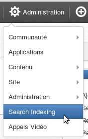

.. _Indexing:

#########
Indexing
#########

    Managing a large data set using JCR in a production environment
    sometimes requires special operations with indexes stored in a file
    System. One such maintenance operation, called "re-indexing"
    consists of recreating an index by re-scanning the data. You usually
    need to re-index when you observe odd behaviours or many errors in
    the logs. There can be various reasons to re-index. For example,
    hardware faults, hard restarts, data corruption, migrations, or
    simply after an upgrade to enable new features. A re-index is
    usually requested on server startup or in runtime.

    In eXo Platform, there are two kinds of indexes: Elasticsearch and JCR.
    They have different re-indexing procedures which will be the purpose
    of the next sections.

    Match what's below in this chapter:

    -  :ref:`Elasticsearch re-indexing <Indexing.ESIndexing>`
       How to perform Elasticsearch re-indexing.

    -  :ref:`JCR Asynchronous re-indexing <Indexing.JCRIndexing>`
       How to perform JCR re-indexing.

.. _Indexing.ESIndexing:

=========================
Elasticsearch re-indexing
=========================

With eXo Platform, you can re-index using the interface. To do this
follow these steps: 
1. Connect as an administrator. 
2. In the top bar, select Administration --> Search indexing. 

   |image5|

3. The interface of the **Indexing Service Management Application** 
   will appear. This allows to re-index by profile. (You can read more 
   about this interface below). 
   
   |image6|
   
4. Select the connector you want to re-index and click on the 
   corresponding Reindex button.
   

Details about the interface of the application Indexing Service
Management:

-  |image0|: Number of registered Elasticsearch indexing connectors.

-  |image1|: Number of indexing operations in progress. Possibilities
   are:

   -  REINDEX\_ALL: to re-index all the indexes.

   -  DELETE\_ALL: to delete all indexes.

   -  CREATE: to create the indexes.

-  |image2|: Number of errors found .

-  |image3|: List of registered Elasticsearch indexing connectors:
   wiki-attachement, profile, wiki-page and space with the possible
   actions on them.

-  |image4|: List of the indexing operations in progress.

.. _Indexing.JCRIndexing:

============================
JCR asynchronous re-indexing
============================

.. _IndexingStartup:

Indexing on start-up
~~~~~~~~~~~~~~~~~~~~~~

The easiest way to trigger a JCR re-indexing at start-up is to stop the
server and manually remove the indexes that need to be recreated. When
the server starts, the missing indexes will be detected and the
necessary re-indexing operations will begin.

JCR supports direct RDBMS re-indexing. This is usually faster than
ordinary re-indexing and can be configured via the ``rdbms-reindexing``
QueryHandler parameter set to "true" (Refer to the :ref:`Query-handler configuration overview <#JCR.QueryHandlerConfiguration>` 
for more information).

The start-up is usually blocked until the indexing process finishes.
Block time depends on the amount of persisted data in the repositories.
You can resolve this issue by using an asynchronous approach to start-up
indexation which involves on performing all operations on indexes in the
background without blocking the repository. This approach is controlled
by the value of the ``async-reindexing`` parameter in :ref:`QueryHandler configuration <#JCR.QueryHandlerConfiguration>`. 
Setting ``async-reindexing`` to "true" activates asynchronous indexation 
and makes JCR start without active indexes. But you can still execute
queries on JCR without exceptions and check the index status via
``QueryManagerImpl``:

::

    boolean online =
          ((QueryManagerImpl)Workspace.getQueryManager()).getQueryHandeler().isOnline();
        

An "OFFLINE" state means that the index is currently recreating. When
the state has been changed, the corresponding log event is printed. From
the start of the background task, the index is switched to "OFFLINE"
with the following log event:

::

    [INFO] Setting index OFFLINE (repository/production[system]).

When the process has been finished, two events are logged:

::

    [INFO] Created initial index for 143018 nodes (repository/production[system]).
          [INFO] Setting index ONLINE (repository/production[system]).
        

These two log lines indicate the end of process for the workspace given
in brackets. Calling ``isOnline()`` as mentioned above will also return
true.

.. _HotAsynchronousJMX:

Hot asynchronous workspace re-indexing via JMX
~~~~~~~~~~~~~~~~~~~~~~~~~~~~~~~~~~~~~~~~~~~~~~~~

.. note:: First of all, you can not launch hot re-indexing via JMX if 
		  the index is already in offline mode. This means that the 
		  index is currently invoked in some operations, like 
		  re-indexing at start-up, copying in cluster to another node 
		  or something else. It is also important to note that hot 
		  asynchronous re-indexing via JMX and "on start-up" re-indexing 
		  are completely different features. You can not perform 
		  start-up re-indexing using the ``getHotReindexingState``
		  command in the JMX interface. However there are some common 
		  JMX operations:
		  
			-  **getIOMode**: return the current index IO mode (READ\_ONLY / READ\_WRITE), belongs to clustered configuration states.
		  
			-  **getState**: return the current state (ONLINE / OFFLINE).

Some hard system faults, errors during upgrades, migration issues and
some other factors may corrupt the index. End customers would most
likely want the production systems to fix index issues during runtime
without delays and restarts. The current version of JCR supports the
"Hot Asynchronous Workspace Reindexing" feature. It allows
administrators to launch the process in background without stopping or
blocking the whole application by using any JMX-compatible console.(See
the "JConsole in action" screenshot below).

|image7|

The server can still work as expected while the index is being
recreated. This depends on the flag "allow queries", which is passed via
the JMX interface to invoke the re-indexing operation. If the flag is
set to "true", the application is still working. However, there is one
critical limitation that you must be aware of. If the index is frozen
while the background task is running, queries are performed on the index
present at the moment of task start-up and data written into the
repository after start-up will not be available through the search until
the process finishes. Data added during re-indexation is also indexed,
but will be available only when the task is done. To resume, JCR takes
the "snapshot" of indexes on the asynchronous task start-up and uses it
for searches. When the operation finishes, the stale indexes are
replaced with the new ones, including the newly added data. If the
``allow queries``" flag is set to "false", all queries will throw out an
exception while the task is running. The current state can be acquired
using the following JMX operation:

-  getHotReindexingState(): return information about latest invocation:
   start time, if in progress or finish time if done.

.. |image0| image:: images/1.png
.. |image1| image:: images/2.png
.. |image2| image:: images/3.png

.. |image4| image:: images/5.png

.. |image6| image:: images/Indexing_Service_Management_Application.png
.. |image7| image:: images/indexing/jmx-jconsole.png

