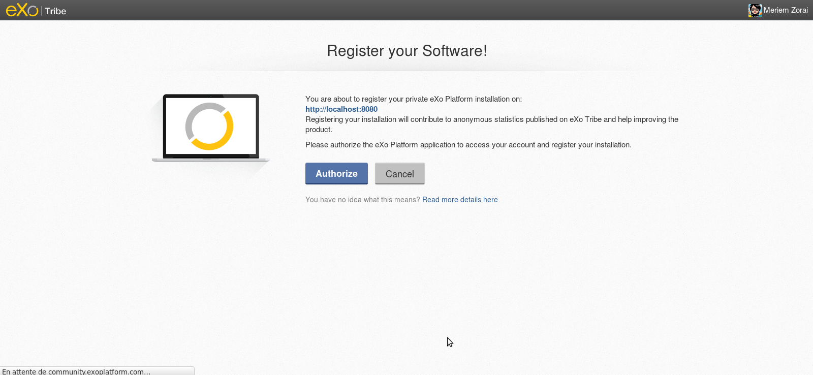
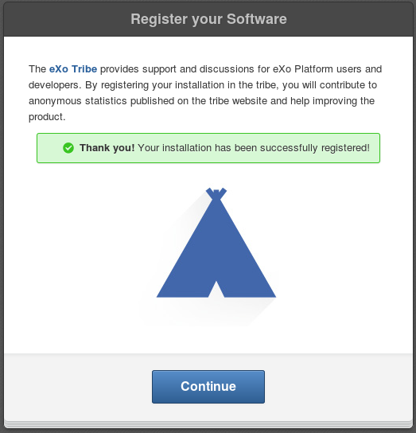
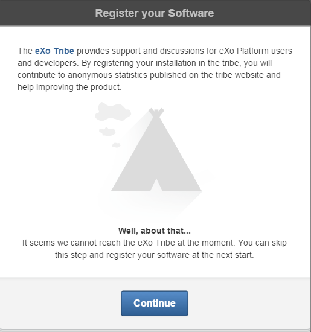
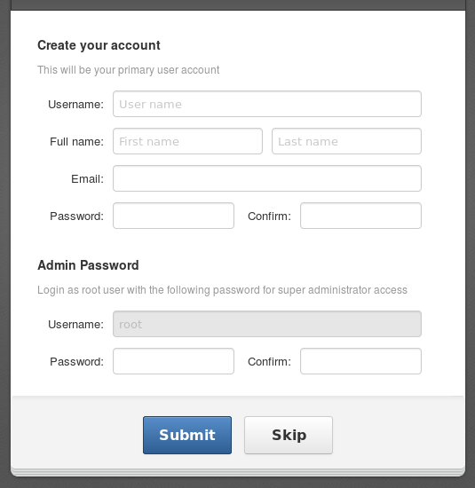
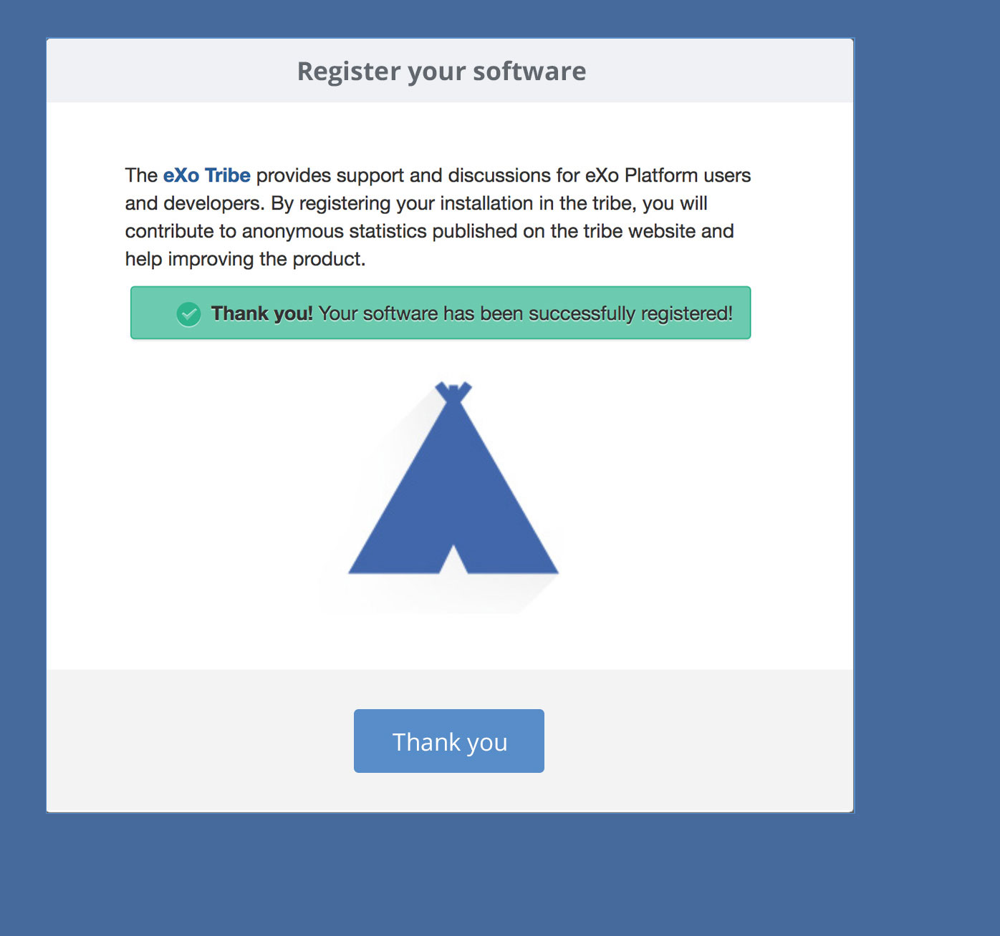
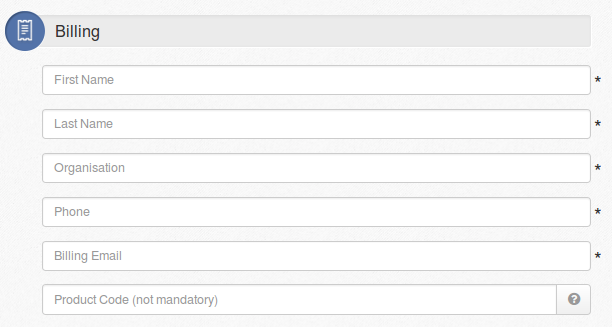
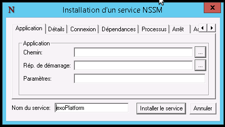
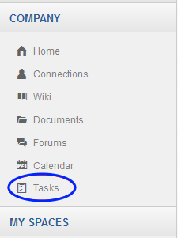
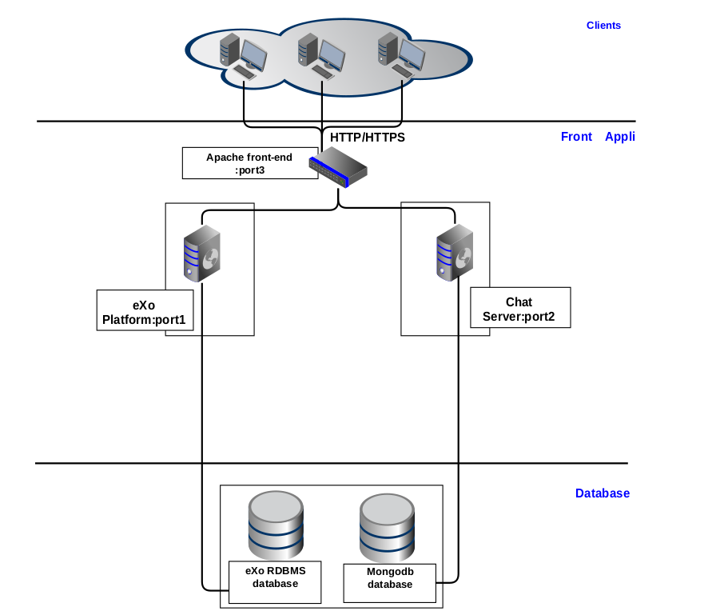

.. _Installation:

#########################
Installation and Startup
#########################

    eXo Platform is packaged as a deployable enterprise archive defined by
    the Java EE specification, and as a configuration directory. In this
    chapter, you will see the following topics:

    -  :ref:`System requirements <SystemRequirements>`
       Specifications which are required for running eXo Platform.

    -  :ref:`Installing eXo Platform Trial docker image <EETrial>`
       Steps needed to install eXo Platform Trial.

    -  :ref:`Installing eXo Platform CommunityEdition <CommunityEdition>`
       Steps needed to install eXo Platform Community Edition.

    -  :ref:`Registering your installation <Registration>`
       Instructions for how to register your installation the eXo Tribe.

    -  :ref:`Unlocking your trial with an unlock key <unlockTrial>`
       Instructions for how to unlock the free 30-day trial.

    -  :ref:`Installing eXo Platform Enterprise Edition <EnterpriseEdition>`
       Instructions on how to install the enterprise edition.

    -  :ref:`Task Management Installation <TasksInstallation>`
       Steps for how to install and uninstall Task Management.

    -  :ref:`eXo Chat Installation <ChatInstallation>`
       Steps for how to install and uninstall eXo Chat through two
       modes: The embedded mode and standalone mode.

    -  :ref:`Web Conferencing Installation <WebConfInstall>`
       Steps for how to install and uninstall eXo Web Conferencing.

    -  :ref:`Customizing environment variables <CustomizingEnvironmentVariables>`
       How to customize environment variables, such as JVM Memory and GC
       settings.

    -  :ref:`Startup profiles <eXoProfiles>`
       The runtime profiles which are used to enable/disable modules of
       eXo Platform.

    -  :ref:`Troubleshooting <Troubleshooting>`
       How to solve problems you may encounter when starting up eXo 
       Platform.
       
.. _SystemRequirements:

====================
System requirements       
====================

.. warning:: The requirements cited below are provisional and may change according to quality tests findings.

To run eXo Platform 5.1, your system is required to meet the following 
specifications or higher:

-  CPU: Multi-core recommended, 2GHz minimum.

-  Memory: The eXo Platform package is optimized with default settings: max
   heap size = 4GB and non-heap size = 256MB; so the available memory
   should be at least 4GB. It is recommended you have a memory of 8GB
   (4GB free for database services and file system caches).

-  Free disk space: 10GB minimum

-  Java 9+: JDK 9 is required for eXo Platform 5.1 version. Set the
   **JAVA\_HOME** environment variable to point to your JDK
   installation.

-  Java 7 and below is incompatible for eXo Platform 5.1 version.

-  Browser Compatibility:

   +------------+-----------------+-----------------+-----------------+-----------------+
   | Operating  | Recommended     | Supported       | Compatible      | Incompatible    |
   | system     | browser         | browser         | browser         | browser         |
   +============+=================+=================+=================+=================+
   | Windows    | -  Firefox ESR  | -  Internet     |                 | -  Internet     |
   |            |    52.4         |    Explorer 11  |                 |    Explorer 10  |
   |            |                 |                 |                 |    and below    |
   |            | -  Edge 15      | -  Edge,        |                 |                 |
   |            |                 |    Chrome,      |                 |                 |
   |            | -  Chrome 62    |    Firefox -    |                 |                 |
   |            |                 |    Latest       |                 |                 |
   |            |                 |    stable       |                 |                 |
   |            |                 |                 |                 |                 |                                                                                       
   +------------+-----------------+-----------------+-----------------+-----------------+
   | Linux      | -  Firefox ESR  | -  Firefox -    | -  Chrome - the |                 |
   |            |    52.4         |    the last     |    latest       |                 |
   |            |                 |    stable       |    stable       |                 |
   |            |                 |                 |                 |                 |                                                                                      
   +------------+-----------------+-----------------+-----------------+-----------------+
   | Mac OS     | -  Firefox ESR  | -  Firefox -    | -  Safari 11,10 | -  Safari 8 and |
   |            |    52.4         |    the last     |                 |    below        |
   |            |                 |    stable       |                 |                 |
   |            | -  Chrome 62    |                 |                 |                 |
   |            |                 | -  Chrome - the |                 |                 |
   |            |                 |    last stable  |                 |                 |
   |            |                 |                 |                 |                 |                                                                                       
   +------------+-----------------+-----------------+-----------------+-----------------+
   | Android    |                 | -  Chrome 55    | -  Chrome - the |                 |
   |            |                 |                 |    latest       |                 |
   |            |                 |                 |    stable       |                 |
   |            |                 |                 |                 |                 |
   |            |                 |                 | -  Firefox -    |                 |
   |            |                 |                 |    the latest   |                 |
   |            |                 |                 |    stable       |                 |
   |            |                 |                 |                 |                 |                                                                                      
   +------------+-----------------+-----------------+-----------------+-----------------+
   | iOS        |                 | -  Chrome 55    | -  Chrome - the |                 |
   |            |                 |                 |    latest       |                 |
   |            |                 | -  Safari 9     |    stable       |                 |
   |            |                 |                 |                 |                 |
   |            |                 |                 | -  Safari 8     |                 |
   |            |                 |                 |                 |                 |                                                                                      
   +------------+-----------------+-----------------+-----------------+-----------------+

.. note:: The eXo server will run on the port 8080 by default, so make sure this port is not currently in use or configure eXo Platform to use another port.

.. _EETrial:

================================
eXo Platform Trial Docker image
================================

In this section, we will provide how to install the Trial edition of
eXo Platform and the steps following the installation from registering the
software to unlocking it.

Here are the steps to follow:

-  :ref:`Starting the Docker Image <EETrial.start>`

-  :ref:`Registering your software <EETrial.register>`

-  :ref:`Setting up the admin accounts <EETrial.admins>`

.. _EETrial.start:

Starting the Docker Image
~~~~~~~~~~~~~~~~~~~~~~~~~~~

The trial edition of the commercial version of eXo Platform is available as
docker container in various versions: 5.1.0, 5.0.1, 4.4.3 ...

In this section, you will learn how to start and stop it.

.. warning:: eXo Platform's Community Edition and the trial version of the commercial Enterprise Edition are only available as a Docker install
			 to facilitate deployment for testing. Owners of the full commercial version are not supported based on a Docker install, this
			 Docker-related documentation is therefore not relevant to them.
			 Subscribed customers can refer to next sections to install their commercial package.

The docker image of the trial version of eXo Platform Enterprise Edition
supports **only** HSQL database for testing purposes.

To be able to start eXo Platform Trial Docker image, these prerequisites
should be satisfied:

-  Docker daemon version 12+ installed on your machine.

-  Internet connection.

-  4GB of RAM available and 1GB of free disk space.

Having the above requirement satisfied, you can start eXo Platform trial
edition using this command:

::

    docker run --rm -v exo_trial_data:/srv -p 8080:8080 exoplatform/exo-trial

A log message appears indicating the startup of the server:

::

    2017-09-19 12:34:54,573 | INFO  | Server startup in 80328 ms [org.apache.catalina.startup.Catalina<main>]

The platform is then accessible via `http://localhost:8080 <#>`__.

To stop the server, just click on Ctrl+c in the keyboard or run the
command:

::

    docker stop <your-container-ID>

The container-ID is known via the command:

::

    docker ps

.. tip:: For more details about eXo Platform Trial edition Docker image: versions, how to configure, how to add/remove add-ons..., you can consult this `documentation <https://hub.docker.com/r/exoplatform/exo-trial/>`__.

.. _EETrial.register:

Registering your software
~~~~~~~~~~~~~~~~~~~~~~~~~~~

eXo Tribe provides access to an enormous community of eXo Platform users
and developers.

As a result, registration is needed so that you can post questions in
the community to get help from other IT professionals around the world.
Also, by registering your installation in the tribe, you will contribute
to anonymous statistics published on the tribe website and help
improving the eXo Platform.

After a successful installation, at the first startup, you will be
redirected to the *Register your Software* screen as follows:

|image0|

.. note:: For the Enterprise edition, you have to accept the Terms and Conditions Agreement before going to the registration.

From the *Register your Software* screen, click Register your software
to start the registration. If you do not want to register this time,
just click the Skip button, but remember that skipping is allowed only
twice.

|image1|

Click the Authorize button to activate the authorization process (you
can select Cancel to skip registering this time, but remember that
canceling is also allowed only twice), if successful, you will see this
message:

|image2|

It means the registration has completed. Now you can select Continue to
start using eXo Platform. Once this is registered, you will never be asked
for registration again.

.. note:: -  If the eXo Tribe website can't be reached, you will get this message:
				
				|image3|
			 In this case, clicking the Continue button still allows you to start using eXo Platform as normal, but you will be asked to register again after next server startup.
		 
		  -  Upgrading to a new platform version will require a new  registration.

		  -  For the Enterprise edition, it is possible to skip the registration completely by unlocking it with :ref:`an official key <EETrial.unlock.UnlockKey>`.

		  -  If the authorization process failed, try to redo the registration or contact `our support team <https://community.exoplatform.com/portal/intranet/>`__ for more details.

.. _EETrial.admins:

Setting up the admin accounts
~~~~~~~~~~~~~~~~~~~~~~~~~~~~~~

After registering your installation to benefit from eXo Platform community
advantages, you are asked to set up administrators accounts.

This screen appears allowing you to fill in information for users
promoted as the administrators of the platform:

|image4|

In the first part of the screen, the user will belong to the group
/platform/administrators. The second part of the screen allows you to
redefine the super user **root** password.

.. _CommunityEdition:

===========================================
Installing eXo Platform Community Edition
===========================================

eXo Platform Community Edition is distributed as a convenient Docker image
available with different versions: 5.1, 5.0, 4.4, 4.3...

`Docker <https://www.docker.com>`__ is a software container platform
which enables enterprises to build agile software delivery pipelines to
ship new features faster, more securely and with confidence for both
Linux, Windows Server, and Linux-on-mainframe apps.

.. warning:: eXo Platform's Community Edition and the trial version of the
			 commercial Enterprise Edition are only available as a Docker install
			 to facilitate deployment for testing. Owners of the full commercial
			 version are not supported based on a Docker install, this
			 Docker-related documentation is therefore not relevant to them.
			 Subscribed customers can refer to next sections to install their commercial package.

In this section, we will provide the needed steps to install an eXo Platform
Community Edition docker image.

This docker image of eXo Platform supports HSQL database for testing purposes
and MySQL for eXo Platformion environments.

To try the eXo Platform community edition docker image, some prerequisites
should be satisfied:

-  Docker daemon version 12+ installed on your machine.

-  Internet connection.

-  4GB of RAM available and 1GB of free disk space.

To start and test eXo Platform Community Edition, simply execute this
command:

::

    docker run -v exo_data:/srv/exo -p 8080:8080 exoplatform/exo-community

The execution of this command will launch a container of the last
millestone version of eXo Platform PLF\_VERSION and the version is updated
every week after each weekly release:

.. note:: You can set a custom name to your container by adding the option ``--name custom_name`` to the start command.

::

    2017-09-19 09:37:10,271 | INFO  | Server startup in 176588 ms [org.apache.catalina.startup.Catalina<main>]

The above log message indicates the server startup. You can start
exploring eXo Platform Community Edition by visiting the URL
`http://localhost:8080 <#>`__ and then follow the instructions.

To shutdown the server, you can either click on the keyboard buttons
Ctrl+c or execute this command:

::

    docker stop <your-container-name>

.. note:: To list all docker conatainers that already exist on your machine with their different parameters, just execute this command:

			::

				docker ps -a

			An example of the result of the cited command:

			::

				CONTAINER ID        IMAGE                       COMMAND                  CREATED             STATUS                           PORTS                    NAMES
				6d6d74d07030        exoplatform/exo-community   "/opt/exo/start_eX..."   6 minutes ago       Up 6 minutes                     0.0.0.0:8080->8080/tcp   agitated_williams
				ee949d337207        exoplatform/exo-community   "/opt/exo/start_eX..."   About an hour ago   Exited (130) About an hour ago                            vibrant_feynman
		
			To just paste parameters of the running container, the command to execute is:

			::

				docker ps

With a docker container, it is possible to start eXo Platform in debug or dev
mode: by adding --debug or --dev:

-  Debug mode: You should add the option *--debug* to the start command
   cited above and you should specify the debug port by the parameter
   ``-p 8000:8000``.

   A log message appears indication that the debug mode is active:

   ::

       Listening for transport dt_socket at address: 8000

-  Dev mode: You should add the option *--dev* to the start command
   cited above.

.. tip:: For more details about eXo Platform Community Docker image: versions, how to configure, how to add/remove add-ons..., you can consult this `documentation <https://hub.docker.com/r/exoplatform/exo-community/>`__.

.. _Registration:

=============================
Registering your installation
=============================

eXo Tribe provides access to an enormous community of eXo Platform users
and developers. As a result, registration is needed so that you can post
questions in the community to get help from other IT professionals
around the world. Also, by registering your installation in the tribe,
you will contribute to anonymous statistics published on the tribe
website and help improving the product.

After a successful installation, at the first startup, you will be
redirected to the *Register your Software* screen as follows:

|image5|

.. note:: For the Enterprise edition, you have to accept the Terms and Conditions Agreement before going to the registration.

From the *Register your Software* screen, click Register your software
to start the registration. If you do not want to register this time,
just click the Skip button, but remember that skipping is allowed only
twice.

|image6|

Click the Authorize button to activate the authorization process (you
can select Cancel to skip registering this time, but remember that
canceling is also allowed only twice), if successful, you will see this
message:

|image7|

It means the registration has completed. Now you can select Continue to
start using eXo Platform. Once this is registered, you will never be asked
for registration again.

.. note:: -  If the eXo Tribe website can't be reached, you will get this message:

			|image8|

			In this case, clicking the Continue button still allows you to start using eXo Platform as normal, but you will be asked to register
			again after next server startup.

		  -  Upgrading to a new platform version will require a new registration.

		  -  For the Enterprise edition, it is possible to skip the  registration completely by unlocking it with :ref:`an official key <EETrial.unlock.UnlockKey>`.

		  -  If the authorization process failed, try to redo the registration or contact `our support team <https://community.exoplatform.com/portal/intranet/>`__for more details.

.. _unlockTrial:

=======================================
Unlocking your trial with an unlock key
=======================================

eXo Platform offers **commercial editions** as a 30-day trial. Thus, you will
see a trial banner at the page footer.

|image9|

-  During the trial period, the message of the trial banner is "You have
   XX days left in your evaluation" where XX is the number of days left
   for your trial.

-  After the trial period, the trial banner turns into red with the
   "Your evaluation period has expired XX days ago" text where XX is the
   number of days as from the expired trial.
   
.. _EETrial.unlock.UnlockKey:   

Unlocking your trial with an unlock key
~~~~~~~~~~~~~~~~~~~~~~~~~~~~~~~~~~~~~~~~~~

You need to purchase a key to unlock the evaluation.

The unlock is done via Unlock Evaluation screen. Open this screen by
clicking Buy a Subscription on the trial banner.

|image10|

On this screen:

-  If you have not purchased a key yet, click the **subscription plan**
   link. It should open the `Editions
   page <http://www.exoplatform.com/company/en/products/editions>`__
   which helps you choose a plan.

   Then, go to `eXo Buy page <https://exoplatform.com/buy>`__ to
   complete the purchase.

   |image11|

 .. note:: You may copy the Product Code from the Unlock screen and submit it in the Buy page, otherwise a new code will be generated and sent to you along with the key.
		   If you have any trouble, please contact *support@exoplatform.com*.

-  If you have received a key already, come back to Unlock Evaluation
   screen to activate your subscription. Enter your *Unlock Key* (and
   *Product Code* if you received one) and click Unlock.

   This function validates your key against the product code. If the key
   is invalid, it displays a message like "*Sorry this evaluation key is
   not valid*\ ". On success, it just redirects you to the previous
   page.
   
   
.. _EnterpriseEdition:

==========================================
Installing eXo Platform Enterprise Edition
==========================================

In this section, we will provide how to install the enterpise edition of
eXo Platform in the two application servers: Tomcat and Jboss.

-  :ref:`Installing the Tomcat bundle <EnterpriseEdition.TomcatInstall>`
   Steps to install eXo Platform enterprise edition in Tomcat.

-  :ref:`Installing eXo Platform as a Windows service <EnterpriseEdition.TomcatInstallWinService>`
   Steps to install eXo Platform as a Windows service.

-  :ref:`Installing on JBoss EAP <EnterpriseEdition.JbossInstall>`
   Steps to install eXo Platform enterprise edition in Jboss.

.. _EnterpriseEdition.TomcatInstall:

Installing the Tomcat bundle
~~~~~~~~~~~~~~~~~~~~~~~~~~~~~

The eXo Platform Tomcat bundle is a ready-made package on top of the Tomcat 8.5
application server. So, you just need to download and extract the
package (named ``eXo-Platform-5.1.0.zip``, for example) on your server.
In this guideline, ``$PLATFORM_TOMCAT_HOME`` is the folder path of the
extracted package.

Starting up the server
-----------------------

eXo Platform is started with a built-in startup script file, which is
``start_eXo.sh`` for Linux and OS X (Mac), and ``start_eXo.bat`` for
Windows. Double-click, or run it in console (Terminal or Command
Prompt):

-  Linux/OS X: ``$PLATFORM_TOMCAT_HOME/start_eXo.sh``

-  Windows: ``%PLATFORM_TOMCAT_HOME%\start_eXo.bat``

The server is started successfully when you see a message like this:

::

    INFO: Server startup in 120619 ms

To start eXo Platform as a background process, use the **--background**
option:

-  Linux/OS X: ``$PLATFORM_TOMCAT_HOME/start_eXo.sh --background``

-  Windows: ``%PLATFORM_TOMCAT_HOME%\start_eXo.bat --background``

You can always check the log files under ``$PLATFORM_TOMCAT_HOME/logs``.

Shutting down the server
-------------------------

If you have started eXo Platform in console (without --background option),
just press **Ctrl+C** to stop it.

In case it is running as background process, you can use the
``stop_eXo`` script:

-  Linux/OS X: ``$PLATFORM_TOMCAT_HOME/stop_eXo.sh``

-  Windows: ``%PLATFORM_TOMCAT_HOME%\stop_eXo.bat``

If you still see the process running, you may forcefully stop it. There
are several ways: using Task Manager (Windows), or running
``stop_eXo.sh -force`` (Linux/OS X), or using ``kill -9`` command
(Linux/OS X).

Starting up eXo Platform in the Dev/Debug mode
------------------------------------------------

In eXo Platform, the Debug mode is generally like other Java applications
using
`JDWP <http://docs.oracle.com/javase/7/docs/technotes/guides/jpda/jdwp-spec.html>`__,
whereas the Dev mode is specific for debugging JavaScript, CSS and
configurations.

To start eXo Platform in the Debug mode, use the **--debug** option:

-  Linux/OS X: ``$PLATFORM_TOMCAT_HOME/start_eXo.sh --debug``

-  Windows: ``%PLATFORM_TOMCAT_HOME%\start_eXo.bat --debug``

The **--debug** option actually adds a JVM option to the Java process:

-  **-agentlib:jdwp=transport=dt\_socket,address=8000,server=y,suspend=n**

To start eXo Platform in the Dev mode, use the **--dev** option. This option
adds two JVM options:

-  **-Dorg.exoplatform.container.configuration.debug**

-  **-Dexo.product.developing=true**

    **Note**

    The Debug and Dev modes are turned off by default and are not
    recommended in production environment because of performance impact.
    See more details in :ref:`Developer guide <#PLFDevGuide.GettingStarted.DebugAndDevMode>`.

.. _EnterpriseEdition.TomcatInstallWinService:

Installing eXo Platform as a Windows service
~~~~~~~~~~~~~~~~~~~~~~~~~~~~~~~~~~~~~~~~~~~~~~~~~~

This section is a tutorial to teach you how to configure eXo Platform as a
windows service. To configure eXo Platform to run as a windows service, two
ways are possible.

The first way: Through Tomcat native installer
------------------------------------------------

   This section describes how to configure eXo Platform as a Windows service
   in a standard Tomcat installation.

   For that purpose follow this procedure:

1. Use a sample batch script, you can take a look at apache tomcat
   `documentation <https://tomcat.apache.org/tomcat-8.5-doc/windows-service-howto.html>`__
   or you can use `this script <https://github.com/exo-samples/docs-samples/blob/master/exo-as-win-service-script/service_eXo.bat>`__
   ``service_eXo.bat`` and put it under ``eXo_Platform_tomcat_home\bin\``.

2. Open a command prompt and run this command:

   ::

       service_exo.bat install eXo-service

   Where eXo-service is the service name.

   This will install eXo Platform as a windows service which will be started
   at the system's startup.

3. To uninstall the service, run this command:

   ::

       tomcat8.exe //DS//eXo-service

The second way: Using the NSSM tool
-------------------------------------

   The non sucking service manager `NSSM <https://nssm.cc/>`__ is a tool
   that helps you to create a windows service based on your
   application's startup script.

   To create your eXo Platform windows service using NSSM, follow this
   procedure:

1. Download the `NSSM <https://nssm.cc/>`__ tool from `here <https://nssm.cc/download>`__.

2. Place the NSSM executable file i.e ``nssm.exe`` in a folder which already exists in your PATH or follow these steps:

   -  Create a folder nssm under ``C:\Program Files\`` and place
      ``nssm.exe`` in it.

   -  Add the folder ``C:\Program Files\nssm`` to your PATH environement
      variable using this command in a command prompt:

      ::

          setx PATH "%PATH%;C:\Program Files\nssm" /M

3. In a command prompt, run this command:

   ::

       nssm install <servicename>

   This will open a nssm window allowing you to browse and select your
   application startup script.

   |image12|

4. Point to eXo Platform startup script ``start_eXo.bat`` and click on
   Install service button.

5. You can now run eXo Platform through this command:

   ::

       nssm start <servicename>

6. To stop eXo Platform server, use this command:

   ::

       nssm stop <servicename>

   More details about NSSM commands in this `link <https://nssm.cc/usage>`__.

.. _EnterpriseEdition.JbossInstall:

Installing on JBoss EAP
~~~~~~~~~~~~~~~~~~~~~~~~~

eXo Platform 5.1 version integrates with JBoss EAP 7.1.

Prerequisites
---------------

-  Have JBoss EAP 7.1 extracted in ``$PLATFORM_JBOSS_HOME``. You can
   download and install JBoss EAP 7.1 by following instructions on this
   `link <https://access.redhat.com/documentation/en-us/red_hat_jboss_enterprise_application_platform/7.1/html/installation_guide/installing_jboss_eap>`__.

-  Have the eXo Platform package for JBoss EAP downloaded into your local.

Installing eXo Platform on JBoss EAP
--------------------------------------

1. Extract your downloaded eXo Platform package.

2. Copy all extracted folders and files into ``$PLATFORM_JBOSS_HOME``.

.. note:: This step will overwrite some files of JBoss EAP with new files of eXo Platform.

3. Optionally, if you want to customize the JVM Options, create a copy of
   ``$PLATFORM_JBOSS_HOME/bin/standalone-customize.sample.conf`` on Linux
   or ``$PLATFORM_JBOSS_HOME/bin/standalone-customize.sample.conf.bat`` on
   Windows. Rename the copy to ``standalone-customize.conf`` (or
   ``standalone-customize.conf.bat`` on Windows), then edit it with your
   JVM Options.

4. Start up the server.

-  On Linux and OS X:

   ::

       $PLATFORM_JBOSS_HOME/bin/standalone.sh

-  On Windows:

   ::

       %PLATFORM_JBOSS_HOME%\bin\standalone.bat

The server starts up successfully when you see the following message in
your log/console 

	::

		INFO  [org.jboss.as] (Controller Boot Thread) WFLYSRV0025: JBoss EAP 7.1.0.GA (WildFly Core 3.0.10.Final-redhat-1) started in 115316ms - Started 4570 of 4826 services (602 services are lazy, passive or on-demand)

5. Shut down the server.

-  On Linux and OS X

	::

       $PLATFORM_JBOSS_HOME/bin/jboss-cli.sh --connect command=:shutdown
                   

-  On Windows

	::

       %PLATFORM_JBOSS_HOME%\bin\jboss-cli.bat --connect command=:shutdown
                   

The server stops successfully when you see the following message in your
log/console::

    INFO  [org.jboss.as] (MSC service thread 1-4) WFLYSRV0050: JBoss EAP 7.1.0.GA (WildFly Core 3.0.10.Final-redhat-1) stopped in 13470ms

.. note:: Since JBoss EAP 6.3, there is a new blocking timeout property for
			JBoss startup.

			This property is not a timeout per deployment but a timeout on
			container stability and if ``jboss.as.management.blocking.timeout``
			is reached during startup then all applications will be undeployed
			and the container shutdown.
	
			The default value is set to 300s which is too low for eXo Platform in
			which we overrode the value.

			::

				JAVA_OPTS="$JAVA_OPTS -Djboss.as.management.blocking.timeout=604800"
				
				
.. _TasksInstallation:	

================================================
Task Management Installation and Uninstallation
================================================

.. note:: Only the administrator has the right to install and uninstall this application.

The Task Management add-on is supported for both Enterprise and
Community editions.

Installation
~~~~~~~~~~~~~

To install the Task Management add-on, use this command:
``addon install exo-tasks``.

This will automatically create a new part named *Tasks* on the left
navigation bar as follows:

|image13|

Clicking this part will direct you to the Task Management
workspace.

Uninstallation
~~~~~~~~~~~~~~

Simply use the command: ``addon uninstall exo-tasks``.	

.. _ChatInstallation:
		

======================
eXo Chat installation
======================

eXo Chat application has two installation modes available:

-  The embedded mode: eXo Chat is deployed inside eXo Pltaform.

-  The standalone mode: eXo Chat is installed into a dedicated
   server.

Each mode has its advantages:

-  The embedded mode is simplier architecture, you have not to install
   an another Tomcat server.

-  The standalone mode has better scalability and performance since
   server resources are not shared between eXo Pltaform and eXo Chat, and
   since the eXo Chat can be clustered.

More details about the installation procedure through these two parts:

-  :ref:`eXo Chat installation into eXo Pltaform server <ChatInstallation.SingleServer>`

-  :ref:`eXo Chat installation into a dedicated server <ChatInstallation.TwoServers>`

.. _ChatInstallation.SingleServer:

eXo Chat installation into eXo Pltaform server
~~~~~~~~~~~~~~~~~~~~~~~~~~~~~~~~~~~~~~~~~~~~~~~~~~

1. The Chat add-on uses `MongoDB <http://www.mongodb.org/downloads>`__ 
   to store information and messages, so you need to download and install it.
   More details :ref:`here <Database.ChatDatabase>`.

2. Install Chat add-on with the command: ``addon install exo-chat``. The
   installation procedure is the same to that of other add-ons, as 
   detailed in :ref:`Installing/Uninstalling add-ons, Administrator Guide <AddonsManagement.InstallingUninstalling>`.

.. note:: For Community Edition: ``addon install exo-chat-community``.
		  For Enterprise edition bundles, eXo Chat is installed by default.

.. note:: By default, a ``chatPassPhrase`` property has been created. The eXo Chat server provides some operations via REST service so that
		  anyone who knows the passphrase can do things, such as dropping, re-creating and indexing the database, so you need to change this
		  property in the :ref:`configuration file <Configuration.ChatConfiguration>`.

3. Start eXo Pltaform server. When users sign in eXo Pltaform, the Chat 
   icon (|image14|) will be shown on the top navigation bar.

.. _ChatInstallation.TwoServers:

eXo Chat installation into a dedicated server
~~~~~~~~~~~~~~~~~~~~~~~~~~~~~~~~~~~~~~~~~~~~~~

eXo Pltaform provides the standalone mode to install eXo Chat into a
dedicated server. In this mode, the backend of eXo Chat application
is deployed in its own Tomcat application server while the frontend i.e.
the portlets are deployed in eXo Pltaform instance.

This alternative architecture brings better scalability and performance
since server resources are not shared between eXo Pltaform and eXo Chat.
It allows to add more eXo Chat server nodes independently from
eXo Pltaform nodes.

The schema below summaries the standalone mode architecture:

|image15|

To install eXo Chat in standalone mode, follow this procedure:

1. Ensure to uninstall eXo Chat from eXo Pltaform server if it is already
   installed by the Addon manager: ``addon uninstall exo-chat``

2. Download eXo Chat package:
   `chat-standalone-server-packaging <https://repository.exoplatform.org/content/groups/public/org/exoplatform/addons/chat/chat-standalone-server-packaging/2.0.0/chat-standalone-server-packaging-2.0.0.zip>`__
   into a known location and rename it to chat\_server\_package.

   The package ``chat_server_package`` contains these files:

   -  ``exo-chat-standalone-application-x.y.z.zip`` containing the files:
      ``chat-services.jar`` ``chat-extension.war``, ``chat-common.jar`` and
      ``chat.war``.

   -  ``exo-chat-standalone-server-x.y.z.zip`` containing the war
      ``chatServer.war``

   -  ``chat-sample.properties``

3. Install and configure `MongoDB <https://www.mongodb.com/download-center#atlas>`__ database by following this :ref:`link <Database.ChatDatabase>`.

4. Configure chat server on Tomcat by following these steps:

   -  Install the latest update of `Apache Tomcat 8 <https://tomcat.apache.org/download-80.cgi>`__ 
      and rename it to chat-server.

   -  Change the ``server.xml`` file to use the port 8280:

   .. code:: xml

       <Connector port="8280" protocol="HTTP/1.1"
                      connectionTimeout="20000"
                      redirectPort="8243" URIEncoding="UTF-8" />
                      ....

.. note:: Make sure there is no port conflicts between the eXo Chat server and other systems. If you deploy the eXo Chat server on
          the same host than eXo Pltaform, then, you should change all the ports as in the example above.
          

   -  Deploy chat application in Apache tomcat by copying the following
      files:

		-  Copy the war file ``chatServer.war`` from
		   chat\_server\_package/exo-chat-standalone-server-x.y.z to
           ``chat-server/webapps/`` folder.

		-  Copy ``chat-sample.properties`` to ``chat-server/conf/`` folder
           and rename it to ``chat.properties``.

		-  Adapt the configuration file ``chat.properties`` to fit with your
           environments by updating the following properties:

			::

			  standaloneChatServer=true
			  dbServerHost=[MongoDB-Host]
			  dbServerPort=[MongoDB-Port]
			  dbName=chat
			  dbAuthentication=false
			  dbUser=admin
			  dbPassword=pass
			  chatPortalPage=/portal/intranet/chat
			  chatPassPhrase=change-me

   -  Start the chat server:

      ::

          cd  chat-server
          ./bin/catalina.sh run

5. Install Chat application into eXo Pltaform server :
   ``./addon install exo-chat-client``

6. Configure these properties in ``eXo_tomcat/gatein/conf/chat.properties``:

   ::

		standaloneChatServer=true 
		chatServerBase=http://[chat-server-IP-address]:8280
		chatPortalPage=/portal/intranet/chat
		chatIntervalSession=60000
		chatPassPhrase=change-me

7. Start eXo Pltaform server:

   ::

		cd eXo_tomcat 
		./start_eXo.sh
            

8. Install a frontal server and configure it to redirect Chat server
   requests to the right server. Below an example of an Apache2
   configuration file (It should be adapted according to your environment):

.. code:: xml

    <VirtualHost *:80>
        ErrorLog /var/log/apache2/error.log
        CustomLog /var/log/apache2/access.log combined
        #Put your used ServerName 
        ServerName www.domainexo.com
         
         <Proxy *>
            Order deny,allow
            Allow from all
         </Proxy>

         <IfModule proxy_wstunnel_module>    

    ProxyPass /chatServer/cometd ws://localhost:8280/chatServer/cometd  max=100 acquire=5000   retry=5 disablereuse=on flushpackets=on 

      ProxyPass /cometd  ws://localhost:8080/cometd/ max=100 acquire=5000 retry=5  disablereuse=on flushpackets=on 

         </IfModule>
         
         ProxyPass /chatServer  http://localhost:8280/chatServer
         ProxyPassReverse /chatServer http://localhost:8280/chatServer
         ProxyPassReverse /chatServer/cometd/  ws://localhost:8280/chatServer/cometd/

        

         ProxyPassReverse /cometd  ws://localhost:8080/cometd/
         ProxyPass / http://localhost:8080/
         ProxyPassReverse / http://localhost:8080/  
       
         ProxyRequests Off
         ProxyPreserveHost On
    </VirtualHost>

            

9. Login to the platform using this url `http://www.domainexo.com:80/portal/intranet/ <#>`__, 
   you should have the chat application in the top navigation menu.
				
.. _WebConfInstall:

=============================
Web Conferencing installation
=============================

.. note:: Only the administrator has the right to install and uninstall this application.

The Web Conferencing add-on is supported for both Enterprise and
Community editions.

The Web Conferencing add-on is by default installed in the Enterprise
Edition. You can uninstall it using this command:

::

    ./addon uninstall exo-web-conferencing

If you want to re-install it again, you should just run this command:

::

    ./addon install exo-web-conferencing

If you are using the Community Edition and you want to benefit from the
Web Conferencing add-on, you need to install it as it is not set by
default.

.. _CustomizingEnvironmentVariables:

=================================
Customizing environment variables
=================================

There are 2 scripts that involve setting environment variables. They are
called *the default script* and *the customized script* in this
document.

In Tomcat bundle and for Linux, they are:

-  ``$PLATFORM_TOMCAT_HOME/bin/setenv.sh`` which is defaulted in the
    eXo Platform package.

-  ``$PLATFORM_TOMCAT_HOME/bin/setenv-customize.sh`` which will be
   created by yourself, as explained later.

Their Windows versions are:

-  ``$PLATFORM_TOMCAT_HOME/bin/setenv.bat``

-  ``$PLATFORM_TOMCAT_HOME/bin/setenv-customize.bat``

Except their syntax, ``.sh`` and ``.bat`` versions are the same.

In JBoss, the scripts are:

-  ``$PLATFORM_JBOSS_HOME/bin/standalone.conf`` - the default script.

-  ``$PLATFORM_JBOSS_HOME/bin/standalone-customize.conf`` - the
   customized script.

-  ``$PLATFORM_JBOSS_HOME/bin/standalone.conf.bat`` - Windows version.

-  ``$PLATFORM_JBOSS_HOME/bin/standalone-customize.conf.bat`` - Windows
   version.

**Usage of the 2 scripts**

-  Variables in the customized script, if they exist, override variables
   in the default script.

-  If the customized script does not exist, variables in the default
   script take effect.

-  For safety, you should not modify the default script. Any
   customization should be done by the customized script.

**Starting your customization**

1. Rename a file in ``bin`` folder, as below:

   -  For Tomcat in Linux: rename ``setenv-customize.sample.sh`` to
      ``setenv-customize.sh``.

   -  For Tomcat in Windows: rename ``setenv-customize.sample.bat`` to
      ``setenv-customize.bat``.

   -  For JBoss in Linux: rename ``standalone-customize.sample.conf`` to
      ``standalone-customize.conf``.

   -  For JBoss in Windows: rename ``standalone-customize.sample.conf.bat``
      to ``standalone-customize.conf.bat``.

2. Find the variable that you want to customize, uncomment it (by removing
   '#' in the ``.sh`` file or "REM" in the ``.bat`` file) and edit its
   value.

   Use **#** to comment out a line in ``.sh``, and **REM** in ``.bat``. To
   comment out a block:

   -  In ``.sh``, use the pair of **:<<LABEL** and **LABEL**. For example:

      ::

          :<<old_configurations
          EXO_JVM_SIZE_MAX="1g"
          EXO_JVM_SIZE_MIN="1g"
          old_configurations

   -  In ``.bat``, use the pair of **GOTO LABEL** and **:LABEL**. For
      example:

      ::

          GOTO old_configurations
          SET EXO_JVM_SIZE_MAX=1g
          SET EXO_JVM_SIZE_MIN=512m
          :old_configurations

In next sections, you will walk through:

-  :ref:`Basic Customization <BasicCustomization>`

-  :ref:`Advanced Customization <AdvancedCustomization>`

.. _BasicCustomization:

Basic Customization
~~~~~~~~~~~~~~~~~~~~

Simple assignment statement is used to customize variables in this
section:

-  In ``.sh``: ``variable_name=variable_value``.

-  In ``.bat``: ``SET variable_name=variable_value``.

**JVM configuration**

+-------------------------+--------------------------------------------------+
| Configuration           | Description                                      |
+=========================+==================================================+
| ``JAVA_HOME="/opt/java/ | **JAVA\_HOME** is auto-detected by default. In   |
| jdk6"``                 | case you specify it, notice that it is parent of |
|                         | the ``jre`` folder.                              |
+-------------------------+--------------------------------------------------+
| ``EXO_JVM_VENDOR="IBM"` | This configuration (for Tomcat and Linux only)   |
| `                       | is here because **IBM Java** requires different  |
|                         | XML Parser library. Do not uncomment it unless   |
|                         | you are using **IBM Java**.                      |
+-------------------------+--------------------------------------------------+
| ``EXO_JVM_SIZE_MAX="4g" | JVM memory settings. Their combination equals    |
| ``                      | ``-Xmx4g -Xms1g -XX:MaxPermSize=128m``, in which |
|                         | ``EXO_JVM_SIZE_MAX`` equals ``Xmx``.             |
| ``EXO_JVM_SIZE_MIN="1g" |                                                  |
| ``                      | Uses "g" for Gigabytes and "m" for Megabytes. It |
|                         | is possible to set the same value for            |
| ``EXO_JVM_PERMSIZE_MAX= | ``EXO_JVM_SIZE_MAX`` and ``EXO_JVM_SIZE_MIN``.   |
| "128m"``                |                                                  |
+-------------------------+--------------------------------------------------+
| ``EXO_JVM_USER_LANGUAGE | JVM locale settings. Their combination equals    |
| ="fr"``                 | ``-Duser.language=fr -Duser.region=FR``.         |
|                         |                                                  |
| ``EXO_JVM_USER_REGION=" | The default language is "en", the default region |
| FR"``                   | is "US". A full list of valid language codes can |
|                         | be found at `IANA Language Subtag                |
|                         | Registry <http://www.iana.org/assignments/langua |
|                         | ge-subtag-registry/language-subtag-registry>`__. |
+-------------------------+--------------------------------------------------+
| ``EXO_DEBUG=true``      | Their combination equals the JVM Option:         |
|                         | ``-agentlib:jdwp=transport=dt_socket,address=800 |
| ``EXO_DEBUG_PORT="8000" | 0,server=y,suspend=n``                           |
| ``                      |                                                  |
|                         | Is not used for production environment.          |
+-------------------------+--------------------------------------------------+

**Platform configuration**

+--------------------------------------+-------------------------------------+
| Configuration                        | Description                         |
+======================================+=====================================+
| ``EXO_PROFILES="all,myOwnProfile"``  | Tomcat only. The default profile    |
|                                      | is "all". If you customize this     |
|                                      | variable, refer to Startup profiles |
+--------------------------------------+-------------------------------------+
| ``EXO_CONF_DIR="/opt/ciagent/        | The default configuration folder    |
| .eXo-platform/conf"``                | is ``./gatein/conf/`` (Tomcat       |
|                                      | only).                              |
+--------------------------------------+-------------------------------------+
| ``EXO_DATA_DIR="/opt/jenkins/        | The default data directory is       |
| .eXo-platform/data"``                | ``./gatein/data`` (Tomcat only).    |
+--------------------------------------+-------------------------------------+
| ``EXO_DEV=true``                     | Preserved for the development       |
|                                      | tasks. Do not uncomment this in     |
|                                      | the production environment.         |
+--------------------------------------+-------------------------------------+
| ``EXO_JCR_SESSION_TRACKING=true``    | If this variable is **true**,       |
|                                      | the `eXo JCR Session Leak           |
|                                      | Detector is activated. If           |
|                                      | you do not uncomment this line,     |
|                                      | it is set equal to ``EXO_DEV``.     |
+--------------------------------------+-------------------------------------+

**Logs configuration**

Tomcat only. The logs configuration is to control how often, which kind
of message/event to be written to the log stream (screen or log files),
and their format. Configuring logs is more than a trivial task, however
eXo Platform tries to ease it by exposing 3 variables that you can customize:

+-----------------------------------------------+-----------------------------+
| Configuration                                 | Description                 |
+===============================================+=============================+
| ``EXO_LOGS_LOGBACK_CONFIG_FILE="$CATALINA_BAS | Gives a possibility to use  |
| E/conf/logback.xml"``                         | your own logback            |
|                                               | configuration file. To      |
|                                               | customize a logback         |
|                                               | configuration file, you can |
|                                               | learn its syntax and design |
|                                               | `here <http://logback.qos.c |
|                                               | h/manual/configuration.html |
|                                               | >`__.                       |
+-----------------------------------------------+-----------------------------+
| ``EXO_LOGS_DISPLAY_CONSOLE=true``             | By default, the console log |
|                                               | is disabled unless you      |
|                                               | start eXo Platform by the   |
|                                               | ``start_eXo`` script        |
|                                               | without the                 |
|                                               | **--background** option.    |
+-----------------------------------------------+-----------------------------+
| ``EXO_LOGS_COLORIZED_CONSOLE=true``           | By default, the console log |
|                                               | is colored in Linux, but    |
|                                               | not colored in Windows.     |
+-----------------------------------------------+-----------------------------+

**Tomcat configuration**

+-----------------------------------------------+-----------------------------+
| Configuration                                 | Description                 |
+===============================================+=============================+
| ``CATALINA_PID="$CATALINA_BASE/temp/catalina. | By uncommenting this line   |
| pid"``                                        | you are certain that you    |
|                                               | can always get the process  |
|                                               | ID of eXo Platform from a   |
|                                               | file.                       |
+-----------------------------------------------+-----------------------------+
| ``EXO_TOMCAT_UNPACK_WARS=true``               | If this line is             |
|                                               | uncommented,                |
|                                               | ``webapps/*.war`` files are |
|                                               | extracted. This option does |
|                                               | not target to the           |
|                                               | administration tasks, it is |
|                                               | preserved for the           |
|                                               | development tasks.          |
+-----------------------------------------------+-----------------------------+

**JBoss configuration**

+-----------------------------------------------+-----------------------------+
| Configuration                                 | Description                 |
+===============================================+=============================+
| ``MAX_FD="maximum"``                          | Specifies the maximum file  |
|                                               | descriptor limit.           |
+-----------------------------------------------+-----------------------------+
| ``PROFILER=""``                               | Specifies a profiler        |
|                                               | configuration file.         |
+-----------------------------------------------+-----------------------------+
| ``JAVA_OPTS="$JAVA_OPTS -Djboss.modules.lockl | Uncomment this to not use   |
| ess=false"``                                  | JBoss Modules lockless      |
|                                               | mode.                       |
+-----------------------------------------------+-----------------------------+
| ``JAVA_OPTS="$JAVA_OPTS -Djboss.modules.metri | Uncomment this to gather    |
| cs=true"``                                    | JBoss Modules metrics.      |
+-----------------------------------------------+-----------------------------+

.. _AdvancedCustomization:

Advanced Customization
~~~~~~~~~~~~~~~~~~~~~~~

For Tomcat, advanced customization is performed by appending parameters
to the ``CATALINA_OPTS`` variable, for example:

-  In ``.sh``:
   ``CATALINA_OPTS="${CATALINA_OPTS} -Dcom.sun.management.jmxremote=true"``.

-  In ``.bat``:
   ``SET CATALINA_OPTS=%CATALINA_OPTS% -Dcom.sun.management.jmxremote=true``.

+-----------------------------------------------+----------------------------+
| Parameter                                     | Description                |
+===============================================+============================+
| ``-XX:+HeapDumpOnOutOfMemoryError``           | By appending               |
|                                               | ``-XX:+HeapDumpOnOutOfMemo |
| ``-XX:HeapDumpPath=\"${CATALINA_HOME}/logs/\" | ryError``                  |
| ``                                            | to ``CATALINA_OPTS``, you  |
|                                               | will have a dump file      |
|                                               | which is usable to analyze |
|                                               | why JVM runs out of        |
|                                               | memory.                    |
|                                               |                            |
|                                               | The dump file's path is    |
|                                               | given in the second line.  |
+-----------------------------------------------+----------------------------+
| ``-XX:+PrintGCDetails``                       | The first line enables the |
|                                               | GC (JVM Garbage Collector) |
| ``-Xloggc:\"${CATALINA_HOME}/logs/gc.log\"``  | log. The second line       |
|                                               | indicates where you want   |
|                                               | to save the log file.      |
+-----------------------------------------------+----------------------------+
| ``-Dcom.sun.management.jmxremote=true``       | By appending those         |
|                                               | parameters to              |
| ``-Dcom.sun.management.jmxremote.ssl=false``  | ``CATALINA_OPTS``, you     |
|                                               | allow a JMX client (such   |
| ``-Dcom.sun.management.jmxremote.password.fil | as jconsole, visualvm) to  |
| e=\"${CATALINA_HOME}/conf/jmxremote.password\ | connect to your JVM and to |
| "``                                           | do operation tasks.        |
|                                               |                            |
| ``-Dcom.sun.management.jmxremote.access.file= | `This                      |
| \"${CATALINA_HOME}/conf/jmxremote.access\"``  | tutorial <http://docs.orac |
|                                               | le.com/javase/tutorial/jmx |
| ``-Djava.rmi.server.hostname=localhost``      | /overview/javavm.html>`__  |
|                                               | describes how to connect   |
|                                               | **jconsole** to a Java     |
|                                               | application.               |
+-----------------------------------------------+----------------------------+
| ``-DJDBCWorkspaceDataContainer.statistics.ena | This line activates the    |
| bled=true -DJCRStatisticsManager.persistence. | `JCR                       |
| timeout=30000``                               | Statistics <#JCR.Statistic |
|                                               | s>`__                      |
|                                               | tool which is used for     |
|                                               | performance analysis and   |
|                                               | tuning.                    |
+-----------------------------------------------+----------------------------+
| ``-Dcrash.telnet.port=12345``                 | These 2 variables take     |
|                                               | effect only if you are     |
| ``-Dcrash.ssh.port=54321``                    | deploying                  |
|                                               | `Crash <http://www.crashub |
|                                               | .org>`__                   |
|                                               | into eXo Platform.         |
|                                               |                            |
|                                               | **Crash** is a useful tool |
|                                               | which provides a shell to  |
|                                               | work on the JCR            |
|                                               | repository. By default,    |
|                                               | you can connect to the     |
|                                               | shell at telnet port 5000  |
|                                               | and ssh port 2000.         |
+-----------------------------------------------+----------------------------+

For JBoss, similar variables can be customized by appending
``JAVA_OPTS``, for example:

-  ``JAVA_OPTS="$JAVA_OPTS -Dcrash.telnet.port=12345 -Dcrash.ssh.port=54321"``

.. _eXoProfiles:

================
Startup profiles
================

eXo Platform comes with different runtime profiles, enabling you to customize
which modules you want to enable/disable in each eXo Platform instance.

.. warning:: Before modifying and developing eXo Platform, you should choose carefully
             the profiles that are suitable to your requirements. In particular,
			 after you have done any modifications/developments on the server
			 that you started up with your selected profiles, and then switched
			 to another new profiles, you will not see such
			 modifications/developments on eXo Platform.

Some eXo Platform 3.5 profiles are no longer available in eXo Platform 4
and higer, including: *default, collaboration, social, knowledge, webos, 
workflow*.
Currently, eXo Platform only supports the following profiles:

-  ``all``: Activate all modules (such as Forum, Wiki, Calendar,
   Social). This profile is enabled by default.

-  ``minimal``: Activate the Content only.

To activate the ``minimal`` profile in **Tomcat**, this customized
variable is required:

::

    EXO_PROFILES="minimal"

See :ref:`Customizing environment variables <CustomizingEnvironmentVariables>`
to know how to customize the variables.

To activate the ``minimal`` profile in **JBoss**, edit the property
``exo.profiles`` in ``standalone/configuration/standalone-exo.xml``
(``standalone-exo-cluster.xml`` in cluster mode):

.. code:: xml

    <system-properties>
        <property name="exo.profiles" value="minimal"/>
    </system-properties>
    
.. _Troubleshooting:

===============
Troubleshooting
===============

This troubleshooting page aims at solving problems you may encounter
when installing and starting up eXo Platform. For more discussions, refer to
`eXo Community Forum <http://community.exoplatform.com/portal/intranet/forum>`__.

**Failure message: "Cannot find ./bin/catalina.sh"**

In Linux, you may get this message when starting eXo Platform:

::

    Cannot find ./bin/catalina.sh
    This file is needed to run this program

The reason is you do not have the execute permission on the
``./bin/catalina.sh`` file. To fix this problem, run the command below:

::

    chmod +x ./bin/catalina.sh

Also, make sure you have the execute permission on all ``.sh`` files.

**Failure message: "Too many open files"**

You get this message when starting eXo Platform:

::

    Too many open files ...

The problem often occurs in the Linux system because the limit of file
descriptors is set too low. To solve this, increase the limit of file
descriptors. Make sure the limit is big enough at both system and user
levels:

*At system level*

1. Edit the ``/etc/sysctl.conf`` file:

   ::

       sudo vi /etc/sysctl.conf

2. Add or modify the following line so that its value is big enough, for
   example, 200000 or 300000:

   ::

       fs.file-max=300000

.. warning:: Be careful when you edit this file. Set the number too small may cause your system malfunction.

3. Reload your configuration:

   ::

       sudo sysctl -p

4. Test the file descriptor limit:

   ::

       sudo cat /proc/sys/fs/file-max

*At user level*

1. Edit the ``/etc/security/limits.conf`` file:

   ::

       sudo vim /etc/security/limits.conf

2. Add or modify the following line so that its value is big enough, for
   example 200000 or 300000:

   ::

       *  soft    nofile  200000
       *   hard    nofile  200000

3. Log in again and test the file descriptor limit:

   ::

       ulimit -n
       
**Failure message: "Address already in use"**       

You get this message when starting eXo Platform:

::

    java.net.BindException: Address already in use

The problem occurs when the default port 8080 is already used by another
process. To solve it, make sure that the port 8080 is not used by
another process, or configure eXo Platform to use another free port.

*Checking the port status*

Use the following Linux commands:

-  The ``netstat`` command in the following example:

   ::

       netstat -an | grep 8080

   If it returns "LISTEN", it indicates that the port is busy:

   ::

       tcp        0      0 0.0.0.0:8080            0.0.0.0:*               LISTEN

-  The ``lsof`` command to know which process is using the port:

   ::

       lsof -Pwn -i4:8080

   It returns some information of the process:

   ::

       COMMAND  PID    USER   FD   TYPE DEVICE SIZE/OFF NODE NAME
       java    4674 root  417u  IPv4  34070      0t0  TCP *:8080 (LISTEN)

*Configuring eXo Platform*

You can use another port than 8080 as follows:

-  In Tomcat, edit the ``$PLATFORM_TOMCAT_HOME/conf/server.xml`` file
   and change 8080 into another port, at the following line:

   .. code:: xml

       <Connector address="0.0.0.0" port="8080" protocol="org.apache.coyote.http11.Http11NioProtocol"
                  enableLookups="false" redirectPort="8443"
                  connectionTimeout="20000" disableUploadTimeout="true"
                  URIEncoding="UTF-8"
                  compression="off" compressionMinSize="2048"
                  noCompressionUserAgents=".*MSIE 6.*" compressableMimeType="text/html,text/xml,text/plain,text/css,text/javascript" />

-  In JBoss, edit the
   ``$PLATFORM_JBOSS_HOME/standalone/configuration/standalone-exo.xml``
   file and change 8080 into another port, at the following line:

   .. code:: xml

       <socket-binding name="http" port="8080"/>

.. note:: In addition to the port 8080, eXo Platform may use some others, such as 8009, 8443. You always can manage those ports in the same way as above.

.. _OutOfMemory:

**Out Of Memory Error**

You get this message when starting eXo Platform:

::

    java.lang.OutOfMemoryError: GC overhead limit exceeded

At the same time the Java process crashes and creates a dump file.

The problem occurs when your Java Virtual Machine runs out of memory.
You probably think of the same reason even if you do not get this
message, but your eXo Platform instance runs slowly or does not operate well.

To solve it, you should increase memory settings for the Java Virtual
Machine. The default settings are fairly enough: *-Xms512m -Xmx3g
-XX:MaxPermSize=256m* if your data is not huge. Otherwise, for example
you have thousands of users and store many Gigabytes of documents, you
should increase those settings.

It can be done by uncommenting and editing the following lines in the
:ref:`customized script <CustomizingEnvironmentVariables>`:

::

    EXO_JVM_SIZE_MAX="4g"
    EXO_JVM_SIZE_MIN="1g"
    EXO_JVM_PERMSIZE_MAX="128m"

A little difference for Windows:

::

    SET EXO_JVM_SIZE_MAX=4g
    SET EXO_JVM_SIZE_MIN=512m
    SET EXO_JVM_PERMSIZE_MAX=128m

EXO\_JVM\_SIZE\_MAX, EXO\_JVM\_SIZE\_MIN, EXO\_JVM\_PERMSIZE\_MAX
respectively is Xms, Xmx and XX:MaxPermSize.

**Failure message: "Could not reserve enough space for object heap"**

You get this message when starting eXo Platform:

::

    Error occurred during initialization of VM
    Could not reserve enough space for object heap

There are two possible causes:

-  The physical memory is not enough to allocate memory for the VM. By
   default the memory requested by eXo Platform is *-Xms512m -Xmx3g
   -XX:MaxPermSize=256m*, then it requires 512 megabytes for Heap
   memory.

-  You are using a 32-bit Java version on a 32-bit OS, so the Heap size
   may be limited (less than 2G as recommended by
   `Oracle <http://www.oracle.com/technetwork/java/hotspotfaq-138619.html#gc_heap_32bit>`__
   and
   `IBM <http://publib.boulder.ibm.com/infocenter/javasdk/tools/index.jsp?topic=/com.ibm.java.doc.igaa/_1vg00014884d287-11c3fb28dae-7ff6_1001.html>`__).

To solve it, you should decrease memory settings for the Java Virtual
Machine. The default settings fit medium size of data. If your data is
less, you can use lower settings.

The instructions for setting memory are given :ref:`in this page <OutOfMemory>`
already.
    
    

.. |image14| image:: images/chat/chat_icon.png

