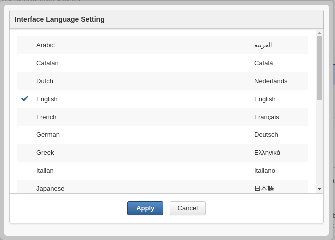

.. _InternationalizationConfiguration:

###################################
Internationalization configuration
###################################

This chapter covers:

-  :ref:`Locales configuration <PLFDevGuide.InternationalizationConfiguration.LocalesConfiguration>`
   Provision of the configuration for defining which languages are
   available to users in the "Change Language" section.

-  :ref:`ResourceBundleService <PLFDevGuide.InternationalizationConfiguration.ResourceBundleService>`
   Description of the ResourceBundleService configuration.

-  :ref:`Navigation resource bundles <PLFDevGuide.InternationalizationConfiguration.NavigationResourceBundles>`
   Description of the language configuration for navigation.

-  :ref:`Portlets <PLFDevGuide.InternationalizationConfiguration.Portlets>`
   Description of the language configuration for portlets.

-  :ref:`Translating the language selection form <PLFDevGuide.InternationalizationConfiguration.Translating-Language-Selection-Form>`
   Instructions on how to translate a language in the Interface Language
   Setting.

.. note:: **Assumed Knowledge**

          eXo Platform is fully configurable for internationalization; 
          however, users should have a general knowledge of 
          Internationalization in Java products before attempting these 
          configurations.
		  Oracle Java hosts a comprehensive guide to internationalize 
		  Java products `here <http://docs.oracle.com/javase/tutorial/i18n/TOC.html>http://docs.oracle.com/javase/tutorial/i18n/TOC.html>`__.

All eXo Platform applications contain property files for various 
languages.
They are packaged with the portlets applications in a
``WEB-INF/classes/locale/`` directory.

These files are located in the *classes* folder of the WEB-INF directory
to be loaded by the class loader.

All resource files are in a subfolder named *locale*.

For example, the translations for the *NavigationPortlet* are located in
``web.war/WEB-INF/classes/locale/portlet/portal``.

::

    NavigationPortlet_de.properties
    NavigationPortlet_en.properties
    NavigationPortlet_es.properties
    NavigationPortlet_fr.properties
    NavigationPortlet_nl.properties
    NavigationPortlet_ru.properties
    NavigationPortlet_uk.properties
    NavigationPortlet_ar.xml

Those files contain typical *key=value* Java EE properties. For example,
the French one:

::

    javax.portlet.title=Portlet Navigation

There are also properties files in the portal itself. They form the
**portal resource bundle**.

From a portlet, you can then access translations from the portlet itself
or shared at the portal level, both are aggregated when you need them.

.. note:: **Translation in XML format**

		  It is also possible to use a proprietary XML format to define
		  translations. This is a more convenient way for some languages, such
		  as Japanese, Arabic or Russian. Property files have to be ISO 8859-1
		  encoded with Unicode escape sequences, while the XML file can define
		  its encoding. As a result, it is easier for you to read or edit a
		  translation in XML instead of handling the Unicode escape sequences
		  in property files.
		  For more information, refer to :ref:`ResourceBundleService section <PLFDevGuide.InternationalizationConfiguration.ResourceBundleService>`

.. _PLFDevGuide.InternationalizationConfiguration.LocalesConfiguration:

======================
Locales configuration
======================

Various languages are available in the portal package. The configuration
below will define which languages shown in the "Change Language" section
and made available to users.

The ``portal.war:/WEB-INF/conf/common/common-configuration.xml`` file of
your installation contains the following section:

.. code:: xml

    <component>
      <key>org.exoplatform.services.resources.LocaleConfigService</key>
      <type>org.exoplatform.services.resources.impl.LocaleConfigServiceImpl</type>
      <init-params>
        <value-param>
          <name>locale.config.file</name>
          <value>war:/conf/common/locales-config.xml</value>
        </value-param>
      </init-params>
    </component>

This configuration points to the locale configuration file
(``portal.war:/WEB-INF/conf/common/locales-config.xml``) that contains
the following code:

.. code:: xml

    <?xml version="1.0" encoding="UTF-8"?>
    <locales-config>
      <locale-config>
        <locale>en</locale>
        <output-encoding>UTF-8</output-encoding>
        <input-encoding>UTF-8</input-encoding>
        <description>Default configuration for english locale</description>
      </locale-config>
     
      <locale-config>
        <locale>fr</locale>
        <output-encoding>UTF-8</output-encoding>
        <input-encoding>UTF-8</input-encoding>
        <description>Default configuration for the french locale</description>
      </locale-config>
     
      <locale-config>
        <locale>ar</locale>
        <output-encoding>UTF-8</output-encoding>
        <input-encoding>UTF-8</input-encoding>
        <description>Default configuration for the arabic locale</description>
        <orientation>rt</orientation>
      </locale-config>
    </locales-config>

-  *locale*: This has to be defined, such as
   ` http://ftp.ics.uci.edu-pub-ietf-http-related-iso639.txt <http://ftp.ics.uci.edu-pub-ietf-http-related-iso639.txt>`__. In
   this example, "*ar*\ " is Arabic.

-  *output-encoding*: This deals with the character encoding. It is
   recommended that **UTF-8** be used.

-  *input-encoding*: In the Java implementation, the encoding parameters
   will be used for the request response stream. The input-encoding
   parameter will be used for requesting setCharacterEncoding(..).

-  *description*: Brief description of the language.

-  *orientation*: The default orientation of text and images is
   Left-To-Right. eXo Platform supports **Right-To-Left** orientation.
   Modifying the text orientation is explained in ?.

.. _PLFDevGuide.InternationalizationConfiguration.ResourceBundleService:

======================
ResourceBundleService
======================

The resource bundle service is configured in:
``portal.war:/WEB-INF/conf/common/common-configuration.xml``:

.. code:: xml

    <component>
      <key>org.exoplatform.services.resources.ResourceBundleService</key>
      <type>org.exoplatform.services.resources.impl.SimpleResourceBundleService</type>
      <init-params>
        <values-param>
          <name>classpath.resources</name>
          <description>The resources  that start with the following package name should be load from file system</description>
          <value>locale.portlet</value>      
        </values-param>      
        <values-param>
          <name>init.resources</name>
          <description>Initiate the following resources during the first launch</description>
          <value>locale.portal.expression</value>
          <value>locale.portal.services</value>
          <value>locale.portal.webui</value>
          <value>locale.portal.custom</value>
          <value>locale.navigation.portal.classic</value>
          <value>locale.navigation.group.platform.administrators</value>
          <value>locale.navigation.group.platform.users</value>
          <value>locale.navigation.group.platform.guests</value>
          <value>locale.navigation.group.organization.management.executive-board</value>               
        </values-param>      
        <values-param>
          <name>portal.resource.names</name>
          <description>The properties files of  the portal ,  those file will be merged 
            into one ResoruceBundle properties </description>
          <value>locale.portal.expression</value>
          <value>locale.portal.services</value>
          <value>locale.portal.webui</value>
          <value>locale.portal.custom</value>        
        </values-param>      
      </init-params>
    </component>

-  *classpath.resources*: This is discussed in the later section.

-  *init.resources*: Initiates resources related to portal, group, user
   resource bundle.

-  *portal.resource.names*: Defines all resources that belong to the
   *Portal Resource Bundle*.

These resources are merged into a single resource bundle which is
accessible from anywhere in eXo Platform. All these keys are located in the
same bundle, which is separated from the navigation resource bundles.

.. _PLFDevGuide.InternationalizationConfiguration.NavigationResourceBundles:

============================
Navigation resource bundles
============================

There is a resource bundle for each navigation. A navigation can exist
for user, groups and portal.

The previous example shows bundle definitions for the navigation of the
classic portal and of four different groups. Each of these resource
bundles occupies a different sphere, they are independent of each other
and they are not included in the ``portal.resource.names`` parameter.

The properties for a group must be in the
``WEB-INF/classes/locale/navigation/group/`` folder. For example,
``/WEB-INF/classes/locale/navigation/group/organization/management/executive-board_en.properties``.

The folder and file names must correspond to the group hierarchy. The
group name "``executive-board``\ " is followed by the ISO 639 code.

Each language defined in ``LocalesConfig`` must have a resource file
defined. If the name of a group is changed, the name of the folder
and/or files of the correspondent navigation resource bundles must also
be changed.

Content of ``executive-board_en.properties``:

::

    organization.title=Organization
    organization.newstaff=New Staff
    organization.management=Management

This resource bundle is only accessible for the navigation of the
``organization.management.executive-board`` group.

.. _PLFDevGuide.InternationalizationConfiguration.Portlets:

=========
Portlets
=========

Portlets are independent applications and deliver their own resource
files.

All shipped portlet resources are located in the ``locale/portlet``
subfolder. The ResourceBundleService parameter called
**classpath.resources** defines this subfolder.

**Example: Adding a Spanish translation to GadgetPortlet**

1. Create the ``GadgetPortlet_es.properties`` file in:
   ``WEB-INF/classes/locale/portlet/gadget/GadgetPortlet``.

2. Add ``Spanish`` as a **supported-locale** to ``portlet.xml`` ('es' is
   the 2 letters code for Spanish). The **resource-bundle** is already
   declared and is the same for all languages:

   .. code:: xml

		<supported-locale>en</supported-locale>
			<supported-locale>es</supported-locale>
			<resource-bundle>locale.portlet.gadget.GadgetPortlet</resource-bundle>

See the portlet specification for more details about the portlet
internationalization.

**Standard portlet resource keys**

The portlet specifications define three standard keys: Title, Short
Title and Keywords. Keywords are formatted as a comma-separated list of
tags.

::

     javax.portlet.title=Breadcrumbs Portlet
     javax.portlet.short-title=Breadcrumbs
     javax.portlet.keywords=Breadcrumbs, Breadcrumb

**Debugging resource bundle usage**

When translating an application, it can sometimes be important to find
out which key underlies some given labels in the user interface. eXo Platform
offers the Magic locale to handle such situations.

You can start the Portal in *debug mode* and use the **Magic locale**
from the list of available portal languages to assist in finding the
correct translated key value.

This special locale translates a key to the same value. For example, the
translated value for the "*organization.title*\ " key is the
"*organization.title*\ " value. Selecting Magic locale allows use of the
portal and its applications with all the keys visible. This makes it
easier to discover the correct key for a given label in the portal page.

**Accessing the Magic Locale**:

1. Start the portal in debug mode by executing the following command-line
   argument:

   ::

		[USER@HOST jboss-jpp-6.0]$ ./bin/standalone.sh -
		Dexo.product.developing=true

2. Open http://localhost:8080/portal/classic to display eXo Platform
   landing page.

3. Click Change Language.

4. Select ma from the list of available languages to activate the Magic
   locale.

.. _PLFDevGuide.InternationalizationConfiguration.Translating-Language-Selection-Form:

========================================
Translating the language selection form
========================================

|image0|

When choosing a language as on the screenshot above, the user is
presented with a list of languages on the left side in the current
chosen language and on the right side, the same language translated into
its own language. Those texts are obtained from the JDK API
*java.util.Locale.getDisplayedLanguage()* and
*java.util.Locale.getDisplayedCountry()* (if needed) and all languages
may not be translated and can also depend on the JVM currently used. It
is still possible to override those values by editing the
*locale.portal.webui* resource bundle. To do this, edit the
``gatein.ear/portal.war/WEB-INF/classes/locale/portal/webui_xx_yy.properties``
where *xx\_yy* represents the country code of the language in which you
want to translate a particular language. In that file, add or modify a
key, such as *Locale.xx\_yy* with the value being the translated string.

**Example: Changing the displayed text for Traditional Chinese in French**

First edit
``gatein.ear/portal.war/WEB-INF/classes/locale/portal/webui_fr.properties``
where *ne* is the country code for French, and add the following key
into it:

::

    Locale.zh_TW=Chinois traditionnel

After a restart, the language will be updated in the user interface when
a user is trying to change the current language.

