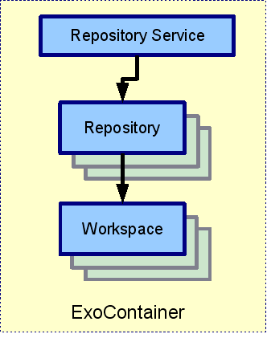
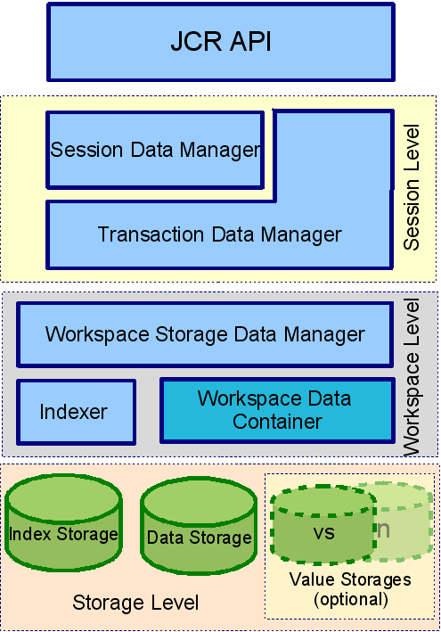
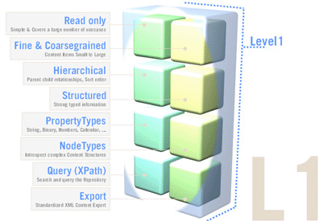
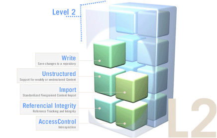
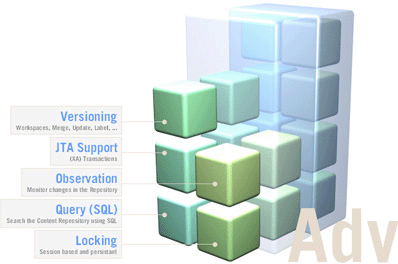

.. _Introduction_eXo_JCR:

#########################
Introduction to eXo JCR
#########################

eXo JCR is an implementation of the `Java Specification Request
    170 <http://jcp.org/en/jsr/detail?id=170>`__, also known as the
    Content Repository for Java technology API. This chapter introduces
    you to eXo JCR via 2 main topics:

    -  :ref:`eXo JCR architecture <JCRref.Introduction.JCRArchitecture>`

       Introduction to 2 core factors of the eXo JCR architecture: eXo
       Repository Service and Workspace Data Model.

    -  :ref:`Compatibility levels <JCR.CompatibilityLevels>`

       Details of 2 compliance levels and a set of optional features.

**Why Use JCR?**

Do you know how your website data are stored? Images can be stored in a
file system, and metadata are in some dedicated files, for example, in
``.xml`` files, and text documents and PDFs are stored in different
folders with metadata in another repositories and in a proprietary
structure. How do you manage updating these data and access rights?
Where and how do you start if your leader asks you to manage different
versions of each document? The larger your website is, the more `Content
Management
Systems <http://en.wikipedia.org/wiki/Content_management_system>`__
(CMSs) you need that allows tackling all these issues.

These CMS solutions are provided by different vendors and each vendor
provides its own API for interfacing the proprietary content repository.
The developers MUST deal with this and need to learn about the
vendor-specific API. If you intend to switch to a different vendor in
future, everything will be different, for example, you need a new
implementation or a new interface.

JCR provides a unique Java interface that allows you to interact with
both text and binary data, and to deal with any kind and amount of
metadata of your documents. JCR supplies methods for storing, updating,
deleting and retrieving your data without being dependent on the fact
that the data is stored in a RDBMS, in a file system or as an XML
document. The JCR interface is also defined as classes and methods for
searching, versioning, access control, locking and observation.

Furthermore, the export and import functionality is specified so that a
switch to a different vendor is always possible.

**What does eXo JCR do?**

eXo JCR fully complies with `JSR
170 <http://jcp.org/en/jsr/detail?id=170>`__; therefore with eXo JCR you
can use a vendor-independent API. It means that you could switch to a
different vendor whenever. By using the standard, you can reduce your
lifecycle cost and long-term risk.

.. note:: eXo Platform offers not only JCR but also the complete solution for
          both Enterprise Content Management and Web Content Management.

.. _JCRref.Introduction.JCRArchitecture:

====================
eXo JCR architecture
====================

eXo Repository Service
~~~~~~~~~~~~~~~~~~~~~~~

eXo Repository Service is a `JSR
170 <http://jcp.org/en/jsr/detail?id=170>`__-based standard service and
is a registered IoC (Inversion Of Control) component that can be
deployed in some eXo Containers (see `Repository service
configuration <#JCR.eXoJCRconfiguration.RepositoryServiceConfiguration>`__
for more details). The relationships between components are shown in the
picture below:

|image0|

eXo Container: Some subclasses of ``ExoContainer`` (usually
``StandaloneContainer`` or ``PortalContainer``) that holds a reference
to Repository Service. See
:ref:`Containers <Kernel.ServiceConfigurationforBeginners.Containers>` for
more details.

-  **Repository Service:** Contain information about repositories. eXo
   JCR is able to manage many Repositories.

-  **Repository:** Implementation of ``javax.jcr.Repository``. It holds
   references to one or more Workspace(s).

-  Workspace: Container of a single rooted tree of Items. (Note that
   here it is not exactly the same as ``javax.jcr.Workspace`` as it is
   not a Session object). See
   :ref:`Workspace <JCR.eXoJCRconfiguration.workspace>` for the workspace
   configurations.

The JCR application usecase typically includes two initial steps:

-  Obtaining Repository object by getting **Repository Service** from
   the current eXo Container (eXo "native" way) or via JNDI lookup if
   eXo repository is bound to the naming context using (see 
   :ref:`Repository configuration <JCR.eXoJCRconfiguration.RepositoryConfiguration>`
   for more details).

-  Creating ``javax.jcr.Session`` object that calls
   ``Repository.login(..)``.

Workspace Data Model
~~~~~~~~~~~~~~~~~~~~~~

The following diagram explains which components of eXo JCR
implementation are used in a data flow to perform operations specified
in JCR API.

|image1|

The **Workspace Data Model** can be split into 4 levels by the data
isolation and value from the JCR model point of view.

-  **eXo JCR core**: Implements the **JCR API** interfaces, such as
   Item, Node, Property. It contains JCR "logical" view on stored data.

-  **Session Level**: Isolates the transient data viewable inside one
   JCR Session and interacts with API level using eXo JCR internal API.

-  **Session Data Manager**: Maintains the transient session data. With
   data access/ modification/ validation logic, it contains Modified
   Items Storage to hold the data changed between subsequent save()
   calling and Session Items Cache.

-  **Transaction Data Manager**: Maintains the session data between
   save() and transaction commit/ rollback if the current session is
   part of a transaction.

-  **Workspace Level**: Operates for the particular workspace shared
   data. It contains objects of each Workspace.

-  **Workspace Storage Data Manager:** Maintains the workspace data,
   including final validation, events firing, and caching.

-  **Workspace Data Container**: Implements the physical data storage.
   It allows different types of backend (such as RDB, FS files) to be
   used as a storage for JCR data. With the main Data Container, other
   storages for the persisted Property Values can be configured and
   used.

-  **Indexer:** Maintains the workspace data indexing for further
   queries.

-  **Storage Level**: Persistent storages for:

   -  JCR Data.

   -  Indexes (Apache Lucene).

   -  Values (for example, for BLOBs) if being different from the main
      Data Container.
      
.. _JCR.CompatibilityLevels:  

====================
Compatibility levels
====================

The Java Content Repository specification
`JSR-170 <http://www.jcp.org/en/jsr/detail?id=170>`__ has been split
into two compliance levels and a set of optional features.

-  :ref:`Level 1 <JCR.CompatibilityLevels.Level1>` defines a read-only
   repository.

-  :ref:`Level 2 <JCR.CompatibilityLevels.Level2>` defines methods for
   writing content and bidirectional interaction with the repository.

.. note:: eXo JCR supports `JSR-170 <http://www.jcp.org/en/jsr/detail?id=170>`__ level 1 and
          level 2 and all optional features. The recent
          `JSR-283 <http://www.jcp.org/en/jsr/detail?id=283>`__ is not yet supported.

.. _JCR.CompatibilityLevels.Level1:

Level 1
~~~~~~~~

Level 1 includes the read-only functionality for very simple
repositories. It is useful to port an existing data repository and
convert it to a more advanced form step by step. JCR uses a well-known
Session abstraction to access the repository data (similar to the
sessions you have in OS, web, and more).

The features of level 1:

-  Initiating a session calling the login method with the name of
   desired workspace and client credentials. It involves some security
   mechanisms (JAAS) to authenticate the client and in case the client
   is authorized to use the data from a particular workspace, he can
   retrieve the session with a workspace tied to it.

-  Using the obtained session, the client can retrieve data (items) by
   traversing the tree, directly accessing a particular item (requesting
   path or UUID) or traversing the query result. So an application
   developer can choose the "best" form depending on the content
   structure and desired operation.

-  Reading property values. All content of a repository is ultimately
   accessed through properties and stored in property values of
   predefined types (Boolean, Binary Data, Double, Long, String) and
   special types Name, Reference, and Path. It is possible to read
   property value without knowing its real name as a primary item.

-  Export to XML. Repository supports two XML/JCR data model mappings:
   system and document views. The system view provides complete XML
   serialization without loss of information and is somewhat difficult
   for a human to read. In contrast, the document view is well readable
   but does not completely reflect the state of repository, it is used
   for Xpath queries.

-  Query facility with Xpath syntax. Xpath, originally developed for
   XML, suits the JCR data model as well because the JCR data model is
   very close to XML's one. It is applied to JCR as it would be applied
   to the document view of the serialized repository content, returning
   a table of property names and content matching the query.

-  Discovery of available node types. Every node should have only one
   primary node type that defines names, types and other characteristics
   of child nodes and properties. It also can have one or more mixin
   data types that defines additional characteristics. Level 1 provides
   methods for discovering available in repository node types and node
   types of a concrete node.

-  Transient namespace remapping. Item name can have prefix, delimited
   by a single ':' (colon) character that indicates the namespace of
   this name. It is patterned after XML namespaces, prefix is mapped to
   URI to minimize names collisions. In Level 1, a prefix can be
   temporarily overridden by another prefix in the scope of a session.

|image2|

.. _JCR.CompatibilityLevels.Level2:

Level 2
~~~~~~~~~

JCR level 2 includes reading/writing content functionality, importing
other sources and managing content definition and structuring using
extensible node types.

In addition to the features of the Level 1, it also supports the
following major features:

-  Adding, moving, copying and removing items inside workspace and
   moving, copying and cloning items between workspaces. The client can
   also compare the persisted state of an item with its unsaved states
   and either save the new state or discard it.

-  Modifying and writing value of properties. Property types are checked
   and can be converted to the defined format.

-  Importing XML document into the repository as a tree of nodes and
   properties. If the XML document is an export of JCR system view, the
   content of repository can be completely restored. If this is not the
   case, the document is interpreted as a document view and the import
   procedure builds a tree of JCR nodes and properties that matches the
   tree structure of the XML document.

-  Assigning node types to nodes. The primary node type is assigned when
   adding a node. This can be done automatically based on the parent
   node type definition and mixin node types.

-  Persistent namespaces changes. Adding, changing and removing
   namespaces stored in the namespace registry, excluding built-in
   namespaces required by JCR.

|image3|

.. _.. _JCR.CompatibilityLevels.OptionalFeatures:

Optional features
~~~~~~~~~~~~~~~~~~

On the top of Level 1 or Level 2, a number of optional features are
defined for a more advanced repository functionality. This includes
functions such as Versioning, (JTA) Transactions, Query using SQL,
Explicit Locking and Content Observation. eXo JCR supports all optional
features.

|image4|

    

