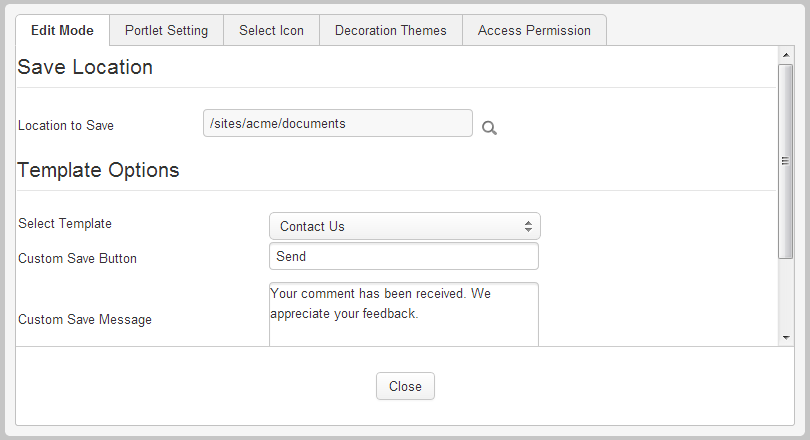
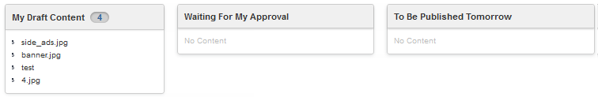

.. _Introduction_eXo_Platform:

###########################################
Introduction to eXo Platform Applications
###########################################

    In this chapter, you will learn about applications in eXo Platform,
    divided into 2 categories:

    -  :ref:`Portlets <PLFRefGuide.Application.Portlets>`

       Introduction to portlets included in eXo Platform, and their
       details (packaging, portlet class name, available preferences and
       sample configurations).

    -  :ref:`Gadgets <PLFRefGuide.Application.Gadgets>`

       Details of all gadgets used in eXo Platform, such as links to
       used REST services, preferences, and more.

    These applications are packaged as Web application archives (WARs).

    Also, you can specify each portlet and gadget package and its
    available preferences that allow you to extend the configuration
    choices for standard preferences.

.. _PLFRefGuide.Application.Portlets:

========
Portlets
========

This section introduces you to a list of portlets used in applications
of eXo Platform, and their details, such as packaging, portlet class
name, available preferences and sample configurations.

The portlets are classified basing on each application:

-  :ref:`Social <PLFRefGuide.Application.Portlets.Social>`

-  :ref:`Content <PLFRefGuide.Application.Portlets.Content>`

-  :ref:`Wiki <PLFRefGuide.Application.Portlets.Wiki>`

-  :ref:`Calendar <PLFRefGuide.Application.Portlets.Calendar>`

-  :ref:`Forum <PLFRefGuide.Application.Portlets.Forum>`

-  :ref:`Answers <PLFRefGuide.Application.Portlets.Answers>`

-  :ref:`Polls <PLFRefGuide.Application.Portlets.Polls>`

-  :ref:`Search <PLFRefGuide.Application.Portlets.Search>`

.. _PLFRefGuide.Application.Portlets.Social:

Social
~~~~~~~

All Social portlets are packaged in ``social-portlet.war`` file.

+--------------------------+-----------------------------------------------------------------------------------------------+
| Portlet name             | Description                                                                                   |
+==========================+===============================================================================================+
| Members                  | Enables users to search for Space members or lists space members in the alphabetical order.   |
+--------------------------+-----------------------------------------------------------------------------------------------+
| My Spaces                | Displays the spaces that user is member or manager.                                           |
+--------------------------+-----------------------------------------------------------------------------------------------+
| Space Activity Stream    | Shares spaces activities.                                                                     |
+--------------------------+-----------------------------------------------------------------------------------------------+
| Invitations              | Lists all people that invite users.                                                           |
+--------------------------+-----------------------------------------------------------------------------------------------+
| Requests                 | Lists all invitations requested by users.                                                     |
+--------------------------+-----------------------------------------------------------------------------------------------+
| Invitation Spaces        | Displays the spaces that user is invited.                                                     |
+--------------------------+-----------------------------------------------------------------------------------------------+
| Pending Spaces           | Displays the **requests to join spaces** page.                                                |
+--------------------------+-----------------------------------------------------------------------------------------------+
| Public Spaces            | Displays the **Public Spaces** page.                                                          |
+--------------------------+-----------------------------------------------------------------------------------------------+
| User Activity Stream     | Updates and shares the user's activities and/or status.                                       |
+--------------------------+-----------------------------------------------------------------------------------------------+
| People                   | Displays the **People** page.                                                                 |
+--------------------------+-----------------------------------------------------------------------------------------------+
| Connections              | Displays the **Connections** page.                                                            |
+--------------------------+-----------------------------------------------------------------------------------------------+
| Profile                  | Displays the **User profile** page.                                                           |
+--------------------------+-----------------------------------------------------------------------------------------------+
| Connections Navigation   | Displays all connections of a user.                                                           |
+--------------------------+-----------------------------------------------------------------------------------------------+
| All Spaces               | Displays the list of all spaces in the system.                                                |
+--------------------------+-----------------------------------------------------------------------------------------------+
| Space Access             | Manages the accessing-space permission of users.                                              |
+--------------------------+-----------------------------------------------------------------------------------------------+
| Network                  | Displays the relationship information of the current user.                                    |
+--------------------------+-----------------------------------------------------------------------------------------------+
| Home Space               | Displays the the space homepage.                                                              |
+--------------------------+-----------------------------------------------------------------------------------------------+
| Space Menu               | Displays the space menu to applications.                                                      |
+--------------------------+-----------------------------------------------------------------------------------------------+
| Space Setting            | Displays the **Space Setting** page.                                                          |
+--------------------------+-----------------------------------------------------------------------------------------------+
| People Directory         | Displays the page to search for people.                                                       |
+--------------------------+-----------------------------------------------------------------------------------------------+
| All People               | Displays the page that shows all people in the system.                                        |
+--------------------------+-----------------------------------------------------------------------------------------------+

.. _PLFRefGuide.Application.Portlets.Content:

Content
~~~~~~~~~

This section introduces you to a list of portlets included in Content,
and their details (packaging, portlet class name, available preferences
and sample configurations).

The Content portlets are packaged in various Web application archives
(WARs), including:

-  Content Detail, Content List, Search: ``presentation.war``

-  Sites Explorer: ``ecmexplorer.war``

-  ECM Admin: ``ecmadmin.war``

-  Fast Content Creator: ``fastcontentcreator.war``

-  Authoring Dashboard: ``authoring-apps.war``

-  SEO Toolbar: ``seo.war``

Also, you can specify the package of each portlet and its available
preferences that allow you to extend the configuration choices for
standard preferences defined in ``portlet.xml``.

.. _PLFRefGuide.Application.Portlets.Content.ContentDetail:

Content Detail
--------------

The **Content Detail** portlet allows users to view the detail of a
specific content.

This is an example of the **Content Detail** portlet used in Content:

|image3|

-  **Packaging**: This portlet is packaged in the ``presentation.war``
   file.

-  **Portlet class name**:
   ``org.exoplatform.wcm.webui.scv.UISingleContentViewerPortlet``

-  **Available preferences**: When using this portlet, you can customize
   the following preferences:

+--------------------------+---------------+---------------------+-------------------------------------------------------------------------------------------------------------------------------------------------------------------------------------------------------------------------------------------------------------------------------------------------------------------------------------------------------------------------------------------------------+
| **Preference**           | **Type**      | **Value**           | **Description**                                                                                                                                                                                                                                                                                                                                                                                       |
+==========================+===============+=====================+=======================================================================================================================================================================================================================================================================================================================================================================================================+
| **workspace**            | ``String``    | ``collaboration``   | The workspace where content is stored.                                                                                                                                                                                                                                                                                                                                                                |
+--------------------------+---------------+---------------------+-------------------------------------------------------------------------------------------------------------------------------------------------------------------------------------------------------------------------------------------------------------------------------------------------------------------------------------------------------------------------------------------------------+
| **nodeIdentifier**       | ``String``    | ``N/A``             | The UUID or the path of content that you want to show.                                                                                                                                                                                                                                                                                                                                                |
+--------------------------+---------------+---------------------+-------------------------------------------------------------------------------------------------------------------------------------------------------------------------------------------------------------------------------------------------------------------------------------------------------------------------------------------------------------------------------------------------------+
| **ShowTitle**            | ``Boolean``   | ``true``            | Shows the content title on the top of the portlet.                                                                                                                                                                                                                                                                                                                                                    |
+--------------------------+---------------+---------------------+-------------------------------------------------------------------------------------------------------------------------------------------------------------------------------------------------------------------------------------------------------------------------------------------------------------------------------------------------------------------------------------------------------+
| **ShowDate**             | ``Boolean``   | ``false``           | Shows the content date on the top of the portlet.                                                                                                                                                                                                                                                                                                                                                     |
+--------------------------+---------------+---------------------+-------------------------------------------------------------------------------------------------------------------------------------------------------------------------------------------------------------------------------------------------------------------------------------------------------------------------------------------------------------------------------------------------------+
| **ShowOptionBar**        | ``Boolean``   | ``false``           | Shows the content date on the top of the portlet.                                                                                                                                                                                                                                                                                                                                                     |
+--------------------------+---------------+---------------------+-------------------------------------------------------------------------------------------------------------------------------------------------------------------------------------------------------------------------------------------------------------------------------------------------------------------------------------------------------------------------------------------------------+
| **ContextEnable**        | ``Boolean``   | ``false``           | Defines if the portlet will use the parameter on URL as the path to content to display or not.                                                                                                                                                                                                                                                                                                        |
+--------------------------+---------------+---------------------+-------------------------------------------------------------------------------------------------------------------------------------------------------------------------------------------------------------------------------------------------------------------------------------------------------------------------------------------------------------------------------------------------------+
| **ParameterName**        | ``String``    | ``content-id``      | Defines which parameter will be used to get the content's path.                                                                                                                                                                                                                                                                                                                                       |
+--------------------------+---------------+---------------------+-------------------------------------------------------------------------------------------------------------------------------------------------------------------------------------------------------------------------------------------------------------------------------------------------------------------------------------------------------------------------------------------------------+
| **PrintParameterName**   | ``String``    | ``content-id``      | Defines which parameter will be used to get the content's path to print.                                                                                                                                                                                                                                                                                                                              |
+--------------------------+---------------+---------------------+-------------------------------------------------------------------------------------------------------------------------------------------------------------------------------------------------------------------------------------------------------------------------------------------------------------------------------------------------------------------------------------------------------+
| **PrintPage**            | ``String``    | ``printviewer``     | The print preview page.                                                                                                                                                                                                                                                                                                                                                                               |
+--------------------------+---------------+---------------------+-------------------------------------------------------------------------------------------------------------------------------------------------------------------------------------------------------------------------------------------------------------------------------------------------------------------------------------------------------------------------------------------------------+
| **basePath**             | ``String``    | ``basePath``        | Shows the page in which the full content is displayed when the content title is clicked.                                                                                                                                                                                                                                                                                                              |
+--------------------------+---------------+---------------------+-------------------------------------------------------------------------------------------------------------------------------------------------------------------------------------------------------------------------------------------------------------------------------------------------------------------------------------------------------------------------------------------------------+
| **showScvWith**          | ``String``    | ``content-id``      | The parameter name which shows the content path in URL when the content title is clicked.                                                                                                                                                                                                                                                                                                             |
+--------------------------+---------------+---------------------+-------------------------------------------------------------------------------------------------------------------------------------------------------------------------------------------------------------------------------------------------------------------------------------------------------------------------------------------------------------------------------------------------------+
| **sharedCache**          | ``Boolean``   | ``true``            | Defines if the portlet will use the cache shared between users to display content. If you want the content to be displayed in CLV to be got from one cache, set the value to ``true``. In most cases, you should not set **sharedCache** to ``false`` as it reduces the overall performance. See `Content Visibility <#User_Guide-Preferences-Content_Detail_Preferences-Content_visibilityCLV>`__.   |
+--------------------------+---------------+---------------------+-------------------------------------------------------------------------------------------------------------------------------------------------------------------------------------------------------------------------------------------------------------------------------------------------------------------------------------------------------------------------------------------------------+

-  **Sample configuration**

.. code:: xml

    <portlet-preferences>
        <preference>
            <name>workspace</name>
            <value>collaboration</value>
            <read-only>false</read-only>
        </preference>
        <preference>
            <name>nodeIdentifier</name>
            <value>/myfolder/mycontent</value>
            <read-only>false</read-only>
        </preference>
        <preference>
            <name>ShowTitle</name>
            <value>true</value>
            <read-only>false</read-only>
        </preference>
        <preference>
            <name>ShowDate</name>
            <value>false</value>
            <read-only>false</read-only>
        </preference>
        <preference>
            <name>ShowOptionBar</name>
            <value>false</value>
            <read-only>false</read-only>
        </preference>
        <preference>
            <name>ContextEnable</name>
            <value>false</value>
            <read-only>false</read-only>
        </preference>
        <preference>
            <name>ParameterName</name>
            <value>content-id</value>
            <read-only>false</read-only>
        </preference>
        <preference>
            <name>PrintParameterName</name>
            <value>content-id</value>
            <read-only>false</read-only>
        </preference>
        <preference>
            <name>PrintPage</name>
            <value>printviewer</value>
            <read-only>false</read-only>
        </preference>
        <preference>
            <name>basePath</name>
            <value>detail</value>
            <read-only>false</read-only>
        </preference>
        <preference>
            <name>showScvWith</name>
            <value>content-id</value>
            <read-only>false</read-only>
        </preference>
        <preference>
            <name>sharedCache</name>
            <value>true</value>
            <read-only>false</read-only>
        </preference>
    </portlet-preferences>

.. _PLFRefGuide.Application.Portlets.Content.ContentList:

Content List
-------------

The **Content List** portlet shows a list of contents which already
exist in the system.

This is an example of the **Content List** portlet used in Content:

|image4|

-  **Packaging**: This portlet is packaged in the ``presentation.war``
   file.

-  **Portlet class name**:
   **org.exoplatform.wcm.webui.clv.UICLVPortlet**

-  **Available preferences**: When using this portlet, you can customize
   the following preferences:

+-----------------------------+---------------+--------------------------------------------------------------------------------------+--------------------------------------------------------------------------------------------------------------------------------------------------------------------------------------------------------------------------------------------------------------------------------------------------------------------------------------------------------------------------------------------------------------------------------------+
| **Preference**              | **Type**      | **Value**                                                                            | **Description**                                                                                                                                                                                                                                                                                                                                                                                                                      |
+=============================+===============+======================================================================================+======================================================================================================================================================================================================================================================================================================================================================================================================================================+
| **mode**                    | ``String``    | ``AutoViewerMode``                                                                   | The mode for displaying content of the portlet: all contents in a specific folder or all specific contents in the portlet.                                                                                                                                                                                                                                                                                                           |
+-----------------------------+---------------+--------------------------------------------------------------------------------------+--------------------------------------------------------------------------------------------------------------------------------------------------------------------------------------------------------------------------------------------------------------------------------------------------------------------------------------------------------------------------------------------------------------------------------------+
| **folderPath**              | ``String``    | N/A                                                                                  | The path to the folder whose contents are displayed by this portlet.                                                                                                                                                                                                                                                                                                                                                                 |
+-----------------------------+---------------+--------------------------------------------------------------------------------------+--------------------------------------------------------------------------------------------------------------------------------------------------------------------------------------------------------------------------------------------------------------------------------------------------------------------------------------------------------------------------------------------------------------------------------------+
| **orderBy**                 | ``String``    | ``publication:liveDate``                                                             | The property by which all the contents in the portlet are sorted.                                                                                                                                                                                                                                                                                                                                                                    |
+-----------------------------+---------------+--------------------------------------------------------------------------------------+--------------------------------------------------------------------------------------------------------------------------------------------------------------------------------------------------------------------------------------------------------------------------------------------------------------------------------------------------------------------------------------------------------------------------------------+
| **orderType**               | ``String``    | ``DESC``                                                                             | The type of the content sort method: ascending or descending.                                                                                                                                                                                                                                                                                                                                                                        |
+-----------------------------+---------------+--------------------------------------------------------------------------------------+--------------------------------------------------------------------------------------------------------------------------------------------------------------------------------------------------------------------------------------------------------------------------------------------------------------------------------------------------------------------------------------------------------------------------------------+
| **header**                  | ``String``    | N/A                                                                                  | The header of the portlet which is displayed at the top of the portlet.                                                                                                                                                                                                                                                                                                                                                              |
+-----------------------------+---------------+--------------------------------------------------------------------------------------+--------------------------------------------------------------------------------------------------------------------------------------------------------------------------------------------------------------------------------------------------------------------------------------------------------------------------------------------------------------------------------------------------------------------------------------+
| **automaticDetection**      | ``Boolean``   | ``true``                                                                             | This value indicates whether the header of the portlet is selected to be the title of the folder given in the **folderPath** parameter (true value) or the value given in the **header** parameter above.                                                                                                                                                                                                                            |
+-----------------------------+---------------+--------------------------------------------------------------------------------------+--------------------------------------------------------------------------------------------------------------------------------------------------------------------------------------------------------------------------------------------------------------------------------------------------------------------------------------------------------------------------------------------------------------------------------------+
| **formViewTemplatePath**    | ``String``    | N/A                                                                                  | The value is set to "empty" by default and can be replaced with the path to the template which is used to display this portlet content.                                                                                                                                                                                                                                                                                              |
+-----------------------------+---------------+--------------------------------------------------------------------------------------+--------------------------------------------------------------------------------------------------------------------------------------------------------------------------------------------------------------------------------------------------------------------------------------------------------------------------------------------------------------------------------------------------------------------------------------+
| **paginatorTemplatePath**   | ``String``    | ``/exo:ecm/views/templates/content-list-viewer/paginators/DefaultPaginator.gtmpl``   | The path to the paginator used to display the contents in this portlet.                                                                                                                                                                                                                                                                                                                                                              |
+-----------------------------+---------------+--------------------------------------------------------------------------------------+--------------------------------------------------------------------------------------------------------------------------------------------------------------------------------------------------------------------------------------------------------------------------------------------------------------------------------------------------------------------------------------------------------------------------------------+
| **itemsPerPage**            | ``Integer``   | 10                                                                                   | The number of contents displayed in every "page" of the portlet.                                                                                                                                                                                                                                                                                                                                                                     |
+-----------------------------+---------------+--------------------------------------------------------------------------------------+--------------------------------------------------------------------------------------------------------------------------------------------------------------------------------------------------------------------------------------------------------------------------------------------------------------------------------------------------------------------------------------------------------------------------------------+
| **showThumbnailsView**      | ``Boolean``   | ``true``                                                                             | This value indicates whether the content image in this portlet is shown or not.                                                                                                                                                                                                                                                                                                                                                      |
+-----------------------------+---------------+--------------------------------------------------------------------------------------+--------------------------------------------------------------------------------------------------------------------------------------------------------------------------------------------------------------------------------------------------------------------------------------------------------------------------------------------------------------------------------------------------------------------------------------+
| **showTitle**               | ``Boolean``   | ``true``                                                                             | This value indicates whether the content title in this portlet is shown or not.                                                                                                                                                                                                                                                                                                                                                      |
+-----------------------------+---------------+--------------------------------------------------------------------------------------+--------------------------------------------------------------------------------------------------------------------------------------------------------------------------------------------------------------------------------------------------------------------------------------------------------------------------------------------------------------------------------------------------------------------------------------+
| **showHeader**              | ``Boolean``   | ``true``                                                                             | This value indicates whether the content header in this portlet is shown or not.                                                                                                                                                                                                                                                                                                                                                     |
+-----------------------------+---------------+--------------------------------------------------------------------------------------+--------------------------------------------------------------------------------------------------------------------------------------------------------------------------------------------------------------------------------------------------------------------------------------------------------------------------------------------------------------------------------------------------------------------------------------+
| **showRefreshButton**       | ``Boolean``   | ``false``                                                                            | This value indicates whether the **Refresh** button is shown in this portlet or not.                                                                                                                                                                                                                                                                                                                                                 |
+-----------------------------+---------------+--------------------------------------------------------------------------------------+--------------------------------------------------------------------------------------------------------------------------------------------------------------------------------------------------------------------------------------------------------------------------------------------------------------------------------------------------------------------------------------------------------------------------------------+
| **showDateCreated**         | ``Boolean``   | ``true``                                                                             | This value indicates whether the content created date in this portlet is shown or not.                                                                                                                                                                                                                                                                                                                                               |
+-----------------------------+---------------+--------------------------------------------------------------------------------------+--------------------------------------------------------------------------------------------------------------------------------------------------------------------------------------------------------------------------------------------------------------------------------------------------------------------------------------------------------------------------------------------------------------------------------------+
| **showReadmore**            | ``Boolean``   | ``true``                                                                             | This value indicates whether the **Read more** button is shown in every content of the portlet or not. After clicking this button, the user can read the whole text of the content.                                                                                                                                                                                                                                                  |
+-----------------------------+---------------+--------------------------------------------------------------------------------------+--------------------------------------------------------------------------------------------------------------------------------------------------------------------------------------------------------------------------------------------------------------------------------------------------------------------------------------------------------------------------------------------------------------------------------------+
| **showSummary**             | ``Boolean``   | ``true``                                                                             | This value indicates whether the content summary in this portlet is shown or not.                                                                                                                                                                                                                                                                                                                                                    |
+-----------------------------+---------------+--------------------------------------------------------------------------------------+--------------------------------------------------------------------------------------------------------------------------------------------------------------------------------------------------------------------------------------------------------------------------------------------------------------------------------------------------------------------------------------------------------------------------------------+
| **showLink**                | ``Boolean``   | ``true``                                                                             | If this value is ``true``, the header of every content is also the link to view this content fully. If the value is ``false``, the header is considered as a simple text.                                                                                                                                                                                                                                                            |
+-----------------------------+---------------+--------------------------------------------------------------------------------------+--------------------------------------------------------------------------------------------------------------------------------------------------------------------------------------------------------------------------------------------------------------------------------------------------------------------------------------------------------------------------------------------------------------------------------------+
| **showRssLink**             | ``Boolean``   | ``true``                                                                             | Shows the RSS link of this portlet.                                                                                                                                                                                                                                                                                                                                                                                                  |
+-----------------------------+---------------+--------------------------------------------------------------------------------------+--------------------------------------------------------------------------------------------------------------------------------------------------------------------------------------------------------------------------------------------------------------------------------------------------------------------------------------------------------------------------------------------------------------------------------------+
| **basePath**                | ``String``    | ``detail``                                                                           | Shows the page in which the full content is displayed when the user clicks to the **Read more** button.                                                                                                                                                                                                                                                                                                                              |
+-----------------------------+---------------+--------------------------------------------------------------------------------------+--------------------------------------------------------------------------------------------------------------------------------------------------------------------------------------------------------------------------------------------------------------------------------------------------------------------------------------------------------------------------------------------------------------------------------------+
| **contextualFolder**        | ``String``    | ``contextualDisable``                                                                | Enables/Disables the contextual mode of the portlet. If enabled, the portlet can take the folder path indicated in the URL to display contents.                                                                                                                                                                                                                                                                                      |
+-----------------------------+---------------+--------------------------------------------------------------------------------------+--------------------------------------------------------------------------------------------------------------------------------------------------------------------------------------------------------------------------------------------------------------------------------------------------------------------------------------------------------------------------------------------------------------------------------------+
| **showScvWith**             | ``String``    | ``content-id``                                                                       | The parameter name which shows the folder path in URL when the content title is clicked.                                                                                                                                                                                                                                                                                                                                             |
+-----------------------------+---------------+--------------------------------------------------------------------------------------+--------------------------------------------------------------------------------------------------------------------------------------------------------------------------------------------------------------------------------------------------------------------------------------------------------------------------------------------------------------------------------------------------------------------------------------+
| **showClvBy**               | ``String``    | ``folder-id``                                                                        | The parameter name which shows the folder path in URL.                                                                                                                                                                                                                                                                                                                                                                               |
+-----------------------------+---------------+--------------------------------------------------------------------------------------+--------------------------------------------------------------------------------------------------------------------------------------------------------------------------------------------------------------------------------------------------------------------------------------------------------------------------------------------------------------------------------------------------------------------------------------+
| **application**             | ``String``    | ``ContentList``                                                                      | The application name.                                                                                                                                                                                                                                                                                                                                                                                                                |
+-----------------------------+---------------+--------------------------------------------------------------------------------------+--------------------------------------------------------------------------------------------------------------------------------------------------------------------------------------------------------------------------------------------------------------------------------------------------------------------------------------------------------------------------------------------------------------------------------------+
| **sharedCache**             | ``Boolean``   | ``true``                                                                             | Defines if the portlet will use the cache shared between users to display content. If you want the content displayed in SCV to be got from one cache, set the value to ``true``. In most cases, you should not set **sharedCache** to ``false`` as it reduces the overall performance. See `Content Visibility <#PLFUserGuide.ManagingYourWebsites.ContributingContent.InContextEditing.ManagingPreferences.ContentVisibility>`__.   |
+-----------------------------+---------------+--------------------------------------------------------------------------------------+--------------------------------------------------------------------------------------------------------------------------------------------------------------------------------------------------------------------------------------------------------------------------------------------------------------------------------------------------------------------------------------------------------------------------------------+

-  **Sample Configuration**

.. code:: xml

       <portlet-preferences>
                <preference>
                  <name>mode</name>
                  <value>AutoViewerMode</value>
                  <read-only>false</read-only>
                </preference>
                <preference>
                    <name>folderPath</name>
                    <value></value>
                    <read-only>false</read-only>
                </preference>
          <preference>
            <name>orderBy</name>
            <value>publication:liveDate</value>
            <read-only>false</read-only>
          </preference>
          <preference>
            <name>orderType</name>
            <value>DESC</value>
            <read-only>false</read-only>
          </preference>
          <preference>
            <name>header</name>
            <value></value>
            <read-only>false</read-only>
          </preference>
          <preference>
            <name>automaticDetection</name>
            <value>true</value>
            <read-only>false</read-only>
          </preference>
                <preference>
                    <name>formViewTemplatePath</name>
                    <value></value>
                    <read-only>false</read-only>
                </preference>
                <preference>
                    <name>paginatorTemplatePath</name>
                    <value>/exo:ecm/views/templates/content-list-viewer/paginators/DefaultPaginator.gtmpl</value>
                    <read-only>false</read-only>
                </preference>
                <preference>
                    <name>itemsPerPage</name>
                    <value>10</value>
                    <read-only>false</read-only>
                </preference>
          <preference>
            <name>showThumbnailsView</name>
            <value>true</value>
            <read-only>false</read-only>
          </preference>
          <preference>
            <name>showTitle</name>
            <value>true</value>
            <read-only>false</read-only>
          </preference>
          <preference>
            <name>showHeader</name>
            <value>true</value>
            <read-only>false</read-only>
          </preference>
                <preference>
                    <name>showRefreshButton</name>
                    <value>false</value>
                    <read-only>false</read-only>
                </preference>
          <preference>
            <name>showDateCreated</name>
            <value>true</value>
            <read-only>false</read-only>
          </preference>
          <preference>
            <name>showReadmore</name>
            <value>true</value>
            <read-only>false</read-only>
          </preference>
          <preference>
            <name>showSummary</name>
            <value>true</value>
            <read-only>false</read-only>
          </preference>
          <preference>
            <name>showLink</name>
            <value>true</value>
            <read-only>false</read-only>
          </preference>
          <preference>
            <name>showRssLink</name>
            <value>true</value>
            <read-only>false</read-only>
          </preference>
          <preference>
            <name>basePath</name>
            <value>detail</value>
            <read-only>false</read-only>
          </preference>
          <preference>
            <name>contextualFolder</name>
            <value>contextualDisable</value>
            <read-only>false</read-only>
          </preference>
          <preference>
            <name>showScvWith</name>
            <value>content-id</value>
            <read-only>false</read-only>
          </preference>
          <preference>
            <name>showClvBy</name>
            <value>folder-id</value>
            <read-only>false</read-only>
          </preference>
          <preference>
            <name>application</name>
            <value>ContentList</value>
            <read-only>true</read-only>
          </preference>
          <preference>
            <name>sharedCache</name>
            <value>true</value>
            <read-only>false</read-only>
          </preference>
            </portlet-preferences>

.. _PLFRefGuide.Application.Portlets.Content.Search:

Search
-------

The **Search** portlet allows users to do a search with any string. In
Content, there are three types of search: quick search, advanced search,
and search with saved queries.

The users can find this portlet in the front page. This is an example of
the **Search** portlet used in Content:

-  **Packaging**: This portlet is packaged in the ``searches.war`` file.

-  **Portlet class name**:
   ``org.exoplatform.wcm.webui.search.UIWCMSearchPortlet``

-  **Available preferences**: When using this portlet, you can customize
   the following preferences:

+------------------------------------+---------------+-------------------------------------------------------------------------+-------------------------------------------------------------------+
| **Preference**                     | **Type**      | **Value**                                                               | **Description**                                                   |
+====================================+===============+=========================================================================+===================================================================+
| **repository**                     | ``string``    | ``repository``                                                          | The place where data are stored and maintained.                   |
+------------------------------------+---------------+-------------------------------------------------------------------------+-------------------------------------------------------------------+
| **workspace**                      | ``string``    | ``collaboration``                                                       | The workspace where the content is stored.                        |
+------------------------------------+---------------+-------------------------------------------------------------------------+-------------------------------------------------------------------+
| **searchFormTemplatePath**         | ``string``    | ``/exo:ecm/views/templates/search/search-form/Form.gtmpl                | The path to the search form template.                             |
|                                    |               |           ``                                                            |                                                                   |
+------------------------------------+---------------+-------------------------------------------------------------------------+-------------------------------------------------------------------+
| **searchResultTemplatePath**       | ``string``    | ``/exo:ecm/views/templates/search/search-result/Results.gtmpl           | The path to the search result template.                           |
|                                    |               |           ``                                                            |                                                                   |
+------------------------------------+---------------+-------------------------------------------------------------------------+-------------------------------------------------------------------+
| **searchPaginatorTemplatePath**    | ``string``    | ``/exo:ecm/views/templates/search/search-paginator/Paginator.gtmpl      | The path to the search paginator template.                        |
|                                    |               |           ``                                                            |                                                                   |
+------------------------------------+---------------+-------------------------------------------------------------------------+-------------------------------------------------------------------+
| **searchPageLayoutTemplatePath**   | ``string``    | ``/exo:ecm/views/templates/search/search-page-layout/PageLayout.gtmpl   | The path to the search page template.                             |
|                                    |               |           ``                                                            |                                                                   |
+------------------------------------+---------------+-------------------------------------------------------------------------+-------------------------------------------------------------------+
| **itemsPerPage**                   | ``Integer``   | 5                                                                       | The number of items for each page.                                |
+------------------------------------+---------------+-------------------------------------------------------------------------+-------------------------------------------------------------------+
| **showQuickEditButton**            | ``boolean``   | ``true``                                                                | Shows or hides the quick edit icon.                               |
+------------------------------------+---------------+-------------------------------------------------------------------------+-------------------------------------------------------------------+
| **pageMode**                       | ``String``    | ``more``                                                                | The way to list search results.                                   |
+------------------------------------+---------------+-------------------------------------------------------------------------+-------------------------------------------------------------------+
| **basePath**                       | ``string``    | ``detail``                                                              | The page which is used to display the search result.              |
+------------------------------------+---------------+-------------------------------------------------------------------------+-------------------------------------------------------------------+
| **detailParameterName**            | ``String``    | ``content-id``                                                          | Defines which parameter will be used to get the content's path.   |
+------------------------------------+---------------+-------------------------------------------------------------------------+-------------------------------------------------------------------+

-  **Sample configuration**

.. code:: xml

    <portlet-preferences>
        <preference>
            <name>workspace</name>
            <value>collaboration</value>
            <read-only>false</read-only>
        </preference>
        <preference>
            <name>searchFormTemplatePath</name>
            <value>/exo:ecm/views/templates/search/search-form/Form.gtmpl</value>
            <read-only>false</read-only>
        </preference>
        <preference>
            <name>searchResultTemplatePath</name>
            <value>/exo:ecm/views/templates/search/search-result/Results.gtmpl</value>
            <read-only>false</read-only>
        </preference>
        <preference>
            <name>searchPaginatorTemplatePath</name>
            <value>/exo:ecm/views/templates/search/search-paginator/Paginator.gtmpl</value>
            <read-only>false</read-only>
        </preference>
        <preference>
            <name>searchPageLayoutTemplatePath</name>
            <value>/exo:ecm/views/templates/search/search-page-layout/PageLayout.gtmpl</value>
            <read-only>false</read-only>
        </preference>
        <preference>
            <name>itemsPerPage</name>
            <value>5</value>
            <read-only>false</read-only>
        </preference>
        <preference>
            <name>showQuickEditButton</name>
            <value>true</value>
            <read-only>false</read-only>
        </preference>
        <preference>
            <name>pageMode</name>
            <value>more</value> <!-- supported modes : pagination, more, none -->
            <read-only>false</read-only>
        </preference>
        <preference>
            <name>basePath</name>
            <value>detail</value>
            <read-only>false</read-only>
        </preference>
        <preference>
            <name>detailParameterName</name>
            <value>content-id</value>
            <read-only>false</read-only>
        </preference>
    </portlet-preferences>

.. _PLFRefGuide.Application.Portlets.Content.SitesExplorer:

Sites Explorer
---------------

The **Sites Explorer** portlet is used to manage all documents in
different drives. With this portlet, users can do many different actions
depending on their roles, such as adding/deleting a category and a
document, showing/hiding a node, managing publication, and more.

This is an example of the **Sites Explorer** portlet used in Content:

-  **Packaging**: The portlet is packaged in the ``ecmexplorer.war``
   file.

-  **Portlet class name**:
   ``org.exoplatform.ecm.webui.component.explorer.UIJCRExplorerPortlet``

-  **Available preferences**: When using this portlet, you can customize
   the following preferences:

+---------------------------------------+---------------+--------------------------+------------------------------------------------------------------------------------------------------------------------------------------------------------------------------------------------------------------------------------+
| **Preference**                        | **Type**      | **Value**                | **Description**                                                                                                                                                                                                                    |
+=======================================+===============+==========================+====================================================================================================================================================================================================================================+
| **categoryMandatoryWhenFileUpload**   | ``boolean``   | false                    | Forces a user to add a category when uploading or creating a document.                                                                                                                                                             |
+---------------------------------------+---------------+--------------------------+------------------------------------------------------------------------------------------------------------------------------------------------------------------------------------------------------------------------------------+
| **uploadFileSizeLimitMB**             | ``float``     | 150                      | The maximum size of a file that is uploaded to the system (MB).                                                                                                                                                                    |
+---------------------------------------+---------------+--------------------------+------------------------------------------------------------------------------------------------------------------------------------------------------------------------------------------------------------------------------------+
| **usecase**                           | ``string``    | ``selection``            | The behavior to access Sites Explorer. By default, the "selection" option is configured. Besides "selection", there are four other ways to configure the Sites Explorer: **Jailed**, **Personal**, **Social**, **Parameterize**.   |
+---------------------------------------+---------------+--------------------------+------------------------------------------------------------------------------------------------------------------------------------------------------------------------------------------------------------------------------------+
| **driveName**                         | ``string``    | ``Personal Documents``   | The name of drive which the user wants to access.                                                                                                                                                                                  |
+---------------------------------------+---------------+--------------------------+------------------------------------------------------------------------------------------------------------------------------------------------------------------------------------------------------------------------------------+
| **trashHomeNodePath**                 | ``string``    | ``/Trash``               | The location to store the deleted nodes.                                                                                                                                                                                           |
+---------------------------------------+---------------+--------------------------+------------------------------------------------------------------------------------------------------------------------------------------------------------------------------------------------------------------------------------+
| **trashWorkspace**                    | ``string``    | ``collaboration``        | The name of the workspace where stores the deleted nodes.                                                                                                                                                                          |
+---------------------------------------+---------------+--------------------------+------------------------------------------------------------------------------------------------------------------------------------------------------------------------------------------------------------------------------------+
| **editInNewWindow**                   | ``boolean``   | ``false``                | Allows editing documents with or without a window popup.                                                                                                                                                                           |
+---------------------------------------+---------------+--------------------------+------------------------------------------------------------------------------------------------------------------------------------------------------------------------------------------------------------------------------------+
| **showTopBar**                        | ``boolean``   | ``true``                 | Allows showing the Top bar or not.                                                                                                                                                                                                 |
+---------------------------------------+---------------+--------------------------+------------------------------------------------------------------------------------------------------------------------------------------------------------------------------------------------------------------------------------+
| **showActionBar**                     | ``boolean``   | ``true``                 | Allows showing the Action bar or not.                                                                                                                                                                                              |
+---------------------------------------+---------------+--------------------------+------------------------------------------------------------------------------------------------------------------------------------------------------------------------------------------------------------------------------------+
| **showSideBar**                       | ``boolean``   | ``true``                 | Allows showing the Side bar or not.                                                                                                                                                                                                |
+---------------------------------------+---------------+--------------------------+------------------------------------------------------------------------------------------------------------------------------------------------------------------------------------------------------------------------------------+
| **showFilterBar**                     | ``boolean``   | ``true``                 | Allows showing the Filter bar or not.                                                                                                                                                                                              |
+---------------------------------------+---------------+--------------------------+------------------------------------------------------------------------------------------------------------------------------------------------------------------------------------------------------------------------------------+

-  **Sample Configuration**

.. code:: xml

    <portlet-preferences>
        <preference>
            <name>categoryMandatoryWhenFileUpload</name>
            <value>false</value>
            <read-only>false</read-only>
        </preference>
        <preference>
            <name>uploadFileSizeLimitMB</name>
            <value>150</value>
            <read-only>false</read-only>
        </preference>
        <preference>
            <name>usecase</name>
            <value>selection</value>
            <read-only>false</read-only>
        </preference>
        <preference>
            <name>driveName</name>
            <value>Personal Documents</value>
            <read-only>false</read-only>
        </preference>
        <preference>
            <name>trashHomeNodePath</name>
            <value>/Trash</value>
            <read-only>false</read-only>
        </preference>
        <preference>
            <name>trashWorkspace</name>
            <value>collaboration</value>
            <read-only>false</read-only>
        </preference>
        <preference>
            <name>editInNewWindow</name>
            <value>false</value>
            <read-only>false</read-only>
        </preference>
        <preference>
            <name>showTopBar</name>
            <value>true</value>
            <read-only>false</read-only>
        </preference>
        <preference>
            <name>showActionBar</name>
            <value>true</value>
            <read-only>false</read-only>
        </preference>
        <preference>
            <name>showSideBar</name>
            <value>true</value>
            <read-only>false</read-only>
        </preference>
        <preference>
            <name>showFilterBar</name>
            <value>true</value>
            <read-only>false</read-only>
        </preference>
    </portlet-preferences>

.. _PLFRefGuide.Application.Portlets.Content.Administration:

ECM Admin
---------

The **ECM Admin** portlet is used to manage the main Content functions,
including templates, explorer, repository, and advanced functions.

This is an example of the **ECM Admin** portlet used in Content:

|image5|

-  **Packaging**: This portlet is packaged in the ``ecmadmin.war`` file.

-  **Portlet class name**:
   ``org.exoplatform.ecm.webui.component.admin.UIECMAdminPortlet``

.. _PLFRefGuide.Application.Portlets.Content.FastContentCreator:

Fast Content Creator
---------------------

The **Fast Content Creator** portlet consists of two modes: **Standard
Content Creator** and **Basic Content Creator**. This portlet allows
users to quickly create contents without accessing the Sites Explorer
portlet.

This is an example of the **Fast Content Creator** portlet used in
Content:

|image6|

By default, this portlet is applied for the Contact Us portlet in
Content.

-  **Packaging**: This portlet is packaged in the
   ``fastcontentcreator.war`` file.

-  **Portlet class name**:
   ``org.exoplatform.wcm.webui.fastcontentcreator.UIFCCPortlet``

-  **Available preferences**: When using this portlet, you can customize
   the following preferences:

+----------------------+---------------+---------------------------------------------+------------------------------------------------------------------------------+
| **Preference**       | **Type**      | **Value**                                   | **Description**                                                              |
+======================+===============+=============================================+==============================================================================+
| **mode**             | ``string``    | ``basic``                                   | The default mode of the **Fast Content Creator** portlet.                    |
+----------------------+---------------+---------------------------------------------+------------------------------------------------------------------------------+
| **workspace**        | ``string``    | ``collaboration``                           | The workspace where the content is stored.                                   |
+----------------------+---------------+---------------------------------------------+------------------------------------------------------------------------------+
| **path**             | ``string``    | ``/Groups/platform/users/Documents``        | The destination path where the content is stored.                            |
+----------------------+---------------+---------------------------------------------+------------------------------------------------------------------------------+
| **type**             | ``string``    | ``nt:file``                                 | The node type of document which is shown on the dialog form.                 |
+----------------------+---------------+---------------------------------------------+------------------------------------------------------------------------------+
| **saveButton**       | ``string``    | ``Save``                                    | The custom button: **Save**.                                                 |
+----------------------+---------------+---------------------------------------------+------------------------------------------------------------------------------+
| **saveMessage**      | ``string``    | ``This node has been saved successfully``   | The custom message when the user clicks the **Save** button.                 |
+----------------------+---------------+---------------------------------------------+------------------------------------------------------------------------------+
| **isRedirect**       | ``boolean``   | ``false``                                   | Specifies whether redirecting to another page or not.                        |
+----------------------+---------------+---------------------------------------------+------------------------------------------------------------------------------+
| **redirectPath**     | ``string``    | http://www.google.com.vn                    | The path to which the page will redirect.                                    |
+----------------------+---------------+---------------------------------------------+------------------------------------------------------------------------------+
| **isActionNeeded**   | ``boolean``   | ``true``                                    | Specifies whether an action is needed to save to the configuration or not.   |
+----------------------+---------------+---------------------------------------------+------------------------------------------------------------------------------+

-  **Sample Configuration**

.. code:: xml

    <portlet-preferences>
    <!-- Specify the workspace name will be use in repository   -->
        <preference>
            <name>mode</name>
            <value>basic</value>
            <read-only>true</read-only>
        </preference>
        <preference>
            <name>workspace</name>
            <value>collaboration</value>
            <read-only>false</read-only>
        </preference>
        <!-- Specify the destination path which will be use to store saved documents -->
        <preference>
            <name>path</name>
            <value>/Groups/platform/users/Documents</value>
            <read-only>false</read-only>
        </preference>
        <!-- Specify the node type of document which will be show on the dialog form -->
        <preference>
            <name>type</name>
            <value>nt:file</value>
            <read-only>false</read-only>
        </preference>
        <!-- The custom button Save -->
        <preference>
            <name>saveButton</name>
            <value>Save</value>
            <read-only>false</read-only>
        </preference>
        <!-- The custom message when click Save button -->
        <preference>
            <name>saveMessage</name>
            <value>This node has been saved successfully</value>
            <read-only>false</read-only>
        </preference>
        <!-- Redirect to other page or not -->
        <preference>
            <name>isRedirect</name>
            <value>false</value>
            <read-only>false</read-only>
        </preference>
        <!-- The page will redirect to -->
        <preference>
            <name>redirectPath</name>
            <value>http://www.google.com.vn</value>
            <read-only>false</read-only>
        </preference>
        <preference>
            <name>isActionNeeded</name>
            <value>true</value>
            <read-only>true</read-only>
        </preference>
    </portlet-preferences>

.. _PLFRefGuide.Application.Portlets.Content.Authoring:

Authoring Dashboard
---------------------

The **Authoring Dashboard** portlet allows users to manage contents in
draft and ones which need to be approved or published.

This is an example of the **Authoring Dashboard** portlet used in
Content:

|image7|

-  **Packaging**: This portlet is packaged in the ``authoring-apps.war``
   file.

-  **Portlet class name**:
   ``org.exoplatform.wcm.webui.authoring.UIWCMDashboardPortlet``

-  **Available preferences**: When using this portlet, you can customize
   the following preferences:

+------------------+--------------+---------------------+--------------------------+
| **Preference**   | **Type**     | **Value**           | **Description**          |
+==================+==============+=====================+==========================+
| **workspace**    | ``String``   | ``Collaboration``   | Name of the workspace.   |
+------------------+--------------+---------------------+--------------------------+
| **drive**        | ``String``   | ``Collaboration``   | Name of the drive.       |
+------------------+--------------+---------------------+--------------------------+

-  **Sample Configuration**

.. code:: xml

    <portlet-preferences>
        <preference>
            <name>workspace</name>
            <value>collaboration</value>
            <read-only>false</read-only>
        </preference>
        <preference>
            <name>drive</name>
            <value>collaboration</value>
            <read-only>false</read-only>
        </preference>
    </portlet-preferences>

.. _PLFRefGuide.Application.Portlets.Content.SEO:

SEO Toolbar
------------

The **SEO Toolbar** portlet allows users to manage SEO data of web
content and web pages, so they can maximize their website position on
search engines.

This is an example of the **SEO Toolbar** portlet used in Content:

|image8|

-  **Packaging**: This portlet is packaged in the ``seo.war`` file.

-  **Portlet class name**:
   ``org.exoplatform.wcm.webui.seo.UISEOToolbarPortlet``

.. _PLFRefGuide.Application.Portlets.Wiki:

Wiki
~~~~~

The Wiki portlet provides users with the possibility to enhance their
collaboration and share their work across the platform. With Wiki, they
can add, modify, or delete its content by using a simplified markup
language or a rich-text editor.

**Package**

This portlet is packaged in the ``wiki.war`` file.

**Portlet.xml**

See the ``portlet.xml`` file in the project by following this path:
``/webapps/wiki/WEB-INF/portlet.xml``.

**Preferences**

When using this portlet, you can customize the following preferences:

+-----------------------------+------------------+-----------------+------------------------------------------------------------------------------------------+
| Preference name             | Possible value   | Default value   | Description                                                                              |
+=============================+==================+=================+==========================================================================================+
| **showBreadcrumb**          | ``Boolean``      | ``true``        | Enables the Breadcrumb or not. The Breadcrumb is shown by default.                       |
+-----------------------------+------------------+-----------------+------------------------------------------------------------------------------------------+
| **showNavigationTree**      | ``Boolean``      | ``true``        | Enables the left wiki page navigation or not. The navigation tree is shown by default.   |
+-----------------------------+------------------+-----------------+------------------------------------------------------------------------------------------+
| **uploadFileSizeLimitMB**   | ``Integer``      | ``10``          | Specifies the maximum file size (MB) to upload. Its default value is 10MB.               |
+-----------------------------+------------------+-----------------+------------------------------------------------------------------------------------------+

**Sample configuration**

.. code:: xml

    <portlet-preferences>
        <preference>
            <name>showBreadcrumb</name>
            <value>true</value>
            <read-only>false</read-only>
        </preference>
        <preference>
            <name>showNavigationTree</name>
            <value>true</value>
            <read-only>false</read-only>
        </preference>
        <preference>
            <name>uploadFileSizeLimitMB</name>
            <value>10</value>
            <read-only>false</read-only>
        </preference>
    </portlet-preferences>

.. _PLFRefGuide.Application.Portlets.Calendar:

Calendar
~~~~~~~~~

The Calendar portlet shows the Calendar application with a lot of
features provided to users.

**Package**

The Calendar portlet is packaged in the ``calendar.war`` file.

**Portlet.xml**

To see the portlet in the project, follow 
`this link <https://github.com/exoplatform/calendar/blob/master/calendar-webapp/src/main/webapp/WEB-INF/portlet.xml>`__.

.. _PLFRefGuide.Application.Portlets.Forum:

Forum
~~~~~~~

The Forum portlet is the application for users to post and read messages
on different topics.

**Package**

This portlet is packaged in the ``forum.war`` file.

**Portlet.xml**

-  See the ``portlet.xml`` file in the project at this path:
   ``forum/WEB-INF/portlet.xml``.

**Preferences**

+-----------------------------+-----------------------+-----------------+---------------------------------------------------------------------------------------------------------------------------------------------------+
| Preference name             | Possible value        | Default value   | Description                                                                                                                                       |
+=============================+=======================+=================+===================================================================================================================================================+
| **useAjax**                 | ``true``, ``false``   | ``true``        | Defines if links in the Forum will be plain hrefs or javascript ajax (better for SEO) or not.                                                     |
+-----------------------------+-----------------------+-----------------+---------------------------------------------------------------------------------------------------------------------------------------------------+
| **showForumActionBar**      | ``true``, ``false``   | ``true``        | This is the UIForumActionBar. If the value is set to "true", the UIForumActionBar will be shown. If false, the UIForumActionBar will be hidden.   |
+-----------------------------+-----------------------+-----------------+---------------------------------------------------------------------------------------------------------------------------------------------------+
| **forumNewPost**            | ``day number``        | ``1``           | Specifies if a post is new. If the post is created within the set period, it is new in the Forum.                                                 |
+-----------------------------+-----------------------+-----------------+---------------------------------------------------------------------------------------------------------------------------------------------------+
| **enableIPLogging**         | ``true``, ``false``   | ``true``        | Enables the IP logging function in the Forum. IP addresses of all posts will be collected.                                                        |
+-----------------------------+-----------------------+-----------------+---------------------------------------------------------------------------------------------------------------------------------------------------+
| **enableIPFiltering**       | ``true``, ``false``   | ``true``        | Enables the IP filter function in Forum, enabling IP addresses to be blocked in the Forum.                                                        |
+-----------------------------+-----------------------+-----------------+---------------------------------------------------------------------------------------------------------------------------------------------------+
| **invisibleCategories**     | ``id categories``     | ``empty``       | Hides some categories. If the value is set empty, all categories of the Forum will be shown.                                                      |
+-----------------------------+-----------------------+-----------------+---------------------------------------------------------------------------------------------------------------------------------------------------+
| **invisibleForums**         | ``id forums``         | ``empty``       | Hides some Forums. All Forums will be shown if the value is set empty.                                                                            |
+-----------------------------+-----------------------+-----------------+---------------------------------------------------------------------------------------------------------------------------------------------------+
| **uploadFileSizeLimitMB**   | ``integer``           | ``20``          | Limits the size of uploaded files in MB in the Forum.                                                                                             |
+-----------------------------+-----------------------+-----------------+---------------------------------------------------------------------------------------------------------------------------------------------------+
| **isShowForumJump**         | ``true``, ``false``   | ``true``        | Specifies if the Forum jump panel is shown or not.                                                                                                |
+-----------------------------+-----------------------+-----------------+---------------------------------------------------------------------------------------------------------------------------------------------------+
| **isShowIconsLegend**       | ``true``, ``false``   | ``true``        | Specifies if the icon legends panel is shown or not.                                                                                              |
+-----------------------------+-----------------------+-----------------+---------------------------------------------------------------------------------------------------------------------------------------------------+
| **isShowModerators**        | ``true``, ``false``   | ``true``        | Specifies if the moderators panel is shown or not.                                                                                                |
+-----------------------------+-----------------------+-----------------+---------------------------------------------------------------------------------------------------------------------------------------------------+
| **isShowPoll**              | ``true``, ``false``   | ``true``        | Specifies if the poll panel is shown or not.                                                                                                      |
+-----------------------------+-----------------------+-----------------+---------------------------------------------------------------------------------------------------------------------------------------------------+
| **isShowQuickReply**        | ``true``, ``false``   | ``true``        | Specifies if the quick reply panel is shown or not.                                                                                               |
+-----------------------------+-----------------------+-----------------+---------------------------------------------------------------------------------------------------------------------------------------------------+
| **isShowRules**             | ``true``, ``false``   | ``true``        | Specifies if the forum rules panel is shown or not.                                                                                               |
+-----------------------------+-----------------------+-----------------+---------------------------------------------------------------------------------------------------------------------------------------------------+
| **isShowStatistics**        | ``true``, ``false``   | ``true``        | Specifies if the statistics panel is shown or not.                                                                                                |
+-----------------------------+-----------------------+-----------------+---------------------------------------------------------------------------------------------------------------------------------------------------+

**Events**

+-------------------------------------------------------------------------------------------+-------------------------------------------------+
| Name                                                                                      | Description                                     |
+===========================================================================================+=================================================+
| :ref:`ReLoadPortletEvent <PLFRefGuide.Application.Portlets.Forum.ReLoadPortletEvent>`     | Reloads UIForumPortlet.                         |
+-------------------------------------------------------------------------------------------+-------------------------------------------------+
| :ref:`ForumPollEvent <PLFRefGuide.Application.Portlets.Forum.ForumPollEvent>`             | Sets the render for UIForumPollPortlet.         |
+-------------------------------------------------------------------------------------------+-------------------------------------------------+
| :ref:`ForumModerateEvent <PLFRefGuide.Application.Portlets.Forum.ForumModerateEvent>`     | Sets the render for UIForumModeratorPortlet.    |
+-------------------------------------------------------------------------------------------+-------------------------------------------------+
| :ref:`ForumRuleEvent <PLFRefGuide.Application.Portlets.Forum.ForumRuleEvent>`             | Sets the render for UIForumRulePortlet.         |
+-------------------------------------------------------------------------------------------+-------------------------------------------------+
| :ref:`QuickReplyEvent <PLFRefGuide.Application.Portlets.Forum.QuickReplyEvent>`           | Sets the render for UIForumQuickReplyPortlet.   |
+-------------------------------------------------------------------------------------------+-------------------------------------------------+

**ReLoadPortletEvent**: This event is fired through UIForumPortlet.

To receive ReLoadPortletEvent, you must use the **ForumParameter** class
with two properties:

+--------------------+---------------+------------------+--------------------------------------------------------------------------------------------------------+
| Name               | Type          | Possible value   | Description                                                                                            |
+====================+===============+==================+========================================================================================================+
| **topicId**        | ``string``    | Id of topic.     | Returns the Id of topic for UIForumPortlet.                                                            |
+--------------------+---------------+------------------+--------------------------------------------------------------------------------------------------------+
| **isRenderPoll**   | ``boolean``   | true/false       | If the value is set to true or false, the **UITopicPoll** component is rendered or not respectively.   |
+--------------------+---------------+------------------+--------------------------------------------------------------------------------------------------------+

For example:

.. code:: java

    ....
    ActionResponse actionRes = pcontext.getResponse() ;
    ForumParameter param = new ForumParameter() ;
    param.setRenderPoll(true);
    param.setTopicId(topic.get());
    actionRes.setEvent(new QName("ReLoadPortletEvent"), param) ;
    ....

**ForumPollEvent**: This event is fired through UIForumPollPortlet.

To receive ForumPollEvent, you must use the **ForumParameter** class
with four properties:

+--------------------+---------------+------------------+-------------------------------------------------------------------------------------------------------------+
| Name               | Type          | Possible value   | Description                                                                                                 |
+====================+===============+==================+=============================================================================================================+
| **isRenderPoll**   | ``boolean``   | True/false       | If the value is set to true or false, the **UIForumPollPortlet** portlet is rendered or not respectively.   |
+--------------------+---------------+------------------+-------------------------------------------------------------------------------------------------------------+
| **categoryId**     | ``string``    | Id of category   | Returns the Id of category for UIForumPollPortlet.                                                          |
+--------------------+---------------+------------------+-------------------------------------------------------------------------------------------------------------+
| **forumId**        | ``string``    | Id of forum      | Returns the Id of forum for UIForumPollPortlet.                                                             |
+--------------------+---------------+------------------+-------------------------------------------------------------------------------------------------------------+
| **topicId**        | ``string``    | Id of topic      | Returns the Id of topic for UIForumPollPortlet.                                                             |
+--------------------+---------------+------------------+-------------------------------------------------------------------------------------------------------------+

For example:

.. code:: java

    ....
    ActionResponse actionRes = pcontext.getResponse() ;
    ForumParameter param = new ForumParameter() ;
    param.setCategoryId(categoryId) ;
    param.setForumId(forumId);
    param.setTopicId(topicId);
    param.setRenderPoll(topic.getIsPoll());
    actionRes.setEvent(new QName("ForumPollEvent"), param);
    ....

**ForumModerateEvent**: This event is fired through
UIForumModeratePortlet.

To receive ForumModerateEvent, you must use the **ForumParameter** class
with two properties:

+-------------------------+-----------------------+---------------------+-----------------------------------------------------------------------------------------------------------------+
| Name                    | Type                  | Possible value      | Description                                                                                                     |
+=========================+=======================+=====================+=================================================================================================================+
| **isRenderModerator**   | ``boolean``           | True/false          | If the value is set to true or false, the **UIForumModeratePortlet** portlet is rendered or not respectively.   |
+-------------------------+-----------------------+---------------------+-----------------------------------------------------------------------------------------------------------------+
| **moderator**           | ``list of strings``   | List of user name   | Sets data for UIForumModeratePortlet.                                                                           |
+-------------------------+-----------------------+---------------------+-----------------------------------------------------------------------------------------------------------------+

For example:

.. code:: java

    ....
    List<String> moderators = Arays.asList(forum.getModerators());
    ActionResponse actionRes = pcontext.getResponse() ;
    ForumParameter param = new ForumParameter() ;
    param.setModerators(moderators);
    param.setRenderModerator(true);
    actionRes.setEvent(new QName("ForumPollEvent"), param);
    ....

**ForumRuleEvent**: This event is fired through UIForumRulePortlet.

To receive ForumRuleEvent, you must use the **ForumParameter** class
with two properties:

+--------------------+-----------------------+--------------------------------------------------------------------------------------+-------------------------------------------------------------------------------------------------------------+
| Name               | Type                  | Possible value                                                                       | Description                                                                                                 |
+====================+=======================+======================================================================================+=============================================================================================================+
| **isRenderRule**   | ``boolean``           | True/false                                                                           | If the value is set to true or false, the **UIForumRulePortlet** portlet is rendered or not respectively.   |
+--------------------+-----------------------+--------------------------------------------------------------------------------------+-------------------------------------------------------------------------------------------------------------+
| **infoRules**      | ``list of strings``   | The list of states: **can create topic**, **can add post** and **topic has lock**.   | Sets permissions for users in UIForumRulePortlet.                                                           |
+--------------------+-----------------------+--------------------------------------------------------------------------------------+-------------------------------------------------------------------------------------------------------------+

For example:

.. code:: java

    ....
    ActionResponse actionRes = pcontext.getResponse() ;
    ForumParameter param = new ForumParameter() ;
    List<String> list = param.getInfoRules();
    if(forum.getIsClosed() || forum.getIsLock()) {
      list.set(0, "true");
    } else {
      list.set(0, "false");
    }
    list.set(1, String.valueOf(canCreateTopic));
    list.set(2, String.valueOf(isCanPost));
    param.setInfoRules(list);
    param.setRenderRule(true);
    actionRes.setEvent(new QName("ForumRuleEvent"), param) ;
    ....

**QuickReplyEvent**: This event is fired through UIQuickReplyPortlet.

To receive QuickReplyEvent, you must use the **ForumParameter** class
with five properties:

+--------------------------+---------------+------------------+--------------------------------------------------------------------------------------------------------------+
| Name                     | Type          | Possible value   | Description                                                                                                  |
+==========================+===============+==================+==============================================================================================================+
| **isRenderQuickReply**   | ``boolean``   | True/false       | If the value is set to true or false, the **UIQuickReplyPortlet** portlet is rendered or not respectively.   |
+--------------------------+---------------+------------------+--------------------------------------------------------------------------------------------------------------+
| **isModerator**          | ``boolean``   | True/false       | Specifies if the user is moderator of forum containing the topic with quick reply or not.                    |
+--------------------------+---------------+------------------+--------------------------------------------------------------------------------------------------------------+
| **categoryId**           | ``string``    | Id of category   | Returns the Id of category for UIQuickReplyPortlet.                                                          |
+--------------------------+---------------+------------------+--------------------------------------------------------------------------------------------------------------+
| **forumId**              | ``string``    | Id of forum      | Returns the Id of forum for UIQuickReplyPortlet.                                                             |
+--------------------------+---------------+------------------+--------------------------------------------------------------------------------------------------------------+
| **topicId**              | ``string``    | Id of topic      | Returns the Id of topic for UIQuickReplyPortlet.                                                             |
+--------------------------+---------------+------------------+--------------------------------------------------------------------------------------------------------------+

For example:

.. code:: java

    ....
    ActionResponse actionRes = pcontext.getResponse() ;
    ForumParameter param = new ForumParameter() ;
    param.setRenderQuickReply(isCanPost);
    param.setModerator(isMod);
    param.setCategoryId(categoryId) ;
    param.setForumId(forumId);
    param.setTopicId(topicId);
    actionRes.setEvent(new QName("QuickReplyEvent"), param) ;;
    ....

.. _PLFRefGuide.Application.Portlets.Answers:

Answers
~~~~~~~~~

The Answers portlet is the application to create answers, reply and
manage questions.

**Package**

This portlet is packaged in the ``faq.war`` file.

**Portlet.xml**

-  See the ``portlet.xml`` file in the project following this path:
   ``/webapps/faq/WEB-INF/portlet.xml``.

**Portlet Preferences**

The Answers portlet consists of preferences as follows:

+--------------------------------------+-----------------------------------+-----------------+---------------------------------------------------------------------------------------------+
| Preference name                      | Possible value                    | Default value   | Description                                                                                 |
+======================================+===================================+=================+=============================================================================================+
| **enableViewAvatar**                 | ``true``, ``false``               | ``true``        | Enables users to view the avatar of owner posting the question.                             |
+--------------------------------------+-----------------------------------+-----------------+---------------------------------------------------------------------------------------------+
| **enableAutomaticRSS**               | ``true``, ``false``               | ``true``        | Enables users to get RSS automatically.                                                     |
+--------------------------------------+-----------------------------------+-----------------+---------------------------------------------------------------------------------------------+
| **enableVotes AndComments**          | ``true``, ``false``               | ``true``        | Enables users to give votes and comments for the question.                                  |
+--------------------------------------+-----------------------------------+-----------------+---------------------------------------------------------------------------------------------+
| **enableAnonymous SubmitQuestion**   | ``true``, ``false``               | ``true``        | Enables anonymous users to submit questions.                                                |
+--------------------------------------+-----------------------------------+-----------------+---------------------------------------------------------------------------------------------+
| **display**                          | ``approved``, ``both``            | ``both``        | Enables administrators to view unapproved questions in the questions list in UIQuestions.   |
+--------------------------------------+-----------------------------------+-----------------+---------------------------------------------------------------------------------------------+
| **SendMailAdd NewQuestion**          | ``string``                        | ``empty``       | Displays the content of sent email when a new question is added.                            |
+--------------------------------------+-----------------------------------+-----------------+---------------------------------------------------------------------------------------------+
| **SendMailEdit ResponseQuestion**    | ``string``                        | ``empty``       | Displays the email content when a response is edited.                                       |
+--------------------------------------+-----------------------------------+-----------------+---------------------------------------------------------------------------------------------+
| **emailMoveQuestion**                | ``string``                        | ``empty``       | Displays the email content when a question is moved.                                        |
+--------------------------------------+-----------------------------------+-----------------+---------------------------------------------------------------------------------------------+
| **orderBy**                          | ``alphabet``, ``created``         | ``alphabet``    | Arranges questions in the alphabet or created date order.                                   |
+--------------------------------------+-----------------------------------+-----------------+---------------------------------------------------------------------------------------------+
| **orderType**                        | ``asc``, ``desc``                 | ``asc``         | Displays questions in the ascending or descending order.                                    |
+--------------------------------------+-----------------------------------+-----------------+---------------------------------------------------------------------------------------------+
| **isDiscussForum**                   | ``true``, ``false``               | ``false``       | Enables the DiscussQuestions function.                                                      |
+--------------------------------------+-----------------------------------+-----------------+---------------------------------------------------------------------------------------------+
| **idNameCategoryForum**              | ``CategoryName``, ``ForumName``   | ``empty``       | Selects categories and forums for the DiscussionQuestions function.                         |
+--------------------------------------+-----------------------------------+-----------------+---------------------------------------------------------------------------------------------+
| **uploadFileSizeLimitMB**            | ``integer``                       | ``20``          | Sets the maximum size of uploaded files in MB.                                              |
+--------------------------------------+-----------------------------------+-----------------+---------------------------------------------------------------------------------------------+

.. _PLFRefGuide.Application.Portlets.Polls:

Polls
~~~~~~

The Poll portlet is the application for users to vote any ideas, or
activities.

**Package**

This portlet is packaged in the `` poll.war`` file.

**Portlet.xml**

-  See the ``portlet.xml`` file in the project following this path:
   ``poll/WEB-INF/portlet.xml``.

.. code:: xml

    <portlet-preferences>
      <preference>
        <name>pollIdShow</name>
        <value/> <!-- PollId -->
        <read-only>false</read-only>
      </preference>
    </portlet-preferences>

**Portlet Preferences**

+-------------------+------------------+-----------------+-----------------------------------------------------------+
| Preference name   | Possible value   | Default value   | Description                                               |
+===================+==================+=================+===========================================================+
| **pollIdShow**    | ``string``       | ``empty``       | The Id of poll which is displayed in the Polls portlet.   |
+-------------------+------------------+-----------------+-----------------------------------------------------------+

.. _PLFRefGuide.Application.Portlets.Search:

Search
~~~~~~~

eXo Platform provides with the **Unified Search** feature which allows
users to search for any types of content stored in the content
repository.

The **Unified Search** feature is implemented by using three following
portlets:

-  The **Quick Search** portlet which allows users to quickly search for
   content from the top navigation bar.

   |image0|

-  The **Unified Search** portlet which allows users to search for
   content with their desired filters.

   |image1|

-  The **Search Administration** portlet which allows administrating the
   unified search engine.

   |image2|

**Package**

These portlets are packaged in the ``unified-search.war`` file.

**Portlet**

See the ``portlet.xml`` file in the project by following this path:
``webapps/unified-search/WEB-INF/portlet.xml``

**Search portlets preferences**

The **Unified Search** and **Quick Search** portlets use some
preferences that change the search scope and show/hide the UI forms:

+------------------+-----------------------------+---------------+---------------+
| **Preferences**  | **Description**             | **Default     | **Default     |
|                  |                             | value for     | value for     |
|                  |                             | Unified       | Quick         |
|                  |                             | Search**      | Search**      |
+------------------+-----------------------------+---------------+---------------+
| **resultsPerPage | Number of results per page. | *10*          | *5*           |
| **               |                             |               |               |
+------------------+-----------------------------+---------------+---------------+
| **searchCurrentS | Searches only in the        | *false*       | *true*        |
| iteOnly**        | current site if *true*, or  |               |               |
|                  | all sites if *false*.       |               |               |
+------------------+-----------------------------+---------------+---------------+
| **searchTypes**  | Limits the search scope to  | *all*         | *all*         |
|                  | some index types (such as   |               |               |
|                  | wiki, document); in case    |               |               |
|                  | there is no type which      |               |               |
|                  | should be limited, use      |               |               |
|                  | *all* value.                |               |               |
+------------------+-----------------------------+---------------+---------------+
| **hideSearchForm | Shows/hides the text box    | *false*       | *false*       |
| **               | (where users enter the      |               |               |
|                  | keyword). If *true* (hide), |               |               |
|                  | users can search by         |               |               |
|                  | entering the keyword in     |               |               |
|                  | URL, for example            |               |               |
|                  | */search?q=home&types=all*. |               |               |
+------------------+-----------------------------+---------------+---------------+
| **hideFacetsFilt | Shows/hides the filters.    | *false*       | *false*       |
| er**             |                             |               |               |
+------------------+-----------------------------+---------------+---------------+

Note that the two last preferences are not set in the ``portlet.xml``
file, but still have default values as indicated. Besides, all the above
preferences are at global scope. That is, if any administrator changes
any search setting of these portlets, either at runtime or via custom
extension, the new setting will be applied for all users and available
sites.

Here is a sample configuration for the **Unified Search** portlet:

.. code:: xml

    <portlet-preferences>
        <preference>
            <name>resultsPerPage</name>
            <value>10</value>
        </preference>
        <preference>
            <name>searchTypes</name>
            <!-- remove the value you don't need -->
            <value>file, document, wiki, page, post, people, space, event, task, answer</value>
        </preference>
        <preference>
            <name>searchCurrentSiteOnly</name>
            <value>false</value>
        </preference>
        <preference>
            <name>hideSearchForm</name>
            <value>false</value>
        </preference>
        <preference>
            <name>hideFacetsFilter</name>
            <value>false</value>
        </preference>
    </portlet-preferences>

and for the **Quick Search** portlet:

.. code:: xml

    <portlet-preferences>
        <preference>        
            <name>resultsPerPage</name>
            <value>5</value>
        </preference>
        <preference>        
            <name>searchTypes</name>
            <!-- remove the value you don't need -->
            <value>file, document, wiki, page, post, people, space, event, task, answer</value>
        </preference>
        <preference>        
            <name>searchCurrentSiteOnly</name>
            <value>true</value>
        </preference>
     </portlet-preferences>

.. _PLFRefGuide.Application.Gadgets:

=======
Gadgets
=======

This section provides the knowledge, such as links to used REST
services, preferences, and more about gadgets used in eXo Platform.

The gadgets are classified basing on each application, including:

-  :ref:`Social <PLFRefGuide.Application.Gadgets.Social>`

-  :ref:`Calendar <PLFRefGuide.Application.Gadgets.Calendar>`

-  :ref:`Forum <PLFRefGuide.Application.Gadgets.Forum>`

.. _PLFRefGuide.Application.Gadgets.Social:

Social
~~~~~~~

All Social gadgets are packaged in the **opensocial.war** file.

+---------------------+--------------------------+-----------------------------------------------------------------------------------------------------------------------------------------------+----------------------------------------------------------------------------------------------------------------------------------------------------------------+
| Gadgets name        | Used RestService         | Description                                                                                                                                   | Description of user preferences                                                                                                                                |
+=====================+==========================+===============================================================================================================================================+================================================================================================================================================================+
| Activity Stream     | ActivitiesRestServices   | Manages activities of users: updating status, liking/unliking activities, commenting activities, deleting activities and deleting comments.   | N/A                                                                                                                                                            |
+---------------------+--------------------------+-----------------------------------------------------------------------------------------------------------------------------------------------+----------------------------------------------------------------------------------------------------------------------------------------------------------------+
| Social RSS Reader   | N/A                      | Fetches, parses and displays RSS from a specific URL.                                                                                         | There are 2 preference fields: URL input box (default value is http://blog.exoplatform.org/feed/) and Number of RSS per page selector (default value is 10).   |
+---------------------+--------------------------+-----------------------------------------------------------------------------------------------------------------------------------------------+----------------------------------------------------------------------------------------------------------------------------------------------------------------+
| My Connections      | N/A                      | Gets and displays information of the current viewer and his connections.                                                                      | The number of connections displayed per page. It is set to '5' by default.                                                                                     |
+---------------------+--------------------------+-----------------------------------------------------------------------------------------------------------------------------------------------+----------------------------------------------------------------------------------------------------------------------------------------------------------------+
| My Spaces           | SpacesRestService        | Displays all spaces that a user has the "member" role.                                                                                        | N/A                                                                                                                                                            |
+---------------------+--------------------------+-----------------------------------------------------------------------------------------------------------------------------------------------+----------------------------------------------------------------------------------------------------------------------------------------------------------------+
| Viewer Friends      | N/A                      | Fetches and displays connections of the viewer.                                                                                               | N/A                                                                                                                                                            |
+---------------------+--------------------------+-----------------------------------------------------------------------------------------------------------------------------------------------+----------------------------------------------------------------------------------------------------------------------------------------------------------------+

.. _PLFRefGuide.Application.Gadgets.Calendar:

Calendar
~~~~~~~~~

The Calendar application consists of two gadgets:

-  :ref:`Eventslist <PLFRefGuide.Application.Gadgets.Calendar.Evenslist>`

-  :ref:`Tasklist <PLFRefGuide.Application.Gadgets.Calendar.Taskslist>`

.. _PLFRefGuide.Application.Gadgets.Calendar.Evenslist:

Eventslist
------------

Eventslist lists the maximum number of upcoming events, that is
configurable by users. For example, they can set the preference list to
5 or 10 events.

**Preferences**

See preferences of this gadget in the following sample code:

.. code:: xml

    <UserPref datatype="string" display_name="__MSG_baseurl__" name="url" required="true" value="/calendar"/>
    <UserPref datatype="string" display_name="__MSG_subscribeurl__" name="subscribeurl" required="true" value="/portal/rest/private/cs/calendar/upcoming"/>
    <UserPref datatype="string" default_value="10" display_name="__MSG_limit__" name="limit"/>
    <UserPref datatype="enum" default_value="AM/PM" display_name="__MSG_format__" name="timeformat"/>

**Details:**

+--------------------+------------------------------------------+
| Preferences        | Description                              |
+====================+==========================================+
| **url**            | Link to the Calendar portlet.            |
+--------------------+------------------------------------------+
| **Subscribeurl**   | Link to the upcoming events.             |
+--------------------+------------------------------------------+
| **limit**          | The maximum number of upcoming events.   |
+--------------------+------------------------------------------+
| **timeformat**     | The time format for upcoming events.     |
+--------------------+------------------------------------------+

For more details on the preferences of gadgets, see
`here. <http://code.google.com/apis/gadgets/docs/basic.html#Userprefs>`__

**Links to used REST services**

It uses the **upcomingEvent** service in the following package: ``
        org.exoplatform.webservice.cs.calendar.CalendarWebservice.java``.

.. _PLFRefGuide.Application.Gadgets.Calendar.Taskslist:

Tasklist
----------

Taskslist lists the maximum number of upcoming tasks that is
configurable by users. For example, they can set the preference list to
5 or 10 tasks.

**Preferences**

See the preferences of this gadget in the following sample code:

.. code:: xml

    <UserPref datatype="hidden" default_value="/calendar:/portal/rest/private/cs/calendar/upcoming:10:AM/PM:Default" name="setting"/>

Accordingly, **setting** collects all the configuration of upcoming
tasks and add some more functions to help developers change the
configuration of the default skin.

**Links to used REST services**

It uses upcomingEvent service in the following package: ``
      org.exoplatform.webservice.cs.calendar.CalendarWebservice.java``.

.. _PLFRefGuide.Application.Gadgets.Forum:

Forum
~~~~~~

The Forum application consists of two gadgets:

-  :ref:`Last Post <PLFRefGuide.Application.Gadgets.Forum.LastPost>`

-  :ref:`Poll and Polllist <PLFRefGuide.Application.Gadgets.Forum.PollAndPolllist>`

.. _PLFRefGuide.Application.Gadgets.Forum.LastPost:

Last Post
----------

eXo Platform provides the **Last Post** gadget which enables users to
see a list of the latest posts in Forum. The number of the latest posts
depends on the configuration setup of the gadget.

+----------------+---------------------+----------------------------------------------------------+
| Gadget name    | War name            | Description                                              |
+================+=====================+==========================================================+
| **lastpost**   | forum-gadgets.war   | The list of the latest posts in the Forum application.   |
+----------------+---------------------+----------------------------------------------------------+

**Preferences**

+-------------------+----------------------------------------------------------+
| Preference name   | Description                                              |
+===================+==========================================================+
| **maxcount**      | The number of posts which are displayed in the gadget.   |
+-------------------+----------------------------------------------------------+

**Links to used REST services**

-  /portal/rest/ks/forum/getmessage/{maxcount}

.. _PLFRefGuide.Application.Gadgets.Forum.PollAndPolllist:

Poll and Polllist
------------------

eXo Platform provides a gadget which enables users to see a poll. The
Poll gadget is developed on the combination of Gadget by GateIn and
Polls Service. The Poll gadget allows users to apply functions of Polls,
such as viewing and voting Polls.

+-----------------+------------+----------------------+
| Gadget name     | War name   | Description          |
+=================+============+======================+
| **pollslist**   | poll.war   | The list of Polls.   |
+-----------------+------------+----------------------+

**Preferences**

+-------------------+-----------------------------------------------------------+
| Preference name   | Description                                               |
+===================+===========================================================+
| **pollId**        | The Id of Polls which is displayed in the Polls gadget.   |
+-------------------+-----------------------------------------------------------+

**Links to used REST services**

-  portal/rest/private/ks/poll/viewpoll/pollId

-  portal/rest/private/ks/poll/votepoll/pollId/indexVote

