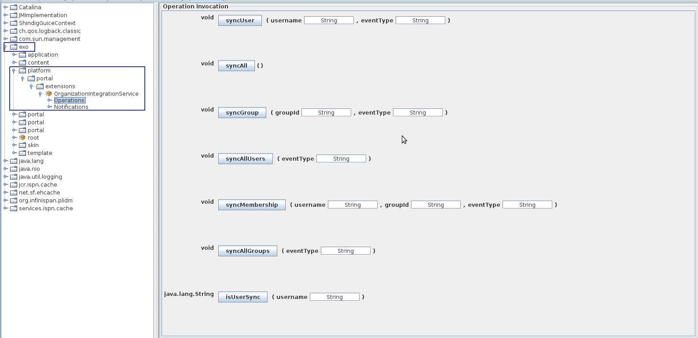

.. _LDAP:

#################
LDAP Integration
#################

    eXo Platform organizational objects - user, group and membership - can be
    stored in database or LDAP. This chapter introduces the integration
    between eXo Platform and LDAP in which LDAP takes the role of
    organizational data storage.

    Please notice that this integration is not SSO (Single Sign On). The
    fact that *an identity which is created via eXo Platform UI can be saved
    into the LDAP directory* differentiates this integration with SSO
    use cases.

    If SSO is what you need, read the :ref:`SSO chapter, eXo Add-ons guide <#eXoAddonsGuide.SSO>` that explains how eXo Platform works with
    LDAP through an SSO service like CAS or OpenAM.

    This chapter covers the following topics:

    -  :ref:`LDAP integration using PicketLink <LDAP.PicketLink>`
       How to configure eXo Platform to work with LDAP. The integration
       currently uses the PicketLink IDM framework.

    -  :ref:`eXo Platform configuration with a directory server <LDAP.Directoryserverintegration>`
       A step by step tutorial for eXo Platform configuration with a
       directory server: LDAP/AD.

    -  :ref:`Synchronization <LDAP.Synchronization>`
       If you have integrated eXo Platform with a populated LDAP directory,
       or when you manage users and groups via LDAP utilities, a service
       to synchronize between them is necessary.

    -  :ref:`LDAP integration using legacy organization
       services <LDAP.LegacyOrganizationService>`
       Before PicketLink, eXo Platform used some other organization service
       implementations. These are currently not used by default but are
       still supported.

    -  :ref:`Frequently asked questions <LDAP.FAQ>`
       How to resolve some possible issues of LDAP integration.
       
.. _LDAP.PicketLink:

=================================
LDAP integration using PicketLink
=================================

eXo Platform uses `PicketLink IDM
framework <https://www.jboss.org/picketlink/IDM>`__ that allows a very
flexible integration with an LDAP directory:

-  It can be plugged to an already populated LDAP directory, in
   read-only or read-write mode. The LDAP directory can contain users
   and groups, or only users.

-  It can be plugged into an empty LDAP directory.

-  Structure of users and groups in the LDAP directory can be finely
   customized.

-  Multiple directories can be used as single datasources for eXo Platform.

-  Users and groups can be managed via eXo Platform, or directly in the LDAP
   directory.

-  Many LDAP implementations are supported (RedHat Directory Server,
   Microsoft Active Directory, OpenDS, OpenLDAP).

**What you need to read from here?**

Take an overview of this guideline:

-  The :ref:`Quick start <LDAP.PicketLink.QuickStart>` section 
   simplifies the configuration by assuming that you will use an
   empty LDAP directory. Once you complete this Quick start, you can
   easily modify the configuration for other use cases.

-  The :ref:`Configuration review <LDAP.PicketLink.ConfigurationReview>`
   section explains configurations done in Quick start. This is a
   preparation that you should not bypass before getting further.

In reality, the use cases may be very different from one to one. To make
easy for readers, this tutorial is divided into four generic cases:

-  :ref:`LDAP users mapped into Platform <LDAP.PicketLink.MappingLDAPUser>`

-  :ref:`Platform users mapped into LDAP <LDAP.PicketLink.MappingPlatformUser>`

-  :ref:`LDAP groups mapped into Platform <LDAP.PicketLink.MappingLDAPGroup>`

-  :ref:`Platform groups mapped into LDAP <LDAP.PicketLink.MappingPlatformGroup>`

.. note:: The term "*LDAP users*\ " represents users who are created in 
          LDAP by LDAP utilities. The term "*Platform users*\ " 
          represents users who are created via eXo Platform UI. The 
          understanding is similar to "*LDAP groups*\ " and "*Platform 
          groups*\ ".
		  The PicketLink IDM framework does not distinguish between
		  LDAP-to-Platform and Platform-to-LDAP mapping, so the 
		  configuration is basically the same, but the effect of some 
		  parameters can be different. For example, the 
		  ``createEntryAttributeValues`` parameter has no effect on the 
		  LDAP-to-Platform mapping, thus is explained only in the 
		  Platform-to-LDAP mapping.

It should be easy to integrate eXo Platform with an LDAP directory if the
directory is well-organized and traditional. For complicated cases, you
can raise your question and resolution in `eXo Community Forum <http://community.exoplatform.com/portal/intranet/forum>`. 
Your contribution also helps enrich the :ref:`FAQ <LDAP.FAQ>`
section of this document.

If you want to know more about PicketLink IDM configuration, read
`PicketLink IDM Reference Guide <http://anonsvn.jboss.org/repos/picketlink/idm/downloads/docs/1.1.9.GA/ReferenceGuide/en-US/html_single/index.html>`__.

.. _LDAP.PicketLink.QuickStart:

Quick start
~~~~~~~~~~~~

.. note:: As of Platform 4.3, custom extensions do not require a jar so 
          the configuration is simpler. The old extensions with jar and 
          war still work, you do not need to change them.

You should set up an "empty" directory for this practice. The directory
should contain only the top DN, like:

::

    dn: dc=example,dc=com
    objectClass: top
    objectClass: domain
    dc: example

In this quick start, you configure Platform to write information of
users and groups into LDAP. It might not match your need exactly, but
after this start you have everything in an ldap-extension, then you can
adapt it by following the next sections.

For example, one of the use cases is that you already have a populated
directory. After this start, you will follow :ref:`LDAP users mapped into Platform <LDAP.PicketLink.MappingLDAPUser>` 
and :ref:`LDAP groups mapped into Platform <LDAP.PicketLink.MappingLDAPGroup>`.

Another note: the ldap-extension is technically a portal extension that
is described in :ref:`Developer guide <#PLFDevGuide.eXoAdd-ons.PortalExtension.Howto>`, 
but it does not require compilation, so administrators can create it 
without Maven.
If you are a developer, you can create a Maven project for it like your
other extensions.

1. Create your ``ldap-extension`` directory:

   ::

       ldap-extension
       |__ META-INF
           |__ exo-conf
               |__ configuration.xml
       |__ WEB-INF
           |__ conf
               |__ configuration.xml
               |__ organization
                   |__ idm-configuration.xml
                   |__ picketlink-idm-ldap-config.xml
                   |__ sync.xml
           |__ jboss-deployment-structure.xml
           |__ web.xml

2. Edit ``WEB-INF/conf/configuration.xml``:

   .. code:: xml

       <?xml version="1.0" encoding="ISO-8859-1"?>
       <configuration
          xmlns:xsi="http://www.w3.org/2001/XMLSchema-instance"
          xsi:schemaLocation="http://www.exoplatform.org/xml/ns/kernel_1_2.xsd http://www.exoplatform.org/xml/ns/kernel_1_2.xsd"
          xmlns="http://www.exoplatform.org/xml/ns/kernel_1_2.xsd">

           <import>war:/conf/organization/idm-configuration.xml</import>
       </configuration>

3. Copy content of the ``portal.war!/WEB-INF/conf/organization/idm-configuration.xml`` 
   file of eXo Platform to your ``idm-configuration.xml`` file, then 
   edit your file to replace:

.. code:: xml

    <value>war:/conf/organization/picketlink-idm/picketlink-idm-config.xml</value>

with the path to your ``picketlink-idm-ldap-config.xml`` file:

   .. code:: xml

       <value>war:/conf/organization/picketlink-idm-ldap-config.xml</value>

4. Copy content from one of PicketLink sample files to your ``picketlink-idm-ldap-config.xml`` 
   file.

The sample files are in
``portal.war!/WEB-INF/conf/organization/picketlink-idm/examples``.
Choose either of the following files:

-  ``picketlink-idm-msad-config.xml`` if you use MS Active Directory.

-  ``picketlink-idm-openldap-config.xml`` for OpenLDAP.

-  ``picketlink-idm-ldap-config.xml`` for others.

5. Modify the ``picketlink-idm-ldap-config.xml`` file according to your
   LDAP setup. You often need to change the following parameters:

   -  The *suffix* (``dc=test,dc=domain``, ``dc=my-domain,dc=com`` or
      ``dc=example,dc=com``) should be replaced with your real suffix in
      the whole file.

   -  **providerURL**

   -  **adminDN**

   -  **adminPassword**

6. Do the following sub-steps which are specified for Microsoft Active
   Directory (MSAD) only:

   i. Prepare a truststore file containing the valid certificate for 
      MSAD. It can be generated by the Linux command:

   ::

      keytool -import -file  certificate -keystore truststore

   ii. Edit the following parameters in the ``picketlink-idm-ldap-config.xml`` 
       file:

       -  **providerURL**: Should use SSL (ldaps://).

	   -  **customSystemProperties**: Give your truststore file path and
          password.

        .. code:: xml

                 <name>customSystemProperties</name>
                 <value>javax.net.ssl.trustStore=/path/to/msad.truststore</value>
                 <value>javax.net.ssl.trustStorePassword=password</value>

7. Uncomment the following entries in the ``idm-configuration.xml`` 
   file:

   -  **groupTypeMappings**

      .. code:: xml

          <entry>
              <key><string>/platform/*</string></key>
              <value><string>platform_type</string></value>
          </entry>
          <entry>
              <key><string>/organization/*</string></key>
              <value><string>organization_type</string></value>
          </entry>

   -  **ignoreMappedMembershipTypeGroupList**

      .. code:: xml

           <value>
              <string>/platform/*</string>
          </value>
          <value>
              <string>/organization/*</string>
          </value> 

This step enables mapping Platform groups (platform and organization -
that are predefined groups) to LDAP. If you bypass this step, only user
mapping is performed.

8. Edit ``META-INF/exo-conf/configuration.xml``:

   .. code:: xml

       <configuration xmlns:xsi="http://www.w3.org/2001/XMLSchema-instance" 
           xsi:schemaLocation="http://www.exoplaform.org/xml/ns/kernel_1_2.xsd http://www.exoplaform.org/xml/ns/kernel_1_2.xsd"
           xmlns="http://www.exoplaform.org/xml/ns/kernel_1_2.xsd">
           <external-component-plugins>
               <target-component>org.exoplatform.container.definition.PortalContainerConfig</target-component>
               <component-plugin>
                   <name>Add PortalContainer Definitions</name>
                   <set-method>registerChangePlugin</set-method>
                   <type>org.exoplatform.container.definition.PortalContainerDefinitionChangePlugin</type>
                   <priority>101</priority>
                   <init-params>
                       <values-param>
                           <name>apply.specific</name>
                           <value>portal</value>
                       </values-param>
                       <object-param>
                           <name>addDependencies</name>
                           <object type="org.exoplatform.container.definition.PortalContainerDefinitionChange$AddDependencies">
                               <field name="dependencies">
                                   <collection type="java.util.ArrayList">
                                       <value><string>ldap-extension</string></value>
                                   </collection>
                               </field>
                           </object>
                       </object-param>
                   </init-params>
               </component-plugin>
           </external-component-plugins>
       </configuration>

9. Edit ``WEB-INF/web.xml``:

   .. code:: xml

		<?xml version="1.0" encoding="UTF-8"?>
		<web-app version="3.0" metadata-complete="true"
			xmlns="http://java.sun.com/xml/ns/javaee" xmlns:xsi="http://www.w3.org/2001/XMLSchema-instance"
			xsi:schemaLocation="http://java.sun.com/xml/ns/javaee http://java.sun.com/xml/ns/javaee/web-app_3_0.xsd">
			<display-name>ldap-extension</display-name>
			<listener>
				<listener-class>org.exoplatform.container.web.PortalContainerConfigOwner</listener-class>
			</listener>
		</web-app>

   Make sure the right directory name, ``ldap-extension``, is configured
   in this step and the previous step.

10. Edit ``WEB-INF/jboss-deployment-structure.xml``:

    .. code:: xml

			<jboss-deployment-structure xmlns="urn:jboss:deployment-structure:1.2">
				<deployment>
					<dependencies>
						<module name="deployment.platform.ear" export="true"/>
					</dependencies>
				</deployment>
			</jboss-deployment-structure>

  
    This file is needed only in Platform JBoss and you can exclude it 
    for Tomcat, but it is alright if you include it anyway.

11. :ref:`Package and deploy <LDAP.PicketLink.QuickStart.Deployment>` 
    your ldap-extension into Platform.

12. Make sure the LDAP server is running, and start eXo Platform.

.. _LDAP.PicketLink.QuickStart.Deployment:

Packaging and deploying
------------------------

It is the standard way that you package (simply compress) the directory
into ``ldap-extension.war`` then copy it to:

-  ``$PLATFORM_TOMCAT_HOME/webapps`` for Tomcat.

-  ``$PLATFORM_JBOSS_HOME/standalone/deployments`` for JBoss.

To compress the directory into a .war (and decompress the .war for
editing), you can use any archiver tool that supports .war extension.
Because JDK is required to run eXo Platform, you should have it already.
So you can use the JDK built-in tool **jar**, as follows:

-  To compress, first go to **inside** ldap-extension directory:
   ``cd ldap-extension``

   Then run: ``jar cvf path/to/save/ldap-extension.war *``

-  To decompress, run: ``jar xvf path/to/ldap-extension.war``

.. note:: Do not include the ldap-extension folder itself into the ``.war.`` 
          The ``.war`` should contain META-INF and WEB-INF folders on 
          the top, it should not contain ldap-extension folder. That's 
          why you need to go to inside the directory first.

.. tip:: You should have ldap-extension packaged in .war when deploying 
         it to production. However when testing, if you feel 
         uncomfortable having to edit a .war, you can skip compressing 
         it. In Tomcat, just deploy the original folder 
         *ldap-extension*. In JBoss, rename it to ``ldap-extension.war``.

.. _LDAP.PicketLink.QuickStart.Testing:

Testing
--------

If the integration is successful, Platform users (like the predefined
*root*) and groups (sub-groups of */platform* and */organization*) will
be added to the LDAP tree. For example, assume the suffix is
``dc=example,dc=com`` and the directory is OpenLDAP, the *root* user
entry will look like:

::

    # root, People, portal, gatein, example.com
    dn: uid=root,ou=People,o=portal,o=gatein,dc=example,dc=com
    uid: root
    objectClass: top
    objectClass: inetOrgPerson
    userPassword:: Z3Ru
    mail: root@localhost
    cn: Root
    sn: Root

The */organization/executive-board* group entry will look like:

::

    # executive-board, Organization, portal, gatein, example.com
    dn: cn=executive-board,ou=Organization,o=portal,o=gatein,dc=example,dc=com
    objectClass: top
    objectClass: groupOfNames
    cn: executive-board
    member: uid=root,ou=People,o=portal,o=gatein,dc=example,dc=com

The whole directory is:

::

    # example.com
    dn: dc=example,dc=com

    # gatein, example.com
    dn: o=gatein,dc=example,dc=com

    # portal, gatein, example.com
    dn: o=portal,o=gatein,dc=example,dc=com

    # Platform, portal, gatein, example.com
    dn: ou=Platform,o=portal,o=gatein,dc=example,dc=com

    # Organization, portal, gatein, example.com
    dn: ou=Organization,o=portal,o=gatein,dc=example,dc=com

    # People, portal, gatein, example.com
    dn: ou=People,o=portal,o=gatein,dc=example,dc=com

    # administrators, Platform, portal, gatein, example.com
    dn: cn=administrators,ou=Platform,o=portal,o=gatein,dc=example,dc=com

    # users, Platform, portal, gatein, example.com
    dn: cn=users,ou=Platform,o=portal,o=gatein,dc=example,dc=com

    # guests, Platform, portal, gatein, example.com
    dn: cn=guests,ou=Platform,o=portal,o=gatein,dc=example,dc=com

    # web-contributors, Platform, portal, gatein, example.com
    dn: cn=web-contributors,ou=Platform,o=portal,o=gatein,dc=example,dc=com

    # management, Organization, portal, gatein, example.com
    dn: cn=management,ou=Organization,o=portal,o=gatein,dc=example,dc=com

    # executive-board, Organization, portal, gatein, example.com
    dn: cn=executive-board,ou=Organization,o=portal,o=gatein,dc=example,dc=com

    # employees, Organization, portal, gatein, example.com
    dn: cn=employees,ou=Organization,o=portal,o=gatein,dc=example,dc=com

    # root, People, portal, gatein, example.com
    dn: uid=root,ou=People,o=portal,o=gatein,dc=example,dc=com

.. _LDAP.PicketLink.ConfigurationReview:

Configuration review
~~~~~~~~~~~~~~~~~~~~~

This section is a comprehensive analysis of configurations you use in
:ref:`Quick start <LDAP.PicketLink.QuickStart>`. By reading
these thorough explanations, you will further understand the structure
and easily find out the configuration you want to edit. This will be a
good preparation for writing your own identity object types in next
tutorials.

**idm-configuration.xml**

In ``idm-configuration.xml``, the whole configuration is of eXo service.
The eXo service configuration is started by either:

-  A pair of *key* and *type* tags that looks like the following:

   .. code:: xml

       <component>
           <key>the_FQN_of_the_service_interface</key>
           <type>the_FQN_of_the_service_implementation</type>

-  Or an external-component-plugin tag that looks like the following:

   .. code:: xml

       <external-component-plugins>
           <target-component>the_FQN_of_the_service_implementation</target-component>

You mostly need to re-configure the two services below without changing
the default configuration of others:

-  ``org.exoplatform.services.organization.idm.PicketLinkIDMServiceImpl``

-  ``org.exoplatform.services.organization.idm.PicketLinkIDMOrganizationServiceImpl``

**PicketLinkIDMServiceImpl service**

The only one parameter you need to re-configure for this service:

.. code:: xml

    <component>
        <key>org.exoplatform.services.organization.idm.PicketLinkIDMService</key>
        <type>org.exoplatform.services.organization.idm.PicketLinkIDMServiceImpl</type>
        <init-params>
            <value-param>
                <name>config</name>
                <value>war:/conf/organization/picketlink-idm-openldap-acme-config.xml</value>
        ...

It points to the PicketLink IDM configuration file
(``picketlink-idm-ldap-config.xml`` in the Quick start section).

**PicketLinkIDMOrganizationServiceImpl service**

In Quick start, you re-configure this service to enable the group
mapping. The configuration matches a Platform group (like **/platform**)
with a *PicketLink IDM identity object type*. The object type then must
be configured in the PicketLink IDM configuration file. In Quick start,
you do not care about such configuration because you use the
pre-configured types (``platform_type`` and ``organization_type``):

.. code:: xml

    <field name="groupTypeMappings">
        <map type="java.util.HashMap">
            ...
            <entry>
                <key><string>/platform/*</string></key>
                <value><string>platform_type</string></key>
            </entry>
            <entry>
                <key><string>/organization/*</string></key>
                <value><string>organization_type</string></key>
            </entry>
            ...
        </map>
    </field>

**PicketLink IDM configuration file**

Let's see the ``picketlink-idm-ldap-config.xml`` structure:

.. code:: xml

    <realms>...</realms>
    <repositories>
        <repository><id>PortalRepository</id></repository>
        <repository><id>DefaultPortalRepository</id></repository>
    </repositories>
    <stores>
        <identity-stores>
            <identity-store><id>HibernateStore</id></identity-store>
            <identity-store><id>PortalLDAPStore</id></identity-store>
        </identity-stores>
    </stores>

-  **Realm**: You will not re-configure this part in this guideline.

-  **Repository**: Where your store and identity object type is used, by
   Id reference.

-  **Store**: The center part of this guideline, where you configure the
   LDAP connection, identity object types and all the attributes
   mapping.

With the aim of making this guideline easy to understand,
**DefaultPortalRepository** and **HibernateStore** that should not be
re-configured will be excluded, and the id references will be added.
Also, ``organization_type`` is eliminated because of its similarity to
``platform_type``. The structure is re-drawn as follows:

.. code:: xml

    <repositories>
        <repository>
            <id>PortalRepository</id>
            <identity-store-mappings>
                <identity-store-mapping>
                    <identity-store-id>PortalLDAPStore</identity-store-id>
                    <identity-object-types>
                        <identity-object-type>USER</identity-object-type>
                        <identity-object-type>platform_type</identity-object-type>
                    </identity-object-types>
                </identity-store-mapping>
            </identity-store-mappings>
        </repository>
    </repositories>
    <stores>
        <identity-stores>
            <identity-store>
                <id>PortalLDAPStore</id>
                <supported-identity-object-types>
                    <identity-object-type>
                        <name>USER</name>
                        <!-- attributes & options -->
                    </identity-object-type>
                    <identity-object-type>
                        <name>platform_type</name>
                        <!-- attributes & options -->
                    </identity-object-type>
                </supported-identity-object-types>
            </identity-store>
        </identity-stores>
    </stores>

**LDAP connection**

The LDAP connection (URL and credentials) is Store configuration. It is
provided in the *PortalLDAPStore*:

.. code:: xml

    <identity-store>
        <id>PortalLDAPStore</id>
        ...
        <options>
            <option>
                <name>providerURL</name>
                <value>ldap://localhost:389</value>
            </option>
            <option>
                <name>adminDN</name>
                <value>cn=admin,dc=example,dc=com</value>
            </option>
            <option>
                <name>adminPassword</name>
                <value>gtn</value>
            </option>
            ...
        </options>

**Read-only mode**

The Read-only mode is Repository configuration. It is an option of the
repository that prevents eXo Platform from writing to the LDAP directory. In
the Quick start, this option is omitted so the mode is read-write. To
enable the read-only mode, set the option to **true**:

.. code:: xml

    <repository>
        <id>PortalRepository</id>
        <identity-store-mappings>
            <identity-store-mapping>
                <identity-store-id>PortalLDAPStore</identity-store-id>
                <options>
                    <option>
                        <name>readOnly</name>
                        <value>true</value>
                    </option>
                </options>
            </identity-store-mapping>

**Placeholder - A note for OpenLDAP**

Ruled by OpenLDAP default *core* schema, the *member* attribute is a
MUST attribute of *groupOfNames* objectClass:

::

    objectclass ( 2.5.6.9 NAME 'groupOfNames'
        DESC 'RFC2256: a group of names (DNs)'
        SUP top STRUCTURAL
        MUST ( member $ cn )
        MAY ( businessCategory $ seeAlso $ owner $ ou $ o $ description ) )

Therefore, PicketLink IDM uses a **placeholder** entry as a fake member
in the creation of a groupOfNames. The placeholder DN should be
configured as an option of any group type:

.. code:: xml

    <identity-object-type>
        <name>platform_type</name>
        <options>
            <option>
                <name>parentMembershipAttributePlaceholder</name>
                <value>ou=placeholder,o=portal,o=gatein,dc=example,dc=com</value>
            </option>

.. _LDAP.PicketLink.MappingLDAPUser:

LDAP users mapped into Platform
~~~~~~~~~~~~~~~~~~~~~~~~~~~~~~~~

Assume you have a populated directory and a number of users under a base
DN - that can be anywhere in the tree. In reality, the user entries can
be branched in several bases, like this:

|image0|

Let's see how far the pre-configured *identity object type "USER"* can
solve this case:

**User attributes**

-  There are 3 attributes that should always be mapped (because they are
   mandatory in eXo Platform):

   +-------------+------------+-------------+
   | Platform    | OpenLDAP   | MSAD        |
   +=============+============+=============+
   | firstName   | cn         | givenName   |
   +-------------+------------+-------------+
   | lastName    | sn         | sn          |
   +-------------+------------+-------------+
   | email       | mail       | mail        |
   +-------------+------------+-------------+

   See the full list of :ref:`Platform user attributes <LDAP.PicketLink.PlatformUserAttributes>`.
   For example, if you want to map Platform attribute *user.jobtitle* to
   LDAP attribute *title*, the configuration looks like below:

   .. code:: xml

       <attributes>
           <attribute>
               <name>user.jobtitle</name>
               <mapping>title</mapping>
               <type>text</type>
               <isRequired>false</isRequired>
               <isMultivalued>false</isMultivalued>
               <isReadOnly>false</isReadOnly>
               <isUnique>false</isUnique>
           </attribute>
       </attributes>

-  The user identifier in eXo Platform is *username*, and needs to be mapped
   definitively. Therefore, do not include it in the attributes mapping.
   Instead, configure the LDAP attribute that should match it (**uid**
   in the following example):

   .. code:: xml

       <options>
           <option>
               <name>idAttributeName</name>
               <value>uid</value>
           </option>
       </options>

**context DNs (user divisions)**

-  You need to provide the location (DNs) where your LDAP users are
   located, in the **ctxDNs** (context DNs) option. Notice it accepts
   multiple values:

   .. code:: xml

       <option>
           <name>ctxDNs</name>
           <value>ou=People,o=acme,dc=example,dc=com</value>
           <value>ou=People,o=emca,dc=example,dc=com</value>
       </option>

Generally, the pre-configured type *USER* should work with easy
modification, for many divisions of users. The only condition is all the
divisions can share the same mapping.

To be clear, if ``o=acme`` users want their *telephoneNumber* to be
mapped to their Platform profile, while ``o=emca`` do not, the case
seems not to be supported. If it becomes a reality to you, the best way
is to raise your question in `eXo Community Forum <http://community.exoplatform.com/portal/intranet/forum>`__.

.. note:: When LDAP users and groups are mapped into eXo Platform, their data (for example, user profile, personal document, calendar) need to be created as if they were eXo Platform users and groups. See how to do that in :ref:`Synchronization <LDAP.Synchronization>`.

.. _LDAP.PicketLink.MappingPlatformUser:

Platform users mapped into LDAP
~~~~~~~~~~~~~~~~~~~~~~~~~~~~~~~~

In the Quick start, you see that the *root* user is stored in LDAP as an
entry like *uid=root,ou=People,o=portal,o=gatein,dc=example,dc=com*.

The eXo Platform users are stored in LDAP because the *readOnly* option is
omitted (or set to "*false*\ ") in the configuration. If you do not want
eXo Platform users to be stored in LDAP, set this option to "*true*\ " in
``picketlink-idm-ldap-config.xml``:

.. code:: xml

    <repository>
        <id>PortalRepository</id>
        <identity-store-mappings>
            <identity-store-mapping>
                <identity-store-id>PortalLDAPStore</identity-store-id>
                <options>
                    <option>
                        <name>readOnly</name>
                        <value>true</value>
                    </option>
                </options>
            </identity-store-mapping>

Now let's see how you can change the pre-configured identity type *USER*
in a real case.

**User attributes**

-  The following attributes are mandatory in the attribute mapping:

   +-------------+------------+-------------+
   | Platform    | OpenLDAP   | MSAD        |
   +=============+============+=============+
   | firstName   | cn         | givenName   |
   +-------------+------------+-------------+
   | lastName    | sn         | sn          |
   +-------------+------------+-------------+
   | email       | mail       | mail        |
   +-------------+------------+-------------+

   See the full list of `Platform user
   attributes <#PLFAdminGuide.LDAP.PicketLink.Platform_User_Attributes>`__.
   For example, if you want to map Platform attribute *user.jobtitle* to
   LDAP attribute *title*, the configuration looks like below:

   .. code:: xml

       <attributes>
           <attribute>
               <name>user.jobtitle</name>
               <mapping>title</mapping>
               <type>text</type>
               <isRequired>false</isRequired>
               <isMultivalued>false</isMultivalued>
               <isReadOnly>false</isReadOnly>
               <isUnique>false</isUnique>
           </attribute>
       </attributes>

-  The user identifier in Platform is *username*, and needs to be mapped
   definitively. Therefore, do not include it in the attributes mapping.
   Instead, define the LDAP attribute that should match it (**uid** in
   the following example):

   .. code:: xml

       <options>
           <option>
               <name>idAttributeName</name>
               <value>uid</value>
           </option>
       </options>

**context DNs (user divisions)**

The **ctxDNs** (context DNs) is the location in LDAP tree where you want
to store Platform users. It accepts multiple values but only **the first
value** is used in the Platform-to-LDAP mapping:

.. code:: xml

    <option>
        <name>ctxDNs</name>
        <value>ou=PlatformUsers,dc=example,dc=com</value>
        <value>ou=People,o=acme,dc=example,dc=com</value>
        <value>ou=People,o=emca,dc=example,dc=com</value>
    </option>

-  If ``ou=PlatformUsers`` does not exist in the tree, it will be
   created automatically.

**createEntryAttributeValues**

Required by LDAP, a user entry should have fixed objectClasses and
attributes that could not be mapped from Platform user attributes. You
can provide such objectClasses/attributes in
**createEntryAttributeValues** like below:

.. code:: xml

    <options>
        <option>
            <name>createEntryAttributeValues</name>
            <value>objectClass=top</value>
            <value>objectClass=inetOrgPerson</value>
            <value>sn= </value>
            <value>cn= </value>
        </option>
    </options>

.. note:: The samples of this option are different between OpenLDAP/MSAD and others, so you need to review it in the sample configuration file you are using.

.. _LDAP.PicketLink.MappingLDAPGroup:

LDAP groups mapped into Platform
~~~~~~~~~~~~~~~~~~~~~~~~~~~~~~~~~~

Assume you have a populated directory and some groups that should be
mapped into eXo Platform.

To be clear about the LDAP "group", it should be the "groupOfNames"
objectClass in OpenLDAP or "group" objectClass in MSAD. In OpenLDAP
(default core.schema), the groupOfNames must have the **member**
attribute.

Let's see the
``portal.war!/WEB-INF/conf/organization/picketlink-idm/examples/acme.ldif``
file. Under the context DN (``ou=Roles,o=acme,dc=example,dc=com``),
there are several groups:

::

    dn: cn=admins,ou=Roles,o=acme,dc=example,dc=com

    dn: cn=employees,ou=Roles,o=acme,dc=example,dc=com

The ``cn=admins`` group has a member:

::

    dn: cn=admins,ou=Roles,o=acme,dc=example,dc=com
    objectClass: top
    objectClass: groupOfNames
    cn: admins
    member: uid=admin,ou=People,o=acme,dc=example,dc=com

Once the group mapping is done, there should be a group like
**/acme/roles/admin** in eXo Platform. The group name is like a translation
of the dn, with the suffix (dc=example,dc=com) is eliminated. The
**admin** user should be a member of this group.

From the concepts, there are two things about group mapping:

-  The parent group (that is, */acme/roles*) must be created (in
   eXo Platform) manually.

-  In eXo Platform, a membership is expressed like this:
   *manager:/acme/roles/admin* in which *manager* is a *membership type*
   that is required to form a membership. Because the membership type is
   not an LDAP concept, for the creation of membership, you need to
   provide a default membership type in configuration.

In this tutorial, you will write your own group mapping configuration
but you should refer to sample files (in
``portal.war!/WEB-INF/conf/organization/picketlink-idm/examples`` - see
the files which have "acme" in name).

Notice the configuration involves 2 files: ``idm-configuration.xml`` and
``picketlink-idm-ldap-config.xml``.

1. Create your group type.

   - In the ``idm-configuration.xml`` file, the Platform parent group
     needs to be matched with your group type and be declared in
     **ignoreMappedMembershipTypeGroupList** field:

      .. code:: xml

		   <component>
			   <key>org.exoplatform.services.organization.OrganizationService</key>
			   <type>org.exoplatform.services.organization.idm.PicketLinkIDMOrganizationServiceImpl</type>
			   ...
				   <field name="groupTypeMappings">
					   <map type="java.util.HashMap">
						   ..
						   <entry>
							   <key><string>/acme/roles/*</string></key>
							   <value><string>acme_roles_type</string></value>
						   </entry>
					   </map>
				   </field>
				   ...
				   <field name="ignoreMappedMembershipTypeGroupList">
					   <collection type="java.util.ArrayList" item-type="java.lang.String">
						   <value><string>/acme/roles/*</string></value>
						   ...
					   </collection>
				   </field>
			   ...
		   </component>

   - As explained above, a default *membership type* needs to be
     configured. Some values you can use are *member, manager, editor*
     (those are pre-defined types in eXo Platform but can be re-configured or
     changed via UI).

      .. code:: xml

		   <field name="associationMembershipType">
			   <string>member</string>
		   </field>

   - In ``picketlink-idm-ldap-config.xml``, the group type is declared
     under the identity store *PortalLDAPStore*. First, write a few lines
     for the schema of the group type, you will fill up attributes and
     options later:

      .. code:: xml

		   <identity-store>
			   <id>PortalLDAPStore</id>
			   ...
			   <supported-identity-object-types>
				   <identity-object-type>
					   <name>acme_roles_type</name>
					   <relationships>
						   <relationship>
							   <relationship-type-ref>JBOSS_IDENTITY_MEMBERSHIP</relationship-type-ref>
							   <identity-object-type-ref>USER</identity-object-type-ref>
						   </relationship>
						   <relationship>
							   <relationship-type-ref>JBOSS_IDENTITY_MEMBERSHIP</relationship-type-ref>
							   <identity-object-type-ref>acme_roles_type</identity-object-type-ref>
						   </relationship>
					   </relationships>
					   <credentials/>
					   <attributes>
						   
					   </attributes>
					   <options>
						   
					   </options>
				   </identity-object-type>
			   </supported-identity-object-types>
		   </identity-store>

   - The group type needs to be referenced by the **PortalRepository**
     repository:

      .. code:: xml

		   <repository>
			   <id>PortalRepository</id>
			   ...
			   <identity-store-mapping>
				   <identity-store-id>PortalLDAPStore</identity-store-id>
				   <identity-object-types>
					   ...
					   <identity-object-type>acme_roles_type</identity-object-type>
					   ...
				   </identity-object-types>
			   </identity-store-mapping>
			   ...
		   </repository>

2. Add the attributes mapping.

   The Platform group "id" is *groupName*. Its mapping is definitive and 
   is configured by options, not attributes. The other attributes are 
   *label* and *description*, both are not mandatory. You can map them 
   to *cn* and *description* LDAP attributes.

   .. code:: xml

		<identity-object-type>
			<name>acme_roles_type</name>
			...
			<attributes>
				<attribute>
					<name>label</name>
					<mapping>cn</mapping>
					<type>text</type>
					<isRequired>false</isRequired>
					<isMultivalued>false</isMultivalued>
					<isReadOnly>true</isReadOnly>
				</attribute>
				<attribute>
					<name>description</name>
					<mapping>description</mapping>
					<type>text</type>
					<isRequired>false</isRequired>
					<isMultivalued>false</isMultivalued>
					<isReadOnly>false</isReadOnly>
				</attribute>
			</attributes>
		</identity-object-type>

3. Add options.

   - You need to configure the LDAP attribute that matches to group "id"
     (*groupName* in Platform). Traditionally, it is **cn**:

      .. code:: xml

		   <option>
			   <name>idAttributeName</name>
			   <value>cn</value>
		   </option>

   - The **ctxDNs** (context DNs) accepts multiple values and is the list
     of the base DNs under which the groups can be found.

      .. code:: xml

		   <option>
			   <name>ctxDNs</name>
			   <value>ou=Roles,o=acme,dc=example,dc=com</value>
		   </option>

      By default, all the groups under the base will be searched and
      mapped. You are able to add filter, for example to exclude the
      "**theduke**\ " group:

      .. code:: xml
  
		   <option>
			   <name>entrySearchFilter</name>
			   <value>(!(cn=theduke))</value>
		   </option>

   - In OpenLDAP or MSAD default schemas, the **member** attribute is used
     to list the dn of the members. However, your schema may use another
     attribute, so it should be configurable (if this option is absent,
     the group will be mapped without members):

      .. code:: xml

		   <option>
			   <name>parentMembershipAttributeName</name>
			   <value>member</value>
		   </option>

      Along with it, the ``isParentMembershipAttributeDN`` option must 
      be set to *true*:

      .. code:: xml

		   <option>
			   <name>isParentMembershipAttributeDN</name>
			   <value>true</value>
		   </option>

As explained above, the parent group ("*/acme/roles*\ " in this example)
needs to be created manually. You can create it after deploying your
custom extension and start the server.

.. note:: When the LDAP users and groups are mapped into eXo Platform, their data (for example, user profile, personal document, calendar) need to be created as if they were Platform users and groups. 
          See :ref:`Synchronization <LDAP.Synchronization>` for how-to.

.. _LDAP.PicketLink.MappingPlatformGroup:

Platform groups mapped into LDAP
~~~~~~~~~~~~~~~~~~~~~~~~~~~~~~~~~

In the Quick start, you see the children of **/platform** and
**/organization** groups are mapped to LDAP, like:

::

    dn: cn=administrators,ou=Platform,o=portal,o=gatein,dc=example,dc=com
    dn: cn=users,ou=Platform,o=portal,o=gatein,dc=example,dc=com
    dn: cn=guests,ou=Platform,o=portal,o=gatein,dc=example,dc=com
    dn: cn=web-contributors,ou=Platform,o=portal,o=gatein,dc=example,dc=com

That is corresponding to the configuration:

-  The **readOnly** option is set to **false**.

-  You have mapped Platform groups with group types:

   -  **/platform/\*** with **platform\_type**.

   -  **/organization/\*** with **organization\_type**.

There are some facts about this group mapping:

-  The mapping is done for the child groups, not for the configured
   group itself.

   As a result, if you want **/platform** to be created as a group entry
   in LDAP, you need to configure *the root group (/)*. Thus, the
   **/organization** (child of root) will be mapped too. There is no
   filter for this mapping.

-  The wildcard (\*) indicates that children at all levels will be
   mapped. Without it, only the children at level one are mapped.

   The hierarchical groups are turned into flat in group mapping. To be
   clear, if the **/platform/users** group has a child like
   **/platform/users/intranet**, the parent-child relationship is lost
   in translation into LDAP (although **cn=intranet** might be listed as
   member in **cn=users**):

   ::

       dn: cn=users,o=platform,o=acme,dc=my-domain,dc=com
       dn: cn=intranet,o=platform,o=acme,dc=my-domain,dc=com

   As a result, it will prevent you from creating
   **/platform/administrators/intranet** if **/platform/users/intranet**
   already exists.

-  Because of the difference between Organization Models, there is no
   way to store membership and membership type in LDAP exactly like the
   presentation of concepts in eXo Platform. See details later in the
   explanation of **associationMembershipType** option.

In this tutorial, you will write your own group type mapping, however it
uses the mapping between **/platform/\*** and **platform\_type** as
example so the configuration sample is the same to the Quick start.

Besides, the configuration is common for LDAP-to-Platform and
Platform-to-LDAP mapping (PicketLink IDM framework does not distinguish
between them), but the effect of some parameters is different, so you
need to read carefully even if you already read the LDAP-to-Platform
mapping. For example, the ``createEntryAttributeValues`` parameter has
no effect on the LDAP-to-Platform mapping.

Create your group type.

-  In ``idm-configuration.xml``, the Platform parent group needs to be
   matched with your group type and be declared in the
   **ignoreMappedMembershipTypeGroupList** field:

   .. code:: xml

       <component>
           <key>org.exoplatform.services.organization.OrganizationService</key>
           <type>org.exoplatform.services.organization.idm.PicketLinkIDMOrganizationServiceImpl</type>
           ...
               <field name="groupTypeMappings">
                   <map type="java.util.HashMap">
                       ..
                       <entry>
                           <key><string>/platform/*</string></key>
                           <value><string>platform_type</string></value>
                       </entry>
                   </map>
               </field>
               ...
               <field name="ignoreMappedMembershipTypeGroupList">
                   <collection type="java.util.ArrayList" item-type="java.lang.String">
                       <value><string>/platform/*</string></value>
                       ...
                   </collection>
               </field>
           ...
       </component>

-  Configure the **associationMembershipType** field.

   .. code:: xml

       <field name="associationMembershipType">
           <string>member</string>
       </field>

   In the Platform-to-LDAP mapping, it indicates which membership type
   can be stored in LDAP, or more exactly, which membership creation can
   trigger writing a "member" attribute in LDAP.

   For example, in eXo Platform, you add the **root** user to the
   **/platform/users** group with the membership type as **manager**.
   This membership (**manager:/platform/users**) is not stored in LDAP.
   Next you continue to add **root** to **/platform/users**, but with
   membership type as **member**. The type is configured for
   **associationMembershipType**, so this time an attribute is added to
   the group entry like this:

   ::

       dn: cn=users,o=platform,o=acme,dc=my-domain,dc=com
       ...
       member: uid=root,ou=People,o=acme,dc=my-domain,dc=com

   As said before, this attribute marks that root belongs to the group,
   but does not tell which membership type he has. The attribute name
   here is "member" because the **parentMembershipAttributeName** option
   is set to **member** that is not corresponding to
   **associationMembershipType**.

   Some values you can configure for **associationMembershipType** are
   *\*, member, manager, author, editor*. Those membership types are
   predefined in the eXo Platform configuration but can be re-configured or
   changed via UI, so you need to check them again. Note that the
   asterisk (\*) is treated like other types.

-  In ``picketlink-idm-ldap-config.xml``, the group type is declared
   under the identity store *PortalLDAPStore*. First write a few lines
   for the schema of the group type, then fill up attributes and options
   later:

   .. code:: xml

       <identity-store>
           <id>PortalLDAPStore</id>
           ...
           <supported-identity-object-types>
               <identity-object-type>
                   <name>platform_type</name>
                   <relationships>
                       <relationship>
                           <relationship-type-ref>JBOSS_IDENTITY_MEMBERSHIP</relationship-type-ref>
                           <identity-object-type-ref>USER</identity-object-type-ref>
                       </relationship>
                       <relationship>
                           <relationship-type-ref>JBOSS_IDENTITY_MEMBERSHIP</relationship-type-ref>
                           <identity-object-type-ref>platform_type</identity-object-type-ref>
                       </relationship>
                   </relationships>
                   <credentials/>
                   <attributes>
                       
                   </attributes>
                   <options>
                       
                   </options>
               </identity-object-type>
           </supported-identity-object-types>
       </identity-store>

-  The group type needs to be referenced by the **PortalRepository**
   repository:

   .. code:: xml

       <repository>
           <id>PortalRepository</id>
           ...
           <identity-store-mapping>
               <identity-store-id>PortalLDAPStore</identity-store-id>
               <identity-object-types>
                   ...
                   <identity-object-type>platform_type</identity-object-type>
                   ...
               </identity-object-types>
           </identity-store-mapping>
           ...
       </repository>

Add the attributes mapping.

The Platform group "id" is **groupName**. Its mapping is definitive and
is configured by options, not attributes. The other attributes are
*label* and *description*, both are not mandatory. You can map them to
*cn* and *description* LDAP attributes.

.. code:: xml

    <identity-object-type>
        <name>platform_type</name>
        ...
        <attributes>
            <attribute>
                <name>label</name>
                <mapping>cn</mapping>
                <type>text</type>
                <isRequired>false</isRequired>
                <isMultivalued>false</isMultivalued>
                <isReadOnly>true</isReadOnly>
            </attribute>
            <attribute>
                <name>description</name>
                <mapping>description</mapping>
                <type>text</type>
                <isRequired>false</isRequired>
                <isMultivalued>false</isMultivalued>
                <isReadOnly>false</isReadOnly>
            </attribute>
        </attributes>
    </identity-object-type>

Add options.

-  You need to configure the LDAP attribute that matches to group id
   (*groupName* in eXo Platform). Traditionally, it is *cn*:

   .. code:: xml

       <option>
           <name>idAttributeName</name>
           <value>cn</value>
       </option>

-  The **ctxDNs** (context DNs) indicates the parent entry under which
   the groups are created. If the parent entry does not exist, it will
   be created automatically. Although the option accepts multiple
   values, only **the first value** is used in the Platform-to-LDAP
   mapping.

   .. code:: xml

       <option>
           <name>ctxDNs</name>
           <value>o=platform,o=acme,dc=example,dc=com</value>
       </option>

-  In OpenLDAP or MSAD default schemas, the "member" attribute is used
   to list the dn of the members. However, your schema may use another
   attribute, so it should be configurable:

   .. code:: xml

       <option>
           <name>parentMembershipAttributeName</name>
           <value>member</value>
       </option>

-  Required by LDAP, a group entry should have fixed objectClasses and
   attributes that could not be mapped from the eXo Platform group
   attributes. You can provide such objectClasses/attributes in
   **createEntryAttributeValues** like below:

   .. code:: xml

       <option>
           <name>createEntryAttributeValues</name>
           <value>objectClass=top</value>
           <value>objectClass=groupOfNames</value>
       </option>

   The samples of this option are different between OpenLDAP/MSAD and
   others, so you need to review it in the sample configuration file you
   are using.

-  Particularly in OpenLDAP, the **member** is a MUST attribute to
   groupOfNames, so a **placeholder** is used (to be added as a member)
   to satisfy the rule:

   .. code:: xml

       <option>
           <name>parentMembershipAttributePlaceholder</name>
           <value>ou=placeholder,o=platform,o=acme,dc=my-domain,dc=com</value>
       </option>
       ...
       <option>
           <name>createEntryAttributeValues</name>
           ...
           <value>member=ou=placeholder,o=platform,o=acme,dc=my-domain,dc=com</value>
       </option>

.. _LDAP.PicketLink.MultipleDirectories:

Multiple directories
~~~~~~~~~~~~~~~~~~~~~

Follow this guide in case you want to connect to more than one LDAP
directories, for example, you have two OpenLDAP databases with suffixes
``dc=example,dc=com`` and ``dc=example,dc=net``.

Basically you will configure two identity stores and map them in the
``PortalRepository`` repository.

In this way, you can create different connections using different
hosts/ports, credentials, protocols (ldap/ldaps) and even different LDAP
implementations, for example, one is MSAD and the other is OpenLDAP.

.. code:: xml

    <repositories>
        <repository>
            <id>PortalRepository</id>
            <identity-store-mappings>
                <identity-store-mapping>
                    <identity-store-id>PortalLDAPStore</identity-store-id>
                    ...
                </identity-store-mapping>
                <identity-store-mapping>
                    <identity-store-id>PortalLDAPStore2</identity-store-id> <!-- the second store -->
                    ...
                </identity-store-mapping>
            </identity-store-mappings>
        </repository>
    </repositories>
    <stores>
        <identity-stores>
            <identity-store>
                <id>HibernateStore</id>
                ...
            </identity-store>
            <identity-store>
                <id>PortalLDAPStore</id>
                ...
            </identity-store>
            <identity-store>
                <id>PortalLDAPStore2</id> <!-- the second store -->
                ...
            </identity-store>
        </identity-stores>
    </stores>

.. note:: It is quite simple if all the LDAP stores are Read-only. But, in Read-Write mode it is important to be aware that all users and groups will be saved to only one store, and it should be the first store.

In other words, it is no use to set the second repository to the
Read-Write mode. When a user is created in eXo Platform, the identity object
will be saved in the first LDAP store if it is a Read-Write one. And if
not, it will be saved in IDM (SQL) database, not in second LDAP store at
all.

So for Read-Write mode, and assume you want to store platform groups in
LDAP, here is the suggested configuration:

-  In ``idm-configuration.xml``:

   .. code:: xml

       <field name="groupTypeMappings">
           <map type="java.util.HashMap">
               <entry>
                   <key><string>/</string></key>
                   <value><string>root_type</string></value>
               </entry>
               <entry>
                   <key><string>/platform/*</string></key>
                   <value><string>platform_type</string></value>
               </entry>
               <entry>
                   <key><string>/com/example/*</string></key>
                   <value><string>example_com_group_type</string></value>
               </entry>
               <entry>
                   <key><string>/net/example/*</string></key>
                   <value><string>example_net_group_type</string></value>
               </entry>
           </map>
       </field>
       <field name="ignoreMappedMembershipTypeGroupList">
           <collection type="java.util.ArrayList" item-type="java.lang.String">
               <value><string>/platform/*</string></value>
               <value><string>/com/example/*</string></value>
               <value><string>/net/example/*</string></value>
           </collection>
       </field>

-  In ``picketlink-idm-*.xml``:

   .. code:: xml

       <identity-store-mapping>
           <identity-store-id>PortalLDAPStore</identity-store-id>
           <identity-object-types>
               <identity-object-type>USER</identity-object-type>
               <identity-object-type>platform_type</identity-object-type>
               <identity-object-type>example_com_group_type</identity-object-type>
           </identity-object-types>
           <options>
               <option>
                   <name>readOnly</name>
                   <value>false</value>
               </option>
           </options>
       </identity-store-mapping>
       <identity-store-mapping>
           <identity-store-id>PortalLDAPStore2</identity-store-id>
           <identity-object-types>
               <identity-object-type>USER</identity-object-type>
               <identity-object-type>example_net_group_type</identity-object-type>
           </identity-object-types>
           <options>
               <option>
                   <name>readOnly</name>
                   <value>true</value>
               </option>
           </options>
       </identity-store-mapping>

**Some other considerations**:

-  If in LDAP directories there are two users with the same username,
   for example: ``uid=john,ou=Employees,dc=example,dc=com`` and
   ``uid=john,ou=People,dc=example,dc=net``, only one of them will be
   mapped into eXo Platform.

-  You should keep the groups and memberships separated between the two
   directories. For example:

   -  DO create ``/com/example`` to map with
      *example\_com\_group\_type*, and ``/net/example`` to map with
      *example\_net\_group\_type*.

   -  DON'T assign a user of a store to a group of the other store.

.. _LDAP.PicketLink.IDMConfiguration:

PicketLink IDM configuration
~~~~~~~~~~~~~~~~~~~~~~~~~~~~~

In addition to the full list of configurations in `PicketLink IDM
reference <http://anonsvn.jboss.org/repos/picketlink/idm/downloads/docs/1.1.9.GA/ReferenceGuide/en-US/html_single/index.html>`__,
this section explains some of them that aims at supporting common
interest of eXo Community.

.. _PLIDMConfiguration.entrySearchScope:

**Search scope (entrySearchScope option)**

The *entrySearchScope* option can be placed in identity object type,
like this:

.. code:: xml

    <option>
        <name>entrySearchScope</name>
        <value>subtree</value>
    </option>

In combination with *ctxDNs*, this option forms an LDAP query. It is
equivalent to the *scope* parameter of the ldapsearch command (-s in
OpenLDAP).

**Values**: subtree, object.

-  If the option is omitted, the search will return the children at
   level 1 of the ctxDNs - equivalent to ``-s one``.

-  Use ``subtree`` to search in the entire tree under ctxDNs. It is
   useful saving you from having to provide all the possible ctxDNs in
   configuration.

-  The ``object`` value is equivalent to ``-s base`` that examines only
   the ctxDNs itself. If the ctxDNs entry does not match the filter, the
   search result is zero.

::

    # o=acme,dc=example,dc=com
    # uid=user1,o=acme,dc=example,dc=com
    # ou=People,o=acme,dc=example,dc=com
    # uid=user2,ou=People,o=acme,dc=example,dc=com

Assume you are mapping the LDAP users in the tree above, using the
ctxDNs *o=acme,dc=example,dc=com*, then:

-  ``subtree``: user1 and user2 are mapped.

-  ``object``: no user is mapped.

-  If omitted: only user1 is mapped.

.. _LDAP.PicketLink.UserAttributes:

Platform user attributes
~~~~~~~~~~~~~~~~~~~~~~~~~~

The list of Platform user attribute names (the asterisk (\*) marks a
mandatory attribute):

+-------------------------------------------------+-------------------------------------+
| Name                                            | Description                         |
+=================================================+=====================================+
| *username (\*)*                                 | user id (login name)                |
+-------------------------------------------------+-------------------------------------+
| *firstName (\*)*                                | first name                          |
+-------------------------------------------------+-------------------------------------+
| *lastName (\*)*                                 | last name                           |
+-------------------------------------------------+-------------------------------------+
| *displayName*                                   | display name                        |
+-------------------------------------------------+-------------------------------------+
| *email (\*)*                                    | email (unique, user1@example.com)   |
+-------------------------------------------------+-------------------------------------+
| *user.name.given*                               | given name                          |
+-------------------------------------------------+-------------------------------------+
| *user.name.family*                              | family name                         |
+-------------------------------------------------+-------------------------------------+
| *user.name.nickName*                            | nick name                           |
+-------------------------------------------------+-------------------------------------+
| *user.bdate*                                    | birth day                           |
+-------------------------------------------------+-------------------------------------+
| *user.gender*                                   | "Male/Female"                       |
+-------------------------------------------------+-------------------------------------+
| *user.employer*                                 | employer                            |
+-------------------------------------------------+-------------------------------------+
| *user.department*                               | department                          |
+-------------------------------------------------+-------------------------------------+
| *user.jobtitle*                                 | job title                           |
+-------------------------------------------------+-------------------------------------+
| *user.language*                                 | language                            |
+-------------------------------------------------+-------------------------------------+
| *user.home-info.postal.name*                    | personal address                    |
+-------------------------------------------------+-------------------------------------+
| *user.home-info.postal.street*                  | personal address                    |
+-------------------------------------------------+-------------------------------------+
| *user.home-info.postal.city*                    | personal address                    |
+-------------------------------------------------+-------------------------------------+
| *user.home-info.postal.stateprov*               | personal address                    |
+-------------------------------------------------+-------------------------------------+
| *user.home-info.postal.postalcode*              | personal postal code                |
+-------------------------------------------------+-------------------------------------+
| *user.home-info.postal.country*                 | personal postal country             |
+-------------------------------------------------+-------------------------------------+
| *user.home-info.telecom.mobile.number*          | personal cell phone                 |
+-------------------------------------------------+-------------------------------------+
| *user.home-info.telecom.telephone.number*       | personal line number                |
+-------------------------------------------------+-------------------------------------+
| *user.home-info.online.email*                   | personal email                      |
+-------------------------------------------------+-------------------------------------+
| *user.home-info.online.uri*                     | personal page                       |
+-------------------------------------------------+-------------------------------------+
| *user.business-info.postal.name*                | office address                      |
+-------------------------------------------------+-------------------------------------+
| *user.business-info.postal.city*                | office address                      |
+-------------------------------------------------+-------------------------------------+
| *user.business-info.postal.stateprov*           | office address                      |
+-------------------------------------------------+-------------------------------------+
| *user.business-info.postal.postalcode*          | office postal code                  |
+-------------------------------------------------+-------------------------------------+
| *user.business-info.postal.country*             | office postal country               |
+-------------------------------------------------+-------------------------------------+
| *user.business-info.telecom.mobile.number*      | office mobile number                |
+-------------------------------------------------+-------------------------------------+
| *user.business-info.telecom.telephone.number*   | office landline number              |
+-------------------------------------------------+-------------------------------------+
| *user.business-info.online.email*               | business email                      |
+-------------------------------------------------+-------------------------------------+
| *user.business-info.online.uri*                 | business page                       |
+-------------------------------------------------+-------------------------------------+

.. _LDAP.Directoryserverintegration:

==================================================
eXo Platform configuration with a directory server
==================================================

In this guide, you will learn how to configure eXo Platform with a
directory server. It provides a step by step tutorial to help you
succeed the integration.

.. _SuppportedDS:

Supported directory servers
~~~~~~~~~~~~~~~~~~~~~~~~~~~~~

eXo Platform can be integrated with a variety of directory servers. 
For the 5.1 version, this is the list of the supported ones:

-  OpenLDAP.

-  Active directory: eXo Platform intregration with an Active directory 
   is only supported in **readOnly**.

-  OpenDJ.

Please refer to
`supported-environments <https://www.exoplatform.com/terms-conditions/supported-environments.pdf>`__
file for more details.

.. _StepByStepConfigureDS:

Step by step tutorial to configure eXo Platform with a directory server
~~~~~~~~~~~~~~~~~~~~~~~~~~~~~~~~~~~~~~~~~~~~~~~~~~~~~~~~~~~~~~~~~~~~~~~~

To configure eXo Platform with LDAP, you need to follow these steps:

1. In your custom extension, create this path if it does not exist
   ``$PLF\_HOME/webapps/custom-extension/WEB-INF/conf/organization`` (for
   Tomcat) and
   ``$PLF\_HOME/standalone/deployments/platform.ear/custom-extension/WEB-INF/conf/organization``
   (for Jboss).

2. Under this path, put the file `idm-configuration.xml <https://github.com/exo-samples/docs-samples/blob/master/ldap-extension/src/main/webapp/WEB-INF/conf/organization/idm-configuration.xml>`__

3. Uncomment the appropriate instruction from this
   `section <https://github.com/exo-samples/docs-samples/blob/master/ldap-extension/src/main/webapp/WEB-INF/conf/organization/idm-configuration.xml#L82-L100>`__
   defining the path of the picketlink configuration file corresponding 
   to the used LDAP and the desired mode (read/write or readOnly):

   -  If you want to configure with LDAP (OpenDJ) in readOnly mode, you
      should uncomment this section:

      .. code:: xml

          <!--Sample LDAP config-->
              <value>war:/conf/organization/picketlink-idm/picketlink-idm-ldap-config.xml</value>

      and set the variable

      .. code:: xml

          <isReadOnly>false</isReadOnly>

      to true in
      `picketlink-idm-ldap-config.xml <https://github.com/exo-samples/docs-samples/blob/master/ldap-extension/src/main/webapp/WEB-INF/conf/organization/picketlink-idm/picketlink-idm-ldap-config.xml#L193-L209>`__
      for each attribute.

   -  If you want to configure with LDAP (OpenDJ) in read/Write mode, 
      you should uncomment this section:

      .. code:: xml

          <!--Sample LDAP config-->
              <value>war:/conf/organization/picketlink-idm/picketlink-idm-ldap-config.xml</value>

      and set the variable

      .. code:: xml

          <isReadOnly>false</isReadOnly>

      to false in
      `picketlink-idm-ldap-config.xml <https://github.com/exo-samples/docs-samples/blob/master/ldap-extension/src/main/webapp/WEB-INF/conf/organization/picketlink-idm/picketlink-idm-ldap-config.xml#L193-L209>`__
      for each attribute.

   -  If you want to configure with Active Directory in readOnly mode, 
      you should uncomment this section:

      .. code:: xml

          <!--MSAD Read Only "ACME" LDAP Example-->
              <value>war:/conf/organization/picketlink-idm/picketlink-idm-msad-readonly-config.xml</value>

      and set the variable

      .. code:: xml

          <isReadOnly>false</isReadOnly>

      to true in
      `picketlink-idm-msad-readonly-config.xml <https://github.com/exo-samples/docs-samples/blob/master/ldap-extension/src/main/webapp/WEB-INF/conf/organization/picketlink-idm/picketlink-idm-msad-readonly-config.xml#L192-L208>`__
      for each attribute.

      -  If you want to configure with Active Directory in read/write mode,
         you should uncomment this section:
 
      .. code:: xml

          <!--MSAD Read Only "ACME" LDAP Example-->
              <value>war:/conf/organization/picketlink-idm/picketlink-idm-msad-config.xml</value>s

      and set the variable

      .. code:: xml

          <isReadOnly>false</isReadOnly>

      to false in
      `picketlink-idm-msad-config.xml <https://github.com/exo-samples/docs-samples/blob/master/ldap-extension/src/main/webapp/WEB-INF/conf/organization/picketlink-idm/picketlink-idm-msad-config.xml#L192>`__
      for each attribute.

4. Configure the needed settings: access URL to the directory server, 
   login and password.

   -  For LDAP (OpenDJ, Open LDAP): Configure this section in
      `picketlink-idm-ldap-config.xml <https://github.com/exo-samples/docs-samples/blob/master/ldap-extension/src/main/webapp/WEB-INF/conf/organization/picketlink-idm/picketlink-idm-ldap-config.xml>`__
      file.

      .. code:: xml

			   <option>
				   <name>providerURL</name>
				   <value>ldap://localhost:1389</value>
			   </option>
			   <option>
				   <name>adminDN</name>
				   <value>cn=Directory Manager</value>
				</option>
				<option>
				   <name>adminPassword</name>
				   <value>password</value>
			   </option>

   -  For Active directory, configure this section in either
      `picketlink-idm-msad-config.xml <https://github.com/exo-samples/docs-samples/tree/master/ldap-extension/src/main/webapp/WEB-INF/conf/organization/picketlink-idm/picketlink-idm-msad-config.xml>`__
      or
      `picketlink-idm-msad-readonly-config.xml <https://github.com/exo-samples/docs-samples/tree/master/ldap-extension/src/main/webapp/WEB-INF/conf/organization/picketlink-idm/picketlink-idm-msad-readonly-config.xml>`__.

      .. code:: xml

                 
			   <option>
				   <name>providerURL</name>
				   <value>[ldap|ldaps]://[msad-host]:[port]</value>
			   </option>
			   <option>
				   <name>adminDN</name>
				   <value>TEST\Administrator</value>
			   </option>
			   <option>
				   <name>adminPassword</name>
				   <value>[adminPasswordValue]</value>
			   </option>

5. If you want to import users from **multiple trees in the same 
   LDAP/AD**, you should set multiple values for the ``ctxDNs`` as below:

   .. code:: xml

              
			<option>
				<name>ctxDNs</name>
				<value>ou=Organization,o=gatein,dc=test,dc=domain</value>
				<value>ou=Organization2,o=gatein2,dc=test2,dc=domain2</value>
				....
				<value>ou=Organizationx,o=gateinx,dc=testx,dc=domainx</value>
			</option>

The users of the different trees will be mapped in the platform.

.. _UsersGroupsSynchronization:

Users and groups synchronization
~~~~~~~~~~~~~~~~~~~~~~~~~~~~~~~~~~

In case you connected eXo Platform to an already populated LDAP/AD, the users
are added to the platfrom but are inactive. Logging in with an inactive
user avtivates him. This solution is not efficient in case of a big
number of users

To activate a big number of users, you should follow the below
procedure.

1. In your custom extension, create this path if it does not exist
   ``$PLF\_HOME/webapps/custom-extension/WEB-INF/conf/platform`` 
   (for Tomcat) and ``$PLF\_HOME/standalone/deployments/platform.ear/custom-extension/WEB-INF/conf/platform``
   (for Jboss).

2. Add under that path the file
   `organization-integration-configuration.xml <https://github.com/exo-samples/docs-samples/blob/master/ldap-extension/src/main/webapp/WEB-INF/conf/platform/organization-integration-configuration.xml>`__.

3. In the file
   `configuration.xml <https://github.com/exo-samples/docs-samples/blob/master/ldap-extension/src/main/webapp/META-INF/exo-conf/configuration.xml>`__,
   add the import instruction:

   .. code:: xml

           <import>war:/conf/platform/organization-integration-configuration.xml</import>

4. After starting the server, use the following REST services url to 
   make the synchronisation of:

   -  A single user:

      ::

              /portal/rest/management/orgsync/syncUser?username=USERNAME&eventType=EVENT

   -  All users:

      ::

              /portal/rest/management/orgsync/syncAllUser?eventType=EVENT

   -  A single group:

      ::

              /portal/rest/management/orgsync/syncGroup?groupId=GROUP_ID&eventType=EVENT

   -  All groups:

      ::

              /portal/rest/management/orgsync/syncAllGroups?eventType=EVENT

   -  All users and groups:

      ::

              /portal/rest/management/orgsync/syncAll

   Where:

   -  ``USERNAME``\ should be replaced by the username of the user to be
      activated.

   -  ``GROUP_ID``\ should be replaced by the name of the group to be
      activated.

   -  ``EVENT``\ should be replaced by one of this three events:

      -  ADDED: When the user or the group to be activated is newly added.

      -  UPDATED: When the user or the group to be synchronized is
         modified.

      -  DELETED: When the user or the group is deleted from the
         organization.

5. You can use JMX instead of REST services URLs by invoking the
   appropriate operation and setting the corresponding event (ADDED,
   UPDATED or DELETED).

|image1|

.. _LDAP.Synchronization:

===============
Synchronization
===============

When you have integrated eXo Platform with a populated directory, or you
manage users and groups via LDAP utilities, use
``OrganizationIntegrationService`` that takes care the LDAP users and
groups as if they were original Platform users and groups.

To be clear, when a user is registered via Platform UI, a *user creation
event* is known and handled by the *user listener*. This listener makes
sure that the necessary data, like a folder for personal documents, will
be created. In case an LDAP user is mapped into Platform, the event is
not known by the listener so the folder will be missing until you run
the ``OrganizationIntegrationService`` that invokes the user listener to
check and create necessary data.

.. note:: During the synchronization, LDAP users are granted the *member:/platform/users* membership so that they can access the Intranet page.

The FQN of the service is
org.exoplatform.platform.organization.integration.OrganizationIntegrationService.

Generally, once you configure it, the service runs automatically. It
runs when the server starts and when a user/group/membership is created
or deleted.

The service is also exposed via REST and JMX, so you can call its
operations, like ``syncUser`` or ``syncGroup``, anytime you want.

To be more flexible, eXo Platform provides the two other services:

-  org.exoplatform.platform.organization.integration.FirstLoginListener

   This service can be configured to run at the first login of a user.
   It always calls the ``syncUser`` method of the
   OrganizationIntegrationService.

-  org.exoplatform.platform.organization.integration.OrganizationIntegrationJob

   This service can be configured to run as a scheduled job. It always
   calls the ``syncAll`` method of the OrganizationIntegrationService.

.. _ActivateOrganizationIntegrationService:

Activating the OrganizationIntegrationService
~~~~~~~~~~~~~~~~~~~~~~~~~~~~~~~~~~~~~~~~~~~~~~~

To activate the service, add new configuration in your
:ref:`ldap-extension <LDAP.PicketLink.QuickStart>`.

1. Create the ``WEB-INF/conf/organization/sync.xml`` file in your custom
   extension project, with the following content:

   .. code:: xml

		<configuration>
			<component>
				<type>org.exoplatform.platform.organization.integration.OrganizationIntegrationService</type>
				<init-params>
					<value-param>
						<name>workspace</name>
						<value>collaboration</value>
					</value-param>
					<value-param>
						<name>homePath</name>
						<value>/</value>
					</value-param>
					<value-param>
						<name>synchronizeGroups</name>
						<value>true</value>
					</value-param>
				</init-params>
			</component>
			
			<external-component-plugins>
				<target-component>org.exoplatform.services.organization.OrganizationService</target-component>
				<component-plugin>
					<name>organization.initializer.group.event.listener</name>
					<set-method>addListenerPlugin</set-method>
					<type>org.exoplatform.platform.organization.integration.NewGroupListener</type>
					<description>description</description>
				</component-plugin>
				<component-plugin>
					<name>organization.initializer.user.event.listener</name>
					<set-method>addListenerPlugin</set-method>
					<type>org.exoplatform.platform.organization.integration.NewUserListener</type>
					<description>description</description>
				</component-plugin>
				<component-plugin>
					<name>organization.initializer.membership.event.listener</name>
					<set-method>addListenerPlugin</set-method>
					<type>org.exoplatform.platform.organization.integration.NewMembershipListener</type>
					<description>description</description>
				</component-plugin>
				<component-plugin>
					<name>organization.initializer.profile.event.listener</name>
					<set-method>addListenerPlugin</set-method>
					<type>org.exoplatform.platform.organization.integration.NewProfileListener</type>
					<description>description</description>
				</component-plugin>
			</external-component-plugins>

			<external-component-plugins>
				<target-component>org.exoplatform.services.listener.ListenerService</target-component>
				<component-plugin>
					<name>exo.core.security.ConversationRegistry.register</name>
					<set-method>addListener</set-method>
					<type>org.exoplatform.platform.organization.integration.FirstLoginListener</type>
				</component-plugin>
			</external-component-plugins>
		</configuration>

2. Edit ``WEB-INF/conf/configuration.xml`` to import the ``sync.xml`` file:

   .. code:: xml

       <import>war:/conf/organization/sync.xml</import>

Some remarks:

-  The ``synchronizeGroups`` parameter is set to **true**. This enables
   group synchronization at the server startup.

-  The FirstLoginListener is configured. This makes sure that an LDAP
   user is enabled to access the Intranet page automatically when he
   logs in eXo Platform for the first time.

-  The Job Scheduler is not configured yet. You will configure it later.

**Testing**

After deploying your ldap-extension in eXo Platform, start the server. Next,
log in as *root* and browse the URL:
http://mycompany.com:8080/rest/management/orgsync (change the host and
port if needed). You should receive the list of methods of the
OrganizationIntegrationService.

If you enter the URL:
http://mycompany.com:8080/rest/management/orgsync/syncAll, the
synchronization will run for all users and groups.

.. note:: In the case of :ref:`LDAP groups mapped intoPlatform <LDAP.PicketLink.MappingLDAPGroup>`, 
          you noticed that parent groups, such as **/acme/roles** need 
          to be created manually. If the OrganizationIntegration service 
          is activated while the parent groups are not created yet, it 
          may throw some exceptions at the startup, but it is not a 
          problem.

.. _RESTandJMX:

Using REST and JMX
~~~~~~~~~~~~~~~~~~~

Using REST or JMX, you can call methods of
OrganizationIntegrationService anytime you want.

.. _REST:

Using REST
-----------

You just need to log in as an admin (for example, **root**), and open
URL in your browser:
*http://mycompany.com:8080/rest/management/orgsync/syncUser?username=user100&eventType=ADDED*.
In which:

-  ``username`` is a method (also called operation).

-  ``username`` and ``eventType`` are parameters. ``eventType`` accepts
   three values: ADDED, UPDATED and DELETED.

Here is the full list of operations and their examples (common for REST
and JMX, although the examples are REST URLs):

+----------------+-----------------------------------------------------------+
| Operation      | Examples                                                  |
+================+===========================================================+
| syncAll        | /rest/management/orgsync/syncAll                          |
+----------------+-----------------------------------------------------------+
| syncAllUsers   | /rest/management/orgsync/syncAllUsers?eventType=DELETED   |
+----------------+-----------------------------------------------------------+
| syncMembership | /rest/management/orgsync/syncMembership?username=root&gro |
|                | upId=/platform/users&eventType=ADDED                      |
+----------------+-----------------------------------------------------------+
| syncAllGroups  | /rest/management/orgsync/syncAllGroups?eventType=UPDATED  |
+----------------+-----------------------------------------------------------+
| syncUser       | /rest/management/orgsync/syncUser?username=user100&eventT |
|                | ype=DELETED                                               |
+----------------+-----------------------------------------------------------+
| syncGroup      | /rest/management/orgsync/syncGroup?groupId=/acme/roles/fo |
|                | o&eventType=DELETED                                       |
+----------------+-----------------------------------------------------------+

.. _JMX:

Using JMX
----------

You need a JMX browser like
`JConsole <http://docs.oracle.com/javase/6/docs/technotes/guides/management/jconsole.html>`__.
JConsole is JDK built-in and if you connect with the eXo Platform server
locally, you do not need any installation or configuration.

.. note:: In case you want to connect to eXo Platform remotely or to secure your JMX connection, you should read the :ref:`JMX guideline <Management.Introduction>`.

The MBean name of the OrganizationIntegrationService is
*exo:portal=portal,service=extensions,name=OrganizationIntegrationService,type=platform*,
like in the screenshot below:

.. _ScheduledSynchronization:

Scheduled synchronization
~~~~~~~~~~~~~~~~~~~~~~~~~~

eXo Platform provides a class that can be configured as a scheduled job. When
it runs, it calls the ``syncAll`` method of the
OrganizationIntegrationService.

To configure the job, add the following configuration to your
``sync.xml``:

.. code:: xml

    <external-component-plugins>
        <target-component>org.exoplatform.services.scheduler.JobSchedulerService</target-component>
        <component-plugin>
            <name>OrgInitializerCronJob</name>
            <set-method>addCronJob</set-method>
            <type>org.exoplatform.services.scheduler.CronJob</type>
            <description>Schedule the organization integration operation</description>
            <init-params>
                <properties-param>
                    <name>cronjob.info</name>
                    <description>Invoke initializer periodically</description>
                    <property name="jobName" value="OrgInitializerCronJob"/>
                    <property name="groupName" value="group"/>
                    <property name="job" value="org.exoplatform.platform.organization.integration.OrganizationIntegrationJob"/>
                    <property name="expression" value="0 45 23 * * ? *"/>
                </properties-param>
            </init-params>
        </component-plugin>
    </external-component-plugins>

The only parameter you need to re-configure is the *expression* that
schedules when the job is fired.

.. note:: Here provided just a short explanation and some examples of the *expression* so that you can pick up one quickly. 
          To learn its syntax, read `CRON Expression documentation <http://www.quartz-scheduler.org/docs/tutorial/TutorialLesson06.html>`__.

**Cron expression examples**

An expression consists of seven sub-expressions separated by a white
space. For being easily recognized, in the following tables, each
sub-expression is written in a column (the seventh sub is optional):

+--------+--------+--------+--------+--------+--------+--------+----------------------------+
| Second | Minute | Hours  | Day-of | Month  | Day-of | Year   | Description                |
| s      | s      |        | -Month |        | -Week  |        |                            |
+========+========+========+========+========+========+========+============================+
| 0      | 45     | 23     | ?      | \*     | \*     | \*     | 23:45 every day            |
+--------+--------+--------+--------+--------+--------+--------+----------------------------+
| 0      | 45     | 23     | ?      | \*     | SUN    |        | 23:45 every Sunday         |
+--------+--------+--------+--------+--------+--------+--------+----------------------------+
| 0      | 45     | 23     | ?      | \*     | 2-7    |        | 23:45 every days of the    |
|        |        |        |        |        |        |        | week except Sunday         |
+--------+--------+--------+--------+--------+--------+--------+----------------------------+
| 0      | 45     | 23     | ?      | \*     | TUE,TH |        | 23:45 every Tuesday and    |
|        |        |        |        |        | U      |        | Thursday                   |
+--------+--------+--------+--------+--------+--------+--------+----------------------------+
| 0      | 45     | 23     | ?      | \*     | SUNL   |        | 23:45 the last Sunday of   |
|        |        |        |        |        |        |        | every months               |
+--------+--------+--------+--------+--------+--------+--------+----------------------------+
| 0      | 45     | 23     | 1      | \*     | ?      |        | 23:45, the 1st day of      |
|        |        |        |        |        |        |        | every months               |
+--------+--------+--------+--------+--------+--------+--------+----------------------------+
| 0      | 45     | 23     | L      | \*     | ?      |        | 23:45, the last day of     |
|        |        |        |        |        |        |        | every months               |
+--------+--------+--------+--------+--------+--------+--------+----------------------------+
| 0      | 0/15   | \*     | ?      | \*     | \*     | \*     | once per 15 minutes,       |
|        |        |        |        |        |        |        | starting from the minute 0 |
+--------+--------+--------+--------+--------+--------+--------+----------------------------+

**Testing**

The job calls the ``SyncAll`` method. When it runs, you will see the
following logs:

::

    Start all Organizational model synchronization. [o.e.p.o.i.OrganizationIntegrationJob<DefaultQuartzScheduler_Worker-4>]
    Organizational model synchronization finished successfully. [o.e.p.o.i.OrganizationIntegrationJob<DefaultQuartzScheduler_Worker-4>]

For testing, you can configure it to run every 1 minute by using the
expression: ``0 0/1 * * * ? *``.

.. _LDAP.LegacyOrganizationService:

===================================================
LDAP integration using legacy organization services
===================================================

.. warning:: The legacy implementation of the Organization service uses MD5 hashing for password encryption. Thus it is considered unsecure and will be removed in future.

In Platform 4, it is supported for only users who have been using it
since older versions. New users should never use this implementation.

1. Create a new ``configuration.xml`` file under the following directory
   and with the following content:

   -  ``$PLATFORM_TOMCAT_HOME/gatein/conf/portal/portal`` (Tomcat).

   -  ``$PLATFORM_JBOSS_HOME/standalone/configuration/gatein/portal/portal``
   (JBoss).

   .. code:: xml

		<configuration xmlns="http://www.exoplatform.org/xml/ns/kernel_1_2.xsd" xmlns:xsi="http://www.w3.org/2001/XMLSchema-instance" xsi:schemaLocation="http://www.exoplatform.org/xml/ns/kernel_1_2.xsd http://www.exoplatform.org/xml/ns/kernel_1_2.xsd">
			<import>legacy-organization-configuration.xml</import>
			<!-- Remove unused PicketLink IDM Services -->
			<remove-configuration>org.exoplatform.services.organization.idm.PicketLinkIDMCacheService</remove-configuration>
			<remove-configuration>org.exoplatform.services.organization.idm.PicketLinkIDMService</remove-configuration>
		</configuration>

2. Create a new ``legacy-organization-configuration.xml`` file in the 
   same directory, and configure it as one of three data models: 
   Hibernate, LDAP or MS Active Directory.

   -  **Hibernate**

      .. code:: xml

		   <configuration xmlns="http://www.exoplatform.org/xml/ns/kernel_1_2.xsd" xmlns:xsi="http://www.w3.org/2001/XMLSchema-instance" xsi:schemaLocation="http://www.exoplatform.org/xml/ns/kernel_1_2.xsd http://www.exoplatform.org/xml/ns/kernel_1_2.xsd">
			   <component>
				   <key>org.exoplatform.services.organization.OrganizationService</key>
				   <type>org.exoplatform.services.organization.hibernate.OrganizationServiceImpl</type>
			   </component>
			   <external-component-plugins>
				   <target-component>org.exoplatform.services.database.HibernateService</target-component>
				   <component-plugin> 
					   <name>add.hibernate.annotations</name>
					   <set-method>addPlugin</set-method>
					   <type>org.exoplatform.services.database.impl.AddHibernateMappingPlugin</type>
					   <init-params>
						   <values-param>
							   <name>hibernate.annotations</name>
							   <value>org.exoplatform.services.organization.impl.UserImpl</value>
							   <value>org.exoplatform.services.organization.impl.MembershipImpl</value>
							   <value>org.exoplatform.services.organization.impl.GroupImpl</value>
							   <value>org.exoplatform.services.organization.impl.MembershipTypeImpl</value>
							   <value>org.exoplatform.services.organization.impl.UserProfileData</value>
						   </values-param>
					   </init-params>
				   </component-plugin>
			   </external-component-plugins>
			   <import>classpath:/conf/portal/organization-configuration.xml</import>    
		   </configuration>

   -  **LDAP**

      You need to change the *providerURL, rootdn and password* to match
      your LDAP setup. Also, change the domain *DC=exoplatform,DC=org*
      everywhere to match your top DN.

      .. code:: xml

		   <configuration xmlns="http://www.exoplatform.org/xml/ns/kernel_1_2.xsd" xmlns:xsi="http://www.w3.org/2001/XMLSchema-instance" xsi:schemaLocation="http://www.exoplatform.org/xml/ns/kernel_1_2.xsd http://www.exoplatform.org/xml/ns/kernel_1_2.xsd">
			   <component>
				   <key>org.exoplatform.services.ldap.LDAPService</key>
				   <type>org.exoplatform.services.ldap.impl.LDAPServiceImpl</type>
				   <init-params>
					   <object-param>
						   <name>ldap.config</name>
						   <description>Default ldap config</description>
						   <object type="org.exoplatform.services.ldap.impl.LDAPConnectionConfig">         
							   <field name="providerURL"><string>ldap://127.0.0.1:389,10.0.0.1:389</string></field>
							   <field name="rootdn"><string>CN=Manager,DC=exoplatform,DC=org</string></field>
							   <field name="password"><string>secret</string></field>        
							   <field name="version"><string>3</string></field>
							   <field name="minConnection"><int>5</int></field>
							   <field name="maxConnection"><int>10</int></field>     
							   <field name="referralMode"><string>follow</string></field>  
							   <field name="serverName"><string>default</string></field>
						   </object>
					   </object-param>
				   </init-params>
			   </component>
			   <component>
				   <key>org.exoplatform.services.organization.OrganizationService</key>
				   <type>org.exoplatform.services.organization.ldap.OrganizationServiceImpl</type>
				   <component-plugins>
					   <component-plugin>
						   <name>init.service.listener</name>
						   <set-method>addListenerPlugin</set-method>
						   <type>org.exoplatform.services.organization.ldap.OrganizationLdapInitializer</type>
						   <description>this listener populate organization ldap service create default dn</description>      
					   </component-plugin>  
				   </component-plugins> 
				   <init-params>
					   <value-param>
						   <name>ldap.userDN.key</name>
						   <description>The key used to compose user DN</description>
						   <value>cn</value>
					   </value-param>
					   <object-param>
						   <name>ldap.attribute.mapping</name>
						   <description>ldap attribute mapping</description>
						   <object type="org.exoplatform.services.organization.ldap.LDAPAttributeMapping">                
							   <field name="userLDAPClasses"><string>top,person,organizationalPerson,inetOrgPerson</string></field>
							   <field name="profileLDAPClasses"><string>top,organizationalPerson</string></field>
							   <field name="groupLDAPClasses"><string>top,organizationalUnit</string></field>
							   <field name="membershipTypeLDAPClasses"><string>top,organizationalRole</string></field>
							   <field name="membershipLDAPClasses"><string>top,groupOfNames</string></field>
							   <field name="baseURL"><string>dc=exoplatform,dc=org</string></field>
							   <field name="groupsURL"><string>ou=groups,ou=portal,dc=exoplatform,dc=org</string></field>
							   <field name="membershipTypeURL"><string>ou=memberships,ou=portal,dc=exoplatform,dc=org</string></field>
							   <field name="userURL"><string>ou=users,ou=portal,dc=exoplatform,dc=org</string></field>
							   <field name="profileURL"><string>ou=profiles,ou=portal,dc=exoplatform,dc=org</string></field>
							   <field name="userUsernameAttr"><string>uid</string></field>
							   <field name="userPassword"><string>userPassword</string></field>
							   <field name="userFirstNameAttr"><string>givenName</string></field>
							   <field name="userLastNameAttr"><string>sn</string></field>
							   <field name="userDisplayNameAttr"><string>displayName</string></field>
							   <field name="userMailAttr"><string>mail</string></field>
							   <field name="userObjectClassFilter"><string>objectClass=person</string></field>
							   <field name="membershipTypeMemberValue"><string>member</string></field>
							   <field name="membershipTypeRoleNameAttr"><string>cn</string></field>
							   <field name="membershipTypeNameAttr"><string>cn</string></field>
							   <field name="membershipTypeObjectClassFilter"><string>objectClass=organizationalRole</string></field>
							   <field name="membershiptypeObjectClass"><string>organizationalRole</string></field>
							   <field name="groupObjectClass"><string>organizationalUnit</string></field>
							   <field name="groupObjectClassFilter"><string>objectClass=organizationalUnit</string></field>
							   <field name="membershipObjectClass"><string>groupOfNames</string></field>
							   <field name="membershipObjectClassFilter"><string>objectClass=groupOfNames</string></field>
							   <field name="ldapCreatedTimeStampAttr"><string>createdTimeStamp</string></field>
							   <field name="ldapModifiedTimeStampAttr"><string>modifiedTimeStamp</string></field>
							   <field name="ldapDescriptionAttr"><string>description</string></field>
						   </object>
					   </object-param>
				   </init-params>     
			   </component>
			   <external-component-plugins>
				   <target-component>org.exoplatform.services.database.HibernateService</target-component>
				   <component-plugin>
					   <name>add.hibernate.annotations</name>
					   <set-method>addPlugin</set-method>
					   <type>org.exoplatform.services.database.impl.AddHibernateMappingPlugin</type>
					   <init-params>
						   <values-param>
						   <name>hibernate.annotations</name>
						   <value>org.exoplatform.services.organization.impl.UserProfileData</value>
						   </values-param>
					   </init-params>
				   </component-plugin>
			   </external-component-plugins>
		   </configuration>

   -  **Microsoft Active Directory**

      .. code:: xml

		   <configuration xmlns="http://www.exoplatform.org/xml/ns/kernel_1_2.xsd" xmlns:xsi="http://www.w3.org/2001/XMLSchema-instance" xsi:schemaLocation="http://www.exoplatform.org/xml/ns/kernel_1_2.xsd http://www.exoplatform.org/xml/ns/kernel_1_2.xsd">
			   <component>
				   <key>org.exoplatform.services.ldap.LDAPService</key>
				   <type>org.exoplatform.services.ldap.impl.LDAPServiceImpl</type>
				   <init-params>
					   <object-param>
						   <name>ldap.config</name>
						   <description>Default ldap config</description>
						   <object type="org.exoplatform.services.ldap.impl.LDAPConnectionConfig">
							   <field name="providerURL"><string>ldap://192.168.2.88:389</string></field>
							   <field name="rootdn"><string>CN=Administrator,CN=Users, DC=exoplatform,DC=org</string></field>
							   <field name="password"><string>Secret1234</string></field>
							   <field name="version"><string>3</string></field>
							   <field name="minConnection"><int>5</int></field>
							   <field name="maxConnection"><int>10</int></field>
							   <field name="referralMode"><string>ignore</string></field>
							   <field name="serverName"><string>active.directory</string></field>
						   </object>
					   </object-param>
				   </init-params>
			   </component>
			   <component>
				   <key>org.exoplatform.services.organization.OrganizationService</key>
				   <type>org.exoplatform.services.organization.ldap.OrganizationServiceImpl</type>
				   <component-plugins>
					   <component-plugin>
						   <name>init.service.listener</name>
						   <set-method>addListenerPlugin</set-method>
						   <type>org.exoplatform.services.organization.ldap.OrganizationLdapInitializer</type>
						   <description>this listener populate organization ldap service create default dn</description>
					   </component-plugin>
				   </component-plugins>
				   <init-params>
					   <object-param>
						   <name>ldap.attribute.mapping</name>
						   <description>ldap attribute mapping</description>
						   <object type="org.exoplatform.services.organization.ldap.LDAPAttributeMapping">
							   <field name="userLDAPClasses"><string>top,person,organizationalPerson,user</string></field>
							   <field name="profileLDAPClasses"><string>top,organizationalPerson</string></field>
							   <field name="groupLDAPClasses"><string>top,organizationalUnit</string></field>
							   <field name="membershipTypeLDAPClasses"><string>top,group</string></field>
							   <field name="membershipLDAPClasses"><string>top,group</string></field>
							   <field name="baseURL"><string>DC=test,DC=man</string></field>
							   <field name="groupsURL"><string>ou=groups,ou=portal,DC=test,DC=man</string></field>
							   <field name="membershipTypeURL"><string>ou=memberships,ou=portal,DC=test,DC=man</string></field>
							   <field name="userURL"><string>ou=users,ou=portal,DC=test,DC=man</string></field>
							   <field name="profileURL"><string>ou=profiles,ou=portal,DC=test,DC=man</string></field>
							   <field name="userUsernameAttr"><string>sAMAccountName</string></field>
							   <field name="userPassword"><string>unicodePwd</string></field>
							   <field name="userFirstNameAttr"><string>givenName</string></field>
							   <field name="userLastNameAttr"><string>sn</string></field>
							   <field name="userDisplayNameAttr"><string>displayName</string></field>
							   <field name="userMailAttr"><string>mail</string></field>
							   <field name="userObjectClassFilter"><string>objectClass=user</string></field>
							   <field name="membershipTypeMemberValue"><string>member</string></field>
							   <field name="membershipTypeRoleNameAttr"><string>cn</string></field>
							   <field name="membershipTypeNameAttr"><string>cn</string></field>
							   <field name="membershipTypeObjectClassFilter"><string>objectClass=group</string></field>
							   <field name="membershiptypeObjectClass"><string>group</string></field>
							   <field name="groupObjectClass"><string>organizationalUnit</string></field>
							   <field name="groupObjectClassFilter"><string>objectClass=organizationalUnit</string></field>
							   <field name="membershipObjectClass"><string>group</string></field>
							   <field name="membershipObjectClassFilter"><string>objectClass=group</string></field>
							   <field name="ldapCreatedTimeStampAttr"><string>createdTimeStamp</string></field>
							   <field name="ldapModifiedTimeStampAttr"><string>modifiedTimeStamp</string></field>
							   <field name="ldapDescriptionAttr"><string>description</string></field>
						   </object>
					   </object-param>
				   </init-params>
			   </component>
			   <external-component-plugins>
				   <target-component>org.exoplatform.services.database.HibernateService</target-component>
				   <component-plugin>
					   <name>add.hibernate.annotations</name>
					   <set-method>addPlugin</set-method>
					   <type>org.exoplatform.services.database.impl.AddHibernateMappingPlugin</type>
					   <init-params>
						   <values-param>
						   <name>hibernate.annotations</name>
						   <value>org.exoplatform.services.organization.impl.UserProfileData</value>
						   </values-param>
					   </init-params>
				   </component-plugin>
			   </external-component-plugins>
		   </configuration>

**LDAP/MSAD required libraries**

To use LDAP/MSAD, you need to install two libraries:

-  ``exo.core.component.ldap``

-  ``exo.core.component.organization.ldap``

Ask eXo Support for the libraries, or you can search and download the
compatible version of those from https://repository.exoplatform.org.

Install the downloaded files to ``$PLATFORM_TOMCAT_HOME/lib/`` (Tomcat),
``$PLATFORM_JBOSS_HOME/standalone/deployments/platform.ear/lib/``
(JBoss). In JBoss, you should rename the files to
``exo.core.component.ldap.jar`` and
``exo.core.component.organization.ldap.jar`` (no version string).

.. _LDAP.FAQ:

==========================
Frequently asked questions
==========================

**Q:** **What are differences between Read-Only and Read-Write modes?**

**A:** "Read-Only" means eXo Platform does not write to LDAP. Some
differences between two modes should be noticed:

-  Organization information can be saved in Database and LDAP Directory.
   Database is mandatory because the LDAP directory natively does not
   fit for everything. Therefore, all information is written to
   *Database* in the Read-only mode, whereas a part of information is
   written to *Directory* in the Read-Write mode, and the rest is
   written to *Database*.

   Then, in the read-write mode, which information is stored in
   Directory? Let's see the mapping between *email* (Platform user
   attribute) and *mail* (LDAP attribute):

   .. code:: xml

       <identity-object-type>
           <name>USER</name>
           <attributes>
               <attribute>
                   <name>email</name>
                   <mapping>mail</mapping>
                   <type>text</type>
                   <isRequired>false</isRequired>
                   <isMultivalued>false</isMultivalued>
                   <isReadOnly>false</isReadOnly>
                   <isUnique>true</isUnique>
               </attribute>
           </attributes>
       <identity-object-type>

   With this configuration, the user email will be saved into LDAP. In
   particular, it is first mapped, then is mapped with
   **isReadOnly=false**.

-  Choosing the Read-only mode means you will not manage LDAP identities
   via eXo Platform. For example, a user password update should not be
   performed via Platform Web UI, if the user is an LDAP user. If an
   identity is created via Platform Web UI, it does not become an LDAP
   entry.

   In the read-write mode, if a user is registered via Platform Web UI,
   the username and password are saved into Directory. Where other user
   information is saved depends on the attributes mapping.

-  For configuration, the difference is only one Repository option:

   .. code:: xml

       <repository>
           <id>PortalRepository</id>
           ...
           <identity-store-mappings>
               ...
               <identity-store-mapping>
                   <identity-store-id>PortalLDAPStore</identity-store-id>
                   ...
                   <options>
                       <option>
                           <name>readOnly</name>
                           <value>true</value>
                       </option>
                   </options>
               </identity-store-mapping>
           </identity-store-mappings>
       </repository>

   This option is **true** in the Read-only mode, and **false** or empty
   in the Read-Write mode.

**Q:** **How does Directory get ready for integration?**

**A:** Not any condition except that the top DN should be created before
being integrated.

You should ensure that the Directory contains an entry like the
following:

::

    dn: dc=example,dc=com
    objectClass: top
    objectClass: domain
    dc: example

**Q:** **How to enable sign-in for LDAP pre-existing users?**

**A:** LDAP users are visible in the :ref:`Users and Groups Management Page <ManagingYourOrganization.ManagingUsers>`
but they are unable to sign in eXo Platform. More exactly, they do not have
access permission to any pages.

There are additional steps to allow them to sign in. You can choose
either of two approaches:

-  **Manually adding users to the appropriate groups**

   It is performed in the :ref:`User and Group Management Page <ManagingYourOrganization.ManagingUsers>`
   (http://[your\_host]:[your\_port]/portal/g/:platform:administrators/administration/management).
   Just go to this page and add users to appropriate groups. The
   */platform/users* group is required to access the *intranet* page.

-  **Using the Organization Integration service**

   This approach is recommended because the service is a good solution
   for synchronization between LDAP and eXo Platform. The synchronization is
   automatic, scheduled, and can be operated by the JMX or REST service.

   Follow :ref:`Synchronization <LDAP.Synchronization>` to
   activate the service and synchronize eXo Platform with your directory.

**Q:** **How to configure PicketLink to look up users in an entire
tree?**

See real case in `Community
forum <http://community.exoplatform.com/portal/intranet/forum/topic/topic1d68746dc06313bc69395c44af5568f4/post207b236dc06313bc6b5f3e6d5ad39827>`__.

**A:** Use this option:

.. code:: xml

    <option>
        <name>entrySearchScope</name>
        <value>subtree</value>
    </option>

See more details at :ref:`PicketLink IDM configuration <PLIDMConfiguration.entrySearchScope>`.

**Q:** **Cannot log into eXo Platform: error code 49**

**A:** This may happen with OpenLDAP, when users are created
successfully but they cannot login, and there is error code 49 in your
LDAP log as follows:

::

    5630e5ba conn=1002 op=0 BIND dn="uid=firstuser,ou=People,o=portal,o=gatein,dc=steinhoff,dc=com" method=128
    5630e5ba do_bind: version=3 dn="uid=firstuser,ou=People,o=portal,o=gatein,dc=steinhoff,dc=com" method=128
    5630e5ba ==> bdb_bind: dn: uid=firstuser,ou=People,o=portal,o=gatein,dc=steinhoff,dc=com
    5630e5ba bdb_dn2entry("uid=firstuser,ou=people,o=portal,o=gatein,dc=steinhoff,dc=com")
    5630e5ba => access_allowed: result not in cache (userPassword)
    5630e5ba => access_allowed: auth access to "uid=firstuser,ou=People,o=portal,o=gatein,dc=steinhoff,dc=com" "userPassword" requested
    5630e5ba => dn: [1] 
    5630e5ba <= acl_get: done.
    5630e5ba => slap_access_allowed: no more rules
    5630e5ba => access_allowed: no more rules
    5630e5ba send_ldap_result: conn=1002 op=0 p=3
    5630e5ba send_ldap_result: err=49 matched="" text=""
    5630e5ba send_ldap_response: msgid=1 tag=97 err=49

To resolve this, add an ACL (Access Control List) rule in the
``slapd.conf`` file as below:

::

    # Access and Security Restrictions (Most restrictive entries first)
    access to attrs=userPassword
        by self write   
        ## by dn.sub="ou=admin,dc=domain,dc=example" read ## not mandatory, useful if you need grant a permission to a particular dn
        by anonymous auth
        by users none 
    access to * by * read

For more information, refer to `this
discussion <https://community.exoplatform.com/portal/intranet/forum/topic/topicaf29ef7ca772acc44f16ba9a66b047bf>`__
or `this
link <http://www.openldap.org/lists/openldap-software/200505/msg00286.html>`__.

.. |image0| image:: images/ldap_user.png

