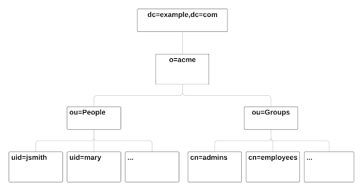
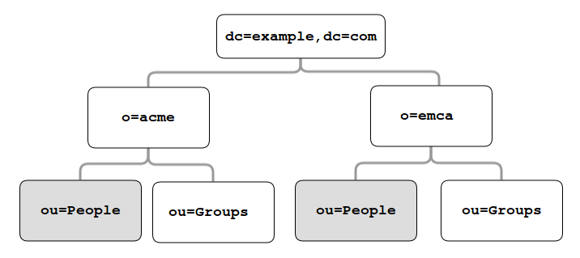
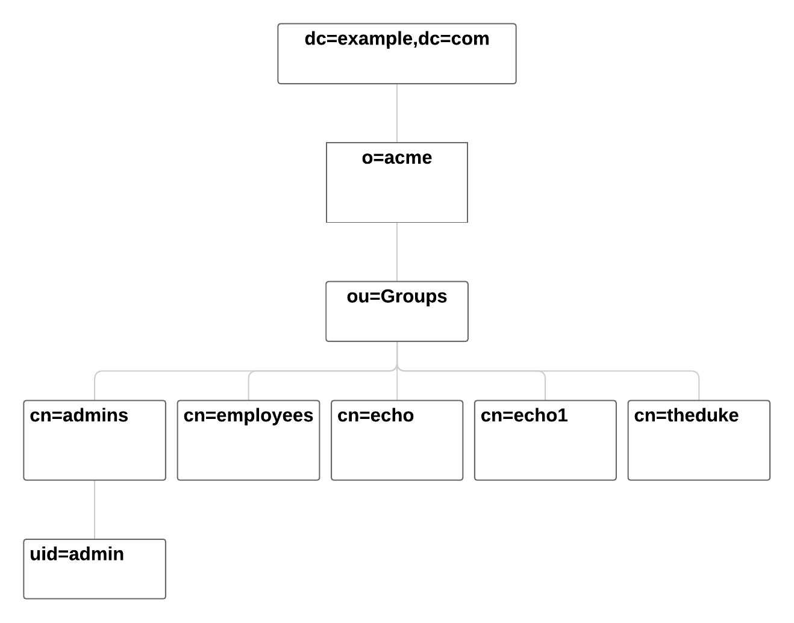

.. _LDAP:

#################
LDAP Integration
#################

eXo Platform organizational entities (users, groups and memberships),  
can be stored in a database or a directory such as OpenLDAP or Active 
Directory (AD). This chapter documents how to configure eXo Platform to 
plug to a directory.

.. note:: Please notice that this integration is not SSO (Single Sign On).
          If SSO is what you need, read the :ref:`SSO chapter, eXo Add-ons guide <SSO>` that explains how eXo Platform works with a directory through an SSO service like CAS or OpenAM.
    
    
.. warning:: -  eXo Platform supports only the **read-only** mode with a directory (LDAP/AD).
             -  Only one single directory is allowed.
             -  The mapped organizational  entities from directory are imported in one way direction: **from the directory to eXo Platform**.

This chapter covers the following topics:

    -  :ref:`Introduction <LDAP.Introduction>`
       An introduction about directory server integration basics.

    -  :ref:`Quick start <LDAP.QuickStart>`
       A step by step tutorial for eXo Platform configuration with a directory server.

    -  :ref:`Frequently asked questions <LDAP.FAQ>`
       How to resolve some possible issues of a directory integration.

.. _LDAP.Introduction:

=============
Introduction
=============

eXo Platform uses PicketLink IDM framework that allows a very flexible integration with a directory server:

-  It can be plugged to an already populated directory, in read-only mode. The directory can contain users and groups, or only users.
  
-  Structure of users and groups in the directory can be finely customized.

-  The supported directory implementations are: OpenLDAP and Microsoft Active Directory. You can refer to our official 
   `supported environments <https://www.exoplatform.com/terms-conditions/supported-environments.pdf>`__ file for more 
   details about the supported versions. 

The term "Directory users" represents users who are created in the directory by its utilities. The term "Platform users" represents users who are created via eXo Platform UI. The understanding is similar for "Directory groups" and "Platform group*".

The following section is a step-by-step tutorial to integrate eXo Platform with a directory server.

If you want to know more about PicketLink IDM configuration, you can refer to the official documentation of PicketLink.

.. _LDAP.QuickStart:

============
Quick start
============

Through this tutorial, you will be able to integrate eXo Platform with a populated directory server.
We suppose that your directory server has a structure similar to the following one:

|image0|

In this quick start, you configure eXo Platform to read information of users and groups from the directory. 
It might not match your need exactly, but after this start you will have everything packaged in an extension, 
that you can adapt by following the following sections.

.. note:: The ldap-extension is technically a portal extension that is described in 
          :ref:`Developer guide <PLFDevGuide.eXoAdd-ons.PortalExtension.Howto>`, but 
          it does not require compilation as it requires only xml files, so administrators 
          can pack the war archive without using a Maven build. If you are a developer, you 
          can create a Maven project for it like any other extension.

1. Create a ``ldap-extension`` directory having this structure:

   ::

       ldap-extension
       |__ META-INF
               |__ exo-conf
                       |__ configuration.xml
       |__ WEB-INF
               |__ conf
                       |__ configuration.xml
                       |__ organization
                   |__ idm-configuration.xml
                   |__ picketlink-idm-ldap-config.xml
               |__ jboss-deployment-structure.xml
               |__ web.xml

2. Edit ``WEB-INF/conf/configuration.xml``:

   .. code:: xml

		   <?xml version="1.0" encoding="ISO-8859-1"?>
		   <configuration
			  xmlns:xsi="http://www.w3.org/2001/XMLSchema-instance"
			  xsi:schemaLocation="http://www.exoplatform.org/xml/ns/kernel_1_3.xsd   http://www.exoplatform.org/xml/ns/kernel_1_3.xsd"
			  xmlns="http://www.exoplatform.org/xml/ns/kernel_1_3.xsd">

			   <import>war:/conf/organization/idm-configuration.xml</import>
		   </configuration>

3. Copy content of the ``portal.war!/WEB-INF/conf/organization/idm-configuration.xml`` file of eXo Platform to your ``idm-configuration.xml`` file, then edit your file to replace:

   .. code:: xml

		<value>war:/conf/organization/picketlink-idm/picketlink-idm-config.xml</value>

   with the path to your ``picketlink-idm-ldap-config.xml`` file:

    .. code:: xml

		<value>war:/conf/organization/picketlink-idm-ldap-config.xml</value>

4. Copy content from one of PicketLink sample files to your ``picketlink-idm-ldap-config.xml``  file.

note:: The sample files can be found in,``portal.war!/WEB-INF/conf/organization/picketlink-idm/examples``.
       Choose either of the following files:

		-  ``picketlink-idm-msad-config.xml`` if you use MS Active Directory.
		-  ``picketlink-idm-openldap-config.xml`` for OpenLDAP.
		-  ``picketlink-idm-ldap-config.xml`` for other LDAP compliant directories.

5. Modify the ``picketlink-idm-ldap-config.xml`` file according to your directory setup. Most of the time,  
   the following parameters need to be changed:

   -  all the DNs locating the users and groups:
		-  **ctxDNs** of the USER identity object, which must be the root DN of the users.
		-  **ctxDNs** of the platform_type identity object, which must be the root DN of 
		   the groups mapped under the eXo Platform /platform group.
		-  **ctxDNs** of the organization_type identity object, which must be the root DN 
		   of the groups mapped under the eXo Platform /organization group
   -  providerURL
   -  adminDN
   -  adminPassword

6. for Microsoft Active Directory (MSAD); do the following sub-steps :

   i. Prepare a truststore file containing the valid certificate for MSAD. It can be generated by the Linux command:

   ::

      keytool -import -file  certificate -keystore truststore

   ii. Edit the following parameters in the ``picketlink-idm-ldap-config.xml``file:

       -  providerURL: Should use SSL (ldaps://).
       -  customSystemProperties: Give your truststore file path and password.

        .. code:: xml

                 <name>customSystemProperties</name>
                 <value>javax.net.ssl.trustStore=/path/to/msad.truststore</value>
                 <value>javax.net.ssl.trustStorePassword=password</value>

7. Uncomment the following entries in the ``idm-configuration.xml``  file:

   -  groupTypeMappings

      .. code:: xml

          <entry>
              <key><string>/platform/*</string></key>
              <value><string>platform_type</string></value>
          </entry>
          <entry>
              <key><string>/organization/*</string></key>
              <value><string>organization_type</string></value>
          </entry>

   -  ignoreMappedMembershipTypeGroupList

      .. code:: xml

           <value>
                  <string>/platform/*</string>
          </value>
          <value>
                  <string>/organization/*</string>
          </value>

   This step enables mapping of directory groups (platform and organization - that are predefined groups) 
   to eXo Platform. If you bypass this step, only user mapping is performed.

8. Configure your extension by following the steps 3, 4 and 5 of :ref:` Creating a portal extension <PLFDevGuide.eXoAdd-ons.PortalExtension.Howto>`.

9. :ref:`Package and deploy <LDAP.PicketLink.QuickStart.Deployment>` your ldap-extension into Platform.

.. note:: For JBoss, don’t forget to declare :ref:`deployment dependency <Jboss-deployment>`deployment dependency.

10. Make sure the directory server is running, then start eXo Platform.

.. _LDAP.QuickStart.PackagingDeploying:

Packaging and deploying
-------------------------

The extension folder must be packaged into ``ldap-extension.war`` then copied to:

-  ``$PLATFORM_TOMCAT_HOME/webapps`` for Tomcat.

-  ``$PLATFORM_JBOSS_HOME/standalone/deployments`` for JBoss.

To compress the folder into a .war (and decompress the .war for editing), you can use any archiver tool that supports .war extension.
You can use the JDK built-in tool **jar**, as follows:

-  To compress, first go to **inside** ldap-extension directory:
   ``cd ldap-extension``

   Then run: ``jar cvf path/to/save/ldap-extension.war *``

-  To decompress, run: ``jar xvf path/to/ldap-extension.war``

.. note:: Do not include the ldap-extension folder itself into the ``.war.`` The ``.war`` 
          should contain META-INF and WEB-INF folders at root of the archive, it should 
          not contain ldap-extension folder. That's why you need to go to inside the folder first.

.. tip:: You should have ldap-extension packaged in .war when deploying it to production. However when testing, if you feel 
         uncomfortable having to edit a .war, you can skip compressing it. 
         In `Tomcat <https://tomcat.apache.org/tomcat-8.0-doc/deployer-howto.html>`__, just deploy the original 
         folder *ldap-extension*. In `JBoss <https://access.redhat.com/documentation/en-us/red_hat_jboss_enterprise_application_platform/7.0/html/configuration_guide/deploying_applications>`__, 
         rename it to ``ldap-extension.war``.

.. _LDAP.QuickStart.Testing:         

Testing
--------

If the integration was successful, the directory users and groups will appear in eXo Platform under the menu 
Administration --> Users --> Manage Users.

.. _LDAP_MapDNsUsers:

===================================
How to map multiple DNs for users?
===================================

eXo Platform allows to map users dispatched in multiple directory DNs, like this:

|image1|

In such case, you should, in addition to previous steps described in the 
:ref:`Quick start section <LDAP.PicketLink.QuickStart>`, follow these steps:

1. Open the configuration file ``picketlink-idm-ldap-config.xml``.
2. Search for the option **ctxDNs**.
3. Define the different locations of DNs where your directory users are located:

   .. code:: xml

		   <option>
			   <name>ctxDNs</name>
			   <value>ou=People,o=acme,dc=example,dc=com</value>
			   <value>ou=People,o=emca,dc=example,dc=com</value>
		   </option>

Since only one type of user can be defined, all users of these DNs must share the same attributes mapping.

.. _LDAP_MandatoryUserAttributes:

===========================================================
How to change default mandatory users attributes mapping?
===========================================================

There are five attributes that **should always be mapped** (because they are mandatory in eXo Platform):
-  username
-  password
-  firstname
-  lastname
-  email

The username mapping is defined by the option ``idAttributeName``:

.. code:: xml

		<option>
			<name>idAttributeName</name>
			<value>...</value>
		</option>

The password mapping is defined by the option ``passwordAttributeName``:

.. code:: xml

		<option>
			<name>passwordAttributeName</name>
			<value>...</value>
		</option>

The firstname, lastname and email mapping are defined in user attributes:

.. code:: xml

		<attribute>
			<name>firstName</name>
			<mapping>givenName</mapping>
			...
		</attribute>
		<attribute>
			<name>lastName</name>
			<mapping>sn</mapping>
		...
		</attribute>
		<attribute>
			<name>email</name>
			<mapping>mail</mapping>
			…
		</attribute>

The default mapping defined in the provided sample configuration files for OpenLDAP and MSAD directories 
is summarized in the following table:

   +-----------------+---------------------------------+------------------------+---------------------+
   | eXo Platform    | Configuration attribute         | OpenLDAP default value | MSAD default value  |
   +=================+=================================+========================+=====================+
   | username        | Option ``idAttributeName``      | uid                    | cn                  |
   +-----------------+---------------------------------+------------------------+---------------------+
   | password        | Option ``passwordAttributeName``| userPassword           | unicodePwd          |
   +-----------------+---------------------------------+------------------------+---------------------+
   | firstname       | Attribute ``firstName``         | cn                     | givenname           |
   +-----------------+---------------------------------+------------------------+---------------------+
   | lastname        | Attribute ``lastName``          | sn                     | sn                  |
   +-----------------+---------------------------------+------------------------+---------------------+
   | email           | Attribute ``email`              | mail                   | mail                |
   +-----------------+---------------------------------+------------------------+---------------------+

You can update them in the file picketlink-idm-ldap-config.xml to match your specific mapping.

.. _LDAP_AdditionalUserAttributes:

========================================
How to map additional user attributes?
========================================

As described in the previous section, by default, only 5 attributes are mapped from a directory user to an eXo Platform user. 
Additional user attributes can be mapped by configuration by adding new ``attribute`` element in the ``attributes`` section of 
the USER identity object type. For example if you want to map a directory attribute *title* to eXo Platform attribute *user.jobtitle*, 
you must add this configuration snippet under the “attributes” tag in the file picketlink-idm-ldap-config.xml, as follows:

 .. code:: xml

		<attributes>
		...
				   <attribute>
					   <name>user.jobtitle</name>
					   <mapping>title</mapping>
					   <type>text</type>
					   <isRequired>false</isRequired>
					   <isMultivalued>false</isMultivalued>
					   <isUnique>false</isUnique>
				   </attribute>
		...
			   </attributes>
	
			   
.. _LDAP_MultipleDNsGroups:

=====================================
How to map multiple DNs for groups?
=====================================	   
			   
As in previous sections, we assume that you already have a populated directory and some groups that should be mapped into eXo Platform. 

.. tip:: To be clear about the LDAP "group", it should be the "groupOfNames" objectClass in OpenLDAP or "group" objectClass 
         in Active Directory. In OpenLDAP (default core.schema), the groupOfNames must have the member attribute.

Under the context DN (ou=Groups,o=acme,dc=example,dc=com), there are several groups as shown in the diagram below: 

|image2|

In this case, you should, in addition to previous steps described in the :ref:`Quick start section <LDAP.QuickStart>`, 
follow these steps:

1. Open the configuration file ``picketlink-idm-ldap-config.xml``.
2. Search for the option ctxDNs to define the different locations of DNs
   where your directory groups are located:
   
    .. code:: xml

			<option>
				<name>ctxDNs</name>
				<value>ou=Groups,o=acme,dc=example,dc=com</value>
				<value>ou=Groups,o=emca,dc=example,dc=com</value>
			 </option>
			 
.. _LDAP_NewPLFGroups:

=========================================================
How to map directory groups to a new eXo Platform group?
=========================================================			 
			
In the :ref:`Quick start chapter <LDAP.QuickStart>` we map the directory groups to default eXo Platform groups 
``/platform`` and ``/organization``. In this chapter we will learn how to map  directory groups into a new eXo Platform group. 
Let’s say we want to map the groups contained in the directory ``DN o=acme,dc=example,dc=com`` into the eXo Platform group ``/acme``. 
As a prerequisite, the group /acme must be already created in eXo Platform.

.. _PicketlinkConfiguration:

1. **PicketLink configuration**

   The first step is to define the mapping configuration in PicketLink configuration file 
   ``picketlink-idm-ldap-config.xml`` by adding a new identity object type (we call it acme_groups_type) 
   under the identity store PortalLDAPStore:

      .. code:: xml

				<identity-store>
				<id>PortalLDAPStore</id>
				...
				<supported-identity-object-types>
					...
					<identity-object-type>
						<name>acme_groups_type</name>
						<relationships>
							<relationship>
								<relationship-type-ref>JBOSS_IDENTITY_MEMBERSHIP</relationship-type-ref>
								<identity-object-type-ref>USER</identity-object-type-ref>
							</relationship>
							<relationship>
								<relationship-type-ref>JBOSS_IDENTITY_MEMBERSHIP</relationship-type-ref>
								<identity-object-type-ref>acme_groups_type</identity-object-type-ref>
							</relationship>
						</relationships>
						<credentials/>
						<attributes>
							<attribute>
								<name>description</name>
								<mapping>description</mapping>
								<type>text</type>
								<isRequired>false</isRequired>
								<isMultivalued>false</isMultivalued>
								<isReadOnly>false</isReadOnly>
							</attribute>
						</attributes>
						<options>
						  <option>
							<name>idAttributeName</name>
							<value>cn</value>
						  </option>
						  <option>
							<name>ctxDNs</name>
							<value>o=acme,dc=example,dc=com</value>
						  </option>
						  <option>
							<name>entrySearchFilter</name>
							<value><![CDATA[(&(cn={0})(objectClass=group))]]></value>
						  </option>
						  <option>
							<name>allowCreateEntry</name>
							<value>true</value>
						  </option>
						  <option>
							<name>parentMembershipAttributeName</name>
							<value>member</value>
						  </option>
						  <option>
							<name>isParentMembershipAttributeDN</name>
							<value>true</value>
						  </option>
						  <option>
							<name>allowEmptyMemberships</name>
							<value>true</value>
						  </option>
						  <option>
							<name>createEntryAttributeValues</name>
							<value>objectClass=top</value>
							<value>objectClass=group</value>
							<value>groupType=8</value>
						  </option>
					   </options>
					</identity-object-type>
				</supported-identity-object-types>
			</identity-store>

   Make sure that the attributes and options are correct, especially:
   
   - **idAttributeName**:  attribute name to use as the group id.
   - **ctxDNs**: base DN of the groups in the directory.
   - **entrySearchFilter**: search expression to filter objects to consider as groups.
   - **parentMembershipAttributeName**: attribute which holds the list of group members. In OpenLDAP or MSAD default schemas, 
     the member attribute is used, but your schema may use another attribute.

Then this new object type must be referenced it in the PortalRepository repository: 

      .. code:: xml
      
			   <repository>
				   <id>PortalRepository</id>
				   ...
				   <identity-store-mapping>
					   <identity-store-id>PortalLDAPStore</identity-store-id>
					   <identity-object-types>
						   ...
						   <identity-object-type>acme_groups_type</identity-object-type>
						   ...
					   </identity-object-types>
				   </identity-store-mapping>...
				</repository>

2. **eXo configuration**

   Besides the :ref:`PicketLink configuration <PicketlinkConfiguration>`, 
   the eXo service configuration define in the file ``idm-configuration.xml`` must be updated. 
   A new entry must be added in the fields ``groupTypeMappings`` and ``ignoreMappedMembershipTypeGroupList`` 
   to map the group defined in PicketLink configuration with the eXo Platform, as follows: 

    .. code:: xml

			   <component>
					<key>org.exoplatform.services.organization.OrganizationService</key>
					<type>org.exoplatform.services.organization.idm.PicketLinkIDMOrganizationServiceImpl</type>
					...
						<field name="groupTypeMappings">
							 <map type="java.util.HashMap">
								..
								<entry>
									<key><string>/acme/*</string></key>
									<value><string>acme_groups_type</string></value>
								</entry>
							</map>
						</field>
						...
						<field name="ignoreMappedMembershipTypeGroupList">
							<collection type="java.util.ArrayList" item-type="java.lang.String">
								<value><string>/acme/*</string></value>
								...
							</collection>
						</field>
					...
				</component>

