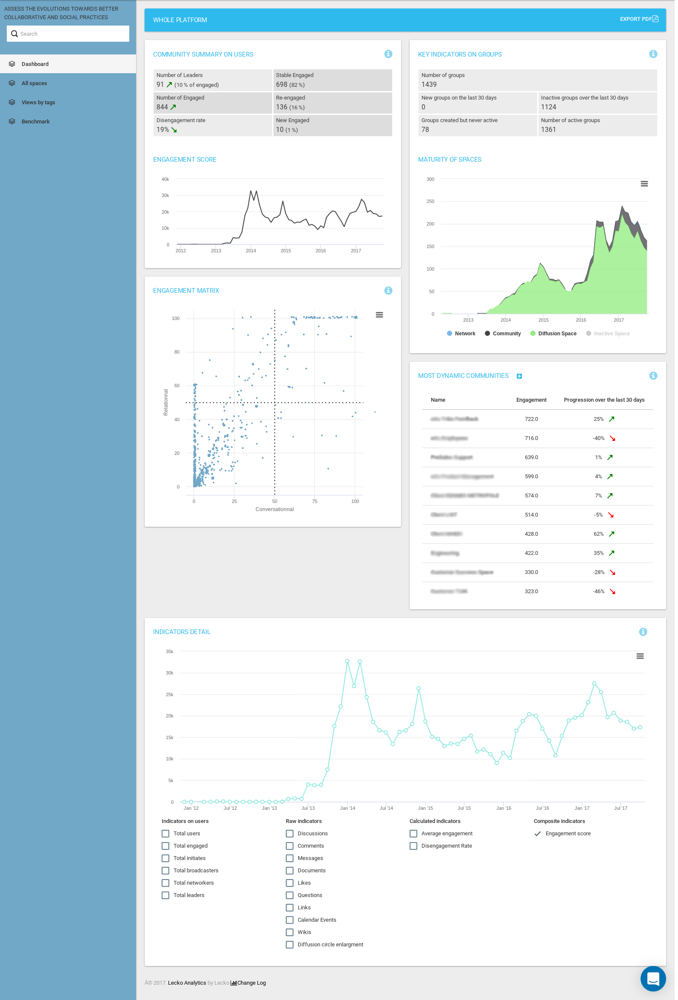

.. _LeckoAnalytics:

##################################
eXo Engagement Analytics by Lecko
##################################

**What is Lecko Analytics?**
 
`Lecko Analytics <http://analytics.lecko.fr/>`__ is a partner service 
that:

    -  Allows you to audit the usages of eXo Platform.

    -  Enables you to track and inspect user engagement within eXo Platform.

    -  Finds how many people are adopting a social behaviour.

    -  Offers raw metrics on things such as: likes, comments, uploaded
       documents, shared polls, discussions....

    -  Compares various indicators.

    -  Allows you to benchmark your organisation's social engagement
       versus other companies in your industry.

    |image0|

    In this chapter:

    -  :ref:`Prerequisites <eXoAddonsGuide.LeckoAnalytics.prerequisites>`:
       The needed actions to benefit from the add-on.

    -  :ref:`Installing and configuring the eXo Engagement Analytics add-on <eXoAddonsGuide.LeckoAnalytics.Installation>`: 
       Steps to install and configure the add-on.

    -  :ref:`How does it work? <eXoAddonsGuide.LeckoAnalytics.howWorks>`:
       How the add-on works.

.. _eXoAddonsGuide.LeckoAnalytics.prerequisites:

=============       
Prerequisites
=============

To benefit from all the previously cited functionalities, you need to
satisfy some prerequisites on both the business and technical side.

**Business prerequisites**

eXo Engagement Analytics by Lecko is a partnered add-on with `Lecko Analytics <http://analytics.lecko.fr/>`__. 
It is available only with the **commercial editions of eXo Platform** 
and requires the purchase of a dedicated add-on subscription from eXo 
Platform. Please refer to `Appendix 4 of the Master Subscription Agreement <https://www.exoplatform.com/terms-conditions/terms-conditions.pdf>`__.

**Technical prerequisites**

Having satisfied the business prerequisites, you should also cater for
the technical side:

-  Install the add-on in your eXo Platform. Check the next section for 
   more details about the installation phase.

-  Have network access to upload data collected from eXo Platform into 
   `Lecko Analytics <http://analytics.lecko.fr/>`__ Cloud Platform.

   This has to be factored with your internal security constraints.
   eXo Platform uses a secured FTP endpoint to communicate with Lecko's 
   Cloud Platform.

-  Have a network web access with :ref:`SSL enabled <Security.HTTPSConf>` 
   to reach Lecko Analytics portal.

.. _eXoAddonsGuide.LeckoAnalytics.Installation:

==============================================================       
Installing and configuring the eXo Engagement Analytics add-on
==============================================================

**Installation**

eXo Platform has partnered with `Lecko <http://analytics.lecko.fr/>`__ 
to offer an engagement analytics solution that allows to monitor user
engagement and let you drive end user adoption of eXo Platform.

This solution is presented as an add-on: the **eXo Engagement Analytics
by `Lecko <http://analytics.lecko.fr/>`__** which can be installed via
the :ref:`addons manager <eXo_addon>` using this command:

::

    ./addon install exo-lecko

eXo Engagement Analytics by `Lecko <http://analytics.lecko.fr/>`__
add-on is used to collect metrics from activity streams via a job and it
dumps them in a flat file on disk.

Having dumped all the needed metrcis, another job uploads the generated
file on `Lecko <http://analytics.lecko.fr/>`__ servers to be loaded in
the Analytics server.

Learn more about how eXo Engagement Analytics by
`Lecko <http://analytics.lecko.fr/>`__ add-on works in the section 
:ref:`How does it work? <eXoAddonsGuide.LeckoAnalytics.howWorks>`.

**Configuration**

To customize eXo Engagement Analytics by
`Lecko <http://analytics.lecko.fr/>`__ add-on, you can configure it
through :ref:`exo.properties <Configuration.ConfigurationOverview>` file.

The table below contains all the needed parameters to customize eXo
Engagement Analytics add-on:

+-----------------------------+-----------------------------+------------------+
| Property                    | Description                 | Default value    |
+=============================+=============================+==================+
| exo.addons.lecko.job.start. | Defines the export start    | 0 0 21 \* \* ?   |
| expression                  | time.                       |                  |
+-----------------------------+-----------------------------+------------------+
| exo.addons.lecko.job.stop.e | Defines the export end      | 0 0 6 \* \* ?    |
| xpression                   | time.                       |                  |
+-----------------------------+-----------------------------+------------------+
| exo.addons.lecko.job.enable | Allows to                   | true             |
| d                           | activate/deactivate the     |                  |
|                             | addon. When set to true it  |                  |
|                             | activates eXo Advanced      |                  |
|                             | Analytics add-on.           |                  |
+-----------------------------+-----------------------------+------------------+
| exo.addons.lecko.directory. | Defines the destination     | ${java.io.tmpdir |
| out.name                    | folder of the analytics     | }/lecko          |
|                             | export.                     |                  |
+-----------------------------+-----------------------------+------------------+
| exo.addons.lecko.out.name   | Defines the name of the     | dump             |
|                             | file to be exported.        |                  |
+-----------------------------+-----------------------------+------------------+
| exo.addons.lecko.SftpHost   | Defines the destination FTP |                  |
|                             | hostname.                   |                  |
+-----------------------------+-----------------------------+------------------+
| exo.addons.lecko.SftpUser   | Defines the destination FTP |                  |
|                             | username.                   |                  |
+-----------------------------+-----------------------------+------------------+
| exo.addons.lecko.SftpPasswo | Defines the destination FTP |                  |
| rd                          | password.                   |                  |
+-----------------------------+-----------------------------+------------------+
| exo.addons.lecko.SftPortNum | Defines the destination FTP |                  |
| ber                         | port.                       |                  |
+-----------------------------+-----------------------------+------------------+
| exo.addons.lecko.SftpRemote | Defines the destination FTP |                  |
| Path                        | path.                       |                  |
+-----------------------------+-----------------------------+------------------+
| exo.addons.leckoSftp.ProxyA | Defines the proxy hostname  |                  |
| ddress                      | or IP.                      |                  |
+-----------------------------+-----------------------------+------------------+
| SftpProxyPort               | Defines the proxy port.     |                  |
+-----------------------------+-----------------------------+------------------+
       
.. _eXoAddonsGuide.LeckoAnalytics.howWorks:

=================
How does it work?
=================

While starting the platform and having eXo Engagement Analytics add-on
installed, a job is launched to make the export.

The export ends when all needed information are exported or when the end
time defined in
:ref:`exo.properties <Configuration.ConfigurationOverview>` expires.

In case of restarting the platform, the job resumes its work from the
point when it stopped in the last time. In fact, the lecko service job
marks every exported element: space stream or user stream.

When the export is fully done, the service will send the report file to
the configured FTP in :ref:`exo.properties <Configuration.ConfigurationOverview>`.

After successful sending of the export file, eXo Engagement Analytics
add-on service restarts its progression to delete the export file and
then stops. In the next occurence, it will start a fresh export.

**Monitoring**

It is also possible to monitor eXo Engagement Analytics add-on via
JConsole as some Mbeans are available:

-  **buildLeckoData**: This action will start the data export even if
   ``exo.addons.lecko.job.enabled`` parameter is set to false in
   :ref:`exo.properties <Configuration.ConfigurationOverview>`.

   It does nothing if the export is running.

-  **stopLeckoExport**: If the exoprt is running, it will stop it.

-  **UploadLeckoData**: If the export is finished, it will upload the
   dump file to lecko's ftp. It does nothins if the service is running.

-  **enableLeckoJob**: It is a string Mbean parameter with which you can
   set ``exo.addons.lecko.job.enabled`` to true or false.

-  **getEnableLeckoJob**: It informs if jobs are activated or not.

-  **getJobStatus**: It displays information about lecko analytics jobs:
   the exopt folder, its status (running or not) and the completion
   percentage.

-  **resetExtraction**: It helps to start fresh export: it removes the
   dump file without sending it and cleans the database.

