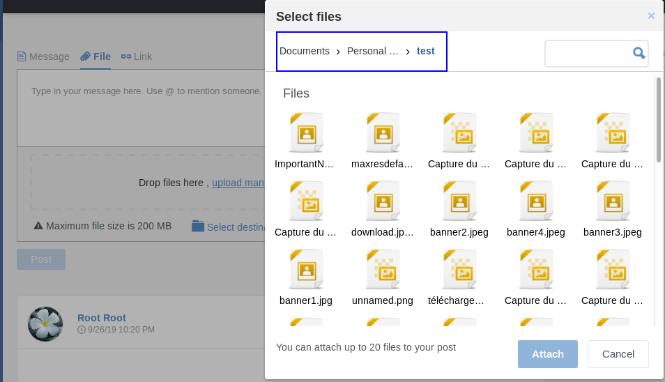
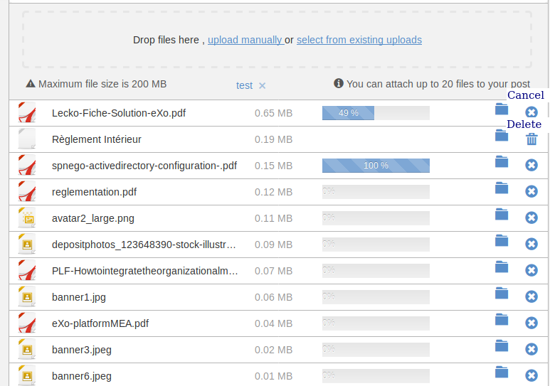
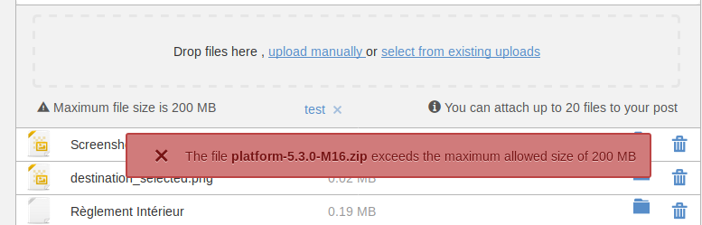

.. _Manage-Documents:

###########################
Managing Your Documents
###########################

    This chapter gives you a tutorial of the **Documents** application
    and step-by-step instructions on how to use basic actions via the
    following main topics:

    -  :ref:`Documents Interface <DocumentsInterface>`
       Overall introduction to the **Documents** interface, and common views which can be switched in the **Documents** application.

    -  :ref:`Navigating through Documents <NavigatingThroughDocuments>`
       Ways to browse your documents in the **Documents** application, both in the **Icons** and **List** views.

    -  :ref:`Document Viewer <DocumentViewer>`
       Introduction to the document types and how the Document Viewer enhances the readability and the collaboration.

    -  :ref:`Open in Office <OpenInOffice>`
       Introduction to this feature, as well as compatibility and client
       requirements that you need to know.

    -  :ref:`Working with basic actions <WorkingWithBasicActions>`
       Step-by-step instructions on how to do basic actions on your documents and folders.

    -  :ref:`Organizing your  content <OrganizingYourContent>`
       Instructions on various ways for you to arrange your documents efficiently.

    -  :ref:`Sharing your documents <SharingYourDocuments>`
       Information about the Share and Auto-share features which are integrated into the **Documents** application.

    -  :ref:`Extending your actions <ExtendingYourActions>`
       Detailed instructions on how to extend some useful actions which are not set by default in the **Documents** application.

The content management is one of key strategies in the organizational
process of each enterprise. A good content management allows you to:

-  Store, share and work on the same content efficiently.

-  Trace changes of content intuitively and instantly.

-  Simplify the way to manage your content.

The Enterprise Content Management system delivered by eXo Platform not only
satisfies basic demands (for example, uploading, previewing and
sharing/editing), but also makes useful capabilities available
(versioning, metadata, advanced searches, and more). These new
management solutions featured in the **Documents** application are built
on existing content management capabilities in a flexible and practical
way.


.. note::    -  The "document" denotes a file, script, image or piece of information.

			 -  The "folder" denotes a directory which contains a set of documents and even sub-folders.

			 -  The "content" is used for denoting both document and folder.


.. _DocumentsInterface:

===================
Documents Interface
===================

After logging into the :ref:`Social Intranet homepage <PLFHomepage>`
successfully, you simply click **Documents** on the left panel to be
redirected to the **Documents** interface. As a normal user, you can
switch between **Icons** and **List** views by clicking |image0| or
|image1| respectively.

|image2|

If you are an administrator, you can see **Documents** in the **Admin**
view.

|image3|

.. note::Refer to :ref:`Views <WorkingWithExplorer.Views>` to learn about differences between views.

The way to do actions on content is different between **Icons** and
**List** views as follows:

-  In the **Icons** view, you can do actions via the Right-click action
   or directly on the **Action** bar.

-  In the **List** view, the Right-click action is disabled.

Depending on your various purposes, you are free to switch between the
**Icons** and **List** views just in one click. That is, if you want to
see your content as images, it is recommended you use the **Icons**
view.

|image4|

But in case you want to see more details directly in the view, the
**List** view is an optimal choice.

|image5|

Here's what you can do in the **List** view:

-  Seeing important details of your content, including name,
   created/updated dates, creator, file size, directly in the view.
   Other information (such as extension, version number) is also present
   here, if any.

-  Showing/Hiding children of content without going inside it. Thus, you
   can have multiple folders opened in the view.

-  Changing the current context for a specific content simply clicking
   its name.

-  Doing basic actions on your content.


.. _NavigatingThroughDocuments:

============================
Navigating through Documents
============================

In the **Documents** application, you can store your content in both
drives and folders. However, to make ease for browsing your content, you
are advised to keep them in relevant folders. You can browse your
content in various ways, for example:

-  In the **Icons** view, double-click the content to open it.

-  In the **List** view, click |image6| to expand a specific folder that
   allows you to see its children without going into the folder. To hide
   its children, simple click |image7| to collapse this view.

-  Enter the path of the relevant content directly into the address bar.

   |image8|

   You can come back to the previous content by clicking |image9|.

-  Browse your content from the left sidebar in the **Icons** view. In
   the **List** and **Admin** views, the sidebar is disabled by default.
   To browse in this way, refer to :ref:`Hide explorer panel in sidebar <HidingExplorerPanelInSidebar>`.

-  Switch to another drive by clicking |image10| on the Action bar. A
   list of drives which are accessible to you will be shown.

.. note:: Depending on your role and permission, you will see various drives. See
			:ref:`Drives <Drives>` for more details.


.. _DocumentViewer:

===============
Document Viewer
===============

.. _Viewable-types:

The viewable document types
~~~~~~~~~~~~~~~~~~~~~~~~~~~~~

The Documents application allows users to build custom content types and
provides some built-in content types. It also provides a viewer for
common file types so users can read Office documents, view images or
play videos directly from the activity stream.

When a document has a preview, a part of it is displayed, if not a
thumbnail icon is displayed:

|image11|

When clicking to preview, here is what we got in the two cases:

|image12|

The following types are viewable i.e has a preview:

-  Printable files: *pdf*, *doc* (and other Office files) or any other
   type of files :ref:`JODConverter <#PLFAdminGuide.Configuration.JODConverter>`
   supports. See the full list of types at :ref:`JODConverter, Administrator
   Guide <#PLFAdminGuide.Configuration.JODConverter>`.

-  Images: *png, jpg, jpeg, gif*.

-  Audios/Videos: *mp3, mp4*.

-  ECMS content, either custom or built-in templates, such as a *web
   content* template.

For these viewable types, when you click a document preview thumbnail in
the Activity Stream or select the *View Document* menu from Documents in
the left navigation pane, the **Document Viewer** opens. The viewer
provides a large viewing area and some functions, such as Search,
Download and Print.

.. tip:: To exit the Viewer, hit *Esc* key or click **X** icon at the top right corner.


.. note::The Comment pane, where you can comment on or like a post, is only available when you view a document in the Activity Stream.
		 If the document is an unknown type, you must download it to your local machine and open it with another application.

.. _Office-PDF-files:

Office documents and pdf files
~~~~~~~~~~~~~~~~~~~~~~~~~~~~~~~~~~~

You can always view pdf files, whereas Office documents require
:ref:`JODConverter <#PLFAdminGuide.Configuration.JODConverter>` to be
installed on the server. If you cannot view an MS Word file, for
example, contact your administrators.

For these file types, the Document Viewer provides maximized reading
estate and all the functions listed.

|image13|

-  **Page Navigator**

Although you can simply scroll to go to another page, the Page Navigator
provides many page selectors (e.g. previous, next, first and last page
links, page number selector). You can also show/hide the Page Thumbnail
pane by clicking the leftmost icon in the toolbar. Click it again to
close it.

|image14|

-  **Search**: Click the Search icon |image15| to open the Search bar and
   click it again to exit.

|image16|

-  **Download**: Click the Donwload icon |image17| to download the file.

-  **Full screen mode**: Click the *Switch to Presentation Mode* icon
   |image18| to read in full screen. Hit *Esc* key to exit this mode.

-  **Print**: Click the *Tools* icon |image19| then select *Print*.

-  **Comment**: You will see the Comment area on the right side when you
   open the viewer. If it is hidden, you can bring it back by clicking
   the rightmost arrow icon.

|image20|

-  **Like**: In the Comment area, click the *Like* icon |image21| to
   like the post. Click it again to unlike.

.. _Images-audio-videos:

Images, Audios and Videos
~~~~~~~~~~~~~~~~~~~~~~~~~~~~~

For viewable media types, the available functions are Download, Comment
and Like.

|image22|


.. note::Audio/Video playback may require appropriate browser plugins. A
			message like "*Video format or MIME type is not supported*\ "
			indicates that you may need to install or enable some plugins for that media type.

.. _ECMS-content:

ECMS Content
~~~~~~~~~~~~~~

If the document is ECMS Content, it is viewable. The following
screenshot shows *illustrated web content*, which is one of the built-in
templates.

|image23|

.. _OpenInOffice:

==============
Open in Office
==============

With the Open in Office feature, you are able to easily edit documents,
spreadsheets and presentations in the native applications installed on
your client, without keeping a local copy.

In fact, this feature already existed before, but since PRODUCT 4.2,
more operating systems and browsers will be supported. You will be able
to open not only Office formats, but also virtually any file format as
long as an application is associated with it in your client.

Depending on the file type, a new contextual action appears as below:

-  **Open in Word** for file types: ``.docx``, ``.doc``, ``.docm``,
   ``.dot``, ``.dotm``, ``.dotx``.

   |image24|

-  **Open in Excel** for file types: ``.xltx``, ``.xltm``, ``.xlt``,
   ``.xlsx``, ``.xlsm``, ``.xlsb``, ``.xls``, ``.xll``, ``.xlam``,
   ``.xla``.

   |image25|

-  **Open in Powerpoint** for file types: ``.pptx``, ``.pptm``,
   ``.ppt``, ``.ppsx``, ``.ppsm``, ``.pps``, ``.ppam``, ``.ppa``,
   ``.potx``, ``.potm``, ``.pot``.

   |image26|

-  **Open on Desktop** for Non-MS Office files that are different from
   Word, Excel or Powerpoint files.

   |image27|


.. note:: The labels used for these buttons can be set by an administrator.
		  See :ref:`how-to <#PLFAdminGuide.Configuration.OpenInOfficeConfiguration>` in Administrator Guide.

This feature can be used not only in the Activity Stream (like above),
but also in many places:

-  Admin and List views (directly on the Action bar):

   |image28|

-  Categories, Icons and Web views (on the right-click menu)

   |image29|

-  File Preview

   By default, in some views (including Admin, Icons and List view),
   these buttons will be displayed as an action on the Actions bar.
   These buttons can be configured in any views (Categories, Web) like
   any other actions by your administrator 
   (Administration --> Content -->Content Administration --> Explorer --> View--> |image30| --> Action tab --> |image31| --> Remote Edit checkbox).


.. note:: These buttons will not be displayed in case multiple files are selected.

**How to use?**

By clicking either of these buttons, you can open and edit that document
in one native application that is registered on your client. A new
version of the document will be automatically created when it is saved
within the Office application.

-  When one document is currently opened by one user, the Lock icon will
   appear next to that file: |image32|. If you still want to open this
   file, one message saying that you can open it in the Read-only format will appear.

   |image33|

-  In case there is no application registered for one file type, one
   message appears, saying that you have no application registered to
   open that file.


.. note:: To make this feature work well, you need to learn about :ref:`Compatibility <Compatibility>`
			as well as :ref:`Client requirements <ClientRequirements>`.

.. _Compatibility:

Compatibility
~~~~~~~~~~~~~~

.. _Basic-compatibility:

Basic compatibility
---------------------

eXo Platform core has a basic compatibility for Microsoft environments. So,
if you are using Windows (7, 8 or 10) with Microsoft Office 2016
installed, you can work with Word, Excel and Powerpoint files in many
browsers: IE11, Firefox, Google Chrome and Edge.

.. note::To make Open in Office work well on IE11, you need to enable ActiveX
			by selecting Internet OptionsSecurity tabCustom levelInitialize and
			script ActiveX controls not marked as safe for scripting, and
			ticking the **Enable (not secure)** checkbox.

.. _Enhanced-compatibility:

Enhanced compatibility
-----------------------

For editing more file types and in various platforms, it is required
your administrator install the Remote Edit add-on on eXo Platform server
(by the command: ``addon install exo-remote-edit``). With this
installation, you can start using Open in Office in more various
environments. Here are the client environments that are currently
supported in eXo Platform:

+--------------------+----------------------------+----------------------------+
| OS                 | Browsers                   | Office suites              |
+====================+============================+============================+
| Windows 7, Windows | IE11, Firefox, Chrome,     | Microsoft Office 2016      |
| 8, Windows 10      | Edge                       | (Recommended), Microsoft   |
|                    |                            | Office 2010 and 2013       |
|                    |                            | (Supported)                |
+--------------------+----------------------------+----------------------------+
| MAC OS 10.9+       | Firefox, Safari            | Microsoft Office for Mac   |
|                    |                            | 2016 (Recommended),        |
|                    |                            | Microsoft Office for Mac   |
|                    |                            | 2011 (Compatible)          |
+--------------------+----------------------------+----------------------------+
| Ubuntu 17.04       | Firefox                    | LibreOffice 5.4            |
|                    |                            | (Supported), OpenOffice    |
|                    |                            | 4.1 (Compatible)           |
+--------------------+----------------------------+----------------------------+


.. note::	-  It is recommended to use the latest versions of Firefox and Chrome.

			-  Google chrome browser is incompatible for Ubuntu OS.

			-  For Chrome in Windows and MAC OS, you need to enable NPAPI, as said `here <https://java.com/en/download/faq/chrome.xml#npapichrome>`__.

.. _ClientRequirements:

Client requirements
~~~~~~~~~~~~~~~~~~~~~~~~~

In client side, you need to pay attention to the following environment
requirements before using this feature.


.. note:: For all OSs/browsers, it is recommended you install and make sure
			Java Applet enabled. This is required for opening Non-MS Office
			files. You can visit http://javatester.org/ to make sure Java Plugin
			already installed on your browser.

.. _Windows:

Windows
---------

**Note 1. Allowing to open and edit MS Office file types.**

.. _ConfiguringWebDAVRedirector:

1. Configure WebDAV Redirector on the client.

-  On Windows 7, click **Start**, type *regedit* in the Start Search
   box, and then press Enter. If you are in Windows 8, hold the Windows
   key (WINKEY) + F, highlight **Apps** in the Menu bar, type *regedit*
   in the Search box, and press Enter.

-  Locate to the following:
   ``HKEY_LOCAL_MACHINE\SYSTEM\CurrentControlSet\Services\WebClient\Parameters``.

-  On the Edit menu, point to **New**, and then click **DWORD Value**.

-  Type *BasicAuthLevel*, and then press Enter.

-  Right-click *BasicAuthLevel*, and then click **Modify**.

-  In the Value data box, type *2*, and click OK.

2. Update the Registry on the client.

-  Locate to the following:
   ``HKEY_CURRENT_USER\Software\Microsoft\Office\14.0\Common\Internet``
   (for MS Office 2010) or
   ``HKEY_CURRENT_USER\Software\Microsoft\Office\15.0\Common\Internet``
   (for MS Office 2013).

-  On the Edit menu, create *BasicAuthLevel* with the same value as in
   :ref:`Configure WebDAV Redirector on the client <ConfiguringWebDAVRedirector>`.

3. Exit **Registry Editor**, and restart your client.

**Note 2. On Chrome browser**

If you install both Microsoft Office and OpenOffice, you need to choose
Microsoft Office as default application for office files.

**Note 3. For Non-MS Office files**

When you open/edit a Non-MS Office file, one NPE exception is thrown on
eXo Platform server and even when the file is opened successfully, the
client gets very slow. See `here <http://stackoverflow.com/questions/27416798/it-hit-webdav-open-non-office-files>`__
for understanding the problem.

.. _Linux:

Linux
-------

On Firefox, to open/edit one file, you need to install **davfs2** that
allows mounting a WebDav server as a disk drive::

   $ sudo apt-get install davfs2

To open a document using untrusted SSL, you should export your server
certification and then register and trust it on davfs2 by following
these steps:

1. To export the server certification, use this command::

   $ openssl s_client -connect ${REMHOST}:${REMPORT} | sed -ne '/-BEGIN CERTIFICATE-/,/-END CERTIFICATE-/p' > myserver.pem

2. Register the certification on davfs by copiying it to ``davfs2/certs/``::


   $ sudo cp myserver.pem /etc/davfs2/certs/

3. Trust the certication on davfs2 by editing the file ``/etc/davfs2/davfs2.conf`` and adding this content::


   $ trust_server_cert /etc/davfs2/certs/myserver.pem

.. _MAC:

MAC
----

-  Enable **BasicAuth None SSL** with the command::

   $ defaults -currentHost write com.microsoft.registrationDB hkey_current_user\\hkey_local_machine\\software\\microsoft\\office\\14.0\\common\\internet\\basicauthlevel -int 2

-  In case you cannot open Microsoft Office files, you should close or
   force closing Microsoft Office Application, then re-open it.

-  In MAC OS 10.9, to edit a text file, it is recommended you use
   TextWrangler (not default TextEditor) to edit it.

.. _WorkingWithBasicActions:

==========================
Working with basic actions
==========================

eXo Platform features some ways for you to do actions on your content
flexibly, regardless of in which view you are using.

Before doing any actions on your content, it is recommended that you
clarify the following points:

-  In the **Icons** view, you can right-click the content that shows a
   drop-down menu.

   |image34|

-  In the **List** view, you cannot right-click the content. Instead,
   click anywhere under a specific area of the content (marked with the
   ticked checkbox). You will see a list of actions on the Action bar
   that are similar to those from the Right-click menu.

   |image35|


.. note:: Depending on the display width of your device, some actions (for
			example, Download And Allow Edition and Copy URL To Clipboard)
			may be grouped in the More drop-down menu.

-  The available actions shown in the Action bar when you double-click
   the content in the **Icons** view are quite similar to those when you
   click directly the content title in the **List** view. The difference
   is that the Overload Thumbnail function is only featured in the
   **Icons** view.

-  See the comparison table as below to have an overview of actions:

.. table:: overview of actions
   :widths: auto
   
   +----------------------------------------------------------------------+-----------------------------+--------------------------------------+
   | **Actions**                                                          |       **Icons view**   		|           **List view**      		   |
   +----------------------------------------------------------------------+-------------+---------------+---------------+----------------------+          										
   |																	  |	Right click |  double click	| Tick checkbox | Click title directly |		
   +----------------------------------------------------------------------+-------------+---------------+---------------+----------------------+
   | Adding to favorites                                                  |    |yes|    |     |no|      |    |yes|      |        |no|          |
   +----------------------------------------------------------------------+-------------+---------------+---------------+----------------------+
   | Copying/Cutting & Pasting                                            |    |yes|    |     |no|      |    |yes|      |        |no|          |
   +----------------------------------------------------------------------+-------------+---------------+---------------+----------------------+
   | Editing a document                                                   |    |yes|    |     |yes|     |    |yes|      |        |yes|         |
   +----------------------------------------------------------------------+-------------+---------------+---------------+----------------------+
   | Deleting                                                             |    |yes|    |     |no|      |    |yes|      |        |no|          |
   +----------------------------------------------------------------------+-------------+---------------+---------------+----------------------+
   | Locking/Unlocking                                                    |    |yes|    |     |no|      |    |yes|      |        |no|          |
   +----------------------------------------------------------------------+-------------+---------------+---------------+----------------------+
   | Renaming                                                             |    |yes|    |     |no|      |    |yes|      |        |no|          |
   +----------------------------------------------------------------------+-------------+---------------+---------------+----------------------+
   | Creating a symlink                                                   |    |yes|    |     |no|      |    |yes|      |        |no|          |
   +----------------------------------------------------------------------+-------------+---------------+---------------+----------------------+
   | Viewing document information                                         |    |yes|    |     |no|      |    |yes|      |        |no|          |
   +----------------------------------------------------------------------+-------------+---------------+---------------+----------------------+
   | Viewing a document                                                   |    |yes|    |     |no|      |    |yes|      |        |no|          |
   +----------------------------------------------------------------------+-------------+---------------+---------------+----------------------+
   | Viewing WebDAV                                                       |    |yes|    |     |no|      |    |yes|      |        |no|          |
   +----------------------------------------------------------------------+-------------+---------------+---------------+----------------------+
   | Copying URL to clipboard                                             |    |yes|    |     |no|      |    |yes|      |        |no|          |
   +----------------------------------------------------------------------+-------------+---------------+---------------+----------------------+
   | Tagging a document                                                   |    |no|     |     |yes|     |    |no|       |        |yes|         |
   +----------------------------------------------------------------------+-------------+---------------+---------------+----------------------+
   | Voting for a document                                                |    |no|     |     |yes|     |    |no|       |        |yes|         |
   +----------------------------------------------------------------------+-------------+---------------+---------------+----------------------+
   | Viewing document metadata                                            |    |no|     |     |yes|     |    |no|       |        |yes|         |
   +----------------------------------------------------------------------+-------------+---------------+---------------+----------------------+
   | Managing permissions                                                 |    |no|     |     |yes|     |    |no|       |        |yes|         |
   +----------------------------------------------------------------------+-------------+---------------+---------------+----------------------+
   | Overloading a thumbnail                                              |    |no|     |     |yes|     |    |no|       |        |no|          |
   +----------------------------------------------------------------------+-------------+---------------+---------------+----------------------+
   | Watching/Unwatching a document                                       |    |no|     |     |yes|     |    |no|       |        |yes|         |
   +----------------------------------------------------------------------+-------------+---------------+---------------+----------------------+
   | Versioning                                                           |    |no|     |     |yes|     |    |no|       |        |yes|         |
   +----------------------------------------------------------------------+-------------+---------------+---------------+----------------------+
   | Commenting on a document                                             |    |no|     |     |yes|     |    |no|       |        |yes|         |
   +----------------------------------------------------------------------+-------------+---------------+---------------+----------------------+

.. _Uploading-files:

Uploading files
~~~~~~~~~~~~~~~~

Uploading files from your local devices is a fast and efficient method
to create and store your documents in **Documents**.

.. note:: You now can upload multiple files from your local devices by holding
			Ctrl (on Windows) or Command (on Mac) to select them at the same time.

There are 2 available ways to upload:

-  :ref:`Using the Upload button <UsingUploadButton>`.

-  :ref:`Dragging and dropping <DraggingDropping>`.

When you start your upload, you will see the **Upload Status** window at
the bottom. In this window, the progress bar will appear next to the
files which are being uploaded.

|image39|

-  Abort all uploads by clicking Abort all.

-  See necessary information of upload by clicking |image36|.

-  After your uploads are finished, you can click |image37| at the right
   top corner of the dropzone to close it.

-  Cancel your progressing upload by clicking |image38| next to the
   progress bar.


.. note:: -  The upload size depends on the size limit that your administrator set up in the 'Edit' mode of **Sites Explorer**. If your file size exceeds the limit, the alert message will appear.

		  -  If the name of your uploaded file is the same as that of an existing file in the same location into which you are going to upload, you will receive one warning in the dropzone that your file is already in use. 
		     Here you can decide to keep both (your uploaded file and the existing file), replace the existing file with your uploaded file or cancel your file upload.

.. _UsingUploadButton:

Using the Upload button
-------------------------

1. Define the folder where your files will be
stored. Click Upload on the Action bar to open the **File Upload**
window. Browse and select your desired document, then click Open to
start uploading your selected files.

.. _DraggingDropping:

Dragging and dropping
----------------------

-  Simply drag and drop files from your local device to your desired
   folder.

-  Or, drag and drop files to the dropzone which appears when there are
   files ready to be dropped at the bottom.

.. _Create-folder:

Creating a folder
~~~~~~~~~~~~~~~~~~~~

To make your content management neat and easy to find, you should create
appropriate folders to store them.

1. Go to the location that your want to create a folder.

2. Select |image40| to open the New Folder form.

|image41|

If you create a new folder in a drive which allows creating more than
one folder type, you will see the Use a custom type of folder checkbox.
For example, in the **Collaboration** drive:

|image42|

-  By default, if you do not select the Use a custom type of folder
   checkbox, a Document Folder type will be created. Tick this checkbox,
   then select another folder type from the drop-down menu.

3. Enter a folder name, then click Create Folder to finish.

.. note:: -  The name of a folder may be the same as that of the existing ones. In this case, an index will be added to your newly created folder that can be seen on the address bar.

				|image43|
		  -  The list of available folder types which can be created in each drive is different depending on the drive configuration.
		  
		  -  Child folders will have the same folder type as that of their parent folders.


.. _ViewingEditingDocument:

Viewing a document/Editing document properties
~~~~~~~~~~~~~~~~~~~~~~~~~~~~~~~~~~~~~~~~~~~~~~~~~
.. _ViewingDocument:

Viewing a document
-------------------

-  Define the document, then select |image44| from the Right-click menu
   or on the Action bar.

   Your selected document is opened in another tab with the link
   containing the document path.

-  Simply double-click the document in the **Icons** view, or click the
   document title in the **List** view. Your document will be opened
   directly in the main panel with its path at the address bar.

   |image45|

   -  Here, you can also save your opened document as a PDF file or
      download it to your local device.

.. _EditingDocument:

Editing document properties
----------------------------

1. Select **Edit Document Properties** from the Action bar to open the File
form.

|image46|

2. Change information for your document, except the Name field.

.. note:: You can edit the Categories field only by clicking |image47|.

3. Click Save to commit your changes, or Save & Close to save and close the
form, or Close to cancel your changes.

.. note::Saving changes of the properties of a :ref:`versioned document <ActivatingDocumentVersion>` does not create a new version.

.. _CopyingCuttingPasting:

Copying/Cutting & Pasting
~~~~~~~~~~~~~~~~~~~~~~~~~~~

These functions are used to make a content copy (including its children
and references) to other places.

There are 2 ways to cut/copy & paste content:

**The first way**

1. Select |image48| or |image49| from the Right-click menu or on the Action bar.

2. Select the destination where the copied/cut content is stored, then select |image50| from the Right-click menu or on the Action bar.

.. note:: The Paste function is enabled only after the Copy/Cut action is selected.

The copied/cut content (and its children) will be pasted into the new
selected path.

**The second way**

.. note:: To do this way, you have to enable the **Show Sidebar** checkbox.

1. Select |image51| or |image52| from the Right-click menu or on the Action bar.

2. Select the destination that you want to be the parent of the content which is copied/cut.

3. Select |image53| on the Filter bar to open the Clipboard window.

|image54|

4. Click |image55| in the Clipboard window to paste the copied/cut content
into the selected destination.

-  You can click |image56| to delete the specific content from Clipboard.

-  You can also click the Clear All link to delete all from the list.


.. note:: -  You only can take the Copy action if you have this right on the source content.
		  -  You only can take the Paste action if you have the right on the destination.
		  -  If the destination has the same name with the copied content, after being pasted, an index will be added to the name of the pasted destination, for example *Live* and *Live[2]*.
		  -  You cannot copy a "content" folder into a "document" folder.
		  -  After taking the Copy action, you can take the Paste action on the different destinations before taking another Copy action.

.. _DeletingContent:

Deleting
~~~~~~~~~

 .. note:: -  You can only take the **Delete** action if you have the permission on that drive.
		   -  You can delete multiple content at the same time by holding theCtrl (on Windows) or Command (on Mac) key and clicking the desired files and folders.
		   -  If any folder is deleted, it means its child folders and references (if any) will be deleted accordingly.

.. _Delete-content:

Deleting content
----------------

1. Select |image0| from the Right-click menu or on the Action bar.

2. Click Delete in the confirmation message.


.. note:: If the deleted content has a symlink, this will be also deleted.

.. _Restore-content:

Restoring content
------------------

-  Once you have deleted the content, you will see a message at the top,
   indicating that your deletion is completed successfully. If you want
   to restore your deleted content immediately, click the Undo link.

-  The deleted content is stored in the **Trash** drive. By going to
   this drive and selecting Restore From Trash, you can restore your
   deleted content.

.. note:: -  Currently, only administrators have the right to access the **Trash** drive.

		  -  Deleting any content from the **Trash** drive will remove them permanently.

.. _VotingDocument:

Voting for a document
~~~~~~~~~~~~~~~~~~~~~~

The Vote feature is used to assign a rating to a document. In eXo Platform,
you can vote for a document via the 5-star rating. The more stars you
select, the higher rating you evaluate.

1. Open the document for which you want to vote, then select |image58| on
the Action bar.

The Vote Document form appears.

|image59|

2. Rate the document by clicking the appropriate star level.

After a vote has been added, the rating will appear at the bottom of the
document:

|image60|

-  **Avg. Rating:** The average value of all votes assigned to the
   document.

-  **Votes:** The number of votes assigned to the document.


.. note::You can change your rating for a specific document by selecting the
			star level again and the rating system automatically updates and calculates your last rating.


.. _TaggingDocument:

Tagging a document
~~~~~~~~~~~~~~~~~~~

A tag is a keyword or term associated with or assigned to a piece of
information (picture, geographic map, blog entry, clip, and more). Each
tag describes one item that enables the keyword-based classification and
search.

.. note:: All tags are in public. This means all users can view them. However,
			to edit or delete them, you need to have the appropriate right granted by your administrators.

.. _add-tag:

Adding a new tag
-----------------

1. Open the document for which you want to tag, then select |image61| on the
Action bar to open the Tag Manager form.

|image62|

**Details:**

+----------------------+-----------------------------------------------------+
| Field                | Description                                         |
+======================+=====================================================+
| Tag Names            | The tag names you want to add to your documents.    |
+----------------------+-----------------------------------------------------+
| Linked Tags          | List of all tags added to your documents.           |
+----------------------+-----------------------------------------------------+

2. Input a value into the Tag Names field. You can add many tags to one document at one time by separating with commas.

3. Click Add to accept, or Close to quit.

 .. note:: -  To view the whole list of tags, you just need to click on |image63| from the sidebar.

		   -  In case many tags are added to the documents, the tags cloud is paginated:
			
				|image64|

.. _remove-tag:

Removing a tag
---------------

1. Open the document for which you want to tag, then select |image65| on the
Action bar.

2. Click |image66| to delete an added tag.

3. Click **OK** in the confirmation message to delete the tag.

.. _OverloadingThumbnail:

Adding a thumbnail
~~~~~~~~~~~~~~~~~~~

If you do not want to represent a content with an existing but boring
icon, you can change this by adding your desired thumbnail to your
content.

.. note::This function is currently set in the **Icons** view only and you should have the appropriate permissions on the content.

1. Select content to which you want to add a thumbnail.

2. Select |image67| on the Action bar to open the Add Thumbnail Image form.

|image68|

3. Click Choose Thumbnail Image to select the image which will be used as
the display icon for your selected content.

4. Click Save to accept your changes.

For example, you have the folder with a default icon in the **Icons**
view as below:

|image69|

After you have overloaded your desired thumbnail, the folder will be
displayed:

|image70|

.. _WatchingUnwatchingDocument:

Watching/Unwatching a document
~~~~~~~~~~~~~~~~~~~~~~~~~~~~~~~

By using this function, you can follow all changes made on the document.

.. _watch-doc:

Watching a document
---------------------

1. Open the document you want to watch and click |image71| on the Action bar to open the Watch Document form.

|image72|

2. Select the Email checkbox to receive the notification message via your email, then click Watch to finish.

One message of successful watching will display as below.

|image73|


.. note:: A notification message will be sent to your email address which is set in :ref:`your profile <Edit-Your-Profile>`.
			However, if your account :ref:`is suspended <ManagingUsers.DisablingUser>`,
			the function will stop working.

.. _unwatch-doc:

Unwatching a document
----------------------

Simply open the watched document, then click Unwatch in the Watch
Document form.

One message of successful unwatching will display: |image74|

.. _ActivatingDocumentVersion:

Versioning
~~~~~~~~~~~

A versioned document is one which can be recovered at any given time.
You need to clarify the following points:

-  Once "Version" is activated for a document, this is called a
   "versioned" document.

-  The saved state of a document is called "version".

-  Versions created for a document behave as parts of the versions
   history.

-  The version on which you are currently working is called the "base"
   version.

Versioning is an optional feature, so you need to activate this for
either an independent file or a whole folder.

.. note::This feature only applies to documents, not to web contents.
			Besides, if you wish to enable versioning for a drive so that its
			new documents will be automatically versioned, you need to contact
			the administrator. See :ref:`Document versioning
			configuration <#PLFAdminGuide.Configuration.DocumentVersioning>` for more details.

**Enabling versioning for a file**

1. Open the document you want to enable versioning.

2. Click |image75| on the Action bar.

The following message will appear.

|image76|

3. Click Activate to enable versioning for the document.

**Enabling versioning for a folder**

You can enable versioning for an entire folder instead of doing it on
every child document of the folder.

For example, here are steps to enable versioning of the folder
``collaboration:/sites/test``.

1. In Sites Explorer, open the drive *Collaboration*, then select the folder.

2. Switch to *Admin* view, and click Actions on the Action bar.

3. Select the Add Action tab. On the dialog that appears, input:

-  Create Action of Type: *exo:autoVersioning*.

-  Name: *Auto Versioning*.

-  Lifecycle: *Content Addition*.

-  Is Deep: *checked*.

|image77|

4. Click the Search icon in the row **Affected Node Types**. Then check
*Select All Document Types*, and click Save.

5. Click Save, then Close to finish.

Whenever you update a document in the folder, a version will be created.

.. _Add-version-to-doc:

Adding a version to document
----------------------------

Versioning files is done automatically whenever a user overwrites a
file. There are many ways in which eXo Platform will help you to create a new document version.

.. _Via-doc-app:

Via Documents application
``````````````````````````

In the **Documents** application, there are two ways to create a version
for a document. You can go to the folder that you want to create a new
document version and try one of the following ways.

.. _first-way:

**The first way**

Upload a file (or multiple files) to this folder by using the **Upload**
button on the Action bar or dragging/dropping this file directly from
your computer.

-  If this is a totally new document and the versioning is enabled for
   the folder or the drive that contains this folder, the first version
   will be created as below:

   |image78|

   If the versioning is not enabled, no version is created.

-  If there is an existing versioned document with the same name as the
   uploaded file, a popup with the following suggestions is shown:

   |image79|

   In which:

   -  **Keep both**: no version of the existing document is created, but
      a new document is created with the same name (as a sibling
      document).

   -  **Upload new version**: a new version of the file is created with
      other information, such as title or description of the old
      document kept on the new version.

   -  **Cancel**: the upload is cancelled.

**The second way**

Copy and paste a document (or multiple documents) to a folder which
contains a document with the same name.

-  If the document is versioned, there will be a confirmation popup like
   this:

   |image80|

   In which, the options **Keep Both, Save as new version** and
   **Cancel** are exactly the same as the **Keep Both, Upload a new
   version** and **Cancel** options respectively in :ref:`the first way <first-way>`.
   Besides, if you upload multiple files, ticking the checkbox
   "*Remember my choice for all others versioned documents*" will
   apply the selected option for the remaining versioned files.

-  If the document is not versioned, the options will be the same as :ref:`those <first-way>` in the first way:

   |image81|

   Ticking the checkbox "*Remember my choice for all other versioned
   documents*\ " will apply the selected option for the remaining not
   versioned files.

.. _via-upload:

Via File Upload
````````````````

There is also an another case in which you probably need to create a
document version.

1. Click |image82| in CKEditor of web content or illustrated web content file template.

2. Upload a file to a folder that contains a document with the same name:

-  If the document is versioned, there will be an alert like this:

   |image83|

   In which, the options **Keep Both, Create a new version** and
   **Cancel** are exactly the same as the **Keep Both, Upload new
   version** and **Cancel** options respectively in :ref:`this case <first-way>`.

-  If the document is not versioned, the options will be the same.

.. note::If none of these actions is chosen, the new version of the document is not used and the upload is cancelled.

.. _Via-action-bar:

Via the Action bar
````````````````````

**The first way**

1. Open a versioned document that you want to create a new version in the Preview Mode.

2. Click the **Upload a new version** button on the Action bar.

3. Select a file to upload. Notice that the uploaded file does not need to
have the same name as the versioned document, but it should be the same
file type.

Once the file is selected, a new version with the same name as the
current document is automatically created. One success message will be
displayed.

**The second way**

1. Right-click the versioned document that you want to create a new
version.

2. Select the **Create a new version** button from the popup menu.

This will automatically create a new version of the document based on
the current version so that you can change the document properties on
this version while its content is still kept.

.. _via-webdav:

Via WebDAV
```````````

It is pretty simple to create a version for a document via WebDAV. You
just need to access WebDAV and upload a file to a folder. Several cases
will happen as below:

-  If this is a totally new document and versioning is enabled for the
   folder or the drive that contains the folder, its first version is
   created.

-  If there is an existing not versioned document with the same name,
   the new document will replace the existing one.

-  If there is an existing versioned document with the same name, a new
   version will be created.

.. _Manage-versions:

Managing versions
-----------------

You can manage your versions by comparing with the current version,
adding/removing labels, viewing/deleting versions or restoring to a
specific version. All such management actions will be done in the
Version History window.

|image84|

Comparing two versions
```````````````````````

|image85|

1. Check two versions among the versions list of the document/content.

2. Click on Compare selected versions buttons.

3. A page appears to highlight changes done between the two selected
versions. If the update contains an addition, it is highlighted in
green. If the update contains a deletion, it is highlighted in red.

|image86|

Adding a summary
````````````````

You can give a summary to each document version. For that purpose,
simply double click on the label Click here to add a summary, fill in
the text field then save by clicking on |image87|

You can abondon the summary addition by clicking on |image88|.

Restoring a version
````````````````````

1. Define the version that you want to restore as the base version by
checking it among the version list.

2. Click |image89| from the column **Action** that is in the version's line
to make the selected version become the base one.

Viewing a version
``````````````````

Simply click |image90| to view the document at the selected version.

Deleting a version
```````````````````

1. Click |image91| corresponding to the version you want to delete.

Click **OK** in the confirmation message to accept your deletion.

.. note:: You cannot delete the base version.


.. _CommentingDocument

Commenting on a document
~~~~~~~~~~~~~~~~~~~~~~~~~

This function is used to comment on a document.

1. Open the document to which you want to add your comment.

2. Click |image92| on the Action bar to open the Comment form.

3. Add your comment, then click Save to commit.

The comments are shown at the bottom of the document.

|image93|

-  Click the Show comments link to view comments.

   |image94|

-  Edit your comment by clicking |image95| or delete it by clicking |image96|.


.. note:: A formatting toolbar appears once you click in the comment composer.	
			It allows you to change the formatting of your message, attaching
			images and links and preview how it will look once posted. (like
			what we have for :ref:`the activity stream composer <Managing-Activities>`)
 

.. note:: -  You can mention people in your comment by first typing "@" symbol then selecting the person name you want to mention. See :ref:`Mentioning someone <Mentioning-People>` for more details.
		  -  Document comments are displayed exactly like in the activity stream.

.. _ManagingPermissions:

Managing permissions
~~~~~~~~~~~~~~~~~~~~~~

This function allows you to manage permissions on content.

Select content, then click |image97| to open the Permission Management
form.

|image98|

Here, you can perform the following actions:

-  :ref:`Adding permissions <AddingPermissions>`

-  :ref:`Editing permissions <EditingPermissions>`

-  :ref:`Deleting permissions <DeletingPermissions>`
   
.. _AddingPermissions:

Adding permissions
-------------------

1. Select a user or a membership or everyone whom you want to assign
permissions by clicking |image99| or |image100| or |image101| respectively.

2. Select right(s) you want to grants by ticking the corresponding checkboxes.


.. note:: -  When you select Modify Right or Remove Right only, the Read Right will be ticked automatically.

		  -  When ticking any permissions above (Modify, Remove or Read only), if you set the \* membership for a group, this permission will be
			granted to all users of the group, regardless of their membership role.

3. Click Save to accept your changes. The new permissions will appear in the permissions table above.

.. _EditingPermissions:

Editing permissions
--------------------

Editing permissions allows you to add more or remove a specific right
granted to a user or membership.

1. Define the permission of a user or membership in the permissions table.

2. Tick/Untick the checkboxes corresponding to the rights you want to grant
or remove respectively.

3. Click Save to accept your changed rights.

.. _DeletingPermissions:

Deleting permissions
----------------------

1. Select the permission of a user/membership in the permissions table.

2. Click |image102|, then select **OK** in the confirmation message.


.. note:: You cannot delete your own permissions.

.. _ViewingDocumentInformation:

Viewing document information & metadata
~~~~~~~~~~~~~~~~~~~~~~~~~~~~~~~~~~~~~~~~

.. _ViewDocproperties:

Viewing document information
------------------------------

eXo Plarform supports you to view all information of a document, such as
name, title, type, owner, created and modified dates.

To view information, simply select |image103| from the Right-click menu or
on the Action bar.

The View Information form appears as below.

|image104|

.. _ViewDocMetadata:

Viewing document metadata
--------------------------

This function allows you to view metadata attached to the uploaded file (**nt:file**).

1. Open the document (**nt:file**).

2. Click |image105| on the Action bar to open the View Metadata form.

|image106|

.. _AddEditMetadata:

Adding/Editing metadata
------------------------

1. Click Add/Edit at the bottom of the View Metadata form to add or edit
metadata to open the Add/Edit Properties form.

|image107|

2. Complete the desired fields in the Add/Edit Properties form.

-  Click |image108| to add further metadata for each field.

-  Click |image109| to remove corresponding values.

3. Click Save to accept your changes.


.. _Renaming:

Renaming
~~~~~~~~~

This function is used to change the content name.

1. Select |image110| from the Right-click menu or on the Action bar.

A mini-form which contains the current content name will pop up:

|image111|

Give the new name in the input field.

2. Click Rename to accept your changes. The title of your content is changed into *Renaming...* while being in process.

.. _CopyingURLToClipboard:

Copying URL to clipboard
~~~~~~~~~~~~~~~~~~~~~~~~~

The **Copy URL To Clipboard** feature enables you to copy the WebDAV URL
of content. You then can view it using the WebDAV client as stated in
:ref:`WebDAV <WebDAV>`.

1. Select the content you want to copy its URL, then click |image112| from
the Right-click menu or on the Action bar.


.. note::If you do not see |image113| on the Action bar, find it from the More drop-down menu.

2. Paste the URL on another tab.

You can view the content you copied its URL or download it to your local
device. You can also view other folders by clicking **...** above the
current folder to go up its root.

|image114|


.. _LockingUnlocking:

Locking/Unlocking
~~~~~~~~~~~~~~~~~

This function is to avoid changes on a specific content and actions by
others, during a specific period.

.. _Lock:

Locking content
----------------

Select the content, then click |image115| from the Right-click menu or on
the **Action** bar. The selected content will be locked.


.. note:: -  Only users with appropriate rights can lock the content.

		  -  After being locked, other users can only view the content.

		  -  The lock will be kept during the current session only. If the
			user who locks the content signs out, the content will be unlocked.

		  -  Other users can copy the locked content (by using the Copy/Paste
			functions outlined above); however, the original content cannot
			be removed or altered.

		  -  If no action is taken on the locked content within 30 minutes, the lock will be automatically removed.

.. _Unlock:

Unlocking content
------------------

Select the content which has been locked, then click |image116| from the
Right-click menu or on the Action bar. The content will then be unlocked
and other users can take actions on it.

.. _ViewingWebDAV:

Viewing WebDAV
~~~~~~~~~~~~~~

WebDAV enables users to access, then read/write the content over the web
browser. Thanks to its benefits of easy, quick and flexible
manipulations and time-saving, WebDAV is often used to view the content.

1. Select the content you want to view WebDAV.

2. Click |image117| from the Right-click menu or on the Action bar.

With each type of content, the form to view in WebDAV will be different.
For example:

-  For *folder*: The list of children under the current folder will be
   displayed in WebDAV.

   |image118|

-  For *nt:file*: The content of the document will be shown.

In addition to web browser, you can access the content through another
WebDAV clients. See :ref:`WebDAV <WebDAV>` for more details.

.. _OrganizingYourContent:

=======================
Organizing your content
=======================

One of the simplest ways of making your content management professional
and efficient is keeping them well-organized. In eXo Platform, you can
practice various ways to keep your content neat, accessible and easy to
search thanks to:

- :ref:`Sorting/Paginating <SortingPaginating>`

- :ref:`Adding to favorites <AddingToFavorites>`

- :ref:`Creating a symlink <CreatingSymlink>`

- :ref:`Customizing your preferences <CustomizingYourPreferences>`

- :ref:`Filtering <Filtering>`

.. _SortingPaginating:

Sorting/Paginating
~~~~~~~~~~~~~~~~~~~~

.. _sort-content:

Sorting your content
---------------------

In the **List** view, your content can be found easily and quickly by
using the **Sort** option. You can arrange your content by sorting them
to Name, Date and Size in ascending or descending order.

|image119|


.. note:: If you select each Sort option again, the order type will be changed. This means "ascending" is changed into "descending" and vice versa.

.. _paginate:

Paginating
-----------

Instead of scrolling all your content in the long list, you can use
Paginator to organize them into separate pages.

|image120|

The Paginator value is set to "20" by default. This means the Paginator
button will be visible if the content number exceeds 20.

To change the Paginator value, simply click |image121| and pick another
one from the Nodes Per Page drop-down list.

.. _AddingToFavorites:

Adding to favorites
~~~~~~~~~~~~~~~~~~~

By using the Add to favorite feature, you can easily find your preferred
documents easily in the **Favorites** folder. This is an efficient way
to manage your documents.

1. Define the document you want to add as favorite.

2. Select |image122| from the Right-click menu or on the Action bar.

A symlink of your favorite document will be created in the **Favorites**
folder.

Removing from favorites
-------------------------

1. Define the document which has been added to the **Favorites** folder.

2. Select |image123| from the Right-click menu or on the Action bar.


.. note:: You can go directly to the **Favorites** folder, then remove the document from it.

.. _CreatingSymlink:

Creating a symlink
~~~~~~~~~~~~~~~~~~~

A symlink is a special type of document that points to one file or
folder.

To add a symlink, simply select |image124| from the Right-click menu or on
the Action bar. The symlink will be added to the selected document
immediately that is marked with |image125|.

.. note:: -  When you perform an action on a symlink, the action is also performed on the content to which the symlink points.

		  -  When you delete a symlink, you delete the link's content, not the content to which the symlink points.

.. _CustomizingYourPreferences:

Customizing your preferences
~~~~~~~~~~~~~~~~~~~~~~~~~~~~~

This function is used to set up your browsing preferences.

1. Click |image126| on the right side of the Action bar.

The **Preferences** window will appear.

|image127|

.. _EnableSideBar:

*Details:*

+------------------------+---------------------------------------------------+
| Field                  | Description                                       |
+========================+===================================================+
| Sort by                | Sorts content in the list by Alphabetic, Type,    |
|                        | Created Date, or Modified Date that is associated |
|                        | with the Ascending or Descending order.           |
+------------------------+---------------------------------------------------+
| Show Sidebar           | Displays/Hides the sidebar.                       |
+------------------------+---------------------------------------------------+
| Enable Drag & Drop     | Enables/Disables the "drag and drop" action.      |
+------------------------+---------------------------------------------------+
| Nodes Per Page         | Defines the number of content displayed per page. |
+------------------------+---------------------------------------------------+
| Show Non-document      | Displays/Hides items that are nondocument.       |
| Nodes                  |                                                   |
+------------------------+---------------------------------------------------+
| Show Referenced        | Displays/Hides referenced documents.              |
| Documents              |                                                   |
+------------------------+---------------------------------------------------+
| Show Hidden Nodes      | Displays/Hides hidden documents.                  |
+------------------------+---------------------------------------------------+
| Enable DMS Structure   | Displays/Hides documents in the tree structure.   |
+------------------------+---------------------------------------------------+
| Query Type             | The query type.                                   |
+------------------------+---------------------------------------------------+

2. Configure the preferences to your desires and click Save to set them;

Or, click Close to quit without submitting changes.


.. _Filtering:

Filtering
~~~~~~~~~~

You can organize your content effectively based on the existing filters
on the sidebar in the main view. Thus, to filter your content, you need
to :ref:`enable the sidebar <EnableSideBar>` first.

|image128|

Next, find out your content quickly by selecting:

-  Owned by me to show your own ones.

-  Favorites to show ones added to favorites.

-  Hidden to show hidden ones.

-  Filter By Type to show ones by various types, including: Content,
   Document, Image, Music and Video.


.. note:: You can combine more than one filter at one time to find out your desired content.


.. _SharingYourDocuments:

======================
Sharing your documents
======================

The section provides you with the information related to sharing your
documents via the following topics:

- :ref:`Sharing directly in the Documents application <SharingDirectly>`

   Instructions on how to share your documents in your spaces using the
   **Share** feature of the **Documents** application.

- :ref:`Sharing via Activity Composer <SharingViaActivity>`

   Explanations on the automatic creation of a new activity on the
   Activity Stream when you finish uploading or sharing a file and
   information related to the update of the activity when you do some
   changes on the document.

.. _SharingDirectly:

Sharing directly in the Documents application
~~~~~~~~~~~~~~~~~~~~~~~~~~~~~~~~~~~~~~~~~~~~~~

To share a document in the **Documents** application, do as follows:

1. Click **Documents** on the left panel, you will be redirected to the
   **Documents** interface.

2. Select any document that you would like to share. If you are in the
   **List** view, a Share button will appear in the Actions bar:

|image129|

In case you are in the **Icons** view, right-click on the document to
see the Share button in the drop-down menu:

|image130|

.. note:: Only one file can be shared at a time, so you will not see the Share button if you choose more than one file simultaneously.

3. Click on the Share button, you will see a sharing dialog.

|image131|

4. Type the first letter from the username/space to which you wish to 
share the document. A drop-down list with the names of users and spaces 
having that letter appears.

|image132|

5. Select the users/spaces to which you want to share the document.

.. tip:: After selecting at least one user, the share button becomes enabled even without precising a permission.

6. Select the permission: you can choose either can view |view| or can 
   edit |edit|:

-  *Can View* |view1|: space members can only read the file.

-  *Can Edit* |edit1|: space members can read and modify the file.

By default, the *Can View* permission is applied.


.. note:: If you do not have the *Can Edit* permission on this document, only the *Can View* right is available for setting permissions.


.. _Who-has-access:

Who has access section
-----------------------

.. note:: The **who has access** section of the sharing dialog is alimented after the share action i.e. after clicking on Share button.

The *Who has access* section contains the list of spaces/users with whom
the document is shared and the persmission they have on it.

This list is sorted as follows:

|image134|

-  The first entry of the list is the owner of the document, it cannot
   be removed.

-  After the document's owner clicks on Share button, new entries 
   (users/spaces with the corresponding permission) will be added in the 
   bottom of the *Who has access* list.
   
-  Other entries are displayed in a scrollable area. Each entry contains
   : share target (user or space), permission (can edit or can view) and
   a delete icon.


.. note:: If the user enters a username that is not valid, the share button becomes enabled but when clicking on it a warning appears indicating that the username is not valid.
			
			|warning|


8. Add some comments or descriptions about the shared document into the
   succeeding text box. This step is not mandatory.

9. Click Share to finish sharing this document with the selected users/
   spaces or Cancel to skip sharing.

.. note:: - After a document is shared successfully, a :ref:`symlink <CreatingSymlink>` will be created in the destination spaces and put into a folder named **Shared** in the **Documents** folder (if the folder does not exist in these spaces, it will be automatically generated while sharing a file). Therefore, the document could be shared again by any member of these spaces.

		  - This sharing activity will be automatically updated on the **Activity Stream**. Refer to :ref:`Sharing via Activity Composer <SharingViaActivity>` for more details.

		  - If the original file is deleted, all its associated symlinks in all spaces will be removed.


.. _SharingViaActivity:

Sharing via Activity Composer
~~~~~~~~~~~~~~~~~~~~~~~~~~~~~

eXo Platform continuously improves the pleasure and value in engaging with
the users' community by integrating the **Auto-share** feature into the
Documents application. This integration fundamentally complies with
privacy rules; that is what made in folders (except Public) of the
Personal Documents drive will not be shared on Activity Stream.
Therefore, **Auto-share** is only featured in spaces, and you are
required to be owner or member of the space to see activities updated in
the space's Activity Stream. At the same time, these activities are also
updated in the **Social Intranet** homepage.

Assume that you have created a space or are a member of a space named
**PRODUCT TEAM**, then start doing certain actions in the **Documents**
application of this space.

|image136|

Many of the actions (for example, uploading, editing or sharing a
document) will be automatically shared on **Activity Stream** although
you do not take direct actions to share them. As a result, another
members can see what you are doing on your content via **Activity
Stream**.

.. _CreateNewActivity:

Creating a new activity
-----------------------

Once you have finished uploading or sharing a file to the **Documents**
application of the **PRODUCT TEAM** space, one new activity will be
created on **Activity Stream**.

|image137|

Here, you can see the following main information of the uploaded file:

-  The file name |image138| or title |image139|, if any.

-  The file description |image140|, if any.

-  The file version |image141| and size |image142|, if any.

.. note:: - If the uploaded file is an image, the preview image will be displayed on the activity content as a filetype icon.

		  - If the uploaded file is of PDF or Office, the preview image will be its first page.

		  - If the activity is a document sharing action, a label "*shared a document*\ " will be attached to the activity content.

From **Activity Stream**, you can:

-  Click |image143| to view the document in a larger window.

-  Click |image144| to download the document.

-  Click |image145| to go directly into the **Documents** application and
   edit this document.

-  Click |image146| to give your idea.

-  Click |image147| to show your liking to the uploaded document.

.. _MultiUpload:

Share multiple documents in activity stream
-------------------------------------------

With eXo Platform, it is possible to share activities with multiple
documents. In addition, the upload pop up is improved in order to make
easier and ergonomic the upload process.

.. _MultipleFiles:

Share multiple files in the activity stream
````````````````````````````````````````````

To publish an activity with multiple documents, follow these steps:

1. In the microblog, select File tab. The activity composer will suggest
you either to drop files from your computer using the mouse, to upload
manually from desktop or mobile or to select from existing uploads in
eXo Platform.

|image148|

-  Drag and Drop: Allows you to drag and drop files from your hard disc.

   |image149|

   When droping the file, the area dedicated to the files upload is
   greyed.

-  upload manually: Allows you to select documents from your hard disc.

   |image150|

   Cliking on upload manually opens a window showing a drive from your
   hard disk (it opens files drive for mobile devices) and allows you to
   select one or many files.

-  select from existing uploads: Allows you to select documents from
   your eXo Platform drives.

   |image151|

   You can select documents from Personal Documents drive, it is opened
   by default when clicking on select from existing uploads, or you can
   change to any drive you want.

   If the activity is in a space, the select from existing uploads
   action will open by default the space's drive. It is also possible to
   change the drive.

   |image152|


.. note:: - When you choose to upload manually or drag and drop files to the activity composer, these files will be added to the the folder ``/Public/Activity Stream Documents`` under the Personal Documents drive.

		  - If the activity is posted in a space's activity stream, the files will be added to the folder ``/Activity Stream Documents`` under the space's drive.

2. Choose the manner with which you will upload your files then select 
one or more files.

An information box appears under the activity composer, it indicates
information about the file upload progress and displays the file size.

.. note:: By default, it is allowed to attach up to 20 files per activity and each file's size should not exceed 200 MB. These parameters are configurable in :ref:`exo.properties <ConfigurationOverview>` file. More details :ref:`here <CustomizeMultiupload>`.

|image153|

You can cancel the upload of a file by clicking on |image154| or remove 
a fully uploaded file by clicking on |image155|.

3. Click on Post to publish documents in the activity stream.

.. note:: - When a user posts an activity in an another user's profile, this user receives an email notification.

		  - When a user posts an activity in a space, all the space members will receive an email notification.

		 This email notification will contain all the shared files on a list with the file icon type, the file name and the file size. Clicking on a file name in the email notifications opens it in the Documents application.

.. _MultipleFilesPreview:

Multiple files preview in the activity stream
``````````````````````````````````````````````

While published, an activity appears displaying the attached files
ordred by selection order on the files list.

|image156|

Up to three files are previewed in the activity and a link containing
the number of the other files. Clicking on it opens the following file
from the list of uploaded files.

-  When the user uploads only one file, the files container will take
   100% of the file activity area.

-  When two files are displyed in the activity, the files container
   splitting will be 50% for File1 and 50% for File2.

-  When three files are added in an activity post, the files container
   splitting will be 50% for File1, 25% for File2 and 25% for File3.

-  When the user displays more than three files, the files container
   splitting will be 50% for File 1, 25% for File2 and 25% to display
   (+X-2 more) link where X is the total number of files added.

.. note:: If the file uploaded has a preview (such as pdf, images, docx...), a part of it is displayed. If the file has not a preview (such as html, zip, war..), a thumbnail of its extension is dispalyed and a breadcrumb containing infomation about it.

			|image157|

When the user hovers over the file's container, information about the
attached file is displayed. We will have:

|image158|

-  The filename.

-  The file's version (if it is different from the initial version).

-  The file location as a breadcrumb (each element is clickable).

-  The last update timestamp (including the creation date).

-  The last user who made the latest update.

-  The file size.

Each segment of the breadcrumb is clickable and clicking on one of them
opens the documents application in the corresponding location:

-  Clicking on the filename of the breadcrumb opens the file in
   Documents application.

-  Clicking on the file's version opens the version history of the file.

-  Clicking on a segment of the file's location opens the corresponding
   drive/folder.

-  Clicking on other details (update timestamp, User or size) opens the
   file's preview in activity stream.

For mobile devices, the breadcrumb also appears for shared files. When
any of the breadcrumb's details exceeds the screen size, it is either
preceeded or followed by an ellipsis.

The breadcrumb behaves same as for web, its segments are clickable and
it redirects to the correcsponding location as described above.

|image159|

.. note:: A Download all button appears under the activity allowing to download all the files of the activity. It will generate a zip file named **Activity\_ID\_Date**.

		  Date can be in Frensh format if the user is using the Frensh language and in English format if the user is using English or any other language except Frensh.

You can navigate through the list of files by clicking on previous
|image160| and next |image161| buttons. For mobile devices, you should
scroll the screen left for next and right for previous. You can also
close the file preview by clicking on close button.

|image162|

Clicking on a file opens it to be previewed similar as :ref:`Document viewer <DocumentViewer>`.

The breadcrumb appears also in the file's preview but only the file's
location is clickable.

.. note:: When an activity contains some files with permissions (i.e a UserA is not allowed to view some or all documents in the activity), this/these file(s) will not be displayed in the activity stream of users who don't have the permission to view.

Deleting all files of an activity leads to the whole activity deletion
and deleting one or more files from the activity eliminates these files
from the display.

.. _MultiUploadConditions:

Multiple file sharing conditions
`````````````````````````````````

-  If you attach more than the allowed number of files, a warning
   appears indicating that you can attach only 20 files.

   |image163|

-  When selecting more than 20 files form existing uploads, a warning
   appears in the drive indicating that only 20 files are allowed to be
   attached.

   |image164|

-  If you attach a file or many files exceeding 200MB, a warning appears
   to remember you the maximum size allowed.

   |image165|

-  When trying to attach the same file twice, a warning appears to
   indicate you that the file is already attached.

   |image166|

-  If you have, in the same drive, two files having the same name and
   you try to attach both of them, a warning appears indicating that the
   file is already attached.

   |image167|

.. _ActivityForDocChanges:

Updating activity for document changes
--------------------------------------

.. _DocEdit:

Editing a document
````````````````````

Once you have made the following changes in the **Edit** form, new
comments will be auto-generated on the document activity.

-  Adding/Removing a category |image168|

-  Changing the document's language |image169|

-  Adding/Removing the file source |image170|

-  Adding/Removing the document description |image171|

-  Adding/Removing the document title\ |image172|

-  Adding/Removing the document creator\ |image173|

For example:

|image174|

.. note:: For changes on the Content field, you need to pay attention to the followings:

			-  If you remove the document content, there will be no comment on the document activity. However, in case your document is of image, PDF, Office Document, the preview image will be disappeared from **Activity Stream**.

			-  If you upload a new content for this document, the activity content will be updated with a new comment.

.. _MetadataUpdate:

Updating Metadata
``````````````````

Once you have made any changes on the document metadata, there will be a
new comment on the document activity. For example:

|image175|

.. _DocRename:

Renaming a document
````````````````````

Once you have renamed a document, the new name will be updated on the
document activity with a new comment informing about that.

|image176|

.. _DocChecking:

Checking in a document
```````````````````````

Checking in a document does not result in any new comment on the
document activity. However, a version number will be updated on the
document activity.

|image177|

.. _TagAddRemove:

Adding/Removing a tag
``````````````````````

Once you have added or removed a tag from the document, there will be a
new comment on the activity for such changes.

|image178|

.. _DocComment:

Commenting on a document
`````````````````````````

Once you have commented on a document, there will a new comment on the
document activity for such change.

|image179|

However, there will be no comment or no update on the document activity
if you edit or remove the comment from the document.

.. _DocMove:

Moving a document
``````````````````

When you move a document to another folder, there will be a new comment
on the document activity for such change.

|image180|

.. _DocDeletion

Deleting a document
````````````````````

If you delete any document from the **Documents** application, all
activities related to this document on **Activity Stream** will be
deleted without any comment or notification.

.. _ExtendingYourActions:

======================
Extending your actions
======================

In addition to basic actions stated above, eXo Platform provides a list 
of additional features for managing your content. Some of extended 
features are set in the **Admin** view by default, or your administrator
can enable them for any specific views.

.. note:: This part is mostly for administrators who have right to access the :ref:`Content Administration <ContentAdministration>` page where extended actions can be activated.

The followings are additional actions which are not accessible in the
**List** and **Icons** views, but are set by default in the **Admin**
view:

- :ref:`Managing actions <ManagingActions>`

- :ref:`Activating document audit <ActivatingDocumentAudit>`

- :ref:`Viewing/Adding document properties <ViewingAddingDocumentProperties>`

- :ref:`Managing document relations <ManagingDocumentRelations>`

Besides, administrators can add more actions to any views. The
followings are recommended features you may discover.

- :ref:`Exporting <Exporting>`

- :ref:`Importing <Importing>`

- :ref:`Showing/Hiding document structure <ShowingHidingDocumentStructure>`

- :ref:`Viewing document types <ViewingDocumentTypes>`

- :ref:`Hiding/Showing content <HidingShowing>`

.. note:: In this section, assume that additional actions have been set in the **List** view by your administrator. Therefore, you will see them in the Action bar.

.. _ManagingActions:

Managing actions
~~~~~~~~~~~~~~~~~~

To manage actions, you first need to select the content, then click
|image181| on the Action bar to open the Manage Actions form.

.. _AddAction:

Adding an action
------------------

1. Select the Add Action tab.

|image182|

2. Select one type for your action from the Create Action of Type 
drop-down menu, including:

+-----------------------+----------------------------------------------------+
| Type                  | Description                                        |
+=======================+====================================================+
| exo:AddMetadataAction | Adds metadata.                                     |
+-----------------------+----------------------------------------------------+
| exo:autoVersioning    | Adds a version automatically.                      |
+-----------------------+----------------------------------------------------+
| exo:enableVersioning  | Enables versioning.                                |
+-----------------------+----------------------------------------------------+
| exo:taxonomyAction    | Creates categories.                                |
+-----------------------+----------------------------------------------------+

3. Complete all the fields in the Add/Edit Action form. The Name and
Lifecycle fields are required.

*Details:*

+-----------------------+----------------------------------------------------+
| Field                 | Description                                        |
+=======================+====================================================+
| Name                  | Name of the action. This name is internal to the   |
|                       | JCR explorer.                                      |
+-----------------------+----------------------------------------------------+
| Lifecycle             | Selects the lifecycle for this action. The action  |
|                       | will be executed, depending on the lifecycle:      |
|                       |                                                    |
|                       | -  'User Action': The action is executed when you  |
|                       |    right-click the folder and then select the      |
|                       |    action.                                         |
|                       |                                                    |
|                       | -  'Content Addition': The action will be executed |
|                       |    on a new document, but not on a subfolder when  |
|                       |    the document or the subfolder is created in the |
|                       |    folder to which an action has been added. It is |
|                       |    also applied to a new document in the subfolder |
|                       |    of the folder.                                  |
|                       |                                                    |
|                       | -  'Property Addition': The action will be         |
|                       |    executed on a document when a property is added |
|                       |    to the document.                                |
|                       |                                                    |
|                       | -  'Property Removal': The action will be executed |
|                       |    on a document when a property is removed from   |
|                       |    the document.                                   |
|                       |                                                    |
|                       | -  'Property Modification': The action will be     |
|                       |    executed on a document when a property of the   |
|                       |    document is modified.                           |
|                       |                                                    |                                                                           
+-----------------------+----------------------------------------------------+

4. Click Save to commit the action.

All actions of the content are listed in the Available Actions tab.

Once an action is added to the content, it is auto-added to any children
of the selected content.

If an action is added with the lifecycle named 'User Action', it will be
applied to the current content. If an action is added with other
lifecycles, it will be applied to the child content.

.. note:: Not all actions are listed in a Right-click menu of the content. Some actions can be performed immediately when that action is added.

.. _ViewAction:

Viewing an action
-------------------

1. Select the Available Actions tab.

2. Click |image183| that corresponds to the action you want to view.

The details will be displayed in the Action Info tab.

.. _EditAction:

Editing an action
------------------

1. Select the Available Actions tab.

2. Click |image184| that corresponds to the action you want to modify.

3. Edit properties in the Action Form.

4. Click Save to accept your changes.

.. _DeleteAction:

Deleting an action
-------------------

1. Select the Available Actions tab.

2. Click |image185| corresponding to the action you want to delete, 
then click **OK** in the confirmation message.


.. _ActivatingDocumentAudit:

Activating document audit
~~~~~~~~~~~~~~~~~~~~~~~~~~

This function logs property changes in documents.

1. Select the document, then click |image186| on the Action bar. 
The Activate Auditing message appears.

|image187|

2. Click Activate to enable auditing on the selected document.

.. _ViewAuditInfo:

Viewing audit information
--------------------------

Select the document which has enabled auditing, then click |image188| to
view the audit information of the selected document.

-  If the document has no audit information, the form will appear as
   below.

   |image189|

-  If any, the Auditing Information list appears.

   |image190|

.. _ViewingAddingDocumentProperties:

Viewing/Adding document properties
~~~~~~~~~~~~~~~~~~~~~~~~~~~~~~~~~~~~~~

This function allows users to review all the properties and values of a
document. It can also be used to add values to a document.

.. _ViewDocProperies:

Viewing document properties
----------------------------

1. Select the document you want to review or add values to.

2. Click |image191| on the Action bar (or from the More drop-down menu 
on the Action bar).

The Properties Management form opens with 2 tabs:

*Properties*

    This tab displays all properties and values for the selected
    document.

    |image192|

*Add New Property*

    This tab contains fields to add new properties to the selected
    document.

    |image193|

.. _AddDocProperties:

Adding document properties
----------------------------

1. Select the Add New Property tab to add new properties to the selected
document.

2. Select the property type from the Add new Property drop-down menu.

3. Enter a value for the property in the Value field.

4. Click Save to accept your new values, or Reset to clear added values.

After you have made changes on a new property, you will be returned to
the Properties tab. The newly added values will be displayed.

In this form, you can edit a property by clicking |image194|, or delete 
it by clicking |image195|.


.. _ManagingDocumentRelations:

Managing document relations
~~~~~~~~~~~~~~~~~~~~~~~~~~~~

.. _AddRelation:

Adding a relation
------------------

You can use this function to create relations between documents.

1. Select the document to which you want to add a relation, then click
|image196| on the Action bar. The Add Relation form appears.

2. Select the Select Relation tab to see a list of other documents.

|image197|

3. Click |image198| that corresponds to the documents related to the 
document selected in the **Step 1.**

Documents linked to the original via a relation will be listed in the
Relation List tab.

.. note:: - Relations can only be added to document types.

		  - A document cannot have a relation to itself.

.. _DeleteAction:

Deleting a relation
--------------------

1. Select the document that has links to related documents, then click
|image199| on the Action bar.

2. Select the Relation List tab to view relations of the selected 
document.

|image200|

3. Click |image201| corresponding to the relation you want to remove.

4. Click **OK** in the confirmation message to accept your deletion.

The related document will be removed from the list.

.. _ViewRelation:

Viewing a relation
-------------------

.. note:: You need to :ref:`enable the sidebar <EnableSideBar>` first.

1. Select a document that has links to related documents.

2. Click |image202| on the Filter bar.

   All documents related to the selected document will be displayed in 
   the Relations list in the left panel.

3. Click the name of the related document to view the linked document.


.. _Exporting:

Exporting
~~~~~~~~~~

Content can be exported into either *.xml* or *.zip* file types.

1. Select the content that you want to export.

2. Click |image203| on the Action bar to show the Export form.

|image204|

*Details:*

+-----------------------+----------------------------------------------------+
| Fields                | Description                                        |
+=======================+====================================================+
| Path to Export        | The path of content being exported. This field     |
|                       | will be pre-populated.                             |
+-----------------------+----------------------------------------------------+
| Format                | The format of the original content.                |
|                       |                                                    |
|                       | -  System View                                     |
|                       |                                                    |
|                       |    Each content and its property are included in a |
|                       |    different tag.                                  |
|                       |                                                    |
|                       | -  Document View                                   |
|                       |                                                    |
|                       |    Each content is a tag and its properties are    |
|                       |    considered to be elements of that tag.          |
|                       |                                                    |                                                                           
+-----------------------+----------------------------------------------------+
| Zip                   | If this field is checked, the content will be      |
|                       | exported as a *.zip* file.                         |
+-----------------------+----------------------------------------------------+

3. Click Export and select a location to save the exported file.

.. note:: The Export form can contain Export Version History if the exported content or any of its children is versioned.

		  This action exports all of the content's version history.

.. _Importing:

Importing
~~~~~~~~~~

Content which is in the ``.xml`` file format can be imported into the
JCR Explorer system.

1. Select the location where you want to import the new content.

2. Click |image205| on the Action bar to open the Import form.

|image206|

3. Select the file in the Upload File field and navigate to the file you
want to import.

4. Select one value from the UUID Behaviour drop-down menu. In case 
there is UUID conflict - the situation when an imported node has the 
same UUID as an existing node, the behavior will be applied for those 
two nodes, as follows:

*Create New*

    New UUID will be generated and assigned to the imported node. There
    is no impact to the existing one.

*Remove Existing*

    The already existing node (and its subtree) is removed from wherever
    it may be in the workspace before the incoming node is added.

*Replace Existing*

    The already existing node is replaced by the incoming node in the
    same path as the existing node. This behavior may result in the
    incoming subtree being disaggregated to different locations in the
    workspace.

*Throw Exception*

    The node is not imported. No impact to the existing one.

5. Select the file for the Version History field.

6. Click Import to import the file's selected version.

.. _ShowingHidingDocumentStructure:

Showing/Hiding document structure
~~~~~~~~~~~~~~~~~~~~~~~~~~~~~~~~~~~~

This function allows you to view documents in a tree structure.

.. _Show:

Showing the document structure
--------------------------------

1. Open a document.

2. Click |image207| on the Action bar (or from the More drop-down menu).

.. _Hide:

Hiding the document Structure
------------------------------

1. Select a document which is showing the content structure.

2. Click |image208| on the Action bar (or from the More drop-down menu).

.. |image207| image:: images/ecms/show_hide_structure_button.png
.. |image208| image:: images/ecms/show_hide_structure_button.png


.. _HidingShowing:

Hiding/Showing content
~~~~~~~~~~~~~~~~~~~~~~~~

Content can be hidden or shown easily.

.. _HideContent:

Hiding content
----------------

1. Select the content you want to hide.

2. Click |image209| on the Action bar to hide the document.

A confirmation message, which notifies that the document has been
hidden, will appear.

.. _ShowHiddenContent:

Showing hidden content
-----------------------

To show a hidden content, simply click |image210| again.

.. _ViewingDocumentTypes:

Viewing document types
~~~~~~~~~~~~~~~~~~~~~~~

This function allows you to view the detailed information of a document.

1. Select a document that you want to view its detailed information.

2. Click |image211| on the Action bar (or from the More drop-down menu 
on the Action bar).

3. Click the tabs at the top of the form to view categorized 
information.

|image212|


.. |image0| image:: images/ecms/icons_view_icon.png
.. |image1| image:: images/ecms/list_view_icon.png
.. |image2| image:: images/ecms/documents_interface.png
.. |image3| image:: images/ecms/admin_view.png
.. |image4| image:: images/ecms/icons_view.png
.. |image5| image:: images/ecms/list_view.png
.. |image6| image:: images/common/right_arrow_icon.png
.. |image7| image:: images/common/down_arrow_icon.png
.. |image8| image:: images/ecms/address_bar.png
.. |image9| image:: images/common/back_icon.png
.. |image10| image:: images/ecms/personal_documents_button.png
.. |image11| image:: images/ecms/preview_thumbnail.png
.. |image12| image:: images/ecms/preview_mode.png
.. |image13| image:: images/ecms/doc_viewer_demo_pdf.png
.. |image14| image:: images/ecms/doc_viewer_page_selectors.png
.. |image15| image:: images/common/search_icon.png
.. |image16| image:: images/ecms/doc_viewer_search.png
.. |image17| image:: images/ecms/doc_viewer_download_icon.png
.. |image18| image:: images/ecms/doc_viewer_full_screen_icon.png
.. |image19| image:: images/ecms/doc_viewer_tools_icon.png
.. |image20| image:: images/ecms/doc_viewer_comment_area.png
.. |image21| image:: images/common/like_icon.png
.. |image22| image:: images/ecms/doc_viewer_demo_img.png
.. |image23| image:: images/ecms/doc_viewer_demo_ecms_content.png
.. |image24| image:: images/ecms/OpenInOffice/openinword.png
.. |image25| image:: images/ecms/OpenInOffice/openinexcel.png
.. |image26| image:: images/ecms/OpenInOffice/openinpowerpoint.png
.. |image27| image:: images/ecms/OpenInOffice/openondesktop.png
.. |image28| image:: images/ecms/OpenInOffice/admin_view_openinoffice.png
.. |image29| image:: images/ecms/OpenInOffice/icon_view_openinoffice.png
.. |image30| image:: images/ecms/edit_portlet_icon.png
.. |image31| image:: images/ecms/edit_portlet_icon.png
.. |image32| image:: images/ecms/OpenInOffice/lock_file.png
.. |image33| image:: images/ecms/OpenInOffice/open_read_only.png
.. |image34| image:: images/ecms/right_click_actions.png
.. |image35| image:: images/ecms/checkbox_actions.png
.. |yes| image:: images/common/yes.png
.. |no| image:: images/common/no.png
.. |image36| image:: images/common/help_icon.png 
.. |image37| image:: images/common/abort_icon.png
.. |image38| image:: images/common/abort_icon.png
.. |image39| image:: images/ecms/upload_progress_bar.png
.. |image40| image:: images/ecms/new_folder_button.png
.. |image41| image:: images/ecms/new_folder_form.png
.. |image42| image:: images/ecms/custom_folder_type.png
.. |image43| image:: images/ecms/folder_index.png
.. |image44| image:: images/ecms//view_document_button.png
.. |image45| image:: images/ecms/view_document.png
.. |image46| image:: images/ecms/edit_document_form.png
.. |image47| image:: images/common/plus_icon.png
.. |image48| image:: images/common/copy_button.png
.. |image49| image:: images/common/cut_button.png
.. |image50| image:: images/common/paste_button.png
.. |image51| image:: images/common/copy_button.png
.. |image52| image:: images/common/cut_button.png
.. |image53| image:: images/ecms/clipboard_icon.png
.. |image54| image:: images/ecms/clipboard_window.png
.. |image55| image:: images/common/paste_icon.png
.. |image56| image:: images/common/delete_icon.png
.. |image57| image:: images/common/delete_button.png
.. |image58| image:: images/common/vote_button.png
.. |image59| image:: images/ecms/vote_document_form.png
.. |image60| image:: images/ecms/vote_information.png
.. |image61| image:: images/common/tag_button.png
.. |image62| image:: images/ecms/tag_manager_form.png
.. |image63| image:: images/search/tag_cloud_btn.png
.. |image64| image:: images/search/tag_cloud_pages.png
.. |image65| image:: images/common/tag_button.png
.. |image66| image:: images/common/close_icon.png
.. |image67| image:: images/ecms/overload_thumbnail_button.png
.. |image68| image:: images/ecms/add_thumbnail_form.png
.. |image69| image:: images/ecms/folder_default_icon.png
.. |image70| image:: images/ecms/folder_thumbnail_icon.png
.. |image71| image:: images/ecms/watch_unwatch_button.png
.. |image72| image:: images/ecms/watch_document_form.png
.. |image73| image:: images/ecms/successful_watching_message.png
.. |image74| image:: images/ecms/successful_unwatching_message.png
.. |image75| image:: images/ecms/versions_button.png
.. |image76| image:: images/ecms/versioning/activate_version_message.png
.. |image77| image:: images/ecms/versioning/auto_versioning.png
.. |image78| image:: images/ecms/versioning/first_version.png
.. |image79| image:: images/ecms/versioning/upload_versioned_file.png
.. |image80| image:: images/ecms/versioning/paste_versioned_file.png
.. |image81| image:: images/ecms/versioning/paste_nonversioned_file.png
.. |image82| image:: images/ecms/insert_content.png
.. |image83| image:: images/ecms/versioning/file_upload_versioned_ck.png
.. |image84| image:: images/ecms/versioning/manage_versions.png
.. |image85| image:: images/ecms/versioning/compare_versions.png
.. |image86| image:: images/ecms/versioning/comparison.png
.. |image87| image:: images/ecms/versioning/save_summary_icon.png
.. |image88| image:: images/ecms/versioning/close_icon.png
.. |image89| image:: images/common/restore_icon.png
.. |image90| image:: images/common/view_icon.png
.. |image91| image:: images/common/delete_icon.png
.. |image92| image:: images/common/comment_button.png
.. |image93| image:: images/ecms/comment_form.png
.. |image94| image:: images/ecms/show_comment.png
.. |image95| image:: images/common/edit_icon.png
.. |image96| image:: images/common/delete_icon.png
.. |image97| image:: images/ecms/permissions_button.png
.. |image98| image:: images/ecms/permission_management_form.png
.. |image99| image:: images/common/select_user_icon.png
.. |image100| image:: images/common/select_membership_icon.png
.. |image101| image:: images/common/select_everyone_icon.png
.. |image102| image:: images/common/delete_icon.png
.. |image103| image:: images/ecms/view_information_button.png
.. |image104| image:: images/ecms/view_information_form.png
.. |image105| image:: images/ecms/metadata_button.png
.. |image106| image:: images/ecms/view_metadata_form.png
.. |image107| image:: images/ecms/add_edit_properties_form.png
.. |image108| image:: images/common/plus_icon.png
.. |image109| image:: images/common/delete_icon.png
.. |image110| image:: images/common/rename_button.png
.. |image111| image:: images/ecms/rename_form.png
.. |image112| image:: images/ecms/copy_url_button.png
.. |image113| image:: images/ecms/copy_url_button.png
.. |image114| image:: images/ecms/webdav_interface.png
.. |image115| image:: images/common/lock_button.png
.. |image116| image:: images/common/unlock_button.png
.. |image117| image:: images/ecms/view_webdav_button.png
.. |image118| image:: images/ecms/folder_webdav.png
.. |image119| image:: images/ecms/sort_options.png
.. |image120| image:: images/ecms/paginator.png
.. |image121| image:: images/ecms/document_preferences_icon.png
.. |image122| image:: images/common/add_to_favorite_button.png
.. |image123| image:: images/common/remove_favorite_button.png
.. |image124| image:: images/ecms/add_symlink_button.png
.. |image125| image:: images/ecms/symlink_icon.png
.. |image126| image:: images/ecms/document_preferences_icon.png
.. |image127| image:: images/ecms/full_preferences_form.png
.. |image128| image:: images/ecms/filter_sidebar.png
.. |image129| image:: images/ecms/share_document_btn.png
.. |image130| image:: images/ecms/share_btn_dropdown.png
.. |image131| image:: images/ecms/sharing_dialog2.png
.. |image132| image:: images/ecms/sharing_dialog3.png
.. |image133| image:: images/ecms/add-button.png
.. |image134| image:: images/ecms/sharing_dialog5.png
.. |image135| image:: images/ecms/sharing_dialog4.png
.. |image136| image:: images/ecms/space_documents.png
.. |image137| image:: images/ecms/share_upload.png
.. |image138| image:: images/common/1.png
.. |image139| image:: images/common/2.png
.. |image140| image:: images/common/3.png
.. |image141| image:: images/common/4.png
.. |image142| image:: images/common/5.png
.. |image143| image:: images/common/eye_view_button.png
.. |image144| image:: images/common/download_button.png
.. |image145| image:: images/common/edit_button.png
.. |image146| image:: images/common/comment_icon.png
.. |image147| image:: images/common/like_icon.png
.. |image148| image:: images/ecms/MultiUpload_step1.png





.. |image154| image:: images/ecms/cancel.png
.. |image155| image:: images/ecms/delete.png
.. |image156| image:: images/ecms/Multiupload_display.png
.. |image157| image:: images/ecms/preview_no_preview.png
.. |image158| image:: images/ecms/Multiupload_mouse_hover.png
.. |image159| image:: images/ecms/Mobile_breadcrumb.png
.. |image160| image:: images/ecms/previous.png
.. |image161| image:: images/ecms/next.png
.. |image162| image:: images/ecms/previous_next.png

.. |image164| image:: images/ecms/Multiupload_Error2_2.png


.. |image167| image:: images/ecms/Multiupload_Error3_2.png
.. |image168| image:: images/common/1.png
.. |image169| image:: images/common/2.png
.. |image170| image:: images/common/3.png
.. |image171| image:: images/common/4.png
.. |image172| image:: images/common/5.png
.. |image173| image:: images/common/6.png
.. |image174| image:: images/ecms/share_document_changes.png
.. |image175| image:: images/ecms/share_updated_metadata.png
.. |image176| image:: images/ecms/comment_rename_document.png
.. |image177| image:: images/ecms/share_version_document.png
.. |image178| image:: images/ecms/share_add_remove_tag.png
.. |image179| image:: images/ecms/share_comment.png
.. |image180| image:: images/ecms/share_move_document.png
.. |image181| image:: images/ecms/actions_button.png
.. |image182| image:: images/ecms/add_action_form.png
.. |image183| image:: images/common/view_icon.png
.. |image184| image:: images/common/edit_icon.png
.. |image185| image:: images/common/delete_icon.png
.. |image186| image:: images/ecms/audit_button.png
.. |image187| image:: images/ecms/activate_audit.png
.. |image188| image:: images/ecms/audit_button.png
.. |image189| image:: images/ecms/no_audit_inform.png
.. |image190| image:: images/ecms/audit_information.png
.. |image191| image:: images/ecms/properties_button.png
.. |image192| image:: images/ecms/view_properties.png
.. |image193| image:: images/ecms/add_property.png
.. |image194| image:: images/common/edit_icon.png
.. |image195| image:: images/common/delete_icon.png
.. |image196| image:: images/ecms/relations_button.png
.. |image197| image:: images/ecms/select_relation.png
.. |image198| image:: images/common/select_icon.png
.. |image199| image:: images/ecms/relations_button.png
.. |image200| image:: images/ecms/relation_list.png
.. |image201| image:: images/common/delete_icon.png
.. |image202| image:: images/ecms/relation_icon.png
.. |image203| image:: images/common/export_button.png
.. |image204| image:: images/ecms/export_form.png
.. |image205| image:: images/common/import_button.png
.. |image206| image:: images/ecms/import_form.png
.. |image207| image:: images/ecms/show_hide_structure_button.png
.. |image208| image:: images/ecms/show_hide_structure_button.png
.. |image209| image:: images/ecms/show_hide_content_button.png
.. |image210| image:: images/ecms/show_hide_content_button.png
.. |image211| image:: images/ecms/types_button.png
.. |image212| image:: images/ecms/document_type_form.png
.. |view| image:: images/ecms/view.png
.. |view1| image:: images/ecms/view.png
.. |edit| image:: images/ecms/edit.png
.. |edit1| image:: images/ecms/edit.png
.. |warning| image:: images/ecms/warning.png
