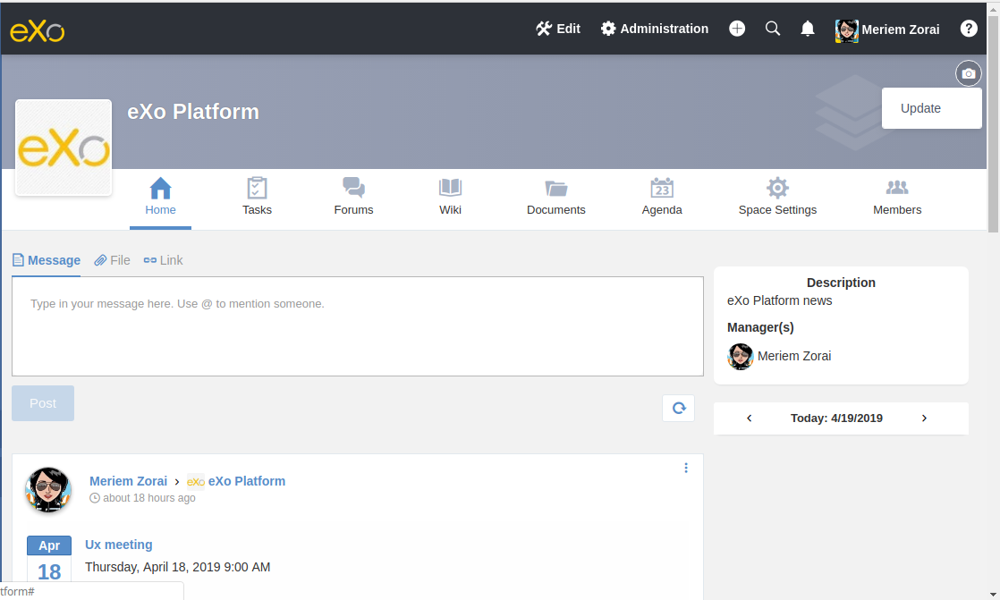
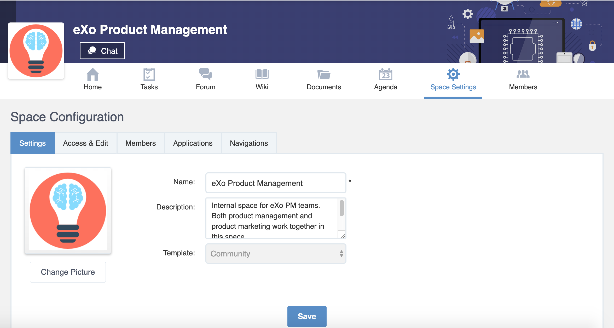

.. _Manage-Space:

######################
Working With Spaces
######################

    The "team work" concept becomes very familiar in business
    environment. By establishing one specific team or group, you and
    your collaborators can work together on important projects. Based on
    the importance of team working, eXo Platform develops the **Space**
    application, allowing you to collaborate with specific people. The
    scope of using spaces is so flexible that can be applied for teams,
    themes, communities or any kind of informal groups to your business
    requirements. For example, if you want to work on a team project,
    you can create a space for your team members to make organizations,
    share links and information related to the project.

    This chapter covers the following topics:

:ref:`Accessing a space <Access-Space>`

       How to access a space and its page via its URL.

:ref:`Space banner and avatar <Space-banner>`

       How to define a space banner and avatar.

:ref:`Creating a space <Create-Space>`

       Steps to create a new space with new settings, permission and members.

:ref:`Managing space settings <Manage-Space-Settings>`

       Ways to access **Space Settings** and steps to modify the space  information and visibility, to manage members and space applications, or to manage space navigation bar.

:ref:`Joining/Leaving a space <Join-Leave-Space>`

       How to join/leave a space, or to revoke your request.

:ref:`Deleting a space <Delete-Space>`

       How to delete a space where you are the manager.

:ref:`Accepting/Ignoring invitations <Accept-Ignore-Space-Invitation>`

       Steps to accept or ignore a request/invitation.

:ref:`Sharing in Space <Sharing-On-Space>`

       How to share content in a space.

.. _Access-Space:

=================
Accessing a space
=================

After logging in eXo Platform successfully, you will see a list of your
spaces under MY SPACES on the left pane of the page.

|image0|

**Details**:

-  |image1| The Search box which allows you to quickly search for a
   space from your spaces list.

-  |image2| The list of spaces where you are a member or manager.

-  |image3| Allows you to access the Spaces page which displays all the
   spaces in the portal. Here, you can quickly join a space or search
   for your desired space.
   
.. _note-access-spaces-page:

 .. note::   You can also see all your spaces by directly clicking the |image4| link or clicking Join a space to open the Spaces page, then selecting the My Spaces tab.

|image5|

The Space navigation includes the following tabs:

.. _All-spaces-access:

-  **All Spaces**: All spaces, including your spaces, :ref:`visible
   spaces <About-space-visibility>`, and :ref:`hidden spaces <About-space-visibility>` where
   you are invited to become members.

-  **My Spaces**: Spaces where you are a member or manager.

-  **Invitations Received**: Spaces where you are invited to become members
   by space managers.

-  **Requests Pending**: Spaces where you have requested for becoming their
   members.

To access a specific space, just click the space name.

  .. tip::  You can quickly find out your desired space from the list of your spaces by typing its name/description into the Search Spaces box on the left pane or using the **Search** feature in the Space application. 
			See the :ref:`Searching for spaces <Search-Space` section for more details.

**Accessing via URL**

When you try to access a space or a space page via its URL while you are
not its member yet, you will receive various instructions as follows:

-  For an Open space, click Join to join that space first.

   |image6|

-  For a Visible space with Validation Registration, click Request to
   Join to send the join request first.

   |image7|

-  For a Hidden or Not existing space, click Find Spaces to open the
   :ref:`All Spaces <All-spaces-access>` page.

   |image8|

-  For a Closed space, you just can access it when being invited by your
   administrator.

   |image9|

.. note::    Super User, who has the highest permission, can see and access all spaces for the administration purpose.

.. _Space-banner:

=======================
Space banner and avatar
=======================

After :ref:`creating a space <Create-Space>`, by default it has the default banner (in grey color) and the default space's icon. 
You can choose different images for the banner and the avatar.

.. _SpaceBanner:

Space banner
~~~~~~~~~~~~~~

To change the banner just mouse over in the top right corner of the
space banner, an icon |image10| and a tooltip will appear.

When you click on the icon |image68|, an ``Update`` button |image69| appears  
allowing you to pick up an image from your computer.

The tooltip indicates you the banner size which should be 130 pixels height minimum.

   |image11|

Having chosen the banner and if you click again on the button |image70| 
in the top right, two buttons appear:

|image12|

-  ``Update``: Allows you to pick up another banner image from your computer.

-  ``Reset``: Allows you to delete the current banner image and restore
   the default grey banner.

.. _SpaceAvatar:

Space avatar
~~~~~~~~~~~~~

Same as for the banner, you can choose an another space avatar, just click on 
|image15| and an ``Upload`` button appears allowing you to pick up an image 
from your hard disk:

|image16|

Pick up an image by double-clicking on it. The image will be loaded in
the space's avatar.

After setting a space avtar, when you click again on |image71|, you can:

- ``Update`` the image by selecting an another one from your computer or

- ``Reset`` to restore the default space icon.

|image72|

When scrolling down in the space's activity stream and when you exceed
the cover section limit, the banner image is collapsed and a new space's
navigation bar still appear. It allows you to see all the space's tabs.

|image17|

The new navigation bar contains:

-  The space's avatar in a cercle form.

-  The space's name allowing you to know in which space you are.

-  The chat button allowing you to start a conversation with the space's
   members.

-  The space's applications.

-  The *More* button |image18| appears when the number of applications
   exceeds the number that the navigation bar is able to display or when
   the spae's name is long.

   |image19|

   Clicking on it displays the list of the remaining applications.

   |image20|

In mobile devices, applications navigation bar is scrollable right and
left.

|image21|

.. _Create-Space:

================
Creating a space
================

After going to the Spaces page, you can add a new space so that you and
your collaborators can work together or discuss specific topics as
follows:

1. Click |image22| at the top left corner of the **Space** page to open the Add New Space form.

2. A popup is displayed containing all information related to the space creation.

3. The space creator must enter a space name (3 to 200 characters) and may enter an optional description (max 255 characters).

|image23|

.. note:: Special characters are not allowed on space names. Only the character **&** is allowed.
           
           |image75|

.. _space-templates:

A pulldown lists all predefined templates that the space creator can use. 
A description of each template is displayed below the selectors.

.. note:: Each template defines its default visibility, registration criteria and list of applications.

.. _access-level-step:

4. The space creator may override the predefined visibility and registration options of the space.

.. _About-space-visibility:

 -  **Visibility**: By default, the Visibility value is set to be the one predefined in the template.

-  -  No: The space is not hidden and always visible in the public spaces list.

-  -  Yes: The space is not visible in the public spaces list.

-  **Registration**: By default, the Registration value is set to be the one predefined in the template.

   -  Open: The users sending their requests can join the space without
      any validation.

   -  Validation: The membership must be validated by the space manager.

   -  Close: The user cannot request for joining, but only the space
      manager can invite him.

5. In the **Users ** field, the space creator can invite users or space members to the space to create just by picking them with the selector.

Type-ahead suggestions allow to facilitate selection users and groups to invite.

.. note:: Only spaces that the creator is member of can be selected.

6. Click Create Space button to finish adding your new space. The new space appears.

|image27|

.. _Space-templates:

**Space Templates**

Space templates concept is not directly exposed to users. From their perspective, they simply pick a type when creating a space.

If the space creator chooses a template from the pulldown, a description of the selected template is displayed below the pulldown:
   -  Community: A general purpose area for collaboration and communication of a digital community.
   -  Projects: A project space where members coordinate on tasks toward a predefined outcome.
   -  Communication : Interpersonal communication where a space groups are involved in exchange of ideas, skills and interests.
   -  Team: A central destination for members of a team.

   .. note:: The default template for new spaces is:  Community
  
*Predefined Space templates*

**Community**

Community is the default space template. General purpose, digital collaboration and discussion area.

Default Settings for the Community template are :
   -  Title: Community 
   -  Description: a general purpose area for collaboration and communication of a digital community.
   -  Hidden: No 
   -  Registration : Open
   -  Predefined Apps : Home, Documents, Tasks, Forum, Wiki, Calendar, Members, Space Settings

**Project**

Projects is ideal to coordinate actors toward a shared outcome.

 Default Settings for the Project template are :
   -  Title: Project
   -  Description: A project space where members coordinate on tasks toward a predefined outcome.
   -  Hidden: No 
   -  Registration : Validation
   -  Predefined Apps : Home, Tasks, Documents, Calendar, Wiki, Forum, Members, Space Settings
   
**Team**

For organizational teams or work groups.

  Default Settings for the Project template are :
   -  Title: Team
   -  Description: A central destination for members of a team.
   -  Hidden: Yes
   -  Registration : Validation
   -  Predefined Apps : Home, Calendar, Documents, Wiki, Tasks, Members, Space Settings
   
**Communication**

Communication is the perfect choice to exchange knowledges and skills.

   -  Title: Communication 
   -  Description: Interpersonal communication where a space groups are involved in exchange of ideas, skills and interests.
   -  Hidden: No 
   -  Registration : Validation
   -  Predefined Apps : Home, Documents, Tasks, Forum, Wiki, Calendar, Members, Space Settings
   
   You can redefine the space banner and the space avatar by mousing
   over and then clicking on |image29| allowing you to pick an image from
   your computer.

   More details about how to redefine space banner and profile :ref:`here <Space-banner>`.

.. _Space-banner-avatar:

**Space banner and avatar**

  By default, the space banner is set to be the one predefined in the template and the space.

   |image28|

   You can redefine the space banner and the space avatar by mousing
   over and then clicking on |image29| allowing you to pick an image from
   your computer.

   More details about how to redefine space banner and profile :ref:`here <Space-banner>`.

*Space applications*

   The space is featured with some default applications
   pages on the space navigation bar. Simply click each application to
   use its functions. See :ref:`Managing space navigation bar <Manage-space-navbar>` for more details.

   -  **Activity Stream**: Displays changes on the space information and all
      the activities of space members. See :ref:`Using the Activity Stream <Managing-Activities>` for more details.

   -  **Forums**: Allows space members to exchange their opinions on a
      subject. See :ref:`Building Your Forum <Forum>` for more details.

   -  **Wiki**: Allows space members to work on the same Wiki pages of the
      space, such as editing a Wiki page. See :ref:`Working With Wikis <Wiki>` for more details.

   -  **Documents**: Allows space members to work on the same documents,
      such as editing a document in the space. See :ref:`Managing Your Documents <Manage-Documents>` for more details.

   -  **Agenda**: Allows space members to create/edit the same events/tasks
      in the space calendar. See :ref:`Managing Your Calendars <Calendar>` for more details.

   -  **Space Settings**: Allows the space manager only to edit the space.
      This application is invisible to space members, except the space
      manager. See :ref:`Managing space settings <Manage-Space-Settings>` to know how to edit a space.

.. _MembersListOfSpace:

   -  **Members**: Displays the list of space members.

.. note:: When accessing the Members application of the space, you will
          see a list of space members. If there are so many members, the
          Show More bar will appear at the page bottom. Click Show More
          to see more members.

.. note:: In the space seeting, you can have an idea about the space template 
          for your space, the Space template pulldown will display the selected template but you can't change it.

		  
		  
**Others**

   When a new space is created:

   -  A forum with the same name as this space is also created in the
      **Forums** application of the portal. In case this forum is
      removed from the Forums application, all members of the space
      cannot see the space's forum anymore when clicking Forums on the
      navigation bar of space.

   -  A group calendar with the same name as the space is also created
      under the Group Calendars in the Calendar application of the
      portal.

   -  An activity is created on the Activity Stream and a comment is
      added to the activity and informs that you have just joined the
      space. In case you or other space members left the space, the
      number of the space members will be updated to the activity.

      |image30|

.. note:: When more than two space characters are input between words in the space name, these spaces will be converted to ONLY ONE space when
			being displayed. With space characters at the beginning and end of space names, these space characters will be also omitted.
			After being created, your space will be automatically added to the list of MY SPACES on the left panel. Therefore, you can access your space by clicking its name.

.. _Manage-Space-Settings:

=======================
Managing space settings
=======================

If you are the creator or have the **Manage** permission on a space, you
can manage its initial settings in Space Settings, including:

-  :ref:`Space information/visibility <ChangingInfoVisibility>`

-  :ref:`Space members <ManagingMembers>`

-  :ref:`Space applications <ManagingSpaceApplication>`

-  :ref:`Space navigation bar <Manage-space-navbar>`

To edit a space, access the Space Settings page first by following one
of 2 ways:

-  **The first way**

   -  :ref:`Access your desired space <Access-Space>`, then select Space Settings on the space navigation bar.

      |image33|

-  **The second way**

   -  `Go to the Spaces  page <note-access-spaces-page>`, then select the All Spaces or My Spaces tab.

   -  Click Edit under the space name which you want to edit.

      |image34|

.. _ChangingInfoVisibility:

Changing space information/visibility
~~~~~~~~~~~~~~~~~~~~~~~~~~~~~~~~~~~~~~~

Changing space information
---------------------------

This function allows you to edit the basic information of a space.

1. Select the Settings tab in the **Space Settings** page.

|image35|

2. Change information in the Name, Description fields and the space avatar.

-  To change the space avatar, click Change Picture below the avatar to
   open the Upload an Image form. See :ref:`Uploading your avatar <Change-your-avatar>` for more details.

3. Click Save to accept your changes.

.. note:: The space template combo will be disabled, so that you can't edit its template.

Changing visibility
--------------------

1. Select the Access & Edit tab in the **Space Settings** page.

2. Change values of Visibility and Registration if you want. For more details, see :ref:`here <access-level-step>`.

3. Click Save to accept your changes.

.. _ManagingMembers:

Managing members
~~~~~~~~~~~~~~~~~

Select the Members tab in **Space Settings** page.

|image58|

Here, you can do many actions on members as follows:

.. _InvitingMembers:

Inviting new members
---------------------

You can invite other users to join your spaces as follows:

-  **Inviting users**

   -  **The first way**

      If you know the username of a person, simply enter his/her
      username in the textbox, then click Invite.

      To invite multiple people, use commas to separate your multiple
      entered usernames.

   -  **The second way**

      1. Click |image36| to open the Select Users form.

      |image37|

      2. Select your desired users by ticking their corresponding checkboxes, and click Add.

      You can also search for your desired members in eXo Platform, do as follows:

      -  **i.** Enter a search term into the Search box.

      -  **ii.** Select a criterion you want to find in the combo box next to the Search box.

      -  **iii.** Click |image38| or press **Enter** to perform searching.

      3. Click Invite to invite your selected users.

   -  **The third way**

      |image39|

      1. |image40| Go to Members application of the space.

      2. |image41| Enter the username of the person you wish to invite to
      the space. You can just type in the first letters and a list of
      suggestions should appear. This list contains persons having those
      letters in their username, First name or Last name. Press Enter on
      keyboard to confirm the user selection.

      If you entered a wrong username (i.e it doesn't exist), it gets underlined in red:
      
      |image42|

      3. |image43| Choose one or more persons to invite from the list. You
      can remove some persons by just clicking on |image10| in front of
      the displayed named.

      4. |image44| Click on Invite to send invitations to the chosen
      persons.

      If you press on Enter to confirm a wrong username and then click
      on Invite, an error pop up appears indicating that the selected
      username is not valid.
      
      |image60|

   -  **Inviting users from a group**

      1. Click |image45| to open the Select a Group form.

      2. Select a group on the left pane, then select its sub-group on the right pane.

      3. Click Invite to invite your selected group.

After that, you will see the list of invited users. The invitees will
see your invitations in the :ref:`Invitations application <InvitationsApp>` at the right panel of their homepage.

Revoking your invitations
---------------------------

If the invited users have not accepted your requests yet, you can revoke
your invitations by clicking |image46| corresponding to the users' name.
The users will be removed from the Invited list.

Validating/Declining request
-----------------------------

As a manager or creator of a space, you can validate other users'
requests for joining your space.

-  To accept a user's request for joining your space, click |image47| in
   the Action column.

-  To decline a user's request for joining your space, click |image48|
   in the Action column.

.. _PromotingDemotingMember:

Promoting/Demoting a member
----------------------------

-  To promote a member to the manager position, click |image49| in the
   Manager column. The user will be automatically promoted as a manager
   in the current space.

-  To demote a member, click |image50|.

.. note:: Be careful not to remove the rights for yourself; otherwise, you
			will not be able to change your space's settings anymore. Besides,
			there should be at least one manager in a space, so the last manager
			of the space is not permitted to be demoted.

.. _RemovingMember:

Removing a member
------------------

Click |image51| corresponding to the member you want to delete in the
**Members** list. In case this member is the only manager of the space,
there will be a warning like this:

|image52|

That is, you should promote another member to the manager position
before you can delete that member.

 .. note::You cannot invite, promote, demote or remove users who are :ref:`suspended by an administrator <ManagingUsers.DisablingUser>`.
    
.. _ManagingSpaceApplication:    

Managing space applications
~~~~~~~~~~~~~~~~~~~~~~~~~~~~~~

Select the Applications tab to go the **Applications** page which allows
you to manage space applications.

Here, you can:

Adding a new space application
-------------------------------

1. Click Add Application to open the Space Application Installer form.

|image53|

2. Click a category on the left panel to show its applications on the right
panel, then select the application you want to add by clicking Add
corresponding to it.

If there is no available application, ask your system administrator to
gain the access right.

Deleting an application
--------------------------

To remove an application, click |image54| corresponding to the
application name.

 .. note::You cannot delete the Space Settings application because it is configured as a mandatory space application.

Renaming an application
-------------------------

As manager of a space, you are allowed to rename its applications **except the Activity Stream**.
To rename an application, simply double-click on its name:

|image73|

.. _Manage-space-navbar:

Managing space navigation bar
~~~~~~~~~~~~~~~~~~~~~~~~~~~~~~~

Each space is featured with some "pages" on the space navigation bar.
These pages may contain applications or any content. By clicking on each
page, you will be redirected to it.

|image55|

Also, you can easily manage these pages on the space navigation bar
through actions on the relevant navigation nodes. To do so, in Space
Settings, select the Navigations bar, then right-click the relevant
navigation node. See :ref:`Managing navigation nodes <ManagingNavigations>`
for more details.

|image56|

Creating a space page
-----------------------

To create a page that is accessible on the space navigation bar, simply
add a navigation node that links to your desired page in the Page
Selector tab. See :ref:`Adding a new node <ManagingNavigations.AddingNewNode>` 
for more details.

|image57|

Also, you can create a space page using:

-  :ref:`Page Creation Wizard <PageCreationWizard>`;
   Or

-  :ref:`Pages Management <PagesManagement>`.
   In this case, Owner Type should be **group**, and Owner Id should be
   **/spaces/[space\_node\_name]**. For example, if you want to add a
   page to the space named PLF team, the Owner Id should be
   **/spaces/plf\_team**. Remember that in this way, you only create the
   space page that is still not accessible. To make this page
   accessible, create a node that links to this page (in the Page
   Selector tab).

Editing a space page
---------------------

To edit this space page, simply right-click the navigation node
containing the page and select Edit Node's Page from the context menu.
The **Edit Page** window will be displayed in the Page Properties view.
See :ref:`Editing a page <ManagingPages.EditingPage>` for more details.

Removing a space page
----------------------

If you right-click the node containing the page and select Delete Node
from the context menu, only the navigation node linking to the page will
be removed from the space navigation bar, but its page still exists. To
actually delete this page, see :ref:`Deleting a page <ManagingPages.DeletingPage>`.

.. _Join-Leave-Space:

=======================
Joining/Leaving a space
=======================

.. _Join-space:

Joining a space
~~~~~~~~~~~~~~~~~~

:ref:`Go to the Spaces page <note-access-spaces-page>` and you will see All Spaces tab which displays all your spaces and ones
whose :ref:`Visibility <About-space-visibility>` is set to "Visible".

There are two cases to join a space:

-  **The first instance**: For spaces without validation required, click
   Join corresponding to your desired space. You will automatically
   become their members.

-  **The second instance**: For spaces with validation required, after
   clicking Request to Join, you have to wait for the validation from
   the space's manager who can accept or deny your request.

.. _Revoke-space-request:

Revoking your request
~~~~~~~~~~~~~~~~~~~~~~~~~

-  To revoke your request for joining a space that has not been
   validated by its manager, simply click Cancel.

.. _Leave-space:

Leaving a space
~~~~~~~~~~~~~~~~~

-  To leave a space, simply click Leave.

If you are the only leader of that space, the message which informs that
you cannot leave a space will appear as below.

|image61|

 .. note::After you have left a space, the space will not exist in the My
			Spaces tab, but in the All Spaces tab (for the "visible" space
			only). You are not able to view activities of the spaces you have
			left unless those where you have been mentioned.

.. _Delete-Space:

================
Deleting a space
================

Only the space managers have permission to delete their spaces.

1. Open the Spaces pages, then select the All Spaces or My Spaces tab.

|image62|

2. Click Delete under the space name which you want to delete.

3. A confirmation message appears:

|image74|

4. Click **OK** in the confirmation message to accept deleting the space.

.. note:: When a space is deleted, all information, contents (documents, tasks, events...) and 
          navigations related to that space are also deleted.
          
If you click on ``Cancel`` button of the confirmation message, nothing happens.          

.. _Accept-Ignore-Space-Invitation:

==============================
Accepting/Ignoring invitations
==============================

This function allows you to accept and/or deny invitations that you
received from others. You can see all spaces which are being waited for
your acceptance in the Invitations Received tab, or in the :ref:`Invitations <InvitationsApp>`
application in the right pane of the Intranet homepage.

-  To accept/ignore the invitations via the Invitations application, see :ref:`here <InvitationsApp>` for more details.

-  To accept/ignore the invitations in the Invitations Received tab, do as follows:

   1. Open the Invitations Received tab in the Spaces page.

   |image63|

   2. Click Accept/ Ignore corresponding to your desired space to accept/deny joining the space respectively.

.. _Sharing-On-Space:

================
Sharing in Space
================

To share an update, a document or a link in a space, you must be a
member first. Then follow these steps:

1. :ref:`Access to the space <Access-Space>` in which you want to publish a post.

2. Point to the space's activity stream.

3. Compose your text message or upload documents or attach a link in the activity composer. It is same as :ref:`Sharing in activity stream <Share-AS>`.

|image64|

4. Finally click on Post to share the status.

|image65|

When you mouse over the space name from the post, a popover is displayed
with the space name, the space avatar and the space description.

|image66|

If you are a member in the space and not an administrator or creator, in
addition to the previously cited components, a Leave button is displayed
in the popover allowing you to leave the space and Chat button allowing
you to start a discussion with the space members.

|image67|

Once you leave the space, you will not be able to see any activity, nor
receiving notifications of your former publications on this space

Only the space managers and authors of the posts can delete the
activities by clicking on the delete (1) icon in the corner. All
notifications related to that deleted activity in the space are also
deleted.

.. |image0| image:: images/social/spaces_list.png
.. |image1| image:: images/common/1.png
.. |image2| image:: images/common/2.png
.. |image3| image:: images/common/3.png
.. |image4| image:: images/social/my_spaces_link.png
.. |image5| image:: images/social/space_page.png
.. |image6| image:: images/social/restricted_area_join.png
.. |image7| image:: images/social/restricted_area_request_to_join.png
.. |image8| image:: images/social/restricted_area_find_spaces.png
.. |image9| image:: images/social/restricted_area_closed_space.png
.. |image10| image:: images/social/update_image_icon.png

.. |image12| image:: images/social/two_icons.png
.. |image13| image:: images/social/update_image_icon.png
.. |image14| image:: images/social/delete_image_icon.png
.. |image15| image:: images/social/update_image_icon.png

.. |image17| image:: images/social/space_new_navbar.png
.. |image18| image:: images/social/more_button.png
.. |image19| image:: images/social/navBar_with_more_button.png
.. |image20| image:: images/social/remaining_apps.png
.. |image21| image:: images/social/space_new_navbar_mobile.gif
.. |image22| image:: images/social/add_new_space_button.png
.. |image23| image:: images/social/add_space_settings_tab.png
.. |image24| image:: images/social/add_new_space_invite_users.png
.. |image25| image:: images/social/add_new_space_selected_group.png
.. |image26| image:: images/social/add_new_space_invite_users1.png
.. |image27| image:: images/social/space_navigation_bar.png
.. |image28| image:: images/social/space_avatar_default.png
.. |image29| image:: images/social/update_image_icon.png
.. |image30| image:: images/social/new_space_on_activity_stream.png
.. |image31| image:: images/social/add_new_space_visibility.png
.. |image32| image:: images/social/add_new_space_select_user.png
.. |image33| image:: images/social/space_settings_on_navigation_bar.png
.. |image34| image:: images/social/edit_space.png

.. |image36| image:: images/common/select_users_icon.png
.. |image37| image:: images/platform/select_users_form.png
.. |image38| image:: images/common/search_icon.png
.. |image39| image:: images/social/invite_members_app.png
.. |image40| image:: images/common/1.png
.. |image41| image:: images/common/2.png
.. |image42| image:: images/common/3.png
.. |image43| image:: images/common/remove_icon.png
.. |image44| image:: images/common/4.png
.. |image45| image:: images/common/select_everyone_icon.png
.. |image46| image:: images/common/delete_icon.png
.. |image47| image:: images/social/validate_icon.png
.. |image48| image:: images/social/decline_icon.png
.. |image49| image:: images/social/promote_space_manager_button.png
.. |image50| image:: images/social/demote_space_manager_button.png
.. |image51| image:: images/common/delete_icon.png
.. |image52| image:: images/social/remove_space_manager_warning.png
.. |image53| image:: images/social/space_application_installer_form.png
.. |image54| image:: images/common/remove_icon.png
.. |image55| image:: images/social/space_navigation_bar.png
.. |image56| image:: images/social/space_configuration_navigations_tab.png
.. |image57| image:: images/social/space_page_creation.png
.. |image58| image:: images/social/member_tab_space.png
.. |image59| image:: images/social/wrong_name.png
.. |image60| image:: images/social/wrong_username-popup.png
.. |image61| image:: images/social/warning_leave_space.png
.. |image62| image:: images/social/delete_my_spaces.png
.. |image63| image:: images/social/invitations_received_tab.png
.. |image64| image:: images/social/Space_status.png
.. |image65| image:: images/social/status_shared_space.png
.. |image66| image:: images/social/space_popover.png
.. |image67| image:: images/social/space_popover_member.png
.. |image68| image:: images/social/update_image_icon.png
.. |image69| image:: images/social/update_space_banner
.. |image70| image:: images/social/update_image_icon.png
.. |image71| image:: images/social/update_image_icon.png
.. |image72| image:: images/social/update_reset_space_icon.png

.. |image74| image:: images/social/Delete_space_confirmation.png
.. |image75| image:: images/social/special_characters_space_name.png
