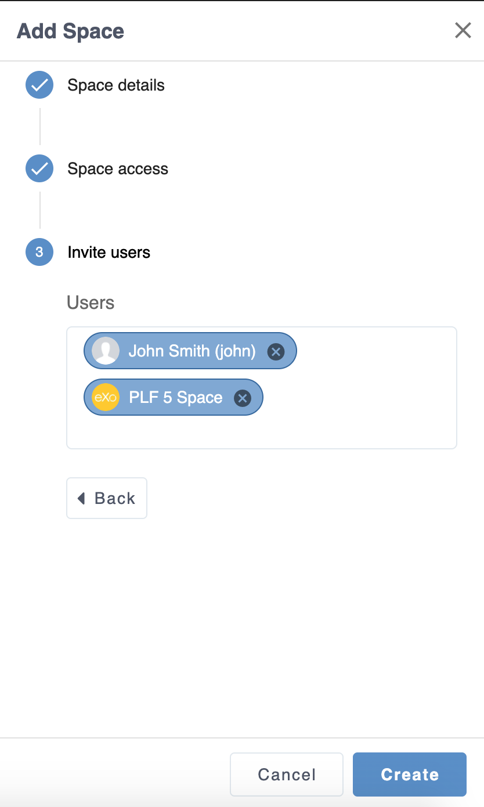
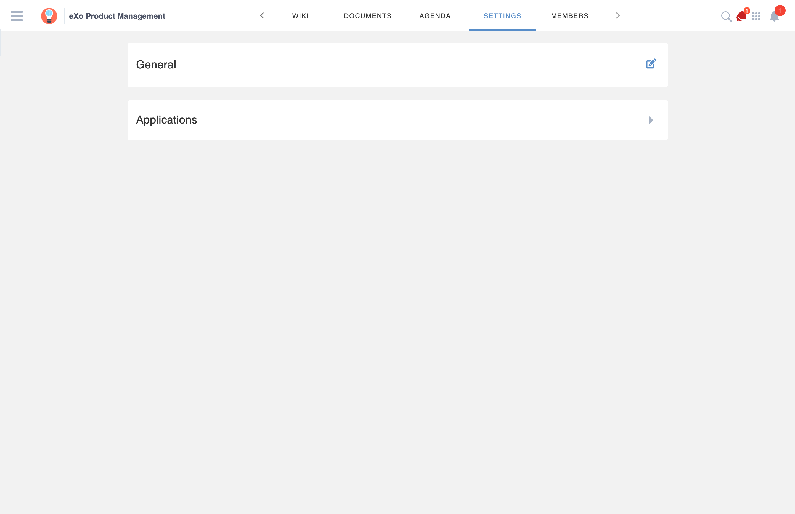
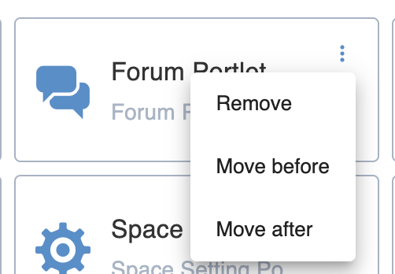
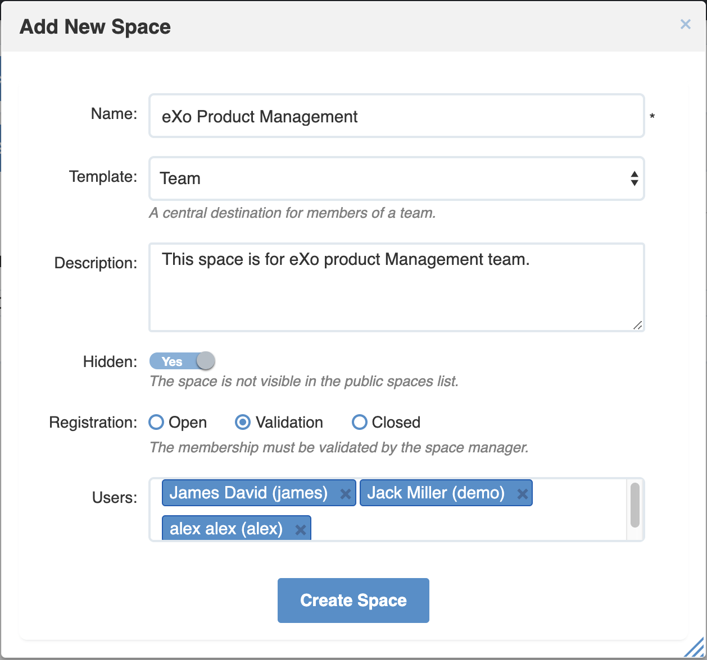

.. _Manage-Space:

######################
Working With Spaces
######################

    The "team work" concept becomes very familiar in business
    environment. By establishing one specific team or group, you and
    your collaborators can work together on important projects. Based on
    the importance of team working, eXo Platform develops the **Spaces**
    application, allowing you to collaborate with specific people. The
    scope of using spaces is so flexible that can be applied for teams,
    themes, communities or any kind of informal groups to your business
    requirements. For example, if you want to work on a team project,
    you can create a space for your team members to make organizations,
    share links and information related to the project.

    This chapter covers the following topics:

:ref:`Accessing a space <Access-Space>`

       How to access a space and its page via its URL.

:ref:`Space banner and avatar <Space-banner>`

       How to define a space banner and avatar.

:ref:`Creating a space <Create-Space>`

       Steps to create a new space with new settings, permission and members.

:ref:`Managing space settings <Manage-Space-Settings>`

       Ways to access **Space Settings** and steps to modify the space  information and visibility, to manage members and space applications, or to manage space navigation bar.

:ref:`Joining/Leaving a space <Join-Leave-Space>`

       How to join/leave a space, or to revoke your request.

:ref:`Deleting a space <Delete-Space>`

       How to delete a space where you are the manager.

:ref:`Accepting/Ignoring invitations <Accept-Ignore-Space-Invitation>`

       Steps to accept or ignore a request/invitation.

:ref:`Sharing in Space <Sharing-On-Space>`

       How to share content in a space.

.. _Access-Space:

=================
Accessing a space
=================

After logging in eXo Platform successfully, you will see a list of your
last visited spaces with a short list on the left pane of the page, and you can see all spaces via **SPACES**.

|SP-1|

**Details**:

-  |image1| The Filter box which allows you to quickly look for a
   space from your spaces list.

-  |image2| The list of last visited spaces where you are a member or manager, sorted by last visit time.

.. note::   The short list of your last visited spaces displays as many spaces as your screen allows.

-  |image3| Allows you to access the Spaces page which displays all the
   spaces in the portal. Here, you can quickly join a space or search
   for your desired space.

-  |image4| Lets you quickly create a new space.
   
.. _note-last-visited-space:

 .. note::   You can see a short list of your last visited spaces just below the Last visited button.

.. _spaces-page:

The Spaces page includes the following sections:

|SP-2|

- |image1| This section contains the following options: Add a new space, the number of spaces displayed, 
   Filter spaces by name or description and a pulldown to filter the list  : All spaces or My spaces.  

 .. note:: All spaces, including your spaces, :ref:`visible
   spaces <About-space-visibility>`, and :ref:`hidden spaces <About-space-visibility>` where
   you are invited to become members, and my spaces for spaces where you are a member or manager.

- |image2| Spaces in which you can see information like space name, avatar and cover image
   and accessing button.    

 .. note:: You can click on the information icon of the space's card which will flip to display the 
   space's description and its list of managers.
   |SP-3| 

- |image3| A block for spaces requests (invitations to join a space, pending requests sent, pending requests for your spaces and the list of the spaces your are managing.  

- |image4| A suggestion list of recommended spaces to join. 
   You can either send a request to join or decline the suggestion.   

- |image5| A list of the most popular spaces, listed by their harvested gamification points on the current week. 
   
 .. note:: You can either send a request to join the popular space if you are not a member, or decline a request sent pending .
To access a specific space, just click the space name.

.. note::   For smartphone devices, you have to slide or swipe your finger to display spaces widgets.
   |SP-12|

**Accessing via URL**

When you try to access a space or a space page via its URL while you are
not its member yet, you will receive various instructions as follows:

-  For an Open space, click Join to join that space first.

   |image6|

-  For a Visible space with Validation Registration, click Request to
   Join to send the join request first.

   |image7|

-  For a Hidden or Not existing space, click Find Spaces to open the
   :ref:`All Spaces <All-spaces-access>` page.

   |image8|

-  For a Closed space, you just can access it when being invited by your
   administrator.

   |image9|

.. note::    Super User, who has the highest permission, can see and access all spaces for the administration purpose.

.. _Space-banner:

=======================
Space banner and avatar
=======================

After :ref:`creating a space <Create-Space>`, it has the default banner (related to the space template) space icon. 
You can choose different images for the banner and the avatar.

.. _SpaceBanner:

Space banner
~~~~~~~~~~~~~~

To change the banner just mouse over in the top right corner of the
space banner, an icon |SP-13| appears.

By clicking on it, you can pick up an image from your computer.

.. tip:: The banner size should be 130 pixels height minimum.

.. note:: You can update your current banner by clicking on the same icon.

.. _SpaceAvatar:

Space avatar
~~~~~~~~~~~~~

Unlike the banner, you can choose another space avatar only from space **Settings**.

When scrolling down in the space's activity stream, or applications, you always have the space' avatar, the space name and their applications in the topbar.

.. tip:: By opening a space, the default platform topbar is replaced by the space topbar.

The space's topbar contains:

-  The space's avatar in a square form.

-  The space's name allowing you to know in which space you are.

-  The space's applications.

-  The same actions icons we already have in the platform default topbar: 
   Notifications, Applications center, Search icon and Chat.

On mobile devices, application navigation bar is displayed at the bottom and can be scrolled from right to
left.

|SP-14|

.. _Create-Space:

================
Creating a space
================

After going to the Spaces page, you can add a new space so that you and
your collaborators can work together or discuss specific topics as
follows:

1. Click |image22| at the top left corner of the **Spaces** page to open the Add New Space form.

2. A drawer panel is displayed containing all information related to the space creation based on 3 steps: 

Step 1: Space details
~~~~~~~~~~~~~~~~~~~~~~~

You must enter a space name (3 to 200 characters) and may enter an optional description (max 255 characters).

|SP-4|

.. note:: Special characters are not allowed on space names. Only the character **&** is allowed.
           
           |image75|

.. _space-templates:

A pulldown lists all predefined templates that the space creator can use. 
A description of each template is displayed below the selectors.

.. note:: Each template defines its default visibility, registration criteria and list of applications, and does have a description of the choice selected to help you choosing the best template for your needs when creating a new space.

.. note:: You can continue to the next step just by introducing the space name and click on **Continue**.

Step 2: Space access
~~~~~~~~~~~~~~~~~~~~~~~

.. _access-level-step:

You may override the predefined visibility and registration options of the space.

|SP-8|

.. _About-space-visibility:

 -  **Visibility**: By default, the Visibility (**Hidden** field) value is set to be the one predefined in the template.

   -  No: The space is not hidden and always visible in the public spaces list.

   -  Yes: The space is not visible in the public spaces list.

-  **Registration**: By default, the Registration value is set to be the one predefined in the template.

   -  Open: The users sending their requests can join the space without
      any validation.

   -  Validation: The membership must be validated by the space manager.

   -  Close: The user cannot request for joining, but only the space
      manager can invite him.

.. note:: Visibility and registration fields have a description of the choice selected to help you choosing the best template for your needs when creating a new space.
      
.. note:: You can continue to the next step with **Continue** button, and can also go back to the previous step with the **Back** button.

Step 3: Invite Users
~~~~~~~~~~~~~~~~~~~~~~~
.. _Users_invitation:      

In the third and last step, the **Users** field allows to pick users or space members that you intend to invite to the new space.

Type-ahead suggestions allow to facilitate selection users and spaces members to invite.

.. note:: Only spaces that the creator is member of can be selected. 

Users field can be pre-filled by default users or spaces defined in space template.

.. note:: You can go back to the previous step by clicking on **Back**.

|SP-9|

Finally, click **Create** button to finish adding your new space. The new space appears.

|SP-15|

.. _Space-templates:

**Space Templates**

Space templates concept is not directly exposed to users. From their perspective, they simply pick a type when creating a space.

If the space creator chooses a template from the pulldown, a description of the selected template is displayed below the pulldown:
   -  Community: A general purpose area for collaboration and communication of a digital community.
   -  Projects: A project space where members coordinate on tasks toward a predefined outcome.
   -  Communication : Interpersonal communication where a space groups are involved in exchange of ideas, skills and interests.
   -  Team: A central destination for members of a team.

   .. note:: The default template for new spaces is:  Community
  
*Predefined Space templates*

**Community**

Community is the default space template. General purpose, digital collaboration and discussion area.

Default Settings for the Community template are :
   -  Title: Community 
   -  Description: a general purpose area for collaboration and communication of a digital community.
   -  Hidden: No 
   -  Registration : Open
   -  Predefined Apps : Home, Documents, Tasks, Forum, Wiki, Calendar, Members, Settings

**Project**

Projects is ideal to coordinate actors toward a shared outcome.

 Default Settings for the Project template are :
   -  Title: Project
   -  Description: A project space where members coordinate on tasks toward a predefined outcome.
   -  Hidden: No 
   -  Registration : Validation
   -  Predefined Apps : Home, Tasks, Documents, Calendar, Wiki, Forum, Members, Settings
   
**Team**

For organizational teams or work groups.

  Default Settings for the Project template are :
   -  Title: Team
   -  Description: A central destination for members of a team.
   -  Hidden: Yes
   -  Registration : Validation
   -  Predefined Apps : Home, Calendar, Documents, Wiki, Tasks, Members, Settings
   
**Communication**

Communication is the perfect choice to exchange knowledges and skills.

   -  Title: Communication 
   -  Description: Interpersonal communication where a space groups are involved in exchange of ideas, skills and interests.
   -  Hidden: No 
   -  Registration : Validation
   -  Predefined Apps : Home, Documents, Tasks, Forum, Wiki, Calendar, Members, Settings
   
   You can redefine the space banner and the space avatar by mousing
   over and then clicking on |SP-13| allowing you to pick an image from
   your computer.

   More details about how to redefine space banner and profile :ref:`here <Space-banner>`.

.. _SpaceHome:

**Space home**

The default space home page contains the following content:

-  Activity stream: displays the space's activities

-  Description: displays the space's description and the list of the space's managers

   |SP-16|
   
-  :ref:`Calendar <CalendarApp>`: displays the events of the space's calendar by day (today's events by default)
   
   |image79|
   
.. tip:: You can view other events of the previous and the following days simply by clicking on arrows |image80|.
   
-  :ref:`Who is on line? <WhoIsOnlineApp>`: displays the online members of the space. 
   It appears while at least one member is online.
   
   |SP-11|

.. note:: :ref:`Calendar <CalendarApp>` and :ref:`Who is Online? <WhoIsOnlineApp>` portlets are the same
          as for :ref:`intranet homepage <PLFHomepage>` but specific for the space's calendar and members.

.. note:: When you are a  platform administrator and member of a space, you are able to add more portlets 
          just by clicking on Edit --> Page --> Edit layout and then drag and drop the portelt you want to add.    

.. _Space-banner-avatar:

**Space banner and avatar**

By default, the space banner is set to be the one predefined in the template and the space.

   |image28|

You can redefine the space banner and the space avatar by mousing over and then clicking on 
|image29| allowing you to pick an image from your computer in the space home page for the space avatar and space settings for the space avatar.

More details about how to redefine space banner and profile :ref:`here <Space-banner>`.

**Space applications**

   The space is featured with some default applications
   pages on the space navigation bar. Simply click each application to
   use its functions. See :ref:`Managing space navigation bar <Manage-space-navbar>` for more details.

   -  **Home**: Displays changes on the space information and all
      the activities of space members. See :ref:`Using the Activity Stream <Managing-Activities>` for more details.

   -  **Forums**: Allows space members to exchange their opinions on a
      subject. See :ref:`Building Your Forum <Forum>` for more details.

   -  **Wiki**: Allows space members to work on the same Wiki pages of the
      space, such as editing a Wiki page. See :ref:`Working With Wikis <Wiki>` for more details.

   -  **Documents**: Allows space members to work on the same documents,
      such as editing a document in the space. See :ref:`Managing Your Documents <Manage-Documents>` for more details.

   -  **Agenda**: Allows space members to create/edit the same events/tasks
      in the space calendar. See :ref:`Managing Your Calendars <Calendar>` for more details.

   -  **Settings**: Allows the space manager only to edit the space.
      This application is invisible to space members, except the space
      manager. See :ref:`Managing space settings <Manage-Space-Settings>` to know how to edit a space.

.. _MembersListOfSpace:

   -  **Members**: Displays the list of space members.

.. note:: When accessing the Members application of the space, you will
          see a list of space members. If there are so many members, the
          Show More bar will appear at the page bottom. Click Show More
          to see more members.

.. note:: In the space *Settings*, you can have an idea about the space template 
          for your space, the Space template pulldown will display the selected template but you can't change it.

		  
		  
**Others**

When a new space is created:

   -  A forum with the same name as this space is also created in the
      **Forums** application of the portal. In case this forum is
      removed from the Forums application, all members of the space
      cannot see the space's forum anymore when clicking Forums on the
      navigation bar of space.

   -  A group calendar with the same name as the space is also created
      under the Group Calendars in the Calendar application of the
      portal.

   -  An activity is created on the Activity Stream and a comment is
      added to the activity and informs that you have just joined the
      space. In case you or other space members left the space, the
      number of the space members will be updated to the activity.

      |image30|

.. note:: When more than two space characters are input between words in the space name, these spaces will be converted to ONLY ONE space when
			being displayed. With space characters at the beginning and end of space names, these space characters will be also omitted.
			After being created, your space will be automatically added to the list of MY SPACES on the left panel. Therefore, you can access your space by clicking its name.

.. _Manage-Space-Settings:

=======================
Managing space settings
=======================

If you are the creator or have the **Manage** permission on a space, you
can manage its initial settings in Space Settings, including:

-  :ref:`Space information/visibility <ChangingInfoVisibility>`

-  :ref:`Space members <ManagingMembers>`

-  :ref:`Space applications <ManagingSpaceApplication>`

-  :ref:`Space navigation bar <Manage-space-navbar>`

To edit a space, access the Space Settings page first by following one
of 3 ways:

-  **The first way**

   -  :ref:`Access your desired space <Access-Space>`, then select Settings on the space navigation bar.

      |SP-25|

-  **The second way**

   -  `Go to the Spaces page <Access-Space>`, choose the space to edit, then you click on area button to display the Edit button.

   -  Click Edit.

      |SP-5|

-  **The third way**

`Go to the Spaces page <Access-Space>`, click on **Managing**, then you click on edit button to display the edit space drawer.

      |SP-29|

.. _ChangingInfoVisibility:

Changing space information/visibility
~~~~~~~~~~~~~~~~~~~~~~~~~~~~~~~~~~~~~~~

Changing space information
---------------------------

This function allows you to edit the basic information of a space, which are General space informations and space's applications.

To open the Settings page, you can select the Settings tab in the space navigation bar.

**General**

By clicking on the edit icon in front of the General label, uyou can change space's information like: 

- Space avatar (See :ref:`Uploading your avatar <Change-your-avatar>` for more details.)

- Space Name

- Space Description 

- values of Visibility and Registration (For more details, see :ref:`here <access-level-step>`.)

Click Save to accept your changes.

.. note:: The space template combo will be disabled, so that you can't edit its template.

.. _ManagingMembers:

Managing members
~~~~~~~~~~~~~~~~~

Select the Members application in the space navigation bar.

|SP-18|

Here, you can do many actions on members as follows:

.. _InvitingMembers:

Inviting new members
---------------------

You can invite other users to join your spaces as follows:

1- You click on |SP-17|    

2- An Invite user drawer is opened.

|SP-23| 

3- Enter the username of the person you wish to invite to
      the space. You can just type in the first letters and a list of
      suggestions should appear. This list contains persons having those
      letters in their username, First name or Last name. Press Enter on
      keyboard to confirm the user selection.

.. note:: Every user, or space, added to the invite drawer, is presented by the full name and its avatar.
         If you entered a wrong username (i.e it doesn't exist), nothing will be displayed in the suggestions list. 

4. Click on Invite to send invitations to the chosen
      persons.

      If you press on Invite to confirm a wrong username, the wrong username is not taken into account on sent invitations.
      
 
The invitees will see your invitations in the :ref:`Invitations application <Accept-Ignore-Space-Invitation>` at the right panel of their homepage.

Filter space members
-----------------------
You can filter space's members by choosing a value from the pulldown: 

- Members: Displays all the space's members

- Managers: Displays only the space's managers

- Invited: displays invited users to the space

- Requested: displays users that send a request to join the space.

.. note:: Invited and Requested are visible to only the space managers.

Display Invited members
-------------------------

You can display the list of invited users just by selecting **Invited** on the filter space members pulldown.

|SP-19|

Display Requested to join  members
------------------------------------

You can display the list of members who sent a request to join the space just by selecting **Requested** on the filter space members pulldown.

|SP-20|

.. _PromotingDemotingMember:

Promoting/Demoting a member
----------------------------

-  To promote a member to the manager position, click **Promote Manager** in the
   member pulldown. The member is automatically promoted as a manager
   in the current space.

|SP-22|

-  To demote a member, click **Remove Manager**, and the member is automatically removed as a manager
   in the current space

.. note:: Be careful not to remove the rights for yourself; otherwise, you
			will not be able to change your space's settings anymore. Besides,
			there should be at least one manager in a space, so the last manager
			of the space is not permitted to be demoted.

.. note:: When you are a space manager, an icon is displayed next to the information icon.
      This icon is used to easily identify managers. By mousing over this icon, a **Space Manager**
      tooltip is displayed. |SP-24|

.. _RemovingMember:

Removing a member
------------------

To remove a member from your space, you can click on **Remove** in the
   member pulldown. The member is automatically removed from the space.

In case this member is the only manager of the space,
a warning is displayed:

|image52|

That is, you should promote another member to the manager position
before you can delete that member.

 .. note::You cannot invite, promote, demote or remove users who are :ref:`suspended by an administrator <ManagingUsers.DisablingUser>`.
    
.. _ManagingSpaceApplication:    

Managing space applications
~~~~~~~~~~~~~~~~~~~~~~~~~~~~~~

By clicking on the arrow in front of Applications label, the **Applications** page which allows
you to manage space applications is displayed.

|SP-27|

Here, you can:

Adding a new space application
-------------------------------

1. Click Add Application icon to open the *Space Application Installer* drawer.

|SP-21|

2. Select the application you want to add by clicking Add icon
in front of it.

If there is no available application, ask your system administrator to
gain the access right.

Deleting an application
--------------------------

To remove an application, click **Remove** in the application's pulldown.

|SP-28|

 .. note::You cannot delete the Space Settings application because it is configured as a mandatory space application.

Renaming an application
-------------------------

As manager of a space, you are allowed to rename its applications **except the Activity Stream**.
To rename an application, simply double-click on its name.

.. _Manage-space-navbar:

Managing space navigation bar
-------------------------------

Each space is featured with some "pages" on the space navigation bar.
These pages may contain applications or any content. By clicking on each
page, you will be redirected to it.

|SP-26|

Also, you can easily manage these applications display order on the space navigation bar
by selecting choices between: *Move After* or *Move Before*.

Every change is automatically saved and the new applications order is available after a refresh.

.. _Join-Leave-Space:

=======================
Joining/Leaving a space
=======================

.. _Join-space:

Joining a space
~~~~~~~~~~~~~~~~~~

:ref:`Go to the Spaces page <Access-Space>` and you will see all your spaces and ones
whose :ref:`Visibility <About-space-visibility>` is set to "Visible".

There are two cases to join a space:

-  **The first instance**: For spaces without validation required, click
   Join corresponding to your desired space. You will automatically
   become their members.

-  **The second instance**: For spaces with validation required, after
   clicking Request to Join, you have to wait for the validation from
   the space's manager who can accept or deny your request.

.. _Revoke-space-request:

Revoking your request
~~~~~~~~~~~~~~~~~~~~~~~~~

-  To revoke your request for joining a space that has not been
   validated by its manager, simply click Cancel in the Pending requests drawer.

   |SP-6|

.. _Leave-space:

Leaving a space
~~~~~~~~~~~~~~~~~

-  To leave a space, simply click Leave.

If you are the only leader of that space, the message which informs that
you cannot leave a space will appear as below.

|image61|

 .. note: After you have left a space, the space will not exist in the My
			Spaces tab, but in the All Spaces tab (for the "visible" space
			only). You are not able to view activities of the spaces you have
			left unless those where you have been mentioned.
      Once you leave the space, you will not be able to see any activity, nor
      receiving notifications of your former publications on this space

.. _Delete-Space:

================
Deleting a space
================

Only the space managers have permission to delete their spaces.

1. Open the Spaces pages, then select the space you want to delete.

2. Click on **Remove** in the area button.

|SP-5|

3. A confirmation message appears:

|image74|

4. Click **OK** in the confirmation message to accept deleting the space.

.. note:: When a space is deleted, all information, contents (documents, tasks, events...) and 
          navigations related to that space are also deleted.
          
If you click on ``Cancel`` button of the confirmation message, nothing happens.          

.. _Accept-Ignore-Space-Invitation:

==============================
Accepting/Ignoring invitations
==============================

This function allows you to accept and/or deny invitations that you
received from others. You can see all spaces which are being waited for
your acceptance in the Invitations Received drawer, or directly in the Spaces page.

-  To accept/ignore the invitations via the Invitations drawer.
   |SP-7|

-  To accept/ignore the invitations in the Spaces page, you can click Accept to join/ Decline corresponding to your desired space to 
   accept/deny joining the space respectively.

   |SP-10|

.. _Sharing-On-Space:

================
Sharing in Space
================

To share an update, a document or a link in a space, you must be a
member first. Then follow these steps:

1. :ref:`Access to the space <Access-Space>` in which you want to publish a post.

2. Point to the space's activity stream.

3. Compose your text message or upload documents or attach a link in the activity composer. It is same as :ref:`Sharing in activity stream <Share-AS>`.

|image64|

4. Finally click on Post to share the status.

|image65|

When you mouse over the space name from the post, a popover is displayed
with the space name, the space avatar and the space description.

|image66|

If you are a member in the space and not an administrator or creator, in
addition to the previously cited components, a Chat button allowing
you to start a discussion with the space members.

Only the space managers and authors of the posts can delete the
activities by clicking on the delete (1) icon in the corner. All
notifications related to that deleted activity in the space are also
deleted.

.. |SP-3| image:: images/spaces/Space_card.gif

.. |SP-20| image:: images/spaces/requested_users.png

.. |SP-24| image:: images/spaces/space_manager.png

.. |image0| image:: images/social/spaces_list.png
.. |image1| image:: images/common/1.png
.. |image2| image:: images/common/2.png
.. |image3| image:: images/common/3.png
.. |image4| image:: images/common/4.png
.. |image5| image:: images/common/5.png
.. |image6| image:: images/social/restricted_area_join.png
.. |image7| image:: images/social/restricted_area_request_to_join.png
.. |image8| image:: images/social/restricted_area_find_spaces.png
.. |image9| image:: images/social/restricted_area_closed_space.png
.. |image10| image:: images/social/update_image_icon.png
.. |image11| image:: images/social/update_banner.png

.. |image13| image:: images/social/update_image_icon.png
.. |image14| image:: images/social/delete_image_icon.png
.. |image15| image:: images/social/update_image_icon.png
.. |image16| image:: images/social/space_avatar_update.png
.. |image17| image:: images/social/space_new_navbar.png
.. |image18| image:: images/social/more_button.png
.. |image19| image:: images/social/navBar_with_more_button.png
.. |image20| image:: images/social/remaining_apps.png
.. |image21| image:: images/social/space_new_navbar_mobile.gif

.. |image24| image:: images/social/add_new_space_invite_users.png

.. |image27| image:: images/social/space_navigation_bar.png
.. |image28| image:: images/social/space_avatar_default.png
.. |image29| image:: images/social/update_image_icon.png
.. |image30| image:: images/social/new_space_on_activity_stream.png
.. |image31| image:: images/social/add_new_space_visibility.png
.. |image32| image:: images/social/add_new_space_select_user.png
.. |image33| image:: images/social/space_settings_on_navigation_bar.png
.. |image34| image:: images/social/edit_space.png
.. |image35| image:: images/social/space_configuration_settings_tab.png
.. |image36| image:: images/common/select_users_icon.png
.. |image37| image:: images/platform/select_users_form.png
.. |image38| image:: images/common/search_icon.png
.. |image39| image:: images/social/invite_members_app.png
.. |image40| image:: images/common/1.png
.. |image41| image:: images/common/2.png
.. |image42| image:: images/common/3.png
.. |image43| image:: images/common/remove_icon.png
.. |image44| image:: images/common/4.png
.. |image45| image:: images/common/select_everyone_icon.png
.. |image46| image:: images/common/delete_icon.png
.. |image47| image:: images/social/validate_icon.png
.. |image48| image:: images/social/decline_icon.png
.. |image49| image:: images/social/promote_space_manager_button.png
.. |image50| image:: images/social/demote_space_manager_button.png
.. |image51| image:: images/common/delete_icon.png
.. |image52| image:: images/social/remove_space_manager_warning.png
.. |image53| image:: images/social/space_application_installer_form.png
.. |image54| image:: images/common/remove_icon.png
.. |image55| image:: images/social/space_navigation_bar.png
.. |image56| image:: images/social/space_configuration_navigations_tab.png
.. |image57| image:: images/social/space_page_creation.png
.. |image58| image:: images/social/member_tab_space.png
.. |image59| image:: images/social/wrong_name.png
.. |image60| image:: images/social/wrong_username-popup.png
.. |image61| image:: images/social/warning_leave_space.png
.. |image62| image:: images/social/delete_my_spaces.png
.. |image64| image:: images/social/Space_status.png
.. |image65| image:: images/social/status_shared_space.png
.. |image66| image:: images/social/space_popover.png
.. |image67| image:: images/social/space_popover_member.png
.. |image68| image:: images/social/update_image_icon.png

.. |image70| image:: images/social/update_image_icon.png
.. |image71| image:: images/social/update_image_icon.png

.. |image73| image:: images/social/rename_space_app.png

