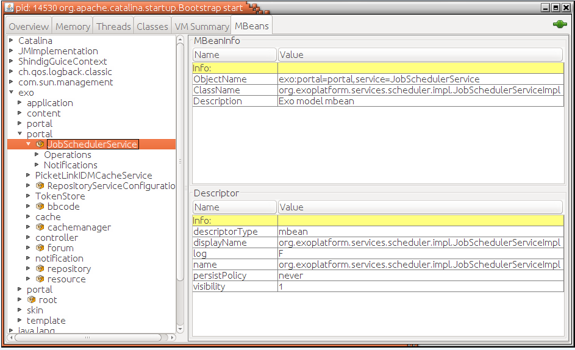
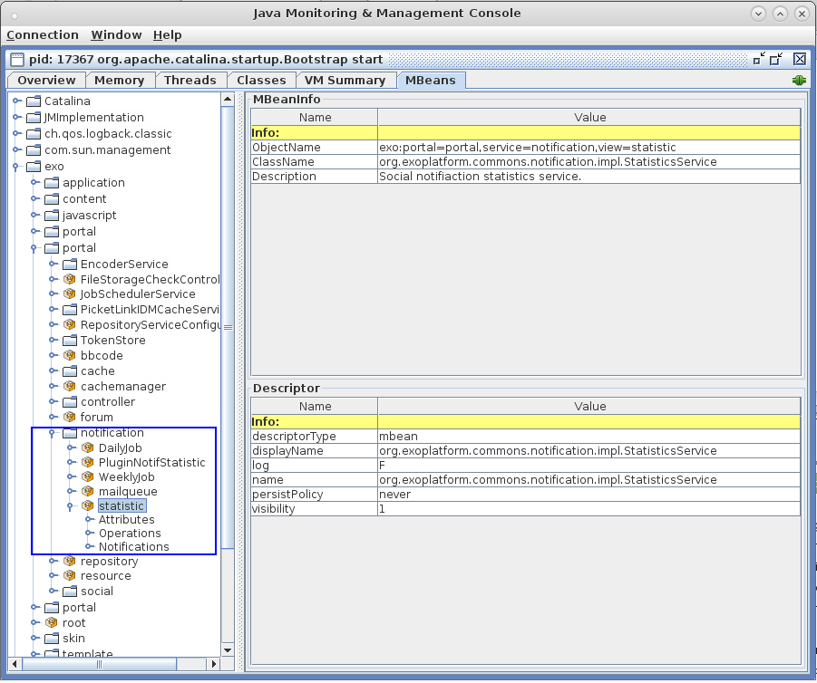

.. _Management:

####################
JMX/REST Management
####################

    In this chapter, the following topics are included:

    -  :ref:`Introduction to eXo Platform management <Management.Introduction>`
       Overall information about managing resources of eXo Platform, JMX and
       REST interfaces.

    -  :ref:`Management views of eXo Platform <Management.ManagementViews>`
       Introduction to the following set of management view types of
       eXo Platform and their Object Names:

       -  :ref:`PortalContainer management view <Management.ManagementViews.PortalContainerManagementView>`

       -  :ref:`Cache management view <Management.ManagementViews.CacheManagementView>`

       -  :ref:`Content management view <Management.ManagementViews.ExoContentManagementView>`

       -  :ref:`JCR management view <Management.ManagementViews.JCRManagementView>`

       -  :ref:`Portal management view <Management.ManagementViews.PortalManagementView>`
       
       -  :ref:`Forum management view <Management.ManagementViews.ForumManagementView>`

    -  :ref:`Jobs and Job Scheduler <Management.JobScheduler>`
       List of the Cron Jobs and the Job Scheduler MBean.

    -  :ref:`eXo Platform notifications monitoring <Management.Monitoring>`
       A step by step to monitor notifications.

.. _Management.Introduction:

========================================
Introduction to eXo Platform management
========================================

Managing resources of eXo Platform is critical for IT operators and system
administrators to monitor and supervise the production system. eXo Platform
can be managed using JMX (Java Management Extension) tools or REST
service.

To use JMX, some settings are required. To use REST service, you just
need a browser. As you will see later in this chapter, all operations
are available in JMX and some of them are available in REST. So use JMX
if you need all operations and use REST in some cases, for example, you
are on a machine that JMX is not installed, or at remote region where
JMX is inaccessible because of security setup.

.. _ManageWithJMX:

How to manage eXo Platform with JMX
~~~~~~~~~~~~~~~~~~~~~~~~~~~~~~~~~~~~

**JMX and JMX Client**

.. note:: See `Oracle's Documentation <http://docs.oracle.com/javase/1.5.0/docs/guide/jmx/overview/intro.html>`__ to learn about JMX (Java Management Extension).

To manage eXo Platform with JMX, you need a JMX Client, or more exactly 
an MBean Browser.
`JConsole <http://docs.oracle.com/javase/6/docs/technotes/guides/management/jconsole.html>`__
is a built-in tool, and it features an MBean browser, so it does not
require any installation. Another suggestion is
`VisualVM <http://visualvm.java.net/>`__, which requires some steps to
`install its MBean plugin <https://visualvm.java.net/plugins.html>`__.

The tools are graphical and you may just try and use to explore MBean.
In this chapter, the following terms will be used to describe an
individual or a group of similar MBeans:

-  *Object Name* is used to identify and indicate an MBean. All MBeans
   introduced in this chapter can be found under a group "exo", however
   their organization may make it difficult to find an MBean. For
   example, you will see three groups with the same name "portal", so
   this document will not indicate an MBean by its position in the
   MBeans tree, but by its Object Name.

   If you are using VisualVM, you can see Object Name in the "Metadata"
   tab.

-  *Attribute* is a pair of "Name" and "Value". A list of Attributes
   shows the state of an MBean object.

-  *Operation* is a function that you can invoke. Each MBean provides
   some (or no) Operations. Some Operations are "Set" and some
   Operations are "Get". An Operation may require data inputs.

**Configuring eXo Platform to allow JMX access**

The JMX configurations are JVM options and thus basically not specific
to eXo Platform. Such configurations are explained at `Oracle's
Documentation <http://docs.oracle.com/javase/6/docs/technotes/guides/management/agent.html>`__.

In eXo Platform, by default JMX is not configured. Thus, local access is
enabled and remote access is disabled. Authentication is disabled as
well, this means username and password are not required. If you want to
enable remote access or authorization, you need to start customizing
eXo Platform, as instructed in the :ref:`Customizing environment variables <CustomizingEnvironmentVariables>`
section.

After the start, put your JMX configurations in the form described in
`Advanced Customization <AdvancedCustomization>` section.

Although the two sections are written for Tomcat bundle, it is very
similar for JBoss, except the customized configuration file. In JBoss,
the file is ``$PLATFORM_JBOSS_HOME/bin/standalone-customize.conf`` for
Linux, ``$PLATFORM_JBOSS_HOME/bin/standalone-customize.conf.bat`` for
Windows. You can create it by using the sample file
``$PLATFORM_JBOSS_HOME/bin/standalone-customize.sample.conf`` for Linux
or ``$PLATFORM_JBOSS_HOME/bin/standalone-customize.sample.conf.bat`` for
Windows.

**Securing JMX connection**

It is recommended to enable security for production system. You may:

-  Enable SSL. See `Using
   SSL <http://docs.oracle.com/javase/6/docs/technotes/guides/management/agent.html#gdemv>`__.

-  Enable Password Authentication. See `Using Password
   Authentication <http://docs.oracle.com/javase/6/docs/technotes/guides/management/agent.html#gdenv>`__
   and `Using Password and Access
   Files <http://docs.oracle.com/javase/6/docs/technotes/guides/management/agent.html#gdeup>`__.

.. _ManageWithREST:

How to manage eXo Platform with REST service
----------------------------------------------

Using REST service, you can do some operations with a browser. It
requires no setup.

You need to be member of **/platform/administrators** to access REST
services.

You also need to know the URL of a service (or its attributes and
operations) to access it. You can get the URLs as follows:

1. Enter the base URL: *http://[your\_server]:[your\_port]/rest/private/management*, 
   which is to access all management REST services, in your browser, 
   then log in.
   The page returns a list of available REST services in plain text.

2. Select a service name and append it to the base URL. You will have 
   the service's URL, for example:
   *http://[your\_server]:[your\_port]/rest/private/management/skinservice*.
   Entering this URL, you will get a list of attributes (as "properties")
   and operations (as "method").

3. Continue appending an attribute of Step 2 to have URL of a method or
   property. Let's see the "skinservice" as an example:

   -  Its property "SkinList" can be accessed by the URL:
      *http://[your\_server]:[your\_port]/rest/private/management/skinservice/SkinList*.

   -  Its method "reloadSkins" can be invoked by the URL:
      *http://[your\_server]:[your\_port]/rest/private/management/skinservice/reloadSkins*.

   -  The URL of the method "reloadSkin" is a bit complex because the
      method requires parameter "skinId" (to know which Skin will be
      reloaded):
      *http://[your\_server]:[your\_port]/rest/private/management/skinservice/reloadSkin?skinId=Default*.

.. _Management.ManagementViews:

=================================
Management views of eXo Platform
=================================

-  :ref:`PortalContainer management view <Management.ManagementViews.PortalContainerManagementView>`
   The management view of all objects and configurations of a given
   portal.

-  :ref:`Cache management view <Management.ManagementViews.CacheManagementView>`
   The management view of eXo Platform caches at several levels that 
   provides the critical performance information, especially useful for 
   tuning the server.

-  :ref:`Content management view <Management.ManagementViews.ExoContentManagementView>`
   The management view of WCMService.

-  :ref:`JCR management view <Management.ManagementViews.JCRManagementView>`
   The management view of SessionRegistry, LockManager, Repository, and
   Workspace that allow you to monitor sessions, locks, repository
   configurations, and workspace configurations respectively.

-  :ref:`Portal management view <Management.ManagementViews.PortalManagementView>`
   A set of the Portal management views, including Template statistics,
   Template service, Skin service, TokenStore, Portal statistics, and
   Application statistics.

-  :ref:`Forum management view <Management.ManagementViews.ForumManagementView>`
   A set of the Forum management views, including Forum, Job, Plugin,
   Storage that allows you to control rules, statistics, information of
   data storage.

.. _Management.ManagementViews.PortalContainerManagementView:

PortalContainer management view
~~~~~~~~~~~~~~~~~~~~~~~~~~~~~~~~

PortalContainer manages all objects and configurations of a given
portal.

-  The Object Name of PortalContainer MBeans:
   **exo:container=portal,name=portal**.

+---------------------------+------------------------------------------------+
| Attribute                 | Description                                    |
+===========================+================================================+
| ``ConfigurationXML``      | Configuration information of the specified     |
|                           | portal container in the XML format.            |
+---------------------------+------------------------------------------------+
| ``Name``                  | The name of the portal container.              |
+---------------------------+------------------------------------------------+
| ``RegisteredComponentName | The list of the registered component names.    |
| s``                       |                                                |
+---------------------------+------------------------------------------------+
| ``Started``               | Indicates if the portal container is started   |
|                           | or not.                                        |
+---------------------------+------------------------------------------------+

+---------------------------+------------------------------------------------+
| Operation                 | Description                                    |
+===========================+================================================+
| ``getConfigurationXML``   | Returns configuration information of the       |
|                           | portal container calculated by the loading     |
|                           | mechanism. The returned value is an XML        |
|                           | document in the eXo Kernel format.             |
+---------------------------+------------------------------------------------+
| ``getName``               | Returns the portal container name.             |
+---------------------------+------------------------------------------------+
| ``getRegisteredComponentN | Returns the list of all registered component   |
| ames``                    | names.                                         |
+---------------------------+------------------------------------------------+
| ``isStarted``             | Checks if the portal container is started or   |
|                           | not. The portal container is only started once |
|                           | all its components have been started.          |
+---------------------------+------------------------------------------------+

.. note:: PortalContainer can be controlled through the following path:
			-  http://mycompany.com:8080/rest/management/pcontainer.

.. _Management.ManagementViews.CacheManagementView:

Cache management view
~~~~~~~~~~~~~~~~~~~~~~

eXo Platform uses caches at several levels. Monitoring them can provide the
critical performance information, especially useful for tuning the
server. Each cache is exposed with statistics and management operations.

CacheService
-------------

-  There are many Cache MBeans of which the Class Name is common:
   **org.exoplatform.services.cache.concurrent.ConcurrentFIFOExoCache**
   and the Object Names are: **exo:service=cache,name={CacheName}**
   where **CacheName** is specified for each MBean.

+----------------------+-----------------------------------------------------+
| Attribute            | Description                                         |
+======================+=====================================================+
| ``Name``             | The name of the cache.                              |
+----------------------+-----------------------------------------------------+
| ``Capacity``         | The maximum capacity of the cache.                  |
+----------------------+-----------------------------------------------------+
| ``HitCount``         | The total number of times the cache was             |
|                      | successfully queried.                               |
+----------------------+-----------------------------------------------------+
| ``MissCount``        | The total number of times the cache was queried     |
|                      | without success.                                    |
+----------------------+-----------------------------------------------------+
| ``Size``             | The number of entries in the cache.                 |
+----------------------+-----------------------------------------------------+
| ``TimeToLive``       | The valid period of the cache in seconds. If the    |
|                      | value is set to **-1**, the cache never expires.    |
+----------------------+-----------------------------------------------------+

+----------------------+-----------------------------------------------------+
| Operation            | Description                                         |
+======================+=====================================================+
| ``clearCache()``     | Evicts all entries from the cache. This method can  |
|                      | be used to force a programmatic flush of the cache. |
+----------------------+-----------------------------------------------------+
| ``getName``          | Returns the cache name.                             |
+----------------------+-----------------------------------------------------+
| ``getLiveTime``      | Returns the valid lifetime of an entry in the cache |
|                      | in seconds.                                         |
+----------------------+-----------------------------------------------------+
| ``setLiveTime``      | Sets the valid lifetime of an entry in the cache in |
|                      | seconds.                                            |
+----------------------+-----------------------------------------------------+
| ``getCacheHit``      | Returns the total number of successful hits.        |
+----------------------+-----------------------------------------------------+
| ``getCacheMiss``     | Returns the total number of unsuccessful hits.      |
+----------------------+-----------------------------------------------------+
| ``getMaxSize``       | Returns the maximum capacity of the cache.          |
+----------------------+-----------------------------------------------------+
| ``setMaxSize``       | Sets the maximum capacity of the cache.             |
+----------------------+-----------------------------------------------------+
| ``getCacheSize``     | Returns the number of entries in the cache.         |
+----------------------+-----------------------------------------------------+

CacheManager
-------------

The CacheManager MBean has no attribute and only one method to clear all
the Caches.

-  The Object Name of CacheManager Mbeans: **exo:service=cachemanager**.

+----------------------+-----------------------------------------------------+
| Operation            | Description                                         |
+======================+=====================================================+
| ``clearCaches()``    | Forces a programmatic flush of all the registered   |
|                      | caches.                                             |
+----------------------+-----------------------------------------------------+

PicketLinkIDMCacheService
--------------------------

PicketLinkIDMCacheService is the default implementation for the
organization model. It has no attribute.

-  The Object Name of PicketLinkIDMCacheService MBean:
   **exo:portal="portal",service=PicketLinkIDMCacheService,name=plidmcache**.

+----------------------+-----------------------------------------------------+
| Operation            | Description                                         |
+======================+=====================================================+
| ``invalidateAll``    | Invalidates all cache entries.                      |
+----------------------+-----------------------------------------------------+
| ``invalidate(namespa | Invalidates a specific cache namespace.             |
| ce)``                |                                                     |
+----------------------+-----------------------------------------------------+
| ``printCaches``      | Lists out all cache entries.                        |
+----------------------+-----------------------------------------------------+

.. note:: PicketLinkIDMCacheService can be controlled through the following path:

			-  http://mycompany.com:8080/rest/management/plidmcache.

		  However, the REST View managements of CacheService and CacheManager are not currently exposed in this version.

.. _Management.ManagementViews.ExoContentManagementView:

Content management view
~~~~~~~~~~~~~~~~~~~~~~~~

WCMService
------------

-  The Object Name of WCMService MBean:
   **exo:portal=portal,service=wcm,view=portal,type=content**.

+------------------------+---------------------------------------------------+
| Attribute              | Description                                       |
+========================+===================================================+
| ``PortletExpirationCac | The expiration period of portlet cache in         |
| he``                   | seconds.                                          |
+------------------------+---------------------------------------------------+

+------------------------+---------------------------------------------------+
| Operation              | Description                                       |
+========================+===================================================+
| ``getPortletExpiration | Returns the expiration period of portlet cache in |
| Cache``                | seconds.                                          |
+------------------------+---------------------------------------------------+
| ``setPortletExpiration | Sets the expiration period of portlet cache by    |
| Cache (expirationCache | entering the value into the **expirationCache**   |
| )``                    | field.                                            |
+------------------------+---------------------------------------------------+

.. note:: WCMService can be controlled through the following paths respectively:
			-  http://mycompany.com:8080/rest/management/wcmservice/.

.. _Management.ManagementViews.JCRManagementView:

JCR management view
~~~~~~~~~~~~~~~~~~~~~

Java Content Repository (JCR) provides a management view to monitor
sessions, locks, repository configurations, and workspace
configurations.

Repository
------------

-  The Object Name of Repository MBean:
   **exo:portal=portal,repository=repository**.

+---------------------------+------------------------------------------------+
| Attribute                 | Description                                    |
+===========================+================================================+
| ``Name``                  | The name of the repository container.          |
+---------------------------+------------------------------------------------+
| ``RegisteredComponentName | The list of registered component names in the  |
| s``                       | repository.                                    |
+---------------------------+------------------------------------------------+

+---------------------------+------------------------------------------------+
| Operation                 | Description                                    |
+===========================+================================================+
| ``getName``               | Returns the repository container name.         |
+---------------------------+------------------------------------------------+
| ``getRegisteredComponentN | Returns the list of registered component names |
| ames``                    | in the repository.                             |
+---------------------------+------------------------------------------------+

SessionRegistry
----------------

-  The Object Name of SessionRegistry MBean:
   **exo:portal=portal,repository=repository,service=SessionRegistry**.

+--------------------+--------------------------------------------------------+
| Attribute          | Description                                            |
+====================+========================================================+
| ``TimeOut``        | The expiration period of a JCR session.                |
+--------------------+--------------------------------------------------------+
| ``Size``           | The number of currently active sessions.               |
+--------------------+--------------------------------------------------------+

+--------------------+--------------------------------------------------------+
| Operation          | Description                                            |
+====================+========================================================+
| ``runCleanup``     | Cleans all JCR sessions timed out.                     |
+--------------------+--------------------------------------------------------+
| ``getTimeOut``     | Returns the session timeout.                           |
+--------------------+--------------------------------------------------------+
| ``setTimeOut``     | Sets the session timeout in seconds.                   |
+--------------------+--------------------------------------------------------+
| ``getSize``        | Returns the number of currently active sessions.       |
+--------------------+--------------------------------------------------------+

Workspace
----------

-  There are several default workspaces listed below, each of them
   corresponds to a Workspace MBean:

+--------------------+--------------------------------------------------------+
| Workspace Name     | Description                                            |
+====================+========================================================+
| ``collaboration``  | Data, such as sites content, documents, groups,        |
|                    | records space, tags, and users.                        |
+--------------------+--------------------------------------------------------+
| ``dms-system``     | Data of DMS, including node types, templates, views,   |
|                    | taxonomy trees.                                        |
+--------------------+--------------------------------------------------------+
| ``knowledge``      | Data of Forum, FAQ and Poll applications.              |
+--------------------+--------------------------------------------------------+
| ``portal-system``  | Data of the Portal model objects, such as navigations, |
|                    | pages, sites, and application registry.                |
+--------------------+--------------------------------------------------------+
| ``portal-work``    | Information of Gadget token and Remember me token.     |
+--------------------+--------------------------------------------------------+
| ``social``         | Data of Social, including activity, identity, profile, |
|                    | relationship and space.                                |
+--------------------+--------------------------------------------------------+
| ``system``         | Data of system, including versions storage, node       |
|                    | types, namespaces.                                     |
+--------------------+--------------------------------------------------------+

-  The Object Name of Workspace MBeans:
   **exo:portal=portal,repository=repository,workspace={WorkspaceName}**
   where **WorkspaceName** is the name of each workspace.

+--------------------------+--------------------------------------------------+
| Attribute                | Description                                      |
+==========================+==================================================+
| ``Name``                 | The name of the workspace container.             |
+--------------------------+--------------------------------------------------+
| ``RegisteredComponentNam | The list of registered component names in the    |
| es``                     | workspace.                                       |
+--------------------------+--------------------------------------------------+

+--------------------------+--------------------------------------------------+
| Operation                | Description                                      |
+==========================+==================================================+
| ``getName``              | Returns the workspace container name.            |
+--------------------------+--------------------------------------------------+
| ``getRegisteredComponent | Returns the list of registered component names   |
| Names``                  | in the workspace.                                |
+--------------------------+--------------------------------------------------+

LockManager
------------

-  Each Workspace has an MBean to manage locks.

   The Object Name of LockManager MBeans:
   **exo:portal=portal,repository=repository,workspace={WorkspaceName},service=lockmanager**
   where **WorkspaceName** is the name of each workspace.

+--------------------+--------------------------------------------------------+
| Attribute          | Description                                            |
+====================+========================================================+
| ``NumLocks``       | The number of active locks.                            |
+--------------------+--------------------------------------------------------+

+--------------------+--------------------------------------------------------+
| Operation          | Description                                            |
+====================+========================================================+
| ``cleanExpiredLock | Removes all expired JCR locks.                         |
| s``                |                                                        |
+--------------------+--------------------------------------------------------+
| ``getNumLocks``    | Returns the number of active JCR locks.                |
+--------------------+--------------------------------------------------------+

.. note:: Currently, the REST View managements of SessionRegistry,
		  LockManager, Repository and Workspace are not exposed in this
          version.

.. _Management.ManagementViews.PortalManagementView:

Portal management view
~~~~~~~~~~~~~~~~~~~~~~~~

Template statistics
--------------------

Template statistics exposes various templates used by the portal and its
components to render markups. Various statistics are available for
individual templates, and aggregated statistics, such as the list of the
slowest templates. Most management operations are performed on a single
template; those operations take the template identifier as an argument.

-  The Object Name of Template statistics MBean:
   **exo:portal=portal,service=statistic,view=portal,type=template**.

+-----------------------+----------------------------------------------------+
| Attribute             | Description                                        |
+=======================+====================================================+
| ``TemplateList``      | The list of templates loaded.                      |
+-----------------------+----------------------------------------------------+
| ``SlowestTemplates``  | The list of the 10 slowest templates.              |
+-----------------------+----------------------------------------------------+
| ``MostExecutedTemplat | The list of the 10 most used templates.            |
| es``                  |                                                    |
+-----------------------+----------------------------------------------------+
| ``FastestTemplates``  | The list of 10 fastest templates.                  |
+-----------------------+----------------------------------------------------+

+---------------------------+------------------------------------------------+
| Operation                 | Description                                    |
+===========================+================================================+
| ``getAverageTime(template | Returns the average rendering time of a        |
| Id)``                     | specified template in seconds.                 |
+---------------------------+------------------------------------------------+
| ``getExecutionCount(templ | Returns the number of times executed by the    |
| ateId)``                  | specified template.                            |
+---------------------------+------------------------------------------------+
| ``getMinTime(templateId)` | Returns the minimum rendering time of the      |
| `                         | specified template in seconds.                 |
+---------------------------+------------------------------------------------+
| ``getMaxTime(templateId)` | Returns the maximum rendering time of the      |
| `                         | specified template in seconds.                 |
+---------------------------+------------------------------------------------+
| ``getSlowestTemplates``   | Returns the list of the 10 slowest templates.  |
+---------------------------+------------------------------------------------+
| ``getMostExecutedTemplate | Returns the list of the 10 most used           |
| s``                       | templates.                                     |
+---------------------------+------------------------------------------------+
| ``getTemplateList``       | Returns the list of templates loaded.          |
+---------------------------+------------------------------------------------+
| ``getFastestTemplates``   | Returns the list of the 10 fastest templates.  |
+---------------------------+------------------------------------------------+

Template management
--------------------

Template management provides the capability to force the reload of a
specified template.

-  The Object Name of Template management MBean:
   **exo:portal=portal,service=management,view=portal,type=template**.

+------------------------+---------------------------------------------------+
| Operation              | Description                                       |
+========================+===================================================+
| ``reloadTemplates``    | Clears the template cache.                        |
+------------------------+---------------------------------------------------+
| ``listCachedTemplates` | Lists identifiers of the cached templates.        |
| `                      |                                                   |
+------------------------+---------------------------------------------------+
| ``reloadTemplate(templ | Clears the template cache for a specified         |
| ateId)``               | template identifier.                              |
+------------------------+---------------------------------------------------+

Skin management
----------------

-  The Object Name of Skin management MBean:
   **exo:portal=portal,service=management,view=portal,type=skin**.

+---------------------+------------------------------------------------------+
| Attribute           | Description                                          |
+=====================+======================================================+
| ``SkinList``        | The list of loaded skins by the skin service.        |
+---------------------+------------------------------------------------------+

+---------------------+------------------------------------------------------+
| Operation           | Description                                          |
+=====================+======================================================+
| ``reloadSkin(skinId | Forces a reload of the specified skin and the        |
| )``                 | operation.                                           |
+---------------------+------------------------------------------------------+
| ``reloadSkins``     | Forces a reload of the loaded skins.                 |
+---------------------+------------------------------------------------------+
| ``getSkinList``     | Returns the list of loaded skins by the skin         |
|                     | service.                                             |
+---------------------+------------------------------------------------------+

TokenStore
-----------

-  The Object Name of TokenStore MBeans:
   **exo:portal=portal,service=TokenStore,name={Name}** where **Name**
   is the name of each specific token.

+---------------------+------------------------------------------------------+
| Attribute           | Description                                          |
+=====================+======================================================+
| ``Name``            | The name of one specific token.                      |
+---------------------+------------------------------------------------------+
| ``ValidityTime``    | The expiration period of one specific token in       |
|                     | seconds.                                             |
+---------------------+------------------------------------------------------+
| ``PeriodTime``      | The expiration daemon period of one specific token   |
|                     | in seconds. The token is deleted after the specified |
|                     | period.                                              |
+---------------------+------------------------------------------------------+

+---------------------+------------------------------------------------------+
| Operation           | Description                                          |
+=====================+======================================================+
| ``cleanExpiredToken | Removes all expired tokens.                          |
| s``                 |                                                      |
+---------------------+------------------------------------------------------+
| ``size``            | Returns the number of tokens, including valid tokens |
|                     | and expired tokens undeleted yet.                    |
+---------------------+------------------------------------------------------+
| ``getName``         | Returns the token name.                              |
+---------------------+------------------------------------------------------+
| ``getValidityTime`` | Returns the expiration time of one specific token in |
|                     | seconds.                                             |
+---------------------+------------------------------------------------------+
| ``getPeriodTime``   | Returns the expiration daemon period of one specific |
|                     | token in seconds.                                    |
+---------------------+------------------------------------------------------+

eXo Platform provides the following TokenStore instances:

+---------------------+------------------------------------------------------+
| Token Name          | Description                                          |
+=====================+======================================================+
| ``gadget-token``    | Stores tokens of the Oauth gadget into the JCR node, |
|                     | such as **org.exoplatform.portal.gadget.core.Gadget  |
|                     | TokenInfoService**.                                  |
+---------------------+------------------------------------------------------+
| ``jcr-token``       | Stores common tokens into the JCR node, such as      |
|                     | **org.exoplatform.web.security.security.CookieTokenS |
|                     | ervice**,                                            |
|                     | and                                                  |
|                     | **org.exoplatform.web.security.security.RemindPasswo |
|                     | rdTokenService**.                                    |
+---------------------+------------------------------------------------------+

Portal statistics
------------------

-  The Object Name of Portal statistics MBean:
   **exo:portal=portal,service=statistic,view=portal,type=portal**.

+--------------------------+--------------------------------------------------+
| Attribute                | Description                                      |
+==========================+==================================================+
| ``PortalList``           | The list of identifiers of loaded portals.       |
+--------------------------+--------------------------------------------------+

+--------------------------+--------------------------------------------------+
| Operation                | Description                                      |
+==========================+==================================================+
| ``getThroughput(portalId | Returns the number of requests for the specified |
| )``                      | portal per second.                               |
+--------------------------+--------------------------------------------------+
| ``getAverageTime(portalI | Returns the average execution time of the        |
| d)``                     | specified portal in seconds.                     |
+--------------------------+--------------------------------------------------+
| ``getExecutionCount(port | Returns the number of times the specified portal |
| alId)``                  | has been executed.                               |
+--------------------------+--------------------------------------------------+
| ``getMinTime(portalId)`` | Returns the minimum time of the specified portal |
|                          | in seconds.                                      |
+--------------------------+--------------------------------------------------+
| ``getMaxTime(portalId)`` | Returns the maximum time of the specified portal |
|                          | in seconds.                                      |
+--------------------------+--------------------------------------------------+
| ``getPortalList``        | Returns the list of identifiers of loaded        |
|                          | portals.                                         |
+--------------------------+--------------------------------------------------+

Application statistics
-----------------------

Various applications are exposed to provide relevant statistics.

-  The Object Name of Application statistics MBean:
   **exo:portal=portal,service=statistic,view=portal,type=application**.

+-----------------------------+----------------------------------------------+
| Attribute                   | Description                                  |
+=============================+==============================================+
| ``ApplicationList``         | The list of loaded applications.             |
+-----------------------------+----------------------------------------------+
| ``SlowestApplications``     | The list of the 10 slowest applications.     |
+-----------------------------+----------------------------------------------+
| ``MostExecutedApplications` | The list of the 10 most executed             |
| `                           | applications.                                |
+-----------------------------+----------------------------------------------+
| ``FastestApplications``     | The list of the 10 fastest applications.     |
+-----------------------------+----------------------------------------------+

+-----------------------------+----------------------------------------------+
| Operation                   | Description                                  |
+=============================+==============================================+
| ``getAverageTime(applicatio | Returns the average time spent of the        |
| nId)``                      | specified application.                       |
+-----------------------------+----------------------------------------------+
| ``getExecutionCount(applica | Returns the number of times the specified    |
| tionId)``                   | application has been executed.               |
+-----------------------------+----------------------------------------------+
| ``getMinTime(applicationId) | Returns the minimum time spent of the        |
| ``                          | specified application.                       |
+-----------------------------+----------------------------------------------+
| ``getMaxTime(applicationId) | Returns the maximum time spent of the        |
| ``                          | specified application.                       |
+-----------------------------+----------------------------------------------+
| ``getSlowestApplications``  | Returns the list of the 10 slowest           |
|                             | applications.                                |
+-----------------------------+----------------------------------------------+
| ``getMostExecutedApplicatio | Returns the list of the 10 most executed     |
| ns``                        | applications.                                |
+-----------------------------+----------------------------------------------+
| ``getFastestApplications``  | Returns the list of the 10 fastest           |
|                             | applications.                                |
+-----------------------------+----------------------------------------------+
| ``getApplicationList``      | Returns the list of application identifiers  |
|                             | classified in the alphabetic order.          |
+-----------------------------+----------------------------------------------+

.. note:: Template statistics, Template management, Skin management, 
          Portal statistics and Application statistics can be controlled 
          through the following paths respectively:

			-  http://mycompany.com:8080/rest/management/templatestatistics

			-  http://mycompany.com:8080/rest/management/templateservice

			-  http://mycompany.com:8080/rest/management/skinservice

			-  http://mycompany.com:8080/rest/management/portalstatistic

			-  http://mycompany.com:8080/rest/management/applicationstatistic

		 However, the REST View management of TokenStore is currently 
		 not exposed in this version.

.. _Management.ManagementViews.ForumManagementView:

Forum management view
~~~~~~~~~~~~~~~~~~~~~~

Some MBeans are provided to manage Forum application.

Forum
------

-  The Object Name of Forum MBean: **exo:portal=portal,service=forum**.

+------------------------+---------------------------------------------------+
| Attribute              | Description                                       |
+========================+===================================================+
| ``AdminRules``         | The list of rules defining administrators.        |
+------------------------+---------------------------------------------------+
| ``ContactProvider``    | The string containing the specific                |
|                        | ContactProvider implementation name which         |
|                        | provides user profile to the forum.               |
+------------------------+---------------------------------------------------+
| ``MailServiceConfig``  | The string containing the configuration of the    |
|                        | Mail service used for the notifications in Forum. |
+------------------------+---------------------------------------------------+
| ``OnlineUsers``        | The list of currently online users.               |
+------------------------+---------------------------------------------------+

+------------------------+---------------------------------------------------+
| Operation              | Description                                       |
+========================+===================================================+
| ``countOnlineUsers``   | Returns the number of currently online users.     |
+------------------------+---------------------------------------------------+
| ``hasForumAdminRole(St | Checks if the user is the forum administrator or  |
| ring username)``       | not.                                              |
+------------------------+---------------------------------------------------+
| ``getAdminRules``      | Returns the list of rules defining                |
|                        | administrators.                                   |
+------------------------+---------------------------------------------------+
| ``getOnlineUsers``     | Returns the list of online users.                 |
+------------------------+---------------------------------------------------+
| ``getContactProvider`` | Returns the name of a specific ContactProvider    |
|                        | implementation.                                   |
+------------------------+---------------------------------------------------+
| ``setContactProvider(S | Sets ContactProvider implementation.              |
| tring contactProviderC |                                                   |
| lassName``             |                                                   |
+------------------------+---------------------------------------------------+
| ``getMailServiceConfig | Returns the Mail service configuration used to    |
| ``                     | send notifications in Forum.                      |
+------------------------+---------------------------------------------------+

Jobs
-----

-  The Object Name of Forum Job MBeans:
   **exo:portal=portal,service=forum,view=jobs,name={Name}** where
   **Name** is specified for each job (listed later).

+--------------------+--------------------------------------------------------+
| Attribute          | Description                                            |
+====================+========================================================+
| ``DataMap``        | The map containing the state information for Job       |
|                    | instances.                                             |
+--------------------+--------------------------------------------------------+
| ``JobClassName``   | The FQDN of the job.                                   |
+--------------------+--------------------------------------------------------+
| ``Name``           | The name of the Job.                                   |
+--------------------+--------------------------------------------------------+

+--------------------+--------------------------------------------------------+
| Operation          | Description                                            |
+====================+========================================================+
| ``getName``        | Returns the names of Job instances.                    |
+--------------------+--------------------------------------------------------+
| ``getJobClassName` | Returns the FQDN of the job.                           |
| `                  |                                                        |
+--------------------+--------------------------------------------------------+
| ``getDataMap``     | Returns the state information of Job instances.        |
+--------------------+--------------------------------------------------------+

The list of Forum Jobs:

+--------------------+--------------------------------------------------------+
| Job                | Description                                            |
+====================+========================================================+
| ``DeactiveJob``    | Deactivates topics which meet TWO predefined           |
|                    | deactivation properties: **inactiveDays** and          |
|                    | **forumName** in Forum.                                |
+--------------------+--------------------------------------------------------+
| ``DelayWritesJob`` | Updates the view count of topics and the list of       |
|                    | viewers.                                               |
+--------------------+--------------------------------------------------------+
| ``LoginJob``       | Updates information of users logged in, serving for    |
|                    | statistics.                                            |
+--------------------+--------------------------------------------------------+
| ``RecountActiveUse | Indicates the number of active users in Forum.         |
| rJob``             |                                                        |
+--------------------+--------------------------------------------------------+
| ``SendMailJob``    | Sends email notifications in Forum.                    |
+--------------------+--------------------------------------------------------+

RoleRulesPlugin
----------------

The Object Name of RoleRulesPlugin MBean:
**exo:portal=portal,service=forum,view=plugins,name="add.role.rules.plugin"**.

+---------------------+------------------------------------------------------+
| Attribute           | Description                                          |
+=====================+======================================================+
| ``AllRules``        | The list of all rules of RoleRulesPlugin. For        |
|                     | example, the rule defining 'root' user as an         |
|                     | administrator follows the form of ADMIN=\ *root*.    |
+---------------------+------------------------------------------------------+
| ``Description``     | The brief description of RoleRulesPlugin functions.  |
+---------------------+------------------------------------------------------+
| ``Name``            | The name of RoleRulesPlugin.                         |
+---------------------+------------------------------------------------------+
| ``RuleNames``       | The list of possible rule names; for example, the    |
|                     | rule defining administrators is named ADMIN.         |
+---------------------+------------------------------------------------------+

+---------------------+------------------------------------------------------+
| Operation           | Description                                          |
+=====================+======================================================+
| ``addRule``         | Adds a rule. For example, to add the ADMIN rule for  |
|                     | a user, you need to input two parameters: "ADMIN" in |
|                     | the p1 and user name in the p2.                      |
+---------------------+------------------------------------------------------+
| ``getRules``        | Returns the list of rules defining the user with the |
|                     | role inputted in p1.                                 |
+---------------------+------------------------------------------------------+
| ``getName``         | Returns the name of the plugin.                      |
+---------------------+------------------------------------------------------+
| ``getRuleNames``    | Returns the list of possible rule names. For         |
|                     | example, if 'user1' and 'user2' are defined as ADMIN |
|                     | (ADMIN=*user1, user2*), the list of returned rule    |
|                     | names will be *ADMIN*.                               |
+---------------------+------------------------------------------------------+
| ``getDescription``  | Returns the brief description of the plugin.         |
+---------------------+------------------------------------------------------+
| ``getAllRules``     | Returns all rules added to the plugin.               |
+---------------------+------------------------------------------------------+

Storage
--------

This MBean enables you to get storage information (data path,
repository, workspace) of Forum application.

-  The Object Name of Forum Storage MBean:
   **exo:portal=portal,service=forum,view=storage**.

+--------------------+--------------------------------------------------------+
| Attribute          | Description                                            |
+====================+========================================================+
| ``Path``           | The JCR data path of the Forum Storage.                |
+--------------------+--------------------------------------------------------+
| ``Repository``     | The name of repository containing the workspace where  |
|                    | Forum data is stored.                                  |
+--------------------+--------------------------------------------------------+
| ``Workspace``      | The name of workspace containing Forum data.           |
+--------------------+--------------------------------------------------------+

+--------------------+--------------------------------------------------------+
| Operation          | Description                                            |
+====================+========================================================+
| ``getRepository``  | Returns the name of repository of the Forum Storage.   |
+--------------------+--------------------------------------------------------+
| ``getWorkspace``   | Returns the name of workspace of the Forum Storage.    |
+--------------------+--------------------------------------------------------+
| ``getPath``        | Returns the JCR data path of the Forum Storage.        |
+--------------------+--------------------------------------------------------+

.. note:: Currently, the REST View managements of Forum, Job, Plugin, Storage
		  are not exposed in this version.

.. _Management.JobScheduler:

======================
Jobs and Job Scheduler
======================

Jobs are components that run in background and perform scheduled tasks,
such as sending notification emails every day.

In eXo Platform, jobs are managed by Quartz Scheduler. This framework
allows to schedule jobs using simple patterns (daily, weekly) and 
:ref:`Cron expressions <#PLFAdminGuide.LDAP.Synchronization.ScheduledJob>`.

The following tables are the jobs and their default configuration:

+-----------------------+---------------------------------------+---------------+
| Name                  | Description                           | Schedule      |
+=======================+=======================================+===============+
| changeStateJobToPubli | Scans *collaboration:/sites* for      | Every 2       |
| shed                  | awaiting content and publishes them.  | minutes       |
| (Content)             |                                       |               |
+-----------------------+---------------------------------------+---------------+
| changeStateJobToUnpub | Scans *collaboration:/sites* for      | Every 2       |
| lished                | awaiting content and unpublishes      | minutes       |
| (Content)             | them.                                 |               |
+-----------------------+---------------------------------------+---------------+
| NotificationWeeklyJob | Sends weekly notification.            | 11 am, every  |
|                       |                                       | Sunday        |
+-----------------------+---------------------------------------+---------------+
| NotificationDailyJob  | Sends daily notification.             | 11 pm, every  |
|                       |                                       | day           |
+-----------------------+---------------------------------------+---------------+
| WebNotificationJob    | Cleans the web notifications that are | On the 23rd   |
|                       | older than 30 days.                   | of every      |
|                       |                                       | month         |
+-----------------------+---------------------------------------+---------------+
| ReminderJob           | Searches for incoming events and      | Every 15      |
| (Calendar)            | sends email reminders.                | seconds       |
+-----------------------+---------------------------------------+---------------+
| PopupReminderJob      | Searches for incoming events and      | Every 15      |
| (Calendar)            | shows popup reminders.                | seconds       |
+-----------------------+---------------------------------------+---------------+
| periodically (Forum)  | Saves forum statistic data.           | Every 12      |
|                       |                                       | hours         |
+-----------------------+---------------------------------------+---------------+
| SendMailJob (Forum)   | Sends email notification in Forum.    | Every 2       |
|                       |                                       | minutes       |
+-----------------------+---------------------------------------+---------------+
| DelayWritesJob        | Updates view count of topics.         | Every 1       |
| (Forum)               |                                       | minute        |
+-----------------------+---------------------------------------+---------------+
| DeactiveJob (Forum)   | Watches a forum and deactivates the   | Every 2 hours |
|                       | topics that have no post for a        |               |
|                       | period. Currently it is configured to |               |
|                       | a non-existing forum.                 |               |
+-----------------------+---------------------------------------+---------------+
| RecountActiveUserJob  | Updates statistic of active users     | Every 2 hours |
| (Forum)               | (who have posted in the last 15       |               |
|                       | days).                                |               |
+-----------------------+---------------------------------------+---------------+
| LoginJob (Forum)      | Updates information for users who are | Every 2       |
|                       | currently logged in.                  | minutes       |
+-----------------------+---------------------------------------+---------------+

You can **suspend** or **resume** the jobs via JMX. Find the MBean
``exo:portal=portal,service=JobSchedulerService`` like in the
screenshot, it gives you the two operations.

|image0|

======================================
eXo Platform notifications monitoring
======================================

Monitoring is a means to be aware about your system's state. You can
monitor different parts of eXo Platform through JConsole.

To monitor and observe notification settings in eXo Platform, you should
follow these steps:

1. In the file :ref:`exo.properties <Configuration.ConfigurationOverview>`,
   add this property ``exo.social.notification.statistics.active`` and 
   set it to true.

2. Start your server and then open a new terminal to start JConsole 
   using the command jconsole.

3. Go to MBeans tab.

4. Navigate in the tree to **exo** --> **portal** --> **notification** 
   --> **statistic** to get statistics about eXo Platform notifications.

|image1|

