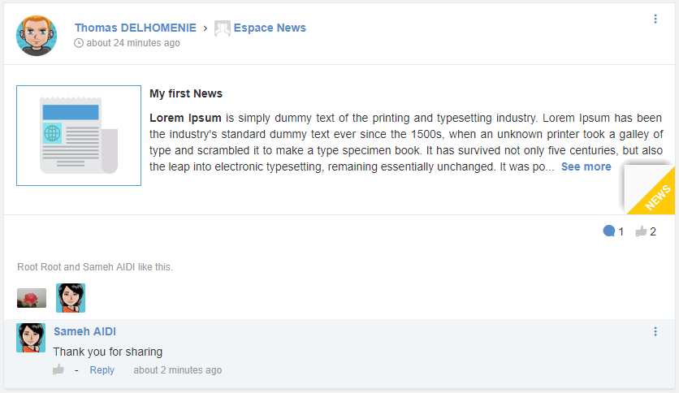

.. _News:

###############
Creating a News
###############

From a space's acivity stream, you are able to share a news with the space’s members. 

======================================
Sharing a simple news from short form
======================================

To share an article with other space’s members, follow these steps:

1. Click on News tab from the activity composer, The tab contains :

- A **Title** field :  Allows you to enter the news title. The title should not exceed 150 characters: Beyond that limit you will not be allowed to write.

- A **Content** field : Allows you to enter the content of the News. No limitation for the number of characters.

- A **Pin article** Check box.

- A **More icon** with a tooltip “more options”: Permits to open the creation full form.

- A **Post** button : Disabled by default until the two fields “Title” and “Content” are filled.

|image0|

2. Type your News Title in the appropriate field

|image1|

3. Type your News content in the appropriate field

|image2|

4. Click on Post button |image3|

The article is shared into the space's activity stream.

|image4|

.. note:: The |image3| button still grey and unclickable until the mandatory felds *title* and *content* are filed. 
         
		  

.. |image1| image:: images/news/title_field.PNG
.. |image2| image:: images/news/content_field.PNG

