.. _OAuthIntegration:

##################
OAuth Integration
##################

    Starting from 4.3 version, eXo Platform allows users to log in using 
    their social network accounts, including Facebook, Google+, Twitter, 
    LinkedIn. To enable the feature, you need to do the main steps 
    below:

    -  Registering an application on the social network you want.

    -  Making some configurations in ``exo.properties`` to enable the
       social network with its registered application information.

    After startup of eXo Platform, the users can log in and register into
    eXo Platform via the corresponding social network.

    In this chapter:

    -  :ref:`Overview <OAuthAuthentication.Overview>`
       Quick introduction to the the UI flow after one social network is
       integrated with eXo Platform.

    -  :ref:`Registering your OAuth application <OAuthAuthentication.RegisteringOAuthApp>`
       How to register your OAuth applications, including Facebook,
       Google+, Twitter, LinkedIn.

    -  :ref:`Setting up eXo Platform <OAuthAuthentication.SettingUpPlatform>`
       Steps to configure eXo Platform that enable the social network with
       its registered application information.

    -  :ref:`On-the-fly registration <OAuthAuthentication.OntheflyRegistration>`
       Introduction to the on-the-fly registration that allows
       administrator to skip the Registration form for the new social
       accounts.

.. _OAuthAuthentication.Overview:

========
Overview
========

When a social network is integrated with eXo Platform, the UI flow will be as
follows:

The login page will have new buttons below:

|image0|

When clicking the Facebook button for example, the OAuth authorization
flow starts. The user will be redirected to the Facebook page and be
asked for login if not yet. Facebook then asks the user if he allows eXo
to access his profile data.

|image1|

If the user accepts, he is logged into eXo and redirected to the
homepage.

.. _OAuthAuthentication.RegisteringOAuthApp:

==================================
Registering your OAuth application
==================================

Registration will be detailed for each OAuth provider. But in all cases,
the provider will give you a pair of *Client ID/Secret* needed for later
configuration.

.. note:: Pay attention to the Redirect URL that should match your 
          server host and port. In the below instructions, it is assumed 
          that your host is `server.local.network.com <server.local.network.com>`__.

.. _Facebook:

Facebook
~~~~~~~~~

1. Go to https://developers.facebook.com/apps and register as a Facebook
   developer if not yet.

2. Click **Create a New App**. Here, enter Display Name, Namespace and
   select one Category, then click Create App ID.

   |image2|

3. In your created application, select **Settings**. Here, input the
   values:

   -  `local.network.com <local.network.com>`__ for **App Domains**.

   -  http://server.local.network.com:8080 for **Site URL** (by 
      selecting Add PlatformWebsite).

|image3|

Before going to the production environment, you need to disable the
development mode in your registered application. If not, your
application is available only for you, your developers and users created
for your application.

|image4|

To switch the development mode to the public one, go to **Status &
Review**, then click |image5|\ Confirm.

|image6|

.. _Twitter:

Twitter
~~~~~~~~

1. Go to the `Twitter Developer page <https://dev.twitter.com/>`__. From
   this page, go to the **Manage Your Apps** page (in the **TOOLS**
   category near the bottom), then register your application by clicking
   **Create New App**.

2. Fill values for Name and Description. Use
   http://server.local.network.com:8080 and
   http://server.local.network.com:8080/portal/twitterAuth for Website 
   and Callback URL respectively.

|image7|

.. note:: The "Callback URL" must be filled for Twitter to recognize that it is a web application which is trying to connect. 
		  Twitter will not accept "http://localhost:8080/portal" as a valid URL but you can use any, even "http://www.twitter.com". 
		  This field will be ignored but it cannot be left empty.

3. In the created application, optionally edit it. In the **Settings** 
   tab, you may need to enable the **Sign in with Twitter** feature (by 
   ticking the **Allow this application to be used to Sign in with 
   Twitter** checkbox). It is recommended you enable it, otherwise your 
   users will need to authorize in Twitter after each login into eXo 
   Platform. For the Access option, the default value as **Read only** 
   is sufficient.

   After finishing the whole process, you should see in the **Details** tab
   as below:

|image8|

**Consumer Key** and **Consumer Secret** (in *Keys and Access Token*
tab) will be used to configure Client ID and Client Secret later.

.. _LinkedIn:

LinkedIn
~~~~~~~~~

1. Go to https://www.linkedin.com/developer/apps/. From this page, 
   register your application by selecting **Create Application**.

2. Fill values for Name, Description, Application Logo URL, Application
   User, Business Email and Business Phone. For Website URL, enter
   http://server.local.network.com:8080.

|image9|

3. Click **Submit**.

4. In the Authentication part, tick two checkboxes: r\_basicprofile and
   r\_emailaddress, then input
   http://server.local.network.com:8080/portal/linkedinAuth for the
   Authorized Redirect URLs field and click Update.

|image10|

.. _GooglePlus:

Google+
~~~~~~~~

1. Go to the https://developers.google.com/. Here, access the **Google
   Developers Console** page (in the **Developer Consoles** category 
   near the bottom) and register as Google developer if not yet.

2. Create your project first, then go to it.

3. In the Gallery icon --> API Manager part --> Overview, make sure  
   **Google+ API** is enabled.

4. In the **Credentials** part, click Add credentials and select **Oauth
   2.0 client ID**.

|image11|

5. Select *Web application*. In the Authorized redirect URIs field, 
   input http://server.local.network.com:8080/portal/googleAuth.

|image12|

6. Click Create and view information of Client ID, Client Secret and
   Redirect URIs.

|image13|

.. _OAuthAuthentication.SettingUpPlatform:

========================
Setting up eXo Platform
========================

It is assumed that your eXo Platform instance will be executed on the host:
`server.local.network.com <server.local.network.com>`__ (remember to set
up your host, for example, by adding it to ``/etc/hosts`` on Linux), so
you will need to:

1. Change the property ``exo.base.url`` to the value of your host. See
   :ref:`Server base URL <Configuration.ServerBaseURL>` for details.

   ::

       # OAuth
       exo.base.url=http://server.local.network.com:8080

2. Make configurations for the social networks that you want in
   ``exo.properties``.

   ::

		## Facebook
		exo.oauth.facebook.enabled=true
		exo.oauth.facebook.clientId=Facebook_App_Id
		exo.oauth.facebook.clientSecret=Facebook_App_Secret

		## Twitter
		exo.oauth.twitter.enabled=true
		exo.oauth.twitter.clientId=Twitter_Consumer_Key
		exo.oauth.twitter.clientSecret=Twitter_Consumer_Secret

		## LinkedIn
		exo.oauth.linkedin.enabled=true
		exo.oauth.linkedin.apiKey=LinkedIn_Client_Id
		exo.oauth.linkedin.apiSecret=LinkedIn_Client_Secret

		## Google Plus
		exo.oauth.google.enabled=true
		exo.oauth.google.clientId=GooglePlus_Client_Id
		exo.oauth.google.clientSecret=GooglePlus_Client_Secret

   In which:

   -  ``exo.oauth.{OAuth_Provider}.enabled`` - Enables the integration 
      with the social network. Users will now be able to log in and 
      register with their social network accounts.

   -  ``exo.oauth.{OAuth_Provider}.clientId`` - Client ID of your
      application.

   -  ``exo.oauth.{OAuth_Provider}.clientSecret`` - Client Secret of your
      application.

3. Restart eXo Platform server. Your users should be able to register 
   or log in with their social network accounts.

.. _OAuthAuthentication.OntheflyRegistration:

=======================
On-the-fly registration
=======================

The on-the-fly registration mode is option that allows administrator to
skip the Registration form for the new social accounts that log into eXo
for the first time. If the option is not turned on, users will have to
edit their social information for the first login into eXo Platform.

|image14|

**Configuring the on-the-fly registration**

By default, the Registration form is skipped for the three networks
following:

::

    exo.oauth.registraterOnFly=FACEBOOK,GOOGLE,LINKEDIN

The on-the-fly registration option is not turned on for Twitter by
default. In case of the on-the-fly registration, a random password will
be generated for the new user. So the only way for the user to know his
password is via the :ref:`Forget password <Forgot-Password>` function
(which will require email address). The Twitter site does not allow
third-party application to get user email, so it is recommended you not 
enable this option for Twitter.

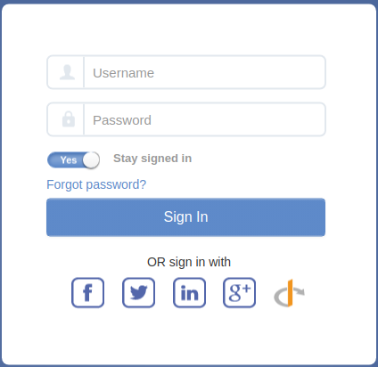
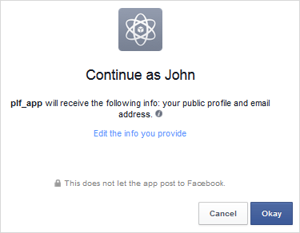
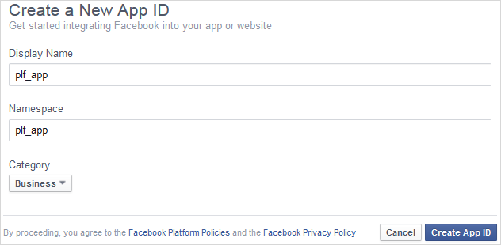
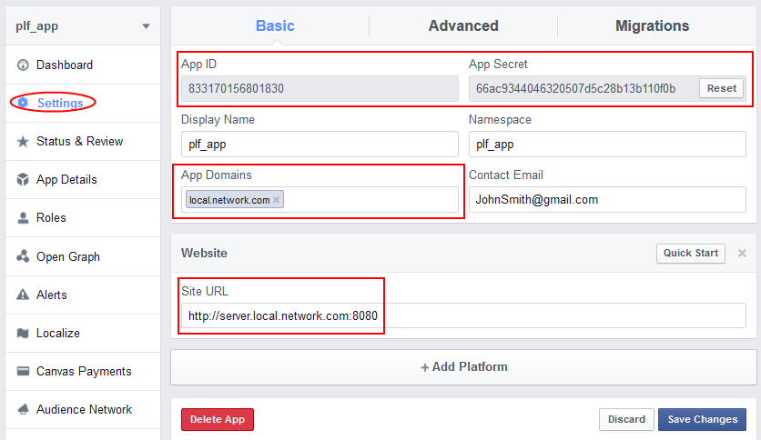
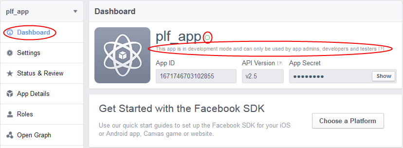
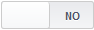
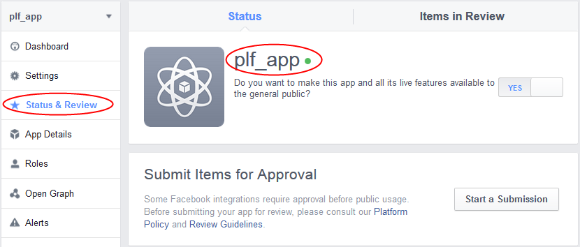
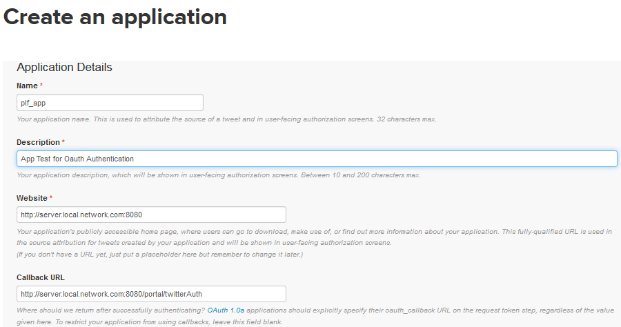
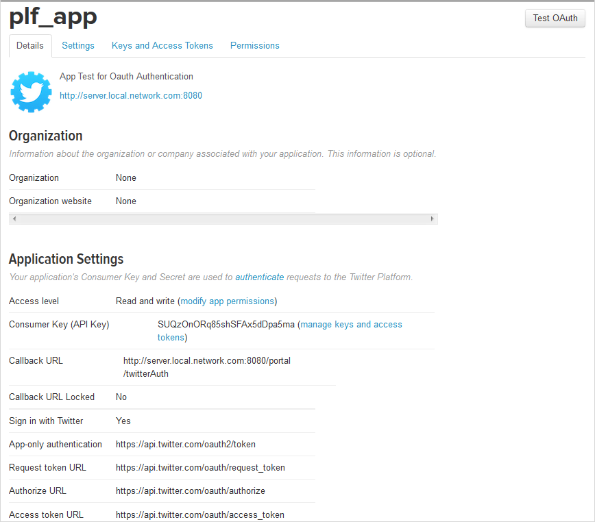
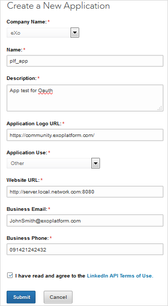
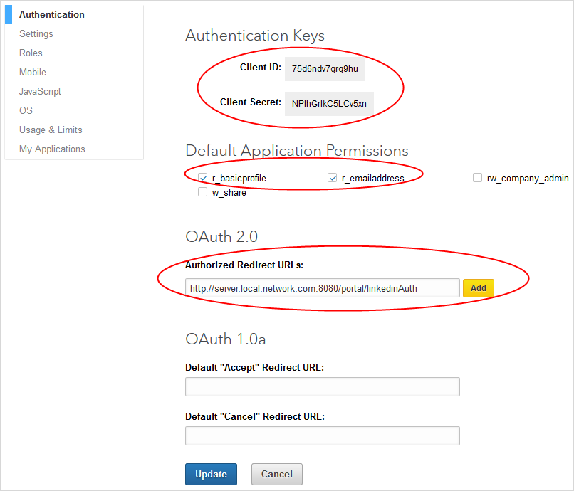
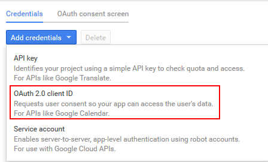
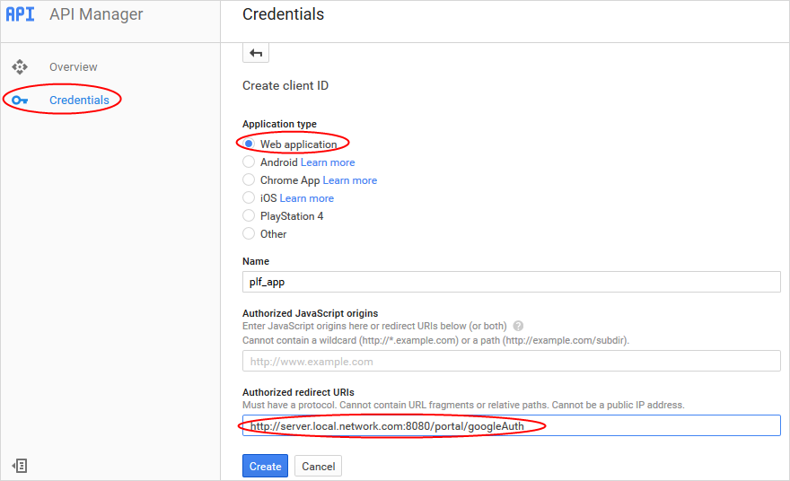
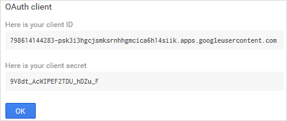
.. |image14| image:: images/oauth/register_new_account_form.png
