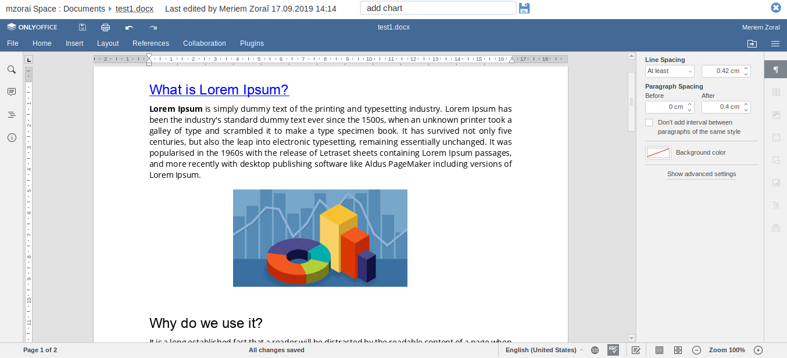
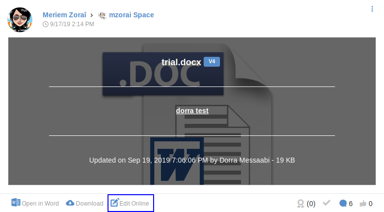
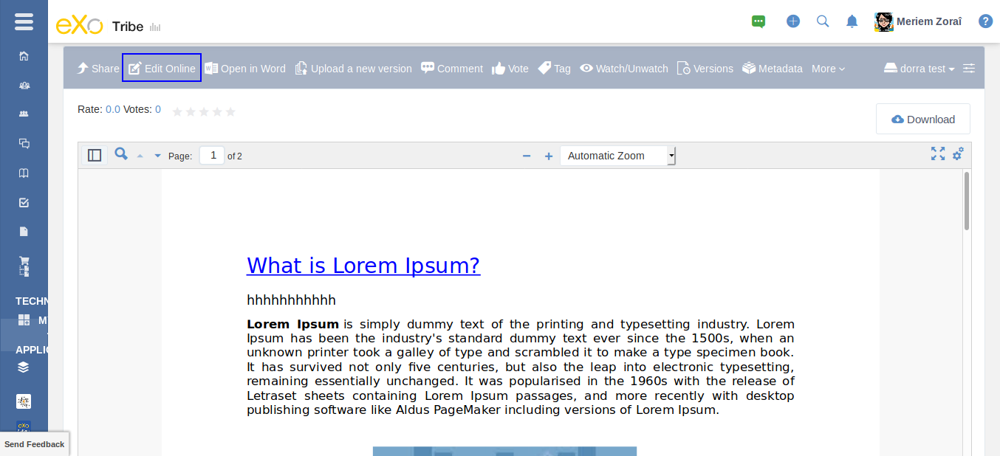
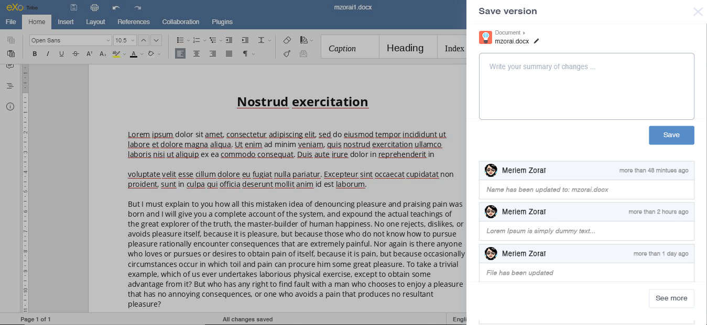
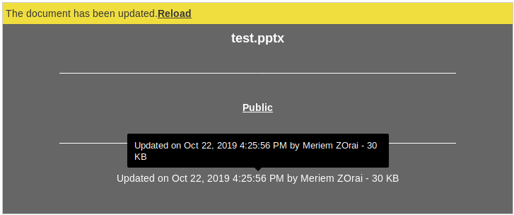
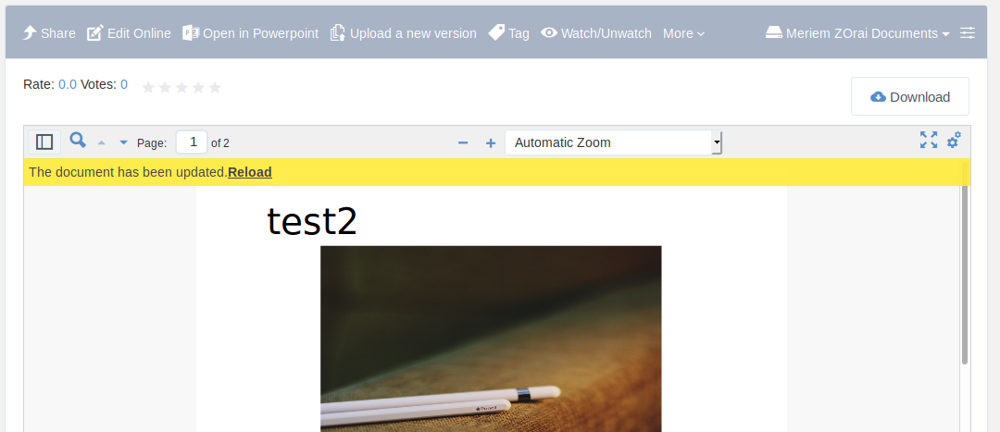
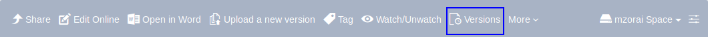

.. _OnlyOffice:

#############################
OnlyOffice Connector for eXo
#############################

**What is OnlyOffice**

`OnlyOffice Online Editors <https://www.onlyoffice.com/office-suite.aspx>`__ is a great open source solution 
that lets you create, edit and collaborate online on your Office documents. 
OnlyOffice editors are 100% compatible with Microsoft Office document formats : docx, pptx and xlsx.

|image0|

.. note:: eXo partnered with OnlyOffice to offer the enterprise-ready version of OnlyOffice editors to its customers along 
          with the **commercial editions of eXo Platform**. Thus, eXo customers are required to purchase a dedicated 
          subscription from eXo to run the OnlyOffice connector add-on on their eXo Platform instance. 
          However, a 30-day trial is prepackaged with the connector in order to test-drive the integration before purchase.

To install the add-on, use the following command:

::

		./addon install exo-onlyoffice
		

.. _HowToUse:

================================
How to use OnlyOffice for eXo?
================================	

.. _EditOnline_BTN:

Edit Online button
~~~~~~~~~~~~~~~~~~~~
		
Having satisfied the above conditons and installed the add-on, you can easily edit your Microsoft Office documents online.
Just hit the ``Edit Online`` button |image1|.

The ``Edit Online`` button is available in these locations:

-  In the activity stream among the possible actions available on the document

   |image2|
   
-  In the document preview interface

   |image3|

-  In the ``Documents`` application, in the action bar

   |image4|
   
Clicking on this button loads the dcument in the corresponding OnlyOffice editor in new tab for maximum comfort.

.. _EditorInterface:

Editor Interface
~~~~~~~~~~~~~~~~~~

Clicking on |image5| button opens the document you want to edit in an another tab.
The interface contains the content of the document loaded in the OnlyOffice editor with a floating button.

Clicking on that button opens a drawer "Save version" with these fields:

-  The file's breadcrumb
-  An edit icon allowing to edit the file's name
-  The summary text field
-  A ``Save`` button allowing to create a new version of the document .
-  The list of the 3 latest versions
-  A ``See more`` button allowing to display the full version history of the document
-  A close button at the top right of the drawer

|image6|

File's breadcrumb
------------------

The file's breadcrumb contains:

-  The space's avatar if the file is in a space or the user's avatar if the file is in Personal documents 
-  The file's path
-  The file's name which is editable

Summary field
--------------

The summary text field allows you to add a description of the changes you made on the document.

.. note:: The summary field is not mandatory, if you input it it will be also added as summary for the document's versions 
          list in Documents application.
          
Versions list
--------------

A list of the latest three versions appears in the drawer. Each version contains these information:

-  The editor's avatar
-  The changes timestamp, when hovering it a tooltip appears with the real edit date
-  The edit summary which could be:

   -  The summary inputted when saving the version
   -  The text message "File has been updated" if the document's editor did not input a summary while saving the versions
   -  The text message "File has been renamed to newname.extension" if the document's editor has renamed the file
   
Clicking on the ``See more`` button redirects you to the Documents application. YOu can then open Versions list by clicking 
on ``Versions`` button on the toolbar.

|image9|

Yellow bar
~~~~~~~~~~~~

When a document visible in your stream, either in ``Documents`` application or in the activity stream, has been edited by
an another user, a yellow bar appears in the top of the document informing you that the document has been edited.
The yellow bar contains also a ``Reload`` link allowing you to load the changes done by another user.

|image7|

|image8|

		

.. |image3| image:: images/OnlyOffice/editOnline_btn_preview.png

