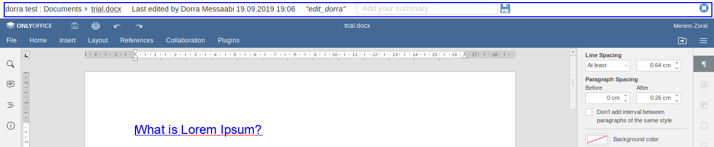

.. _OnlyOffice:

#############################
OnlyOffice Connector for eXo
#############################

**What is OnlyOffice**

`OnlyOffice Online Editors <https://www.onlyoffice.com/office-suite.aspx>`__ is a great open source solution 
that lets you to create, edit  and collaborate online on your office documents. 
OnlyOffice editors are 100% compatible with Microsoft Office document formats : docx, pptx and xlsx.

|image0|

.. note:: eXo partnered with OnlyOffice to offer the enterprise-ready version of OnlyOffice editors to its customers along 
          with the **commercial editions of eXo Platform**. Thus, eXo customers are required to purchase a dedicated 
          subscription from eXo to run the OnlyOffice connector add-on on their eXo Platform instance. 
          However, a 30-day trial is prepackaged with the connector in order to test-drive the integration before purchase.

To install the add-on, use the following command:

::

		./addon install exo-onlyoffice
		

.. _HowToUse:

================================
How to use OnlyOffice for eXo?
================================	

.. _EditOnline_BTN:

Edit Online button
~~~~~~~~~~~~~~~~~~~~
		
Having satisfied the above conditons and installed the add-on, you can easily edit your Microsoft Office documents online.
Just hit the ``Edit Online`` button |image1|.

The ``Edit Online`` button is available in these locations:

-  In the activity stream among the possible actions available on the document

   |image2|
   
-  In the document preview interface

   |image3|

-  In the ``Documents`` application, in the action bar

   |image4|
   
Clicking on this button loads the dcument in the corresponding OnlyOffice editor in new tab for maximum comfort.

.. _EditorInterface:

Editor Interface
~~~~~~~~~~~~~~~~~~

Clicking on |image5| button opens the document you want to edit in an another tab.
The interface contains:

-  The content of the document loaded in the OnlyOffice editor
-  A top bar containing these details:

   -  a breadcrumb: to inform about the location of the document in the platform
   -  an information about latest edit done on the document: Last edited by $editor's full name date hh:mm "summary"
   -  a text field for the summary: allowing you to input a summary of your changes
   -  a ``force save`` button: to save your changes in a new version and post the summary in activity stream. 
      It also creates a new version of the document in ``Documents`` application.
   -  a close icon: to close the editor tab. All changes are saved when you close a tab

|image6|

Yellow bar
~~~~~~~~~~~~

When a document is opened in your stream, either in ``Documents`` application or in the activity stream, has been edited by
an another user, a yellow bar appears in the top of the document informing you that the document has been edited.
The yellow bar contains also a ``Reload`` link allowing you to load the changes done by another user.

|image7|

|image8|

		

.. |image0| image:: images/OnlyOffice/onlyofficeInterface.png
.. |image1| image:: images/OnlyOffice/editOnline_btn.png
.. |image2| image:: images/OnlyOffice/editOnline_btn_act.png
.. |image3| image:: images/OnlyOffice/editOnline_btn_preview.png
.. |image4| image:: images/OnlyOffice/editOnline_btn_documents.png
.. |image5| image:: images/OnlyOffice/editOnline_btn.png

.. |image7| image:: images/OnlyOffice/YellowBar_AS.png
.. |image8| image:: images/OnlyOffice/YellowBAr_Documents.png
