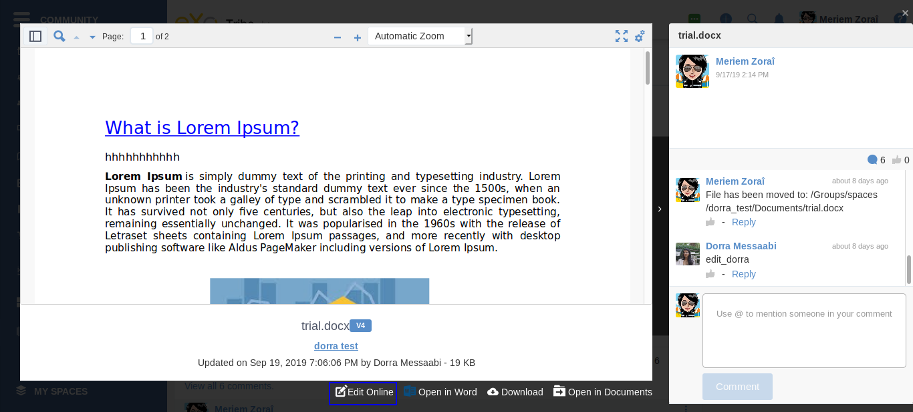
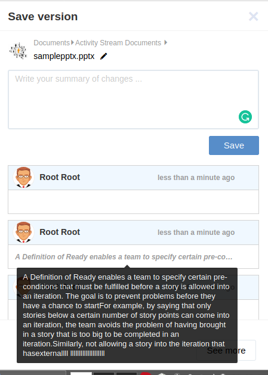

.. _OnlyOffice:

#############################
OnlyOffice Connector for eXo
#############################

.. _OODefinition:

====================
What is OnlyOffice
====================

`OnlyOffice Online Editors <https://www.onlyoffice.com/office-suite.aspx>`__ is a great open source solution 
that lets you create, edit and collaborate online on your Office documents. 
OnlyOffice editors are 100% compatible with Microsoft Office document formats : docx, pptx and xlsx.

|image0|

.. note:: eXo partnered with OnlyOffice to offer the enterprise-ready version of OnlyOffice editors to its customers along 
          with the **commercial editions of eXo Platform**. Thus, eXo customers are required to purchase a dedicated 
          subscription from eXo to run the OnlyOffice connector add-on on their eXo Platform instance. 
          However, a 30-day trial is prepackaged with the connector in order to test-drive the integration before purchase.

To install the add-on, use the following command:

::

		./addon install exo-onlyoffice
		

.. _HowToUse:

================================
How to use OnlyOffice for eXo?
================================

.. _EditOnline_BTN:

Edit Online button
~~~~~~~~~~~~~~~~~~~~
		
Having satisfied the above conditons and installed the add-on, you can easily edit your Microsoft Office documents online.
Just hit the ``Edit Online`` button |image1|.

The ``Edit Online`` button is available in these locations:

-  In the activity stream among the possible actions available on the document

   |image2|
   
-  In the document preview interface

   |image3|

-  In the ``Documents`` application, in the action bar

   |image4|
   
Clicking on this button loads the document in the corresponding OnlyOffice editor in new tab for maximum comfort.

.. _EditorInterface:

Editor Interface
~~~~~~~~~~~~~~~~~~

Clicking on |image5| button opens the document you want to edit in an another tab.
The interface contains the content of the document loaded in the OnlyOffice editor with a floating button.

|image10|

Clicking on that button opens a drawer "Save version" with these fields:

-  The file's breadcrumb
-  An edit icon allowing to edit the file's name
-  The summary text field
-  A ``Save`` button allowing to create a new version of the document
-  The list of the 3 latest versions
-  A ``See more`` button facilitating the display of the full version history of the document
-  A close button at the top right of the drawer

|image6|

.. note:: To create a version of the document in :ref:`Documents application <Manage-Documents>`, you need either to click on 
          ``save`` button of the drawer or close the editor browser tab.
          
          
File's breadcrumb
------------------

The file's breadcrumb contains:

-  The space's avatar if the file is in a space or the user's avatar if the file is in Personal documents 
-  The file's path
-  The file's name which is editable

.. note:: You can edit the file's name by clicking on the edit button |image14| or double-clicking on the filename.

Summary field
--------------

The summary text field allows you to add a description of the changes you made on the document.

.. note:: The summary field is not mandatory, if you input it it will be also added as summary for the document's versions 
          list in :ref:`Documents application <Manage-Documents>`.
          
.. tip:: The summary text field is limited to 510 characters. If you input more than 510 characters and click on ``Save`` button, 
         an error message will appear:

         |image15|   
         
         The content of the filled summary is not lost to allow you to reduce its number of characters and submit it again.
         
          
Versions list
--------------

A list of the latest three versions appears in the drawer. Each version contains these information:

-  The editor's avatar
-  The changes timestamp, when hovering it a tooltip appears with the real edit date
-  The edit summary if it has been filled, if not its content will be empty in the version.

When the summary text is too long, it will be truncated in the corresponding item in the "Version list" and a tooltip with the 
full summary text will appear when hovering over the summary content.

|image16|

.. note:: If the document is newly added, the component "versions list" does not appear until a new version of the document is saved.
   
Clicking on the ``See more`` button redirects you to the :ref:`Documents application <Manage-Documents>`. 
You can then open Versions list by clicking  on ``Versions`` button |image11| on the toolbar.

|image9|

Yellow bar
~~~~~~~~~~~~

When a document visible in your stream, either in ``Documents`` application or in the activity stream, has been edited by
an another user, a yellow bar appears in the top of the document informing you that the document has been edited.
The yellow bar contains also a ``Reload`` link allowing you to load the changes done by another user.

|image7|

|image8|

.. _New_Document:

==================
Add New document
==================

In the Documents toolbar, a ``New Document`` button is available allowing you to create a new document.
It is possible to create a new blank Microsoft Office document.

Clicking on ``New Document`` button |image12| opens a popup allowing you to set the document's name and select 
the document's type: docx, pptx or xlsx:

|image13|

Clicking on ``Create Document`` button open the newly created blank document in an another tab. 
If you click on ``Cancel`` button, the ``New Document`` popup disappears and the document's creation process is canceled.

.. note:: All the document's information are loaded in the drawer when creating a new document:
          it's name, the space's avatar or the document's owner avatar and the path. The list of versions
          is empty as there is no older versions for a new document.   

.. |image0| image:: images/OnlyOffice/onlyofficeInterface.png
.. |image1| image:: images/OnlyOffice/editOnline_btn.png

.. |image4| image:: images/OnlyOffice/editOnline_btn_documents.png
.. |image5| image:: images/OnlyOffice/editOnline_btn.png
.. |image6| image:: images/OnlyOffice/drawer.png
.. |image7| image:: images/OnlyOffice/YellowBar_AS.png
.. |image8| image:: images/OnlyOffice/YellowBAr_Documents.png
.. |image9| image:: images/OnlyOffice/Versions_button.png

.. |image15| image:: images/OnlyOffice/error_message.png

