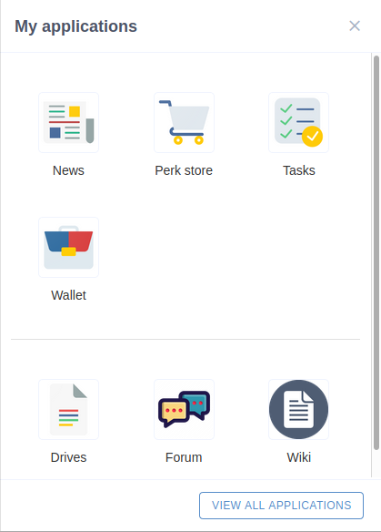
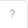
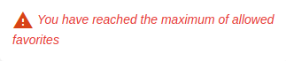
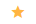

.. _PersonalApplications:

################################################
Managing Your Personal Applications
################################################

eXo Platform features a list of personal applications which you can access quickly. 
In this chapter, you will have opportunity to learn about them via the following topics:

:ref:`Managing your profile <Managing-Profile>`

How to update your current position/avatar and to edit your information.

:ref:`Managing your activity stream <Managing-Activity-Stream>`

Introduction to your own Activity Stream page.

:ref:`Managing your favourite applications <Managing-Fav-Apps>`

Introduction to your favourite applications drawer.

:ref:`Managing your connections <Managing-Connections>`

How to view profiles of your contacts, to send/revoke a connection request, to accept/deny connection requests and to disconnect from your contacts.

:ref:`Working with your wiki <Working-Wiki>`

Introduction to your private Wiki.

:ref:`Managing your notifications <Managing-Notification>`

Details of which notification types you will receive.

To do the above actions, simply click your display name at the top navigation bar, then select either from the drop-down menu:

|image0|

.. _Managing-Profile:

=====================
Managing your profile
=====================

Your profile is always visible by all users of the portal that helps them understand more about you, so it is very necessary to have a profile with the full and clear information.

From eXo Platform 6.0, the profile page has been redesigned in order to enrich and better organize user information.

This part introduces you how to:

 * :ref:`Access your profile <Access-profile>` 
 * :ref:`Edit your profile <Edit-Your-Profile>`
 
 
 .. _Access-profile:

Access your profile
~~~~~~~~~~~~~~~~~~~~~~

To access the My Profile page, simply click your display name on the top
side bar.

|PRFL-1|

By default, your profile is just initialized with the basic account
information as below:

Details:

- |1| your avatar and cover 

- |2| a brief description of your profile in **About me** block.

- |3| Kudos (Received and Sent) and Total coins earned.

- |4| your work experiences 

- |5| 'welcome to my profile' block

- |6| your contact informations

- |7| your earned badges by domain

    .. note:: When you open someone else's profile, several interactions are possible such as: Chat, Call, Send Kudos, Send Coins and Connect.

        |PRFL-2|
 
 
 .. _Edit-Your-Profile:

Edit your profile
~~~~~~~~~~~~~~~~~~~

Use the edit icons to fill the various profile sections: About me, Contact Informations and Work Experiences.

    .. note:: After making changes, make sure you click **Save** to update your profile or **Cancel** to dismiss the changes.

The followings are changeable information in each section.

.. _Profile-banner:

Profile banner
---------------

When accessing to your profile, a banner is displayed in the top of the
page. By default it is grey. You can change it and select a profile
image.

To change the profile banner:

1. Mouse over the top right of the grey banner, an edit icon appear.

    .. note:: the banner should be 130 pixels height.

2. Select the desired profile banner image and double click on it.

3. The profile banner image will be automatically loaded.

In mobile devices, your profile display is divided in 2 sections: 
- section 1: About me, Kudos, Coins and Work Experiences
- section 2: Welcome to my profile, Contact Informations and Badges by domain

To switch between sections, you can use the swipe icon.

|PRFL-3|

.. _About-me:

About Me
-----------

A brief introduction of yourself (in less than 2000 characters),
telling people who you are and what you do. If this section is empty, it
will not be displayed on your profile page.

By clicking on the edit icon, an edit drawer is opened with a composer.

|PRFL-14|

    .. note:: A character counter displays the number of characters entered in the About me. If you exceed the maximum allowed (200 characters), the  **Save** button will be disabled until the text is reduced within the limit.

.. _Contact-info:

Contact Information
--------------------

+----------------------+-----------------------------------------------------+
| Field                | Description                                         |
+======================+=====================================================+
| First Name           | The first name that should be from 1 to 45          |
|                      | characters, and contains letters and space only.    |
+----------------------+-----------------------------------------------------+
| Last Name            | The last name that should be from 1 to 45           |
|                      | characters, and contains letter and space only.     |
+----------------------+-----------------------------------------------------+
| Email                | The email address that should be in a valid format, |
|                      | for example, johnsmith@exoplatform.com (see more    |
|                      | details about the **Email Address** format          |
|                      | :ref:`here <CreateNewAccountFormDetails>`.)         |
+----------------------+-----------------------------------------------------+
| Avatar               | The representative picture of user. If it is not    |
|                      | defined, the default avatar is used.                |
+----------------------+-----------------------------------------------------+
| Job Title            | The job position. Note that the information entered |
|                      | in the field will be retrieved when you             |
|                      | :ref:`search for contacts <SearchingForContact>`    | 
+----------------------+-----------------------------------------------------+
| Gender               | The gender of user. Select your gender from the     |
|                      | select box, either male, female or empty.           |
+----------------------+-----------------------------------------------------+
| Phones               | The phone numbers at work, home or at other sites   |
|                      | which must be from 3 to 20 numeric characters.      |
+----------------------+-----------------------------------------------------+
| IMs                  | The nickname of either IM services that must be     |
|                      | between 3 to 60 characters.                         |
+----------------------+-----------------------------------------------------+
| URL                  | The website address which must be in the correct    |
|                      | format, for example, http://exoplatform.com/.       |
+----------------------+-----------------------------------------------------+

By clicking on the edit icon, an edit drawer is opened.

|PRFL-19|

.. _Change-your-avatar:

**To change your avatar:**

*The first way:*

1. Click on edit button then mouse over your Avatar from the section **Contact Information**.

   |PRFL-4|

2. Select your desired image, then click Open button, or double-click the image to upload.

    .. note:: The uploaded image must be smaller than 2 MB.

3. Click Save to accept your changes.

*The second way:*

1. Mouse over your profile avatar, an icon |PRFL-18| will appear.

2. Click on this icon, this will prompt you to pick a file from your computer.

3. Double click on the desired image.

4. The profile icon will be automatically changed.

.. note:: - This second way is only available in web version. On mobile devices, you should follow the first way to update/edit your profile avatar.
          - On mobile devices, the edit icon is by default displayed in the first way.
          - Your image will be automatically resized to a specified value to correspond to the image allowed size.

.. _Experience:

Work Experiences
-------------------

+----------------------+-----------------------------------------------------+
| Field                | Description                                         |
+======================+=====================================================+
| Organization         | Where you have worked.                              |
+----------------------+-----------------------------------------------------+
| Job Title            | The job position.                                   |
+----------------------+-----------------------------------------------------+
| Job Details          | Brief description of your job.                      |
+----------------------+-----------------------------------------------------+
| Skills Used          | Skills for your job.                                |
+----------------------+-----------------------------------------------------+
| Start Date           | The start date of your work.                        |
+----------------------+-----------------------------------------------------+
| End Date             | The end date of your work.                          |
+----------------------+-----------------------------------------------------+
| Still in this        | Indicates that you are currently at the described   |
| position             | position.                                           |
+----------------------+-----------------------------------------------------+

.. note:: The information entered in the Skill Used field will be retrieved when you :ref:`search for contacts <Search-Contacts>`.

By clicking on the edit icon, an edit drawer is opened.

Experiences will be presented in accordions. Your recent experiences' accordion is opened by default.

|PRFL-15|

To remove an experience, you can simply click on Remove Experience button.

|PRFL-16|

    .. note:: After making changes, make sure you click **Save** to update your profile or **Cancel** to dismiss the changes.

To add a new experience, you can simply click on Add new button in the top Work Experiences drawer, and a new empty experience form is added.

|PRFL-17|

.. _Kudos:

Weekly Kudos
--------------

The number of Kudos received and sent by the user is displayed in the Kudos section.

|PRFL-5|

By clicking on Received or Sent Kudos number, a drawer is opened that displays the details of Kudos received or sent.

|PRFL-6|

All Kudos in the drawer are clickable and open, in a new browser tab, the source activity where the Kudos was sent or received.

.. _Coins:

Coins
--------

Monthly Rewards block displays the number of coins earned through  points and through kudos (the same value we already have in the cumulated Rewards in :ref:`My Wallet <UserWallet>`application).

By clicking on the number, a drawer is opened and displays the cumulated coins per month.

|PRFL-7|

.. _Welcome-To-My-Profile:

Welcome To My Profile
-----------------------

The **welcome To My Profile** widget is an block that welcomes you, and your collaborators, with some information about your spaces, connections, 
the points you earned and the rank you reached this week.
See :ref:`Leaderboard <Leaderboard>` in **Gamification** for more details.

- You can see your profile picture and your name just after the welcome To My Profile label.

- The widget also displays the total number of spaces that the profile owner is member of.
  A counter of your pending space invitations is displayed in a small badge.
  Click the badge to display all invitations and easily accept or refuse them.

|PRFL-8|

    .. note:: - When you don't have any space invitation, the badge is hidden, and the drawer will display only the space list.
   
- This widget also reminds you the size of your (or the profile owner's) social network by displaying your, that is, the current number of Connections.
  When you have some pending  connection requests, a small badge displays a requests counter.
  Click the badge to display the list of pending requests and accept or refuse them, with the list of all your, or the user's, connections.

    .. note:: When you don’t have any connection request, the badge is hidden, and the drawer will display only the connections list.

|PRFL-9|

- - You can see the points you (or the profile's owner), have earned this week. By clicking on your points, you can see a pie chart 
  that reveals their distribution by domain.

- You can also see your rank for this week and by clicking on your rank, you can see a leaderboard  
  that presents your position comparing to other members and how many points you earned this week so far.
  See :ref:`Leaderboard <Leaderboard>` in **Gamification** for more details.

.. _Badges-By-domain:

Badges By Domains
-------------------

All your latest earned badges are displayed in the Badges by domain section,

In this section, you can have an idea about badges' earning history and next badges you can earn.

In the Badges by domain section you have all domain labels with the last earned badge 

    .. note:: If you don't have any badge yet for a domain, the domain is not displayed.

By clicking on a domain, the domain drawer is displayed with :

- the history of badges for this domain

- a timeline with the gained badges

- all badges are presented by their avatar, badge name, badge points and gain timestamp 

    .. note:: - The first badge is always the next badge to obtain in grey color 
              - the second line in the timeline is your avatar with your current points on this selected domain. 
              - From the second line, it displays the full list of earned badges sorted by last to first

.. _View-Profile-Contacts:

Viewing profile of other users
~~~~~~~~~~~~~~~~~~~~~~~~~~~~~~~~~~~~

To view all information of a contact, simply click their name. You
will be redirected to their profile page.

|PRFL-10|

    
If you are not yet connected to the user, you will see in his profile page the connect button in his profile banner:

|PRFL-11|

Clicking on that button sends him a connection request, and the button changes to **Cancel request**.

|PRFL-12|

When you access a user's profile who sent you a connection request, a dropdown appears in his profile banner allowing either to accept or to deny his request:

|PRFL-13|

.. _Send-Connection-Request:

Sending connection requests
~~~~~~~~~~~~~~~~~~~~~~~~~~~~

After :ref:`specifying your desired contact <SearchingForContact>`,
you can send a connection request via one of these three ways.

**The first way**

Click Connect under the contact name to send your connection request, 
|PEOPLE4|

**The second way**

Hover your cursor over the contact name and click Connect button.
|PEOPLE5|

**The third way**

:ref:`Access the profile page of the contact <View-Profile-Contacts>` to whom you want to send a connection request, then click Connect button on their profile banner.

|PRFL-11|

    .. note:: The Connect button will become **Cancel Request**.
    
        |PRFL-12|

.. _Revoke-Connection-Request:

Revoking a connection request
~~~~~~~~~~~~~~~~~~~~~~~~~~~~~~

After sending connection requests to other users and they are not
accepted yet, you still can remove the requests by doing one of the
following ways:

**The first way**

Access to the People page and click on **Cancel Request** in the users' card to revoke the connection request.

|PEOPLE6|

**The second way**

1. Select the Requests Pending drawer in Requests section.

2. Click **Cancel Request** icon button near the contact name or click directly on the "Cancel request" button on the users' card to revoke the connection request.

|PEOPLE7|

**The third way**

:ref:`Access the profile page of the contact <View-Profile-Contacts>` to whom you sent a connection request, then click **Cancel Request**.

|PRFL-12|

.. _Accept-Deny-Connection-Request:

Accepting/Denying a connection request
~~~~~~~~~~~~~~~~~~~~~~~~~~~~~~~~~~~~~~~~

You can perform these actions by doing one of the following ways:

**The first way**

Use the Invitations application on the Welcome Back block on the Digital Workplace homepage. See :ref:`here <DW-Widgets>` for more details.

**The second way**

1. Select Invitation in the Invitations block in the My Connections page and click on it, a drawer containing all received invitations is displayed.

|PEOPLE8|

2. Click Confirm/ Ignore icons near the contact name to accept/deny the request respectively.

    .. note:: You can also accept the request directly in the user's card by hovering the cursor over the contact name, then clicking "Confirm" button.
    |PEOPLE9|

**The third way**

:ref:`Access the profile page of the contact <View-Profile-Contacts>` who sent you a connection request, then click the dropdown button which contains:

- Accept button as first choice
- Deny button as second choice

|PRFL-17|

To revoke the connection request, click on Deny button.

-  At the first time when you connect to a user in the network, a new
   activity will be created on the activity stream. This activity always
   shows the total number of your connections, for example, "I'm now
   connected with 10 users". Additionally, a comment which informs that
   you are connecting with him is added to the activity. Each of your
   later connection will also create a new comment added to the
   activity.

   |image29|

-  If you :ref:`remove your connection <Disconnect-Contact>` with a user, the number of your connections will be updated to the activity.

.. _Disconnect-Contact:

Disconnecting from your contacts
~~~~~~~~~~~~~~~~~~~~~~~~~~~~~~~~~~

In the My Connections or Everyone tab, you can remove the connections
between you and the users who are your contacts via one of two following
ways.

Click **Disconnect** under the contact name; or hover your cursor
over the contact name and click Disconnect to remove your
established connection.

|PEOPLE10|

.. _Working-Wiki:

======================
Working with your wiki
======================

Every user has his own wiki where he stores his private Wiki pages or
works on drafts before being published on the public Wiki. From the
drop-down menu of your display name, select My Wiki to be redirected to
your own Wiki page. See the :ref:`Working With Wikis <Wiki>` chapter for the full details.

|image31|

.. note:: Your wiki page is private by default. This means only you and your administrator can access this via the link (``.../wiki/user/[username]``). 
        However, if you have :ref:`made public <MakingPublic>` for your own wiki, anyone can access, read and edit it via the link.

.. _Managing-Fav-Apps:

=======================================
Managing your favorite applications
=======================================

Starting with eXo Platform 6, you can quickly access your favourite applications 
through the Applications drawer.

To access your favourite applications, you just need to click on this button |AC_image0| from
the top navigation bar.

|AC_image1|

A drawer will open displaying:

-  Mandatory applications defined by an administrator pinned in the drawer, alphabetically sorted but not draggable

-  Your favorite applications alphabetically sorted, by default, could be dragged and dropped to define your own choice.

|AC_image2|

.. note:: A separation line is present to differentiate mandatory applications from your favorite ones.
 
As cited above, you can reorganize your favorite applications by dragging and dropping their icons according to your choice.

|AC_image3|
 

When you click on an application icon it will open in the same tab if it is an eXo Platform application, otherwise,
it will open in a new tab.

In addition to your favorite applications displayed in the drawer, you can also navigate through the whole 
applications list you are allowed to view.

You just need to click on |AC_image4| button in the drawer to access the Application Center.

|AC_image5|

Application center is divided into 2 parts: on the right listing your favorite applications with mandatory applications pinned 
in the top and on the the left listing the whole applications your are allowed to view and use.

.. _mandatoryApps:

.. note:: Mandatory applications coudn't be unfavorized and their star button is grey colored and unclickable in both parts: 
          Favorite applications list and Application Center. 
          On the grey star button's hover, a tooltip appears with the information "Mandatory application".
          
          |AC_image11|

The second part contains applications cards with these details for each one:

-  Application's name and image
-  Application's description
-  Two buttons "Open" and |AC_image6| in the card's bottom
-  The icon |AC_image7| in the card's topper

|AC_image13|

.. _helpPage:

.. note:: The icon |AC_image14| may not appear in the application's card when the help page is not defined 
          when creating the application.

.. _star-button:

.. tip:: The star button contains three statuses:

         - |AC_image15| Grey color, not clickable: for mandatory applications
         - |AC_image17| Yellow borders and white body: for applications not yet favorized
         - |AC_image16| Yellow color: for applications already favorized

You can favorite an application in the Application Center by clicking on the :ref:`star button <star-button>` in the application's card.
The "Star" button will then be yellow colored and the application will be automatically added to the right panel
i.e. to the "favorite applications" list and to the drawer.

You can also unfavorite an application in the Application Center either by clicking on the yellow colored 
"Star" button on the application's card or on the "Star" button |AC_image9| in front of the application's name in the
"favorite applications" list.

.. _max-fav-apps:

.. note:: When you reach the maximum of allowed favorite defined by an administrator, a red colored message appears informing you that you are not allowed to add another favorite application.
          
          |AC_image10|
          
          Before reaching the maximum of favorite applications, you also have a message informing you about the 
          number of maximum of allowed favorites.
          
          |AC_image18|
          
In the Application Center page, you can search for applications using a keyword allowing to filter applications.

|AC_image12|      

.. top:: Applications' filtering is made on names, descriptions and URLs.

.. _Managing-Notification:

===========================
Managing your notifications
===========================

eXo Platform provides you a complete notification function which helps you to
avoid missing anything in your organization. As from eXo Platform 5.1, there
are 3 notification types that you can use.

.. _On-site:

**On-site**

This real-time notification helps you receive new information without a
browser refresh. Whenever there is a new activity happening within your
network, it will be pushed into your notifications menu accompanied by
the number of unread messages as follows:

|image49|

When you click the Notification icon, all notifications will be listed
starting from the most recent one:

|image50|

By clicking each notification item, you will be redirected to the
corresponding activity stream or you can select **View All** to see all
notifications. Besides, the **Mark all as read** function allows you to
change all messages on this menu into the read status. Finally, to
remove any notification item, simply click the corresponding |image51|.

.. note:: You can also view all your notifications in the page ``My Notifications`` accessible by clicking on
          your username then on My Notifications:

            |image90|
            
          It is possible to mark all your unread notifications as read simply by cliking on ``Mark all as read`` on the top of the page:
          
            |image91|
            
.. tip:: When you are not on the platform web page and you receive On-site notifications, 
         to grab your attention, a number appears in the web browser tab indicating the number of unread
         notifications.
         
         If the platform browser tab is pinned, an indication appears near the favicon to attract 
         your attention about unread notifications.
               
                 |image96|
 

.. _mobilePushNotifs:

**Mobile push notifications**

A push notification is a real-time notification that pops up on a mobile
device (iOS and Android). It is pushed instantly when the action is 
done.

The push notification displays the same content as the on-site 
notification. It also displays the eXo Mobile application logo, the 
site's name (eXo community for example) and the receipt time. 
Clicking on it opens directly the concerned activity.

|pushNotif1|

.. _Via-emails:

**Via emails**

Besides on-site notifications, you are totally able to keep track of
activities and events via emails. In eXo Platform, it is easy to control your
own email notifications from a single location in the user settings.
When this function is enabled, you will receive emails in 2 ways:

-  A notification email with different content for each event type. For
   example, for the activity embedding a video, the message will be
   represented as a thumbnail image of the embedded media, like below:

   |image52|

   By clicking the **Watch the video** link, you will be redirected to
   the activity stream where you can play the embedded video.

-  A digest email that collects all notifications during a certain
   period and is sent once per day or per week.

   |image53|

    .. note:: To receive notification and digest emails as well as on-site notifications, your administrator must enable notification plugins first. See :ref:`Notification administration <NotificationAdministration>` for details.

This section shows you how to manage your notifications via the
following topics:

* :ref:`Notifications settings <Notification-Settings>`
   How to choose specific settings for email and on-site notification.

* :ref:`Managing notification streams <Managing-Intranet-Email-Notification>`
   How to manage different notification streams via email and on-site.

* :ref:`Actions in email notifications <Email-notification-Open-action>`
   Describes different actions in the email notifications.

 
.. _Notification-Settings:

Notifications settings
~~~~~~~~~~~~~~~~~~~~~~~~

To enable this function, you need to change notifications settings as
below:

1. Select My Notifications from the drop-down menu of your display name on
the top navigation bar. You will be redirected to the Notifications
Settings page.

|image54|

.. note:: The **My Tasks** settings are available only if the :ref:`Task Management <Manage-Task>` add-on is installed by the administrator.

2. Select notification options as desired. In particular:

|1|: Allows to enable or disable one or namy notifications channels by switching the button between Yes and No:

-  **Notify me by email**: If you choose No option, the functions 
   concerning email notification will be hidden.

-  **Notify me on-site**: If you choose No option, the functions 
   concerning on-site notification will be hidden.

-  **Notify me on mobile**: If you choose No option, the functions
   concerning mobile notifications will be hidden.   

-  |2|: **Send me an email right away**: Indicates whether you want to receive email notifications instantly or not.

-  |3|: **Send me a digest email**: Specifies whether notifications of  selected types are included in the digest emails or not. Three frequencies exist:

    -  *Never*: Not include notifications of the selected types in any digest email.

    -  *Daily*: Includes notifications of the selected types in the 
       daily digest email.

    -  *Weekly*: Includes notifications of the selected types in the 
       weekly digest email.

-  |4|: **See on mobile**: Indicates whether you want to receive push notifications on your mobile or not.       

-  |5|: **See on site**: Indicates whether you want to receive notifications on-site or not.
     

3. Click Save button to save your new notification settings.

Or, click Reset button at the bottom to reset to default values for all your
notification settings.

.. _Managing-Intranet-Email-Notification:

Managing notification streams
~~~~~~~~~~~~~~~~~~~~~~~~~~~~~~

eXo Platform provides you various notification streams which help you to keep
track of all activities and events within your organization. You now can
choose your own way to receive information by email or directly on-site.
In this section, the following notification streams will be presented:

* :ref:`New users <NewUsers>`
* :ref:`Connection request <ConnectionRequest>`
* :ref:`Space invitation <SpaceInvitation>`
* :ref:`Request to join your space <SpaceJoinRequest>`
* :ref:`Mention <Mention>`
* :ref:`Comment on activity <Comment>`
* :ref:`Like activity <Like>`
* :ref:`Post on your activity stream <PostOnYourActivityStream>`
* :ref:`Post in your space <PostInSpace>`
* :ref:`Task Management activities <TaskManagement>`
* :ref:`News notifications <NewsNotifications>`

.. _NewUsers:

New users
---------

You will receive the **New user** notification when any new user signs
up or is added to your network.

-  By email:

   |image55|

   Click Connect now. You will be taken to her/his profile page where
   you can cancel your connection request by clicking Revoke.

-  Or directly on-site:

   |image56|

   If you wish to connect with this user, click on this notification
   stream to go to her/his profile page.

.. _ConnectionRequest:

Connection request
------------------

You will receive the **New connection request** notification when any
user wants to connect with you.

-  By email:

   |image57|

   Click Accept to approve the connection. You will be taken to the
   activity stream of your new connection.

   Click Refuse to deny the connection. You will be taken to the list of
   received requests.

-  Or directly on-site:

   |image58|
   
.. _SpaceInvitation:   

Invitation to join a space
--------------------------

You will receive the **New space invitation** notification when you are
invited to join a space.

-  By email:

   |image59|

   Click Accept to approve the invitation. You will become a member of
   the space and be taken to the activity stream of the space.

   Click Refuse to deny the invitation. You will be taken to the list of
   all spaces.

-  Or directly on-site:

   |image60|

.. _SpaceJoinRequest:

Request to join your space
--------------------------

You will receive the **New request to join a space** notification when
someone requests to join a space where you are the manager.

-  By email:

   |image61|

   Click Validate or Refuse to accept or deny the request respectively.
   You will be taken to the Members tab of Space Settings of that space.

-  Or directly on-site:

   |image62|

   Click Accept or Refuse to accept or deny the request respectively.

.. _Mention:

Mention
-------

You will receive the **New mention of you** notification when someone
mentions (@) you in the activity stream.

-  By email:

   |image63|

   Click Reply. You will be taken to the activity with the comment box
   that is ready for your reply. If the mention is made in a comment,
   all comments are expanded and the comment is highlighted.

   Click View the full discussion. You will be taken to the activity
   with all comments expanded. If the mention is made in a comment, the
   comment is highlighted.

-  Or directly on-site:

   |image64|

   By clicking on this notification stream, you will be redirected to
   the full discussion.

.. _Comment:

Comment on activity
-------------------

You will receive the **New comment on your activity** notification when
someone comments on your activity or any activity where you have already
commented or liked.

-  By email:

   |image65|

   Click Reply. You will be taken to the activity with all comments
   expanded and the comment box opened that is ready for your reply. The
   comment of this notification is highlighted.

   Click View the full discussion. You will be taken to the activity
   with all comments expanded and the comment of this notification is
   highlighted.

-  Or directly on-site:

   |image66|

   By clicking on this notification stream, you will be redirected to
   the full discussion.

.. _Like:

Like activity
-------------

You will receive the **New like on your activity stream** notification
when someone likes your activity.

-  By email:

   |image67|

   Click Reply. You will be taken to the activity with the comment box
   opened that is ready for your reply.

   Click View the full discussion. You will be taken to the activity
   with all comments expanded.

-  Or directly on-site:

   |image68|

   Click on the notification stream, you will be taken to the activity
   with all comments expanded.

.. _PostOnYourActivityStream:

Post on your activity stream
----------------------------

You will receive the **New post on your activity stream** notification
when someone posts on your activity stream.

-  By email:

   |image69|

   Click Reply. You will be taken to the activity with the comment box
   opened that is ready for your reply.

   Click View the full discussion. You will be taken to the activity
   with all comments expanded.

-  Or directly on-site:

   |image70|

   Click on the notification stream, you will be taken to the activity
   with all comments expanded.

.. _PostInSpace:

Post in your space
------------------

You will receive the **New post in your space** notification when
someone posts on the activity streams of your spaces:

-  By Email:

   |image71|

   Click Reply. You will be taken to the activity with the comment box
   opened that is ready for your reply.

   Click View the full discussion. You will be taken to the activity
   with all comments expanded.

-  On-site:

   |image72|

   Click on the notification stream, you will be taken to the activity
   with all comments expanded.

-  On All Notifications page:

   |image73|

   Click on View All on the notification stream, you will be taken to
   the All Notifications page.

       

 .. note: If the comment is longer than on line in the All notifications screen, an ellipsis (...) is used on the line end. To display all the comment, click on Read More.

   Clicking on the notification, you will be taken to the activity with
   all comments expanded.

.. _TaskManagement:

Task Management activities
--------------------------

These notifications are available only if the :ref:`Task Management add-on <Manage-Task>` is installed by your administrator.

**Assigned Task**

You will receive the **Assigned Task** notification when someone assigns
a task to you.

-  By email:

   |image74|

   Click Open Task. You will be taken to the detailed task pane in the
   Task Management application.

-  Or directly on-site:

   |image75|

   Click on the notification stream, you will be taken to the detailed
   task pane in the Task Management application.

**Coworker**

You will receive the **Coworker** notification when someone adds you as
a coworker of a task.

-  By email:

   |image76|

   Click Open Task. You will be taken to the detailed task pane in the
   Task Management application.

-  Or directly on-site:

   |image77|

   Click on the notification stream, you will be taken to the detailed
   task pane in the Task Management application.

**Task Due Date**

You will receive the **Task Due Date** notification when someone changes
the due date of your tasks.

-  By email:

   |image78|

   Click Open Task. You will be taken to the detailed task pane in the
   Task Management application.

-  Or directly on-site:

   |image79|

   Click on the notification stream, you will be taken to the detailed
   task pane in the Task Management application.

**Completed Task**

You will receive the **Completed Task** notification when someone marks
your tasks as completed.

-  By email:

   |image80|

   Click Open Task. You will be taken to the detailed task pane in the
   Task Management application.

-  Or directly on-site:

   |image81|

   Click on the notification stream, you will be taken to the detailed
   task pane in the Task Management application.

.. _NewsNotifications :

**News posted in a space**

You will receive this notification when a user posts an article in a space you are member of.

  |image97|

**News shared in a space**

You will receive this notification when a user shares an article in a space you are member of.

  |image98|

**My News shared**

You will receive this notification when a user shares one of your articles in another space.

  |image99|

**My posted News liked**

You will receive this notification when a user likes one of your articles.

  |image100|

  
**My shared News liked**

You will receive this notification when a user likes an article you shared.

  |image101|

**My posted News commented**

You will receive this notification when a user comments on one of your articles.

  |image102|
  

**My shared News commented**

You will receive this notification when a user comments on an article you shared.

  |image103|

**Kudos received for my News**

.. _Email-notification-Open-action:

Email notification actions
~~~~~~~~~~~~~~~~~~~~~~~~~~~

When receiving notifications related to an activity on any content, the
email message contains shortcut actions to interact with the activity or
the content:

|image82|

-  View the full discussion: Clicking on that button redirects you to
   the activity that invoked the email sending.

-  Reply: Clicking on that button redirets you to the activity and lets
   you directly comment it.

-  Open: Clicking on that button opens the content that generated this
   activity in its context. This button **is available for activities
   that are related to a content change**. More details below.

For space invitations, two other buttons exist:

|image83|

-  Accept: To accept the space invitation and join the space. Clicking
   on that button redirects you to the space.

-  Refuse: To decline the invitation.

**Open action for Email notifications**

An action button is added to email notifications for some activity types
such as:

-  :ref:`Status updates with file attachment <Share-AS>` or :ref:`file sharing <Sharing-Link-and-File>`:
   For this kind of notification, Open button opens the file in
   Documents application.

-  :ref:`Calendar events <Calendar>`: Open
   action opens the event in the Calendar application. If the event
   belongs to a space, the space's calendar is opened.

-  :ref:`Tasks <Manage-Task>`: Open action opens the
   task in the Tasks application.

-  :ref:`Wiki pages <Wiki>`: Open action opens
   the corresponding wiki page in the Wiki application. If the wiki page
   belongs to a space, the space's wiki is opened.

-  :ref:`Forums and Polls <Forum>`: Open action
   opens the corresponding topic in the Forum application with an anchor
   set at the corresponding reply. In case of a space discussion, the
   space's forum is opened.

-  :ref:`Answers <#eXoAddonsGuide.Answers>`: Open action opens the
   corresponding topic in the Answers application with an anchor set at
   the corresponding question or answer.

-  :ref:`Web Contents <Manage-Sites>`:
   Open actions opens the content in the Sites Explorer.

.. |PEOPLE6| image:: images/people/cancel_request.png
.. |PEOPLE7| image:: images/people/pending_requests_drawer.png

.. |PRFL-5| image:: images/profile/weekly_kudos.png
.. |PRFL-6| image:: images/profile/kudos_drawer.png
.. |PRFL-7| image:: images/profile/cauris_profile.png
.. |PRFL-8| image:: images/profile/spaces_drawer.png
.. |PRFL-9| image:: images/profile/connection_drawer.png

.. |image0| image:: images/platform/personal_applications_menu.png
.. |image1| image:: images/social/select_my_profile.png
.. |image2| image:: images/social/profile_changes_activities.png
.. |image3| image:: images/social/edit_profile_button.png
.. |image4| image:: images/social/edit_profile.png
.. |image5| image:: images/common/plus_icon.png
.. |image6| image:: images/common/remove_icon.png
.. |image7| image:: images/social/update_image_icon.png
.. |image8| image:: images/social/banner_tooltip.png
.. |image9| image:: images/social/update_image_icon.png
.. |image10| image:: images/social/update_profile_banner.png
.. |image11| image:: images/social/update_reset_banner.png
.. |image12| image:: images/social/delete_banner_icon.png
.. |image13| image:: images/social/new_profile_banner.png
.. |image14| image:: images/social/edit_icon.png
.. |image15| image:: images/social/more_button.png
.. |image16| image:: images/social/navBar_with_more_user.png
.. |image17| image:: images/social/mobile_profile_banner.png
.. |image18| image:: images/social/edit_profile_button.png
.. |image19| image:: images/social/upload_avatar.png
.. |image20| image:: images/social/avatar_preview.png
.. |image21| image:: images/social/update_image_icon.png
.. |image22| image:: images/social/update_image_icon.png
.. |image23| image:: images/social/my_activity_stream.png
.. |image24| image:: images/social/select_my_connections.png
.. |image25| image:: images/social/contact_profile.png
.. |image26| image:: images/social/send_connection_request.png
.. |image27| image:: images/social/confirm_request.png
.. |image28| image:: images/social/deny_connect_request.png
.. |image29| image:: images/social/connection_activity.png
.. |image30| image:: images/social/remove_connection.png
.. |image31| image:: images/wiki/user_wiki.png
.. |image32| image:: images/gatein/my_dashboard_page.png
.. |image33| image:: images/gatein/dashboard_workspace.png
.. |image34| image:: images/gatein/add_external_gadget.png
.. |image35| image:: images/common/plus_icon1.png
.. |image36| image:: images/gatein/login_history_gadget.png
.. |image37| image:: images/gatein/template_statistics_gadget.png
.. |image38| image:: images/gatein/featured_poll_gadget.png
.. |image39| image:: images/gatein/setting_icon.png
.. |image40| image:: images/common/plus_icon.png
.. |image41| image:: images/gatein/bookmarks_gadget.png
.. |image42| image:: images/common/edit_icon.png
.. |image43| image:: images/gatein/edit_bookmark_gadget.png
.. |image44| image:: images/gatein/favorite_documents_gadget.png
.. |image45| image:: images/common/go_to_folder_icon.png
.. |image46| image:: images/gatein/edit_gadget_preference.png
.. |image47| image:: images/common/edit_icon.png
.. |image48| image:: images/gatein/edit_lastest_forum_posts.png
.. |image49| image:: images/social/notification_board_1.png
.. |image50| image:: images/social/notification_board_2.png
.. |image51| image:: images/social/close_notification.png
.. |image52| image:: images/social/video_post_notification.png
.. |image53| image:: images/social/daily_digest_email.png
.. |image54| image:: images/social/notification_settings.png
.. |image55| image:: images/social/newuser_notification.png
.. |image56| image:: images/social/newuser_notification_intra.png
.. |image57| image:: images/social/connection_request_notification.png
.. |image58| image:: images/social/connection_request_notification_intra.png
.. |image59| image:: images/social/space_invitation_notification.png
.. |image60| image:: images/social/space_invitation_notification_intra.png
.. |image61| image:: images/social/space_join_request_notification.png
.. |image62| image:: images/social/space_join_request_notification_intra.png
.. |image63| image:: images/social/mention_notification.png
.. |image64| image:: images/social/mention_notification_intra.png
.. |image65| image:: images/social/comment_notification.png
.. |image66| image:: images/social/comment_notification_intra.png
.. |image67| image:: images/social/like_notification.png
.. |image68| image:: images/social/like_notification_intra.png
.. |image69| image:: images/social/post_notification.png
.. |image70| image:: images/social/post_notification_intra.png
.. |image71| image:: images/social/post_space_notification.png
.. |image72| image:: images/social/post_space_notification_intra.png
.. |image73| image:: images/social/all_notifications_view.png
.. |image74| image:: images/social/email_notif_assigned_task.png
.. |image75| image:: images/social/onsite_notif_assigned_task.png
.. |image76| image:: images/social/email_notif_coworker.png
.. |image77| image:: images/social/onsite_notif_coworker.png
.. |image78| image:: images/social/email_notif_task_due_date.png
.. |image79| image:: images/social/onsite_notif_task_due_date.png
.. |image80| image:: images/social/email_notif_completed_task.png
.. |image81| image:: images/social/onsite_notif_completed_task.png
.. |image82| image:: images/social/email_actions.png
.. |image83| image:: images/social/space_invitations.png
.. |image84| image:: images/social/connect-button.png
.. |image85| image:: images/social/Cancel-request-button.png
.. |image86| image:: images/social/dropdownbutton.png
.. |image87| image:: images/social/send-connection-request.png
.. |image88| image:: images/social/cancel-request.png
.. |image89| image:: images/social/cancel-request.png
.. |pushNotif1| image:: images/social/pushNotif1.jpg

.. |image91| image:: images/social/MArkAllRead.png

.. |image94| image:: images/social/update_image_icon.png

.. |image96| image:: images/social/Notifications_Web_tab.png
.. |1| image:: images/common/1.png
.. |2| image:: images/common/2.png
.. |3| image:: images/common/3.png
.. |4| image:: images/common/4.png
.. |5| image:: images/common/5.png
.. |image97| image:: images/sharenews/post_notif.png

.. |image103| image:: images/sharenews/shared_comment_notif.png

.. |AC_image8| image:: images/platform/AppCenter/UncheckStar.png

