.. _Platform_Development:

#####################
Platform Development
#####################

 This chapter provides you with the helpful references on following
    topics:

    -  :ref:`Extensions <PLFRefGuide.PLFDevelopment.Extensions>`

       The basic knowledge of extensions used in eXo Platform,
       consisting of **UI Extensions**, **Authoring Extension**, and
       **Auxiliary attributes for documents**.

    -  :ref:`Overridable Components <PLFRefGuide.PLFDevelopment.OverridableComponents>`

       The knowledge of some overridable components in eXo Platform so
       that you can control how these components work by implementing or
       extending default implementations, and then reconfigure these new
       components in the ``configuration.xml`` file.

    -  :ref:`Data Structure <PLFRefGuide.PLFDevelopment.DataStructure>`

       Introduction to Data structure of eXo Platform components,
       including Social, Calendar, Wiki, Forum, FAQ, and Poll.

    -  :ref:`Templates configuration <PLFRefGuide.PLFDevelopment.TemplatesConfiguration>`

       Instructions on how to configure the templates used for Spaces,
       Content and FAQ applications.

    -  :ref:`Listener Service events <PLFRefGuide.PLFDevelopment.ListenerServiceEvents>`

       Introduction to events of eXo Platform modules, including:
       Portal, ECMS, Social, and Forum.

.. _PLFRefGuide.PLFDevelopment.Extensions:

==========
Extensions
==========


This section consists of the following main topics:

-  :ref:`UI Extensions <PLFRefGuide.PLFDevelopment.Extensions.UIExtensions>`

   Introduction to the UI Extension framework that allows developers to
   write plugin for eXo applications.

-  :ref:`Authoring Extension <PLFRefGuide.PLFDevelopment.Extensions.AuthoringExtension>`

   Details of an extended Publication plugin used to manage the
   lifecycles of documents in Content, and introduction to Publication
   Manager which manages lifecycles and contexts in Content and its
   details.

-  :ref:`Auxiliary attributes for documents <PLFRefGuide.PLFDevelopment.Extensions.AuxiliaryAttributes>`

   Details of how to create the *DocumentContext* which stores some
   auxiliary attributes of the document and helps document listeners
   make decision based on these attributes.

.. _PLFRefGuide.PLFDevelopment.Extensions.UIExtensions:

UI Extensions
~~~~~~~~~~~~~~

Some of the eXo Platform applications provide an extension mechanism
which enables you to extend their capabilities, including: Sites
Explorer, Content Administration, and more. In eXo Platform, UI
Extension helps expanding the dynamic children of UI Component. With UI
Extension, you can add, change or remove a lot of children in UI
Component more easily than in traditional ways.

Also, it is simple for you and your team to control applications
containing a few fixed components. But when you start an application
which contains a lot of components, transactions, filters and
permissions on each component, it is really a disaster. As each
developer may handle problems in their own way, it also likely raises
the convention problem. Thus, UI Extension framework was created to
solve the management dynamic components on the applications and free
developers from controlling too many of them.

The main goals of this framework are:

-  Creating simple child UI Components.

-  Applying a filter on each component for a variety of purposes more
   easily.

-  Adding or removing extensions simply by configuration.

.. _PLFRefGuide.PLFDevelopment.Extensions.UIExtensions.UIExtensionComponents:

UI Extension components
-----------------------

UIExtensionManager
^^^^^^^^^^^^^^^^^^^

This class is used to manage all extensions available in the system. The
target is to create the ability to add a new extension dynamically
without changing anything in the source code. **UIExtensionManager** is
implemented by **UIExtensionManagerImpl**.

.. code:: xml

    <component>
      <key>org.exoplatform.webui.ext.UIExtensionManager</key>
      <type>org.exoplatform.webui.ext.impl.UIExtensionManagerImpl</type>
    </component>

UIExtensionPlugin
^^^^^^^^^^^^^^^^^^

This class allows you to define new extensions in the configuration file
dynamically (for example: ``configuration.xml``). As you want
**UIExtensionManager** to manage every extension, you have to plug
**UIExtensionPlugin** into it:

.. code:: xml

    <external-component-plugins>
        <target-component>org.exoplatform.webui.ext.UIExtensionManager</target-component>
        <component-plugin>
          <name>add.action</name>
          <set-method>registerUIExtensionPlugin</set-method>
          <type>org.exoplatform.webui.ext.UIExtensionPlugin</type>
            ...
        </component-plugin>
    </external-component-plugins>

Definition of UI Extensions
^^^^^^^^^^^^^^^^^^^^^^^^^^^^

Each UI Extension is defined as an object param:

.. code:: xml

    ...
    <object-param>
        <name>EditPage</name>
        <object type="org.exoplatform.webui.ext.UIExtension">
            <field name="type"><string>org.exoplatform.wiki.UIPageToolBar</string></field>
            <field name="rank"><int>300</int></field>
            <field name="name"><string>EditPage</string></field>
            <field name="component"><string>org.exoplatform.wiki.webui.control.action.EditPageActionComponent</string></field>
        </object>
     </object-param>
    ...

In which:

-  **Name**: the extension's name.

-  **Object Type**: point to the UI Extension lib class.

   -  **Type**: the "parent" UI component which is extended by your UI
      Extension.

   -  **Rank**: used to sort by Collection of UI Extension.

   -  **Component**: point to the UI Extension definition class.

UI Extension Definition class
^^^^^^^^^^^^^^^^^^^^^^^^^^^^^^

This class is used to define filters, actions and templates of each UI
Extension:

.. code:: java

    @ComponentConfig(
      events =
    {(listeners = EditPageActionComponent.EditPageActionListener.class);})
      public class EditPageActionComponent extends UIComponent {
      private static final List<UIExtensionFilter> FILTERS = Arrays.asList(new UIExtensionFilter[] { new IsViewModeFilter() });
      @UIExtensionFilters
       public List<UIExtensionFilter> getFilters() {
        return FILTERS;
    }
      public static class EditPageActionListener extends UIPageToolBarActionListener<EditPageActionComponent> {
        @Override
        protected void processEvent(Event<EditPageActionComponent> event) throws Exception {
         ...
          super.processEvent(event);
        }
      }
    ...

Parent UI Component
^^^^^^^^^^^^^^^^^^^^

This is what your UI Extension will be added to (in this example, the
parent UI Componet is **UIPageToolBar**). All extensions of this
component are got by **UIExtensionManager**.

.. code:: java

    UIExtensionManager manager = getApplicationComponent(UIExtensionManager.class);

    List<UIExtension> extensions = manager.getUIExtensions(EXTENSION_TYPE);
     public List<ActionComponent> getActions() throws Exception {
        ....
        List<UIExtension> extensions = manager.getUIExtensions(EXTENSION_TYPE);
        if (extensions != null) {
          for (UIExtension extension : extensions) {
            UIComponent component = manager.addUIExtension(extension, context, this);
    // Child UI Component has been made by UI Extension
    // It's available to use now
            ...
          }
        }
        return activeActions;
      }

Internal filter
^^^^^^^^^^^^^^^^

Each UI Extension has a list of filters depending on variety of
purposes. It indicates which UI Extension is accepted and which is
denied. You are free to create your own filter extended from
**UIExtensionAbstractFilter**. Internal filters are part of the business
logic of your component. For example, if your component is only
dedicated to articles, you will add an internal filter to your component
that will check the type of the current document.

.. code:: java

    public class IsViewModeFilter extends UIExtensionAbstractFilter {
       public IsViewModeFilter(String messageKey) {
        super(messageKey, UIExtensionFilterType.MANDATORY);
      }
      @Override
      public boolean accept(Map<String, Object> context) throws Exception {
        UIWikiPortlet wikiPortlet = (UIWikiPortlet) context.get(UIWikiPortlet.class.getName());
        return(wikiPortlet.getWikiMode() == WikiMode.VIEW||wikiPortlet.getWikiMode() == WikiMode.VIEWREVISION);
      }
      @Override
      public void onDeny(Map<String, Object> context) throws Exception {
        // TODO Auto-generated method stub
      }

Your filter will define which type of filter it belongs to (in
**UIExtensionFilterType**). There are 4 types:

+----------------------+-----------------------------------------------------+
| Types                | Description                                         |
+======================+=====================================================+
| **MANDATORY**        | Checks if the action related to the extension can   |
|                      | be launched and if the component related to the     |
|                      | extension can be added to the WebUI tree. This      |
|                      | filter is required to launch the action and add the |
|                      | component related to the extension to the WebUI     |
|                      | tree. If it succeeds, you need to check the other   |
|                      | filters. If it fails, you need to stop.             |
+----------------------+-----------------------------------------------------+
| **REQUISITE**        | Checks if the action related to the extension can   |
|                      | be launched. This filter is required to launch the  |
|                      | action to the WebUI tree. If it succeeds, you need  |
|                      | to check the other filters. If it fails, you need   |
|                      | to stop.                                            |
+----------------------+-----------------------------------------------------+
| **REQUIRED**         | Checks if the action related to the extension can   |
|                      | be launched and can be used for adding warnings.    |
|                      | This filter is required to launch the action. If it |
|                      | succeeds or fails, you need to check the other      |
|                      | filters.                                            |
+----------------------+-----------------------------------------------------+
| **OPTIONAL**         | Checks if the action related to the extension can   |
|                      | be launched and can be used for the auditing        |
|                      | purpose. This filter is not required to launch the  |
|                      | action. If it succeeds or fails, you need to check  |
|                      | the other filters.                                  |
+----------------------+-----------------------------------------------------+

There are 2 conditions for filtering: Accept and onDeny.

-  **Accept**: Describe the "Accept" condition, and how a UI Extension
   can accept by a context.

-  **onDeny**: What you will do after the filter denies a UI Extension
   by a specific context (generating a message for pop-up form, for
   example).

You have known how and where the filter is put in a UI Component, but
when it is gonna fire?

It falls into 2 situations: when you get it and when it is action fire.
Thus, you should ensure that your UI Extension is always trapped by its
filter.

External filter
^^^^^^^^^^^^^^^^

External filters are mainly used to add new filters that are not related
to the business logic to your component. A good example is the
**UserACLFilter** which allows you to filter by access permissions.

For example, to make the EditPage action only be used by
**manager:/platform/administrators**, do as follows:

-  Create an external filter:

.. code:: java

    public class UserACLFilter implements UIExtensionFilter {
      /**
       * The list of all access permissions allowed
       */
      protected List<String> permissions;
      /**
       * {@inheritDoc}
       */
      public boolean accept(Map<String, Object> context) throws Exception {
        if (permissions == null || permissions.isEmpty()) {
          return true;
        }
        ExoContainer container = ExoContainerContext.getCurrentContainer();
        UserACL userACL = (UserACL) container.getComponentInstance(UserACL.class);
        for (int i = 0, length = permissions.size(); i < length; i++) {
          String permission = permissions.get(i);
          if (userACL.hasPermission(permission)) {
            return true;
          }
        }
        return false;
      }

      /**
       * {@inheritDoc}
       */
      public UIExtensionFilterType getType() {
        return UIExtensionFilterType.MANDATORY;
      }

      /**
       * {@inheritDoc}
       */
      public void onDeny(Map<String, Object> context) throws Exception {}
    }

-  Add the external filter to a UI Extension in the
   ``configuration.xml`` file:

.. code:: xml

    <object-param>
      <name>EditPage</name>
      <object type="org.exoplatform.webui.ext.UIExtension">
        <field name="type"> <string>org.exoplatform.wiki.UIPageToolBar</string> </field>
     <field name="rank"><int>300</int></field>
        <field name="name"> <string>EditPage</string> </field>
        <field name="component"><string>org.exoplatform.wiki.webui.control.action.EditPageActionComponent</string> </field>
        <!-- The external filters -->
        <field name="extendedFilters">
          <collection type="java.util.ArrayList">
            <value>
              <object type="org.exoplatform.webui.ext.filter.impl.UserACLFilter">
                <field name="permissions">
                  <collection type="java.util.ArrayList">
                    <value>
                      <string>manager:/platform/administrators</string>
                    </value>
                  </collection>
                </field>
              </object>
            </value>
          </collection>
        </field>
      </object>
    </object-param>

.. _PLFRefGuide.PLFDevelopment.Extensions.UIExtensions.Mechanism:

Mechanism
---------

The UI Extension's working process is divided into 3 phases:

-  :ref:`Setting up <PLFRefGuide.PLFDevelopment.Extensions.UIExtensions.Mechanism.SettingUp>`

-  :ref:`Loading <PLFRefGuide.PLFDevelopment.Extensions.UIExtensions.Mechanism.Loading>`

-  :ref:`Activating <PLFRefGuide.PLFDevelopment.Extensions.UIExtensions.Mechanism.Activating>`

.. _PLFRefGuide.PLFDevelopment.Extensions.UIExtensions.Mechanism.SettingUp:

Setting up
^^^^^^^^^^^

At first, you must add dependencies to ``pom.xml``. In this phase, you
are going to install all elements of UI Extension framework in the
``configuration.xml`` file:

-  Implement **UIExtensionManager** by using **UIExtensionManagerImpl**.

-  Plug **UIExtensionPlugin** in **UIExtensionManager** by using the
   ``registerUIExtensionPlugin()`` method.

-  List all the UI Extension's definitions. You can also define your own
   external filter (optional).

-  Create the parent UI Component class.

-  Create the UI Extension class.

-  Create the internal filters.

.. _PLFRefGuide.PLFDevelopment.Extensions.UIExtensions.Mechanism.Loading:

Loading
^^^^^^^^

**UIExtensionPlugin** is responsible for looking up all UI Extension
definitions, thus you can use it to obtain all UI Extensions, then plug
it into **UIExtensionManager**. At present, all UI Extensions in your
project will be managed by **UIExtensionManager**. Now you can get UI
Extensions everywhere by invoking the
``getUIExtensions(String objectType)`` method.

In the UI Component class, implement a function which:

-  Retrieve a collection of UI Extensions which belongs to it by
   **UIExtensionManager**:

::

    List<UIExtension> extensions = manager.getUIExtensions("org.exoplatform.wiki.UIPageToolBar");

-  Transform them into **UIComponent** and add them to the parent UI
   Component:

::

    // You are free to create a context
    Map<String, Object> context = new HashMap<String, Object>();
    context.put(key,Obj);
    // UIExtensionManager will depend on this context and extension to add or does not add extension to UI Component(this)
    UIComponent component = manager.addUIExtension(extension, context, this);

The ``addUIExtension()`` method is responsible for adding extensions to
a UI Component. It depends on:

-  UIExtension, in particular, the UIExtension's filter. Either internal
   filter or external filter has the ``accept`` method, thus the adding
   process will be successful if ``accept`` returns 'true' and vice
   versa.

-  Context will be the parameter of the ``accept`` method.

.. _PLFRefGuide.PLFDevelopment.Extensions.UIExtensions.Mechanism.Activating:

Activating
^^^^^^^^^^^

The final step is to present UI Extension in a template.

As all UI Extensions are presently becoming children of UI Component,
you can implement UI Component's action thanks to UI Extension's action.
For example:

::

    <%for(entry in uicomponent.getActions()) {
      String action = entry.Id();
      def uiComponent = entry;
      String link = uiComponent.event(action);
    %>
      <a href="$link" class="$action" title="$action" %>"><%= action %></a>
    <%}%>

    **Note**

    You are free to customize your action's Stylesheet.

.. _PLFRefGuide.PLFDevelopment.Extensions.AuthoringExtension:

Authoring Extension
~~~~~~~~~~~~~~~~~~~~


The section consists of the following main topics:

-  :ref:`Extended Publication Plugin <PLFRefGuide.PLFDevelopment.Extensions.AuthoringExtension.ExtendedPublicationPlugin>`

   Details of an extended Publication plugin used to manage the
   lifecycles of documents in Content, including:

   -  :ref:`States <PLFRefGuide.PLFDevelopment.Extensions.AuthoringExtension.ExtendedPublicationPlugin.States>`

      Information about new states and new profiles of the extended
      publication that are enabled in Content.

   -  :ref:`Start/End publication dates <PLFRefGuide.PLFDevelopment.Extensions.AuthoringExtension.ExtendedPublicationPlugin.StarEndPublicationDates>`

      Introduction to new properties added to the new publication plugin
      that allows you to manage the content publication in a defined
      period.

   -  :ref:`New Publication Mixin <PLFRefGuide.PLFDevelopment.Extensions.AuthoringExtension.ExtendedPublicationPlugin.NewPublicationMixin>`

      Introduction to the new authoring mixin that supplies more
      information about the document creator.

-  :ref:`Publication Manager <PLFRefGuide.PLFDevelopment.Extensions.AuthoringExtension.PublicationManager>`

   Introduction to Publication Manager which manages lifecycles and
   contexts in Content and its details, including:

   -  :ref:`Lifecycle <PLFRefGuide.PLFDevelopment.Extensions.AuthoringExtension.PublicationManager.Lifecycle>`

      Sample code of lifecycle, information about 3 lifecycles, and
      instructions on how to listen to a lifecycle and to perform tasks
      when a content's state is updated.

   -  :ref:`Context <PLFRefGuide.PLFDevelopment.Extensions.AuthoringExtension.PublicationManager.Context>`

      Details of context, its sample code and rules.

   -  :ref:`New Authoring Mixin <PLFRefGuide.PLFDevelopment.Extensions.AuthoringExtension.PublicationManager.NewAuthoringMixin>`

      Introduction to the new authoring mixin that supplies more
      information about the document creator, its sample code and
      details of querying based on publication status.

.. _PLFRefGuide.PLFDevelopment.Extensions.AuthoringExtension.ExtendedPublicationPlugin:

Extended Publication Plugin
-----------------------------


This section covers the following topics:

-  :ref:`States <PLFRefGuide.PLFDevelopment.Extensions.AuthoringExtension.ExtendedPublicationPlugin.States>`

-  :ref:`Start/End publicationdates <PLFRefGuide.PLFDevelopment.Extensions.AuthoringExtension.ExtendedPublicationPlugin.StarEndPublicationDates>`

-  :ref:`New Publication Mixin <PLFRefGuide.PLFDevelopment.Extensions.AuthoringExtension.ExtendedPublicationPlugin.NewPublicationMixin>`

.. _PLFRefGuide.PLFDevelopment.Extensions.AuthoringExtension.ExtendedPublicationPlugin.States:

States
^^^^^^^

This extended publication has new states and new profiles that are
enabled in Content.

-  Profiles

   -  Author: This profile can edit a content and mark this content as
      redacted.

   -  Approver: This profile approves a pending content (marked by the
      Author).

   -  Publisher: This profile publishes contents or marks them as "Ready
      for publication" in multi-server mode.

   -  Archiver: An administrative profile which moves contents to an
      archive storage.

-  States

   -  enrolled: It is a pure technical state, generally used for content
      creation.

   -  draft (Author): Content is in editing phase.

   -  pending (Author): The author validates the content.

   -  approved (Approver): A content is approved by the manager.

   -  inreview (Manager): This state can be used when a second approval
      state is needed (for i18 translation for example).

   -  staged (Publisher): A content is ready for publication
      (multi-server mode).

   -  published (Publisher or Automatic): A content is published and
      visible in the **Live** mode.

   -  unpublished (Publisher or Automatic): A content is not visible in
      the **Live** mode.

   -  obsolete: A content can still be published but it is not in an
      editing lifecycle anymore.

   -  archived (Automatic): A content is archived and ready to be moved
      in the archive workspace if enabled.

.. _PLFRefGuide.PLFDevelopment.Extensions.AuthoringExtension.ExtendedPublicationPlugin.StarEndPublicationDates:

Start/End publication dates
^^^^^^^^^^^^^^^^^^^^^^^^^^^^

In most cases, you do not want to publish a content directly, but at a
defined date and you can also want the content to be unpublished
automatically after that. New properties are added to the new
publication plugin, that allows you to manage this:

-  **publication:startPublishedDate**

-  **publication:endPublishedDate**

The Content rendering engine does not know anything about publication
dates, so another service needs to manage that. When the publisher sets
start/end publication dates, he can "stage" the content. The content
will go automatically to the "published" state when the start date
arrives and to the "unpublished" state after end date. A cron job checks
every hour (or less) all contents which need to be published (the start
date in the past and the "staged" state) or unpublished (the end date in
the past and the "published" state).

Thus, the publication dates are not mandatory and a content can go to:

-  Staged: in multi-server mode, the publisher can only put the content
   to the "staged" state and wait for auto-publication.

-  Published: in single-server mode, the publisher can directly publish
   a content (with or without publication dates).

.. _PLFRefGuide.PLFDevelopment.Extensions.AuthoringExtension.ExtendedPublicationPlugin.NewPublicationMixin:

New Publication Mixin
^^^^^^^^^^^^^^^^^^^^^^

.. code:: xml

    <nodeType hasOrderableChildNodes="false" isMixin="true" name="publication:authoringPublication" primaryItemName="">
        <supertypes>
          <supertype>publication:stateAndVersionBasedPublication</supertype>
        </supertypes>
        <propertyDefinitions>
          <propertyDefinition autoCreated="false" mandatory="true" multiple="false" name="publication:startPublishedDate" onParentVersion="IGNORE" protected="false" requiredType="Date">
        <valueConstraints/>
          </propertyDefinition>
          <propertyDefinition autoCreated="false" mandatory="true" multiple="false" name="publication:endPublishedDate" onParentVersion="IGNORE" protected="false" requiredType="Date">
        <valueConstraints/>
          </propertyDefinition>
        </propertyDefinitions>
    </nodeType>

**Publication plugin UI**:

Note that some labels containing special or non-ASCII characters could
not be well displayed in the publication UI. You can extend the width of
the current UI State button by adding:

::

    .UIPublicationPanel .StatusTable .ActiveStatus {
    width: 75px !important;}

Also, for the publication date inputs, **UIPublicationPanel** should not
initialize the dates to any default value. The publishing and unpublish
CRON jobs will do this:

-  A staged document with null publication start date is published
   instantly.

-  A document with null publication end date is published forever.

See the export section for more information about the CRON jobs.

.. _PLFRefGuide.PLFDevelopment.Extensions.AuthoringExtension.PublicationManager:

Publication Manager
---------------------

The Publication Manager manages lifecycles and contexts in the Content
platform. It allows managing different lifecycles based on different
publication plugin in the platform.

.. code:: java

    public interface PublicationManager {

    public List<Lifecycle> getLifecycles();

    public List<Context> getContexts();

    public Context getContext(String name);

    public Lifecycle getLifecycle(String name);

    public List<Lifecycle> getLifecyclesFromUser(String remoteUser, String state);
    }

In which:

-  ``getLifecycles``: returns a list of lifecycles (see below), with
   lifecycle name, publication plugin involved and possible states.

-  ``getContexts``: returns a list of context, with name, related
   Lifecycle and other properties (see below).

-  ``getContext``: returns a context by its name.

-  ``getLifecycle``: returns a lifecycle by its name.

-  ``getLifecycleFromUser``: returns a list of lifecycles in which the
   user has rights (based on membership property).

.. _PLFRefGuide.PLFDevelopment.Extensions.AuthoringExtension.PublicationManager.Lifecycle:

Lifecycle
^^^^^^^^^^

A lifecycle is defined by a simple vertical workflow with steps (states)
and profiles (membership). Each lifecycle is related to a
**Publication** plugin.

See the following code:

.. code:: xml

    <external-component-plugins>
        <target-component>org.exoplatform.services.wcm.extensions.publication.PublicationManager</target-component>
        <component-plugin>
          <name>AddLifecycle</name>
          <set-method>addLifecycle</set-method>
          <type>org.exoplatform.services.wcm.extensions.publication.lifecycle.StatesLifecyclePlugin</type>
          <description>Configures</description>
          <priority>1</priority>
          <init-params>
            <object-param>
              <name>lifecycles</name>
              <object type="org.exoplatform.services.wcm.extensions.publication.lifecycle.impl.LifecyclesConfig">
                <field name="lifecycles">
                  <collection type="java.util.ArrayList">
                    <value>
                      <object type="org.exoplatform.services.wcm.extensions.publication.lifecycle.impl.LifecyclesConfig$Lifecycle">
                        <field name="name"><string>lifecycle1</string></field>
                        <field name="publicationPlugin"><string>Authoring publication</string></field>
                        <field name="states">
                          <collection type="java.util.ArrayList">
                            <value>
                              <object type="org.exoplatform.services.wcm.extensions.publication.lifecycle.impl.LifecyclesConfig$State">
                                <field name="state"><string>draft</string></field>
                                <field name="membership"><string>author:/platform/web-contributors</string></field>
                              </object>
                            </value>
                            <value>
                              <object type="org.exoplatform.services.wcm.extensions.publication.lifecycle.impl.LifecyclesConfig$State">
                                <field name="state"><string>pending</string></field>
                                <field name="membership"><string>author:/platform/web-contributors</string></field>
                              </object>
                            </value>
                            <value>
                              <object type="org.exoplatform.services.wcm.extensions.publication.lifecycle.impl.LifecyclesConfig$State">
                                <field name="state"><string>approved</string></field>
                                <field name="membership"><string>manager:/platform/web-contributors</string></field>
                              </object>
                            </value>
                            <value>
                            <object type="org.exoplatform.services.wcm.extensions.publication.lifecycle.impl.LifecyclesConfig$State">
                              <field name="state"><string>staged</string></field>
                              <field name="membership"><string>publisher:/platform/web-contributors</string></field>
                            </object>
                          </value>
                          <value>
                            <object type="org.exoplatform.services.wcm.extensions.publication.lifecycle.impl.LifecyclesConfig$State">
                              <field name="state"><string>published</string></field>
                              <field name="membership"><string>publisher:/platform/web-contributors</string></field>
                            </object>
                          </value>
                        </collection>
                        </field>
                      </object>
                    </value>
                  </collection>
                </field>
              </object>
            </object-param>
          </init-params>
        </component-plugin>
        <component-plugin>
          <name>AddContext</name>
          <set-method>addContext</set-method>
          <type>org.exoplatform.services.wcm.extensions.publication.context.ContextPlugin</type>
          <init-params>
            <object-param>
              <name>contexts</name>
              <object type="org.exoplatform.services.wcm.extensions.publication.context.impl.ContextConfig">
                <field name="contexts">
                  <collection type="java.util.ArrayList">
                    <value>
                      <object type="org.exoplatform.services.wcm.extensions.publication.context.impl.ContextConfig$Context">
                        <field name="name"><string>contextdefault</string></field>
                        <field name="priority"><string>200</string></field>
                        <field name="lifecycle"><string>lifecycle1</string></field>
                      </object>
                    </value>
                  </collection>
                </field>
              </object>
            </object-param>
          </init-params>
        </component-plugin>
      </external-component-plugins>

In this example, there is one lifecycle with states. This lifecycle is
based on ``AuthoringPublicationPlugin``.

.. _PLFRefGuide.PLFDevelopment.Extensions.AuthoringExtension.PublicationManager.Lifecycle:

Listening to a lifecycle
`````````````````````````

When a state is changed, you can broadcast an event to add features. The
event could look like this:

.. code:: java

              listenerService.broadcast(AuthoringPlugin.POST_UPDATE_STATE_EVENT, null, node);

Listener declaration could look like this:

.. code:: xml

    <external-component-plugins>
        <target-component>org.exoplatform.services.listener.ListenerService</target-component>
        <component-plugin>
          <name>PublicationService.event.postUpdateState</name>
          <set-method>addListener</set-method>
          <type>org.exoplatform.services.wcm.publication.listener.post.PostUpdateStateEventListener</type>
          <description>this listener will be called every time a content changes its current state</description>
        </component-plugin>
    </external-component-plugins>

.. _PLFRefGuide.PLFDevelopment.Extensions.AuthoringExtension.PublicationManager.Lifecycle:

Performing tasks when a content's state is updated
```````````````````````````````````````````````````

To perform some tasks when a content's state is updated, you need to
create a listener that handles the task and configure it. Following is
the general configuration:

.. code:: xml

    <external-component-plugins>
      <target-component>org.exoplatform.services.listener.ListenerService</target-component>
      <component-plugin>
          <name>PublicationService.event.postUpdateState</name>
          <set-method>addListener</set-method>
          <type>my.package.MyListener</type>
          <description>Your listener description</description>
      </component-plugin>
    </external-component-plugins>

With this configuration, your listener ``my.package.MyListener`` will be
executed each time a content's state is changed.

For example, eXo provides a listener which automatically sends email
notifications about the new state to all users of defined groups: ``
          org.exoplatform.wcm.authoring.listener.PostUpdateStateEventListener``.
So, the configuration will be:

.. code:: xml

    <external-component-plugins>
      <target-component>org.exoplatform.services.listener.ListenerService</target-component>
      <component-plugin>
          <name>PublicationService.event.postUpdateState</name>
          <set-method>addListener</set-method>
          <type>org.exoplatform.wcm.authoring.listener.PostUpdateStateEventListener</type>
          <description>This listener will send a mail when there are changes in a content's state</description>
      </component-plugin>
    </external-component-plugins>

.. _PLFRefGuide.PLFDevelopment.Extensions.AuthoringExtension.PublicationManager.Context:

Context
^^^^^^^^


A context is defined by simple rules. In Content, you can select to
enroll the content in a specific lifecycle (for example, publication
plugin) based on context parameters. There are three parameters used to
define contexts:

-  Remote User: The current user who can create/edit the content.

-  Current site name: The site from where the content is created (not
   the storage but the navigation).

-  Node: The node which you want to enroll.

From these parameters, you can easily connect and define contexts based
on:

-  Membership: Does the current user have this membership?

-  Site: On this particular site, you want to enroll contents in a
   specific lifecycle.

-  Path: You can enroll contents in the lifecycles based on their path
   (from the Node).

-  Type of content: You can enroll contents in the lifecycles based on
   their nodetype (from the Node).

Because each site has a content storage (categories + physical storage),
you can select the right lifecycle for the right storage/site. To avoid
conflicts on contexts, you can set a priority (the less is the best).

For example, **Different Contexts**:

.. code:: xml

    <external-component-plugins>
      <target-component>org.exoplatform.services.wcm.publication.PublicationManager</target-component>
      <component-plugin>
          <name>AddContext</name>
          <set-method>addContext</set-method>
          <type>org.exoplatform.services.wcm.publication.context.ContextPlugin</type>
          <init-params>
              <object-param>
                  <name>contexts</name>
                  <object type="org.exoplatform.services.wcm.publication.context.impl.ContextConfig">
                      <field name="contexts">
                          <collection type="java.util.ArrayList">
                              <value>
                                  <object type="org.exoplatform.services.wcm.publication.context.impl.ContextConfig$Context">
                                      <field name="name">
                                          <string>contextdefault</string>
                                      </field>
                                      <field name="priority">
                                          <string>200</string>
                                      </field>
                                      <field name="lifecycle">
                                          <string>lifecycle1</string>
                                      </field>
                                  </object>
                                  <object type="org.exoplatform.services.wcm.publication.context.impl.ContextConfig$Context">
                                      <field name="name">
                                          <string>context1</string>
                                      </field>
                                      <field name="priority">
                                          <string>100</string>
                                      </field>
                                      <field name="lifecycle">
                                          <string>lifecycle1</string>
                                      </field>
                                      <field name="membership">
                                          <string>*:/platform/web-contributors</string>
                                      </field>
                                      <field name="site">
                                          <string>acme</string>
                                      </field>
                                      <field name="path">
                                          <string>repository:collaboration:/sites/acme/categories</string>
                                      </field>
                                  </object>
                                  <object type="org.exoplatform.services.wcm.publication.context.impl.ContextConfig$Context">
                                      <field name="name">
                                          <string>context2</string>
                                      </field>
                                      <field name="priority">
                                          <string>100</string>
                                      </field>
                                      <field name="lifecycle">
                                          <string>lifecycle1</string>
                                      </field>
                                      <field name="site">
                                          <string>classic</string>
                                      </field>
                                  </object>
                                  <object type="org.exoplatform.services.wcm.publication.context.impl.ContextConfig$Context">
                                      <field name="name">
                                          <string>context3</string>
                                      </field>
                                      <field name="priority">
                                          <string>80</string>
                                      </field>
                                      <field name="lifecycle">
                                          <string>lifecycle3</string>
                                      </field>
                                      <field name="membership">
                                          <string>manager:/company/finances</string>
                                      </field>
                                      <field name="path">
                                          <string>repository:collaboration:/documents/company/finances</string>
                                      </field>
                                  </object>
                                  <object type="org.exoplatform.services.wcm.publication.context.impl.ContextConfig$Context">
                                      <field name="name">
                                          <string>context4</string>
                                      </field>
                                      <field name="priority">
                                          <string>50</string>
                                      </field>
                                      <field name="lifecycle">
                                          <string>lifecycle4</string>
                                      </field>
                                      <field name="memberships">
                                        <collection type="java.util.ArrayList">
                                          <value>
                                              <string>manager:/communication</string>
                                          </value>
                                          <value>
                                              <string>manager:/sanitaryAlert</string>
                                          </value>
                                          <value>
                                              <string>manager:/informations</string>
                                          </value>
                                        </collection>
                                      </field>
                                      <field name="path">
                                          <string>repository:collaboration:/documents/company/finances</string>
                                      </field>
                                      <field name="nodetype">
                                          <string>exo:webcontent</string>
                                      </field>
                                  </object>
                              </value>
                          </collection>
                      </field>
                  </object>
              </object-param>
          </init-params>
      </component-plugin>
    </external-component-plugins>

The logic is very simple. When the content is created, it should be
attached with lifecycle and based on the lifecycle priority:

-  ``context4`` is the most important (priority=50): you will enroll the
   content in the lifecycle "lifecycle4" if:

   -  The content creator has the ``manager:/company/finances``
      membership.

   -  The content is stored in
      ``repository:collaboration:/documents/company/finances`` or any
      subfolders.

   -  The content is a '``exo:article``'.

-  If not, you will continue with ``context3``.

The logic is very simple. When you create a content, go lifecycle by
lifecycle starting with the better priority:

-  ``context4`` is the most important (priority=50): you will enroll the
   content in the lifecycle "lifecycle4" if:

   -  The content creator has the ``manager:/company/finances``
      membership.

   -  The content is stored in
      ``repository:collaboration:/documents/company/finances`` or any
      subfolders.

   -  The content is a ``exo:article``.

-  If not, you will continue with ``context3``.

.. note:: The contexts will be used only when the content is created and when
		  you want to enroll it in a lifecycle for the first time. Once you
	   	  have the corresponding lifecycle, you will set the lifecycle inside
		  the content (see :ref:`New Authoring Mixin <PLFRefGuide.PLFDevelopment.Extensions.AuthoringExtension.PublicationManager.NewAuthoringMixin>`)
		  and the context service will not be called again for this content.

.. _PLFRefGuide.PLFDevelopment.Extensions.AuthoringExtension.PublicationManager.NewAuthoringMixin:

New Authoring Mixin
^^^^^^^^^^^^^^^^^^^^

.. code:: xml

    <nodeType hasOrderableChildNodes="false" isMixin="true" name="publication:authoring" primaryItemName="">
        <propertyDefinitions>
          <propertyDefinition autoCreated="false" mandatory="false" multiple="false" name="publication:lastUser" onParentVersion="IGNORE" protected="false" requiredType="String">
            <valueConstraints/>
          </propertyDefinition>
          <propertyDefinition autoCreated="false" mandatory="false" multiple="false" name="publication:lifecycle" onParentVersion="IGNORE" protected="false" requiredType="String">
            <valueConstraints/>
          </propertyDefinition>
        </propertyDefinitions>
    </nodeType>

When adding the content in a lifecycle, set the
``publication:lifecycle_ property with the corresponding lifecycle.``

.. note:: A content can be in one lifecycle only.

Each time you change from one state to another, set the user who changed
the state in ``
      publication:lastUser``.

**Querying based on publication status**:

By adding this mixin to contents, you can access contents by simple
queries based on the current user profile. For example:

-  All your draft contents:

   -  query: select \* from ``nt:base`` where
      ``publication:currentState``"draft" and
      ``publication:lastUser``\ ="benjamin".

-  All the contents you have to approve.

   -  call: ``PublicationManager.getLifecycles('benjamin','approved')``
      => returns lifecycles where you can go to the 'approved' state.

   -  query: select \* from ``nt:base`` where
      ``publication:currentState="pending"`` and
      ``publication:lifecycle="lifecycle1"``
      or\ ``publication:lifecycle="lifecycle3"``.

-  All the content that will be published tomorrow.

   -  query: select \* from ``nt:base`` where
      ``publication:currentState="staged"`` and
      ``publication:startPublishedDate``\ ="xxxx".

.. _PLFRefGuide.PLFDevelopment.Extensions.AuxiliaryAttributes:

Auxiliary attributes for documents
~~~~~~~~~~~~~~~~~~~~~~~~~~~~~~~~~~~~

By default, your activities, such as writing a document, and uploading a
file, are published on the activity stream. However, you can decide to
publish these activities or not by creating a context named
``DocumentContext`` for a specific document. This context stores some
auxiliary attributes of the document and helps document listeners make
decision based on these attributes.

This context looks like:

.. code:: java

    public class DocumentContext {
    private static ThreadLocal<DocumentContext> current = new ThreadLocal<DocumentContext>();

    public static DocumentContext getCurrent() {
    if (current.get() == null) {
    setCurrent(new DocumentContext());
    }
    return current.get();
    }

      ....
      //Each time, attributes are able to set and got via:
      /**
    * @return the attributes
    */
    public HashMap<String, Object> getAttributes() {
     return attributes;
    }

       /**
    * @param attributes the attributes to set
    */
    public void setAttributes(HashMap<String, Object> attributes) {
      this.attributes = attributes;
    }
      }

**For example**:

When you upload a document to a drive by using
``ManageDocumentService``, but do not want to publish this activity on
the activity stream, you can do as follows:

::

          DocumentContext.getCurrent().getAttributes().put(DocumentContext.IS_SKIP_RAISE_ACT, true);

Then, this activity is skipped at:

.. code:: java

    Object isSkipRaiseAct = DocumentContext.getCurrent().getAttributes().get(DocumentContext.IS_SKIP_RAISE_ACT);
      if (isSkipRaiseAct != null && Boolean.valueOf(isSkipRaiseAct.toString())) {
    return;
       }

.. note:: The ``DocumentContext`` class is able to help developers manage
          various kinds of actions with a document based on its auxiliary
          attributes. You can be free to define new attributes for yourself.

.. _PLFRefGuide.PLFDevelopment.OverridableComponents:

======================
Overridable Components
======================

This section consists of the following main topics:

-  :ref:`Social <PLFRefGuide.PLFDevelopment.OverridableComponents.Social>`

   Information about Social components which can be overriden, including
   ``Relationship listener plugin``, ``Profile listener plugin``, and
   ``Space listener plugin``.

-  :ref:`Forum <PLFRefGuide.PLFDevelopment.OverridableComponents.Forum>`

   Information about 2 overridden components in Forum, consisting of
   ``ForumEventLifeCycle``, and ``BBCodeRenderer``.

-  :ref:`Answers <PLFRefGuide.PLFDevelopment.OverridableComponents.Answers>`

   Information about the ``AnswerEventLifeCycle`` component which
   installs event updates for the Answers data that is injected while
   saving answers, saving questions or posting comments.

-  :ref:`Calendar <PLFRefGuide.PLFDevelopment.OverridableComponents.Calendar>`

   Information about the ``EventLifeCycle`` extension point used in the
   Calendar application of eXo Platform.

.. _PLFRefGuide.PLFDevelopment.OverridableComponents.Social:

Social
~~~~~~~


There are the following components in Social that can be overridden:

-  :ref:`Relationship listener plugin <RelationshipListenerPlugin>`: 
   Enables you to listen to events of a relationship between users.

-  :ref:`Profile listener plugin <ProfileListenerPlugin>`: Enables you 
   to listen to events of profiles of users.

-  :ref:`Space listener plugin <SpaceListenerPlugin>`: Enables you to
   listen to events of spaces.

.. _RelationshipListenerPlugin:

Relationship listener plugin
----------------------------

``RelationshipListenerPlugin`` enables you to listen to events of a
relationship between users. By implementing this overriable component,
users will be notified when the connection request is accepted or the
connection is removed.

-  **Tutorial**

To use the ``RelationshipListenerPlugin`` class, you can do as follows:

Create a new class, for example, ``RelationshipPublisher`` that extends
``RelationshipListenerPlugin``.

.. code:: java

    public class RelationshipPublisher extends RelationshipListenerPlugin {
            ...
            }
          

Override functions in this created class. In each function, you can
write anything to meet your needs.

.. code:: java

    public void confirmed(RelationshipEvent event);
            public void removed(RelationshipEvent event);
          

-  The ``confirmed`` function is called when a connection request is
   accepted.

-  The ``removed`` function is called when a connection is removed.

Add a new configuration to the
``/social-config/src/main/resources/conf/social/core-configuration.xml``
file with the type that is the class created in `Step
1 <#RelationshipListenerPlugin-Step1>`__.

.. code:: xml

    <sscomponent>
      <key>org.exoplatform.social.core.application.RelationshipPublisher</key>
      <type>org.exoplatform.social.core.application.RelationshipPublisher</type>
    </component>

.. _ProfileListenerPlugin:

Profile listener plugin
------------------------

``ProfileListenerPlugin`` enables you to listen to events of profiles of
users. By implementing this overriable component, a notification will be
updated in Activity Stream when the profile is changed.

-  **Tutorial**

To use the ``ProfileListenerPlugin`` class, you can do as follows:

Create a new class, for example, ``ProfileUpdatesPublisher`` that
extends ``ProfileListenerPlugin``.

.. code:: java

    public class ProfileUpdatesPublisher extends ProfileListenerPlugin {
            .....
            }
          

Override functions in this created class. In each function, you can
write anything to meet your needs.

.. code:: java

    /**
            * avatar picture of the profile is updated
            * @param event
            */
            public void avatarUpdated(ProfileLifeCycleEvent event) ;

            /**
            * basic account info of the profile are updated
            * @param event
            */
            public void basicInfoUpdated(ProfileLifeCycleEvent event);

            /**
            * contact information of the profile is updated
            * @param event
            */
            public void contactSectionUpdated(ProfileLifeCycleEvent event) ;

            /**
            * experience section of the profile is updated
            * @param event
            */
            public void experienceSectionUpdated(ProfileLifeCycleEvent event);

            /**
            * header section of the profile is updated
            * @param event
            */
            public void headerSectionUpdated(ProfileLifeCycleEvent event) ;

-  The ``avatarUpdated`` function is called when the avatar picture of a
   user is updated.

-  The ``basicInfoUpdated`` function is called when the basic account
   information of a user is updated.

-  The ``contactSectionUpdated`` function is called when the contact
   information of a user is updated.

-  The ``experienceSectionUpdated`` function is called when the
   experience section of a user is updated.

-  The ``headerSectionUpdated`` function is called when the header
   section of a user is updated.

Add a new configuration to the
``/social-config/src/main/resources/conf/social/core-configuration.xml``
file with the type that is the class created in `Step
1 <#ProfileListenerPlugin-Step1>`__.

.. code:: xml

    <component>
      <key>org.exoplatform.social.core.application.ProfileUpdatesPublisher</key>
      <type>org.exoplatform.social.core.application.ProfileUpdatesPublisher</type>
    </component>

.. _SpaceListenerPlugin:

Space listener Plugin
-----------------------

``SpaceListenerPlugin`` enables you to listen to events of spaces. By
implementing this overriable component, the notification will be updated
in Activity Stream of the space or of members when the space information
is changed or when a user joins or leaves the space.

-  **Tutorial**

To use the ``SpaceListenerPlugin`` class, you can do as follows:

Create a new class, for example, ``SpaceActivityPublisher`` that extends
``SpaceListenerPlugin``.

.. code:: java

    public class SpaceActivityPublisher extends SpaceListenerPlugin {
            {
          

Override functions in this created class. In each function, you can
write anything to meet your needs.

.. code:: java

    public void spaceCreated(SpaceLifeCycleEvent event);
            public void grantedLead(SpaceLifeCycleEvent event);
            public void revokedLead(SpaceLifeCycleEvent event);
            public void joined(SpaceLifeCycleEvent event);
            public void left(SpaceLifeCycleEvent event);
            public void spaceRenamed(SpaceLifeCycleEvent event);
            public void spaceDescriptionEdited(SpaceLifeCycleEvent event);
            public void spaceAvatarEdited(SpaceLifeCycleEvent event);

-  The ``grantedLead`` function is called when a member is promoted as a
   space manager.

-  The ``revokedLead`` function is called when a user is demoted from a
   space manager.

-  The ``joined`` function is called when a user joins a space.

-  The ``left`` function is called when a user leaves a space.

-  The ``spaceRenamed`` function is called when a space is renamed.

-  The ``spaceDescriptionEdited`` function is called when the
   description of a space is changed.

-  The ``spaceAvatarEdited`` function is called when the space avatar is
   changed.

Add a new configuration to the
``/social-config/src/main/resources/conf/social/core-configuration.xml``
file with the type that is the class created in :ref:`Step 1 <#SapceListenerPlugin-Step1>`.

.. code:: xml

    <component>
      <key>org.exoplatform.social.core.application.SpaceActivityPublisher</key>
      <type>org.exoplatform.social.core.application.SpaceActivityPublisher</type>
    </component>

.. _PLFRefGuide.PLFDevelopment.OverridableComponents.Forum:

Forum
~~~~~~


The Forum function needs two overridden components:

-  :ref:`ForumEventLifeCycle <PLFRefGuide.PLFDevelopment.OverridableComponents.Forum.ForumEventLifeCycle>`
   enables you to listen to the lifecycle of a forum. By implementing
   ForumEventLifeCycle, you can be notified of new posts and replies,
   categories and topics. This installation will be injected when the
   data flow is called to save data.

-  :ref:`BBCodeRenderer <PLFRefGuide.PLFDevelopment.OverridableComponents.Forum.BBCodeRenderer>`
   is used in the core of Forum to render BBCodes. In which, the data
   input is text, containing BBCode tags. The data output will be BBCode
   tags which have been encrypted into HTML tags.

.. _PLFRefGuide.PLFDevelopment.OverridableComponents.Forum.ForumEventLifeCycle:

Forum Event LifeCycle
-----------------------

``ForumEventLifeCycle`` enables you to listen to the lifecycle of a
forum. By implementing ForumEventLifeCycle, you can be notified of new
posts and replies, categories and topics. This installation will be
injected when the data flow is called to save data.

**Configuration plug-in**

You can find the configuration file of this component at: ``
    integ-forum-social/src/main/resources/conf/portal/configuration.xml``.

For example, to add a Forum to a space of the Social application and
keep new activities of Forum (such as new posts and topics) updated to
the activities of space, do as follows:

.. code:: xml

    <external-component-plugins>
    <target-component>org.exoplatform.forum.service.ForumService</target-component>
    <component-plugin>
      <name>ForumEventListener</name>
      <set-method>addListenerPlugin</set-method>
      <type>org.exoplatform.forum.ext.impl.ForumSpaceActivityPublisher</type>
    </component-plugin>
    </external-component-plugins>

**Tutorial**

To use **ForumEventLifeCycle** class, do the following steps:

Create a new class that extends **ForumEventListener**.

For example: class **ABCActivityPublisher**

.. code:: java

    public class ABCActivityPublisher extends ForumEventListener {
    ..............
    }

Override functions in this created class. In each function, you can
write anythings to meet your needs.

.. code:: java

    public class ABCActivityPublisher extends ForumEventListener {

    public void saveCategory(Category category){
      ....
    }

    public void saveForum(Forum forum){
      ....
    }

    public void addTopic(Topic topic, String categoryId, String forumId)){
      ....
    }

    public void updateTopic(Topic topic, String categoryId, String forumId){
      ....
    }

    public void addPost(Post post, String categoryId, String forumId, String topicId){
      ....
    }

    public void updatePost(Post post, String categoryId, String forumId, String topicId){
      ....
    }
    }

-  The function **saveCategory** is called when a category is added
   and/or edited.

-  The function **saveForum** is called when a forum is added and/or
   edited.

-  The ``addTopic`` function is called when a topic is added.

-  The ``updateTopic`` function is called when a topic is updated.

-  The ``addPost`` function is called when a post is added.

-  The ``updatePost`` function is called when a post is updated.

Add a new configuration to the ``configuration.xml`` file with the type
that is the class created in the **Step 1**.

.. code:: xml

    <external-component-plugins>
    <target-component>org.exoplatform.forum.service.ForumService</target-component>
    <component-plugin>
      <name>ForumEventListener</name>
      <set-method>addListenerPlugin</set-method>
      <type>{package}.{class name}</type>
    <!-- example
    <type>org.exoplatform.forum.ext.impl.ABCActivityPublisher</type>
    -->
    </component-plugin>
    </external-component-plugins>

.. _PLFRefGuide.PLFDevelopment.OverridableComponents.Forum.BBCodeRenderer:

BBCode Renderer
-----------------

``BBCodeRenderer`` is used in the core of Forum to render BBCodes. In
which, the data input is text, containing BBCode tags. The data output
will be BBCode tags which have been encrypted into HTML tags.

You can find the configuration file of this component at: ``
    extension/webapp/src/main/webapp/WEB-INF/ks-extension/ks/forum/bbcodes-configuration.xml``.

For example, to register BBCodeRenderer, do as follows:

.. code:: xml

    <external-component-plugins>
      <target-component>org.exoplatform.forum.rendering.MarkupRenderingService</target-component>
      <component-plugin>
        <name>BBCodeRenderer</name>
        <set-method>registerRenderer</set-method>
        <type>org.exoplatform.forum.rendering.spi.RendererPlugin</type>
        <description>BBCode renderer</description>
        <init-params>
          <object-param>
            <name>renderer</name>
            <description>Extended BBCodeRenderer</description>
            <object type="org.exoplatform.forum.bbcode.core.BBCodeRenderer">
              <field name="bbCodeProvider">
                <object type="org.exoplatform.forum.bbcode.core.ExtendedBBCodeProvider"/>
              </field>
            </object>
          </object-param>
        </init-params>
      </component-plugin>
    </external-component-plugins>

In which, ``ExtendedBBCodeProvider`` is the class to implement
``BBCodeProvider``.

.. _PLFRefGuide.PLFDevelopment.OverridableComponents.Answers:

Answers
~~~~~~~~

``AnswerEventLifeCycle`` installs event updates for the Answers data
that is injected while saving answers, saving questions or posting
comments.

**Configuration plug-in**

You can find the configuration file of this component
`here <https://github.com/exoplatform/integration/blob/master/integ-forum/integ-forum-social/src/main/resources/conf/portal/configuration.xml>`__.

For example, to add Answers to a space of the Social application and
keep new activities of Answers updated to the activities of space, do as
follows:

.. code:: xml

    <external-component-plugins>
      <target-component>org.exoplatform.faq.service.FAQService</target-component>
      <component-plugin>
        <name>AnswerEventListener</name>
        <set-method>addListenerPlugin</set-method>
        <type>org.exoplatform.forum.ext.impl.AnswersSpaceActivityPublisher</type>
      </component-plugin>
    </external-component-plugins>

In which, ``AnswersSpaceActivityPublisher`` is the class to implement
``ForumEventLifeCycle``.

**Tutorial**

To use the **AnswerEventLifeCycle** class, do the following steps:

Create a new class that extends **AnswerEventListener**.

For example: **ABCActivityPublisher**

.. code:: java

    public class ABCActivityPublisher extends AnswerEventListener {
      ....
    }

Override functions in this created class. In each function, you can
write anything to meet your needs.

.. code:: java

    public class ABCActivityPublisher extends AnswerEventListener {

      public void saveQuestion(Question question, boolean isNew){
        ....
      }

      public void saveAnswer(String questionId, Answer answer, boolean isNew){
        ....
      }

      public void saveAnswer(String questionId, Answer[] answers, boolean isNew){
        ....
      }

      public void saveComment(String questionId, Comment comment, boolean isNew){
        ....
      }
    }

-  The **saveQuestion** function is called when a question is added
   and/or edited.

-  The **saveAnswer** function is called when an answer is added and/or
   edited.

-  The **saveAnswer** function is called when answers are added and/or
   edited.

-  The **saveComment** function is called when a comment is added and/or
   edited.

Add a new configuration to the ``configuration.xml`` file with the type
that is the class created in the **Step 1**.

.. code:: xml

    <external-component-plugins>
      <target-component>org.exoplatform.faq.service.FAQService</target-component>
      <component-plugin>
        <name>AnswerEventListener</name>
        <set-method>addListenerPlugin</set-method>
        <type>{package}.{class name}</type>
      <!-- example
      <type>org.exoplatform.forum.ext.impl.ABCActivityPublisher</type>
      -->
      </component-plugin>
    </external-component-plugins>

.. _PLFRefGuide.PLFDevelopment.OverridableComponents.Calendar:

Calendar
~~~~~~~~~

**EventLifeCycle** is an extension point used in **Calendar**. You can
find the configuration file of this component at:
``integration/integ-calendar/integ-calendar-social/src/main/resources/conf/portal/configuration.xml``.

See the following example:

.. code:: xml

    <external-component-plugins>
      <target-component>org.exoplatform.calendar.service.CalendarService</target-component>
      <component-plugin>
        <name>CalendarEventListener</name>
        <set-method>addEventListenerPlugin</set-method>
        <type>org.exoplatform.cs.ext.impl.CalendarSpaceActivityPublisher</type>
      </component-plugin>
    </external-component-plugins>

**Details:**

-  ``CalendarSpaceActivityPublisher`` implements ``EventLifeCycle``. It
   writes activities in the space activity stream when events or tasks
   are added/modified.

.. _PLFRefGuide.PLFDevelopment.DataStructure:

================
Data Structure
================

This section consists of the following main topics:

-  :ref:`Files Data structure <PLFRefGuide.PLFDevelopment.DataStructure.Files>`

   A description of the Files Data Structure.

-  :ref:`Social Data structure <PLFRefGuide.PLFDevelopment.DataStructure.Social>`

   A description of the Social Data Structure.

-  :ref:`Calendar JCR structure <PLFRefGuide.PLFDevelopment.DataStructure.Calendar>`

   Introduction to the Calendar JCR structure, details of child nodes,
   node types and properties of the following nodes: calendars,
   eventCategories, categories, eXoCalendarFeed, YY%yyyy% and
   calendarSetting.
   
-  :ref:`Wiki Data structure <PLFRefGuide.PLFDevelopment.DataStructure.Wiki>`

   Introduction to the whole Data structure of Wiki. 
   
-  :ref:`Forum JCR structure <PLFRefGuide.PLFDevelopment.DataStructure.Forum>`

   Introduction to the whole JCR structure of Forum, and comprehensive
   knowledge of its main nodes: Forum System and Forum Data.

-  :ref:`Notifications data structure <PLFRefGuide.PLFDevelopment.DataStructure.Notifications>`

   A description of Notifications Data Structure.

-  :ref:`Email queue data structure <PLFRefGuide.PLFDevelopment.DataStructure.EmailQueue>`

   A description of Email queue Data Structure.

-  :ref:`Settings data structure <PLFRefGuide.PLFDevelopment.DataStructure.Settings>`

   A description of Settings Data Structure.

-  :ref:`FAQ JCR structure <PLFRefGuide.PLFDevelopment.DataStructure.FAQ>`

   Introduction to the whole JCR structure of FAQ, and comprehensive
   knowledge of its main nodes: Category, FAQ setting, Template for FAQ.

-  :ref:`Poll JCR structure <PLFRefGuide.PLFDevelopment.DataStructure.Poll>`

   Introduction to the whole JCR structure of Poll, and properties of
   its node type (exo:polls).

-  :ref:`Login History data structure <PLFRefGuide.PLFDevelopment.DataStructure.LoginHistory>`

   A description of Login History Data Structure.
   

.. note:: To learn more about the JCR Structure, you should have the certain knowledge of `JCR <http://jcp.org/en/jsr/detail?id=170>`__.

.. _PLFRefGuide.PLFDevelopment.DataStructure.Files:

Files Data structure
~~~~~~~~~~~~~~~~~~~~~

Files in eXo Platform are stored in the database following this diagram:

|image18|

Table **FILES\_BINARY**

+-----------------------+-----------------+------------------------------------------------------------------------------------+
| Name                  | Type            | Description                                                                        |
+=======================+=================+====================================================================================+
| BLOB_ID               | ID              | The unique ID of the binary.                                                       |
+-----------------------+-----------------+------------------------------------------------------------------------------------+
| NAME                  | VARCHAR         | The name of the binary.                                                            |
+-----------------------+-----------------+------------------------------------------------------------------------------------+
| DATA                  | BLOB            | The data of the binary.                                                            |
+-----------------------+-----------------+------------------------------------------------------------------------------------+
| UPDATED_DATE          | TIMESTAMP       | The updated date of the binary.                                                    |
+-----------------------+-----------------+------------------------------------------------------------------------------------+

Table **FILES\_NAMESPACES**

+-----------------------+-----------------+------------------------------------------------------------------------------------+
| Name                  | Type            | Description                                                                        |
+=======================+=================+====================================================================================+
| NAMESPACE_ID          | ID              | The unique ID of the namespace.                                                    |
+-----------------------+-----------------+------------------------------------------------------------------------------------+
| NAME                  | VARCHAR         | The name of the namespace.                                                         |
+-----------------------+-----------------+------------------------------------------------------------------------------------+
| DESCRIPTION           | VARCHAR         | The description of the namespace.                                                  |
+-----------------------+-----------------+------------------------------------------------------------------------------------+

Table **FILES\_FILES**

+-----------------------+-----------------+------------------------------------------------------------------------------------+
| Name                  | Type            | Description                                                                        |
+=======================+=================+====================================================================================+
| FILE_ID               | ID              | The unique ID of the file.                                                         |
+-----------------------+-----------------+------------------------------------------------------------------------------------+
| NAMESPACE_ID          | ID              | The ID of the namespace of the file.                                               |
+-----------------------+-----------------+------------------------------------------------------------------------------------+
| NAME                  | VARCHAR         | The name of the file.                                                              |
+-----------------------+-----------------+------------------------------------------------------------------------------------+
| MIMETYPE              | VARCHAR         | The mimetype of the file.                                                          |
+-----------------------+-----------------+------------------------------------------------------------------------------------+
| FILE_SIZE             | VARCHAR         | The size of the file.                                                              |
+-----------------------+-----------------+------------------------------------------------------------------------------------+
| UPDATED_DATE          | VARCHAR         | The updated date of the file.                                                      |
+-----------------------+-----------------+------------------------------------------------------------------------------------+
| UPDATER               | VARCHAR         | The id of the user who did the last update of the file.                            |
+-----------------------+-----------------+------------------------------------------------------------------------------------+                       
| CHECKSUM              | VARCHAR         | The checksum of the file.                                                          |
+-----------------------+-----------------+------------------------------------------------------------------------------------+
| DELETED               | BOOLEAN         | True if the file is deleted.                                                       |
+-----------------------+-----------------+------------------------------------------------------------------------------------+

Table **FILES\_ORPHAN\_FILES**

+-----------------------+-----------------+------------------------------------------------------------------------------------+
| Name                  | Type            | Description                                                                        |
+=======================+=================+====================================================================================+
| ID                    | ID              | The unique ID of the orphan file.                                                  |
+-----------------------+-----------------+------------------------------------------------------------------------------------+
| FILE_ID               | ID              | The ID of the related file in table FILES_FILES.                                   |
+-----------------------+-----------------+------------------------------------------------------------------------------------+
| DELETED_DATE          | TIMESTAMP       | The date of the deletion of the file.                                              |
+-----------------------+-----------------+------------------------------------------------------------------------------------+
| CHECKSUM              | VARCHAR         | The checksum of the orphan file.                                                   |
+-----------------------+-----------------+------------------------------------------------------------------------------------+


.. _PLFRefGuide.PLFDevelopment.DataStructure.Social:

Social Data structure
~~~~~~~~~~~~~~~~~~~~~~

Social data is stored in the :ref:`JPA data source <Database.ConfiguringPLF>`
in a set of database tables as follows:

|image13|

Activities and comments
-------------------------

The table **SOC\_ACTIVITIES** stores all the activities and comments and has these fields:

+-----------------------+-----------------+------------------------------------------------------------------------------------+
| Name                  | Type            | Description                                                                        |
+=======================+=================+====================================================================================+
| ACTIVITY_ID           | ID              | The unique ID of the activity or comment.                                          |
+-----------------------+-----------------+------------------------------------------------------------------------------------+
| APP_ID                | ID              | The ID of the sender application (if posted by an application).                    |
+-----------------------+-----------------+------------------------------------------------------------------------------------+
| BODY                  | VARCHAR         | The body of the activity.                                                          |
+-----------------------+-----------------+------------------------------------------------------------------------------------+
| EXTERNAL_ID           | ID              |                                                                                    |
+-----------------------+-----------------+------------------------------------------------------------------------------------+
| PROVIDER_ID           | VARCHAR         | The provider of the poster. Can be “organization” for users or “spaces” for spaces.|
+-----------------------+-----------------+------------------------------------------------------------------------------------+
| HIDDEN                | BOOLEAN         | True if the activity is hidden.                                                    |
+-----------------------+-----------------+------------------------------------------------------------------------------------+
| UPDATED_DATE          | TIMESTAMP       | The date of the last update of the activity.                                       |
+-----------------------+-----------------+------------------------------------------------------------------------------------+
| LOCKED                | BOOLEAN         | True if the activity is locked.                                                    |
+-----------------------+-----------------+------------------------------------------------------------------------------------+
| OWNER_ID              | VARCHAR         | The ID of the owner of the activity.                                               |
+-----------------------+-----------------+------------------------------------------------------------------------------------+
| PERMALINK             | VARCHAR         | The permanent link of the activity.                                                |
+-----------------------+-----------------+------------------------------------------------------------------------------------+
| POSTED                | TIMESTAMP       | The posted date of the activity.                                                   |
+-----------------------+-----------------+------------------------------------------------------------------------------------+
| POSTER_ID             | ID              | The ID of the poster of the activity.                                              |
+-----------------------+-----------------+------------------------------------------------------------------------------------+
| TITLE                 | VARCHAR         | The title of the activity.                                                         |
+-----------------------+-----------------+------------------------------------------------------------------------------------+
| TITLE_ID              | ID              | The type of the title. For example “forum.add-topic” or “space_avatar_edited”.     |
+-----------------------+-----------------+------------------------------------------------------------------------------------+
| TYPE                  | VARCHAR         | The type of the activity. For example “ks-forum:spaces” or “exosocial:spaces”.     |
+-----------------------+-----------------+------------------------------------------------------------------------------------+
| IS_COMMENT            | BOOLEAN         | True if the activity is a comment.                                                 |
+-----------------------+-----------------+------------------------------------------------------------------------------------+
| PARENT_ID             | ID              | The ID of the parent activity.                                                     |
+-----------------------+-----------------+------------------------------------------------------------------------------------+

The table **SOC\_ACTIVITY\_LIKERS** stores the likers of an activity and the time of the like.

+-----------------------+-----------------+------------------------------------------------------------------------------------+
| Name                  | Type            | Description                                                                        |
+=======================+=================+====================================================================================+
| ACTIVITY_ID           | ID              | The ID of the activity.                                                            |
+-----------------------+-----------------+------------------------------------------------------------------------------------+
| LIKER_ID              | ID              | The ID of the user who liked the activity.                                         |
+-----------------------+-----------------+------------------------------------------------------------------------------------+
| CREATED_DATE          | TIMESTAMP       | The date of the like.                                                              |
+-----------------------+-----------------+------------------------------------------------------------------------------------+

The table **SOC\_ACTIVITY\_TEMPLATE\_PARAMS** stores information about the activity template.

+-----------------------+-----------------+------------------------------------------------------------------------------------+
| Name                  | Type            | Description                                                                        |
+=======================+=================+====================================================================================+
| ACTIVITY_ID           | ID              | The ID of the activity.                                                            |
+-----------------------+-----------------+------------------------------------------------------------------------------------+
| TEMPLATE_PARAM_VALUE  | VARCHAR         | The value of the template parameter.                                               |
+-----------------------+-----------------+------------------------------------------------------------------------------------+
| TEMPLATE_PARAM_KEY    | VARCHAR         | The name of the template parameter.                                                |
+-----------------------+-----------------+------------------------------------------------------------------------------------+

The table **SOC\_STREAM\_ITEMS** stores informations of the items of the activoty stream.

+-----------------------+-----------------+------------------------------------------------------------------------------------+
| Name                  | Type            | Description                                                                        |
+=======================+=================+====================================================================================+
| STREAM_ITEM_ID        | ID              | The unique ID of the stream item.                                                  |
+-----------------------+-----------------+------------------------------------------------------------------------------------+
| OWNER_ID              | ID              | The ID of the owner of the stream.                                                 |
+-----------------------+-----------------+------------------------------------------------------------------------------------+
| STREAM_TYPE           | NUMBER          | The type of the stream. Can be :SPACE, POSTER, LIKER, COMMENTER, MENTIONER or      |
|                       |                 | COMMENT_LIKER                                                                      |
+-----------------------+-----------------+------------------------------------------------------------------------------------+
| ACTIVITY_ID           | ID              | The ID of the activity.                                                            |
+-----------------------+-----------------+------------------------------------------------------------------------------------+
| UPDATED_DATE          | TIMESTAMP       | The last updated date of the stream item.                                          |
+-----------------------+-----------------+------------------------------------------------------------------------------------+

The Table **SOC\_MENTIONS** store all the user mentions in the activity stream.

+-----------------------+-----------------+------------------------------------------------------------------------------------+
| Name                  | Type            | Description                                                                        |
+=======================+=================+====================================================================================+
| MENTION_ID            | ID              | The unique ID of the mention.                                                      |
+-----------------------+-----------------+------------------------------------------------------------------------------------+
| ACTIVITY_ID           | ID              | The ID of the activity containing the mention.                                     |
+-----------------------+-----------------+------------------------------------------------------------------------------------+
| MENTIONER_ID          | VARCHAR         | The ID of the mentioner.                                                           |
+-----------------------+-----------------+------------------------------------------------------------------------------------+

Spaces
-------

The table **SOC\_SPACES** stores the spaces.

+-----------------------+-----------------+------------------------------------------------------------------------------------+
| Name                  | Type            | Description                                                                        |
+=======================+=================+====================================================================================+
| SPACE_ID              | ID              | The unique ID of the space.                                                        |
+-----------------------+-----------------+------------------------------------------------------------------------------------+
| PRETTY_NAME           | VARCHAR         | The name of the space.                                                             |
+-----------------------+-----------------+------------------------------------------------------------------------------------+
| DISPLAY_NAME          | VARCHAR         | The display name of the space.                                                     |
+-----------------------+-----------------+------------------------------------------------------------------------------------+
| REGISTRATION          | NUMBER          | The type of registration of the space. Can be :0 (open), 1 (validation), 2 (close) |
+-----------------------+-----------------+------------------------------------------------------------------------------------+
| DESCRIPTION           | VARCHAR         | The description of the space.                                                      |
+-----------------------+-----------------+------------------------------------------------------------------------------------+
| AVATAR_LAST_UPDATED   | TIMESTAMP       | The date of the last update of the space avatar.                                   |
+-----------------------+-----------------+------------------------------------------------------------------------------------+
| VISIBILITY            | NUMBER          | The type of visibility of the space. Can be :0 (public), 1 (private), 2 (hidden)   |
+-----------------------+-----------------+------------------------------------------------------------------------------------+
| PRIORITY              | NUMBER          | The type of priority of the space. Can be :0 (high), 1 (intermediate), 2 (low)     |
+-----------------------+-----------------+------------------------------------------------------------------------------------+
| GROUP_ID              | ID              | The ID of the group linked to the space.                                           |
+-----------------------+-----------------+------------------------------------------------------------------------------------+
| URL                   | VARCHAR         | The URL of the space.                                                              |
+-----------------------+-----------------+------------------------------------------------------------------------------------+
| CREATED_DATE          | TIMESTAMP       | The creation date of the space.                                                    |
+-----------------------+-----------------+------------------------------------------------------------------------------------+
| TYPE                  | VARCHAR         | The type of the space.                                                             |
+-----------------------+-----------------+------------------------------------------------------------------------------------+
| BANNER_LAST_UPDATED   | TIMESTAMP       | The date of the last update of the space banner.                                   |
+-----------------------+-----------------+------------------------------------------------------------------------------------+

The table **SOC\_SPACES\_MEMBERS** stores the list of users who are members of a given space. 

+-----------------------+-----------------+------------------------------------------------------------------------------------+
| Name                  | Type            | Description                                                                        |
+=======================+=================+====================================================================================+
| SPACE_MEMBER_ID       | ID              | The unique ID of the space membership.                                             |
+-----------------------+-----------------+------------------------------------------------------------------------------------+
| SPACE_ID              | ID              | The ID of the space.                                                               |
+-----------------------+-----------------+------------------------------------------------------------------------------------+
| USER_ID               | ID              | The ID of the user.                                                                |
+-----------------------+-----------------+------------------------------------------------------------------------------------+
| STATUS                | NUMBER          | The status of the membership. Can be : 0 (member), 1 (manager), 2 (pending),       |
|                       |                 | 3 (invited), 4 (ignored)	                                                       |
+-----------------------+-----------------+------------------------------------------------------------------------------------+
| LAST_ACCESS           | TIMESTAMP       | The last access date of the user in the space.                                     |
+-----------------------+-----------------+------------------------------------------------------------------------------------+
| VISITED               | BOOLEAN         | True if the user has already visited the space.                                    |
+-----------------------+-----------------+------------------------------------------------------------------------------------+

The table **SOC\_APPS** stores the activated applications in each space.

+-----------------------+-----------------+------------------------------------------------------------------------------------+
| Name                  | Type            | Description                                                                        |
+=======================+=================+====================================================================================+
| SPACE_ID              | ID              | The ID of the space membership.                                                    |
+-----------------------+-----------------+------------------------------------------------------------------------------------+
| APP_ID                | VARCHAR         | The ID of the application.                                                         |
+-----------------------+-----------------+------------------------------------------------------------------------------------+
| APP_NAME              | VARCHAR         | The name of the application.                                                       |
+-----------------------+-----------------+------------------------------------------------------------------------------------+
| REMOVABLE             | BOOLEAN         | True if the application can be removed from the space.                             |
+-----------------------+-----------------+------------------------------------------------------------------------------------+
| STATUS                | NUMBER          | The status of the application in the space. Can be 0 (enabled) or 1 (disabled).    |
+-----------------------+-----------------+------------------------------------------------------------------------------------+

Platform identities
--------------------

The table **SOC\_IDENTITIES** stores the identities of the platform. An identity 
is a generic entity which is linked to a concrete entity like an user or a space.

+-----------------------+-----------------+------------------------------------------------------------------------------------+
| Name                  | Type            | Description                                                                        |
+=======================+=================+====================================================================================+
| IDENTITY_ID           | ID              | The unique ID of the identity.                                                     |
+-----------------------+-----------------+------------------------------------------------------------------------------------+
| PROVIDER_ID           | VARCHAR         | The provider of the poster. Can be “organization” for users or “spaces” for spaces.|
+-----------------------+-----------------+------------------------------------------------------------------------------------+
| REMOTE_ID             | VARCHAR         | The ID of the entity linked to the identity (for example a user id or a space id). |
+-----------------------+-----------------+------------------------------------------------------------------------------------+
| ENABLED               | BOOLEAN         | True if the identity is enabled.                                                   |
+-----------------------+-----------------+------------------------------------------------------------------------------------+
| DELETED               | BOOLEAN         | True if the identity is deleted.                                                   |
+-----------------------+-----------------+------------------------------------------------------------------------------------+
| AVATAR_FILE_ID        | ID              | The ID of the file of the identity avatar in the table FILES_FILES.                |
+-----------------------+-----------------+------------------------------------------------------------------------------------+
| CREATED_DATE          | TIMESTAMP       | The creation date of the identity.                                                 |
+-----------------------+-----------------+------------------------------------------------------------------------------------+
| BANNER_FILE_ID        | ID              | The ID of the file of the identity banner in the table FILES_FILES.                |
+-----------------------+-----------------+------------------------------------------------------------------------------------+

The table **SOC\_IDENTITY\_PROPERTIES** stores the properties of an identity. 
It allows to add any property to an identity.

+-----------------------+-----------------+------------------------------------------------------------------------------------+
| Name                  | Type            | Description                                                                        |
+=======================+=================+====================================================================================+
| IDENTITY_ID           | ID              | The unique ID of the identity.                                                     |
+-----------------------+-----------------+------------------------------------------------------------------------------------+
| NAME                  | VARCHAR         | The name of the property of the identity.                                          |
+-----------------------+-----------------+------------------------------------------------------------------------------------+
| VALUE                 | VARCHAR         | The value of the property of the identity.                                         |
+-----------------------+-----------------+------------------------------------------------------------------------------------+

The table **SOC\_CONNECTIONS** stores the connections between identities (users, spaces, …).

+-----------------------+-----------------+------------------------------------------------------------------------------------+
| Name                  | Type            | Description                                                                        |
+=======================+=================+====================================================================================+
| CONNECTION_ID         | ID              | The unique ID of the connection.                                                   |
+-----------------------+-----------------+------------------------------------------------------------------------------------+
| SENDER_ID             | ID              | The ID of the sender of the connection.                                            |
+-----------------------+-----------------+------------------------------------------------------------------------------------+
| RECEIVER_ID           | VARCHAR         | The ID of the receiver of the connection.                                          |
+-----------------------+-----------------+------------------------------------------------------------------------------------+
| STATUS                | NUMBER          | The status of the connection. Can be :                                             |
|                       |                 | -  0 (pending - a connection request is sent by the sender, waiting for the        |
|                       |                 |    receiver approval)                                                              |
|                       |                 | -  1 (confirmed - the connection is setup)                                         |
|                       |                 | -  2 (all)									       |
|                       |                 | -  3 (ignored)								       |
|                       |                 | -  4 (incoming)								       |
|                       |                 | -  5 (outgoing)								       |
+-----------------------+-----------------+------------------------------------------------------------------------------------+
| UPDATED_DATE          | NUMBER          | The status of the application in the space. Can be :                               |
|                       |                 | -  0 (enabled)								       |
|                       |                 | -  1 (disabled)                                                                    |
+-----------------------+-----------------+------------------------------------------------------------------------------------+

The table **SOC\_IDENTITY\_EXPERIENCES** stores the job experiences of an identity.

+-----------------------+-----------------+------------------------------------------------------------------------------------+
| Name                  | Type            | Description                                                                        |
+=======================+=================+====================================================================================+
| IDENTITY_ID           | ID              | The unique ID of the identity.                                                     |
+-----------------------+-----------------+------------------------------------------------------------------------------------+
| COMPANY               | VARCHAR         | The company of the experience.                                                     |
+-----------------------+-----------------+------------------------------------------------------------------------------------+
| POSITION              | VARCHAR         | The position in the company for the experience.                                    |
+-----------------------+-----------------+------------------------------------------------------------------------------------+
| START_DATE            | TIMESTAMP       | The start date of the experience.                                                  |
+-----------------------+-----------------+------------------------------------------------------------------------------------+
| END_DATE              | TIMESTAMP       | The end date of the experience.                                                    |
+-----------------------+-----------------+------------------------------------------------------------------------------------+
| SKILLS                | VARCHAR         | The skills of the experience.                                                      |
+-----------------------+-----------------+------------------------------------------------------------------------------------+
| DESCRIPTION           | VARCHAR         | The description of the experience.                                                 |
+-----------------------+-----------------+------------------------------------------------------------------------------------+


.. _PLFRefGuide.PLFDevelopment.DataStructure.Calendar:

Calendar JCR structure
~~~~~~~~~~~~~~~~~~~~~~~

The Calendar data are saved in eXo-JCR under the CalendarApplication
data directory. The Calendar JCR Structure is divided into two main
branches: one for public (``exo:application``) and the other for users
(``Users``).

The whole JCR structure of Calendar can be visualized in the diagram
below:

|image0|


.. _PLFRefGuide.PLFDevelopment.DataStructure.Calendar.Calendars:

Calendars
-----------

The **Calendars** node of the nt:unstructured type contains the child
nodes of the **exo:calendar** type. When a calendar is created by users
or the default ones in the system, it is stored under the **calendars**
node: **CalendarApplication/calendars/%calendar\_id%**. Its node type is
**exo:calendar** that has the following properties:

+-----------------------+-----------------+------------+------------------------------------------------------------------------------------------------------------------------------------------------------+
| Property name         | Required type   | Multiple   | Description                                                                                                                                          |
+=======================+=================+============+======================================================================================================================================================+
| exo:id                | String          | false      | The Id of the calendar.                                                                                                                              |
+-----------------------+-----------------+------------+------------------------------------------------------------------------------------------------------------------------------------------------------+
| exo:name              | String          | false      | The name of the calendar.                                                                                                                            |
+-----------------------+-----------------+------------+------------------------------------------------------------------------------------------------------------------------------------------------------+
| exo:description       | String          | false      | The brief description of the calendar.                                                                                                               |
+-----------------------+-----------------+------------+------------------------------------------------------------------------------------------------------------------------------------------------------+
| exo:viewPermissions   | String          | true       | The list of users/groups having the view permissions.                                                                                                |
+-----------------------+-----------------+------------+------------------------------------------------------------------------------------------------------------------------------------------------------+
| exo:editPermissions   | String          | true       | The list of users/groups having the edit permissions.                                                                                                |
+-----------------------+-----------------+------------+------------------------------------------------------------------------------------------------------------------------------------------------------+
| exo:groups            | String          | true       | The list of user groups to which the calendar belongs.                                                                                               |
+-----------------------+-----------------+------------+------------------------------------------------------------------------------------------------------------------------------------------------------+
| exo:categoryId        | String          | false      | The Id of the category containing the calendar.                                                                                                      |
+-----------------------+-----------------+------------+------------------------------------------------------------------------------------------------------------------------------------------------------+
| exo:calendarColor     | String          | false      | The color name of the calendar that is defined in the **org.exoplatform.web ui.form.ext.UIFormColorPicker class (such as Sky blue, Powder blue).**   |
+-----------------------+-----------------+------------+------------------------------------------------------------------------------------------------------------------------------------------------------+
| exo:calendarOwner     | String          | false      | The name of the user creating the calendar.                                                                                                          |
+-----------------------+-----------------+------------+------------------------------------------------------------------------------------------------------------------------------------------------------+
| exo:locale            | String          | false      | Location where the calendar is set in format of the uppercase ISO 3166 3-letter country code.                                                        |
+-----------------------+-----------------+------------+------------------------------------------------------------------------------------------------------------------------------------------------------+
| exo:timeZone          | String          | false      | The Id of the time zone that is set by the user in compliance with the Java class: java.util.TimeZone.                                               |
+-----------------------+-----------------+------------+------------------------------------------------------------------------------------------------------------------------------------------------------+
| exo:publicUrl         | String          | false      | The public ICAL link of the calendar.                                                                                                                |
+-----------------------+-----------------+------------+------------------------------------------------------------------------------------------------------------------------------------------------------+
| exo:privateUrl        | String          | false      | The private ICAL link of the calendar.                                                                                                               |
+-----------------------+-----------------+------------+------------------------------------------------------------------------------------------------------------------------------------------------------+


When a user shares his own calendar with other users, the Id of the
calendar node is referred to the node under the **sharedCalendar** node:
**CalendarApplication/sharedCalendars/%user\_id%** following the JCR
reference mechanism.

In case of users' private calendar, two mixin node types
**exo:remoteCalendar** and **exo:calendarShared** can be added to the
**exo:calendar** node type.

-  The **exo:remoteCalendar** mixin node type has the following
   properties:

+-------------------+-----------------+------------+-------------------------------------------------------------------------------------------------------------------------------------------------------------------------------------------------+
| Property name     | Required type   | Multiple   | Description                                                                                                                                                                                     |
+===================+=================+============+=================================================================================================================================================================================================+
| exo:remoteUrl     | String          | false      | The URL of the remote calendar.                                                                                                                                                                 |
+-------------------+-----------------+------------+-------------------------------------------------------------------------------------------------------------------------------------------------------------------------------------------------+
| exo:remoteType    | String          | false      | The type of the remote calendar, including ICalendar (.ics) and CalDav.                                                                                                                         |
+-------------------+-----------------+------------+-------------------------------------------------------------------------------------------------------------------------------------------------------------------------------------------------+
| exo:username      | String          | false      | The username used to access the remote calendar.                                                                                                                                                |
+-------------------+-----------------+------------+-------------------------------------------------------------------------------------------------------------------------------------------------------------------------------------------------+
| exo:password      | String          | false      | The password used to access the remote calendar.                                                                                                                                                |
+-------------------+-----------------+------------+-------------------------------------------------------------------------------------------------------------------------------------------------------------------------------------------------+
| exo:syncPeriod    | String          | false      | The period the remote calendar is synchronized. auto, 5 minutes, 10 minutes, 15 minutes, 1 hour, 1 day, 1 year                                                                                  |
+-------------------+-----------------+------------+-------------------------------------------------------------------------------------------------------------------------------------------------------------------------------------------------+
| exo:lastUpdated   | Date            | false      | The last update of the remote calendar.                                                                                                                                                         |
+-------------------+-----------------+------------+-------------------------------------------------------------------------------------------------------------------------------------------------------------------------------------------------+
| exo:beforeDate    | String          | false      | The period before the current date in which the calendar is checked out, including the values: None (the unlimited time), 1 week, 2 weeks, 1month, 2 months, 3 months, 6 months and 1 year.     |
+-------------------+-----------------+------------+-------------------------------------------------------------------------------------------------------------------------------------------------------------------------------------------------+
| exo:afterDate     | String          | false      | The period after the current date in which the calendar is checked out, including the values: Forever (the unlimited time), 1 week, 2 weeks, 1month, 2 months, 3 months, 6 months and 1 year.   |
+-------------------+-----------------+------------+-------------------------------------------------------------------------------------------------------------------------------------------------------------------------------------------------+

-  The **exo:calendarShared** mixin node type has the following
   properties:

+-----------------+-----------------+------------+----------------------------------------------+
| Property name   | Required type   | Multiple   | Description                                  |
+=================+=================+============+==============================================+
| exo:sharedId    | Reference       | true       | The user Ids who are shared the calendars.   |
+-----------------+-----------------+------------+----------------------------------------------+

An event can have many attachments which are stored under the
**attachment** node of the **exo:eventAttachment**\ type:
**CalendarApplication/calendars/%calendar\_id%/%event\_id%/attachment/%attachment\_id%**.
The **exo:eventAttachment** node type has the following properties:

+-----------------+-----------------+------------+----------------------------------+
| Property name   | Required type   | Multiple   | Description                      |
+=================+=================+============+==================================+
| exo:fileName    | String          | false      | The name of the attached file.   |
+-----------------+-----------------+------------+----------------------------------+

.. _PLFRefGuide.PLFDevelopment.DataStructure.Calendar.eventCategories:

Event categories
-----------------

The **eventCategories** node contains all event categories. When an
event category is created, it is stored in a node of the
**exo:eventCategory** type, under the **eventCategories** node defined
at the path: CalendarApplication/eventCategories/%eventcategory\_id%.

This node type has the following properties:

+-----------------+-----------------+------------+-------------------------------------------------------+
| Property name   | Required type   | Multiple   | Description                                           |
+=================+=================+============+=======================================================+
| exo:id          | String          | false      | The Id of the category to which an event belongs.     |
+-----------------+-----------------+------------+-------------------------------------------------------+
| exo:name        | String          | false      | The name of the category to which an event belongs.   |
+-----------------+-----------------+------------+-------------------------------------------------------+

Each event category node contains the calendar event node of the
**exo:calendarEvent** type. This node of the **exo:calendarEvent** type
is stored at the path:
**CalendarApplication/eventCategories/%eventcategory\_id%/%event\_id%**.

This node type has the following properties:

+-------------------------+-----------------+------------+----------------------------------------------------------------------------------------------------------------------------------------------------------------------+
| Property name           | Required type   | Multiple   | Description                                                                                                                                                          |
+=========================+=================+============+======================================================================================================================================================================+
| exo:id                  | String          | false      | The Id of the event.                                                                                                                                                 |
+-------------------------+-----------------+------------+----------------------------------------------------------------------------------------------------------------------------------------------------------------------+
| exo:eventType           | String          | false      | Type of the event, including Event and Task.                                                                                                                         |
+-------------------------+-----------------+------------+----------------------------------------------------------------------------------------------------------------------------------------------------------------------+
| exo:summary             | String          | false      | The summary of the event.                                                                                                                                            |
+-------------------------+-----------------+------------+----------------------------------------------------------------------------------------------------------------------------------------------------------------------+
| exo:location            | String          | false      | The location where the event will take place.                                                                                                                        |
+-------------------------+-----------------+------------+----------------------------------------------------------------------------------------------------------------------------------------------------------------------+
| exo:taskDelegator       | String          | false      | The name of the user being delegated the task.                                                                                                                       |
+-------------------------+-----------------+------------+----------------------------------------------------------------------------------------------------------------------------------------------------------------------+
| exo:description         | String          | false      | The brief description of the event.                                                                                                                                  |
+-------------------------+-----------------+------------+----------------------------------------------------------------------------------------------------------------------------------------------------------------------+
| exo:eventCategoryId     | String          | false      | The Id of the category containing the event.                                                                                                                         |
+-------------------------+-----------------+------------+----------------------------------------------------------------------------------------------------------------------------------------------------------------------+
| exo:eventCategoryName   | String          | false      | The name of the category containing the event.                                                                                                                       |
+-------------------------+-----------------+------------+----------------------------------------------------------------------------------------------------------------------------------------------------------------------+
| exo:calendarId          | String          | false      | The Id of the calendar containing the event.                                                                                                                         |
+-------------------------+-----------------+------------+----------------------------------------------------------------------------------------------------------------------------------------------------------------------+
| exo:fromDateTime        | Date            | false      | The start time of the event.                                                                                                                                         |
+-------------------------+-----------------+------------+----------------------------------------------------------------------------------------------------------------------------------------------------------------------+
| exo:toDateTime          | Date            | false      | The end time of the event.                                                                                                                                           |
+-------------------------+-----------------+------------+----------------------------------------------------------------------------------------------------------------------------------------------------------------------+
| exo:priority            | String          | false      | The preference order of the event, including 4 values: none, low, normal, high.                                                                                      |
+-------------------------+-----------------+------------+----------------------------------------------------------------------------------------------------------------------------------------------------------------------+
| exo:isPrivate           | Boolean         | false      | Defines if the event is private or not.                                                                                                                              |
+-------------------------+-----------------+------------+----------------------------------------------------------------------------------------------------------------------------------------------------------------------+
| exo:eventState          | String          | false      | The state of the event which depends on each event type.                                                                                                             |
+-------------------------+-----------------+------------+----------------------------------------------------------------------------------------------------------------------------------------------------------------------+
| exo:invitation          | String          | true       | The list of email addresses of users being invited to the event. This property is for the Event type only.                                                           |
+-------------------------+-----------------+------------+----------------------------------------------------------------------------------------------------------------------------------------------------------------------+
| exo:participant         | String          | true       | The list of users being invited to the event. This property is for the Event type only.                                                                              |
+-------------------------+-----------------+------------+----------------------------------------------------------------------------------------------------------------------------------------------------------------------+
| exo:participantStatus   | true            | String     | The status of the participant, including name and status value.                                                                                                      |
+-------------------------+-----------------+------------+----------------------------------------------------------------------------------------------------------------------------------------------------------------------+
| exo:message             | String          | false      | The content of the invitation email.                                                                                                                                 |
+-------------------------+-----------------+------------+----------------------------------------------------------------------------------------------------------------------------------------------------------------------+
| exo:repeat              | String          | false      | Repetition type of the event, including: "norepeat", "daily", "weekly", "monthly", "yearly", "weekend", "workingdays".                                               |
+-------------------------+-----------------+------------+----------------------------------------------------------------------------------------------------------------------------------------------------------------------+
| exo:sendOption          | String          | false      | The option to notify users before sending the invitation via email: never (not sending all time), always (sending without asking) and ask (asking before sending).   |
+-------------------------+-----------------+------------+----------------------------------------------------------------------------------------------------------------------------------------------------------------------+

.. _PLFRefGuide.PLFDevelopment.DataStructure.Calendar.eXoCalendarFeed:

eXo Calendar feed
-----------------

The **eXoCalendarFeed** of the **nt:unstructured** type contains
**iCalendars**, **webDavCalendars** as child nodes and others of the
**exo:rssData** type.

The **exo:rssData** node type has the following properties:

+-----------------+-----------------+------------+----------------------------------------+
| Property name   | Required type   | Multiple   | Description                            |
+=================+=================+============+========================================+
| exo:baseUrl     | String          | false      | The original link to the RSS source.   |
+-----------------+-----------------+------------+----------------------------------------+
| exo:title       | String          | false      | The title of the feed.                 |
+-----------------+-----------------+------------+----------------------------------------+
| exo:content     | Binary          | false      | The content of the feed.               |
+-----------------+-----------------+------------+----------------------------------------+

The **iCalendars** node of the **nt:unstructured** type contains the
child nodes of **exo:iCalData** type.

The **exo:iCalData** node type has the following properties:

+-----------------+-----------------+------------+-----------------------------------------------------------+
| Property name   | Required type   | Multiple   | Description                                               |
+=================+=================+============+===========================================================+
| exo:data        | Binary          | false      | The exported content of the calendar in the ics.format.   |
+-----------------+-----------------+------------+-----------------------------------------------------------+

The **webDavCalendars** node of the **nt:unstructured** type contains
the child nodes of the **exo:caldavCalendarEvent** type.

The **exo:caldavCalendarEvent** node type has the following properties:

+------------------+-----------------+------------+-----------------------------------------+
| Property name    | Required type   | Multiple   | Description                             |
+==================+=================+============+=========================================+
| exo:caldavHref   | String          | false      | The URL of the remote calendar event.   |
+------------------+-----------------+------------+-----------------------------------------+
| exo:caldavEtag   | String          | false      | The tag of the remote calendar event.   |
+------------------+-----------------+------------+-----------------------------------------+

.. _PLFRefGuide.PLFDevelopment.DataStructure.Calendar.Year:

Calendar year
--------------

The **Y%yyyy%** of the **nt:unstructured** type has the name beginning
with the Y character followed by the year name having 4 numbers. It
contains all the child nodes of **M%mm%**.

The **M%mm%** of the **nt:unstructured** type has the name beginning
with the M character followed by the month name having 2 numbers. It
contains all the child nodes of **D%dd%**.

The **D%dd%** of the **nt:unstructured** type has the name beginning
with the D character followed by the date having 2 numbers. This node
has two child nodes: **reminder** and **events**.

The **reminder** node of the **nt:unstructured** type contains the child
nodes named basing on the Id of the event. This child node also has the
nt:unstructured type. Each node is used to classify reminders of the
same event. Each reminder is stored under a node of the **exo:reminder**
type:
**CalendarApplication/Y%yyyy%/M%mm%/D%dd%/reminders/%event\_id%/%reminder\_id%**.

The **exo:reminder** node type has the following properties:

+----------------------+-----------------+------------+---------------------------------------------------------------------------------+
| Property name        | Required type   | Multiple   | Description                                                                     |
+======================+=================+============+=================================================================================+
| exo:id               | String          | false      | The Id of the reminder.                                                         |
+----------------------+-----------------+------------+---------------------------------------------------------------------------------+
| exo:eventId          | String          | false      | The event Id of the reminder.                                                   |
+----------------------+-----------------+------------+---------------------------------------------------------------------------------+
| exo:creator          | String          | false      | Defines who creates the reminder.                                               |
+----------------------+-----------------+------------+---------------------------------------------------------------------------------+
| exo:alarmBefore      | Long            | false      | The amount of time that the reminder message is sent before the event starts.   |
+----------------------+-----------------+------------+---------------------------------------------------------------------------------+
| exo:email            | String          | false      | The list of emails to which the reminder message is sent.                       |
+----------------------+-----------------+------------+---------------------------------------------------------------------------------+
| exo:timeInterval     | Long            | false      | Interval for resending the reminder message in minutes.                         |
+----------------------+-----------------+------------+---------------------------------------------------------------------------------+
| exo:reminderType     | String          | false      | The types of reminders, including email and pop-up.                             |
+----------------------+-----------------+------------+---------------------------------------------------------------------------------+
| exo:fromDateTime     | Date            | false      | The start time to send the reminder.                                            |
+----------------------+-----------------+------------+---------------------------------------------------------------------------------+
| exo:remindDateTime   | Date            | false      | The time to send the reminder.                                                  |
+----------------------+-----------------+------------+---------------------------------------------------------------------------------+
| exo:isRepeat         | Boolean         | false      | Checks if the reminder is repeated or not.                                      |
+----------------------+-----------------+------------+---------------------------------------------------------------------------------+
| exo:isOver           | Boolean         | false      | Checks if the reminder is expired or not.                                       |
+----------------------+-----------------+------------+---------------------------------------------------------------------------------+
| exo:summary          | String          | false      | The summary of the reminder.                                                    |
+----------------------+-----------------+------------+---------------------------------------------------------------------------------+
| exo:description      | String          | false      | The brief description of the reminder.                                          |
+----------------------+-----------------+------------+---------------------------------------------------------------------------------+

The **events** node of the **nt:unstructured** type contains the child
node of the **exo:calendarPublicEvent** type defined at the path:
**CalendarApplication/Y%yyyy%/M%mm%/D%dd%/events/%event\_id%**.

+--------------------+-----------------+------------+-----------------------------------------------------------------------+
| Property name      | Required type   | Multiple   | Description                                                           |
+====================+=================+============+=======================================================================+
| exo:id             | String          | false      | The Id of the public event.                                           |
+--------------------+-----------------+------------+-----------------------------------------------------------------------+
| exo:eventType      | String          | false      | Event type, including Task and Event.                                 |
+--------------------+-----------------+------------+-----------------------------------------------------------------------+
| exo:calendarId     | String          | false      | The calendar Id of the public event.                                  |
+--------------------+-----------------+------------+-----------------------------------------------------------------------+
| exo:rootEventId    | String          | false      | The Id of each corresponding node: exo:calendarEvent.                 |
+--------------------+-----------------+------------+-----------------------------------------------------------------------+
| exo:fromDateTime   | Date            | false      | The start time of the public event.                                   |
+--------------------+-----------------+------------+-----------------------------------------------------------------------+
| exo:toDateTime     | Date            | false      | The snd time of the public event.                                     |
+--------------------+-----------------+------------+-----------------------------------------------------------------------+
| exo:participant    | String          | true       | The list of users being invited to the public event.                  |
+--------------------+-----------------+------------+-----------------------------------------------------------------------+
| exo:eventState     | String          | false      | The state of the public event, including: busy, available, outside.   |
+--------------------+-----------------+------------+-----------------------------------------------------------------------+

The **events** node can add the **exo:repeatCalendarEvent** mixin node
that has the following properties:

+-------------------------+-----------------+------------+--------------------------------------------------------------------------------------------------------------------------------------------------------+
| Property name           | Required type   | Multiple   | Description                                                                                                                                            |
+=========================+=================+============+========================================================================================================================================================+
| exo:repeatCount         | Long            | false      | The number of times that the event is repeated.                                                                                                        |
+-------------------------+-----------------+------------+--------------------------------------------------------------------------------------------------------------------------------------------------------+
| exo:repeatUntil         | Date            | false      | The given time until when the event is repeated.                                                                                                       |
+-------------------------+-----------------+------------+--------------------------------------------------------------------------------------------------------------------------------------------------------+
| exo:repeatInterval      | Long            | false      | The interval when the event is repeated. It can be day, week, month or year corresponding to the repetition type chosen of day, week, month or year.   |
+-------------------------+-----------------+------------+--------------------------------------------------------------------------------------------------------------------------------------------------------+
| exo:repeatByDay         | String          | true       | The given days in a week on which the event is repeated.                                                                                               |
+-------------------------+-----------------+------------+--------------------------------------------------------------------------------------------------------------------------------------------------------+
| exo:repeatByMonthDay    | Long            | true       | The given day/date in a month on which the event is repeated.                                                                                          |
+-------------------------+-----------------+------------+--------------------------------------------------------------------------------------------------------------------------------------------------------+
| exo:recurrenceId        | String          | false      | The Id of each event in the event series.                                                                                                              |
+-------------------------+-----------------+------------+--------------------------------------------------------------------------------------------------------------------------------------------------------+
| exo:excludeId           | String          | true       | The Id of the events that are removed from the event series.                                                                                           |
+-------------------------+-----------------+------------+--------------------------------------------------------------------------------------------------------------------------------------------------------+
| exo:isException         | Boolean         | false      | Shows whether the event is the exception in the event series or not. This case occurs when the event is removed from the repeated event series.        |
+-------------------------+-----------------+------------+--------------------------------------------------------------------------------------------------------------------------------------------------------+
| exo:originalReference   | Reference       | false      | The UUID of the event that is repeated first.                                                                                                          |
+-------------------------+-----------------+------------+--------------------------------------------------------------------------------------------------------------------------------------------------------+
| exo:repeatFinishDate    | Date            | false      | The end date on which the event is repeated.                                                                                                           |
+-------------------------+-----------------+------------+--------------------------------------------------------------------------------------------------------------------------------------------------------+

.. _PLFRefGuide.PLFDevelopment.DataStructure.Calendar.calendarSetting:

Calendar setting
------------------

The **calendarSetting** node of the **exo:calendarSetting** type is
stored in **CalendarApplication/calendarsetting**. The
**exo:calendarSetting** node type has the following properties:

+-------------------------------+-----------------+------------+-----------------------------------------------------------------------------------------------------------------------------------------------------------------------------+
| Property name                 | Required type   | Multiple   | Description                                                                                                                                                                 |
+===============================+=================+============+=============================================================================================================================================================================+
| exo:viewType                  | String          | false      | View type of the calendar. For more details, refer to the **org.exoplatform.calendar.service.** CalendarSetting class.                                                      |
+-------------------------------+-----------------+------------+-----------------------------------------------------------------------------------------------------------------------------------------------------------------------------+
| exo:timeInterval              | Long            | false      | The interval for each action displayed each UI, for example, dragging and dropping one event in the Calendar application.                                                   |
+-------------------------------+-----------------+------------+-----------------------------------------------------------------------------------------------------------------------------------------------------------------------------+
| exo:weekStartOn               | String          | false      | Defines the start date of one week, complying with the **org.exoplatform.cal endar.service.CalendarSetting** class.                                                         |
+-------------------------------+-----------------+------------+-----------------------------------------------------------------------------------------------------------------------------------------------------------------------------+
| exo:dateFormat                | String          | false      | Defines the date format, including dd/MM/yyyy, dd-MM-yyyy, MM/dd/yyyy, and MM-dd-yyyy.                                                                                      |
+-------------------------------+-----------------+------------+-----------------------------------------------------------------------------------------------------------------------------------------------------------------------------+
| exo:timeFormat                | String          | false      | Defines the time format, including "hh:mm a" and "HH:mm".                                                                                                                   |
+-------------------------------+-----------------+------------+-----------------------------------------------------------------------------------------------------------------------------------------------------------------------------+
| exo:timeZone                  | String          | false      | The Id of the time zone, which is set by the user in compliance with the ``java.util.TimeZone`` Java class.                                                                 |
+-------------------------------+-----------------+------------+-----------------------------------------------------------------------------------------------------------------------------------------------------------------------------+
| exo:showWorkingTime           | false           | Boolean    | Checks if the working period is displayed or not.                                                                                                                           |
+-------------------------------+-----------------+------------+-----------------------------------------------------------------------------------------------------------------------------------------------------------------------------+
| exo:workingTimeBegin          | String          | false      | Time to start working. This property only takes effect when ``exo:showWorkingTime`` is set to true.                                                                         |
+-------------------------------+-----------------+------------+-----------------------------------------------------------------------------------------------------------------------------------------------------------------------------+
| exo:workingTimeEnd            | String          | false      | Time to end working. This property only takes effect when ``exo:showWorkingTime`` is set to true.                                                                           |
+-------------------------------+-----------------+------------+-----------------------------------------------------------------------------------------------------------------------------------------------------------------------------+
| exo:defaultPrivateCalendars   | String          | true       | The list of the hidden private calendars.                                                                                                                                   |
+-------------------------------+-----------------+------------+-----------------------------------------------------------------------------------------------------------------------------------------------------------------------------+
| exo:defaultPublicCalendars    | String          | true       | The list of the hidden public calendars.                                                                                                                                    |
+-------------------------------+-----------------+------------+-----------------------------------------------------------------------------------------------------------------------------------------------------------------------------+
| exo:defaultSharedCalendars    | String          | true       | The list of the hidden shared calendars.                                                                                                                                    |
+-------------------------------+-----------------+------------+-----------------------------------------------------------------------------------------------------------------------------------------------------------------------------+
| exo:sharedCalendarsColors     | String          | true       | Defines the color of the shared calendar, which is in the format of [calendar id]:[color name].                                                                             |
+-------------------------------+-----------------+------------+-----------------------------------------------------------------------------------------------------------------------------------------------------------------------------+
| exo:sendOption                | String          | false      | The option to notify users before sending an invitation via email: never (not sending all time), always (sending message without asking) and ask (asking before sending).   |
+-------------------------------+-----------------+------------+-----------------------------------------------------------------------------------------------------------------------------------------------------------------------------+

.. _PLFRefGuide.PLFDevelopment.DataStructure.Wiki:

Wiki data structure
~~~~~~~~~~~~~~~~~~~~

Same as for :ref:`Social data <PLFRefGuide.PLFDevelopment.DataStructure.Social>`,
Wiki data is stored in :ref:`JPA data source <Database.ConfiguringPLF>`
in a set of database tables as follows:

|image14|

Table **WIKI\_WIKIS**

+-----------------------+-----------------+------------------------------------------------------------------------------------+
| Name                  | Type            | Description                                                                        |
+=======================+=================+====================================================================================+
| WIKI_ID               | ID              | The unique ID of the wiki.                                                         |
+-----------------------+-----------------+------------------------------------------------------------------------------------+
| NAME                  | VARCHAR         | The name of the wiki.                                                              |
+-----------------------+-----------------+------------------------------------------------------------------------------------+
| OWNER                 | VARCHAR         | The owner of the wiki.                                                             |
+-----------------------+-----------------+------------------------------------------------------------------------------------+
| TYPE                  | VARCHAR         | The type of the wiki. Can be “PORTAL”, “GROUP” or “USER”.                          |
+-----------------------+-----------------+------------------------------------------------------------------------------------+
| WIKI_HOME             | Fk              | The ID of the home page of the wiki.                                               |
+-----------------------+-----------------+------------------------------------------------------------------------------------+
| SYNTAX                | VARCHAR         | The default Wiki syntax of the wiki.                                               |
+-----------------------+-----------------+------------------------------------------------------------------------------------+
| ALLOW_MULTI_SYNTAX    | BOOLEAN       | Specifies whether multiple syntaxes are enabled or not.                              |
+-----------------------+-----------------+------------------------------------------------------------------------------------+

Table **WIKI\_PAGES**

+-----------------------+-----------------+------------------------------------------------------------------------------------+
| Name                  | Type            | Description                                                                        |
+=======================+=================+====================================================================================+
| PAGE_ID               | ID              | The unique ID of the wiki page.                                                    |
+-----------------------+-----------------+------------------------------------------------------------------------------------+
| WIKI_ID               | FK              | The ID of the wiki of the page.                                                    |
+-----------------------+-----------------+------------------------------------------------------------------------------------+
| PARENT_PAGE_ID        | FK              | The ID of the parent page.                                                         |
+-----------------------+-----------------+------------------------------------------------------------------------------------+
| AUTHOR                | VARCHAR         |The last user who updated the page.                                                 |
+-----------------------+-----------------+------------------------------------------------------------------------------------+
| NAME                  | VARCHAR         | The name of the wiki page.                                                         |
+-----------------------+-----------------+------------------------------------------------------------------------------------+
| OWNER                 | VARCHAR         | The owner (creator) of the wiki page.                                              |
+-----------------------+-----------------+------------------------------------------------------------------------------------+
| CREATED_DATE          | TIMESTAMP       | The creation date of the page.                                                     |
+-----------------------+-----------------+------------------------------------------------------------------------------------+
| UPDATED_DATE          | TIMESTAMP       | The last update date of the page.                                                  |
+-----------------------+-----------------+------------------------------------------------------------------------------------+
| CONTENT               | VARCHAR         | The content of the page.                                                           |
+-----------------------+-----------------+------------------------------------------------------------------------------------+
| SYNTAX                | VARCHAR         | The default Wiki syntax of the wiki page.                                          |
+-----------------------+-----------------+------------------------------------------------------------------------------------+
| TITLE                 | VARCHAR         | The title of the wiki page.                                                        |
+-----------------------+-----------------+------------------------------------------------------------------------------------+
| EDITION_COMMENT       | VARCHAR         | The default Wiki syntax of the wiki page.                                          |
+-----------------------+-----------------+------------------------------------------------------------------------------------+
| URL                   | VARCHAR         | The URL of the wiki page.                                                          |
+-----------------------+-----------------+------------------------------------------------------------------------------------+
| MINOR_EDIT            | BOOLEAN         | True if the last version of the  page is a minor edition.                          |
+-----------------------+-----------------+------------------------------------------------------------------------------------+
| ACTIVITY_ID           | VARCHAR         | The ID of the activity linked to the wiki page.                                    |
+-----------------------+-----------------+------------------------------------------------------------------------------------+
| DELETED               | BOOLEAN         | True if the page is deleted.                                                       |
+-----------------------+-----------------+------------------------------------------------------------------------------------+

Table **WIKI\_TEMPLATES**

+-----------------------+-----------------+------------------------------------------------------------------------------------+
| Name                  | Type            | Description                                                                        |
+=======================+=================+====================================================================================+
| TEMPLATE_ID           | ID              |The unique ID of the template.                                                      |
+-----------------------+-----------------+------------------------------------------------------------------------------------+
| WIKI_ID               | ID              | The unique ID of the wiki of the page.                                             |
+-----------------------+-----------------+------------------------------------------------------------------------------------+
| AUTHOR                | VARCHAR         | The author of the template.                                                        |
+-----------------------+-----------------+------------------------------------------------------------------------------------+
| NAME                  | VARCHAR         | The name of the template.                                                          |
+-----------------------+-----------------+------------------------------------------------------------------------------------+
| DESCRIPTION           | VARCHAR         | The description of the template.                                                   |
+-----------------------+-----------------+------------------------------------------------------------------------------------+
| CONTENT               | VARCHAR         | The content of the template.                                                       |
+-----------------------+-----------------+------------------------------------------------------------------------------------+
| SYNTAX                | VARCHAR         |The default Wiki syntax of the template.                                            |
+-----------------------+-----------------+------------------------------------------------------------------------------------+
| TITLE                 | VARCHAR         | The title of the template.                                                         |
+-----------------------+-----------------+------------------------------------------------------------------------------------+
| CREATED_DATE          | TIMESTAMP       | The creation date of the template.                                                 |
+-----------------------+-----------------+------------------------------------------------------------------------------------+
| UPDATED_DATE          | TIMESTAMP       | The last update date of the template.                                              |
+-----------------------+-----------------+------------------------------------------------------------------------------------+

Table **WIKI\_WIKI\_PERMISSIONS**

+-----------------------+-----------------+------------------------------------------------------------------------------------+
| Name                  | Type            | Description                                                                        |
+=======================+=================+====================================================================================+
| WIKI_ID               | ID              | The unique ID of the wiki.                                                         |
+-----------------------+-----------------+------------------------------------------------------------------------------------+
| WIKI_IDENTITY         | VARCHAR         | The identity of the entity (can be an user, a group or “any”).                     |
+-----------------------+-----------------+------------------------------------------------------------------------------------+
| IDENTITY_TYPE         | VARCHAR         | The identity type. Can be “USER” or “MEMBERSHIP”.                                  |
+-----------------------+-----------------+------------------------------------------------------------------------------------+
| PERMISSION            | VARCHAR         | The permission type. Can be “VIEWPAGE”, “EDITPAGE”, “ADMINPAGE” or “ADMINSPACE”.   |
+-----------------------+-----------------+------------------------------------------------------------------------------------+

Table **WIKI\_DRAFT\_PAGES**

+-----------------------+-----------------+------------------------------------------------------------------------------------+
| Name                  | Type            | Description                                                                        |
+=======================+=================+====================================================================================+
| DRAFT_PAGE_ID         | ID              | The unique ID of the wiki draft page.                                              |
+-----------------------+-----------------+------------------------------------------------------------------------------------+
| TARGET_PAGE_ID        | ID              | The ID of the target page.                                                         |
+-----------------------+-----------------+------------------------------------------------------------------------------------+
| TARGET_PAGE_VERSION   | VARCHAR         |The version of the target page.                                                     |
+-----------------------+-----------------+------------------------------------------------------------------------------------+
| NEW_PAGE              | BOOLEAN         | True if this is the draft of a new page.                                           |
+-----------------------+-----------------+------------------------------------------------------------------------------------+
| AUTHOR                | VARCHAR         | The author of the wiki draft page.                                                 |
+-----------------------+-----------------+------------------------------------------------------------------------------------+
| NAME                  | VARCHAR         | The name of the wiki draft page.                                                   |
+-----------------------+-----------------+------------------------------------------------------------------------------------+
| TITLE                 | VARCHAR         | The title of the wiki draft page.                                                  |
+-----------------------+-----------------+------------------------------------------------------------------------------------+
| CONTENT               | VARCHAR         | The content of the wiki draft page.                                                |
+-----------------------+-----------------+------------------------------------------------------------------------------------+
| SYNTAX                | VARCHAR         | The default Wiki syntax of the wiki draft page.                                    |
+-----------------------+-----------------+------------------------------------------------------------------------------------+
| CREATED_DATE          | TIMESTAMP       | The creation date of the wiki draft page.                                          |
+-----------------------+-----------------+------------------------------------------------------------------------------------+
| UPDATED_DATE          | TIMESTAMP       | The last update date of the wiki draft page.                                       |
+-----------------------+-----------------+------------------------------------------------------------------------------------+

Table **WIKI\_DRAFT\_ATTACHMENTS**

+-----------------------+-----------------+------------------------------------------------------------------------------------+
| Name                  | Type            | Description                                                                        |
+=======================+=================+====================================================================================+
| ATTACHMENT_ID         | ID              | The unique ID of the wiki draft page attachment.                                   |
+-----------------------+-----------------+------------------------------------------------------------------------------------+
| DRAFT_PAGE_ID         | ID              | The unique ID of the wiki draft page attachment.                                   |
+-----------------------+-----------------+------------------------------------------------------------------------------------+
| CREATED_DATE          | TIMESTAMP       | The creation date of the wiki draft page attachment.                               |
+-----------------------+-----------------+------------------------------------------------------------------------------------+
| FULL_TITLE            | VARCHAR         | The title of the wiki draft page attachment.                                       |
+-----------------------+-----------------+------------------------------------------------------------------------------------+
| ATTACHMENT_FILE_ID    | ID              | The unique ID of the file in the table FILES_FILES.                                |
+-----------------------+-----------------+------------------------------------------------------------------------------------+

Table **WIKI\_WATCHERS**

+-----------------------+-----------------+------------------------------------------------------------------------------------+
| Name                  | Type            | Description                                                                        |
+=======================+=================+====================================================================================+
| USERNAME              | VARCHAR         | The username of the watcher.                                                       |
+-----------------------+-----------------+------------------------------------------------------------------------------------+
| PAGE_ID               | VARCHAR         | The ID of the watched page.                                                        |
+-----------------------+-----------------+------------------------------------------------------------------------------------+

Table **WIKI\_PAGE\_ATTACHMENTS**

+-----------------------+-----------------+------------------------------------------------------------------------------------+
| Name                  | Type            | Description                                                                        |
+=======================+=================+====================================================================================+
| ATTACHMENT_ID         | ID              |The unique ID of the wiki page attachment.                                          |
+-----------------------+-----------------+------------------------------------------------------------------------------------+
| WIKI_PAGE_ID          | ID              | The unique ID of the wiki page attachment.                                         |
+-----------------------+-----------------+------------------------------------------------------------------------------------+
| CREATED_DATE          | TIMESTAMP       | The creation date of the wiki page attachment.                                     |
+-----------------------+-----------------+------------------------------------------------------------------------------------+
| FULL_TITLE            | VARCHAR         | The title of the wiki page attachment.                                             |
+-----------------------+-----------------+------------------------------------------------------------------------------------+
| ATTACHMENT_FILE_ID    | ID              | The unique ID of the file in the table FILES_FILES.                                |
+-----------------------+-----------------+------------------------------------------------------------------------------------+

Table **WIKI\_PAGE\_VERSIONS**

+-----------------------+-----------------+------------------------------------------------------------------------------------+
| Name                  | Type            | Description                                                                        |
+=======================+=================+====================================================================================+
| PAGE_VERSION_ID       | ID              | The unique ID of the wiki page version.                                            |
+-----------------------+-----------------+------------------------------------------------------------------------------------+
| VERSION_NUMBER        | NUMBER          | The number of the page version.                                                    |
+-----------------------+-----------------+------------------------------------------------------------------------------------+
| AUTHOR                | VARCHAR         | The last user who updated the page version.                                        |
+-----------------------+-----------------+------------------------------------------------------------------------------------+
| NAME                  | VARCHAR         | The name of the wiki page version.                                                 |
+-----------------------+-----------------+------------------------------------------------------------------------------------+
| TITLE                 | VARCHAR         | The title of the wiki page version.                                                |
+-----------------------+-----------------+------------------------------------------------------------------------------------+
| CREATED_DATE          | TIMESTAMP       | The creation date of the page version.                                             |
+-----------------------+-----------------+------------------------------------------------------------------------------------+
| UPDATED_DATE          | TIMESTAMP       | The last update date of the page version.                                          |
+-----------------------+-----------------+------------------------------------------------------------------------------------+
| CONTENT               | VARCHAR         | The content of the page version                                                    |
+-----------------------+-----------------+------------------------------------------------------------------------------------+
| SYNTAX                | VARCHAR         | The default Wiki syntax of the wiki page version.                                  |
+-----------------------+-----------------+------------------------------------------------------------------------------------+
| EDITION_COMMENT       | VARCHAR         | The default Wiki syntax of the wiki page version.                                  |
+-----------------------+-----------------+------------------------------------------------------------------------------------+
| MINOR_EDIT            | BOOLEAN         | True if this version of the page is a minor edition.                               |
+-----------------------+-----------------+------------------------------------------------------------------------------------+
| PAGE_ID               | FK              | The unique ID of the wiki page of the version.                                     |
+-----------------------+-----------------+------------------------------------------------------------------------------------+

Table **WIKI\_PAGES\_RELATED\_PAGES**

+-----------------------+-----------------+------------------------------------------------------------------------------------+
| Name                  | Type            | Description                                                                        |
+=======================+=================+====================================================================================+
| PAGE_ID               | ID              | The unique ID of the wiki page.                                                    |
+-----------------------+-----------------+------------------------------------------------------------------------------------+
| RELATED_PAGE_ID       | ID              | The unique ID of the related wiki page.                                            |
+-----------------------+-----------------+------------------------------------------------------------------------------------+

Table **WIKI\_PAGE\_PERMISSIONS**

+-----------------------+-----------------+------------------------------------------------------------------------------------+
| Name                  | Type            | Description                                                                        |
+=======================+=================+====================================================================================+
| PAGE_ID               | ID              | The unique ID of the wiki page.                                                    |
+-----------------------+-----------------+------------------------------------------------------------------------------------+
| WIKI_IDENTITY         | VARCHAR         | The identity of the entity (can be an user, a group or “any”).                     |
+-----------------------+-----------------+------------------------------------------------------------------------------------+
| IDENTITY_TYPE         | VARCHAR         | The identity type. Can be “USER” or “MEMBERSHIP”.                                  |
+-----------------------+-----------------+------------------------------------------------------------------------------------+
| PERMISSION            | VARCHAR         | The permission type. Can be “VIEWPAGE”, or “EDITPAGE”.                             |
+-----------------------+-----------------+------------------------------------------------------------------------------------+

Table **WIKI\_PAGE\_MOVES**

+-----------------------+-----------------+------------------------------------------------------------------------------------+
| Name                  | Type            | Description                                                                        |
+=======================+=================+====================================================================================+
| PAGE_MOVE_ID          | ID              | The unique ID of the page move.                                                    |
+-----------------------+-----------------+------------------------------------------------------------------------------------+
| WIKI_TYPE             | VARCHAR         | The type of the wiki of the page.                                                  |
+-----------------------+-----------------+------------------------------------------------------------------------------------+
| WIKI_OWNER            | VARCHAR         | The owner of the wiki of the page.                                                 |
+-----------------------+-----------------+------------------------------------------------------------------------------------+
| PAGE_NAME             | BOOLEAN         | The name of the wiki page.                                                         |
+-----------------------+-----------------+------------------------------------------------------------------------------------+
| CREATED_DATE          | TIMESTAMP       | The date of the page move.                                                         |
+-----------------------+-----------------+------------------------------------------------------------------------------------+
| PAGE_ID               | ID              | The unique ID of the wiki page.                                                    |
+-----------------------+-----------------+------------------------------------------------------------------------------------+

Table **WIKI\_EMOTION\_ICONS**

+-----------------------+-----------------+------------------------------------------------------------------------------------+
| Name                  | Type            | Description                                                                        |
+=======================+=================+====================================================================================+
| EMOTION_ICON_ID       | ID              | The unique ID of the emotion icon.                                                 |
+-----------------------+-----------------+------------------------------------------------------------------------------------+
| NAME                  | VARCHAR         | The name of the emotion icon.                                                      |
+-----------------------+-----------------+------------------------------------------------------------------------------------+
| IMAGE                 | BLOB            | The emotion icon binary.                                                           |
+-----------------------+-----------------+------------------------------------------------------------------------------------+


.. _PLFRefGuide.PLFDevelopment.DataStructure.Forum:

Forum JCR structure
~~~~~~~~~~~~~~~~~~~


Forum is a JCR-based application. The Forum data are saved in eXo-JCR
under the Forum Service data directory. The whole JCR structure of Forum
can be visualized in the diagram below:

|image1|


.. _PLFRefGuide.PLFDevelopment.DataStructure.Forum.ForumData:

Forum data
-----------

The ``Forum Data`` node is created from the ``exo:forumData`` node type.
The data nodes like category, forum, topic, post, tag, BBcode and topic
type will be stored under the ``Forum Data`` node: ``
      /exo:applications/ForumService/ForumData``.

Category and Category home
^^^^^^^^^^^^^^^^^^^^^^^^^^^

The ``Category`` node is used to store all categories of forum, this
node is a child node of the ``Forum Data`` node and only the
``Category`` node type can be added to the ``Category Home`` node. The
type of the ``Category Home`` node which is ``exo:categoryHome`` is
stored in ``/exo:applications/ForumService/ForumData/CategoryHome``. The
``Category`` node has the ``exo:forumCategory`` type which is a child
node of the ``CategoryHome`` node. This node type is defined to allow
adding child nodes as ``exo:forum`` and ``exo:forumRSS``.

-  The ``exo:forumCategory`` node type has the following properties:

+-----------------------+-----------------+------------+------------------------------------------------------------------------------------+
| Properties name       | Required type   | Multiple   | Description                                                                        |
+=======================+=================+============+====================================================================================+
| exo:id                | String          | false      | The category Id.                                                                   |
+-----------------------+-----------------+------------+------------------------------------------------------------------------------------+
| exo:owner             | String          | false      | The category creator.                                                              |
+-----------------------+-----------------+------------+------------------------------------------------------------------------------------+
| exo:path              | String          | false      | The node path of the category.                                                     |
+-----------------------+-----------------+------------+------------------------------------------------------------------------------------+
| exo:createdDate       | Date            | false      | The date when the category was created.                                            |
+-----------------------+-----------------+------------+------------------------------------------------------------------------------------+
| exo:modifiedBy        | String          | false      | The Id of the user who made the last modification on the category.                 |
+-----------------------+-----------------+------------+------------------------------------------------------------------------------------+
| exo:name              | String          | false      | The category name.                                                                 |
+-----------------------+-----------------+------------+------------------------------------------------------------------------------------+
| exo:modifiedDate      | Date            | false      | The date when the modifications on category were made.                             |
+-----------------------+-----------------+------------+------------------------------------------------------------------------------------+
| exo:description       | String          | false      | The category description.                                                          |
+-----------------------+-----------------+------------+------------------------------------------------------------------------------------+
| exo:moderators        | String          | true       | The list of moderators of the category.                                            |
+-----------------------+-----------------+------------+------------------------------------------------------------------------------------+
| exo:tempModerators    | String          | true       | The temporary moderator of the category.                                           |
+-----------------------+-----------------+------------+------------------------------------------------------------------------------------+
| exo:createTopicRole   | String          | true       | The topic role.                                                                    |
+-----------------------+-----------------+------------+------------------------------------------------------------------------------------+
| exo:poster            | String          | true       | The list of Ids of the users and groups who can post in the category.              |
+-----------------------+-----------------+------------+------------------------------------------------------------------------------------+
| exo:viewer            | String          | true       | The list of Ids of the users and groups who can only view posts in the category.   |
+-----------------------+-----------------+------------+------------------------------------------------------------------------------------+
| exo:categoryOrder     | Long            | false      | The order number of category in the category list.                                 |
+-----------------------+-----------------+------------+------------------------------------------------------------------------------------+
| exo:userPrivate       | String          | true       | The list of user Ids whose access are restricted from the category.                |
+-----------------------+-----------------+------------+------------------------------------------------------------------------------------+
| exo:forumCount        | Long            | false      | The total number of forums in the category.                                        |
+-----------------------+-----------------+------------+------------------------------------------------------------------------------------+
| exo:includedSpace     | Boolean         | false      | Checks whether a category includes a space forum or not.                           |
+-----------------------+-----------------+------------+------------------------------------------------------------------------------------+

The ``exo:forumCategory`` can add the ``exo:forumWatching`` mixin type
which has the following properties:

+---------------------+-----------------+------------+---------------------------------------------------------------------------+
| Properties name     | Required type   | Multiple   | Description                                                               |
+=====================+=================+============+===========================================================================+
| exo:emailWatching   | String          | true       | Lists email addresses which are used to watch categories/forums/topics.   |
+---------------------+-----------------+------------+---------------------------------------------------------------------------+
| exo:userWatching    | String          | true       | Lists users who are watching categories/forums/topics.                    |
+---------------------+-----------------+------------+---------------------------------------------------------------------------+
| exo:rssWatching     | String          | true       | Lists users who are watching RSS of categories/forums/topics.             |
+---------------------+-----------------+------------+---------------------------------------------------------------------------+

Forum
^^^^^^

The ``Forum`` node is defined as a child node of category and allowed
adding child nodes as ``Topic`` and ``RSS`` type. The node type of
``Forum`` is ``exo:forum``. The ``Forum`` node is stored in
``/exo:applications/ForumService/ForumData/CategoryHome/%Category-id%/%Forum-id%``
and its node type has the following properties:

+----------------------------+-----------------+------------+--------------------------------------------------------------------------------------------+
| Properties name            | Required type   | Multiple   | Description                                                                                |
+============================+=================+============+============================================================================================+
| exo:id                     | String          | false      | The forum Id.                                                                              |
+----------------------------+-----------------+------------+--------------------------------------------------------------------------------------------+
| exo:owner                  | String          | false      | The forum creator.                                                                         |
+----------------------------+-----------------+------------+--------------------------------------------------------------------------------------------+
| exo:path                   | String          | false      | The node path of the forum.                                                                |
+----------------------------+-----------------+------------+--------------------------------------------------------------------------------------------+
| exo:name                   | String          | false      | The forum title.                                                                           |
+----------------------------+-----------------+------------+--------------------------------------------------------------------------------------------+
| exo:forumOrder             | Integer         | false      | The order number in the list of forums. Forum with smaller number will get higher order.   |
+----------------------------+-----------------+------------+--------------------------------------------------------------------------------------------+
| exo:createdDate            | Date            | false      | The date and time when the forum was created.                                              |
+----------------------------+-----------------+------------+--------------------------------------------------------------------------------------------+
| exo:modifiedBy             | String          | false      | The Id of user who modified the category.                                                  |
+----------------------------+-----------------+------------+--------------------------------------------------------------------------------------------+
| exo:modifiedDate           | Date            | false      | The time of modification, including date, time and time zone.                              |
+----------------------------+-----------------+------------+--------------------------------------------------------------------------------------------+
| exo:lastTopicPath          | String          | false      | The Id of the last topic in the forum.                                                     |
+----------------------------+-----------------+------------+--------------------------------------------------------------------------------------------+
| exo:description            | String          | false      | The description of forum.                                                                  |
+----------------------------+-----------------+------------+--------------------------------------------------------------------------------------------+
| exo:postCount              | Long            | false      | The total number of submitted posts in the forum.                                          |
+----------------------------+-----------------+------------+--------------------------------------------------------------------------------------------+
| exo:topicCount             | Long            | false      | The total number of created topics in the forum.                                           |
+----------------------------+-----------------+------------+--------------------------------------------------------------------------------------------+
| exo:isAutoAddEmailNotify   | Boolean         | false      | Enables/Disables the notification email to moderators.                                     |
+----------------------------+-----------------+------------+--------------------------------------------------------------------------------------------+
| exo:notifyWhenAddTopic     | String          | true       | Email addresses to notify when there is a new topic in the forum.                          |
+----------------------------+-----------------+------------+--------------------------------------------------------------------------------------------+
| exo:notifyWhenAddPost      | String          | true       | Email addresses to notify when there is a new post in the forum.                           |
+----------------------------+-----------------+------------+--------------------------------------------------------------------------------------------+
| exo:isModerateTopic        | Boolean         | false      | All new topics will be moderated if the value is set to "true".                            |
+----------------------------+-----------------+------------+--------------------------------------------------------------------------------------------+
| exo:isModeratePost         | Boolean         | false      | All new posts will be moderated if the value is set to "true".                             |
+----------------------------+-----------------+------------+--------------------------------------------------------------------------------------------+
| exo:isClosed               | Boolean         | false      | The forum status: closed/open. Forum is closed if the value is set to "true".              |
+----------------------------+-----------------+------------+--------------------------------------------------------------------------------------------+
| exo:isLock                 | Boolean         | false      | The forum status: locked/unlocked. Forum is locked if the value is set to "true".          |
+----------------------------+-----------------+------------+--------------------------------------------------------------------------------------------+
| exo:createTopicRole        | String          | true       | The list of Ids of the users or groups who can create topic in the forum.                  |
+----------------------------+-----------------+------------+--------------------------------------------------------------------------------------------+
| exo:poster                 | String          | true       | The list of Ids of the users or groups who can submit post in the forum.                   |
+----------------------------+-----------------+------------+--------------------------------------------------------------------------------------------+
| exo:viewer                 | String          | true       | The list of Ids of the users or groups who can view posts in the forum.                    |
+----------------------------+-----------------+------------+--------------------------------------------------------------------------------------------+
| exo:moderators             | String          | true       | The list of user Ids who are the moderators of forum.                                      |
+----------------------------+-----------------+------------+--------------------------------------------------------------------------------------------+
| exo:tempModerators         | String          | true       | The list of user Ids who are the temporary moderators.                                     |
+----------------------------+-----------------+------------+--------------------------------------------------------------------------------------------+
| exo:banIPs                 | String          | true       | The list of banned IP addresses.                                                           |
+----------------------------+-----------------+------------+--------------------------------------------------------------------------------------------+

The ``exo:forum`` can add the ``exo:forumWatching`` mixin type. See its
properties `here <#exoForumWatchingProperties>`__.

-  The ``exo:pruneSetting`` child node has the following properties:

+-------------------+-----------------+------------+------------------------------------------------------------------------------------------------------------------------+
| Properties name   | Required type   | Multiple   | Description                                                                                                            |
+===================+=================+============+========================================================================================================================+
| exo:id            | String          | False      | The forum Id.                                                                                                          |
+-------------------+-----------------+------------+------------------------------------------------------------------------------------------------------------------------+
| exo:inActiveDay   | Long            | False      | The number of days/weeks/months that the topics in forum have not been active.                                         |
+-------------------+-----------------+------------+------------------------------------------------------------------------------------------------------------------------+
| exo:periodTime    | Long            | False      | The number of days/weeks/months that the prune job will be executed to check for the old topics and deactivate them.   |
+-------------------+-----------------+------------+------------------------------------------------------------------------------------------------------------------------+
| exo:isActive      | Boolean         | False      | The current status of the prune job. If the value is set to "True", the prune job will be run.                         |
+-------------------+-----------------+------------+------------------------------------------------------------------------------------------------------------------------+
| exo:lastRunDate   | Date            | False      | The date that prune job runs for the last time.                                                                        |
+-------------------+-----------------+------------+------------------------------------------------------------------------------------------------------------------------+

Topic
^^^^^^^

The ``Topic`` node is defined as a child node of the ``Forum `` node and
allowed adding child nodes as ``Topic``, ``Poll`` and ``RSS`` types. The
node type of the ``Topic`` and ``Poll`` nodes is ``exo:topic``, and
``exo:poll``.

-  The ``Topic`` node is stored in
   ``/exo:applications/ForumService/ForumData/CategoryHome/%Category-id%/%Forum-id%/%Topic-id%``
   and its ``exo:topic`` node type has the following properties:

+---------------------------+-----------------+------------+-------------------------------------------------------------------------------------------------------------------------------------------------------------------------+
| Properties name           | Required type   | Multiple   | Description                                                                                                                                                             |
+===========================+=================+============+=========================================================================================================================================================================+
| exo:id                    | String          | false      | The topic Id.                                                                                                                                                           |
+---------------------------+-----------------+------------+-------------------------------------------------------------------------------------------------------------------------------------------------------------------------+
| exo:owner                 | String          | false      | The user Id of the topic creator.                                                                                                                                       |
+---------------------------+-----------------+------------+-------------------------------------------------------------------------------------------------------------------------------------------------------------------------+
| exo:path                  | String          | false      | The node path of the topic.                                                                                                                                             |
+---------------------------+-----------------+------------+-------------------------------------------------------------------------------------------------------------------------------------------------------------------------+
| exo:name                  | String          | false      | The subject of the topic.                                                                                                                                               |
+---------------------------+-----------------+------------+-------------------------------------------------------------------------------------------------------------------------------------------------------------------------+
| exo:createdDate           | Date            | false      | The time when the topic was created.                                                                                                                                    |
+---------------------------+-----------------+------------+-------------------------------------------------------------------------------------------------------------------------------------------------------------------------+
| exo:modifiedBy            | String          | false      | The Id of the user who made the latest modification in the topic.                                                                                                       |
+---------------------------+-----------------+------------+-------------------------------------------------------------------------------------------------------------------------------------------------------------------------+
| exo:modifiedDate          | Date            | false      | The date when the modifications were made.                                                                                                                              |
+---------------------------+-----------------+------------+-------------------------------------------------------------------------------------------------------------------------------------------------------------------------+
| exo:lastPostBy            | String          | false      | The user Id of the last poster in topic.                                                                                                                                |
+---------------------------+-----------------+------------+-------------------------------------------------------------------------------------------------------------------------------------------------------------------------+
| exo:lastPostDate          | Date            | false      | The date when the last post was submitted.                                                                                                                              |
+---------------------------+-----------------+------------+-------------------------------------------------------------------------------------------------------------------------------------------------------------------------+
| exo:description           | String          | false      | The topic description.                                                                                                                                                  |
+---------------------------+-----------------+------------+-------------------------------------------------------------------------------------------------------------------------------------------------------------------------+
| exo:topicType             | String          | false      | The Id of the topic type.                                                                                                                                               |
+---------------------------+-----------------+------------+-------------------------------------------------------------------------------------------------------------------------------------------------------------------------+
| exo:postCount             | Long            | false      | The number of posts in the topic.                                                                                                                                       |
+---------------------------+-----------------+------------+-------------------------------------------------------------------------------------------------------------------------------------------------------------------------+
| exo:viewCount             | Long            | false      | The number of topic views.                                                                                                                                              |
+---------------------------+-----------------+------------+-------------------------------------------------------------------------------------------------------------------------------------------------------------------------+
| exo:numberAttachments     | Long            | false      | The number of attachments in the topic.                                                                                                                                 |
+---------------------------+-----------------+------------+-------------------------------------------------------------------------------------------------------------------------------------------------------------------------+
| exo:icon                  | String          | false      | The name of the topic icon.                                                                                                                                             |
+---------------------------+-----------------+------------+-------------------------------------------------------------------------------------------------------------------------------------------------------------------------+
| exo:link                  | String          | false      | The link to the topic. For example: http://localhost:8080/ksdemo/public/classic/forum/topic/%Topic-id%.                                                                 |
+---------------------------+-----------------+------------+-------------------------------------------------------------------------------------------------------------------------------------------------------------------------+
| exo:isModeratePost        | Boolean         | false      | All posts in the topic will have to wait for moderation if the value is set to "true".                                                                                  |
+---------------------------+-----------------+------------+-------------------------------------------------------------------------------------------------------------------------------------------------------------------------+
| exo:isNotifyWhenAddPost   | Boolean         | false      | When there is a new post in a topic, a notification message will be sent to the topic owner if this value is set to "true".                                             |
+---------------------------+-----------------+------------+-------------------------------------------------------------------------------------------------------------------------------------------------------------------------+
| exo:isClosed              | Boolean         | false      | The state of the topic: closed/open. If the value is set to "true", the topic is closed.                                                                                |
+---------------------------+-----------------+------------+-------------------------------------------------------------------------------------------------------------------------------------------------------------------------+
| exo:isLock                | Boolean         | false      | The lock status of the topic: lock/unlocked. If the value is set to "true", the topic is locked.                                                                        |
+---------------------------+-----------------+------------+-------------------------------------------------------------------------------------------------------------------------------------------------------------------------+
| exo:isApproved            | Boolean         | false      | The topic is approved to be published if the value is set to "true".                                                                                                    |
+---------------------------+-----------------+------------+-------------------------------------------------------------------------------------------------------------------------------------------------------------------------+
| exo:isSticky              | Boolean         | false      | If the value is set to "true", the topic is currently sticky.                                                                                                           |
+---------------------------+-----------------+------------+-------------------------------------------------------------------------------------------------------------------------------------------------------------------------+
| exo:isWaiting             | boolean         | false      | The topic status. The topic is waiting for moderation if the value is set to "true".                                                                                    |
+---------------------------+-----------------+------------+-------------------------------------------------------------------------------------------------------------------------------------------------------------------------+
| exo:isActive              | boolean         | false      | The topic activity status: active/inactive. The topic is active (topic gets new posts in a period of time) if the status is set to "true".                              |
+---------------------------+-----------------+------------+-------------------------------------------------------------------------------------------------------------------------------------------------------------------------+
| exo:isActiveByForum       | Boolean         | false      | The topic status based on the forum state. For example: When the topic is active and the forum that contains it is closed, this topic will be considered as inactive.   |
+---------------------------+-----------------+------------+-------------------------------------------------------------------------------------------------------------------------------------------------------------------------+
| exo:canView               | String          | true       | List of user Ids who can view the topic contents.                                                                                                                       |
+---------------------------+-----------------+------------+-------------------------------------------------------------------------------------------------------------------------------------------------------------------------+
| exo:canPost               | String          | true       | List of user Ids who can post in the topic.                                                                                                                             |
+---------------------------+-----------------+------------+-------------------------------------------------------------------------------------------------------------------------------------------------------------------------+
| exo:isPoll                | Boolean         | false      | The topic contains poll if the value is set to "true".                                                                                                                  |
+---------------------------+-----------------+------------+-------------------------------------------------------------------------------------------------------------------------------------------------------------------------+
| exo:userVoteRating        | String          | true       | The list of user Id who voted.                                                                                                                                          |
+---------------------------+-----------------+------------+-------------------------------------------------------------------------------------------------------------------------------------------------------------------------+
| exo:tagId                 | String          | true       | The list of the topic tag Id.                                                                                                                                           |
+---------------------------+-----------------+------------+-------------------------------------------------------------------------------------------------------------------------------------------------------------------------+
| exo:voteRating            | Double          | false      | The average vote score of the topic.                                                                                                                                    |
+---------------------------+-----------------+------------+-------------------------------------------------------------------------------------------------------------------------------------------------------------------------+

The ``exo:topic`` can add the ``exo:forumWatching`` mixin type. See its
properties `here <#exoForumWatchingProperties>`__.

-  The ``exo:poll`` child node type has the following properties:

+--------------------+-----------------+------------+------------------------------------------------------------------------+
| Properties name    | Required type   | Multiple   | Description                                                            |
+====================+=================+============+========================================================================+
| exo:id             | String          | false      | The poll Id.                                                           |
+--------------------+-----------------+------------+------------------------------------------------------------------------+
| exo:owner          | String          | false      | The user Id of poll creator.                                           |
+--------------------+-----------------+------------+------------------------------------------------------------------------+
| exo:createdDate    | Date            | false      | The date and time when the poll was created.                           |
+--------------------+-----------------+------------+------------------------------------------------------------------------+
| exo:modifiedBy     | String          | false      | The user Id who modified the poll.                                     |
+--------------------+-----------------+------------+------------------------------------------------------------------------+
| exo:modifiedDate   | Date            | false      | The time when the poll is modified.                                    |
+--------------------+-----------------+------------+------------------------------------------------------------------------+
| exo:lastVote       | Date            | false      | The date of the last vote.                                             |
+--------------------+-----------------+------------+------------------------------------------------------------------------+
| exo:question       | String          | false      | The contents of the question for poll.                                 |
+--------------------+-----------------+------------+------------------------------------------------------------------------+
| exo:timeOut        | Long            | false      | The time when the polled is closed.                                    |
+--------------------+-----------------+------------+------------------------------------------------------------------------+
| exo:option         | String          | true       | The list of options for poll.                                          |
+--------------------+-----------------+------------+------------------------------------------------------------------------+
| exo:vote           | String          | true       | The list of votes by users.                                            |
+--------------------+-----------------+------------+------------------------------------------------------------------------+
| exo:userVote       | String          | true       | The list of user Ids who voted.                                        |
+--------------------+-----------------+------------+------------------------------------------------------------------------+
| exo:isMultiCheck   | Boolean         | false      | Users can choose more than one option if the value is set to "true".   |
+--------------------+-----------------+------------+------------------------------------------------------------------------+
| exo:isAgainVote    | Boolean         | false      | Users can change their vote if the value is set to "true".             |
+--------------------+-----------------+------------+------------------------------------------------------------------------+
| exo:isClosed       | Boolean         | false      | The poll status. Poll is closed if the value is set to "true".         |
+--------------------+-----------------+------------+------------------------------------------------------------------------+

Post
^^^^^

The ``Post`` node is defined as the child node of ``Topic`` and allowed
adding only the ``Attachment `` child node type. The ``Post`` node has
the type of ``exo:post``, and the child node type is
``exo:forumAttachment``.

-  The ``Post`` node is stored in
   ``/exo:applications/ForumService/ForumData/CategoryHome/%Category-id%/%Forum-id%/%Topic-id%/%Post-id%
             `` and its ``exo:post`` node type has the following
   properties:

+-----------------------+-----------------+------------+-------------------------------------------------------------------------------------------------------------------------------+
| Properties name       | Required type   | Multiple   | Description                                                                                                                   |
+=======================+=================+============+===============================================================================================================================+
| exo:id                | String          | false      | The post Id.                                                                                                                  |
+-----------------------+-----------------+------------+-------------------------------------------------------------------------------------------------------------------------------+
| exo:owner             | String          | false      | The user Id of the poster.                                                                                                    |
+-----------------------+-----------------+------------+-------------------------------------------------------------------------------------------------------------------------------+
| exo:path              | String          | false      | The node path of the post.                                                                                                    |
+-----------------------+-----------------+------------+-------------------------------------------------------------------------------------------------------------------------------+
| exo:createdDate       | Date            | false      | The date time when post is submitted, including date, time, time zone.                                                        |
+-----------------------+-----------------+------------+-------------------------------------------------------------------------------------------------------------------------------+
| exo:modifiedBy        | String          | false      | The Id of the user who modified the post.                                                                                     |
+-----------------------+-----------------+------------+-------------------------------------------------------------------------------------------------------------------------------+
| exo:editReason        | String          | false      | The reason for editing the post.                                                                                              |
+-----------------------+-----------------+------------+-------------------------------------------------------------------------------------------------------------------------------+
| exo:modifiedDate      | Date            | false      | The date when the post was modified.                                                                                          |
+-----------------------+-----------------+------------+-------------------------------------------------------------------------------------------------------------------------------+
| exo:name              | String          | false      | The post title.                                                                                                               |
+-----------------------+-----------------+------------+-------------------------------------------------------------------------------------------------------------------------------+
| exo:message           | String          | false      | The message of the post.                                                                                                      |
+-----------------------+-----------------+------------+-------------------------------------------------------------------------------------------------------------------------------+
| exo:remoteAddr        | String          | false      | The remote IP address of the post.                                                                                            |
+-----------------------+-----------------+------------+-------------------------------------------------------------------------------------------------------------------------------+
| exo:icon              | String          | false      | The name of the icon for the post.                                                                                            |
+-----------------------+-----------------+------------+-------------------------------------------------------------------------------------------------------------------------------+
| exo:userPrivate       | String          | true       | The list of user Ids that are restricted from the post.                                                                       |
+-----------------------+-----------------+------------+-------------------------------------------------------------------------------------------------------------------------------+
| exo:link              | String          | false      | The link to open the topic.                                                                                                   |
+-----------------------+-----------------+------------+-------------------------------------------------------------------------------------------------------------------------------+
| exo:isApproved        | Boolean         | false      | The state of the post: approved/unapproved. The post is approved if the value is set to "true".                               |
+-----------------------+-----------------+------------+-------------------------------------------------------------------------------------------------------------------------------+
| exo:numberAttach      | Long            | false      | The number of attachments in the post.                                                                                        |
+-----------------------+-----------------+------------+-------------------------------------------------------------------------------------------------------------------------------+
| exo:isActiveByTopic   | Boolean         | false      | The post is activity status based on the topic state. If the topic is close, all post in it will be considered as inactive.   |
+-----------------------+-----------------+------------+-------------------------------------------------------------------------------------------------------------------------------+
| exo:isHidden          | Boolean         | false      | The post status: shown/hidden. The post is hidden if the value is set to "true".                                              |
+-----------------------+-----------------+------------+-------------------------------------------------------------------------------------------------------------------------------+
| exo:isWaiting         | Boolean         | false      | The post is in the "waiting for approval" status. The post is waiting if the value is set to "true".                          |
+-----------------------+-----------------+------------+-------------------------------------------------------------------------------------------------------------------------------+
| exo:isFirstPost       | Boolean         | false      | The post is the first one in a topic if the value is set to "true".                                                           |
+-----------------------+-----------------+------------+-------------------------------------------------------------------------------------------------------------------------------+

Tag and Tag home
^^^^^^^^^^^^^^^^

The ``Tag`` node is used to store data about tag name, topics with tag
added, number of users using this tag, number of tags in use. The type
of the ``Tag`` node is ``exo:forumTag`` and its child node type is
"``exo:tagHome``". The ``Tag`` node is stored in
``/exo:applications/ForumService/ForumData/TagHome/%tag-id%`` and its
node type has the following properties:

+-------------------+-----------------+------------+----------------------------------------------+
| Properties name   | Required type   | Multiple   | Description                                  |
+===================+=================+============+==============================================+
| exo:id            | String          | false      | The Id of tag.                               |
+-------------------+-----------------+------------+----------------------------------------------+
| exo:name          | String          | false      | The tag name.                                |
+-------------------+-----------------+------------+----------------------------------------------+
| exo:useCount      | Long            | false      | The number of times that the tag was used.   |
+-------------------+-----------------+------------+----------------------------------------------+
| exo:userTag       | String          | true       | The number of users using the tag.           |
+-------------------+-----------------+------------+----------------------------------------------+

BBCode and BBCode home
^^^^^^^^^^^^^^^^^^^^^^^

The ``BBCode`` node is used to define what BBCode will be used in the
forum. The type of the ``BBCode`` node is ``exo:forumBBCode``. The
``BBCode`` node is stored in
``/exo:applications/ForumService/ForumData/forumBBCode/%BBCode_tag%``
and its node type has the following properties:

+-------------------+-----------------+------------+------------------------------------------------------------------------------------------------------------------------------+
| Properties name   | Required type   | Multiple   | Description                                                                                                                  |
+===================+=================+============+==============================================================================================================================+
| exo:description   | String          | false      | The description about the tag purpose. For example: 'The ``[url]`` tag allows creating links to other websites and files'.   |
+-------------------+-----------------+------------+------------------------------------------------------------------------------------------------------------------------------+
| exo:example       | String          | false      | The example about using the tag. For example: '``[URL]http://www.exoplatform.com[/URL]``'.                                   |
+-------------------+-----------------+------------+------------------------------------------------------------------------------------------------------------------------------+
| exo:isActive      | Boolean         | false      | The ``BBCode`` tag is active/inactive. The ``BBCode`` tag is active if the value is set to "true".                           |
+-------------------+-----------------+------------+------------------------------------------------------------------------------------------------------------------------------+
| exo:isOption      | Boolean         | false      | If the value is set to "true", users can create a tag with attributes and values.                                            |
+-------------------+-----------------+------------+------------------------------------------------------------------------------------------------------------------------------+
| exo:replacement   | String          | false      | The HTML code that will be replaced by the tag. For example: The ``[url]`` tag replaces '``<a target='_blank'                |
|                   |                 |            |                 href="{param}">{param}</a>``'.                                                                               |
+-------------------+-----------------+------------+------------------------------------------------------------------------------------------------------------------------------+
| exo:tagName       | String          | false      | The ``BBCode`` tag name.                                                                                                     |
+-------------------+-----------------+------------+------------------------------------------------------------------------------------------------------------------------------+

.. _PLFRefGuide.PLFDevelopment.DataStructure.Forum.ForumSystem:

Forum system
-------------

The ``Forum System`` node is created from the ``exo:forumSystem`` node
type. That is defined as a child node of ``Forum Service`` and can store
nodes with these following types: ``exo:banIP``, ``
      exo:forumUserProfile``, ``exo:statistic``, ``exo:administration``
under the ``Forum System``. The ``Forum System`` node is stored in ``
      /exo:applications/ForumService/ForumSystem``.

User Profile and User Profile Home
^^^^^^^^^^^^^^^^^^^^^^^^^^^^^^^^^^^^

The ``User Profile`` and ``User Profile Home`` nodes are used to store
information of each user. ``User Profile`` is automatically created by a
listener when a user registers to the organization service. Private
message and forum subscription can be added to ``User Profile`` as a
child node. These node types ``exo:forumUserProfile``,
``exo:userProfileHome``, ``exo:privateMessage`` and
``exo:forumSubscription`` are defined as child nodes of
``exo:forumUserProfile``. The ``User Profile`` node is stored under the
``ForumSystem`` node: ``
        /exo:applications/ForumService/ForumSystem/exo:userProfileHome/exo:forumUserProfile``.

-  The ``exo:forumUserProfile`` node type has the following properties:

+------------------------------+-----------------+------------+-----------------------------------------------------------------------------------------------------------------------------------------------------+
| Properties name              | Required type   | Multiple   | Description                                                                                                                                         |
+==============================+=================+============+=====================================================================================================================================================+
| exo:userId                   | String          | false      | The user Id.                                                                                                                                        |
+------------------------------+-----------------+------------+-----------------------------------------------------------------------------------------------------------------------------------------------------+
| exo:fullName                 | String          | false      | The user's full name.                                                                                                                               |
+------------------------------+-----------------+------------+-----------------------------------------------------------------------------------------------------------------------------------------------------+
| exo:firstName                | String          | false      | The user's first name.                                                                                                                              |
+------------------------------+-----------------+------------+-----------------------------------------------------------------------------------------------------------------------------------------------------+
| exo:lastName                 | String          | false      | The user's last name.                                                                                                                               |
+------------------------------+-----------------+------------+-----------------------------------------------------------------------------------------------------------------------------------------------------+
| exo:email                    | String          | false      | The user's email address.                                                                                                                           |
+------------------------------+-----------------+------------+-----------------------------------------------------------------------------------------------------------------------------------------------------+
| exo:userTitle                | String          | false      | The user's title: Administrator, Moderator or User.                                                                                                 |
+------------------------------+-----------------+------------+-----------------------------------------------------------------------------------------------------------------------------------------------------+
| exo:screenName               | String          | false      | The displayed name of user in Forum.                                                                                                                |
+------------------------------+-----------------+------------+-----------------------------------------------------------------------------------------------------------------------------------------------------+
| exo:userRole                 | Long            | false      | The user's role. The value can be: "O": Administrator, "1": Moderator, "2": User, "3": guest.                                                       |
+------------------------------+-----------------+------------+-----------------------------------------------------------------------------------------------------------------------------------------------------+
| exo:signature                | String          | false      | The signature displayed at the end of each user's post.                                                                                             |
+------------------------------+-----------------+------------+-----------------------------------------------------------------------------------------------------------------------------------------------------+
| exo:totalPost                | Long            | false      | The total posts submitted by the user.                                                                                                              |
+------------------------------+-----------------+------------+-----------------------------------------------------------------------------------------------------------------------------------------------------+
| exo:totalTopic               | Long            | false      | The total topics started by the user.                                                                                                               |
+------------------------------+-----------------+------------+-----------------------------------------------------------------------------------------------------------------------------------------------------+
| exo:jobWattingForModerator   | Long            | false      | The number of jobs that are waiting to be moderated.                                                                                                |
+------------------------------+-----------------+------------+-----------------------------------------------------------------------------------------------------------------------------------------------------+
| exo:moderateForums           | String          | true       | The list of forum Ids that user is the moderator.                                                                                                   |
+------------------------------+-----------------+------------+-----------------------------------------------------------------------------------------------------------------------------------------------------+
| exo:moderateCategory         | String          | true       | The list of category Ids that user is the moderator.                                                                                                |
+------------------------------+-----------------+------------+-----------------------------------------------------------------------------------------------------------------------------------------------------+
| exo:readTopic                | String          | true       | The list of topics that user has read.                                                                                                              |
+------------------------------+-----------------+------------+-----------------------------------------------------------------------------------------------------------------------------------------------------+
| exo:readForum                | String          | true       | The list of forums that user has read.                                                                                                              |
+------------------------------+-----------------+------------+-----------------------------------------------------------------------------------------------------------------------------------------------------+
| exo:lastReadPostOfTopic      | String          | true       | The list of the last read posts id in a topic that user has read.                                                                                   |
+------------------------------+-----------------+------------+-----------------------------------------------------------------------------------------------------------------------------------------------------+
| exo:lastReadPostOfForum      | String          | true       | The list of the last read posts Id in a forum that user has read.                                                                                   |
+------------------------------+-----------------+------------+-----------------------------------------------------------------------------------------------------------------------------------------------------+
| exo:isAutoWatchMyTopics      | Boolean         | false      | Enables/Disables the auto-watch the topics created by user. Topics created by a user will be watched automatically if the value is set to "true".   |
+------------------------------+-----------------+------------+-----------------------------------------------------------------------------------------------------------------------------------------------------+
| exo:isAutoWatchTopicIPost    | Boolean         | false      | Enables/Disables the auto-watch posts submitted by user. Topics posted by an user will be watched automatically if the value is set to "true".      |
+------------------------------+-----------------+------------+-----------------------------------------------------------------------------------------------------------------------------------------------------+
| exo:bookmark                 | String          | true       | The list of topics/posts bookmarked by user.                                                                                                        |
+------------------------------+-----------------+------------+-----------------------------------------------------------------------------------------------------------------------------------------------------+
| exo:lastLoginDate            | Date            | false      | The date of the last login.                                                                                                                         |
+------------------------------+-----------------+------------+-----------------------------------------------------------------------------------------------------------------------------------------------------+
| exo:joinedDate               | Date            | false      | The date when user joined forum.                                                                                                                    |
+------------------------------+-----------------+------------+-----------------------------------------------------------------------------------------------------------------------------------------------------+
| exo:lastPostDate             | Date            | false      | The date of the last post.                                                                                                                          |
+------------------------------+-----------------+------------+-----------------------------------------------------------------------------------------------------------------------------------------------------+
| exo:isDisplaySignature       | Boolean         | false      | User's signature will be displayed at the end of their post if the value is set to "true".                                                          |
+------------------------------+-----------------+------------+-----------------------------------------------------------------------------------------------------------------------------------------------------+
| exo:isDisplayAvatar          | Boolean         | false      | User's avatar is displayed if the value is set to "true".                                                                                           |
+------------------------------+-----------------+------------+-----------------------------------------------------------------------------------------------------------------------------------------------------+
| exo:newMessage               | Long            | false      | The number of new messages.                                                                                                                         |
+------------------------------+-----------------+------------+-----------------------------------------------------------------------------------------------------------------------------------------------------+
| exo:timeZone                 | Double          | false      | The time zone configured by user.                                                                                                                   |
+------------------------------+-----------------+------------+-----------------------------------------------------------------------------------------------------------------------------------------------------+
| exo:timeFormat               | String          | false      | The time format configured by user: 12h or 24h format.                                                                                              |
+------------------------------+-----------------+------------+-----------------------------------------------------------------------------------------------------------------------------------------------------+
| exo:shortDateformat          | String          | false      | The format of short date configured by user. For example: 'dd/MM/yyyy'.                                                                             |
+------------------------------+-----------------+------------+-----------------------------------------------------------------------------------------------------------------------------------------------------+
| exo:longDateformat           | String          | false      | The format of long date configured by user. For example: 'dd mmm, yyyy'.                                                                            |
+------------------------------+-----------------+------------+-----------------------------------------------------------------------------------------------------------------------------------------------------+
| exo:maxPost                  | Long            | false      | The number of the maximum posts displayed per page.                                                                                                 |
+------------------------------+-----------------+------------+-----------------------------------------------------------------------------------------------------------------------------------------------------+
| exo:maxTopic                 | Long            | false      | The number of the maximum topics displayed per page                                                                                                 |
+------------------------------+-----------------+------------+-----------------------------------------------------------------------------------------------------------------------------------------------------+
| exo:isShowForumJump          | Boolean         | false      | Displays/Hides the forum jump drop-down list. This jump list will be shown if the value is set to "true".                                           |
+------------------------------+-----------------+------------+-----------------------------------------------------------------------------------------------------------------------------------------------------+
| exo:collapCategories         | String          | true       | The list of categories collapsed by user.                                                                                                           |
+------------------------------+-----------------+------------+-----------------------------------------------------------------------------------------------------------------------------------------------------+
| exo:isBanned                 | Boolean         | false      | The user's condition. User is currently banned if the value is set to "true".                                                                       |
+------------------------------+-----------------+------------+-----------------------------------------------------------------------------------------------------------------------------------------------------+
| exo:banUntil                 | Long            | false      | The time when the ban period expires.                                                                                                               |
+------------------------------+-----------------+------------+-----------------------------------------------------------------------------------------------------------------------------------------------------+
| exo:banReason                | String          | false      | The description for the reason that user was banned.                                                                                                |
+------------------------------+-----------------+------------+-----------------------------------------------------------------------------------------------------------------------------------------------------+
| exo:banCounter               | String          | false      | The number of bans that user has committed.                                                                                                         |
+------------------------------+-----------------+------------+-----------------------------------------------------------------------------------------------------------------------------------------------------+
| exo:banReasonSummary         | String          | true       | The list of ban reason summaries when a user is banned for more than one time.                                                                      |
+------------------------------+-----------------+------------+-----------------------------------------------------------------------------------------------------------------------------------------------------+
| exo:createdDateBan           | Date            | false      | The date when the ban period starts.                                                                                                                |
+------------------------------+-----------------+------------+-----------------------------------------------------------------------------------------------------------------------------------------------------+

-  The ``exo:privateMessage`` child node type has the following
   properties:

+--------------------+-----------------+------------+-----------------------------------------------------------------+
| Properties name    | Required type   | Multiple   | Description                                                     |
+====================+=================+============+=================================================================+
| exo:from           | String          | false      | The user Id of the sender.                                      |
+--------------------+-----------------+------------+-----------------------------------------------------------------+
| exo:sendTo         | String          | false      | The user Id of the receiver.                                    |
+--------------------+-----------------+------------+-----------------------------------------------------------------+
| exo:name           | String          | false      | The private message subject.                                    |
+--------------------+-----------------+------------+-----------------------------------------------------------------+
| exo:message        | String          | false      | The message contents.                                           |
+--------------------+-----------------+------------+-----------------------------------------------------------------+
| exo:type           | String          | false      | The private message type: sent messages or received messages.   |
+--------------------+-----------------+------------+-----------------------------------------------------------------+
| exo:receivedDate   | Date            | false      | The date when the private message was received.                 |
+--------------------+-----------------+------------+-----------------------------------------------------------------+
| exo:isUnread       | Boolean         | false      | The status of private message: read/unread.                     |
+--------------------+-----------------+------------+-----------------------------------------------------------------+

-  The ``exo:forumSubscription`` child node type has the following
   properties:

+-------------------+-----------------+------------+-----------------------------------------+
| Properties name   | Required type   | Multiple   | Description                             |
+===================+=================+============+=========================================+
| exo:categoryIds   | String          | true       | The Ids of the subscribed categories.   |
+-------------------+-----------------+------------+-----------------------------------------+
| exo:forumIds      | String          | true       | The Ids of the subscribed forums.       |
+-------------------+-----------------+------------+-----------------------------------------+
| exo:topicIds      | String          | true       | The Ids of the subscribed topics.       |
+-------------------+-----------------+------------+-----------------------------------------+

Statistic and Statistic Home
^^^^^^^^^^^^^^^^^^^^^^^^^^^^^

The ``Statistic`` and ``Statistic Home`` nodes are used to store
statistic information of forum, such as number of posts, topics, users,
active users. The node types are ``exo:forumStatistic``, and
``exo:statisticHome``.

-  The ``Statistic`` node is stored under the ``Forum System`` node:
   ``/exo:applications/ForumService/ForumSystem/exo:statisticHome/exo:forumStatistic``
   and its ``exo:forumStatistic`` node type has the following
   properties:

+-----------------------+-----------------+------------+-------------------------------------------------+
| Properties name       | Required type   | Multiple   | Description                                     |
+=======================+=================+============+=================================================+
| exo:postCount         | Long            | false      | The total number of submitted posts in Forum.   |
+-----------------------+-----------------+------------+-------------------------------------------------+
| exo:topicCount        | Long            | false      | The number of total created topics in Forum.    |
+-----------------------+-----------------+------------+-------------------------------------------------+
| exo:membersCount      | Long            | false      | The number of the registered users.             |
+-----------------------+-----------------+------------+-------------------------------------------------+
| exo:newMembers        | String          | false      | The Id of the latest registered user.           |
+-----------------------+-----------------+------------+-------------------------------------------------+
| exo:mostUsersOnline   | String          | false      | The highest number of the online users.         |
+-----------------------+-----------------+------------+-------------------------------------------------+
| exo:activeUsers       | Long            | false      | The number of active users.                     |
+-----------------------+-----------------+------------+-------------------------------------------------+

Ban IP and Ban IP Home
^^^^^^^^^^^^^^^^^^^^^^^

The ``Ban IP`` and ``Ban IP Home`` nodes are used to store data about
banned IP addresses. The ``exo:banIPHome`` node type contains the
``exo:IPHome`` child node.

-  The ``Ban IP`` node is stored under the ``Forum System`` node:
   ``/exo:applications/ForumService/ForumSystem/exo:banIPHome/exo:banIP``
   and its ``exo:banIP`` node type has the following properties:

+-------------------+-----------------+------------+-------------------------------------------------+
| Properties name   | Required type   | Multiple   | Description                                     |
+===================+=================+============+=================================================+
| exo:ips           | String          | true       | The list of IP addresses of the banned users.   |
+-------------------+-----------------+------------+-------------------------------------------------+

Administration and Administration Home
^^^^^^^^^^^^^^^^^^^^^^^^^^^^^^^^^^^^^^^^

The ``Administration`` and ``Administration Home`` nodes are used to
store data for setting the layout, notification email format and censor
jobs. The type of the ``Administration Home`` node is
``exo:administrationHome`` and the its child node type is
``exo:administration``. The ``Administration`` node is stored under the
``ForumSystem`` node
``/exo:applications/ForumService/ForumSystem/exo:administrationHome/exo:administration``
and its ``exo:administration`` child node type has the following
properties:

+---------------------------+-----------------+------------+-------------------------------------------------------------------------------------------------------+
| Properties name           | Required type   | Multiple   | Description                                                                                           |
+===========================+=================+============+=======================================================================================================+
| exo:forumSortBy           | String          | false      | Sorts forum by criteria: post count, topic count, lock status.                                        |
+---------------------------+-----------------+------------+-------------------------------------------------------------------------------------------------------+
| exo:forumSortByType       | String          | false      | Sorts forum by ascending/descending type.                                                             |
+---------------------------+-----------------+------------+-------------------------------------------------------------------------------------------------------+
| exo:topicSortBy           | String          | false      | Sorts topic by criteria.                                                                              |
+---------------------------+-----------------+------------+-------------------------------------------------------------------------------------------------------+
| exo:topicSortByType       | String          | false      | Sorts topic by ascending type or descending type.                                                     |
+---------------------------+-----------------+------------+-------------------------------------------------------------------------------------------------------+
| exo:censoredKeyword       | String          | false      | The list of censored words.                                                                           |
+---------------------------+-----------------+------------+-------------------------------------------------------------------------------------------------------+
| exo:headerSubject         | String          | false      | The subject header.                                                                                   |
+---------------------------+-----------------+------------+-------------------------------------------------------------------------------------------------------+
| exo:enableHeaderSubject   | Boolean         | false      | Enables/Disables the subject header. The subject header is displayed if the value is set to "true".   |
+---------------------------+-----------------+------------+-------------------------------------------------------------------------------------------------------+
| exo:notifyEmailContent    | String          | false      | Defines if the notification email will be sent when there is a new added topic/post.                  |
+---------------------------+-----------------+------------+-------------------------------------------------------------------------------------------------------+
| exo:notifyEmailMoved      | String          | false      | Defines if the notification email will be sent when there are any moved topic/post.                   |
+---------------------------+-----------------+------------+-------------------------------------------------------------------------------------------------------+

.. _PLFRefGuide.PLFDevelopment.DataStructure.Notifications:

Notifications data structure
~~~~~~~~~~~~~~~~~~~~~~~~~~~~~

Same as for :ref:`Wiki <PLFRefGuide.PLFDevelopment.DataStructure.Wiki>` 
and :ref:`Social <PLFRefGuide.PLFDevelopment.DataStructure.Social>` datas, 
notifications data is also stored on :ref:`JPA data source <Database.ConfiguringPLF>`
and it has this database structure:

|image15|

Web notifications
------------------

Table **NTF\_WEB\_NOTIFS**

+-----------------------+-----------------+------------------------------------------------------------------------------------+
| Name                  | Type            | Description                                                                        |
+=======================+=================+====================================================================================+
| WEB_NOTIF_ID          | ID              | The unique ID of the web notification.                                             |
+-----------------------+-----------------+------------------------------------------------------------------------------------+
| SENDER                | VARCHAR         | The sender of the web notification.                                                |
+-----------------------+-----------------+------------------------------------------------------------------------------------+
| TYPE                  | VARCHAR         | The type of the web notification.                                                  |
+-----------------------+-----------------+------------------------------------------------------------------------------------+
| CREATION_DATE         | TIMESTAMP       | The creation date of the web notification.                                         |
+-----------------------+-----------------+------------------------------------------------------------------------------------+
| TEXT                  | VARCHAR         | The content of the web notification.                                               |
+-----------------------+-----------------+------------------------------------------------------------------------------------+

Table **NTF\_WEB\_NOTIFS\_PARAMS**

+-----------------------+-----------------+------------------------------------------------------------------------------------+
| Name                  | Type            | Description                                                                        |
+=======================+=================+====================================================================================+
| WEB_NOTIF_PARAMS_ID   | ID              | The unique ID of the web notification parameter.                                   |
+-----------------------+-----------------+------------------------------------------------------------------------------------+
| WEB_NOTIF_ID          | ID              | The ID of the related web notification.                                            |
+-----------------------+-----------------+------------------------------------------------------------------------------------+
| PARAM_NAME            | VARCHAR         | The name of the web notification parameter.                                        |
+-----------------------+-----------------+------------------------------------------------------------------------------------+
| PARAM_VALUE           | VARCHAR         | The value of the web notification parameter.                                       |
+-----------------------+-----------------+------------------------------------------------------------------------------------+

Table **NTF\_WEB\_NOTIFS\_USERS**

+-----------------------+-----------------+------------------------------------------------------------------------------------+
| Name                  | Type            | Description                                                                        |
+=======================+=================+====================================================================================+
| WEB_NOTIFS_USERS_ID   | ID              | The unique ID of the web notification user.                                        |
+-----------------------+-----------------+------------------------------------------------------------------------------------+
| WEB_NOTIF_ID          | ID              | The ID of web notification.                                                        |
+-----------------------+-----------------+------------------------------------------------------------------------------------+
| RECEIVER              | VARCHAR         | The receiver of the web notification.                                              |
+-----------------------+-----------------+------------------------------------------------------------------------------------+
| UPDATE_DATE           | TIMESTAMP       | The updated date of the web notification.                                          |
+-----------------------+-----------------+------------------------------------------------------------------------------------+
| IS_READ               | BOOLEAN         | True if the web notification is read by the user.                                  |
+-----------------------+-----------------+------------------------------------------------------------------------------------+
| SHOW_POPOVER          | BOOLEAN         | True if the web notification must be shown is the notifications dropdown list.     |
+-----------------------+-----------------+------------------------------------------------------------------------------------+
| RESET_NUMBER_BADGE    | BOOLEAN         | True if the badge of the number of web notifications is reset.                     |
+-----------------------+-----------------+------------------------------------------------------------------------------------+

E-mail notifications
----------------------

Table **NTF\_EMAIL\_NOTIFS**

+-----------------------+-----------------+------------------------------------------------------------------------------------+
| Name                  | Type            | Description                                                                        |
+=======================+=================+====================================================================================+
| EMAIL_NOTIF_ID        | ID              | The unique ID of the email notification.                                           |
+-----------------------+-----------------+------------------------------------------------------------------------------------+
| SENDER                | VARCHAR         | The sender of the email notification.                                              |
+-----------------------+-----------------+------------------------------------------------------------------------------------+
| TYPE                  | VARCHAR         | The type of the email notification.                                                |
+-----------------------+-----------------+------------------------------------------------------------------------------------+
| CREATION_DATE         | TIMESTAMP       | The creation date of the email notification.                                       |
+-----------------------+-----------------+------------------------------------------------------------------------------------+
| SENDING_ORDER         | NUMBER          | The sending order of the email notification.                                       |
+-----------------------+-----------------+------------------------------------------------------------------------------------+

Table **NTF\_EMAIL\_NOTIFS\_PARAMS**

+-----------------------+-----------------+------------------------------------------------------------------------------------+
| Name                  | Type            | Description                                                                        |
+=======================+=================+====================================================================================+
| EMAIL_NOTIF_PARAMS_ID | ID              | The unique ID of the email notification parameter.                                 |
+-----------------------+-----------------+------------------------------------------------------------------------------------+
| EMAIL_NOTIF_ID        | ID              | The ID of the related email notification.                                          |
+-----------------------+-----------------+------------------------------------------------------------------------------------+
| PARAM_NAME            | VARCHAR         | The name of the email notification parameter.                                      |
+-----------------------+-----------------+------------------------------------------------------------------------------------+
| PARAM_VALUE           | VARCHAR         | The value of the email notification parameter.                                     |
+-----------------------+-----------------+------------------------------------------------------------------------------------+

Table **NTF\_EMAIL\_NOTIFS\_DIGEST**

+-----------------------+-----------------+------------------------------------------------------------------------------------+
| Name                  | Type            | Description                                                                        |
+=======================+=================+====================================================================================+
| EMAIL_NOTIF_DIGEST_ID | ID              | The unique ID of the email notification digest.                                    |
+-----------------------+-----------------+------------------------------------------------------------------------------------+
| EMAIL_NOTIF_ID        | ID              | The ID of the related email notification.                                          |
+-----------------------+-----------------+------------------------------------------------------------------------------------+
| DIGEST_TYPE           | VARCHAR         | The type of the email notification digest. Can be “daily” or “weekly”.             |
+-----------------------+-----------------+------------------------------------------------------------------------------------+

.. _PLFRefGuide.PLFDevelopment.DataStructure.EmailQueue:

Email queue data structure
~~~~~~~~~~~~~~~~~~~~~~~~~~~

|image17|

The database table **EMAIL\_QUEUE** stores information about emails sent via the platform.

Table **EMAIL\_QUEUE**

+-----------------------+-----------------+------------------------------------------------------------------------------------+
| Name                  | Type            | Description                                                                        |
+=======================+=================+====================================================================================+
| EMAIL_ID              | ID              | The unique ID of the email.                                                        |
+-----------------------+-----------------+------------------------------------------------------------------------------------+
| CREATION_DATE         | TIMESTAMP       | The creation date of the email.                                                    |
+-----------------------+-----------------+------------------------------------------------------------------------------------+
| TYPE                  | VARCHAR         | The type of the email.                                                             |
+-----------------------+-----------------+------------------------------------------------------------------------------------+
| SENDER                | VARCHAR         | The sender of the email.                                                           |
+-----------------------+-----------------+------------------------------------------------------------------------------------+
| RECEIVER              | VARCHAR         | The receiver of the email.                                                         |
+-----------------------+-----------------+------------------------------------------------------------------------------------+
| SUBJECT               | VARCHAR         | The subject of the email.                                                          |
+-----------------------+-----------------+------------------------------------------------------------------------------------+
| BODY                  | VARCHAR         | The body of the email.                                                             |
+-----------------------+-----------------+------------------------------------------------------------------------------------+
| FOOTER                | VARCHAR         | The footer of the email.                                                           |
+-----------------------+-----------------+------------------------------------------------------------------------------------+


.. _PLFRefGuide.PLFDevelopment.DataStructure.Settings:

Settings data structure
~~~~~~~~~~~~~~~~~~~~~~~~

The settings data stucture is defined by this databases diagram:

|image16|

Table **STG\_SCOPES**

+-----------------------+-----------------+------------------------------------------------------------------------------------+
| Name                  | Type            | Description                                                                        |
+=======================+=================+====================================================================================+
| SCOPE_ID              | ID              | The unique ID of the settings scope.                                               |
+-----------------------+-----------------+------------------------------------------------------------------------------------+
| TYPE                  | VARCHAR         | The type of the settings scope. Can be “WINDOWS”, “PAGE”, “SPACE”, “SITE”,         |
|                       |                 | “PORTAL”, “APPLICATION” or “GLOBAL”.                                               |
+-----------------------+-----------------+------------------------------------------------------------------------------------+
| Name                  | VARCHAR         | The name of the settings scope.                                                    |
+-----------------------+-----------------+------------------------------------------------------------------------------------+


Table **STG\_CONTEXTS**

+-----------------------+-----------------+------------------------------------------------------------------------------------+
| Name                  | Type            | Description                                                                        |
+=======================+=================+====================================================================================+
| CONTEXT_ID            | ID              | The unique ID of the settings context                                              |
+-----------------------+-----------------+------------------------------------------------------------------------------------+
| TYPE                  | VARCHAR         | The type of the settings context. Can be “GLOBAL” or “USER”.                       |                       
+-----------------------+-----------------+------------------------------------------------------------------------------------+
| NAME                  | VARCHAR         | The name of the settings context.                                                  |
+-----------------------+-----------------+------------------------------------------------------------------------------------+

Table **STG\_SETTINGS**

+-----------------------+-----------------+------------------------------------------------------------------------------------+
| Name                  | Type            | Description                                                                        |
+=======================+=================+====================================================================================+
| SETTING_ID            | ID              | The unique ID of the settings.                                                     |
+-----------------------+-----------------+------------------------------------------------------------------------------------+
| NAME                  | VARCHAR         | The name of the settings.                                                          |
+-----------------------+-----------------+------------------------------------------------------------------------------------+
| VALUE                 | VARCHAR         | The value of the setting.                                                          |
+-----------------------+-----------------+------------------------------------------------------------------------------------+
| CONTEXT_ID            | ID              | The ID of the context of the setting.                                              |
+-----------------------+-----------------+------------------------------------------------------------------------------------+
| SCOPE_ID              | ID              | The ID of the scope of the setting.                                                |
+-----------------------+-----------------+------------------------------------------------------------------------------------+

.. _PLFRefGuide.PLFDevelopment.DataStructure.FAQ:

FAQ JCR structure
~~~~~~~~~~~~~~~~~~~

FAQ is a JCR-based application. The FAQ data are stored in the eXo-JCR
under the faqApp data directory. The whole FAQ JCR structure can be
visualized in the following diagram:

|image2|

.. _PLFRefGuide.PLFDevelopment.DataStructure.FAQ.Category:

Category
---------

The system will automatically create the Category Home node under the
FAQ application node at the first time the user launches application.
All users-created categories are the sub-categories of Category Home.
The home of the Category node is automatically created
in\ ``/exo:applications/faqApp/categories``.

In fact, Sub-category is also a category. FAQ has defined a mixin node
type called mix:faqSubCategory to allow adding a node having the same
type with category to an existing category. When a category is created,
this mixin node type will be mixed to that category.

The node type exo:faqCategory has the following properties:

+---------------------------+-----------------+------------+----------------------------------------------------------------------------------------------------------------------------------------------+
| Properties name           | Required type   | Multiple   | Description                                                                                                                                  |
+===========================+=================+============+==============================================================================================================================================+
| exo:id                    | String          | false      | The sub-category Id.                                                                                                                         |
+---------------------------+-----------------+------------+----------------------------------------------------------------------------------------------------------------------------------------------+
| exo:name                  | String          | false      | Name of the sub-category.                                                                                                                    |
+---------------------------+-----------------+------------+----------------------------------------------------------------------------------------------------------------------------------------------+
| exo:userPrivate           | String          | true       | The list of user Ids that are restricted from the category.                                                                                  |
+---------------------------+-----------------+------------+----------------------------------------------------------------------------------------------------------------------------------------------+
| exo:description           | String          | false      | The description of the sub-category.                                                                                                         |
+---------------------------+-----------------+------------+----------------------------------------------------------------------------------------------------------------------------------------------+
| exo:isModerateQuestions   | Boolean         | false      | The question post moderation status. All questions posted in the sub-category will have wait for moderation if the value is set to "true".   |
+---------------------------+-----------------+------------+----------------------------------------------------------------------------------------------------------------------------------------------+
| exo:isModerateAnswers     | Boolean         | false      | The answer post moderation status. All answers posted in the sub-category will have to wait for moderation if the value is set to "true".    |
+---------------------------+-----------------+------------+----------------------------------------------------------------------------------------------------------------------------------------------+
| exo:isView                | Boolean         | false      | The category is shown/hidden. The category will be shown if the value is set to "true".                                                      |
+---------------------------+-----------------+------------+----------------------------------------------------------------------------------------------------------------------------------------------+
| exo:viewAuthorInfor       | Boolean         | false      | The category enables user to view the information of questions poster if the value is set to "true'.                                         |
+---------------------------+-----------------+------------+----------------------------------------------------------------------------------------------------------------------------------------------+
| exo:moderators            | String          | true       | The list of user ids who are the category moderator.                                                                                         |
+---------------------------+-----------------+------------+----------------------------------------------------------------------------------------------------------------------------------------------+
| exo:createdDate           | Date            | false      | The time when the sub-category is created.                                                                                                   |
+---------------------------+-----------------+------------+----------------------------------------------------------------------------------------------------------------------------------------------+
| exo:index                 | Long            | false      | The index number of the category.                                                                                                            |
+---------------------------+-----------------+------------+----------------------------------------------------------------------------------------------------------------------------------------------+

Each category has a RSS child node that stores a RSS feed representing
all questions in this category as the binary data type. The RSS node is
stored in ``/exo:applications/faqApp/categories/ks.rss`` and its node
type is exo:faqRSS.

+-------------------+-----------------+------------+-----------------------+
| Properties name   | Required type   | Multiple   | Description           |
+===================+=================+============+=======================+
| exo:content       | Binary          | false      | The content of RSS.   |
+-------------------+-----------------+------------+-----------------------+

The Question Home node is created from the exo:faqQuestionHome node type
that is defined as a child node of category. This node cantains all
question nodes that created in side a category. Only the Question node
type exo:faqQuestion can be added to the question Home. The Question
Home node is created as a child node of Categories
``/exo:applications/faqApp/categories/questions``.

Question node is created from exo:faqQuestion node type under the
Question Home node. The Answers, Comments and Attachments node are
defined as child nodes of the Question node. The Question node is
created under the Question Home:
``/exo:applications/faqApp/categories/questions/%Question-id%``.

-  The exo:faqQuestion node type has the following properties:

+-----------------------------+-----------------+------------+---------------------------------------------------------------------------------------------------------------------------+
| Properties name             | Required type   | Multiple   | Description                                                                                                               |
+=============================+=================+============+===========================================================================================================================+
| exo:id                      | String          | false      | The question Id.                                                                                                          |
+-----------------------------+-----------------+------------+---------------------------------------------------------------------------------------------------------------------------+
| exo:language                | String          | false      | The language of the question.                                                                                             |
+-----------------------------+-----------------+------------+---------------------------------------------------------------------------------------------------------------------------+
| exo:name                    | String          | false      | The question details.                                                                                                     |
+-----------------------------+-----------------+------------+---------------------------------------------------------------------------------------------------------------------------+
| exo:title                   | String          | false      | The question title.                                                                                                       |
+-----------------------------+-----------------+------------+---------------------------------------------------------------------------------------------------------------------------+
| exo:author                  | String          | false      | The user Id of the question poster.                                                                                       |
+-----------------------------+-----------------+------------+---------------------------------------------------------------------------------------------------------------------------+
| exo:email                   | String          | false      | The email of the question author                                                                                          |
+-----------------------------+-----------------+------------+---------------------------------------------------------------------------------------------------------------------------+
| exo:isActivated             | Boolean         | false      | The question status: activated/inactivated. The question is activated if the value is set to "true".                      |
+-----------------------------+-----------------+------------+---------------------------------------------------------------------------------------------------------------------------+
| exo:isApproved              | Boolean         | false      | The state of the question: approved/unapproved. The question is approved to be published if the value is set to "true".   |
+-----------------------------+-----------------+------------+---------------------------------------------------------------------------------------------------------------------------+
| exo:categoryId              | String          | false      | The Id of the category containing the question.                                                                           |
+-----------------------------+-----------------+------------+---------------------------------------------------------------------------------------------------------------------------+
| exo:createdDate             | Date            | false      | The date and time when the question was submitted.                                                                        |
+-----------------------------+-----------------+------------+---------------------------------------------------------------------------------------------------------------------------+
| exo:relatives               | String          | true       | The list of the related questions Ids.                                                                                    |
+-----------------------------+-----------------+------------+---------------------------------------------------------------------------------------------------------------------------+
| exo:usersVote               | String          | true       | The list of user Ids who voted.                                                                                           |
+-----------------------------+-----------------+------------+---------------------------------------------------------------------------------------------------------------------------+
| exo:markVote                | Double          | false      | The average vote scores of the question.                                                                                  |
+-----------------------------+-----------------+------------+---------------------------------------------------------------------------------------------------------------------------+
| exo:topicIdDiscuss          | String          | false      | The topic Id in the forum where the question is discussed.                                                                |
+-----------------------------+-----------------+------------+---------------------------------------------------------------------------------------------------------------------------+
| exo:nameAttachs             | String          | true       | The file name of attachments in the question.                                                                             |
+-----------------------------+-----------------+------------+---------------------------------------------------------------------------------------------------------------------------+
| exo:lastActivity            | String          | false      | The user Id and time when the last activity of the question was made.                                                     |
+-----------------------------+-----------------+------------+---------------------------------------------------------------------------------------------------------------------------+
| exo:numberOfPublicAnswers   | Long            | false      | The number of all posted answers that has been published.                                                                 |
+-----------------------------+-----------------+------------+---------------------------------------------------------------------------------------------------------------------------+
| exo:link                    | String          | false      | The link to open the question.                                                                                            |
+-----------------------------+-----------------+------------+---------------------------------------------------------------------------------------------------------------------------+
| exo:responses               | String          | true       | The responses of the question.                                                                                            |
+-----------------------------+-----------------+------------+---------------------------------------------------------------------------------------------------------------------------+
| exo:dateResponse            | Date            | true       | The date when the question received the answer.                                                                           |
+-----------------------------+-----------------+------------+---------------------------------------------------------------------------------------------------------------------------+
| exo:responseBy              | String          | true       | The user Id of the answer poster.                                                                                         |
+-----------------------------+-----------------+------------+---------------------------------------------------------------------------------------------------------------------------+

A question can support multilanguages, all other languages are stored as
a child node of the question and can be add to the question via a mixin
node type called mix:faqi18n. After the mixin node type mix:faqi18n is
added to the question, the node type exo:questionLanguageHome can be
added to the question node and this node type will contain all languages
node with the node type exo:faqLanguage. All display properties of the
question are defined in the node type exo:faqLanguage.

-  The node type exo:faqLanguage has the following properties:

+-------------------+-----------------+------------+-------------------------------------------------------+
| Properties name   | Required type   | Multiple   | Description                                           |
+===================+=================+============+=======================================================+
| exo:language      | String          | false      | The language of the question.                         |
+-------------------+-----------------+------------+-------------------------------------------------------+
| exo:name          | String          | false      | The name of the language.                             |
+-------------------+-----------------+------------+-------------------------------------------------------+
| exo:title         | String          | false      | The title of the question in the selected language.   |
+-------------------+-----------------+------------+-------------------------------------------------------+
| exo:questionId    | String          | false      | The Id of the question.                               |
+-------------------+-----------------+------------+-------------------------------------------------------+
| exo:categoryId    | String          | false      | The Id of the category.                               |
+-------------------+-----------------+------------+-------------------------------------------------------+

The Answer, Comment and Attachment node is defined as the child nodes of
the Question node. Attachment node is defined as a nt:file node type and
stored right under the Question node. Answers and comments node are
stored under the Answer home and the Comment home node.

-  The Answer node is stored in
   ``/exo:applications/faqApp/categories/questions/%Question-id%/faqAnswerHome/%Answer-id%``
   and its node type has the following properties:

+-------------------------+-----------------+------------+------------------------------------------------------------------------+
| Properties name         | Required type   | Multiple   | Description                                                            |
+=========================+=================+============+========================================================================+
| exo:id                  | String          | false      | The Id of the answer.                                                  |
+-------------------------+-----------------+------------+------------------------------------------------------------------------+
| exo:answerPath          | String          | false      | The path to the answer.                                                |
+-------------------------+-----------------+------------+------------------------------------------------------------------------+
| exo:questionId          | String          | false      | The Id of the question.                                                |
+-------------------------+-----------------+------------+------------------------------------------------------------------------+
| exo:categoryId          | String          | false      | The Id of the category containing the question.                        |
+-------------------------+-----------------+------------+------------------------------------------------------------------------+
| exo:responses           | String          | false      | The content of the answer.                                             |
+-------------------------+-----------------+------------+------------------------------------------------------------------------+
| exo:dateResponse        | Date            | false      | The date when the response was posted.                                 |
+-------------------------+-----------------+------------+------------------------------------------------------------------------+
| exo:responseBy          | String          | false      | The Id of the user who responded the answer.                           |
+-------------------------+-----------------+------------+------------------------------------------------------------------------+
| exo:responseLanguage    | String          | false      | The language of the answer response.                                   |
+-------------------------+-----------------+------------+------------------------------------------------------------------------+
| exo:approveResponses    | Boolean         | false      | The response is pending for approval if the value is set to "false".   |
+-------------------------+-----------------+------------+------------------------------------------------------------------------+
| exo:activateResponses   | Boolean         | false      | The state of the answer: activated/deactivated .                       |
+-------------------------+-----------------+------------+------------------------------------------------------------------------+
| exo:usersVoteAnswer     | String          | true       | The list of user Ids who voted for the answer.                         |
+-------------------------+-----------------+------------+------------------------------------------------------------------------+
| exo:MarkVotes           | Long            | false      | The average vote scores of the answer.                                 |
+-------------------------+-----------------+------------+------------------------------------------------------------------------+
| exo:postId              | String          | false      | The post Id.                                                           |
+-------------------------+-----------------+------------+------------------------------------------------------------------------+
| exo:fullName            | String          | false      | The answer author's full name.                                         |
+-------------------------+-----------------+------------+------------------------------------------------------------------------+

-  The Comment node is stored in
   ``/exo:applications/faqApp/categories/questions/%Question-id%/faqCommentHome/%Comment-id%``
   and its node type has the following properties:

+-----------------------+-----------------+------------+----------------------------------------------------------+
| Properties name       | Required type   | Multiple   | Description                                              |
+=======================+=================+============+==========================================================+
| exo:id                | String          | false      | The comment Id.                                          |
+-----------------------+-----------------+------------+----------------------------------------------------------+
| exo:comments          | String          | false      | The comment contents.                                    |
+-----------------------+-----------------+------------+----------------------------------------------------------+
| exo:dateComment       | Date            | false      | The date when the comment is posted.                     |
+-----------------------+-----------------+------------+----------------------------------------------------------+
| exo:commentBy         | String          | false      | The user Id of the comment poster.                       |
+-----------------------+-----------------+------------+----------------------------------------------------------+
| exo:postId            | String          | false      | The Id of the post.                                      |
+-----------------------+-----------------+------------+----------------------------------------------------------+
| exo:fullName          | String          | false      | The full name of the comment poster.                     |
+-----------------------+-----------------+------------+----------------------------------------------------------+
| exo:categoryId        | String          | false      | The Id of the category in which the comment is posted.   |
+-----------------------+-----------------+------------+----------------------------------------------------------+
| exo:questionId        | String          | false      | The Id of the question in which the comment is posted.   |
+-----------------------+-----------------+------------+----------------------------------------------------------+
| exo:commentLanguage   | String          | false      | The language of the comment.                             |
+-----------------------+-----------------+------------+----------------------------------------------------------+

-  The Attachment node is stored in
   ``/exo:applications/faqApp/categories/questions/%Question-id%/faqAttachment``
   and its node type has the following properties:

+-------------------+-----------------+------------+------------------------------------+
| Properties name   | Required type   | Multiple   | Description                        |
+===================+=================+============+====================================+
| exo:fileName      | String          | false      | The name of the attachment file.   |
+-------------------+-----------------+------------+------------------------------------+

.. _PLFRefGuide.PLFDevelopment.DataStructure.FAQ.FAQSetting:

FAQ setting
------------

This FAQ Setting node stores the user settings data, such as how answer
is ordered (in alphabetical order or by created date), the order type
(descending or ascending) or the user's selection to sort questions by
popularity. Each user has a dedicated settings data to select the
display preferences in FAQ. The default setting will be used if the
users has never changed and saved their setting.

-  The User Setting node of an individual user is stored in
   ``/exo:applications/faqApp/settingHome/userSettingHome/%user-id%``
   and has the following properties:

+--------------------------+-----------------+------------+----------------------------------------------------------------------------------------------------------------+
| Properties name          | Required type   | Multiple   | Description                                                                                                    |
+==========================+=================+============+================================================================================================================+
| exo:ordeBy               | string          | false      | Defines how questions are ordered, by "alphabet/index" or "created date".                                      |
+--------------------------+-----------------+------------+----------------------------------------------------------------------------------------------------------------+
| exo:ordeType             | string          | false      | The value "asc" = ascending and "des" = descending.                                                            |
+--------------------------+-----------------+------------+----------------------------------------------------------------------------------------------------------------+
| exo:sortQuestionByVote   | Boolean         | false      | All questions will be sorted by the popularity (based on the number of votes) if the value is set to "true".   |
+--------------------------+-----------------+------------+-----------------------------------------------------------

.. _PLFRefGuide.PLFDevelopment.DataStructure.FAQ.TemplateFAQ:

Template for FAQ
------------------

This node stores the template for FAQ portlet. The user can edit this
template online in FAQ to change the layout, skins, and more.

-  The template is stored in an nt:file node type under the Template
   Home node: ``/exo:applications/faqApp/templateHome/nt:file``.

.. _PLFRefGuide.PLFDevelopment.DataStructure.Poll:

Poll JCR structure
~~~~~~~~~~~~~~~~~~~

The Poll data are saved in eXo-JCR under the eXoPolls data directory.
The whole JCR structure of Poll can be visualized in the diagram below:

|image3|

The Poll node is used to store the default data in a poll. The node type
of the Poll node is ``
    exo:poll``. The Poll node is stored under eXoPolls node
``/exo:applications/eXoPolls/%PortalName%/Polls/Poll-id%`` and its node
type (exo:poll) has the following properties:

+--------------------+-----------------+------------+-----------------------------------------------------------------------------------------------------------------------------------------------------------------------------------------------------------------------------------------------+
| Properties name    | Required type   | Multiple   | Description                                                                                                                                                                                                                                   |
+====================+=================+============+===============================================================================================================================================================================================================================================+
| exo:id             | String          | false      | The poll Id.                                                                                                                                                                                                                                  |
+--------------------+-----------------+------------+-----------------------------------------------------------------------------------------------------------------------------------------------------------------------------------------------------------------------------------------------+
| exo:owner          | String          | false      | The user Id of the poll creator.                                                                                                                                                                                                              |
+--------------------+-----------------+------------+-----------------------------------------------------------------------------------------------------------------------------------------------------------------------------------------------------------------------------------------------+
| exo:createdDate    | Date            | false      | The date and time when the poll is created.                                                                                                                                                                                                   |
+--------------------+-----------------+------------+-----------------------------------------------------------------------------------------------------------------------------------------------------------------------------------------------------------------------------------------------+
| exo:modifiedBy     | String          | false      | The Id of the user who made the last modification on the poll.                                                                                                                                                                                |
+--------------------+-----------------+------------+-----------------------------------------------------------------------------------------------------------------------------------------------------------------------------------------------------------------------------------------------+
| exo:modifiedDate   | Date            | false      | The date and time when the latest modification on poll was made.                                                                                                                                                                              |
+--------------------+-----------------+------------+-----------------------------------------------------------------------------------------------------------------------------------------------------------------------------------------------------------------------------------------------+
| exo:lastVote       | Date            | false      | The date and time when the last vote was made.                                                                                                                                                                                                |
+--------------------+-----------------+------------+-----------------------------------------------------------------------------------------------------------------------------------------------------------------------------------------------------------------------------------------------+
| exo:question       | String          | false      | The question content of poll.                                                                                                                                                                                                                 |
+--------------------+-----------------+------------+-----------------------------------------------------------------------------------------------------------------------------------------------------------------------------------------------------------------------------------------------+
| exo:timeOut        | Long            | false      | The time when the poll will be closed.                                                                                                                                                                                                        |
+--------------------+-----------------+------------+-----------------------------------------------------------------------------------------------------------------------------------------------------------------------------------------------------------------------------------------------+
| exo:option         | String          | true       | The list of options for poll. Each option is separated by commas.                                                                                                                                                                             |
+--------------------+-----------------+------------+-----------------------------------------------------------------------------------------------------------------------------------------------------------------------------------------------------------------------------------------------+
| exo:vote           | String          | true       | The list of votes by users.                                                                                                                                                                                                                   |
+--------------------+-----------------+------------+-----------------------------------------------------------------------------------------------------------------------------------------------------------------------------------------------------------------------------------------------+
| exo:userVote       | String          | true       | The list of user Ids who voted.                                                                                                                                                                                                               |
+--------------------+-----------------+------------+-----------------------------------------------------------------------------------------------------------------------------------------------------------------------------------------------------------------------------------------------+
| exo:isMultiCheck   | Boolean         | false      | Enables/Disables the multi-check. Users can vote for more than one option if the value is set to "true".                                                                                                                                      |
+--------------------+-----------------+------------+-----------------------------------------------------------------------------------------------------------------------------------------------------------------------------------------------------------------------------------------------+
| exo:isAgainVote    | Boolean         | false      | Enables/Disables the option to vote again. Users can change their vote if the value is set to "true".                                                                                                                                         |
+--------------------+-----------------+------------+-----------------------------------------------------------------------------------------------------------------------------------------------------------------------------------------------------------------------------------------------+
| exo:isClosed       | Boolean         | false      | The poll status: open/closed. The poll is closed if the value is set to "true".                                                                                                                                                               |
+--------------------+-----------------+------------+-----------------------------------------------------------------------------------------------------------------------------------------------------------------------------------------------------------------------------------------------+
| exo:activityId     | String          | false      | When a Poll is created, a new activity will be created. The activity Id is stored as preference between Poll and the activity. When there are any updates on the poll, the corresponding activities will be updated on the Activity Stream.   |
+--------------------+-----------------+------------+-----------------------------------------------------------------------------------------------------------------------------------------------------------------------------------------------------------------------------------------------+

.. _PLFRefGuide.PLFDevelopment.DataStructure.LoginHistory:

Login History data structure
~~~~~~~~~~~~~~~~~~~~~~~~~~~~~

The login history data is stored in this database table:

|image19|

Table **LOGIN\_HISTORY**

+-----------------------+-----------------+------------------------------------------------------------------------------------+
| Name                  | Type            | Description                                                                        |
+=======================+=================+====================================================================================+
| ID                    | ID              | The unique ID of the login history entry.                                                |
+-----------------------+-----------------+------------------------------------------------------------------------------------+
| USER_ID               | VARCHAR         | The ID of related user to the login history entry.                                       |
+-----------------------+-----------------+------------------------------------------------------------------------------------+
| LOGIN_DATE            | TIMESTAMP       | The date of the login history entry                                            |
+-----------------------+-----------------+------------------------------------------------------------------------------------+


.. _PLFRefGuide.PLFDevelopment.TemplatesConfiguration:

=======================
Templates configuration
=======================

This section consists of the following main topics:

-  :ref:`Spaces Templates <PLFRefGuide.PLFDevelopment.TemplatesConfiguration.Spaces>`

   Provision of simple and explicit examples of the spaces template
   configuration in the Social function of eXo Platform.

-  :ref:`ContentTemplates <PLFRefGuide.PLFDevelopment.TemplatesConfiguration.Content>`

   Information about Content types and a list of Contents used in the
   Content function of eXo Platform.

-  :ref:`FAQ Template <PLFRefGuide.PLFDevelopment.TemplatesConfiguration.FAQ>`

   Instructions on how to configure the FQA template and to change its
   look and feel, information of APIs provided by the UIComponent.

.. _PLFRefGuide.PLFDevelopment.TemplatesConfiguration.Spaces:

Spaces Templates
~~~~~~~~~~~~~~~~


A space template allows you to configure layout of applications. In the
example below, a container called "Menu" is placed on top of others. The
container contains the SpaceMenuPortlet portlet:

.. code:: xml

    <page>
        <owner-type></owner-type>
        <owner-id></owner-id>
        <name></name>
        <container id="SpacePage" template="system:/groovy/portal/webui/container/UIContainer.gtmpl">
            <container id="Menu" template="system:/groovy/portal/webui/container/UIContainer.gtmpl">
                <portlet-application>
                    <portlet>
                    <application-ref>social-portlet</application-ref>
                    <portlet-ref>SpaceMenuPortlet</portlet-ref>
                    </portlet>
                    <access-permissions>*:/platform/users</access-permissions>
                    <show-info-bar>false</show-info-bar>
                </portlet-application>
            </container>
            <container id="Application" template="system:/groovy/portal/webui/container/UIContainer.gtmpl">
            </container>
        </container>
    </page>

In this example, the outer container "SpacePage" contains two inner
containers: **Menu** and **Application**. These containers are displayed
as below, where |image4| is "Menu" and |image5| is "Application":

|image6|

Changing the order of these two inner containers will swap the display
position:

.. code:: xml

    <page>
        <owner-type></owner-type>
        <owner-id></owner-id>
        <name></name>
        <container id="SpacePage" template="system:/groovy/portal/webui/container/UIContainer.gtmpl">
            <container id="Application" template="system:/groovy/portal/webui/container/UIContainer.gtmpl">
            </container>
            <container id="Menu" template="system:/groovy/portal/webui/container/UIContainer.gtmpl">
                ...
            </container>
        </container>
    </page>

If you want to display a container in the left and another in the right,
place them in the **UITableColumnContainer.gtmpl** outer container:

.. code:: xml

    <page>
        <owner-type></owner-type>
        <owner-id></owner-id>
        <name></name>
        <container id="SpacePage" template="system:/groovy/portal/webui/container/UITableColumnContainer.gtmpl">
            <container id="Menu" template="system:/groovy/portal/webui/container/UIContainer.gtmpl">
                ...
            </container>
            <container id="Application" template="system:/groovy/portal/webui/container/UIContainer.gtmpl">
            </container>
        </container>
    </page>

The sample code of space templates can be found
`here <https://github.com/exoplatform/platform/tree/stable/4.0.x/samples/acme-intranet/webapp/src/main/webapp/WEB-INF/conf/portal/template/pages>`__.

.. _PLFRefGuide.PLFDevelopment.TemplatesConfiguration.Content:

Content Templates
~~~~~~~~~~~~~~~~~~~

This sections consists of two following topics:

-  :ref:`Content types <PLFRefGuide.PLFDevelopment.TemplatesConfiguration.Content.ContentTypes>`

   Details of 2 template types (dialog and view) applied to a node type
   or a metadata mixin type.

-  :ref:`Content list viewer templates <PLFRefGuide.PLFDevelopment.TemplatesConfiguration.Content.ListOfContents>`

   Description about Content List Templates, Category Navigation
   Templates, and Paginator Templates which are commonly used in
   Content.

.. _PLFRefGuide.PLFDevelopment.TemplatesConfiguration.Content.ContentTypes:

Content types
--------------

**Overview**

The templates are applied to a node type or a metadata mixin type. There
are three of templates:

-  **Dialogs**: are in the HTML form that allows creating node
   instances.

-  **Views**: are in the HTML fragments which are used to display nodes.

-  **CSS**: can be embedded into the **Views** template to define how to
   display HTML elements.

From the ECM Admin portlet, the Templates lists existing node types
associated to Dialog, View and CSS templates. These templates can be
attached to permissions (in the usual **membership:group** form), so
that a specific one is displayed according to the rights of the user
(very useful in a content validation workflow activity).

**Document Type**

The checkbox defines if the node type should be considered as the
Document Type or not. Sites Explorer considers such nodes as user
content and applies the following behavior:

-  View template will be used to display the document type nodes.

-  Document types nodes can be created by the 'Add Document' action.

-  Non-document types are hidden (unless the 'Show non document types'
   option is checked).

Templates are written by using `Groovy Templates <http://groovy-lang.org/templating.html>`__ 
that requires some experiences with JCR API and HTML notions.

.. _PLFRefGuide.PLFDevelopment.TemplateConfiguration.Content.ContentTypes.Dialogs:

Dialogs
^^^^^^^

Dialogs are Groovy templates that generate forms by mixing static HTML
fragments and Groovy calls to the components responsible for building
the UI at runtime. The result is a simple but powerful syntax.

.. _PLFRefGuide.PLFDevelopment.TemplateConfiguration.Content.ContentTypes.Dialog.CommonParameters:

Common parameters
```````````````````

These following parameters are common and can be used for all input
fields.

+-------------------+-----------------------------------------------------+----------------+---------------------------------------------------------------------------+---------------------------------------------------------------------------------------------------------------------------------------------------------------------------------------------------------------------------------------------------------------------------------------------------------------------------------------------------------------+
| **Parameter**     | **Type**                                            | **Required**   | **Example**                                                               | **Description**                                                                                                                                                                                                                                                                                                                                               |
+===================+=====================================================+================+===========================================================================+===============================================================================================================================================================================================================================================================================================================================================================+
| **jcrPath**       | ``string``                                          |                | ``jcrPath=/node/exo:title``                                               | The relative path inside the current node.                                                                                                                                                                                                                                                                                                                    |
+-------------------+-----------------------------------------------------+----------------+---------------------------------------------------------------------------+---------------------------------------------------------------------------------------------------------------------------------------------------------------------------------------------------------------------------------------------------------------------------------------------------------------------------------------------------------------+
| **mixintype**     | ``string`` with the commas (,) character.           |                | ``mixintype=mix:i18n``                                                    | The list of mixin types you want to initialize when creating the content.                                                                                                                                                                                                                                                                                     |
|                   |                                                     |                |                                                                           |                                                                                                                                                                                                                                                                                                                                                               |
|                   |                                                     |                | .. raw:: html                                                             |                                                                                                                                                                                                                                                                                                                                                               |
|                   |                                                     |                |                                                                           |                                                                                                                                                                                                                                                                                                                                                               |
|                   |                                                     |                |    <div class="informalexample">                                          |                                                                                                                                                                                                                                                                                                                                                               |
|                   |                                                     |                |                                                                           |                                                                                                                                                                                                                                                                                                                                                               |
|                   |                                                     |                | .. raw:: html                                                             |                                                                                                                                                                                                                                                                                                                                                               |
|                   |                                                     |                |                                                                           |                                                                                                                                                                                                                                                                                                                                                               |
|                   |                                                     |                |    </div>                                                                 |                                                                                                                                                                                                                                                                                                                                                               |
|                   |                                                     |                |                                                                           |                                                                                                                                                                                                                                                                                                                                                               |
|                   |                                                     |                | ``mixintype=mix:votable,mix:commentable,mix:i18n``                        |                                                                                                                                                                                                                                                                                                                                                               |
+-------------------+-----------------------------------------------------+----------------+---------------------------------------------------------------------------+---------------------------------------------------------------------------------------------------------------------------------------------------------------------------------------------------------------------------------------------------------------------------------------------------------------------------------------------------------------+
| **validate**      | ``string`` with the comma (,) character             |                | ``validate=empty``                                                        | The list of validators you want to apply to the input. Possible values are: **name, email, number, empty, null, datetime, length** OR validator classes. To know how to pass parameters to validators, refer `here <#PLFRefGuide.PLFDevelopment.TemplateConfiguration.Content.ContentTypes.Dialog.CommonParameters.How_to_pass_parameters_to_validators>`__   |
|                   |                                                     |                |                                                                           |                                                                                                                                                                                                                                                                                                                                                               |
|                   |                                                     |                | .. raw:: html                                                             |                                                                                                                                                                                                                                                                                                                                                               |
|                   |                                                     |                |                                                                           |                                                                                                                                                                                                                                                                                                                                                               |
|                   |                                                     |                |    <div class="informalexample">                                          |                                                                                                                                                                                                                                                                                                                                                               |
|                   |                                                     |                |                                                                           |                                                                                                                                                                                                                                                                                                                                                               |
|                   |                                                     |                | .. raw:: html                                                             |                                                                                                                                                                                                                                                                                                                                                               |
|                   |                                                     |                |                                                                           |                                                                                                                                                                                                                                                                                                                                                               |
|                   |                                                     |                |    </div>                                                                 |                                                                                                                                                                                                                                                                                                                                                               |
|                   |                                                     |                |                                                                           |                                                                                                                                                                                                                                                                                                                                                               |
|                   |                                                     |                | ``validate=empty,name``                                                   |                                                                                                                                                                                                                                                                                                                                                               |
|                   |                                                     |                |                                                                           |                                                                                                                                                                                                                                                                                                                                                               |
|                   |                                                     |                | .. raw:: html                                                             |                                                                                                                                                                                                                                                                                                                                                               |
|                   |                                                     |                |                                                                           |                                                                                                                                                                                                                                                                                                                                                               |
|                   |                                                     |                |    <div class="informalexample">                                          |                                                                                                                                                                                                                                                                                                                                                               |
|                   |                                                     |                |                                                                           |                                                                                                                                                                                                                                                                                                                                                               |
|                   |                                                     |                | .. raw:: html                                                             |                                                                                                                                                                                                                                                                                                                                                               |
|                   |                                                     |                |                                                                           |                                                                                                                                                                                                                                                                                                                                                               |
|                   |                                                     |                |    </div>                                                                 |                                                                                                                                                                                                                                                                                                                                                               |
|                   |                                                     |                |                                                                           |                                                                                                                                                                                                                                                                                                                                                               |
|                   |                                                     |                | ``validate=org.exoplatform.webui.form.validator.StringLengthValidator``   |                                                                                                                                                                                                                                                                                                                                                               |
+-------------------+-----------------------------------------------------+----------------+---------------------------------------------------------------------------+---------------------------------------------------------------------------------------------------------------------------------------------------------------------------------------------------------------------------------------------------------------------------------------------------------------------------------------------------------------+
| **editable**      | ``string``                                          |                | ``editable=if-null``                                                      | The input will be editable only if the value of this parameter is ``if-null`` and the value of this input is null or blank.                                                                                                                                                                                                                                   |
+-------------------+-----------------------------------------------------+----------------+---------------------------------------------------------------------------+---------------------------------------------------------------------------------------------------------------------------------------------------------------------------------------------------------------------------------------------------------------------------------------------------------------------------------------------------------------+
| **multiValues**   | ``boolean``                                         |                | ``multiValues=true``                                                      | Shows a multi-valued component if true and must be used only with corresponding multi-valued properties. The default value of this parameter is false.                                                                                                                                                                                                        |
+-------------------+-----------------------------------------------------+----------------+---------------------------------------------------------------------------+---------------------------------------------------------------------------------------------------------------------------------------------------------------------------------------------------------------------------------------------------------------------------------------------------------------------------------------------------------------+
| **visible**       | ``boolean``                                         |                | ``visible=true``                                                          | The input is visible if this value is true.                                                                                                                                                                                                                                                                                                                   |
+-------------------+-----------------------------------------------------+----------------+---------------------------------------------------------------------------+---------------------------------------------------------------------------------------------------------------------------------------------------------------------------------------------------------------------------------------------------------------------------------------------------------------------------------------------------------------+
| **options**       | ``String`` separated by the commas (,) character.   |                | ``"options=toolbar:CompleteWCM,height:'410px',noSanitization"``           | A list of parameters which are input while the content templates are initialized.                                                                                                                                                                                                                                                                             |
+-------------------+-----------------------------------------------------+----------------+---------------------------------------------------------------------------+---------------------------------------------------------------------------------------------------------------------------------------------------------------------------------------------------------------------------------------------------------------------------------------------------------------------------------------------------------------+

**Pass parameters to validators**

-  "name" validator:

.. code:: java

    String[] webContentFieldTitle = ["jcrPath=/node/exo:title", "validate=name", "editable=if-null"];

    uicomponent.addTextField("title", webContentFieldTitle) ;

-  "email" validator:

.. code:: java

    String[] webContentFieldTitle = ["jcrPath=/node/exo:title", "validate=email", "editable=if-null"];

    uicomponent.addTextField("title", webContentFieldTitle) ;

-  "number" validator:

.. code:: java

    String[] webContentFieldTitle = ["jcrPath=/node/exo:title", "validate=number", "editable=if-null"];

    uicomponent.addTextField("title", webContentFieldTitle) ;

-  "empty" validator:

.. code:: java

    String[] webContentFieldTitle = ["jcrPath=/node/exo:title", "validate=empty", "editable=if-null"];

    uicomponent.addTextField("title", webContentFieldTitle) ;

-  "null" validator:

.. code:: java

    String[] webContentFieldTitle = ["jcrPath=/node/exo:title", "validate=null", "editable=if-null"];

    uicomponent.addTextField("title", webContentFieldTitle) ;

-  "datetime" validator:

.. code:: java

    String[] webContentFieldTitle = ["jcrPath=/node/exo:title", "validate=datetime", "editable=if-null"];

    uicomponent.addTextField("title", webContentFieldTitle) ;

-  "length" validator:

For a maximum length of 50 characters:

.. code:: java

    String[] webContentFieldTitle = ["jcrPath=/node/exo:title", "validate=empty,length(50;int)", "editable=if-null"];

    uicomponent.addTextField("title", webContentFieldTitle) ;

For a minimum length of 6 characters and maximum length of 50
characters:

.. code:: java

    String[] webContentFieldTitle = ["jcrPath=/node/exo:title", "validate=empty,length(6;50;int)", "editable=if-null"];

    uicomponent.addTextField("title", webContentFieldTitle) ;

.. note:: The **mixintype** can be used only in the root node field (commonly known as the name field).

Text Field
```````````

-  **Additional parameters** See also: :ref:`Common parameters <PLFRefGuide.PLFDevelopment.TemplateConfiguration.Content.ContentTypes.Dialog.CommonParameters>`

-  **Example**

.. code:: java

    <%
        String[] fieldTitle = ["jcrPath=/node/exo:title", "validate=empty"] ;
        uicomponent.addTextField("title", fieldTitle) ;
        %>

Hidden Field
``````````````

-  **Additional parameters**

See also: :ref:`Common parameters <PLFRefGuide.PLFDevelopment.TemplateConfiguration.Content.ContentTypes.Dialog.CommonParameters>`

-  **Example**

.. code:: java

    String[] hiddenField5 = ["jcrPath=/node/jcr:content/dc:date", "visible=false"];
        uicomponent.addCalendarField("hiddenInput5", hiddenField5);

Non-value field
`````````````````

You cannot either see the non-value field on the form or input value for
them. Its value will be automatically created or defined when you are
managing templates.

-  **Example**

.. code:: java

    String[] hiddenField1 = ["jcrPath=/node/jcr:content", "nodetype=nt:resource", "mixintype=dc:elementSet", "visible=false"] ;
    uicomponent.addHiddenField("hiddenInput1", hiddenField1) ;


Text Area Field
````````````````

-  **Additional parameters**

+-----------------+--------------+----------------+----------------------------------------------------------------------------+---------------+
| **Parameter**   | **Type**     | **Required**   | **Description**                                                            | **Example**   |
+=================+==============+================+============================================================================+===============+
| **rows**        | ``Number``   |                | The initial text area's number of rows. The value is ``10`` by default.    | ``rows=20``   |
+-----------------+--------------+----------------+----------------------------------------------------------------------------+---------------+
| **cols**        | ``Number``   |                | The initial text area's number of cols. The value is ``30`` by default .   | ``cols=50``   |
+-----------------+--------------+----------------+----------------------------------------------------------------------------+---------------+

See also: :ref:`Common parameters <PLFRefGuide.PLFDevelopment.TemplateConfiguration.Content.ContentTypes.Dialog.CommonParameters>`

-  **Example**

.. code:: java

    <%
    String[] fieldDescription = ["jcrPath=/node/exo:description", "validate=empty"] ;
    uicomponent.addTextAreaField("description", fieldDescription) ;
    %>


Rich Text Field
`````````````````

-  **Additional parameters**

+-----------------+-----------------------------------------------+----------------+-------------------------------------------------------------------------------------+--------------------------------------------------------+
| **Parameter**   | **Type**                                      | **Required**   | **Description**                                                                     | **Example**                                            |
+=================+===============================================+================+=====================================================================================+========================================================+
| **options**     | ``string`` with the semicolon (;) character   |                | Some options for CKEditor field: toolbar, width and height.                         | ``options=CompleteWCM;width:'100%';height:'200px';``   |
+-----------------+-----------------------------------------------+----------------+-------------------------------------------------------------------------------------+--------------------------------------------------------+
| **toolbar**     | ``string``                                    |                | The predefined toolbar for CKEditor. The value can be: ``Default``, ``Basic``, ``   | ``options=CompleteWCM``                                |
|                 |                                               |                |               CompleteWCM``, ``BasicWCM``, ``SuperBasicWCM``.                       |                                                        |
+-----------------+-----------------------------------------------+----------------+-------------------------------------------------------------------------------------+--------------------------------------------------------+
| **width**       | ``string``                                    |                | The width of CKEditor. Its value can be the percent of pixel.                       | ``options=width:'100%'``                               |
+-----------------+-----------------------------------------------+----------------+-------------------------------------------------------------------------------------+--------------------------------------------------------+
| **height**      | ``string``                                    |                | The height of CKEditor. Its value can be the percent of pixel.                      | ``options=height:'200px'``                             |
+-----------------+-----------------------------------------------+----------------+-------------------------------------------------------------------------------------+--------------------------------------------------------+

See also: :ref:`Common parameters <#PLFRefGuide.PLFDevelopment.TemplateConfiguration.Content.ContentTypes.Dialog.CommonParameters>`

-  **Example**

.. code:: java

    <%
    String[] fieldSummary = ["jcrPath=/node/exo:summary", "options=toolbar:CompleteWCM,width:'100%',height:'200px'", "validate=empty"] ;
    uicomponent.addRichtextField("summary", fieldSummary) ;
    %>

**Creating a custom RichText editor fields**

In the :ref:`WYSIWYG widget <PLFRefGuide.PLFDevelopment.TemplateConfiguration.Content.ContentTypes.Dialog.WYSIWYGWidget>`
section, you already know about a set of default toolbars (CompleteWCM,
Default, BasicWCM, Basic, SuperBasicWCM). In this section, you will
learn how to create a **RichText** editor with custom buttons.

Just edit the configuration file and modify or add new items to the
configuration file of the **RichText** editor is located in:
``webapps/eXoWCMResources/eXoConfig.js``

Take a look at the ``eXoConfig.js`` file to see a definition of a custom
toolbar named "**MyCustomToolbar**":

.. code:: java

    config.toolbar_MyCustomToolbar = [
      ['Source','Templates','-','FitWindow','ShowBlocks'],
     ['Cut','Copy','PasteText','-','SpellCheck','-','Undo','Redo'],
     ['WCMInsertGadget','Flash','Table','SpecialChar', 'WCMInsertContent'],
     '/',
     ['Bold','Italic','Underline','StrikeThrough','-','JustifyLeft','JustifyCenter','JustifyRight','JustifyFull','-','OrderedList','UnorderedList','-','TextColor','BGColor','-','RemoveFormat'],
     ['Link','WCMInsertPortalLink','Unlink','Anchor'],
     '/',
     ['Style','FontFormat','FontName','FontSize']
    ] ;

Every toolbar set is composed of a series of "toolbar bands" that are
grouped in the final toolbar layout. The bands items move together on
new rows when resizing the editor.

Every toolbar band is defined as a separated JavaScript array of
strings. Each string corresponds to an available toolbar item defined in
the editor code or in a plugin.

-  Put the desired button names in square bracket ("[" & "]") and
   separate them by commas to create a toolbar band. You can look at the
   above code to know all the possible toolbar item. If the toolbar item
   does not exist, a message will be displayed when loading the editor.

-  Include a separator in the toolbar band by putting the "-" string on
   it.

-  Separate each toolbar brands with commas.

-  Use slash ("/") to tell the editor that you want to force the next
   bands to be rendered in a new row and not following the previous one.


.. note:: The last toolbar band must have no comma after it.

Calendar Field
```````````````

-  **Additional parameters**

+-----------------+--------------+----------------+---------------------------------------------------+---------------------------+
| **Parameter**   | **Type**     | **Required**   | **Description**                                   | **Example**               |
+=================+==============+================+===================================================+===========================+
| **options**     | ``string``   |                | An option for the calendar field: Display time.   | ``options=displaytime``   |
+-----------------+--------------+----------------+---------------------------------------------------+---------------------------+

-  **Example**

.. code:: java

    <%
    String[] fieldPublishedDate = ["jcrPath=/node/exo:publishedDate", "options=displaytime", "validate=datetime", "visible=true"] ;
    uicomponent.addCalendarField("publishedDate", fieldPublishedDate) ;
    %>

Upload Field
``````````````

-  **Additional parameters**

See also: :ref:`Common parameters <PLFRefGuide.PLFDevelopment.TemplateConfiguration.Content.ContentTypes.Dialog.CommonParameters>`

-  **Example**

When you create an upload form, you can store an image by two main ways:

-  If you want to store the image as a property, use the following code:

.. code:: java

    <%
    String[] fieldMedia = ["jcrPath=/node/exo:image"] ;
    uicomponent.addUploadField("media", fieldMedia) ;
    %>

-  If you want to store the image as a node, use the following code:

.. code:: java

    <%
    String[] hiddenField1 = ["jcrPath=/node/exo:image", "nodetype=nt:resource", "visible=false"] ;
    String[] hiddenField2 = ["jcrPath=/node/exo:image/jcr:encoding", "visible=false", "UTF-8"] ;
    String[] hiddenField3 = ["jcrPath=/node/exo:image/jcr:lastModified", "visible=false"] ;
    uicomponent.addHiddenField("hiddenInput1", hiddenField1) ;
    uicomponent.addHiddenField("hiddenInput2", hiddenField2) ;
    uicomponent.addHiddenField("hiddenInput3", hiddenField3) ;

    String[] fieldMedia = ["jcrPath=/node/exo:image"] ;
    uicomponent.addUploadField("media", fieldMedia) ;
    %>

-  But, this code is not complete. If you want to display the **upload**
   field, the image must be blank, otherwise you can display the image
   and an action enables you to remove it. You can do as follows:

.. code:: java

    <%
      def image = "image";
      // If you're trying to edit the document
      if(uicomponent.isEditing()) {
      def curNode = uicomponent.getNode();
      // If the image existed
      if (curNode.hasNode("exo:image")) {
          def imageNode = curNode.getNode("exo:image") ;
          // If the image existed and available
          if (imageNode.getProperty("jcr:data").getStream().available() > 0 && (uicomponent.findComponentById(image) == null)) {
              def imgSrc = uicomponent.getImage(curNode, "exo:image");
              def actionLink = uicomponent.event("RemoveData", "/exo:image");
              %>
                  <div>
                      
                      <a href="$actionLink">
                          
                      </a>
                  </div>
              <%
          } else {
              String[] fieldImage = ["jcrPath=/node/exo:image/jcr:data"] ;
              uicomponent.addUploadField(image, fieldImage) ;
          }
      } else {
              String[] fieldImage = ["jcrPath=/node/exo:image/jcr:data"] ;
              uicomponent.addUploadField(image, fieldImage) ;
      }
      }  else if(uicomponent.dataRemoved()) {
      String[] fieldImage = ["jcrPath=/node/exo:image/jcr:data"] ;
      uicomponent.addUploadField(image, fieldImage) ;
      } else {
      String[] fieldImage = ["jcrPath=/node/exo:image/jcr:data"] ;
      uicomponent.addUploadField(image, fieldImage) ;
      }
    %>

-  To have multiple upload fields, you just add the **multiValues=true**
   parameter to **fieldProperty** in **dialog1.gtmpl**:

.. code:: java

      # Multi upload
      fieldProperty = ["jcrPath=/node/exo:value", "multiValues=true"];
      uicomponent.addUploadField("/node/exo_value", fieldProperty);

.. note:: In this case, you must be sure that the node type definition of the
		  document you are currently editing should allow the document to have
		  a child node named '**exo:value**' whose node type is '
		  **nt:unstructured**'. All uploaded files of this upload component
		  are stored in this '**exo:value**' child node.


Radio Field
``````````````

-  **Additional parameters**

+-----------------+--------------------------------------------+----------------+----------------------+------------------------------------+
| **Parameter**   | **Type**                                   | **Required**   | **Description**      | **Example**                        |
+=================+============================================+================+======================+====================================+
| **options**     | ``string`` with the comma (,) characters   |                | Some radio values.   | ``options=radio1,radio2,radio3``   |
+-----------------+--------------------------------------------+----------------+----------------------+------------------------------------+

See also: :ref:`Common parameters <PLFRefGuide.PLFDevelopment.TemplateConfiguration.Content.ContentTypes.Dialog.CommonParameters>`

-  **Example**

.. code:: java

    <%
    String[] fieldDeep = ["jcrPath=/node/exo:isDeep", "defaultValues=true", "options=radio1,radio2,radio3"];
    uicomponent.addRadioBoxField("isDeep", fieldDeep);
    %>

Select box Field
`````````````````

The select box widget enables you to render a select box with static
values. These values are enumerated in a comma-separated list in the
"options" argument.

+-----------------+--------------------------------------------+----------------+-----------------------+---------------------------------------+
| **Parameter**   | **Type**                                   | **Required**   | **Description**       | **Example**                           |
+=================+============================================+================+=======================+=======================================+
| **options**     | ``string`` with the comma (,) characters   |                | Some option values.   | ``options=option1,option2,option3``   |
+-----------------+--------------------------------------------+----------------+-----------------------+---------------------------------------+

See also: :ref:`Common parameters <PLFRefGuide.PLFDevelopment.TemplateConfiguration.Content.ContentTypes.Dialog.CommonParameters>`

-  **Example**

.. code:: java

    String[] mimetype = ["jcrPath=/node/jcrcontent/jcr:mimeType", "text/html", "options=text/html,text/plain"] ;
    uicomponent.addSelectBoxField("mimetype", mimetype) ;

The argument with no key (here "text/html") is selected by default.

**Advanced dynamic select box**

In many cases, the previous solution with static options is not good
enough and one would like to have the select box checked dynamically.
That is what eXo Platform provide thanks to the introduction of a Groovy
script as shown in the code fragment below.

.. code:: java

    String[] args = ["jcrPath=/node/exodestWorkspace", "script=ecm-explorer/widget/FillSelectBoxWithWorkspaces:groovy", "scriptParams=production"];
    uicomponent.addSelectBoxField("destWorkspace", args) ;

The script itself implements the CMS Script interface and the cast is
done to get the select box object as shown in the script code which
fills the select box with the existing JCR workspaces.

.. code:: java

    import java.util.List ;
    import java.util.ArrayList ;

    import org.exoplatform.services.jcr.RepositoryService;
    import org.exoplatform.services.jcr.core.ManageableRepository;

    import org.exoplatform.webui.form.UIFormSelectBox;
    import org.exoplatform.webui.core.model.SelectItemOption;
    import org.exoplatform.services.cms.scripts.CmsScript;

    public class FillSelectBoxWithWorkspaces implements CmsScript {

      private RepositoryService repositoryService_;

      public FillSelectBoxWithWorkspaces(RepositoryService repositoryService) {
        repositoryService_ = repositoryService;
      }

      public void execute(Object context) {
        UIFormSelectBox selectBox = (UIFormSelectBox) context;

        ManageableRepository jcrRepository = repositoryService_.getRepository();
        List options = new ArrayList();
        String[] workspaceNames = jcrRepository.getWorkspaceNames();
        for(name in workspaceNames) {
          options.add(new SelectItem(name, name));
        }
        selectBox.setOptions(options);
      }

      public void setParams(String[] params) {
      }
    }

.. note:: It is also possible to provide a parameter to the script by using the argument "scriptParams".


Checkbox Field
```````````````

-  **Additional parameters**

+-----------------+--------------------------------------------+----------------+-------------------------+---------------------------------------------+
| **Parameter**   | **Type**                                   | **Required**   | **Description**         | **Example**                                 |
+=================+============================================+================+=========================+=============================================+
| **options**     | ``string`` with the comma (,) characters   |                | Some checkbox values.   | ``options=checkbox1,checkbox2,checkbox3``   |
+-----------------+--------------------------------------------+----------------+-------------------------+---------------------------------------------+

See also: :ref:`Common parameters <PLFRefGuide.PLFDevelopment.TemplateConfiguration.Content.ContentTypes.Dialog.CommonParameters>`


-  **Example**

.. code:: java

    <%
    String[] fieldDeep = ["jcrPath=/node/exo:isDeep", "defaultValues=true", "options=checkbox1,checkbox2,checkbox3"];
    uicomponent.addCheckBoxField("isDeep", fieldDeep);
    %>

Mixin Field
````````````

-  **Additional parameters**

See also: :ref:`Common parameters <PLFRefGuide.PLFDevelopment.TemplateConfiguration.Content.ContentTypes.Dialog.CommonParameters>`

-  **Example**

.. code:: java

    <%
    String[] fieldId = ["jcrPath=/node", "editable=false", "visible=if-not-null"] ;
    uicomponent.addMixinField("id", fieldId) ;
    %>

Action Field
``````````````

One of the most advanced functionalities of this syntax is the ability
to plug your own component that shows an interface, enabling you to
select the value of the field.

In the generated form, you will see an icon which is configurable thanks
to the ``selectorIcon`` argument.

You can plug your own component using the ``selectorClass`` argument. It
must follow the eXo UIComponent mechanism and implements the interface
ComponentSelector:

.. code:: java

    package org.exoplatform.ecm.webui.selector;

    import org.exoplatform.webui.core.UIComponent;
    public interface ComponentSelector {
      public UIComponent getSourceComponent() ;
      public void setSourceComponent(UIComponent uicomponent, String[] initParams) ;
    }

-  **Additional parameters**

+---------------------+--------------+----------------+-----------------------------+------------------------------------------------------------------------------------+
| **Parameter**       | **Type**     | **Required**   | **Description**             | **Example**                                                                        |
+=====================+==============+================+=============================+====================================================================================+
| **selectorClass**   | ``string``   |                | The component to display.   | ``selectorClass=org.exoplatform.ecm.webui.tree.selectone.UIOneNodePathSelector``   |
+---------------------+--------------+----------------+-----------------------------+------------------------------------------------------------------------------------+
| **selectorIcon**    | ``string``   |                | The action icon.            | ``selectorIcon=SelectPath24x24Icon``                                               |
+---------------------+--------------+----------------+-----------------------------+------------------------------------------------------------------------------------+

Depending on the ``selectorClass``, some other parameters can be added.

For example, the component
``org.exoplatform.ecm.webui.tree.selectone.UIOneNodePathSelector`` needs
the following parameter:

+----------------------+--------------+----------------+------------------------------------------------------+--------------------------------------+
| **Parameter**        | **Type**     | **Required**   | **Description**                                      | **Example**                          |
+======================+==============+================+======================================================+======================================+
| **workspaceField**   | ``string``   |                | The field which enables you to select a workspace.   | ``workspaceField=targetWorkspace``   |
+----------------------+--------------+----------------+------------------------------------------------------+--------------------------------------+

The component
``org.exoplatform.ecm.webui.selector.UIPermissionSelector`` does not
need any special parameters.

-  **Example**

.. code:: java

    <%
    String[] fieldPath = ["jcrPath=/node/exo:targetPath", "selectorClass=org.exoplatform.ecm.webui.tree.selectone.UIOneNodePathSelector", "workspaceField=targetWorkspace", "selectorIcon=SelectPath24x24Icon"] ;
    uicomponent.addActionField("targetPath", fieldPath)  ;
    %>

The followings are predefined selectors which can be used in the action
field to select an object from a list provided by the system. For
example, to assign the permission to given users/groups, users must
select them from a list of users/groups available in the system.

-  ``org.exoplatform.ecm.webui.tree.selectone.UIOneNodePathSelector``

   Allows selecting the node path.

-  ``org.exoplatform.ecm.webui.tree.selectone.UIOneTaxonomySelector``

   Allows selecting the category path.

-  ``org.exoplatform.ecm.webui.selector.UIGroupMemberSelector``

   Allows selecting the membership of a given group.

-  ``org.exoplatform.ecm.webui.component.explorer.popup.info.UIGroupSelector``

   Allows selecting a group.

-  ``org.exoplatform.ecm.webui.nodetype.selector.UINodeTypeSelector``

   Allows selecting node types.

-  ``org.exoplatform.ecm.webui.selector.UIPermissionSelector``

   Allows selecting permission expressions.

-  ``org.exoplatform.wcm.webui.selector.UIUserMemberSelector``

   Allows selecting users from a users list.

Interceptors
`````````````

To add an interceptor to a dialog, you can use this method 
``uicomponent.addInterceptor(String scriptPath, String type)``.

+------------------+--------------+--------------------------------------------------+
| **Parameters**   | **Type**     | **Description**                                  |
+==================+==============+==================================================+
| **scriptPath**   | ``string``   | The relative path to the script file.            |
+------------------+--------------+--------------------------------------------------+
| **type**         | ``string``   | The type of interceptor: ``prev`` or ``post``.   |
+------------------+--------------+--------------------------------------------------+

-  **Example**

.. code:: java

    <%
    uicomponent.addInterceptor("ecm-explorer/interceptor/PreNodeSaveInterceptor.groovy", "prev");
    %>

.. _PLFRefGuide.PLFDevelopment.TemplateConfiguration.Content.ContentTypes.Dialog.WYSIWYGWidget:

WYSIWYG widget
```````````````

Widgets are natively part of the eXo Platform product to provide a
simple and easy way for users to get information and notification on
their application. They complete the portlet application that focuses on
more transactional behaviors.

WYSIWYG stands for What You See Is What You Get. This widget is one of
the most powerful tools. It renders an advanced JavaScript text editor
with many functionalities, including the ability to dynamically upload
images or flash assets into a JCR workspace and then to refer to them
from the created HTML text.

.. code:: java

    String[] fieldSummary = ["jcrPath=/node/exo:summary", "options=basic"] ;
    uicomponent.addWYSIWYGField("summary", fieldSummary) ;

.. code:: java

    String[] fieldContent = ["jcrPath=/node/exo:text", "options=toolbar:CompleteWCM,'height:410px'", ""] ;
    uicomponent.addRichtextField("content", fieldContent

The "options" argument is used to tell the component which toolbar
should be used.

By default, there are five options for the toolbar: CompleteWCM,
Default, BasicWCM, Basic, SuperBasicWCM.

-  CompleteWCM: a full set of tools is shown.

The following buttons are shown: Source, Templates, Show Blocks, Cut,
Copy, Paste Text, Undo, Redo, SpellCheck, WCM Insert Gadget, Flash,
Table, Insert Special Character, WCM Insert Content Link, Bold, Italic,
Underline, Strike Through, Justify Left, Justify Center, Justify Right,
Justify Full, Ordered List, Unordered List, Text Color, Background
Color, Remove Format, Link, WCM Insert Portal Link, Unlink, Anchor,
Style, Font Format, Font Name, Font Size, Maximize.

-  Default: a large set of tools is shown, no "options" argument is
   needed in that case.

The following buttons are shown: Source, Templates, Cut, Copy,
PasteText, Undo, Redo, SpellCheck, RemoveFormat, Bold, Italic,
Underline, Strike Through, Ordered List, Unordered List, Link, Unlink,
Anchor, Image, Flash, Table, Special Character, Text Color, Background
Color, Show Blocks, Style, Font Format, Font Name, Font Size, Maximize.

-  BasicWCM: a minimal set of tools is shown.

The following buttons are shown: Source, Bold, Italic, Underline, Strike
Through, OrderedList, UnorderedList, Outdent, Indent, Justify Left,
Justify Center, Justify Right, JustifyFull, Blockquote, Link, Unlink,
WCM Insert Portal Link, WCM Insert Content Link, Show Blocks, Style,
Font Format, Font Name, FontSize, Maximize.

-  Basic:

The following buttons are shown: Source, Bold, Italic, Underline, Strike
Through, Ordered List, Unordered List, Outdent, Indent, Justify Left,
Justify Center, Justify Right, Justify Full, Blockquote, Link, Unlink,
Show Blocks, Style, Font Format, Font Name, Font Size, Maximize.

-  SuperBasicWCM:

The following buttons are shown: Source, Bold, Italic, Underline,
Justify Left, Justify Center, Justify Right, Justify Full, Link, Unlink,
WCM Insert Portal Link, WCM Insert Gadget, WCM Insert Content Link.

There is also a simple text area widget, which has text-input area only:

.. code:: java

    String [] descriptionArgs = ["jcrPath=/node/exo:title", "validate=empty"];
    uicomponent.addTextAreaField("description", descriptionArgs) ;

Content Explorer
`````````````````

**CSS**

-  By using Content, all the stylesheets of each site can be managed
   online easily. You do not need to access the file system to modify
   and wait until the server has been restarted. For the structure, each
   site has its own CSS folder which can contain one or more CSS files.
   These CSS files have the data, and the priority. If they have the
   same CSS definition, the higher priority will be applied. You can
   also disable some of them to make sure the disabled style will no
   longer be applied into the site.

-  For example, the Platform demo package has two main sites by default:
   ACME and Intranet. The ACME site has two CSS files called
   **BlueStylesheet** and **GreenStylesheet**. The blue one is enabled
   and the green one is disabled by default. All you need to test is to
   disable the blue one (by editing it and setting Available to 'false')
   and enable the green one. Now, back to the homepage and see the
   magic.

.. note:: Remember the cache and refresh the browser first if you do not see
          any changes. Normally, this is the main reason why the new style is
          not applied.

**CKEditor**

Basically, if you want to add a rich text area to your dialogs, you can
use the
`**addRichtextField** <#PLFRefGuide.PLFDevelopment.TemplateConfiguration.Content.ContentTypes.Dialog.RichTextField>`__
method. However, in case you want to add the rich text editor manually,
you first need to use the
`**addTextAreaField** <#PLFRefGuide.PLFDevelopment.TemplateConfiguration.Content.ContentTypes.Dialog.TextAreaField>`__
method and some additional Javascripts as shown below:

.. code:: java

    <script src="/CommonsResources/ckeditor/ckeditor.js"></script>
    <div class="control-group">
        <label class="control-label">Description:</label>
        <div class="controls">
            <%
                String[] fieldDescription = ["jcrPath=/node/exo:description"] ;
                uicomponent.addTextAreaField("description", fieldDescription)
            %>
        </div>
    </div>
    <script>
        CKEDITOR.config.toolbar = "Basic";
        CKEDITOR.replace( 'description' );
    </script>

**CKEditor Enter mode**

When creating/editing content with CKEditor, the **Enter** mode in
CKEditor will determine the default behavior when users press the
**Enter** key.

In eXo Platform, when you press the Enter key inside an editable text
region, a new <p/> paragraph is created in the Source editor by default
as below.

|image7|

However, you can change the default behavior of the CKEditor Enter mode
(<br/> line breaks or <div/> blocks) when creating a new dialog. For
example, if you want the Enter mode to be displayed as <br/> rather than
<p/> in CKEditor, simply add the following to the dialog.

.. code:: java

    String[] htmlArguments = ["jcrPath=/node/default.html/jcr:content/jcr:data", "options=toolbar:CompleteWCM,height:'410px',noSanitization,enterMode:CKEDITOR.ENTER_BR", htmlContent];

In case you want to change the default value from <p/> to <br/> for an
existing dialog, follow the steps:

Click Content > Content Administration on the top navigation bar.

Select Templates, then click |image8| corresponding to one template (for
example, Web Content) to open the View & Edit Template form.

Select the Dialog tab, then click |image9| corresponding to the dialog
that is currently used by the template (for example, **dialog1**).

Replace the following in the Content field:

.. code:: java

    String[] htmlArguments = ["jcrPath=/node/default.html/jcr:content/jcr:data", "options=toolbar:CompleteWCM,height:'410px',noSanitization", htmlContent];

with the following:

.. code:: java

    String[] htmlArguments = ["jcrPath=/node/default.html/jcr:content/jcr:data", "options=toolbar:CompleteWCM,height:'410px',noSanitization,enterMode:CKEDITOR.ENTER_BR", htmlContent];

Save the above change, then go to Content > Sites Explorer on the top
navigation bar to see your change:

-  **i.** Click |image10| on the Action bar.

-  **ii.** Select the template (**Web Content** in this example).

-  **iii.** Enter the content with line breaks by hitting the Enter key.

-  **iv.** Select |image11| in the Main Content field. The behavior of
   Enter mode is now changed into **<br />** as below.

   |image12|

Adding a new ECM template with tabs
````````````````````````````````````

To avoid refreshing the first tab for every action execution, add a new
private function to the template with tabs. In the template, you must
insert a new piece of code like the following:

.. code:: java

    private String getDisplayTab(String selectedTab) {
    if ((uicomponent.getSelectedTab() == null && selectedTab.equals("mainWebcontent"))
          || selectedTab.equals(uicomponent.getSelectedTab())) {
      return "display:block";
      }
      return "display:none";
      }

      private String getSelectedTab(String selectedTab) {
      if (getDisplayTab(selectedTab).equals("display:block")) {
      return "SelectedTab";
      }
      return "NormalTab";
      }

Changing in every event of **onClick** must be done like the following:

::

    <div class="UITab NormalTabStyle">
    <div class="<%=getSelectedTab("mainWebcontent")%>
      ">
      <div class="LeftTab">
    <div class="RightTab">
      <div class="MiddleTab" onClick="<%=uicomponent.event("ChangeTab", "mainWebcontent")%>"><%=_ctx.appRes("WebContent.dialog.label.MainContent")%></div>
    </div>
      </div>
    </div>
      </div>

      <div class="UITab NormalTabStyle">
        <div class="<%=getSelectedTab("illustrationWebcontent")%>
          ">
          <div class="LeftTab">
        <div class="RightTab">
          <div class="MiddleTab" onClick="<%=uicomponent.event("ChangeTab", "illustrationWebcontent")%>"><%=_ctx.appRes("WebContent.dialog.label.Illustration")%></div>
        </div>
          </div>
        </div>
      </div>

      <div class="UITab NormalTabStyle">
        <div class="<%= getSelectedTab("contentCSSWebcontent")%>
          ">
          <div class="LeftTab">
        <div class="RightTab">
          <div class="MiddleTab" onClick="<%=uicomponent.event("ChangeTab", "contentCSSWebcontent")%>"><%=_ctx.appRes("WebContent.dialog.label.Advanced")%></div>
        </div>
          </div>
        </div>
    </div>

Finally, to display the selected tab, simply add it to the style of
UITabContent class.

::

    <div class="UITabContent" style="<%=getDisplayTab("mainWebcontent")%>">

Preventing XSS attacks
```````````````````````

In the content management sytem, its typical feature is enabling
JavaScript in a content. This causes the XSS (Cross-site Scripting)
attacks to the content displayed in the HTML format.

However, there is no solution to keep JavaScript and to prevent the XSS
attacks at the same time, so Content allows you to decide whether
JavaScript is allowed to run on a field of the content template or not
by using the ``option`` parameter.

-  To allow JavaScript to execute, add "``options = noSanitization``" to
   the dialog template file. Normally, this file is named
   ``dialog1.gtmpl``.

-  For example: The following code shows how to enable JavaScript in the
   **Main Content** field of the **Free Layout Webcontent** content:

.. code:: java

          String [] htmlArguments = ["jcrPath = / node / default.html / JCR: content / JCR: data", "options = toolbar: CompleteWCM, height: '410px ', noSanitization" htmlContent];

-  By default, there is no "``options = noSanitization``" parameter in
   the dialog template file and this helps you prevent the XSS attacks.
   When end-users input JavaScript into a content, the JavaScript is
   automatically deleted when the content is saved.

.. _PLFRefGuide.PLFDevelopment.TemplateConfiguration.Content.ContentTypes.View:

View
^^^^


The following is a sample code of the **View** template of a content
node:

-  Get a content node to display:

.. code:: java

    <%
    def node = uicomponent.getNode() ;
    def originalNode = uicomponent.getOriginalNode()
    %>

-  Display the name of the content node:

.. code:: java

    <%=node.getName()%>

-  Display the **exo:title** property of the content node:

.. code:: java

    <%if(node.hasProperty("exo:title")) {
      %>
    <%=node.getProperty("exo:title").getString()%>
      <%
    }
    %>

-  Display the **exo:date** property of the content node in a desired
   format. For example: "MM DD YYYY" or "YYYY MM DD".

.. code:: java

    <%
    import java.text.SimpleDateFormat ;
    SimpleDateFormat dateFormat = new SimpleDateFormat() ;
      %>
      ...

      <%
    if(node.hasProperty("exo:date")) {
      dateFormat.applyPattern("MMMMM dd yyyy") ;
      %>
      <%=dateFormat.format(node.getProperty("exo:date").getDate().getTime())%>
      <%
    }
    %>

-  Display the translation of the **Sample.view.label.node-name**
   message in different languages.

.. code:: java

    <%=_ctx.appRes("Sample.view.label.node-name")%>

.. _PLFRefGuide.PLFDevelopment.TemplateConfiguration.Content.ContentTypes.CSS:

CSS
^^^^

In Content, the stylesheet of a node is an optional template embedded in
the View template, such as File. To create the stylesheet for the View
template, you just need to add the content of the stylesheet into the
Content field of the CSS tab.

See the following example of the stylesheet for the ``nt:file``
template:

.. code:: css

    /**
      LTR skin for nt:file template
    */
    .FileContent {
        color: #0e396c;
    }

    .FileContent .TopNavContent {
        background: #F8F8F8;
        border: 1px solid #E1E1E1;
    }

    .FileContent .TopTitle {
        color: #4F4F4F;
        font-weight: bold;
        height: 28px;
        line-height: 26px;
        padding-left: 10px;
        width:75%;
        overflow:hidden;
        float:left;
    }

    .FileContent .ActionButton{
      padding: 4px 0 !important;
    }

    .FileContent .ActionButton a{
        background: url("/eXoWCMResources/skin/images/file/DownloadFile.png") no-repeat scroll 4px center transparent;
        border-left: 1px solid #E1E1E1;
        color: #058EE6;
        line-height: 20px;
        padding: 3px 10px 3px 29px;
    }

    .FileContent .ActionTextButton a{
        border-left: 1px solid #E1E1E1;
        color: #058EE6;
        line-height: 20px;
        padding: 3px 10px 3px 2px;
    }

    .FileContent .ECMIframe {
        border: 1px solid #cbcbcb;
        height: 100%;
        overflow: auto;
        width: 93%;
        margin: 5px;
        background: white;
    }


.. _PLFRefGuide.PLFDevelopment.TemplatesConfiguration.Content.ListOfContents:

Content list viewer templates
-------------------------------

**Content List Templates**

The **Content List Templates** allow you to view the content list with
various templates. eXo Platform supports the following content list
templates:

+----------------------------------+-----------------------------------------------------------------------------------------------------------------------------------------------+
| **Template**                     | **Description**                                                                                                                               |
+==================================+===============================================================================================================================================+
| **Documents.gtmpl**              | Displays contents under a content list with a NodeType icon or the illustration on the left of the corresponding content.                     |
+----------------------------------+-----------------------------------------------------------------------------------------------------------------------------------------------+
| **OneColumn.gtmpl**              | Displays contents under one column. The illustration of each content is displayed on its left.                                                |
+----------------------------------+-----------------------------------------------------------------------------------------------------------------------------------------------+
| **TwoColumns.gtmpl**             | Displays contents under two columns. The illustration of each content is displayed on its left.                                               |
+----------------------------------+-----------------------------------------------------------------------------------------------------------------------------------------------+
| **AccessibleBreadcrumb.gtmpl**   | This template is designed according to the WCAG 2.0 (Web Content Accessibility Guidelines)to display content under the breadcrumb format.     |
+----------------------------------+-----------------------------------------------------------------------------------------------------------------------------------------------+
| **AccessibleSitemap.gtmpl**      | This template is designed according to the WCAG 2.0 (Web Content Accessibility Guidelines) to display all content under the sitemap format.   |
+----------------------------------+-----------------------------------------------------------------------------------------------------------------------------------------------+
| **AccessibleBanner.gtmpl**       | This template is designed according to the WCAG 2.0 (Web Content Accessibility Guidelines) to display the banner.                             |
+----------------------------------+-----------------------------------------------------------------------------------------------------------------------------------------------+
| **AccessibleToolbar.gtmpl**      | This template is designed according to the WCAG 2.0 (Web Content Accessibility Guidelines) to display the toolbar.                            |
+----------------------------------+-----------------------------------------------------------------------------------------------------------------------------------------------+
| **AcmePowers.gtmpl**             | Displays the content in the ACME website.                                                                                                     |
+----------------------------------+-----------------------------------------------------------------------------------------------------------------------------------------------+
| **Announcement.gtmpl**           | Displays the announcement content.                                                                                                            |
+----------------------------------+-----------------------------------------------------------------------------------------------------------------------------------------------+

**Category Navigation Templates**

The **Category Navigation Templates** display all contents under the
categories.

+-----------------------------------+-----------------------------------------------------------------------------------------------------------------------------------------+
| **Template**                      | **Description**                                                                                                                         |
+===================================+=========================================================================================================================================+
| **CategoryList.gtmpl**            | Displays categories as a navigation bar.                                                                                                |
+-----------------------------------+-----------------------------------------------------------------------------------------------------------------------------------------+
| **AccessibleNavigation.gtmpl**    | This template is designed according to the WCAG 2.0 (Web Content Accessibility Guidelines) to display categories as a navigation bar.   |
+-----------------------------------+-----------------------------------------------------------------------------------------------------------------------------------------+
| **AcmePowersCategoryTree.gtmp**   | Displays category trees of the ACME site. It can be also used for other sites if it is available.                                       |
+-----------------------------------+-----------------------------------------------------------------------------------------------------------------------------------------+

**Paginator Templates**

The **Paginator Templates** allow you to paginate the content into
various pages.

+------------------------------+-----------------------------------+
| **Template**                 | **Description**                   |
+==============================+===================================+
| **DefaultPaginator.gtmpl**   | Allows you to paginate content.   |
+------------------------------+-----------------------------------+
| **EmptyPaginator.gtmpl**     | The empty paginator template.     |
+------------------------------+-----------------------------------+

.. _PLFRefGuide.PLFDevelopment.TemplatesConfiguration.FAQ:

FAQ Template
~~~~~~~~~~~~~

This section consists of three following main topics:

-  :ref:`Configuration plug-in <PLFRefGuide.PLFDevelopment.TemplatesConfiguration.FAQ.ConfigurationPlugin>`

   Information about the configuration plug-in which is used to
   automatically set up a default template for the FAQ portlet, and
   details of properties of the template configuration plug-in.

-  :ref:`How to change look and feel <PLFRefGuide.PLFDevelopment.TemplatesConfiguration.FAQ.HowToChangeLookAndFeel>`

   Instructions on how to change the template FAQ viewer, either by
   using plug-in or by using the *Edit* mode.

-  :ref:`API provided by the UIComponent (UIViewer.java) <PLFRefGuide.PLFDevelopment.TemplatesConfiguration.FAQ.APIsProvidedByUIComponent>`

   Introduction to UIViewer, details of APIs and classes (CategoryInfo,
   QuestionInfo, SubCategoryInfo).

.. _PLFRefGuide.PLFDevelopment.TemplatesConfiguration.FAQ.ConfigurationPlugin:

Configuration plug-in
----------------------

Configuration plug-in is used to automatically set up a default template
for the FAQ portlet. When the FAQ service starts, it will get values
which are returned from the **TemplatePlugin** component to initialize
the template for the FAQ portlet.

The template configuration plug-in is configured in the
``templates-configuration.xml`` file.

In details:

At runtime of the FAQ Service, **FAQService** component is called, then
``templates-configuration.xml`` file is executed. The component-plugin
named **addTemplatePlugin** will be referred to
**org.exoplatform.faq.service.TemplatePlugin** to execute some objects
and create default data for the **Forum** application.

.. code:: xml

    <external-component-plugins>
      <target-component>org.exoplatform.faq.service.FAQService</target-component>
      <component-plugin>
        <name>faq.default.template</name>
        <set-method>addTemplatePlugin</set-method>
        <type>org.exoplatform.faq.service.TemplatePlugin</type>
        <init-params>
          <value-param>
            <name>viewerTemplate</name>
            <value>war:/ks-extension/ks/faq/templates/FAQViewerPortlet.gtmpl</value>
          </value-param>
        </init-params>
      </component-plugin>
    </external-component-plugins>

The properties of template configuration plug-in are defined in the
**init-params** tag as follows:

.. code:: xml

    <init-params>
      <value-param>
        <name>viewerTemplate</name>
        <value>war:/ks-extension/ks/faq/templates/FAQViewerPortlet.gtmpl</value>
      </value-param>
    </init-params>

+----------------------+--------------------------+-----------------------------------------------------------------+
| Name                 | Description              | Value                                                           |
+======================+==========================+=================================================================+
| **viewerTemplate**   | Path of file template.   | ``war:/ks-extension/ks/faq/templates/FAQViewerPortlet.gtmpl``   |
+----------------------+--------------------------+-----------------------------------------------------------------+

.. _PLFRefGuide.PLFDevelopment.TemplatesConfiguration.FAQ.HowToChangeLookAndFeel:

How to change look and feel
----------------------------

You can change the template FAQ viewer in one of the following two ways:

-  :ref:`By using Plug-in <PLFRefGuide.PLFDevelopment.TemplatesConfiguration.FAQ.HowToChangeLookAndFeel.Plugin>`

-  :ref:`By using the **edit mode** <PLFRefGuide.PLFDevelopment.TemplatesConfiguration.FAQ.HowToChangeLookAndFeel.EditMode>`

.. _PLFRefGuide.PLFDevelopment.TemplatesConfiguration.FAQ.HowToChangeLookAndFeel.Plugin:

**Plug-in**

1. Create a file named ``FAQViewerPortlet.gtmpl``. The content of the file
   is the template of the FAQ viewer.
2. Copy this file and paste into
   ``ks-extension/WEB-INF/ks-extension/ks/faq/templates/`` that is in the
   **webapps** folder of the server (Tomcat, JBoss).

When the server runs, ``FAQViewerPortlet.gtmpl``\ will initialize the
template of the FAQ viewer.

.. _PLFRefGuide.PLFDevelopment.TemplatesConfiguration.FAQ.HowToChangeLookAndFeel.EditMode:

**Edit Mode**

1. Run the server and open the FAQ Portlet.

2. Go to **edit mode** and open the **Edit Template** tab.

3. Edit the content of **text-area-input** and click **Save**.

.. _PLFRefGuide.PLFDevelopment.TemplatesConfiguration.FAQ.APIsProvidedByUIComponent:

API provided by the UIComponent (UIViewer.java)
------------------------------------------------

-  UIViewer is the child of the component **UIFAQPortlet**. It shows the
   main content of FAQ portlet.

-  List of APIs:

+-----------------------+----------------------------------------------------+------------------------------------------------+-----------------------------------------------+
| Function name         | Param                                              | Return                                         | Description                                   |
+=======================+====================================================+================================================+===============================================+
| **getCategoryInfo**   | Empty                                              | CategoryInfo object                            | Gets the object **CategoryInfo**.             |
+-----------------------+----------------------------------------------------+------------------------------------------------+-----------------------------------------------+
| **arrangeList**       | ``(List< String > list)``: List of path            | A new list is arranged                         | Arranges a list of paths.                     |
+-----------------------+----------------------------------------------------+------------------------------------------------+-----------------------------------------------+
| **render**            | ``(String)``: The content of answers or comments   | A new string is converted by function render   | Renders the content of answers or comments.   |
+-----------------------+----------------------------------------------------+------------------------------------------------+-----------------------------------------------+

-  The **CategoryInfo** class:

.. code:: java

    ...
    private String id;
    private String path;
    private String name;
    private List<String> pathName;
    private List<QuestionInfo> questionInfos = new ArrayList<QuestionInfo>();
    private List<SubCategoryInfo> subCateInfos = new ArrayList<SubCategoryInfo>();
    ...

+---------------------+-----------------------------+---------------------------------------------------------------+
| Param               | Type                        | Description                                                   |
+=====================+=============================+===============================================================+
| **id**              | ``String``                  | The JCR node name of the category node.                       |
+---------------------+-----------------------------+---------------------------------------------------------------+
| **path**            | ``String``                  | The JCR node path of the category node.                       |
+---------------------+-----------------------------+---------------------------------------------------------------+
| **name**            | ``String``                  | The name of the category.                                     |
+---------------------+-----------------------------+---------------------------------------------------------------+
| **pathName**        | ``List<String> ``           | The path to the category includes a list of category names.   |
+---------------------+-----------------------------+---------------------------------------------------------------+
| **questionInfos**   | ``List<QuestionInfo>``      | The list of **QuestionInfo** object.                          |
+---------------------+-----------------------------+---------------------------------------------------------------+
| **subCateInfos**    | ``List<SubCategoryInfo>``   | The list of **SubCategoryInfo** object.                       |
+---------------------+-----------------------------+---------------------------------------------------------------+

-  The **QuestionInfo** class:

.. code:: java

    ...
    private String id;
    private String question;
    private String detail;
    private List<String> answers = new ArrayList<String>();
    ...

+----------------+--------------------+-------------------------------------------+
| Param          | Type               | Description                               |
+================+====================+===========================================+
| **id**         | ``String``         | The JCR node name of the question node.   |
+----------------+--------------------+-------------------------------------------+
| **question**   | ``String``         | The content of the question.              |
+----------------+--------------------+-------------------------------------------+
| **details**    | ``String``         | Details of the question.                  |
+----------------+--------------------+-------------------------------------------+
| **answers**    | ``List<String>``   | The list of answers for the question.     |
+----------------+--------------------+-------------------------------------------+

-  The **SubCategoryInfo** class: The params of this class are the same
   as those of the CategoryInfo class. See `here <#Category-info>`__ for
   more information.

.. _PLFRefGuide.PLFDevelopment.ListenerServiceEvents:

=======================
Listener Service events
=======================

In eXo Platform, whenever an action occurs (for example, login/logout,
content creation/modification), a corresponding event is sent to the
Listener Service that dispatches the notification to its listeners.
Listeners then can perform whatever action they want when receiving an
event.

For example, to manage events related to profile updates, the
**ProfileLifecyle** that extends
``AbstractLifeCycle<ProfileListener, ProfileLifeCycleEvent>`` will be
implemented. To listen to these event types, the **ProfileLifecyle**
extends ``LifeCycleListener<ProfileLifeCycleEvent>``. This listener is
registered to **ProfileLifecyle** as below:

.. code:: xml

    <external-component-plugins>
        <target-component>org.exoplatform.social.core.manager.IdentityManager</target-component>
        <component-plugin>
            <name>ProfileUpdatesPublisher</name>
            <set-method>addProfileListener</set-method>
            <type>org.exoplatform.social.core.application.ProfileUpdatesPublisher</type>
        </component-plugin>
    </external-component-plugins>

For simplification, it is assumed that the user changes his avatar, then
this activity is posted on his stream. The process of these actions are
illustrated as below:

The **ProfileUpdatesPublisher** listener (that extends
**ProfileListenerPlugin**) is registered into **ProfileLifecyle** in the
``IdentityManager`` class. When his profile is updated, the below event
will be broadcasted.

.. code:: java

      /**
       * {@inheritDoc}
       */
      public void updateProfile(Profile existingProfile) throws MessageException {
        ....
        broadcastUpdateProfileEvent(existingProfile);
    }

Based on event type of avatar update, the **ProfileLifecycle** will
dispatch that event to the **avatarUpdated** listener.

.. code:: java

    /**
       * Broadcasts update profile event depending on type of update. 
       * 
       * @param profile
       * @since 1.2.0-GA
       */
      protected void broadcastUpdateProfileEvent(Profile profile) {
        if (..) {
          ....
        } else if (profile.getUpdateType().equals(Profile.UpdateType.AVATAR)) { // updateAvatar
          profileLifeCycle.avatarUpdated(profile.getIdentity().getRemoteId(), profile);
        } else if (...) {
        }
      }

The fired event is listened by **ProfileListener**.

.. code:: java

    @Override
      protected void dispatchEvent(ProfileListener listener, ProfileLifeCycleEvent event) {
        switch(event.getType()) {
          case AVATAR_UPDATED :
            listener.avatarUpdated(event);
            break;
          case BASIC_UPDATED:
            ...
        }
      }

Information included in the event is extracted and processed.

.. code:: java

      @Override
      public void avatarUpdated(ProfileLifeCycleEvent event) {
        .....
        publishActivity(event, activityMessage, "avatar_updated");
      }

      private void publishActivity(ProfileLifeCycleEvent event, String activityMessage, String titleId) {
        .....
        publish(event, activity, activityId, titleId);
      }

See :ref:`Understanding the ListenerService <Kernel.UnderstandingtheListenerService>` for more details.

Events and event listeners in eXo Platform have to follow the
``org.exoplatform.services.listener.Event`` and
``org.exoplatform.services.listener.Listener`` classes respectively.

To make easy for you to learn about events in eXo Platform, this section
will list events and their brief description that are classified to each
module, including:

-  :ref:`Portal events <PLFRefGuide.PLFDevelopment.ListenerServiceEvents.PortalEvents>`

-  :ref:`ECMS events <PLFRefGuide.PLFDevelopment.ListenerServiceEvents.ECMSEvents>`

-  :ref:`Social events <PLFRefGuide.PLFDevelopment.ListenerServiceEvents.SocialEvents>`

-  :ref:`Forum events <PLFRefGuide.PLFDevelopment.ListenerServiceEvents.ForumEvents>`

.. _PLFRefGuide.PLFDevelopment.ListenerServiceEvents.PortalEvents:

Portal events
~~~~~~~~~~~~~~

**Portal configuration events**

**org.exoplatform.portal.config.DataStorage** will fire the following
events when a portal configuration object is created/updated/removed:

-  ``org.exoplatform.portal.config.DataStorage.portalConfigCreated``

-  ``org.exoplatform.portal.config.DataStorage.portalConfigUpdated``

-  ``org.exoplatform.portal.config.DataStorage.portalConfigRemoved``

To cache these above events, you can create event listeners that must be
subclasses of:
*org.exoplatform.services.listener.Listener<org.exoplatform.portal.config.DataStorage,
org.exoplatform.portal.config.model.PortalConfig>*.

**Page configuration events**

**org.exoplatform.portal.config.DataStorage** will fire the following
events when a page configuration object is created/updated/removed:

-  ``org.exoplatform.portal.config.DataStorage.pageCreated``

-  ``org.exoplatform.portal.config.DataStorage.pageUpdated``

-  ``org.exoplatform.portal.config.DataStorage.pageRemoved``

The related event listeners must be extended from
*org.exoplatform.services.listener.Listener<org.exoplatform.portal.config.DataStorage,
org.exoplatform.portal.config.model.Page>*.

**Navigation tree events**

**org.exoplatform.portal.mop.navigation.NavigationService** will
broadcast the following events when a navigation is
created/updated/removed:

-  ``org.exoplatform.portal.mop.navigation.navigation_created``

-  ``org.exoplatform.portal.mop.navigation.navigation_updated``

-  ``org.exoplatform.portal.mop.navigation.navigation_destroyed``

The related event listeners must be subclasses of
*org.exoplatform.services.listener.Listener<org.exoplatform.portal.mop.navigation.NavigationService,
org.exoplatform.portal.mop.SiteKey>*.

**Page events**

**org.exoplatform.portal.mop.page.PageService** will broadcast the
following events when a page is created/updated/removed.

-  ``org.exoplatform.portal.mop.page.page_created``

-  ``org.exoplatform.portal.mop.page.page_updated``

-  ``org.exoplatform.portal.mop.page.page_destroyed``

The related event listeners must be subclasses of
*org.exoplatform.services.listener.Listener<org.exoplatform.portal.mop.page.PageService,
org.exoplatform.portal.mop.page.PageKey>*.

**Registered/unregistered conversation state events**

**org.exoplatform.services.security.ConversationRegistry** will fire the
following events when any user signs in/out the portal.

-  ``exo.core.security.ConversationRegistry.register``

-  ``exo.core.security.ConversationRegistry.unregister``

The related event listeners must be subclasses of
*org.exoplatform.services.listener.Listener<org.exoplatform.services.security.ConversationRegistry,
org.exoplatform.services.security.ConversationState>*.

**Servlet context events**

**org.exoplatform.web.GenericHttpListener** will broadcast the following
events when a Servlet context is initialized/destroyed:

-  ``org.exoplatform.web.GenericHttpListener.contextInitialized``

-  ``org.exoplatform.web.GenericHttpListener.contextDestroyed``

The related event listeners must be extended from
*org.exoplatform.services.listener.Listener<org.exoplatform.container.PortalContainer,
javax.servlet.ServletContextEvent>*.

**HTTP Session Events**

**org.exoplatform.web.GenericHttpListener** will broadcast the following
events when an HTTP session is created/destroyed:

-  ``org.exoplatform.web.GenericHttpListener.sessionCreated``

-  ``org.exoplatform.web.GenericHttpListener.sessionDestroyed``

The related event listeners must be extended from
*org.exoplatform.services.listener.Listener<org.exoplatform.container.PortalContainer,
javax.servlet.http.HttpSessionEvent>*.

.. _PLFRefGuide.PLFDevelopment.ListenerServiceEvents.ECMSEvents:

ECMS events
~~~~~~~~~~~~

**Content events**

1. **InlineEditingService** and **RenameConnector** will fire the below
   event when a content is created, updated, or removed from the
   database:

   -  ``CmsService.event.postEdit``

   The related event listeners must be subclasses of
   *org.exoplatform.services.listener.Listener<org.exoplatform.services.cms.CmService,
   javax.jcr.Node>*.

2. **CmsService** will fire these events when a content is
   created/added.

   -  ``CmsService.event.postCreate``

   -  ``CmsService.event.postEdit``

   -  ``CmsService.event.preCreate``

   -  ``CmsService.event.preEdit``

   The related event listeners must be subclasses of
   *org.exoplatform.services.listener.Listener<org.exoplatform.services.cms.CmService,
   javax.jcr.Node>*.

3. **LinkManager** will fire the following event when a link is added to
   the content.

   -  ``CmsService.event.postEdit``

   The related event listeners must be subclasses of
   *org.exoplatform.services.listener.Listener<org.exoplatform.services.cms.CmService,
   javax.jcr.Node>*.

4. **WebDavService** will fire this event when a content is uploaded
   through WebDav.

   -  ``WebDavService.event.postUpload``

   The related event listeners must be subclasses of
   *org.exoplatform.services.listener.Listener<org.exoplatform.services.jcr.webdav.WebDavService,
   javax.jcr.Node>*.

**File events**

1. **FileUploadHandler** and **WebdavService** will fire the below
   events when a file is created or removed from the database:

   -  ``FileActivityNotify.event.FileRemoved``

   -  ``ActivityNotify.event.FileCreated``

   The related event listeners must be subclasses of
   *org.exoplatform.services.listener.Listener<java.lang.Object,
   javax.jcr.Node>*.

2. **UIDocumentForm** will fire the following event when a file is
   created.

   -  ``ActivityNotify.event.FileCreated``

   The related event listeners must be subclasses of
   *org.exoplatform.services.listener.Listener<java.lang.Object,
   javax.jcr.Node>*.

3. **DeleteManageComponent** will fire the following event when a file
   is removed from the database.

   -  ``FileActivityNotify.event.FileRemoved``

   The related event listeners must be subclasses of
   *org.exoplatform.services.listener.Listener<java.lang.Object,
   javax.jcr.Node>*.

4. **AddNodeActivityAction** will fire the following event when an
   attachment is added into the database.

   -  ``ActivityNotify.event.AttachmentAdded``

   The related event listeners must be subclasses of
   *org.exoplatform.services.listener.Listener<javax.jcr.Node,
   javax.jcr.Node>*.

5. **RemoveFileActivityAction** will fire the following event when a
   file is removed from the database.

   -  ``FileActivityNotify.event.FileRemoved``

   The related event listeners must be subclasses of
   *org.exoplatform.services.listener.Listener<java.lang.Object,
   javax.jcr.Node>*.

6. **RemoveNodeActivityAction** will fire the following event when an
   attachment is removed from the database.

   -  ``ActivityNotify.event.AttachmentRemoved``

   The related event listeners must be subclasses of
   *org.exoplatform.services.listener.Listener<javax.jcr.Node,
   javax.jcr.Node>*.

**Publication events**

1. **WCMPublicationService** will fire the below event when the document
   publication state is changed.

   -  ``WCMPublicationService.event.updateState``

   The related event listeners must be subclasses of
   *org.exoplatform.services.listener.Listener<org.exoplatform.services.cms.CmService,
   javax.jcr.Node>*.

2. **AuthoringPublicationPlugin** will fire the below event when a node
   is involved into a publication lifecycle.

   -  ``PublicationService.event.postInitState``

   The related event listeners must be subclasses of
   *org.exoplatform.services.listener.Listener<org.exoplatform.services.cms.CmService,
   javax.jcr.Node>*.

3. **AuthoringPublicationPlugin** will fire the following events when
   publication state of a document is changed.

   -  ``ActivityNotify.event.StateChanged``

   -  ``PublicationService.event.postUpdateState``

   The related event listeners must be subclasses of
   *org.exoplatform.services.listener.Listener<javax.jcr.Node,
   java.lang.String>*.

**Version events**

**UIPublicationPanel** will fire the below event when the document
version is restored.

-  ``ActivityNotify.event.RevisionChanged``

The related event listeners must be subclasses of
*org.exoplatform.services.listener.Listener<javax.jcr.Node,
java.lang.String>*.

**Comment events**

**CommentService** will fire the following events when a comment is
created/updated/removed.

-  ``ActivityNotify.event.CommentAdded``

-  ``ActivityNotify.event.CommentUpdated``

-  ``ActivityNotify.event.CommentRemoved``

The related event listeners must be subclasses of
*org.exoplatform.services.listener.Listener<javax.jcr.Node,
javax.jcr.Node>*.

**Tag events**

**NewFolksonomyService** will fire the following events when a tag is
created/removed.

-  ``ActivityNotify.event.TagAdded``

-  ``ActivityNotify.event.TagRemoved``

The related event listeners must be subclasses of
*org.exoplatform.services.listener.Listener<javax.jcr.Node,
java.lang.String>*.

**Node events**

1. **CmsService**, **MoveNodeManageComponent** and
   **PasteManageComponent** will fire the below event when a node is
   moved to another place.

   -  ``ActivityNotify.event.NodeMoved``

   The related event listeners must be subclasses of
   *org.exoplatform.services.listener.Listener<javax.jcr.Node,
   java.lang.String>*.

2. **RemoveNodeActivityAction** will fire the below event when a node is
   removed from the database.

   -  ``ActivityNotify.event.NodeRemoved``

   The related event listeners must be subclasses of
   *org.exoplatform.services.listener.Listener<javax.jcr.Node,
   java.lang.String>*.

3. **UIDocumentForm** will fire the below event when a new node is
   created.

   -  ``ActivityNotify.event.NodeCreated``

   The related event listeners must be subclasses of
   *org.exoplatform.services.listener.Listener<java.lang.Object,
   javax.jcr.Node>*.

**Property events**

1. **AddFilePropertyActivityAction** will fire the below event when a
   new property is added to a file:

   -  ``FileActivityNotify.event.PropertyAdded``

2. **EditFilePropertyActivityAction** will fire the below event when a
   property of file is modified.

   -  ``FileActivityNotify.event.PropertyUpdated``

3. **EditPropertyActivityAction** will fire the below event when a
   property of document is modified.

   -  ``ActivityNotify.event.PropertyUpdated``

4. **RemoveFilePropertyActivityAction** will fire the below event when a
   property is removed from file.

   -  ``FileActivityNotify.event.PropertyRemoved``

The listeners of Property events must be subclasses of
*org.exoplatform.services.listener.Listener<javax.jcr.Node,
java.lang.String>*.

**Category events**

**TaxomonyService** will fire the following events when a category is
added to/removed from a node.

-  ``ActivityNotify.event.CategoryAdded``

-  ``ActivityNotify.event.CategoryRemoved``

The related event listeners must be subclasses of
*org.exoplatform.services.listener.Listener<javax.jcr.Node,
java.lang.String>*.

**Artifacts events**

**CreatePortalArtifactService** will fire the below event when artifacts
are deployed for a new site.

-  ``PortalArtifactsInitializerServiceImpl.portal.onCreate``

The related event listeners must be subclasses of
*org.exoplatform.services.listener.Listener<org.exoplatform.services.jcr.ext.commonSessionProvider,
java.lang.String>*.

.. _PLFRefGuide.PLFDevelopment.ListenerServiceEvents.SocialEvents:

Social events
~~~~~~~~~~~~~~~

All Social event listeners must be extended from the
*org.exoplatform.social.common.lifecycle.AbstractLifeCycle<T extends
LifeCycleListener<E>, E extends LifeCycleEvent<?,?>*.

**People events**

**org.exoplatform.social.core.profile.ProfileLifeCycle** will broadcast
the following events when the user profile is created or when the
profile information (avatar/basic info/contact/experience/current
position) is updated:

-  ``org.exoplatform.social.core.profile.ProfileLifeCycle.createProfile``

-  ``org.exoplatform.social.core.profile.ProfileLifeCycle.avatarUpdated``

-  ``org.exoplatform.social.core.profile.ProfileLifeCycle.basicUpdated``

-  ``org.exoplatform.social.core.profile.ProfileLifeCycle.contactUpdated``

-  ``org.exoplatform.social.core.profile.ProfileLifeCycle.experienceUpdated``

-  ``org.exoplatform.social.core.profile.ProfileLifeCycle.headerUpdated``

**Spaces events**

**org.exoplatform.social.core.space.SpaceLifecycle** will broadcast the
following events when:

1. A space is created/removed.

   -  ``org.exoplatform.social.core.space.SpaceLifecycle.spaceCreated``

   -  ``org.exoplatform.social.core.space.SpaceLifecycle.spaceRemoved``

2. An application is added/activated/deactivated/removed.

   -  ``org.exoplatform.social.core.space.SpaceLifecycle.addApplication``

   -  ``org.exoplatform.social.core.space.SpaceLifecycle.deactivateApplication``

   -  ``org.exoplatform.social.core.space.SpaceLifecycle.activateApplication``

   -  ``org.exoplatform.social.core.space.SpaceLifecycle.removeApplication``

3. A user joined/left a space.

   -  ``org.exoplatform.social.core.space.SpaceLifecycle.memberJoined``

   -  ``org.exoplatform.social.core.space.SpaceLifecycle.memberLeft``

4. A user is granted/revoked the "manager" role.

   -  ``org.exoplatform.social.core.space.SpaceLifecycle.grantedLead``

   -  ``org.exoplatform.social.core.space.SpaceLifecycle.revokedLead``

5. A space is renamed.

   -  ``org.exoplatform.social.core.space.SpaceLifecycle.spaceRenamed``

6. Description, avatar or access permission of a space is updated.

   -  ``org.exoplatform.social.core.space.SpaceLifecycle.spaceDescriptionEdited``

   -  ``org.exoplatform.social.core.space.SpaceLifecycle.spaceAvatarEdited``

   -  ``org.exoplatform.social.core.space.SpaceLifecycle.spaceAccessEdited``

7. A user requests to join or is invited to join a space.

   -  ``org.exoplatform.social.core.space.SpaceLifecycle.addInvitedUser``

   -  ``org.exoplatform.social.core.space.SpaceLifecycle.addPendingUser ``

**Activities events**

**org.exoplatform.social.core.activity.ActivityLifeCycle** will
broadcast the following events when:

1. An activity is saved/updated/liked.

   -  ``org.exoplatform.social.core.activity.ActivityLifeCycle.saveActivity``

   -  ``org.exoplatform.social.core.activity.ActivityLifeCycle.updateActivity``

   -  ``org.exoplatform.social.core.activity.ActivityLifeCycle.likeActivity``

2. A comment is saved.

   -  ``org.exoplatform.social.core.activity.ActivityLifeCycle.saveComment``

**Relationships**

**org.exoplatform.social.core.relationship.RelationshipLifeCycle** will
broadcast the following events when a relationship is
confirmed/removed/ignored/requested/denied:

-  ``org.exoplatform.social.core.relationship.RelationshipLifeCycle.relationshipConfirmed``

-  ``org.exoplatform.social.core.relationship.RelationshipLifeCycle.relationshipRemoved``

-  ``org.exoplatform.social.core.relationship.RelationshipLifeCycle.relationshipIgnored``

-  ``org.exoplatform.social.core.relationship.RelationshipLifeCycle.relationshipRequested``

-  ``org.exoplatform.social.core.relationship.RelationshipLifeCycle.relationshipDenied``

.. _PLFRefGuide.PLFDevelopment.ListenerServiceEvents.ForumEvents:

Forum events
~~~~~~~~~~~~~

**Forums events**

**org.exoplatform.forum.service.ForumEventLifeCycle** will broadcast the
following events when:

1. A category is saved.

   ``org.exoplatform.forum.service.ForumEventLifeCycle.saveCategory``

2. A forum is saved.

   ``org.exoplatform.forum.service.ForumEventLifeCycle.saveForum``

3. A topic is added/updated/moved/splitted or more than 2 topics are
   merged.

   -  ``org.exoplatform.forum.service.ForumEventLifeCycle.addTopic``

   -  ``org.exoplatform.forum.service.ForumEventLifeCycle.updateTopic``

   -  ``org.exoplatform.forum.service.ForumEventLifeCycle.updateTopics``

   -  ``org.exoplatform.forum.service.ForumEventLifeCycle.moveTopic``

   -  ``org.exoplatform.forum.service.ForumEventLifeCycle.mergeTopic``

   -  ``org.exoplatform.forum.service.ForumEventLifeCycle.splitTopic``

4. A post is added/updated.

   -  ``org.exoplatform.forum.service.ForumEventLifeCycle.addPost``

   -  ``org.exoplatform.forum.service.ForumEventLifeCycle.updatePost``

5. An activity is removed.

   ``org.exoplatform.forum.service.ForumEventLifeCycle.removeActivity``

6. A comment is removed.

   ``org.exoplatform.forum.service.ForumEventLifeCycle.removeComment``

**Answers events**

**org.exoplatform.faq.service.AnswerEventLifeCycle** will broadcast the
following events when:

1. A question is saved/voted/unvoted/removed.

   -  ``org.exoplatform.faq.service.AnswerEventLifeCycle.saveQuestion``

   -  ``org.exoplatform.faq.service.AnswerEventLifeCycle.voteQuestion``

   -  ``org.exoplatform.faq.service.AnswerEventLifeCycle.unVoteQuestion``

   -  ``org.exoplatform.faq.service.AnswerEventLifeCycle.removeQuestion``

2. An answer is saved/removed.

   -  ``org.exoplatform.faq.service.AnswerEventLifeCycle.saveAnswer``

   -  ``org.exoplatform.faq.service.AnswerEventLifeCycle.removeAnswer``

3. A comment is saved/removed.

   -  ``org.exoplatform.faq.service.AnswerEventLifeCycle.saveComment``

   -  ``org.exoplatform.faq.service.AnswerEventLifeCycle.removeComment``

**Extended Answers events**

**org.exoplatform.faq.service.ExtendedAnswerEventLifeCycle** (extending
**AnswerEventLifeCycle**) will broadcast the following event when a
question is moved:

-  ``org.exoplatform.faq.service.ExtendedAnswerEventLifeCycle.moveQuestions``

**Poll events**

**org.exoplatform.poll.service.PollEventLifeCycle** will broadcast the
following events when a poll is saved/closed/removed:

-  ``org.exoplatform.poll.service.PollEventLifeCycle.savePoll``

-  ``org.exoplatform.poll.service.PollEventLifeCycle.closePoll``

-  ``org.exoplatform.poll.service.PollEventLifeCycle.pollRemove``


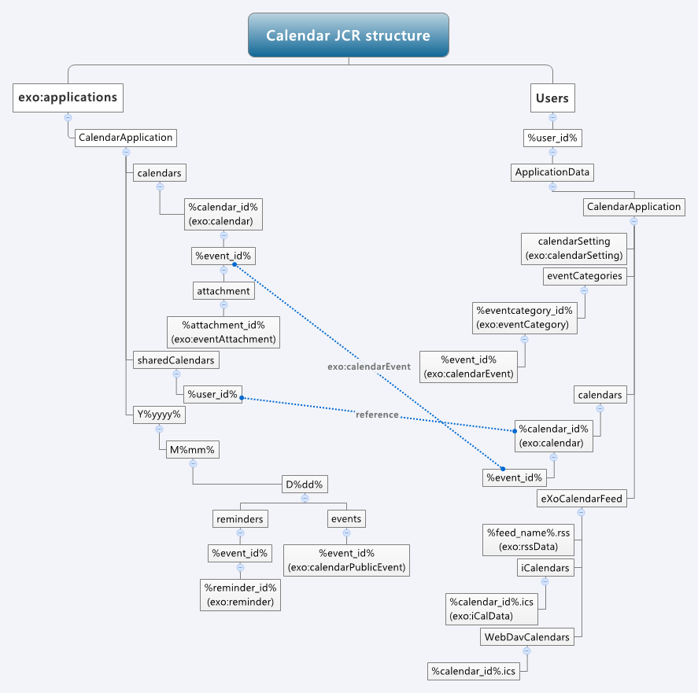
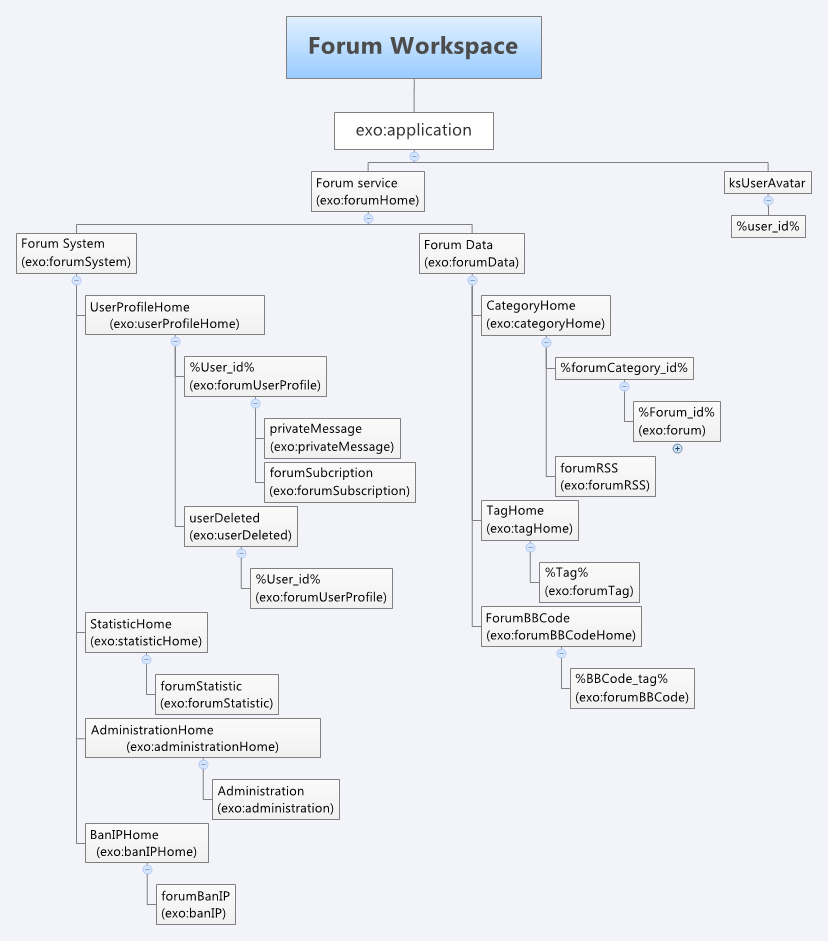
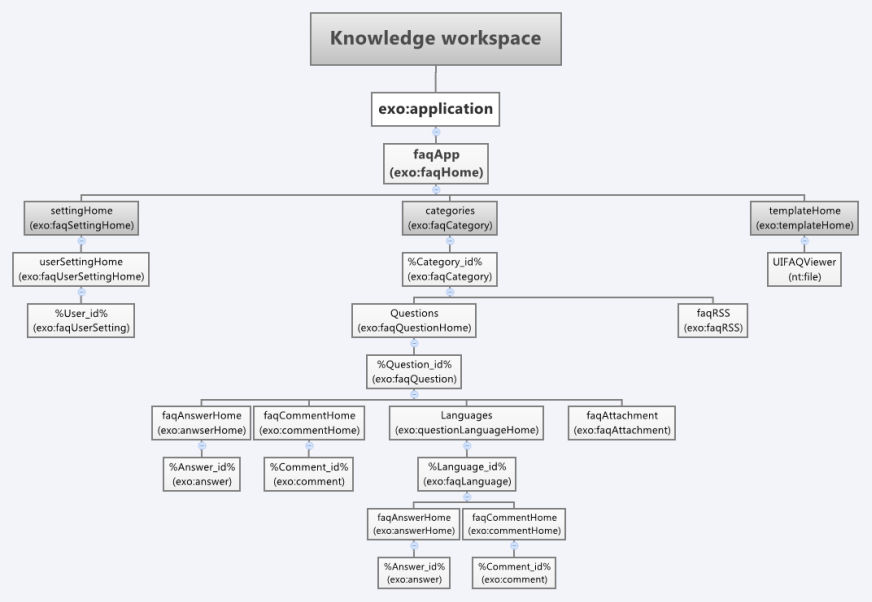
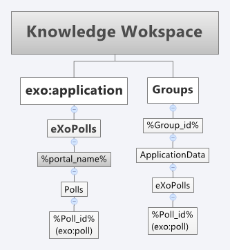
.. |image4| image:: images/common/1.png
   :width: 0.40000cm
.. |image5| image:: images/common/2.png
   :width: 0.40000cm
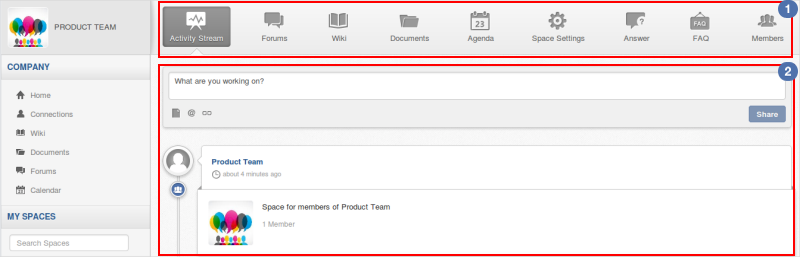
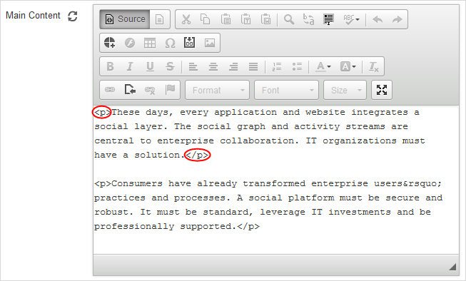
.. |image8| image:: images/common/edit_icon.png
   :width: 0.40000cm
.. |image9| image:: images/common/edit_icon.png
   :width: 0.40000cm


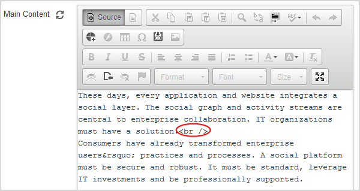
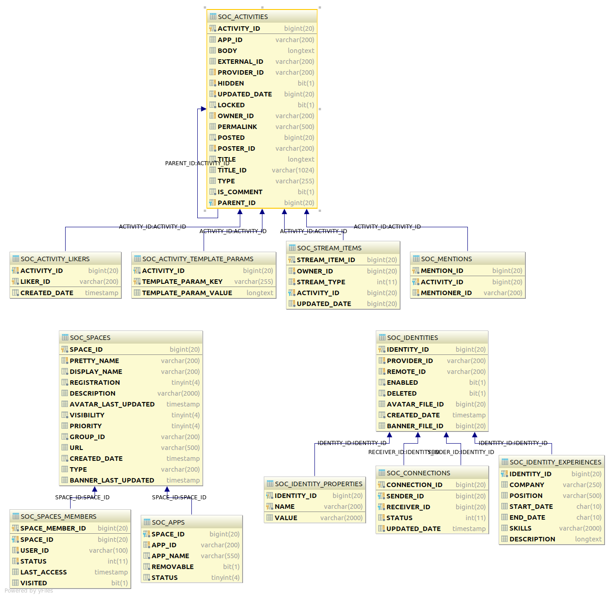
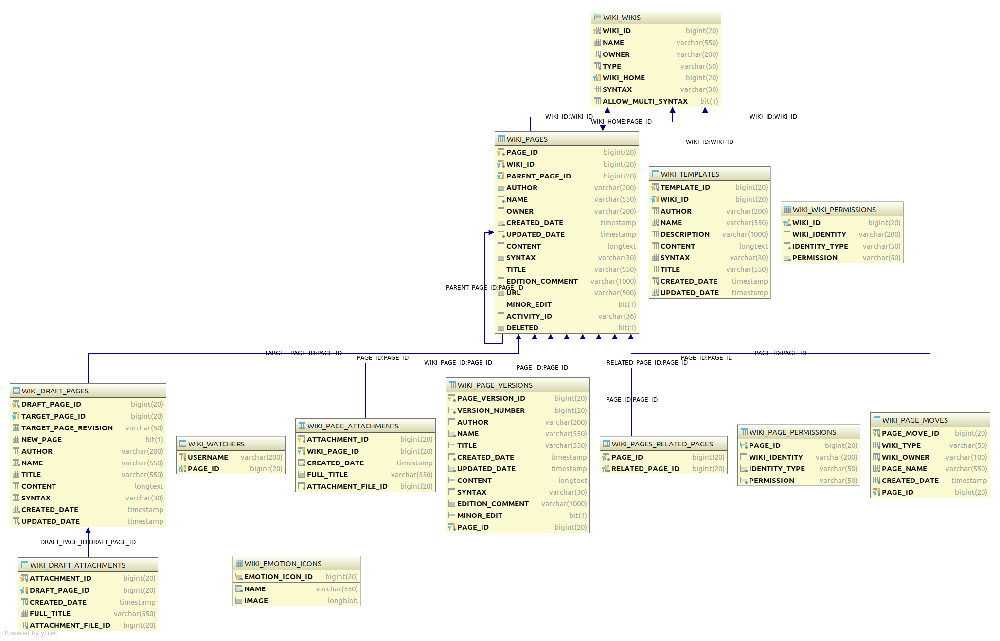
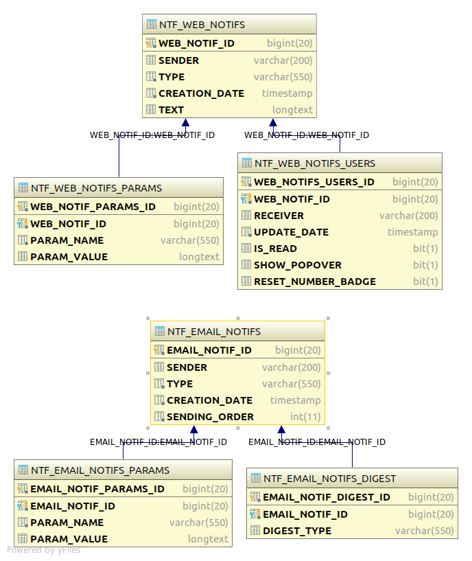
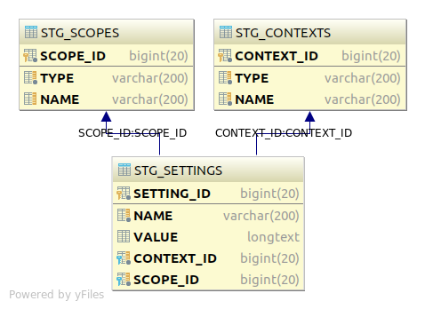
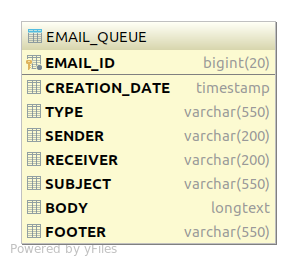
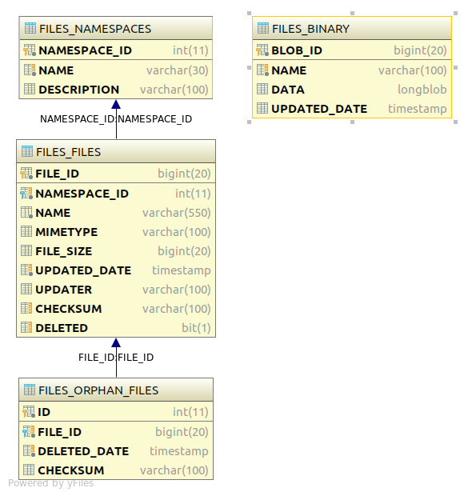
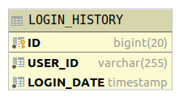
