.. _SSO:

###############
Single Sign-On
###############

eXo Platform provides an implementation of Single Sign-On (*SSO*) as an 
integration and aggregation platform.

When logging into the portal, users gain access to many systems 
throughout portlets using a single identity. In many cases, the portal 
infrastructure must be integrated with other SSO enabled systems. There 
are many different Identity Management solutions available. In most 
cases, each SSO framework provides a unique way to plug into a Java EE 
application.

    In this chapter:

    -  :ref:`Central Authentication Service (CAS) <eXoAddonsGuide.SSO.CAS>`

    -  :ref:`OpenAM <eXoAddonsGuide.SSO.OpenAM>`

    -  :ref:`SPNEGO <eXoAddonsGuide.SSO.SPNEGO>`

    -  :ref:`SAML2 <eXoAddonsGuide.SSO.SAML2>`

    -  :ref:`Single Sign-On in Cluster mode <eXoAddonsGuide.SSO.SSO_in_cluster>`

.. _eXoAddonsGuide.SSO.CAS:

====================================
Central Authentication Service (CAS)
====================================

Normally, when a non-authenticated user navigates to eXo Platform, he will be
redirected to the Login form of eXo Platform for authentication. In eXo Platform,
the CAS add-on enables the seamless integration between eXo Platform and CAS
SSO Framework. So with the enabled CAS integration, the user will be
redirected to the CAS login screen where he provides his credentials
rather than eXo Platform login form. By logging into CAS, he will then be
redirected to eXo Platform without login again. See
`here <https://apereo.github.io/cas>`__ for details about CAS.

The integration between eXo Platform and CAS consists of 3 steps:

-  :ref:`Setting up the CAS server <eXoAddonsGuide.SSO.CAS.CAS_server_setup>`.

-  :ref:`Configuring the eXo Platform server <eXoAddonsGuide.SSO.CAS.eXoPlatform_server_configuration>`
   to use the CAS server.

**Assumption**

-  **i.** CAS is deployed on Tomcat 7 server at **localhost:8888**.

-  **ii.** eXo Platform (Tomcat or JBoss EAP) is deployed at
   **localhost:8080**.

.. _eXoAddonsGuide.SSO.CAS.CAS_server_setup:

CAS server setup
~~~~~~~~~~~~~~~~~~

Depending on your organization infrastructure, user information
(basically username and password) can be stored in an independent
datastore. When a user logs in eXo Platform that delegates to CAS, CAS in its
turn calls the service of datastore to validate the login. If you store
user information in eXo Platform, you need to configure CAS to call back the
eXo Platform service to validate a login. In this case (called "callback"),
eXo provides solution for user information store - an Authentication
plugin named **org.gatein.sso.opensso.plugin.AuthenticationPlugin** that
can be set on the CAS server. This plugin makes secure authentication
callbacks to a RESTful service installed on the remote eXo Platform server to
authenticate a user. Meanwhile, if you store user information in another
external datastore rather than eXo Platform (called non-callback), you do not
need to install this Authentication plugin. Instead, you need to have
another Authentication plugin that is compatible with your datastore.

On the CAS server side, the following packages are required:

-  ``$CAS_HOME``: The CAS package that you may download from
   `here <https://github.com/apereo/cas/releases>`__. For eXo Platform
   integration, eXo Platform supports **CAS 3.5** and **CAS 4.0**. This
   documentation is based on testing results of CAS 3.5.2 and CAS 4.0.0
   integration. However, the integration can still work with all
   versions.

.. note:: The downloaded CAS release is a Maven-based project source (CAS does not release binaries officially), so you need to build the
          project by yourself. To complete these instructions, and perform the final build step, you need Apache Maven 3. You can get it
          `here <http://maven.apache.org/download.html>`__.

-  ``$CAS_TOMCAT_HOME``: A Servlet container on which CAS server will be
   deployed. In this tutorial, it is a `Tomcat 7
   package <http://tomcat.apache.org/download-70.cgi>`__.

Deploying CAS
--------------

1. Go to ``$CAS_HOME/cas-server-webapp`` and execute the command:
  
   ::
   
		mvn clean install -Dmaven.test.skip=true

.. note:: For CAS 4.0.0, you need to edit its ``$CAS_HOME/pom.xml`` file by replacing:

			.. code:: xml

				<header>${cs.dir}/src/licensing/header.txt</header>

		  with

			.. code:: xml

				<header>${licenseHeader}</header>

2. Deploy CAS to Tomcat by copying ``$CAS_HOME/cas-server-webapp/target/cas.war`` 
   into ``$CAS_TOMCAT_HOME/webapps``.

3. Change the default port to avoid conflicts with the default eXo Platform (for
   testing purposes) by replacing the **8080** port with **8888** in
   ``$CAS_TOMCAT_HOME/conf/server.xml``.

.. note:: If eXo Platform is running on the same machine as Tomcat, other ports
          need to be changed to avoid port conflicts. They can be changed to
          any free port. For example, you can change the admin port from 8005
          to 8805, and the AJP port from 8009 to 8809.

4. Start the CAS Tomcat server (``$CAS_TOMCAT_HOME\bin\startup.bat`` for
   Windows, or ``$CAS_TOMCAT_HOME/bin/startup.sh`` for Linux/OS X).

.. note:: At this stage, the CAS Tomcat is accessible at http://localhost:8888/cas, but unavailable for login.

After deploying CAS, you need to properly configure the CAS server. The
configuration will be different between callback and non-callback cases.
In paticular:

-  If you store users in eXo Platform, see :ref:`Authentication plugin setup <eXoAddonsGuide.SSO.CAS.CAS_server_setup.Authentication_plugin_setup>`.

-  If you store users in another datasource (such as LDAP), you need to
   have an Authentication plugin that is compatible with your
   datasource. For **CAS 3.5** and **CAS 4.0** integration, see
   `here <https://apereo.github.io/cas/5.0.x/installation/Configuring-Authentication-Components.html>`__
   for specific cases.

**Authentication plugin setup**

.. note:: The below procedure is for callback to eXo Platform server only. If it is not your case, bypass this.

1. Go to ``$PLATFORM_HOME``, and install CAS add-on with the command:

   ::
   
		addon install exo-cas

   After successful installation, one zip folder named ``cas-plugin.zip``
   is generated at the root of ``$PLATFORM_HOME``.

2. Extract ``cas-plugin.zip``, then copy and merge its extracted ``.jar``
   files into ``$CAS_TOMCAT_HOME/webapps/cas/WEB-INF/lib/``.

3. Open ``$CAS_TOMCAT_HOME/webapps/cas/WEB-INF/deployerConfigContext.xml``
   to modify.

   -  If you are using CAS 3.5.x, replace:

      .. code:: xml

		   <bean
			   class="org.jasig.cas.authentication.handler.support.SimpleTestUsernamePasswordAuthenticationHandler" />

      with the following (make sure you have set the host, port and context
      with the values corresponding to your portal).

      .. code:: xml

		   <bean class="org.gatein.sso.cas.plugin.AuthenticationPlugin">
			   <property name="gateInProtocol"><value>http</value></property>
			   <property name="gateInHost"><value>localhost</value></property>
			   <property name="gateInPort"><value>8080</value></property>
			   <property name="gateInContext"><value>portal</value></property>
			   <property name="httpMethod"><value>POST</value></property>
		   </bean>

   -  Or, if you are using CAS 4.0.0, find:

      .. code:: xml

		   <bean id="primaryAuthenticationHandler"
			   class="org.jasig.cas.authentication.AcceptUsersAuthenticationHandler">
			   <property name="users">
				   <map>
					   <entry key="casuser" value="Mellon"/>
				   </map>
			   </property>
		   </bean>

      and replace with:

	   .. code:: xml

		   <bean id="primaryAuthenticationHandler" class="org.gatein.sso.cas.plugin.CAS40AuthenticationPlugin">
			   <property name="gateInProtocol"><value>http</value></property>
			   <property name="gateInHost"><value>localhost</value></property>
			   <property name="gateInPort"><value>8080</value></property>
			   <property name="gateInContext"><value>portal</value></property>
			   <property name="httpMethod"><value>POST</value></property>
		   </bean>

Now, you can move to the :ref:`next section <eXoAddonsGuide.SSO.CAS.eXoPlatform_server_configuration>` 
to configure the eXo Platform server.

.. _eXoAddonsGuide.SSO.CAS.eXoPlatform_server_configuration:

eXo Platform server configuration
~~~~~~~~~~~~~~~~~~~~~~~~~~~~~~~~~~

The eXo Platform server configuration is quite different between the Tomcat
and JBoss packages. Here are instructions for both
:ref:`Tomcat <eXoAddonsGuide.SSO.CAS.eXoPlatform_server_configuration.Tomcat>`
and :ref:`JBoss <eXoAddonsGuide.SSO.CAS.eXoPlatform_server_configuration.JBoss>`
bundles.

.. _eXoAddonsGuide.SSO.CAS.eXoPlatform_server_configuration.Tomcat:

In Tomcat
----------

Add the following to the
``$PLATFORM_TOMCAT_HOME/gatein/conf/exo.properties`` file (see
:ref: `Configuration overview <Configuration.ConfigurationOverview>` 
for this file):

::

    # SSO
    gatein.sso.enabled=true
    gatein.sso.callback.enabled=${gatein.sso.enabled}
    gatein.sso.login.module.enabled=${gatein.sso.enabled}
    gatein.sso.login.module.class=org.gatein.sso.agent.login.SSOLoginModule
    gatein.sso.server.url=http://localhost:8888/cas
    gatein.sso.portal.url=http://localhost:8080
    gatein.sso.filter.logout.class=org.gatein.sso.agent.filter.CASLogoutFilter
    gatein.sso.filter.logout.url=${gatein.sso.server.url}/logout
    gatein.sso.filter.login.sso.url=${gatein.sso.server.url}/login?service=${gatein.sso.portal.url}/@@portal.container.name@@/initiatessologin

In previous versions of eXo Platform, there were much more changes needed in
various configuration files. But now, all JARS are available in
``$PLATFORM_TOMCAT_HOME/lib`` or
``$PLATFORM_JBOSS_HOME/standalone/deployments/platform.ear/lib``, so you
do not need to manually add any JAR files. If you are interested in
technical details about the single properties and configuration, you can
see the below.

-  ``gatein.sso.enabled`` - This option will generally enable SSO
   integration and informs eXo Platform about that.

-  ``gatein.sso.callback.enabled`` - This will enable REST callback
   authentication handler, which is needed if you want CAS server to use
   SSO Authentication plugin for CAS own authentication. By default, the
   Callback handler is enabled when the ``gatein.sso.enabled`` option is
   true. You can switch it to "false" if you do not want to use
   Authentication Plugin on the CAS server side.

-  ``gatein.sso.login.module.enabled`` &
   ``gatein.sso.login.module.class`` - There is a special login module
   configured for gatein-domain in
   ``$PLATFORM_TOMCAT_HOME/conf/jaas.conf`` (Tomcat) or
   ``$PLATFORM_JBOSS_HOME/standalone/configuration/standalone-exo.xml``
   (JBoss) called **SSODelegateLoginModule**. If SSO is disabled, this
   **SSODelegateLoginModule** is simply ignored during authentication
   process. But if SSO is enabled by this property, it delegates the
   work to another login module configured via the next option
   ``gatein.sso.login.module.class``. **SSODelegateLoginModule** will
   also resend all its options to its delegate. In case of CAS server,
   **org.gatein.sso.agent.login.SSOLoginModule** will be used as
   delegate. The point of this architecture is, that people do not need
   to manually change any login module configurations in ``jaas.conf``
   or ``standalone-exo.xml``.

The main eXo Platform configuration file for SSO integration is
``portal.war!/WEB-INF/conf/sso/security-sso-configuration.xml``. All
needed SSO components like agents and SSO interceptors (former servlet
filters) are configured in this file. The idea is that you never need to
manually edit this file as most of the options are configurable via
``exo.properties`` (see :ref:`Configuration overview <Configuration.ConfigurationOverview>` 
for this file). But in case that something is really not suitable for your
usecase or you need to add another custom interceptor or something else,
you can manually edit it here. All the additional configuration
properties are used especially for substitute values in this
``security-sso-configuration.xml`` file.

-  ``gatein.sso.server.url`` - Here you need to configure where your CAS
   server is deployed. In this context, that is
   http://localhost:8888/cas.

-  ``gatein.sso.portal.url`` - Here is URL for access to your GateIn
   Portal server (actually server you are just configuring). In this
   context, that is http://localhost:8080.

-  ``gatein.sso.filter.logout.class`` - Class of logout filter, which
   needs to be set to **org.gatein.sso.agent.filter.CASLogoutFilter**.
   This filter is able to redirect to CAS server and performs logout on
   CAS side.

-  ``gatein.sso.filter.logout.url`` - CAS server logout URL, which will
   be used for redirection by logout filter.

.. note:: If you want to disable logout on CAS side, you can simply disable
          this logout interceptor by adding the ``gatein.sso.filter.logout.enabled`` 
          with the "false" value. This will cause that click to Sign out on portal side
          will logout user from eXo Platform but not from CAS server. In this case, both
          ``gatein.sso.filter.logout.class`` and ``gatein.sso.filter.logout.url`` will be ignored.

-  ``gatein.sso.filter.login.sso.url`` - CAS server login URL, which
   will be used by LoginRedirectFilter for redirection to CAS server
   login page.

.. note:: The **@@portal.container.name@@** string will be dynamically
          replaced by the correct name of portal container, where it will
          be executed. The SSO component will do it, so in configuration,
          you should really use the **@@portal.container.name@@** string
          instead of some hard-coded portal container name (like portal or
          sample-portal).

Once these changes have been made, all links to the user authentication
pages will redirect to the CAS centralized authentication form. And on
CAS you will be able to authenticate with portal credentials (like
john/gtn) thanks to Authentication plugin.

.. _eXoAddonsGuide.SSO.CAS.eXoPlatform_server_configuration.JBoss:

In JBoss
---------

1. Edit the  file ``$PLATFORM_JBOSS_HOME/standalone/configuration/gatein/exo.properties``
   (see :ref:`Configuration overview <Configuration.ConfigurationOverview>` for this file):

   ::

		# SSO
				gatein.sso.enabled=true
				gatein.sso.callback.enabled=${gatein.sso.enabled}
				gatein.sso.login.module.enabled=${gatein.sso.enabled}
				gatein.sso.login.module.class=org.gatein.sso.agent.login.SSOLoginModule
				gatein.sso.server.url=http://localhost:8888/cas
				gatein.sso.portal.url=http://localhost:8080
				gatein.sso.filter.logout.class=org.gatein.sso.agent.filter.CASLogoutFilter
				gatein.sso.filter.logout.url=${gatein.sso.server.url}/logout
				gatein.sso.filter.login.sso.url=${gatein.sso.server.url}/login?service=${gatein.sso.portal.url}/@@portal.container.name@@/initiatessologin

   In which:

   -  **gatein.sso.server.url** (= http://localhost:8888/cas in this
      example) is the URL of your CAS web context.

   -  **gatein.sso.portal.url** (= http://localhost:8080 in this example)
      is the URL of your eXo Platform server.

2. Uncomment the below login module in ``$PLATFORM_JBOSS_HOME/standalone/configuration/standalone-exo.xml``,
   then change ``${gatein.sso.login.module.enabled}`` and
   ``${gatein.sso.login.module.class}`` into
   ``#{gatein.sso.login.module.enabled}`` and
   ``#{gatein.sso.login.module.class}`` respectively.

   .. code:: xml

		<login-module code="org.gatein.sso.integration.SSODelegateLoginModule" flag="required">
			<module-option name="enabled" value="#{gatein.sso.login.module.enabled}"/>
			<module-option name="delegateClassName" value="#{gatein.sso.login.module.class}"/>
			<module-option name="portalContainerName" value="portal"/>
			<module-option name="realmName" value="gatein-domain"/>
			<module-option name="password-stacking" value="useFirstPass"/>
		</login-module>

Now, you can move to the next section for :ref:`testing <eXoAddonsGuide.SSO.CAS.Testing>`.

.. _eXoAddonsGuide.SSO.CAS.Testing:

Testing
~~~~~~~~

For the callback case, testing is quite simple as follows:

1. Start eXo Platform server and CAS Tomcat server.

.. note:: Remember that CAS add-on has been already installed in eXo Platform.

2. Open your browser, then browse http://localhost:8080/portal/. You will
   be redirected to the CAS login form.

   |image0|

3. Log in with the eXo Platform credentials (using the default account -
   root/gtn, for example). You will be auto-logged in and redirected to 
   the eXo Platform homepage.

In case of non-callback, note that the user must be registered in both
the external datasource and eXo Platform, then log in with the credentials
(username and password) created in the external datasource.

Also, you can see:

-  :ref:`CAS SSO cookie configuration <eXoAddonsGuide.SSO.CAS.Cookie>` if
   you use more Service applications integrating with a single CAS SSO.

-  :ref:`Logout redirection setup <eXoAddonsGuide.SSO.CAS.Logout_redirection_setup>` 
   if you want to make the CAS server redirect to the portal page after 
   logout.

.. _eXoAddonsGuide.SSO.CAS.Cookie:

CAS SSO cookie configuration
~~~~~~~~~~~~~~~~~~~~~~~~~~~~~~

CAS server is using a special cookie CASTGC, which is useful for SSO
scenarios with more Service applications. For example, you have a single
CAS server and two eXo Platform servers configured to use it (in which
eXo Platform instances are marked as **accounts** and **services**). So if
your login is against CAS server with **accounts** of eXo Platform instance,
you do not need to authenticate again when you access CAS with
**services** of eXo Platform instance. You will be auto-authenticated when
clicking **Sign in** on the **services** instance. This is real SSO and
works thanks to CASTGC cookie, which automatically creates a new ticket
for **services** instance if it recognizes that user is already
authenticated.

However, the CASTGC cookie is secured by default (available only from
https connections). So to make it work, you have 2 possibilities:

-  Use the https protocol to access your CAS server. This will ensure
   that the secure CASTGC cookie can be viewable by browsers. This is a
   recommended approach for eXo Platformion environment. See
   `here <https://wiki.jasig.org/display/CASUM/Securing+Your+New+CAS+Server>`__
   for more details.

-  The easier workaround (but not recommended in eXo Platformion environment)
   is to switch the CASTGC cookie to be non-secure (for example, the
   cookie will not require secure access through https but can be
   accessed from http as well). To achieve this, you need to make
   configuration in the CAS side in the
   ``$CAS_TOMCAT_HOME/webapps/cas/WEB-INF/spring-configuration/ticketGrantingTicketCookieGenerator.xml``
   file and switch the **cookieSecure** attribute to **false**.
   Configuration of the cookie generator in this file should look like
   this:

   .. code:: xml

       <bean id="ticketGrantingTicketCookieGenerator" class="org.jasig.cas.web.support.CookieRetrievingCookieGenerator"
               p:cookieSecure="true"
               p:cookieMaxAge="-1"
               p:cookieName="CASTGC"
               p:cookiePath="/cas" />

.. _eXoAddonsGuide.SSO.CAS.Logout_redirection_setup:

Logout redirection setup
~~~~~~~~~~~~~~~~~~~~~~~~~

By default, on logout the CAS server will display the CAS logout page.
To make the CAS server redirect to the portal page after logout, modify
``$CAS_TOMCAT_HOME/webapps/cas/WEB-INF/cas-servlet.xml`` to include the
**followServiceRedirects="true"** parameter:

.. code:: xml

    <bean id="logoutController"  class="org.jasig.cas.web.LogoutController"
        p:centralAuthenticationService-ref="centralAuthenticationService"
        p:logoutView="casLogoutView"
        p:warnCookieGenerator-ref="warnCookieGenerator"
        p:ticketGrantingTicketCookieGenerator-ref="ticketGrantingTicketCookieGenerator"
        p:followServiceRedirects="true"/>

.. note:: The portal page will be then immediately redirected to the CAS login
          page. Thus, you will see the CAS login page instead of the portal page.

.. _eXoAddonsGuide.SSO.OpenAM:

======
OpenAM
======

Normally, when a non-authenticated user navigates to eXo Platform, he
will be redirected to the Login form of eXo Platform for authentication.
However, when the OpenAM integration is enabled, he will be redirected
to the OpenAM login screen where he provides his credentials. By logging
into OpenAM, he will then be redirected to eXo Platform without login
again.

The integration between eXo Platform and OpenAM consists of 2 steps:

-  :ref:`Setting up the OpenAM server <eXoAddonsGuide.SSO.OpenAM.OpenAM_server_setup>`.

-  :ref:`Configuring the eXo Platform server <eXoAddonsGuide.SSO.OpenAM.eXoPlatform_server_configuration>`
   to use the OpenAM server.

**Assumption**

-  **i.** OpenAM is deployed on Tomcat at **localhost:8888**.

-  **ii.** eXo Platform (Tomcat or JBoss) is deployed at
   **localhost:8080**.

.. _eXoAddonsGuide.SSO.OpenAM.OpenAM_server_setup:

OpenAM server setup
~~~~~~~~~~~~~~~~~~~~

If you store users in eXo Platform, you need to configure OpenAM to call
back the eXo Platform service to validate a login. In this case (called
"callback"), eXo provides the Authentication plugin
(**org.gatein.sso.opensso.plugin.AuthenticationPlugin** - that is
similar to CAS) that can be set on the OpenAM server. This plugin makes
secure authentication callbacks to a RESTful service installed on the
remote eXo Platform server to authenticate a user. Meanwhile, if you
store users in another external datasource rather than eXo Platform
(called non-callback), you will not need to install the Authentication
plugin.

On the OpenAM server side, the followings are required:

-  ``$PLATFORM_HOME/openam-plugin.zip!/``: This is not needed in case of
   non-callback.

-  ``openam.war``: You can download the war
   `here <https://backstage.forgerock.com/#!/downloads/enterprise/OpenAM>`__.
   If you download OpenAM as a zip file, extract it and select the exact
   war inside. The war file name may differ among OpenAM versions (or
   snapshots). For PRODUCT integration, eXo supports and tests **OpenAM
   11.0** and **OpenAM 10.1**. This guide is written on the exact
   versions: **OpenAM 11.0.0** and **OpenAM 10.1.0**. However, the
   integration can still work with all versions.

.. note:: Remember that the web context is based on the war file name. For
          example, if the war file name is ``OpenAM-11.0.0.war``, the web
          context is */OpenAM-11.0.0*. So, if you do not rename the
          downloaded war file name into ``openam.war``, remember to change
          the web context accordingly.

-  ``$OPENAM_TOMCAT_HOME``: A Servlet container on which OpenAM server
   will be deployed. In this tutorial, it is a `Tomcat 7
   package <http://tomcat.apache.org/download-70.cgi>`__ that you will
   download and extract to ``$OPENAM_TOMCAT_HOME`` in next steps.

Deploying OpenAM
-----------------

The first procedure is the same for both callback and non-callback
cases.

1. Copy ``openam.war`` into ``$OPENAM_TOMCAT_HOME/webapps`` to deploy
   OpenAM.

2. Change the default port to avoid a conflict with the default eXo
   Platform (for testing purposes) by replacing the **8080** port with
   **8888** in ``$OPENAM_TOMCAT_HOME/conf/server.xml``.

.. note:: If eXo Platform is running on the same machine as Tomcat, another ports
          need to be changed to avoid port conflicts. They can be changed to
          any free port. For example, you can change the admin port from 8005
          to 8805, and the AJP port from 8009 to 8809.

3. Start the OpenAM Tomcat server (``$OPENAM_TOMCAT_HOME\bin\startup.bat``
   for Windows, or ``$OPENAM_TOMCAT_HOME/bin/startup.sh`` for Linux/OS X).

After deploying OpenAM, you need to properly configure the OpenAM
server. The configuration will be different between callback or
non-callback cases. In particular:

-  If you store users in eXo Platform, see :ref:`Configuring the OpenAM server for
   callback case <eXoAddonsGuide.SSO.OpenAM.OpenAM_server_setup.Configuring_OpenAM_Callback>`.

-  If you store users in another external datasource (such as default
   OpenAM DataStore, or LDAP), see :ref:`Configuring the OpenAM server for
   non-callback
   case <eXoAddonsGuide.SSO.OpenAM.OpenAM_server_setup.Configuring_OpenAM_NonCallback>`.

.. _eXoAddonsGuide.SSO.OpenAM.OpenAM_server_setup.Configuring_OpenAM_Callback:

Configuring the OpenAM server for callback case
------------------------------------------------

**Step 1. Setting up the Authentication plugin**

1. Go to ``$PLATFORM_HOME``, and install OpenAM add-on with the command:
   
   ::
	
		addon install exo-openam
   
   If you want to use one specific version of OpenAM add-on, check by 
   yourself with command: 
   
   ::
	
		addon list --snapshots

   After successful installation, one zip folder named
   ``openam-plugin.zip`` is generated at the root of ``$PLATFORM_HOME``.

2. Extract ``$PLATFORM_HOME/openam-plugin.zip``, then copy and merge its
   content into ``$OPENAM_TOMCAT_HOME/webapps/openam``.

3. Check
   ``$OPENAM_TOMCAT_HOME/webapps/openam/WEB-INF/classes/gatein.properties``
   to ensure the correct information about your portal is already given as
   below.

   ::

		host=localhost
		port=8080
		context=portal
		protocol=http
		httpMethod=POST

.. _ConfigurationOptions_OpenAM:

**Step 2. Configuring realm in OpenAM UI**

.. note:: The UI of OpenAM forms may be a little different between OpenAM
          versions. In the procedure below, screenshots are based on OpenAM 11.0.1.

1. Start OpenAM Tomcat server, then browse http://localhost:8888/openam.
   You will be redirected to the **Configuration Options** page like below.

   |image1|

2. Click the Create Default Configuration link.

3. Select passwords for Default User (*amAdmin*) and Default Policy Agent,
   then click the **Create Configuration** button. Remember that these 2
   passwords must be different.

   |image2|

   You need to wait for some minutes when the OPENAM configuration is in
   progress. If the configuration is successful, you will receive a message
   stating "Configuration Complete!".

4. Click the Proceed to Login link.

5. Enter the username (*amAdmin*) and password created previously in the
   **Sign in to OpenAM** form, then click the **LOG IN** button. You will
   be redirected to the OpenAM homepage.

6. Select Configuration tab > Authentication subtab > Core link.

7. Enter **org.gatein.sso.opensso.plugin.AuthenticationPlugin** into the
   **New Value** field, then click **Add** and **Save**.

   |image3|

.. note:: This step is important for setup of GateIn Portal SSO
          AuthenticationPlugin to be available among other OpenAM
          authentication modules.

8. Click **Back to Service Configuration**, then select the Access Control
   tab, and click the **New** button to create a new realm, named "exo".

9. Enter **exo** into the Name field, then click **OK**.

   |image4|

10. Go to the "exo" realm and select the Authentication tab --> Authentication
    Chaining. In the **Authentication Chaining** section, click
    **ldapService**. Here, change the selection from **Datastore**, which is
    the default module in the authentication chain, to
    **AuthenticationPlugin**, then click **Save**.

    |image5|

    This enables the authentication of "exo" realm by using the eXo 
    Platform REST service instead of the default DataStore.

11. Click **Back to Authentication**, then **Back to Access Control**. 
    Here, select Configuration tab --> Authentication subtab --> Core --> 
    Realm Attributes --> User Profile. In the **User Profile** form, 
    change **Required** to **Dynamic**, then click **Save**.

    |image6|

.. note:: This step is needed because eXo Platform users are not in the OpenAM
          Datastore (LDAP server), so their profiles cannot be obtained if
          **Required** is active. By using **Dynamic**, all new users are
          automatically created in the OpenAM datastore after successful
          authentication.

12. Click **Back to Service Configuration**, then go to Access Control tab -->
    Top Level Realm --> Privileges tab --> All Authenticated Users. Here,
    increase the user privileges to allow the REST access by ticking the two
    checkboxes:

	-  Read and write access only for policy properties

	-  Read and write access to all realm and policy properties

13. Click Save --> Back to Privilege(s) --> Back to Access Control to 
    come back to the **Realms** window.

14. Select **exo**, then go to Privileges tab to increase the user
    privileges for **exo** realm as in Step 12, and click **Save**.

Now you can move to the :ref:`next section <eXoAddonsGuide.SSO.OpenAM.eXoPlatform_server_configuration>`
to configure the eXo Platform server.

.. _eXoAddonsGuide.SSO.OpenAM.OpenAM_server_setup.Configuring_OpenAM_NonCallback:

Configuring the OpenAM server for non-callback case
-----------------------------------------------------

If you store users in an external datasource, configuring the OpenAM
server is quite simple. You only need to create a new realm in OpenAM UI
named "exo". Besides, for testing purpose, the following procedure
includes steps of creating a user that is stored into the default
DataStore of OpenAM.

1. Start OpenAM Tomcat server, then browse
   `http://localhost:8888/openam <http://localhost:8888/openam/>`__. You
   will be redirected to the `**Configuration Options** <ConfigurationOptions_OpenAM>` 
   page.

2. Click the Create Default Configuration link. You will be auto-logged 
   as a default user - *amAdmin*.

3. Enter passwords for Default User and Default Policy Agent, then click
   the **Create Configuration** button. Remember that these 2 passwords
   must be different.

   You need to wait for some minutes when the OPENAM configuration is in
   progress. If the configuration is successful, you will receive a message
   stating "Configuration Complete!".

4. Click the Proceed to Login link.

5. Enter the username (*amAdmin*) and password created previously in the
   **Sign in to OpenAM** form, then click the **LOG IN** button. You will
   be redirected to the **OpenAM** homepage.

6. Select the Access Control tab, then click the **New** button to 
   create a new realm, named "exo".

7. Enter **exo** into the Name field, then click **OK**.

8. Click the "exo" realm in the Access Control tab.

9. Create users for the "exo" realm by selecting Subjects tab, then
   clicking **New**.

10. Enter information for the user (ID = "root" and password = "12345678",
	for example) in the **New User** form, then click **OK** to finish.

	|image7|

.. note:: To make the user stored in an external datasource be able to access
          eXo Platform resources, ensure that the user is already registered in
          eXo Platform also. To make convenient for login and access to eXo Platform
          later (for testing purpose), the user identifier (**ID** in this
          example) created in the external datasource should be one username
          existing in eXo Platform.

Now you can move to the :ref:`next section <eXoAddonsGuide.SSO.OpenAM.eXoPlatform_server_configuration>`
to configure the eXo Platform server.

.. _eXoAddonsGuide.SSO.OpenAM.eXoPlatform_server_configuration:

eXo Platform server configuration
~~~~~~~~~~~~~~~~~~~~~~~~~~~~~~~~~~~

Here are instructions for both
:ref:`Tomcat <eXoAddonsGuide.SSO.OpenAM.eXoPlatform_server_configuration.Tomcat>`
and :ref:`JBoss <eXoAddonsGuide.SSO.OpenAM.eXoPlatform_server_configuration.JBoss>`
packages.

.. _eXoAddonsGuide.SSO.OpenAM.eXoPlatform_server_configuration.Tomcat:

In Tomcat
----------

Add the following to the
``$PLATFORM_TOMCAT_HOME/gatein/conf/exo.properties`` file to have the
following lines (see :ref:`Configuration overview <PLFAdminGuide.Configuration.ConfigurationOverview>` 
for this file):

::

    #SSO 
    gatein.sso.enabled=true
    gatein.sso.callback.enabled=${gatein.sso.enabled}
    gatein.sso.login.module.enabled=${gatein.sso.enabled}
    gatein.sso.login.module.class=org.gatein.sso.agent.login.SSOLoginModule
    gatein.sso.server.url=http://localhost:8888/openam
    gatein.sso.openam.realm=exo
    gatein.sso.portal.url=http://localhost:8080
    gatein.sso.filter.logout.class=org.gatein.sso.agent.filter.OpenSSOLogoutFilter
    gatein.sso.filter.logout.url=${gatein.sso.server.url}/UI/Logout
    gatein.sso.filter.login.sso.url=${gatein.sso.server.url}/UI/Login?realm=${gatein.sso.openam.realm}&goto=${gatein.sso.portal.url}/@@portal.container.name@@/initiatessologin

In which:

-  **gatein.sso.server.url** (= http://localhost:8888/openam in this
   example) is the URL of your OpenAM web context.

-  **gatein.sso.portal.url** (= http://localhost:8080 in this example)
   is the URL of your eXo Platform server.

-  **gatein.sso.openam.realm** (= **exo** in this example) is the realm
   created in previous steps.

.. _eXoAddonsGuide.SSO.OpenAM.eXoPlatform_server_configuration.JBoss:

In JBoss
---------

1. Edit the
   ``$PLATFORM_JBOSS_HOME/standalone/configuration/gatein/exo.properties``
   file to have the following lines (see :ref:`Configuration
   overview <#PLFAdminGuide.Configuration.ConfigurationOverview>` for
   this file):

   ::

		# SSO
		gatein.sso.enabled=true
		gatein.sso.callback.enabled=${gatein.sso.enabled}
		gatein.sso.login.module.enabled=${gatein.sso.enabled}
		gatein.sso.login.module.class=org.gatein.sso.agent.login.SSOLoginModule
		gatein.sso.server.url=http://localhost:8888/openam
		gatein.sso.openam.realm=exo
		gatein.sso.portal.url=http://localhost:8080
		gatein.sso.filter.logout.class=org.gatein.sso.agent.filter.OpenSSOLogoutFilter
		gatein.sso.filter.logout.url=${gatein.sso.server.url}/UI/Logout
		gatein.sso.filter.login.sso.url=${gatein.sso.server.url}/UI/Login?realm=${gatein.sso.openam.realm}&goto=${gatein.sso.portal.url}/@@portal.container.name@@/initiatessologin

In which:

-  ``gatein.sso.server.url`` (= http://localhost:8888/openam in this
   example) is the URL of your OpenAM web context.

-  ``gatein.sso.portal.url`` (= http://localhost:8080 in this example)
   is the URL of your eXo Platform server.

-  ``gatein.sso.openam.realm`` (= **gatein** in this example) is the
   realm created in previous steps.

2. Uncomment the below login module in
   ``$PLATFORM_JBOSS_HOME/standalone/configuration/standalone-exo.xml``,
   then change ``${gatein.sso.login.module.enabled}`` and
   ``${gatein.sso.login.module.class}`` into
   ``#{gatein.sso.login.module.enabled}`` and
   ``#{gatein.sso.login.module.class}`` respectively.

   .. code:: xml

		<login-module code="org.gatein.sso.integration.SSODelegateLoginModule" flag="required">
			<module-option name="enabled" value="#{gatein.sso.login.module.enabled}"/>
			<module-option name="delegateClassName" value="#{gatein.sso.login.module.class}"/>
			<module-option name="portalContainerName" value="portal"/>
			<module-option name="realmName" value="gatein-domain"/>
			<module-option name="password-stacking" value="useFirstPass"/>
		</login-module>

After configuring the eXo Platform server, move to the :ref:`next section <eXoAddonsGuide.SSO.OpenAM.Testing>` 
for testing.

.. _eXoAddonsGuide.SSO.OpenAM.Testing:

Testing
~~~~~~~~~

.. note:: Ensure that the OpenAM add-on is already installed on the eXo Platform server.

For the callback case, testing is quite simple as follows:

1. Start eXo Platform server and OpenAM Tomcat server.

2. Open a browser, then browse http://localhost:8080/portal/. You will be
   redirected to the OpenAM centralized authentication form.

3. Log in with the eXo Platform credentials (for example, root/gtn). You 
   will be auto-logged in and redirected to the eXo Platform homepage.

In case of non-callback, note again that the user must be registered in
both the external datasource and eXo Platform. Also, log in with the
credentials created in the external datasource (for example,
root/12345678).

In case eXo Platform and OpenAM are deployed into different domains, move to
the :ref:`next section <eXoAddonsGuide.SSO.OpenAM.CrossDomain_Authentication_Configuration>`
for for more details.

.. _eXoAddonsGuide.SSO.OpenAM.CrossDomain_Authentication_Configuration:

Cross-domain authentication configuration
~~~~~~~~~~~~~~~~~~~~~~~~~~~~~~~~~~~~~~~~~~~

In the above example (in both JBoss and Tomcat), the eXo Platform and SSO
servers are deployed at **localhost:8080** and **localhost:8888**. The
above configuration works if both servers are deployed on the same
machine or the same domain, like eXo Platform on **portal.mydomain.com** and
SSO on **openam.mydomain.com**.

In case eXo Platform and SSO are deployed in different domains, for example,
eXo Platform on **portal.yourdomain.com:8080** and OpenAM on
**opensso.mydomain.com:8888/openam**, you need to do some changes on
both sides, as follows:

1. On portal side, change the configuration that you have done to
   ``$PLATFORM_TOMCAT_HOME/gatein/conf/exo.properties`` (Tomcat), or
   ``$PLATFORM_JBOSS_HOME/standalone/configuration/gatein/exo.properties``
   (JBoss) to have the following lines (see :ref:`Configuration overview <Configuration.ConfigurationOverview>` 
   for this file):

   ::

		# SSO
		gatein.sso.enabled=true
		gatein.sso.callback.enabled=${gatein.sso.enabled}
		gatein.sso.login.module.enabled=${gatein.sso.enabled}
		gatein.sso.login.module.class=org.gatein.sso.agent.login.SSOLoginModule
		gatein.sso.server.url=http://opensso.mydomain.com:8888/openam
		gatein.sso.openam.realm=exo
		gatein.sso.portal.url=http://portal.yourdomain.com:8080
		gatein.sso.filter.logout.class=org.gatein.sso.agent.filter.OpenSSOLogoutFilter
		gatein.sso.filter.logout.url=${gatein.sso.server.url}/UI/Logout
		gatein.sso.filter.login.enabled=false
		gatein.sso.filter.login.openamcdc.enabled=true
		gatein.sso.filter.login.sso.url=${gatein.sso.server.url}/cdcservlet

2. On the OpenAM side, create an agent as follows:

	-  i. Go to
	   `http://opensso.mydomain.com:8888/openam <http://ws2012-1.ad2.testlab1.exoplatform.vn:8888/openam>`__
	   and log in as amAdmin.

	-  ii. Go to Access Control tab > Realm "exo" > Agents tab > Web.

	-  iii. Click **New** to create a new web agent through the wizard. You
	   can use these properties:

	   -  Name: eXoAgent.

	   -  Password: Whatever you want. This password is not used for
		  integrating OpenAM into eXo Platform. See the WebAgent policy in
		  `OpenAM
		  documentation <https://wikis.forgerock.org/confluence/display/openam/Home>`__
		  for more details.

	   -  Configuration: Centralized.

	   -  Server URL: http://opensso.mydomain.com:8888/openam.

	   -  Agent URL: http://portal.yourdomain.com:8080.

.. note:: If you have more portal servers on different hosts, you may want to
          create an agent for each of them. Look at `OpenAM administration
          guide <http://openam.forgerock.org/doc/admin-guide/index.html>`__
          for more details.
          
.. _eXoAddonsGuide.SSO.SPNEGO:

======
SPNEGO
======

SPNEGO (Simple and Protected GSSAPI Negotiation Mechanism) is used to
authenticate transparently through the web browser after the user has
been authenticated when logging in the desktop session.

Before going deeper into how to integrate SPNEGO with eXo Platform, see
the below typical usecase:

|image8|

In particular:

-  |image9| The User logs into the desktop that is governed by a Ticket
   Granting Service (TGS) (such as Active Directory for Windows or
   Kerberos Server for Linux), then opens a browser (for example,
   Firefox) to access the web application hosted on eXo Platform.

-  |image10| The browser transfers the desktop sign-on information to the
   web application. The Web Server will respond presenting that it must
   "negotiate authentication". If both the browser and the server
   support SPNEGO, it will be used.

-  |image11| The browser then contacts a Kerberos Ticket Granting Service
   (TGS) to request a Service Ticket (ST). This Service Ticket is used
   to prove the identity of the caller.

-  |image12| The TGS Server generates a ST, then returns it to the
   client.

-  |image13| The ST is then sent to the Web Server.

-  |image14| The Web Server that is configured within TGS to be a Service
   Principal (SP) uses a keytab file to communicate with the TGS for
   authenticating the user.

For simplification, the SPNEGO integration with eXo Platform involves
specific activities that need to be performed on 3 factors:

.. _SPNEGO_integration_3_factors:

-  **Machine 1**: A server that runs the TGS (Active Directory/Kerberos
   Server) and associated Kerberos Key Distribution Center (KDC).

-  **Machine 2**: A server on which eXo Platform is running.

-  **Machine 3**: The end-user client that has a browser installed.

The implementation of a Single Sign-On for HTTP requests using the
SPNEGO web authentication is not the same in different environments, so
consult the relevant documents. In this guideline, detailed instructions
for 2 common environments, including Windows and Linux, will be covered.
However, regardless of your using environment, the following main steps
are generally required:

-  :ref:`Active Directory/Kerberos Server setup <eXoAddonsGuide.SSO.SPNEGO.Active_Directory-Kerberos_Server>`

-  :ref:`eXo Platform server configuration <eXoAddonsGuide.SSO.SPNEGO.Platform_Configuration>`

-  :ref:`Client (browser) configuration <eXoAddonsGuide.SSO.SPNEGO.Client_Configuration>`

.. _eXoAddonsGuide.SSO.SPNEGO.Active_Directory-Kerberos_Server:

Active Directory/Kerberos Server setup
~~~~~~~~~~~~~~~~~~~~~~~~~~~~~~~~~~~~~~~

Here are step-by-step instructions for setting up :ref:`Active Directory on
Windows <Single_Sign_On-Active_Directory_Windows>` and :ref:`Kerberos
Server on Linux <Single_Sign_On-Kerberos_Server_Linux>`.

.. _Single_Sign_On-Active_Directory_Windows:

Active Directory on Windows environment
----------------------------------------

-  :ref:`Creating a Service Principal Name (SPN) user within the Microsoft Active Directory <CreatingUserAccountInMicrosoftActiveDirectory>`

-  :ref:`Configuring Kerberos SPN to identify eXo Platform <ConfiguringKerberosSPNForeXoPlatformServer>`

-  :ref:`Generating the Kerberos Keytab file used by SPNEGO <CreatingKerberosKeytabFile>`

.. note:: The above 3 steps require appropriate rights to access the Windows
          Domain Controller (on :ref:`Machine 1 <SPNEGO_integration_3_factors>`). If you do not already have
          these rights, contact with your administrator.

.. _CreatingUserAccountInMicrosoftActiveDirectory:

**Step 1. Creating a Service Principal Name (SPN) user within the
Microsoft Active Directory**

According to `this article of
Microsoft <http://msdn.microsoft.com/en-us/library/cc281382.aspx>`__,
"an SPN for the server must be registered under either a built-in
computer account (such as NetworkService or LocalSystem) or user
account". In this step, you create a user account that will be used
during the SPN registration in :ref:`Step 2 <ConfiguringKerberosSPNForeXoPlatformServer>`.

1. Create a user account within the **Active Directory Users and
   Computers** console by clicking Start --> Administrative Tools --> 
   Active Directory Users and Computers --> $Domain\_Name
   (`example.com <example.com>`__ in this scenario) --> Users, then
   right-click in the right panel and select New --> User.

   |image15|

2. Fill information for the user account, then click **Next** to move to
   the **Create Password** form.

   |image16|

3. Enter a password for the user account. For example, the username as
   "exoadmin" with password as "aA@123456" will be used later. Since this
   account is acting as a service account, select User cannot change
   password and Password never expires, then click **Next**. You need to
   remember this password to use later.

   |image17|

4. Verify the user settings, and select **Finish**.

5. Configure the new user account to comply with the Kerberos protocol 
   as follows:

	-  **i.** Right-click the user in the Users tree and select
	   **Properties**. The **User Properties** form will open.

	-  **ii.** Navigate to the **Account** tab. Under the Account options
	   section, ensure the followings are selected: User cannot change
	   password, Password never expires, Do not require Kerberos
	   preauthentication.

.. _ConfiguringKerberosSPNForeXoPlatformServer:

**Step 2. Configuring the Service Principal Name (SPN) for eXo Platform
server**

The ``setspn`` command is used to create a service principal for the
user previously created. A service principal complies with the rule:
*serviceclass/host*.

Because the web application is communicating via the HTTP protocol, HTTP
is the service class. The host is fully qualified domain name (FQDN) of
the eXo Platform server. The FQDN of the eXo Platform server in this
case is `server.example.com <server.example.com>`__.

To add a Service Principal, use the commands that comply with the
formats:

-  ``setspn -a HTTP/$hostname $username`` (that is,
   ``setspn -a HTTP/server exoadmin``)

-  ``setspn -a HTTP/$fully-qualified-host-name $username`` (that is,
   ``setspn -a HTTP/server.example.com exoadmin``)

.. note:: One service should be added to only one domain account, otherwise
          users will not be able to log into this service automatically. To
          check the service and domain account that you created, run the
          following command: ``setspn -l exoadmin``. In which, **-l** is a
          lowercase of **L**.

.. _CreatingKerberosKeytabFile:

**Step 3. Creating the Kerberos Keytab file used by SPNEGO**

In this step, the **ktpass** is used to generate the keytab file by
mapping the service principal to the user account created previously.
This file will then be stored in the eXo Platform server (on :ref:`Machine 2 <SPNEGO_integration_3_factors>`).

1. Create the keytab file for the eXo Platform server running in an Windows
   2008 domain environment that complies with the format:
   
   ::
   
		ktpass /princ HTTP/$fully-qualified-domain-name@realm-name /pass "$password" /mapuser "$username" /out $hostname.keytab /ptype KRB5_NT_PRINCIPAL /kvno 0 /crypto RC4-HMAC-NT

   In this scenario, the command will be:
   
   ::

		ktpass /princ HTTP/server.example.com@EXAMPLE.COM /pass "aA@123456" /mapuser "EXAMPLE\exoadmin" /out server.keytab /ptype KRB5_NT_PRINCIPAL /kvno 0 /crypto RC4-HMAC-NT

   In this step, the ``$hostname.keytab`` file (that is, ``server.keytab``)
   will be generated.

2. Copy the generated keytab file to a location on the eXo Platform server.

   After creating the keytab file successfully, continue with :ref:`configuring the eXo Platform server <eXoAddonsGuide.SSO.SPNEGO.Platform_Configuration>`.

.. _Single_Sign_On-Kerberos_Server_Linux:

Kerberos Server on Linux
--------------------------

.. note:: The Kerberos setup is dependent on your Linux distribution, so steps can be slightly different in your environment.

1. Correct the setup of network on the machine. For example, if you are
   using the "server.example.com" domain as your machine where Kerberos and
   eXo Platform are located and the **machine's IP address** is
   192.168.1.88, add the following line to the ``/etc/hosts`` file.

   ::

       192.168.1.88  server.example.com

.. note:: It is not recommended to use loopback addresses.

2. Install Kerberos with these packages: ``krb5-admin-server``,
   ``krb5-kdc``, ``krb5-config``, and ``krb5-user``. If you are using
   Ubuntu/Debian, use the following command to install these packages:

   ::
   
		sudo apt-get install krb5-admin-server krb5-kdc krb5-config krb5-user

3. Edit the Kerberos configuration file at ``/etc/krb5.conf``, including:

	-  **i.** Uncomment these lines. If the value of these parameters is
	   "des3-hmac-sha1", change it into **rc4-hmac**.

	   ::

		   default_tgs_enctypes = rc4-hmac
		   default_tkt_enctypes = rc4-hmac
		   permitted_enctypes = rc4-hmac

	-  **ii.** Add ``EXAMPLE.COM`` as a default realm, then add
	   ``EXAMPLE.COM`` to the list of realms (and remove the remains of
	   realms - not mandatory). The content looks like:

	   ::

		   [libdefaults]
			   default_realm = EXAMPLE.COM

			   # The following krb5.conf variables are only for MIT Kerberos.
				   krb4_config = /etc/krb.conf
				   krb4_realms = /etc/krb.realms
				   kdc_timesync = 1
				   ccache_type = 4
				   forwardable = true
				   proxiable = true

			   # The following encryption type specification will be used by MIT Kerberos
			   # if uncommented.  In general, the defaults in the MIT Kerberos code are
			   # correct and overriding these specifications only serves to disable new
			   # encryption types as they are added, creating interoperability problems.
			   #
			   # The only time when you might need to uncomment these lines and change
			   # the enctypes is if you have local software that will break on ticket
			   # caches containing ticket encryption types it doesn't know about (such as
			   # old versions of Sun Java).

				   default_tgs_enctypes = rc4-hmac
				   default_tkt_enctypes = rc4-hmac
				   permitted_enctypes = rc4-hmac

			   # The following libdefaults parameters are only for Heimdal Kerberos.
				   v4_instance_resolve = false
				   v4_name_convert = {
					   host = {
					   rcmd = host
					   ftp = ftp
					   }
					   plain = {
					   something = something-else
					   }
				   }
				   fcc-mit-ticketflags = true

			   [realms]
				   EXAMPLE.COM = {
				   kdc = server.example.com
				   admin_server = server.example.com
				   }

			   [domain_realm]
				   .example.com = EXAMPLE.COM
					example.com = EXAMPLE.COM

			   [login]
				   krb4_convert = true
				   krb4_get_tickets = false

4. Edit the KDC configuration file at ``/etc/krb5kdc/kdc.conf`` that 
   looks like.

   ::

		[kdcdefaults]
					kdc_ports = 750,88
				 
				[realms]
					EXAMPLE.COM = {
						database_name = /var/lib/krb5kdc/principal
						admin_keytab = FILE:/etc/krb5.keytab
						acl_file = /etc/krb5kdc/kadm5.acl
						key_stash_file = /etc/krb5kdc/stash
						kdc_ports = 750,88
						max_life = 10h 0m 0s
						max_renewable_life = 7d 0h 0m 0s
						master_key_type = rc4-hmac
						supported_enctypes = rc4-hmac:normal
						default_principal_flags = +preauth
					}
				 
				[logging]
						kdc = FILE:/tmp/kdc.log
						admin_server = FILE:/tmp/kadmin.log

5. Create a KDC database using the ``sudo krb5_newrealm`` command.

6. Start the KDC and Kerberos admin servers using these commands:

	-  ``sudo /etc/init.d/krb5-kdc restart``

	-  ``sudo /etc/init.d/krb5-admin-server restart``

7. Add Principals and create Keys.

	-  **i.** Start an interactive 'kadmin' session and create the necessary
	   Principals.

	   ``sudo kadmin.local``

	-  **ii.** Add the eXo Platform machine and keytab file that need to be
	   authenticated.

	   -  ``addprinc -randkey HTTP/server.example.com@EXAMPLE.COM``

	   -  ``ktadd HTTP/server.example.com@EXAMPLE.COM``

	-  **iii.** Add the default eXo Platform user account(s).

	   ``addprinc root``

	   You will be asked to enter a password for the user account(s) that
	   you need to remember to use later.
	   

.. note:: The ``krb5.keytab`` file will be created after doing this 
		  step. You need to ensure that this file is readable (by using 
          the command:``sudo chmod a+r /etc/krb5.keytab`` if needed).

8. Exit the **kadmin.local** (for example, by entering the **q** key),
   then test your setup by using the command:
   
   ::
   
		kinit -A root

	-  If the setup works well, you are asked to enter the password created
	   for the 'root' user in Step 7. Without **-A**, the Kerberos ticket
	   validation involves reverse DNS lookups, which may cause trouble to
	   your debug (if your network's DNS setup is not great). Thus, the
	   **-A** option is recommended in the development setup, but should be
	   avoided in the production environment.

	-  After successful login to Kerberos, you can see your Kerberos ticket
	   when using the ``klist`` command.

	-  If you want to log out and destroy your ticket, use the ``kdestroy``
	   command.

After setting up the Kerberos on Linux, move to the :ref:`next step <eXoAddonsGuide.SSO.SPNEGO.Platform_Configuration>` 
to configure eXo Platform server.

.. _eXoAddonsGuide.SSO.SPNEGO.Platform_Configuration:

eXo Platform server configuration
~~~~~~~~~~~~~~~~~~~~~~~~~~~~~~~~~~

.. note:: As said earlier, the eXo Platform configuration should be done on
          the :ref:`Machine 2 <SPNEGO_integration_3_factors>` on which eXo
          Platform is running.

**Installing eXo SPNEGO add-on**

Go to ``$PLATFORM_HOME``, and install SPNEGO add-on with the command:

::

	addon install exo-spnego

**Integrating SPNEGO with eXo Platform Tomcat**

1. Append this login module into the bottom of the
   ``$PLATFORM_TOMCAT_HOME/conf/jaas.conf`` file.

	.. code:: xml

		spnego-server {
				com.sun.security.auth.module.Krb5LoginModule required
				storeKey=true
				doNotPrompt=true
				useKeyTab=true
				keyTab="/etc/krb5.keytab"
				principal="HTTP/server.example.com@EXAMPLE.COM"
				useFirstPass=true
				debug=true
				isInitiator=false;
			};

.. note: On Windows environment, you should change the path of keytab. For
         example, if this file is put into the D drive, it should be:
         keyTab="D:/server.keytab".

2. Configure SSO for eXo Platform by appending these configurations into
   the ``$PLATFORM_TOMCAT_HOME/gatein/conf/exo.properties`` file (see
   :ref:`Configuration overview <PLFAdminGuide.Configuration.ConfigurationOverview>` 
   for this file).

	.. code:: xml

		# SSO
			gatein.sso.enabled=true
			gatein.sso.filter.spnego.enabled=true
			gatein.sso.callback.enabled=false
			gatein.sso.skip.jsp.redirection=false
			gatein.sso.login.module.enabled=true
			gatein.sso.login.module.class=org.gatein.security.sso.spnego.SPNEGOSSOLoginModule
			gatein.sso.filter.login.sso.url=/@@portal.container.name@@/spnegosso
			gatein.sso.filter.initiatelogin.enabled=false
			gatein.sso.valve.enabled=false
			gatein.sso.filter.logout.enabled=false

3. On **Windows** environment, rename
   ``$PLATFORM_TOMCAT_HOME/bin/setenv-customize.sample.bat`` into
   ``$PLATFORM_TOMCAT_HOME/bin/setenv-customize.bat``, then add the
   following to the ``setenv-customize.bat`` file.

   ::

       SET "CATALINA_OPTS=%CATALINA_OPTS% -Djava.security.krb5.realm=EXAMPLE.COM -Djava.security.krb5.kdc=$ADMACHINE_NAME.example.com"

.. note:: ``$ADMACHINE_NAME`` is name of the machine that has Active Directory installed.

4. On **Linux** environment, rename
   ``$PLATFORM_TOMCAT_HOME/bin/setenv-customize.sample.sh`` into
   ``$PLATFORM_TOMCAT_HOME/bin/setenv-customize.sh``, then add the
   following to the ``setenv-customize.sh`` file.

   ::

       CATALINA_OPTS="${CATALINA_OPTS} -Djava.security.krb5.realm=EXAMPLE.COM -Djava.security.krb5.kdc=$ADMACHINE_NAME.example.com"

.. note:: ``$ADMACHINE_NAME`` is name of the machine that has Active Directory installed.

5. Start eXo Platform.

**Intergating SPNEGO with eXo Platform JBoss**

1. Add the login module "spnego-server" as the child of the
   ``<security-domains>`` section of the
   ``$PLATFORM_JBOSS_HOME/standalone/configuration/standalone-exo.xml``
   file.

   .. code:: xml

		<security-domain name="spnego-server" cache-type="default">
				<authentication>
					<login-module code="com.sun.security.auth.module.Krb5LoginModule" flag="required">
						<module-option name="storeKey" value="true"/>
						<module-option name="doNotPrompt" value="true"/>
						<module-option name="useKeyTab" value="true"/>
						<module-option name="keyTab" value="/etc/krb5.keytab"/>
						<module-option name="principal" value="HTTP/server.example.com@EXAMPLE.COM"/>
						<module-option name="useFirstPass" value="true"/>
						<module-option name="debug" value="true"/>
						<module-option name="isInitiator" value="false"/>
					</login-module>
				</authentication>
			</security-domain>

.. note:: On Windows environment, you should change the path of keytab. For
          example, if this file is put into the D drive, it should be:
          keyTab="D:/server.keytab".

2. Uncomment the below login module in ``standalone-exo.xml``, then change
   ``${gatein.sso.login.module.enabled}`` and
   ``${gatein.sso.login.module.class}`` into
   ``#{gatein.sso.login.module.enabled}`` and
   ``#{gatein.sso.login.module.class}`` respectively.

   .. code:: xml

		<login-module code="org.gatein.sso.integration.SSODelegateLoginModule" flag="required">
				<module-option name="enabled" value="#{gatein.sso.login.module.enabled}"/>
				<module-option name="delegateClassName" value="#{gatein.sso.login.module.class}"/>
				<module-option name="portalContainerName" value="portal"/>
				<module-option name="realmName" value="gatein-domain"/>
				<module-option name="password-stacking" value="useFirstPass"/>
			</login-module>

3. Configure SSO for eXo Platform by appending these configurations into
   the ``$PLATFORM_JBOSS_HOME/standalone/configuration/gatein/exo.properties``
   file (see :ref:`Configuration overview <PLFAdminGuide.Configuration.ConfigurationOverview>` 
   for this file).

   .. code:: xml

		# SSO
			gatein.sso.enabled=true
			gatein.sso.filter.spnego.enabled=true
			gatein.sso.callback.enabled=false
			gatein.sso.skip.jsp.redirection=false
			gatein.sso.login.module.enabled=true
			gatein.sso.login.module.class=org.gatein.security.sso.spnego.SPNEGOSSOLoginModule
			gatein.sso.filter.login.sso.url=/@@portal.container.name@@/spnegosso
			gatein.sso.filter.initiatelogin.enabled=false
			gatein.sso.valve.enabled=false
			gatein.sso.filter.logout.enabled=false

4. Start eXo Platform by using the command:

   - On linux:

     ::
     
			./standalone.sh -Djava.security.krb5.realm=EXAMPLE.COM -Djava.security.krb5.kdc=$AD_MACHINE_NAME.example.com -b server.example.com
   
   - On Windows:
       
     ::

			standalone.bat -Djava.security.krb5.realm=EXAMPLE.COM -Djava.security.krb5.kdc=$AD_MACHINE_NAME.example.com -b server.example.com

.. note:: ``$AD_MACHINE_NAME`` is name of the machine that has Active Directory installed.

Next, move to the final step to :ref:`configure the client <eXoAddonsGuide.SSO.SPNEGO.Client_Configuration>` 
(browser you are using).

.. _eXoAddonsGuide.SSO.SPNEGO.Client_Configuration:

Client (browser) configuration
~~~~~~~~~~~~~~~~~~~~~~~~~~~~~~~

As you know, the Kerberos authentication protocol supports the concept
of Single Sign-On (SSO). After being authenticated at the first start of
a session, users can access network services through a Kerberos realm
without re-authentication. To make this work, you need to use network
protocols that are aware of Kerberos. In the case of HTTP, Kerberos is
normally provided by the SPNEGO authentication mechanism - also known as
"negotiate authentication". The below steps are different among
browsers, so consult the relevant documentation of your OS or web
browser. In this section, only 2 most popular browsers, including
:ref:`Firefox <eXoAddonsGuide.SSO.SPNEGO.Client_Configuration-Firefox>`
and :ref:`Internet Explorer <eXoAddonsGuide.SSO.SPNEGO.Client_Configuration-InternetExplorer>`,
are covered.

.. _eXoAddonsGuide.SSO.SPNEGO.Client_Configuration-Firefox:

Firefox
--------

Although SPNEGO is supported in Firefox, but it is disabled by default
for some security reasons. Supposing that you want to authenticate the
http://server.example.com website using Kerberos, the web server should
be configured to accept the Kerberos tickets from the **EXAMPLE.COM**
realm that you created earlier.

To do this, you need to enable the **Negotiate authentication** of
Firefox in client machines so that clients could be authenticated by eXo
Platform as follows:

1. Start Firefox, then enter ``about:config`` in the location bar.

2. Click the **I'll be careful, I promise!** link to access the
   configurations.

3. Enter **network.negotiate-auth** on the search bar to filter the
   relevant settings from the list:

4. Double-click the **network.negotiate-auth.delegation-uris** and
   **network.negotiate-auth.trusted-uris**. A dialog box for editing the
   values should appear.

5. Enter the required hostname, then click **OK**. You may need to restart
   Firefox for these changes to take effect.

   ::

		network.negotiate-auth.allow-proxies = true
		network.negotiate-auth.delegation-uris = .example.com
		network.negotiate-auth.gsslib (no-value)
		network.negotiate-auth.trusted-uris = .example.com
		network.negotiate-auth.using-native-gsslib = true

.. _eXoAddonsGuide.SSO.SPNEGO.Client_Configuration-InternetExplorer:

Internet Explorer
------------------

Internet Explorer will only perform SPNEGO authentication against sites
that are set in the Local Intranet zone. Thus, you need to add the site
(http://server.example.com in this example) to this zone as follows:

1. Open IE, then click Tools tab --> Internet Options. If you are using
   Windows Vista or Windows 7, you can click **Start** and type **Internet
   Options**.

2. Select Security tab --> Local intranet --> Sites --> Advanced.

3. Enter the fully qualified domain name of the application server into 
   the text field, then click **Add**.

|image18|

4. Click **Close**, then **OK** through the various windows. You may need
   to restart Internet Explorer for the changes to take effect.

Now, you can move to the :ref:`next section <eXoAddonsGuide.SSO.SPNEGO.Testing>` 
for testing.

.. _eXoAddonsGuide.SSO.SPNEGO.Testing:

Testing
~~~~~~~~

**On Windows**

1. On the :ref:`Machine 1 <SPNEGO_integration_3_factors>` (that has 
   Microsoft Active Directory installed), create another user account 
   so that the username is the same as that of one user existing in eXo 
   Platform, for example "root".

2. Log in the Client machine with the user created in the previous step
   (root in this case).

3. In the Client machine, open the http://server.example.com:8080/portal 
   on the browser. Note that you may need to reconfigure the browser as said
   :ref:`earlier <eXoAddonsGuide.SSO.SPNEGO.Client_Configuration>`. As 
   the result, you will be auto-logged into eXo Platform as the "root" 
   user without login again in the Login form of eXo Platform.

**On Linux**

1. Log into Kerberos with the ``kinit root`` command, then go to
   http://server.example.com:8080/portal. You will be auto-logged into 
   eXo Platform as the "root" without login again in the Login form of 
   eXo Platform.

2. Test the FORM fallback by destroying the ticket with the ``kdestroy``
   command. Then, log out eXo Platform and log in again. You now can fill
   user credentials in the eXo Platform login form.

In case you want to enforce authentication only by SPNEGO and disable
the authentication through the eXo Platform login form, see the
:ref:`next <eXoAddonsGuide.SSO.SPNEGO.Disabling_Fallback>` for how-to.

.. _eXoAddonsGuide.SSO.SPNEGO.Disabling_Fallback:

Disabling fallback to FORM authentication
~~~~~~~~~~~~~~~~~~~~~~~~~~~~~~~~~~~~~~~~~~

As mentioned, the fallback to FORM authentication is automatically
enabled. This means that users can authenticate either by the SPNEGO
handshake with their Kerberos ticket or by providing their credentials
in the eXo Platform login form, which will perform verification of
credentials against the Picketlink IDM database.

For some reasons, you may want to enforce authentication only by SPNEGO
and disable possibility to authenticate with the eXo Platform login
form. In this case, you will need to add the
``enableFormAuthentication=false`` option to the
**SSODelegateLoginModule** module:

-  ``$PLATFORM_TOMCAT_HOME/conf/jaas.conf`` (in Tomcat). The
   ``jaas.conf`` now looks like:

   .. code:: xml

       ...
           gatein-domain {
               org.gatein.sso.integration.SSODelegateLoginModule required
                   enabled="#{gatein.sso.login.module.enabled}"
                   delegateClassName="#{gatein.sso.login.module.class}"
                   portalContainerName=portal
                   realmName=gatein-domain
                   enableFormAuthentication=false
                   password-stacking=useFirstPass;
               org.exoplatform.services.security.j2ee.TomcatLoginModule required
                   portalContainerName=portal
                   realmName=gatein-domain;
           };
       ...

-  ``$PLATFORM_JBOSS_HOME/standalone/configuration/standalone-exo.xml``
   (in JBoss). The ``standalone-exo.xml`` now looks like.

   .. code:: xml

       ...
           <security-domain name="gatein-domain" cache-type="default">
               <authentication>
                   <login-module code="org.gatein.sso.integration.SSODelegateLoginModule" flag="required">
                       <module-option name="enabled" value="#{gatein.sso.login.module.enabled}" />
                       <module-option name="delegateClassName" value="#{gatein.sso.login.module.class}" />
                       <module-option name="portalContainerName" value="portal" />
                       <module-option name="enableFormAuthentication" value="false"/>
                       <module-option name="realmName" value="gatein-domain" />
                       <module-option name="password-stacking" value="useFirstPass" />
                   </login-module>
                   <login-module code="org.exoplatform.services.security.j2ee.JBossAS7LoginModule" flag="required">
                       <module-option name="portalContainerName" value="portal"/>
                       <module-option name="realmName" value="gatein-domain"/>
                   </login-module>
               </authentication>
           </security-domain>
       ...

.. _eXoAddonsGuide.SSO.SAML2:

=====
SAML2
=====

SAML2 is version 2 of SAML (Security Assertion Markup Language), an
XML-based standard for exchanging authentication and authorization data.
The document of SAML2 Specifications is available
`here <http://saml.xml.org/saml-specifications>`__.

According to SAML2 Specifications, two parties which exchange
authentication and authorization data are called SP (Service Provider)
and IDP (Identity Provider). IDP issues the security assertion and SP
consumes it. The following scenario describes a SAML2 exchange:

1. A user, via web browser, requests a resource at the SP.

2. The SP checks and finds no security context for the request, then it
   redirects to the SSO service.

3. The browser requests the SSO service at IDP.

4. The IDP responds with an XHTML form after performing security check and
   identifying the user. The form contains SAMLResponse value.

5. The browser requests assertion consumer service at the SP.

6. The consumer service processes the SAMLResponse, creates a security
   context and redirects to the target resource.

7. The browser requests target resource again.

8. The SP finds a security context, so it returns the target resource.

|image19|

In this document, two addresses, www.sp.com and www.idp.com, and folders
with name ``$PLATFORM_*`` are used to respectively represent URLs and
home folders of SP and IDP.

eXo Platform can perform both roles SP and IDP; thus, it can integrate 
with services like Salesforce and Google Apps.

.. note:: -  SAML2 IDP integration only works for eXo Platform on Jboss.

          -  SAML2 SP integration works for eXo Platform Jboss and Tomcat.

This chapter covers the following subjects:

-  :ref:`eXo Platform as SAML2 SP <eXoAddonsGuide.SSO.SAML2.PLF-SP>`

-  :ref:`eXo Platform as SAML2 IDP <eXoAddonsGuide.SSO.SAML2.PLF-IDP>`

-  :ref:`SAML2 scenario with REST callback <eXoAddonsGuide.SSO.SAML2.PLF-IDP-RESTcallback>`

-  :ref:`SAML2 scenario with eXo Platform and Salesforce <eXoAddonsGuide.SSO.SAML2.PLF-Salesforce>`

-  :ref:`SAML2 scenario with eXo Platform and Google Apps <eXoAddonsGuide.SSO.SAML2.PLF-GoogleApps>`

-  :ref:`Generating and using your own keystore <eXoAddonsGuide.SSO.SAML2.GeneratingKeystore>`

.. _eXoAddonsGuide.SSO.SAML2.PLF-SP:

eXo Platform as SAML2 SP
~~~~~~~~~~~~~~~~~~~~~~~~~

.. _Command_Install_SAML2:

1. Install SAML2 add-on with the command:
   
   ::
   
	$PLATFORM_SP/addon install exo-saml`` (Windows, Linux / Mac OX)

.. note:: Add the option **--no-compat** for tomcat application server.

Accordingly, the SAML2 package named ``saml-plugin-jboss.zip`` will be
downloaded into ``$PLATFORM_SP`` folder. Unzip this package to see
inside folders including: ``idp-sig.war`` and ``idp-sig-module``. Notice
these extracted folders will be used for the case 
:ref:`SAML2 scenario with REST callback <eXoAddonsGuide.SSO.SAML2.PLF-IDP-RESTcallback>`.

2. 
   **For Jboss**

   Open the ``$PLATFORM_SP/standalone/configuration/standalone-exo.xml``
   file, and uncomment the configuration of ``SSODelegateLoginModule``
   (under security domain ``gatein-domain``). Then, replace
   ``${gatein.sso.login.module.enabled}`` with
   ``#{gatein.sso.login.module.enabled}`` and
   ``${gatein.sso.login.module.class}`` with
   ``#{gatein.sso.login.module.class}``. Now, the
   ``SSODelegateLoginModule`` will look like:

   .. code:: xml

		<login-module code="org.gatein.sso.integration.SSODelegateLoginModule" flag="required">
			<module-option name="enabled" value="#{gatein.sso.login.module.enabled}"/>
			<module-option name="delegateClassName" value="#{gatein.sso.login.module.class}"/>
			<module-option name="portalContainerName" value="portal"/>
			<module-option name="realmName" value="gatein-domain"/>
			<module-option name="password-stacking" value="useFirstPass"/>
		</login-module>

3. 
   **For both Jboss and Tomcat**

   Open the file
   ``$PLATFORM_SP/standalone/configuration/gatein/exo.properties`` (for
   Jboss) or ``$PLATFORM_SP/gatein/conf/exo.properties`` (for Tomcat).

.. note:: Rename the file ``exo-samples.properties`` to ``exo.properties``.

   Edit the following properties (add them if they don't exist):

   ::

		# SSO
		gatein.sso.enabled=true
		gatein.sso.saml.sp.enabled=true
		gatein.sso.callback.enabled=${gatein.sso.enabled}
		gatein.sso.login.module.enabled=${gatein.sso.enabled}
		gatein.sso.filter.logout.enabled=false
		gatein.sso.filter.login.sso.url=/@@portal.container.name@@/dologin
		gatein.sso.filter.initiatelogin.enabled=false
		gatein.sso.saml.config.file=${exo.conf.dir}/saml2/picketlink-sp.xml
		gatein.sso.idp.host=www.idp.com
		gatein.sso.idp.url=http://${gatein.sso.idp.host}:8087/portal/sso
		gatein.sso.sp.url=http://www.sp.com:8080/portal/dologin
		# WARNING: This bundled keystore is only for testing purposes. You should generate and use your own keystore!
		gatein.sso.picketlink.keystore=${exo.conf.dir}/saml2/jbid_test_keystore.jks

		# Uncomment this when JBoss is used

		#gatein.sso.login.module.class=org.gatein.sso.agent.login.SAML2WildflyIntegrationLoginModule
		#gatein.sso.uri.suffix=dologin

		# Uncomment this when Tomcat is used

		#gatein.sso.login.module.class=org.gatein.sso.agent.login.SAML2IntegrationLoginModule
		#gatein.sso.valve.enabled=true
		#gatein.sso.valve.class=org.gatein.sso.saml.plugin.valve.ServiceProviderAuthenticator

   You need to modify **gatein.sso.idp.host**, **gatein.sso.idp.url** and
   **gatein.sso.sp.url** according to your environment setup. You also need
   to install your own keystore as instructed in :ref:`Generating and using your own keystore <eXoAddonsGuide.SSO.SAML2.GeneratingKeystore>`.

4. Download and import your generated IDP certificate to your keystore
   using this command:
   
   ::

		keytool -import -keystore jbid_test_keystore.jks -file idp-certificate.crt -alias Identity_Provider-idp

.. note:: The Default password of the keystore jbid\_test\_keystore.jks is **store123**.

5. Start up the platform using:

   **For Tomcat** Use the following command for linux Operating systems:
   
   ::

		./start_eXo.sh
   
   and use this command for Windows operating systems:
   
   ::
   
		start_eXo.bat

   **For Jboss** use these commands:
   
   ::

		cd $PLATFORM_SP/bin
		./standalone.sh -b www.sp.com

.. _eXoAddonsGuide.SSO.SAML2.PLF-IDP:

eXo Platform as SAML2 IDP
~~~~~~~~~~~~~~~~~~~~~~~~~~

**In JBoss only**

1. Install the SAML2 add-on in the eXo Platform package named ``$PLATFORM_IDP``,
   as in :ref:`Step 1 <Command_Install_SAML2>` of eXo Platform as SAML2 SP:
   
   ::

		./addon install exo-saml

2. Open the file
   ``$PLATFORM_IDP/standalone/configuration/gatein/exo.properties`` If you
   find the file ``exo-samples.properties``, rename it to
   ``exo.properties``.

   Update these configurations or add them if they do not exist:

   ::

		# SSO
		gatein.sso.enabled=true
		gatein.sso.filter.login.enabled=false
		gatein.sso.filter.logout.enabled=false
		gatein.sso.filter.initiatelogin.enabled=false
		gatein.sso.filter.saml.idp.enabled=true
		gatein.sso.skip.jsp.redirection=false
		gatein.sso.saml.signature.ignore=true
		gatein.sso.saml.config.file=${exo.conf.dir}/saml2/picketlink-idp.xml
		gatein.sso.idp.url=http://www.idp.com:8087/portal/sso
		gatein.sso.sp.domains=sp.com
		gatein.sso.sp.host=www.sp.com
		# WARNING: This bundled keystore is only for testing purposes. You should generate and use your own keystore in eXo Platformion!
		gatein.sso.picketlink.keystore=${exo.conf.dir}/saml2/jbid_test_keystore.jks

In which, gatein.sso.sp.domains is a comma-separated list of domains
that will be trusted by this IDP. gatein.sso.sp.host accepts only one
value here. If you want more SP applications, you need to manually edit
the file
``$PLATFORM_IDP/standalone/configuration/gatein/saml2/picketlink-idp.xml``.

3. Start up the platform IDP with this command:
   
   ::
   
		cd $PLATFORM_IDP/bin
		./standalone.sh -b www.idp.com

.. _eXoAddonsGuide.SSO.SAML2.PLF-IDP-RESTcallback:

SAML2 scenario with REST callback
~~~~~~~~~~~~~~~~~~~~~~~~~~~~~~~~~~

In this section, you set up a SAML2 scenario with eXo Platform performing SP
role and Identity Store as well. IDP receives authentication request and
callback to eXo Platform (as Identity Store) so eXo Platform users will be
authenticated. This callback is carried out by **idp-sig.war** which can
be deployed in plain JBoss AS. However, it requires some additional
modules which are packed inside eXo Platform package, so you will deploy
``idp-sig.war`` against an eXo Platform package.

Before you start steps below, let's see the interconnecting
configurations:

-  At SP:
   *gatein.sso.idp.url=http://${gatein.sso.idp.host}:8080/idp-sig/* so
   SP knows that IDP serves at /idp-sig.

-  At IDP: *-Dsp.host=www.sp.com -Dsp.domains=sp.com*, this will be
   declared in start command.

**Platform SP configuration**

1. Configure eXo Platform SP as described in :ref:`eXo Platform as SAML2 SP <eXoAddonsGuide.SSO.SAML2.PLF-SP>`.

   You should change one configuration:

   ::

		gatein.sso.idp.url=http://${gatein.sso.idp.host}:8080/idp-sig/

2. Start $Platform\_SP

**External IDP configuration**

.. note:: In this part, we will use another platform package to deploy
          ``idp-sig.war``. Please do not confuse it with eXo Platform IDP
          described in :ref:`previous section <eXoAddonsGuide.SSO.SAML2.PLF-IDP>`.
          This package is used to run ``idp-sig.war``.

1. Copy ``$PLATFORM_SP/saml-plugin/idp-sig.war`` to
   ``$PLATFORM_IDP/standalone/deployments``.

2. Create an empty file named ``idp-sig.war.dodeploy`` under
   ``$PLATFORM_IDP/standalone/deployments``.

3. Remove ``$PLATFORM_IDP/standalone/deployments/platform.ear.dodeploy``,
   so that platform.ear will not be deployed.

4. Copy folder ``$PLATFORM_SP/saml-plugin/idp-sig-module/module`` into
   ``$PLATFORM_IDP``.

5. Add the following security domain to the
   ``$PLATFORM_IDP/standalone/configuration/standalone.xml`` file:

   .. code:: xml

		<security-domain name="idp" cache-type="default">
		   <authentication>
			  <login-module code="org.gatein.sso.saml.plugin.SAML2IdpLoginModule" flag="required">
				 <module-option name="gateInURL" value="http://www.sp.com:8080/portal"/>
			  </login-module>
		   </authentication>
		</security-domain>

6. Start the IDP with options as follows:

   ::

		./standalone.sh -b www.idp.com -c standalone.xml -Dsp.host=www.sp.com -Dsp.domains=sp.com -Dpicketlink.keystore=/jbid_test_keystore.jks

**Test case**

Now you can test the scenario as follows:

-  In web browser, access *http://www.sp.com:8080/portal*, then complete
   setup screens if asked.

-  You will be redirected to *http://www.idp:8080/idp-sig*. The screen
   looks like as below:

-  Complete the screen with your eXo Platform identity. At this step, IDP
   sends RESTcallback to SP to authenticate your identity.

-  When authentication is done, you are logged in at SP.

.. _eXoAddonsGuide.SSO.SAML2.PLF-Salesforce:

SAML2 scenario with eXo Platform and Salesforce
~~~~~~~~~~~~~~~~~~~~~~~~~~~~~~~~~~~~~~~~~~~~~~~~

In this section, you will set up two SAML2 scenarios with eXo Platform 
and Salesforce:

-  :ref:`eXo Platform as IDP and Salesforce as SP <eXoAddonsGuide.SSO.SAML2.PLF_IDP-Salesforce_SP>`

-  :ref:`eXo Platform as SP and Salesforce as IDP <eXoAddonsGuide.SSO.SAML2.PLF_SP-Salesforce_IDP>`

.. note:: Configurations and UI at Salesforce side can be changed by
          Salesforce and may depend on your Salesforce edition and license. If
          you have problems when following the instruction here, please
          consult Salesforce support and documentation, and leave a feedback
          to help us keep eXo documentation up-to-date.

In this guideline, let's assume that you start from the beginning and
register a free Salesforce developer account to test, as follows:

1. Sign up at `http://developer.force.com/ <http://developer.force.com/>`__.

2. Set up your domain by selecting Setup --> Domain Management --> My 
   Domain.
   
   |image20|

.. _eXoAddonsGuide.SSO.SAML2.PLF_IDP-Salesforce_SP:

eXo Platform as IDP and Salesforce as SP
-----------------------------------------

Configuring Salesforce as SAML2 SP
^^^^^^^^^^^^^^^^^^^^^^^^^^^^^^^^^^^

1. Set up SSO by clicking ``Setup`` --> ``Security Controls`` --> 
   ``Single Sign-On Settings``, then select ``Edit`` and check ``SAML Enabled``.

2. Create a new SAML Single Sign-On Setting and complete the screen as
   below:
   
   |image21|

-  **Issuer**: The eXo Platform IDP URL, like
   *http://www.idp.com:8080/portal/dologin*.

-  **SAML Identity Type**: Select *Assertion contains the Federation ID
   from the User object*.

-  **SAML Identity Location**: Select *Identity is in the NameIdentifier
   element of the Subject statement*.

-  **Identity Provider Login(/Logout) URL**:
   *http://www.idp.com:8080/portal/dologin*.

-  **Entity ID**: Now, it should be *https://saml.salesforce.com*.

-  **Certificate**: Export a ``.crt`` file from :ref:`your keystore <eXoAddonsGuide.SSO.SAML2.GeneratingKeystore>` 
   to be uploaded here. The command to export:
   
   ::

		keytool -export -keystore secure-keystore.jks -alias secure-key -file test-certificate.crt

.. note:: If you are using default ``jbid_test_keystore.jks`` (for testing
          only), the keystore password is *store123* and the security alias
          is *servercert*.

3. Back to the ``My Domain`` screen and edit the ``Login Page Branding`` 
   section. Check your SSO Setting item(s) in the ``Authentication Service``.
   
   |image22|

The default "Login Page" allows you to log in Salesforce in case the IDP
is not available, so it is safe in testing. Depending on Salesforce, you
may have the ability to enable/disable SSO for individual users (via
User Profile and Permission Set). For now, do not uncheck Login Page.

Configure eXo Platform as IDP
^^^^^^^^^^^^^^^^^^^^^^^^^^^^^^

1. Configure eXo Platform IDP as described in :ref:`eXo Platform as SAML2 IDP <eXoAddonsGuide.SSO.SAML2.PLF-IDP>`. 
   Then update ``gatein.sso.sp.domains`` and ``gatein.sso.sp.host`` as below:

   ::

		gatein.sso.sp.domains=saml.salesforce.com
		gatein.sso.sp.host=saml.salesforce.com

2. Edit the file ``$PLATFORM_IDP/standalone/deployments/platform.ear/exo.portal.web.portal.war!/WEB-INF/conf/sso/saml/picketlink-idp.xml``
   by making this step:

   -  Add domain ``saml.salesforce.com`` as a ``ValidatingAlias``:

		   .. code:: xml

			   <KeyProvider ...>
				   <ValidatingAlias Key="${gatein.sso.sp.host}" Value="secure-key"/>
				   <ValidatingAlias Key="saml.salesforce.com" Value="salesforce-cert"/>
			   </KeyProvider>

   Where ``salesforce-cert`` is the alias that you will import to your
   keyfile in later step.

3. Download SP Metadata file from your Salesforce SSO Setting page, by
   clicking Download Metadata, then save this file with name
   ``sp-metadata.xml``.

   |image23|

4. Edit the downloaded ``sp-metadata.xml`` file then add 
   ``EntitiesDescriptor`` as root tag of this xml file. This file will 
   look like:

   .. code:: xml

		<md:EntitiesDescriptor xmlns:md="urn:oasis:names:tc:SAML:2.0:metadata" xmlns:ds="http://www.w3.org/2000/09/xmldsig#" entityID="https://saml.salesforce.com" validUntil="2025-01-09T02:22:00.551Z">
			<md:EntityDescriptor xmlns:md="urn:oasis:names:tc:SAML:2.0:metadata" xmlns:ds="http://www.w3.org/2000/09/xmldsig#" entityID="https://saml.salesforce.com" validUntil="2025-01-09T02:22:00.551Z">
			....
			</md:EntityDescriptor>
		</md:EntitiesDescriptor>

5. In the file ``sp-metadata.xml``, update the value of ``AuthnRequestsSigned``
   from true to false.

6. Copy this ``sp-metadata.xml`` file into
   ``$PLATFORM_IDP/standalone/deployments/platform.ear/exo.portal.web.portal.war!/WEB-INF/conf/sso/saml/``

7. Edit the file ``$PLATFORM_IDP/standalone/deployments/platform.ear/exo.portal.web.portal.war!/WEB-INF/conf/sso/saml/picketlink-idp.xml``
   to add MetaDataProvider element as follows:

   .. code:: xml

		<PicketLinkIDP ...>
			...
			<MetaDataProvider ClassName="org.picketlink.identity.federation.core.saml.md.providers.FileBasedEntitiesMetadataProvider">
				<Option Key="FileName" Value="/WEB-INF/conf/sso/saml/sp-metadata.xml"/>
			</MetaDataProvider>
		</PicketLinkIDP>

8. Download and import Salesforce client certificate:

   -  Download a new certificate from `this link <https://developer.salesforce.com/page/Client_Certificate>`__. 
      It will downloads a zip file.

   -  Unzip the downloaded file.

   -  Import the certificate into your keystore:

      For your secure keystore:
      
      ::

		keytool -import -keystore secure-keystore.jks -file proxy-salesforce-com.123 -alias salesforce-cert
      
      For default jbid\_test\_keystore.jks keystore:
      
      ::

		keytool -import -keystore jbid_test_keystore.jks -file proxy-salesforce-com.123 -alias salesforce-cert

Testing the scenario
^^^^^^^^^^^^^^^^^^^^^

1. Create some users in Salesforce and eXo Platform IDP for testing. The 
   users mapping uses Federation ID, that means the username "john" in 
   eXo Platform must be the same as the Federation ID "john" in 
   Salesforce.

2. Log out Salesforce, then re-login using your domain
   (https://exodoc-dev-ed.my.salesforce.com/ for example).

Now, you will see a link to IDP Login page in the login screen, like
"**eXo Doc SSO**" (Name of your Salesforce SSO Setting above) in the
screenshot:

|image24|

3. Click the link. You will be redirected to the eXo Platform login 
   screen.

4. Log in as one of testing users. You will get access to your 
   Salesforce domain.
  
.. _eXoAddonsGuide.SSO.SAML2.PLF_SP-Salesforce_IDP:  
   
eXo Platform as SP and Salesforce as IDP
------------------------------------------

.. note:: Remember to disable SSO if you have enabled as described in :ref:`Configuring Salesforce as SAML2 SP <eXoAddonsGuide.SSO.SAML2.PLF_IDP-Salesforce_SP>`.

Configuring Salesforce as SAML2 IDP
^^^^^^^^^^^^^^^^^^^^^^^^^^^^^^^^^^^^

1. Enable Identity Provider by clicking ``Setup`` --> 
   ``Security Controls`` --> ``Identity Provider``, then click 
   ``Enable Identity Provider``.
   
   |image25|

   Accept the default certificate by clicking *Save*. You can change it 
   later if you need.

2. Create ``Connected Apps``, as follows:

   -  **i.** Click the link in the ``Service Providers`` section:
   
        |image26|

   -  **ii.** Fill in all required information. In the ``Web App Settings``
      section, check ``Enable SAML`` and complete the following 
      information:
      
        |image27|

      -  **Entity ID**: The SP login URL, like
         *http://www.sp.com:8080/portal/dologin*.

      -  **ACS URL**: The URL of the Assertion Consumer Service. In this
         scenario, it is *http://www.sp.com:8080/portal/dologin* too.

      -  **Subject Type**: Select Federation ID.

      -  **Name ID Format**: Select
         urn:oasis:names:tc:SAML:2.0:nameid-format:transient.

     -  **Issuer**: Use your domain like
        *https://exodoc-dev-ed.my.salesforce.com*.

.. note:: You can also create ``Connected Apps`` by selecting ``Build`` --> ``Create`` --> ``Apps``.

3. Make sure your connected application can be accessed by users who 
   have the "Standard Platform User" profile, as follows:

   -  **i.** Click ``Manage Apps`` --> ``Connected Apps``.
       
        |image28|

   -  **ii.** Find your app and click to view it. In the Profiles section,
      you can manage Profiles that have access to your app. At this time,
      make sure you see the "Standard Platform User" because this is needed
      for testing later.

Configurations at eXo Platform
^^^^^^^^^^^^^^^^^^^^^^^^^^^^^^^

1. Configure eXo Platform as described in :ref:`eXo Platform as SAML2 SP <eXoAddonsGuide.SSO.SAML2.PLF-SP>`. 
   Notice some values below:

   ::

		gatein.sso.idp.host=exodoc-dev-ed.my.salesforce.com
		gatein.sso.idp.url=https://exodoc-dev-ed.my.salesforce.com/idp/endpoint/HttpPost
		gatein.sso.sp.url=http://www.sp.com:8080/portal/dologin

2. Download and import Salesforce IDP certificate to your keystore. The
   Salesforce IDP certificate is downloaded from the Identity Provider
   page.

   |image29|

3. Import the downloaded certificate to your keystore:

   ::

		keytool -import -keystore secure-keystore.jks -file SelfSignedCert_17Oct2013_070921.crt -alias salesforce-idp

   For default keystore ``jbid\_test\_keystore.jks``, the command is:
   
   ::

		keytool -import -keystore jbid_test_keystore.jks -file SelfSignedCert_17Oct2013_070921.crt -alias salesforce-idp 

   where: ``SelfSignedCert_17Oct2013_070921.crt`` is the downloaded file.

4. Modify ``$PLATFORM_SP/standalone/deployments/platform.ear/exo.portal.web.portal.war/WEB-INF/conf/sso/saml/picketlink-sp.xml``
   and update the value of ValidatingAlias key ${gatein.sso.idp.host} to
   salesforce-idp.

   ::

		<ValidatingAlias Key="${gatein.sso.idp.host}" Value="salesforce-idp"/>

5. Start up the Platform as SP.

Testing the scenario
^^^^^^^^^^^^^^^^^^^^^

Create some users in Salesforce and eXo Platform SP for testing. The 
users mapping uses Federation ID, that means the username "john" in eXo 
Platform must be the same as the Federation ID "john" in Salesforce. 
Also, make sure the Salesforce user has the "Standard Platform User" 
profile (to have access to the Connected App, as explained before).

Now, access eXo Platform. You will be redirected to the Salesforce login
page. After getting authenticated with Salesforce username (like
john@example.com), you get access to eXo Platform.

.. _eXoAddonsGuide.SSO.SAML2.PLF-GoogleApps:

SAML2 scenario with eXo Platform and Google Apps
~~~~~~~~~~~~~~~~~~~~~~~~~~~~~~~~~~~~~~~~~~~~~~~~~

In this section, you will set up a SAML2 scenario with eXo Platform as IDP
and Google Apps as SP.

The integration between eXo Platform and Google Apps requires user
synchronization. The premise is username in eXo Platform that matches nick in
Google. For example, if your domain is *example.com* and your Google
Apps account is *john@example.com*, your eXo Platform username should be
*john*.

Configurations at Google Apps
------------------------------

1. Export a certificate file using your own keystore, as described in
   :ref:`Generating and using your own keystore <eXoAddonsGuide.SSO.SAML2.GeneratingKeystore>`. 
   The command to export:
   
   ::

		keytool -export -keystore secure-keystore.jks -alias secure-key -file test-certificate.crt

   Note that if you are using default ``jbid_test_keystore.jks`` (for
   testing only), the keystore password is *store123*.

   As the result, a file named ``test-certificate.crt`` will be created.
   You will use it in next step.

2. Go to *Google Apps Single Sign-On settings* page by accessing your 
   ``Admin console``, then clicking ``More controls`` --> ``Security``
    --> ``Advanced settings`` (UI may be changed by Google). Complete 
    this page as follows:

   -  Upload the ``test-certificate.crt`` file that is exported previously.

   -  Enter *http://www.idp.com:8080/portal/dologin* to Sign-in, Sign-out
      and Change password URLs.

   -  Check the box ``Setup SSO with third party identity provider``.

   -  The checkbox Use a domain specific issuer is optional. If it is
      checked, the SP host is signed as *google.com/a/${your\_domain}*
      (google.com/a/test.com for example), otherwise it is simply
      *google.com*. Configurations at IDP side will change according to
      this, as you will see later.
      
      |image30|

.. warning:: Be careful when you are setting up Single Sign-On in your Google
             Apps. Make sure your settings are correct before you save.

Configurations at eXo Platform
--------------------------------

1. Configure eXo Platform as described in :ref:`eXo Platform as SAML2 IDP <eXoAddonsGuide.SSO.SAML2.PLF-IDP>`. 
   Notice some values in ``$PLATFORM_IDP/standalone/configuration/gatein/exo.properties`` 
   as follows:

	.. code:: xml

		gatein.sso.sp.domains=google.com
		gatein.sso.sp.host=www.google.com

2. Modify the
   ``$PLATFORM_IDP/standalone/configuration/gatein/saml2/picketlink-idp.xml``
   to add the following configurations:

   For SP domains:

	.. code:: xml

		<Trust>
			<Domains>${gatein.sso.sp.domains},google.com</Domains>
		</Trust>

   For SP hosts, the host is *google.com* or
   *google.com/a/${your\_domain}*, depending on your Google Apps settings,
   as explained before:

	.. code:: xml

		<KeyProvider ...>
			<ValidatingAlias Key="${gatein.sso.sp.host}" Value="secure-key"/>
			<ValidatingAlias Key="google.com" Value="secure-key"/>
			<!--<ValidatingAlias Key="google.com/a/test.com" Value="secure-key"/>-->
		</KeyProvider>

   -  "``secure-key``" is the alias in your command to create the keystore
      file, or use "``servercert``" if you use the default keystore.

   Continue to add MetaDataProvider element as follows:

	.. code:: xml

		<PicketLinkIDP ...>
			...
			<MetaDataProvider ClassName="org.picketlink.identity.federation.core.saml.md.providers.FileBasedEntitiesMetadataProvider">
				<Option Key="FileName" Value="/WEB-INF/conf/sso/saml/sp-metadata.xml"/>
			</MetaDataProvider>
		</PicketLinkIDP>

3. Create a file named ``WEB-INF/conf/sso/saml/sp-metadata.xml`` inside
   ``$PLATFORM_IDP/standalone/deployments/platform.ear/exo.portal.web.portal.war``
   with the following content:

	.. code:: xml

		<?xml version="1.0" encoding="UTF-8"?>
		<md:EntitiesDescriptor xmlns:md="urn:oasis:names:tc:SAML:2.0:metadata">
			<md:EntityDescriptor entityID="google.com" validUntil="2022-06-13T21:46:02.496Z">
				<md:SPSSODescriptor AuthnRequestsSigned="false" WantAssertionsSigned="true" protocolSupportEnumeration="urn:oasis:names:tc:SAML:2.0:protocol" />
			</md:EntityDescriptor>
		</md:EntitiesDescriptor>

in which ``entityID`` is either "google.com" or
"google.com/a/${your\_domain}" ("google.com/a/test.com" for example),
depending on your Google Apps settings as explained before. You can add
many md:EntityDescriptor for many SP.

Testing the scenario
---------------------

Be sure you have synchronized accounts. If not yet, create a username in
eXo Platform that matches nick in Google Apps.

Logout eXo Platform and Google Apps, then access one of services of your
Google Apps, for example: *http://mail.google.com/a/${your\_domain}*.
You will be redirected to the eXo Platform login page. Login using your
synchronized username, after that you have your access to the Google
service.

.. note:: Note that said by Google, in SSO-enabled domains without network
          masks, the super administrator account will not be redirected to the
          SSO page (so that you can access Admin console in case there is
          something wrong with SSO settings). Refer to
          https://support.google.com/a/answer/60224?hl=en for more Google's
          instructions.

.. _eXoAddonsGuide.SSO.SAML2.GeneratingKeystore:

Generating and using your own keystore
~~~~~~~~~~~~~~~~~~~~~~~~~~~~~~~~~~~~~~~~

The default ``jbid_test_keystore.jks`` is useful for testing purpose,
but in eXo Platformion you need to generate and use your own keystore as
follows:

1. Generate your file using the **keytool** command:
   
   ::
   
		keytool -genkey -alias secure-key -keyalg RSA -keystore secure-keystore.jks
		
   You will be asked to enter a *keystore password* and a *key password*.
   Remember them to use in next steps.

2. Install your file to
   ``PLATFORM_*/standalone/configuration/gatein/saml2/`` (for Jboss) or
   ``PLATFORM_*/gatein/conf/saml2/`` (for Tomcat) if you are configuring
   eXo Platform SP/IDP. Install it to ``WEB-INF/classes/`` inside
   ``PLATFORM_*/standalone/deployments/idp-sig.war`` if you are configuring
   ``idp-sig.war``.

3. Modify picketlink configuration file to provide your **keystore
   password** and a **key password**. The picketlink configuration file is:

   -  ``PLATFORM_SP/standalone/configuration/gatein/saml2/picketlink-sp.xml``
      (for Jboss) and ``PLATFORM_SP/gatein/conf/saml2/picketlink-sp.xml``
      (for Tomcat) if you are configuring eXo Platform SP.

   -  ``PLATFORM_IDP/standalone/configuration/gatein/saml2/picketlink-idp.xml``
      (for Jboss) and ``PLATFORM_IDP/gatein/conf/saml2/picketlink-sp.xml``
      (for Tomcat) if you are configuring eXo Platform IDP.

   -  ``WEB-INF/picketlink.xml`` inside
      ``PLATFORM_*/standalone/deployments/idp-sig.war`` if you are
      configuring ``idp-sig.war``.

The following configuration is for SP, similar for IDP and
``idp-sig.war``:

.. code:: xml

    <KeyProvider ClassName="org.picketlink.identity.federation.core.impl.KeyStoreKeyManager">
      <Auth Key="KeyStoreURL" Value="${gatein.sso.picketlink.keystore}"/>
      <Auth Key="KeyStorePass" Value="keystore pass"/>
      <Auth Key="SigningKeyPass" Value="key pass"/>
      <Auth Key="SigningKeyAlias" Value="secure-key"/>
      <ValidatingAlias Key="${gatein.sso.sp.host}" Value="secure-key"/>
    </KeyProvider>

.. note:: On Windows, you should use the absolute link to the keystore file, instead of using ``${gatein.sso.picketlink.keystore}``.

.. _eXoAddonsGuide.SSO.SSO_in_cluster:

==============================
Single Sign-On in Cluster mode
==============================

.. note:: Currently this content is for eXo Platform JBoss only.

In the cluster mode, the eXo Platform SSO valve can be used to
authenticate a user on one eXo Platform node and have that
authentication automatically carried across to other nodes in the
cluster.

Clustered SSO with Load Balancer
~~~~~~~~~~~~~~~~~~~~~~~~~~~~~~~~~~

If you are running the cluster mode with Apache Load Balancer, you are
using the same URL to access the servers (which is actually URL of the
Load Balancer). You need to enable SSO by modifying the
``$PLATFORM_JBOSS_HOME/standalone/configuration/standalone-exo-cluster.xml``
file, as follows:

-  Find **subsystem** that has **xmlns="urn:jboss:domain:web:1.4"**. It
   looks like:

   .. code:: xml

       <subsystem xmlns="urn:jboss:domain:web:1.4" default-virtual-server="default-host" native="false">
           <connector name="http" protocol="HTTP/1.1" scheme="http" socket-binding="http"/>
           <connector name="ajp" protocol="AJP/1.3" scheme="http" socket-binding="ajp"/>
           <virtual-server name="default-host" enable-welcome-root="true">
               <alias name="localhost"/>
               <alias name="example.com"/>
           </virtual-server>
       </subsystem>

-  Add **<sso cache-container="web" cache-name="sso"
   reauthenticate="false" />** right after **<alias
   name="example.com"/>**. This will be:

   .. code:: xml

       <subsystem xmlns="urn:jboss:domain:web:1.4" default-virtual-server="default-host" native="false">
           <connector name="http" protocol="HTTP/1.1" scheme="http" socket-binding="http"/>
           <connector name="ajp" protocol="AJP/1.3" scheme="http" socket-binding="ajp"/>
           <virtual-server name="default-host" enable-welcome-root="true">
               <alias name="localhost"/>
               <alias name="example.com"/>
               <sso cache-container="web" cache-name="sso" reauthenticate="false" />
           </virtual-server>
       </subsystem>

Clustered SSO in a Shared DNS Domain
~~~~~~~~~~~~~~~~~~~~~~~~~~~~~~~~~~~~~

If you are accessing the servers through different URLs in the same DNS
domain, Single Sign-On can be configured by adding the domain parameter
to the SSO configuration entry.

Let's see what is the difference. In case Load Balancer is used
(described above):

.. code:: xml

    <sso cache-container="web" cache-name="sso" reauthenticate="false" />

In this case:

.. code:: xml

    <sso cache-container="web" cache-name="sso" reauthenticate="false" domain="yourdomain.com"/>

The parameter must be added to the entry on all servers in the cluster
and the name of the shared DNS domain must be specified as its value.
This configuration ensures that the **JSESSIONIDSSO** cookie will be
scoped to the specified domain, which is otherwise scoped only to the
host where the initial authentication was performed.

The following example demonstrates how to simulate and test this case on
a Linux machine. There are 2 nodes in the cluster.

Configuring and testing SSO in a shared DNS Domain
----------------------------------------------------

1. Add the following lines to the ``/etc/hosts`` file:

   ::

		127.0.1.1 machine1.yourdomain.com
		127.0.1.2 machine2.yourdomain.com

2. On both servers, modify the
   ``$PLATFORM_JBOSS_HOME/standalone/configuration/standalone-exo-cluster.xml``
   file to have:

	.. code:: xml

		<subsystem xmlns="urn:jboss:domain:web:1.4" default-virtual-server="default-host" native="false">
			<connector name="http" protocol="HTTP/1.1" scheme="http" socket-binding="http"/>
			<connector name="ajp" protocol="AJP/1.3" scheme="http" socket-binding="ajp"/>
			<virtual-server name="default-host" enable-welcome-root="true">
				<alias name="localhost"/>
				<alias name="example.com"/>
				<sso cache-container="web" cache-name="sso" reauthenticate="false" domain="yourdomain.com"/>
			</virtual-server>
		</subsystem>

3. Start the first server using the following command:

   ::

		./standalone.sh -b machine1.yourdomain.com -c standalone-exo-cluster.xml -Djboss.node.name=node1

4. Start the second server using:

   ::

		./standalone.sh -b machine2.yourdomain.com -c standalone-exo-cluster.xml -Djboss.node.name=node2

5. Access the first server at http://machine1.yourdomain.com:8080/portal
   and sign in.

6. Access the second server at http://machine2.yourdomain.com:8080/portal
   and test that you are automatically signed in.

7. Sign out from one server and test that you are automatically signed 
   out from the other one.

Re-authentication
~~~~~~~~~~~~~~~~~~~

The eXo Platform SSO valve can also be used to authenticate with any
other web application. If that application uses the same roles as the
main eXo Platform instance, no further configuration is required.
Because the eXo Platform SSO valve includes the same JAAS principal in
all HTTP requests, even in requests to other web applications, matching
roles ensure successful authentication with those applications.

To enable the single sing-on authentication with an application that
uses different roles, you need to set the ``reauthenticate`` parameter
of the ``sso`` eXo Platform Web subsystem configuration entry to
``true``:

.. code:: xml

    <sso cache-container="web" cache-name="sso" reauthenticate="true" />

The ``true`` value ensures that reauthentication with user credentials
will be performed against the web application's security domain in each
HTTP request. This will enforce creation of a new principal with updated
roles for the web application. As user credentials are used for
authentication in this case, it is required that the same user
credentials exist in both the web application and the JBoss Portal
Platform instance.

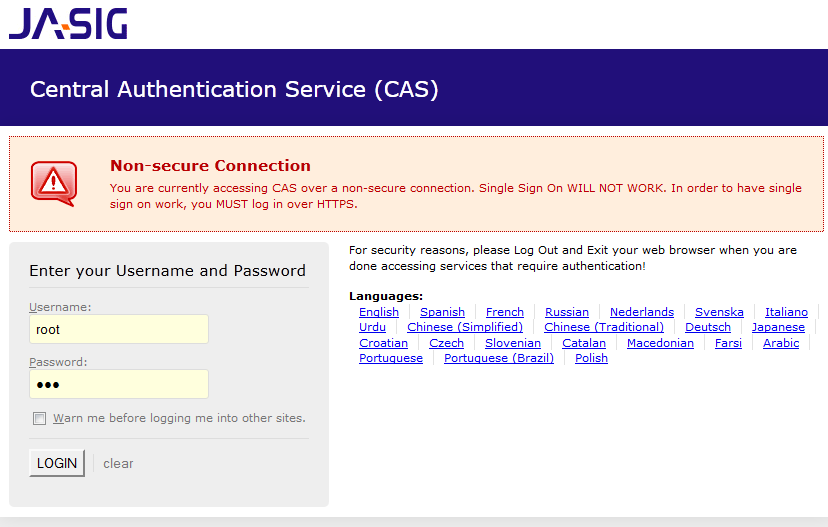
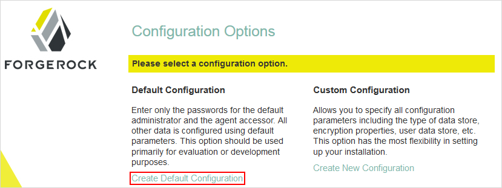
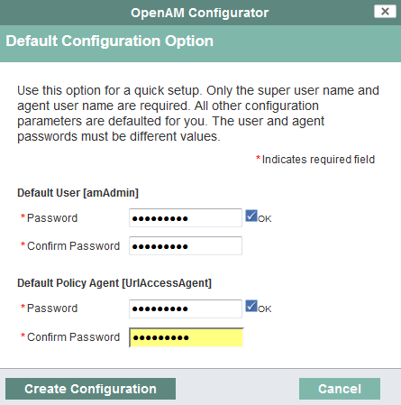
.. |image3| image:: images/SSO/OPENAM/openam_authen_module_class.png
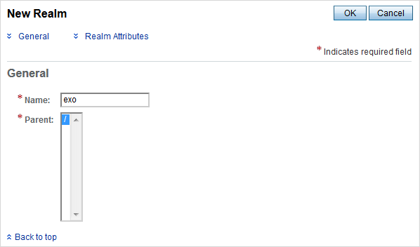
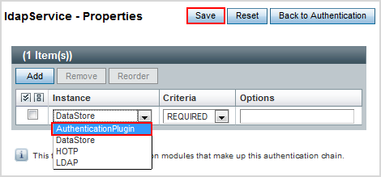
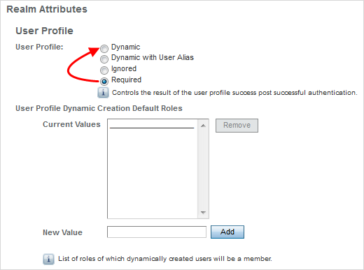
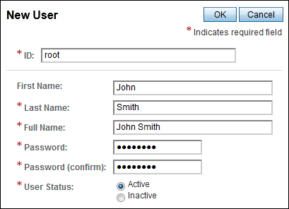
.. |image8| image:: images/SSO/SPNEGO/windows_authentication_process.png
.. |image9| image:: images/common/1.png
.. |image10| image:: images/common/2.png
.. |image11| image:: images/common/3.png
.. |image12| image:: images/common/4.png
.. |image13| image:: images/common/5.png
.. |image14| image:: images/common/6.png
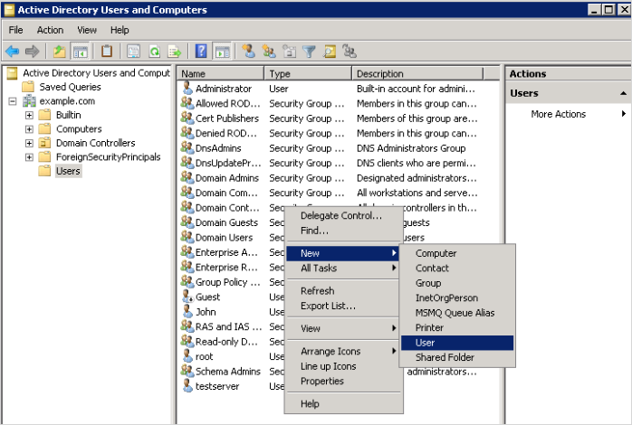
.. |image16| image:: images/SSO/SPNEGO/user_information.png
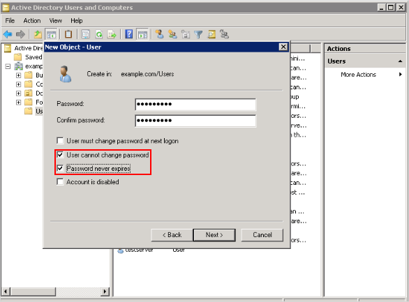
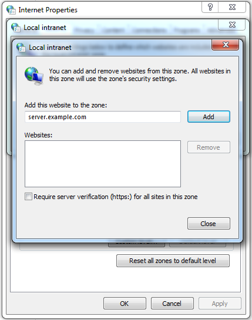
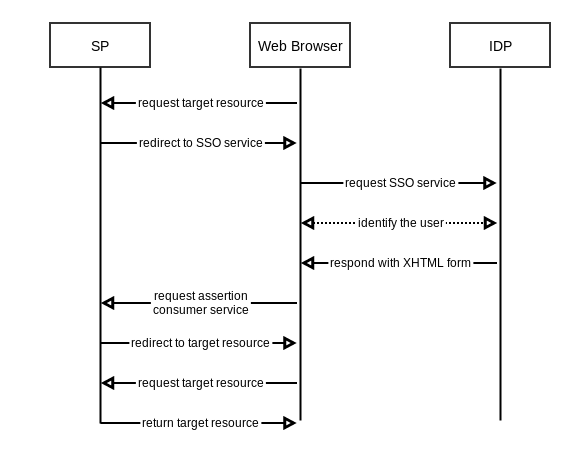
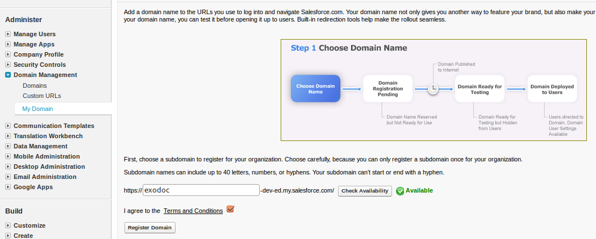
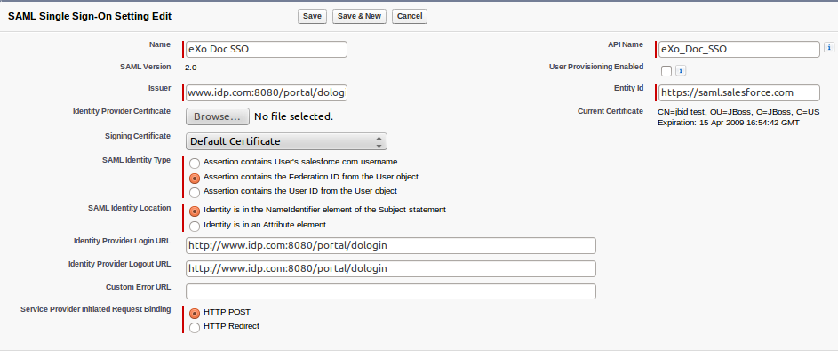
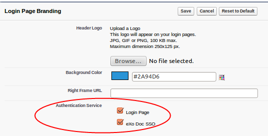
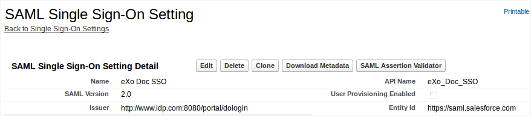
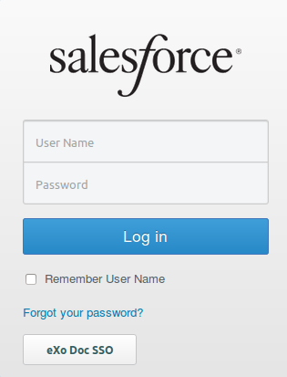
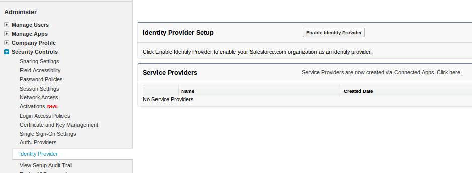
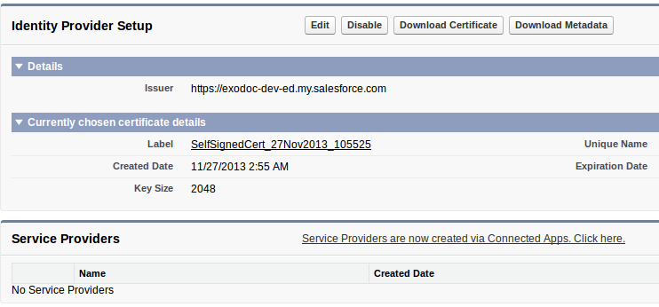
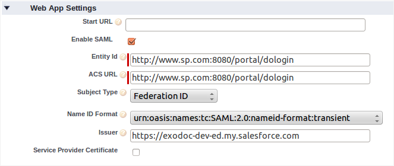
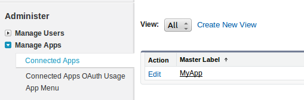
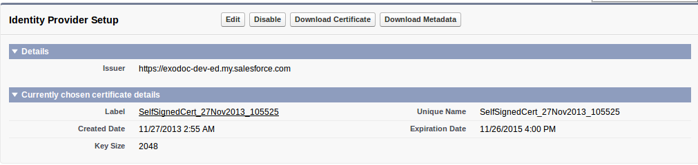
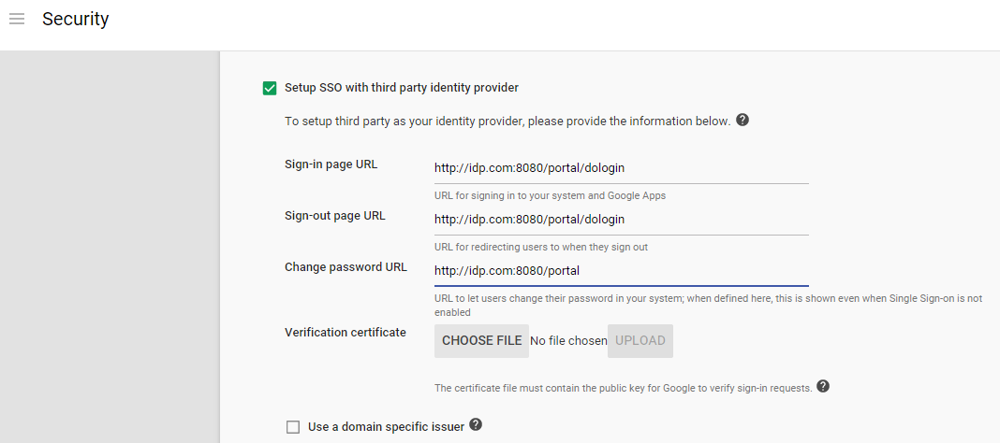

