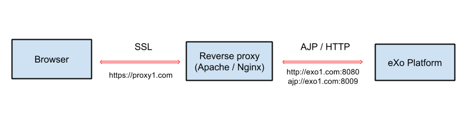
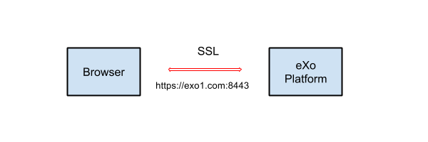

.. _Security:

#########
Security
#########

    This chapter introduces you to the security configuration in
    eXo Platform:

    -  :ref:`JAAS Realm configuration <Security.ChangeJAASReal>`
       Instructions on how to configure JAAS Realm.

    -  :ref:`Gadget proxy configuration <Security.GadgetProxyConfig>`
       How to configure the ProxyFilterService, and how the proxy
       service works.

    -  :ref:`Enabling HTTPS <Security.HTTPSConf>`
       To enable security access, you can either run eXo Platform itself
       in HTTPS, or more commonly, use a reverse proxy like Apache.

    -  :ref:`Password encryption key of RememberMe <Security.KeyRemembermeToken>`
       Information about the file location and steps to update the
       "Remember My Login" password encryption key.

    -  :ref:`XSS protection <Security.XSSProtection>`
       To activate XSS protection mechanisms.

    -  :ref:`Securing the MongoDB Database <Security.MongoDBSecure>`
       How to secure eXo chat database.

    -  :ref:`Rest Api exposure <Security.APIExposure>`
       List of REST API exposed by eXo Platform.

.. _Security.ChangeJAASReal:

========================
JAAS Realm configuration
========================

eXo Platform relies on JAAS for propagating the user identity and roles to
the different applications deployed on the server. The JAAS realm is
used by all eXo Platform applications and even propagated to the JCR for
`Access Control <../../reference/html/JCR.AccessControl.html>`__.
Therefore, if you need to change the JAAS configuration, consider that
your change impacts a lot and it may require you to unpackage and modify
some ``.war`` files.

This section explains:

-  :ref:`What is JAAS Realm? <Security.ChangeJAASReal.WhatIsJAASRealm>`

-  :ref:`Declaring JAAS Realm in eXo Platform <Security.ChangeJAASReal.DeclaringJAASRealm>`

-  :ref:`List of applications using Realm <Security.ChangeJAASReal.ListOfApplicationsUsingRealm>`

.. _Security.ChangeJAASReal.WhatIsJAASRealm:

What is JAAS Realm?
~~~~~~~~~~~~~~~~~~~~

The JAAS configuration requires a `login.config file <https://docs.oracle.com/javase/1.5.0/docs/guide/security/jaas/tutorials/LoginConfigFile.html>`__. 
This file contains one (or more) entry which is called a "Realm". Each 
entry declares a Realm name and at least one login module. Each login 
module consists of a Java class and some parameters which are specified 
by the class.

Below is the default Realm in the Tomcat bundle. In JBoss, it looks
different but basically, the explanation is right for both.

::

    gatein-domain {
      org.gatein.sso.integration.SSODelegateLoginModule required
        enabled="#{gatein.sso.login.module.enabled}"
        delegateClassName="#{gatein.sso.login.module.class}"
        portalContainerName=portal
        realmName=gatein-domain
        password-stacking=useFirstPass;
      org.exoplatform.services.security.j2ee.TomcatLoginModule required
        portalContainerName=portal
        realmName=gatein-domain;
    };

In which:

-  ``gatein-domain`` is the **Realm name** which will be refered by
   applications. If you change this default name, you need to
   re-configure all the applications that use the Realm (listed later).

-  Two required **login modules** are:
   *org.gatein.sso.integration.SSODelegateLoginModule* and
   *org.exoplatform.services.security.j2ee.TomcatLoginModule*. The
   first, if authentication succeeds, will create an *Identity* object
   and save it into a shared state map, then the object can be used by
   the second.

   These are some login modules available in eXo Platform. Refer to 
   :ref:`Existing login modules <Security.ChangeJAASReal>` to understand 
   how they match the login scenarios.

.. _Security.ChangeJAASReal.DeclaringJAASRealm:

Declaring JAAS Realm in eXo Platform
~~~~~~~~~~~~~~~~~~~~~~~~~~~~~~~~~~~~~~

**In the Tomcat bundle**

-  The default Realm is declared in the
   ``$PLATFORM_TOMCAT_HOME/conf/jaas.conf`` file. Its content is exactly
   the above example.

-  A "security domain" property in
   ``$PLATFORM_TOMCAT_HOME/gatein/conf/exo.properties`` (about this
   file, see :ref:`Configuration overview <Configuration.ConfigurationOverview>`)
   needs to be set equal to the Realm name:

   ::

       exo.security.domain=gatein-domain

**In the JBoss package**

-  The default Realm is declared in the
   ``$PLATFORM_JBOSS_HOME/standalone/configuration/standalone-exo.xml``
   file, at the following lines:

   .. code:: xml

       <security-domain name="gatein-domain" cache-type="default">
           <authentication>
               <!--
               <login-module code="org.gatein.sso.integration.SSODelegateLoginModule" flag="required">
                   <module-option name="enabled" value="${gatein.sso.login.module.enabled}"/>
                   <module-option name="delegateClassName" value="${gatein.sso.login.module.class}"/>
                   <module-option name="portalContainerName" value="portal"/>
                   <module-option name="realmName" value="gatein-domain"/>
                   <module-option name="password-stacking" value="useFirstPass"/>
               </login-module>
               -->
               <login-module code="org.exoplatform.services.security.j2ee.JBossAS7LoginModule" flag="required">
                   <module-option name="portalContainerName" value="portal"/>
                   <module-option name="realmName" value="gatein-domain"/>
               </login-module>
           </authentication>
       </security-domain>

-  A "security domain" property in
   ``$PLATFORM_JBOSS_HOME/standalone/configuration/gatein/exo.properties``
   (about this file, see :ref:`Configuration overview <Configuration.ConfigurationOverview>`)
   needs to be set equal to the Realm name:

   ::

       exo.security.domain=gatein-domain

.. _Security.ChangeJAASReal.ListOfApplicationsUsingRealm:

List of applications using Realm
~~~~~~~~~~~~~~~~~~~~~~~~~~~~~~~~~

If an application (.war) uses the Realm for authentication and
authorization, it will refer to the Realm name with either of the
following lines.

-  In ``WEB-INF/jboss-web.xml``:

   .. code:: xml

       <security-domain>java:/jaas/gatein-domain</security-domain>

-  In ``WEB-INF/web.xml``:

   .. code:: xml

       <realm-name>gatein-domain</realm-name>

-  In ``META-INF/context.xml``:

   .. code:: xml

       appName='gatein-domain'

As mentioned above, if you change "``gatein-domain``\ ", you need to
re-configure all the applications that use the Realm to refer to the new
Realm. Here is the list of webapps and the files you need to
re-configure:

**In the Tomcat bundle:**

-  ``portal.war``: ``/WEB-INF/jboss-web.xml``, ``/WEB-INF/web.xml``,
   ``/META-INF/context.xml``.

-  ``rest.war``: ``/WEB-INF/jboss-web.xml``, ``/WEB-INF/web.xml``.

-  ``ecm-wcm-extension.war``: ``/WEB-INF/jboss-web.xml``.

-  ``calendar-extension.war``: ``/WEB-INF/jboss-web.xml``.

-  ``forum-extension.war``: ``/WEB-INF/jboss-web.xml``.

-  ``wiki-extension.war``: ``/WEB-INF/jboss-web.xml``.

-  ``ecm-wcm-core.war``: ``/WEB-INF/jboss-web.xml``.

.. note:: The ``.war`` files are located under the ``$PLATFORM_TOMCAT_HOME/webapps`` folder.

**In the JBoss package:**

-  ``exo.portal.web.portal.war``: ``/WEB-INF/jboss-web.xml``,
   ``/WEB-INF/web.xml``, ``/META-INF/context.xml``.

-  ``exo.portal.web.rest.war``: ``/WEB-INF/jboss-web.xml``,
   ``/WEB-INF/web.xml``.

-  ``calendar-extension-webapp.war``: ``/WEB-INF/jboss-web.xml``.

-  ``forum-extension-webapp.war``: ``/WEB-INF/jboss-web.xml``.

-  ``wiki-extension-webapp.war``: ``/WEB-INF/jboss-web.xml``.

-  ``ecms-core-webapp.war``: ``/WEB-INF/jboss-web.xml``.

-  ``ecms-packaging-wcm-webapp.war``: ``/WEB-INF/jboss-web.xml``.

.. note:: The ``.war`` files are located under the ``$PLATFORM_JBOSS_HOME/standalone/deployments/platform.ear`` folder.

.. _Security.GadgetProxyConfig:

==========================
Gadget proxy configuration
==========================

In eXo Platform, you could allow gadgets to load remote resources. 
However, this could be a potential security risk, as it will make the 
Gadget deployed as an open web proxy. So, you can set up the anonymous 
proxy to accept or deny certain hosts by configuring the 
*ProxyFilterService*.

.. _ProxyFilterServiceConfig:

Configuring the ProxyFilterService
~~~~~~~~~~~~~~~~~~~~~~~~~~~~~~~~~~~~

By default, the proxy denies any host except the domain on which the
gadget server is installed.

To specify domains that you want to allow or deny, modify the file:

-  ``$PLATFORM_TOMCAT_HOME/webapps/portal.war/WEB-INF/conf/common/common-configuration.xml``
   (in Tomcat).

-  ``$PLATFORM_JBOSS_HOME/standalone/deployments/platform.ear/exo.portal.web.portal.war/WEB-INF/conf/common/common-configuration.xml``
   (in JBoss).

The default configuration is:

.. code:: xml

    <component>
        <key>org.exoplatform.web.security.proxy.ProxyFilterService</key>
        <type>org.exoplatform.web.security.proxy.ProxyFilterService</type>
        <init-params>
            <values-param>
            <!-- The white list -->
                <name>white-list</name>
                <!-- We accept anything not black listed -->
                <value>*</value>
            </values-param>
            <values-param>
                <name>black-list</name>
                <value>*.evil.org</value>
            </values-param>
        </init-params>
    </component>

.. _HowItWorks:

How does it work?
~~~~~~~~~~~~~~~~~~

-  Any domain name in black list is denied.

-  Any domain name NOT in white list is denied.

-  Only domain names in white list and NOT in black list are allowed.

Multiple values can be added (by adding more **value** tags) and
wildcards can be used, as in the following example:

.. code:: xml

    <component>
        <key>org.exoplatform.web.security.proxy.ProxyFilterService</key>
        <type>org.exoplatform.web.security.proxy.ProxyFilterService</type>
        <init-params>
            <values-param>
                <name>white-list</name>
                <value>*.example.com</value>
                <value>www.example.net</value>
            </values-param>

            <values-param>
                <name>black-list</name>
                <value>evil.example.com</value>
            </values-param>
        </init-params>
    </component>

.. _Security.HTTPSConf:

===============
Enabling HTTPS
===============

In order to enable HTTPS, you can either:

-  :ref:`Use a reverse proxy <Security.HTTPSConf.Proxy>`,
   like Apache HTTPd or Nginx, to set up an HTTPS virtual host that runs
   in front of eXo Platform. Or:

-  :ref:`Run eXo Platform itself in HTTPS <Security.HTTPSConf.eXo>`.

.. _Security.HTTPSConf.Proxy:

Using a reverse proxy for HTTPS in front of eXo Platform
~~~~~~~~~~~~~~~~~~~~~~~~~~~~~~~~~~~~~~~~~~~~~~~~~~~~~~~~~

Apache or Nginx can be used as a reverse proxy in front of eXo Platform. 
It catches https requests from the browser and proxies the requests to
eXo Platform via either AJP or HTTP protocol. The following diagram 
depicts the case described in this section:

|image0|

In this case, a user accesses the site via https, for example
*https://proxy1.com*, all his requests and all reponses to him are
encrypted by the proxy.

.. note:: We are assuming you have a standard ssl certificate issued by 
		  an official certification authority.
		  The examples allow you to have a basic installation with ssl
		  enabled. You should fine tune your installation before opening 
		  it on the web. Mozilla provide a `great site <https://mozilla.github.io/server-side-tls/ssl-config-generator/>`__
		  to help you to find a configuration adapted to your needs.

.. _ApacheConfiguration:

Configuring Apache
-------------------

Before you start, note that details of Apache setup is not described
here, and it depends on Apache version and your OS, so consult `Apache documentation <http://httpd.apache.org/docs/>`__ 
if you need.

**Required modules**

You need mod\_ssl, mod\_proxy. They are all standard Apache 2 modules,
so no installation is required. You just need to enable it with the
following command:

::

    sudo a2enmod ssl proxy proxy_http

**Configuring a virtual host for SSL port**

Add this to site configuration (you should override the default ssl site
``/etc/apache2/sites-enabled/default-ssl.conf``):

::

    <IfModule mod_ssl.c>
        <VirtualHost *:443>
            ServerName proxy1.com
            ProxyPass / http://exo1.com:8080/
            ProxyPassReverse / http://exo1.com:8080/
            ProxyRequests Off
            ProxyPreserveHost Off

            SSLEngine On
            SSLCertificateFile /path/to/file/mycert.pem
            SSLCertificateKeyFile /path/to/file/mykey.pem
        </VirtualHost>
    </IfModule>
    
.. _NginxConfiguration:    

Configuring Nginx
------------------

Instruction for installing Nginx can be found
`here <http://wiki.nginx.org/Install>`__. In Debian/Ubuntu you can
install Nginx with the following command: ``apt-get install nginx``.

Configure the server *proxy1.com* at port *443* as the following (you
can put the configuration in a file like
``/etc/nginx/sites-enabled/proxy1.com``):

::

    server {
        listen 443;
        server_name proxy1.com;
        ssl on;
        ssl_certificate /path/to/file/mycert.pem;
        ssl_certificate_key /path/to/file/mykey.pem;

        location / {
            proxy_pass http://exo1.com:8080;
        }
    }

The configuration here is a simple one and it works. For an advanced
sample, you may read `this blog post <http://blog.exoplatform.com/en/2014/04/17/apache-2-nginx-highly-secure-pfs-ssl-encrypting-reverse-proxy-exo-platform-4-0-web-application>`__.

.. _HTTPConnectorConfiguration:

Configuring HTTP connector
---------------------------

In both eXo Platform Tomcat and JBoss, there is a default HTTP (8080)
connector.

In any case, you should configure the connector so that eXo Platform is aware
of the proxy in front of it.

-  **In Tomcat**

It is configured in ``$PLATFORM_TOMCAT_HOME/conf/server.xml``. You will
add proxy parameters then it will be:

.. code:: xml

    <Connector address="0.0.0.0" port="8080" protocol="org.apache.coyote.http11.Http11NioProtocol"
      enableLookups="false" redirectPort="8443"
      connectionTimeout="20000" disableUploadTimeout="true"
      URIEncoding="UTF-8"
      compression="off" compressionMinSize="2048"
      noCompressionUserAgents=".*MSIE 6.*" compressableMimeType="text/html,text/xml,text/plain,text/css,text/javascript"
      proxyName="proxy1.com" proxyPort="443" scheme="https" />

-  **In JBoss**

It is configured in
``$PLATFORM_JBOSS_HOME/standalone/configuration/standalone-exo.xml`` (or
``standalone-exo-cluster.xml`` in cluster mode). You need to modify the
subsystem *urn:jboss:domain:web:1.5* like the following:

.. code:: xml

    <subsystem xmlns="urn:jboss:domain:web:1.5" default-virtual-server="default-host" native="false">
        <connector name="http" protocol="HTTP/1.1" socket-binding="http" scheme="https"  proxy-name="proxy1.com" proxy-port="443"/>
        ...
    </subsystem>

The socket-binding ports are configured already, find these lines if you
want to check:

.. code:: xml

    <socket-binding name="http" port="8080"/>

After restarting the proxy and eXo Platform, you can test
*https://proxy1.com*. If you are testing with dummy server names, make
sure you created the hosts proxy1.com and exo1.com.

.. _Security.HTTPSConf.eXo:

Running eXo Platform itself in HTTPS
~~~~~~~~~~~~~~~~~~~~~~~~~~~~~~~~~~~~~~

In the previous section you configure a reverse proxy in front of
eXo Platform, and it is the proxy which encrypts the requests and responses.
Alternatively you can configure eXo Platform to allow https access directly,
so no proxy between browsers and eXo Platform. See the following diagram.

|image1|

.. _GenerateServerKey:

Generating a server key
-------------------------

Your server, exo1.com in the diagram, needs a server key to identify
itself in the SSL handshake. If you do not have the server key, you can
generate one using Java keytool (if you are using Windows, replace
parentheses with quotation marks):

::

	keytool -genkey -keyalg RSA -keysize 2048 -keystore serverkey.jks -alias exo1.com -storepass 123456 -keypass 123456 -dname 'O=MYORG,OU=MYUNIT,L=MYCITY,ST=MYSTATE,C=MY,CN=exo1.com'

.. note:: As of Java 8, you can use the option *-ext san=ip:<IP\_ADDRESS>* to specify an IP address that is acceptable in your certificate.

Now you have the keystore file ``serverkey.jks`` with the password
*123456* that you will use to configure eXo Platform Tomcat/JBoss later.

.. _ImportCertificate:

Importing your SSL certificate into Java truststore
-----------------------------------------------------

You need to add the certificate into Java **truststore**. It is
necessary to make gadgets work.

1. Export your certificate from your server key:

   ::

	   keytool -export -keystore serverkey.jks -alias exo1.com -file exo1.crt

2. Import the certificate into Java truststore:
   
   ::

	   keytool -import -keystore $JAVA_HOME/jre/lib/security/cacerts -file exo1.crt -alias exo1.com
	   
.. _ConfiguringPlatformJBoss:	   

Configuring Platform JBoss
----------------------------

Edit the
``$PLATFORM_JBOSS_HOME/standalone/configuration/standalone-exo.xml``
file by adding **"https connector"** to the web subsystem configuration
(change values of **certificate-key-file** and **password** to your
value):

.. code:: xml

    <subsystem xmlns="urn:jboss:domain:web:1.5" default-virtual-server="default-host" native="false">
        ...
        <connector name="https" protocol="HTTP/1.1" socket-binding="https" scheme="https" secure="true">
            <ssl name="https" key-alias="exo1.com" password="123456" certificate-key-file="/path/to/file/serverkey.jks"/>
        </connector>
        ...
    </subsystem>

After starting eXo Platform, you can connect to
*https://exo1.com:8443/portal*. If you are testing with dummy server
names, make sure you created the host exo1.com.

.. _ConfiguringPlatformTomcat:

Configuring Platform Tomcat
----------------------------

1. Edit the ``$PLATFORM_TOMCAT_HOME/conf/server.xml`` file by commenting
   the following lines:

   .. code:: xml

		<Connector address="0.0.0.0" port="8080" protocol="org.apache.coyote.http11.Http11NioProtocol"
		enableLookups="false" redirectPort="8443"
		connectionTimeout="20000" disableUploadTimeout="true"
		URIEncoding="UTF-8"
		compression="off" compressionMinSize="2048"
		noCompressionUserAgents=".*MSIE 6.*" compressableMimeType="text/html,text/xml,text/plain,text/css,text/javascript" />

2. Uncomment the following lines and edit with your ``keystoreFile`` and
   ``keystorePass`` values:

   .. code:: xml

		<Connector port="8443" protocol="org.apache.coyote.http11.Http11Protocol" SSLEnabled="true"
		maxThreads="150" scheme="https" secure="true"
		clientAuth="false" sslProtocol="TLS"
		keystoreFile="/path/to/file/serverkey.jks"
		keystorePass="123456"/>

After starting eXo Platform, you can connect to
*https://exo1.com:8443/portal*. If you are testing with dummy server
names, make sure you created the host exo1.com.

.. _Security.KeyRemembermeToken:

======================================
Password encryption key of RememberMe
======================================

eXo Platform supports the "Remember My Login" feature. This guideline
explains how the feature works, and how to update the password
encryption key in server side for security purpose.

.. _PasswordEncryption.HowItWorks:

How the feature works?
~~~~~~~~~~~~~~~~~~~~~~~~

If users select "Remember My Login" when they log in, their login
information will be saved in both client and server sides:

-  A token is saved in the server side. The user password is encrypted
   and saved along with the token.

-  The token ID is sent back to the browser and saved in the
   "rememberme" cookie.

When the users visit the website for next time from the same browser on
the same machine, they do not need to type their username and password.
The browser sends the cookies, and the server validates it using the
token. By that way, the login step is automatically completed.

.. _SymmetricEncryptionPasswords:

Symmetric encryption of passwords
~~~~~~~~~~~~~~~~~~~~~~~~~~~~~~~~~~~

The user password is encrypted and stored along with the token.

The password encryption is built against JCA (Java Cryptography
Architecture) and by default uses the
`AES <http://en.wikipedia.org/wiki/Advanced_Encryption_Standard>`__
algorithm. If you do not make your own configuration, a keystore is
generated with defaulted attributes (such as file name, keypass,
keysize). Thus, the feature works without any effort to configure
anything. However, eXo Platform allows you to configure and use your own
keystore to conform to your security policy.

.. _CustomizePassword:

How to customize the password
~~~~~~~~~~~~~~~~~~~~~~~~~~~~~~

As you can see, the customization involves properties in
``exo.properties``, ``jca-symmetric-codec.properties`` and a keystore.
The goal of customization is to use your own keystore instead of the
default one.

1. Generate your own keystore file using keytool:

   ::
		keytool -genseckey -alias "customAlias" -keypass "customKeyPass" -keyalg "customAlgo" -keystore "customStore" -storepass "customStorePass" -storetype "customStoreType"

The file name will be the parameter *keystore* ("customStore" in the
example). The valid value of algorithms and other parameters can be
found
`here <http://docs.oracle.com/javase/6/docs/technotes/guides/security/StandardNames.html#SecretKeyFactor>`__.

Then, place the generated file under ``gatein/conf/codec`` (in Tomcat)
or ``standalone/configuration/gatein/codec`` (in JBoss).

2. Update the ``jca-symmetric-codec.properties`` file with the 
   parameters used in your keytool command:

   ::

		gatein.codec.jca.symmetric.alias=customAlias
		gatein.codec.jca.symmetric.keypass=customKeyPass
		gatein.codec.jca.symmetric.keyalg=customAlgo
		gatein.codec.jca.symmetric.keystore=customStore
		gatein.codec.jca.symmetric.storepass=customStorePass
		gatein.codec.jca.symmetric.storetype=customStoreType

Again, in case of eXo Platform package, you need to create the
``jca-symmetric-codec.properties`` file by yourself. You also need to
put these two properties in ``exo.properties``.

.. _UpdatePasswordEncryptionKey:

Updating password encryption key
~~~~~~~~~~~~~~~~~~~~~~~~~~~~~~~~~

The password encryption uses a keystore file. By default, the file is:

-  ``$PLATFORM_TOMCAT_HOME/gatein/conf/codec/codeckey.txt`` (in Tomcat).

-  ``$PLATFORM_JBOSS_HOME/standalone/configuration/gatein/codec/codeckey.txt``
   (in JBoss).

To update the password encryption key, just remove the file, then
restart the server. The keystore file will be re-created at the startup
time.

.. note:: Updating the password encryption key causes the invalidation of existing tokens, so the users must re-login.

.. _Security.XSSProtection:

==============
XSS Protection
==============

Even if the XSS protection is handled in the PRODUCT development, some
protections can be added on the server side to protect against external
threats. They are essentially based on HTTP headers added to the
responses to ask the modern browsers to avoid such attacks.

Additional configuration options can be found on the
`Content-security-Policy header definition <https://developer.mozilla.org/en-US/docs/Web/HTTP/Headers/Content-Security-Policy>`__.

.. _AddXSSProtectionHeadersApache:

Add XSS protection headers on Apache
~~~~~~~~~~~~~~~~~~~~~~~~~~~~~~~~~~~~~~

To manipulate the response headers, the Apache module
`mod\_headers <https://httpd.apache.org/docs/2.4/mod/mod_headers.html>`__
must be activated and the following lines added on your configuration :

::

    <VirtualHost *:80>
            ...
            # XSS Protection
            Header always append X-Frame-Options SAMEORIGIN
            Header always append X-XSS-Protection 1
            Header always append Content-Security-Policy "frame-ancestors 'self'"
            ...
            </VirtualHost>

.. _AddXSSProtectionHeadersNginx

Add XSS protection headers on Nginx
~~~~~~~~~~~~~~~~~~~~~~~~~~~~~~~~~~~~

Add the following line in the ``http`` or ``server`` part of your Nginx
configuration :

::

            ...
            # XSS Protection
            add_header X-Frame-Options SAMEORIGIN;
            add_header X-XSS-Protection 1;
            add_header Content-Security-Policy "frame-ancestors 'self'"
            ...

.. _Security.MongoDBSecure:

===============
Secured MongoDB
===============

For a quick setup, the add-on by default uses a local and
none-authorization connection. However, in production it is likely you
will secure your MongoDB, so authorization is required. Below are steps
to do this.

.. note:: Read `MongoDB documentation <http://docs.mongodb.org>`__ for MongoDB security. This setup procedure is applied for `MongoDB 3.2 <https://docs.mongodb.com/v3.2/>`__.

1. Start MongoDB and connect to the shell to create a database named
   *admin*. Add a user with role *userAdminAnyDatabase*.

   ::

		$ mongo
		>use admin
		>db.createUser({user: "admin", pwd: "admin", roles: [{role: "userAdminAnyDatabase", db: "admin"}]})
		>exit

2. Edit MongoDB configuration to turn on authentication, then restart 
   the server.

   ::

		# mongodb.conf
		# Your MongoDB host.
		bind_ip = 192.168.1.81

		# The default MongoDB port
		port = 27017

		# Turn on authentication
		auth=true

3. Create a user having *readWrite* role in the database *chat* (you can
   name the database as your desire).

   ::

		$ mongo -port 27017 -host 192.168.1.81 -u admin -p admin -authenticationDatabase admin
		>use chat
		>db.createUser({user: "exo", pwd: "exo", roles: [{role: "readWrite", db: "chat"}]})
		>exit

4. Verify the authentication/authorization of the new user:

   ::

		$ mongo -port 27017 -host 192.168.1.81 -u exo -p exo -authenticationDatabase chat
		>use chat
		>db.placeholder.insert({description: "test"})
		>db.placeholder.find()

5. Create a :ref:`configuration file <Configuration.ChatConfiguration>` 
   containing these below parameters.

   ::

		dbName=chat
		dbServerHost=192.168.1.81
		dbServerPort=27017
		dbAuthentication=true
		dbUser=exo
		dbPassword=exo

.. note:: The parameters above correspond with the values used during creating authorization for MongoDB.

.. _Security.APIExposure:

=================
Rest Api exposure
=================

eXo Platform exposes a list of Rest API methods. They are used internally by
the deployed components but can also be used by your users.

Depending on your use cases, it could be (highly) recommanded to block
the public access to some of them.

-  ``/rest/loginhistory/loginhistory/AllUsers`` : to avoid information
   disclosure and for performance issue.

-  ``/rest/private/loginhistory/loginhistory/AllUsers/*`` : to avoid
   information disclosure and for performance issue.

-  ``/rest/jcr/repository/collaboration/Trash`` : to avoid information
   disclosure.

-  ``/rest/`` : Avoid rest services discovery.

-  ``/portal/rest`` : Avoid rest services discovery.

The following configuraton examples will allow you to block the
previously listed Rest URLs with Apache or Nginx.

.. _WithApache:

Block sensitive Rest urls with Apache
~~~~~~~~~~~~~~~~~~~~~~~~~~~~~~~~~~~~~~~

::

    ...

          # Block login history for performance and security reasons
          RewriteRule             "/rest/loginhistory/loginhistory/AllUsers"            - [L,NC,R=403]
          RewriteRule             "/rest/private/loginhistory/loginhistory/AllUsers/*"  - [L,NC,R=403]

          # Block access to trash folder
          RewriteRule             "/rest/jcr/repository/collaboration/Trash"            - [L,NC,R=403]

          # Don't expose REST APIs listing 
          RewriteRule             "^/rest/?$"         -                   [NC,F,L]
          RewriteRule             "^/portal/rest/?$"  -                   [NC,F,L]
              ...

.. _WithNginx:

Block sensitive Rest urls with Nginx
~~~~~~~~~~~~~~~~~~~~~~~~~~~~~~~~~~~~~

You can create redirection rules in several ways with nginx, this is one
of the possibles :

::

    ...

          # Block login history for performance and security reasons
          location /rest/loginhistory/loginhistory/AllUsers { return 403; }
          location /rest/private/loginhistory/loginhistory/AllUsers { return 403; }

          # Block access to trash folder
          location /rest/jcr/repository/collaboration/Trash { return 403; }

          # Don't expose REST APIs listing 
          location ~ ^/rest/?$ { return 403; }
          location ~ ^/portal/rest/?$ { return 403; }

            ...

