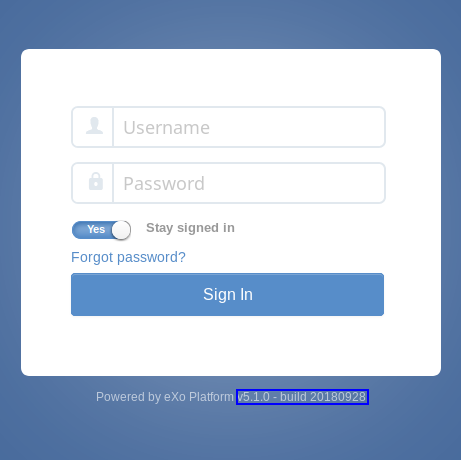

.. _Upgrade:

########
Upgrade
########

    eXo Platform aims at providing a transparent upgrade experience so that
    the upgrade to a newer version is seamless for an administrator.

    As eXo Platform makes changes between versions, it is sometimes required
    to run some routines that will alter data. For that purpose, eXo Platform
    provides a service dedicated to it, called the **Upgrade Service**.
    This generic framework can detect a version change and identify
    which upgrade routines to be executed.

    Since the framework leverages the eXo plugins mechanism, eXo Platform
    refers to these routines as **upgrade plugins**. At startup, eXo Platform
    will load and execute the upgrade plugins identified by the
    **Upgrade Service**.

    This chapter outlines requirements before the upgrade and helps you
    get familiar with the upgrade process between versions of eXo Platform 4
    via the following topics:

    -  :ref:`Breaking Changes <Upgrade.BreakingChanges>`
       Breaking changes you should be aware about before starting the
       upgrade to 5.1 version.

    -  :ref:`Prerequisites <Upgrade.Prerequisites>`
       A list of things you need to do before the upgrade.

    -  :ref:`Upgrade process <Upgrade.Process>`
       How to upgrade from eXo Platform 5.0 to eXo Platform 5.1.

    -  :ref:`Best practices <Upgrade.BestPractices>`
       Some tips that help you monitor the upgrade.

    -  :ref:`Upgrading add-ons <Upgrade.Addons>`
       Common steps for upgrading your add-ons along with the new
       Platform version.

.. _Upgrade.BreakingChanges:

================
Breaking Changes
================

In this section, we will present all the breaking changes you should
know before starting the upgrade to 5.1 version.

**Tomcat upgrade**

eXo Platform 5.1 requires the version 8.5.24+ of Tomcat application
server. It is the supported version starting from 5.1, older
versions are no more compatible.

The major impact coming with the Tomcat upgrade is that the wars are by
default unpacked: ``unpackWARs="true"``.

Setting the parameter ``unpackWARs`` to false will significally slower
the server's startup time so it is highly recommended to keep the
default configuration.

You can find `here <https://tomcat.apache.org/migration-8.html>`__ the
main changes between tomcat 7 and tomcat 8.0 and
`here <https://tomcat.apache.org/migration-85.html>`__ the changes
between 8.0 and 8.5.

**JBoss EAP upgrade**

JBoss EAP 7.1 version is used in eXo Platform 5.1, older versions
are no more compatible.

The main change coming with this version is that JBoss web (based on
Tomcat) was replaced by Undertow which leads to the replacement of valve
by Undertow handlers.

You can find
`here <https://access.redhat.com/documentation/en-us/red_hat_jboss_enterprise_application_platform/7.1/html-single/migration_guide/index>`__,
a full documentation about the upgrade to JBoss EAP 7.1.

**JQuery upgrade**

In eXo Platform 5.1 JQuery version was upgraded to 3.2.1 version
instead of 1.9 in eXo Platform 4.4.

If your platform contains applications or extensions relying on JQuery,
they should be updated with the newer version.

It is possible to keep using the older version but you need to configure
it according to this
:ref:`tuotorial <#PLFDevGuide.Site.Features.JavaScript.UsingCustomjQueryVersion>`.

You can find `here <https://jquery.com/upgrade-guide/3.0/>`__ a complete
guide to upgrade to JQuery 3. You can also use the `plugin
tool <https://jquery.com/upgrade-guide/3.0/#jquery-migrate-plugin>`__.

**Elasticsearch upgrade**

eXo Platform 5.1 requires Elasticsearch 5.6.3 version.

The major impact on eXo Platform is that data should be reindexed as indices
created by Elasticsearch 2.3 are not compatible with those of
Elasticsearch 5.6.

.. tip:: During the first startup of eXo Platform 5.1 version, the
		 reindexing is launched automatically. You can find required
		 configuration while upgrading to 5.1 from previous version
		 in next sections of this upgrade chapter.

You can find
`here <https://www.elastic.co/guide/en/elasticsearch/reference/2.4/breaking-changes.html>`__
the breaking changes in 2.4 version and
`here <https://www.elastic.co/guide/en/elasticsearch/reference/5.6/breaking-changes.html>`__
the breaking changes in 5.6 version.

**Infinispan upgrade**

Infinispan was upgraded to 8.2.6 version in eXo Platform 5.1. No
major impacts are visible on the platform which means that the upgrade
is transparent.

In case you have customized cache configuration templates, you should
update the templates as they are no more compatible with the newer
version.

**Shindig upgrade**

Shindig is the tool allowing you to develop Gadgets and host OpenSocial
applications. eXo Platform 5.1 is using the version 2.5.1.

This newer version does not support OpenSocial 0.8 and below so if you
have gadgets or applications requiring OpenSocial 0.8 version or below,
You should update them.

For example, if you have a gadget containing:

::

    <Require feature="opensocial-0.8"/>

You should update it to:

::

    <Require feature="opensocial-2.5"/>

**Templates changes**

Some Groovy templates have been changed in eXo Platform 5.1, check
out the :ref:`complete list <Upgrade.BreakingChanges.Templates>`. If 
your custom extension overrides some Groovy templates, you must check 
if it has been changed, and update it if it is the case.

.. _Upgrade.BreakingChanges.Templates

Changed Templates
~~~~~~~~~~~~~~~~~~

This is the list of templates changed in eXo Platform 5.1.

**GATEIN-PORTAL**

-  web/eXoResources/src/main/webapp/groovy/portal/webui/page/UIPageBody.gtmpl

-  web/eXoResources/src/main/webapp/groovy/portal/webui/portal/UIPortalComposer.gtmpl

-  web/eXoResources/src/main/webapp/groovy/webui/organization/account/UIUserGroupSelector.gtmpl

-  web/eXoResources/src/main/webapp/groovy/webui/organization/account/UIUserSelector.gtmpl

-  web/portal/src/main/webapp/groovy/portal/webui/workspace/UIPortalApplication.gtmpl

**SOCIAL**

-  extension/notification/src/main/webapp/WEB-INF/intranet-notification/templates/ActivityReplyToCommentPlugin.gtmpl

-  extension/notification/src/main/webapp/WEB-INF/intranet-notification/templates/LikeCommentPlugin.gtmpl

-  extension/notification/src/main/webapp/WEB-INF/notification/templates/ActivityReplyToCommentPlugin.gtmpl

-  extension/notification/src/main/webapp/WEB-INF/notification/templates/LikeCommentPlugin.gtmpl

-  extension/notification/src/main/webapp/WEB-INF/notification/templates/LikePlugin.gtmpl

-  extension/war/src/main/webapp/groovy/social/webui/UIActivitiesContainer.gtmpl

-  extension/war/src/main/webapp/groovy/social/webui/UIApplicationCategorySelector.gtmpl

-  extension/war/src/main/webapp/groovy/social/webui/UIBannerAvatarUploader.gtmpl

-  extension/war/src/main/webapp/groovy/social/webui/UIBannerUploader.gtmpl

-  extension/war/src/main/webapp/groovy/social/webui/activity/UIActivityCommentActions.gtmpl

-  extension/war/src/main/webapp/groovy/social/webui/activity/UIDefaultActivity.gtmpl

-  extension/war/src/main/webapp/groovy/social/webui/activity/UISpaceActivity.gtmpl

-  extension/war/src/main/webapp/groovy/social/webui/activity/UIStatusActivity.gtmpl

-  extension/war/src/main/webapp/groovy/social/webui/activity/UIUserActivitiesForRelationShip.gtmpl

-  extension/war/src/main/webapp/groovy/social/webui/activity/UIUserActivitiesForSpace.gtmpl

-  extension/war/src/main/webapp/groovy/social/webui/activity/UIUserProfileActivity.gtmpl

-  extension/war/src/main/webapp/groovy/social/webui/activity/plugin/UIRelationshipActivity.gtmpl

-  extension/war/src/main/webapp/groovy/social/webui/composer/UIComposer.gtmpl

-  extension/war/src/main/webapp/groovy/social/webui/profile/UIProfile.gtmpl

-  extension/war/src/main/webapp/groovy/social/webui/profile/UIRecentActivity.gtmpl

-  extension/war/src/main/webapp/groovy/social/webui/profile/UIUserActivitiesDisplay.gtmpl

-  extension/war/src/main/webapp/groovy/social/webui/space/UIManageAllSpaces.gtmpl

-  extension/war/src/main/webapp/groovy/social/webui/space/UIManageInvitationSpaces.gtmpl

-  extension/war/src/main/webapp/groovy/social/webui/space/UIManageMySpaces.gtmpl

-  extension/war/src/main/webapp/groovy/social/webui/space/UIManagePendingSpaces.gtmpl

-  extension/war/src/main/webapp/groovy/social/webui/space/UISpaceAccess.gtmpl

-  extension/war/src/main/webapp/groovy/social/webui/space/UISpaceActivitiesDisplay.gtmpl

-  extension/war/src/main/webapp/groovy/social/webui/space/UISpaceInfo.gtmpl

-  extension/war/src/main/webapp/groovy/social/webui/space/UISpaceMenu.gtmpl

-  webapp/juzu-portlet/src/main/java/org/exoplatform/social/portlet/userNotification/templates/index.gtmpl

-  webapp/portlet/src/main/webapp/groovy/social/portlet/UIAllPeoplePortlet.gtmpl

-  webapp/portlet/src/main/webapp/groovy/social/portlet/UIAllSpacesPortlet.gtmpl

-  webapp/portlet/src/main/webapp/groovy/social/portlet/UIConnectionsPortlet.gtmpl

-  webapp/portlet/src/main/webapp/groovy/social/portlet/UIInvitationSpacesPortlet.gtmpl

-  webapp/portlet/src/main/webapp/groovy/social/portlet/UIInvitationsPortlet.gtmpl

-  webapp/portlet/src/main/webapp/groovy/social/portlet/UIMembersPortlet.gtmpl

-  webapp/portlet/src/main/webapp/groovy/social/portlet/UIMySpacesPortlet.gtmpl

-  webapp/portlet/src/main/webapp/groovy/social/portlet/UIPendingSpacesPortlet.gtmpl

-  webapp/portlet/src/main/webapp/groovy/social/portlet/UIPeoplePortlet.gtmpl

-  webapp/portlet/src/main/webapp/groovy/social/portlet/UIRequestsPortlet.gtmpl

-  webapp/portlet/src/main/webapp/groovy/social/portlet/UISpaceAccessPortlet.gtmpl

-  webapp/portlet/src/main/webapp/groovy/social/portlet/UIUserActivityStreamPortlet.gtmpl

-  webapp/portlet/src/main/webapp/groovy/social/portlet/user/UIBasicProfilePortlet.gtmpl

-  webapp/portlet/src/main/webapp/groovy/social/portlet/user/UIExperienceProfilePortlet.gtmpl

-  webapp/portlet/src/main/webapp/groovy/social/portlet/user/UIStatusProfilePortlet.gtmpl

**ECMS**

-  apps/portlet-administration/src/main/webapp/groovy/webui/component/admin/UIECMAdminPortlet.gtmpl

-  apps/portlet-administration/src/main/webapp/groovy/webui/component/admin/drives/UINodeTypeSelector.gtmpl

-  apps/portlet-explorer/src/main/webapp/groovy/webui/component/explorer/UIDocumentFormController.gtmpl

-  apps/portlet-explorer/src/main/webapp/groovy/webui/component/explorer/UIDocumentTabPane.gtmpl

-  apps/portlet-explorer/src/main/webapp/groovy/webui/component/explorer/UIDrivesArea.gtmpl

-  apps/portlet-explorer/src/main/webapp/groovy/webui/component/explorer/UIWorkingArea.gtmpl

-  apps/portlet-explorer/src/main/webapp/groovy/webui/component/explorer/control/UIActionBar.gtmpl

-  apps/portlet-explorer/src/main/webapp/groovy/webui/component/explorer/control/UIAddressBar.gtmpl

-  apps/portlet-explorer/src/main/webapp/groovy/webui/component/explorer/popup/info/UINodeTypeInfo.gtmpl

-  apps/portlet-explorer/src/main/webapp/groovy/webui/component/explorer/sidebar/UITreeExplorer.gtmpl

-  apps/portlet-explorer/src/main/webapp/groovy/webui/component/explorer/versions/UIVersionInfo.gtmpl

-  core/viewer/src/main/resources/resources/templates/HTML5VideoViewer.gtmpl

-  core/viewer/src/main/resources/resources/templates/PDFJSViewer.gtmpl

-  packaging/wcm/webapp/src/main/webapp/WEB-INF/conf/dms-extension/dms/artifacts/views/templates/ecm-explorer/TreeList.gtmpl

-  packaging/wcm/webapp/src/main/webapp/groovy/SingleContentViewer/UIPresentationContainer.gtmpl

-  packaging/wcm/webapp/src/main/webapp/groovy/portal/webui/workspace/UIPortalApplication.gtmpl

**WIKI**

-  wiki-webapp/src/main/webapp/templates/wiki/webui/UIWikiBreadCrumb.gtmpl

-  wiki-webapp/src/main/webapp/templates/wiki/webui/UIWikiDeletePageConfirm.gtmpl

-  wiki-webapp/src/main/webapp/templates/wiki/webui/UIWikiMiddleArea.gtmpl

-  wiki-webapp/src/main/webapp/templates/wiki/webui/UIWikiPageContainer.gtmpl

-  wiki-webapp/src/main/webapp/templates/wiki/webui/UIWikiPageContentArea.gtmpl

-  wiki-webapp/src/main/webapp/templates/wiki/webui/pageinfo/UIPageInfoHierarchy.gtmpl

-  wiki-webapp/src/main/webapp/templates/wiki/webui/pageinfo/UIPageInfoSummary.gtmpl

-  wiki-webapp/src/main/webapp/templates/wiki/webui/popup/UIWikiSettingContainer.gtmpl

-  wiki-webapp/src/main/webapp/templates/wiki/webui/tree/UITreeExplorer.gtmpl

**FORUM**

-  forum/webapp/src/main/webapp/templates/forum/webui/UICategories.gtmpl

-  forum/webapp/src/main/webapp/templates/forum/webui/UICategory.gtmpl

-  forum/webapp/src/main/webapp/templates/forum/webui/UICategoryInfo.gtmpl

-  forum/webapp/src/main/webapp/templates/forum/webui/UIForumModerator.gtmpl

-  forum/webapp/src/main/webapp/templates/forum/webui/UIPostRules.gtmpl

-  forum/webapp/src/main/webapp/templates/forum/webui/UITopicDetail.gtmpl

-  forum/webapp/src/main/webapp/templates/forum/webui/UITopicPoll.gtmpl

**CALENDAR**

-  calendar-component-create/src/main/resources/groovy/webui/create/UICreateEvent.gtmpl

-  calendar-webapp/src/main/webapp/templates/calendar/webui/UICalendarViewContainer.gtmpl

-  calendar-webapp/src/main/webapp/templates/calendar/webui/UICalendarWorkingContainer.gtmpl

-  calendar-webapp/src/main/webapp/templates/calendar/webui/UICalendars.gtmpl

-  calendar-webapp/src/main/webapp/templates/calendar/webui/UIDayView.gtmpl

-  calendar-webapp/src/main/webapp/templates/calendar/webui/UIEventPreview.gtmpl

-  calendar-webapp/src/main/webapp/templates/calendar/webui/UIListContainer.gtmpl

-  calendar-webapp/src/main/webapp/templates/calendar/webui/UIListEvent.gtmpl

-  calendar-webapp/src/main/webapp/templates/calendar/webui/UIListView.gtmpl

-  calendar-webapp/src/main/webapp/templates/calendar/webui/UIMonthView.gtmpl

-  calendar-webapp/src/main/webapp/templates/calendar/webui/UITaskPreview.gtmpl

-  calendar-webapp/src/main/webapp/templates/calendar/webui/UIWeekView.gtmpl

**INTEGRATION**

-  integ-calendar/integ-calendar-social/src/main/resources/groovy/cs/social-integration/plugin/space/CalendarUIActivity.gtmpl

-  integ-ecms/integ-ecms-social/src/main/resources/groovy/ecm/social-integration/UIPreviewCommentArea.gtmpl

-  integ-ecms/integ-ecms-social/src/main/resources/groovy/ecm/social-integration/UISharedContent.gtmpl

-  integ-ecms/integ-ecms-social/src/main/resources/groovy/ecm/social-integration/UISharedFile.gtmpl

-  integ-ecms/integ-ecms-social/src/main/resources/groovy/ecm/social-integration/plugin/link/UILinkActivity.gtmpl

-  integ-ecms/integ-ecms-social/src/main/resources/groovy/ecm/social-integration/plugin/link/UILinkActivityComposer.gtmpl

-  integ-ecms/integ-ecms-social/src/main/resources/groovy/ecm/social-integration/plugin/notification/FileActivity.gtmpl

-  integ-ecms/integ-ecms-social/src/main/resources/groovy/ecm/social-integration/plugin/space/ContentUIActivity.gtmpl

-  integ-ecms/integ-ecms-social/src/main/resources/groovy/ecm/social-integration/plugin/space/FileUIActivity.gtmpl

-  integ-ecms/integ-ecms-social/src/main/resources/groovy/ecm/social-integration/share-document/UIShareDocuments.gtmpl

-  integ-forum/integ-forum-social/src/main/resources/groovy/forum/social-integration/plugin/space/ForumUIActivity.gtmpl

-  integ-forum/integ-forum-social/src/main/resources/groovy/forum/social-integration/plugin/space/PollUIActivity.gtmpl

-  integ-search-portlet/src/main/java/org/exoplatform/commons/quicksearch/templates/index.gtmpl

-  integ-social/integ-social-ecms/src/main/resources/groovy/social/plugin/doc/UIDocActivity.gtmpl

-  integ-social/integ-social-ecms/src/main/resources/groovy/social/plugin/doc/UIDocActivityComposer.gtmpl

-  integ-social/integ-social-ecms/src/main/resources/groovy/social/plugin/doc/UIDocActivityPopup.gtmpl

-  integ-social/integ-social-ecms/src/main/resources/groovy/social/plugin/doc/selector/UIDocumentSelector.gtmpl

-  integ-social/integ-social-ecms/src/main/resources/groovy/social/plugin/doc/selector/UIMultiUploadSelectorInput.gtmpl

-  integ-wiki/integ-wiki-social/src/main/resources/groovy/wiki/social-integration/plugin/space/WikiUIActivity.gtmpl

**PLATFORM**

-  extension/portlets/homepagePortlets/src/main/java/org/exoplatform/platform/portlet/juzu/calendar/templates/calendar.gtmpl

-  extension/portlets/homepagePortlets/src/main/java/org/exoplatform/platform/portlet/juzu/whoisonline/templates/index.gtmpl

-  extension/portlets/homepagePortlets/src/main/java/org/exoplatform/platform/portlet/juzu/whoisonline/templates/users.gtmpl

-  extension/portlets/platformNavigation/src/main/webapp/groovy/platformNavigation/portlet/UIBreadCrumbsNavigationPortlet/UIBreadCrumbsNavigationPortlet.gtmpl

-  extension/portlets/platformNavigation/src/main/webapp/groovy/platformNavigation/portlet/UICompanyNavigationPortlet/UICompanyNavigationPortlet.gtmpl

-  extension/portlets/platformNavigation/src/main/webapp/groovy/platformNavigation/portlet/UICreatePlatformToolBarPortlet/UICreatePlatformToolBarPortlet.gtmpl

-  extension/portlets/platformNavigation/src/main/webapp/groovy/platformNavigation/portlet/UIGroupsNavigationPortlet/UIGroupsNavigationPortlet.gtmpl

-  extension/portlets/platformNavigation/src/main/webapp/groovy/platformNavigation/portlet/UINotificationPopoverToolbarPortlet/UINotificationPopoverToolbarPortlet.gtmpl

-  extension/portlets/platformNavigation/src/main/webapp/groovy/platformNavigation/portlet/UISearchPlatformToolBarPortlet/UISearchPlatformToolBarPortlet.gtmpl

-  extension/portlets/platformNavigation/src/main/webapp/groovy/platformNavigation/portlet/UISpaceNavigationPortlet/UISpaceNavigationPortlet.gtmpl

-  extension/portlets/platformNavigation/src/main/webapp/groovy/platformNavigation/portlet/UIUserNavigationPortlet/UIUserNavigationPortlet.gtmpl

-  extension/portlets/platformNavigation/src/main/webapp/groovy/platformNavigation/portlet/UIUserPlatformToolBarPortlet/UIUserPlatformToolBarPortlet.gtmpl

-  extension/webapp/src/main/webapp/groovy/portal/webui/container/UIHomeLinkContainer.gtmpl

-  extension/webapp/src/main/webapp/groovy/portal/webui/container/UITableColumnContainer.gtmpl

-  extension/webapp/src/main/webapp/groovy/portal/webui/workspace/UIPortalApplication.gtmpl

-  samples/acme-intranet/webapp/src/main/webapp/WEB-INF/conf/office-extension/wcm/nodetype-templates/announcement/views/view1.gtmpl

**ANSWERS**

-  integration/src/main/resources/groovy/forum/social-integration/plugin/space/AnswerUIActivity.gtmpl

**WCM-TEMPLATE-PACK**

-  wai-template/src/main/webapp/WEB-INF/conf/sample-portal/wcm/artifacts/nodetype-templates/siteBreadcrumbWebContent/views/view1.gtmpl

-  wai-template/src/main/webapp/WEB-INF/conf/sample-portal/wcm/artifacts/nodetype-templates/siteNavigationWebContent/views/view1.gtmpl

-  wai-template/src/main/webapp/WEB-INF/conf/sample-portal/wcm/artifacts/nodetype-templates/siteSearchBoxWebContent/views/view1.gtmpl

.. _Upgrade.Prerequisites:

=============
Prerequisites
=============

Before the upgrade, you need to:

-  Back up data, as described in :ref:`Backup and Restore <Backup>`, 
   before upgrading. In case anything turns badly, your data is safe and *
   you can start over.

-  Back up customizations (including configuration, deployed extensions
   and applications) that you plan to reuse in the new version.

-  Download eXo Platform 5.1 version.

-  eXo Platform 5.1 requires :ref:`Elasticsearch 5.6 <Elasticsearch.ES_External>`
   , so you must upgrade your Elasticsearch cluster to this version. 
   Please refer to the `Elasticsearch documentation <https://www.elastic.co/guide/en/elasticsearch/reference/5.6/setup-upgrade.html>`__
   to perform this upgrade.

-  Perform one or more dry-run upgrade(s) to find out potential problems
   and estimate the upgrade time.

.. note:: The dry-run upgrade allows you to:

			-  Detect and handle issues to make sure they will not happen during the real upgrade.
			-  Estimate how long the upgrade will take in your production environment.
			-  Find out if you need to adjust anything to make your upgrade faster and more efficient.

.. tip:: With eXo Platform 5.1 version, Tomcat was upgraded to 8.5.24 version and JBoss EAP to 7.1 version to benefit from their last updates and improvements.
		 You can check changelogs `for tomcat <https://tomcat.apache.org/tomcat-8.5-doc/changelog.html>`__ and `for JBOSS <https://access.redhat.com/documentation/en-us/red_hat_jboss_enterprise_application_platform/7.1/html/7.1.0_release_notes/index>`__.

.. _Upgrade.Process:

===============
Upgrade process
===============

.. note:: When you upgrade to eXo Platform, notice that default password 
		  encryption algorithm has changed so you need to reconfigure it 
		  back to the one that you used before, otherwise old users will 
		  not be able to log in. See details in :ref:`Password Encryption <PasswordEncryption>`.

The upgrade procedure is only guaranteed and tested to be transparent
from the previous maintenance version (x.y.z from x.y.z-1). So, we
recommend to apply upgrade procedures for all versions between your
current one and the target one. In this case it is from 4.4 to
5.1. If you are on 4.4.2 version, you should move into the
4.4.3 then to 4.4.4 and then move to 5.1 version. However, if
you still insist on skipping versions, we strongly advise to read all
upgrade notes of the versions you are skipping to see if your project is
impacted by any previous upgrade procedure.

**Upgrade to a new eXo Platform version**

**For Tomcat and JBoss packages**

1. Stop the old version of eXo Platform, in this case the 5.0 version.

2. Apply your customizations into eXo Platform 5.1.

   -  If you have changed the configuration properties via
      ``$PLATFORM_TOMCAT_HOME/gatein/conf/exo.properties`` (Tomcat) or
      ``$PLATFORM_JBOSS_HOME/standalone/configuration/gatein/exo.properties``
      (JBoss), you can update them to the same file in the new eXo 
      Platform version.

   -  If you use a populated organizational data source (such as LDAP),
      activate the Organization Integration Service so that the data is
      synchronized. See :ref:`Synchronization <LDAP.Synchronization>` 
      for more details.

3. Configure the JCR and IDM databases. Refer to :ref:`Database <Database>`
   for more details.

4. Configure the **EXO\_DATA\_DIR** variable. Refer to :ref:`Data directory configuration <Configuration.DataDirectory>`
   for more details.

5. Go to the new eXo Platform package (``$PLATFORM_TOMCAT_HOME/gatein/conf/`` 
   or ``$PLATFORM_JBOSS_HOME/standalone/configuration/gatein/``), then 
   rename the sample upgrade file regarding the version you want to 
   upgrade known as ``upgrade-sample.properties``) into 
   ``upgrade.properties`` as described in `Release Notes <https://community.exoplatform.com/portal/g/:spaces:platform_4/exo_platform/wiki/group/spaces/platform_4/Release_Notes_-_Platform_5.0>`__.

6. Start the eXo Platform server. The upgrade will be run automatically. 
   The startup is successful when you see a message like **INFO \| Server startup in XXXX ms**.

7. Stop the server.

8. Remove or rename the ``upgrade.properties`` in Step 5. This is to 
   avoid running the upgrade again for next time.

9. Restart the server, then do some tests on the upgraded version. See
   :ref:`Best practices <Upgrade.BestPractices>` for more details.

.. note::-  eXo Platform 5.1 version requires the version 5.6 of
            Elasticsearch, you should `upgrade <https://www.elastic.co/guide/en/elasticsearch/reference/5.6/setup-upgrade.html>`__
            to this version.
		    eXo Platform is shipped with an embedded version of Elasticsearch which **automatically starts** when eXo Platform starts. 
		    You can deactivate it through `Elasticsearch Configuration <Configuration.ElasticSearch>`.
			This embedded Elasticsearch instance is recommended for development and test but not for production.

			For production it is recommended to run a standalone Elasticsearch cluster (please refer to :ref:`Elasticsearch documentation <#PLFAdminGuide.ElasticsearchElasticsearch>`
			for more details). In order to use a standalone Elasticsearch cluster, some properties must be defined in
			:ref:`exo.properties <Configuration.ConfigurationOverview>`. Please refer to :ref:`Elasticsearch Configuration <Configuration.ElasticSearch>`
			for more details.
		 -  Starting from eXo Platform 5.1:
				*  Settings and Notifications data has been moved from JCR to JPA datasources.
				*  ECMS files are indexed in Elasticsearch.
		 -  If you run eXo Platform 5.1 for the first time, the Enterprise skin will be the default skin. If you upgrade your eXo Platform instance from a previous version, your previous skin will still be applied.
			We do not want to force the change to the new Enterprise Skin if you used another skin and it could break skin customizations. 
			You can change it by yourself in :ref:`portal settings <ManagingSites.SelectSkin>`.

.. _Upgrade.BestPractices:

==============
Best practices
==============

Here are good ways you can follow during and after upgrading:

-  Monitor the server console/log file to be aware of the upgrade status
   or any issues during the upgrade. By default, PRODUCT records all
   information in ``$PLATFORM_TOMCAT_HOME/logs/platform.log`` (in
   Tomcat), ``$PLATFORM_JBOSS_HOME/standalone/log/server.log`` (in
   JBoss).

   A successful upgrade typically logs the followings:

   -  The first important message like:

      ::

          | INFO  | Start transparent upgrade framework [o.e.c.upgrade.UpgradeProductService<Catalina-startStop-1>] 

   -  The list of activated plugins: five upgrade plugins exist between
      5.0.2 version to 5.1.

      ::

          | INFO  | Proceed upgrade the plugin (async = false): name = FavoriteActionUpgradePlugin from version 5.0.2 to 5.1.0 [o.e.c.upgrade.UpgradeProductService<Catalina-startStop-1>] 

      ::

          | INFO  | Proceed upgrade the plugin (async = false): name = SpaceMemberAnyMembershipUpgradePlugin from version 5.0.2 to 5.1.0 [o.e.c.upgrade.UpgradeProductService<Catalina-startStop-1>] ]

      ::

          | INFO  | Proceed upgrade the plugin (async = false): name = EnableUserUpgradePlugin from version 5.0.2 to 5.1.0 [o.e.c.upgrade.UpgradeProductService<Catalina-startStop-1>] ]

      ::

          | INFO  | Proceed upgrade the plugin (async = true): name = FileESMigration from version 5.0.2 to 5.1.0 [o.e.c.upgrade.UpgradeProductService<Catalina-startStop-1>]  ]

      ::

          | INFO  | Proceed upgrade the plugin (async = false): name = UpgradeDefaultSkin from version 5.0.2 to 5.1.0 [o.e.c.upgrade.UpgradeProductService<Catalina-startStop-1>] ]

   -  The message informing that the upgrade plugin execution is
      completed:

      ::

          | INFO  | Upgrade of plugin FavoriteActionUpgradePlugin completed. [o.e.c.upgrade.UpgradeProductService<Catalina-startStop-1>] ]

      ::

          | INFO  | Upgrade of plugin SpaceMemberAnyMembershipUpgradePlugin completed. [o.e.c.upgrade.UpgradeProductService<Catalina-startStop-1>]]]

      ::

          | INFO  | Upgrade of plugin EnableUserUpgradePlugin completed. [o.e.c.upgrade.UpgradeProductService<Catalina-startStop-1>] ]]

      ::

          | INFO  | Upgrade of plugin FileESMigration completed. [o.e.c.upgrade.UpgradeProductService<pool-6-thread-1>]]]

      ::

          | INFO  | Upgrade of plugin UpgradeDefaultSkin completed. [o.e.c.upgrade.UpgradeProductService<Catalina-startStop-1>] ]]

   -  Logs related to notifications migration from JCR to JPA:

      -  Notifications data migration (Web and mail notications):

         ::

             | INFO  | === Start migration of Web Notifications data from JCR [o.e.c.m.WebNotificationsMigration<COMMONS-RDBMS-MIGRATION>]  ] 

         ::

             | INFO  | === Start migration of Mail Notifications data from JCR [o.e.c.m.MailNotificationsMigration<COMMONS-RDBMS-MIGRATION>] ] ] 

      -  Notifications data migration end:

         ::

             | INFO  | === Migration of Web Notification data done in 11139 ms [o.e.c.m.WebNotificationsMigration<COMMONS-RDBMS-MIGRATION>] ] 

         ::

             | INFO  | === Migration of Mail Notification data done in 4507 ms [o.e.c.m.MailNotificationsMigration<COMMONS-RDBMS-MIGRATION>]  ] ] 

      -  Notifications JCR data cleaning start:

         ::

             | INFO  | === Start Cleaning Web Notifications data from JCR [o.e.c.m.WebNotificationsMigration<COMMONS-RDBMS-MIGRATION>]  ] ] 

         ::

             | INFO  | === Start cleaning Mail notifications data from JCR [o.e.c.m.MailNotificationsMigration<COMMONS-RDBMS-MIGRATION>]  ] ] 

      -  Notifications JCR data cleaning end:

         ::

             | INFO  | === Web notifications JCR data cleaning due to RDBMS migration done in 590 ms [o.e.c.m.WebNotificationsMigration<COMMONS-RDBMS-MIGRATION>] ] ] 

         ::

             | INFO  | === Mail notifications JCR data cleaning due to RDBMS migration done in 1815 ms [o.e.c.m.MailNotificationsMigration<COMMONS-RDBMS-MIGRATION>] ] ] 

   -  Logs related to settings migration from JCR to JPA:

      -  Settings data migration start:

         ::

             | INFO  | === Start migration of Global Settings data from JCR to RDBMS [o.e.commons.migration.SettingsMigration<Catalina-startStop-1>] ] ] 

         ::

             | INFO  | === Start migration of User Settings data from JCR [o.e.commons.migration.SettingsMigration<Catalina-startStop-1>] ] ] 

      -  Settings data migration end:

         ::

             | INFO  | Global Settings data migrated in 4137 ms [o.e.commons.migration.SettingsMigration<Catalina-startStop-1>]] ] 

         ::

             | INFO  | User Settings data migrated in 4574 ms [o.e.commons.migration.SettingsMigration<Catalina-startStop-1>] ] ] 

      -  Settings JCR data cleaning start:

         ::

             | INFO  | === Start cleaning Global Settings data from JCR [o.e.commons.migration.SettingsMigration<COMMONS-RDBMS-MIGRATION>]  ] ] 

         ::

             | INFO  | === Start cleaning User Settings data from JCR [o.e.commons.migration.SettingsMigration<COMMONS-RDBMS-MIGRATION>] ] ] 

      -  Settings JCR data cleaning end:

         ::

             | INFO  | === Global Settings JCR data cleaning due to RDBMS migration done in 351 ms [o.e.commons.migration.SettingsMigration<COMMONS-RDBMS-MIGRATION>] ] ] 

         ::

             | INFO  | === User Settings JCR data cleaning due to RDBMS migration done in 182 ms [o.e.commons.migration.SettingsMigration<COMMONS-RDBMS-MIGRATION>] ] ] 

   -  The progression of the execution of the upgrade plugin
      **SpaceMemberAnyMembershipUpgradePlugin**:

      -  Membership migration:

         ::

             | INFO  | === Start IDM Membership '*'  to Space Entity migration [o.e.s.c.j.u.SpaceMemberAnyMembershipUpgradePlugin<Catalina-startStop-1>] ] ] 

      -  Consistency check for spaces:

         ::

             | INFO  | === End of consistency check of space members in 412ms. No inconsistency detected. Total scanned spaces count = 1 [o.e.s.c.j.u.SpaceMemberAnyMembershipUpgradePlugin<Catalina-startStop-1>] ] ] 

   -  The progression of the execution of the upgrade plugin
      **FileESMigration**:

      -  Information about the number of files to index:

         ::

             | INFO  | == Files ES migration - Number of files to index : 19 [o.e.services.wcm.search.FileESMigration<pool-6-thread-1>] ] ] 

      -  Start pushing files:

         ::

              | INFO  | == Files ES migration - Starting pushing all files in indexation queue [o.e.services.wcm.search.FileESMigration<pool-6-thread-1>]  ] ] 

      -  End pushing files:

         ::

              | INFO  | == Files ES migration - Push of all files in indexation queue done [o.e.services.wcm.search.FileESMigration<pool-6-thread-1>]   ] ] 

      -  Start JCR reindexation (by repository):

         ::

             | INFO  | == Files ES migration - Reindexation of JCR collaboration workspace done [o.e.services.wcm.search.FileESMigration<HotReindexing-repository-collaboration>]  ] ] 

         ::

             | INFO  | == Files ES migration - Reindexation of JCR system workspace done [o.e.services.wcm.search.FileESMigration<HotReindexing-repository-system>]  ] ] 

      -  End of JCR reindexation (by repository):

         ::

             | INFO  | == Files ES migration - Starting reindexation of JCR collaboration workspace [o.e.services.wcm.search.FileESMigration<pool-6-thread-1>] ] ] 

         ::

             | INFO  | == Files ES migration - Starting reindexation of JCR system workspace [o.e.services.wcm.search.FileESMigration<pool-6-thread-1>] ] ] 

   -  A message informing the successful startup:

      ::

          | INFO  | Server startup in 102839 ms [org.apache.catalina.startup.Catalina<main>] 

-  Check the PRODUCT version via the REST service
   (`http://[your\_server]:[your\_port]/rest/platform/info <http://[your_server]:[your_port]/rest/platform/info>`__),
   for example: **"platformVersion":"5.1.0"**.

   Or, you can see the new version in the footer of Login page as
   follows:

   |image0|

-  Log in and check some functions, components and customizations to see
   if they are working correctly.

.. _Upgrade.Addons:

=================
Upgrading add-ons
=================

After upgrading Platform, you have to re-install your add-ons and
re-configure them.

**Check the version.**

The old add-on version might be compatible with the new Platform
version, or not, so it is recommended you always install newer
compatible version if any.

Before installing an add-on, you can use ``describe`` command to check
its versions. The command usage is documented
:ref:`here <AddonsManagement.Describing>`.

You can also find the compatibility information at `this
page <https://www.exoplatform.com/supported-environments>`__.

**Check the configuration.**

If the add-on version does not change, typically you just need to copy
the old configuration. Otherwise you are recommended to check :ref:`Add-ons Guide <eXoAddonsGuide>` 
for configuration changes.

**Check if any extra upgrade step required.**

