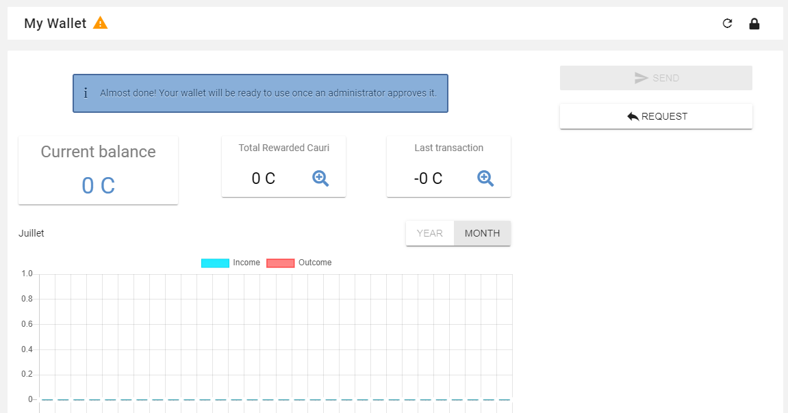
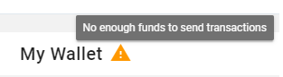

.. _UserReward:

#####################
Managing your reward
#####################

=======
Wallet
=======

General information
~~~~~~~~~~~~~~~~~~~~

Cryto-currency
A cryptocurrency (or crypto currency) is a digital asset designed to work as a medium of exchange that uses strong cryptography to secure financial transactions, control the creation of additional units, and verify the transfer of assets.

A cryptocurrency wallet is a software program that stores private and public keys and interacts with various blockchain to enable users to send and receive digital currency and monitor their balance. 
If you want to use Bitcoin or any other cryptocurrency, you will need to have a digital wallet.

How to access to Wallet interface
~~~~~~~~~~~~~~~~~~~~~~~~~~~~~~~~~

(old : To access to wallet's interface, you have to go to:)

Before creating your wallet you have to access to dedicated interface. There is three ways to display wallet's interface :

1- From your display name on the top navigation bar then "My wallet" from the drop-down menu.

|image0|

2- From your profile then "My wallet" application.

|image1|

3- From "My application" of the left navigation then "My wallet".

|image2|

How to create your wallet
~~~~~~~~~~~~~~~~~~~~~~~~~~

The first thing to do is to create your wallet by setting a password. The password must contain at least 8 caracters. 

|image3|

Once your password is set, your wallet is created but you will not be allowed to make transactions until an administrator approves it. The wallet's interface is nevertheless available and you may request funds from other users.

|image1|

The following message is displayed : " Almost done! Your wallet will be ready to use once an administrator approves it.".

A warning message appears behind the label "My wallet" 

|image5|

Wallet security
~~~~~~~~~~~~~~~~

Each wallet has a private key. It's important to save the private key of your wallet and keep it to your self following these steps :

- Click on security icon to display security popup

|image6|

- From security popup, click on "Manage keys". A new tab "Manage keys" is displayed in the popup. Click on "Back up your wallet".

|image7|

- A new popup "Backup wallet" is available with the following warnig message : *"Please make sure to keep this private key in a safe place where nobody else can get it (Write it in a piece of paper and hide it for example). 
If the following code is hacked by someone, he will be able to own all your funds."*. type your wallet password in the appropriate field then click on "Display private key"

|image8|

- Your private key is displayed in the same popup. You can save it in a piece of paper or a private and secured folder. Make sure that nobody else can access to this information.

|image9|

.. Warning:: Remember that losing your private keys means loosing all your crypto-money. You must take precautions and be very careful! Even an administrator won't be able to help you if it gets compromised or lost.

How to send funds from wallet
~~~~~~~~~~~~~~~~~~~~~~~~~~~~~

How to request funds from wallet
~~~~~~~~~~~~~~~~~~~~~~~~~~~~~~~~

Total rewarded Cauri
~~~~~~~~~~~~~~~~~~~~~

Tansactions details
~~~~~~~~~~~~~~~~~~~~

.. |image0| image:: images/reward/profile_mywallet1.png
.. |image1| image:: images/reward/profile_mywallet2.png
.. |image2| image:: images/reward/
.. |image3| image:: images/reward/create_wallet.png

.. |image6| image:: images/reward/security_popup.png
.. |image7| image:: images/reward/manage_keys.png
.. |image8| image:: images/reward/backup_password.png
.. |image9| image:: images/reward/private_key_blur.jpg

