.. _UserWallet:

#####################
Managing your wallet
#####################

=======
Wallet
=======

General information
~~~~~~~~~~~~~~~~~~~~

Cryto-currency
A cryptocurrency (or crypto currency) is a digital asset designed to work as a medium of exchange that uses strong cryptography to secure financial transactions, control the creation of additional units, and verify the transfer of assets.

A cryptocurrency wallet is a software program that uses digital encryption keys to interact with a blockchain network to enable users to send and receive digital currency and monitor their balance. 
For example, using Bitcoin or any other cryptocurrency, you need to have a digital wallet.

How to access to your Wallet interface
~~~~~~~~~~~~~~~~~~~~~~~~~~~~~~~~~

You can access your personal eXo wallet in one of the two following ways :

1- From your display name in the top navigation bar then "My wallet" from the drop-down menu.

|image0|

2- From your profile then "My wallet" application.

|image1|

How to create your wallet
~~~~~~~~~~~~~~~~~~~~~~~~~~

The first thing to do is to create your wallet by setting a password. The password must contain at least 8 characters. 

|image3|

Once your password is set, your wallet is created but you will not be allowed to make transactions until an administrator approves it. The wallet's interface is nevertheless available.

|image1|

The following message is displayed : " Almost done! Your wallet will be ready to use once an administrator approves it.".

A warning message appears behind the label "My wallet" 

|image5|

Once your wallet is approved by an administrator, you recieve a notification informing you that your wallet is activated.

|image|

All actions become available and you can send and receive funds as well as view transaction history or statistics and reward details.

It is possible to filter ...

|image|

Wallet security
~~~~~~~~~~~~~~~~

Backup your wallet
------------------

Each wallet uses a pair of public and private keys. The public key is used as the address on the blockchain network. The private key must be secured as it allows to do any operation in the blockchain account (such as stealing your funds!). Without the private key, access to the funds is impossible. Thus, it's important to secure the private key and save it in case of loss  :

- Click on the security icon to display the security popup

|image6|

- From the security popup, click on "Manage keys". A new tab "Manage keys" is displayed in the popup. Click on "Back up your wallet".

|image7|

- A new popup "Backup wallet" is available with a warning message. type your wallet password in the appropriate field then click on "Display private key"

|image8|

- Your private key is displayed in the same popup. You can save it in a piece of paper or a private and secured folder. Make sure that nobody else can access this information or you will be putting your funds at risk with absolutely no way to recover them.

|image9|

.. Warning:: Remember that losing your private keys means losing all your crypto-money. You must take precautions and be very careful! Even an administrator won't be able to help you if it gets compromised or lost.

Wallet password
----------------

You can change your wallet password by clicking on "Change password" button from security popup. You just have to type your current password and the new password and confirm the action.

|image20|

The option "Remember my password on this browser" stores your password in the browser’s local storage to be automatically used for every transaction (including purchases in the Perk Store) without requiring your input each time. 

|image21|

You must enter your current password to activate this option.

|image22|

How to send funds from wallet
~~~~~~~~~~~~~~~~~~~~~~~~~~~~~

To send funds from your wallet, you have to click on "Send" button then, in the "send funds" popup, select a recipient, your wallet password and the amount to send. You can optionally type a label and a message that will be stores in the transaction history.
You also have to choose the type of transaction between three options: "Cheap", "Normal" or "Fast". 
The difference between those types of transaction is the price and the rapidity of transaction:
 
- The cheap type is not expensive but may take up to one day to be executed.
- The recommended type is slightly more expensive and could take few hours.
- The fast type is the most expensive and take only one minute to be executed.

|image10|

How to request funds from wallet
~~~~~~~~~~~~~~~~~~~~~~~~~~~~~~~~

To request funds, you have to click on "request" button then, in the "Request funds" popup, select a recipient and the requested amount of fundq. You can optionally type a request message to the recipient.

|image11|

Total rewarded funds
~~~~~~~~~~~~~~~~~~~~~

The total rewarded number is the cumulated amount of crypto-money that you have earned as reward thanks to your different activities in the platform.
Please note that this information is different than your current balance that displays the current amount of funds that you have in your wallet.

|image12|

When you click on the plus icon next to the total rewarded, a drawer with all rewards details is displayed.

|image18|

You can see more information about a reward transaction by clicking in the corresponding line. The information about the number of gamification points earned and kudos received during the period of reward.

|image19|

Tansactions details
~~~~~~~~~~~~~~~~~~~~

The amount of the last transaction is displayed in the wallet interface.

|image13|

When you click on the plus icon next to the last transaction information, a drawer with all transactions is displayed.

|image14|

To see a transaction details (its status, label, message, amount, the sender and recipient adresses, the contact name and address, the transaction fee and hash) just click on the pull down arrow from the transaction list. 

|image15|

In case of a failed transaction, a warning is displayed in the transaction list and the transaction details. The arrow and transaction amount are displayed in red color so that you can distingish them.

|image16|

|image17|

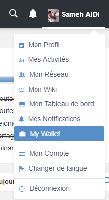
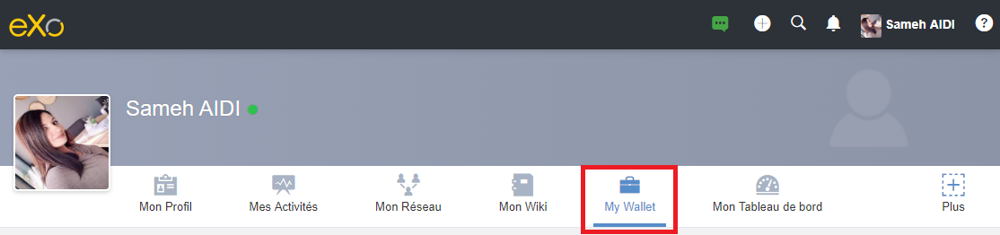
.. |image2| image:: images/reward/
.. |image3| image:: images/reward/create_wallet.png
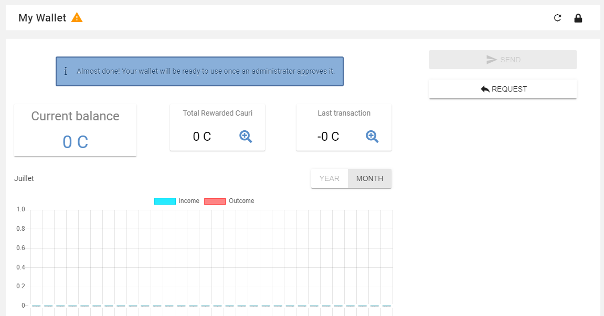
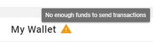
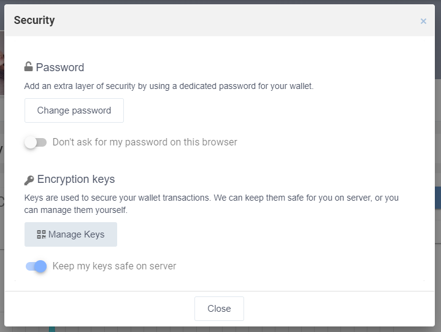
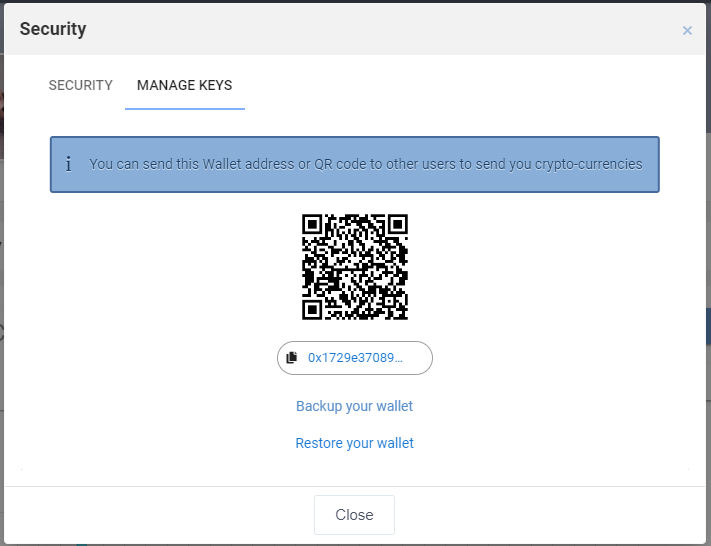
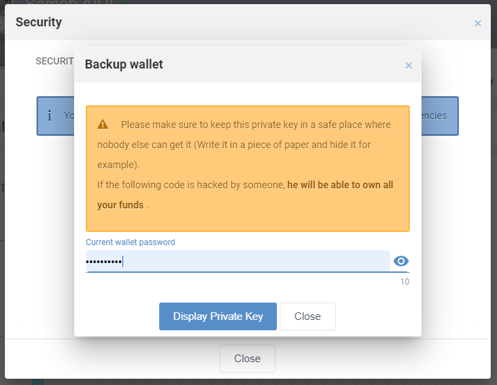
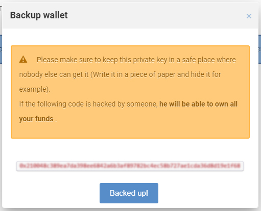
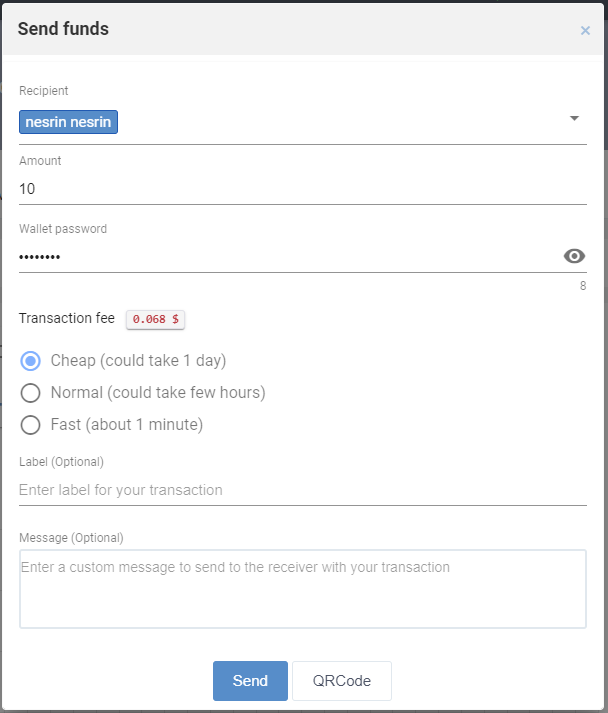
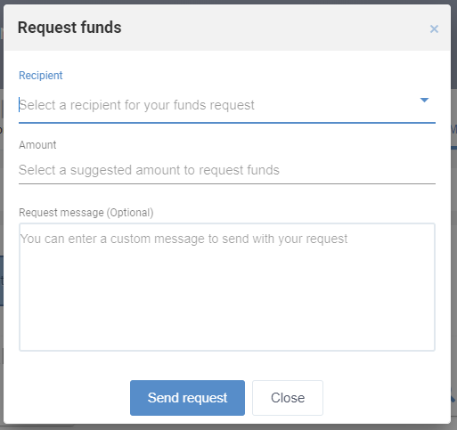
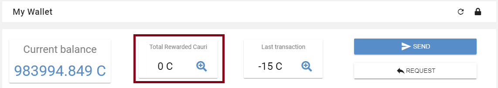
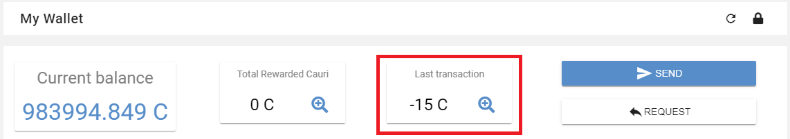
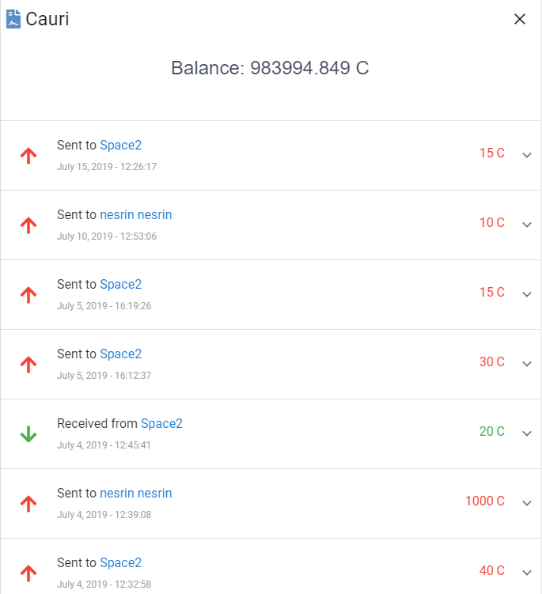
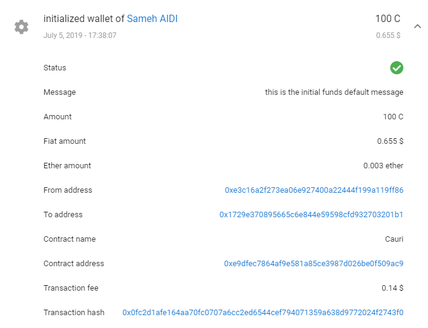
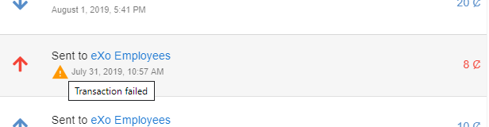
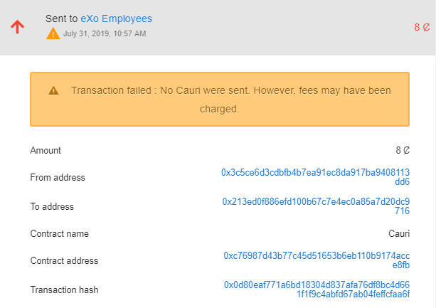
.. |image18| image:: images/reward/
.. |image19| image:: images/reward/
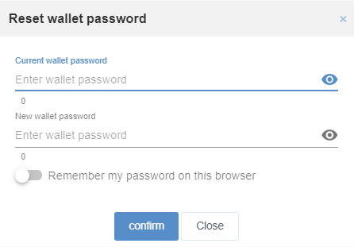
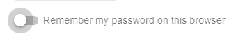
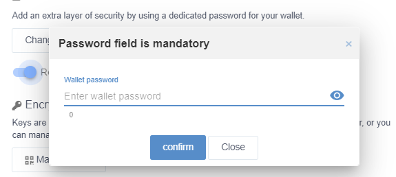

