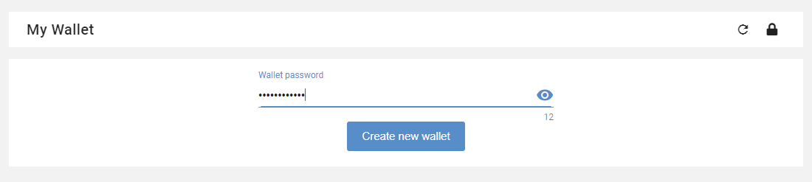

.. _UserWallet:

#####################
Managing your wallet
#####################

=======
Wallet
=======

General information
~~~~~~~~~~~~~~~~~~~~

Cryto-currency
A cryptocurrency (or crypto currency) is a digital asset designed to work as a medium of exchange that uses strong cryptography to secure financial transactions, control the creation of additional units, and verify the transfer of assets.

A cryptocurrency wallet is a software program that uses digital encryption keys to interact with a blockchain network to enable users to send and receive digital currency and monitor their balance. 
For example, using Bitcoin or any other cryptocurrency, you need to have a digital wallet.

How to access to Wallet interface
~~~~~~~~~~~~~~~~~~~~~~~~~~~~~~~~~

You can access your personal eXo wallet in one of the three following ways :

1- From your display name on the top navigation bar then "My wallet" from the drop-down menu.

|image0|

2- From your profile then "My wallet" application.

|image1|

3- From "My application" of the left navigation then "My wallet".

|image2|

How to create your wallet
~~~~~~~~~~~~~~~~~~~~~~~~~~

The first thing to do is to create your wallet by setting a password. The password must contain at least 8 characters. 

|image3|

Once your password is set, your wallet is created but you will not be allowed to make transactions until an administrator approves it. The wallet's interface is nevertheless available and you may request funds from other users.

|image1|

The following message is displayed : " Almost done! Your wallet will be ready to use once an administrator approves it.".

A warning message appears behind the label "My wallet" 

|image5|

Wallet security
~~~~~~~~~~~~~~~~

Each wallet uses a pair of public and private keys. The public key is used ad the address on the blockchain network. The private key must be secured as it allows to do any operation in the blockchain account (such as stilling your funds!). Without the private key, access to the funds is impossible. Thus, it's important to secure the private key and save in case of loss  :

- Click on security icon to display security popup

|image6|

- From security popup, click on "Manage keys". A new tab "Manage keys" is displayed in the popup. Click on "Back up your wallet".

|image7|

- A new popup "Backup wallet" is available with the following warnig message : *"Please make sure to keep this private key in a safe place where nobody else can get it (Write it in a piece of paper and hide it for example). 
If the following code is hacked by someone, he will be able to own all your funds."*. type your wallet password in the appropriate field then click on "Display private key"

|image8|

- Your private key is displayed in the same popup. You can save it in a piece of paper or a private and secured folder. Make sure that nobody else can access this information or you will be putting your funds at risk with absolutely no way to recover them.

|image9|

.. Warning:: Remember that losing your private keys means losing all your crypto-money. You must take precautions and be very careful! Even an administrator won't be able to help you if it gets compromised or lost.

How to send funds from wallet
~~~~~~~~~~~~~~~~~~~~~~~~~~~~~

To send funds from your wallet, you have to click on "Send" button then, in the "send funds" popup, select a recipient, your wallet password and the amount to send. You can optionally type a label and a message that will be stores in the transaction history.
You also have to choose the type of transaction between three options: "Cheap", "Normal" or "Fast". 
The difference between those types of transaction is the price and the rapidity of transaction: 
- The cheap transactions are not expensive but may take up to one day to be executed.
- The normal transactions are slightly more expensive and could take few hours
- The fast transaction are the most expensive take only one minute to be executed.

|image10|

How to request funds from wallet
~~~~~~~~~~~~~~~~~~~~~~~~~~~~~~~~

To request funds, you have to click on "request" button then, in the "Request funds" popup, select a recipient and the requested amount of fundq. You can optionally type a request message to the recipient.

|image11|

Total rewarded funds
~~~~~~~~~~~~~~~~~~~~~

The displayed information total rewarded cauris give you the information about the accrued amount of crypto-money that you earned thanks to your different activities in the platform.
Please note that this information is different than your current balance that displays the current amount of funds that you have in your wallet.

|image12|

Tansactions details
~~~~~~~~~~~~~~~~~~~~

The amount of the last transaction is displayed in wallet interface 

|image13|

When you click on the plus icon next to the last transaction information, a drawer with all transactions is displayed 

|image14|

To see a transaction details (its status, label, message, amount, the sender and recipient adresses, the contact name and address, the transaction fee and hash) you only have to click on the pull down arrow from the transaction list. 

|image15|

.. |image0| image:: images/reward/profile_mywallet1.png
.. |image1| image:: images/reward/profile_mywallet2.png
.. |image2| image:: images/reward/

.. |image4| image:: images/reward/created_wallet.png
.. |image5| image:: images/reward/warning_funds.png
.. |image6| image:: images/reward/security_popup.png
.. |image7| image:: images/reward/manage_keys.png
.. |image8| image:: images/reward/backup_password.png

.. |image10| image:: images/reward/send_funds.png
.. |image11| image:: images/reward/request_funds.png
.. |image12| image:: images/reward/rewarded_cauris.png

.. |image14| image:: images/reward/transactions_list.png

