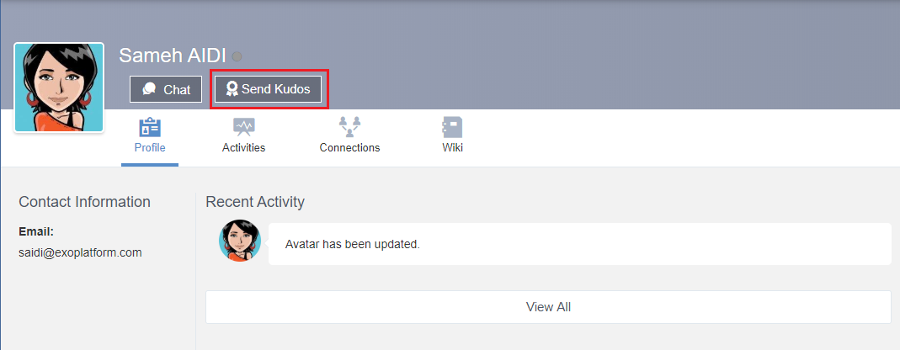
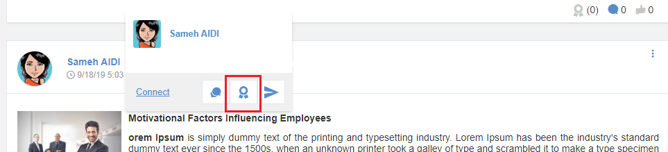
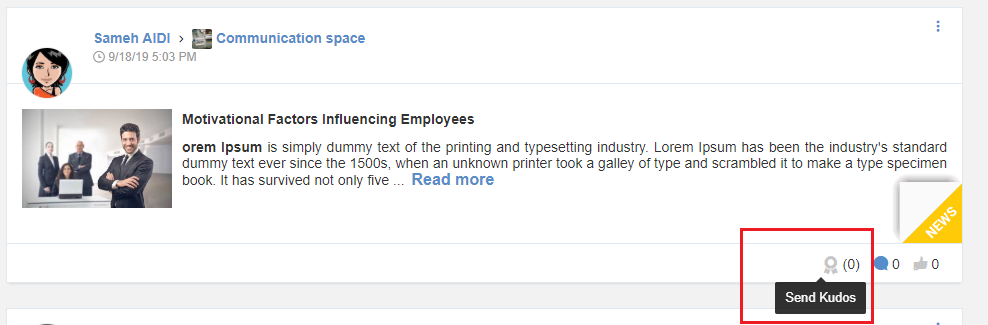
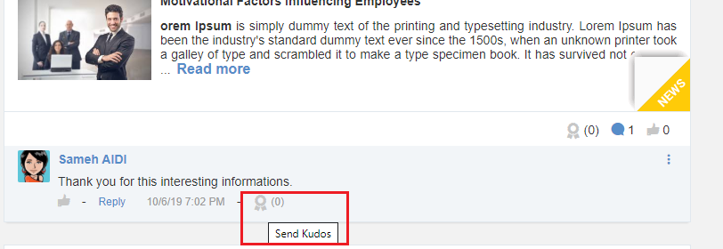
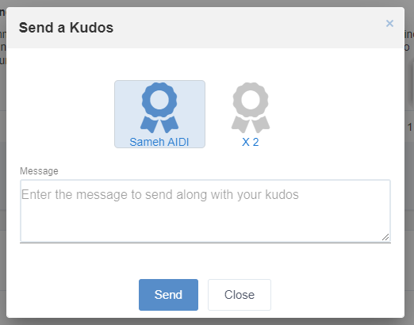
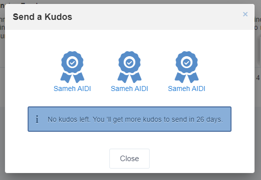

.. _UsingKudos:

############
Using Kudos
############

General information about kudos
~~~~~~~~~~~~~~~~~~~~~~~~~~~~~~~~

You can express your recognition to your colleagues by sending them kudos when you want to thank them for their help, contributions or good work.
You have a limited number of kudos to send per period of time (week, month or quarter). 

Kudos to send expire at the end of the period if you didn’t send them. Also, they can’t be cumulated with kudos you received. Thus, you can’t keep kudos for yourself they are give-only tokens of recognition.
Both the number of kudos and periodicity are determined by the administrator of the platform.

The receiver may be rewarded for the kudos he received if the administrator has enabled and configured the Kudos rewarding program. 

How to send kudos
~~~~~~~~~~~~~~~~~~

You can send kudos from the following locations:

- The user profile

|image0|

- The popover of user from different activities

|image1|

- An activity posted by the user

|image2|

- A comment posted by the user 

|image3|

When you click on the icon to send a kudos, a popover is displayed containing the details of the kudos you already sent during the current period and the number of remaining kudos.
When sending a kudos, you must leave a message so you can tell the reason for this kudos:

|image4|

If you have no kudos left for the current period, a warning message will be displayed in the popover as well as the information about the kudos you already sent.

|image5|

