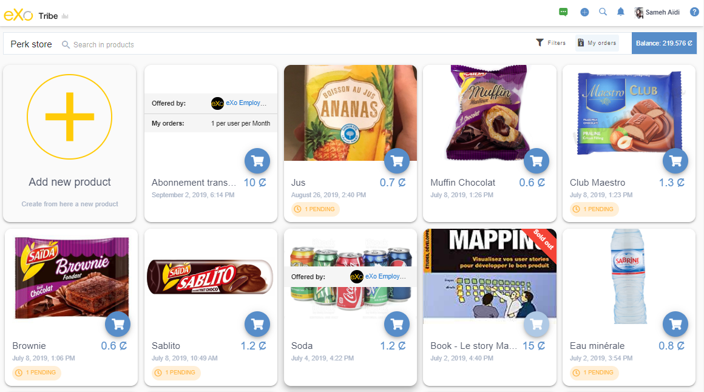
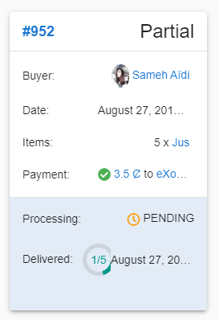
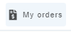
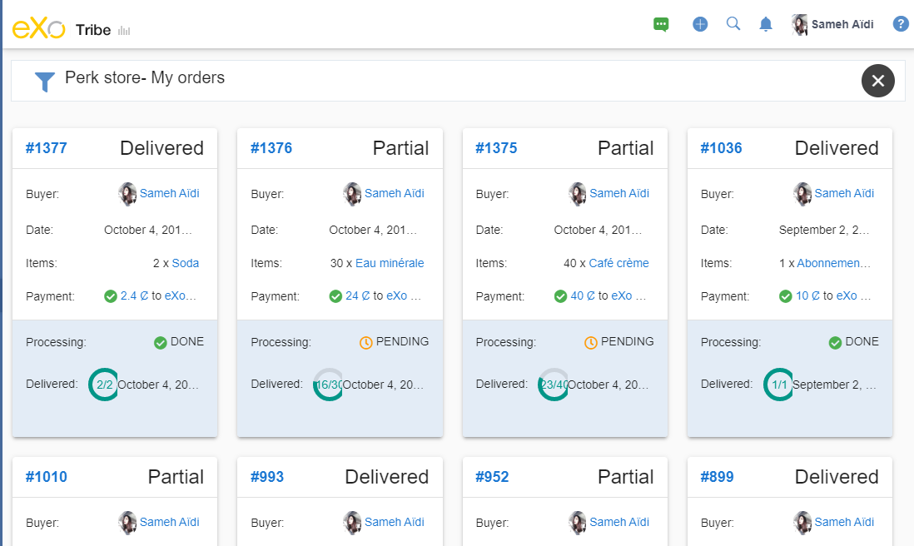
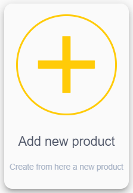
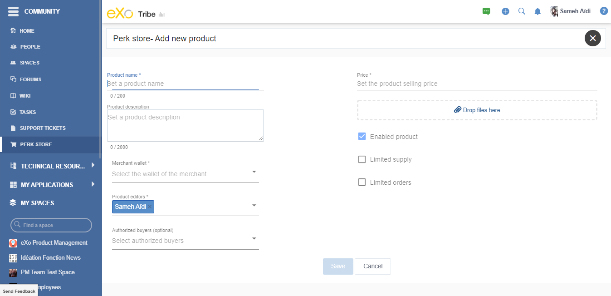
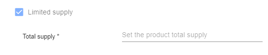
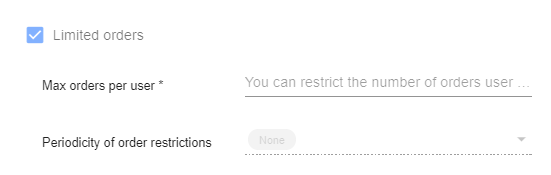

.. _UsingPerkStore:

####################
Using the Perk Store
####################

The perkstore is an online store available in the platform. 
You are able to buy the available products or sell goods or services using the cauris as a currency.

How to access to Perk Store
~~~~~~~~~~~~~~~~~~~~~~~~~~~

You can access to Perk Store from the main navigation. By clicking on the shopping cart icon, you will see all the products available for you in the store.
You can see your wallet balance in the toolbar as well as a search bar and a filter button that allow you to look for a specific product.

|image0|

You can filter the display of articles by:
- Disable products
- Soldout products
- Created by me

You can see more details about a product by clicking on its title. You can buy the product from this view as well as the perkstore view.

|image1|

How to buy a product and display your orders
~~~~~~~~~~~~~~~~~~~~~~~~~~~~~~~~~~~~~~~~~~~~~

To buy a product you are interested in, you have to click on the appropriate button |image2| then specify the number of the items to purchase as well as your wallet password if it is not saved in the browser you are using.

|image3|

After buying the product, You recieve a notification when your order is totally or partially delivered.

|image4|

In the perkstore view a new mention "1 pending" is available for you in the purchased product's card 

|image5|

You can see your order details for this product by clicking in this button.

|image6|

To see all orders you can click on "My orders" button from the toolbar of perkstore.

|image7|

|image8|

How to create a product
~~~~~~~~~~~~~~~~~~~~~~~

If you are allowed to create products from perkstore, you will see the creation card as the first card displayed in the interface. 

|image9|

By clicking on it, the creation form is displayed.

|image10|

You have to fill in the mandatory fields which are:
- The name of the product, 
- The sell price: The product's price in token currency value
- The merchant wallet: The user's or space's wallet that will receive the funds when the product is purchased, and
- The product editor: This field is automatically pre-loaded with the current user account and you have the possibilityto change this.

You can also optionnaly upload images, add a description of the product and select authorized buyers (users or spaces members).
You may also specify a stock limit and to restrict the number of purchased items by user and per periodicity.

|image11|

|image12|

Once your product is sold, you will recieve a notification.

|image13|

You can inspect your clients orders by clicking on the notification or by clicking on the following icon |image14| from the Perk Store interface.
The order is displayed and contains information about the sold article(s) as well as a delivery and a refund buttons.

|image15|

.. |image1| image:: images/reward/product_details.png

.. |image3| image:: images/reward/purchase_popup.png
.. |image4| image:: images/reward/delivery_notification.png
.. |image5| image:: images/reward/order_mention.png

.. |image13| image:: images/reward/sell_notification.png
.. |image14| image:: images/reward/delivery_icon.png
.. |image15| image:: images/reward/client_order.png

