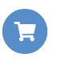
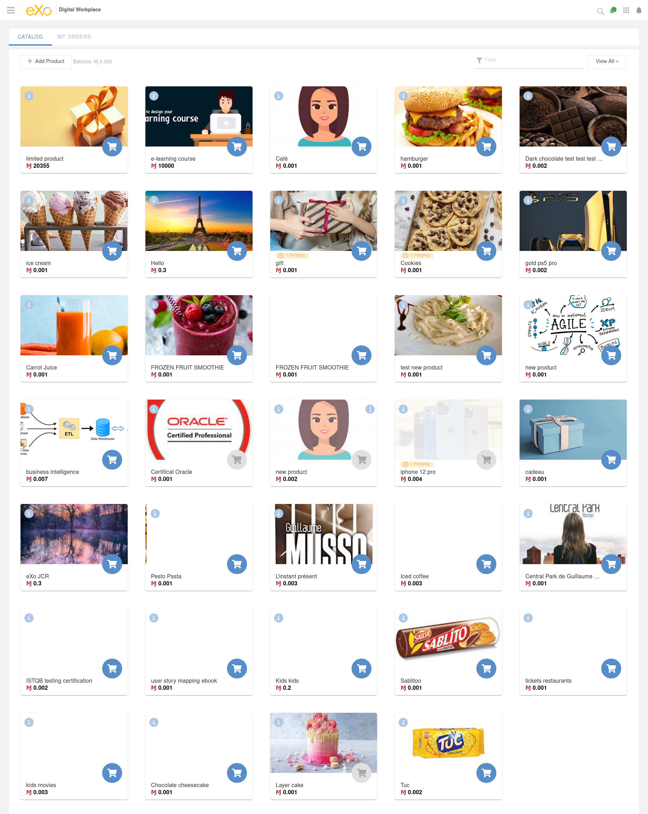
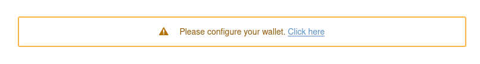
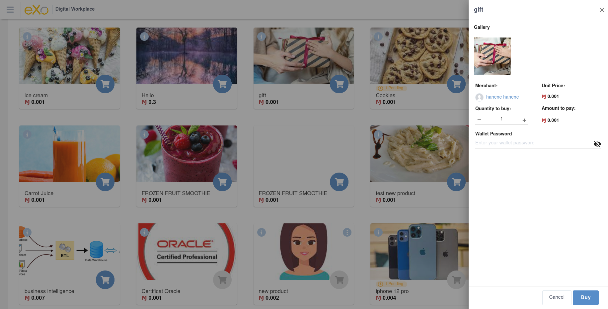
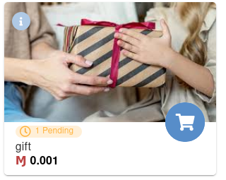
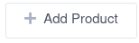
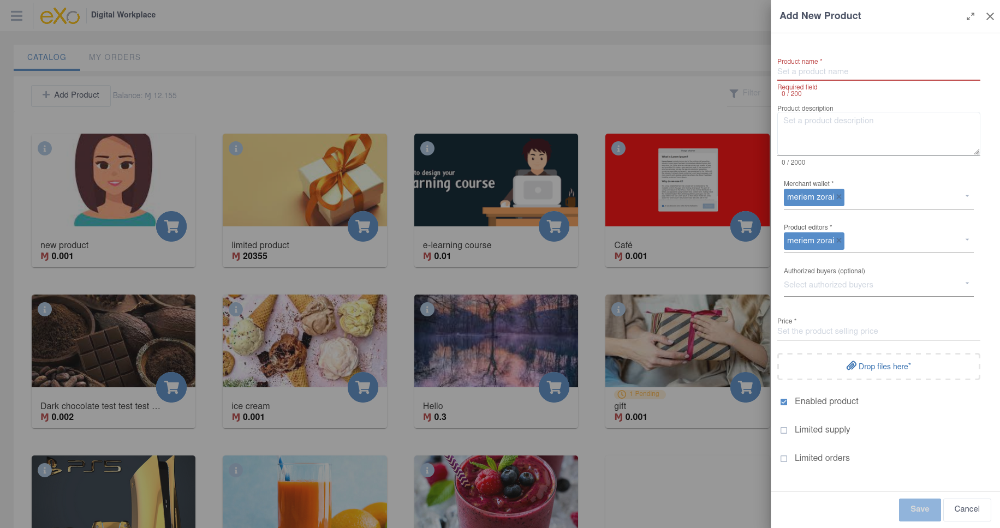
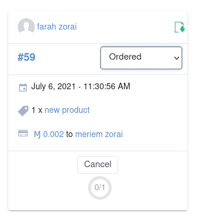
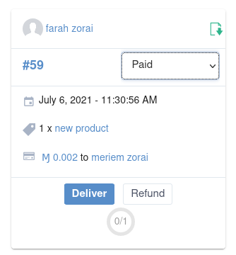

.. _UsingPerkStore:

####################
Using the Perk Store
####################

The Perk Store is a digital store available in the platform where users can purchase, with their earned funds, perks or any goods your organization wants to offer. 
It’s a full-featured marketplace where users can buy, and even sell products with the tokens stored in their wallet as the digital currency.

.. _buyProduct:

How to buy a product from the perk store?
~~~~~~~~~~~~~~~~~~~~~~~~~~~~~~~~~~~~~~~~~~~

You are a platform user and want to benefit from products proposed in the perk store? You just need to follow these steps:

-  Go to the perk store through the application center => You'll be redirected to the perk store's catalog where you can display the proposed perks

   |image1|
   
-  If you have already an initialized wallet, then go to step 3 otherwise click on the message in the top of the catalog inviting to configure your wallet and follow steps of :ref:`this section <configureWallet>`
   
   |image2|
   
-  Choose the product you want to buy and click on the purchase icon |image0| or whenever in the inferior part of the product's card => a full preview of the product will be displayed in a drawer for more details about it: images, the merchant of the product ...
   
   |image3|
   
-  Select the quantity to buy and then type your wallet password in the corresponding field

-  Click on "Buy" button => The product's merchant will be notified of your order which is in the "Pending" status and will proceed to the delivery, check the section :ref:`orders delivery <deliverProduct>` for more details
   
   |image4|
   
-  When the product's merchant delivers you, the pending status disappears and you can get your order   

.. _SellProduct:

How to sell a product from the perk store?
~~~~~~~~~~~~~~~~~~~~~~~~~~~~~~~~~~~~~~~~~~~

Now you need to propose products and gain from the perk store, here are the needed steps:

-  Go to the perk store application and then click on "Add product" button

   |image5|

-  Fill in the fields, and then click save. Note that there are some mandotory fields to enable the "Save" button, more details below => Your product will be listed among other products in the perk store.
    
   |image6|

.. note:: Mandatory fields for product creation are the following: Product name, price, at least an image, merchant wallet and product editors. The last two fields i.e. merchant wallet and product editors are set by default to your account as you are the product's creator.
          
-  When an another user clicks to buy your product following the steps of :ref:`buying a product <buyProduct>`, you receive a notification, clicking on it redirects you to the order's CARD in the "Ordered" status
    
    |image7|
    
-  When the transaction is well passed, then the order's status moves to "Paid" and you can so proceed to the delivery by clicking on "Deliver" button to buy the product or you can click on "Refund" to give back the money to the buyer and not proceed to the product's sell      
    
   |image8| 

.. _configureWallet:

How to configure your wallet?
~~~~~~~~~~~~~~~~~~~~~~~~~~~~~~

*section to come later*

